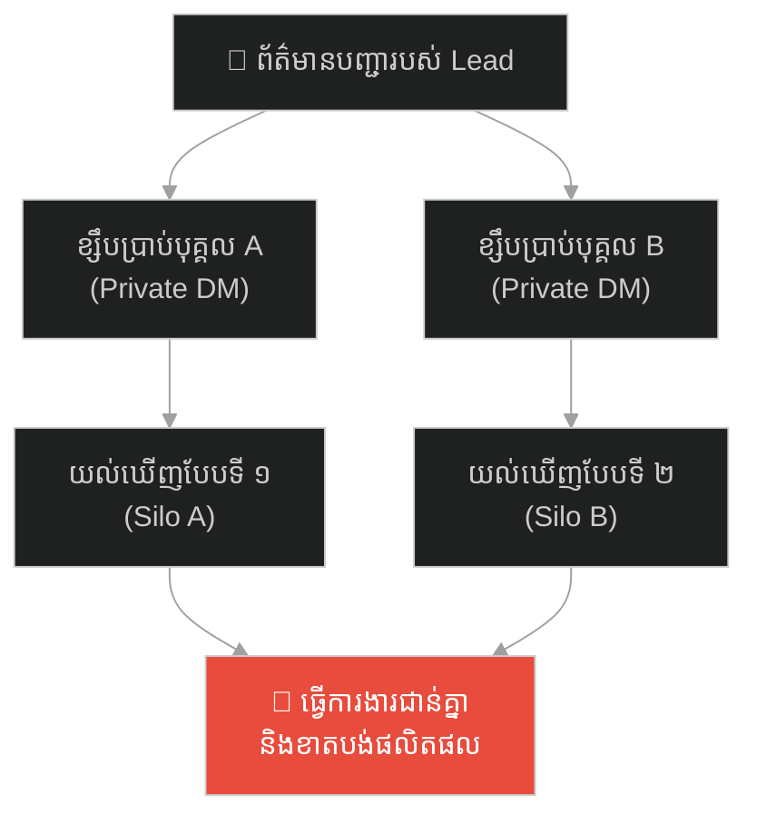
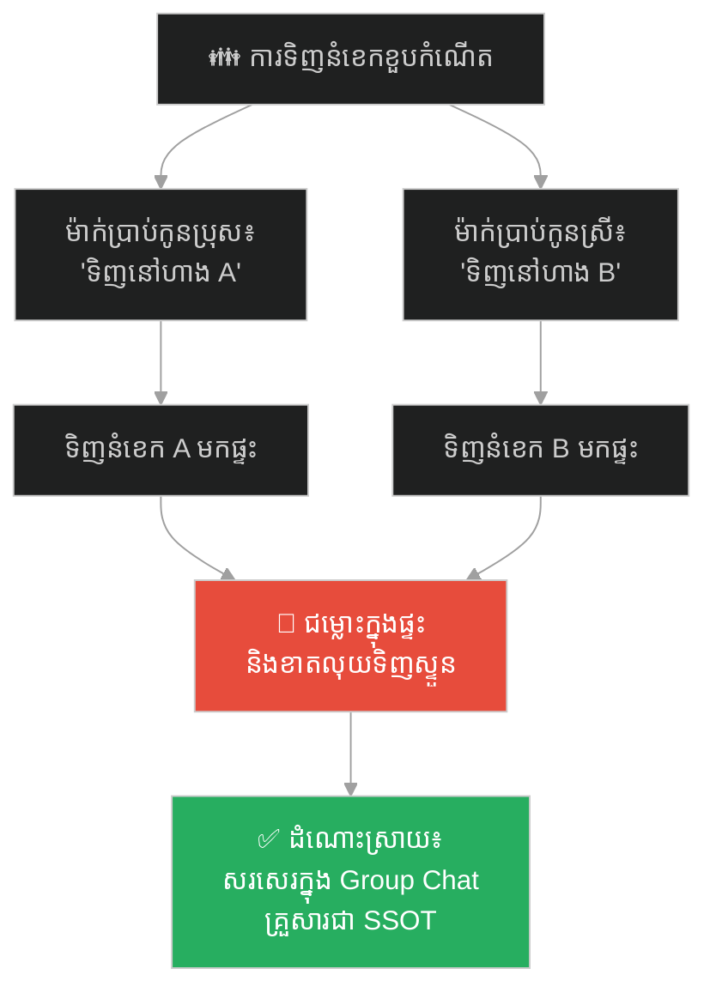
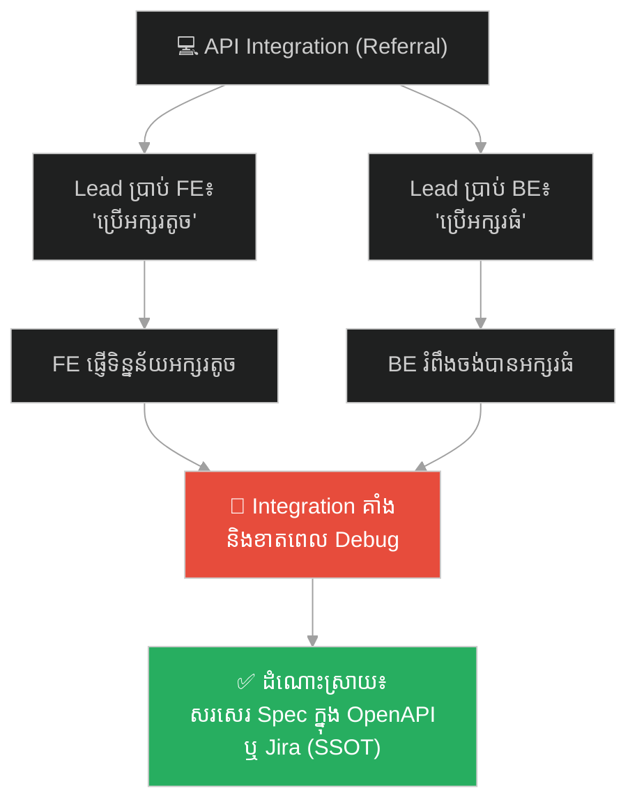
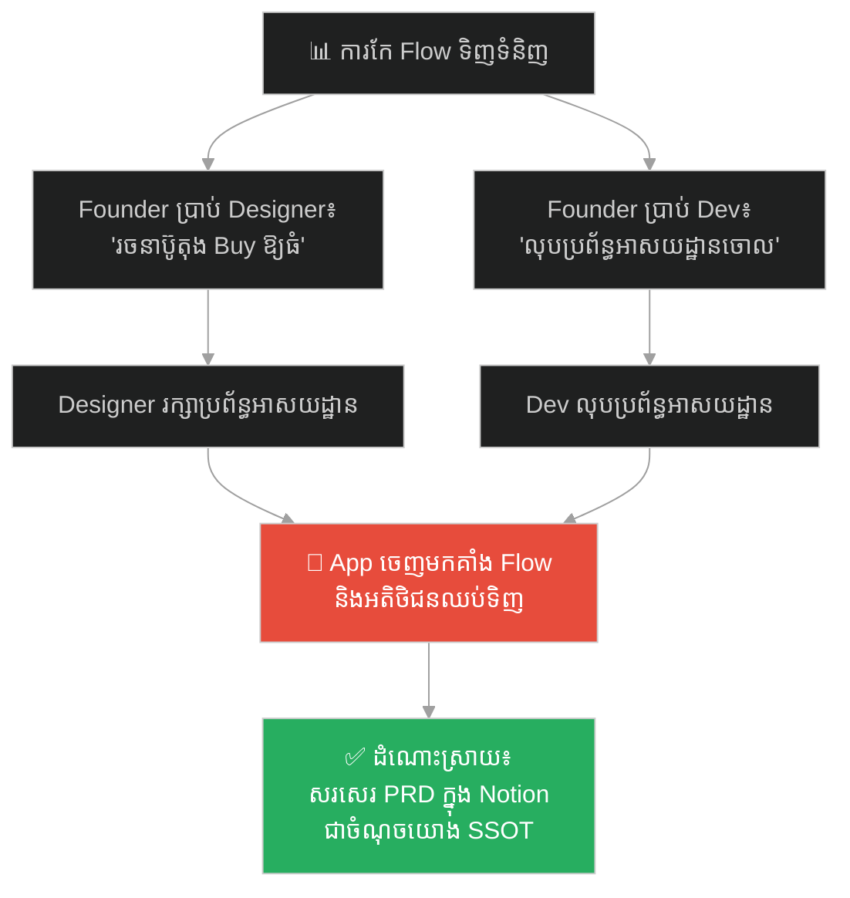
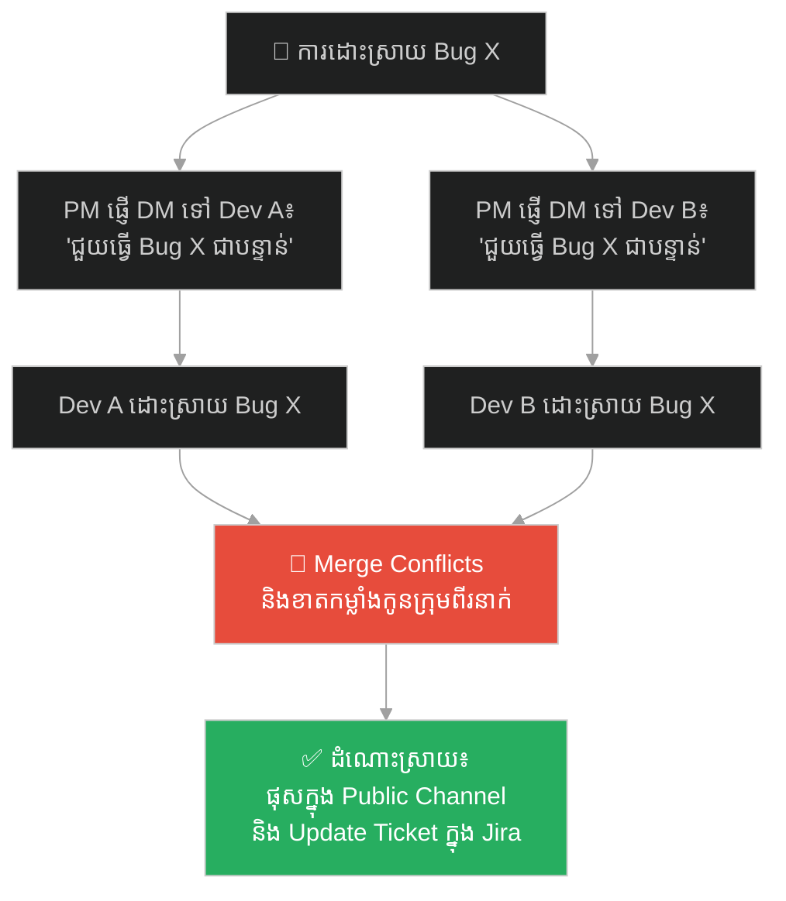
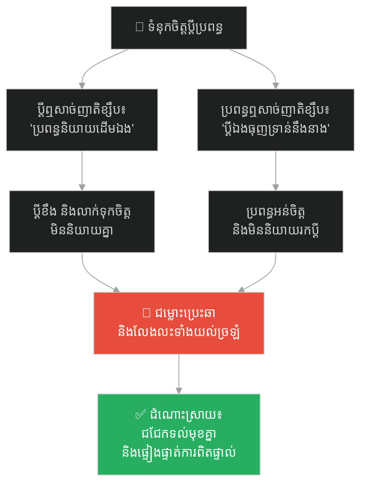
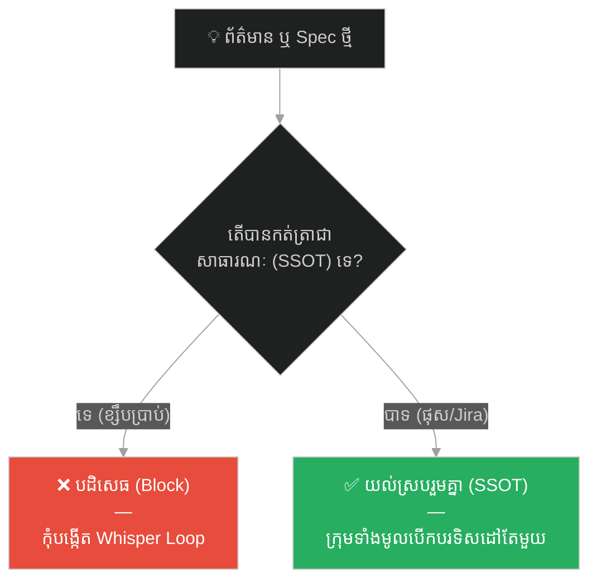

# The Master Navigator and the Hidden Star Chart (មេនាវា និងផែនទីតារាដែលលាក់កំបាំង)៖ គ្រោះថ្នាក់នៃវប្បធម៌ខ្សឹបតគ្នា និងសារៈសំខាន់នៃ Single Source of Truth

**Author:** ichamrong  
**Date:** 2026-05-27  
**Tags:** #single-source-of-truth #knowledge-silos #whisper-culture #project-management #documentation #agile #communication  
**Category:** Concepts / Parables  
**Read Time:** ~15 min  

---

## 📌 មាតិកា (Table of Contents)
- [អន្ទាក់ផ្លូវចិត្ត (The Trap)](#អន្ទាក់ផ្លូវចិត្ត-the-trap)
- [១. រឿងព្រេង៖ មេនាវា បាលធីហ្សា និងនាវាសមុទ្រមាស (The Legend of Balthazar and the Golden Sea)](#1)
  - [ផែនទីនៅក្នុងខួរក្បាល និងវប្បធម៌ខ្សឹបតគ្នា (The Brain Map & Whisper Culture)](#1-1)
  - [ព្យុះសង្ឃរា និងសោកនាដកម្មកណ្តាលសមុទ្រ (The Tempest & Tragedy)](#1-2)
- [២. បញ្ហា៖ វប្បធម៌ខ្សឹបតគ្នា និងការរៀបចំគម្រោងគ្មានប្រភពព័ត៌មានរួម (The Issue: Whisper Culture & Missing SSOT)](#2)
- [៣. ឧទាហរណ៍ជាក់ស្តែងក្នុងពិភពពិត (Real World Examples)](#3)
  - [ឧទាហរណ៍ទី ១ — កម្រិតស្រាល (គ្រួសារ)៖ ការចាត់ចែងការងារផ្ទះតាមការខ្សឹបប្រាប់ផ្សេងគ្នា (The Family Whisper Tasks)](#3-1)
  - [ឧទាហរណ៍ទី ២ — កម្រិតមធ្យម (បច្ចេកទេស)៖ Spec Feature របស់ Tech Lead ប្រាប់មាត់ទទេ (The Spec-in-Head Tech Lead)](#3-2)
  - [ឧទាហរណ៍ទី ៣ — កម្រិតមធ្យម (ធុរកិច្ច)៖ Product Requirements គ្មានឯកសារច្បាស់លាស់ (The Verbal-Only Product Requirements)](#3-3)
  - [ឧទាហរណ៍ទី ៤ — កម្រិតមធ្យម (សង្គម/គ្រប់គ្រង)៖ ការគ្រប់គ្រងគម្រោងតាមរយៈការផ្ញើសារឯកជន (PM via Private Slack Messages)](#3-4)
  - [ឧទាហរណ៍ទី ៥ — កម្រិតធ្ងន់ (ទំនាក់ទំនង)៖ ការសន្និដ្ឋានលើពាក្យសម្តីតៗគ្នាគ្មានការផ្ទៀងផ្ទាត់ (The Rumor Loop in Relationships)](#3-5)
- [៤. ដំណោះស្រាយទូទៅ៖ ការកសាង Single Source of Truth និងការប្រាស្រ័យទាក់ទងជាសាធារណៈ (The General Solution: Public Channels & SSOT)](#4)
- [សេចក្តីសន្និដ្ឋាន (Conclusion)](#conclusion)
- [ឯកសារយោង (References)](#references)
- [Related Posts](#related-posts)

---

## អន្ទាក់ផ្លូវចិត្ត (The Trap)

តើអ្នកធ្លាប់ជួបស្ថានភាពដែលប្រព័ន្ធការងារទាំងមូលមានភាពច្របូកច្របល់ គម្រោងដើរខុសទិសដៅ ឬកូនក្រុមធ្វើការជាន់គ្នាមិនឈប់ឈរ គ្រាន់តែដោយសារតែព័ត៌មានត្រូវបានចែករំលែកជាលក្ខណៈបុគ្គល ឬខ្សឹបប្រាប់តៗគ្នាដែរឬទេ?

នៅក្នុងរចនាសម្ព័ន្ធគ្រប់គ្រងជាច្រើន យើងតែងតែឃើញ៖
* **មេដឹកនាំ ឬអ្នកគ្រប់គ្រង** ចូលចិត្តដើរប្រាប់កិច្ចការងារទៅកាន់មនុស្សម្នាក់ៗដាច់ដោយឡែកពីគ្នា តាមរយៈការនិយាយផ្ទាល់មាត់ ឬសារឯកជន (Private DMs)។
* **កូនក្រុម** យល់ដឹងពីគោលដៅគម្រោងខុសៗគ្នា និងបង្កើតប្រព័ន្ធការងារដែលមិនស៊ីចង្វាក់គ្នា (Fragmented Reality)។

នៅពេលក្រុមការងារមួយគ្មាន **ប្រភពព័ត៌មានរួមតែមួយ (Single Source of Truth - SSOT)** ពួកគេកំពុងធ្លាក់ចូលទៅក្នុងអន្ទាក់ដ៏បំផ្លិចបំផ្លាញមួយហៅថា **វប្បធម៌ខ្សឹបតគ្នា (Whisper Culture Trap)**។

ដើម្បីយល់ដឹងពីវិធីកសាងការប្រាស្រ័យទាក់ទងប្រកបដោយតម្លាភាព នេះជាផែនទីបង្ហាញផ្លូវសម្រាប់អត្ថបទនេះ៖
1. **រឿងព្រេង (The Historic Legend)** — រឿងរ៉ាវនាវាពាណិជ្ជកម្ម «សមុទ្រមាស» ដែលលិចលង់កណ្តាលព្យុះ ព្រោះតែមេនាវាលាក់ផែនទីផ្កាយទុកតែក្នុងក្បាល និងប្រើវិធីខ្សឹបបញ្ជា។
2. **បញ្ហា (The Issue)** — ផលប៉ះពាល់នៃការប្រាស្រ័យទាក់ទងបែកបាក់ និងការយល់ឃើញផ្សេងគ្នារបស់កូនក្រុម។
3. **ឧទាហរណ៍ជាក់ស្តែងក្នុងពិភពពិត (Real World Examples)** — ពិនិត្យមើលឥទ្ធិពលនៃ Whisper Culture ក្នុងកម្រិតគ្រួសារ ការងារបច្ចេកទេស ធុរកិច្ច ការគ្រប់គ្រង និងទំនាក់ទំនងស្នេហា។
4. **ដំណោះស្រាយទូទៅ (The General Solution)** — ការផ្លាស់ប្តូរទៅកាន់ប្រព័ន្ធ SSOT និងការប្រាស្រ័យទាក់ទងជាសាធារណៈ (Public Channels)។

---

## ១. រឿងព្រេង៖ មេនាវា បាលធីហ្សា និងនាវាសមុទ្រមាស (The Legend of Balthazar and the Golden Sea)

នៅក្នុងសតវត្សទី១៦ មាននាវាពាណិជ្ជកម្មដ៏ធំមួយឈ្មោះថា **«សមុទ្រមាស» (The Golden Sea)** ដែលធ្វើដំណើរឆ្លងកាត់មហាសមុទ្រដ៏គ្រោះថ្នាក់ ដើម្បីដឹកជញ្ជូនគ្រឿងទេស និងសូត្រ។ នៅលើនាវានេះ មានកាពីតែនម្នាក់ដែលទទួលខុសត្រូវលើបញ្ជាការរួម ប៉ុន្តែជោគវាសនានៃការបង្វែរទិសដៅ និងការរុករកផ្លូវទឹក គឺពឹងផ្អែកទាំងស្រុងទៅលើ **មេនាវា (Master Navigator)** ម្នាក់ឈ្មោះ **បាលធីហ្សា (Balthazar)**។

បាលធីហ្សា គឺជាមនុស្សតែម្នាក់គត់ដែលចេះអានគន្លងតារា និងដឹងពីទីតាំងថ្មប៉ប្រះទឹកនៅក្នុងមហាសមុទ្រ។ ប៉ុន្តែគាត់មានទម្លាប់មិនល្អមួយ គឺគាត់ **មិនដែលគូរផែនទីផ្លូវទឹក (Star Chart) ទុកនៅលើតុរបស់កាពីតែនឡើយ**។ គាត់រក្សាព័ត៌មាន និងចំណេះដឹងទាំងអស់នៅក្នុងខួរក្បាលរបស់គាត់តែម្នាក់ឯង។ 

នៅពេលដែលកាពីតែនសួរថា៖ 
> *«បាលធីហ្សា! ហេតុអ្វីបានជាអ្នកមិនគូរផែនទីនេះទុកនៅលើតុរួម ដើម្បីឱ្យកូនទូកអាចរៀនសូត្រ និងដឹងទិសដៅផង?»*

បាលធីហ្សា តែងតែឆ្លើយដោយមោទនភាព និងអំនួតថា៖ 
> *«ក្រាបទូលកាពីតែន! ផ្ទៃសមុទ្រ និងទិសដៅខ្យល់ប្រែប្រួលរាល់វិនាទី! ការគូរផែនទីទុកនៅលើក្រដាស គឺជារឿងឥតប្រយោជន៍ និងយឺតយ៉ាវណាស់។ ក្រដាសអាចមានកំហុស តែខួរក្បាល និងបទពិសោធន៍ផ្ទាល់របស់ខ្ញុំទើបជាការពិតជាក់ស្តែង!»*

---

### ផែនទីនៅក្នុងខួរក្បាល និងវប្បធម៌ខ្សឹបតគ្នា (The Brain Map & Whisper Culture)

តាមការពិត ការមិនគូរផែនទី និងមិនកត់ត្រាទុក មិនមែនដោយសារតែក្រដាសគ្មានប្រយោជន៍នោះឡើយ។ វាគឺជាកលល្បិចយុទ្ធសាស្ត្ររបស់ បាលធីហ្សា ដើម្បីរក្សាអំណាច និងធ្វើឱ្យខ្លួនគាត់ក្លាយជាមនុស្សដែលមិនអាចខ្វះបាន (Toxic Job Security)។ គាត់ចង់ឱ្យមនុស្សគ្រប់គ្នានៅលើទូក ត្រូវតែពឹងផ្អែក គោរព និងខ្លាចរអាក្រែងគាត់ជានិច្ច។

ដើម្បីគ្រប់គ្រងទូកទាំងមូល បាលធីហ្សា បានបង្កើត **វប្បធម៌ខ្សឹបតគ្នា (Whisper Culture)** ដោយដើរខ្សឹបបញ្ជាកូនក្រុមដាច់ដោយឡែកពីគ្នា៖
* គាត់ដើរទៅខ្សឹបប្រាប់អ្នកកាន់ចង្កូតទូកថា៖ *«យប់នេះត្រូវបត់ទៅឆ្វេង ១០ ដឺក្រេ ព្រោះមានខ្សែទឹកហូរខ្លាំងពីខាងស្តាំ»*។
* គាត់ដើរទៅខ្សឹបប្រាប់អ្នកបញ្ជាក្តោងថា៖ *«ត្រៀមទម្លាក់ក្តោងចុះពាក់កណ្តាល ព្រោះយើងជិតបត់ទៅខាងស្តាំហើយ»*។
* គាត់ដើរទៅប្រាប់កាពីតែនថា៖ *«យប់នេះយើងនឹងបើកទៅត្រង់ទៅទិសខាងកើត»*។

នៅពេលដែលអ្នកបញ្ជាក្តោង និងអ្នកកាន់ចង្កូតទូក ធ្វើការមិនស៊ីចង្វាក់គ្នា ហើយធ្វើឱ្យនាវាវិលវល់ បាលធីហ្សា នឹងដើរមកស្រែកស្តីបន្ទោសពួកគេជាសាធារណៈថា៖ *«ពួកឯងនេះល្ងង់ខ្លៅណាស់! មិនចេះមើលទិសដៅខ្យល់ និងទឹកសោះ! បើគ្មានខ្ញុំជួយតម្រង់ទិសទាន់ពេលទេ ទូកនេះច្បាស់ជាលិចបាត់យូរហើយ!»*។ ទង្វើបែបនេះបានធ្វើឱ្យគាត់ក្លាយជា «វីរបុរស» ជានិច្ចនៅក្នុងក្រសែភ្នែករបស់កាពីតែន ទោះបីជាភាពច្របូកច្របល់ទាំងអស់ កើតឡើងដោយសារតែគាត់មិនព្រមប្រាប់ផែនទីរួមគ្នាក៏ដោយ។

---

### ព្យុះសង្ឃរា និងសោកនាដកម្មកណ្តាលសមុទ្រ (The Tempest & Tragedy)

ថ្ងៃមួយ នាវា *«សមុទ្រមាស»* បានជួបប្រទះនឹងព្យុះសង្ឃរាដ៏ធំមួយនៅកណ្តាលមហាសមុទ្រងងឹត។ ក្នុងពេលដែលរលកបោកបក់យ៉ាងខ្លាំង បាលធីហ្សា ដែលកំពុងឈរនៅលើដំបូលទូកបញ្ជាទិសដៅ ស្រាប់តែត្រូវរលកយក្សបោកបោកក្បាលទៅនឹងក្តារទូក បណ្តាលឱ្យសន្លប់បាត់ស្មារតីឈាមហូរពេញមុខ មិនអាចដឹងខ្លួនបាន។

ដោយគ្មានមេនាវាចាំខ្សឹបបញ្ជាទិសដៅ ភាពវឹកវរដ៏ធំបំផុតក៏បានផ្ទុះឡើងនៅលើនាវា៖
* កាពីតែន ស្រែកបញ្ជាឱ្យបើកទៅត្រង់ តាមអ្វីដែលបាលធីហ្សាធ្លាប់ប្រាប់គាត់កាលពីល្ងាច។
* អ្នកកាន់ចង្កូត ប្រឹងបត់ទៅឆ្វេងយ៉ាងខ្លាំង ព្រោះខ្លាចបុកថ្មប៉ប្រះទឹកតាមព័ត៌មានដែលធ្លាប់ត្រូវគេខ្សឹបប្រាប់ពីមុន។
* អ្នកបញ្ជាក្តោង បែរជាទម្លាក់ក្តោងចុះទាំងអស់ ព្រោះគិតថាទូកជិតបត់ទៅស្តាំ។

ដោយសារតែព័ត៌មានបែកបាក់គ្នា កូនក្រុមម្នាក់ៗយល់ផ្សេងៗគ្នា ហើយគ្មានផែនទីផ្កាយរួម (No Single Source of Truth) សម្រាប់សម្លឹងមើល និងផ្ទៀងផ្ទាត់ទិសដៅរួមគ្នានោះ នាវាមិនអាចទប់ទល់នឹងកម្លាំងរលកបានឡើយ។ ទីបំផុត នាវាពាណិជ្ជកម្មដ៏ប្រណីតបានបុកនឹងផ្ទាំងថ្មប៉ប្រះទឹកធំបែកខ្ទេច និងលិចចូលទៅក្នុងបាតសមុទ្រងងឹតសូន្យឈឹង ដោយបន្សល់ទុកតែភាពសោកសៅ។

---

## ២. បញ្ហា៖ វប្បធម៌ខ្សឹបតគ្នា និងការរៀបចំគម្រោងគ្មានប្រភពព័ត៌មានរួម (The Issue: Whisper Culture & Missing SSOT)

នៅក្នុងចិត្តវិទ្យាគ្រប់គ្រង និងការអភិវឌ្ឍគម្រោង (Project Management) បាតុភូតនេះឆ្លុះបញ្ចាំងពីការបែកបាក់ប្រព័ន្ធព័ត៌មាន (Information Fragmentation)។ នៅពេលដែលអ្នកគ្រប់គ្រង ឬសមាជិកក្រុម មិនព្រមសរសេរឯកសារណែនាំ ឬ Requirement ឱ្យច្បាស់លាស់ តែប្រើប្រាស់ការផ្ញើសារឯកជន ឬការខ្សឹបប្រាប់មាត់ទទេ វានឹងបង្កើតឱ្យមាន **«ទិដ្ឋភាពចម្លែកៗរៀងៗខ្លួន» (Siloed Realities)**។

កង្វះប្រភពព័ត៌មានរួម នាំឱ្យកើតមានបញ្ហាសំខាន់ៗចំនួន ៣៖
1. **ល្បែងទូរស័ព្ទតៗគ្នា (The Telephone Game Effect)៖** ព័ត៌មានដែលនិយាយមាត់ទទេ តែងតែត្រូវបានបង្ខូចទ្រង់ទ្រាយ ឬយល់ខុស នៅពេលដែលវាឆ្លងកាត់មនុស្សម្នាក់ទៅមនុស្សម្នាក់ទៀត។
2. **វីរបុរសបន្លំ (The Pyromaniac Firefighter)៖** បុគ្គលដែលចូលចិត្តលាក់ទុកព័ត៌មាន ដើម្បីរង់ចាំដោះស្រាយបញ្ហានៅវិនាទីចុងក្រោយ និងយកកេរ្តិ៍ឈ្មោះជាវីរបុរសដោះស្រាយបញ្ហា។
3. **កង្វះការតម្រង់ទិសរួម (Lack of Alignment)៖** ក្រុមការងារប្រៀបដូចជាទូកដែលអ្នកកាន់ចង្កូត និងអ្នកក្តោង បើកទៅទិសដៅផ្សេងគ្នា ដែលនាំទៅរកការខ្ជះខ្ជាយថាមពល និងបរាជ័យ។

---

## ៣. ឧទាហរណ៍ជាក់ស្តែងក្នុងពិភពពិត

ដើម្បីយល់ដឹងឱ្យកាន់តែស៊ីជម្រៅ ផ្លូវការសិក្សានឹងនាំអ្នកទៅពិនិត្យមើល **ឧទាហរណ៍ចំនួន ៥ កម្រិតខុសៗគ្នា** ក្នុងជីវិតរស់នៅប្រចាំថ្ងៃ៖

---

### ឧទាហរណ៍ទី ១ — កម្រិតស្រាល (គ្រួសារ)៖ ការចាត់ចែងការងារផ្ទះតាមការខ្សឹបប្រាប់ផ្សេងគ្នា (The Family Whisper Tasks)

**ស្ថានភាព៖** ម្តាយចង់រៀបចំពិធីខួបកំណើតឱ្យកូនស្រី ប៉ុន្តែប្រាប់សមាជិកគ្រួសារម្នាក់ៗដោយឡែកពីគ្នា។

* **ភាគី A (ម្តាយបញ្ជាដាច់ដោយឡែក)៖** គាត់ប្រាប់កូនប្រុសទី ១ ឱ្យទៅទិញនំខេកនៅហាង A ម៉ោង ៥ ល្ងាច។ បន្ទាប់មក គាត់ស្រាប់តែប្តូរចិត្ត ក៏ផ្ញើសារប្រាប់កូនស្រីទី ២ ឱ្យទៅទិញនំខេកនៅហាង B វិញ ដោយមិនបានប្រាប់កូនទី ១ ឡើយ។
* **ភាគី B (កូនៗធ្វើការជាន់គ្នា)៖** កូនប្រុសទី ១ ទិញនំខេកហាង A មកដល់ផ្ទះ។ កូនស្រីទី ២ ក៏ទិញនំខេកហាង B មកដល់ផ្ទះដូចគ្នា។ ពួកគេចាប់ផ្តើមឈ្លោះប្រកែកគ្នាពីការខាតបង់លុយកាក់ និងពេលវេលា។

---

### ឧទាហរណ៍ទី ២ — កម្រិតមធ្យម (បច្ចេកទេស)៖ Spec Feature របស់ Tech Lead ប្រាប់មាត់ទទេ (The Spec-in-Head Tech Lead)

**ស្ថានភាព៖** Tech Lead ចង់ឱ្យក្រុមការងារបន្ថែម Field ថ្មី (User Referral Code) នៅក្នុងប្រព័ន្ធចុះឈ្មោះ។

* **ភាគី A (Tech Lead និយាយមាត់ទទេ)៖** គាត់ដើរទៅប្រាប់ Front-end developer ថា៖ *«ឱ្យយូសឺបញ្ចូល Referral Code ជាអក្សរតូចទាំងអស់»*។ បន្ទាប់មក គាត់ដើរទៅប្រាប់ Back-end developer ថា៖ *«រៀបចំ API ឱ្យទទួលយក Referral Code ជាអក្សរធំទាំងអស់ដើម្បីប្រៀបធៀប»*។ គាត់មិនបានសរសេរ API Contract ឬ Spec ទុកក្នុង Jira ឡើយ។
* **ភាគី B (Developers ធ្វើការខុសគ្នា)៖** ពេលយក Front-end និង Back-end មកគួបបញ្ចូលគ្នា (Integration Testing) យូសឺមិនអាចចុះឈ្មោះបានឡើយ ព្រោះ Data Format មិនស៊ីគ្នា។ ពួកគេខាតពេលវែកញែករកខុសត្រូវអស់មួយថ្ងៃពេញ។

---

### ឧទាហរណ៍ទី ៣ — កម្រិតមធ្យម (ធុរកិច្ច)៖ Product Requirements គ្មានឯកសារច្បាស់លាស់ (The Verbal-Only Product Requirements)

**ស្ថានភាព៖** ស្ថាបនិកក្រុមហ៊ុន Startup ចង់កែប្រែ Flow នៃការទិញទំនិញនៅលើ App ដើម្បីបង្កើនការលក់។

* **ភាគី A (Founder ប្រាប់តាមមាត់)៖** គាត់ប្រាប់ Designer ក្នុងហាងកាហ្វេឱ្យរចនាប៊ូតុង Buy Now ឱ្យធំ និងលេចធ្លោ។ បន្ទាប់មក គាត់ប្រាប់ Developer ឱ្យលុបចោល Flow នៃការបញ្ជាក់អាសយដ្ឋាន ដើម្បីឱ្យការទិញកាន់តែលឿន។
* **ភាគី B (ក្រុមការងារផលិតផល)៖** Designer រចនាប៊ូតុង Buy Now ធំ ប៉ុន្តែរក្សាទុកប្រអប់បញ្ជាក់អាសយដ្ឋានដដែល ព្រោះមិនដឹងថា Founder ចង់ឱ្យលុប។ Developer លុប Flow អាសយដ្ឋានចោល ប៉ុន្តែគ្មាន UI សម្រាប់បង្ហាញ។ លទ្ធផល៖ App ថ្មីត្រូវបានបញ្ចេញទាំងមានភាពរញ៉េរញ៉ៃ ធ្វើឱ្យអតិថិជនភាន់ច្រឡំ និងឈប់ទិញទំនិញ។

---

### ឧទាហរណ៍ទី ៤ — កម្រិតមធ្យម (សង្គម/គ្រប់គ្រង)៖ ការគ្រប់គ្រងគម្រោងតាមរយៈការផ្ញើសារឯកជន (PM via Private Slack Messages)

**ស្ថានភាព៖** Project Manager (PM) ម្នាក់ចង់ពន្លឿនល្បឿននៃការ Deliver គម្រោង ដោយប្រើការផ្ញើសារឯកជនដេញដោលបុគ្គលិកម្នាក់ៗ។

* **ភាគី A (PM ផ្ញើសារឯកជន)៖** គាត់ផ្ញើសារឯកជន (Private DM) ទៅកាន់ Dev A ឱ្យដោះស្រាយ Bug X ជាបន្ទាន់។ បន្ទាប់មក គាត់ផ្ញើសារទៅកាន់ Dev B ឱ្យដោះស្រាយ Bug X ដូចគ្នា ព្រោះគាត់បារម្ភខ្លាច Dev A ធ្វើមិនទាន់។ គាត់មិនបានបង្កើត Ticket ឬផុសក្នុង Channel រួមឡើយ។
* **ភាគី B (Developers ធ្វើការជាន់គ្នា)៖** Dev A និង Dev B ចំណាយកម្លាំងកាយចិត្តដោះស្រាយ Bug ដដែលនោះរៀងៗខ្លួន។ ពេលពួកគេ Push កូដឡើង ស្រាប់តែឃើញកូដជាន់គ្នា (Merge Conflicts) យ៉ាងខ្លាំង និងដឹងថាពួកគេបានធ្វើការងារស្ទួនគ្នាទាំងឥតប្រយោជន៍។

---

### ឧទាហរណ៍ទី ៥ — កម្រិតធ្ងន់ (ទំនាក់ទំនង)៖ ការសន្និដ្ឋានលើពាក្យសម្តីតៗគ្នាគ្មានការផ្ទៀងផ្ទាត់ (The Rumor Loop in Relationships)

**ស្ថានភាព៖** ប្តីប្រពន្ធពីរនាក់មានភាពរកាំរកូស ដោយសារតែស្តាប់ពាក្យសម្តីខ្សឹបខ្សៀវរបស់សាច់ញាតិខាងក្រៅ។

* **ភាគី A (ស្តាប់ពាក្យខ្សឹប)៖** ប្តីឮបងស្រីរបស់ខ្លួនខ្សឹបថា៖ *«ប្រពន្ធឯងដើរនិយាយដើមឯងប្រាប់គេឯងនៅផ្សារ»*។ គាត់កើតចិត្តខឹងសម្បារ និងមិនព្រមនិយាយរកប្រពន្ធ។ ប្រពន្ធឮម្តាយក្មេកខ្សឹបថា៖ *«កូនប្រុសខ្ញុំធុញទ្រាន់នឹងនាងហើយ»*។ នាងក៏អន់ចិត្ត និងបិទបន្ទប់ដាច់ដោយឡែក។
* **ភាគី B (បែកបាក់ទំនាក់ទំនង)៖** ពួកគេទាំងពីរនាក់មិនព្រមជជែកទល់មុខគ្នា ដើម្បីផ្ទៀងផ្ទាត់ការពិតឡើយ។ ពួកគេបណ្តោយឱ្យ «ពាក្យខ្សឹបតៗគ្នា» ក្លាយជាការពិតក្នុងខួរក្បាលរបស់ពួកគេ រហូតដល់ដើរដល់ផ្លូវបំបែក និងលែងលះគ្នាទាំងការយល់ច្រឡំ។

---

## ៤. ដំណោះស្រាយទូទៅ៖ ការកសាង Single Source of Truth និងការប្រាស្រ័យទាក់ទងជាសាធារណៈ (The General Solution: Public Channels & SSOT)

ដើម្បីកម្ចាត់វប្បធម៌ខ្សឹបតគ្នា និងធានាថាគ្រប់គ្នាក្នុងក្រុមការងារ បើកបរទូកទៅកាន់ទិសដៅតែមួយ អ្នកត្រូវអនុវត្តយុទ្ធសាស្ត្រសំខាន់ៗទាំងនេះ៖

### ១. អនុវត្តច្បាប់ "ប្រសិនបើមិនស្ថិតក្នុង Jira/Docs ទេ វាគ្មានអត្ថិភាពឡើយ" (No Docs, No Existence)
រាល់តម្រូវការ Feature ការផ្លាស់ប្តូរ Logic ឬកាលបរិច្ឆេទគម្រោង ត្រូវតែត្រូវបានសរសេរ និងអាប់ដេតនៅក្នុងប្រព័ន្ធកត់ត្រារួម (Jira Ticket, Notion, Confluence, Github)។ ការប្រាប់មាត់ទទេ ឬការផ្ញើសារឯកជន មិនត្រូវបានចាត់ទុកជាការសម្រេចចិត្តផ្លូវការឡើយ។

### ២. ប្តូរពីការផ្ញើសារឯកជន មកជាការប្រាស្រ័យទាក់ទងក្នុង Channel រួម (Public by Default)
លើកទឹកចិត្តក្រុមការងារឱ្យជជែក និងដោះស្រាយបញ្ហានៅក្នុង Channel រួម (Public Slack/Teams Channels) ជំនួសឱ្យការផ្ញើសារ DMs។ វិធីនេះអនុញ្ញាតឱ្យសមាជិកក្រុមផ្សេងទៀត អាចមើលឃើញ ដឹងឮ និងចូលរួមជួយដោះស្រាយ ឬផ្ទៀងផ្ទាត់ព័ត៌មានបានទាន់ពេល។

### ៣. បង្កើតយន្តការ "RFC" (Request for Comments) សម្រាប់ការសម្រេចចិត្តធំៗ
រាល់ពេលដែលសម្រេចចិត្តផ្លាស់ប្តូរស្ថាបត្យកម្មប្រព័ន្ធ ឬទិសដៅផលិតផល ត្រូវសរសេរជាឯកសារខ្លីមួយ (RFC) រួចផ្ញើឱ្យក្រុមការងារទាំងមូលអាន និងបញ្ចេញមតិយោបល់។ នេះធានាថាគ្មាននរណាម្នាក់ត្រូវបានគេបោះបង់ចោល ឬទទួលបានព័ត៌មានមិនគ្រប់គ្រាន់ឡើយ។

---

## 🐇 ធ្លាក់ចូលក្នុងរន្ធទន្សាយយុទ្ធសាស្ត្រ (Enter the Strategic Rabbit Hole)

ដើម្បីស្វែងយល់កាន់តែស៊ីជម្រៅអំពីរបៀបដែលការកត់ត្រារចនាសម្ព័ន្ធការងារជាមុន ជួយសង្គ្រោះគម្រោងពីគ្រោះមហន្តរាយ និងរបៀបដែលការកសាងប្រព័ន្ធដោយស្វ័យប្រវត្តិតាមកូដ យកឈ្នះលើការងារដោយដៃ សូមបន្តដំណើររុករករបស់អ្នក៖

* 🚀 **[ចាប់ផ្តើមដំណើររុករក (Start the Journey) ➔ The Two Architects and the Scroll of Creation](./24-the-two-architects-and-the-scroll-of-creation.md)**

---

## សេចក្តីសន្និដ្ឋាន (Conclusion)

> **«នាវាពាណិជ្ជកម្មដ៏ខ្លាំងពូកែ មិនមែនជៀសផុតពីការលិចលង់ដោយសារតែកម្លាំងខ្យល់ព្យុះនោះទេ គឺវាលិចលង់ដោយសារតែកូនទូកម្នាក់ៗ កាន់ចង្កូត និងក្តោងទៅទិសដៅផ្សេងៗគ្នានៅក្នុងភាពងងឹត។»**

ការរក្សាទុកព័ត៌មាននៅក្នុងខួរក្បាលតែម្នាក់ឯង និងការបញ្ជាការងារដោយការខ្សឹបប្រាប់ អាចធ្វើឱ្យអ្នកមើលទៅដូចជាមនុស្សសំខាន់ ឬជាវីរបុរសនៅពេលដំបូង។ ប៉ុន្តែនៅពេលដែលព្យុះសង្ឃរាពិតប្រាកដមកដល់ វប្បធម៌ការងារបែបនេះនឹងដុតបំផ្លាញប្រព័ន្ធទាំងមូល និងនាំទៅរកសោកនាដកម្មដែលមិនអាចស្រោចស្រង់បាន។

ចូរគូសវាសផែនទីផ្លូវទឹកនៅលើតុរួម ហើយបើកបរនាវារួមគ្នាដោយក្តីតម្លាភាព។

---

## ឯកសារយោង (References)

* **Brooks, Frederick P.** — *The Mythical Man-Month: Essays on Software Engineering* (1975)។ ការវិភាគលម្អិតអំពីបញ្ហាប្រាស្រ័យទាក់ទង និងតម្រូវការឯកសារបញ្ជាក់ផ្លូវការក្នុងក្រុមអភិវឌ្ឍន៍ធំៗ។
* **Humphrey, Watts S.** — *Managing Technical People: Innovation, Teamwork, and the Software Process* (1996)។ សារៈសំខាន់នៃការកសាងប្រព័ន្ធ SSOT និងផលប៉ះពាល់នៃ Whisper Culture ក្នុងក្រុមវិស្វករ។
* **Larman, Craig** — *Applying UML and Patterns: An Introduction to Object-Oriented Analysis and Design and Iterative Development* (2004)។ របៀបសរសេរ Use Cases និង specifications ដើម្បីតម្រង់ទិសក្រុមការងារ។

---

## Related Posts

* **[13 Single Source of Truth vs. Toxic Knowledge Silos](../articles/13-single-source-of-truth-and-knowledge-silos.md)** — អត្ថបទលម្អិតអំពីយុទ្ធសាស្ត្រកសាងប្រភពព័ត៌មានតែមួយ និងរបៀបលុបបំបាត់ Silos ក្នុងស្ថាប័ន។
* **[22 The Royal Physician and the Undocumented Antidote](./22-the-royal-physician-and-the-undocumented-antidote.md)** — ផលប៉ះពាល់នៃការលាក់ទុកចំណេះដឹង និងរូបមន្តថ្នាំសង្គ្រោះជីវិតតែម្នាក់ឯង។
* **[15 The Broken Bridge and the Art of Inversion](./15-the-broken-bridge-and-the-art-of-inversion.md)** — ការកម្ចាត់ចំណុចខ្សោយ Single Point of Failure នៅក្នុងប្រព័ន្ធគម្រោង។

---

*Last updated: 2026-05-27*

## Related

- [💡 Concepts README](../README.md)
- [📚 Main Repository README](../../../README.md)
- [Developer Habits](../../developer-habits/README.md)
- [Mental Health & Well-being](../../mental-health/README.md)
- [Management & SDLC](../../management/README.md)
