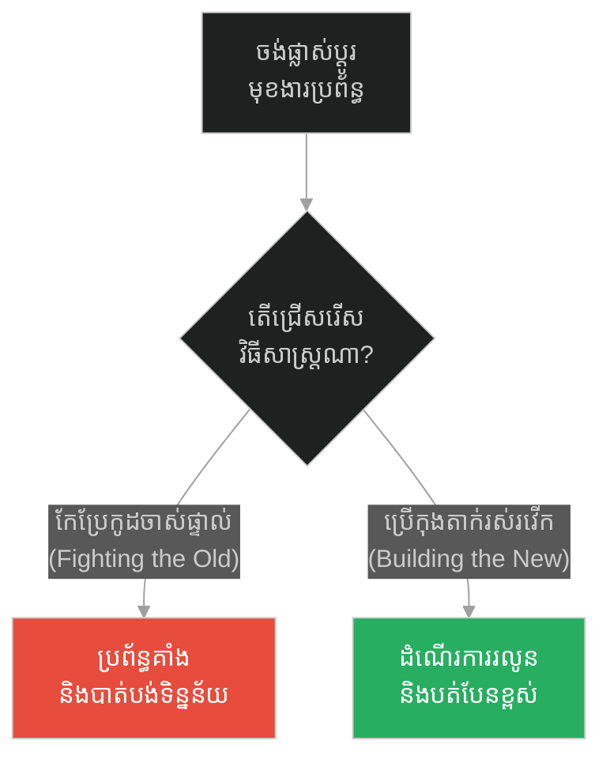
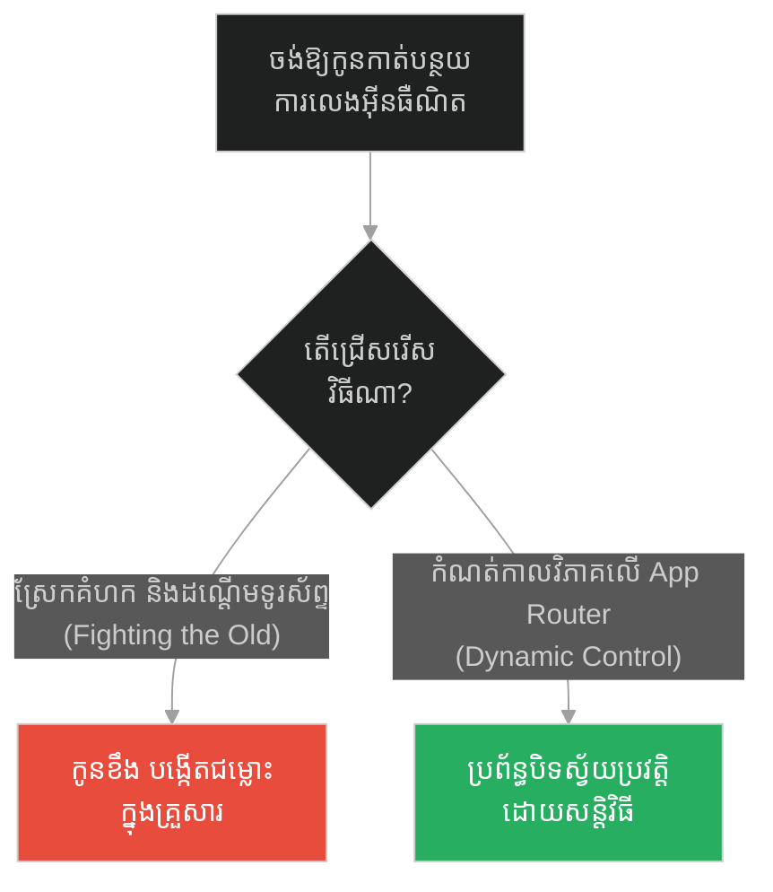
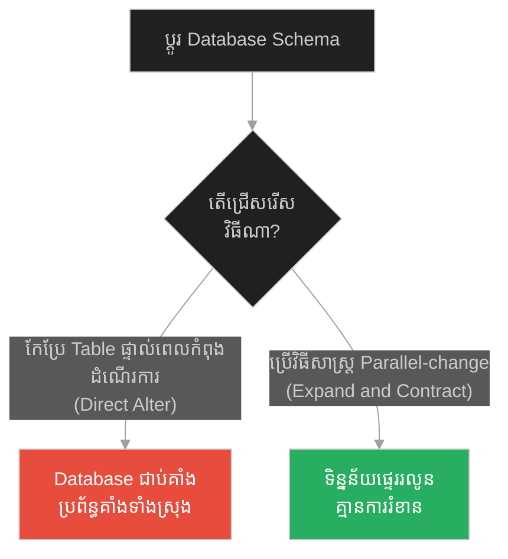
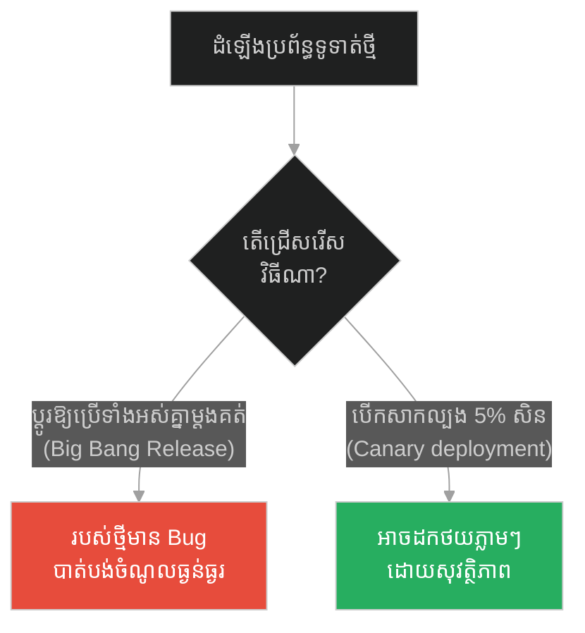
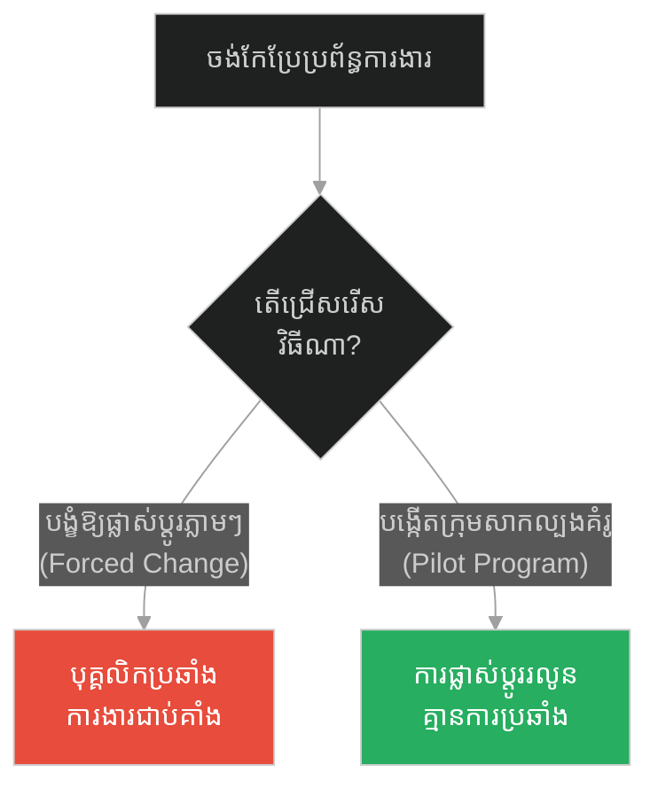
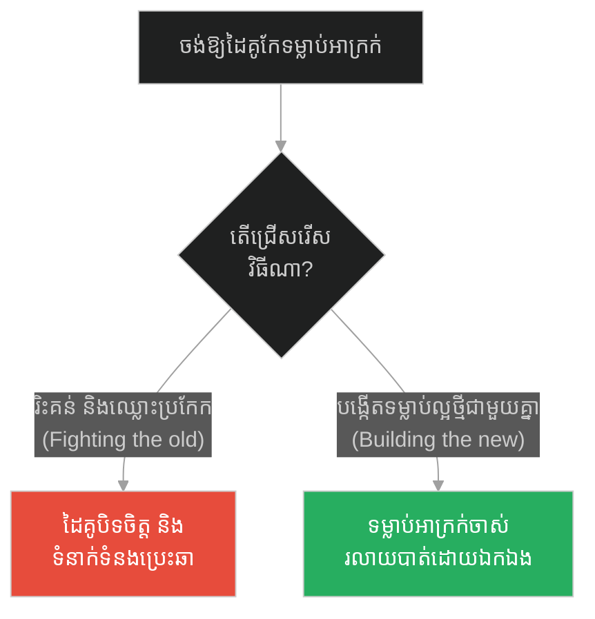

# Dynamic Feature Flags & Runtime Configuration (អាថ៌កំបាំងនៃការផ្លាស់ប្តូរ)៖ កុងតាក់មុខងាររស់រវើក និងការកំណត់រចនាសម្ព័ន្ធពេលដំណើរការ (Dynamic Feature Flags & Runtime Configuration & System Toggle Management & The Secret of Change)

**Author:** ichamrong  
**Date:** 2026-05-28  
**Tags:** #socrates #change-management #feature-flags #runtime-config #clean-architecture  
**Category:** Concepts  
**Read Time:** ~12 min  

---

## 📌 មាតិកា (Table of Contents)
- [អន្ទាក់ផ្លូវចិត្ត (The Trap)](#0)
- [១. រឿងព្រេងនិទាន៖ អាថ៌កំបាំងនៃការផ្លាស់ប្តូរ (The Legend of The Secret of Change)](#1)
  - [ការសាងសង់ប្រព័ន្ធថ្មី ស្របគ្នាជាមួយប្រព័ន្ធចាស់ (Building the New in Parallel)](#1-1)
- [២. បញ្ហា៖ កុងតាក់មុខងាររស់រវើក និងការកំណត់រចនាសម្ព័ន្ធពេលដំណើរការ (The Issue: Dynamic Feature Flags & Runtime Configuration)](#2)
- [៣. ឧទាហរណ៍ជាក់ស្តែងក្នុងពិភពពិត (Real World Examples)](#3)
  - [ឧទាហរណ៍ទី ១ — កម្រិតស្រាល (គ្រួសារ)៖ ការគ្រប់គ្រងម៉ោងមើលទូរទស្សន៍ (The Family Screen Time)](#3-1)
  - [ឧទាហរណ៍ទី ២ — កម្រិតមធ្យម (បច្ចេកទេស)៖ ការប្តូរទម្រង់ទិន្នន័យ (The Dev Data Migration)](#3-2)
  - [ឧទាហរណ៍ទី ៣ — កម្រិតមធ្យម (ធុរកិច្ច)៖ ការសាកល្បងមុខងារទូទាត់ប្រាក់ (The Business Checkout Feature)](#3-3)
  - [ឧទាហរណ៍ទី ៤ — កម្រិតមធ្យម (សង្គម/គ្រប់គ្រង)៖ ការផ្លាស់ប្តូររបៀបធ្វើការងាររបស់ក្រុម (The Management Workflow Transition)](#3-4)
  - [ឧទាហរណ៍ទី ៥ — កម្រិតធ្ងន់ (ទំនាក់ទំនង)៖ ការកែប្រែរបៀបប្រាស្រ័យទាក់ទង (The Relationship Communication Shift)](#3-5)
- [៤. ដំណោះស្រាយទូទៅ៖ ស្ថាបត្យកម្មគ្រប់គ្រងកុងតាក់រស់រវើក (The General Solution: Dynamic Toggle Architecture)](#4)
- [សេចក្តីសន្និដ្ឋាន (Conclusion)](#5)
- [ឯកសារយោង (References)](#6)
- [Related Posts](#7)

---

<a id="0"></a>
## អន្ទាក់ផ្លូវចិត្ត (The Trap)

តើអ្នកធ្លាប់ព្យាយាមកែប្រែមុខងារសំខាន់មួយនៅក្នុងកូដចាស់ (Legacy Code) ហើយបណ្តាលឱ្យប្រព័ន្ធទាំងមូលគាំងទាំងស្រុងដែរឬទេ? នេះគឺជាអន្ទាក់នៃការកែប្រែដោយផ្ទាល់ ដែល developers តែងតែជួបប្រទះនៅពេលព្យាយាម "ប្រយុទ្ធប្រឆាំងនឹងរបស់ចាស់" ជំនួសឱ្យ "ការសាងសង់របស់ថ្មីដោយសុវត្ថិភាព"។

* **ការកែប្រែកូដចាស់ដោយផ្ទាល់ (Direct Legacy Modification)** — បង្កើតហានិភ័យខ្ពស់ ពិបាកគ្រប់គ្រងករណីខុសឆ្គង (bugs) និងត្រូវការពេលបិទប្រព័ន្ធដើម្បីដំឡើង (deployment downtime)។
* **ការប្រើប្រាស់កុងតាក់រស់រវើក (Dynamic Feature Toggles)** — អនុញ្ញាតឱ្យសាងសង់មុខងារថ្មីស្របគ្នា រួចបើក/បិទសាកល្បងនៅពេលដំណើរការ (runtime) ដោយគ្មានហានិភ័យ។

ប្លង់មេសម្រាប់ការយល់ដឹងពីមេរៀននេះ៖
1. **រឿងព្រេងនិទាន (The Legend)** — ទស្សនវិជ្ជាសូក្រាតអំពីការផ្តោតលើការសាងសង់របស់ថ្មី។
2. **បញ្ហា (The Issue)** — ការវិភាគពីភាពផុយស្រួយនៃការកំណត់រចនាសម្ព័ន្ធជាប់កូដ (Hardcoded Settings)។
3. **ឧទាហរណ៍ជាក់ស្តែង (Real World Examples)** — ករណីសិក្សាចំនួន ៥ កម្រិតដើម្បីយល់ដឹងកាន់តែច្បាស់។
4. **ដំណោះស្រាយទូទៅ (The General Solution)** — ការរៀបចំប្រព័ន្ធគ្រប់គ្រង Dynamic Configurations។



---

<a id="1"></a>
## ១. រឿងព្រេងនិទាន៖ អាថ៌កំបាំងនៃការផ្លាស់ប្តូរ (The Legend of The Secret of Change)

យុវជនម្នាក់មានការខកចិត្តយ៉ាងខ្លាំងចំពោះទម្លាប់អាក្រក់ និងកំហុសក្នុងអតីតកាលរបស់ខ្លួន។ គាត់បានប្រាប់សូក្រាតថា៖ *"ខ្ញុំស្អប់ខ្លួនឯងកាលពីមុនណាស់! ខ្ញុំតែងតែចំណាយពេល និងកម្លាំងទាំងអស់ដើម្បីប្រឆាំង ថ្កោលទោស និងព្យាយាមលុបបំបាត់អតីតកាលដ៏ខ្មៅងងឹតរបស់ខ្ញុំ តែខ្ញុំហាក់ដូចជាមិនអាចកែប្រែខ្លួនឯងបានសោះ។ ខ្ញុំកាន់តែប្រឹង វាហាក់ដូចជាកាន់តែលំបាក!"*

គាត់មានអារម្មណ៍ថា គាត់កំពុងធ្វើសង្គ្រាមជាមួយស្រមោលរបស់ខ្លួនឯងរាល់ថ្ងៃ និងហត់នឿយផ្លូវចិត្តជាខ្លាំង។

សូក្រាតបានស្តាប់ដោយយកចិត្តទុកដាក់ រួចបានផ្តល់នូវដំបូន្មានដ៏មានឥទ្ធិពលបំផុតមួយអំពីសិល្បៈនៃការផ្លាស់ប្តូរជីវិតថា៖

> **«អាថ៌កំបាំងនៃការផ្លាស់ប្តូរ គឺមិនមែនផ្តោតថាមពលរបស់អ្នក ទៅលើការប្រយុទ្ធប្រឆាំងនឹងអ្វីដែលចាស់នោះទេ ប៉ុន្តែត្រូវផ្តោតថាមពលរបស់អ្នក ទៅលើការសាងសង់អ្វីដែលថ្មីវិញ។»**  
> *(“The secret of change is to focus all of your energy, not on fighting the old, but on building the new.”)*

លោកចង់ពន្យល់ថា អតីតកាលគឺជារឿងដែលបានកើតឡើងរួចទៅហើយ អ្នកមិនអាចលុបវាចោលបានទេ។ កាលណាអ្នកកាន់តែផ្តោតលើវា ខួរក្បាលរបស់អ្នកកាន់តែផ្តល់ថាមពលឱ្យវា។ វិធីតែមួយគត់ដើម្បីសម្លាប់ទម្លាប់ចាស់ គឺការងាកចេញពីវា ហើយយកពេលវេលាទាំងអស់ ទៅបង្កើតទម្លាប់ថ្មីឱ្យបានល្អិតល្អន់។

<a id="1-1"></a>
### ការសាងសង់ប្រព័ន្ធថ្មី ស្របគ្នាជាមួយប្រព័ន្ធចាស់ (Building the New in Parallel)

នៅក្នុងស្ថាបត្យកម្មប្រព័ន្ធ ការប្រយុទ្ធប្រឆាំងនឹងកូដចាស់ដោយព្យាយាមលុបចោល ឬសរសេរឡើងវិញទាំងអស់ក្នុងពេលតែមួយ (Big Bang Rewrite) គឺជាកំហុសដ៏ធ្ងន់ធ្ងរ។ ប្រាជ្ញារបស់សូក្រាតបង្រៀនយើងឱ្យទុកប្រព័ន្ធចាស់ឱ្យដំណើរការជាធម្មតា (មិនបាច់ទៅបង្កសង្គ្រាមជាមួយវា) រួចបង្កើតប្រព័ន្ធ ឬមុខងារថ្មីនៅក្បែរនោះជាស្របគ្នា (Building the new in parallel)។ នៅពេលដែលប្រព័ន្ធថ្មីរួចរាល់ និងដំណើរការបានយ៉ាងល្អឥតខ្ចោះ ទើបយើងបង្វែរលំហូរចរាចរណ៍ (traffic) ពីចាស់ទៅថ្មីដោយប្រើប្រាស់ Feature Flags។ វិធីសាស្ត្រនេះកាត់បន្ថយភាពតានតឹង និងហានិភ័យមកនៅត្រឹមកម្រិតសូន្យ។

---

<a id="2"></a>
## ២. បញ្ហា៖ កុងតាក់មុខងាររស់រវើក និងការកំណត់រចនាសម្ព័ន្ធពេលដំណើរការ (The Issue: Dynamic Feature Flags & Runtime Configuration)

នៅពេលដែលប្រព័ន្ធបច្ចេកវិទ្យាកាន់តែធំ ការផ្លាស់ប្តូរមុខងារនីមួយៗត្រូវការការប្រុងប្រយ័ត្នខ្ពស់។ ប្រសិនបើយើងកំណត់រចនាសម្ព័ន្ធមុខងារផ្សេងៗដោយ Hardcoding ឬប្រើប្រាស់ Static Config នៅក្នុង environment variables ដែលត្រូវការ Restart application រាល់ពេលផ្លាស់ប្តូរ នោះយើងនឹងជួបបញ្ហា៖
1. **Downtime & Redeployment:** រាល់ការប្តូរតម្លៃបន្តិចបន្តួច ត្រូវកែប្រែកូដ រួច Build, Test, និង Deploy ឡើងវិញ ដែលខាតពេលវេលា។
2. **High Blast Radius:** ប្រសិនបើមុខងារថ្មីមាន bug វានឹងជះឥទ្ធិពលដល់អ្នកប្រើប្រាស់ទាំងអស់ភ្លាមៗ ដោយគ្មានវិធីដកថយ (rollback) រហ័សឡើយ។
3. **No Target Release:** មិនអាចសាកល្បងមុខងារថ្មីលើក្រុមអ្នកប្រើប្រាស់តូចណាមួយ (Canary Release/A-B Testing) បានឡើយ។

ខាងក្រោមនេះជាឧទាហរណ៍កូដបង្ហាញពីភាពខុសគ្នារវាងការសរសេរកូដបែបផុយស្រួយ (Fragile) និងការសរសេរកូដបែបធន់មាំ (Resilient)៖

### ❌ វិធីសាស្ត្រផុយស្រួយ (Fragile System: Direct Code Override & Hardcoding)
```typescript
// វិធីសាស្ត្របែបចាស់៖ កែប្រែកូដចាស់ផ្ទាល់ ឬប្រើការកំណត់ជាប់កូដ (Hardcoded)
// ប្រសិនបើចង់បិទមុខងារនេះវិញ ត្រូវកែប្រែកូដ រួច Deploy ឡើងវិញ
export function processPayment(amount: number) {
  // កូដថ្មីកំពុងប្រយុទ្ធប្រឆាំង និងជំនួសកូដចាស់ដោយផ្ទាល់ (Direct modification)
  console.log("Using the NEW Stripe Payment API...");
  const gateway = new StripeGateway(); // បើមាន Bug លើ Stripe ប្រព័ន្ធនឹងគាំងទាំងអស់
  return gateway.charge(amount);
}
```

###  វិធីសាស្ត្រធន់មាំ (Resilient System: Dynamic Feature Flags & Runtime Configuration)
```typescript
import { FeatureFlagClient } from "./feature-flag-provider";

// បង្កើតប្រព័ន្ធថ្មីស្របគ្នា ហើយប្រើប្រាស់កុងតាក់រស់រវើក (Feature Flags)
export async function processPaymentResilient(userId: string, amount: number) {
  // ទាញយកស្ថានភាពកុងតាក់ពីប្រព័ន្ធគ្រប់គ្រងពេលដំណើរការ (Evaluated at runtime)
  const isNewPaymentEnabled = await FeatureFlagClient.getBoolFlag(
    "enable-stripe-payment",
    userId, // អនុញ្ញាតឱ្យបើកសាកល្បងលើអ្នកប្រើប្រាស់ជាក់លាក់ (Targeting)
    false   // តម្លៃលំនាំដើម (Fallback default) ប្រសិនបើប្រព័ន្ធកុងតាក់មានបញ្ហា
  );

  if (isNewPaymentEnabled) {
    try {
      // សាងសង់របស់ថ្មី (Building the new)
      console.log(`[UserId: ${userId}] Routing to NEW Stripe Gateway...`);
      const newGateway = new StripeGateway();
      return await newGateway.charge(amount);
    } catch (error) {
      // ប្រសិនបើរបស់ថ្មីមានបញ្ហា ប្រព័ន្ធនឹងប្តូរទៅប្រើរបស់ចាស់ជាស្វ័យប្រវត្តិ (Graceful Fallback)
      console.warn("New payment failed, falling back to old system...", error);
      return processLegacyPayment(amount);
    }
  } else {
    // ទុករបស់ចាស់ឱ្យនៅដដែល (Keep the old running safely)
    return processLegacyPayment(amount);
  }
}

function processLegacyPayment(amount: number) {
  console.log("Routing to LEGACY PayPal Gateway...");
  const oldGateway = new PayPalGateway();
  return oldGateway.charge(amount);
}
```

---

<a id="3"></a>
## ៣. ឧទាហរណ៍ជាក់ស្តែងក្នុងពិភពពិត (Real World Examples)

<a id="3-1"></a>
### ឧទាហរណ៍ទី ១ — កម្រិតស្រាល (គ្រួសារ)៖ ការគ្រប់គ្រងម៉ោងមើលទូរទស្សន៍ (The Family Screen Time)
* **ការពន្យល់៖** ឪពុកម្តាយចង់ឱ្យកូនៗកាត់បន្ថយការមើលទូរទស្សន៍។ វិធីសាស្ត្រចាស់ (Fighting the old) គឺការបិទទូរទស្សន៍ និងឈ្លោះប្រកែកគ្នា។ វិធីសាស្ត្រថ្មី (Building the new) គឺការកំណត់ Dynamic Profile នៅលើ Router ផ្ទះ ដែលអាចគ្រប់គ្រងម៉ោងដំណើរការ Wifi ពីទូរស័ព្ទដៃភ្លាមៗ។



<a id="3-2"></a>
### ឧទាហរណ៍ទី ២ — កម្រិតមធ្យម (បច្ចេកទេស)៖ ការប្តូរទម្រង់ទិន្នន័យ (The Dev Data Migration)
* **ការពន្យល់៖** ការផ្លាស់ប្តូរ Schema នៃ Database ធំមួយ។ ជំនួសឱ្យការកែប្រែ Table ផ្ទាល់ (Alter Table) ភ្លាមៗ ដែលអាចធ្វើឱ្យប្រព័ន្ធទាំងមូលគាំង យើងបង្កើត Column ថ្មីស្របគ្នា រួចសរសេរទិន្នន័យចូលទាំងពីរ (Dual-write) រហូតដល់ទិន្នន័យចាស់ត្រូវបានផ្ទេរអស់ ទើបបិទ Column ចាស់ដោយសុវត្ថិភាព។



<a id="3-3"></a>
### ឧទាហរណ៍ទី ៣ — កម្រិតមធ្យម (ធុរកិច្ច)៖ ការសាកល្បងមុខងារទូទាត់ប្រាក់ (The Business Checkout Feature)
* **ការពន្យល់៖** ក្រុមហ៊ុនចង់ដំឡើងប្រព័ន្ធទូទាត់ប្រាក់ថ្មី។ ជំនួសឱ្យការផ្លាស់ប្តូរឱ្យអតិថិជនទាំងអស់ប្រើប្រាស់របស់ថ្មីក្នុងពេលតែមួយ ក្រុមហ៊ុនបើកឱ្យប្រើតែ 5% នៃអ្នកប្រើប្រាស់សិន។ បើគ្មានបញ្ហាទេ ទើបបង្កើនភាគរយជាលំដាប់។



<a id="3-4"></a>
### ឧទាហរណ៍ទី ៤ — កម្រិតមធ្យម (សង្គម/គ្រប់គ្រង)៖ ការផ្លាស់ប្តូររបៀបធ្វើការងាររបស់ក្រុម (The Management Workflow Transition)
* **ការពន្យល់៖** ប្រធានគ្រប់គ្រងចង់កែប្រែប្រព័ន្ធគ្រប់គ្រងការងាររបស់បុគ្គលិកពីគំនិតចាស់ទៅថ្មី។ ការបង្ខំឱ្យបុគ្គលិកទាំងអស់ប្តូរភ្លាមៗនឹងបង្កើតឱ្យមានការប្រឆាំងយ៉ាងខ្លាំង។ ផ្ទុយទៅវិញ ការបង្កើតក្រុមតូចមួយធ្វើជាគំរូសិន (Pilot Team) នឹងជួយឱ្យអ្នកដទៃមើលឃើញពីលទ្ធផល រួចចូលរួមដោយស្ម័គ្រចិត្ត។



<a id="3-5"></a>
### ឧទាហរណ៍ទី ៥ — កម្រិតធ្ងន់ (ទំនាក់ទំនង)៖ ការកែប្រែរបៀបប្រាស្រ័យទាក់ទង (The Relationship Communication Shift)
* **ការពន្យល់៖** នៅក្នុងទំនាក់ទំនងស្នេហា ការព្យាយាមផ្លាស់ប្តូរដៃគូដោយការស្តីបន្ទោសទម្លាប់ចាស់ (Fighting the old) នឹងធ្វើឱ្យពួកគេកាន់តែរឹងរូស។ ការបង្កើតសកម្មភាពវិជ្ជមានថ្មីៗជាមួយគ្នា (Building the new) នឹងធ្វើឱ្យទម្លាប់អាក្រក់ចាស់ៗសាបរលាបទៅដោយឯកឯង។



---

<a id="4"></a>
## ៤. ដំណោះស្រាយទូទៅ៖ ស្ថាបត្យកម្មគ្រប់គ្រងកុងតាក់រស់រវើក (The General Solution: Dynamic Toggle Architecture)

ដើម្បីដោះស្រាយបញ្ហានៃការផ្លាស់ប្តូរដោយសុវត្ថិភាព យើងត្រូវការស្ថាបត្យកម្មមួយដែលអាចគ្រប់គ្រងការកំណត់ប្រព័ន្ធនៅពេលដំណើរការ (Runtime Configuration) បានភ្លាមៗដោយមិនបាច់ដំឡើងកូដឡើងវិញ៖

1. **Centralized Config Server:** ប្រើប្រាស់សេវាកម្មដូចជា LaunchDarkly, ConfigCat ឬ Firebase Remote Config។
2. **Local Caching & Fallbacks:** កូដនៅលើ Client/Server ត្រូវរក្សាទុកតម្លៃ config ក្នុង cache និងមានតម្លៃលំនាំដើមជានិច្ច ដើម្បីការពារករណីបណ្តាញភ្ជាប់រអាក់រអួល។
3. **Automated Cleanups:** កំណត់កាលវិភាគលុប Feature Flags ដែលលែងប្រើប្រាស់ចេញពី codebase ដើម្បីកុំឱ្យកូដស្មុគស្មាញ (Technical Debt)។

```mermaid
%%{init: {
  'theme': 'dark',
  'themeVariables': {
    'background': '#1e1e1e',
    'primaryTextColor': '#ffffff',
    'lineColor': '#a0a0a0'
  },
  'themeCSS': 'svg { background-color: #1e1e1e !important; padding: 1rem !important; border-radius: 8px !important; } .edgeLabel rect { fill: #1e1e1e !important; } text, tspan { fill: #ffffff !important; }'
}}%%
graph LR
    ConfigAdmin["អ្នកគ្រប់គ្រងប្រព័ន្ធ<br/>(Config Admin)"] -- "ផ្លាស់ប្តូរកុងតាក់<br/>(Toggle Flag)" --> ConfigDashboard["ផ្ទាំងគ្រប់គ្រង<br/>(Config Dashboard)"]
    ConfigDashboard -- "ផ្សព្វផ្សាយភ្លាមៗ<br/>(SSE / Polling)" --> AppInstance["កម្មវិធីដំណើរការ<br/>(App Instances)"]
    AppInstance -- "វាយតម្លៃភ្លាមៗ<br/>(Runtime Evaluation)" --> UserTraffic["អ្នកប្រើប្រាស់<br/>(Users: 5% vs 95%)"]
    
    style ConfigAdmin fill:#2980b9,color:#fff
    style ConfigDashboard fill:#2980b9,color:#fff
    style AppInstance fill:#27ae60,color:#fff
    style UserTraffic fill:#27ae60,color:#fff
```



---

## 🐇 ធ្លាក់ចូលក្នុងរន្ធទន្សាយ (Enter the Rabbit Hole)
ដើម្បីស្វែងយល់បន្ថែមអំពីច្បាប់ និងឧបករណ៍ដែលអាចជួយតម្រង់ទិសដៅរបស់អ្នកក្នុងកូដ ចូរប្រញាប់បន្តដំណើរទៅកាន់៖

* 🚀 **[ចាប់ផ្តើមដំណើររុករក (Start the Journey) ➔ Linter Rules & Static Code Analysis (សត្វរុយរបស់ទីក្រុងអាថែន)៖ ច្បាប់ Linter និងការវិភាគកូដឋិតិវន្ត](./231-socrates-and-the-courage-to-speak.md)**

---

<a id="5"></a>
## សេចក្តីសន្និដ្ឋាន (Conclusion)

> **«កុំខ្ជះខ្ជាយថាមពលប្រយុទ្ធនឹងអតីតកាលដែលមិនអាចកែប្រែបាន។ ចូរផ្តោតលើការកសាងអនាគតថ្មីដែលអ្នកចង់បាន។»**

ការកែប្រែប្រព័ន្ធទាំងស្រុងដោយបង្ខំ តែងតែនាំមកនូវការបែកបាក់ និងការខូចខាត។ មិនថានៅក្នុងវិស្វកម្មកម្មវិធី ឬក្នុងជីវិតផ្ទាល់ខ្លួន ការប្រើប្រាស់គោលការណ៍ "សាងសង់របស់ថ្មីជាស្របគ្នា រួចប្តូរជាលំដាប់" គឺជាជម្រើសដ៏ឆ្លាតវៃបំផុត។ វាមិនត្រឹមតែជួយការពារប្រព័ន្ធចាស់មិនឱ្យបែកបាក់ប៉ុណ្ណោះទេ ថែមទាំងផ្តល់នូវសន្តិភាពផ្លូវចិត្ត និងសុវត្ថិភាពខ្ពស់ដល់យើងផងដែរ។

---

<a id="6"></a>
## ឯកសារយោង (References)

* **Dan Millman** — *Way of the Peaceful Warrior* (1980). The origin of the quote "The secret of change...".
* **Martin Fowler** — *Feature Toggles (Feature Flags)* (2017). A comprehensive guide to implementation patterns of feature flags in software engineering.
* **Pete Hodgson** — *Decoupling Deployment from Release* (2016). Detailed analysis of how runtime configuration reduces release risk.

---

<a id="7"></a>
## Related Posts

* [Linter Rules & Static Code Analysis (សត្វរុយរបស់ទីក្រុងអាថែន)៖ ច្បាប់ Linter និងការវិភាគកូដឋិតិវន្ត](./231-socrates-and-the-courage-to-speak.md) — ស្វែងយល់ពីរបៀបដែល "សត្វរុយ" ដាស់តឿនឱ្យប្រព័ន្ធរក្សាសណ្តាប់ធ្នាប់។
