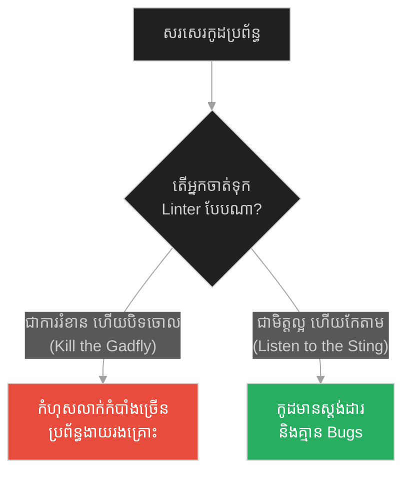
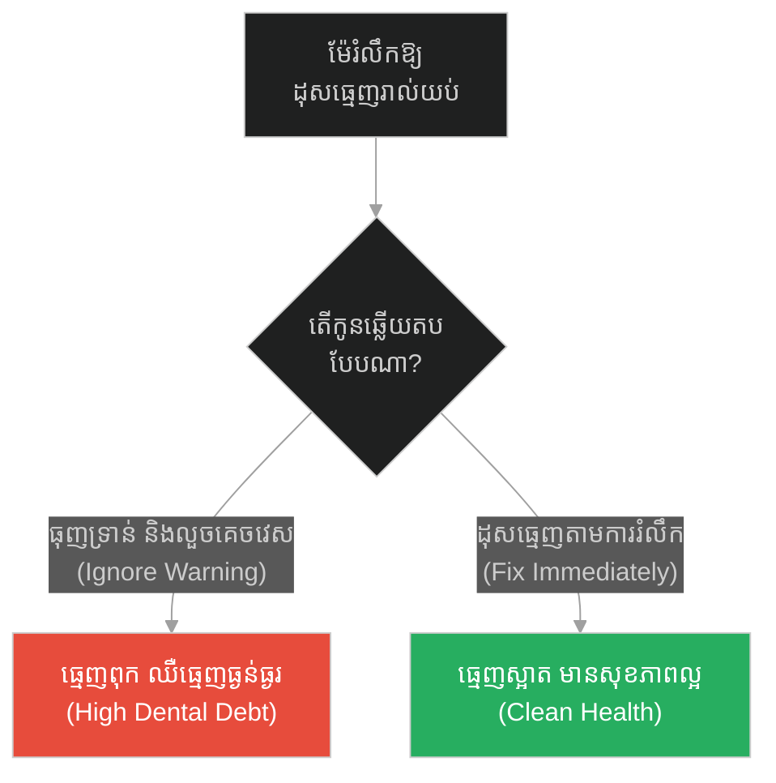
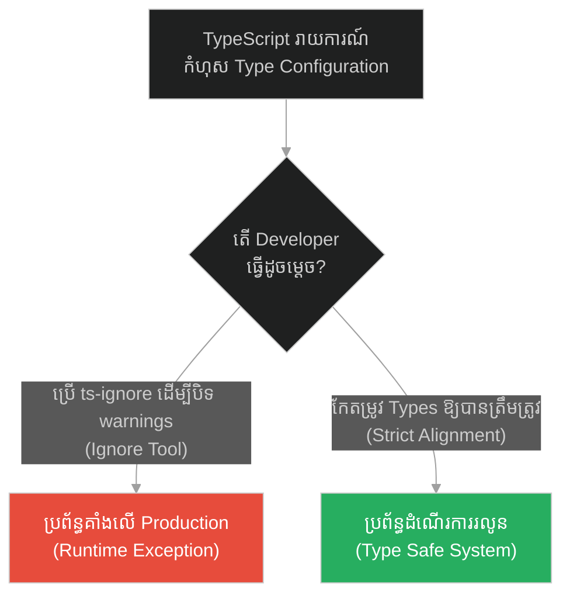
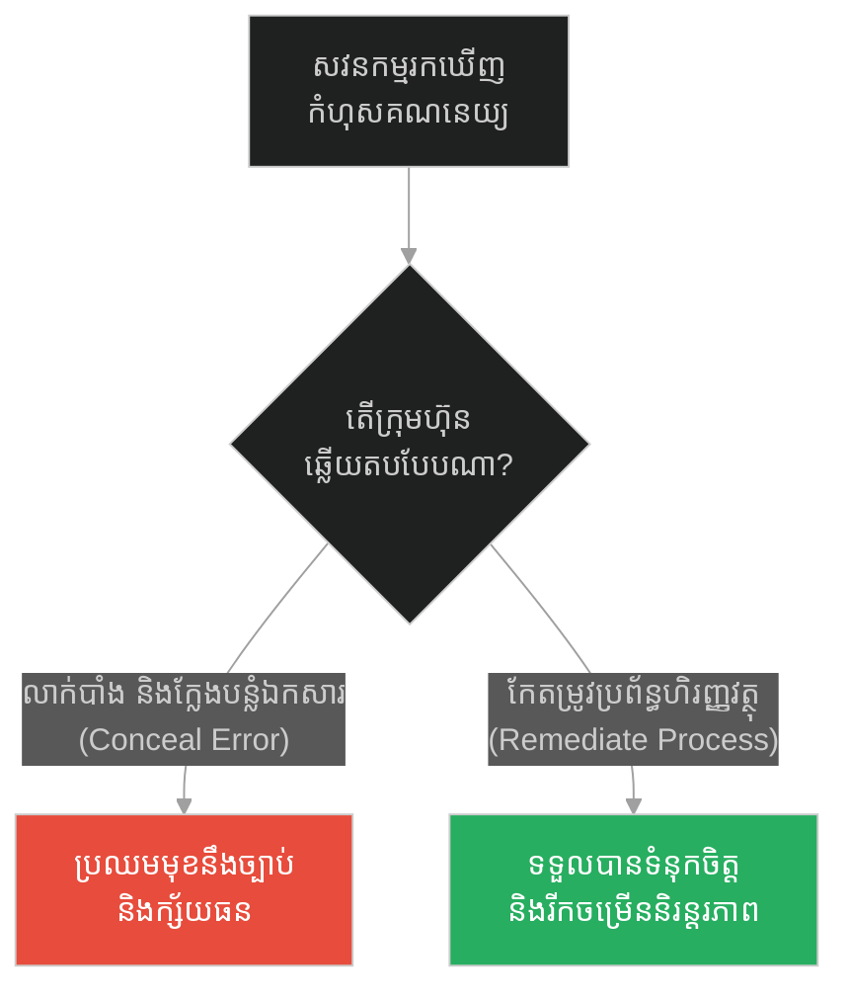
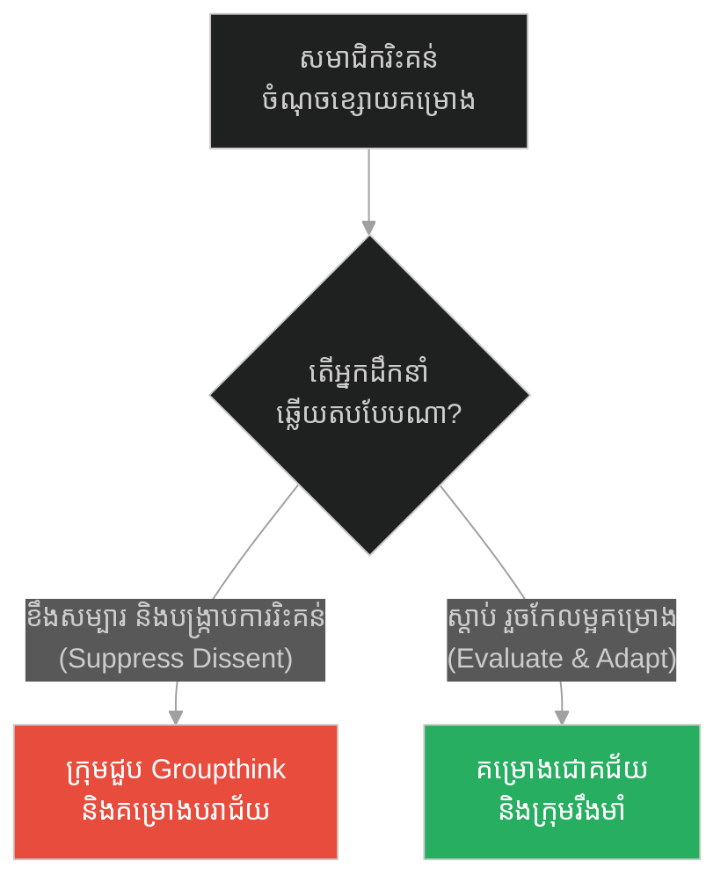
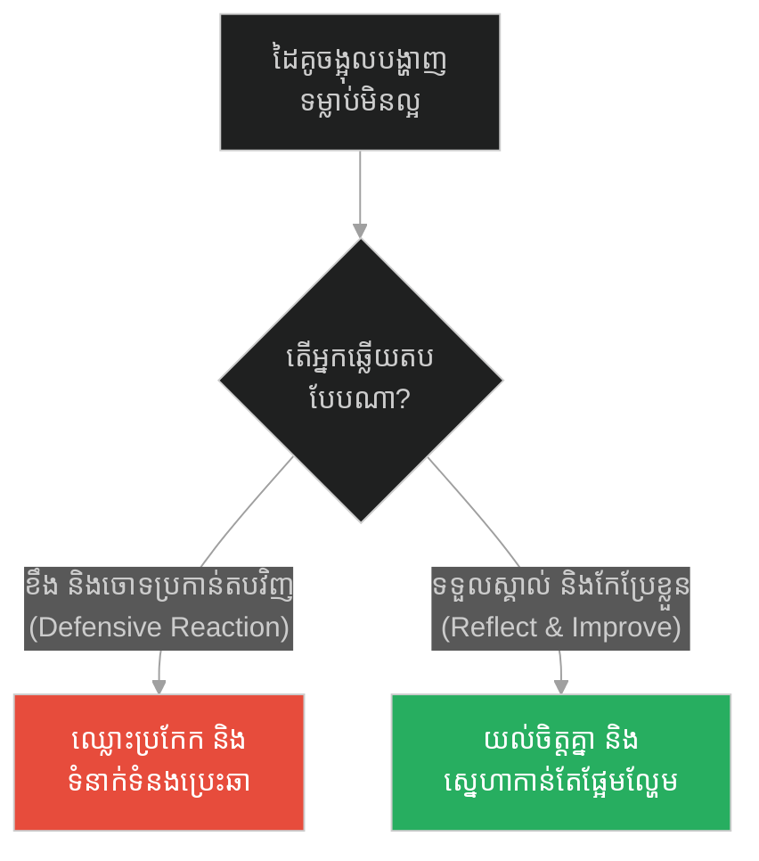
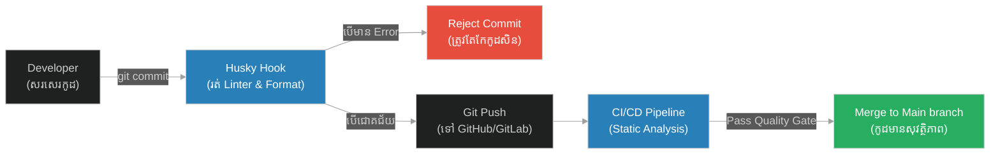

# Linter Rules & Static Code Analysis (សត្វរុយរបស់ទីក្រុងអាថែន)៖ ច្បាប់ Linter និងការវិភាគកូដឋិតិវន្ត (Linter Rules & Static Code Analysis & Automated Code Quality Enforcement & The Gadfly of Athens)

**Author:** ichamrong  
**Date:** 2026-05-28  
**Tags:** #socrates #linter #static-analysis #eslint #code-quality  
**Category:** Concepts  
**Read Time:** ~12 min  

---

## 📌 មាតិកា (Table of Contents)
- [អន្ទាក់ផ្លូវចិត្ត (The Trap)](#0)
- [១. រឿងព្រេងនិទាន៖ សត្វរុយរបស់ទីក្រុងអាថែន (The Legend of The Gadfly of Athens)](#1)
  - [ការចាក់ដោតដែលនាំមកនូវជីវិត (The Painful Stings That Give Life)](#1-1)
- [២. បញ្ហា៖ ច្បាប់ Linter និងការវិភាគកូដឋិតិវន្ត (The Issue: Linter Rules & Static Code Analysis)](#2)
- [៣. ឧទាហរណ៍ជាក់ស្តែងក្នុងពិភពពិត (Real World Examples)](#3)
  - [ឧទាហរណ៍ទី ១ — កម្រិតស្រាល (គ្រួសារ)៖ ការរំលឹកឱ្យដុសធ្មេញ (The Family Dental Care)](#3-1)
  - [ឧទាហរណ៍ទី ២ — កម្រិតមធ្យម (បច្ចេកទេស)៖ ការព្រមានអំពីប្រភេទកូដ (The Dev Type Checking)](#3-2)
  - [ឧទាហរណ៍ទី ៣ — កម្រិតមធ្យម (ធុរកិច្ច)៖ ការធ្វើសវនកម្មហិរញ្ញវត្ថុ (The Business Compliance Audit)](#3-3)
  - [ឧទាហរណ៍ទី ៤ — កម្រិតមធ្យម (សង្គម/គ្រប់គ្រង)៖ ការរិះគន់ស្ថាបនាក្នុងក្រុម (The Management Peer Feedback)](#3-4)
  - [ឧទាហរណ៍ទី ៥ — កម្រិតធ្ងន់ (ទំនាក់ទំនង)៖ ការចង្អុលបង្ហាញកំហុសពីដៃគូ (The Relationship Honest Feedback)](#3-5)
- [៤. ដំណោះស្រាយទូទៅ៖ ការកំណត់ច្បាប់គុណភាពកូដស្វ័យប្រវត្តិ (The General Solution: Automated Linting Workflow)](#4)
- [សេចក្តីសន្និដ្ឋាន (Conclusion)](#5)
- [ឯកសារយោង (References)](#6)
- [Related Posts](#7)

---

<a id="0"></a>
## អន្ទាក់ផ្លូវចិត្ត (The Trap)

តើអ្នកធ្លាប់មានអារម្មណ៍ធុញទ្រាន់នឹងការព្រមានពណ៌ក្រហមឆ្អៅរបស់ Linter ពេលកំពុងសរសេរកូដដែរឬទេ? Developers ជាច្រើនយល់ថាច្បាប់ក្រមសីលធម៌កូដទាំងនេះ គឺជាឧបសគ្គរំខានដល់ល្បឿននៃការសរសេរកូដរបស់ពួកគេ ទើបពួកគេព្យាយាមបិទវាចោល ឬប្រើប្រាស់ `@ts-ignore` ដើម្បីគេចវេស។ នេះគឺជាអន្ទាក់នៃការសម្លាប់ "សត្វរុយ" ដើម្បីបានគេងលក់ស្រួល តែចុងក្រោយត្រូវជួបគ្រោះថ្នាក់ធំនៅលើ production។

* **ការបិទចោលច្បាប់ Linter (Bypassing Lint Rules)** — ជួយឱ្យសរសេរកូដបានលឿននិងមិនរំខាននៅពេលដំបូង ប៉ុន្តែបង្កើតបំណុលបច្ចេកទេស (technical debt) និងកំហុសលាក់កំបាំងជាច្រើន។
* **ការគោរពតាមច្បាប់ Linter (Strict Linting)** — ទាមទារពេលកែតម្រូវ និងមានការរំខានញឹកញាប់ ប៉ុន្តែធានាថា codebase ស្អាត មានសុវត្ថិភាព និងងាយស្រួលថែទាំ។

ប្លង់មេសម្រាប់ការយល់ដឹងពីមេរៀននេះ៖
1. **រឿងព្រេងនិទាន (The Legend)** — តួនាទីរបស់សូក្រាតជាសត្វរុយ (Gadfly) ចាក់ដោតសេះដ៏ខ្ជិលច្រអូស។
2. **បញ្ហា (The Issue)** — ការវិភាគពីសារៈសំខាន់នៃ Static Code Analysis។
3. **ឧទាហរណ៍ជាក់ស្តែង (Real World Examples)** — ករណីសិក្សាទាំង ៥ កម្រិតនៃការរំលឹកនិងការកែតម្រូវ។
4. **ដំណោះស្រាយទូទៅ (The General Solution)** — ការរៀបចំ Pipeline ត្រួតពិនិត្យកូដដោយស្វ័យប្រវត្តិ។



---

<a id="1"></a>
## ១. រឿងព្រេងនិទាន៖ សត្វរុយរបស់ទីក្រុងអាថែន (The Legend of The Gadfly of Athens)

នៅក្នុងតុលាការ ពេលដែលសូក្រាតត្រូវបានគេចោទប្រកាន់ថា ជាអ្នកបង្កការរំខានដល់អ្នកមានអំណាចនិងសង្គមអាថែន គាត់មិនបានសុំទោសនោះទេ ប៉ុន្តែគាត់បានប្រៀបធៀបខ្លួនគាត់ទៅនឹង "សត្វរុយ (Gadfly)" ។

គាត់បានប្រាប់តុលាការថា៖ 

> **«ទីក្រុងអាថែន គឺប្រៀបដូចជាសេះដ៏ធំ និងមានកម្លាំងខ្លាំងក្លាមួយក្បាល។ ប៉ុន្តែដោយសារតែវាមានទំហំធំពេក វាបានក្លាយទៅជាសត្វដែលខ្ជិលច្រអូស ដេកដួល និងមិនព្រមធ្វើចលនា។ ព្រះជាម្ចាស់ បានបញ្ជូនខ្ញុំមកទីនេះ ឱ្យធ្វើជា 'សត្វរុយ' មួយក្បាល ដើម្បីទិចសេះដ៏ខ្ជិលច្រអូសមួយនេះឱ្យភ្ញាក់ខ្លួន!»**  
> *(“I am the gadfly of Athens, sent by God to sting this great and noble horse into life!”)*

សូក្រាតបានបន្តថា៖ *"ខ្ញុំដឹងថា អ្នករាល់គ្នាធុញទ្រាន់នឹងខ្ញុំ ដែលដើរសួរសំណួរចាក់ដោតរាល់ថ្ងៃ។ អ្នកចង់វាយខ្ញុំឱ្យស្លាប់ដូចសត្វរុយ ដើម្បីឱ្យអ្នកអាចត្រឡប់ទៅដេកលក់វិញបានយ៉ាងស្រួល។ ប៉ុន្តែប្រសិនបើអ្នកសម្លាប់ខ្ញុំ អ្នកនឹងត្រូវដេកលក់រហូត ហើយទីក្រុងនេះនឹងរលាយបាត់បង់ជាមិនខាន។ ការទិចរបស់ខ្ញុំ ទោះជាឈឺចាប់ តែវាធ្វើឱ្យអ្នកភ្ញាក់ខ្លួន និងមានជីវិត!"*

<a id="1-1"></a>
### ការចាក់ដោតដែលនាំមកនូវជីវិត (The Painful Stings That Give Life)

ការយល់ឃើញរបស់សូក្រាតច្បាស់ណាស់៖ ការរស់នៅក្នុង Comfort Zone (សេះដេក) គឺស្រួល តែវានាំទៅរកភាពវិនាស។ មនុស្សយើងត្រូវការការរំលឹក ការចង្អុលបង្ហាញពីកំហុសឆ្គង និងការរិះគន់ ដើម្បីកុំឱ្យធ្លាក់ចូលទៅក្នុងភាពខ្ជិលច្រអូស និងអំនួត។ នៅក្នុងប្រព័ន្ធបច្ចេកវិទ្យា កូដដែលមិនធ្លាប់ត្រូវបានត្រួតពិនិត្យដោយលម្អិត នឹងចាប់ផ្តើមស្អុយរលួយ (Code Rot) ទៅតាមពេលវេលា។ សត្វរុយបច្ចេកវិទ្យា (Linter) អាចនឹងធ្វើឱ្យយើងធុញទ្រាន់នៅពេលសរសេរកូដ ប៉ុន្តែវាជាអ្នកការពារដ៏ស្មោះត្រង់បំផុត ដែលជួយកុំឱ្យ codebase ទាំងមូលក្លាយជាគំនរសម្រាម។

---

<a id="2"></a>
## ២. បញ្ហា៖ ច្បាប់ Linter និងការវិភាគកូដឋិតិវន្ត (The Issue: Linter Rules & Static Code Analysis)

ប្រសិនបើយើងមិនប្រើប្រាស់ Linter ឬមិនអើពើនឹងច្បាប់វិភាគកូដឋិតិវន្ត (Static Code Analysis) ទេ នោះ codebase នឹងជួបប្រទះបញ្ហាធ្ងន់ធ្ងរ៖
1. **Inconsistent Code Style:** ម្នាក់ៗសរសេរតាមចិត្តចង់ ពិបាកអាន ពិបាកធ្វើការងារជាក្រុម។
2. **Hidden Execution Bugs:** មានអថេរដែលមិនបានប្រើប្រាស់ (unused variables) ការសន្យាដែលមិនបានដោះស្រាយ (unhandled promises) ឬការប្រើប្រាស់ប្រភេទកូដមិនច្បាស់លាស់ (`any` type) ដែលអាចបង្កឱ្យមាន Runtime Crash។
3. **Security Vulnerabilities:** បណ្តោយឱ្យមានចន្លោះប្រហោងសុវត្ថិភាពដូចជា SQL Injection ឬ Cross-Site Scripting (XSS) ចូលទៅក្នុងប្រព័ន្ធដោយមិនដឹងខ្លួន។

ខាងក្រោមនេះជាការប្រៀបធៀបរវាងកូដដែលគ្មានវិន័យ និងកូដដែលគោរពតាមច្បាប់ Linter៖

### ❌ កូដផុយស្រួយ (Fragile: Bypassing Lint/Type Warnings)
```typescript
// @ts-nocheck
// កូដនេះគ្មានការត្រួតពិនិត្យប្រភេទ និងគ្មានវិន័យ Linter
export function getUserData(userId) {
  // ១. គ្មានការកំណត់ប្រភេទច្បាស់លាស់ (implicitly typed as 'any')
  // ២. អថេរដែលមិនបានប្រើប្រាស់ (unused variable)
  const temp = "unnecessary string"; 

  // ៣. គ្រោះថ្នាក់៖ ប្រើប្រាស់ eval ដែលងាយរងការវាយប្រហារ (Security vulnerability)
  const query = eval("console.log('Fetching user: ' + userId)"); 

  // ៤. មិនបានត្រួតពិនិត្យករណី null ឬ undefined (Potential runtime crash)
  return fetch(`https://api.example.com/users/${userId}`)
    .then(res => res.json()); // ៥. មិនមាន try-catch ឬ catch block សម្រាប់ handle errors
}
```

###  កូដធន់មាំ (Resilient: Strictly Complying with Linter and TypeScript Rules)
```typescript
interface User {
  id: string;
  name: string;
  email: string;
}

/**
 * ទាញយកទិន្នន័យអ្នកប្រើប្រាស់ដោយសុវត្ថិភាព
 * គោរពតាមច្បាប់ ESLint និង TypeScript យ៉ាងម៉ត់ចត់
 */
export async function getUserDataSecure(userId: string): Promise<User | null> {
  // ១. ត្រួតពិនិត្យតម្លៃបញ្ចូល (Input Validation)
  if (!userId || typeof userId !== "string") {
    throw new Error("Invalid User ID provided");
  }

  try {
    // ២. ប្រើប្រាស់ API ដែលមានសុវត្ថិភាព ជៀសវាងការប្រើ eval()
    console.log(`Fetching user: ${userId}`);

    const response = await fetch(`https://api.example.com/users/${encodeURIComponent(userId)}`);
    
    if (!response.ok) {
      console.error(`HTTP error! status: ${response.status}`);
      return null;
    }

    const data: User = await response.json();
    return data;
  } catch (error) {
    // ៣. ដោះស្រាយរាល់បញ្ហាដែលកើតឡើង (Error Handling)
    console.error("Failed to retrieve user data securely:", error);
    return null;
  }
}
```

---

<a id="3"></a>
## ៣. ឧទាហរណ៍ជាក់ស្តែងក្នុងពិភពពិត (Real World Examples)

<a id="3-1"></a>
### ឧទាហរណ៍ទី ១ — កម្រិតស្រាល (គ្រួសារ)៖ ការរំលឹកឱ្យដុសធ្មេញ (The Family Dental Care)
* **ការពន្យល់៖** កូនៗធុញទ្រាន់នឹងម្តាយដែលតែងតែរំលឹកឱ្យដុសធ្មេញមុនចូលគេងរាល់យប់ (សត្វរុយទិច)។ ការមិនអើពើ និងរអ៊ូរទាំ (Kill the gadfly) នាំឱ្យធ្មេញពុក និងត្រូវឈឺចាប់ពេលទៅពេទ្យធ្មេញ។ ការស្តាប់តាមការរំលឹកនាំឱ្យមានសុខភាពធ្មេញល្អ។



<a id="3-2"></a>
### ឧទាហរណ៍ទី ២ — កម្រិតមធ្យម (បច្ចេកទេស)៖ ការព្រមានអំពីប្រភេទកូដ (The Dev Type Checking)
* **ការពន្យល់៖** Developer ម្នាក់ធុញនឹង Compiler TypeScript ដែលចេះតែរាយការណ៍ពីកំហុស variable types ពេលរៀបចំប្រព័ន្ធ។ គាត់ក៏បិទការឆែក compile ដើម្បីកុំឱ្យរំខាន។ ជាលទ្ធផល ប្រព័ន្ធគាំងលើ production ដោយសារ `Cannot read property 'undefined'`.



<a id="3-3"></a>
### ឧទាហរណ៍ទី ៣ — កម្រិតមធ្យម (ធុរកិច្ច)៖ ការធ្វើសវនកម្មហិរញ្ញវត្ថុ (The Business Compliance Audit)
* **ការពន្យល់៖** ក្រុមហ៊ុនសេវាកម្មហិរញ្ញវត្ថុមួយ ធុញនឹងការធ្វើសវនកម្ម (Auditing) ដែលចង្អុលបង្ហាញពីភាពមិនប្រក្រតីនៃឯកសារ។ ពួកគេព្យាយាមសូកប៉ាន់ ឬលាក់បាំងសវនករ (សម្លាប់សត្វរុយ)។ ទីបំផុត ក្រុមហ៊ុនត្រូវប្រឈមនឹងការដកហូតអាជ្ញាប័ណ្ណ និងក្ស័យធន។



<a id="3-4"></a>
### ឧទាហរណ៍ទី ៤ — កម្រិតមធ្យម (សង្គម/គ្រប់គ្រង)៖ ការរិះគន់ស្ថាបនាក្នុងក្រុម (The Management Peer Feedback)
* **ការពន្យល់៖** ប្រធានផ្នែកម្នាក់ ស្អប់បុគ្គលិកដែលហ៊ានសួរសំណួរពិបាកៗ ឬរិះគន់គម្រោងរបស់គាត់។ គាត់បានបណ្តេញបុគ្គលិកនោះចេញ (សម្លាប់សត្វរុយ)។ គ្មាននរណាហ៊ានរិះគន់ទៀតទេ ធ្វើឱ្យគម្រោងក្រោយៗគ្មានការត្រួតពិនិត្យច្បាស់លាស់ រហូតដល់បរាជ័យទាំងស្រុង។



<a id="3-5"></a>
### ឧទាហរណ៍ទី ៥ — កម្រិតធ្ងន់ (ទំនាក់ទំនង)៖ ការចង្អុលបង្ហាញកំហុសពីដៃគូ (The Relationship Honest Feedback)
* **ការពន្យល់៖** នៅក្នុងទំនាក់ទំនង ប្តី/ប្រពន្ធ តែងតែរំលឹកពីទម្លាប់មិនល្អរបស់គ្នាទៅវិញទៅមក (ដូចជាការមិនទុកដាក់របស់របរ)។ ការខឹងសម្បារ និងចាត់ទុកការរំលឹកនោះជាការរំខាន ធ្វើឱ្យទំនាក់ទំនងប្រេះឆា។ ការយល់ថាវាជាការជួយឱ្យយើងល្អជាងមុន ជួយរក្សាសុភមង្គលគ្រួសារ។



---

<a id="4"></a>
## ៤. ដំណោះស្រាយទូទៅ៖ ការកំណត់ច្បាប់គុណភាពកូដស្វ័យប្រវត្តិ (The General Solution: Automated Linting Workflow)

ដើម្បីដោះស្រាយបញ្ហានៃការសរសេរកូដគ្មានសណ្តាប់ធ្នាប់ យើងត្រូវរៀបចំប្រព័ន្ធច្បាប់ត្រួតពិនិត្យកូដដោយស្វ័យប្រវត្តិ ដែលមិនអាចឱ្យនរណាម្នាក់គេចវេសបាន៖

1. **Pre-commit Hooks (Husky & lint-staged):** ដំណើរការ Linter ជាស្វ័យប្រវត្តិតែលើកូដដែលបានកែប្រែ មុនពេល Git Commit។ បើមាន Warning/Error វានឹងមិនអនុញ្ញាតឱ្យ Commit ឡើយ។
2. **CI/CD Quality Gate (SonarQube/GitHub Actions):** ត្រួតពិនិត្យគុណភាពកូដម្តងទៀតនៅលើ Cloud មុនពេលអនុញ្ញាតឱ្យ Merge ចូលទៅកាន់ Branch សំខាន់។
3. **Strict Lint Configuration:** បង្កើតច្បាប់រួមមួយសម្រាប់ក្រុមការងារ (Shared Lint Configuration) ដូចជា Airbnb Style Guide ដោយកំណត់ច្បាប់សំខាន់ៗជា `error` មិនមែនត្រឹមតែ `warning` ឡើយ។



---

## 🐇 ធ្លាក់ចូលក្នុងរន្ធទន្សាយ (Enter the Rabbit Hole)
បន្ទាប់ពីបានដឹងពីសារៈសំខាន់នៃការគោរពច្បាប់ Linter ដើម្បីរក្សាគុណភាពកូដហើយ តើយើងត្រូវធ្វើដូចម្តេច ប្រសិនបើការអនុលោមតាមច្បាប់ និងកិច្ចសន្យាប្រព័ន្ធ ឈានដល់កម្រិតកំណត់វាសនារបស់ប្រព័ន្ធទាំងមូល? ចូរប្រញាប់បន្តដំណើរទៅកាន់៖

* 🚀 **[ចាប់ផ្តើមដំណើររុករក (Start the Journey) ➔ Software Compliance, Audit Certification & Architectural Integrity (ការផឹកថ្នាំពុល)៖ ការអនុលោមតាមច្បាប់អាជ្ញាប័ណ្ណ និងសុចរិតភាពស្ថាបត្យកម្ម](./232-socrates-and-the-hemlock.md)**

---

<a id="5"></a>
## សេចក្តីសន្និដ្ឋាន (Conclusion)

> **«កុំខឹងនឹងកញ្ចក់ដែលប្រាប់ថាមុខអ្នកប្រឡាក់។ ចូរអរគុណវា ហើយប្រញាប់ទៅលាងមុខចេញ។»**

នៅក្នុងប្រព័ន្ធបច្ចេកវិទ្យា ក៏ដូចជានៅក្នុងជីវិតពិត របស់ដែលរំខាន ឬចង្អុលបង្ហាញពីចំណុចខ្សោយរបស់យើង ជារឿយៗជារបស់ដែលមានតម្លៃបំផុត។ ការទទួលយក និងកែតម្រូវភ្លាមៗតាមរយៈ Linter ឬការរិះគន់ស្ថាបនា គឺជាគន្លឹះតែមួយគត់ដែលជួយឱ្យយើង និង codebase របស់យើងជៀសផុតពីការគាំង និងការដួលរលំនៅពេលអនាគត។

---

<a id="6"></a>
## ឯកសារយោង (References)

* **Plato** — *Apology* (399 BC). The historical trials of Socrates where the metaphor of the Athenian Gadfly was first declared.
* **Douglas Crockford** — *JSLint: The JavaScript Code Quality Tool* (2002). The historical tool that proved the value of code analysis for JS.
* **SonarSource** — *Clean Code and Static Analysis Specifications* (2023). Guidelines on how quality gates block bugs before production release.

---

<a id="7"></a>
## Related Posts

* [Software Compliance, Audit Certification & Architectural Integrity (ការផឹកថ្នាំពុល)៖ ការអនុលោមតាមច្បាប់អាជ្ញាប័ណ្ណ និងសុចរិតភាពស្ថាបត្យកម្ម](./232-socrates-and-the-hemlock.md) — ស្វែងយល់ពីរបៀបរក្សាគោលការណ៍ប្រព័ន្ធ ទោះស្ថិតក្រោមសម្ពាធជីវិត ឬសម្ពាធការងារ។
* [Dynamic Feature Flags & Runtime Configuration (អាថ៌កំបាំងនៃការផ្លាស់ប្តូរ)៖ កុងតាក់មុខងាររស់រវើក និងការកំណត់រចនាសម្ព័ន្ធពេលដំណើរការ](./230-socrates-and-the-secret-of-change.md) — របៀបបត់បែនប្រព័ន្ធដោយមិនបាច់ដំឡើងឡើងវិញ។
