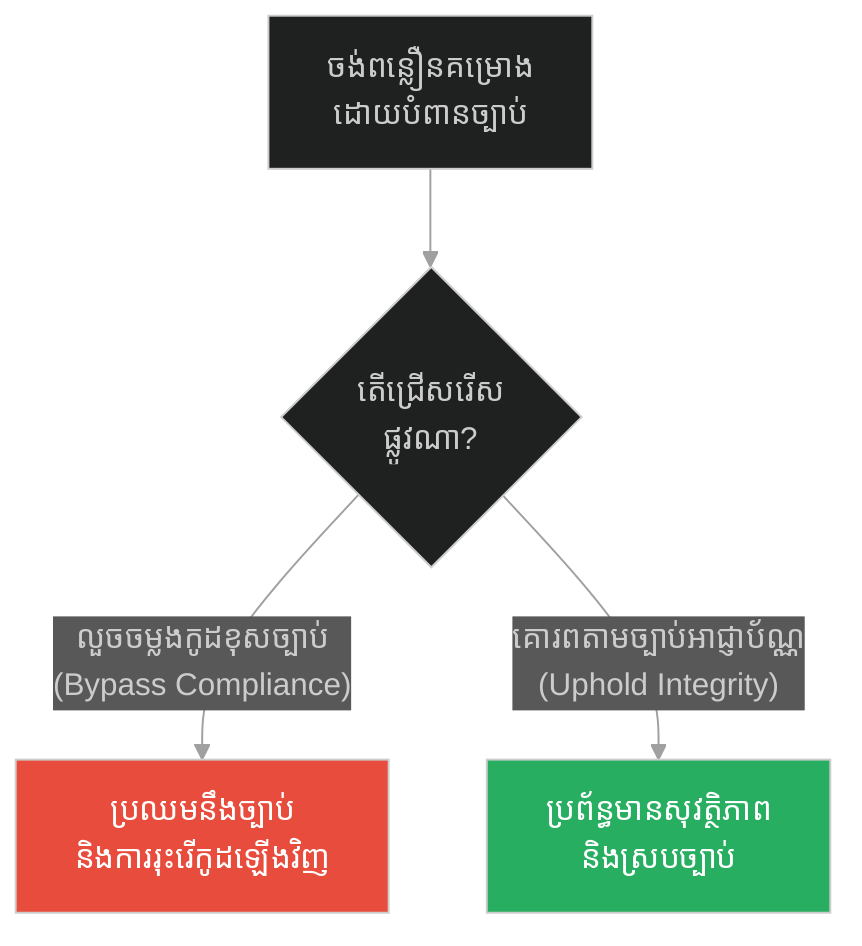
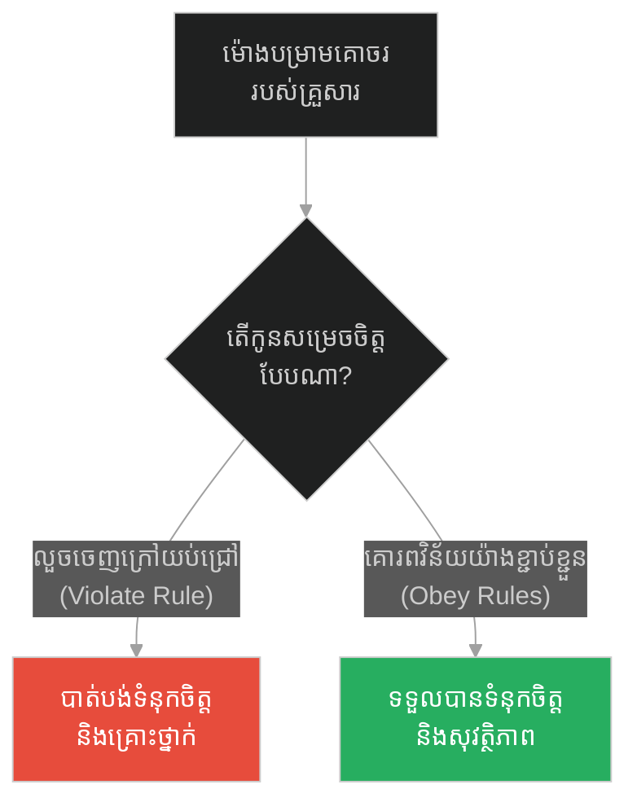
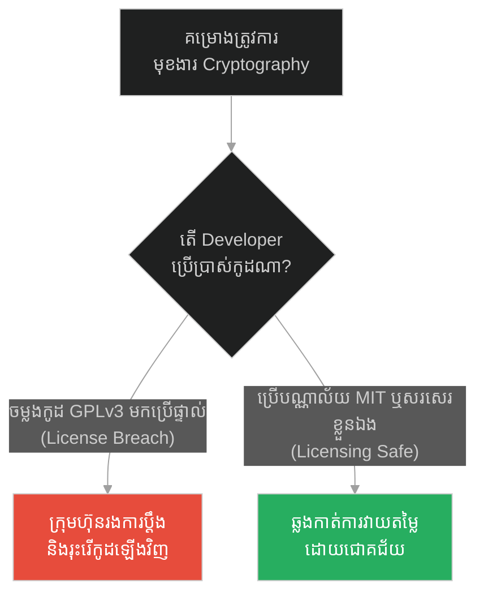
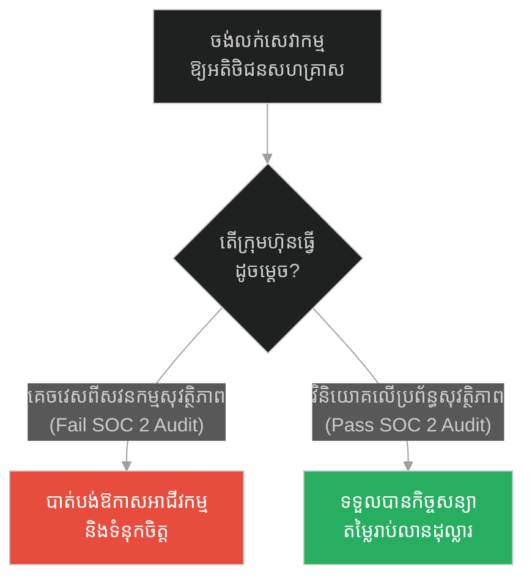
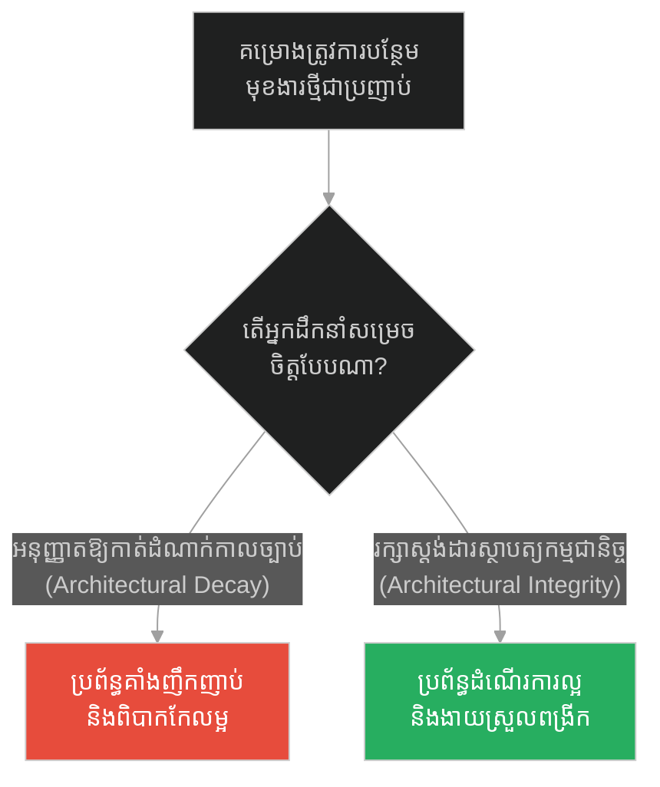
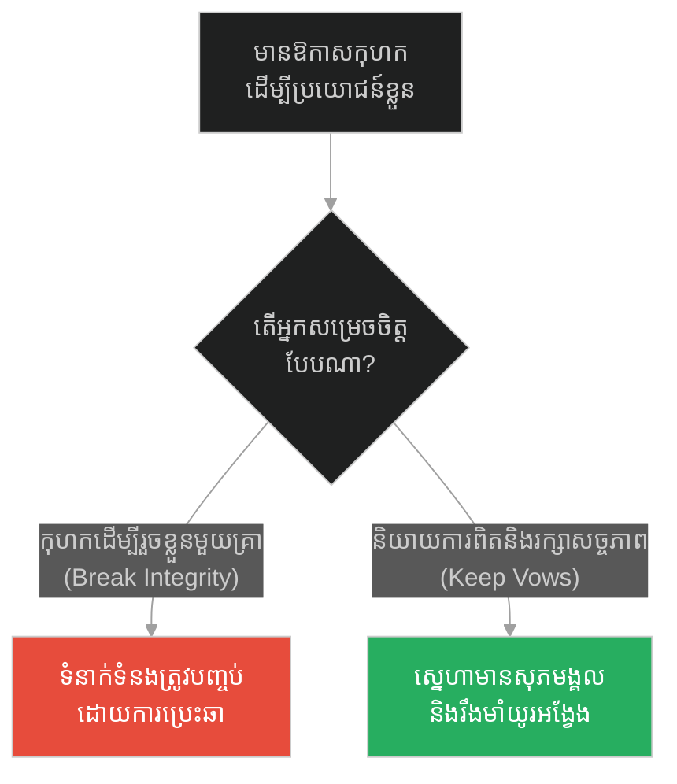
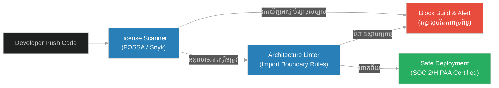

# Software Compliance, Audit Certification & Architectural Integrity (ការផឹកថ្នាំពុល)៖ ការអនុលោមតាមច្បាប់អាជ្ញាប័ណ្ណ និងសុចរិតភាពស្ថាបត្យកម្ម (Software Compliance, Audit Certification & Architectural Integrity & Standard Compliance and Contract Guardrails & Drinking the Hemlock)

**Author:** ichamrong  
**Date:** 2026-05-28  
**Tags:** #socrates #compliance #audit #licensing #architectural-integrity  
**Category:** Concepts  
**Read Time:** ~12 min  

---

## 📌 មាតិកា (Table of Contents)
- [អន្ទាក់ផ្លូវចិត្ត (The Trap)](#0)
- [១. រឿងព្រេងនិទាន៖ ការផឹកថ្នាំពុលហេមឡុក (The Legend of Drinking the Hemlock)](#1)
  - [សុចរិតភាពជាគ្រឹះនៃតម្លៃ (Integrity as the Foundation of Value)](#1-1)
- [២. បញ្ហា៖ ការអនុលោមភាព និងសុចរិតភាពស្ថាបត្យកម្ម (The Issue: Software Compliance & Architectural Integrity)](#2)
- [៣. ឧទាហរណ៍ជាក់ស្តែងក្នុងពិភពពិត (Real World Examples)](#3)
  - [ឧទាហរណ៍ទី ១ — កម្រិតស្រាល (គ្រួសារ)៖ ការគោរពវិន័យបម្រាមគោចរ (The Family Curfew Rules)](#3-1)
  - [ឧទាហរណ៍ទី ២ — កម្រិតមធ្យម (បច្ចេកទេស)៖ ការប្រើប្រាស់កូដ GPL ក្នុងផលិតផលពាណិជ្ជកម្ម (The Dev License Infection)](#3-2)
  - [ឧទាហរណ៍ទី ៣ — កម្រិតមធ្យម (ធុរកិច្ច)៖ ការធ្វើសវនកម្មសុវត្ថិភាពទិន្នន័យ (The Business SOC 2 Compliance)](#3-3)
  - [ឧទាហរណ៍ទី ៤ — កម្រិតមធ្យម (សង្គម/គ្រប់គ្រង)៖ ការអនុវត្តស្តង់ដារស្ថាបត្យកម្ម (The Management Architectural Standards)](#3-4)
  - [ឧទាហរណ៍ទី ៥ — កម្រិតធ្ងន់ (ទំនាក់ទំនង)៖ ការរក្សាពាក្យសន្យា និងសច្ចភាព (The Relationship Vows of Integrity)](#3-5)
- [៤. ដំណោះស្រាយទូទៅ៖ ការបង្កើតប្រព័ន្ធត្រួតពិនិត្យអនុលោមភាពស្វ័យប្រវត្តិ (The General Solution: Automated Compliance Workflow)](#4)
- [សេចក្តីសន្និដ្ឋាន (Conclusion)](#5)
- [ឯកសារយោង (References)](#6)
- [Related Posts](#7)

---

<a id="0"></a>
## អន្ទាក់ផ្លូវចិត្ត (The Trap)

តើអ្នកធ្លាប់លួចចម្លងកូដពីប្រភពបើកចំហ (Open Source) មកដាក់ក្នុងគម្រោងពាណិជ្ជកម្មរបស់ក្រុមហ៊ុន ដើម្បីកាត់បន្ថយពេលវេលាដឹកជញ្ជូនមុខងារដែរឬទេ? នេះគឺជាអន្ទាក់នៃការគេចវេសពីច្បាប់ និងអនុលោមភាព (Compliance) ដើម្បីសេចក្តីសុខបណ្តោះអាសន្ន។ ដូចជាការលួចរត់គេចចេញពីគុកដើម្បីសង្គ្រោះជីវិត តែវាបានបំផ្លាញចោលនូវគោលការណ៍គ្រឹះ និងសុចរិតភាពរបស់ប្រព័ន្ធទាំងស្រុង។

* **ការរំលោភលើច្បាប់អនុលោមភាព (Bypassing Compliance)** — ជួយសន្សំពេលវេលា និងដោះស្រាយបញ្ហាបន្ទាន់បានលឿន ប៉ុន្តែប្រឈមនឹងការប្តឹងផ្តល់ផ្លូវច្បាប់ និងការខូចខាតកេរ្តិ៍ឈ្មោះធ្ងន់ធ្ងរ។
* **ការរក្សាគោលការណ៍ច្បាប់ និងស្ថាបត្យកម្ម (Compliance & Integrity)** — ទាមទារការត្រួតពិនិត្យ និងការធ្វើសវនកម្មស្មុគស្មាញ ប៉ុន្តែការពារសុវត្ថិភាព និងនិរន្តរភាពរបស់ក្រុមហ៊ុន។

ប្លង់មេសម្រាប់ការយល់ដឹងពីមេរៀននេះ៖
1. **រឿងព្រេងនិទាន (The Legend)** — ការបដិសេធរបស់សូក្រាតក្នុងការរត់គេចខ្លួនពីពែងថ្នាំពុល។
2. **បញ្ហា (The Issue)** — ការវិភាគពីគ្រោះថ្នាក់នៃការបំពានអាជ្ញាប័ណ្ណ (Software Licenses) និងច្បាប់ស្ថាបត្យកម្ម។
3. **ឧទាហរណ៍ជាក់ស្តែង (Real World Examples)** — ករណីសិក្សាទាំង ៥ កម្រិតនៃការរក្សាសុចរិតភាពច្បាប់និងវិន័យ។
4. **ដំណោះស្រាយទូទៅ (The General Solution)** — ការរៀបចំប្រព័ន្ធសវនកម្មអាជ្ញាប័ណ្ណស្វ័យប្រវត្តិ។



---

<a id="1"></a>
## ១. រឿងព្រេងនិទាន៖ ការផឹកថ្នាំពុលហេមឡុក (The Legend of Drinking the Hemlock)

បន្ទាប់ពីតុលាការក្រុងអាថែនបានកាត់ទោសប្រហារជីវិតសូក្រាត ដោយឱ្យគាត់ផឹកថ្នាំពុលហេមឡុក (Hemlock) សូក្រាតត្រូវបានគេយកទៅឃុំក្នុងគុក រង់ចាំថ្ងៃប្រហារជីវិត។

មិត្តភក្តិដ៏មានអំណាចនិងទ្រព្យសម្បត្តិរបស់គាត់ឈ្មោះ គ្រីតូ (Crito) បានសូកប៉ាន់ឆ្មាំគុក និងរៀបចំផែនការយ៉ាងល្អឥតខ្ចោះ ដើម្បីរំដោះសូក្រាតឱ្យរត់គេចខ្លួនទៅរស់នៅទីក្រុងផ្សេង។ គ្រីតូបានចូលទៅក្នុងគុក ហើយអង្វរសូក្រាតឱ្យរត់គេច ដោយប្រាប់ថា៖ *"បើលោកស្លាប់ ពួកយើងនឹងបាត់បង់មិត្តដ៏ល្អ ហើយអ្នកក្រុងផ្សេងនឹងជេរពួកយើងថា រក្សាជីវិតលោកមិនបាន។ លោកត្រូវតែរត់!"*

ជំនួសឱ្យការត្រេកអរ និងរត់គេច សូក្រាតបានបដិសេធយ៉ាងដាច់អហង្ការ។ គាត់បានពន្យល់គ្រីតូថា៖ 

> **«ពេញមួយជីវិតរបស់ខ្ញុំ ខ្ញុំបានបង្រៀនយុវជនឱ្យគោរពច្បាប់ និងធ្វើជាពលរដ្ឋល្អ។ បើថ្ងៃនេះ ខ្ញុំលួចរត់គេចខ្លួនដោយសារតែខ្លាចស្លាប់ តើពាក្យបង្រៀនរបស់ខ្ញុំមានន័យអ្វីទៀត? ខ្ញុំនឹងក្លាយជាមនុស្សលាក់ពុត! ខ្ញុំបានចុះកិច្ចសន្យាសង្គមជាមួយទីក្រុងនេះតាំងពីកើតមកម្ល៉េះ។ បើខ្ញុំរត់ ខ្ញុំគឺជាអ្នកបំផ្លាញច្បាប់នៃទីក្រុងនេះ។ ការស្លាប់ គឺជារឿងធម្មជាតិ ប៉ុន្តែការរស់នៅដោយបំផ្លាញគោលការណ៍របស់ខ្លួនឯង ទើបជារឿងដែលគួរឱ្យខ្លាចបំផុត។»**  
> *(“To break the laws of Athens just to prolong my life is to destroy the very principles I have lived and taught. I will drink the cup.”)*

ទីបំផុត គាត់បានយកពែងថ្នាំពុលនោះ មកផឹកយ៉ាងស្ងប់ស្ងាត់ និងសប្បាយចិត្ត នៅចំពោះមុខមិត្តភក្តិដែលកំពុងយំសោក។

<a id="1-1"></a>
### សុចរិតភាពជាគ្រឹះនៃតម្លៃ (Integrity as the Foundation of Value)

ទង្វើរបស់សូក្រាតបានបង្ហាញឱ្យឃើញថា គោលការណ៍និងកិច្ចសន្យា គឺមានតម្លៃខ្ពស់ជាងជីវិតផ្ទាល់ខ្លួន។ ប្រសិនបើគាត់ជ្រើសរើសការរត់គេចខ្លួន គាត់អាចនឹងរស់រានមានជីវិត ប៉ុន្តែប្រវត្តិសាស្ត្រនឹងចងចាំគាត់ក្នុងនាមជាទស្សនវិទូក្លែងក្លាយម្នាក់ ដែលមិនហ៊ានឈរការពារអ្វីដែលខ្លួនបានបង្រៀន។ នៅក្នុងវិស្វកម្មសូហ្វវែរ ការរក្សាសុចរិតភាពស្ថាបត្យកម្ម (Architectural Integrity) និងការគោរពតាមលក្ខខណ្ឌអាជ្ញាប័ណ្ណ (Software Compliance) ជារឿយៗបង្កើតភាពលំបាក និងការយឺតយ៉ាវនៅពេលដំបូង ប៉ុន្តែវាគឺជាខែលការពារក្រុមហ៊ុនពីការក្ស័យធន និងការបាត់បង់កេរ្តិ៍ឈ្មោះនៅថ្ងៃអនាគត។

---

<a id="2"></a>
## ២. បញ្ហា៖ ការអនុលោមភាព និងសុចរិតភាពស្ថាបត្យកម្ម (The Issue: Software Compliance & Architectural Integrity)

នៅក្នុងគម្រោងធំៗ ការខ្វះការត្រួតពិនិត្យអនុលោមភាពច្បាប់ និងការបំពានស្តង់ដារស្ថាបត្យកម្ម នាំមកនូវផលវិបាកធ្ងន់ធ្ងរ៖
1. **License Contamination (ការចម្លងរោគអាជ្ញាប័ណ្ណ):** ការយកកូដដែលមានអាជ្ញាប័ណ្ណប្រភេទ Copyleft (ដូចជា GPLv3) មកប្រើប្រាស់ក្នុងកម្មវិធីពាណិជ្ជកម្ម (Proprietary software) អាចតម្រូវឱ្យក្រុមហ៊ុនបើកចំហកូដរបស់ខ្លួនទាំងអស់ជាសាធារណៈតាមផ្លូវច្បាប់។
2. **Audit Failures:** មិនអាចទទួលបានវិញ្ញាបនបត្រស្តង់ដារសុវត្ថិភាពដូចជា SOC 2, HIPAA (សុខាភិបាល) ឬ PCI-DSS (ទូទាត់ប្រាក់) ដែលធ្វើឱ្យបាត់បង់អតិថិជនសហគ្រាសធំៗ។
3. **Architectural Erosion:** ការប្រើប្រាស់វិធីកាត់ (hacks) ដើម្បីពន្លឿនការងារ (ដូចជាការសរសេរ UI ភ្ជាប់ទៅ Database ដោយផ្ទាល់ដោយមិនឆ្លងកាត់ API Layer) ធ្វើឱ្យប្រព័ន្ធបាត់បង់រចនាសម្ព័ន្ធ និងងាយស្រួលរងការវាយប្រហារ។

ខាងក្រោមនេះជាការប្រៀបធៀបរវាងការបំពានច្បាប់ស្ថាបត្យកម្ម/អាជ្ញាប័ណ្ណ និងការគោរពតាមស្តង់ដារ៖

### ❌ វិធីសាស្ត្រផុយស្រួយ (Fragile: Direct Licensing & Structural Violation)
```typescript
// គ្រោះថ្នាក់៖ ការយកកូដពីបណ្ណាល័យ GPLv3 មកសរសេរបញ្ចូលជាមួយកូដរបស់ក្រុមហ៊ុនផ្ទាល់
// នេះជាការរំលោភលើច្បាប់ចម្លង (License Infringement)
import { gplCryptographicAlgorithm } from "gpl-licensed-library";

export class ProprietaryCoreService {
  public encryptSensitiveData(data: string): string {
    // បំពានច្បាប់៖ ការប្រើប្រាស់កូដ GPLv3 នៅក្នុងកូដពាណិជ្ជកម្មដែលបិទជិត
    return gplCryptographicAlgorithm(data);
  }

  public directDatabaseHack(query: string) {
    // បំពានស្ថាបត្យកម្ម៖ ហៅទិន្នន័យពី UI មក Database ដោយផ្ទាល់ ដោយមិនឆ្លងកាត់ Authentication Layer
    const db = new DatabaseConnection();
    return db.rawExecute(query);
  }
}
```

###  វិធីសាស្ត្រធន់មាំ (Resilient: Abstracted Compliance & Boundary Integrity)
```typescript
import { MITLicensedEncryptor } from "mit-licensed-library";
import { SecurityGatekeeper } from "./security-gatekeeper";

// ១. ប្រើប្រាស់បណ្ណាល័យដែលមានអាជ្ញាប័ណ្ណសមស្រប (Permissive License: MIT/Apache)
// ២. រក្សាសុចរិតភាពស្ថាបត្យកម្មតាមរយៈ Interface និង Separation of Concerns
export interface Encryptor {
  encrypt(data: string): string;
}

export class SafeEncryptionService implements Encryptor {
  private encryptorInstance: MITLicensedEncryptor;

  constructor() {
    this.encryptorInstance = new MITLicensedEncryptor();
  }

  public encrypt(data: string): string {
    return this.encryptorInstance.execute(data);
  }
}

export class SecureDataController {
  // ៣. ធានាថាការហៅទិន្នន័យត្រូវឆ្លងកាត់ Gateway និង Security Layer ជានិច្ច
  public async handleUserDataRequest(token: string, userId: string): Promise<any> {
    const isAuthorized = await SecurityGatekeeper.validateToken(token);
    if (!isAuthorized) {
      throw new Error("Unauthorized architectural access blocked!");
    }
    
    const dbGateway = new UserDatabaseGateway();
    return await dbGateway.getUserById(userId);
  }
}
```

---

<a id="3"></a>
## ៣. ឧទាហរណ៍ជាក់ស្តែងក្នុងពិភពពិត (Real World Examples)

<a id="3-1"></a>
### ឧទាហរណ៍ទី ១ — កម្រិតស្រាល (គ្រួសារ)៖ ការគោរពវិន័យបម្រាមគោចរ (The Family Curfew Rules)
* **ការពន្យល់៖** កូនៗចង់សប្បាយដោយលួចចេញក្រៅផ្ទះហួសម៉ោងបម្រាមគោចរ (រំលោភលើកិច្ចសន្យាគ្រួសារ)។ ផលវិបាកគឺការបាត់បង់ទំនុកចិត្តពីឪពុកម្តាយ និងប្រឈមនឹងគ្រោះថ្នាក់។ ការគោរពច្បាប់គ្រួសារជួយរក្សាសុវត្ថិភាព និងទំនុកចិត្តយូរអង្វែង។



<a id="3-2"></a>
### ឧទាហរណ៍ទី ២ — កម្រិតមធ្យម (បច្ចេកទេស)៖ ការប្រើប្រាស់កូដ GPL ក្នុងផលិតផលពាណិជ្ជកម្ម (The Dev License Infection)
* **ការពន្យល់៖** ក្រុមការងារសរសេរកូដមួយបានលួចចម្លងកូដដែលមានអាជ្ញាប័ណ្ណ GPLv3 មកដាក់ក្នុង SaaS Product របស់ក្រុមហ៊ុន។ នៅពេលធ្វើសវនកម្មមុនពេលលក់ក្រុមហ៊ុន (Due Diligence) អ្នកទិញបានរកឃើញ និងបង្ខំឱ្យសរសេរកូដថ្មីឡើងវិញទាំងអស់ ដែលធ្វើឱ្យខាតបង់ពេលវេលានិងថវិការាប់លានដុល្លារ។



<a id="3-3"></a>
### ឧទាហរណ៍ទី ៣ — កម្រិតមធ្យម (ធុរកិច្ច)៖ ការធ្វើសវនកម្មសុវត្ថិភាពទិន្នន័យ (The Business SOC 2 Compliance)
* **ការពន្យល់៖** Startup មួយចង់លក់សេវាកម្មឱ្យធនាគារធំមួយ។ ធនាគារតម្រូវឱ្យមានវិញ្ញាបនបត្រ SOC 2 Type II។ ប្រសិនបើ Startup បន្លំឯកសារ ឬគេចវេសពីការអនុវត្តច្បាប់សុវត្ថិភាព ពួកគេនឹងត្រូវលុបចោលកិច្ចសន្យា និងរងការផាកពិន័យ។ ការបំពេញតាមលក្ខខណ្ឌច្បាប់ជួយឱ្យអាជីវកម្មរីកចម្រើន។



<a id="3-4"></a>
### ឧទាហរណ៍ទី ៤ — កម្រិតមធ្យម (សង្គម/គ្រប់គ្រង)៖ ការអនុវត្តស្តង់ដារស្ថាបត្យកម្ម (The Management Architectural Standards)
* **ការពន្យល់៖** ប្រធានគ្រប់គ្រងគម្រោង បង្ខំឱ្យ Developer សរសេរបញ្ជូនទិន្នន័យទៅកាន់ Database ដោយផ្ទាល់ដើម្បីបញ្ចប់ការងារលឿន។ លទ្ធផលគឺប្រព័ន្ធងាយរងគ្រោះថ្នាក់ និងបាត់បង់ស្ថិរភាព។ ការប្រកាន់ខ្ជាប់នូវច្បាប់ស្ថាបត្យកម្មជួយឱ្យប្រព័ន្ធរឹងមាំ។



<a id="3-5"></a>
### ឧទាហរណ៍ទី ៥ — កម្រិតធ្ងន់ (ទំនាក់ទំនង)៖ ការរក្សាពាក្យសន្យា និងសច្ចភាព (The Relationship Vows of Integrity)
* **ការពន្យល់៖** នៅក្នុងទំនាក់ទំនងស្នេហា ការរក្សាពាក្យសន្យា (សច្ចភាព) គឺជាច្បាប់គ្រឹះ។ ទោះបីជាមានឱកាសគេចវេស ឬទទួលបានផលប្រយោជន៍ផ្ទាល់ខ្លួនដោយការកុហកក៏ដោយ ការជ្រើសរើសមិនបោកប្រាស់ដៃគូគឺជាការរក្សាសុចរិតភាពនៃស្នេហាឱ្យរឹងមាំជាអមតៈ។



---

<a id="4"></a>
## ៤. ដំណោះស្រាយទូទៅ៖ ការបង្កើតប្រព័ន្ធត្រួតពិនិត្យអនុលោមភាពស្វ័យប្រវត្តិ (The General Solution: Automated Compliance Workflow)

ដើម្បីកុំឱ្យមានការបំពានច្បាប់អាជ្ញាប័ណ្ណ និងស្ថាបត្យកម្មដោយចៃដន្យ យើងត្រូវប្រើប្រាស់ឧបករណ៍ស្វ័យប្រវត្តិកំណត់ដែនកំណត់សុវត្ថិភាព (Compliance Guardrails)៖

1. **Automated License Scanner (FOSSA / Snyk):** ដំណើរការត្រួតពិនិត្យរាល់បណ្ណាល័យ (Dependencies) ទាំងអស់នៅក្នុង CI/CD pipeline ដើម្បីស្វែងរក និងទប់ស្កាត់រាល់អាជ្ញាប័ណ្ណដែលមិនអនុញ្ញាត (ដូចជា GPL, AGPL) មុននឹងបញ្ចូលទៅកាន់ production។
2. **ArchUnit / Import Linters:** ប្រើប្រាស់ឧបករណ៍ពិនិត្យស្ថាបត្យកម្មដើម្បីធានាថា គ្មានកូដស្រទាប់ខាងលើ (UI Layer) ណាអាចហៅទៅកាន់ស្រទាប់ខាងក្រោម (Database Layer) ដោយផ្ទាល់បានឡើយ។
3. **Continuous Compliance Monitoring:** ប្រើប្រាស់ Dashboard រាយការណ៍ពីស្ថានភាពអនុលោមភាពទូទាំងក្រុមហ៊ុនជាប្រចាំ។



---

## 🐇 ធ្លាក់ចូលក្នុងរន្ធទន្សាយ (Enter the Rabbit Hole)
ការប្រកាន់ខ្ជាប់នូវច្បាប់ និងស្ថាបត្យកម្មដ៏តឹងរ៉ឹងជួយឱ្យប្រព័ន្ធរបស់អ្នករួចផុតពីការចោទប្រកាន់ផ្លូវច្បាប់។ ប៉ុន្តែតើយើងត្រូវដោះស្រាយយ៉ាងដូចម្តេច នៅពេលដែលប្រព័ន្ធរងការវាយប្រហារដោយមិនរំពឹងទុក ឬមានការបញ្ចូលតម្លៃមិនប្រក្រតីពីខាងក្រៅ? ចូរប្រញាប់បន្តដំណើរទៅកាន់៖

* 🚀 **[ចាប់ផ្តើមដំណើររុករក (Start the Journey) ➔ Defensive Programming & Fault Isolation (ការទាត់ពីបុរសកំហឹង)៖ ការសរសេរកូដការពារ និងការបំបែកភាពមិនប្រក្រតី](./233-socrates-and-the-angry-man.md)**

---

<a id="5"></a>
## សេចក្តីសន្និដ្ឋាន (Conclusion)

> **«ការរស់នៅដោយគ្មានគោលការណ៍ និងការបំផ្លាញសុចរិតភាពរបស់ខ្លួន គឺគួរឱ្យខ្លាចជាងសេចក្តីស្លាប់ទៅទៀត។»**

ការគោរពតាមច្បាប់ អនុលោមភាព និងស្ថាបត្យកម្ម ជារឿយៗទាមទារការលះបង់ និងការតស៊ូប្រឆាំងនឹងភាពងាយស្រួលបណ្តោះអាសន្ន។ ទោះបីជាការលួចកាត់តម្រង់ផ្លូវ ឬរំលោភច្បាប់អាចជួយឱ្យយើងរួចខ្លួនក្នុងពេលបច្ចុប្បន្ន ក៏វាបំផ្លាញទំនុកចិត្ត និងសុចរិតភាពនាពេលអនាគតដែរ។ ការប្រកាន់ខ្ជាប់នូវច្បាប់ គឺជាមាគ៌ាតែមួយគត់ដើម្បីកសាងអ្វីៗដែលមានតម្លៃរឹងមាំយូរអង្វែង និងទទួលបានការគោរពពិតប្រាកដ។

---

<a id="6"></a>
## ឯកសារយោង (References)

* **Plato** — *Crito* (399 BC). The philosophical dialogue where Socrates argues why citizens must obey the laws of the state, even in the face of death.
* **Bruce Perens** — *The Open Source Definition* (1998). Explanations on copyleft and permissive licenses in software distribution.
* **Robert C. Martin** — *Clean Architecture: A Craftsman's Guide to Software Structure and Design* (2017). Detailed guidelines on keeping architectural boundaries clean.

---

<a id="7"></a>
## Related Posts

* [Defensive Programming & Fault Isolation (ការទាត់ពីបុរសកំហឹង)៖ ការសរសេរកូដការពារ និងការបំបែកភាពមិនប្រក្រតី](./233-socrates-and-the-angry-man.md) — ស្វែងយល់ពីរបៀបដែលប្រព័ន្ធទប់ទល់នឹងការវាយប្រហារដោយមិនរំពឹងទុក។
* [Linter Rules & Static Code Analysis (សត្វរុយរបស់ទីក្រុងអាថែន)៖ ច្បាប់ Linter និងការវិភាគកូដឋិតិវន្ត](./231-socrates-and-the-courage-to-speak.md) — របៀបចង្អុលបង្ហាញកំហុសតូចៗដើម្បីការពារប្រព័ន្ធទាំងមូល។
