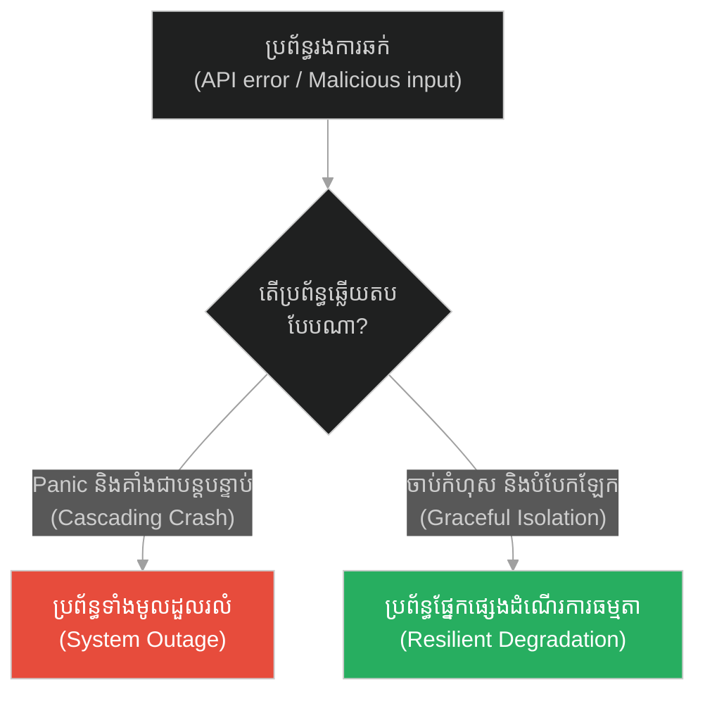
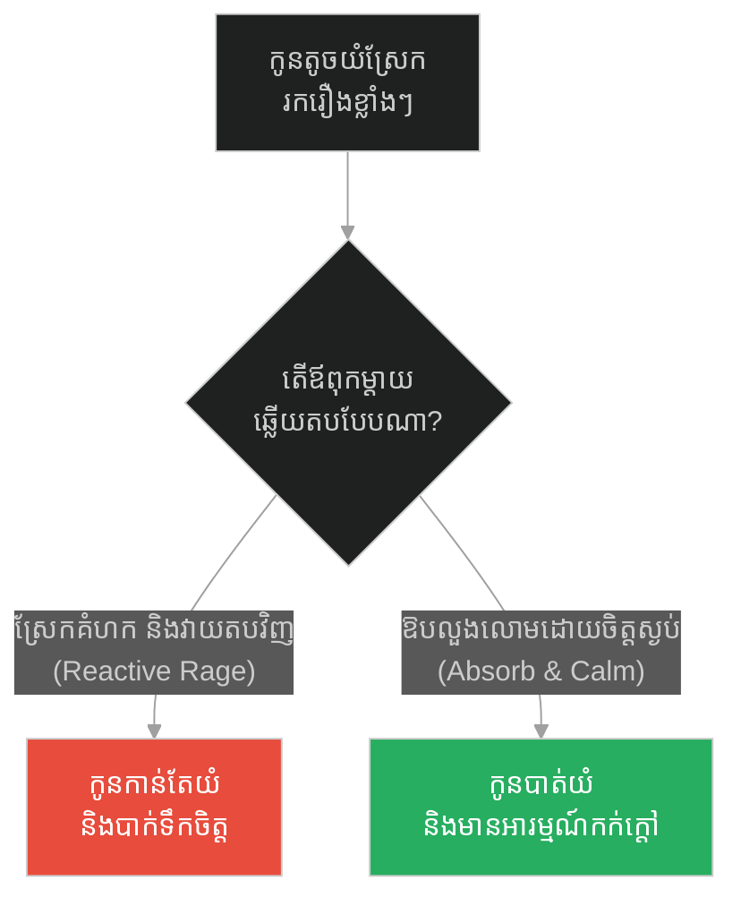
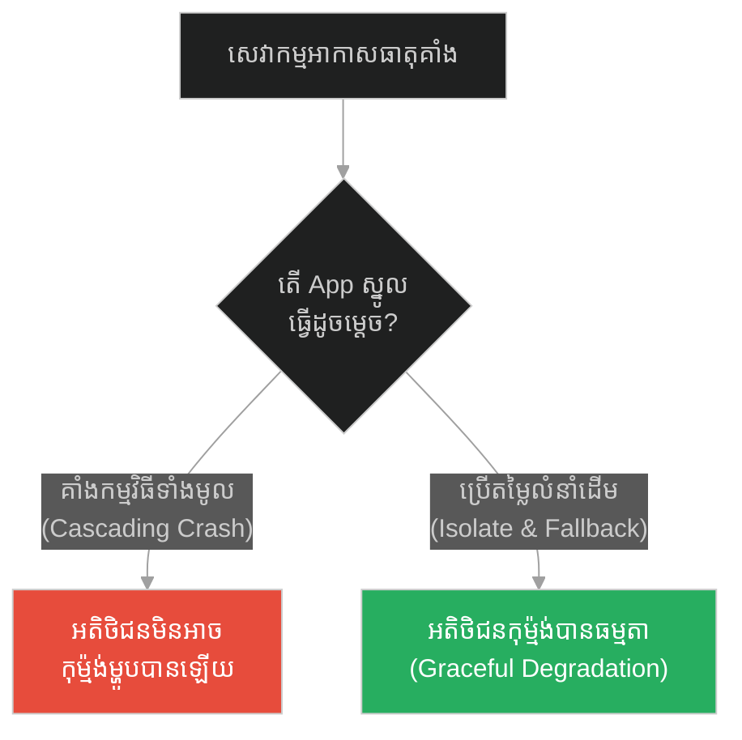
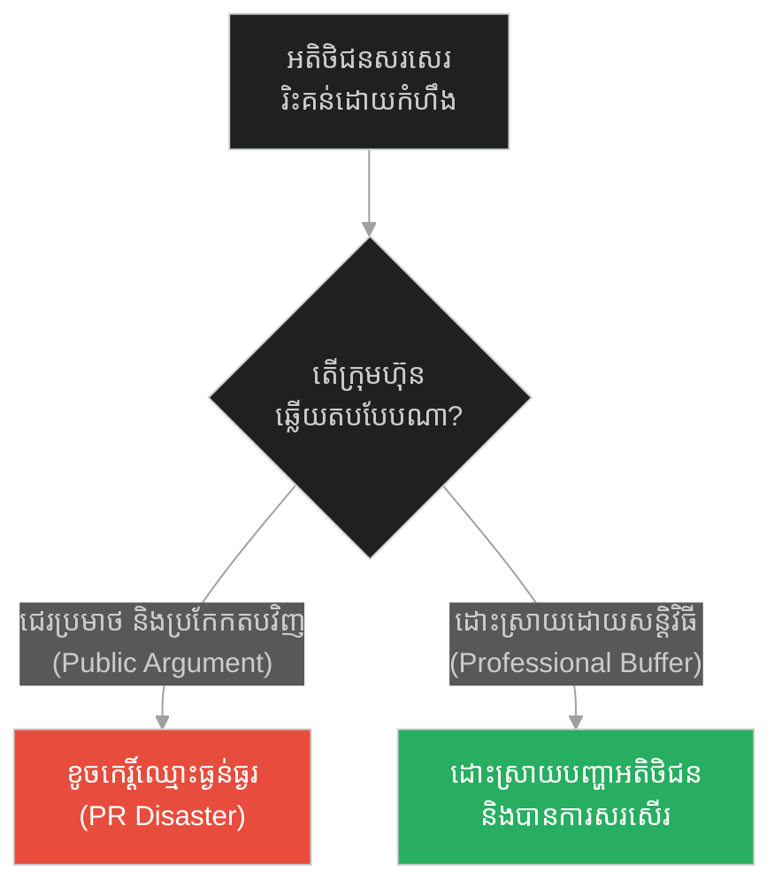
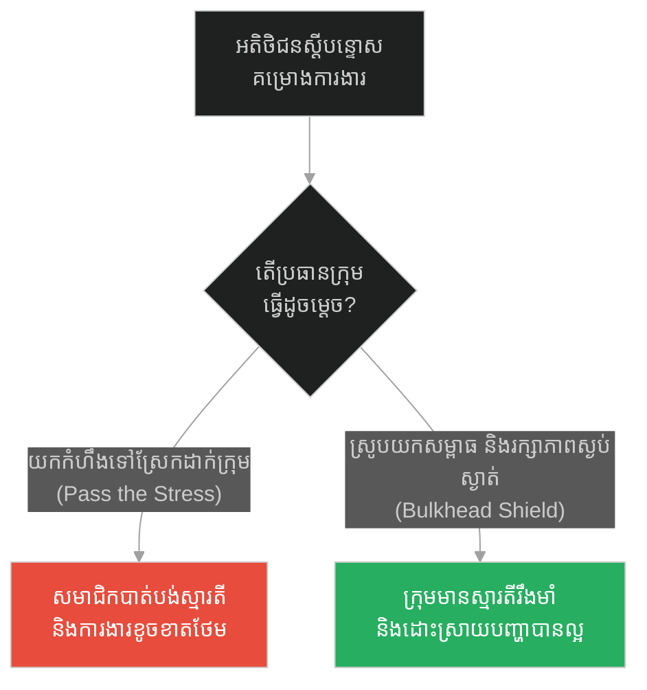
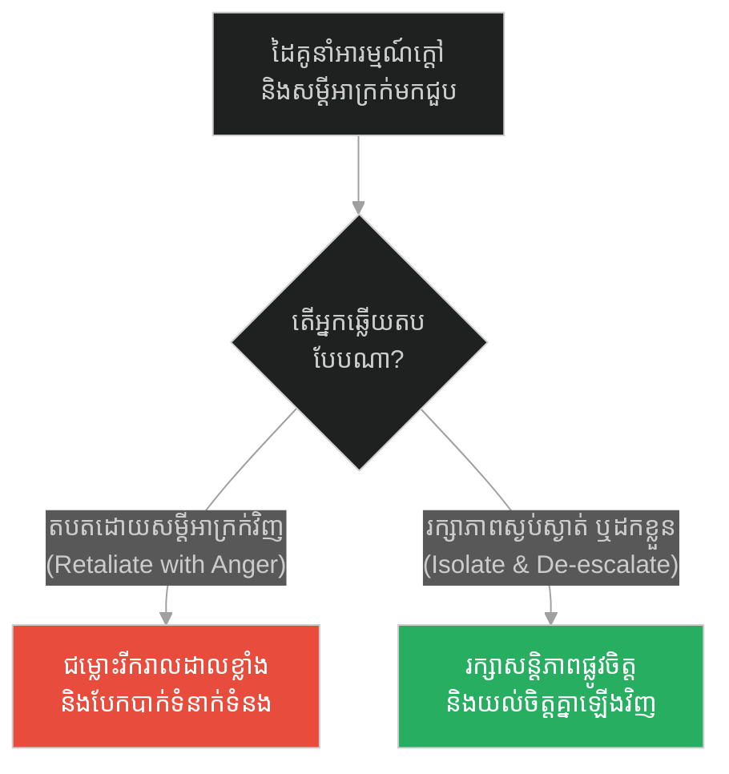
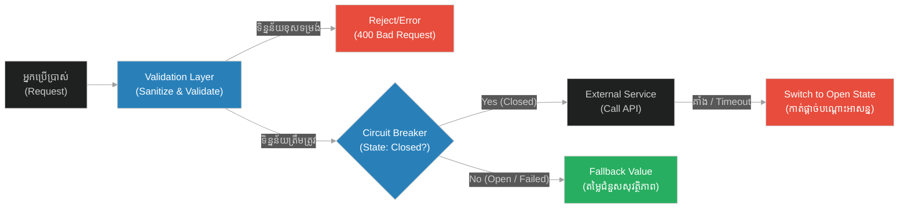

# Defensive Programming & Fault Isolation (ការទាត់ពីបុរសកំហឹង)៖ ការសរសេរកូដការពារ និងការបំបែកភាពមិនប្រក្រតី (Defensive Programming & Fault Isolation & Graceful Exception Handling and Circuit Breaking & The Angry Man's Kick)

**Author:** ichamrong  
**Date:** 2026-05-28  
**Tags:** #socrates #defensive-programming #fault-isolation #circuit-breaker #robustness  
**Category:** Concepts  
**Read Time:** ~12 min  

---

## 📌 មាតិកា (Table of Contents)
- [អន្ទាក់ផ្លូវចិត្ត (The Trap)](#0)
- [១. រឿងព្រេងនិទាន៖ ការទាត់ពីបុរសកំហឹង (The Legend of The Angry Man's Kick)](#1)
  - [ភាពមិនរំភើបញាប់ញ័រចំពោះកំហុសក្រៅខ្លួន (Equanimity Against External Faults)](#1-1)
- [២. បញ្ហា៖ ការសរសេរកូដការពារ និងការបំបែកភាពមិនប្រក្រតី (The Issue: Defensive Programming & Fault Isolation)](#2)
- [៣. ឧទាហរណ៍ជាក់ស្តែងក្នុងពិភពពិត (Real World Examples)](#3)
  - [ឧទាហរណ៍ទី ១ — កម្រិតស្រាល (គ្រួសារ)៖ ការទប់ទល់នឹងកូនយំរករឿង (The Family Tantrum Shield)](#3-1)
  - [ឧទាហរណ៍ទី ២ — កម្រិតមធ្យម (បច្ចេកទេស)៖ ការគ្រប់គ្រងការគាំងនៃសេវាកម្មរង (The Dev Microservice Failure)](#3-2)
  - [ឧទាហរណ៍ទី ៣ — កម្រិតមធ្យម (ធុរកិច្ច)៖ ការឆ្លើយតបនឹងអតិថិជនខឹងសម្បារ (The Business PR Buffer)](#3-3)
  - [ឧទាហរណ៍ទី ៤ — កម្រិតមធ្យម (សង្គម/គ្រប់គ្រង)៖ អ្នកដឹកនាំការពារសម្ពាធឱ្យក្រុម (The Management Stress Absorber)](#3-4)
  - [ឧទាហរណ៍ទី ៥ — កម្រិតធ្ងន់ (ទំនាក់ទំនង)៖ ការរក្សាចិត្តត្រជាក់ក្នុងពេលឈ្លោះគ្នា (The Relationship Emotional Boundary)](#3-5)
- [៤. ដំណោះស្រាយទូទៅ៖ ស្ថាបត្យកម្មការពារ និងបំបែកភាពមិនប្រក្រតី (The General Solution: Circuit Breaker & Input Validation Architecture)](#4)
- [សេចក្តីសន្និដ្ឋាន (Conclusion)](#5)
- [ឯកសារយោង (References)](#6)
- [Related Posts](#7)

---

<a id="0"></a>
## អន្ទាក់ផ្លូវចិត្ត (The Trap)

នៅពេលដែលប្រព័ន្ធរបស់អ្នករងការវាយប្រហារដោយមិនរំពឹងទុក ឬទទួលបានទិន្នន័យមិនប្រក្រតីពីខាងក្រៅ តើវាបង្កឱ្យមានការគាំងជាខ្សែសង្វាក់ (Cascading Failure) ដល់ប្រព័ន្ធទាំងមូលដែរឬទេ? នេះគឺជាអន្ទាក់នៃការឆ្លើយតបតបតាមកំហឹង ឬប្រតិកម្មតបតភ្លាមៗ (Reactive Panic) ដែលធ្វើឱ្យកំហុសតូចមួយនៅខាងក្រៅ ក្លាយជាមហន្តរាយដ៏ធំនៅខាងក្នុង។

* **ការទុកឱ្យកំហុសរាលដាល (Cascading Failure)** — ងាយស្រួលសរសេរកូដដំបូង តែធ្វើឱ្យប្រព័ន្ធទាំងមូលគាំងភ្លាមៗនៅពេលមានផ្នែកណាមួយជួបបញ្ហា។
* **ការសរសេរកូដការពារ និងបំបែកភាពមិនប្រក្រតី (Defensive Isolation)** — បន្ថែមកូដត្រួតពិនិត្យ និង Circuit Breaker ស្មុគស្មាញ តែធានាថាកំហុសផ្នែកមួយមិនអាចបំផ្លាញប្រព័ន្ធទាំងមូលបានឡើយ។

ប្លង់មេសម្រាប់ការយល់ដឹងពីមេរៀននេះ៖
1. **រឿងព្រេងនិទាន (The Legend)** — ទស្សនវិជ្ជាសូក្រាតចំពោះការទាត់ពីបុរសកំហឹងដោយចាត់ទុកដូចជាសត្វលា។
2. **បញ្ហា (The Issue)** — ការវិភាគពីភាពផុយស្រួយនៃប្រព័ន្ធដែលគ្មានការការពារ និងគ្មានការបំបែកកំហុស (Fault Isolation)។
3. **ឧទាហរណ៍ជាក់ស្តែង (Real World Examples)** — ករណីសិក្សាទាំង ៥ កម្រិតនៃការទប់ទល់នឹងផលប៉ះពាល់ពីខាងក្រៅដោយចិត្តស្ងប់។
4. **ដំណោះស្រាយទូទៅ (The General Solution)** — ការប្រើប្រាស់គំរូ Circuit Breaker, Try-Catch boundary និង Input Validation។



---

<a id="1"></a>
## ១. រឿងព្រេងនិទាន៖ ការទាត់ពីបុរសកំហឹង (The Legend of The Angry Man's Kick)

ថ្ងៃមួយ ខណៈពេលដែលសូក្រាតកំពុងដើរតាមដងផ្លូវក្នុងទីក្រុងអាថែន ស្រាប់តែមានបុរសម្នាក់ដែលពោរពេញដោយកំហឹងនិងការច្រណែន បានស្ទុះមកពីក្រោយ ហើយទាត់សូក្រាតមួយជើងយ៉ាងខ្លាំងឱ្យដួលទៅលើដី។

មនុស្សដែលឈរមើលនៅជុំវិញនោះ មានការភ្ញាក់ផ្អើលយ៉ាងខ្លាំង។ ពួកគេគិតថាសូក្រាតនឹងក្រោកឡើង វាយតបតបុរសនោះវិញ ឬស្រែកជេរប្រមាថតបត។ ប៉ុន្តែផ្ទុយទៅវិញ សូក្រាតគ្រាន់តែក្រោកឈរឡើង បោសធូលីដីចេញពីអាវរបស់គាត់ ញញឹម ហើយបន្តដើរទៅមុខដោយចិត្តស្ងប់បំផុត។

មិត្តភក្តិរបស់គាត់ដែលនៅក្បែរនោះ ទ្រាំមិនបានក៏សួរថា៖ *"សូក្រាត! ហេតុអ្វីលោកមិនខឹង? ហេតុអ្វីលោកបណ្តោយឱ្យមនុស្សពាលម្នាក់នេះ ទាត់លោកដោយមិនឆ្លើយតបវិញអញ្ចឹង?"*

សូក្រាតបានសើច ហើយឆ្លើយតបដោយប្រយោគដ៏មានប្រាជ្ញាមួយថា៖ 

> **«បើមានសត្វលាមួយក្បាល មកទាត់ខ្ញុំដោយកំហឹងរបស់វា តើអ្នកចង់ឱ្យខ្ញុំទាត់សត្វលានោះត្រឡប់ទៅវិញឬយ៉ាងណា? ឬមួយក៏អ្នកចង់ឱ្យខ្ញុំទៅប្តឹងតុលាការ ឱ្យចាប់សត្វលានោះដាក់គុក?»**  
> *(“If a donkey kicks me, should I kick the donkey back? Or should I drag it to the court?”)*

គាត់បានពន្យល់ថា មនុស្សដែលប្រើអំពើហិង្សា និងមិនចេះគ្រប់គ្រងអារម្មណ៍ គឺប្រៀបដូចជាសត្វដែលខ្វះការគិតពិចារណាអញ្ចឹង។ ការខឹងតបតនឹងមនុស្សល្ងង់ គឺជាការបន្ទាបតម្លៃខ្លួនឯងឱ្យទៅស្មើនឹងពួកគេដែរ។

<a id="1-1"></a>
### ភាពមិនរំភើបញាប់ញ័រចំពោះកំហុសក្រៅខ្លួន (Equanimity Against External Faults)

ទស្សនវិជ្ជារបស់សូក្រាតបង្ហាញពីចំណុចសំខាន់៖ យើងមិនអាចគ្រប់គ្រងឥរិយាបថរបស់មនុស្សដទៃ (ឬការបញ្ចូលតម្លៃពីខាងក្រៅ) ឡើយ ប៉ុន្តែយើងមានសិទ្ធិអំណាចពេញលេញក្នុងការគ្រប់គ្រងប្រតិកម្មរបស់យើង។ នៅក្នុងវិស្វកម្មសូហ្វវែរ ការសរសេរកូដការពារ (Defensive Programming) គឺផ្អែកលើគោលការណ៍ដូចគ្នានេះ។ យើងត្រូវចាត់ទុកការហៅសេវាកម្មពីខាងក្រៅ (External APIs) និងទិន្នន័យដែលបញ្ចូលដោយអ្នកប្រើប្រាស់ ថាអាចនឹងមានកំហុសឆ្គង ឬមានចេតនាអាក្រក់ជានិច្ច (Untrusted Inputs)។ កូដដែលល្អ មិនត្រូវបង្ហាញភាពរំភើបញាប់ញ័រ ឬគាំងកម្មវិធីទាំងមូលដោយសារតែការ "ទាត់" ពីកំហុសខាងក្រៅឡើយ។

---

<a id="2"></a>
## ២. បញ្ហា៖ ការសរសេរកូដការពារ និងការបំបែកភាពមិនប្រក្រតី (The Issue: Defensive Programming & Fault Isolation)

ប្រសិនបើប្រព័ន្ធបច្ចេកវិទ្យាមិនត្រូវបានសរសេរឡើងដោយគោលការណ៍ការពារ និងបំបែកភាពមិនប្រក្រតី (Fault Isolation) ទេ នោះនឹងជួបផលប៉ះពាល់ដូចខាងក្រោម៖
1. **Cascading Failure (ការដួលរលំជាខ្សែសង្វាក់):** នៅពេលដែល Microservice មួយគាំង (ឧទាហរណ៍៖ សេវាកម្មណែនាំទំនិញ Recommendation Service) វានឹងធ្វើឱ្យសេវាកម្មស្នូល (Checkout / Payment) គាំងតាមដោយសារតែការរង់ចាំឆ្លើយតបយូរហួសកាលកំណត់ (Thread Exhaustion)។
2. **Unhandled Exceptions (កំហុសមិនបានគ្រោងទុក):** ការមិនបានប្រើប្រាស់ Try-Catch block សមស្រប ធ្វើឱ្យ Error តូចមួយលើ API Client ធ្វើឱ្យ Node.js server គាំងទាំងស្រុង (Uncaught Exception crash)។
3. **Data Pollution (ការបំពុលទិន្នន័យ):** ការជឿទុកចិត្តលើ input ពីខាងក្រៅដោយមិនបានធ្វើការសម្អាត (Sanitization) និង Validation នាំឱ្យមាន SQL Injection ឬការបញ្ចូលទិន្នន័យខូចទ្រង់ទ្រាយទៅក្នុង Database។

ខាងក្រោមនេះជាការប្រៀបធៀបរវាងកូដដែលផុយស្រួយ និងកូដដែលមានការការពារ៖

### ❌ វិធីសាស្ត្រផុយស្រួយ (Fragile: Direct Untrusted Integration)
```typescript
// គ្រោះថ្នាក់៖ ការជឿជាក់លើ API ខាងក្រៅដោយគ្មានការការពារ
export async function getConversionRate(currency: string) {
  // ១. គ្មានការកំណត់ Timeout៖ បើ API ខាងក្រៅយឺត ប្រព័ន្ធយើងនឹងជាប់គាំង (hang)
  // ២. គ្មាន Try-Catch៖ បើ API គាំង ឬបណ្តាញដាច់ ប្រព័ន្ធយើងនឹងគាំងទាំងស្រុង
  const response = await fetch(`https://api.external-exchange.com/rate?c=${currency}`);
  const data = await response.json();
  
  // ៣. គ្មាន Input Validation៖ បើ API ផ្ញើទិន្នន័យខុសទម្រង់ នឹងបង្កឱ្យមាន TypeError ខាងក្រោម
  return data.rate.toFixed(2); 
}
```

###  វិធីសាស្ត្រធន់មាំ (Resilient: Defensive Check & Isolation Boundary)
```typescript
import { z } from "zod";

// កំណត់ Schema សម្រាប់ត្រួតពិនិត្យទិន្នន័យបញ្ចូល (Zod schema validation)
const RateResponseSchema = z.model({
  rate: z.number().positive(),
});

export async function getConversionRateResilient(currency: string): Promise<number> {
  const controller = new AbortController();
  // ១. កំណត់ពេលកំណត់ (Timeout) ត្រឹម 2000ms ដើម្បីការពារកុំឱ្យរង់ចាំយូរពេក
  const timeoutId = setTimeout(() => controller.abort(), 2000);

  try {
    const response = await fetch(
      `https://api.external-exchange.com/rate?c=${encodeURIComponent(currency)}`,
      { signal: controller.signal }
    );
    clearTimeout(timeoutId);

    if (!response.ok) {
      throw new Error(`Exchange API returned status: ${response.status}`);
    }

    const rawData = await response.json();
    
    // ២. ផ្ទៀងផ្ទាត់ទម្រង់ទិន្នន័យ (Validate Input Data Schema)
    const parsed = RateResponseSchema.safeParse(rawData);
    if (!parsed.success) {
      throw new Error("Invalid API response format received");
    }

    return parsed.data.rate;
  } catch (error: any) {
    // ៣. បំបែកភាពមិនប្រក្រតី (Fault Isolation) និងផ្តល់នូវតម្លៃជំនួស (Fallback Value)
    console.error(`[Fault Isolated] Exchange rate query failed: ${error.message}`);
    
    // ត្រលប់ទៅប្រើប្រាស់តម្លៃលំនាំដើមចុងក្រោយដែលមានសុវត្ថិភាព (Graceful fallback)
    return getFallbackExchangeRate(currency);
  }
}

function getFallbackExchangeRate(currency: string): number {
  const fallbacks: Record<string, number> = { USD: 1.0, KHR: 4100.0, EUR: 0.92 };
  return fallbacks[currency] || 1.0;
}
```

---

<a id="3"></a>
## ៣. ឧទាហរណ៍ជាក់ស្តែងក្នុងពិភពពិត (Real World Examples)

<a id="3-1"></a>
### ឧទាហរណ៍ទី ១ — កម្រិតស្រាល (គ្រួសារ)៖ ការទប់ទល់នឹងកូនយំរករឿង (The Family Tantrum Shield)
* **ការពន្យល់៖** កូនតូចខឹងនិងយំរករឿងយ៉ាងខ្លាំង (ការទាត់)។ ឪពុកម្តាយដែលខឹង និងស្រែកគំហកតបវិញ (Reacting) ធ្វើឱ្យស្ថានការណ៍កាន់តែអាក្រក់។ ឪពុកម្តាយដែលរក្សាចិត្តត្រជាក់ ឱបកូន និងផ្តល់អារម្មណ៍កក់ក្តៅ (Defensive Boundary) ជួយសម្រាលកំហឹងកូនដោយជោគជ័យ។



<a id="3-2"></a>
### ឧទាហរណ៍ទី ២ — កម្រិតមធ្យម (បច្ចេកទេស)៖ ការគ្រប់គ្រងការគាំងនៃសេវាកម្មរង (The Dev Microservice Failure)
* **ការពន្យល់៖** នៅក្នុង App ដឹកជញ្ជូន សេវាកម្មទាញយកព័ត៌មានអាកាសធាតុគាំង។ ប្រសិនបើគ្មានការការពារ App ទាំងមូលនឹងគាំងតាម។ ដំណោះស្រាយការពារគឺការចាប់ error របស់អាកាសធាតុ រួចបង្ហាញព័ត៌មានទូទៅជំនួស ដើម្បីឱ្យអ្នកប្រើប្រាស់នៅតែអាចកុម្ម៉ង់ម្ហូបបានធម្មតា។



<a id="3-3"></a>
### ឧទាហរណ៍ទី ៣ — កម្រិតមធ្យម (ធុរកិច្ច)៖ ការឆ្លើយតបនឹងអតិថិជនខឹងសម្បារ (The Business PR Buffer)
* **ការពន្យល់៖** អតិថិជនម្នាក់សរសេរការវាយតម្លៃអាក្រក់ដោយកំហឹងលើបណ្តាញសង្គម។ បុគ្គលិកដែលចូលទៅតបតដោយជេរប្រមាថវិញ (Retaliation) បង្កើតជាមហន្តរាយ PR របស់ក្រុមហ៊ុន។ ការឆ្លើយតបដោយសុជីវធម៌ និងការដោះស្រាយបញ្ហាផ្ទាល់ខ្លួន (Fault Isolation) ជួយការពារកេរ្តិ៍ឈ្មោះអាជីវកម្ម។



<a id="3-4"></a>
### ឧទាហរណ៍ទី ៤ — កម្រិតមធ្យម (សង្គម/គ្រប់គ្រង)៖ អ្នកដឹកនាំការពារសម្ពាធឱ្យក្រុម (The Management Stress Absorber)
* **ការពន្យល់៖** នៅពេលដែលអតិថិជនស្តីបន្ទោសគម្រោងយ៉ាងខ្លាំង ប្រធានគ្រប់គ្រងដែលយកសម្ពាធនោះទៅស្រែកដាក់ក្រុមការងារបន្ត (Screaming down) ធ្វើឱ្យក្រុមបាត់បង់ទឹកចិត្ត និងធ្វើការខុសកាន់តែច្រើន។ ប្រធានគ្រប់គ្រងដែលល្អ ត្រូវធ្វើជា "ខែលស្រូបសម្ពាធ" (Bulkhead) និងដឹកនាំក្រុមដោះស្រាយបញ្ហាដោយស្ងប់ស្ងាត់។



<a id="3-5"></a>
### ឧទាហរណ៍ទី ៥ — កម្រិតធ្ងន់ (ទំនាក់ទំនង)៖ ការរក្សាចិត្តត្រជាក់ក្នុងពេលឈ្លោះគ្នា (The Relationship Emotional Boundary)
* **ការពន្យល់៖** ក្នុងពេលឈ្លោះប្រកែកគ្នា ដៃគូម្ខាងនិយាយពាក្យសម្តីអាក្រក់ដោយសារតែកំហឹងគ្រប់គ្រងមិនបាន (ការទាត់)។ ប្រសិនបើយើងប្រើអារម្មណ៍ និងសម្តីអាក្រក់តបទៅវិញ (Kick back) ទំនាក់ទំនងនឹងត្រូវបែកបាក់។ ការដកខ្លួនចេញបណ្តោះអាសន្នដើម្បីឱ្យអារម្មណ៍ត្រជាក់ឡើងវិញ គឺជាការបំបែកភាពមិនប្រក្រតីដ៏ល្អបំផុត។



---

<a id="4"></a>
## ៤. ដំណោះស្រាយទូទៅ៖ ស្ថាបត្យកម្មការពារ និងបំបែកភាពមិនប្រក្រតី (The General Solution: Circuit Breaker & Input Validation Architecture)

ដើម្បីបង្កើតប្រព័ន្ធបច្ចេកវិទ្យាដែលមានភាពធន់ខ្ពស់ ទប់ទល់នឹងរាល់ការឆក់ពីខាងក្រៅ យើងត្រូវរៀបចំយន្តការការពារដូចខាងក្រោម៖

1. **Circuit Breaker Pattern (យន្តការកាត់ចរន្ត):** ដំណើរការត្រួតពិនិត្យអត្រាបរាជ័យរបស់ API ខាងក្រៅ។ ប្រសិនបើបរាជ័យលើសពី 50% ក្នុងរយៈពេលខ្លី ប្រព័ន្ធនឹងកាត់ផ្តាច់ការភ្ជាប់ជាបណ្តោះអាសន្ន (Open state) ហើយត្រឡប់តម្លៃលំនាំដើម (Fallback) ភ្លាមៗ ដើម្បីកុំឱ្យធនធានប្រព័ន្ធយើងគាំង។
2. **Bulkhead Architecture:** បំបែក Thread pool ឬការចងចាំ (Memory allocation) សម្រាប់សេវាកម្មនីមួយៗដាច់ដោយឡែកពីគ្នា ដើម្បីកុំឱ្យការគាំងនៃសេវាកម្មមួយ រាលដាលដល់សេវាកម្មផ្សេងទៀត។
3. **Input Sanitization and Validation:** ត្រួតពិនិត្យរាល់ទិន្នន័យដែលបញ្ចូលមកកាន់ប្រព័ន្ធ មុននឹងអនុញ្ញាតឱ្យដំណើរការ។



---

## 🐇 ធ្លាក់ចូលក្នុងរន្ធទន្សាយ (Enter the Rabbit Hole)
ការការពារប្រព័ន្ធពីការឆក់ និងការបំបែកភាពមិនប្រក្រតីជួយឱ្យវាដំណើរការដោយគ្មានការរអាក់រអួល។ ប៉ុន្តែដើម្បីកសាងស្ថាបត្យកម្មមួយដែលរឹងមាំតាំងពីគ្រឹះដំបូង និងងាយស្រួលពង្រីកនាពេលអនាគត តើយើងត្រូវអនុវត្តគោលការណ៍រចនាបែបណា? ចូរប្រញាប់បន្តដំណើរទៅកាន់៖

* 🚀 **[ចាប់ផ្តើមដំណើររុករក (Start the Journey) ➔ SOLID Design Principles (គ្រឹះនៃសីលធម៌)៖ គោលការណ៍រចនា SOLID](./234-socrates-and-the-builder.md)**

---

<a id="5"></a>
## សេចក្តីសន្និដ្ឋាន (Conclusion)

> **«ការសងសឹក និងការខឹងតបតនឹងមនុស្សល្ងង់ គឺប្រៀបដូចជាការទាត់តបតនឹងសត្វលា។ ចូររក្សាចិត្តស្ងប់ និងដើរចេញដោយស្នាមញញឹម។»**

នៅក្នុងប្រព័ន្ធបច្ចេកវិទ្យា ក៏ដូចជាការរស់នៅប្រចាំថ្ងៃ គ្រោះថ្នាក់ដ៏ធំបំផុតមិនមែនមកពីការវាយប្រហាររបស់អាក្រក់ខាងក្រៅឡើយ ប៉ុន្តែវាគឺមកពីប្រតិកម្មអវិជ្ជមាន និងការខ្វះការគ្រប់គ្រងរបស់ខ្លួនយើងផ្ទាល់នៅខាងក្នុង។ ការអនុវត្តយន្តការការពារ និងការបំបែកភាពមិនប្រក្រតី ជួយឱ្យយើងរក្សាបាននូវស្ថិរភាព សន្តិភាពផ្លូវចិត្ត និងភាពរឹងមាំយូរអង្វែង មិនថានៅចំពោះមុខស្ថានភាពលំបាកណាក៏ដោយ។

---

<a id="6"></a>
## ឯកសារយោង (References)

* **Epictetus** — *Discourses and Selected Writings* (108 AD). Classic Stoic philosophy on controlling our judgments and reactions to external events.
* **Michael T. Nygard** — *Release It!: Design and Deploy Production-Ready Software* (2007). The definitive text introducing the Circuit Breaker and Bulkhead patterns in software design.
* **OWASP** — *Input Validation Cheat Sheet* (2023). Industry standard practices for sanitizing and validating data to protect applications.

---

<a id="7"></a>
## Related Posts

* [SOLID Design Principles (គ្រឹះនៃសីលធម៌)៖ គោលការណ៍រចនា SOLID](./234-socrates-and-the-builder.md) — ការកសាងគ្រឹះប្រព័ន្ធឱ្យរឹងមាំដើម្បីទប់ទល់នឹងរាល់គ្រោះថ្នាក់ខាងក្រៅ។
* [Software Compliance, Audit Certification & Architectural Integrity (ការផឹកថ្នាំពុល)៖ ការអនុលោមតាមច្បាប់អាជ្ញាប័ណ្ណ និងសុចរិតភាពស្ថាបត្យកម្ម](./232-socrates-and-the-hemlock.md) — របៀបប្រកាន់ខ្ជាប់នូវគោលការណ៍ប្រព័ន្ធមិនឱ្យលំអៀង។
