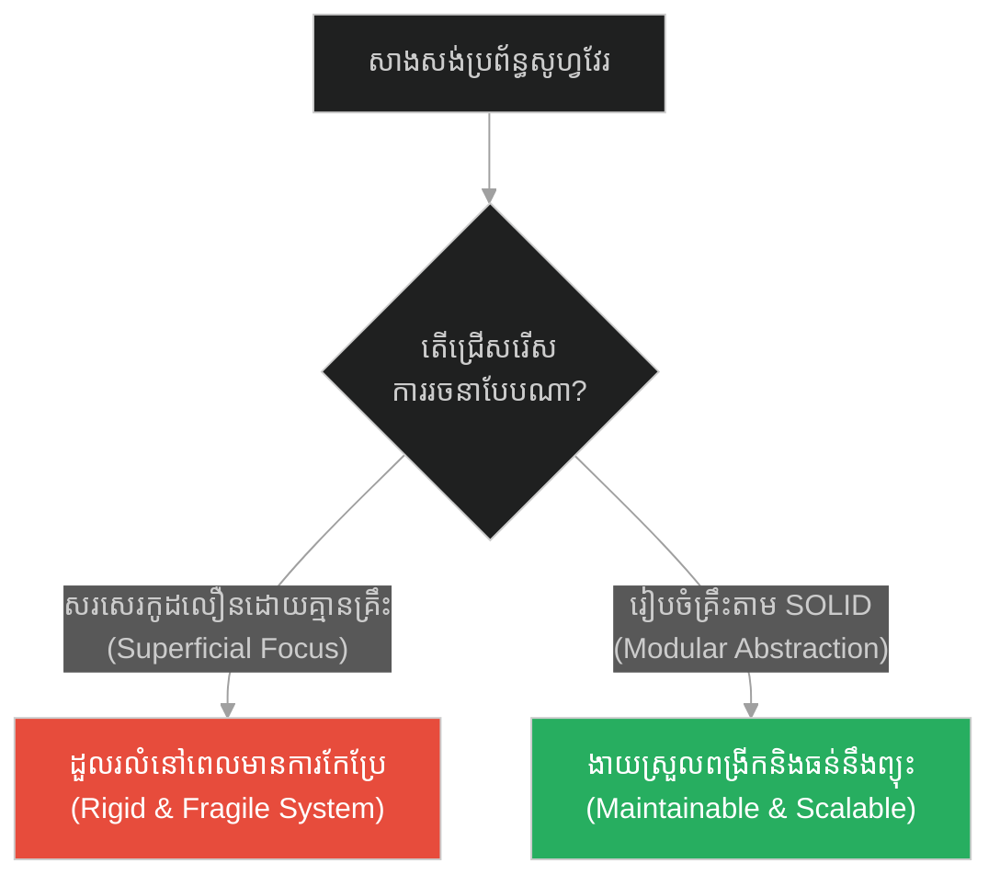
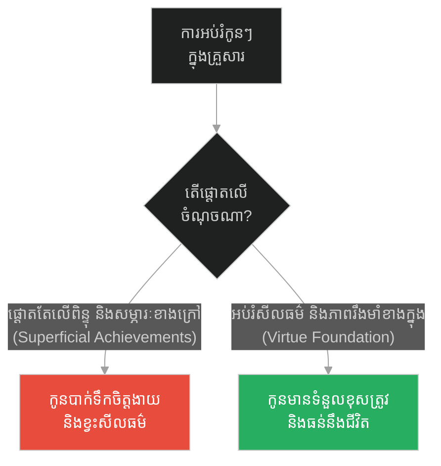
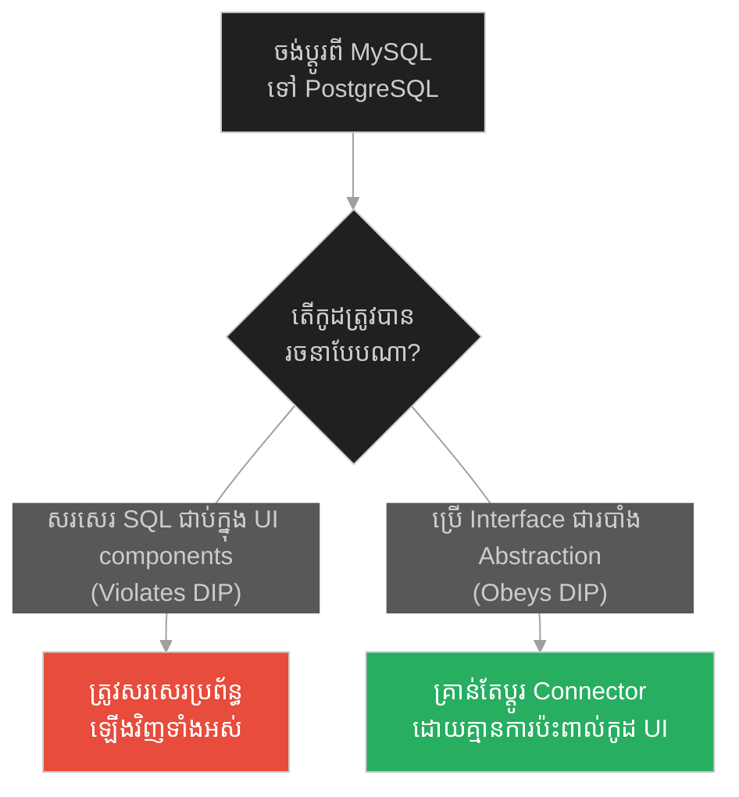
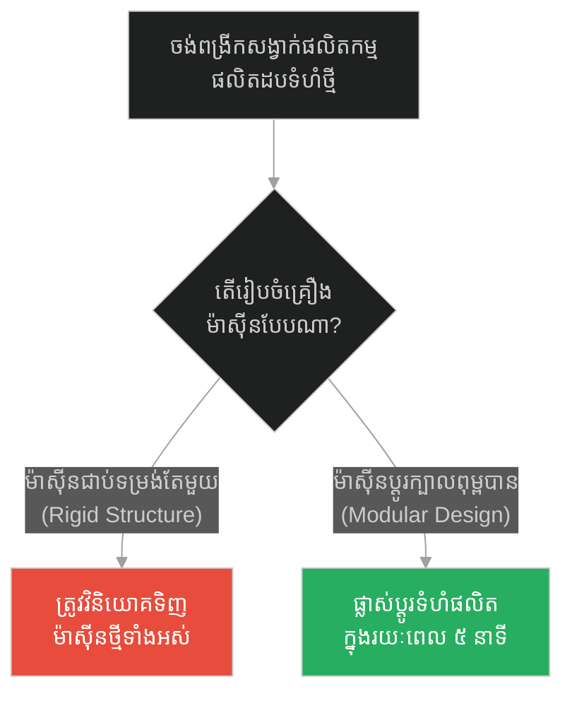
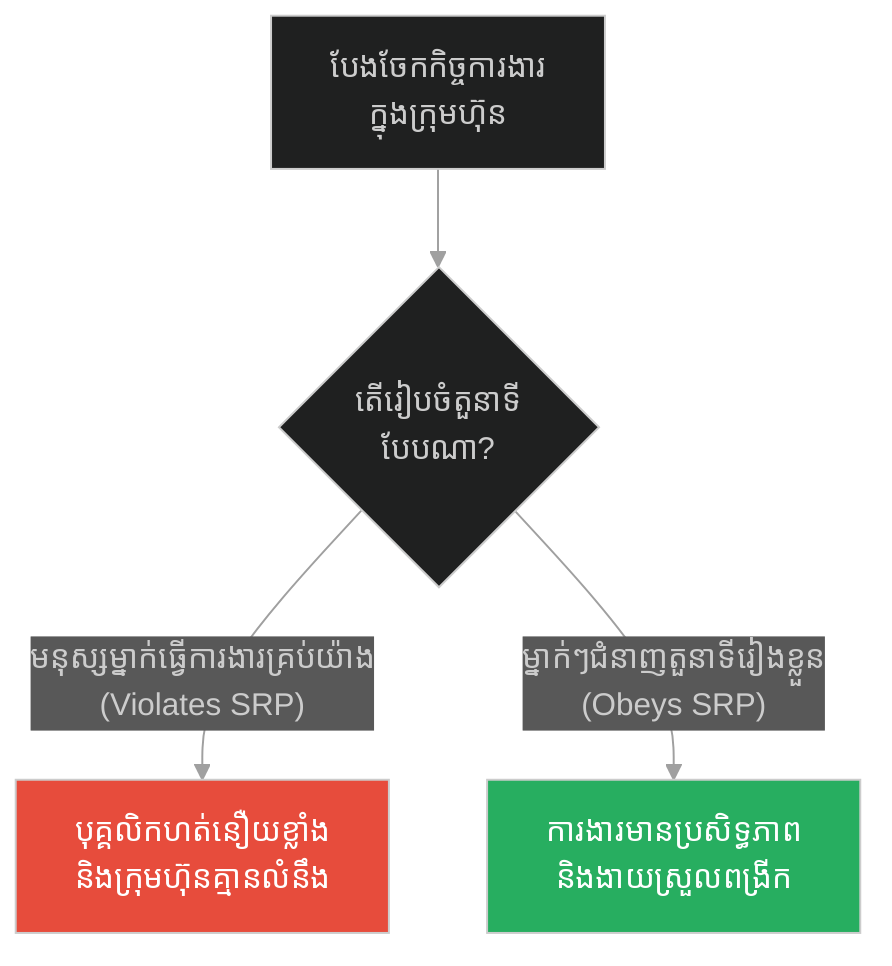
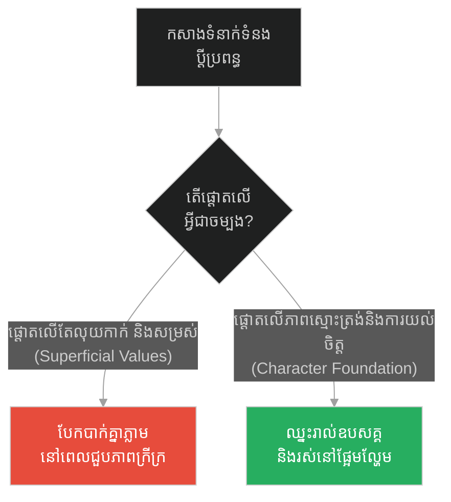
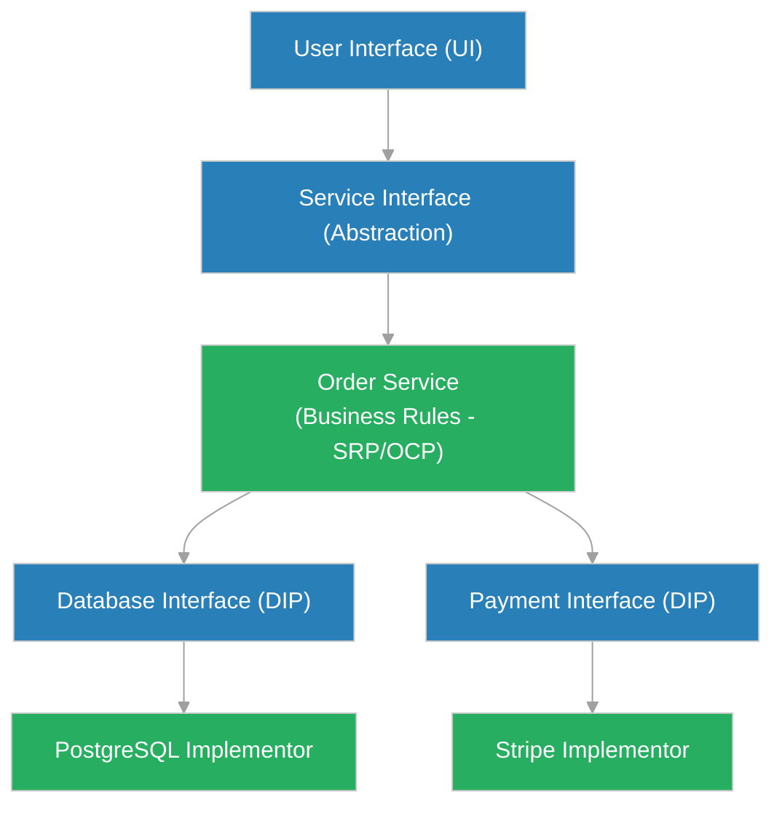

# SOLID Design Principles (គ្រឹះនៃសីលធម៌)៖ គោលការណ៍រចនា SOLID (SOLID Design Principles & Object-Oriented Design Guardrails & The Foundation of Virtue)

**Author:** ichamrong  
**Date:** 2026-05-28  
**Tags:** #socrates #solid-principles #software-design #architecture #scalability  
**Category:** Concepts  
**Read Time:** ~12 min  

---

## 📌 មាតិកា (Table of Contents)
- [អន្ទាក់ផ្លូវចិត្ត (The Trap)](#0)
- [១. រឿងព្រេងនិទាន៖ ជាងសាងសង់ផ្ទះ (The Legend of The House Builder)](#1)
  - [គ្រឹះលាក់កំបាំងដែលទ្រទ្រង់ទម្ងន់ (The Hidden Foundation That Bears the Weight)](#1-1)
- [២. បញ្ហា៖ គោលការណ៍រចនា SOLID (The Issue: SOLID Design Principles)](#2)
- [៣. ឧទាហរណ៍ជាក់ស្តែងក្នុងពិភពពិត (Real World Examples)](#3)
  - [ឧទាហរណ៍ទី ១ — កម្រិតស្រាល (គ្រួសារ)៖ ការអប់រំគុណធម៌ដល់កូនៗ (The Family Character Foundation)](#3-1)
  - [ឧទាហរណ៍ទី ២ — កម្រិតមធ្យម (បច្ចេកទេស)៖ ការផ្លាស់ប្តូរមូលដ្ឋានទិន្នន័យ (The Dev Database Abstraction)](#3-2)
  - [ឧទាហរណ៍ទី ៣ — កម្រិតមធ្យម (ធុរកិច្ច)៖ ម៉ាស៊ីនផលិតកម្មបែបម៉ូឌុល (The Business Modular Production)](#3-3)
  - [ឧទាហរណ៍ទី ៤ — កម្រិតមធ្យម (សង្គម/គ្រប់គ្រង)៖ ការបែងចែកតួនាទីក្នុងស្ថាប័ន (The Management Role Separation)](#3-4)
  - [ឧទាហរណ៍ទី ៥ — កម្រិតធ្ងន់ (ទំនាក់ទំនង)៖ គ្រឹះនៃក្តីស្រលាញ់យូរអង្វែង (The Relationship Shared Values)](#3-5)
- [៤. ដំណោះស្រាយទូទៅ៖ ការអនុវត្តគោលការណ៍ SOLID ក្នុងគម្រោង (The General Solution: Practical SOLID Implementation Blueprint)](#4)
- [សេចក្តីសន្និដ្ឋាន (Conclusion)](#5)
- [ឯកសារយោង (References)](#6)
- [Related Posts](#7)

---

<a id="0"></a>
## អន្ទាក់ផ្លូវចិត្ត (The Trap)

តើអ្នកធ្លាប់ប្រញាប់សរសេរកូដឱ្យបានលឿនបំផុតដើម្បីយកចិត្តអតិថិជន ប៉ុន្តែនៅពេលដែលពួកគេសុំកែប្រែមុខងារបន្តិចបន្តួច គម្រោងទាំងមូលត្រូវរុះរើសរសេរឡើងវិញស្ទើរតែទាំងអស់ដែរឬទេ? នេះគឺជាអន្ទាក់នៃការសង់ជញ្ជាំងនិងដំបូលលើដីខ្សាច់ (Superficial Speed)។ ការផ្តោតតែលើភាពលឿនខាងក្រៅដោយមិនខ្វល់ពីគ្រឹះស្ថាបត្យកម្មខាងក្នុង នឹងធ្វើឱ្យប្រព័ន្ធទាំងមូលដួលរលំនៅពេលជួបព្យុះនៃការផ្លាស់ប្តូរតម្រូវការ។

* **ការសរសេរកូដរហ័សដោយគ្មានរចនាសម្ព័ន្ធ (Spaghetti Coding)** — ជួយបញ្ចប់មុខងារដំបូងបានលឿនបំផុត តែធ្វើឱ្យ codebase ក្លាយជាគំនរសម្រាម ពិបាកកែសម្រួល និងងាយរលំ។
* **ការរចនាតាមគោលការណ៍ SOLID (SOLID Engineering)** — ត្រូវការពេលរៀបចំស្ថាបត្យកម្ម Abstraction យូរនៅពេលដំបូង តែធានាថាកូដងាយស្រួលពង្រីក ធ្វើតេស្ត និងធន់នឹងការផ្លាស់ប្តូរ។

ប្លង់មេសម្រាប់ការយល់ដឹងពីមេរៀននេះ៖
1. **រឿងព្រេងនិទាន (The Legend)** — ប្រាជ្ញារបស់សូក្រាតសង្កេតមើលជាងសំណង់កំពុងសង់គ្រឹះផ្ទះ។
2. **បញ្ហា (The Issue)** — ការវិភាគពីភាពផុយស្រួយនៃប្រព័ន្ធដែលមិនបានអនុវត្តគោលការណ៍ SOLID។
3. **ឧទាហរណ៍ជាក់ស្តែង (Real World Examples)** — ករណីសិក្សាទាំង ៥ កម្រិតនៃការសង់គ្រឹះរឹងមាំ។
4. **ដំណោះស្រាយទូទៅ (The General Solution)** — ការអនុវត្តគោលការណ៍ទាំង ៥ របស់ SOLID ក្នុងការសរសេរកូដ។



---

<a id="1"></a>
## ១. រឿងព្រេងនិទាន៖ ជាងសាងសង់ផ្ទះ (The Legend of The House Builder)

ថ្ងៃមួយ សូក្រាតបានឈរសង្កេតមើលជាងសំណង់ម្នាក់ ដែលកំពុងតែសាងសង់ផ្ទះវីឡាដ៏ធំមួយ។ ជាងសំណង់នោះ ចំណាយពេលជាច្រើនសប្តាហ៍ ជីកដីយ៉ាងជ្រៅ ហើយចាក់ថ្ម និងស៊ីម៉ងត៍ជាច្រើនតោនចូលទៅក្នុងរណ្តៅនោះ ដើម្បីធ្វើជាគ្រឹះ (Foundation) ដោយមិនទាន់ឃើញមានលេចចេញជារូបរាងផ្ទះសូម្បីតែបន្តិច។

បុរសម្នាក់ដែលដើរកាត់នោះ បានត្អូញត្អែរថា៖ *"ហេតុអ្វីក៏ជាងនេះចំណាយលុយនិងពេលវេលាច្រើនម្ល៉េះ ទៅលើរឿងដែលកប់ក្នុងដី ដែលគ្មាននរណាម្នាក់អាចមើលឃើញអញ្ចឹង? ហេតុអ្វីមិនប្រញាប់សង់ជញ្ជាំងនិងដំបូលឱ្យស្អាត ដើម្បីឱ្យគេបានឃើញ?"*

សូក្រាតបានដើរទៅជិតបុរសនោះ ហើយពន្យល់ថា៖

> **«អ្នកមិនអាចសាងសង់ផ្ទះដ៏អស្ចារ្យនិងរឹងមាំ ទៅលើដីខ្សាច់ទន់ៗបានទេ។ គ្រឹះគឺជាផ្នែកតែមួយគត់នៃផ្ទះ ដែលគ្មាននរណាមើលឃើញ ប៉ុន្តែវាគឺជាផ្នែកតែមួយគត់ដែលទ្រទ្រង់ទម្ងន់នៃផ្ទះទាំងមូល! ជីវិតមនុស្សក៏ដូចគ្នាដែរ។ កិត្តិនាម ទ្រព្យសម្បត្តិ និងឋានៈ គឺជាជញ្ជាំងនិងដំបូល ដែលអ្នកដទៃអាចមើលឃើញ។ ប៉ុន្តែ សីលធម៌ និងអត្តចរិត (Virtue and Character) គឺជាគ្រឹះដែលលាក់កំបាំង។ បើអ្នកខំប្រឹងសាងសង់តែកេរ្តិ៍ឈ្មោះខាងក្រៅ តែគ្មានសីលធម៌ខាងក្នុង នៅពេលដែលមានព្យុះ (វិបត្តិជីវិត) មកដល់ ផ្ទះរបស់អ្នកនឹងរលំរលាយមិនខាន។»**  
> *(“The foundation is invisible, yet it carries the entire weight of the structure. Without it, the grandest building collapses under the first storm.”)*

---

<a id="1-1"></a>
### គ្រឹះលាក់កំបាំងដែលទ្រទ្រង់ទម្ងន់ (The Hidden Foundation That Bears the Weight)

មេរៀនរបស់សូក្រាតបង្រៀនយើងឱ្យស្គាល់ពីតម្លៃនៃរឿងដែលមើលមិនឃើញ។ អ្វីដែលធ្វើឱ្យប្រព័ន្ធមួយ ឬមនុស្សម្នាក់ឈរបានរឹងមាំ មិនមែនជារបស់លម្អខាងក្រៅឡើយ គឺអត្តចរិត និងរចនាសម្ព័ន្ធខាងក្រោមដី។ នៅក្នុងវិស្វកម្មសូហ្វវែរ អ្នកប្រើប្រាស់មិនដែលមើលឃើញគ្រឹះនៃកូដ (Architecture/SOLID principles) ឡើយ ពួកគេមើលឃើញតែពណ៌ និងប៊ូតុងនៅលើអេក្រង់ (UI)។ ប៉ុន្តែបើគ្មានគ្រឹះកូដរឹងមាំទេ នៅពេលដែលទំហំអ្នកប្រើប្រាស់កើនឡើង ឬមានការបន្ថែមមុខងារថ្មី ប្រព័ន្ធនឹងចាប់ផ្តើមគាំង និងយឺតយ៉ាវរហូតដល់លែងដំណើរការ។

---

<a id="2"></a>
## ២. បញ្ហា៖ គោលការណ៍រចនា SOLID (The Issue: SOLID Design Principles)

នៅពេលដែល codebase គ្មានការរចនាតាមគោលការណ៍ SOLID វានឹងជួបបញ្ហាធ្ងន់ធ្ងរ៖
1. **Rigidity (ភាពរឹងកំព្រឹង):** ការកែប្រែកូដមួយផ្នែក បង្ខំឱ្យកែប្រែកូដផ្នែកផ្សេងៗជាច្រើនទៀតដែលមិនពាក់ព័ន្ធ (Tightly Coupled)។
2. **Fragility (ភាពផុយស្រួយ):** រាល់ពេលកែកូដកន្លែងមួយ តែងតែបង្កឱ្យគាំងកន្លែងមួយផ្សេងទៀតដោយមិនដឹងខ្លួន។
3. **Impossibility of Testing:** មិនអាចសរសេរ Unit Test បានឡើយ ដោយសារតែ class នីមួយៗភ្ជាប់គ្នាស្អិត (Dependencies Hardcoded)។

ខាងក្រោមនេះជាការប្រៀបធៀបរវាងការសរសេរកូដដែលល្មើស និងគោរពតាម SOLID៖

### ❌ កូដដែលបំពាន SOLID (Fragile: Single God Class Violation of SRP, OCP, DIP)
```typescript
// ថ្នាក់តែមួយគត់ដែលធ្វើការងារគ្រប់យ៉ាង (God Class - Violates Single Responsibility)
export class OrderManager {
  public createOrder(orderData: any) {
    // ១. ពិនិត្យការបញ្ជាទិញ
    if (orderData.items.length === 0) throw new Error("No items");

    // ២. រក្សាទុកក្នុង Database (Violates Dependency Inversion - Hardcoded MySQL DB)
    const db = new MySQLDatabase();
    db.save(orderData);

    // ៣. ទូទាត់ប្រាក់ (Hardcoded Stripe Gateway)
    const stripe = new StripeGateway();
    stripe.charge(orderData.total);

    // ៤. ផ្ញើអ៊ីមែល (Violates Open-Closed - បើចង់ប្តូរទៅ SMS ត្រូវកែប្រែកូដក្នុងថ្នាក់នេះផ្ទាល់)
    const emailSender = new EmailService();
    emailSender.sendNotification(orderData.customerEmail, "Order Created");
  }
}
```

###  កូដដែលគោរពតាម SOLID (Resilient: Clean Decoupled SOLID Architecture)
```typescript
// ១. គោរពតាម Single Responsibility Principle (SRP)៖ បំបែកការទទួលខុសត្រូវ
export interface Database {
  save(data: any): void;
}

export interface PaymentGateway {
  process(amount: number): Promise<boolean>;
}

export interface NotificationService {
  notify(recipient: string, message: string): void;
}

// ២. គោរពតាម Dependency Inversion Principle (DIP)៖ អាស្រ័យលើ Abstractions មិនមែន Concrete
export class OrderService {
  constructor(
    private db: Database,
    private payment: PaymentGateway,
    private notifier: NotificationService
  ) {}

  public async placeOrder(orderData: any): Promise<void> {
    if (!orderData.items || orderData.items.length === 0) {
      throw new Error("Cannot place empty order");
    }

    // រក្សាទុកទិន្នន័យ
    this.db.save(orderData);

    // ដំណើរការទូទាត់
    const success = await this.payment.process(orderData.total);
    if (!success) throw new Error("Payment failed");

    // ផ្ញើការរំលឹក (Open-Closed Principle: អាចប្តូរពី Email ទៅ SMS ដោយមិនបាច់កែប្រែថ្នាក់នេះ)
    this.notifier.notify(orderData.customerEmail, "Your order has been processed safely!");
  }
}
```

---

<a id="3"></a>
## ៣. ឧទាហរណ៍ជាក់ស្តែងក្នុងពិភពពិត (Real World Examples)

<a id="3-1"></a>
### ឧទាហរណ៍ទី ១ — កម្រិតស្រាល (គ្រួសារ)៖ ការអប់រំគុណធម៌ដល់កូនៗ (The Family Character Foundation)
* **ការពន្យល់៖** ការអប់រំកូនដោយផ្តោតតែលើការប្រឡងយកលេខ ១ និងពិន្ទុ (ជញ្ជាំងផ្ទះ) ដោយគ្មានការអប់រំសីលធម៌ និងភាពស្មោះត្រង់ (គ្រឹះ) ធ្វើឱ្យកូនងាយស្រួលប្រព្រឹត្តអំពើខុសឆ្គង ឬបាក់ទឹកចិត្តពេលបរាជ័យ។ ការអប់រំគុណធម៌ជាគ្រឹះ ជួយឱ្យកូនលូតលាស់រឹងមាំ ទោះជួបឧបសគ្គអ្វីក៏ដោយ។



<a id="3-2"></a>
### ឧទាហរណ៍ទី ២ — កម្រិតមធ្យម (បច្ចេកទេស)៖ ការផ្លាស់ប្តូរមូលដ្ឋានទិន្នន័យ (The Dev Database Abstraction)
* **ការពន្យល់៖** Developer សរសេរកូដស៊ើបសួរទិន្នន័យ (Raw SQL Queries) នៅក្នុង UI Components ដោយផ្ទាល់។ នៅពេលក្រុមហ៊ុនចង់ប្តូរពី MySQL ទៅ PostgreSQL ពួកគេត្រូវសរសេរកូដឡើងវិញទាំងអស់។ ការប្រើប្រាស់ Repository Pattern (DIP) ជួយឱ្យការផ្លាស់ប្តូរទិន្នន័យធ្វើឡើងដោយសុវត្ថិភាព។



<a id="3-3"></a>
### ឧទាហរណ៍ទី ៣ — កម្រិតមធ្យម (ធុរកិច្ច)៖ ម៉ាស៊ីនផលិតកម្មបែបម៉ូឌុល (The Business Modular Production)
* **ការពន្យល់៖** រោងចក្រមួយទិញម៉ាស៊ីនដែលផលិតបានតែដបទឹកទំហំ 500ml តែប៉ុណ្ណោះ។ ពេលទីផ្សារត្រូវការដប 1L ពួកគេត្រូវទិញម៉ាស៊ីនថ្មីទាំងអស់។ រោងចក្រឆ្លាតវៃប្រើប្រាស់ប្រព័ន្ធម៉ាស៊ីនបែប Modular (Open-Closed) ដែលគ្រាន់តែដោះដូរពុម្ពក្បាលម៉ាស៊ីន អាចផលិតដបគ្រប់ទំហំបានភ្លាមៗ។



<a id="3-4"></a>
### ឧទាហរណ៍ទី ៤ — កម្រិតមធ្យម (សង្គម/គ្រប់គ្រង)៖ ការបែងចែកតួនាទីក្នុងស្ថាប័ន (The Management Role Separation)
* **ការពន្យល់៖** នៅក្នុងក្រុមហ៊ុនមួយ ប្រធានផ្នែកម្នាក់កាន់កាប់រាល់កិច្ចការងារចាប់ពីសរសេរកូដ រៀបចំទីផ្សារ ធ្វើបញ្ជីគណនេយ្យ រហូតដល់សម្អាតការិយាល័យ (បំពាន SRP)។ ពេលគាត់ឈឺ ក្រុមហ៊ុនត្រូវគាំងទាំងស្រុង។ ការបែងចែកតួនាទីច្បាស់លាស់ជួយឱ្យស្ថាប័នដំណើរការដោយរលូន។



<a id="3-5"></a>
### ឧទាហរណ៍ទី ៥ — កម្រិតធ្ងន់ (ទំនាក់ទំនង)៖ គ្រឹះនៃក្តីស្រលាញ់យូរអង្វែង (The Relationship Shared Values)
* **ការពន្យល់៖** ការសាងសង់ទំនាក់ទំនងស្នេហាផ្អែកតែលើសម្ភារៈនិយម និងរូបសម្បត្តិខាងក្រៅ (ជញ្ជាំងផ្ទះ) នឹងធ្វើឱ្យស្នេហានោះរលាយបាត់បង់យ៉ាងលឿននៅពេលជួបវិបត្តិហិរញ្ញវត្ថុ។ ផ្ទុយទៅវិញ ការកសាងទំនាក់ទំនងផ្អែកលើការយល់ចិត្ត ការគោរពគ្នា និងគុណតម្លៃរួម (គ្រឹះរឹងមាំ) ធានានូវភាពរឹងមាំយូរអង្វែង។



---

<a id="4"></a>
## ៤. ដំណោះស្រាយទូទៅ៖ ការអនុវត្តគោលការណ៍ SOLID ក្នុងគម្រោង (The General Solution: Practical SOLID Implementation Blueprint)

ដើម្បីធានាថា codebase របស់អ្នកត្រូវបានសាងសង់ឡើងនៅលើផ្ទាំងថ្មដ៏រឹងមាំ ចូរអនុវត្តនូវជំហានរចនាទាំង ៥ របស់ SOLID ដូចខាងក្រោម៖

| គោលការណ៍ (Principle) | ការពិពណ៌នា (Description) | ដំណោះស្រាយបច្ចេកទេស (Technical Action) |
| :--- | :--- | :--- |
| **S** - Single Responsibility | ថ្នាក់នីមួយៗត្រូវមានភារកិច្ចតែមួយគត់ និងមានមូលហេតុតែមួយគត់ដើម្បីផ្លាស់ប្តូរ។ | បំបែក class ធំៗឱ្យទៅជា class តូចៗតាមមុខងារជាក់លាក់។ |
| **O** - Open-Closed | កូដត្រូវបើកចំហសម្រាប់ការបន្តពង្រីក (Open for extension) តែបិទជិតសម្រាប់ការកែប្រែកូដចាស់ (Closed for modification)។ | ប្រើប្រាស់ Polymorphism និង Interfaces ជំនួសឱ្យពាក្យបញ្ជា `if/else` ឬ `switch` វែងៗ។ |
| **L** - Liskov Substitution | Subclass ត្រូវតែអាចជំនួសកន្លែង Base class របស់វាបានដោយមិនធ្វើឱ្យប្រព័ន្ធមានបញ្ហា។ | ជៀសវាងការសរសេរ override method របស់ base class ដោយបោះបង់ចោលមុខងារចាស់ ឬបោះ error ចោល។ |
| **I** - Interface Segregation | មិនត្រូវបង្ខំឱ្យ Class មួយគោរពតាម Interface ដែលមាន method ដែលខ្លួនមិនប្រើប្រាស់ឡើយ។ | បំបែក Interface ធំៗឱ្យទៅជា Interface តូចៗជាច្រើន។ |
| **D** - Dependency Inversion | ម៉ូឌុលកម្រិតខ្ពស់មិនត្រូវអាស្រ័យលើម៉ូឌុលកម្រិតទាបឡើយ។ ទាំងពីរត្រូវអាស្រ័យលើ Abstraction។ | ប្រើប្រាស់ Dependency Injection (DI) ដើម្បីបញ្ជូន class instance ពីខាងក្រៅ។ |



---

## 🐇 ធ្លាក់ចូលក្នុងរន្ធទន្សាយ (Enter the Rabbit Hole)
ការកសាងគ្រឹះប្រព័ន្ធរឹងមាំជាមួយគោលការណ៍ SOLID ជួយឱ្យប្រព័ន្ធរបស់អ្នកធន់នឹងព្យុះនៃការផ្លាស់ប្តូរ។ ប៉ុន្តែនៅពេលដែលប្រព័ន្ធដំណើរការបានយូរ តើយើងត្រូវគ្រប់គ្រងធនធានចងចាំ (Memory Allocation) និងសម្អាតកាកសំណល់ដែលលែងប្រើប្រាស់ (Garbage Collection) ដូចម្តេច ដើម្បីកុំឱ្យប្រព័ន្ធយឺតយ៉ាវ? ចូរប្រញាប់បន្តដំណើរទៅកាន់៖

* 🚀 **[ចាប់ផ្តើមដំណើររុករក (Start the Journey) ➔ Garbage Collection & Idle Memory Release (បន្ទុកនៃការព្រួយបារម្ភ)៖ ការសម្អាតអង្គចងចាំ និងការដោះលែងធនធានមិនដំណើរការ](./235-socrates-and-the-heavy-burden.md)**

---

<a id="5"></a>
## សេចក្តីសន្និដ្ឋាន (Conclusion)

> **«កសាងគ្រឹះរបស់អ្នកឱ្យរឹងមាំ មុននឹងប្រញាប់លាបថ្នាំពណ៌ផ្ទះ។ រឿងដែលសំខាន់បំផុត ជារឿយៗគឺជារឿងដែលមិនមាននរណាមើលឃើញ។»**

ការចំណាយពេលរៀបចំគ្រឹះតាមគោលការណ៍ SOLID អាចនឹងធ្វើឱ្យយើងមានអារម្មណ៍ថាយឺតយ៉ាវនៅពេលដំបូង ប៉ុន្តែវាជាការវិនិយោគដ៏មានតម្លៃបំផុតដែលធានាភាពជោគជ័យយូរអង្វែង។ មិនថានៅក្នុងស្ថាបត្យកម្មសំណង់ វិស្វកម្មសូហ្វវែរ ឬសីលធម៌ជីវិតផ្ទាល់ខ្លួនឡើយ របស់ដែលរឹងមាំ និងមានតម្លៃពិតប្រាកដ គឺជារបស់ដែលត្រូវបានសាងសង់ឡើងនៅលើគ្រឹះដ៏ជ្រៅ និងរឹងមាំបំផុត។

---

<a id="6"></a>
## ឯកសារយោង (References)

* **Robert C. Martin (Uncle Bob)** — *Design Principles and Design Patterns* (2000). The paper that officially compiled the five SOLID principles.
* **Stephen R. Covey** — *The 7 Habits of Highly Effective People* (1989). Discussion on the Character Ethic as the foundation of personal effectiveness.
* **Erich Gamma, Richard Helm, Ralph Johnson, John Vlissides** — *Design Patterns: Elements of Reusable Object-Oriented Software* (1994). Explanations on modular programming and decoupled code structure.

---

<a id="7"></a>
## Related Posts

* [Garbage Collection & Idle Memory Release (បន្ទុកនៃការព្រួយបារម្ភ)៖ ការសម្អាតអង្គចងចាំ និងការដោះលែងធនធានមិនដំណើរការ](./235-socrates-and-the-heavy-burden.md) — របៀបបោសសម្អាតរបស់ដែលលែងប្រើប្រាស់ដើម្បីសម្រាលបន្ទុកប្រព័ន្ធ។
* [Defensive Programming & Fault Isolation (ការទាត់ពីបុរសកំហឹង)៖ ការសរសេរកូដការពារ និងការបំបែកភាពមិនប្រក្រតី](./233-socrates-and-the-angry-man.md) — របៀបទប់ទល់នឹងកំហុសខាងក្រៅដោយចិត្តស្ងប់។
