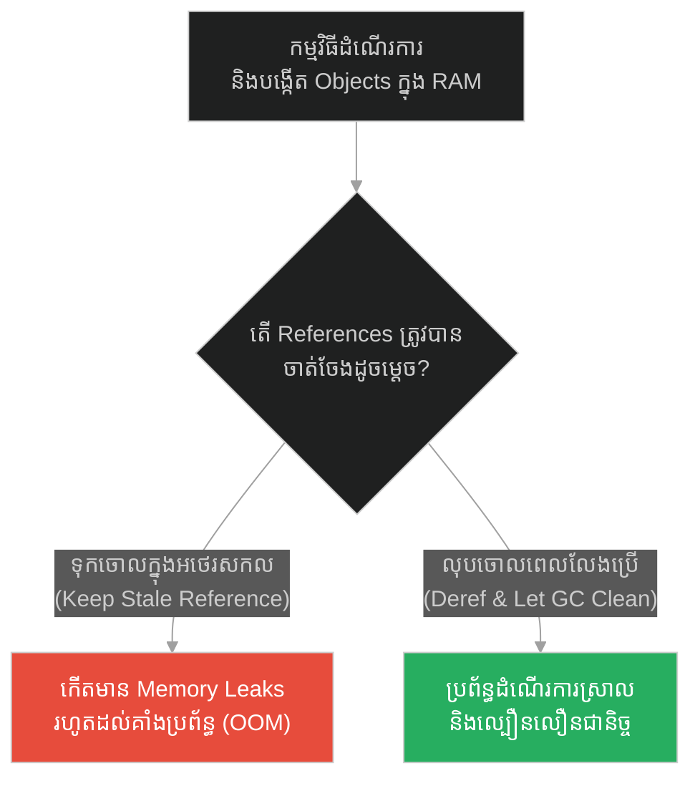
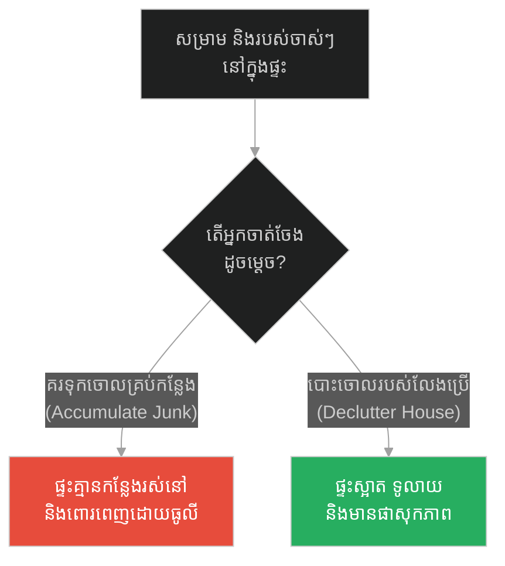
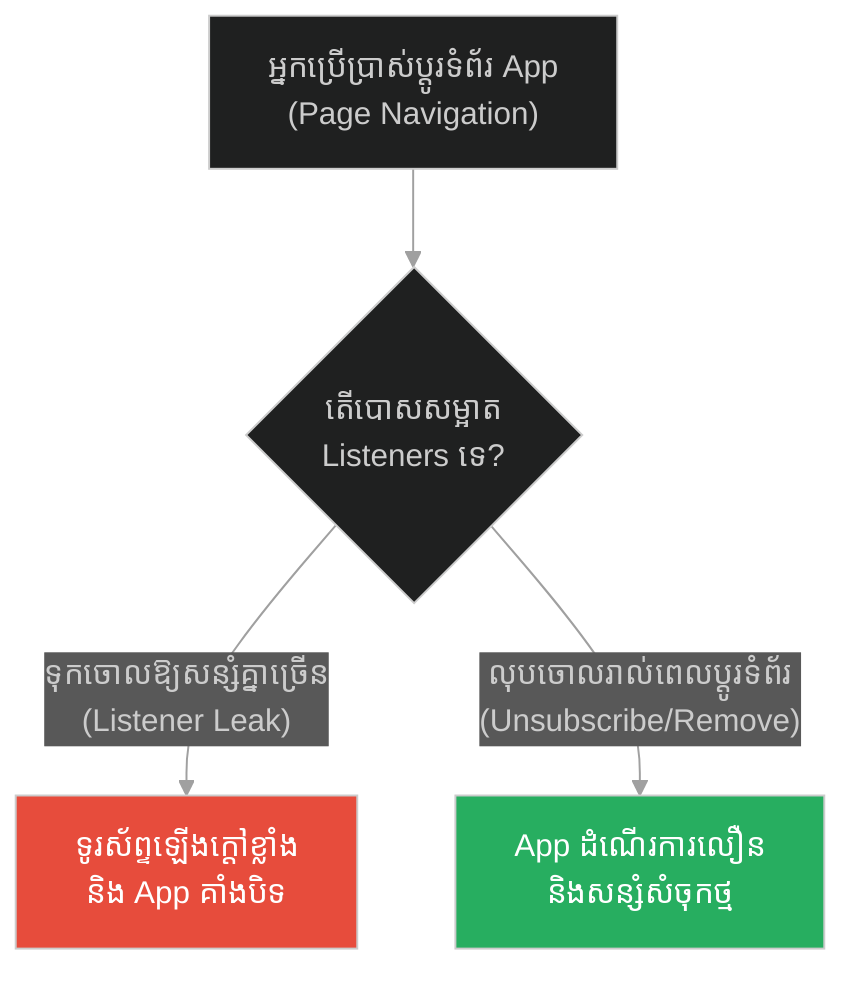
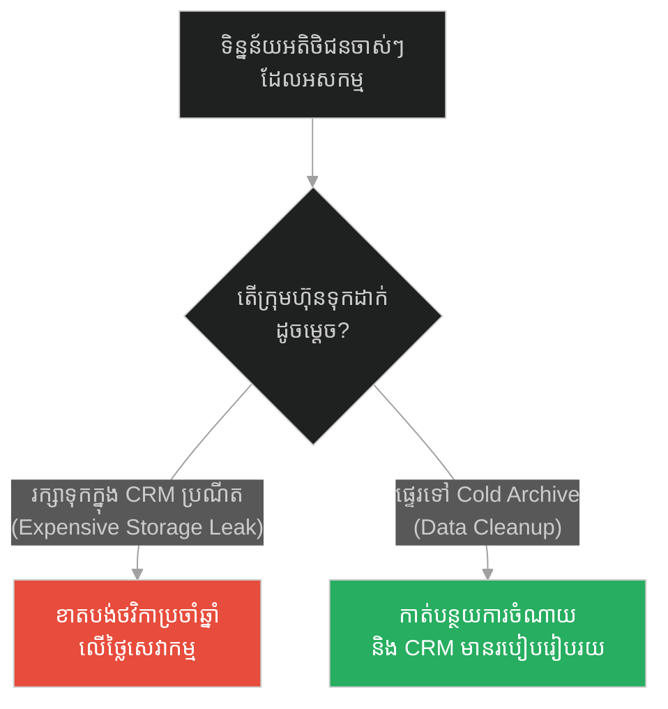
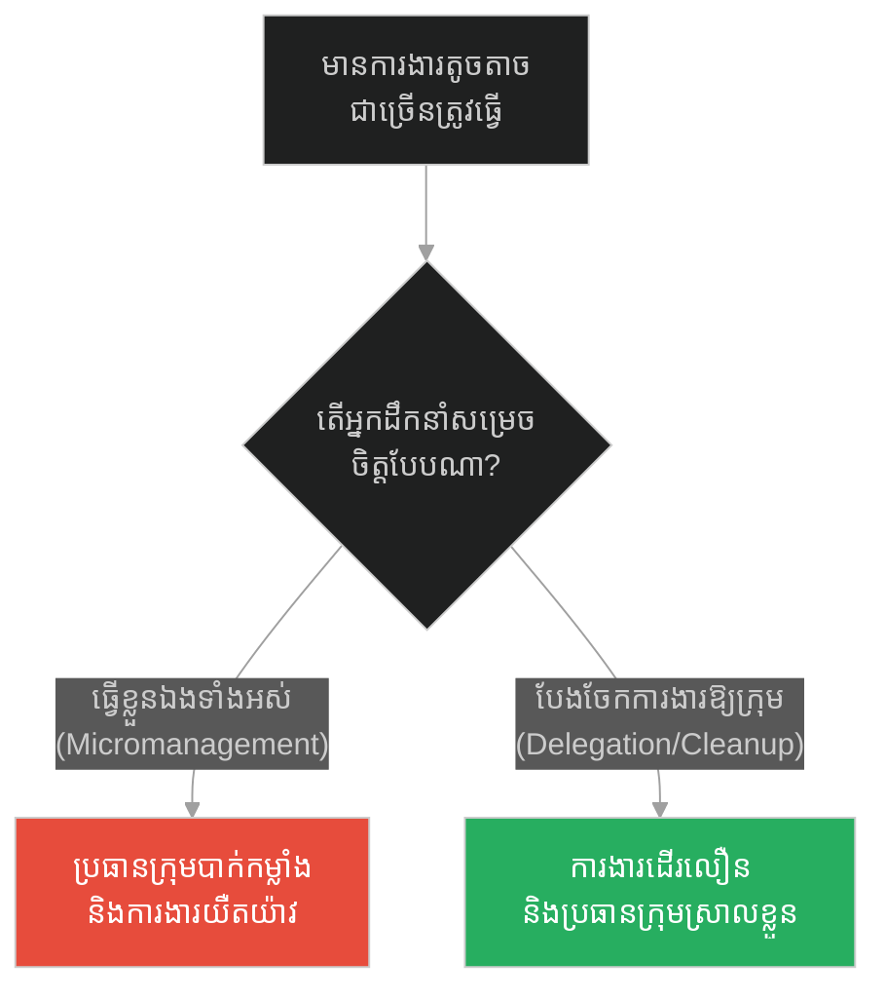
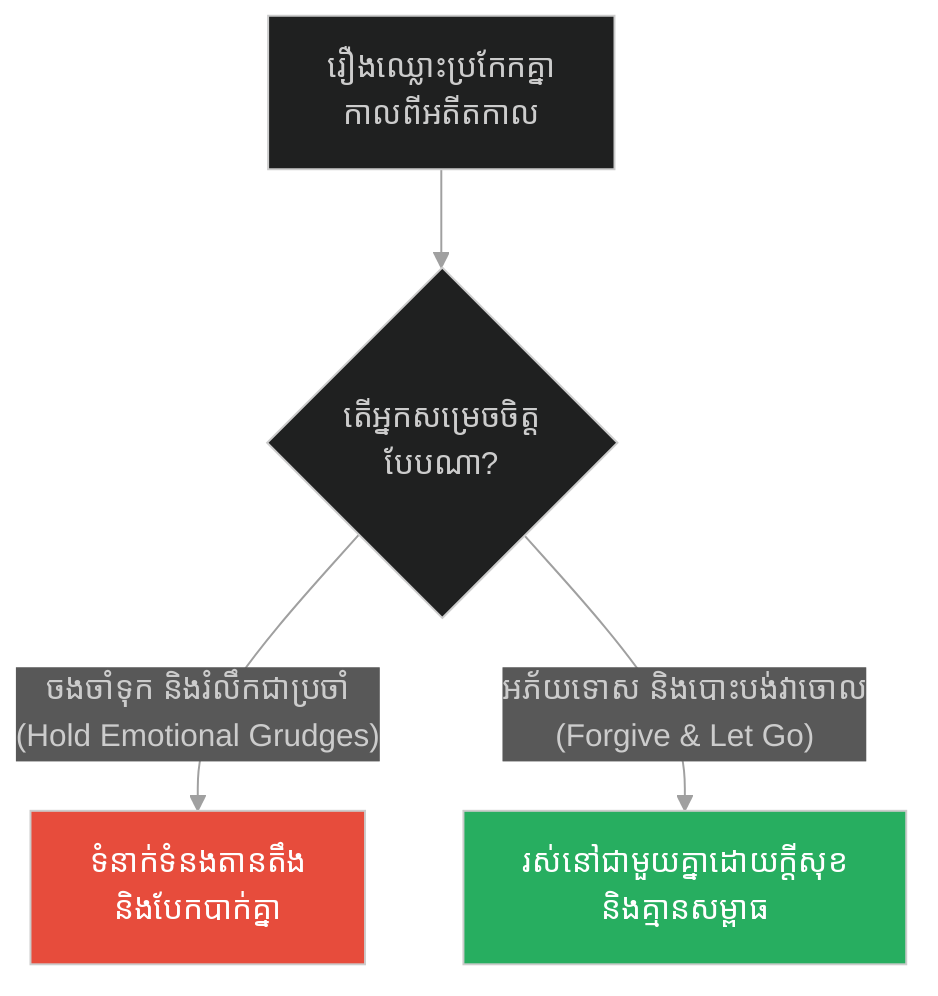
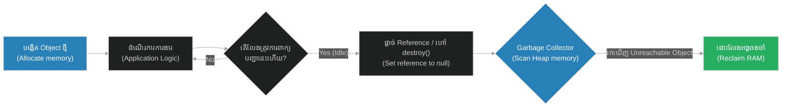

# Garbage Collection & Idle Memory Release (បន្ទុកនៃការព្រួយបារម្ភ)៖ ការសម្អាតអង្គចងចាំ និងការដោះលែងធនធានមិនដំណើរការ (Garbage Collection & Idle Memory Release & Automated Resource Cleanup and Memory Leak Prevention & The Burden of Worry)

**Author:** ichamrong  
**Date:** 2026-05-28  
**Tags:** #socrates #garbage-collection #memory-leak #performance #clean-code  
**Category:** Concepts  
**Read Time:** ~12 min  

---

## 📌 មាតិកា (Table of Contents)
- [អន្ទាក់ផ្លូវចិត្ត (The Trap)](#0)
- [១. រឿងព្រេងនិទាន៖ បុរសលីបាវទទេ (The Legend of The Man Carrying an Empty Sack)](#1)
  - [ការបោះបង់បន្ទុកទទេស្អាត (Dropping the Empty Burden)](#1-1)
- [២. បញ្ហា៖ ការលេចធ្លាយអង្គចងចាំ និងការសម្អាតធនធាន (The Issue: Memory Leaks & Resource Cleanup)](#2)
- [៣. ឧទាហរណ៍ជាក់ស្តែងក្នុងពិភពពិត (Real World Examples)](#3)
  - [ឧទاهرណ៍ទី ១ — កម្រិតស្រាល (គ្រួសារ)៖ ការទុកដាក់សម្រាមចាស់ៗក្នុងផ្ទះ (The Family Junk Storage)](#3-1)
  - [ឧទាហរណ៍ទី ២ — កម្រិតមធ្យម (បច្គេកទេស)៖ កុងតាក់ចាប់ព្រឹត្តិការណ៍ដែលមិនបានលុប (The Dev Event Listener Leak)](#3-2)
  - [ឧទាហរណ៍ទី ៣ — កម្រិតមធ្យម (ធុរកិច្ច)៖ ការរក្សាទុកទិន្នន័យអតិថិជនអសកម្ម (The Business CRM Waste)](#3-3)
  - [ឧទាហរណ៍ទី ៤ — កម្រិតមធ្យម (សង្គម/គ្រប់គ្រង)៖ ការមិនព្រមប្រគល់ការងារឱ្យកូនចៅ (The Management Micromanagement)](#3-4)
  - [ឧទាហរណ៍ទី ៥ — កម្រិតធ្ងន់ (ទំនាក់ទំនង)៖ ការចងចាំគំនុំអតីតកាល (The Relationship Carrying Grudges)](#3-5)
- [៤. ដំណោះស្រាយទូទៅ៖ យុទ្ធសាស្ត្រគ្រប់គ្រង និងសម្អាតអង្គចងចាំ (The General Solution: Memory Management & Leak Prevention)](#4)
- [សេចក្តីសន្និដ្ឋាន (Conclusion)](#5)
- [ឯកសារយោង (References)](#6)
- [Related Posts](#7)

---

<a id="0"></a>
## អន្ទាក់ផ្លូវចិត្ត (The Trap)

តើអ្នកធ្លាប់ឆ្ងល់ទេថា ហេតុអ្វីបានជាកម្មវិធីរបស់អ្នកកាន់តែដំណើរការយូរ កាន់តែស៊ីម៉ាស៊ីន (RAM) និងយឺតទៅៗ រហូតដល់គាំង (Crash) ទាំងស្រុង? នេះគឺជាអន្ទាក់នៃការរក្សាទុកកាកសំណល់ដែលលែងប្រើប្រាស់ (Memory Leak / Stale References)។ ការអនុញ្ញាតឱ្យរបស់ដែលគ្មានប្រយោជន៍បន្តរស់នៅក្នុងប្រព័ន្ធ គឺប្រៀបដូចជាការលីបាវទទេស្ពាយជាប់នឹងខ្លួនរាល់ថ្ងៃ ដែលឥតប្រយោជន៍ តែជញ្ជក់យកកម្លាំងកាយចិត្តរបស់យើងរហូតដល់ទ្រាំលែងបាន។

* **ការមិនដោះលែងធនធាន (Holding Stale References)** — ងាយស្រួលសរសេរកូដដោយមិនបាច់បារម្ភពី lifecycle តែបណ្តាលឱ្យកើតមាន Memory Leaks និងធ្វើឱ្យប្រព័ន្ធគាំង (OOM)។
* **ការសម្អាត និងដោះលែងអង្គចងចាំ (Garbage Collection & Release)** — ការពារការលេចធ្លាយអង្គចងចាំ និងរក្សាប្រព័ន្ធឱ្យស្រាលស្អាត តែអាចជួបប្រទះការផ្អាកដំណើរការរយៈពេលខ្លី (Stop-the-World pauses) របស់ GC engine។

ប្លង់មេសម្រាប់ការយល់ដឹងពីមេរៀននេះ៖
1. **រឿងព្រេងនិទាន (The Legend)** — រឿងសូក្រាតឱ្យបុរសម្នាក់លីបាវទទេ ដើម្បីឆ្លុះបញ្ចាំងពីទម្ងន់នៃការព្រួយបារម្ភ។
2. **បញ្ហា (The Issue)** — ការវិភាគពីយន្តការលេចធ្លាយអង្គចងចាំ និងរបៀបដែល Garbage Collector ដំណើរការ។
3. **ឧទាហរណ៍ជាក់ស្តែង (Real World Examples)** — ករណីសិក្សាទាំង ៥ កម្រិតនៃការបោះចោលបន្ទុកចាស់ៗ។
4. **ដំណោះស្រាយទូទៅ (The General Solution)** — ការប្រើប្រាស់ Weak References និងយុទ្ធសាស្ត្រសម្អាតកូដ។



---

<a id="1"></a>
## ១. រឿងព្រេងនិទាន៖ បុរសលីបាវទទេ (The Legend of The Man Carrying an Empty Sack)

ថ្ងៃមួយ មានបុរសម្នាក់ដែលមានទឹកមុខតានតឹងនិងហត់នឿយយ៉ាងខ្លាំង បានដើរមកជួបសូក្រាត។ គាត់បានប្រាប់សូក្រាតថា៖ *"លោកគ្រូ ខ្ញុំមានអារម្មណ៍ថាហត់នឿយណាស់! ខ្ញុំមានបញ្ហាជាច្រើនដែលត្រូវគិត។ ខ្ញុំបារម្ភខ្លាចថ្ងៃស្អែករកលុយមិនបាន ខ្ញុំបារម្ភខ្លាចជំងឺឈឺថ្កាត់ ខ្ញុំបារម្ភពីអនាគតកូនៗរបស់ខ្ញុំ។ វាដូចជាខ្ញុំកំពុងលីដុំថ្មដ៏ធំមួយនៅលើស្មាអញ្ចឹង!"*

សូក្រាតបានស្តាប់ដោយយកចិត្តទុកដាក់ រួចក៏បានយកបាវទទេមួយមកហុចឱ្យបុរសនោះ ហើយប្រាប់គាត់ឱ្យលីវានៅលើស្មា។ បុរសនោះក៏លីបាវទទេនោះ ហើយនិយាយទាំងងឿងឆ្ងល់ថា៖ *"លោកគ្រូ បាវនេះស្រាលណាស់ វាមិនមានទម្ងន់អ្វីទេ។ តើលោកឱ្យខ្ញុំលីវាធ្វើអ្វី?"*

សូក្រាតបានញញឹម រួចពន្យល់ថា៖

> **«ក្តីបារម្ភរបស់អ្នកអំពីអនាគត (Worry) គឺប្រៀបដូចជាបាវទទេនេះអញ្ចឹង! វាគ្មានរូបរាងពិតប្រាកដទេ ព្រោះអនាគតមិនទាន់មកដល់ឡើយ ប៉ុន្តែអ្នកបែរជាអនុញ្ញាតឱ្យរបស់ដែលមិនទាន់កើតមាន មកសង្កត់កម្ទេចស្មារបស់អ្នកក្នុងពេលបច្ចុប្បន្នទៅវិញ។ អ្នកមិនមែនហត់នឿយដោយសារតែបញ្ហាពិតប្រាកដនោះទេ តែអ្នកហត់នឿយដោយសារតែការគិតស្រមៃពីបញ្ហា (Imagined Problems)។ បោះបាវទទេនោះចោលទៅ! ហើយប្រើកម្លាំងរបស់អ្នក ដើម្បីដោះស្រាយតែបញ្ហាដែលកំពុងកើតឡើងនៅចំពោះមុខក្នុងថ្ងៃនេះបានហើយ។»**  
> *(“Your worries are like this empty sack. They have no weight in reality, yet they crush your spirit. Drop the sack and set your mind free.”)*

---

<a id="1-1"></a>
### ការបោះបង់បន្ទុកទទេស្អាត (Dropping the Empty Burden)

ប្រាជ្ញារបស់សូក្រាតបង្ហាញពីសិល្បៈនៃការលះបង់ (Letting Go)។ នៅក្នុងការគិតរបស់មនុស្ស ការផ្ទុកនូវគំនិតខ្វល់ខ្វាយដែលគ្មានប្រយោជន៍ ធ្វើឱ្យយើងបាត់បង់ថាមពលក្នុងការដោះស្រាយបញ្ហាពិត។ នៅក្នុងស្ថាបត្យកម្មកុំព្យូទ័រ អង្គចងចាំ (RAM) គឺជាធនធានដែលមានដែនកំណត់។ ប្រសិនបើយើងបង្កើត Objects, arrays ឬ connections ផ្សេងៗ ហើយមិនព្រមបោះបង់ references របស់វាចោលនៅពេលដែលវាលែងប្រើប្រាស់ (Idle) នោះប្រព័ន្ធនឹងត្រូវផ្ទុកនូវ "បាវទទេ" ទាំងនោះរហូតដល់អស់អង្គចងចាំ ដែលនាំឱ្យមានបញ្ហាយឺតយ៉ាវ និងគាំងទាំងស្រុង។

---

<a id="2"></a>
## ២. បញ្ហា៖ ការលេចធ្លាយអង្គចងចាំ និងការសម្អាតធនធាន (The Issue: Memory Leaks & Resource Cleanup)

នៅក្នុងភាសាសរសេរកូដទំនើប (ដូចជា JavaScript/TypeScript) ប្រព័ន្ធសម្អាតកាកសំណល់ស្វ័យប្រវត្តិ (Garbage Collector - GC) ដំណើរការដោយស្វែងរក Objects ដែលលែងអាចទៅដល់បានពី Root (Unreachable Objects) ដើម្បីលុបចេញពី Memory (Heap)។ ប៉ុន្តែ GC មិនអាចសម្អាតបានឡើយ ប្រសិនបើ Object នោះនៅតែត្រូវបានភ្ជាប់ដោយ Reference ណាមួយ៖
1. **Accidental Global Variables:** ការប្រកាសអថេរដោយភ្លេចពាក្យគន្លឹះ `const` ឬ `let` ធ្វើឱ្យអថេរនោះក្លាយជា Global variable ដែលរស់នៅរហូតដល់កម្មវិធីបិទ។
2. **Uncleared Event Listeners:** ការបង្កើត Listener លើ `window` ឬ `document` នៅក្នុង UI Components តែមិនបានលុបវាវិញពេល Component នោះត្រូវបានបំផ្លាញ (Unmounted)។
3. **Stale Closures:** Closure រក្សាទុក reference នៃអថេរជុំវិញវា ដែលធ្វើឱ្យ Memory មិនអាចដោះលែងបាន។

ខាងក្រោមនេះជាការប្រៀបធៀបរវាងកូដដែលបង្កឱ្យមាន Memory Leak និងកូដដែលសម្អាតបានល្អ៖

### ❌ កូដដែលផុយស្រួយ (Fragile: Accumulating Memory Leaks)
```typescript
// អថេរសកលរក្សាទុកទិន្នន័យជានិច្ច (Memory Leak Trap)
const globalUserCache: any[] = [];

export function processUserData(userData: any) {
  // បញ្ហាទី ១៖ បញ្ចូលទិន្នន័យទៅក្នុង global array ដោយគ្មានការសម្អាត ឬកំណត់ទំហំ
  globalUserCache.push(userData);

  // បញ្ហាទី ២៖ បង្កើត Event Listener លើ window រាល់ពេលហៅ function នេះ
  // មិនដែលលុប Listener នេះវិញឡើយ (Stale listener leak)
  window.addEventListener("resize", () => {
    console.log(`Processing resize for user: ${userData.id}`);
  });
}
```

###  កូដដែលធន់មាំ (Resilient: Automatic Garbage Collection Friendly)
```typescript
// ១. ប្រើប្រាស់ WeakMap ដើម្បីកុំឱ្យរាំងស្ទះដល់ Garbage Collection (Weak References)
// នៅពេលដែល Object user លែងត្រូវបានប្រើប្រាស់ វានឹងត្រូវ GC លុបចេញពី WeakMap ដោយស្វ័យប្រវត្តិ
const userMetadataCache = new WeakMap<object, any>();

export class UserSessionProcessor {
  private resizeHandler: () => void;

  constructor(private user: object, metadata: any) {
    userMetadataCache.set(this.user, metadata);

    // ២. បង្កើត Handler ទុកក្នុង Class instance
    this.resizeHandler = () => {
      console.log(`Processing resize safely.`);
    };

    window.addEventListener("resize", this.resizeHandler);
  }

  /**
   * ត្រូវហៅ Method នេះដើម្បីបោសសម្អាតធនធានភ្លាមៗពេលលែងប្រើប្រាស់ (Lifecycle Cleanup)
   */
  public destroy() {
    // ៣. លុប Event Listener ចេញពី window វិញជាដាច់ខាត
    window.removeEventListener("resize", this.resizeHandler);
    
    // ៤. ផ្តាច់ References ទាំងអស់ ដើម្បីឱ្យ Garbage Collector អាចសម្អាត Heap បានរហ័ស
    (this as any).user = null;
    (this as any).resizeHandler = null;
    console.log("Resources cleared and made ready for Garbage Collection.");
  }
}
```

---

<a id="3"></a>
## ៣. ឧទាហរណ៍ជាក់ស្តែងក្នុងពិភពពិត (Real World Examples)

<a id="3-1"></a>
### ឧទាហរណ៍ទី ១ — កម្រិតស្រាល (គ្រួសារ)៖ ការទុកដាក់សម្រាមចាស់ៗក្នុងផ្ទះ (The Family Junk Storage)
* **ការពន្យល់៖** ការរក្សាទុកកាសែតចាស់ៗ ប្រអប់ក្រដាសទទេ និងរបស់លែងប្រើប្រាស់ក្នុងផ្ទះ (សន្សំសំចុកមិនព្រមចោល) ធ្វើឱ្យផ្ទះកាន់តែចង្អៀត គ្មានផាសុកភាព និងគ្មានកន្លែងដាក់របស់ថ្មី។ ការបោសសម្អាតរបស់ចាស់ៗចោលរៀងរាល់ខែ ជួយឱ្យផ្ទះមានលំហស្រឡះល្អ។



<a id="3-2"></a>
### ឧទាហរណ៍ទី ២ — កម្រិតមធ្យម (បច្ចេកទេស)៖ កុងតាក់ចាប់ព្រឹត្តិការណ៍ដែលមិនបានលុប (The Dev Event Listener Leak)
* **ការពន្យល់៖** នៅក្នុង App ទូរស័ព្ទ Developer ម្នាក់បង្កើត Event Listener លើប៊ូតុងរាល់ពេលដែលអ្នកប្រើប្រាស់ប្តូរទំព័រ ប៉ុន្តែមិនបានលុបវាវិញពេលចាកចេញ។ នៅពេលដែលប្រើប្រាស់បាន ២ ម៉ោង App កាន់តែដើរយឺតខ្លាំង រហូតដល់បិទដោយខ្លួនឯង (OOM crash)។



<a id="3-3"></a>
### ឧទាហរណ៍ទី ៣ — កម្រិតមធ្យម (ធុរកិច្ច)៖ ការរក្សាទុកទិន្នន័យអតិថិជនអសកម្ម (The Business CRM Waste)
* **ការពន្យល់៖** ក្រុមហ៊ុនមួយបង់ថ្លៃសេវាកម្ម CRM (ដូចជា Salesforce) ផ្អែកលើចំនួនទិន្នន័យអតិថិជន។ ពួកគេរក្សាទុកទិន្នន័យអតិថិជនដែលឈប់ប្រើប្រាស់ ១០ ឆ្នាំមកហើយ។ ដំណោះស្រាយសម្អាតគឺ ការលុប ឬផ្ទេរទិន្នន័យចាស់ៗទៅរក្សាទុកកន្លែងថោក ដើម្បីសន្សំថវិការាប់ម៉ឺនដុល្លារក្នុងមួយឆ្នាំ។



<a id="3-4"></a>
### ឧទាហរណ៍ទី ៤ — កម្រិតមធ្យម (សង្គម/គ្រប់គ្រង)៖ ការមិនព្រមប្រគល់ការងារឱ្យកូនចៅ (The Management Micromanagement)
* **ការពន្យល់៖** ប្រធានគ្រប់គ្រងម្នាក់ក្តោបក្តាប់ការងារតូចតាចទាំងអស់ មិនព្រមផ្ទេរភារកិច្ចឱ្យសមាជិកក្រុមឡើយ (បាវទទេ)។ គាត់ត្រូវធ្វើការហួសកម្លាំងរហូតដល់ធ្លាក់ខ្លួនឈឺ និងការងារយឺតយ៉ាវ។ ការចេះផ្ទេរភារកិច្ច និងគ្រប់គ្រងការងារធំៗ ជួយសម្រាលបន្ទុករបស់គាត់ និងពង្រឹងសមត្ថភាពក្រុម។



<a id="3-5"></a>
### ឧទាហរណ៍ទី ៥ — កម្រិតធ្ងន់ (ទំនាក់ទំនង)៖ ការចងចាំគំនុំអតីតកាល (The Relationship Carrying Grudges)
* **ការពន្យល់៖** នៅក្នុងទំនាក់ទំនង ការរក្សាទុកគំនុំ និងការចងចាំរឿងឈ្លោះប្រកែកគ្នាចាស់ៗ (បន្ទុកនៃការស្អប់) ធ្វើឱ្យចិត្តរបស់មនុស្សទាំងពីរពោរពេញដោយថ្នាំពុល។ ការអភ័យទោស និងការលុបចោលរឿងមិនល្អក្នុងអតីតកាល ជួយឱ្យចិត្តស្រាល និងមានក្តីសុខឡើងវិញ។



---

<a id="4"></a>
## ៤. ដំណោះស្រាយទូទៅ៖ យុទ្ធសាស្ត្រគ្រប់គ្រង និងសម្អាតអង្គចងចាំ (The General Solution: Memory Management & Leak Prevention)

ដើម្បីការពារកុំឱ្យប្រព័ន្ធបច្ចេកវិទ្យារបស់អ្នកយឺតយ៉ាវ និងជៀសផុតពីការគាំង Out of Memory (OOM) ចូរអនុវត្តនូវជំហានដូចខាងក្រោម៖

1. **Weak References (`WeakMap` & `WeakSet`):** ប្រើប្រាស់ WeakMap សម្រាប់រក្សាទុក cache ឬ metadata នៃ objects ផ្សេងៗ។ វានឹងអនុញ្ញាតឱ្យ GC អាចប្រមូលយកទិន្នន័យនោះទៅវិញភ្លាមៗ ពេលដែល key របស់វាត្រូវបានបាត់បង់ reference ពីកន្លែងផ្សេង។
2. **Explicit Lifecycles & Disposal:** បង្កើត method សម្អាតដូចជា `cleanup()`, `destroy()`, ឬ `unsubscribe()` ដើម្បីផ្តាច់រាល់ event listeners, timers, និង databases connections ទាំងអស់ភ្លាមៗពេលលែងប្រើប្រាស់។
3. **Automated Memory Profiling:** ដំណើរការស្កេនរកមើល Memory leaks ជាប្រចាំក្នុងពេលអភិវឌ្ឍន៍ (Development) ដោយប្រើប្រាស់ Chrome DevTools Heap Snapshot ឬឧបករណ៍ Node.js memory profiling។



---

## 🐇 ធ្លាក់ចូលក្នុងរន្ធទន្សាយ (Enter the Rabbit Hole)
ការគ្រប់គ្រង និងបោសសម្អាតកាកសំណល់ក្នុងប្រព័ន្ធជួយឱ្យវាដំណើរការស្រាលខ្លួន និងមានប្រសិទ្ធភាពខ្ពស់។ ប៉ុន្តែតើដំណើររុករករបស់យើងនឹងទៅជាយ៉ាងណា ប្រសិនបើយើងជួបសិស្សម្នាក់ដែលស្វែងរកប្រាជ្ញាពិត ដោយព្យាយាមលុបបំបាត់ការសន្មតខុសឆ្គងពីមុន? ចូរប្រញាប់បន្តដំណើរទៅកាន់៖

* 🚀 **[ចាប់ផ្តើមដំណើររុករក (Start the Journey) ➔ Priority Scheduling & CPU Resource Allocation (សិស្សស្វែងរកប្រាជ្ញា)៖ ការវិភាគដំណើរការ CPU និងការកំណត់អាទិភាពការងារ](./236-socrates-and-the-student-looking-for-wisdom.md)**

---

<a id="5"></a>
## សេចក្តីសន្និដ្ឋាន (Conclusion)

> **«កុំខ្ជះខ្ជាយថាមពលថ្ងៃនេះ ដើម្បីទៅលីដុំថ្មនៃការព្រួយបារម្ភរបស់ថ្ងៃស្អែក។ ចូររស់នៅដោយស្រាលខ្លួន ទុកឱ្យថ្ងៃស្អែកដោះស្រាយបញ្ហារបស់ថ្ងៃស្អែកចុះ។»**

មិនថានៅក្នុងប្រព័ន្ធបច្ចេកវិទ្យា ឬក្នុងជីវិតប្រចាំថ្ងៃឡើយ សមត្ថភាពក្នុងការបោះបង់ និងសម្អាតរបស់ដែលលែងមានប្រយោជន៍ គឺជាគន្លឹះគ្រឹះដើម្បីរក្សាបាននូវភាពស្រាលខ្លួន និងការលូតលាស់ទៅមុខ។ ការមិនព្រមដោះលែងកាកសំណល់ចាស់ៗ មិនត្រឹមតែមិនបានជួយអ្វីដល់យើងឡើយ ថែមទាំងបំផ្លាញធនធាន និងកម្លាំងដែលមានក្នុងពេលបច្ចុប្បន្នទៀតផង។ ចូររស់នៅ និងរចនាប្រព័ន្ធដោយគ្មានបន្ទុកចាស់ៗ ដើម្បីដំណើរការទៅមុខដោយជោគជ័យ និងភាពស្ងប់ស្ងាត់។

---

<a id="6"></a>
## ឯកសារយោង (References)

* **Dan Millman** — *Way of the Peaceful Warrior* (1980). Philosophical ideas on mindfulness and letting go of unnecessary mental anxiety.
* **Addy Osmani** — *Fixing Memory Leaks in Web Applications* (2020). Best practices for debugging V8 heap space and identifying stale references.
* **V8 Engine Blog** — *Trash talk: the Orinoco garbage collector* (2018). Explanation on how modern generational garbage collection operates in Chrome and Node.js.

---

<a id="7"></a>
## Related Posts

* [SOLID Design Principles (គ្រឹះនៃសីលធម៌)៖ គោលការណ៍រចនា SOLID](./234-socrates-and-the-builder.md) — របៀបសាងសង់គ្រឹះប្រព័ន្ធឱ្យបានល្អឥតខ្ចោះ។
* [Defensive Programming & Fault Isolation (ការទាត់ពីបុរសកំហឹង)៖ ការសរសេរកូដការពារ និងការបំបែកភាពមិនប្រក្រតី](./233-socrates-and-the-angry-man.md) — របៀបគ្រប់គ្រងការឆក់ប្រព័ន្ធដោយចិត្តស្ងប់។
