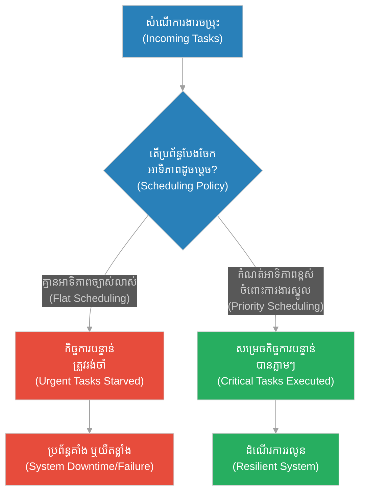
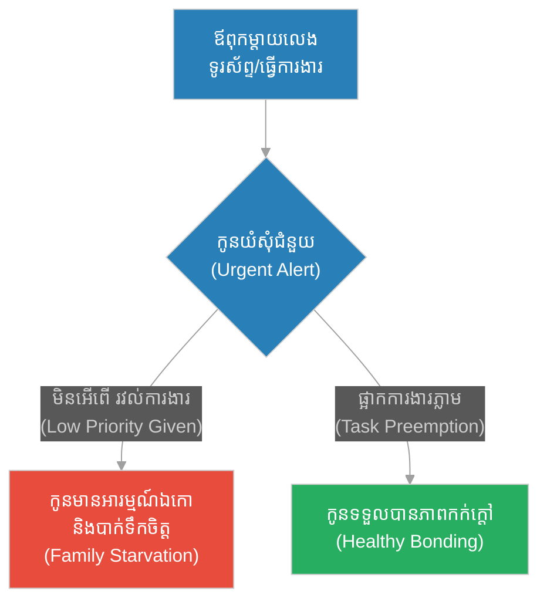
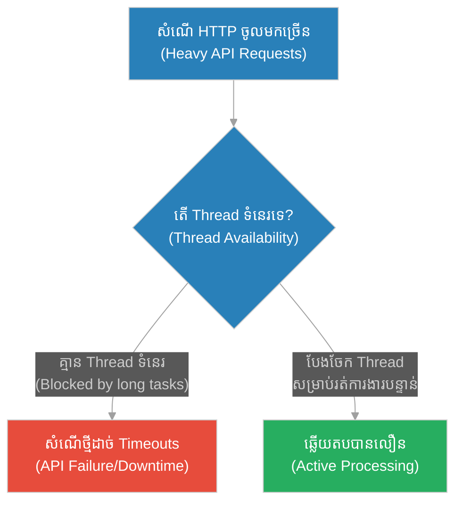
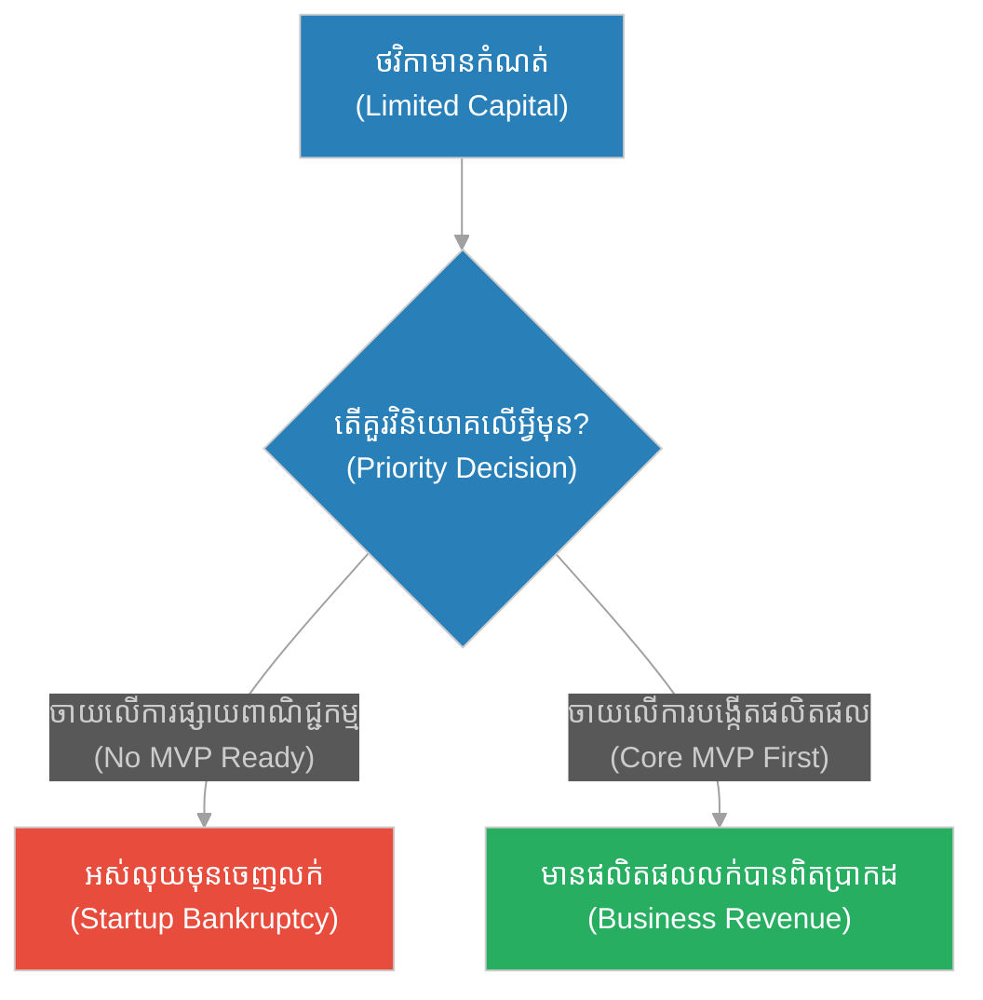
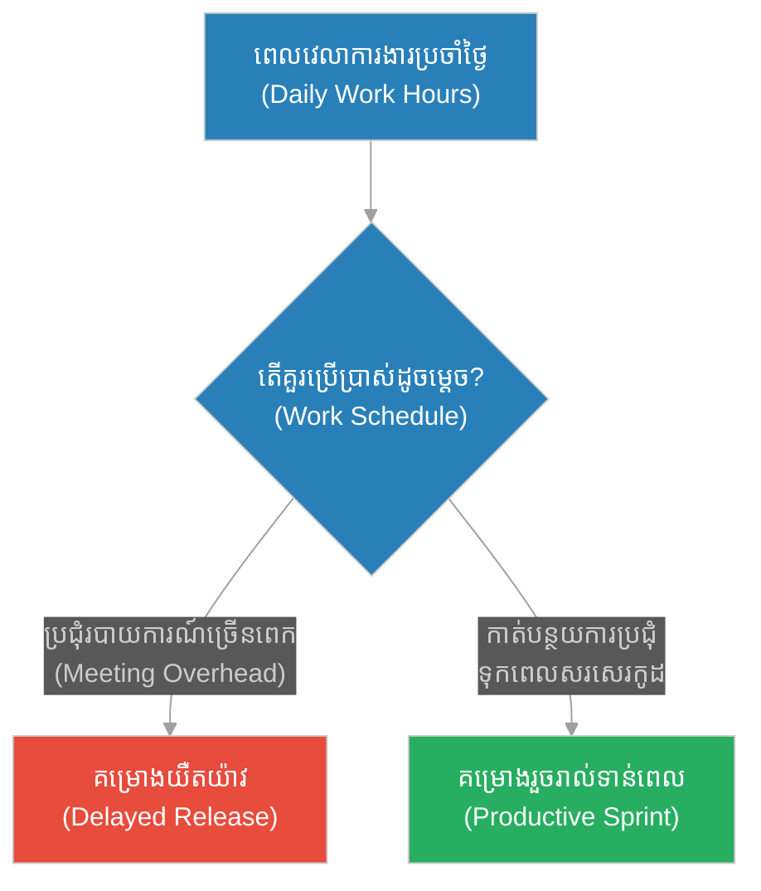
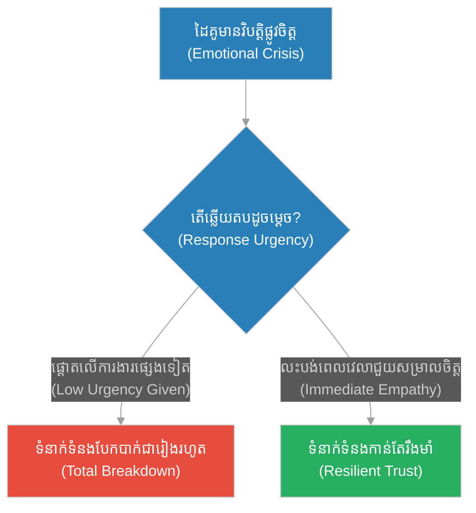
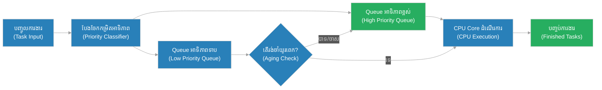

# Priority Scheduling & CPU Resource Allocation (សិស្សស្វែងរកប្រាជ្ញា)៖ ការវិភាគដំណើរការ CPU និងការកំណត់អាទិភាពការងារ (Priority Scheduling & CPU Resource Allocation & CPU Process Scheduling and Core Work Resource Management & The Student Looking for Wisdom)

**Author:** ichamrong  
**Date:** 2026-05-28  
**Tags:** #socrates #priority-scheduling #cpu-allocation #resource-management #operating-systems  
**Category:** Concepts  
**Read Time:** ~15 min  

---

## 📌 មាតិកា (Table of Contents)
- [អន្ទាក់ផ្លូវចិត្ត (The Trap)](#0)
- [១. រឿងព្រេងនិទាន៖ រឿងព្រេងនិទាន៖ សិស្សស្វែងរកប្រាជ្ញា (The Legend of The Student Looking for Wisdom)](#1)
  - [ការបង្ខំឱ្យកំណត់អាទិភាពខ្ពស់បំផុត (The Climax: Forced Prioritization)](#1-1)
- [២. បញ្ហា៖ ៖ Priority Scheduling & CPU Resource Allocation (The Issue: Priority Scheduling & CPU Resource Allocation)](#2)
- [៣. ឧទាហរណ៍ជាក់ស្តែងក្នុងពិភពពិត (Real World Examples)](#3)
  - [ឧទាហរណ៍ទី ១ — កម្រិតស្រាល (គ្រួសារ)៖ ការបែងចែកពេលវេលាគ្រួសារ (Family Time Allocation)](#3-1)
  - [ឧទាហរណ៍ទី ២ — កម្រិតមធ្យម (បច្ចេកទេស)៖ Thread Pool Starvation](#3-2)
  - [ឧទាហរណ៍ទី ៣ — កម្រិតមធ្យម (ធុរកិច្ច)៖ ការចំណាយថវិកាលើទីផ្សារ (Marketing Resource Allocation)](#3-3)
  - [ឧទាហរណ៍ទី ៤ — កម្រិតមធ្យម (សង្គម/គ្រប់គ្រង)៖ ការគ្រប់គ្រងគម្រោង (Project Management)](#3-4)
  - [ឧទាហរណ៍ទី ៥ — កម្រិតធ្ងន់ (ទំនាក់ទំនង)៖ ស្ថានភាពសង្គ្រោះបន្ទាន់ (Crisis Management in Relationship)](#3-5)
- [៤. ដំណោះស្រាយទូទៅ៖ CPU Resource Scheduling and Allocation (The General Solution: CPU Resource Scheduling and Allocation)](#4)
- [សេចក្តីសន្និដ្ឋាន (Conclusion)](#5)
- [ឯកសារយោង (References)](#6)
- [Related Posts](#7)

---

<a id="0"></a>
## អន្ទាក់ផ្លូវចិត្ត (The Trap)

តើអ្នកធ្លាប់ជួបប្រទះស្ថានភាពដែលប្រព័ន្ធកុំព្យូទ័រទាំងមូលត្រូវគាំង ឬដំណើរការយឺតខ្លាំង គ្រាន់តែដោយសារមានកិច្ចការបន្ទាប់បន្សំមួយកំពុងដំណើរការនៅខាងក្រោយ (Background Process) ដែរឬទេ? នេះគឺជាអន្ទាក់នៃ "ការបែងចែកធនធានស្មើគ្នាដោយគ្មានអាទិភាព"។

* **ការបែងចែកស្មើគ្នា (Flat Scheduling)** — ការចាត់ទុកគ្រប់កិច្ចការទាំងអស់មានតម្លៃស្មើគ្នា ធ្វើឱ្យប្រព័ន្ធបាត់បង់សមត្ថភាពឆ្លើយតបនឹងការងារបន្ទាន់។
* **ភាពអត់ឃ្លានធនធាន (Resource Starvation)** — កិច្ចការសំខាន់ៗត្រូវរង់ចាំនៅពីក្រោយកិច្ចការដែលមិនសូវសំខាន់ នាំឱ្យប្រព័ន្ធទាំងមូលត្រូវជាប់គាំង។

ដំណើរការផ្លូវគំនិត និងការកំណត់អាទិភាពធនធានអាចសង្ខេបតាមរយៈគំនូសបំព្រួញខាងក្រោម៖



នៅក្នុងអត្ថបទនេះ យើងនឹងសិក្សាអំពី៖
1. **រឿងព្រេងនិទាន (The Legend)** — ការជ្រមុជសិស្សក្នុងទឹកដើម្បីបង្ហាញពីតម្លៃនៃអាទិភាពជីវិត។
2. **បញ្ហា (The Issue)** — ផលវិបាកនៃការមិនកំណត់អាទិភាពការងារក្នុង CPU។
3. **ឧទាហរណ៍ជាក់ស្តែង (Real World Examples)** — ករណីសិក្សាលើ ៥ កម្រិតខុសៗគ្នា។
4. **ដំណោះស្រាយទូទៅ (The General Solution)** — វិធីសាស្ត្រគ្រប់គ្រង និងបែងចែកធនធានប្រកបដោយប្រសិទ្ធភាព។

---

<a id="1"></a>
## ១. រឿងព្រេងនិទាន៖ សិស្សស្វែងរកប្រាជ្ញា (The Legend of The Student Looking for Wisdom)

មានយុវជនម្នាក់បានធ្វើដំណើរផ្លូវឆ្ងាយមកជួបសូក្រាត។ គាត់បានប្រាប់សូក្រាតដោយភាពជឿជាក់ថា៖ *"លោកគ្រូ! ខ្ញុំចង់ក្លាយជាអ្នកប្រាជ្ញដ៏អស្ចារ្យម្នាក់ដូចជាលោកអញ្ចឹង។ តើខ្ញុំត្រូវធ្វើដូចម្តេច ទើបអាចទទួលបានចំណេះដឹងនិងប្រាជ្ញាទាំងនោះ?"*

សូក្រាតមិនបានឆ្លើយតបភ្លាមៗនោះទេ តែបានប្រាប់យុវជននោះឱ្យដើរតាមគាត់ទៅកាន់មាត់ទន្លេ។ ពេលដើរចូលទៅក្នុងទឹកដល់ត្រឹមចង្កេះ សូក្រាតបានប្រាប់យុវជននោះឱ្យឈរទល់មុខគាត់។ ដោយមិនឱ្យយុវជននោះដឹងខ្លួនមុន សូក្រាតបានចាប់ក្បាលយុវជននោះសង្កត់ជ្រមុជទៅក្នុងទឹកយ៉ាងខ្លាំង។

យុវជននោះខំប្រឹងរើបម្រះយ៉ាងខ្លាំង ព្រោះថប់ដង្ហើម។ គាត់វាយដៃវាយជើង ប៉ុន្តែសូក្រាតនៅតែសង្កត់ក្បាលគាត់ជាប់។ រហូតដល់យុវជននោះស្ទើរតែដាច់ខ្យល់ស្លាប់ ទើបសូក្រាតព្រមលែងដៃ ឱ្យគាត់ងើបក្បាលផុតពីទឹកវិញ។

យុវជននោះដកដង្ហើមញាប់ៗ ខ្យល់ចេញចូលសួតយ៉ាងតក់ក្រហល់ ហើយសួរដោយកំហឹងថា៖ *"លោកឆ្កួតទេឬ? លោកចង់សម្លាប់ខ្ញុំមែនទេ?"*

សូក្រាតសួរដោយស្ងប់ស្ងាត់ថា៖ *"ពេលដែលអ្នកនៅក្រោមទឹកអម្បាញ់មិញ តើអ្វីជាវត្ថុដែលអ្នកចង់បានបំផុត?"*
យុវជនឆ្លើយ៖ *"គឺខ្យល់ដកដង្ហើមហ្នឹងហើយ!"*

សូក្រាតក៏ញញឹមហើយពន្យល់ថា៖ **"នៅពេលដែលអ្នកចង់បាន 'ប្រាជ្ញា' ខ្លាំងដូចដែលអ្នកចង់បាន 'ខ្យល់ដកដង្ហើម' អម្បាញ់មិញនេះ... ពេលនោះហើយ ទើបអ្នកនឹងទទួលបានវា! (When you want wisdom as much as you wanted air, then you will get it.)"**

<a id="1-1"></a>
### ការបង្ខំឱ្យកំណត់អាទិភាពខ្ពស់បំផុត (The Climax: Forced Prioritization)

នៅពេលដែលសូក្រាតសង្កត់ក្បាលយុវជននោះទៅក្នុងទឹក គាត់បានធ្វើការផ្លាស់ប្តូរអាទិភាពការងារនៅក្នុងខួរក្បាលរបស់យុវជននោះដោយបង្ខំ។ មុនពេលចុះទឹក យុវជនមាន "អាទិភាពចម្រុះ" ដូចជាចង់បានកេរ្តិ៍ឈ្មោះ ចង់បានចំណេះដឹង និងចង់បង្ហាញខ្លួនជាអ្នកប្រាជ្ញ។ ប៉ុន្តែនៅក្រោមទឹក តម្រូវការខ្យល់អុកស៊ីសែនបានក្លាយជាកិច្ចការបន្ទាន់បំផុត (Non-preemptible Task) ដែលទាមទារធនធាន ១០០% នៃរាងកាយ។ ធនធានទាំងអស់របស់យុវជនត្រូវរំដោះចេញពីកិច្ចការផ្សេងទៀត ដើម្បីផ្តោតលើការរស់រានមានជីវិតតែមួយគត់។

---

<a id="2"></a>
## ២. បញ្ហា៖ Priority Scheduling & CPU Resource Allocation (The Issue: Priority Scheduling & CPU Resource Allocation)

នៅក្នុងវិទ្យាសាស្ត្រកុំព្យូទ័រ CPU Operating System ក៏ដំណើរការស្រដៀងគ្នានេះដែរ។ ប្រសិនបើប្រព័ន្ធដំណើរការដោយគ្មានគោលការណ៍កំណត់អាទិភាព (Priority Scheduling) នោះកិច្ចការធំៗដែលមិនបន្ទាន់ នឹងស៊ីធនធានទាំងអស់របស់ប្រព័ន្ធ ធ្វើឱ្យកិច្ចការបន្ទាន់មិនអាចដំណើរការបាន (Starvation)។

### ប្រៀបធៀបការអនុវត្ត (Fragile vs. Resilient Practices)

* **ការអនុវត្តដែលផុយស្រួយ (Fragile Practice):** ការប្រើប្រាស់ប្រព័ន្ធរត់ការងារតាមលំដាប់លំដោយ (First-In, First-Out - FIFO) ដោយគ្មានការកំណត់អាទិភាព។ នៅពេលដែលកិច្ចការធ្ងន់ៗ (ដូចជាការផលិតរបាយការណ៍ PDF ធំៗ) ចូលមកមុន វានឹងរារាំងសំណើបន្ទាន់ៗរបស់ប្រព័ន្ធ (ដូចជាការផ្ទៀងផ្ទាត់ OTP របស់អ្នកប្រើប្រាស់) ធ្វើឱ្យមានការពន្យារពេល និងបាត់បង់ការឆ្លើយតប។
* **ការអនុវត្តដែលមានភាពធន់ (Resilient Practice):** ការប្រើប្រាស់ Priority Queue រួមជាមួយយន្តការ Preemption (ការផ្អាកបណ្តោះអាសន្ននូវកិច្ចការអាទិភាពទាប) និង Aging (ការបង្កើនអាទិភាពកិច្ចការដែលរង់ចាំយូរ ដើម្បីជៀសវាងការអត់ឃ្លានធនធានជារៀងរហូត)។

ខាងក្រោមនេះជាគំរូកូដ TypeScript បង្ហាញពីការរត់ការងារដោយគ្មានអាទិភាព (បណ្តាលឱ្យស្ទះ) និងការរត់ការងារដោយកំណត់អាទិភាពច្បាស់លាស់៖

```typescript
// === ១. វិធីសាស្ត្រផុយស្រួយ (Fragile Way: Sequential FIFO Queue Without Priority) ===
interface Task {
  id: string;
  name: string;
  durationMs: number;
  isUrgent: boolean;
}

class FragileScheduler {
  private queue: Task[] = [];

  addTask(task: Task) {
    this.queue.push(task);
    console.log(`[Queue] Task added: ${task.name} (Urgent: ${task.isUrgent})`);
  }

  async run() {
    while (this.queue.length > 0) {
      const task = this.queue.shift()!;
      console.log(`[Execute] Running: ${task.name}...`);
      await new Promise(resolve => setTimeout(resolve, task.durationMs));
      console.log(`[Complete] Finished: ${task.name}`);
    }
  }
}

// === ២. វិធីសាស្ត្ររឹងមាំ (Resilient Way: Priority Queue with Preemptive Processing) ===
class ResilientScheduler {
  private queue: Task[] = [];

  addTask(task: Task) {
    // បញ្ចូលទៅក្នុង Queue រួចតម្រៀបតាមអាទិភាព (Urgent មុនគេ)
    // Insert into Queue and sort by priority (Urgent tasks first)
    this.queue.push(task);
    this.queue.sort((a, b) => (b.isUrgent ? 1 : 0) - (a.isUrgent ? 1 : 0));
    console.log(`[Resilient Queue] Task added and resorted: ${task.name}`);
  }

  async run() {
    while (this.queue.length > 0) {
      const task = this.queue.shift()!;
      console.log(`[Resilient Execute] Running High-Priority: ${task.name}`);
      await new Promise(resolve => setTimeout(resolve, task.durationMs));
      console.log(`[Resilient Complete] Finished: ${task.name}`);
    }
  }
}

// ករណីសាកល្បង (Simulation)
async function testScheduler() {
  console.log("--- STARTING FRAGILE SCHEDULER ---");
  const fragile = new FragileScheduler();
  fragile.addTask({ id: "1", name: "Heavy PDF Generation", durationMs: 3000, isUrgent: false });
  fragile.addTask({ id: "2", name: "User OTP Sign-in", durationMs: 100, isUrgent: true }); // បន្ទាន់ តែត្រូវរង់ចាំ PDF 3 វិនាទី
  await fragile.run();

  console.log("\n--- STARTING RESILIENT SCHEDULER ---");
  const resilient = new ResilientScheduler();
  resilient.addTask({ id: "1", name: "Heavy PDF Generation", durationMs: 3000, isUrgent: false });
  resilient.addTask({ id: "2", name: "User OTP Sign-in", durationMs: 100, isUrgent: true }); // ត្រូវបានតម្រៀបឡើងមុនគេ
  await resilient.run();
}

testScheduler();
```

---

<a id="3"></a>
## ៣. ឧទាហរណ៍ជាក់ស្តែងក្នុងពិភពពិត (Real World Examples)

<a id="3-1"></a>
### ឧទាហរណ៍ទី ១ — កម្រិតស្រាល (គ្រួសារ)៖ ការបែងចែកពេលវេលាគ្រួសារ (Family Time Allocation)
ក្នុងជីវិតគ្រួសារ ការមិនបែងចែកអាទិភាពរវាងការងារ និងពេលវេលាសម្រាប់កូនៗ អាចបណ្តាលឱ្យមានបញ្ហាទំនាក់ទំនងធ្ងន់ធ្ងរ។



<a id="3-2"></a>
### ឧទាហរណ៍ទី ២ — កម្រិតមធ្យម (បច្ចេកទេស)៖ Thread Pool Starvation
នៅពេលដែល Thread Pool ត្រូវបានកាន់កាប់ដោយកិច្ចការ I/O យូរៗ ធ្វើឱ្យសំណើ HTTP ថ្មីមិនអាចទទួលបាន Thread សម្រាប់ដំណើរការ។



<a id="3-3"></a>
### ឧទាហរណ៍ទី ៣ — កម្រិតមធ្យម (ធុរកិច្ច)៖ ការចំណាយថវិកាលើទីផ្សារ (Marketing Resource Allocation)
ក្រុមហ៊ុនធុរកិច្ចថ្មី (Startup) ដែលចំណាយថវិកាលើការផ្សព្វផ្សាយផលិតផលដែលមិនទាន់រួចរាល់ នឹងត្រូវអស់លុយមុនពេលផលិតផលអាចលក់បាន។



<a id="3-4"></a>
### ឧទាហរណ៍ទី ៤ — កម្រិតមធ្យម (សង្គម/គ្រប់គ្រង)៖ ការគ្រប់គ្រងគម្រោង (Project Management)
អ្នកគ្រប់គ្រងដែលផ្តោតលើការប្រជុំឥតប្រយោជន៍ និងការបំពេញឯកសាររដ្ឋបាល ធ្វើឱ្យក្រុមអ្នកអភិវឌ្ឍន៍មិនមានពេលសរសេរកូដស្នូល។



<a id="3-5"></a>
### ឧទាហរណ៍ទី ៥ — កម្រិតធ្ងន់ (ទំនាក់ទំនង)៖ ស្ថានភាពសង្គ្រោះបន្ទាន់ (Crisis Management in Relationship)
ការមិនអើពើនឹងការសុំទោស ឬការព្យាយាមសម្របសម្រួលទំនាក់ទំនងក្នុងពេលមានវិបត្តិផ្លូវចិត្ត បណ្តាលឱ្យដៃគូសម្រេចចិត្តបញ្ចប់ចំណងស្នេហា។



---

<a id="4"></a>
## ៤. ដំណោះស្រាយទូទៅ៖ CPU Resource Scheduling and Allocation (The General Solution: CPU Resource Scheduling and Allocation)

ដើម្បីដោះស្រាយបញ្ហាស្ទះធនធាន និងធានាថាកិច្ចការបន្ទាន់ត្រូវបានអនុវត្តទាន់ពេល ប្រព័ន្ធត្រូវបង្កើតស្ថាបត្យកម្មគ្រប់គ្រងការងារផ្អែកលើ **Multi-Level Feedback Queue (MLFQ)** និងគោលការណ៍ **Rate Monotonic Scheduling (RMS)**។

### ជំហានជាក់ស្តែងក្នុងការអនុវត្ត៖
1. **Categorization:** បែងចែកប្រភេទការងារទៅតាមកម្រិតឆ្លើយតប (Real-time, Interactive, Batch, Background)។
2. **Preemption:** អនុញ្ញាតឱ្យការងារដែលមានអាទិភាពខ្ពស់ អាចផ្អាកការងារដែលមានអាទិភាពទាបជាបណ្តោះអាសន្ន។
3. **Priority Inheritance:** ដោះស្រាយបញ្ហា Priority Inversion ដោយដំឡើងអាទិភាពការងារទាបបណ្តោះអាសន្ន ប្រសិនបើវាដណ្តើមយក Resource Lock ពីការងារអាទិភាពខ្ពស់។
4. **Aging Mechanism:** បង្កើនអាទិភាពការងារទាបបន្តិចម្តងៗ ប្រសិនបើវាត្រូវរង់ចាំក្នុង Queue យូរពេក ដើម្បីជៀសវាងការអត់ឃ្លានធនធាន។



---

<a id="5"></a>
## សេចក្តីសន្និដ្ឋាន (Conclusion)

> **«រហូតទាល់តែការស្រេកឃ្លានចំណេះដឹងរបស់អ្នក ស្មើនឹងការស្រេកឃ្លានខ្យល់ដកដង្ហើមរបស់អ្នក ទើបអ្នកអាចហៅខ្លួនឯងថាជាសិស្សដ៏ពិតប្រាកដបាន។»**

ជាសន្និដ្ឋាន ភាពជោគជ័យនៃប្រព័ន្ធបច្ចេកវិទ្យា និងការគ្រប់គ្រងជីវិត មិនមែនស្ថិតលើការធ្វើការងារឱ្យបានច្រើនក្នុងពេលតែមួយនោះទេ ប៉ុន្តែវាស្ថិតនៅលើការដឹងថាការងារណាដែលត្រូវផ្អាក និងការងារណាដែលត្រូវធ្វើជាដាច់ខាត។ ការបែងចែកធនធានដ៏មានកំណត់របស់អ្នកឱ្យចំគោលដៅស្នូល គឺជាគន្លឹះនៃប្រសិទ្ធភាព។

---

<a id="6"></a>
## ឯកសារយោង (References)

* **Operating System Concepts** — Abraham Silberschatz (10th Edition). A comprehensive guide on CPU scheduling, process synchronization, and resource management.
* **Apocryphal Socratic Stories** — Classical wisdom tales describing the dunking of a disciple under water as a metaphor for singular focus and burning desire.
* **Rate-Monotonic Scheduling (RMS)** — A classic priority assignment algorithm used in real-time operating systems to schedule periodic tasks.

---

<a id="7"></a>
## Related Posts

## 🐇 ធ្លាក់ចូលក្នុងរន្ធទន្សាយ (Enter the Rabbit Hole)
ដើម្បីស្វែងយល់បន្ថែមអំពីស្ថាបត្យកម្មប្រព័ន្ធ និងការកសាងទំនាក់ទំនងឱ្យរឹងមាំ សូមបន្តដំណើរទៅកាន់៖

* 🚀 **[ចាប់ផ្តើមដំណើររុករក (Start the Journey) ➔ High-Cohesion, Low-Coupling & Database Connection Pooling (និយមន័យនៃមិត្តពិត)៖ ការរួមផ្សំគ្នាខ្ពស់ ភ្ជាប់គ្នាទាប និងការរួមបញ្ចូលការតភ្ជាប់ (High-Cohesion, Low-Coupling & Database Connection Pooling & Code Architecture and Database Connection Reuse & The Definition of a True Friend)](./237-socrates-and-the-true-friend.md)**
