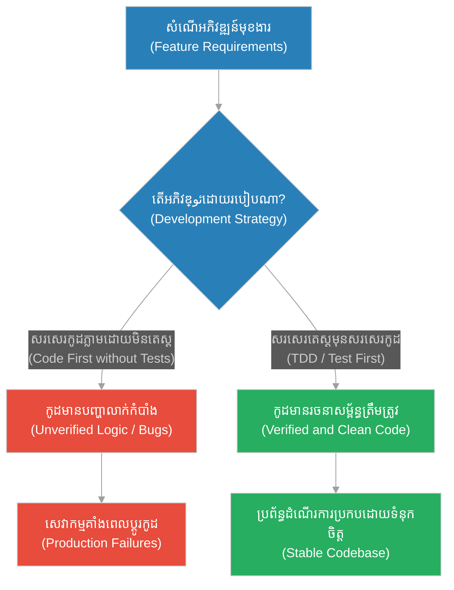
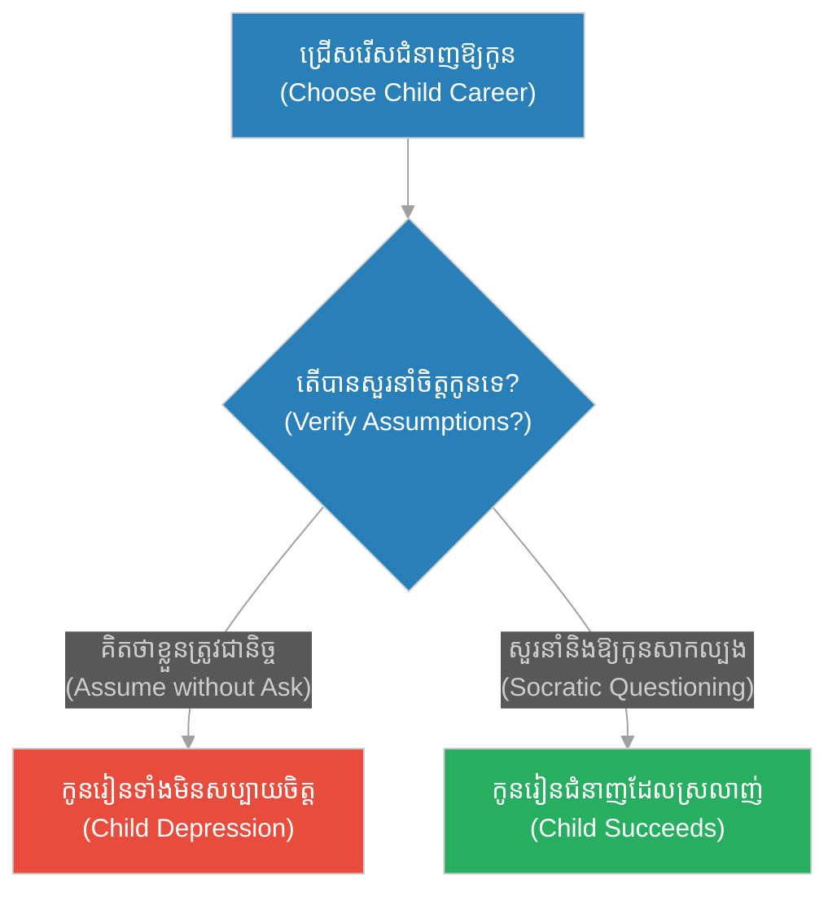
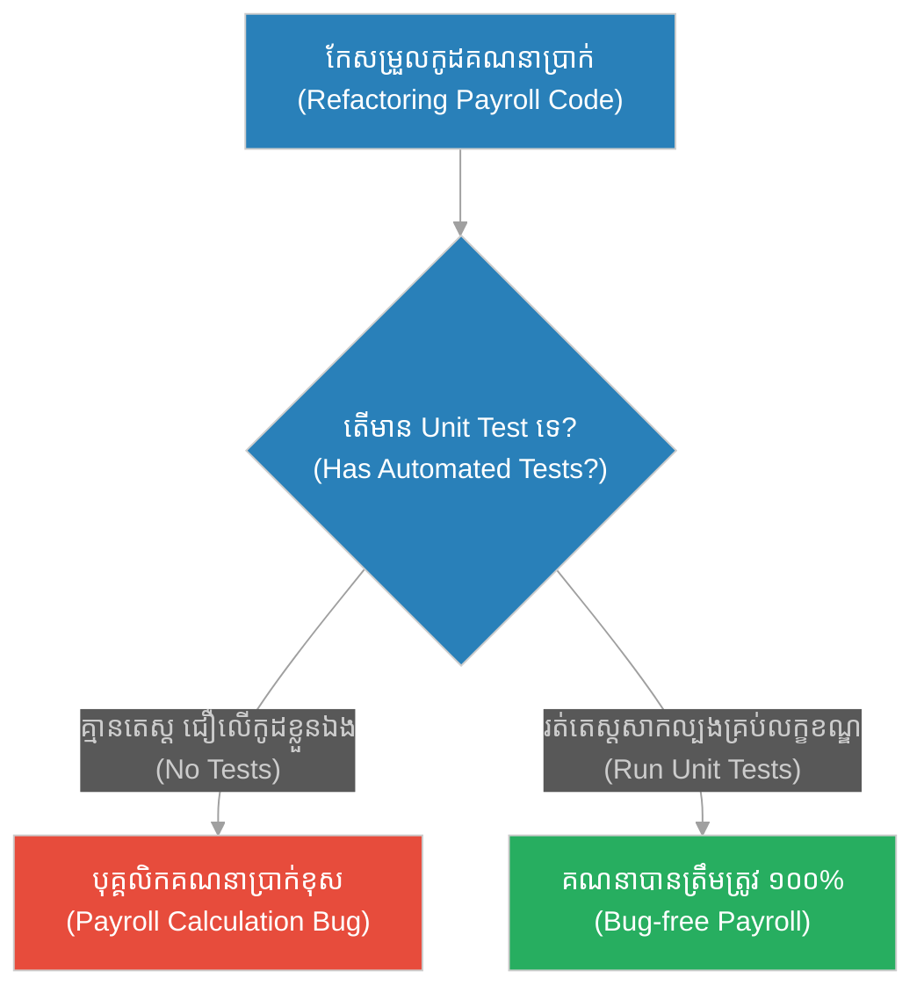
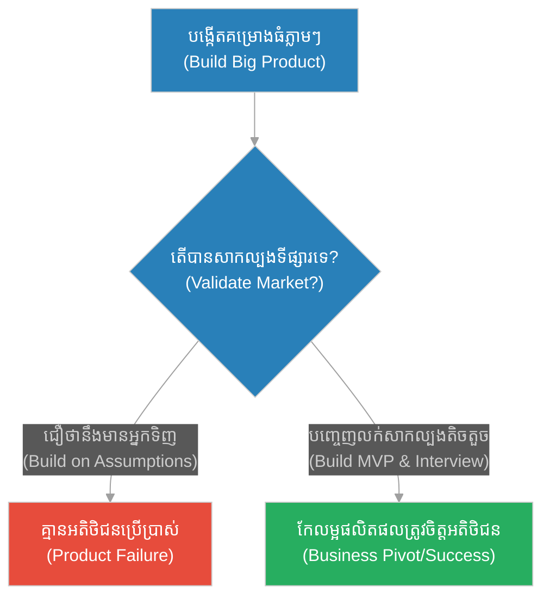
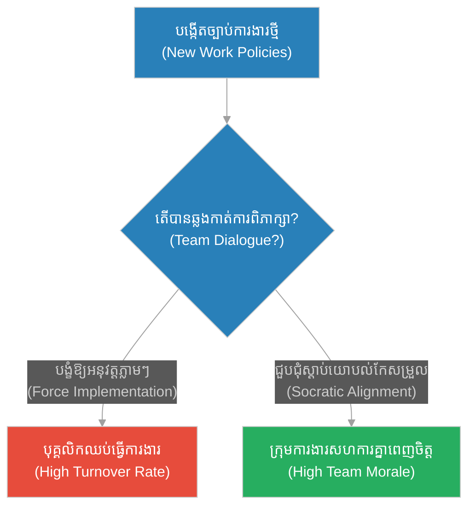
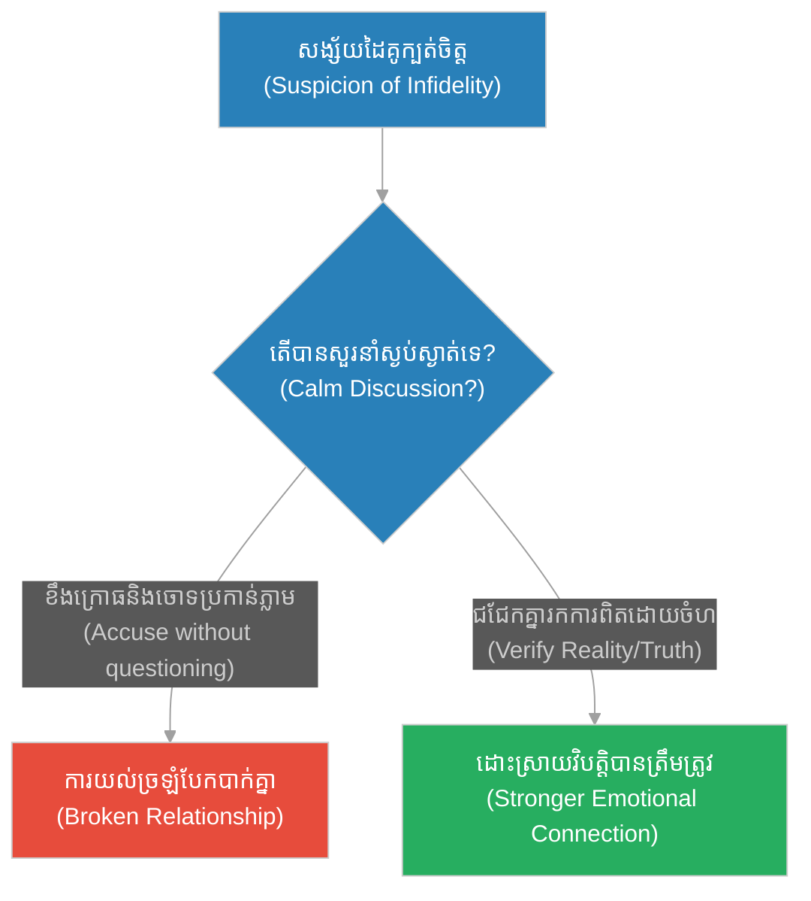
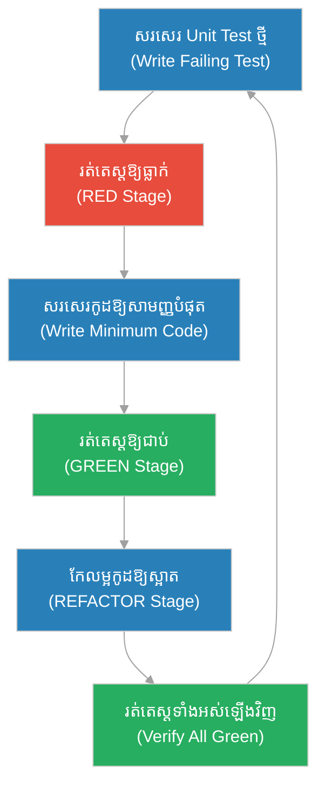

# Test-Driven Development & Unit Testing (សិល្បៈនៃការតាំងសំណួរ)៖ ការសាកល្បងឯកតា និងការអភិវឌ្ឍន៍ដឹកនាំដោយការសាកល្បង (Test-Driven Development & Unit Testing & Automated Testing and Software Verification & The Art of Questioning)

**Author:** ichamrong  
**Date:** 2026-05-28  
**Tags:** #socrates #test-driven-development #tdd #unit-testing #software-quality  
**Category:** Concepts  
**Read Time:** ~15 min  

---

## 📌 មាតិកា (Table of Contents)
- [អន្ទាក់ផ្លូវចិត្ត (The Trap)](#0)
- [១. រឿងព្រេងនិទាន៖ រឿងព្រេងនិទាន៖ សិល្បៈនៃការតាំងសំណួរ (The Legend of The Art of Questioning)](#1)
  - [ការស្វែងរកភាពមិនស៊ីសង្វាក់គ្នានៃតក្កវិជ្ជា (The Climax: Finding Logical Inconsistencies)](#1-1)
- [២. បញ្ហា៖ ៖ Test-Driven Development & Unit Testing (The Issue: Test-Driven Development & Unit Testing)](#2)
- [៣. ឧទាហរណ៍ជាក់ស្តែងក្នុងពិភពពិត (Real World Examples)](#3)
  - [ឧទាហរណ៍ទី ១ — កម្រិតស្រាល (គ្រួសារ)៖ ការស្វែងយល់ពីបំណងប្រាថ្នារបស់កូន (Parental Assumptions)](#3-1)
  - [ឧទាហរណ៍ទី ២ — កម្រិតមធ្យម (បច្ចេកទេស)៖ Refactoring Payment Module](#3-2)
  - [ឧទាហរណ៍ទី ៣ — កម្រិតមធ្យម (ធុរកិច្ច)៖ ការផ្ទៀងផ្ទាត់តម្រូវការទីផ្សារ (Customer Validation)](#3-3)
  - [ឧទាហរណ៍ទី ៤ — កម្រិតមធ្យម (សង្គម/គ្រប់គ្រង)៖ ការបង្កើតគោលនយោបាយក្រុមការងារ (Team Policy Verification)](#3-4)
  - [ឧទាហរណ៍ទី ៥ — កម្រិតធ្ងន់ (ទំនាក់ទំនង)៖ ការដោះស្រាយវិវាទ (Assumptions in Relationship)](#3-5)
- [៤. ដំណោះស្រាយទូទៅ៖ Test-Driven Development and Unit Verification (The General Solution: Test-Driven Development and Unit Verification)](#4)
- [សេចក្តីសន្និដ្ឋាន (Conclusion)](#5)
- [ឯកសារយោង (References)](#6)
- [Related Posts](#7)

---

<a id="0"></a>
## អន្ទាក់ផ្លូវចិត្ត (The Trap)

តើអ្នកធ្លាប់ចំណាយពេលរាប់សប្តាហ៍ដើម្បីសរសេរកូដដ៏វែងអន្លាយ តែនៅពេលដំណើរការបែរជាជួបប្រទះបញ្ហារាប់មិនអស់ ហើយនៅពេលព្យាយាមកែប្រែផ្នែកមួយ បែរជាធ្វើឱ្យខូចផ្នែកមួយផ្សេងទៀតដែរឬទេ? នេះគឺជាអន្ទាក់នៃការសរសេរកូដដោយផ្អែកលើការស្មាន និងការខកខានមិនបានផ្ទៀងផ្ទាត់តក្កវិជ្ជានៅកម្រិតមូលដ្ឋាន។

* **ការស្មានទុកជាមុន (Assumption-driven Coding)** — ការសរសេរកូដដោយជឿជាក់ថាខ្លួនយល់ច្បាស់ពីបញ្ហា ដោយមិនបានសាកល្បងលក្ខខណ្ឌព្រំដែន (Edge Cases)។
* **ការកែប្រែដោយការភ័យខ្លាច (Fear-driven Refactoring)** — ការមិនហ៊ានកែសម្រួលកូដចាស់ៗ ព្រោះមិនដឹងថាតើការផ្លាស់ប្តូរនោះនឹងបង្កឱ្យមានផលប៉ះពាល់អ្វីខ្លះដល់ប្រព័ន្ធទាំងមូល។



នៅក្នុងអត្ថបទនេះ យើងនឹងសិក្សាអំពី៖
1. **រឿងព្រេងនិទាន (The Legend)** — វិធីសាស្ត្រសួរដេញដោលរបស់សូក្រាត និងតួនាទីជាឆ្មបនៃគំនិត។
2. **បញ្ហា (The Issue)** — ការពន្យល់ពីស្ថាបត្យកម្មកូដខ្វះការតេស្តសាកល្បង និងផលវិបាកក្នុងវិស្វកម្មកម្មវិធី។
3. **ឧទាហរណ៍ជាក់ស្តែង (Real World Examples)** — ករណីសិក្សាលើយន្តការតេស្តស្វែងរកការពិតលើ ៥ កម្រិត។
4. **ដំណោះស្រាយទូទៅ (The General Solution)** — ការអនុវត្តវដ្ត Red-Green-Refactor និងការសរសេរ Unit Test។

---

<a id="1"></a>
## ១. រឿងព្រេងនិទាន៖ សិល្បៈនៃការតាំងសំណួរ (The Legend of The Art of Questioning)

ថ្ងៃមួយ មានយុវជនម្នាក់បានដើរមកប្រាប់សូក្រាតដោយមោទនភាពថា៖ *"សូក្រាត! ខ្ញុំយល់ច្បាស់ណាស់ពីអត្ថន័យនៃពាក្យថា 'យុត្តិធម៌'។ ការធ្វើទាហានដើម្បីសម្លាប់សត្រូវ គឺជាយុត្តិធម៌!"*

ជំនួសឱ្យការប្រកែក ឬប្រាប់យុវជននោះថាគាត់ខុស សូក្រាតគ្រាន់តែសួរសំណួរត្រឡប់ទៅវិញថា៖ *"ចុះប្រសិនបើមានចោរម្នាក់ ចង់សម្លាប់ក្មេងតូចម្នាក់ ហើយអ្នកសម្លាប់ចោរនោះដើម្បីសង្គ្រោះក្មេង តើវាយុត្តិធម៌ទេ?"*

យុវជនឆ្លើយថា៖ *"ពិតជាយុត្តិធម៌ណាស់!"*
សូក្រាតសួរបន្ត៖ *"ចុះបើនោះមិនមែនជាការធ្វើទាហានសម្លាប់សត្រូវផង ហេតុអ្វីបានជាវានៅតែជាយុត្តិធម៌?"*

យុវជននោះចាប់ផ្តើមស្ទាក់ស្ទើរ។ សូក្រាតបានបន្តសួរសំណួរ "ហេតុអ្វី?" បន្តបន្ទាប់គ្នារហូតដល់យុវជននោះរកចម្លើយលែងឃើញ ហើយទាល់ច្រក ទើបយុវជននោះដឹងខ្លួនថា តាមពិតខ្លួនមិនយល់ពីអត្ថន័យនៃពាក្យថា "យុត្តិធម៌" ទាល់តែសោះ។

អ្នកជុំវិញខ្លួនបានសួរសូក្រាតថា ហេតុអ្វីបានជាគាត់មិនព្រមប្រាប់ចម្លើយទៅយុវជននោះតែម្តង ហេតុអ្វីចាំបាច់សួរសំណួរវីវក់បែបនេះ? សូក្រាតបានពន្យល់ថា ម្តាយរបស់គាត់គឺជា "ឆ្មប (Midwife)" ដែលមានតួនាទីជួយស្ត្រីមានផ្ទៃពោះឱ្យសម្រាលកូន។ លោកក៏កំពុងតែដើរតួជាឆ្មបដូចគ្នាដែរ ប៉ុន្តែលោកគឺជា **"ឆ្មបផ្នែកគំនិត"**។

លោកមានប្រសាសន៍ថា៖ **"ខ្ញុំមិនអាចបង្រៀន (បញ្ចុក) ចំណេះដឹងដល់នរណាម្នាក់បានទេ ខ្ញុំគ្រាន់តែអាចធ្វើឱ្យពួកគេចេះគិតដោយខ្លួនឯងប៉ុណ្ណោះ។ (I cannot teach anybody anything. I can only make them think.)"**

<a id="1-1"></a>
### ការស្វែងរកភាពមិនស៊ីសង្វាក់គ្នានៃតក្កវិជ្ជា (The Climax: Finding Logical Inconsistencies)

សំណួររបស់សូក្រាតមិនមែនជាការវាយប្រហារផ្ទាល់ខ្លួននោះទេ ប៉ុន្តែវាគឺជា "Unit Test Case" ដែលបង្កើតឡើងដើម្បីសាកល្បងភាពត្រឹមត្រូវនៃតក្កវិជ្ជារបស់យុវជននោះ។ ការកំណត់និយមន័យដំបូងរបស់យុវជន (Initial Code) មិនអាចឆ្លងផុតលក្ខខណ្ឌពិសេសរបស់សូក្រាត (Edge Cases) ឡើយ។ តាមរយៈការតាំងសំណួរដេញដោល សូក្រាតបានបង្ខំឱ្យយុវជនលុបបំបាត់ការសន្មតខុស និងកែលម្អគំនិតរបស់ខ្លួនឡើងវិញរហូតដល់ទទួលបានសេចក្តីពិតដ៏ត្រឹមត្រូវមួយ (Clean Code)។

---

<a id="2"></a>
## ២. បញ្ហា៖ Test-Driven Development & Unit Testing (The Issue: Test-Driven Development & Unit Testing)

នៅក្នុងការសរសេរកម្មវិធីកុំព្យូទ័រ អ្នកអភិវឌ្ឍន៍ភាគច្រើនតែងតែប្រព្រឹត្តកំហុសដូចយុវជននោះដែរ ដោយពួកគេចាប់ផ្តើមសរសេរកូដភ្លាមៗដោយផ្អែកលើការសន្មតផ្ទាល់ខ្លួន (Write Code First) រួចទើបរកវិធីតេស្តតាមក្រោយ ឬមិនបានតេស្តទាល់តែសោះ។ នេះធ្វើឱ្យប្រព័ន្ធទាំងមូលពោរពេញដោយចំណុចខ្វះខាតលាក់កំបាំង និងងាយនឹងខូចនៅពេលមានការកែប្រែកូដ។

### ប្រៀបធៀបការអនុវត្ត (Fragile vs. Resilient Practices)

* **ការអនុវត្តដែលផុយស្រួយ (Fragile Practice):** ការសរសេរកម្មវិធីគណនា ឬចាត់ចែងទិន្នន័យដោយគ្មានស្វ័យប្រវត្តិតេស្ត (Automated Tests)។ នៅពេលមានការផ្លាស់ប្តូរតម្រូវការមុខងារ ក្រុមការងារត្រូវតេស្តដោយដៃ (Manual Testing) ឡើងវិញទាំងអស់ ដែលងាយនឹងខកខាន និងចំណាយពេលច្រើន។
* **ការអនុវត្តដែលមានភាពធន់ (Resilient Practice):** ការអនុវត្ត Test-Driven Development (TDD) ដោយសរសេរ Test Case មុននឹងសរសេរកូដពិតប្រាកដ។ វិធីសាស្ត្រនេះជួយកំណត់ដែនកំណត់នៃតក្កវិជ្ជាបានច្បាស់លាស់ និងធានាថាកូដដែលសរសេររួចអាចឆ្លងកាត់ការតេស្តគ្រប់ករណីទាំងអស់។

ខាងក្រោមនេះជាគំរូកូដភាសា Python បង្ហាញពីការធ្វើ TDD សម្រាប់មុខងារគណនាការបញ្ចុះតម្លៃរបស់អតិថិជន៖

```python
import unittest

# === ១. វិធីសាស្ត្រផុយស្រួយ (Fragile Way: Implementing logic directly without initial tests) ===
# ងាយនឹងខកខានមិនបានគិតពីករណីពិសេស ដូចជាតម្លៃអវិជ្ជមាន ឬចំនួនភាគរយលើសពី ១០០
# Fragile logic prone to edge-case errors like negative prices or discounts > 100%
def calculate_discount_fragile(price, discount_percent):
    return price - (price * (discount_percent / 100))


# === ២. វិធីសាស្ត្ររឹងមាំ (Resilient Way: Test-Driven Development) ===
# យើងបង្កើត Test Cases មុនដើម្បីកំណត់ព្រំដែនតក្កវិជ្ជា (Define assertions first)
class TestCalculateDiscount(unittest.TestCase):
    def test_standard_discount(self):
        self.assertEqual(calculate_discount_resilient(100, 20), 80)

    def test_zero_discount(self):
        self.assertEqual(calculate_discount_resilient(100, 0), 100)

    def test_negative_price_should_raise_error(self):
        with self.assertRaises(ValueError):
            calculate_discount_resilient(-50, 10)

    def test_invalid_discount_percent_should_raise_error(self):
        with self.assertRaises(ValueError):
            calculate_discount_resilient(100, 150) # បញ្ចុះតម្លៃ ១៥០% មិនសមស្រប

# កូដពិតប្រាកដដែលសរសេរឡើងដើម្បីឱ្យឆ្លងកាត់ការតេស្តទាំងអស់ខាងលើ
# Production code written specifically to pass the predefined assertions
def calculate_discount_resilient(price, discount_percent):
    if price < 0:
        raise ValueError("Price cannot be negative")
    if discount_percent < 0 or discount_percent > 100:
        raise ValueError("Discount percent must be between 0 and 100")
    return price - (price * (discount_percent / 100))

if __name__ == "__main__":
    # រត់ការតេស្តស្វ័យប្រវត្តិ
    unittest.main()
```

---

<a id="3"></a>
## ៣. ឧទាហរណ៍ជាក់ស្តែងក្នុងពិភពពិត (Real World Examples)

<a id="3-1"></a>
### ឧទាហរណ៍ទី ១ — កម្រិតស្រាល (គ្រួសារ)៖ ការស្វែងយល់ពីបំណងប្រាថ្នារបស់កូន (Parental Assumptions)
ឪពុកម្តាយដែលសន្មតថាខ្លួនដឹងពីអ្វីដែលកូនចង់បាន ដោយមិនបានសួរនាំ និងតេស្តស្វែងយល់ចិត្តកូន អាចនឹងបង្ខំកូនឱ្យដើរលើផ្លូវដែលពួកគេមិនចង់ដើរ។



<a id="3-2"></a>
### ឧទាហរណ៍ទី ២ — កម្រិតមធ្យម (បច្ចេកទេស)៖ Refactoring Payment Module
ការកែប្រែកូដគណនាប្រាក់បៀវត្សរ៍ដោយគ្មាន Unit Tests នាំឱ្យមានបញ្ហាគណនាខុសចំពោះបុគ្គលិកមួយចំនួននៅចុងខែ។



<a id="3-3"></a>
### ឧទាហរណ៍ទី ៣ — កម្រិតមធ្យម (ធុរកិច្ច)៖ ការផ្ទៀងផ្ទាត់តម្រូវការទីផ្សារ (Customer Validation)
ការបង្កើតផលិតផលធំមួយដោយមិនបានសួរយោបល់ ឬសាកល្បងតម្រូវការអតិថិជនជាមុន (MVP testing) នាំឱ្យបាត់បង់ដើមទុន។



<a id="3-4"></a>
### ឧទាហរណ៍ទី ៤ — កម្រិតមធ្យម (សង្គម/គ្រប់គ្រង)៖ ការបង្កើតគោលនយោបាយក្រុមការងារ (Team Policy Verification)
ការបង្កើតច្បាប់វិន័យការងារថ្មីដោយមិនបានសាកសួរ និងស្តាប់មតិយោបល់បុគ្គលិកជាមុន អាចនឹងបង្កឱ្យមានការបះបោរ និងបោះបង់ការងារចោល។



<a id="3-5"></a>
### ឧទាហរណ៍ទី ៥ — កម្រិតធ្ងន់ (ទំនាក់ទំនង)៖ ការដោះស្រាយវិវាទ (Assumptions in Relationship)
ការចោទប្រកាន់ដៃគូដោយផ្អែកលើការសន្មត និងគំនិតផ្ទាល់ខ្លួន ដោយគ្មានការសួរនាំឱ្យបានច្បាស់លាស់ នាំឱ្យបែកបាក់ទំនាក់ទំនងដោយការយល់ច្រឡំ។



---

<a id="4"></a>
## ៤. ដំណោះស្រាយទូទៅ៖ Test-Driven Development and Unit Verification (The General Solution: Test-Driven Development and Unit Verification)

ដើម្បីធានាបាននូវគុណភាពកូដ និងការសម្រេចចិត្តដ៏ត្រឹមត្រូវ ក្រុមការងារត្រូវអនុវត្តវដ្ត **Red-Green-Refactor** នៃការសរសេរកូដ និងយន្តការត្រួតពិនិត្យការសន្មត (Assumption Testing)។

### ជំហានជាក់ស្តែងក្នុងការអនុវត្ត TDD៖
1. **Red Stage:** សរសេរតេស្តសាកល្បងមួយដែលមិនទាន់មានកូដគាំទ្រ (Test Fails)។ នេះប្រៀបដូចជាការបង្កើតសំណួរដេញដោលរបស់សូក្រាតដើម្បីរកចំណុចខ្វះខាត។
2. **Green Stage:** សរសេរកូដឱ្យសាមញ្ញបំផុតតាមដែលអាចធ្វើទៅបាន ដើម្បីគ្រាន់តែឱ្យតេស្តនោះជាប់ (Test Passes)។
3. **Refactor Stage:** កែលម្អរចនាសម្ព័ន្ធកូដឱ្យមានរបៀបរៀបរយ កាត់បន្ថយកូដស្ទួន ដោយធានាថាតេស្តនៅតែជាប់ជានិច្ច (Keep Tests Green)។



---

<a id="5"></a>
## សេចក្តីសន្និដ្ឋាន (Conclusion)

> **«ខ្ញុំមិនអាចបង្រៀន (បញ្ចុក) ចំណេះដឹងដល់នរណាម្នាក់បានទេ ខ្ញុំគ្រាន់តែអាចធ្វើឱ្យពួកគេចេះគិតដោយខ្លួនឯងប៉ុណ្ណោះ។»**

ជាសន្និដ្ឋាន ការសរសេរកូដ ឬការរស់នៅដោយគ្មានការសួរដេញដោលលើការសន្មតរបស់ខ្លួនឯង គឺជាការដើរទៅរកភាពបរាជ័យដោយងងឹតងងុល។ សិល្បៈនៃការតាំងសំណួរ ឬការបង្កើត Unit Test គឺជាឆ្មបដែលជួយសម្រាលនូវដំណោះស្រាយដ៏ត្រឹមត្រូវ រឹងមាំ និងមានស្ថិរភាពយូរអង្វែង។

---

<a id="6"></a>
## ឯកសារយោង (References)

* **Beck, Kent** (2002). *Test-Driven Development: By Example*. Addison-Wesley Professional. Explains the foundations of TDD and unit testing.
* **Plato**. *Theaetetus*. A Socratic dialogue detailing the maieutic method (midwifery of thoughts) and epistemology.
* **Martin, Robert C.** (2008). *Clean Code: A Handbook of Agile Software Craftsmanship*. Prentice Hall. Focuses on unit testing structures and code readability.

---

<a id="7"></a>
## Related Posts

## 🐇 ធ្លាក់ចូលក្នុងរន្ធទន្សាយ (Enter the Rabbit Hole)
ដើម្បីស្វែងយល់បន្ថែមអំពីភាពខុសគ្នារវាងកូដស្នូលអាជីវកម្ម និងកូដបង្ហាញខាងក្រៅ សូមបន្តដំណើរទៅកាន់៖

* 🚀 **[ចាប់ផ្តើមដំណើររុករក (Start the Journey) ➔ Core Business Domain Logic vs. UI Overhead (ព្រលឹងដ៏ស្រស់ស្អាត)៖ ខ្លឹមសារអាជីវកម្មស្នូល និងទម្រង់បង្ហាញខាងក្រៅ (Core Business Domain Logic vs. UI Overhead & Domain-Driven Design and UI Separation & The Beautiful Soul)](./239-socrates-and-the-beautiful-soul.md)**
