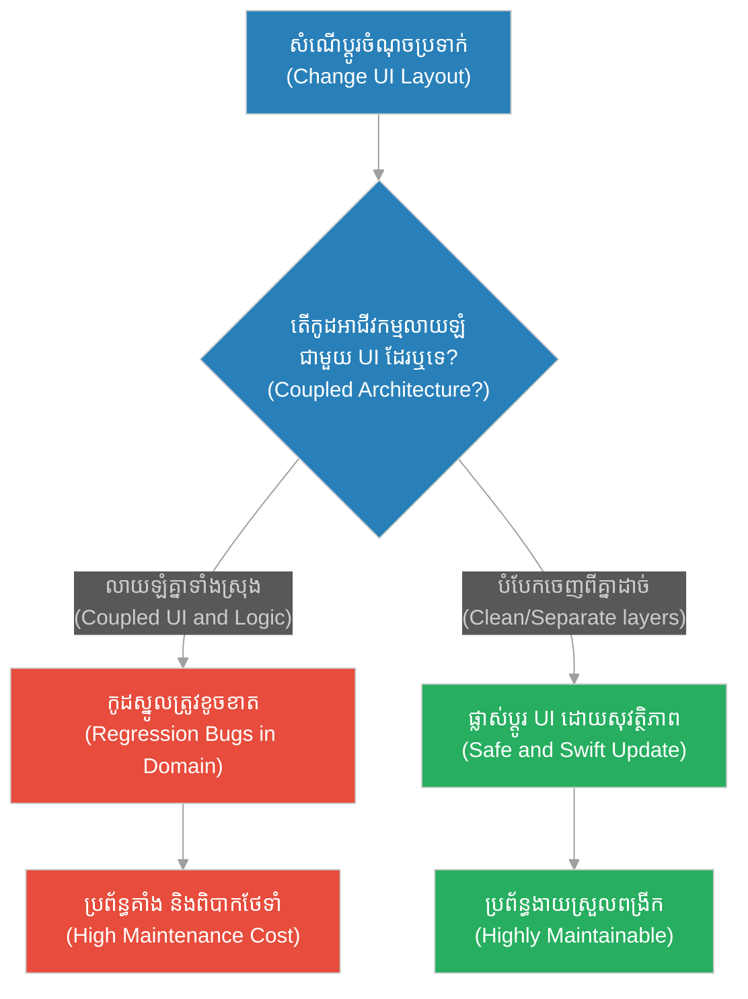
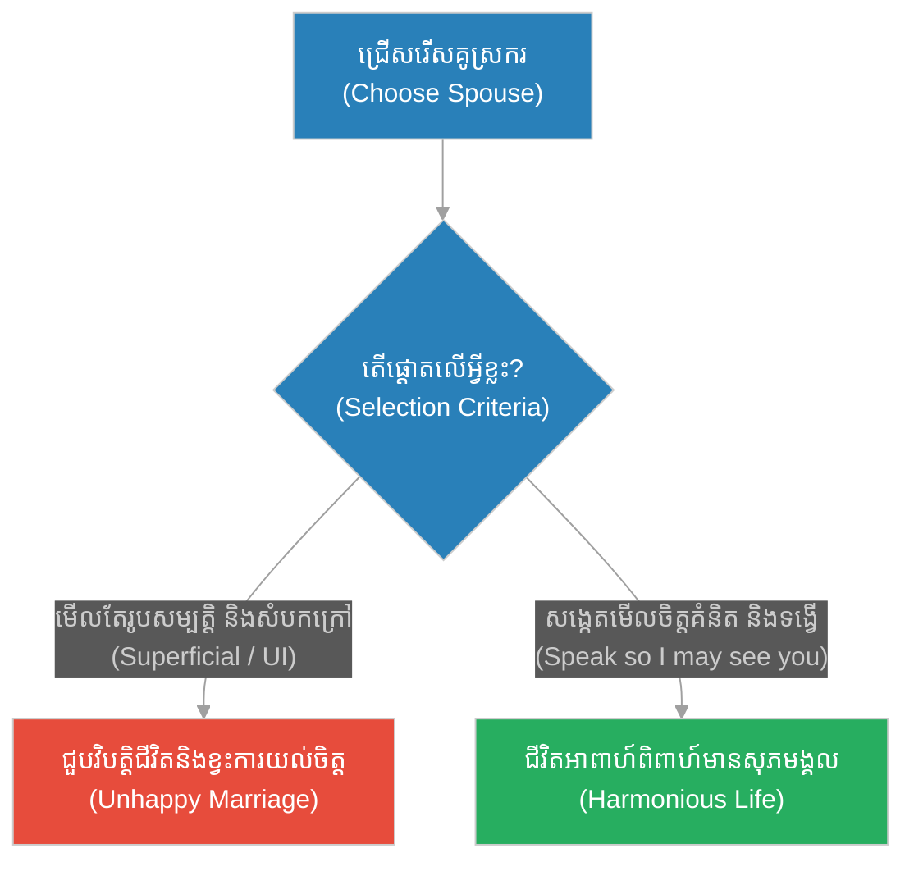
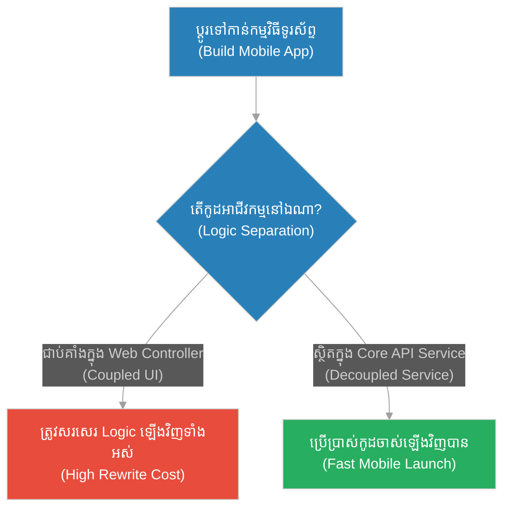
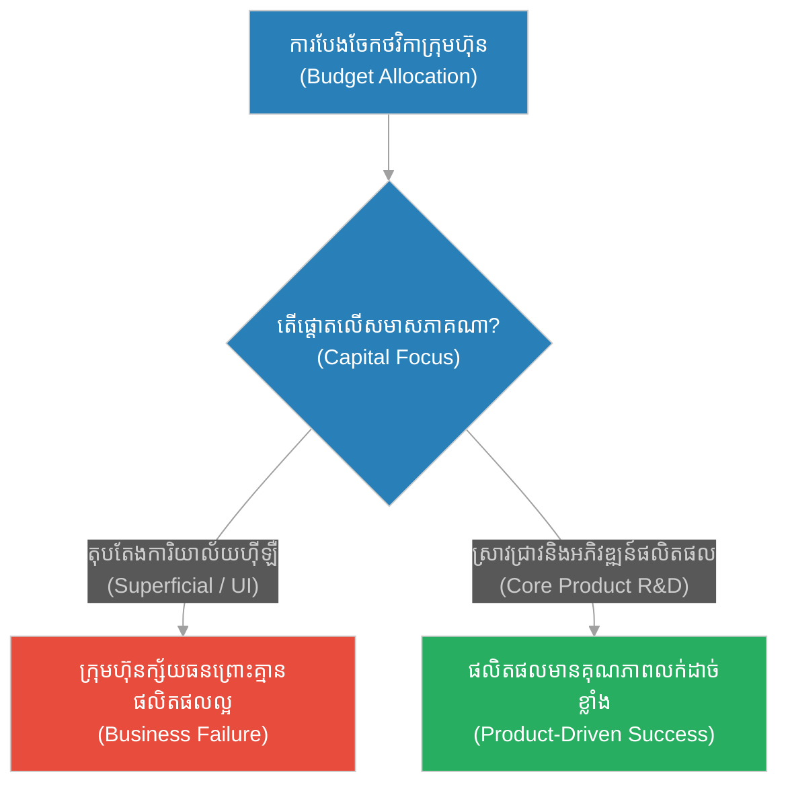
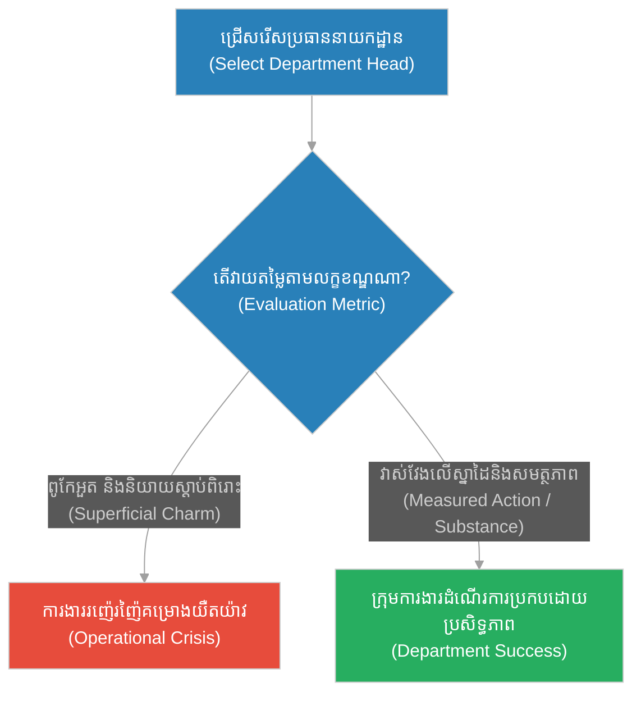
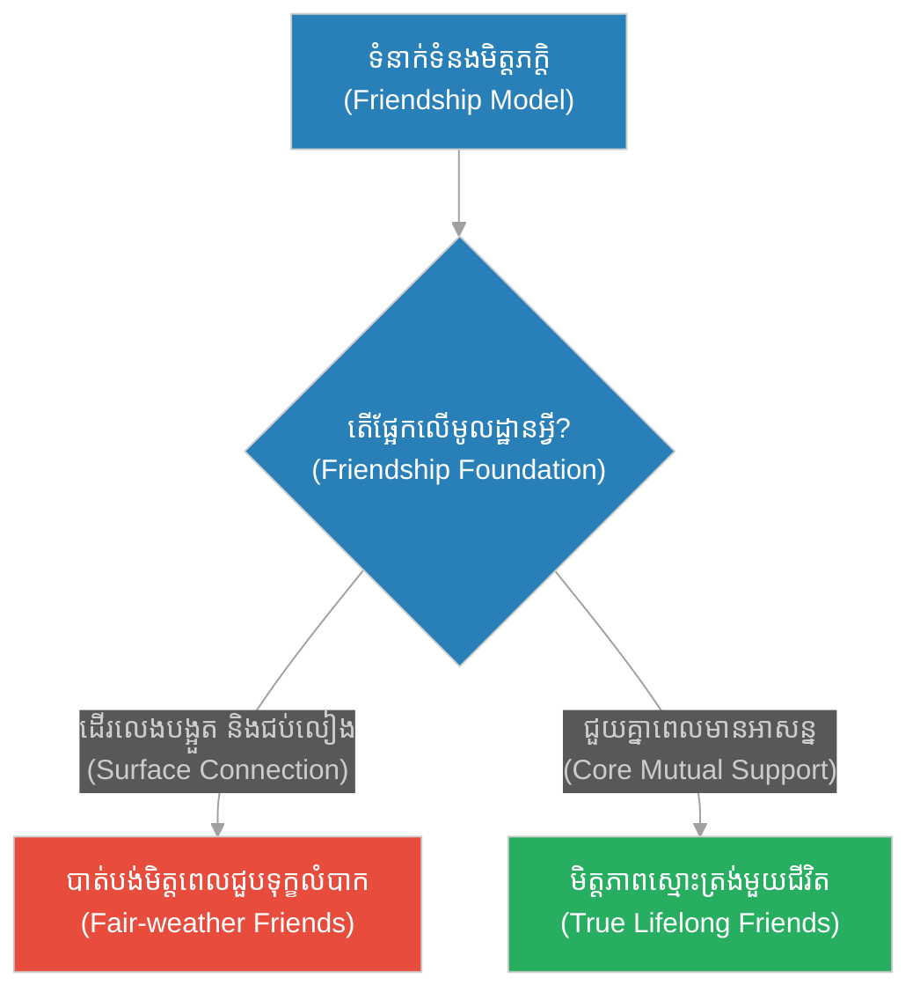
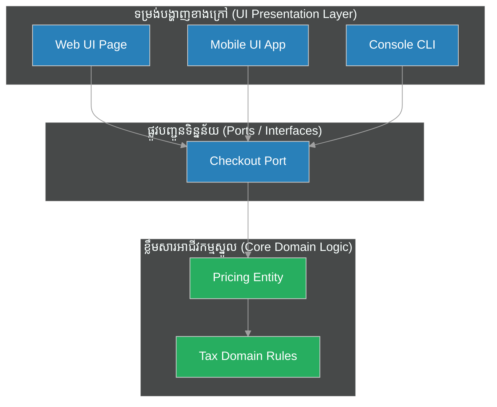

# Core Business Domain Logic vs. UI Overhead (ព្រលឹងដ៏ស្រស់ស្អាត)៖ ខ្លឹមសារអាជីវកម្មស្នូល និងទម្រង់បង្ហាញខាងក្រៅ (Core Business Domain Logic vs. UI Overhead & Domain-Driven Design and UI Separation & The Beautiful Soul)

**Author:** ichamrong  
**Date:** 2026-05-28  
**Tags:** #socrates #domain-driven-design #clean-architecture #ui-overhead #separation-of-concerns  
**Category:** Concepts  
**Read Time:** ~15 min  

---

## 📌 មាតិកា (Table of Contents)
- [អន្ទាក់ផ្លូវចិត្ត (The Trap)](#0)
- [១. រឿងព្រេងនិទាន៖ រឿងព្រេងនិទាន៖ យុវជនដ៏ស្រស់សង្ហា (The Legend of The Handsome Youth)](#1)
  - [ការលាតត្រដាងខ្លឹមសារពិត (The Climax: Revealing the True Essence)](#1-1)
- [២. បញ្ហា៖ ៖ Core Business Domain Logic vs. UI Overhead (The Issue: Core Business Domain Logic vs. UI Overhead)](#2)
- [៣. ឧទាហរណ៍ជាក់ស្តែងក្នុងពិភពពិត (Real World Examples)](#3)
  - [ឧទាហរណ៍ទី ១ — កម្រិតស្រាល (គ្រួសារ)៖ ការជ្រើសរើសគូស្រករ (Choosing a Partner)](#3-1)
  - [ឧទាហរណ៍ទី ២ — កម្រិតមធ្យម (បច្ចេកទេស)៖ Migration to Mobile Platform](#3-2)
  - [ឧទាហរណ៍ទី ៣ — កម្រិតមធ្យម (ធុរកិច្ច)៖ ការតុបតែងការិយាល័យ (Office Decoration vs. Product R&D)](#3-3)
  - [ឧទាហរណ៍ទី ៤ — កម្រិតមធ្យម (សង្គម/គ្រប់គ្រង)៖ ភាពជាអ្នកដឹកនាំ (Eloquent vs. Competent Leader)](#3-4)
  - [ឧទាហរណ៍ទី ៥ — កម្រិតធ្ងន់ (ទំនាក់ទំនង)៖ ភាពជិតស្និទ្ធបណ្តោះអាសន្ន (Surface Relationships)](#3-5)
- [៤. ដំណោះស្រាយទូទៅ៖ Core Business Domain Logic and UI Separation (The General Solution: Core Business Domain Logic and UI Separation)](#4)
- [សេចក្តីសន្និដ្ឋាន (Conclusion)](#5)
- [ឯកសារយោង (References)](#6)
- [Related Posts](#7)

---

<a id="0"></a>
## អន្ទាក់ផ្លូវចិត្ត (The Trap)

តើអ្នកធ្លាប់ជួបស្ថានភាពដែលការផ្លាស់ប្តូររូបរាងប៊ូតុង ឬពណ៌នៃគេហទំព័រ បែរជាធ្វើឱ្យមុខងារទូទាត់ប្រាក់លែងដំណើរការ ឬគណនាតម្លៃខុសដែរឬទេ? នេះគឺជាអន្ទាក់នៃការលាយឡំគ្នារវាង "សំបកខាងក្រៅ" និង "ខ្លឹមសារស្នូលខាងក្នុង" នៅក្នុងស្ថាបត្យកម្មប្រព័ន្ធកុំព្យូទ័រ។

* **ភាពជំពាក់ជំពិននឹងចំណុចប្រទាក់ (Framework/UI Dependency)** — ការសរសេរច្បាប់អាជីវកម្ម (Business Rules) ជ្រកក្រោម Code នៃ UI (ដូចជា React/Angular Components) ធ្វើឱ្យប្រព័ន្ធមិនអាចរត់ដោយឯករាជ្យបាន។
* **ការវាយតម្លៃលើសំបកក្រៅ (Halo Effect in Code)** — ការផ្តោតតែលើភាពស្រស់ស្អាតនៃចំណុចប្រទាក់ (User Interface) ដោយខកខានមិនបានពង្រឹងកូដស្នូល ធ្វើឱ្យកម្មវិធីងាយនឹងគាំង និងពិបាកធ្វើតេស្ត។



នៅក្នុងអត្ថបទនេះ យើងនឹងសិក្សាអំពី៖
1. **រឿងព្រេងនិទាន (The Legend)** — ទស្សនវិជ្ជារបស់សូក្រាតលើរូបសម្រស់ និងព្រលឹងយុវជន។
2. **បញ្ហា (The Issue)** — ភាពជំពាក់ជំពិននៃកូដបង្ហាញ និងកូដដំណើរការអាជីវកម្មស្នូល។
3. **ឧទាហរណ៍ជាក់ស្តែង (Real World Examples)** — ករណីសិក្សាលើ ៥ កម្រិតនៃការបំបែកខ្លឹមសារចេញពីសំបកក្រៅ។
4. **ដំណោះស្រាយទូទៅ (The General Solution)** — ការអនុវត្ត Clean Architecture និង Hexagonal Architecture។

---

<a id="1"></a>
## ១. រឿងព្រេងនិទាន៖ យុវជនដ៏ស្រស់សង្ហា (The Legend of The Handsome Youth)

ថ្ងៃមួយ មានឪពុកមេម៉ាយម្នាក់ ជាសេដ្ឋីនៅទីក្រុងអាថែន បាននាំកូនប្រុសរបស់គាត់មកជួបសូក្រាត។ កូនប្រុសនោះមានរូបរាងស្រស់សង្ហាឥតខ្ចោះ ស្លៀកពាក់យ៉ាងប្រណីត និងមានអាកប្បកិរិយាដូចកូនអ្នកអភិជន។ 

ឪពុកនោះបានអួតប្រាប់សូក្រាតថា៖ *"លោកមើលចុះ! កូនប្រុសរបស់ខ្ញុំមានរូបរាងសង្ហាជាងគេនៅក្នុងទីក្រុងនេះ។ តើលោកមិនគិតថា គាត់ស័ក្តិសមនឹងក្លាយជាអ្នកដឹកនាំដ៏អស្ចារ្យម្នាក់នៅថ្ងៃអនាគតទេឬ?"*

យុវជននោះឈរញញឹមដោយមោទនភាព ប៉ុន្តែមិនបាននិយាយអ្វីមួយម៉ាត់ឡើយ។ សូក្រាតមិនបានសរសើរពីរូបរាងកាយរបស់យុវជននោះទេ។ ផ្ទុយទៅវិញ លោកបានសម្លឹងមើលចំភ្នែកយុវជននោះ ហើយមានប្រសាសន៍នូវប្រយោគដ៏ល្បីល្បាញមួយថា៖

**"ចូរនិយាយមក! ដើម្បីឱ្យខ្ញុំអាចមើលឃើញពីអ្នកបាន។ (Speak, so that I may see you.)"**

ឪពុករបស់យុវជននោះមានការងឿងឆ្ងល់យ៉ាងខ្លាំង ក៏សួរថា៖ *"ហេតុអ្វីលោកត្រូវឱ្យគេនិយាយ ទើបមើលឃើញ? តើភ្នែករបស់លោកខ្វាក់ឬ ទើបមើលមិនឃើញរូបរាងដ៏ស្រស់សង្ហារបស់គាត់នៅចំពោះមុខនេះ?"*

សូក្រាតបានតបវិញថា៖ *"ភ្នែករបស់ខ្ញុំអាចមើលឃើញតែ 'រូបកាយ (Body)' ដែលនឹងចាស់ជ្រីវជ្រួញនៅថ្ងៃណាមួយប៉ុណ្ណោះ។ ប៉ុន្តែមានតែតាមរយៈ 'ពាក្យសម្តីនិងគំនិត' របស់គាត់ទេ ទើបខ្ញុំអាចមើលឃើញនូវ 'ព្រលឹងនិងអត្តចរិត (Soul and Character)' របស់គាត់បាន។ ប្រសិនបើព្រលឹងរបស់គាត់ទទេស្អាត រូបរាងដ៏ស្រស់សង្ហានេះ គឺគ្មានតម្លៃអ្វីទាំងអស់។"*

<a id="1-1"></a>
### ការលាតត្រដាងខ្លឹមសារពិត (The Climax: Revealing the True Essence)

ការទាមទាររបស់សូក្រាតឱ្យយុវជននោះ "និយាយ (Speak)" គឺដើម្បីវាយតម្លៃខ្លឹមសារពិតប្រាកដដែលនៅពីក្រោយសំបកក្រៅ។ រូបសម្រស់ខាងក្រៅ អាចបញ្ឆោតភ្នែក និងទាក់ទាញអារម្មណ៍មនុស្សបាននៅកម្រិតដំបូង (UI UX Layout) ប៉ុន្តែមានតែពាក្យសម្តី និងការរៀបចំគំនិត (Domain Logic) របស់គេប៉ុណ្ណោះ ដែលកំណត់តម្លៃពិតរបស់បុគ្គលម្នាក់។ ប្រសិនបើប្រព័ន្ធកុំព្យូទ័រមានតែ UI ស្អាត តែគ្មាន Core Logic ដែលត្រឹមត្រូវទេ វាក៏គ្មានតម្លៃអ្វីទាំងអស់។

---

<a id="2"></a>
## ២. បញ្ហា៖ Core Business Domain Logic vs. UI Overhead (The Issue: Core Business Domain Logic vs. UI Overhead)

នៅក្នុងវិស្វកម្មកម្មវិធី ការលាយឡំកូដអាជីវកម្មស្នូល (Core Business Rules) ជាមួយកូដបង្ហាញរូបរាង (UI Elements/Framework) គឺជាកំហុសធ្ងន់ធ្ងរ។ ឧទាហរណ៍ ការសរសេររាយនាមច្បាប់ពន្ធ ឬការគណនាការបញ្ចុះតម្លៃនៅក្នុងឯកសារ HTML ឬ UI Event Controllers ផ្ទាល់។ វានាំឱ្យប្រព័ន្ធមិនអាចរត់ការងារផ្សេងទៀតបាន (ដូចជាការរត់ API call, Background task ឬ unit tests) ដោយគ្មានការបង្កើតទម្រង់បង្ហាញ UI ឡើយ។

### ប្រៀបធៀបការអនុវត្ត (Fragile vs. Resilient Practices)

* **ការអនុវត្តដែលផុយស្រួយ (Fragile Practice):** ការសរសេរកូដគណនាតម្លៃ ឬការផ្ទៀងផ្ទាត់ទិន្នន័យ (Validation) លាយឡំជាមួយ UI Controller ដូចជាការប្រើប្រាស់ State របស់ HTML Component ផ្ទាល់។ នៅពេលចង់ប្តូរប្រព័ន្ធពី Web ទៅកាន់ Mobile App ក្រុមការងារត្រូវបង្ខំចិត្តសរសេរកូដ Logic នោះសារជាថ្មី។
* **ការអនុវត្តដែលមានភាពធន់ (Resilient Practice):** ការបំបែក Core Logic ឱ្យទៅជា "Domain Model" ឬ "Domain Service" ដែលជាកូដឯករាជ្យ (Plain Javascript/TypeScript Class) មិនពឹងផ្អែកលើ Framework ឬ UI ឡើយ។ UI គ្រាន់តែជាអ្នកបញ្ជូនទិន្នន័យទៅកាន់ Domain និងបង្ហាញលទ្ធផលដែលទទួលបានមកវិញប៉ុណ្ណោះ។

ខាងក្រោមនេះជាគំរូកូដ TypeScript បង្ហាញពីការបំបែក Core Business Logic ចេញពី UI:

```typescript
// === ១. វិធីសាស្ត្រផុយស្រួយ (Fragile Way: Coupling Logic with UI Rendering Framework) ===
// កូដគណនាពន្ធ និងការបញ្ចុះតម្លៃត្រូវបានសរសេរនៅក្នុង UI Component ផ្ទាល់
// Coupled logic which cannot be tested or reused without rendering the UI
class FragileCheckoutUI {
  render(cartItems: { name: string; price: number }[]) {
    // UI state និង Business Logic លាយឡំគ្នា
    let total = 0;
    for (const item of cartItems) {
      total += item.price;
    }
    
    const tax = total * 0.1; // តក្កវិជ្ជាស្នូល៖ ពន្ធ ១០%
    const finalPrice = total + tax;

    // បង្ហាញរូបរាងនៅលើ UI
    console.log(`<html><body>Total Price: $${finalPrice}</body></html>`);
  }
}

// === ២. វិធីសាស្ត្ររឹងមាំ (Resilient Way: Domain-Driven Design / Clean Architecture) ===
// កូដស្នូលអាជីវកម្មត្រូវបានបំបែកទៅជា Class ឯករាជ្យ (Pure Domain Logic)
// Highly cohesive Domain class focusing ONLY on tax and calculation rules
class CartPricingCalculator {
  private TAX_RATE = 0.1; // ១០% ពន្ធ

  calculateTotal(items: { price: number }[]): number {
    return items.reduce((sum, item) => sum + item.price, 0);
  }

  calculateTax(subtotal: number): number {
    return subtotal * this.TAX_RATE;
  }

  calculateFinalPrice(items: { price: number }[]): number {
    const subtotal = this.calculateTotal(items);
    return subtotal + this.calculateTax(subtotal);
  }
}

// UI គ្រាន់តែហៅប្រើប្រាស់ Domain logic និងទទួលបន្ទុកតែលើការបង្ហាញរូបរាងប៉ុណ្ណោះ
// UI class acting as a thin wrapper (substance separated from appearance)
class ResilientCheckoutUI {
  constructor(private calculator: CartPricingCalculator) {}

  render(cartItems: { name: string; price: number }[]) {
    const finalPrice = this.calculator.calculateFinalPrice(cartItems);
    
    // បង្ហាញរូបរាងនៅលើ UI
    console.log(`<html><body>Total Price: $${finalPrice}</body></html>`);
  }
}

// ងាយស្រួលធ្វើ Unit Test លើកូដស្នូលដោយមិនបាច់ដំណើរការ UI
const domainCalc = new CartPricingCalculator();
console.log(`Test Pure Logic: $${domainCalc.calculateFinalPrice([{ price: 100 }])}`); // expected: 110
```

---

<a id="3"></a>
## ៣. ឧទាហរណ៍ជាក់ស្តែងក្នុងពិភពពិត (Real World Examples)

<a id="3-1"></a>
### ឧទាហរណ៍ទី ១ — កម្រិតស្រាល (គ្រួសារ)៖ ការជ្រើសរើសគូស្រករ (Choosing a Partner)
ការជ្រើសរើសដៃគូជីវិតដោយផ្អែកតែលើរូបសម្បត្តិខាងក្រៅ និងរបស់ទ្រព្យ (UI) ដោយមិនបានសង្កេតមើលអត្តចរិត និងសីលធម៌ពិតពីខាងក្នុង (Core Logic)។



<a id="3-2"></a>
### ឧទាហរណ៍ទី ២ — កម្រិតមធ្យម (បច្ចេកទេស)៖ Migration to Mobile Platform
ក្រុមហ៊ុនអភិវឌ្ឍន៍មួយត្រូវការប្តូរប្រព័ន្ធពី Web ទៅ Mobile App តែត្រូវចំណាយពេលច្រើនខែព្រោះ Logic ទាំងអស់ត្រូវជាប់គាំងជាមួយ Web Frontend។



<a id="3-3"></a>
### ឧទាហរណ៍ទី ៣ — កម្រិតមធ្យម (ធុរកិច្ច)៖ ការតុបតែងការិយាល័យ (Office Decoration vs. Product R&D)
ក្រុមហ៊ុនមួយចំនាយទុនយ៉ាងច្រើនលើសោភ័ណភាពការិយាល័យ និងសម្ភារៈទំនើបៗ (UI) តែខ្វះខាតថវិកាអភិវឌ្ឍន៍គុណភាពផលិតផលពិត (Core Logic)។



<a id="3-4"></a>
### ឧទាហរណ៍ទី ៤ — កម្រិតមធ្យម (សង្គម/គ្រប់គ្រង)៖ ភាពជាអ្នកដឹកនាំ (Eloquent vs. Competent Leader)
ការជ្រើសរើសប្រធានក្រុមការងារដែលនិយាយពិរោះ អួតអាង និងស្លៀកពាក់ស្អាតបាត (UI) ប៉ុន្តែមិនចេះដោះស្រាយវិបត្តិការងារជាក់ស្តែង (Domain Value)។



<a id="3-5"></a>
### ឧទាហរណ៍ទី ៥ — កម្រិតធ្ងន់ (ទំនាក់ទំនង)៖ ភាពជិតស្និទ្ធបណ្តោះអាសន្ន (Surface Relationships)
ការកសាងមិត្តភាពដែលពឹងផ្អែកលើការដើរលេងសប្បាយ និងការបង្ហាញភាពស៊ីវិល័យ (UI) ដោយគ្មានការយោគយល់ និងការជួយគ្នាក្នុងគ្រាលំបាក (Core Trust)។



---

<a id="4"></a>
## ៤. ដំណោះស្រាយទូទៅ៖ Core Business Domain Logic and UI Separation (The General Solution: Core Business Domain Logic and UI Separation)

ដើម្បីធានាថាប្រព័ន្ធមានភាពងាយស្រួលក្នុងការពង្រីក និងមិនរងផលប៉ះពាល់ពីការផ្លាស់ប្តូរផ្នែកខាងក្រៅ ស្ថាបត្យករប្រព័ន្ធត្រូវអនុវត្តស្ថាបត្យកម្ម **Ports and Adapters (Hexagonal Architecture)**។

### ជំហានជាក់ស្តែង៖
1. **Define Pure Domain Entities:** បង្កើត Class សម្រាប់ Logic ស្នូលដែលមិនមានការហៅទៅកាន់ API, Database, ឬ UI framework ណាមួយឡើយ (Pure TypeScript/JavaScript)។
2. **Implement Interfaces (Ports):** បង្កើតផ្លូវដោះដូរទិន្នន័យ (Ports) សម្រាប់ឱ្យសមាសភាគខាងក្រៅបញ្ជូនទិន្នន័យចូល។
3. **Decouple UI Controllers:** UI Controllers មានតួនាទីត្រឹមតែបកប្រែពាក្យបញ្ជារបស់អ្នកប្រើប្រាស់ (User Gestures) ទៅជាទិន្នន័យ រួចបញ្ជូនទៅឱ្យ Domain ដំណើរការ។
4. **Isolated Testing:** ធ្វើតេស្តលើច្បាប់អាជីវកម្មដោយឡែក និងធ្វើតេស្ត UI ដោយឡែក ជៀសវាងការធ្វើតេស្តលាយឡំគ្នា។



---

<a id="5"></a>
## សេចក្តីសន្និដ្ឋាន (Conclusion)

> **«ចូរនិយាយមក! ដើម្បីឱ្យខ្ញុំអាចមើលឃើញពីអ្នកបាន។»**

ជាសន្និដ្ឋាន សំបកខាងក្រៅអាចជារបស់ទាក់ទាញភ្នែកដំបូង ប៉ុន្តែខ្លឹមសារខាងក្នុងទើបជាអ្នកកំណត់ភាពរឹងមាំ និងអត្ថិភាពយូរអង្វែង។ ការបំបែកកូដដំណើរការស្នូល (Domain Logic) ឱ្យដាច់ស្រឡះពីទម្រង់បង្ហាញខាងក្រៅ (UI UX) មិនត្រឹមតែជាវិធីសាស្ត្ររៀបចំកូដឱ្យមានរបៀបរៀបរយនោះទេ ប៉ុន្តែវាជាការធានានូវអនាគត និងភាពរឹងមាំរបស់ប្រព័ន្ធបច្ចេកវិទ្យាទាំងមូល។

---

<a id="6"></a>
## ឯកសារយោង (References)

* **Evans, Eric** (2003). *Domain-Driven Design: Tackling Complexity in the Heart of Software*. Addison-Wesley. Discusses the core concepts of keeping domain models isolated from infrastructure.
* **Martin, Robert C.** (2017). *Clean Architecture: A Craftsman's Guide to Software Structure and Design*. Focuses on separating presentation layers from business logic.
* **Plato's Apology & Dialogues** — Source materials for Socrates' historical conversations on the relationship between external aesthetics and inner virtue.

---

<a id="7"></a>
## Related Posts

## 🐇 ធ្លាក់ចូលក្នុងរន្ធទន្សាយ (Enter the Rabbit Hole)
ដើម្បីស្វែងយល់បន្ថែមអំពីការផ្ទៀងផ្ទាត់សិទ្ធិ និងភាពត្រឹមត្រូវនៃកំណត់ត្រាប្រព័ន្ធ សូមបន្តដំណើរទៅកាន់៖

* 🚀 **[ចាប់ផ្តើមដំណើររុករក (Start the Journey) ➔ Cryptographic Signature Verification & Immutable Ledgers (ការស្វែងរកមនុស្សស្មោះត្រង់)៖ ការផ្ទៀងផ្ទាត់ហត្ថលេខាគ្រីបតូ និងកំណត់ត្រាដែលមិនអាចកែប្រែបាន (Cryptographic Signature Verification & Immutable Ledgers & Digital Trust and Blockchain Cryptography & The Search for an Honest Man)](./240-socrates-and-the-search-for-an-honest-man.md)**
