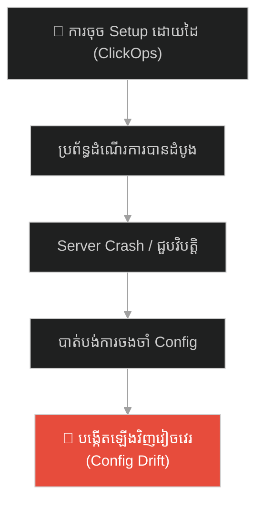
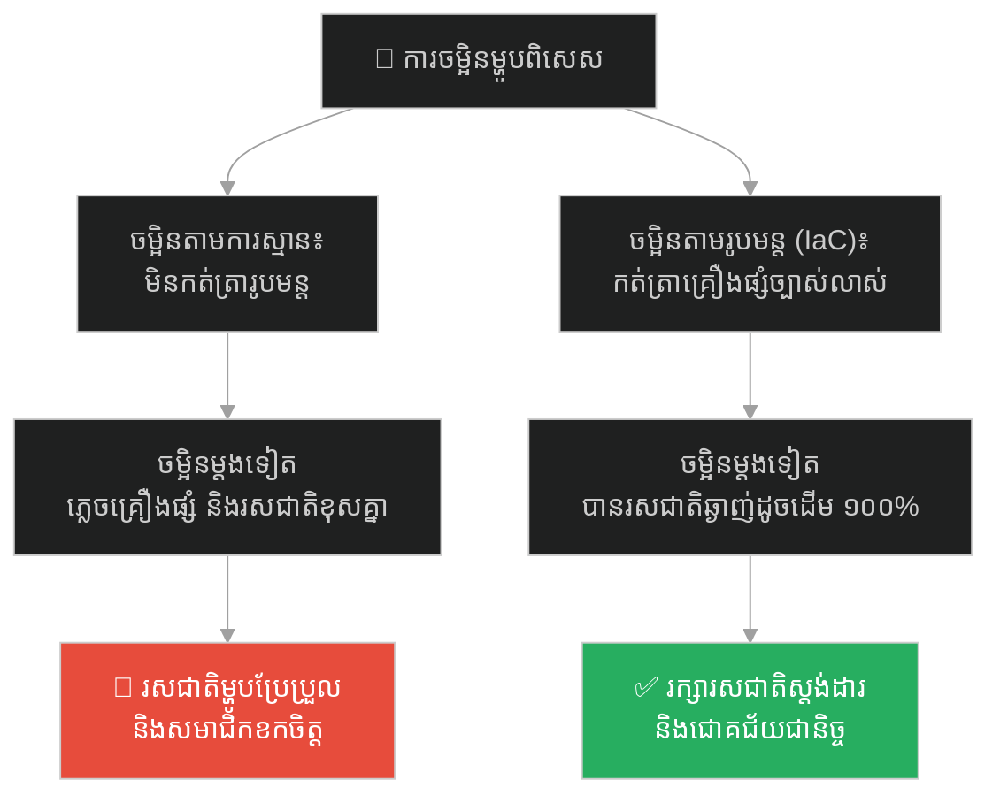
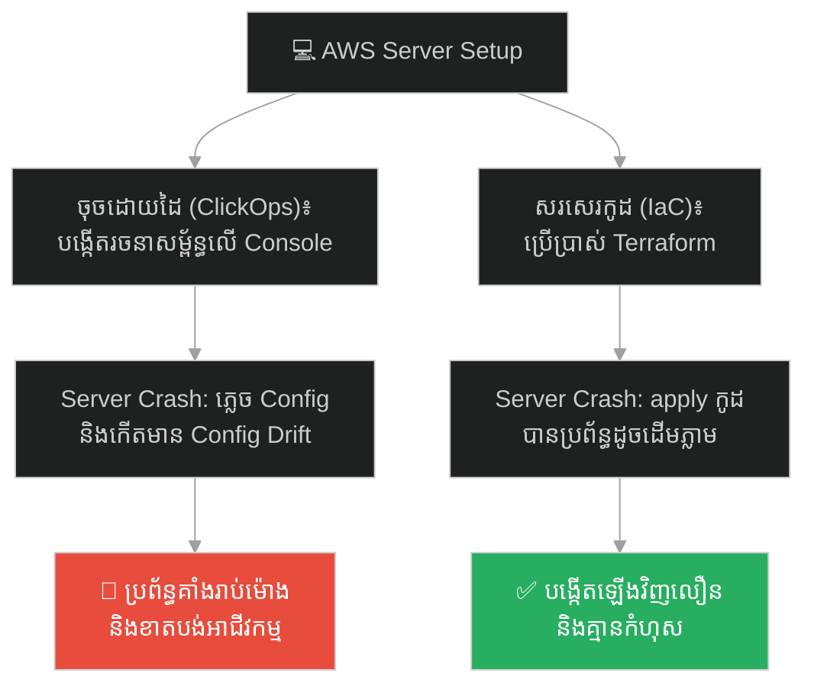
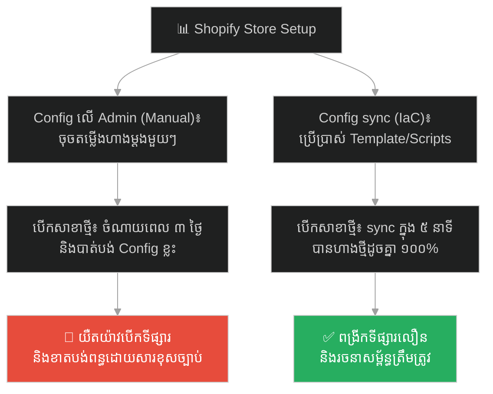
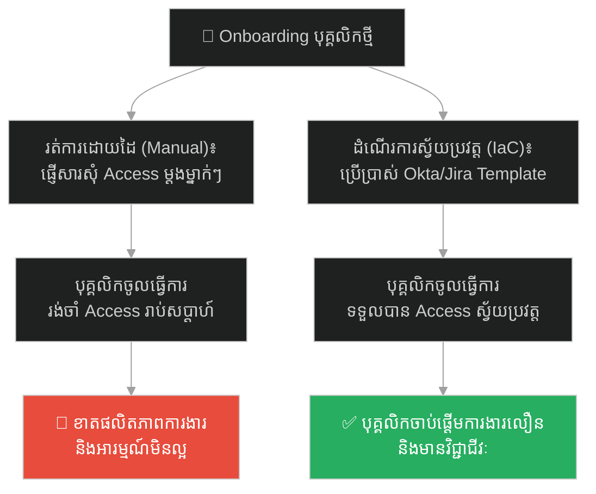
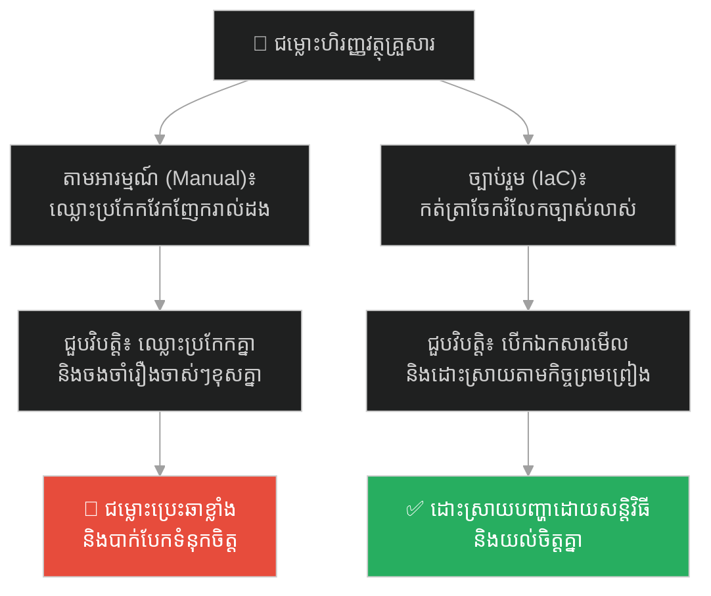
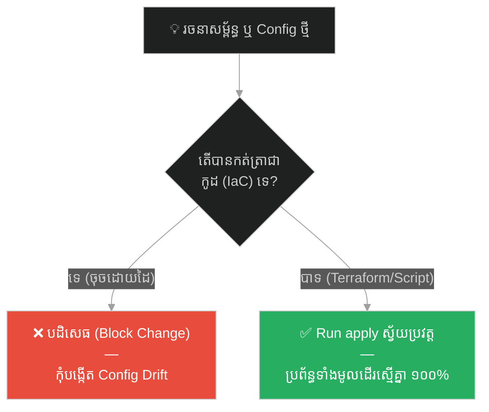

# The Two Architects and the Scroll of Creation (ស្ថាបត្យករទាំងពីរ និងក្រាំងសាងសង់)៖ គ្រោះថ្នាក់នៃ ClickOps និងសារៈសំខាន់នៃ Infrastructure as Code (IaC)

**Author:** ichamrong  
**Date:** 2026-05-27  
**Tags:** #terraform #infrastructure-as-code #devops #clickops #disaster-recovery #automation  
**Category:** Concepts / Parables  
**Read Time:** ~15 min  

---

## 📌 មាតិកា (Table of Contents)
- [អន្ទាក់ផ្លូវចិត្ត (The Trap)](#អន្ទាក់ផ្លូវចិត្ត-the-trap)
- [១. រឿងព្រេង៖ ស្ថាបត្យករ អាល់ទុស និង កូដិស (The Legend of Altus and Codex)](#1)
  - [ស្ថាបត្យករចង្អុលដៃ និងស្ថាបត្យករក្រាំងសាងសង់ (Altus the Pointer vs. Codex the Scribe)](#1-1)
  - [រញ្ជួយដី និងការកសាងឡើងវិញ (The Earthquake & Rebuilding)](#1-2)
- [២. បញ្ហា៖ ClickOps និងការខាតបង់ក្នុងការគ្រប់គ្រងប្រព័ន្ធដោយដៃ (The Issue: ClickOps & Manual System Errors)](#2)
- [៣. ឧទាហរណ៍ជាក់ស្តែងក្នុងពិភពពិត (Real World Examples)](#3)
  - [ឧទាហរណ៍ទី ១ — កម្រិតស្រាល (គ្រួសារ)៖ ការចម្អិនម្ហូបតាមការស្មានទល់នឹងការមានរូបមន្ត (The Cooking Guesswork vs. Recipe Book)](#3-1)
  - [ឧទាហរណ៍ទី ២ — កម្រិតមធ្យម (បច្ចេកទេស)៖ ការ Setup Server ដោយចុចផ្ទាល់ដៃទល់នឹង Terraform (AWS ClickOps vs. Terraform)](#3-2)
  - [ឧទាហរណ៍ទី ៣ — កម្រិតមធ្យម (ធុរកិច្ច)៖ ការតម្លើងហាងទំនិញតាមរយៈការ Config ដោយដៃទល់នឹង Script ស្វ័យប្រវត្ត (Manual Shopify Config vs. Automated Sync)](#3-3)
  - [ឧទាហរណ៍ទី ៤ — កម្រិតមធ្យម (សង្គម/គ្រប់គ្រង)៖ ការបង្កើតដំណើរការការងារ (Onboarding Workflow Manual vs. Automated Template)](#3-4)
  - [ឧទាហរណ៍ទី ៥ — កម្រិតធ្ងន់ (ទំនាក់ទំនង)៖ ការដោះស្រាយជម្លោះតាមអារម្មណ៍ទល់នឹងច្បាប់រួម (Emotional Responses vs. Relationship Agreements)](#3-5)
- [៤. ដំណោះស្រាយទូទៅ៖ ការធ្វើស្វ័យប្រវត្តិកម្ម និងការកសាងឯកសារជាកូដ (The General Solution: IaC & GitOps Automation)](#4)
- [សេចក្តីសន្និដ្ឋាន (Conclusion)](#conclusion)
- [ឯកសារយោង (References)](#references)
- [Related Posts](#related-posts)

---

## អន្ទាក់ផ្លូវចិត្ត (The Trap)

តើអ្នកធ្លាប់ជួបស្ថានភាពដែលប្រព័ន្ធ Server ទាំងមូលត្រូវគាំង ឬគម្រោងត្រូវបង្កើតឡើងវិញ ប៉ុន្តែគ្មាននរណាម្នាក់ចងចាំថា ពីមុនយើងបានកំណត់រចនាសម្ព័ន្ធ (Configuration) អ្វីខ្លះដែរឬទេ?

នៅក្នុងយុគសម័យបច្ចេកវិទ្យា និងការគ្រប់គ្រងទំនើប យើងតែងតែឃើញ៖
* **អ្នកបច្ចេកទេស ឬអ្នកគ្រប់គ្រង** ចូលចិត្ត Log in ចូលទៅកាន់ប្រព័ន្ធ រួចចុចបង្កើត និងរៀបចំរចនាសម្ព័ន្ធផ្សេងៗដោយផ្ទាល់ដៃ (Manual Actions) ព្រោះវាលឿន និងស្រួលនៅពេលដំបូង។
* **ប្រព័ន្ធទាំងមូល** ក្លាយជាប្រព័ន្ធអាថ៌កំបាំង ដែលគ្មានការកត់ត្រាទុក ហើយនៅពេលវាជួបគ្រោះថ្នាក់ គ្មាននរណាម្នាក់អាចបង្កើតវាឡើងវិញឱ្យដូចដើមបានឡើយ។

នៅពេលស្ថាប័នមួយរៀបចំប្រព័ន្ធដោយការចុចផ្ទាល់ដៃ និងមិនកត់ត្រាជាកូដ ពួកគេកំពុងរស់នៅលើភាពមិនច្បាស់លាស់មួយហៅថា **អន្ទាក់ ClickOps (ClickOps Trap)**។

ដើម្បីយល់ដឹងពីរបៀបលុបបំបាត់ការងារដោយដៃ និងកសាងប្រព័ន្ធស្វ័យប្រវត្តិ នេះជាផែនទីបង្ហាញផ្លូវសម្រាប់អត្ថបទនេះ៖
1. **រឿងព្រេង (The Historic Legend)** — រឿងរ៉ាវរបស់ស្ថាបត្យករពីររូប អាល់ទុស (សង់ទីក្រុងដោយការចង្អុលដៃបញ្ជា) និង កូដិស (សង់ទីក្រុងដោយសរសេរក្រាំងសាងសង់ជាមុន)។
2. **បញ្ហា (The Issue)** — គ្រោះថ្នាក់នៃ ClickOps និងផលវិបាកនៃការកើតមាន Config Drift នៅក្នុងប្រព័ន្ធ IT។
3. **ឧទាហរណ៍ជាក់ស្តែងក្នុងពិភពពិត (Real World Examples)** — ពិនិត្យមើលឥទ្ធិពលនៃការងារដោយដៃទល់នឹងការកត់ត្រាជាកូដ ក្នុងកម្រិតគ្រួសារ ព័ត៌មានវិទ្យា ធុរកិច្ច ការគ្រប់គ្រង និងទំនាក់ទំនងស្នេហា។
4. **ដំណោះស្រាយទូទៅ (The General Solution)** — ការផ្លាស់ប្តូរទៅកាន់ **Infrastructure as Code (IaC)** និងយន្តការ GitOps Automation។

---

## ១. រឿងព្រេង៖ ស្ថាបត្យករ អាល់ទុស និង កូដិស (The Legend of Altus and Codex)

នៅក្នុងអាណាចក្រមួយដ៏ធំទូលាយ អធិរាជមានព្រះរាជបំណងចង់សាងសង់ទីក្រុងថ្មីចំនួនពីរដែលមានរូបរាងដូចគ្នាទាំងស្រុង ដើម្បីទុកសម្រាប់ព្រះរាជបុត្រទាំងពីររបស់ព្រះអង្គគ្រប់គ្រង។ ព្រះអង្គបានជួលស្ថាបត្យករដ៏ឆ្នើមចំនួនពីររូបគឺ **អាល់ទុស (Altus)** និង **កូដិស (Codex)** ដោយប្រគល់ដីទំនេរពីរតំបន់ឱ្យពួកគេសាងសង់។

---

### ស្ថាបត្យករចង្អុលដៃ និងស្ថាបត្យករក្រាំងសាងសង់ (Altus the Pointer vs. Codex the Scribe)

**អាល់ទុស** គឺជាស្ថាបត្យករដែលមានបទពិសោធន៍ខ្ពស់ ប៉ុន្តែគាត់ចូលចិត្តធ្វើការតាមទម្លាប់ (Manual Action)។ នៅថ្ងៃដំបូងនៃការដ្ឋាន គាត់បានដើរទៅកាន់ទីវាល ហើយចាប់ផ្តើមចង្អុលប្រាប់កម្មករឱ្យធ្វើការភ្លាមៗ៖
> *«ជីកអណ្តូងនៅត្រង់នេះជម្រៅ ១០ ម៉ែត្រ! សង់កំពែងនៅត្រង់នោះកម្ពស់ ៥ ម៉ែត្រ! ទ្វារក្រុងត្រូវប្រើឈើពណ៌ក្រហមប្រណីត!»*

គាត់ដើរចង្អុលបញ្ជា (ClickOps) កម្មករពេញមួយថ្ងៃដោយមិនបានកត់ត្រាទុកឡើយ។ ត្រឹមតែមួយសប្តាហ៍ ទីក្រុងរបស់ អាល់ទុស ចាប់ផ្តើមលេចរូបរាងឡើងយ៉ាងរហ័ស និងស្រស់ស្អាត។ អធិរាជបានយាងមកទតឃើញ និងសរសើរគាត់យ៉ាងខ្លាំងចំពោះភាពរហ័សរហួននេះ។

ចំណែកឯ **កូដិស** វិញ ក្នុងសប្តាហ៍ដំបូង គាត់មិនទាន់ឱ្យកម្មករចាប់ផ្តើមសាងសង់អ្វីទាំងអស់។ គាត់ចំណាយពេលអង្គុយនៅក្នុងតង់ ហើយសរសេរអក្សរចូលទៅក្នុងក្រាំងក្រដាសដ៏វែងមួយ (Infrastructure as Code)។ គាត់បានសរសេរយ៉ាងលម្អិតពីគ្រប់ទំហំ និងរចនាសម្ព័ន្ធ៖
> *«កំពែងក្រុង = កម្ពស់ ៥ ម៉ែត្រ, កម្រាស់ ២ ម៉ែត្រ, ធ្វើពីថ្មភ្នំ។»*  
> *«អណ្តូងទឹក = ចំនួន ៣, ជម្រៅ ១០ ម៉ែត្រ, ទីតាំងនៅកណ្តាលក្រុង។»*

នៅពេល អាល់ទុស ដើរមកឃើញ ក៏សើចចំអកថា៖ 
> *«កូដិសអើយ! ឯងអង្គុយសរសេរក្រដាសនេះដល់ណាទៀត? មើលទីក្រុងរបស់ខ្ញុំទៅ ជិតរួចរាល់ហើយ! ឯងប្រយ័ត្នអធិរាជកាត់ក្បាលព្រោះតែភាពយឺតយ៉ាវ!»*

កូដិស មិនតបតអ្វីឡើយ។ នៅពេលដែលគាត់សរសេរក្រាំងនេះចប់ គាត់បានយកវាទៅប្រគល់ឱ្យក្រុមជាងសំណង់វេទមន្ត (Automated Engine)។ ត្រឹមតែមួយប៉ព្រិចភ្នែក ទីក្រុងទាំងមូលក៏ត្រូវបានសាងសង់ឡើងយ៉ាងជាក់លាក់ ឥតខ្ចោះតាមអ្វីដែលបានសរសេរនៅលើក្រដាស ១០០%។ ទីក្រុងទាំងពីរ ពេលនេះបានឈរយ៉ាងស្កឹមស្កៃ និងមានរូបរាងដូចគ្នាទាំងស្រុង។

---

### រញ្ជួយដី និងការកសាងឡើងវិញ (The Earthquake & Rebuilding)

បីឆ្នាំក្រោយមក គ្រោះមហន្តរាយបានកើតឡើង។ ការរញ្ជួយដីដ៏កាចសាហាវបានវាយប្រហារអាណាចក្រទាំងមូល ធ្វើឱ្យទីក្រុងរបស់ អាល់ទុស និងទីក្រុងរបស់ កូដិស បាក់បែករលាយដល់ដីគ្មានសល់។ អធិរាជមានការសោកស្តាយយ៉ាងខ្លាំង ហើយបានបញ្ជាឱ្យស្ថាបត្យករទាំងពីរសាងសង់ទីក្រុងនោះឡើងវិញ **«ឱ្យដូចដើមបេះបិទ»** ជាបន្ទាន់។

**សម្រាប់ អាល់ទុស (ស្ថាបត្យករចង្អុលដៃ)៖** នេះគឺជាសុបិនអាក្រក់បំផុត។ គាត់ខំប្រឹងរំលឹកការចងចាំរបស់គាត់កាលពី ៣ ឆ្នាំមុន៖
* *«តើអណ្តូងនោះជម្រៅ ១០ ឬ ១២ ម៉ែត្រ?»*
* *«តើទ្វារក្រុងពីមុនពណ៌អ្វីឱ្យប្រាកដ?»*
* *«តើបំពង់ទឹកនៅក្រោមដី តភ្ជាប់គ្នាយ៉ាងម៉េចខ្លះ?»*

គាត់ចាំមិនច្បាស់ឡើយ។ គាត់ព្យាយាមចង្អុលប្រាប់កម្មករម្តងទៀត ប៉ុន្តែទីក្រុងថ្មីនេះចេញមកមានរូបរាងវៀចវេច អណ្តូងទាញទឹកមិនចេញ ហើយទ្វារក្រុងក៏ខុសទំហំ (Configuration Drift)។ អធិរាជខឹងសម្បារយ៉ាងខ្លាំងព្រោះក្រុងថ្មីខុសពីក្រុងចាស់។

**សម្រាប់ កូដិស (ស្ថាបត្យករក្រាំងសាងសង់)៖** គាត់មិនមានភាពភ័យស្លន់ស្លោសូម្បីតែបន្តិច។ គាត់គ្រាន់តែដើរទៅរើសយក **«ក្រាំងសាងសង់»** របស់គាត់ដែលបានរក្សាទុកយ៉ាងមានសុវត្ថិភាព យកទៅប្រគល់ឱ្យក្រុមជាងសំណង់វេទមន្តម្តងទៀត រួចនិយាយថា៖ *«ចូរសាងសង់តាមក្រាំងនេះ (Terraform Apply)!»*

ត្រឹមតែមួយភ្លែត ទីក្រុងថ្មីក៏លេចរូបរាងឡើងវិញ ដូចដើម ១០០% ដោយគ្មានខុសសូម្បីតែមួយមិល្លីម៉ែត្រ ព្រោះរាល់រចនាសម្ព័ន្ធទាំងអស់ត្រូវបានកត់ត្រាទុកជាស្រាប់រួចរាល់អស់ទៅហើយ។

---

## ២. បញ្ហា៖ ClickOps និងការខាតបង់ក្នុងការគ្រប់គ្រងប្រព័ន្ធដោយដៃ (The Issue: ClickOps & Manual System Errors)

នៅក្នុងយុគសម័យ DevOps និងការគ្រប់គ្រងប្រព័ន្ធបច្ចេកវិទ្យាទំនើប បាតុភូតនេះត្រូវបានគេហៅថា **ClickOps (Click Operations)**។
* **ClickOps:** គឺជានិយមន័យនៃការកំណត់រចនាសម្ព័ន្ធប្រព័ន្ធ (Servers, Database, Network Setup) តាមរយៈការចូលទៅចុច Mouse ដោយផ្ទាល់នៅលើ Admin Console។
* **គុណវិបត្តិ៖** វាងាយស្រួល និងរហ័សនៅពេលដំបូង ប៉ុន្តែវាបង្កើតឱ្យមាន **ភាពប្រែប្រួលរចនាសម្ព័ន្ធ (Configuration Drift)**។ នៅពេលប្រព័ន្ធទាំងមូលត្រូវ Crash ឬតម្រូវឱ្យបង្កើតឡើងវិញ (Disaster Recovery) គ្មាននរណាចងចាំជំហានទាំងអស់ឡើយ ដែលនាំទៅរកកំហុសឆ្គងធ្ងន់ធ្ងរ។

---

## ៣. ឧទាហរណ៍ជាក់ស្តែងក្នុងពិភពពិត

ដើម្បីយល់ដឹងឱ្យកាន់តែស៊ីជម្រៅ ផ្លូវការសិក្សានឹងនាំអ្នកទៅពិនិត្យមើល **ឧទាហរណ៍ចំនួន ៥ កម្រិតខុសៗគ្នា** ក្នុងជីវិតរស់នៅប្រចាំថ្ងៃ៖

---

### ឧទាហរណ៍ទី ១ — កម្រិតស្រាល (គ្រួសារ)៖ ការចម្អិនម្ហូបតាមការស្មានទល់នឹងការមានរូបមន្ត (The Cooking Guesswork vs. Recipe Book)

**ស្ថានភាព៖** ឪពុកចង់ធ្វើម្ហូបពិសេសមួយមុខ (ខគោខ្មែរ) សម្រាប់ក្រុមគ្រួសារញ៉ាំក្នុងថ្ងៃឈប់សម្រាក។

* **ភាគី A (ធ្វើតាមការស្មាន)៖** គាត់ចម្អិនដោយដាក់គ្រឿងផ្សំតាមអារម្មណ៍ និងការស្មានដៃ (Manual Guesswork)។ ម្ហូបចេញមកឆ្ងាញ់ខ្លាំងនៅថ្ងៃដំបូង។ ប៉ុន្តែ ៣ ខែក្រោយមក ពេលគាត់ចង់ធ្វើម្តងទៀត គាត់ភ្លេចកម្រិតគ្រឿងផ្សំ ធ្វើឱ្យរសជាតិប្រៃពេក ឬខុសពីមុន។
* **ភាគី B (ចម្អិនតាមរូបមន្ត)៖** ម្តាយចម្អិនដោយកត់ត្រាកម្រិតគ្រឿងផ្សំជាក្រាម និងពេលវេលាស្ងោរទុកក្នុងសៀវភៅរូបមន្ត (Recipe Book as SSOT)។ រាល់ពេលធ្វើម្តងៗ រសជាតិខគោចេញមកឆ្ងាញ់ដូចដើម ១០០%។

---

### ឧទាហរណ៍ទី ២ — កម្រិតមធ្យម (បច្ចេកទេស)៖ ការ Setup Server ដោយចុចផ្ទាល់ដៃទល់នឹង Terraform (AWS ClickOps vs. Terraform)

**ស្ថានភាព៖** SysAdmin ម្នាក់រៀបចំប្រព័ន្ធ Network និង Database របស់ក្រុមហ៊ុននៅលើ AWS Cloud។

* **ភាគី A (ClickOps SysAdmin)៖** គាត់ចូលទៅកាន់ AWS Console រួចចុច Mouse បង្កើត VPC, EC2, RDS ម្តងមួយៗ។ ពេលប្រព័ន្ធត្រូវបានកែសម្រួលដោះស្រាយ Bug ជារៀងរាល់ខែ គាត់មិនបានកត់ត្រាទុកឡើយ។ ពេល AWS Region នោះគាំង (Outage) គាត់ត្រូវចំណាយពេល ៣ ថ្ងៃដើម្បីចុចបង្កើតឡើងវិញទាំងភ័យស្លន់ស្លោ និងខុសខាត Config ចាស់។
* **ភាគី B (Terraform SysAdmin)៖** គាត់សរសេររាល់ហេដ្ឋារចនាសម្ព័ន្ធជាកូដ Terraform ទុកក្នុង Git។ ពេលមានអាសន្ន គាត់គ្រាន់តែវាយពាក្យ `terraform apply` នោះប្រព័ន្ធទាំងមូលត្រូវបានបង្កើតឡើងវិញដូចដើមភ្លាមៗក្នុងរយៈពេល ៥ នាទី។

---

### ឧទាហរណ៍ទី ៣ — កម្រិតមធ្យម (ធុរកិច្ច)៖ ការតម្លើងហាងទំនិញតាមរយៈការ Config ដោយដៃទល់នឹង Script ស្វ័យប្រវត្ត (Manual Shopify Config vs. Automated Sync)

**ស្ថានភាព៖** ម្ចាស់អាជីវកម្មចង់ពង្រីកហាងលក់ទំនិញ Shopify របស់ខ្លួនទៅកាន់ទីផ្សារថ្មីចំនួន ៣ ប្រទេស (US, UK, AU)។

* **ភាគី A (Config ដោយដៃ)៖** គាត់ Log in ចូលទៅកាន់ហាង Shopify នីមួយៗ រួចរៀបចំលក្ខខណ្ឌដឹកជញ្ជូន (Shipping rates) កម្រិតពន្ធដារ និង Email notification ដោយចុចផ្ទាល់ដៃម្តងមួយៗ។ ពេលដំណើរការ គាត់ភ្លេច Config ពន្ធដារនៅ UK ធ្វើឱ្យរងការផាកពិន័យ និងខាតបង់ថវិកា។
* **ភាគី B (Config ស្វ័យប្រវត្ត)៖** គាត់ប្រើប្រាស់ Tool ឬ API scripts ដើម្បី Sync Config ទាំងអស់ចេញពី Master Template តែមួយទៅកាន់ហាងទាំង ៣ ក្នុងពេលតែមួយ។ ហាងទាំងអស់ត្រូវបាន Setup ដូចគ្នាឥតខ្ចោះក្នុងរយៈពេលប៉ុន្មាននាទី។

---

### ឧទាហរណ៍ទី ៤ — កម្រិតមធ្យម (សង្គម/គ្រប់គ្រង)៖ ការបង្កើតដំណើរការការងារ (Onboarding Workflow Manual vs. Automated Template)

**ស្ថានភាព៖** HR Manager ចង់រៀបចំការទទួលស្វាគមន៍បុគ្គលិកថ្មី (Onboarding) ឱ្យមានរបៀបរៀបរយ។

* **ភាគី A (HR ធ្វើការដោយដៃ)៖** រាល់ពេលមានបុគ្គលិកថ្មីចូល HR ត្រូវដើរផ្ញើសារប្រាប់ IT ឱ្យបង្កើត Email ផ្ញើសារប្រាប់ Admin ឱ្យទិញកុំព្យូទ័រ និងផ្ញើសារប្រាប់ Finance ឱ្យបើកប្រាក់បៀវត្ស។ ពេលរវល់ខ្លាំង HR ភ្លេចប្រាប់ IT ធ្វើឱ្យបុគ្គលិកថ្មីគ្មាន Email ប្រើប្រាស់អស់រយៈពេលមួយសប្តាហ៍។
* **ភាគី B (HR ប្រើប្រាស់ Template ស្វ័យប្រវត្ត)៖** HR ប្រើប្រាស់ Onboarding Workflow Template នៅក្នុងប្រព័ន្ធគ្រប់គ្រង (Okta/Jira)។ គ្រាន់តែបញ្ចូលឈ្មោះបុគ្គលិកថ្មី ប្រព័ន្ធនឹងផ្ញើសារសុំ Access ទៅកាន់ផ្នែក IT, Admin, និង Finance ស្វ័យប្រវត្តិ ធានាថាគ្មានការងារណាត្រូវបានភ្លេចឡើយ។

---

### ឧទាហរណ៍ទី ៥ — កម្រិតធ្ងន់ (ទំនាក់ទំនង)៖ ការដោះស្រាយជម្លោះតាមអារម្មណ៍ទល់នឹងច្បាប់រួម (Emotional Responses vs. Relationship Agreements)

**ស្ថានភាព៖** ដៃគូជីវិតរស់នៅជាមួយគ្នាជួបប្រទះបញ្ហាហិរញ្ញវត្ថុ និងការបែងចែកការងារផ្ទះ។

* **ភាគី A (ដោះស្រាយតាមអារម្មណ៍)៖** ពួកគេដោះស្រាយរាល់បញ្ហាតាមអារម្មណ៍ប្រចាំថ្ងៃ និងពាក្យសម្តីមាត់ទទេ (Manual/Emotional)។ ពេលកើតមានជម្លោះ ពួកគេចាប់ផ្តើមឈ្លោះប្រកែកគ្នាពីការបែងចែកលុយកាក់កាលពីខែមុន ដោយម្នាក់ៗចងចាំខុសៗគ្នា និងចោទប្រកាន់គ្នាទៅវិញទៅមក។
* **ភាគី B (ច្បាប់រួមច្បាស់លាស់)៖** ពួកគេមានកិច្ចព្រមព្រៀងរួមគ្នាដែលបានកត់ត្រាទុក (Family Financial Agreement / Shared Rules) ពីកម្រិតចំណាយ និងការបែងចែកភារកិច្ច។ ពេលមានបញ្ហា ពួកគេគ្រាន់តែបើកមើលកិច្ចព្រមព្រៀងរួមនោះ រួចអនុវត្តតាមដោយសន្តិវិធី។

---

## ៤. ដំណោះស្រាយទូទៅ៖ ការធ្វើស្វ័យប្រវត្តិកម្ម និងការកសាងឯកសារជាកូដ (The General Solution: IaC & GitOps Automation)

ដើម្បីយកឈ្នះលើបញ្ហា ClickOps និងការពារកុំឱ្យប្រព័ន្ធការងារជួបវិបត្តិ Config Drift អ្នកត្រូវអនុវត្តវិធានការទាំងនេះ៖

### ១. អនុវត្តគោលការណ៍ "រាល់រចនាសម្ព័ន្ធទាំងអស់ជាកូដ" (Everything as Code)
បោះចោលរាល់ការចុច Config ប្រព័ន្ធដោយផ្ទាល់ដៃ។ មិនថាជា Infrastructure (Terraform), Configuration (Ansible), ឬ API Documentation ត្រូវសរសេរវាជាកូដ និងរក្សាទុកនៅក្នុង Git Repository។ នេះធានាថាប្រព័ន្ធទាំងមូលមានកំណែប្រែច្បាស់លាស់ (Version Control)។

### ២. បង្កើតប្រព័ន្ធគ្រប់គ្រងការផ្លាស់ប្តូរតាមរយៈ Pull Requests (GitOps)
រាល់ពេលដែលចង់កែសម្រួល ឬផ្លាស់ប្តូរការកំណត់របស់ប្រព័ន្ធ ត្រូវធ្វើឡើងតាមរយៈការសរសេរកូដ រួចបើក Pull Request (PR) ឱ្យក្រុមការងារត្រួតពិនិត្យ និងយល់ព្រម (Code Review) មុននឹង Run apply ទៅកាន់ Production។ វិធីនេះលុបបំបាត់រាល់កំហុសឆ្គងពីមនុស្សម្នាក់គត់។

### ៣. អនុវត្តការធ្វើតេស្ត និង Deploy ស្វ័យប្រវត្ត (CI/CD Pipelines)
ប្រើប្រាស់ Tool ស្វ័យប្រវត្ត (GitHub Actions, GitLab CI) ដើម្បីអនុវត្តការផ្លាស់ប្តូរប្រព័ន្ធ។ នៅពេល Pull Request ត្រូវបាន Merge ប្រព័ន្ធនឹង Run apply ស្វ័យប្រវត្ត ធានាថារចនាសម្ព័ន្ធជាក់ស្តែងនៅលើ Cloud និងកូដនៅក្នុង Git មានសភាពដូចគ្នា ១០០% ជានិច្ច។

---

## 🐇 ធ្លាក់ចូលក្នុងរន្ធទន្សាយយុទ្ធសាស្ត្រ (Enter the Strategic Rabbit Hole)

ដើម្បីស្វែងយល់កាន់តែស៊ីជម្រៅអំពីរបៀបដែលមេដឹកនាំ ឬអ្នកគ្រប់គ្រង អាចកសាងបរិយាកាសការងារប្រកបដោយសុវត្ថិភាពផ្លូវចិត្ត និងរបៀបដែលការគំរាមកំហែងនៅកន្លែងធ្វើការ បំផ្លាញសក្តានុពលរបស់បុគ្គលិកឆ្នើម សូមបន្តដំណើររុករករបស់អ្នក៖

* 🚀 **[ចាប់ផ្តើមដំណើររុករក (Start the Journey) ➔ The Blacksmith and the Cruel Forge Master](./25-the-blacksmith-and-the-cruel-forge-master.md)**

---

## សេចក្តីសន្និដ្ឋាន (Conclusion)

> **«ទីក្រុងដែលរឹងមាំ និងស្រស់ស្អាតបំផុត មិនមែនកើតឡើងដោយសារតែការចង្អុលដៃបញ្ជារបស់ស្ថាបត្យករដ៏ពូកែម្នាក់នោះទេ គឺវាកើតឡើងដោយសារតែគ្រប់រចនាសម្ព័ន្ធទាំងអស់ ត្រូវបានកត់ត្រាទុកនៅក្នុងក្រាំងសាងសង់យ៉ាងច្បាស់លាស់។»**

ការចុចដោះស្រាយបញ្ហាប្រព័ន្ធដោយផ្ទាល់ដៃ អាចផ្តល់ឱ្យអ្នកនូវភាពលឿន និងអារម្មណ៍ថាខ្លួនពូកែនៅវិនាទីដំបូង។ ប៉ុន្តែនៅពេលដែលការរញ្ជួយដី ឬគ្រោះមហន្តរាយមកដល់ ភាពក្រអឺតក្រទមដែលមិនព្រមកត់ត្រាទុក នឹងកម្ទេចអ្វីៗគ្រប់យ៉ាង ហើយបន្សល់ទុកតែភាពសោកសៅ ដូចទីក្រុងបាក់បែករបស់ស្ថាបត្យករ អាល់ទុស។

ចូរសរសេរក្រាំងសាងសង់របស់អ្នកឱ្យបានច្បាស់លាស់ ហើយសង់ប្រព័ន្ធការងារប្រកបដោយភាពរឹងមាំយូរអង្វែង។

---

## ឯកសារយោង (References)

* **Morris, Kief** — *Infrastructure as Code: Managing Servers in the Cloud* (2016)។ ការវិភាគលម្អិតអំពីយុទ្ធសាស្ត្រ IaC និងការលុបបំបាត់ការងារដោយដៃក្នុងយុគសម័យ Cloud។
* **Kim, Gene; Behr, Kevin; Spafford, George** — *The Phoenix Project: A Novel about IT, DevOps, and Helping Your Business Win* (2013)។ រឿងរ៉ាវប្រៀបធៀបអំពីផលវិបាកនៃការគ្រប់គ្រង IT បែបចាស់ និងសារៈសំខាន់នៃស្វ័យប្រវត្តិកម្ម។
* **Terraform Documentation** — *Best Practices for Cloud Infrastructure Management* (HashiCorp)។ សេចក្តីណែនាំផ្លូវការសម្រាប់ការប្រើប្រាស់ Terraform និងការទប់ស្កាត់ Config Drift។

---

## Related Posts

* **[14 The Evolution of Star Charts and Navigation](../articles/14-the-history-of-star-charts-and-navigation.md)** — ការប្រែក្លាយចំណេះដឹងដែលមើលមិនឃើញ ឱ្យទៅជាឯកសារយោងដែលអាចប្រើប្រាស់បាន។
* **[23 The Master Navigator and the Hidden Star Chart](./23-the-master-navigator-and-the-hidden-star-chart.md)** — ផលវិបាកនៃការមិនកត់ត្រាផែនទីផ្លូវទឹក និងការបញ្ជាការងារតាមការខ្សឹបប្រាប់។
* **[12 Multiplier vs. Diminisher Leadership](../articles/12-multiplier-leadership.md)** — របៀបដែលមេដឹកនាំឆ្លាតវៃជួយសម្របសម្រួល និងកសាងសមត្ថភាពកូនក្រុម។

---

*Last updated: 2026-05-27*

## Related

- [💡 Concepts README](../README.md)
- [📚 Main Repository README](../../../README.md)
- [Developer Habits](../../developer-habits/README.md)
- [Mental Health & Well-being](../../mental-health/README.md)
- [Management & SDLC](../../management/README.md)
