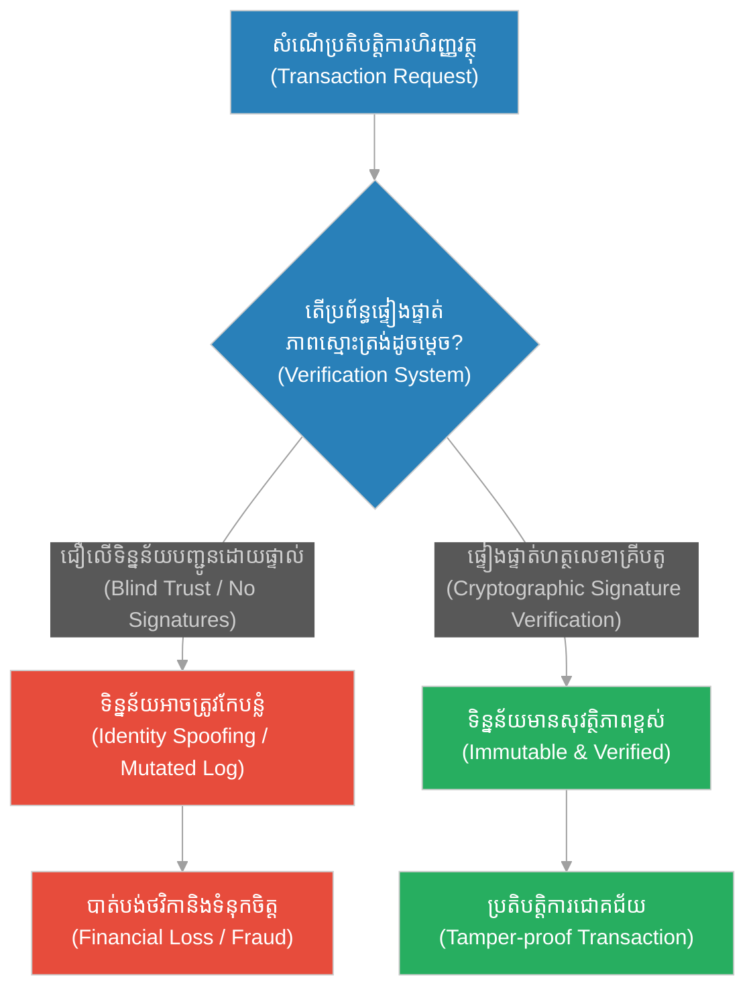
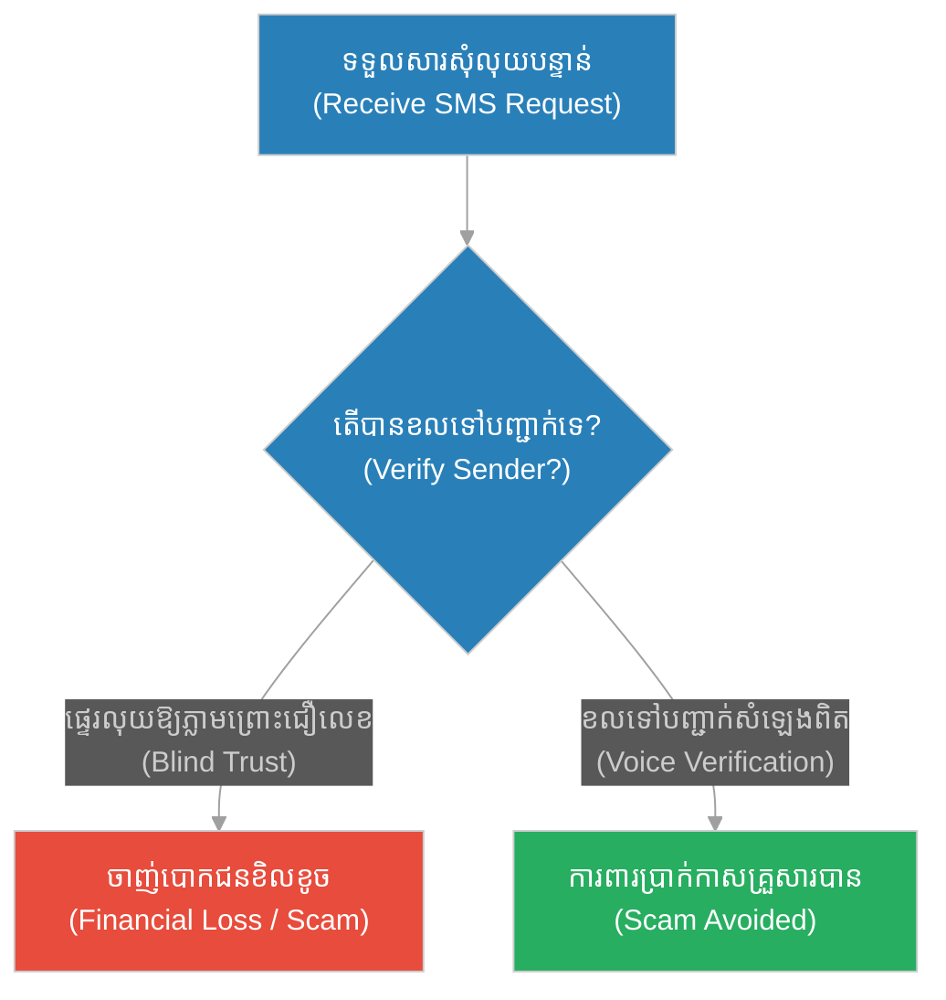
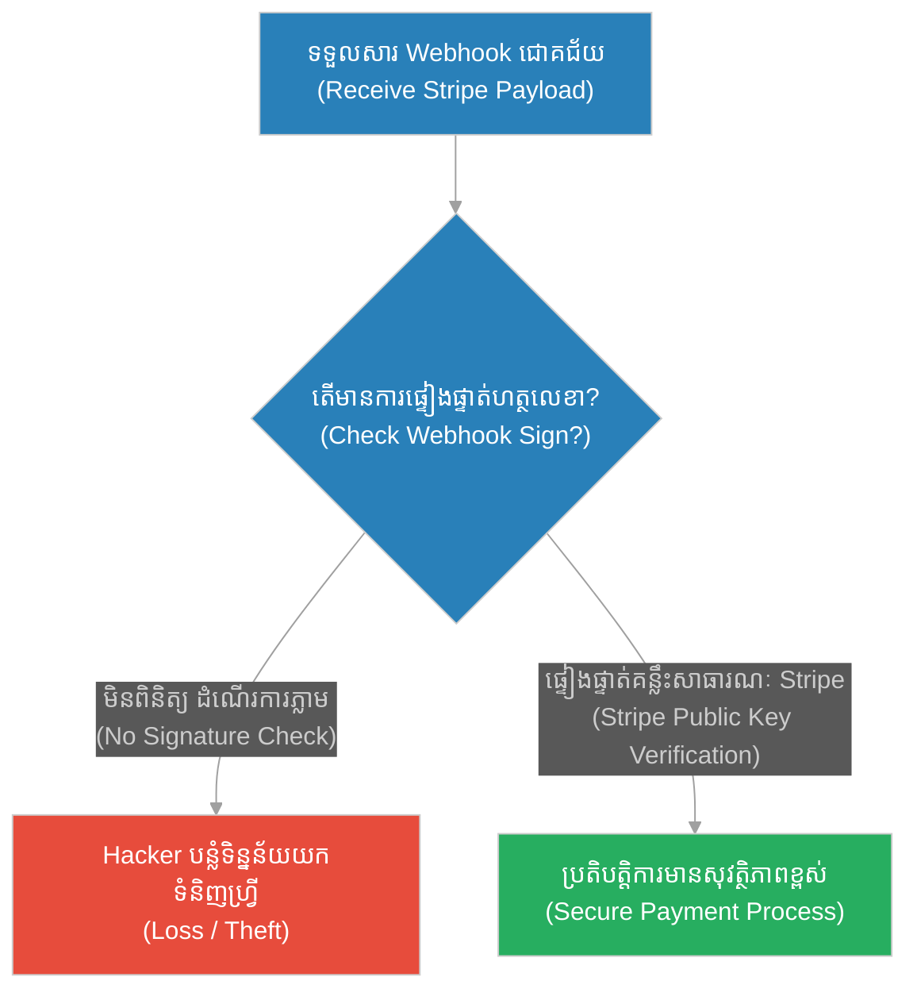
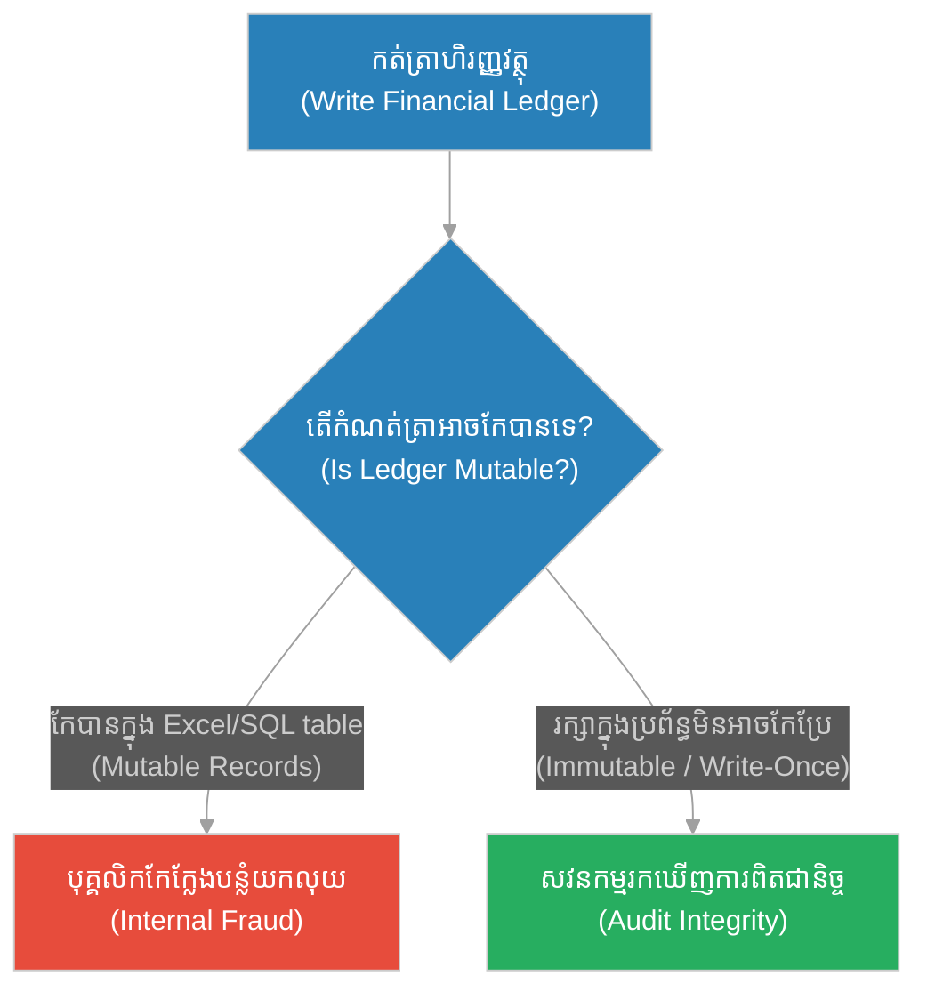
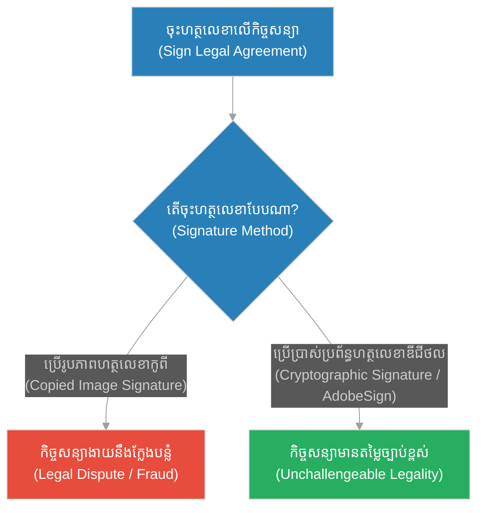
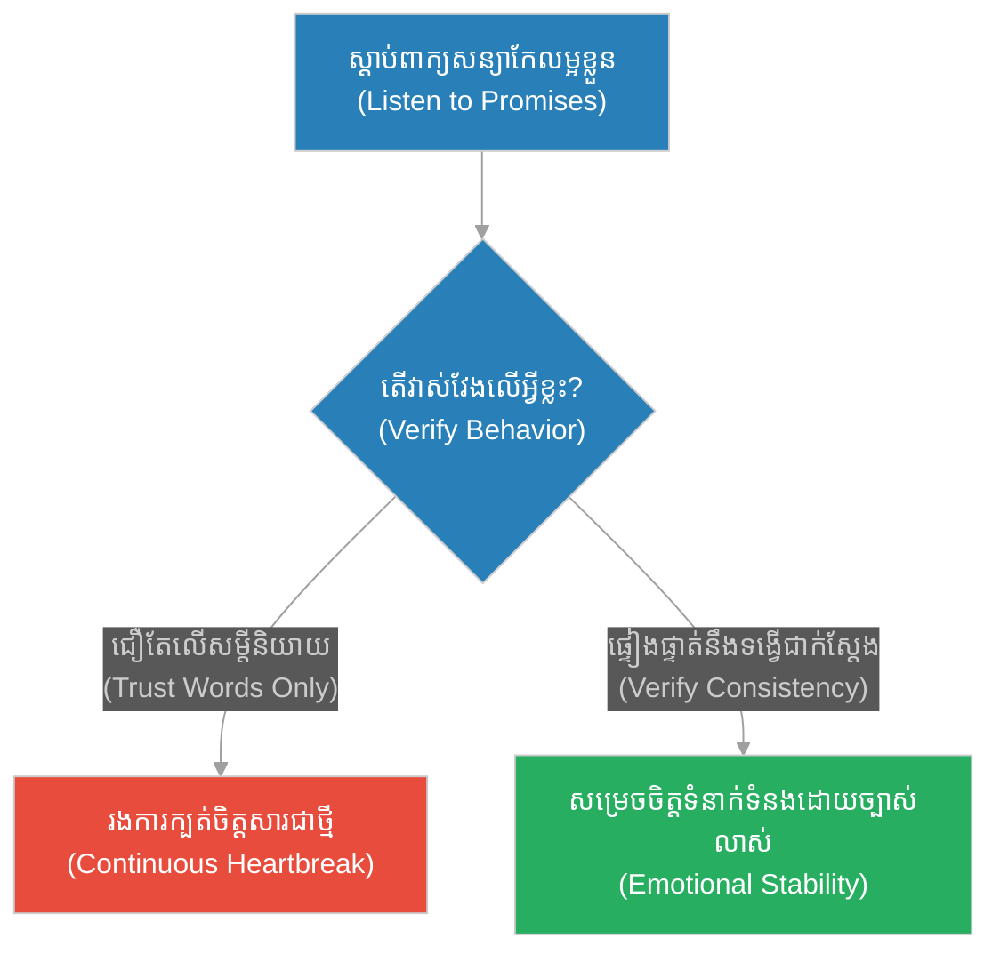
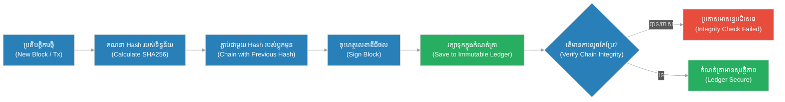

# Cryptographic Signature Verification & Immutable Ledgers (ការស្វែងរកមនុស្សស្មោះត្រង់)៖ ការផ្ទៀងផ្ទាត់ហត្ថលេខាគ្រីបតូ និងកំណត់ត្រាដែលមិនអាចកែប្រែបាន (Cryptographic Signature Verification & Immutable Ledgers & Digital Trust and Blockchain Cryptography & The Search for an Honest Man)

**Author:** ichamrong  
**Date:** 2026-05-28  
**Tags:** #socrates #diogenes #cryptography #digital-signature #immutable-ledger #security  
**Category:** Concepts  
**Read Time:** ~15 min  

---

## 📌 មាតិកា (Table of Contents)
- [អន្ទាក់ផ្លូវចិត្ត (The Trap)](#0)
- [១. រឿងព្រេងនិទាន៖ រឿងព្រេងនិទាន៖ ការកាន់ចង្កៀងនៅពេលថ្ងៃ (The Legend of The Lantern in Daylight)](#1)
  - [ការបំភ្លឺការពិតក្នុងទីផ្សារងងឹត (The Climax: Illuminating the Market of Pretenders)](#1-1)
- [២. បញ្ហា៖ ៖ Cryptographic Signature Verification & Immutable Ledgers (The Issue: Cryptographic Signature Verification & Immutable Ledgers)](#2)
- [៣. ឧទាហរណ៍ជាក់ស្តែងក្នុងពិភពពិត (Real World Examples)](#3)
  - [ឧទាហរណ៍ទី ១ — កម្រិតស្រាល (គ្រួសារ)៖ ការផ្ទៀងផ្ទាត់សារផ្ទេរប្រាក់ (Phishing Scams)](#3-1)
  - [ឧទាហរណ៍ទី ២ — កម្រិតមធ្យម (បច្ចេកទេស)៖ webhook Signature Verification](#3-2)
  - [ឧទាហរណ៍ទី ៣ — កម្រិតមធ្យម (ធុរកិច្ច)៖ កំណត់ត្រាហិរញ្ញវត្ថុរបស់ក្រុមហ៊ុន (Immutable Audit Trail)](#3-3)
  - [ឧទាហរណ៍ទី ៤ — កម្រិតមធ្យម (សង្គម/គ្រប់គ្រង)៖ ហត្ថលេខាឯកសារច្បាប់ (Legal Contract Integrity)](#3-4)
  - [ឧទាហរណ៍ទី ៥ — កម្រិតធ្ងន់ (ទំនាក់ទំនង)៖ ការសន្យា និងទង្វើជាក់ស្តែង (Promises vs. Consistent Behavior)](#3-5)
- [៤. ដំណោះស្រាយទូទៅ៖ Cryptographic Verification and Immutable Audits (The General Solution: Cryptographic Verification and Immutable Audits)](#4)
- [សេចក្តីសន្និដ្ឋាន (Conclusion)](#5)
- [ឯកសារយោង (References)](#6)
- [Related Posts](#7)

---

<a id="0"></a>
## អន្ទាក់ផ្លូវចិត្ត (The Trap)

តើអ្នកធ្លាប់ជឿជាក់លើទិន្នន័យ ឬឯកសារដែលផ្ញើមកតាមអ៊ីមែល ឬសារជាអក្សរ ដោយគ្រាន់តែឃើញឈ្មោះអ្នកផ្ញើត្រឹមត្រូវ តែក្រោយមកទើបដឹងថាវាជាឯកសារក្លែងបន្លំដែរឬទេ? នេះគឺជាអន្ទាក់នៃការជឿជាក់ដោយងងឹតងងុលលើសំបកក្រៅ (Blind Trust) និងកង្វះយន្តការផ្ទៀងផ្ទាត់ភាពត្រឹមត្រូវនៃទិន្នន័យ (Identity Spoofing)។

* **ការជឿជាក់លើប្រវត្តិដែលអាចកែប្រែបាន (Mutable History)** — ការរក្សាទុកកំណត់ត្រាប្រតិបត្តិការហិរញ្ញវត្ថុ ឬកំណត់ត្រាសន្តិសុខក្នុងប្រព័ន្ធដែលអាចកែសម្រួលបានយ៉ាងងាយស្រួល នាំឱ្យងាយនឹងមានអំពើពុករលួយ។
* **របាំងមុខឌីជីថល (Digital Social Masks)** — ការជឿលើអត្តសញ្ញាណរបស់អ្នកប្រើប្រាស់ដោយគ្មានការផ្ទៀងផ្ទាត់គណិតវិទ្យា ធ្វើឱ្យប្រព័ន្ធងាយនឹងរងការវាយប្រហារដោយការក្លែងអត្តសញ្ញាណ (Spoofing)។



នៅក្នុងអត្ថបទនេះ យើងនឹងសិក្សាអំពី៖
1. **រឿងព្រេងនិទាន (The Legend)** — ការកាន់ចង្កៀងរបស់ឌីយ៉ូសែននៅពេលថ្ងៃត្រង់ដើម្បីស្វែងរកមនុស្សស្មោះត្រង់។
2. **បញ្ហា (The Issue)** — ផលវិបាកនៃការទុកចិត្តដោយគ្មានការផ្ទៀងផ្ទាត់ និងការកែប្រែប្រវត្តិទិន្នន័យ។
3. **ឧទាហរណ៍ជាក់ស្តែង (Real World Examples)** — ករណីសិក្សាលើ ៥ កម្រិតនៃការផ្ទៀងផ្ទាត់ និងការកសាងទំនុកចិត្តឌីជីថល។
4. **ដំណោះស្រាយទូទៅ (The General Solution)** — ការប្រើប្រាស់ គ្រីបតូហត្ថលេខា (Digital Signatures) និងបច្ចេកវិទ្យា Blockchain/Append-Only Logs។

---

<a id="1"></a>
## ១. រឿងព្រេងនិទាន៖ ការកាន់ចង្កៀងនៅពេលថ្ងៃ (The Legend of The Lantern in Daylight)

*(ចំណាំ៖ រឿងនេះជារឿយៗត្រូវបានសន្មតទៅឱ្យ Diogenes of Sinope ដែលជាអ្នកដើរតាមទស្សនវិជ្ជាសូក្រាតដ៏ឆ្កួតលីលា (A Socrates gone mad) ប៉ុន្តែវាឆ្លុះបញ្ចាំងយ៉ាងច្បាស់ពីឧត្តមគតិស្វែងរកសេចក្តីពិតរបស់សូក្រាត។)*

នៅពាក់កណ្តាលថ្ងៃត្រង់ ព្រះអាទិត្យកំពុងរះចាំងពន្លឺយ៉ាងភ្លឺស្វាងពេញទីក្រុងអាថែន។ ទោះជាមានពន្លឺព្រះអាទិត្យក៏ដោយ ក៏បុរសម្នាក់ (ឌីយ៉ូសែន) បានអុជ **ចង្កៀងគោមមួយ** ហើយកាន់ដើរចុះដើរឡើង នៅកណ្តាលហ្វូងមនុស្សក្នុងទីផ្សារ ដោយយកចង្កៀងនោះទៅឆ្លុះមុខមនុស្សម្នាក់ម្តងៗ។

អ្នកក្រុងនាំគ្នាសើចចំអកឱ្យគាត់ ហើយសួរថា៖ *"លោកឆ្កួតទេឬអី? ថ្ងៃត្រង់ចាំងភ្នែកហើយ ហេតុអ្វីបានជាលោកអុជចង្កៀងដើររកអ្វីទៀត?"*

ឌីយ៉ូសែនមិនបានខ្វល់នឹងការសើចចំអកឡើយ។ គាត់នៅតែបន្តយកចង្កៀងទៅឆ្លុះមុខអ្នកក្រុង រួចដកដង្ហើមធំ ហើយឆ្លើយតបទៅអ្នកទាំងនោះវិញថា៖

**"ខ្ញុំកំពុងតែដើរស្វែងរក មនុស្សដែលស្មោះត្រង់និងមានសីលធម៌ពិតប្រាកដម្នាក់ (I am looking for an honest man)! ប៉ុន្តែទោះបីជាខ្ញុំប្រើភ្លើងចង្កៀងនេះ មកជួយបំភ្លឺបន្ថែមលើពន្លឺព្រះអាទិត្យទៀត ក៏ខ្ញុំនៅតែរកមិនឃើញសូម្បីតែម្នាក់សោះនៅក្នុងទីក្រុងនេះ។"**

ឌីយ៉ូសែនចង់បញ្ជាក់ថា មនុស្សគ្រប់គ្នានៅក្នុងសង្គមសុទ្ធតែពាក់ "របាំងមុខសង្គម" (Social Masks)។ ពួកគេនិយាយល្អពីសេចក្តីស្មោះត្រង់ តែប្រព្រឹត្តអំពើពុករលួយនៅពីក្រោយខ្នង។ មិនអាចទុកចិត្តនរណាម្នាក់បានទេ ដោយគ្រាន់តែមើលនឹងភ្នែកទទេ ឬស្តាប់ពាក្យសម្តីរបស់គេនោះ។

<a id="1-1"></a>
### ការបំភ្លឺការពិតក្នុងទីផ្សារងងឹត (The Climax: Illuminating the Market of Pretenders)

ចង្កៀងរបស់ឌីយ៉ូសែនក្នុងពេលថ្ងៃត្រង់ តំណាងឱ្យយន្តការផ្ទៀងផ្ទាត់គណិតវិទ្យា (The Cryptographic Light)។ នៅក្នុងបរិស្ថានដែលគ្មាននរណាម្នាក់គួរឱ្យទុកចិត្ត (Zero Trust Environment) យើងមិនអាចពឹងផ្អែកលើការស្មាន ឬទំនុកចិត្តធម្មតាបានឡើយ។ យើងត្រូវការ "ចង្កៀងគ្រីបតូ" ដើម្បីបំភ្លឺ និងត្រួតពិនិត្យរាល់រាល់ប្រតិបត្តិការ និងការអះអាងអត្តសញ្ញាណឱ្យបានត្រឹមត្រូវបំផុត ដើម្បីដករាំងមុខនៃការបន្លំចេញ។

---

<a id="2"></a>
## ២. បញ្ហា៖ Cryptographic Signature Verification & Immutable Ledgers (The Issue: Cryptographic Signature Verification & Immutable Ledgers)

នៅក្នុងប្រព័ន្ធកុំព្យូទ័រ សុវត្ថិភាពព័ត៌មានមិនអាចផ្អែកលើការទុកចិត្ត (Trust) ឡើយ។ ប្រសិនបើប្រព័ន្ធមួយគ្រាន់តែទទួលយកសំណើផ្ទេរប្រាក់ដោយផ្អែកលើ User ID ដែលផ្ញើមកក្នុង HTTP Header នោះអ្នកវាយប្រហារអាចក្លែងបន្លំ User ID នោះយ៉ាងងាយស្រួល។ លើសពីនេះ ប្រសិនបើកំណត់ត្រាប្រវត្តិ (Audit Logs) អាចត្រូវបានកែសម្រួលដោយអ្នកគ្រប់គ្រងប្រព័ន្ធ (Database Administrator) នោះប្រព័ន្ធនឹងបាត់បង់ភស្តុតាងនៅពេលមានការលួចបន្លំ។

### ប្រៀបធៀបការអនុវត្ត (Fragile vs. Resilient Practices)

* **ការអនុវត្តដែលផុយស្រួយ (Fragile Practice):** ការជឿជាក់លើទិន្នន័យដែលបញ្ជូនមកតាមរយៈបណ្តាញដោយគ្មានហត្ថលេខាឌីជីថល (Plain Text APIs) និងការរក្សាទុកកំណត់ត្រាសកម្មភាពក្នុង SQL table ធម្មតា ដែលបុគ្គលិកមានសិទ្ធិអាចលុប ឬកែប្រែប្រវត្តិ (Mutable Database)។
* **ការអនុវត្តដែលមានភាពធន់ (Resilient Practice):** ការអនុវត្តការផ្ទៀងផ្ទាត់ហត្ថលេខាឌីជីថល (Digital Signature Verification) ដោយប្រើប្រាស់គន្លឹះសម្ងាត់ (Private Key) សម្រាប់ចុះហត្ថលេខា និងគន្លឹះសាធារណៈ (Public Key) សម្រាប់ផ្ទៀងផ្ទាត់។ ទិន្នន័យទាំងអស់ត្រូវកត់ត្រាក្នុង Immutable Ledger (ដូចជា Append-only Log ជាមួយ Cryptographic Hash Chain) ដែលមិនអាចកែប្រែបានជាដាច់ខាត។

ខាងក្រោមនេះជាគំរូកូដ TypeScript/Node.js បង្ហាញពីការចុះហត្ថលេខា និងការផ្ទៀងផ្ទាត់ទិន្នន័យប្រតិបត្តិការហិរញ្ញវត្ថុ៖

```typescript
import * as crypto from 'crypto';

// បង្កើតគន្លឹះសម្ងាត់ និងសាធារណៈ (Generate Key Pair)
// Generate RSA public and private key pair for cryptographic light
const { privateKey, publicKey } = crypto.generateKeyPairSync('rsa', {
  modulusLength: 2048,
});

interface Transaction {
  sender: string;
  receiver: string;
  amount: number;
}

// === ១. វិធីសាស្ត្រផុយស្រួយ (Fragile Way: Trusting the transaction data directly) ===
// ប្រព័ន្ធទទួលយកទិន្នន័យ និងរត់ការភ្លាមៗដោយគ្មានការផ្ទៀងផ្ទាត់ហត្ថលេខា
// Processing transactions blindly without verifying mathematical authenticity
function processTransactionFragile(tx: Transaction) {
  console.log(`[Fragile] Processing transaction: Send $${tx.amount} from ${tx.sender} to ${tx.receiver}`);
  console.log(`[Fragile] Done (Vulnerable to spoofing!)`);
}

// === ២. វិធីសាស្ត្ររឹងមាំ (Resilient Way: Cryptographic Verification) ===
// អ្នកផ្ញើត្រូវចុះហត្ថលេខាលើប្រតិបត្តិការដោយប្រើ Private Key របស់ខ្លួន
function signTransaction(tx: Transaction, senderPrivateKey: crypto.KeyObject): string {
  const txData = JSON.stringify(tx);
  const sign = crypto.createSign('SHA256');
  sign.update(txData);
  sign.end();
  return sign.sign(senderPrivateKey, 'hex');
}

// ប្រព័ន្ធទទួល និងផ្ទៀងផ្ទាត់ហត្ថលេខាដោយប្រើ Public Key មុននឹងដំណើរការ
// Verify transaction using the sender's public key (the lantern test)
function processTransactionResilient(tx: Transaction, signature: string, senderPublicKey: crypto.KeyObject) {
  const txData = JSON.stringify(tx);
  const verify = crypto.createVerify('SHA256');
  verify.update(txData);
  verify.end();

  const isValid = verify.verify(senderPublicKey, signature, 'hex');

  if (isValid) {
    console.log(`[Resilient] Signature verified! Processing safe transaction: Send $${tx.amount} from ${tx.sender} to ${tx.receiver}`);
  } else {
    console.log(`[Resilient] ALERT! Invalid signature. Transaction REJECTED! (Tamper detected)`);
  }
}

// ករណីសាកល្បង (Simulation)
const myTx: Transaction = { sender: "Alice", receiver: "Bob", amount: 500 };

// ករណីត្រឹមត្រូវ (Valid Case)
console.log("--- Alice sends transaction with digital signature ---");
const validSignature = signTransaction(myTx, privateKey);
processTransactionResilient(myTx, validSignature, publicKey);

// ករណីកែបន្លំ (Tamper Case)
console.log("\n--- Hacker tries to modify amount to $50,000 ---");
const tamperedTx: Transaction = { sender: "Alice", receiver: "Bob", amount: 50000 };
processTransactionResilient(tamperedTx, validSignature, publicKey); // នឹងត្រូវធ្លាក់ចេញ (Verification Fails)
```

---

<a id="3"></a>
## ៣. ឧទាហរណ៍ជាក់ស្តែងក្នុងពិភពពិត (Real World Examples)

<a id="3-1"></a>
### ឧទាហរណ៍ទី ១ — កម្រិតស្រាល (គ្រួសារ)៖ ការផ្ទៀងផ្ទាត់សារផ្ទេរប្រាក់ (Phishing Scams)
សមាជិកគ្រួសារទទួលបានសារជាអក្សរពីលេខទូរស័ព្ទរបស់ឪពុក សុំឱ្យផ្ទេរប្រាក់បន្ទាន់ តែមិនបានខលទៅផ្ទៀងផ្ទាត់សំឡេងពិត ធ្វើឱ្យចាញ់បោកក្រុមឧក្រិដ្ឋជន។



<a id="3-2"></a>
### ឧទាហរណ៍ទី ២ — កម្រិតមធ្យម (បច្ចេកទេស)៖ webhook Signature Verification
ប្រព័ន្ធទទួល Webhook ពី Stripe ឬ Gateway ទូទាត់ប្រាក់ តែខកខានមិនបានផ្ទៀងផ្ទាត់ហត្ថលេខាឌីជីថល (Webhook Signature) ធ្វើឱ្យ Hacker អាចផ្ញើសារបន្លំថាបានបង់លុយរួច។



<a id="3-3"></a>
### ឧទាហរណ៍ទី ៣ — កម្រិតមធ្យម (ធុរកិច្ច)៖ កំណត់ត្រាហិរញ្ញវត្ថុរបស់ក្រុមហ៊ុន (Immutable Audit Trail)
ក្រុមហ៊ុនដែលកត់ត្រាបញ្ជីចំណូល-ចំណាយក្នុង Excel ឬ SQL database ធម្មតា ធ្វើឱ្យបុគ្គលិកគណនេយ្យអាចលួចលុយ និងកែកំណត់ត្រាប្រវត្តិដើម្បីលាក់កំហុស។



<a id="3-4"></a>
### ឧទាហរណ៍ទី ៤ — កម្រិតមធ្យម (សង្គម/គ្រប់គ្រង)៖ ហត្ថលេខាឯកសារច្បាប់ (Legal Contract Integrity)
ការចុះកិច្ចសន្យាការងារ ឬកិច្ចសន្យាជំនួញដោយគ្រាន់តែប្រើរូបភាពហត្ថលេខាកូពីផាស (Copy-paste Image Signature) ងាយនឹងត្រូវបដិសេធនៅតុលាការថាជាការបន្លំ។



<a id="3-5"></a>
### ឧទាហរណ៍ទី ៥ — កម្រិតធ្ងន់ (ទំនាក់ទំនង)៖ ការសន្យា និងទង្វើជាក់ស្តែង (Promises vs. Consistent Behavior)
ការជឿជាក់លើដៃគូជីវិតដែលពូកែអះអាងពាក្យសម្តីពិរោះៗ (Mutable Words) ប៉ុន្តែមានប្រវត្តិទង្វើក្បត់ចិត្តដដែលៗ (Immutable History of Betrayal)។



---

<a id="4"></a>
## ៤. ដំណោះស្រាយទូទៅ៖ Cryptographic Verification and Immutable Audits (The General Solution: Cryptographic Verification and Immutable Audits)

ដើម្បីកសាងប្រព័ន្ធដែលមានទំនុកចិត្តខ្ពស់ និងមិនអាចកែបន្លំបាន ស្ថាបត្យករប្រព័ន្ធត្រូវអនុវត្តគំរូ **Zero Trust Architecture** និងបង្កើត **Immutable Audit Trail**។

### ជំហានជាក់ស្តែងក្នុងការអនុវត្ត៖
1. **Asymmetric Cryptography:** រាល់ប្រតិបត្តិការសំខាន់ៗ (ដូចជាការផ្ទេរប្រាក់ ការកែប្រែសិទ្ធិ) ត្រូវតែចុះហត្ថលេខាដោយ Private Key របស់ម្ចាស់សិទ្ធិ។
2. **Cryptographic Validation:** ប្រព័ន្ធត្រូវផ្ទៀងផ្ទាត់ហត្ថលេខាជាមួយ Public Key របស់គណនីនោះមុននឹងរត់ការងារ។
3. **Append-Only Architecture:** កត់ត្រាសកម្មភាពទាំងអស់ក្នុងឯកសារលំហូរព័ត៌មានដែលមិនអាចលុបបាន (Write Once, Read Many - WORM)។
4. **Hash Chain (Merkle Tree):** ភ្ជាប់កំណត់ត្រានីមួយៗជាមួយ Hash នៃកំណត់ត្រាមុន។ ប្រសិនបើកំណត់ត្រាមួយត្រូវបានកែប្រែ នោះទំហំ Hash របស់វា និងកំណត់ត្រាបន្ទាប់នឹងលែងត្រូវគ្នា ធ្វើឱ្យយើងដឹងពីការលួចបន្លំភ្លាមៗ។



---

<a id="5"></a>
## សេចក្តីសន្និដ្ឋាន (Conclusion)

> **«វាជារឿងងាយស្រួលណាស់ក្នុងការធ្វើជាមនុស្សល្បីល្បាញ។ ប៉ុន្តែវាជារឿងដែលពិបាកបំផុត ក្នុងការធ្វើជាមនុស្សស្មោះត្រង់។»**

ជាសន្និដ្ឋាន នៅក្នុងសង្គមមនុស្ស និងពិភពបច្ចេកវិទ្យា ការពាក់របាំងមុខពុតត្បុត ឬការក្លែងបន្លំទិន្នន័យ គឺជាហានិភ័យដ៏ធំ។ ការរៀបចំប្រព័ន្ធឱ្យដំណើរការផ្អែកលើការផ្ទៀងផ្ទាត់បែបគ្រីបតូ (Cryptographic Verification) និងការកត់ត្រាប្រវត្តិដែលមិនអាចកែប្រែបាន គឺជា "ចង្កៀងថ្ងៃត្រង់របស់ឌីយ៉ូសែន" ដែលជួយបំភ្លឺ និងស្វែងរកការពិតដ៏មានសុវត្ថិភាពជានិច្ច។

---

<a id="6"></a>
## ឯកសារយោង (References)

* **Schneier, Bruce** (2015). *Applied Cryptography: Protocols, Algorithms, and Source Code in C*. John Wiley & Sons. The definitive guide to cryptographic protocols.
* **Nakamoto, Satoshi** (2008). *Bitcoin: A Peer-to-Peer Electronic Cash System*. Explains the implementation of cryptographic hash chains and immutable ledgers.
* **Laërtius, Diogenes**. *Lives and Opinions of Eminent Philosophers*. The primary historical source describing Diogenes of Sinope and his Socratic truth-seeking behavior.

---

<a id="7"></a>
## Related Posts

## 🐇 ធ្លាក់ចូលក្នុងរន្ធទន្សាយ (Enter the Rabbit Hole)
ដើម្បីស្វែងយល់បន្ថែមអំពីព្រឹត្តិការណ៍ដែលមិនអាចទាយទុកជាមុនបាន និងការរៀបចំប្រព័ន្ធឆ្លើយតបនឹងហានិភ័យធ្ងន់ធ្ងរ សូមបន្តដំណើរទៅកាន់៖

* 🚀 **[ចាប់ផ្តើមដំណើររុករក (Start the Journey) ➔ The Black Swan (សត្វក្ងានខ្មៅ)៖ ព្រឹត្តិការណ៍ដែលមិនអាចទាយទុកជាមុនបាន (The Black Swan & Predictability and Rare Event Analysis & The Legend of the Black Swan)](./241-the-black-swan.md)**
