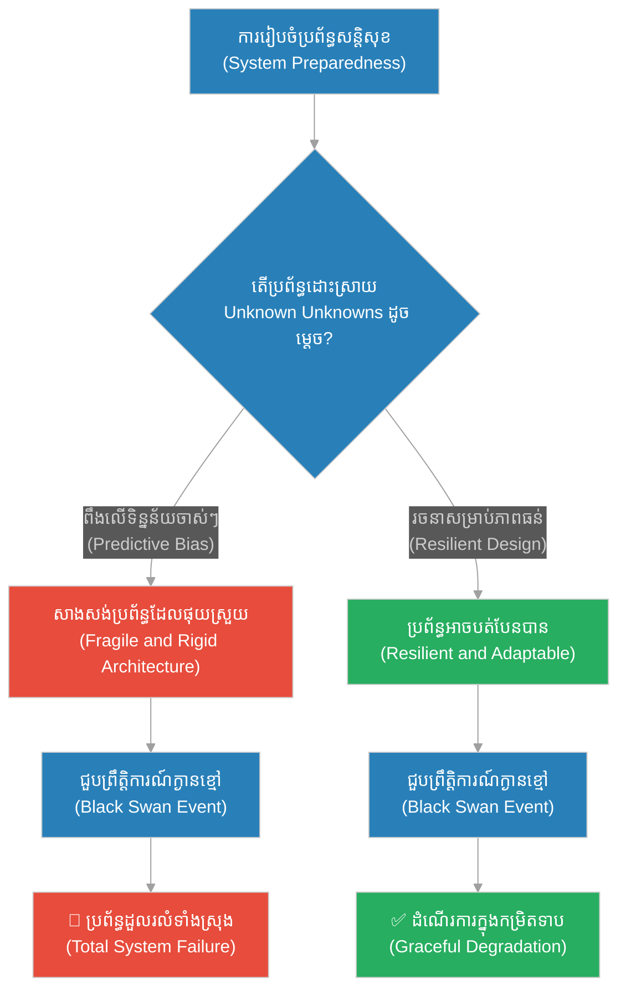
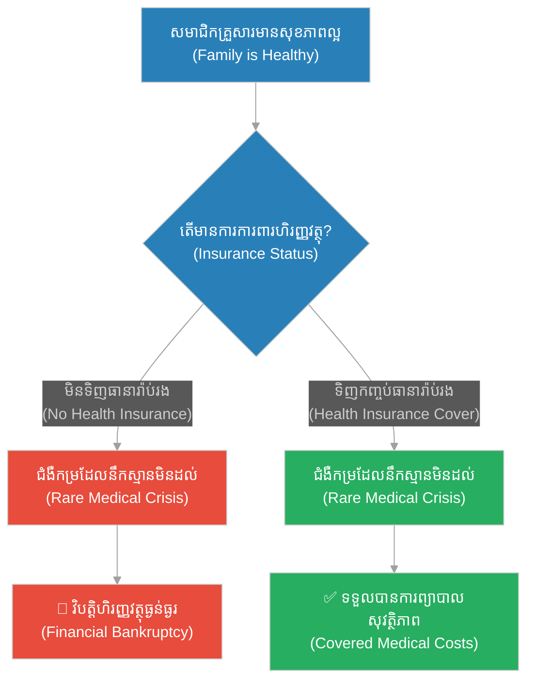
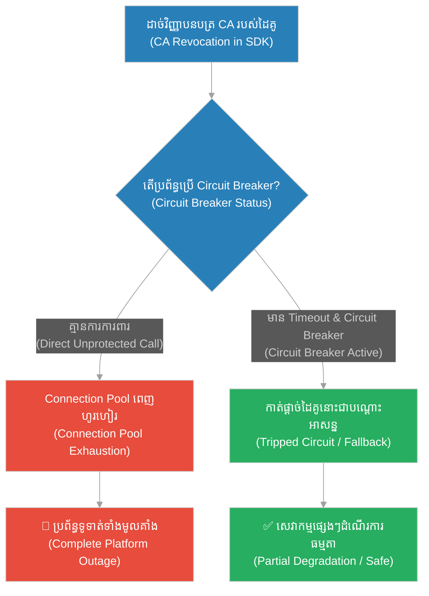
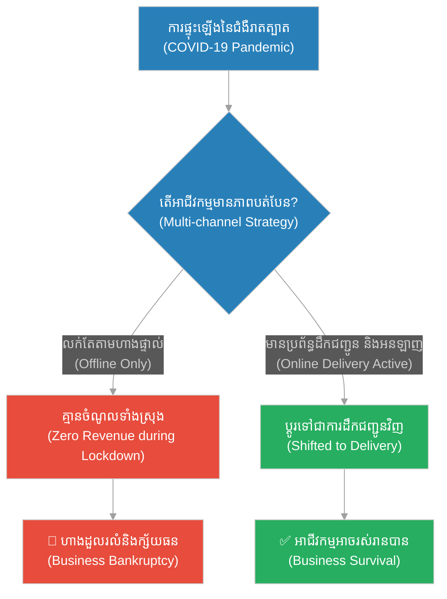
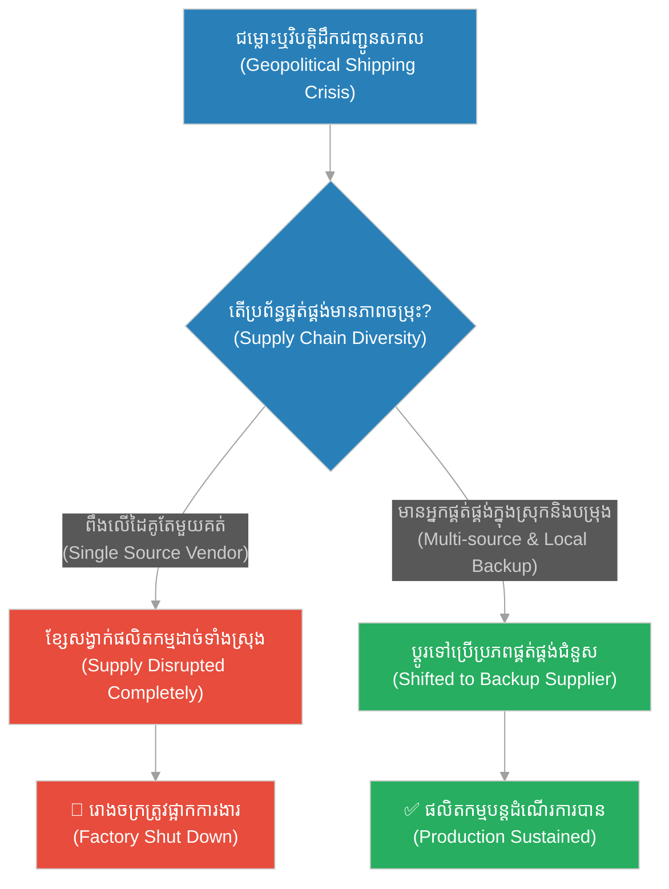
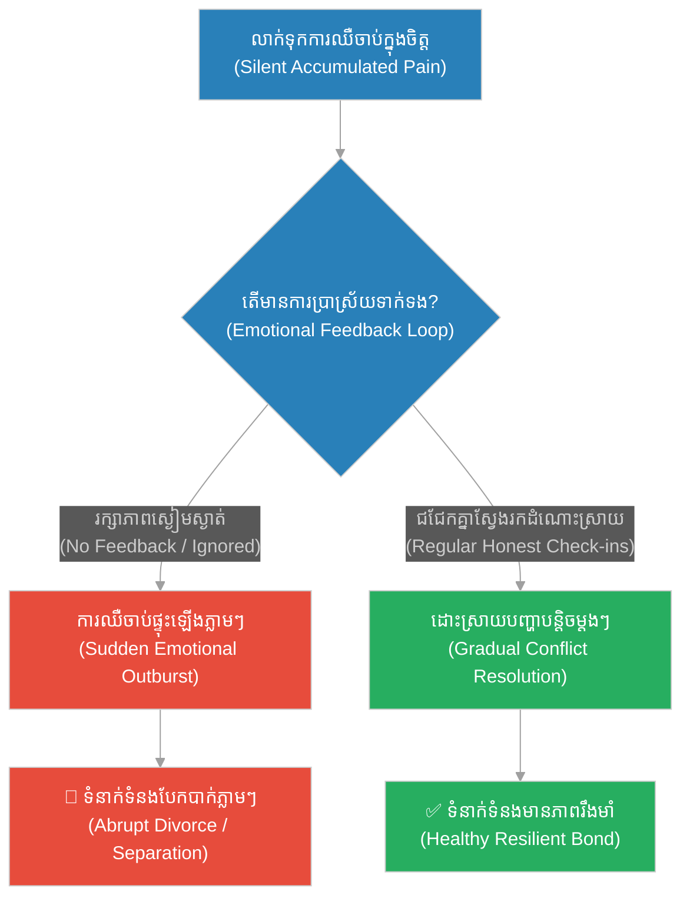
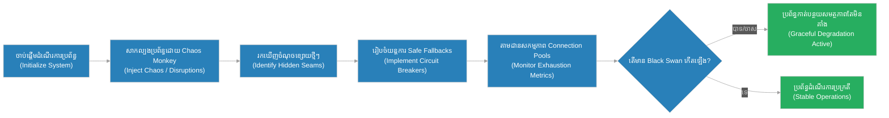

# Unknown Unknowns & Tail Risk (សត្វក្ងានខ្មៅដែលគ្មាននរណាស្មានដល់)៖ ព្រឹត្តិការណ៍ចៃដន្យដែលមិនអាចទាយទុកជាមុន និងការខូចប្រព័ន្ធ (Unknown Unknowns & Tail Risk & Extreme Events and High Impact System Failure & The Black Swan)

**Author:** ichamrong  
**Date:** 2026-05-28  
**Tags:** #black-swan #unknown-unknowns #tail-risk #system-design #software-reliability #risk-management  
**Category:** Concepts  
**Read Time:** ~15 min  

---

## 📌 មាតិកា (Table of Contents)
- [អន្ទាក់ផ្លូវចិត្ត (The Trap)](#0)
- [១. រឿងព្រេងនិទាន៖ រឿងព្រេងនិទាន៖ សត្វក្ងានខ្មៅដែលគ្មាននរណាស្មានដល់ (The Legend of The Black Swan)](#1)
  - [ការរកឃើញដែលធ្វើឱ្យរង្គោះរង្គើដល់ទស្សនវិជ្ជាអឺរ៉ុប (The Shock of Willem de Vlamingh's Discovery)](#1-1)
- [២. បញ្ហា៖ ៖ Unknown Unknowns & Tail Risk (The Issue: Unknown Unknowns & Tail Risk)](#2)
- [៣. ឧទាហរណ៍ជាក់ស្តែងក្នុងពិភពពិត (Real World Examples)](#3)
  - [ឧទាហរណ៍ទី ១ — កម្រិតស្រាល (គ្រួសារ)៖ គ្រោះអាសន្នសុខភាពដោយគ្មានការរៀបចំ (The Family Medical Crisis)](#3-1)
  - [ឧទាហរណ៍ទី ២ — កម្រិតមធ្យម (បច្ចេកទេស)៖ ការដួលរលំដោយសារ Intermediate Certificate Revocation (The Dev CA Failure)](#3-2)
  - [ឧទាហរណ៍ទី ៣ — កម្រិតមធ្យម (ធុរកិច្ច)៖ វិបត្តិកូវីដ-១៩ បិទប្រទេស (The Business Pandemic Lockdown)](#3-3)
  - [ឧទាហរណ៍ទី ៤ — កម្រិតមធ្យម (សង្គម/គ្រប់គ្រង)៖ វិបត្តិខ្សែសង្វាក់ផ្គត់ផ្គង់សកល (The Management Supply Chain Disruption)](#3-4)
  - [ឧទាហរណ៍ទី ៥ — កម្រិតធ្ងន់ (ទំនាក់ទំនង)៖ ការបែកបាក់ដោយសារតែការលាក់បាំងការឈឺចាប់ (The Relationship Emotional Earthquake)](#3-5)
- [៤. ដំណោះស្រាយទូទៅ៖ Chaos Engineering & Resilient Architectures (The General Solution: Chaos Engineering & Resilient Architectures)](#4)
- [សេចក្តីសន្និដ្ឋាន (Conclusion)](#5)
- [ឯកសារយោង (References)](#6)
- [Related Posts](#7)

---

<a id="0"></a>
## អន្ទាក់ផ្លូវចិត្ត (The Trap)

តើអ្នកធ្លាប់គិតទេថា «ដោយសារតែរឿងអាក្រក់មួយមិនដែលកើតឡើងក្នុងរយៈពេល ១០ ឆ្នាំកន្លងមក វានឹងមិនកើតឡើងនៅថ្ងៃស្អែកនោះឡើយ»? នេះគឺជាអន្ទាក់នៃការជឿជាក់លើស្ថិតិអតីតកាលដោយខ្វះការប្រុងប្រយ័ត្ន និងការយល់ច្រឡំរវាង «អវត្តមាននៃភស្តុតាងបង្ហាញពីគ្រោះថ្នាក់» ទៅជា «ភស្តុតាងបង្ហាញពីសុវត្ថិភាព»។ នៅក្នុងពិភពប្រព័ន្ធស្មុគស្មាញ ព្រឹត្តិការណ៍ដែលយើងមិនធ្លាប់ស្គាល់ និងមិនធ្លាប់ដឹងថាមាន (Unknown Unknowns) គឺជាប្រភពនៃមហន្តរាយដ៏ធំបំផុត។

* **ការយល់ច្រឡំលើប្រវត្តិសាស្ត្រ (Historical Illusions)** — ការគិតថាទិន្នន័យអតីតកាលដែលគ្មានបញ្ហា គឺជាការធានាថាប្រព័ន្ធនឹងមានសុវត្ថិភាពជារៀងរហូត។
* **ភាពផុយស្រួយចំពោះហានិភ័យកន្ទុយ (Fragility to Tail Risks)** — ការរចនាប្រព័ន្ធឱ្យទប់ទល់តែនឹងបញ្ហាដែលធ្លាប់ស្គាល់ (Known Unknowns) តែបន្សល់ទុកភាពទន់ខ្សោយចំពោះព្រឹត្តិការណ៍កម្រដែលមានឥទ្ធិពលបំផ្លិចបំផ្លាញខ្ពស់។



នៅក្នុងអត្ថបទនេះ យើងនឹងសិក្សាអំពី៖
1. **រឿងព្រេងនិទាន (The Legend)** — រឿងរ៉ាវនៃការរកឃើញសត្វក្ងានខ្មៅដែលបំផ្លាញចោលជំនឿរាប់រយឆ្នាំរបស់មនុស្សជាតិ។
2. **បញ្ហា (The Issue)** — និយមន័យបច្ចេកទេសនៃ Unknown Unknowns និងការវិភាគហានិភ័យ Tail Risk នៅក្នុងប្រព័ន្ធបច្ចេកវិទ្យា។
3. **ឧទាហរណ៍ជាក់ស្តែង (Real World Examples)** — ករណីសិក្សា ៥ កម្រិតនៃការជួបប្រទះព្រឹត្តិការណ៍ក្ងានខ្មៅ និងរបៀបដោះស្រាយ។
4. **ដំណោះស្រាយទូទៅ (The General Solution)** — ការប្រើប្រាស់ Chaos Engineering និងយុទ្ធសាស្ត្ររចនាប្រព័ន្ធដែលមានភាពធន់ (Resilience)។

---

<a id="1"></a>
## ១. រឿងព្រេងនិទាន៖ សត្វក្ងានខ្មៅដែលគ្មាននរណាស្មានដល់ (The Legend of The Black Swan)

អស់រយៈពេលជាងបីរយឆ្នាំមកហើយ នៅក្នុងចំណោមអ្នកវិទ្យាសាស្ត្រធម្មជាតិ និងទស្សនវិទូជនជាតិអឺរ៉ុប គ្មាននរណាម្នាក់ដែលមិនធ្លាប់ឃើញក្ងាននោះឡើយ។ រាល់ក្ងានទាំងអស់ដែលពួកគេបានកត់ត្រាក្នុងសៀវភៅ និងទិនានុប្បវត្តិសុទ្ធសឹងតែជា «ពណ៌ស»។ ការសង្កេតរាប់លានដង និងភស្តុតាងជាច្រើនជំនាន់បានបង្កើតជាសច្ចធម៌ (Axiom) មួយយ៉ាងរឹងមាំថា៖ **«ក្ងានទាំងអស់នៅលើពិភពលោកគឺមានពណ៌ស»**។ គ្មាននរណាម្នាក់មានមន្ទិលសង្ស័យឡើយ ហើយជំនឿនេះត្រូវបានប្រើប្រាស់ជាឧទាហរណ៍គំរូនៃការវែកញែកដោយការសង្កេតបែបវិទ្យាសាស្ត្រ។

រហូតមកដល់ឆ្នាំ ១៦៩៧ អ្វីៗគ្រប់យ៉ាងត្រូវបានផ្លាស់ប្តូរទាំងស្រុង។ អ្នករុករកជនជាតិហូឡង់ម្នាក់ឈ្មោះ Willem de Vlamingh បានដឹកនាំកប៉ាល់ធ្វើដំណើរទៅកាន់ទឹកដីថ្មីមួយ ដែលបច្ចុប្បន្នជាប្រទេសអូស្ត្រាលីភាគខាងលិច។ ពេលធ្វើដំណើរតាមទន្លេមួយ គាត់និងក្រុមនាវិកបានឃើញសត្វក្ងានរាប់រយក្បាលហែលទឹកលេង ប៉ុន្តែពួកវាមានពណ៌ខ្មៅរលើប។

ការសង្កេតត្រឹមតែមួយរសៀលនោះ បានបំផ្លាញចោលនូវភាពប្រាកដប្រជាដែលមនុស្សជាតិបានសាងឡើងអស់រយៈពេលបីរយឆ្នាំ។ ព្រឹត្តិការណ៍នេះបង្ហាញថា ការសង្កេតឃើញក្ងានពណ៌សរាប់លានក្បាលមិនអាចបង្ហាញថាមិនមានក្ងានពណ៌ខ្មៅនោះឡើយ ប៉ុន្តែការឃើញក្ងានខ្មៅត្រឹមតែមួយក្បាលគឺគ្រប់គ្រាន់នឹងបំផ្លាញការសន្និដ្ឋានអតីតកាលទាំងអស់។

<a id="1-1"></a>
### ការរកឃើញដែលធ្វើឱ្យរង្គោះរង្គើដល់ទស្សនវិជ្ជាអឺរ៉ុប (The Shock of Willem de Vlamingh's Discovery)

ព្រឹត្តិការណ៍នេះត្រូវបានទស្សនវិទូ Nassim Nicholas Taleb យកមកធ្វើជាតំណាងឱ្យទ្រឹស្តី «Black Swan Event»។ វាតំណាងឱ្យព្រឹត្តិការណ៍ទាំងឡាយណាដែលមានលក្ខណៈបីយ៉ាង៖
1. **វាជាករណីពិសេស (Outlier)** — វាស្ថិតនៅក្រៅការរំពឹងទុកធម្មតា ព្រោះគ្មានភស្តុតាងអតីតកាលណាមួយបង្ហាញពីលទ្ធភាពរបស់វាឡើយ។
2. **វាមានផលប៉ះពាល់ធ្ងន់ធ្ងរ (Extreme Impact)** — នៅពេលវាកើតឡើង វានាំមកនូវការផ្លាស់ប្តូរ ឬការបំផ្លិចបំផ្លាញដ៏មហាសាល។
3. **វាត្រូវបានពន្យល់ក្រោយពេលកើតឡើង (Retrospective Predictability)** — មនុស្សចូលចិត្តបង្កើតហេតុផលដើម្បីពន្យល់ថាវាងាយស្រួលយល់ និងអាចទាយទុកជាមុនបាន បន្ទាប់ពីវាកើតឡើងរួច។

---

<a id="2"></a>
## ២. បញ្ហា៖ Unknown Unknowns & Tail Risk (The Issue: Unknown Unknowns & Tail Risk)

នៅក្នុងវិស្វកម្មប្រព័ន្ធបច្ចេកវិទ្យា និងការគ្រប់គ្រងហានិភ័យ យើងបែងចែកចំណេះដឹងជាបួនកម្រិត៖
* **Known Knowns (អ្វីដែលយើងដឹងថាដឹង):** ប្រព័ន្ធរបស់យើងត្រូវដំណើរការលើ RAM 8GB (យើងដឹងច្បាស់ និងគ្រប់គ្រងបាន)។
* **Known Unknowns (អ្វីដែលយើងដឹងថាមិនដឹង):** យើងដឹងថាប្រព័ន្ធអាចរងការវាយប្រហារ DDoS តែយើងមិនដឹងថាវានឹងកើតឡើងនៅពេលណា (យើងដឹងពីអត្ថិភាពរបស់វា ហើយអាចរៀបចំផែនការការពារទុកមុន)។
* **Unknown Knowns (អ្វីដែលយើងមិនដឹងថាដឹង):** ចំណេះដឹង ឬទិន្នន័យដែលមាននៅក្នុងស្ថាប័នរួចហើយ តែមិនត្រូវបានយកមកប្រើប្រាស់ ឬវិភាគ។
* **Unknown Unknowns (អ្វីដែលយើងមិនដឹងថាយើងមិនដឹង):** ហានិភ័យដែលស្ថិតនៅក្រៅការគិត ឬការស្រមើស្រមៃរបស់យើងទាំងស្រុង។ នេះហើយជាកន្លែងដែល «ក្ងានខ្មៅ» លាក់ខ្លួន។

ហានិភ័យកន្ទុយ **(Tail Risk)** គឺជាព្រឹត្តិការណ៍ដែលមានប្រូបាប៊ីលីតេទាបបំផុតក្នុងការកើតឡើង (ស្ថិតនៅចុងកន្ទុយនៃ Bell Curve ស្ថិតិ) ប៉ុន្តែបើវាកើតឡើង ផលប៉ះពាល់របស់វាគឺមហន្តរាយ។

### ប្រៀបធៀបការអនុវត្ត (Fragile vs. Resilient Practices)

* **ការអនុវត្តដែលផុយស្រួយ (Fragile Practice):** ការរចនាប្រព័ន្ធការពារដោយផ្អែកលើតែប្រវត្តិនៃការធ្លាក់ចុះចាស់ៗ (Known Failure Modes)។ ឧទាហរណ៍៖ ការរៀបចំតែ Runbook សម្រាប់ករណី Database គាំង ឬ Cloud Network ដាច់ តែគ្មានយន្តការការពារ cascade failures ពេលមានការដាច់សេវាកម្មខាងក្រៅដែលមិនធ្លាប់ស្គាល់នោះឡើយ។
* **ការអនុវត្តដែលមានភាពធន់ (Resilient Practice):** ការសន្មតថាប្រព័ន្ធនឹងត្រូវបរាជ័យក្នុងវិធីណាមួយដែលយើងមិនធ្លាប់ជួបប្រទះ (Embrace Failure)។ ការប្រើប្រាស់ Circuit Breakers, Bulkheads និង Graceful Degradation ដើម្បីធានាថា បើទោះជាផ្នែកណាមួយគាំងដោយសារមូលហេតុចម្លែក ក៏វាមិនរំលំប្រព័ន្ធទាំងមូលដែរ។

ខាងក្រោមនេះជាគំរូកូដ Python បង្ហាញពីភាពខុសគ្នារវាងការហៅ API បែបផុយស្រួយ (ងាយរងគ្រោះដោយសារ Unknown Unknowns នៃសេវាកម្មក្រៅ) និងការរចនាបែបធន់ដោយប្រើ Circuit Breaker៖

```python
import time
import random

# សេវាកម្មខាងក្រៅដកស្រង់ចេញពី vendor ណាមួយដែលយើងមិនអាចគ្រប់គ្រងបាន
def external_vendor_api():
    # ករណីធម្មតា៖ ដំណើរការលឿន
    # ប៉ុន្តែថ្ងៃនេះ ស្រាប់តែមានបញ្ហាវិញ្ញាបនបត្រ CA ធ្វើឱ្យ API នេះព្យួរ (Hang) ដោយមិនត្រឡប់កំហុសអ្វីទាំងអស់
    # នេះជា Unknown Unknown ដែលមិនធ្លាប់ជួប ៣ ឆ្នាំមកហើយ
    time.sleep(10)  # ព្យួររយៈពេលយូរ
    return {"status": "SUCCESS"}

# === ១. វិធីសាស្ត្រផុយស្រួយ (Fragile Way) ===
# គ្មាន Timeout និងគ្មានយន្តការការពារ នៅពេល API ខាងក្រៅព្យួរ វានឹងស៊ី Connection Pool អស់ភ្លាម
def process_payment_fragile():
    print("[Fragile] Calling vendor API...")
    try:
        # ហៅ API ដោយគ្មាន Timeout
        response = external_vendor_api()
        return response
    except Exception as e:
        return {"status": "FAILED", "error": str(e)}

# === ២. វិធីសាស្ត្ររឹងមាំ (Resilient Way: Circuit Breaker & Timeout) ===
class CircuitBreaker:
    def __init__(self, failure_threshold=3, recovery_time=5):
        self.failure_threshold = failure_threshold
        self.recovery_time = recovery_time
        self.failure_count = 0
        self.state = "CLOSED"  # CLOSED, OPEN, HALF-OPEN
        self.last_state_change = time.time()

    def call(self, func, *args, **kwargs):
        current_time = time.time()
        
        # ប្រសិនបើ Circuit កំពុងបើក (OPEN) ហើយដល់ពេលសាកល្បងឡើងវិញ (HALF-OPEN)
        if self.state == "OPEN":
            if current_time - self.last_state_change > self.recovery_time:
                print("[CircuitBreaker] Testing connection... state: HALF-OPEN")
                self.state = "HALF-OPEN"
            else:
                # បដិសេធសំណើភ្លាមៗដើម្បីការពារប្រព័ន្ធ (Fast Fail)
                print("[CircuitBreaker] Circuit is OPEN. Fast failing request...")
                return {"status": "FALLBACK", "message": "System temporarily degraded"}

        try:
            # កំណត់ Timeout ជានិច្ច ដើម្បីកុំឱ្យប្រព័ន្ធព្យួររង់ចាំរហូត (Timeout and Defensive Guard)
            import multiprocessing
            # ក្លែងធ្វើ Timeout ៣ វិនាទី
            print(f"[CircuitBreaker] Calling service with timeout... state: {self.state}")
            
            # សម្រាប់ជាឧទាហរណ៍ យើងសន្មតថាការហៅនេះលើសពី ៣ វិនាទីជាការបរាជ័យ
            start_time = time.time()
            res = func(*args, **kwargs)
            duration = time.time() - start_time
            
            if duration > 3.0:
                raise TimeoutError("Request timed out!")
                
            self.failure_count = 0
            self.state = "CLOSED"
            return res
        except Exception as e:
            self.failure_count += 1
            print(f"[CircuitBreaker] Call failed! Fail count: {self.failure_count}, Error: {str(e)}")
            if self.failure_count >= self.failure_threshold:
                self.state = "OPEN"
                self.last_state_change = time.time()
                print("[CircuitBreaker] High failure rate detected. Tripping circuit to OPEN!")
            return {"status": "FALLBACK", "message": "Service unavailable (Timeout/Error)"}

# ករណីសាកល្បង (Simulation)
breaker = CircuitBreaker()

print("--- Testing Resilient Approach ---")
# ហៅលើកទី ១៖ នឹងស្ទះ Timeout ហើយកើន Fail count
breaker.call(external_vendor_api)
# ហៅលើកទី ២៖ កើន Fail count ទៀត
breaker.call(external_vendor_api)
# ហៅលើកទី ៣៖ កើន Fail count ដល់ ៣ ធ្វើឱ្យ Circuit បើក (OPEN)
breaker.call(external_vendor_api)

# ហៅលើកទី ៤៖ Circuit OPEN រួចហើយ វានឹងធ្វើ Fast Fail ភ្លាមដោយមិនបាច់រង់ចាំ ១០ វិនាទីទៀតទេ
print("\n--- Next Call (Circuit Open) ---")
start = time.time()
result = breaker.call(external_vendor_api)
print(f"Result: {result}, Taken: {time.time() - start:.2f} seconds")
```

---

<a id="3"></a>
## ៣. ឧទាហរណ៍ជាក់ស្តែងក្នុងពិភពពិត (Real World Examples)

<a id="3-1"></a>
### ឧទាហរណ៍ទី ១ — កម្រិតស្រាល (គ្រួសារ)៖ គ្រោះអាសន្នសុខភាពដោយគ្មានការរៀបចំ (The Family Medical Crisis)

គ្រួសារមួយមានសមាជិកសុទ្ធតែមានសុខភាពល្អ និងរឹងមាំ។ ពួកគេជឿជាក់ថាពួកគេមិនត្រូវការទិញធានារ៉ាប់រងសុខភាពឡើយ ព្រោះកន្លងមកមិនដែលចូលពេទ្យម្តងណាឡើយ។ ស្រាប់តែថ្ងៃមួយ សមាជិកម្នាក់ត្រូវបានរកឃើញថាមានជំងឺកម្រមួយប្រភេទ (Black Swan) ដែលត្រូវការការព្យាបាលបន្ទាន់ និងមានតម្លៃខ្ពស់បំផុត ធ្វើឱ្យគ្រួសារធ្លាក់ខ្លួនក្ស័យធន។



<a id="3-2"></a>
### ឧទាហរណ៍ទី ២ — កម្រិតមធ្យម (បច្ចេកទេស)៖ ការដួលរលំដោយសារ Intermediate Certificate Revocation (The Dev CA Failure)

ប្រព័ន្ធទូទាត់ប្រាក់ដំណើរការយ៉ាងរលូនអស់រយៈពេល ៦ ឆ្នាំ ស្រាប់តែមានការដួលរលំដោយសារតែស្ថាប័នចេញវិញ្ញាបនបត្រ (Certificate Authority) មួយដែលមិនសូវល្បី បានដកហូតវិញ្ញាបនបត្រជាបន្ទាន់នៅក្នុង SDK របស់ដៃគូសេវាកម្មក្រៅ។ កូដដែលគ្មាន Timeout ត្រឹមត្រូវ ធ្វើឱ្យរលកនៃការតភ្ជាប់ស្ទះពេញប្រព័ន្ធ API។



<a id="3-3"></a>
### ឧទាហរណ៍ទី ៣ — កម្រិតមធ្យម (ធុរកិច្ច)៖ វិបត្តិកូវីដ-១៩ បិទប្រទេស (The Business Pandemic Lockdown)

ហាងលក់ទំនិញ ឬភោជនីយដ្ឋានជាច្រើនដែលពឹងផ្អែកតែលើអតិថិជនមកទិញផ្ទាល់ (Dine-in Only) ស្រាប់តែត្រូវបិទទ្វារទាំងស្រុងដោយសារតែការផ្ទុះឡើងនៃជំងឺរាតត្បាតកូវីដ-១៩។ អាជីវកម្មដែលមិនបានរៀបចំប្រព័ន្ធលក់អនឡាញ ឬសេវាដឹកជញ្ជូន ត្រូវប្រកាសក្ស័យធនក្នុងរយៈពេលតែប៉ុន្មានខែប៉ុណ្ណោះ។



<a id="3-4"></a>
### ឧទាហរណ៍ទី ៤ — កម្រិតមធ្យម (សង្គម/គ្រប់គ្រង)៖ វិបត្តិខ្សែសង្វាក់ផ្គត់ផ្គង់សកល (The Management Supply Chain Disruption)

រោងចក្រផលិតរថយន្តមួយពឹងផ្អែកលើការផ្គត់ផ្គង់បន្ទះឈីបពីអ្នកផលិតតែមួយគត់នៅក្រៅប្រទេស ដើម្បីសន្សំសំចៃថ្លៃដើម (Just-In-Time Efficiency)។ នៅពេលមានវិបត្តិដឹកជញ្ជូនសកល ឬជម្លោះភូមិសាស្ត្រនយោបាយដែលកម្រកើតឡើង រោងចក្រត្រូវគាំងផលិតកម្មទាំងស្រុងជាច្រើនខែ ព្រោះរកអ្នកផ្គត់ផ្គង់ថ្មីមិនទាន់។



<a id="3-5"></a>
### ឧទាហរណ៍ទី ៥ — កម្រិតធ្ងន់ (ទំនាក់ទំនង)៖ ការបែកបាក់ដោយសារតែការលាក់បាំងការឈឺចាប់ (The Relationship Emotional Earthquake)

គូស្នេហ៍មួយគូហាក់ដូចជាគ្មានជម្លោះអ្វីសោះអស់រយៈពេល ២០ ឆ្នាំ។ ដៃគូម្នាក់តែងតែសម្របតាមគ្រប់យ៉ាង និងលាក់ទុកនូវការមិនពេញចិត្តនៅក្នុងចិត្តដោយមិនដែលនិយាយចេញមក (Silent Resentment)។ ស្រាប់តែថ្ងៃមួយ ដៃគូនោះបានសុំលែងលះ និងចាកចេញភ្លាមៗដោយគ្មានការចរចា បង្កើតជាភាពរង្គោះរង្គើដែលគ្មាននរណាស្មានដល់។



---

<a id="4"></a>
## ៤. ដំណោះស្រាយទូទៅ៖ Chaos Engineering & Resilient Architectures (The General Solution: Chaos Engineering & Resilient Architectures)

ដើម្បីរៀបចំខ្លួនប្រឈមមុខនឹង « Unknown Unknowns» និងកាត់បន្ថយគ្រោះមហន្តរាយដែលកើតឡើងពី «ក្ងានខ្មៅ» យើងត្រូវកសាងប្រព័ន្ធដែលមានភាពធន់ (Antifragility and Resilience)។

### យុទ្ធសាស្ត្រគន្លឹះចំនួន ៤ ក្នុងការអនុវត្ត៖
1. **Chaos Engineering (ការបង្កើតភាពវឹកវរជាប្រព័ន្ធ):** ការប្រើប្រាស់កម្មវិធីដូចជា Chaos Monkey ដើម្បីចូលទៅបិទ ឬបំផ្លាញប្រព័ន្ធ Server បន្តិចម្តងៗដោយចៃដន្យនៅក្នុង Production ក្នុងគោលបំណងស្វែងរកចំណុចខ្សោយដែលយើងមិនធ្លាប់ដឹងថានឹងកើតមាន។
2. **Bulkhead Pattern (ការបែងចែកបន្ទប់ការពារ):** ការបែងចែកសេវាកម្មកុំព្យូទ័រជាផ្នែកៗដាច់ដោយឡែកពីគ្នា។ ប្រសិនបើសេវាកម្មស្វែងរកផលិតផលគាំង វាមិនត្រូវប៉ះពាល់ដល់សេវាកម្មទូទាត់ប្រាក់ឡើយ។
3. **Graceful Degradation (ការបន្ទាបខ្លួនដោយសុវត្ថិភាព):** ធានាថាប្រព័ន្ធនៅតែបន្តដំណើរការបាន ទោះបីជាស្ថិតក្នុងស្ថានភាពមិនប្រក្រតីក៏ដោយ។ ឧទាហរណ៍៖ ប្រសិនបើប្រព័ន្ធណែនាំផលិតផលមិនដំណើរការ ប្រព័ន្ធត្រូវបង្ហាញទំនិញទូទៅជំនួសឱ្យការត្រឡប់កំហុស error 500 ទៅអតិថិជន។
4. **Defensive Timeout & Circuit Breaker (ការកំណត់ពេលវេលានិងស្វ័យបង្ការ):** ការកំណត់ Timeout ជានិច្ចសម្រាប់ការហៅសេវាកម្មខាងក្រៅ និងការប្រើប្រាស់ Circuit Breakers ដើម្បីកាត់ផ្តាច់ទំនាក់ទំនងភ្លាមៗនៅពេលដៃគូមានបញ្ហា។



---

## 🐇 ធ្លាក់ចូលក្នុងរន្ធទន្សាយ (Enter the Rabbit Hole)
ដើម្បីស្វែងយល់បន្ថែមអំពីច្បាប់ខនវ៉េ និងការបំបែកស្ថាបត្យកម្មម៉ូណូលីត សូមបន្តដំណើរទៅកាន់៖

* 🚀 **[ចាប់ផ្តើមដំណើររុករក (Start the Journey) ➔ Microservices Conway's Law & Monolith Decomposition (អាណាចក្ររ៉ូម និងម៉ូណូលីតដែលរីកធំពេក)៖ ច្បាប់ខនវ៉េ និងការបំបែកស្ថាបត្យកម្មម៉ូណូលីត](./242-the-roman-empire.md)**

---

<a id="5"></a>
## សេចក្តីសន្និដ្ឋាន (Conclusion)

> **«ការយល់ឃើញរបស់យើងអំពីហានិភ័យ ជារឿយៗត្រូវបានកំណត់ដោយអ្វីដែលយើងធ្លាប់ជួបប្រទះ មិនមែនដោយអ្វីដែលអាចកើតឡើងនោះទេ។»**

ជាសន្និដ្ឋាន អវត្តមាននៃព្រឹត្តិការណ៍មហន្តរាយនៅក្នុងប្រវត្តិនៃប្រព័ន្ធរបស់អ្នក មិនមែនជាភស្តុតាងដែលបញ្ជាក់ថាវានឹងមិនកើតមានឡើយ។ ផ្ទុយទៅវិញ វាគ្រាន់តែជាការបង្ហាញថាអ្នកមិនទាន់បានជួបប្រទះវាប៉ុណ្ណោះ។ ជំនួសឱ្យការចំណាយធនធានដើម្បីទស្សន៍ទាយព្រឹត្តិការណ៍ដែលមិនអាចទាយទុកជាមុនបាន ចូររចនាប្រព័ន្ធដែលអាចបត់បែន និងស្រូបយកសម្ពាធនៅពេលហានិភ័យនោះមកដល់។ នៅពេលដែល «ក្ងានខ្មៅ» បង្ហាញខ្លួន សំណួរមិនមែនសួរថា «ហេតុអ្វីបានជា Runbook គ្មានចម្លើយ?» នោះទេ ប៉ុន្តែវាសួរថា «តើប្រព័ន្ធរបស់អ្នកអាចទ្រាំទ្របានយូរប៉ុណ្ណា ដើម្បីទុកពេលឱ្យមនុស្សរកដំណោះស្រាយ?»។

---

<a id="6"></a>
## ឯកសារយោង (References)

* **Taleb, Nassim Nicholas** (2007). *The Black Swan: The Impact of the Highly Improbable*. Random House. សៀវភៅគ្រឹះដែលពន្យល់ពីទ្រឹស្តីក្ងានខ្មៅ និងឥទ្ធិពលនៃព្រឹត្តិការណ៍កម្រក្នុងសេដ្ឋកិច្ច និងសង្គម។
* **Rumsfeld, Donald** (2002). *Known and Unknowns press briefing*. សុន្ទរកថាប្រវត្តិសាស្ត្រដែលបំបែកប្រភេទចំណេះដឹង និងហានិភ័យនៅក្នុងវិស័យការពារជាតិ។
* **Netflix Technology Blog** (2011). *Chaos Engineering and the System Safety*. ការបង្ហាញពីគំនិតផ្តួចផ្តើម Chaos Monkey ក្នុងការសាងសង់ប្រព័ន្ធ Cloud ធន់ខ្ពស់។

---

<a id="7"></a>
## Related Posts

* [[Microservices Conway's Law & Monolith Decomposition]](./242-the-roman-empire.md) — ការស្វែងយល់ពីច្បាប់ខនវ៉េ និងការបំបែកប្រព័ន្ធស្មុគស្មាញខ្នាតយក្ស។
* [[Cryptographic Signature Verification & Immutable Ledgers]](./240-socrates-and-the-search-for-an-honest-man.md) — ការផ្ទៀងផ្ទាត់និងកសាងទំនុកចិត្តមិនអាចកែប្រែបាននៅក្នុងប្រព័ន្ធឌីជីថល។
