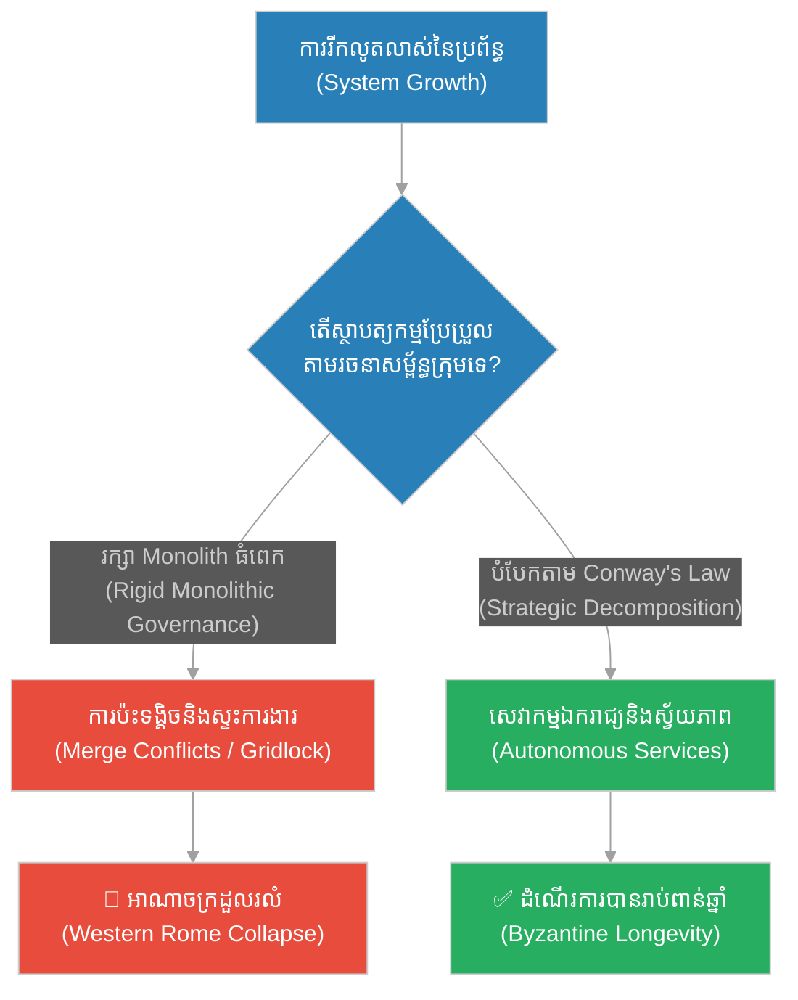
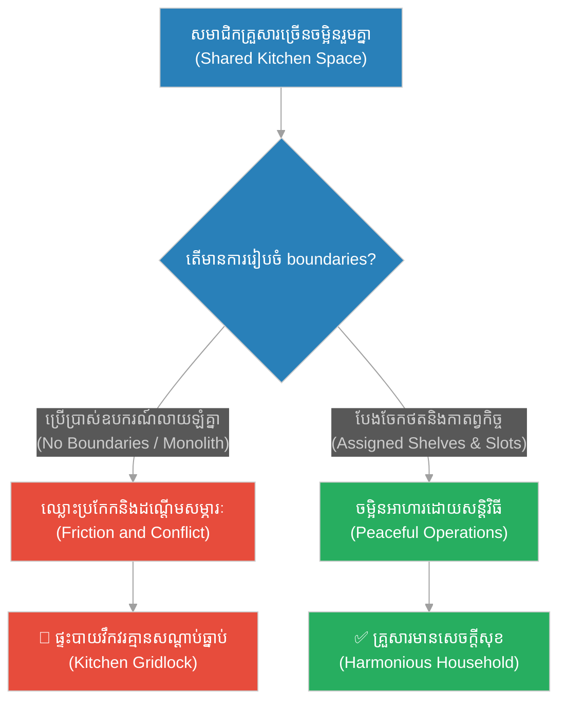
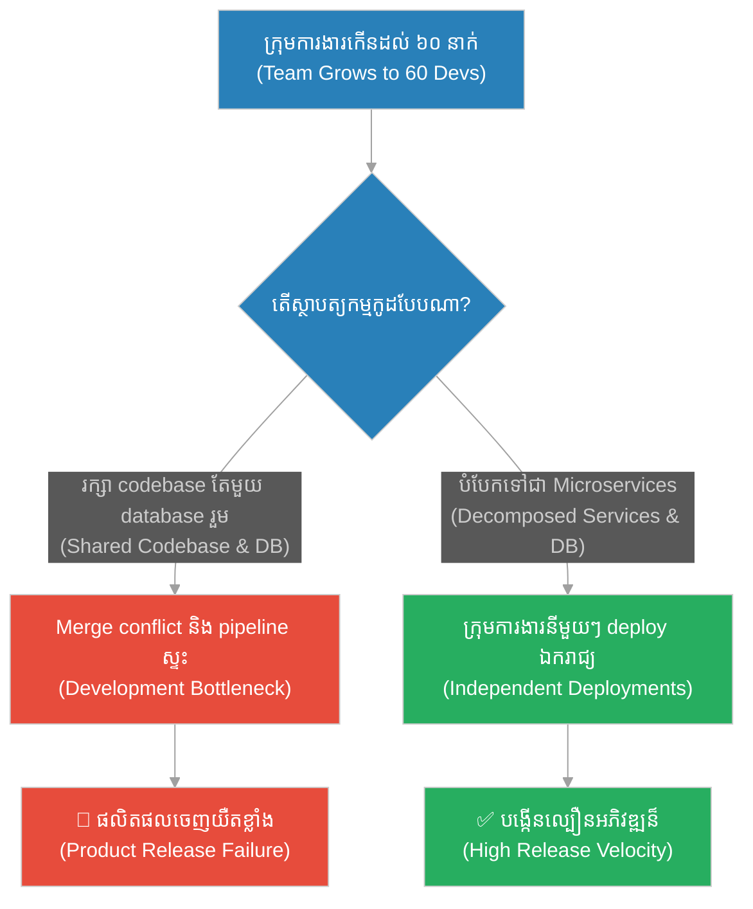
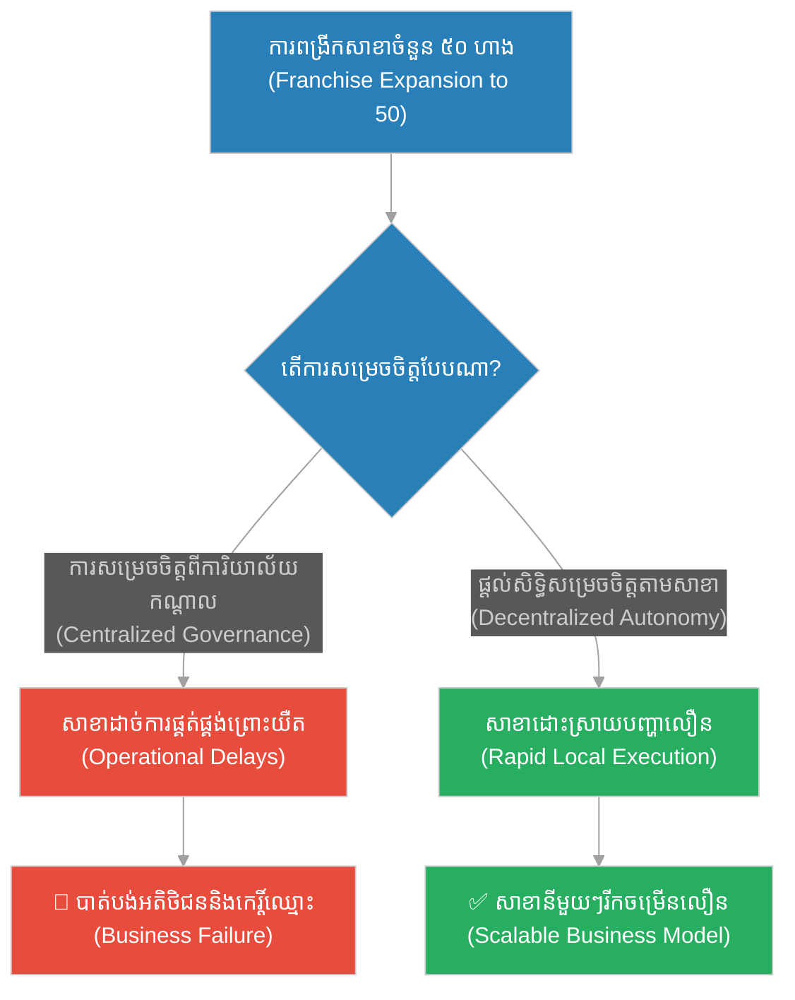
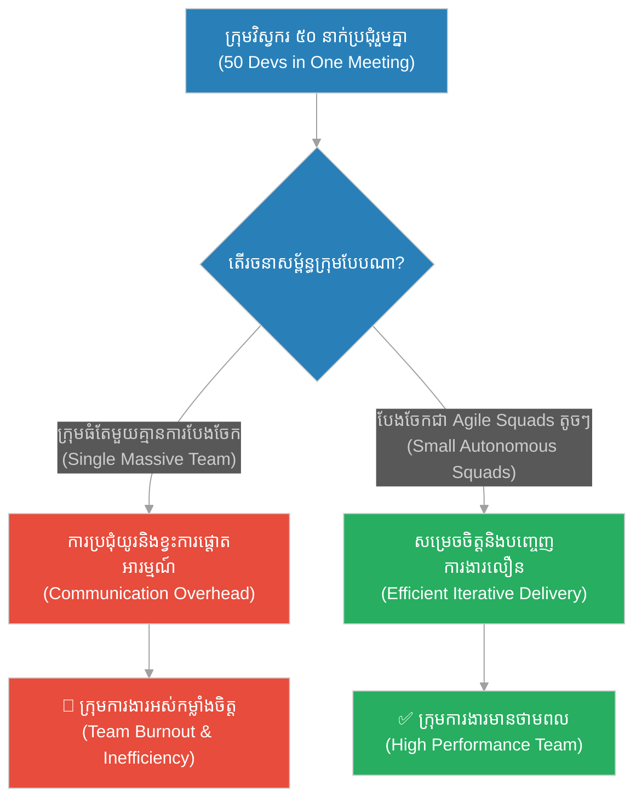
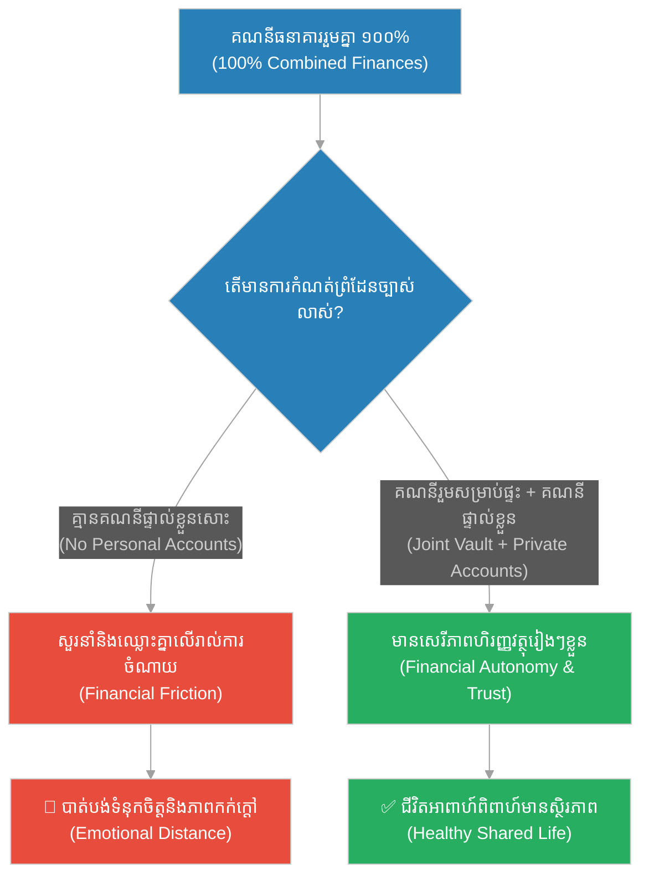

# Microservices Conway's Law & Monolith Decomposition (អាណាចក្ររ៉ូម និងម៉ូណូលីតដែលរីកធំពេក)៖ ច្បាប់ខនវ៉េ និងការបំបែកស្ថាបត្យកម្មម៉ូណូលីត (Microservices Conway's Law & Monolith Decomposition & Organizational Structure Alignment and Microservices Transition & The Roman Empire)

**Author:** ichamrong  
**Date:** 2026-05-28  
**Tags:** #conways-law #monolith-decomposition #microservices #system-architecture #organizational-scaling #roman-empire  
**Category:** Concepts  
**Read Time:** ~15 min  

---

## 📌 មាតិកា (Table of Contents)
- [អន្ទាក់ផ្លូវចិត្ត (The Trap)](#0)
- [១. រឿងព្រេងនិទាន៖ រឿងព្រេងនិទាន៖ អាណាចក្ររ៉ូម និងម៉ូណូលីតដែលរីកធំពេក (The Legend of The Roman Empire)](#1)
  - [ការបែងចែកអាណាចក្រ និងការកើតឡើងនៃប៊ីហ្សង់ទីន (The Split: West and East Rome)](#1-1)
- [២. បញ្ហា៖ ៖ Conway's Law & Monolith Decomposition (The Issue: Conway's Law & Monolith Decomposition)](#2)
- [៣. ឧទាហរណ៍ជាក់ស្តែងក្នុងពិភពពិត (Real World Examples)](#3)
  - [ឧទាហរណ៍ទី ១ — កម្រិតស្រាល (គ្រួសារ)៖ ការគ្រប់គ្រងផ្ទះបាយរួមគ្នា (The Family Kitchen Boundary)](#3-1)
  - [ឧទាហរណ៍ទី ២ — កម្រិតមធ្យម (បច្ចេកទេស)៖ ការបំបែក Rails Monolith ទៅជា Checkout និង Inventory (The Dev Microservices Migration)](#3-2)
  - [ឧទាហរណ៍ទី ៣ — កម្រិតមធ្យម (ធុរកិច្ច)៖ ការគ្រប់គ្រងហាងកាហ្វេដែលមានសាខាច្រើន (The Business Franchise Decomposition)](#3-3)
  - [ឧទាហរណ៍ទី ៤ — កម្រិតមធ្យម (សង្គម/គ្រប់គ្រង)៖ ការបង្កើត Agile Squads (The Management Conway's Law Alignment)](#3-4)
  - [ឧទាហរណ៍ទី ៥ — កម្រិតធ្ងន់ (ទំនាក់ទំនង)៖ ព្រំដែនហិរញ្ញវត្ថុក្នុងគ្រួសារ (The Relationship Co-dependency Seams)](#3-5)
- [៤. ដំណោះស្រាយទូទៅ៖ Domain-Driven Design & Conway's Law Mapping (The General Solution: Domain-Driven Design & Conway's Law Mapping)](#4)
- [សេចក្តីសន្និដ្ឋាន (Conclusion)](#5)
- [ឯកសារយោង (References)](#6)
- [Related Posts](#7)

---

<a id="0"></a>
## អន្ទាក់ផ្លូវចិត្ត (The Trap)

តើអ្នកធ្លាប់ជួបស្ថានភាពដែលក្រុមការងាររបស់អ្នករីកធំឡើង ប៉ុន្តែល្បឿននៃការបញ្ចេញផលិតផល (Velocity) បែរជាធ្លាក់ចុះទៅវិញដែរឬទេ? នេះគឺជាអន្ទាក់នៃការបង្កើនធនធានមនុស្សដោយមិនបានកែសម្រួលរចនាសម្ព័ន្ធប្រព័ន្ធ និងស្ថាបត្យកម្មកូដ (Monolithic Governance Trap)។ នៅពេលដែលមនុស្សគ្រប់គ្នាប៉ះពាល់លើកូដរួមគ្នាតែមួយ (Shared Codebase) និង database តែមួយ ការប៉ះទង្គិច និងភាពយឺតយ៉ាវនឹងកើតឡើងដោយជៀសមិនរួច។

* **ការជឿជាក់លើការគ្រប់គ្រងតែមួយ (Centralization Illusion)** — ការគិតថាការរក្សាទុកអ្វីៗគ្រប់យ៉ាងក្នុងកន្លែងតែមួយ នឹងជួយឱ្យងាយស្រួលគ្រប់គ្រង និងតាមដាន។
* **ការព្រងើយកន្តើយនឹងច្បាប់ខនវ៉េ (Ignoring Conway's Law)** — ការរចនាប្រព័ន្ធបច្ចេកវិទ្យាដែលផ្ទុយនឹងរចនាសម្ព័ន្ធទំនាក់ទំនងរបស់មនុស្ស នាំឱ្យកើតមានការកកស្ទះ និងការយល់ច្រឡំ។



នៅក្នុងអត្ថបទនេះ យើងនឹងសិក្សាអំពី៖
1. **រឿងព្រេងនិទាន (The Legend)** — អាណាចក្ររ៉ូម និងរបៀបដែលការរីកធំធាត់ហួសសមត្ថភាពគ្រប់គ្រងកណ្តាល នាំឱ្យមានការបែងចែកអាណាចក្រ។
2. **បញ្ហា (The Issue)** — ច្បាប់ខនវ៉េ (Conway's Law) និងផលវិបាកនៃការរីកធំធាត់នៃប្រព័ន្ធ Monolith ហួសដែនកំណត់រចនាសម្ព័ន្ធក្រុមការងារ។
3. **ឧទាហរណ៍ជាក់ស្តែង (Real World Examples)** — ករណីសិក្សា ៥ កម្រិត ចាប់ពីកម្រិតគ្រួសាររហូតដល់ការគ្រប់គ្រងស្ថាប័នធំៗ។
4. **ដំណោះស្រាយទូទៅ (The General Solution)** — ការប្រើប្រាស់ Domain-Driven Design (DDD) និងការស្វែងរក Seams សម្រាប់ការបំបែកប្រព័ន្ធ។

---

<a id="1"></a>
## ១. រឿងព្រេងនិទាន៖ អាណាចក្ររ៉ូម និងម៉ូណូលីតដែលរីកធំពេក (The Legend of The Roman Empire)

នៅចំណុចកំពូលនៃអំណាចរបស់ខ្លួន អាណាចក្ររ៉ូម (Roman Empire) បានគ្របដណ្តប់លើមនុស្សជាង ៧០ លាននាក់ លាតសន្ធឹងលើទ្វីបចំនួនបីគឺ អឺរ៉ុប អាស៊ី និងអាហ្វ្រិក។ រាល់ច្បាប់ គោលនយោបាយ និងការសម្រេចចិត្តសំខាន់ៗទាំងអស់ ត្រូវបានធ្វើឡើងដោយព្រឹទ្ធសភា (Senate) និងអធិរាជតែម្នាក់គត់ នៅក្នុងទីក្រុងរ៉ូម។

សម្រាប់រយៈពេលជាច្រើនសតវត្សរ៍ គំរូគ្រប់គ្រងចំណុចកណ្តាលតែមួយ (Monolith) នេះដំណើរការយ៉ាងមានប្រសិទ្ធភាព។ ផ្លូវថ្នល់ខ្វាត់ខ្វែងតភ្ជាប់គ្រប់ទិសទីមកកាន់ទីក្រុងរ៉ូម កងទ័ពរ៉ូម៉ាំងដ៏មានឥទ្ធិពលអាចបង្ក្រាបការបះបោរបានលឿន ហើយប្រព័ន្ធរូបិយប័ណ្ណតែមួយបានសម្រួលដល់ការធ្វើពាណិជ្ជកម្ម។

ប៉ុន្តែនៅពេលដែលអាណាចក្រកាន់តែរីកធំធាត់ខ្លាំង ដែនកំណត់នៃ «លំហូរព័ត៌មាន» ក៏បានមកដល់។ សំបុត្របញ្ជាពីអធិរាជនៅទីក្រុងរ៉ូម ត្រូវចំណាយពេលជាង ៦០ ថ្ងៃដើម្បីទៅដល់ខេត្តដាច់ស្រយាលនៅវាលខ្សាច់ស៊ីរី ឬអង់គ្លេស។ នៅពេលព័ត៌មានទៅដល់ ស្ថានភាពបានផ្លាស់ប្តូររួចទៅហើយ។ អភិបាលខេត្តក្នុងតំបន់ចាប់ផ្តើមធ្វើការសម្រេចចិត្តដោយខ្លួនឯងដោយមិនរង់ចាំបញ្ជា មេទ័ពតាមព្រំដែនកាន់តែមានអំណាចស្វ័យភាព និងលែងស្តាប់បង្គាប់ចំណុចកណ្តាល។ ទីក្រុងរ៉ូមបាត់បង់សហថាមពល (Coherence)។

រហូតមកដល់ឆ្នាំ ២៨៥ នៃគ្រិស្តសករាជ អធិរាជឌីអូក្លេធៀន (Diocletian) បានដឹងថា អាណាចក្រនេះធំពេកហួសពីសមត្ថភាពរបស់មនុស្សម្នាក់ ឬមជ្ឈមណ្ឌលតែមួយអាចគ្រប់គ្រងបាន។ គាត់បានសម្រេចចិត្តធ្វើការ «បំបែកស្ថាបត្យកម្ម» អាណាចក្ររ៉ូមជាពីរផ្នែករដ្ឋបាលដាច់ដោយឡែកពីគ្នា គឺអាណាចក្ររ៉ូមខាងលិច (Western Roman Empire) និងអាណាចក្ររ៉ូមខាងកើត (Eastern Roman Empire/Byzantium)។

<a id="1-1"></a>
### ការបែងចែកអាណាចក្រ និងការកើតឡើងនៃប៊ីហ្សង់ទីន (The Split: West and East Rome)

ទោះបីជាការបែងចែកនេះមិនអាចជួយសង្គ្រោះអាណាចក្ររ៉ូមខាងលិចពីការដួលរលំដោយសារការឈ្លានពាន និងវិបត្តិផ្ទៃក្នុងក៏ដោយ ប៉ុន្តែអាណាចក្ររ៉ូមខាងកើត (ប៊ីហ្សង់ទីន) ដែលមានទំហំតូចជាង មានភាពបត់បែន និងសមស្របនឹងបរិបទក្នុងតំបន់របស់ខ្លួន បានរស់រានមានជីវិត និងរីកចម្រើនអស់រយៈពេលជាង ១០០០ ឆ្នាំបន្ថែមទៀត។ នេះបង្ហាញថា អ្វីដែលមិនអាចគ្រប់គ្រងជាធ្លុងមួយ ត្រូវតែបែងចែកដើម្បីរស់។

---

<a id="2"></a>
## ២. បញ្ហា៖ Conway's Law & Monolith Decomposition (The Issue: Conway's Law & Monolith Decomposition)

នៅក្នុងឆ្នាំ ១៩៦៧ វិស្វករកុំព្យូទ័រ Melvin Conway បានបង្កើតច្បាប់មួយដែលសព្វថ្ងៃត្រូវបានគេស្គាល់ថា **ច្បាប់ខនវ៉េ (Conway's Law)**៖
> *"ស្ថាប័នទាំងឡាយណាដែលរចនាប្រព័ន្ធ (បច្ចេកវិទ្យា) នឹងត្រូវបានបង្ខំឱ្យបង្កើតប្រព័ន្ធដែលមានទម្រង់ចម្លងតាមរចនាសម្ព័ន្ធទំនាក់ទំនងរបស់ស្ថាប័ននោះ។"*

ប្រសិនបើក្រុមហ៊ុនមួយមានក្រុមការងារចំនួន ៤ នាក់កំពុងធ្វើការលើ Compiler នោះ Compiler នោះនឹងមាន ៤ ដំណាក់កាល (4-pass compiler) ជានិច្ច។

នៅក្នុងពិភពស្ថាបត្យកម្មកម្មវិធី នៅពេលដែលប្រព័ន្ធចាប់ផ្តើមដំបូង វាមានលក្ខណៈជា **Monolith** (កូដទាំងអស់នៅក្នុង codebase តែមួយ database រួមគ្នា)។ នេះជារឿងល្អព្រោះវាលឿន និងងាយស្រួល។ ប៉ុន្តែនៅពេលដែលស្ថាប័នរីកធំឡើងពីវិស្វករ ៥ នាក់ទៅ ៥០ នាក់ ក្រុមការងារត្រូវបែងចែកជាក្រុមតូចៗ (Teams)។ បើទោះជាក្រុមការងារត្រូវបានបែងចែករួចហើយ ប៉ុន្តែប្រសិនបើពួកគេនៅតែធ្វើការលើ Monolith Codebase តែមួយ ពួកគេនឹងជួបប្រទះ៖
* **Merge Conflicts ប្រចាំថ្ងៃ៖** កូដដែលសរសេរដោយក្រុម A ជាន់លើកូដរបស់ក្រុម B។
* **Deployment Blockers៖** ការបញ្ចេញមុខងារ Checkout ត្រូវរង់ចាំមុខងារ Recommendation ធ្វើតេស្តរួច ព្រោះវាស្ថិតនៅក្នុងបំពង់បង្ហូរ (Pipeline) តែមួយ។
* **Database Locking៖** ការកែប្រែ database schema របស់ផ្នែក Inventory ធ្វើឱ្យប៉ះពាល់ដល់ដំណើរការរបស់ផ្នែក User Accounts។

### ប្រៀបធៀបការអនុវត្ត (Fragile vs. Resilient Practices)

* **ការអនុវត្តដែលផុយស្រួយ (Fragile Practice):** ការព្យាយាមបំបែក Monolith ទៅជា Microservices ដោយគ្រាន់តែបំបែកកូដ (Code Extraction) ប៉ុន្តែនៅតែប្រើប្រាស់ Database រួមគ្នាតែមួយ (Shared Database) និងមិនបានបែងចែកសិទ្ធិគ្រប់គ្រងរបស់ក្រុមការងារឱ្យដាច់ស្រឡែកពីគ្នា។ នេះហៅថា Distributed Monolith (មានគុណវិបត្តិទាំង Microservices និង Monolith)។
* **ការអនុវត្តដែលមានភាពធន់ (Resilient Practice):** ការកំណត់ព្រំដែនច្បាស់លាស់ (Bounded Contexts) តាមរយៈ Domain-Driven Design និងការបែងចែកឱ្យក្រុមការងារនីមួយៗមានភាពស្វ័យភាពលើសេវាកម្ម (Microservice) និងទិន្នន័យ (Database per Service) របស់ខ្លួន។

ខាងក្រោមនេះជាគំរូកូដ TypeScript បង្ហាញពីភាពខុសគ្នារវាង Monolith ដែនកំណត់រឹង (Fragile) និងការបំបែកទៅជាប្រព័ន្ធដែលប្រើប្រាស់ Event-Driven Architecture (Resilient) ដើម្បីបំបែកការពឹងផ្អែកគ្នា៖

```typescript
import { EventEmitter } from "events";

// === ១. វិធីសាស្ត្រផុយស្រួយ (Fragile Monolith) ===
// ថ្នាក់តែមួយគ្រប់គ្រងគ្រប់ដែនដី និង database រួមគ្នា។ ការកែប្រែប្រព័ន្ធជូនដំណឹង អាចរំខានដល់ប្រព័ន្ធលក់
class OrderManagerMonolith {
  private db: any = {};

  async processOrder(orderId: string, items: any[], userEmail: string) {
    console.log(`[Monolith] 1. Processing checkout for order: ${orderId}`);
    this.db[orderId] = { items, status: "PAID" };

    console.log(`[Monolith] 2. Updating inventory directly in shared DB...`);
    // ដែនដី inventory លាយឡំជាមួយ checkout
    for (const item of items) {
      this.db[item.id] = (this.db[item.id] || 100) - item.qty;
    }

    console.log(`[Monolith] 3. Sending notification to ${userEmail}...`);
    // បើប្រព័ន្ធ Email គាំង វានឹងធ្វើឱ្យ Order processing ទាំងមូលបរាជ័យ (Cascading Failure)
    if (!userEmail) throw new Error("Email notification failed!");
    
    console.log(`[Monolith] Order processed successfully!\n`);
  }
}

// === ២. វិធីសាស្ត្ររឹងមាំ (Resilient Event-Driven / Decoupled Services) ===
// ប្រើប្រាស់ Event Broker សម្រាប់ទំនាក់ទំនងរវាងសេវាកម្ម (Decoupled boundaries)
const eventBroker = new EventEmitter();

class CheckoutService {
  private db: any = {};

  async createOrder(orderId: string, items: any[], userEmail: string) {
    console.log(`[CheckoutService] Processing checkout for order: ${orderId}`);
    this.db[orderId] = { status: "PAID" };
    
    // បញ្ចេញ Event ទៅកាន់សេវាកម្មផ្សេងៗ ដោយមិនខ្វល់ថាក្រុមណាជាអ្នកទទួល ឬដំណើរការយ៉ាងណាឡើយ
    eventBroker.emit("order:placed", { orderId, items, userEmail });
  }
}

// សេវាកម្ម Inventory ដំណើរការដោយឯករាជ្យ និងមាន Database ផ្ទាល់ខ្លួន
class InventoryService {
  private inventoryDb: any = {};

  constructor() {
    eventBroker.on("order:placed", (eventData) => {
      this.updateInventory(eventData.items);
    });
  }

  private updateInventory(items: any[]) {
    console.log(`[InventoryService] Received event. Updating internal inventory...`);
    for (const item of items) {
      this.inventoryDb[item.id] = (this.inventoryDb[item.id] || 100) - item.qty;
    }
  }
}

// សេវាកម្ម Notification ដំណើរការដោយឯករាជ្យ ទោះបីជាសេវាកម្មនេះគាំង ក៏មិនរំខានដល់ការលក់ឡើយ
class NotificationService {
  constructor() {
    eventBroker.on("order:placed", (eventData) => {
      this.sendEmail(eventData.userEmail);
    });
  }

  private sendEmail(email: string) {
    try {
      console.log(`[NotificationService] Received event. Sending email to ${email}...`);
      if (!email) throw new Error("Connection failed");
      console.log(`[NotificationService] Email sent successfully!`);
    } catch (err) {
      console.log(`[NotificationService] ERROR: Failed to send email, but Checkout is safe!`);
    }
  }
}

// ដំណើរការសាកល្បង (Simulation)
console.log("--- Running Monolith Approach ---");
const monolith = new OrderManagerMonolith();
monolith.processOrder("ORD-001", [{ id: "ITEM-A", qty: 2 }], "alice@example.com");

console.log("--- Running Decoupled Approach ---");
const checkout = new CheckoutService();
const inventory = new InventoryService();
const notification = new NotificationService();

// បញ្ជូន order ធម្មតា
checkout.createOrder("ORD-002", [{ id: "ITEM-B", qty: 5 }], "bob@example.com");
```

---

<a id="3"></a>
## ៣. ឧទាហរណ៍ជាក់ស្តែងក្នុងពិភពពិត (Real World Examples)

<a id="3-1"></a>
### ឧទាហរណ៍ទី ១ — កម្រិតស្រាល (គ្រួសារ)៖ ការគ្រប់គ្រងផ្ទះបាយរួមគ្នា (The Family Kitchen Boundary)

នៅក្នុងគ្រួសារធំមួយដែលមានសមាជិក ១០ នាក់ រស់នៅក្នុងផ្ទះតែមួយ និងប្រើប្រាស់ផ្ទះបាយរួមគ្នាតែមួយដោយគ្មានការកំណត់សិទ្ធិ ឬកាតព្វកិច្ចច្បាស់លាស់។ ពួកគេតែងតែឈ្លោះប្រកែកគ្នាដោយសារតែការដណ្តើមឆ្នាំងខ្ទះ ឬប្រើប្រាស់គ្រឿងផ្សំជាន់គ្នា (Database locking)។ ដំណោះស្រាយគឺការបែងចែកទូទឹកកកជាថតៗរបស់បុគ្គល និងកំណត់ម៉ោងចម្អិនអាហារដាច់ដោយឡែក។



<a id="3-2"></a>
### ឧទាហរណ៍ទី ២ — កម្រិតមធ្យម (បច្ចេកទេស)៖ ការបំបែក Rails Monolith ទៅជា Checkout និង Inventory (The Dev Microservices Migration)

វេទិកាលក់ទំនិញតាមអនឡាញដែលមានសមាជិកក្រុមកើនឡើងពី ៨ នាក់ ទៅ ៦០ នាក់។ ក្រុម Checkout មិនអាចបញ្ចេញមុខងារថ្មីបានទេ ព្រោះជាប់ពាក់ព័ន្ធនឹង database migrations របស់ក្រុម Inventory។ ដំណោះស្រាយគឺការបំបែក schema database និងបង្កើតជា microservices ដាច់ដោយឡែកដែលទាក់ទងគ្នាដោយសារ (Events)។



<a id="3-3"></a>
### ឧទាហរណ៍ទី ៣ — កម្រិតមធ្យម (ធុរកិច្ច)៖ ការគ្រប់គ្រងហាងកាហ្វេដែលមានសាខាច្រើន (The Business Franchise Decomposition)

ម្ចាស់ហាងកាហ្វេមួយរូបមានសាខា ៥០ ទូទាំងប្រទេស។ ដើមឡើយ រាល់ការទិញសម្ភារៈតូចតាច ឬការជ្រើសរើសបុគ្គលិកភាគម៉ោងនៅតាមសាខានីមួយៗ ត្រូវតែឆ្លងកាត់ការយល់ព្រមពីការិយាល័យកណ្តាល (Centralized Monolith)។ ការណ៍នេះធ្វើឱ្យសាខានៅតាមខេត្តដាច់ការផ្គត់ផ្គង់កែវ ឬកាហ្វេដោយសាររង់ចាំហត្ថលេខា។ ដំណោះស្រាយគឺការផ្ទេរសិទ្ធិសម្រេចចិត្ត និងកញ្ចប់ថវិកាស្វ័យភាពទៅឱ្យប្រធានសាខានីមួយៗ។



<a id="3-4"></a>
### ឧទាហរណ៍ទី ៤ — កម្រិតមធ្យម (សង្គម/គ្រប់គ្រង)៖ ការបង្កើត Agile Squads (The Management Conway's Law Alignment)

នាយកដ្ឋានអភិវឌ្ឍន៍សូហ្វវែរមួយមានវិស្វករ ៥០ នាក់ ស្ថិតនៅក្រោមការគ្រប់គ្រងរបស់អ្នកចាត់ការម្នាក់។ ការប្រជុំប្រចាំថ្ងៃ (Daily Standup) ចំណាយពេល ២ ម៉ោង ហើយគ្មាននរណាម្នាក់ដឹងថាអ្នកណាធ្វើអ្វីច្បាស់លាស់ឡើយ។ ដំណោះស្រាយគឺការរៀបចំក្រុមឡើងវិញជា Agile Squads (ក្រុមកូនកាត់តូចៗ) ដែលមានសមាជិកមិនលើសពី ៧ នាក់ ដោយផ្តោតលើដែនដីផលិតផលជាក់លាក់ (Domain-specific squads)។



<a id="3-5"></a>
### ឧទាហរណ៍ទី ៥ — កម្រិតធ្ងន់ (ទំនាក់ទំនង)៖ ព្រំដែនហិរញ្ញវត្ថុក្នុងគ្រួសារ (The Relationship Co-dependency Seams)

គូស្វាមីភរិយាដែលទើបរៀបការរួចសម្រេចចិត្តដាក់ទ្រព្យសម្បត្តិ និងគណនីធនាគារទាំងអស់រួមគ្នាតែមួយដោយគ្មានគណនីផ្ទាល់ខ្លួនសោះឡើយ។ រាល់ពេលទិញទំនិញផ្ទាល់ខ្លួនតូចតាច (ដូចជាសម្លៀកបំពាក់ ឬឧបករណ៍ហ្គេម) ពួកគេត្រូវសួរនាំ និងសុំការអនុញ្ញាតពីគ្នាទៅវិញទៅមក បង្កើតជាភាពតានតឹង និងការយល់ច្រឡំ។ ដំណោះស្រាយគឺការបង្កើតគណនីរួមសម្រាប់ចំណាយរួម និងគណនីផ្ទាល់ខ្លួនសម្រាប់សេរីភាពហិរញ្ញវត្ថុរៀងៗខ្លួន។



---

<a id="4"></a>
## ៤. ដំណោះស្រាយទូទៅ៖ Domain-Driven Design & Conway's Law Mapping (The General Solution: Domain-Driven Design & Conway's Law Mapping)

ដើម្បីដោះស្រាយបញ្ហាម៉ូណូលីតដែលរីកធំពេក យើងត្រូវអនុវត្តដំណោះស្រាយតាមលំដាប់លំដោយ បច្ចេកទេស និងរចនាសម្ព័ន្ធមនុស្ស៖

### ជំហានអនុវត្តជាក់ស្តែង៖
1. **Inverse Conway Maneuver (ការកែទម្រង់ក្រុមការងារមុនបច្ចេកវិទ្យា):** បង្កើតរចនាសម្ព័ន្ធក្រុមការងារឱ្យត្រូវនឹងស្ថាបត្យកម្មដែលអ្នកចង់បាន។ ប្រសិនបើចង់បានប្រព័ន្ធ Microservices ចំនួន ៣ ចូររៀបចំក្រុមការងារជា ៣ ក្រុមដាច់ដោយឡែកជាមុនសិន។
2. **Domain-Driven Design (DDD) Bounded Contexts:** កំណត់ព្រំដែនអាជីវកម្មច្បាស់លាស់។ ស្វែងរក Seams ( fault lines) នៅក្នុង Monolith ឧទាហរណ៍៖ កន្លែងណាដែល Checkout ប៉ះពាល់ជាមួយ Inventory។
3. **Database Separation (Database per Service):** ធានាថាសេវាកម្មនីមួយៗមាន Database ផ្ទាល់ខ្លួន។ សេវាកម្មមួយមិនត្រូវទាញទិន្នន័យពី Database របស់សេវាកម្មមួយទៀតដោយផ្ទាល់ឡើយ (ត្រូវឆ្លងកាត់ API ឬ Events)។
4. **Asynchronous Communication (ការប្រាស្រ័យទាក់ទងគ្នាដោយមិនរង់ចាំ):** ប្រើប្រាស់ Event Brokers (ដូចជា Kafka ឬ RabbitMQ) ដើម្បីបញ្ជូនព័ត៌មានរវាងសេវាកម្មដោយមិនបាច់រង់ចាំគ្នា (Decoupled calls)។

```mermaid
%%{init: {
  'theme': 'dark',
  'themeVariables': {
    'background': '#1e1e1e',
    'primaryTextColor': '#ffffff',
    'lineColor': '#a0a0a0'
  },
  'themeCSS': 'svg { background-color: #1e1e1e !important; padding: 1rem !important; border-radius: 8px !important; } .edgeLabel rect { fill: #1e1e1e !important; } text, tspan { fill: #ffffff !important; }'
}}%%
graph LR
    A["វិភាគ Monolith ចាស់<br/>(Analyze Monolith)"] --> B["កំណត់រចនាសម្ព័ន្ធក្រុមថ្មី<br/>(Inverse Conway Maneuver)"]
    B --> C["ស្វែងរកព្រំដែន Bounded Contexts<br/>(Define Seams using DDD)"]
    C --> D["បំបែក Database របស់សេវាកម្ម<br/>(Isolate Databases per Service)"]
    D --> E["ភ្ជាប់ទំនាក់ទំនងតាម Event Broker<br/>(Implement Event-Driven Messaging)"]
    E --> F{"តើការបំបែកជោគជ័យ?"}
    F -- "បាទ/ចាស" --> G["ប្រព័ន្ធមានស្ថិរភាពខ្ពស់<br/>(Scalable Modular Architecture)"]
    F -- "ទេ" --> H["កែសម្រួលព្រំដែនសារជាថ្មី<br/>(Re-align Boundaries)"]
    
    style B fill:#2980b9,color:#fff
    style G fill:#27ae60,color:#fff
    style H fill:#e74c3c,color:#fff
    style D fill:#2980b9,color:#fff
    style A fill:#2980b9,color:#fff
    style C fill:#2980b9,color:#fff
    style E fill:#2980b9,color:#fff
    style F fill:#2980b9,color:#fff
```



---

## 🐇 ធ្លាក់ចូលក្នុងរន្ធទន្សាយ (Enter the Rabbit Hole)
ដើម្បីស្វែងយល់បន្ថែមអំពីការកែលម្អជាប្រចាំ និងយន្តការបញ្ឈប់ដំណើរការ សូមបន្តដំណើរទៅកាន់៖

* 🚀 **[ចាប់ផ្តើមដំណើររុករក (Start the Journey) ➔ Continuous Improvement & The Andon Cord (វិធីសាស្ត្រតូយ៉ូតា និងការហ៊ានបញ្ឈប់ខ្សែសង្វាក់)៖ ការកែលម្អជាប្រចាំ និងយន្តការបញ្ឈប់ដំណើរការ](./243-the-toyota-way.md)**

---

<a id="5"></a>
## សេចក្តីសន្និដ្ឋាន (Conclusion)

> **«ភាពរីកចម្រើនដែលគ្មានការរៀបចំរចនាសម្ព័ន្ធឡើងវិញ គឺជាការអញ្ជើញមហន្តរាយឱ្យមកដល់។»**

ជាសន្និដ្ឋាន ម៉ូណូលីតមិនមែនជាសត្រូវដែលត្រូវតែបំផ្លាញនោះឡើយ។ វាជាដំណាក់កាលចាប់ផ្តើមដ៏ល្អបំផុត។ ប៉ុន្តែនៅពេលដែលស្ថាប័នរបស់អ្នករីកធំឡើង ស្ថាបត្យកម្មកម្មវិធីត្រូវតែវិវត្តន៍ស្របតាមរចនាសម្ព័ន្ធទំនាក់ទំនងរបស់មនុស្ស។ ដូចដែលអាណាចក្ររ៉ូមមិនអាចគ្រប់គ្រងដែនដីដ៏ធំធេងដោយមជ្ឈមណ្ឌលកណ្តាលតែមួយបាន ការអភិវឌ្ឍន៍សូហ្វវែរក៏ត្រូវការការបែងចែកសមត្ថភាពសម្រេចចិត្ត និងការកសាងស្ថាបត្យកម្មដែលអនុញ្ញាតឱ្យក្រុមការងារនីមួយៗអាចដំណើរការការងារដោយស្វ័យភាព និងឯករាជ្យបំផុត។

---

<a id="6"></a>
## ឯកសារយោង (References)

* **Conway, Melvin** (1968). *How Do Committees Invent?*. Datamation Magazine. អត្ថបទដើមដែលលើកឡើងពីច្បាប់ទំនាក់ទំនង និងការរចនាប្រព័ន្ធ។
* **Newman, Sam** (2015). *Building Microservices*. O'Reilly Media. មគ្គុទ្ទេសក៍ឈានមុខគេស្តីពីស្ថាបត្យកម្ម Microservices និងការបំបែក Monolith។
* **Gibbon, Edward** (1776). *The History of the Decline and Fall of the Roman Empire*. សៀវភៅប្រវត្តិសាស្ត្រលម្អិតអំពីការធ្លាក់ចុះ និងរចនាសម្ព័ន្ធរដ្ឋបាលរបស់រ៉ូម៉ាំង។

---

<a id="7"></a>
## Related Posts

* [[Continuous Improvement & The Andon Cord]](./243-the-toyota-way.md) — យន្តការ Andon Cord និងការកសាងគុណភាពពីខាងក្នុងប្រព័ន្ធផលិតកម្ម។
* [[Unknown Unknowns & Tail Risk]](./241-the-black-swan.md) — ការយល់ដឹងពីព្រឹត្តិការណ៍ចៃដន្យដែលមិនអាចទាយទុកជាមុន និងការការពារប្រព័ន្ធ។
