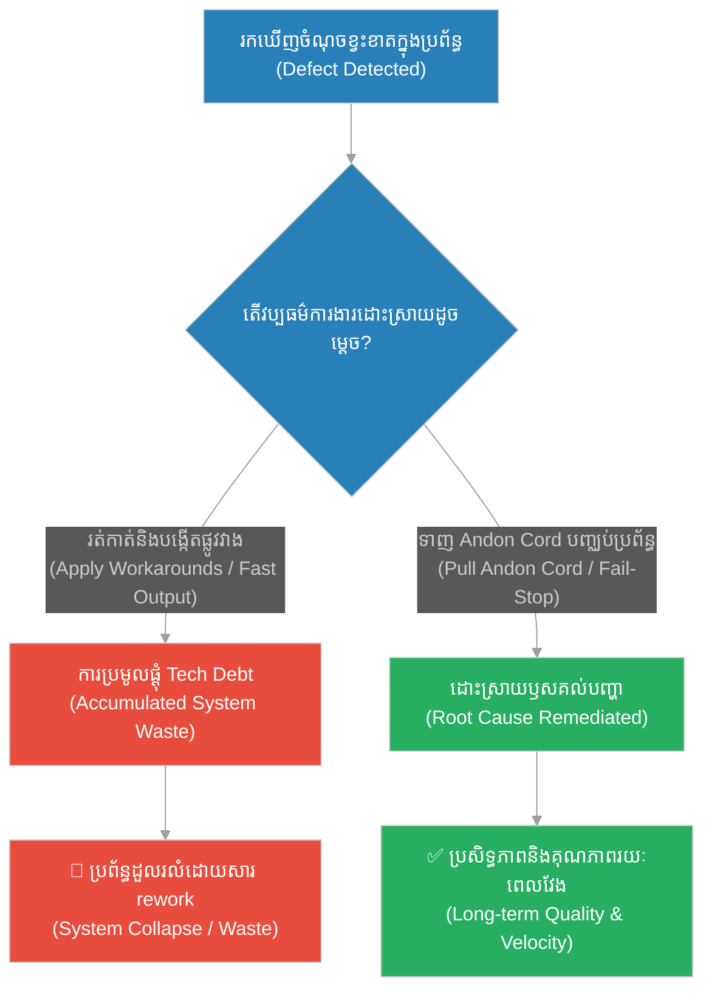
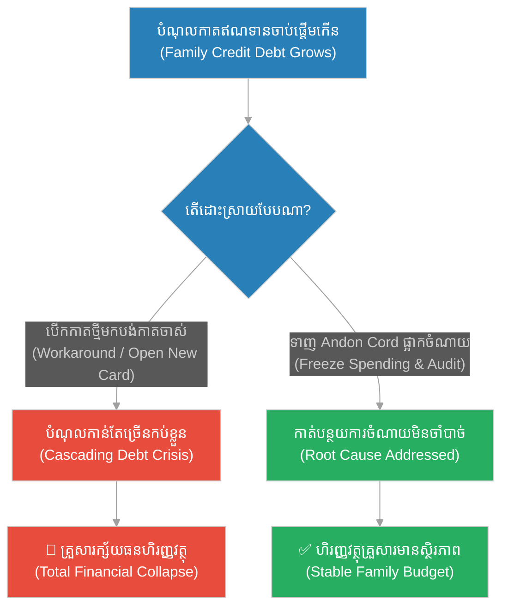
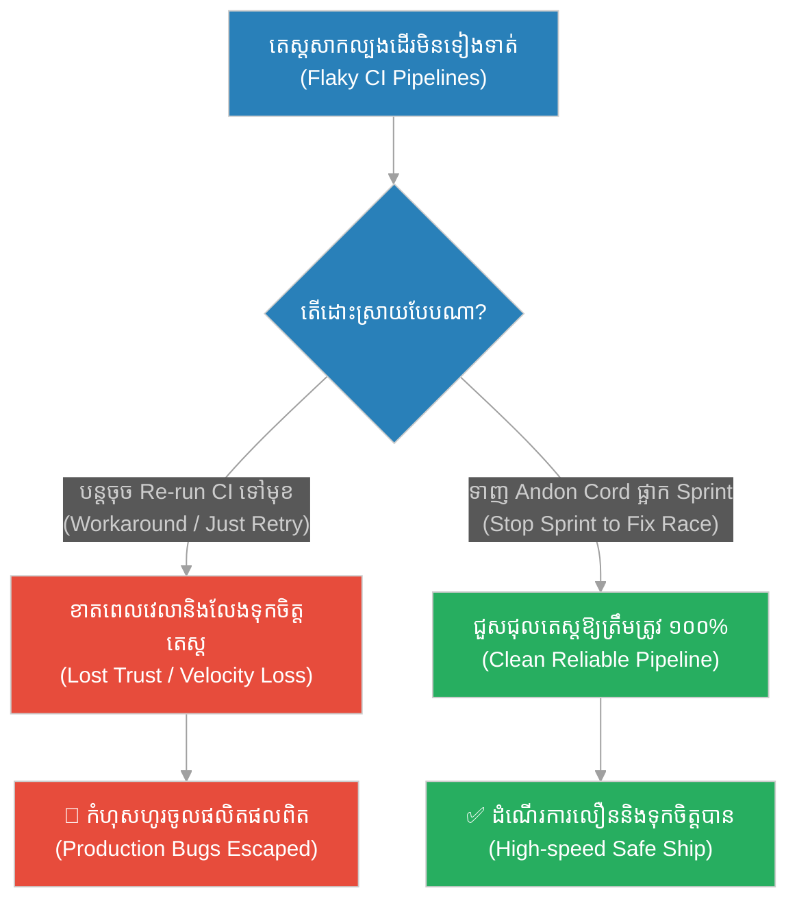
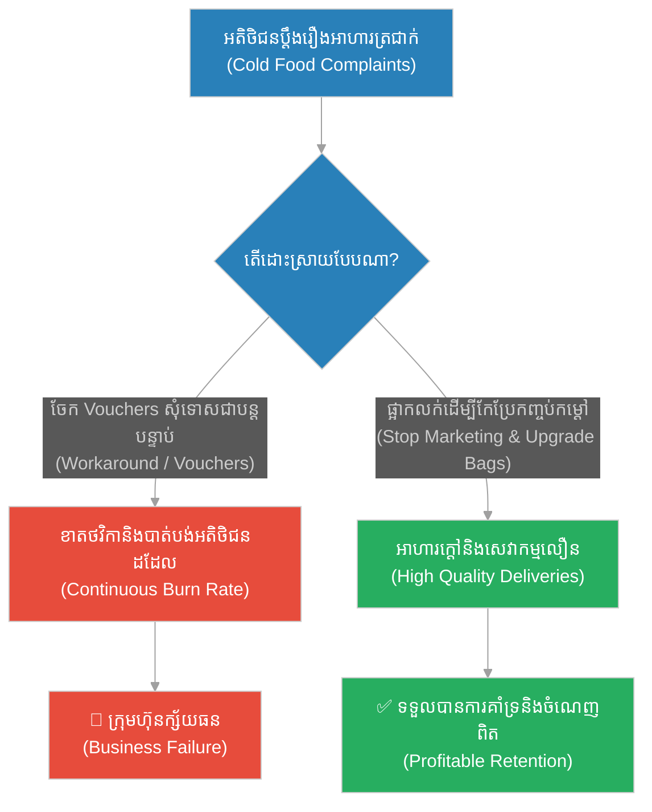
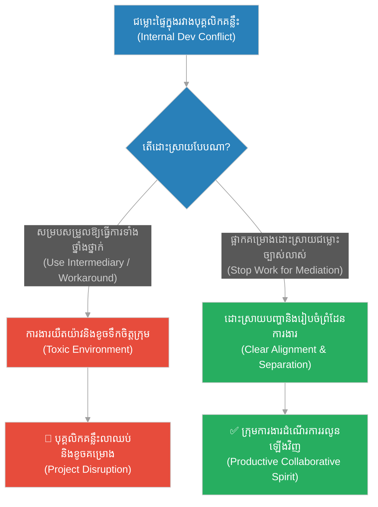
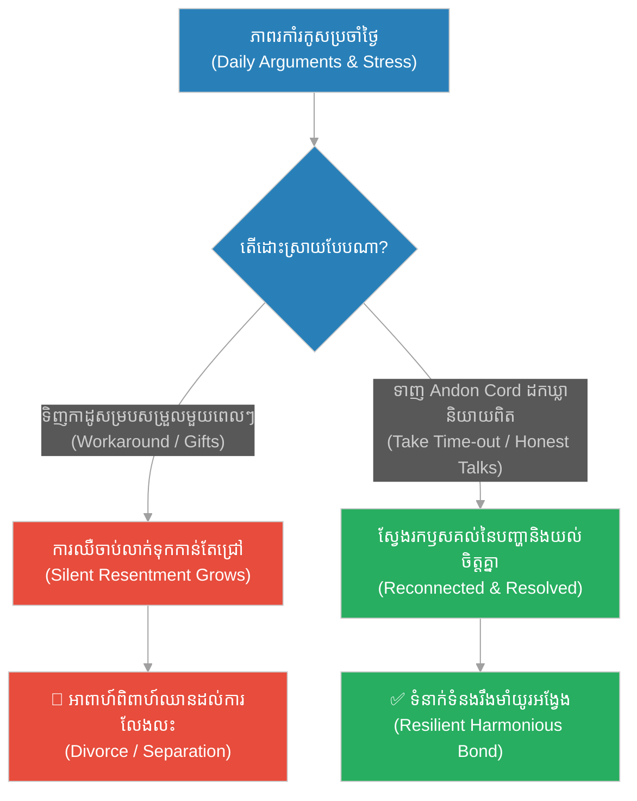

# Continuous Improvement & The Andon Cord (វិធីសាស្ត្រតូយ៉ូតា និងការហ៊ានបញ្ឈប់ខ្សែសង្វាក់)៖ ការកែលម្អជាប្រចាំ និងយន្តការបញ្ឈប់ដំណើរការ (Continuous Improvement & The Andon Cord & Quality Control and Fail-Stop System Execution & The Toyota Way)

**Author:** ichamrong  
**Date:** 2026-05-28  
**Tags:** #andon-cord #continuous-improvement #kaizen #lean-manufacturing #quality-control #devops  
**Category:** Concepts  
**Read Time:** ~15 min  

---

## 📌 មាតិកា (Table of Contents)
- [អន្ទាក់ផ្លូវចិត្ត (The Trap)](#0)
- [១. រឿងព្រេងនិទាន៖ រឿងព្រេងនិទាន៖ វិធីសាស្ត្រតូយ៉ូតា និងការហ៊ានបញ្ឈប់ខ្សែសង្វាក់ (The Legend of The Toyota Way)](#1)
  - [អំណាចនៃខ្សែពួរ Andon Cord និងការស្វែងរកឫសគល់បញ្ហា (The Climax: Pulling the Andon Cord)](#1-1)
- [២. បញ្ហា៖ ៖ Continuous Improvement & The Andon Cord (The Issue: Continuous Improvement & The Andon Cord)](#2)
- [៣. ឧទាហរណ៍ជាក់ស្តែងក្នុងពិភពពិត (Real World Examples)](#3)
  - [ឧទាហរណ៍ទី ១ — កម្រិតស្រាល (គ្រួសារ)៖ វិបត្តិបំណុលកាតឥណទាន (The Family Budget Stop)](#3-1)
  - [ឧទាហរណ៍ទី ២ — កម្រិតមធ្យម (បច្ចេកទេស)៖ ការជួសជុល Flaky Integration Tests (The Dev Flaky Test Stop)](#3-2)
  - [ឧទាហរណ៍ទី ៣ — កម្រិតមធ្យម (ធុរកិច្ច)៖ ការផ្អាកយុទ្ធនាការលក់ ដើម្បីកែប្រែគុណភាពសេវាកម្ម (The Business Quality Pivot)](#3-3)
  - [ឧទាហរណ៍ទី ៤ — កម្រិតមធ្យម (សង្គម/គ្រប់គ្រង)៖ ការដោះស្រាយវិបត្តិទំនាក់ទំនងផ្ទៃក្នុងក្រុម (The Management Conflict Stop)](#3-4)
  - [ឧទាហរណ៍ទី ៥ — កម្រិតធ្ងន់ (ទំនាក់ទំនង)៖ ការដកឃ្លាដើម្បីជួសជុលបញ្ហាស្នេហា (The Relationship Time-out Cord)](#3-5)
- [៤. ដំណោះស្រាយទូទៅ៖ Fail-Stop Systems & Root Cause Analysis (The General Solution: Fail-Stop Systems & Root Cause Analysis)](#4)
- [សេចក្តីសន្និដ្ឋាន (Conclusion)](#5)
- [ឯកសារយោង (References)](#6)
- [Related Posts](#7)

---

<a id="0"></a>
## អន្ទាក់ផ្លូវចិត្ត (The Trap)

តើអ្នកធ្លាប់ជួបបញ្ហាតូចមួយក្នុងបំពង់ការងារ ហើយសម្រេចចិត្តប្រើប្រាស់ «វិធីសាស្ត្រផ្លូវវាង» (Workaround) ដើម្បីគ្របវាទុកជាបណ្តោះអាសន្ន ព្រោះខ្លាចខាតពេលវេលាដែរឬទេ? នេះគឺជាអន្ទាក់នៃការរត់ដេញតាមល្បឿនដោយព្រងើយកន្តើយនឹងគុណភាពស្នូល (Speed over Quality Trap)។ ការបន្តការងារទាំងដែលមានបញ្ហាលាក់កំបាំង នឹងនាំឱ្យមានការប្រមូលផ្តុំកំហុសកាន់តែច្រើនឡើងៗ រហូតដល់ថ្ងៃមួយ វានឹងផ្ទុះឡើងនិងបំផ្លាញប្រព័ន្ធទាំងមូល។

* **ការប្រើប្រាស់ផ្លូវវាងអចិន្ត្រៃយ៍ (Workaround Addiction)** — ការគិតថាការបិទបាំងបញ្ហា និងរក្សាល្បឿនទៅមុខ គឺប្រសើរជាងការឈប់ដំណើរការដើម្បីដោះស្រាយវាឱ្យដាច់ស្រឡះ។
* **ការភ័យខ្លាចក្នុងការបញ្ឈប់ (Fear of Halting)** — ការយល់ច្រឡំថាការឈប់សម្រាក ឬផ្អាកដំណើរការដើម្បីកែទម្រង់ គឺជាការខាតបង់ធនធាន និងពេលវេលា។



នៅក្នុងអត្ថបទនេះ យើងនឹងសិក្សាអំពី៖
1. **រឿងព្រេងនិទាន (The Legend)** — វិធីសាស្ត្រផលិតកម្មរបស់តូយ៉ូតា និងសិទ្ធិរបស់កម្មករគ្រប់រូបក្នុងការទាញខ្សែពួរ Andon Cord ដើម្បីបញ្ឈប់ខ្សែសង្វាក់ផលិតកម្ម។
2. **បញ្ហា (The Issue)** — ការប្រមូលផ្តុំបំណុលបច្ចេកវិទ្យា (Technical Debt) និងសារៈសំខាន់នៃគោលការណ៍ Kaizen & Jidoka។
3. **ឧទាហរណ៍ជាក់ស្តែង (Real World Examples)** — ករណីសិក្សា ៥ កម្រិត ចាប់ពីកម្រិតគ្រួសាររហូតដល់ទំនាក់ទំនងស្នេហា។
4. **ដំណោះស្រាយទូទៅ (The General Solution)** — ការបង្កើតប្រព័ន្ធ Fail-Stop និងការអនុវត្តការស្វែងរកឫសគល់បញ្ហា (Root Cause Analysis/5 Whys)។

---

<a id="1"></a>
## ១. រឿងព្រេងនិទាន៖ វិធីសាស្ត្រតូយ៉ូតា និងការហ៊ានបញ្ឈប់ខ្សែសង្វាក់ (The Legend of The Toyota Way)

នៅក្នុងទសវត្សរ៍ឆ្នាំ ១៩៥០ ឧស្សាហកម្មផលិតរថយន្តនៅបស្ចិមប្រទេស (ដូចជា General Motors និង Ford) បានដើរតាមយុទ្ធសាស្ត្រល្បឿនជាចម្បង។ ខ្សែសង្វាក់ផលិតកម្មត្រូវតែដំណើរការជានិច្ចដោយមិនឱ្យឈប់សូម្បីតែមួយនាទី។ ប្រសិនបើកម្មករម្នាក់រកឃើញគ្រឿងបន្លាស់ដែលមានបញ្ហា ពួកគេមិនត្រូវបានអនុញ្ញាតឱ្យបញ្ឈប់ម៉ាស៊ីនឡើយ។ ពួកគេត្រូវបណ្តោយឱ្យឡានដែលខូចនោះរំកិលទៅមុខ ហើយរង់ចាំដោះស្រាយវានៅចុងបញ្ចប់នៃខ្សែសង្វាក់នៅក្នុងផ្នែកកែប្រែ (Repair Lot)។ នេះត្រូវបានគេគិតថាជាមធ្យោបាយដ៏ល្អបំផុតដើម្បីកុំឱ្យខាតបង់ពេលវេលា។

ផ្ទុយទៅវិញ ក្រុមហ៊ុនតូយ៉ូតា (Toyota) នៅក្នុងប្រទេសជប៉ុន បានដាក់ចេញនូវច្បាប់មួយដែលក្រុមហ៊ុនលោកខាងលិចគិតថាជា «ភាពឆ្កួតលីលា»៖ **កម្មករគ្រប់រូបនៅលើខ្សែសង្វាក់ដំឡើង មានសិទ្ធិ និងកាតព្វកិច្ចទាញខ្សែពួរមួយដែលគេហៅថា Andon Cord ដើម្បីបញ្ឈប់ខ្សែសង្វាក់ផលិតកម្មទាំងមូលភ្លាមៗ នៅពេលដែលពួកគេរកឃើញចំណុចខ្វះខាត ឬភាពខុសប្រក្រតី។**

ការឈប់ដំណើរការខ្សែសង្វាក់នីមួយៗគិតជាលុយរាប់ពាន់ដុល្លារក្នុងមួយនាទី។ ប៉ុន្តែតូយ៉ូតាជឿជាក់ថា សិទ្ធិសម្រេចចិត្តគួរតែស្ថិតនៅលើកម្មករដែលនៅជិតការងារបំផុត។

<a id="1-1"></a>
### អំណាចនៃខ្សែពួរ Andon Cord និងការស្វែងរកឫសគល់បញ្ហា (The Climax: Pulling the Andon Cord)

នៅពេលដែលកម្មករម្នាក់ទាញខ្សែពួរ Andon Cord ភ្លើងសញ្ញានឹងភ្លឺនៅលើក្តារព័ត៌មាន (Andon Board) ហើយប្រធានក្រុមការងារ (Team Lead) ត្រូវតែរត់ទៅដល់កន្លែងកើតហេតុក្នុងរយៈពេលមិនឱ្យលើសពី ៦០ វិនាទី។ ប្រសិនបើបញ្ហានោះអាចដោះស្រាយបានលឿន ខ្សែសង្វាក់នឹងបន្តដំណើរការឡើងវិញ។ ប្រសិនបើមិនអាចដោះស្រាយបានភ្លាមៗទេ ខ្សែសង្វាក់ផលិតកម្មទាំងមូលនឹងត្រូវដេកស្ងៀម រហូតទាល់តែពួកគេស្វែងរកឃើញ «ឫសគល់ពិតប្រាកដនៃបញ្ហា» (Root Cause) ហើយកែប្រែវាឱ្យដាច់ស្រឡះ ដើម្បីកុំឱ្យវាកើតឡើងជាលើកទីពីរ។

តូយ៉ូតាបានរកឃើញថា ការភ័យខ្លាចក្នុងការបញ្ឈប់ខ្សែសង្វាក់ គឺជាប្រភពនៃការបង្កើតកាកសំណល់ (Muda) និងកំហុសដ៏ធំបំផុត។ តាមរយៈការហ៊ានឈប់ភ្លាមៗដើម្បីជួសជុលបញ្ហាស្នូល តូយ៉ូតាអាចកាត់បន្ថយពេលវេលាកែប្រែនៅចុងបញ្ចប់មកនៅសូន្យ និងបង្កើតរថយន្តដែលមានគុណភាពខ្ពស់បំផុត រហូតដល់ដណ្តើមបានទីផ្សារសកលលោក។

---

<a id="2"></a>
## ២. បញ្ហា៖ Continuous Improvement & The Andon Cord (The Issue: Continuous Improvement & The Andon Cord)

នៅក្នុងវិស្វកម្មសូហ្វវែរ ក្រុមការងារជាច្រើនតែងតែរត់ដេញតាមសន្ទុះនៃការបញ្ចេញមុខងារថ្មីៗ (Velocity)។ នៅពេលដែលបំពង់បង្ហូរ CI/CD (Pipeline) ឬតេស្តសាកល្បង (Integration Tests) ចាប់ផ្តើមដំណើរការមិនប្រក្រតី ឬឆេះក្រហម (Flaky Tests) វិស្វករតែងតែជ្រើសរើសយកផ្លូវវាង៖
* *«តេស្តហ្នឹងឧស្សាហ៍ធ្លាក់ដោយសារបញ្ហា Network/Database ហ្នឹងណា! ចុច Re-run CI ទៅ ពីរទៅបីដង វានឹងរលាយពណ៌បៃតងហើយ!»*
* *«កូដនេះមាន Race Condition បន្តិច តែមិនអីទេ ដាក់ `sleep(100ms)` ទៅ វាលែងអីហើយ!»*

នេះគឺជាការបង្កើតបំណុលបច្ចេកវិទ្យា **(Technical Debt)**។ ការធ្វើបែបនេះជាញឹកញាប់ នឹងធ្វើឱ្យក្រុមការងារបាត់បង់ពេលវេលាយ៉ាងច្រើនក្នុងការចុច Re-run ធ្វើឱ្យ pipeline យឺតយ៉ាវ និងបាត់បង់ទំនុកចិត្តលើប្រព័ន្ធតេស្តស្វ័យប្រវត្តិ។

### ប្រៀបធៀបការអនុវត្ត (Fragile vs. Resilient Practices)

* **ការអនុវត្តដែលផុយស្រួយ (Fragile Practice):** ការបន្ថែមរយៈពេលរង់ចាំដោយគ្មានប្រព័ន្ធ (Sleep Workarounds) ដើម្បីដោះស្រាយបញ្ហាប្រណាំងប្រជែងទិន្នន័យ (Race Conditions) ឬការមិនអើពើនឹងការធ្លាក់ចុះនៃ pipeline។
* **ការអនុវត្តដែលមានភាពធន់ (Resilient Practice):** ការបញ្ឈប់ការសរសេរមុខងារថ្មីភ្លាមៗ (Pull the Andon Cord) នៅពេលដែល pipeline ធ្លាក់ចុះ ឬតេស្តមានភាពផុយស្រួយ។ ក្រុមការងារត្រូវចំណាយពេល ១ ទៅ ២ ថ្ងៃដើម្បីដោះស្រាយឫសគល់នៃបញ្ហានោះឱ្យបាន ១០០% មុននឹងបន្តដំណើរទៅមុខទៀត។

ខាងក្រោមនេះជាគំរូកូដ Go បង្ហាញពីភាពខុសគ្នារវាងការដោះស្រាយបញ្ហា Concurrency បែបផុយស្រួយ (ដោយការប្រើប្រាស់ sleep បណ្តោះអាសន្ន) និងការដោះស្រាយបែបធន់ដោយប្រើប្រាស់យន្តការ Synchronization ត្រឹមត្រូវ៖

```go
package main

import (
	"fmt"
	"sync"
	"time"
)

var sharedData string

// === ១. វិធីសាស្ត្រផុយស្រួយ (Fragile Way: Using arbitrary sleeps to fix race condition) ===
// វិស្វករមិនបានប្រើប្រាស់ប្រព័ន្ធចងភ្ជាប់ត្រឹមត្រូវឡើយ គឺគ្រាន់តែទស្សន៍ទាយពេលវេលា
// បើ network យឺតជាង 100ms នោះកម្មវិធីនឹងជួបប្រទះការដួលរលំ (Race Condition / Silent Corruption)
func fragileConventions() {
	go func() {
		time.Sleep(50 * time.Millisecond) // ក្លែងធ្វើការងារទាញយកទិន្នន័យ
		sharedData = "Data from database"
	}()

	// ផ្លូវវាងផុយស្រួយ៖ សង្ឃឹមថាការងារខាងលើនឹងរួចរាល់ក្នុងរយៈពេល ១០០ មីលីវិនាទី
	time.Sleep(100 * time.Millisecond)
	fmt.Printf("[Fragile] Received: %s\n", sharedData)
}

// === ២. វិធីសាស្ត្ររឹងមាំ (Resilient Way: Standard Synchronization via WaitGroup) ===
// នេះជាដំណោះស្រាយដោះស្រាយឫសគល់បញ្ហា (Root Cause Fixed)
// ទោះបីជាការងារយូររហូតដល់ ២ វិនាទី ក៏កម្មវិធីនៅតែរង់ចាំដោយសុវត្ថិភាពខ្ពស់
func resilientConventions() {
	var wg sync.WaitGroup
	var data string

	wg.Add(1)
	go func() {
		defer wg.Done()
		time.Sleep(50 * time.Millisecond) // ក្លែងធ្វើការងារទាញយកទិន្នន័យ
		data = "Data from database (Secured)"
	}()

	// រង់ចាំរហូតដល់ការងារបញ្ចប់ពិតប្រាកដ (Jidoka / Built-in Quality)
	wg.Wait()
	fmt.Printf("[Resilient] Received: %s\n", data)
}

func main() {
	fmt.Println("--- Running Fragile Approach ---")
	fragileConventions()

	fmt.Println("\n--- Running Resilient Approach ---")
	resilientConventions()
}
```

---

<a id="3"></a>
## ៣. ឧទាហរណ៍ជាក់ស្តែងក្នុងពិភពពិត (Real World Examples)

<a id="3-1"></a>
### ឧទាហរណ៍ទី ១ — កម្រិតស្រាល (គ្រួសារ)៖ វិបត្តិបំណុលកាតឥណទាន (The Family Budget Stop)

គ្រួសារមួយបានសង្កេតឃើញថា ចំណាយប្រចាំខែរបស់ពួកគេបានកើនឡើងលើសចំណូល ហើយបំណុលកាតឥណទានចាប់ផ្តើមកើនឡើងបន្តិចម្តងៗ។ ជំនួសឱ្យការឈប់ទិញទំនិញមិនចាំបាច់ ពួកគេបានជ្រើសរើសផ្លូវវាងគឺការបើកកាតឥណទានថ្មីមួយទៀតដើម្បីមកបង់បង្កប់កាតចាស់ (Workaround)។ ដំណោះស្រាយគឺការផ្អាកចំណាយក្រៅទាំងអស់ភ្លាមៗ (Andon Cord) ហើយអង្គុយជជែកគ្នាធ្វើការវិភាគចំណាយឡើងវិញ។



<a id="3-2"></a>
### ឧទាហរណ៍ទី ២ — កម្រិតមធ្យម (បច្ចេកទេស)៖ ការជួសជុល Flaky Integration Tests (The Dev Flaky Test Stop)

នៅក្នុងក្រុមអភិវឌ្ឍន៍សូហ្វវែរ ការរត់ CI ត្រូវការ পাস rate ៩៨% តែឥឡូវធ្លាក់មក ៨១% ធ្វើឱ្យវិស្វករចំណាយពេលចុច Re-run ម្នាក់ៗ ៤ ម៉ោងក្នុងមួយសប្តាហ៍។ វិស្វករថ្មីម្នាក់សម្រេចចិត្តបដិសេធមិនព្រមសរសេរ feature ថ្មី ហើយសុំឱ្យក្រុមការងារផ្អាក Sprint ២ ថ្ងៃ ដើម្បីលុបបំបាត់ race conditions នៅក្នុង test suite។



<a id="3-3"></a>
### ឧទាហរណ៍ទី ៣ — កម្រិតមធ្យម (ធុរកិច្ច)៖ ការផ្អាកយុទ្ធនាការលក់ ដើម្បីកែប្រែគុណភាពសេវាកម្ម (The Business Quality Pivot)

ក្រុមហ៊ុនដឹកជញ្ជូនអាហាររហ័សមួយ (Delivery Startup) ទទួលបានពាក្យបណ្តឹង ២០% ពីអតិថិជនថាអាហារត្រជាក់ពេលទៅដល់។ ក្រុមសេវាកម្មអតិថិជនដោះស្រាយដោយគ្រាន់តែចែកប័ណ្ណបញ្ចុះតម្លៃ (Vouchers) ឱ្យអតិថិជនខឹង (Workaround)។ នាយកប្រតិបត្តិសម្រេចចិត្តផ្អាកយុទ្ធនាការផ្សព្វផ្សាយលក់ដ៏ធំជាបណ្តោះអាសន្ន ដើម្បីយកថវិកាមករចនាកញ្ចប់រក្សាកំដៅ និងកែលម្អប្រព័ន្ធ GPS របស់បុគ្គលិកដឹកជញ្ជូន។



<a id="3-4"></a>
### ឧទាហរណ៍ទី ៤ — កម្រិតមធ្យម (សង្គម/គ្រប់គ្រង)៖ ការដោះស្រាយវិបត្តិទំនាក់ទំនងផ្ទៃក្នុងក្រុម (The Management Conflict Stop)

នៅក្នុងគម្រោងអភិវឌ្ឍន៍ដ៏សំខាន់មួយ វិស្វករដឹកនាំពីររូបមានជម្លោះផ្ទាល់ខ្លួនយ៉ាងខ្លាំង រហូតលែងនិយាយរកគ្នា។ ពួកគេទាក់ទងគ្នាតែតាមរយៈសំបុត្រ ឬប្រធានក្រុមដែលធ្វើជាអ្នកកណ្តាល (Workaround) ធ្វើឱ្យការងារយឺតយ៉ាវ ៣ ដង។ ប្រធានផ្នែកសម្រេចចិត្តផ្អាកការបញ្ចេញការងារ ១ សប្តាហ៍ ដើម្បីបើកការប្រជុំដោះស្រាយជម្លោះនេះ និងរៀបចំតួនាទីថ្មីឱ្យពួកគេដាច់ដោយឡែក។



<a id="3-5"></a>
### ឧទាហរណ៍ទី ៥ — កម្រិតធ្ងន់ (ទំនាក់ទំនង)៖ ការដកឃ្លាដើម្បីជួសជុលបញ្ហាស្នេហា (The Relationship Time-out Cord)

គូស្វាមីភរិយាមួយគូមានភាពរកាំរកូស និងឈ្លោះប្រកែកគ្នាជារៀងរាល់ថ្ងៃដោយសារតែភាពនឿយហត់ពីការងារ និងកង្វះពេលវេលាផ្ទាល់ខ្លួន។ ជំនួសឱ្យការស្វែងរកដំណោះស្រាយពិតប្រាកដ ពួកគេតែងតែទិញកាដូថ្លៃៗដើម្បីសុំទោសគ្នាទៅវិញទៅមក (Workaround)។ ស្រាប់តែថ្ងៃមួយ ពួកគេសម្រេចចិត្ត «ទាញ Andon Cord» ដោយដកឃ្លាសម្រាកពីការងារមួយសប្តាហ៍ ដើម្បីទៅកម្សាន្ត និងបើកចិត្តនិយាយការពិតប្រាប់គ្នា។



---

<a id="4"></a>
## ៤. ដំណោះស្រាយទូទៅ៖ Fail-Stop Systems & Root Cause Analysis (The General Solution: Fail-Stop Systems & Root Cause Analysis)

ដើម្បីលុបបំបាត់ «កាកសំណល់» និងកសាងប្រព័ន្ធដែលមានគុណភាពខ្ពស់ ស្ថាប័ននិងវិស្វករត្រូវអនុវត្តគោលការណ៍កែលម្អជាប្រចាំ (Kaizen)៖

### ជំហានអនុវត្តជាក់ស្តែង៖
1. **Empower the Edge (ផ្តល់អំណាចដល់អ្នកធ្វើការផ្ទាល់):** ផ្តល់សិទ្ធិអំណាចពេញលេញដល់សមាជិកក្រុមការងារគ្រប់រូបក្នុងការបញ្ឈប់ pipeline ឬដំណើរការងារ នៅពេលរកឃើញកំហុសឆ្គង (ដូចជាការដាក់ឱ្យ CI/CD blocker ដំណើរការស្វ័យប្រវត្ត)។
2. **Implement Fail-Stop Mechanisms (យន្តការឈប់ភ្លាមៗ):** ប្រព័ន្ធត្រូវតែរចនាឡើងដើម្បីបើកកំហុសជាសាធារណៈ និងឈប់ដំណើរការជាជាងបន្តដំណើរការទាំងទិន្នន័យខូចខាត (Fail Fast, Fail Loud)។
3. **Use the 5 Whys Technique (វិធីសាស្ត្រសួរ "ហេតុអ្វី" ៥ ដង):** នៅពេលមានបញ្ហា កុំស្វែងរកជនល្មើសដើម្បីដាក់ទោស។ ចូរចោទសួរពាក្យថា «ហេតុអ្វី» ចំនួន ៥ ដង ដើម្បីស្វែងរកឫសគល់ពិតប្រាកដ។
   * *ហេតុអ្វីបានជា Server គាំង?* ព្រោះ database connection ពេញ។
   * *ហេតុអ្វីបានជា connection ពេញ?* ព្រោះកូដថ្មីមិនបានបិទ connection ក្រោយប្រើរួច។
   * *ហេតុអ្វីបានជាកូដថ្មីមិនបិទ connection?* ព្រោះអ្នកសរសេរមិនបានអនុវត្តតាម guide។
   * *ហេតុអ្វីបានជាមិនធ្វើតាម guide?* ព្រោះគ្មានការធ្វើ Code Review លើកូដនោះ។
   * *ហេតុអ្វីបានជាគ្មាន Code Review?* ព្រោះក្រុមការងាររត់ដេញតាម sprint deadline លឿនពេក (នេះជាឫសគល់បញ្ហាពិតប្រាកដ!)។
4. **Make Improvements Part of the Pipeline:** បែងចែកពេលវេលា ១០% ទៅ ២០% នៅក្នុងរាល់គ្រប់ការងារ ដើម្បីដោះស្រាយបំណុលបច្ចេកវិទ្យា និងសម្អាតកូដ។

```mermaid
%%{init: {
  'theme': 'dark',
  'themeVariables': {
    'background': '#1e1e1e',
    'primaryTextColor': '#ffffff',
    'lineColor': '#a0a0a0'
  },
  'themeCSS': 'svg { background-color: #1e1e1e !important; padding: 1rem !important; border-radius: 8px !important; } .edgeLabel rect { fill: #1e1e1e !important; } text, tspan { fill: #ffffff !important; }'
}}%%
graph LR
    A["រកឃើញកំហុសឆ្គងក្នុងប្រព័ន្ធ<br/>(Identify Defect)"] --> B["ទាញខ្សែពួរ Andon Cord<br/>(Stop Pipeline Execution)"]
    B --> C["ប្រកាសអាសន្ននិងពិនិត្យរួមគ្នា<br/>(Notify Team & Investigate)"]
    C --> D["អនុវត្តវិធីសាស្ត្រ 5 Whys<br/>(Analyze Root Cause)"]
    D --> E["កែសម្រួលប្រព័ន្ធឱ្យដាច់ស្រឡះ<br/>(Deploy Permanent Fix)"]
    E --> F["ដំណើរការប្រព័ន្ធឡើងវិញ<br/>(Resume Pipeline Execution)"]
    F --> G["កត់ត្រាមេរៀននិងចែករំលែក<br/>(Document and Share)"]
    
    style B fill:#e74c3c,color:#fff
    style E fill:#27ae60,color:#fff
    style F fill:#27ae60,color:#fff
    style A fill:#2980b9,color:#fff
    style C fill:#2980b9,color:#fff
    style D fill:#2980b9,color:#fff
    style G fill:#2980b9,color:#fff
```



---

## 🐇 ធ្លាក់ចូលក្នុងរន្ធទន្សាយ (Enter the Rabbit Hole)
ដើម្បីស្វែងយល់បន្ថែមអំពីវិធីសាស្ត្រស្ថិតិ និងបរិមាណសម្រាប់ការសម្រេចចិត្ត សូមបន្តដំណើរទៅកាន់៖

* 🚀 **[ចាប់ផ្តើមដំណើររុករក (Start the Journey) ➔ Business Model Feasibility & Operational Optimization (អ្នកនេសាទ និងសំណាញ់)៖ វិធីសាស្ត្រស្ថិតិ និងបរិមាណសម្រាប់ការសម្រេចចិត្ត](./business-sustainability/core-business/244-the-fisherman-and-the-net.md)**

---

<a id="5"></a>
## សេចក្តីសន្និដ្ឋាន (Conclusion)

> **«ល្បឿនពិតប្រាកដមិនមែនជាការមិនដែលឈប់នោះទេ ប៉ុន្តែវាជាការមិនដែលធ្វើការងារដដែលឡើងវិញ។»**

ជាសន្និដ្ឋាន ការអភិវឌ្ឍន៍ប្រព័ន្ធបច្ចេកវិទ្យា និងការគ្រប់គ្រងស្ថាប័នមិនមែនជាការរត់ប្រណាំងចម្ងាយខ្លីដោយមិនខ្វល់ពីអ្វីទាំងអស់នោះឡើយ។ វាជាការរត់ម៉ារ៉ាតុងដែលទាមទារនូវគុណភាព និងនិរន្តរភាព។ ការរៀបចំប្រព័ន្ធឱ្យមានយន្តការ Andon Cord និងការហ៊ានផ្អាកដំណើរការដើម្បីដោះស្រាយបញ្ហាស្នូល មិនមែនជាការខាតបង់ពេលវេលានោះទេ ប៉ុន្តែវាជាការការពារការខាតបង់ដ៏ធំធេងនៅពេលអនាគត។ ចូរចងចាំថា ការភ័យខ្លាចក្នុងការបញ្ឈប់ខ្សែសង្វាក់ ដើម្បីជួសជុលបញ្ហា ជារឿយៗបង្កការខូចខាតខ្លាំងជាងការបញ្ឈប់វាពិតប្រាកដទៅទៀត។

---

<a id="6"></a>
## ឯកសារយោង (References)

* **Ohno, Taiichi** (1988). *Toyota Production System: Beyond Large-Scale Production*. Productivity Press. សៀវភៅដើមបង្អស់ស្តីពីស្ថាបនិកវិធីសាស្ត្រ TPS និងយន្តការ Andon។
* **Humble, Jez & Farley, David** (2010). *Continuous Delivery: Reliable Software Releases through Build, Test, and Deployment Automation*. Addison-Wesley Professional. សៀវភៅណែនាំពីការអនុវត្ត Andon Cord ក្នុងបំពង់ដំណើរការសូហ្វវែរ។
* **Liker, Jeffrey K.** (2004). *The Toyota Way: 14 Management Principles from the World's Greatest Manufacturer*. McGraw-Hill. ការវិភាគគោលការណ៍ទាំង ១៤ នៃវិធីសាស្ត្រគ្រប់គ្រង និងការកែលម្អជាប្រចាំ។

---

<a id="7"></a>
## Related Posts

* [[Business Model Feasibility & Operational Optimization]](./business-sustainability/core-business/244-the-fisherman-and-the-net.md) — វិធីសាស្ត្រស្ថិតិនិងបរិមាណដើម្បីគ្រប់គ្រងទិន្នផល និងការសម្រេចចិត្ត។
* [[Microservices Conway's Law & Monolith Decomposition]](./242-the-roman-empire.md) — ការយល់ដឹងពីច្បាប់ខនវ៉េ និងការបែងចែកប្រព័ន្ធស្មុគស្មាញខ្នាតយក្ស។
