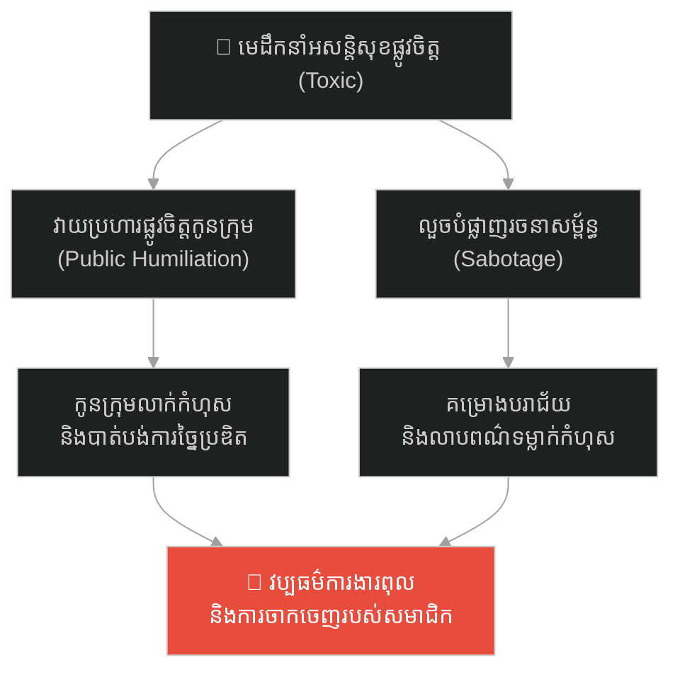
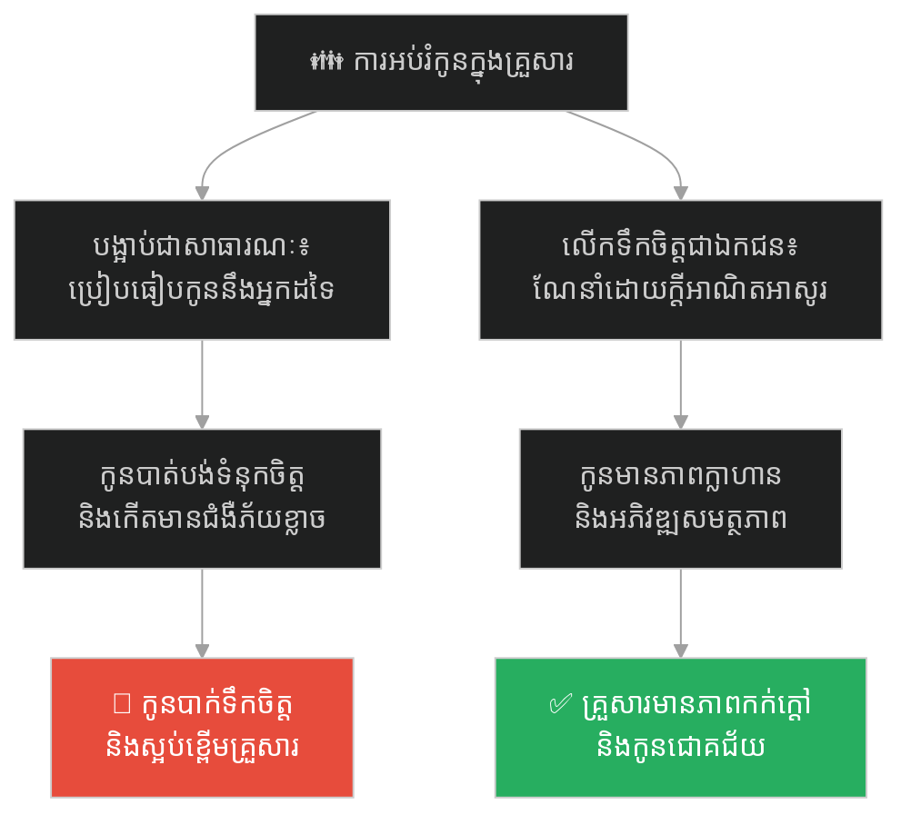
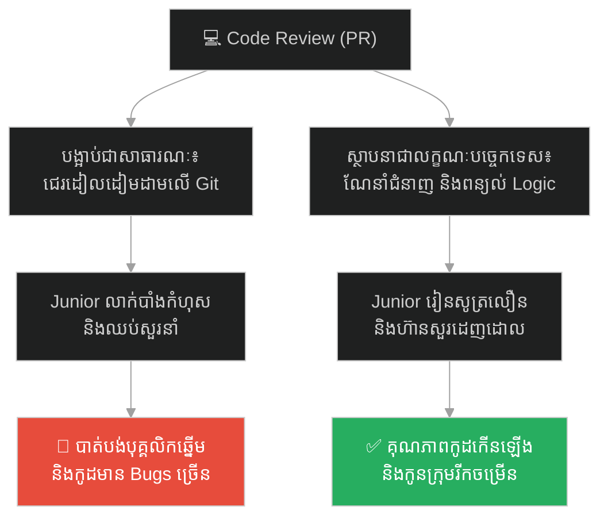
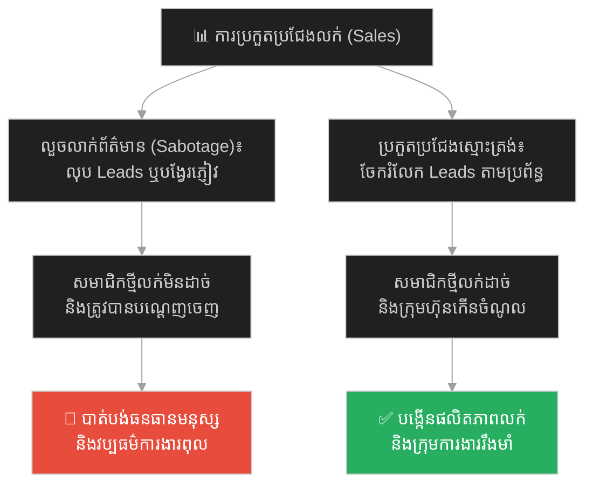
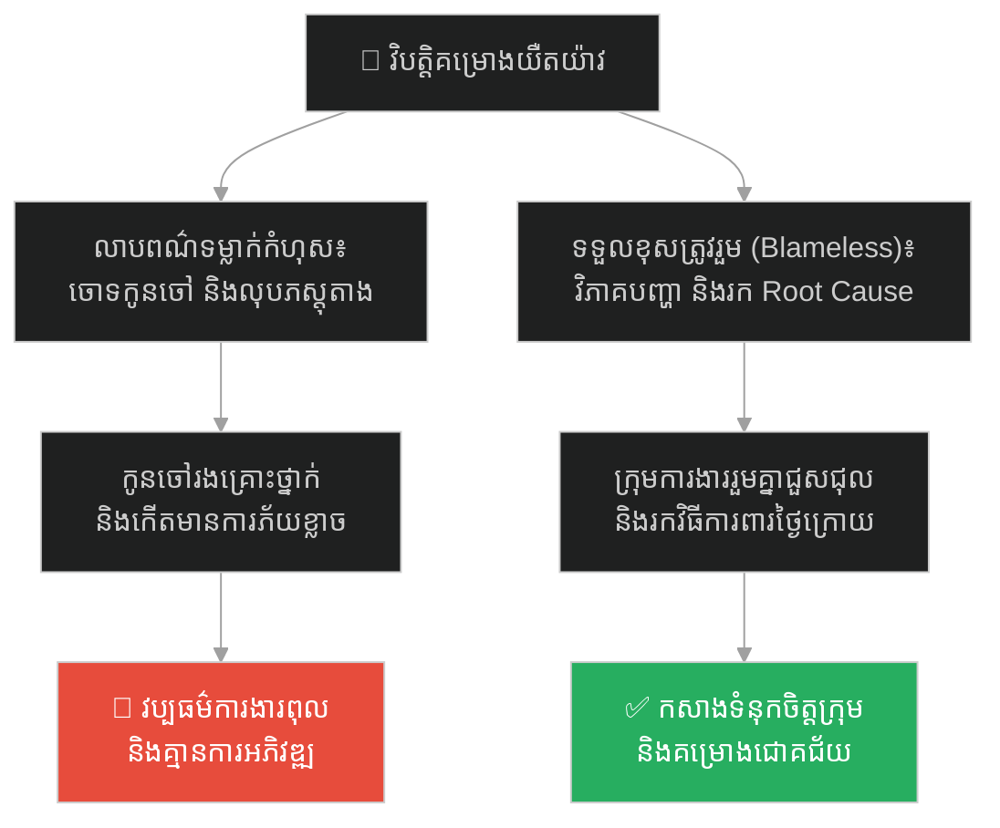
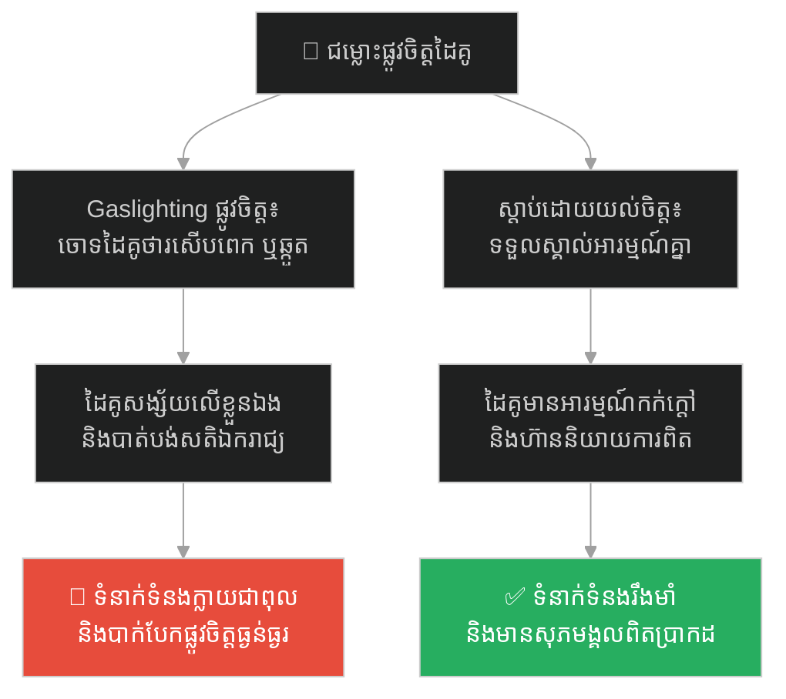
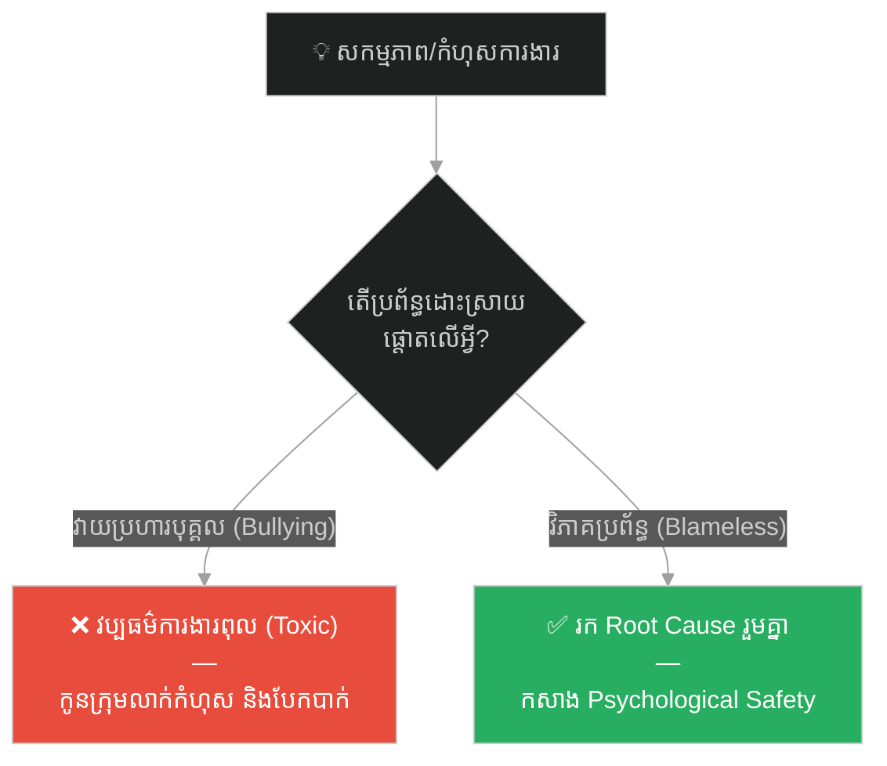

# The Blacksmith and the Cruel Forge Master (មេជាងដែកដ៏ឃោរឃៅ និងដាវដែលបាក់)៖ គ្រោះថ្នាក់នៃការគំរាមកំហែងនៅកន្លែងធ្វើការ និងការលាបពណ៌ទម្លាក់កំហុស

**Author:** ichamrong  
**Date:** 2026-05-27  
**Tags:** #workplace-bullying #toxic-leadership #sabotage #gaslighting #power-abuse #management #psychological-safety  
**Category:** Concepts / Parables  
**Read Time:** ~15 min  

---

## 📌 មាតិកា (Table of Contents)
- [អន្ទាក់ផ្លូវចិត្ត (The Trap)](#អន្ទាក់ផ្លូវចិត្ត-the-trap)
- [១. រឿងព្រេង៖ មេជាងដែក វ៉ាល់ហ្គុស និងកូនជាង អេលី (The Legend of Vulgus and Eli)](#1)
  - [ការសើចចំអកជាសាធារណៈ (The Public Humiliation)](#1-1)
  - [ការលួចបំផ្លាញការងារ និងការលាបពណ៌ (The Sabotage & Gaslighting)](#1-2)
- [២. បញ្ហា៖ ការគំរាមកំហែងនៅកន្លែងធ្វើការ និងការរំលោភបំពានអំណាច (The Issue: Workplace Bullying & Power Abuse)](#2)
- [៣. ឧទាហរណ៍ជាក់ស្តែងក្នុងពិភពពិត (Real World Examples)](#3)
  - [ឧទាហរណ៍ទី ១ — កម្រិតស្រាល (គ្រួសារ)៖ ការបង្អាប់ និងប្រៀបធៀបកូនរបស់ឪពុកម្តាយ (The Parental Bullying & Comparison)](#3-1)
  - [ឧទាហរណ៍ទី ២ — កម្រិតមធ្យម (បច្ចេកទេស)៖ Tech Lead បង្អាប់កូដ Junior ជាសាធារណៈ (The Public Code-Shaming Tech Lead)](#3-2)
  - [ឧទាហរណ៍ទី ៣ — កម្រិតមធ្យម (ធុរកិច្ច)៖ ការលួចលាក់ព័ត៌មានអតិថិជនដើម្បីដណ្តើមស្នាដៃ (The Client Data Hoarder)](#3-3)
  - [ឧទាហរណ៍ទី ៤ — កម្រិតមធ្យម (សង្គម/គ្រប់គ្រង)៖ Manager លាបពណ៌ទម្លាក់កំហុសឱ្យកូនក្រុម (The Blame-Shifting Manager)](#3-4)
  - [ឧទាហរណ៍ទី ៥ — កម្រិតធ្ងន់ (ទំនាក់ទំនង)៖ ដៃគូប្រើប្រាស់ការគំរាមកំហែងផ្លូវចិត្ត និង Gaslighting (Psychological Abuse & Gaslighting)](#3-5)
- [៤. ដំណោះស្រាយទូទៅ៖ ការកសាងសុវត្ថិភាពផ្លូវចិត្ត និងប្រព័ន្ធរាយការណ៍តម្លាភាព (The General Solution: Psychological Safety & Transparency)](#4)
- [សេចក្តីសន្និដ្ឋាន (Conclusion)](#conclusion)
- [ឯកសារយោង (References)](#references)
- [Related Posts](#related-posts)

---

## អន្ទាក់ផ្លូវចិត្ត (The Trap)

តើអ្នកធ្លាប់ធ្វើការនៅក្នុងបរិយាកាសមួយ ដែលរាល់ពេលអ្នកធ្វើខុសបន្តិចបន្តួច អ្នកនឹងត្រូវរងការជេរប្រមាថ ឬសើចចំអកជាសាធារណៈ ហើយរាល់ពេលដែលកំហុសកើតឡើងពីប្រព័ន្ធ បែរជាមានការលាបពណ៌ទម្លាក់កំហុសមកលើអ្នកទៅវិញដែរឬទេ?

នៅក្នុងស្ថាប័នជាច្រើន យើងតែងតែឃើញ៖
* **មេដឹកនាំដែលមានអត្តចរិតពុល (Toxic Leaders)** ចូលចិត្តប្រើប្រាស់ពាក្យសម្តីវាយប្រហារ បន្ទាបតម្លៃ និងលួចបំផ្លាញការងាររបស់កូនចៅ ដើម្បីការពារកេរ្តិ៍ឈ្មោះខ្លួនឯង។
* **បុគ្គលិក** ភ័យខ្លាចការធ្វើខុស លាក់បាំងព័ត៌មាន និងលែងហ៊ានបញ្ចេញសមត្ថភាពច្នៃប្រឌិត។

នៅពេលស្ថាប័នមួយអនុញ្ញាតឱ្យមានការជេរប្រមាថ និងការលាបពណ៌ទម្លាក់កំហុស ពួកគេកំពុងរស់នៅក្នុងបរិយាកាសការងារដ៏គ្រោះថ្នាក់មួយហៅថា **អន្ទាក់គំរាមកំហែងនៅកន្លែងធ្វើការ (Workplace Bullying Trap)**។

ដើម្បីយល់ដឹងពីវិធីកសាងសុវត្ថិភាពផ្លូវចិត្ត នេះជាផែនទីបង្ហាញផ្លូវសម្រាប់អត្ថបទនេះ៖
1. **រឿងព្រេង (The Historic Legend)** — រឿងរ៉ាវរបស់មេជាងដែកដ៏ល្បីល្បាញ វ៉ាល់ហ្គុស ដែលសង្កត់សង្កិន និងលួចប្តូរដែកថែបដើម្បីបំផ្លាញដាវរបស់កូនជាង អេលី។
2. **បញ្ហា (The Issue)** — ផលប៉ះពាល់ផ្លូវចិត្តនៃការគំរាមកំហែងនៅកន្លែងធ្វើការ និងយន្តការ Gaslighting។
3. **ឧទាហរណ៍ជាក់ស្តែងក្នុងពិភពពិត (Real World Examples)** — ពិនិត្យមើលឥទ្ធិពលនៃការគំរាមកំហែង និងការបំផ្លាញទំនុកចិត្ត ក្នុងកម្រិតគ្រួសារ ការងារបច្ចេកវិទ្យា ធុរកិច្ច ការគ្រប់គ្រង និងទំនាក់ទំនងស្នេហា/គ្រួសារ។
4. **ដំណោះស្រាយទូទៅ (The General Solution)** — ការកសាង **សុវត្ថិភាពផ្លូវចិត្ត (Psychological Safety)** និងការស៊ើបអង្កេតដោយគ្មានការលំអៀង (Blameless System Investigation)។

---

## ១. រឿងព្រេង៖ មេជាងដែក វ៉ាល់ហ្គុស និងកូនជាង អេលី (The Legend of Vulgus and Eli)

នៅក្នុងទីក្រុងបុរាណមួយ មានសាលាជាងដែកដ៏ធំ និងល្បីល្បាញបំផុតដែលគ្រប់គ្រងដោយមេជាងម្នាក់ឈ្មោះ **វ៉ាល់ហ្គុស (Vulgus)**។ វ៉ាល់ហ្គុស គឺជាជាងដែកដែលមានសមត្ថភាពខ្ពស់ និងលត់ដំគ្រឿងសស្ត្រាវុធបានល្អឥតខ្ចោះ ប៉ុន្តែគាត់មានចិត្តគំនិតលោភលន់ ច្រណែនឈ្នានីស និងតែងតែប្រើប្រាស់អំណាចរបស់ខ្លួនដើម្បីសង្កត់សង្កិនកូនជាងដទៃទៀត។

ថ្ងៃមួយ ក្មេងប្រុសម្នាក់ឈ្មោះ **អេលី (Eli)** ដែលមានចិត្តស្រឡាញ់សិល្បៈលោហៈ បានមកសុំរៀនសូត្រ និងធ្វើជាកូនជាងរបស់ វ៉ាល់ហ្គុស។

---

### ការសើចចំអកជាសាធារណៈ (The Public Humiliation)

ចាប់តាំងពីថ្ងៃដំបូងនៃការងារ វ៉ាល់ហ្គុស មិនដែលបង្រៀន អេលី ដោយក្តីអាណិតអាសូរ ឬពន្យល់បច្ចេកទេសឱ្យបានច្បាស់លាស់ឡើយ។ ផ្ទុយទៅវិញ រាល់ពេលដែលមានអតិថិជន ឬអ្នកក្រុងធ្វើដំណើរមកទិញដាវ វ៉ាល់ហ្គុស តែងតែឆ្លៀតឱកាសជេរប្រមាថ និងសើចចំអក អេលី ជាសាធារណៈដើម្បីលើកតម្លៃខ្លួនឯង។

នៅពេលដែល អេលី កាន់ញញួរខុសកម្រិតបន្តិចបន្តួច ឬដុតភ្លើងយឺតជាងមុន វ៉ាល់ហ្គុស នឹងស្រែកគំហកខ្លាំងៗថា៖
> *«ឯងល្ងង់ខ្លៅម្ល៉េះ! កាន់ញញួរគ្មានទឹកដៃផង ចង់ធ្វើជាងដែកល្បីល្បាញ? ឯងកើតមកដើម្បីតែបោសសម្រាម និងកើបផេះចង្ក្រានប៉ុណ្ណោះ!»*

អតិថិជននាំគ្នាសើចចំអក រីឯ អេលី បានត្រឹមតែឱនមុខចុះដោយក្តីសង្វេគ ខ្មាសអៀន និងបាត់បង់ទំនុកចិត្តលើខ្លួនឯង (Verbal Bullying)។ ការធ្វើបែបនេះរបស់ វ៉ាល់ហ្គុស មិនមែនដើម្បីជួយកែលម្អនោះទេ គឺដើម្បីបង្ហាញឱ្យភ្ញៀវឃើញថា គាត់ជាមេជាងតែម្នាក់គត់ដែលមានសមត្ថភាពខ្ពស់ជាងគេ។

---

### ការលួចបំផ្លាញការងារ និងការលាបពណ៌ (The Sabotage & Gaslighting)

ប៉ុន្មានខែក្រោយមក ស្តេចនៃអាណាចក្របានផ្ញើរាជសារបញ្ជាទិញ «ដាវពិសេស» មួយសម្រាប់យកទៅប្រគល់ជូនមេទ័ពកំពូល។ វ៉ាល់ហ្គុស ដោយសារតែរវល់ការងារផ្ទាល់ខ្លួន ក៏បានចាត់តាំងឱ្យ អេលី ជាអ្នកលត់ដំដាវនេះ។ អេលី បានប្រឹងប្រែងអស់ពីកម្លាំងកាយចិត្ត ជ្រើសរើសដែកថែបដ៏ល្អ និងលត់ដំវាអស់រយៈពេលបីថ្ងៃបីយប់។

ដោយឃើញដាវនោះចេញមករលោងស្រិល និងមានគុណភាពខ្ពស់ វ៉ាល់ហ្គុស កើតក្តីច្រណែន និងខ្លាចក្រែង អេលី មានស្នាដៃលេចធ្លោជាងខ្លួន។ នៅយប់ចុងក្រោយ មុនថ្ងៃប្រគល់ដាវ វ៉ាល់ហ្គុស បានលួចចូលទៅក្នុងរោងជាង រួចដកយកដែកថែបដ៏រឹងមាំដែល អេលី បានរៀបចំទុកសម្រាប់ធ្វើជាស្នូលដាវ រួចប្តូរយកដែកថោកទាបដែលផុយស្រួយមកដាក់ជំនួសវិញ (Sabotage)។

នៅព្រឹកឡើង ពេលដែល អេលី យកដាវនោះទៅប្រគល់ជូនស្តេច អមដោយវត្តមានរបស់ វ៉ាល់ហ្គុស គ្រាន់តែស្តេចទាញដាវមកកាប់សាកល្បងលើផ្ទាំងឈើ ដាវនោះក៏បានបាក់ជាពីរភ្លាមៗ។ វ៉ាល់ហ្គុស ប្រញាប់លោតចេញមកខាងមុខ លុតជង្គង់ចុះ រួចចង្អុលមុខចោទប្រកាន់ អេលី ភ្លាមៗថា៖
> *«ក្រាបទូលព្រះរាជា! ទូលបង្គំបានណែនាំវាហើយថា ឱ្យប្រើដែកថែបសុទ្ធដើម្បីធ្វើស្នូលដាវ ប៉ុន្តែវានេះក្បាលរឹង ចង់កាត់បន្ថយការងារ និងលួចដែកថែបយកទៅលក់ ទើបលទ្ធផលចេញមកបាក់ដាវបែបនេះ!»* (Gaslighting / Blame-shifting)

អេលី ភ័យស្លន់ស្លោ និងយំសោកបដិសេធ តែគ្មាននរណាម្នាក់ជឿជាក់លើកូនជាងក្រីក្រដូចរូបគាត់ឡើយ។ ទាហានបានចាប់ខ្លួនគាត់ត្រៀមយកទៅដាក់គុក។ ប៉ុន្តែ ទីប្រឹក្សាផ្ទាល់របស់ស្តេច (HR/Management) ដែលធ្លាប់បានឮពីអាកប្បកិរិយារបស់ វ៉ាល់ហ្គុស កន្លងមក បានសុំអន្តរាគមន៍ និងធ្វើការស៊ើបអង្កេត។ គាត់បាននាំទាហានទៅឆែកឆេរឃ្លាំងដែក និងផ្ទះរបស់ វ៉ាល់ហ្គុស រហូតរកឃើញដែកថែបសុទ្ធដែលត្រូវបានលាក់ទុកក្រោមគ្រែគេងរបស់ វ៉ាល់ហ្គុស។

ទីប្រឹក្សាបាននិយាយសម្តីដ៏មានន័យទៅកាន់ វ៉ាល់ហ្គុស ថា៖
> *«មេជាងដែកដ៏ពូកែ និងមានគុណធម៌ គឺយកដែកទន់ខ្សោយមកលត់ដំឱ្យក្លាយជាដាវដ៏មុតស្រួច។ ប៉ុន្តែមេជាងដែលអន់ខ្សោយ និងមានចិត្តច្រណែន គឺយកដែកដ៏ល្អទៅបំផ្លាញចោល ត្រឹមតែដើម្បីកម្ទេចសក្តានុពលរបស់កូនជាងខ្លួនឯងប៉ុណ្ណោះ។»*

វ៉ាល់ហ្គុស ត្រូវបានបណ្តេញចេញពីទីក្រុងជារៀងរហូត រីឯ អេលី ត្រូវបានតែងតាំងជាមេជាងដែកថ្មីរបស់រាជវាំង។

---

## ២. បញ្ហា៖ ការគំរាមកំហែងនៅកន្លែងធ្វើការ និងការរំលោភបំពានអំណាច (The Issue: Workplace Bullying & Power Abuse)

នៅក្នុងចិត្តវិទ្យាស្ថាប័ន (Organizational Psychology) ឥរិយាបថរបស់ វ៉ាល់ហ្គុស គឺជាការឆ្លុះបញ្ចាំងនៃ **ការគំរាមកំហែងនៅកន្លែងធ្វើការ (Workplace Bullying)** និង **ការគ្រប់គ្រងបែបពុល (Toxic Leadership)**។

បាតុភូតនេះកើតឡើងតាមរយៈយន្តការបំផ្លិចបំផ្លាញចំនួន ៣៖
1. **ការវាយប្រហារផ្លូវចិត្តជាសាធារណៈ (Public Humiliation)៖** ការជេរប្រមាថ ឬបង្អាប់កូនក្រុមនៅចំពោះមុខអ្នកដទៃ ដើម្បីបំផ្លាញតម្លៃផ្ទាល់ខ្លួន (Self-esteem) និងទាញយកភាពអស្ចារ្យមកឱ្យខ្លួនឯង។
2. **ការលួចបំផ្លាញការងារ (Sabotage)៖** ការលាក់បាំងព័ត៌មាន ការប្តូរទិន្នន័យ ឬការបង្កើតលក្ខខណ្ឌឱ្យសហការីធ្វើការខុស ដើម្បីរង់ចាំចង្អុលមុខដាក់ទោស។
3. **ការគ្រប់គ្រងផ្លូវចិត្តលាបពណ៌ (Gaslighting & Blame-shifting)៖** ការបង្វិលការពិត និងទម្លាក់កំហុសទាំងអស់ទៅឱ្យអ្នកដទៃ ដើម្បីការពារកេរ្តិ៍ឈ្មោះ និងឋានៈរបស់ខ្លួនឯង។

---

## ៣. ឧទាហរណ៍ជាក់ស្តែងក្នុងពិភពពិត

ដើម្បីយល់ដឹងឱ្យកាន់តែស៊ីជម្រៅ ផ្លូវការសិក្សានឹងនាំអ្នកទៅពិនិត្យមើល **ឧទាហរណ៍ចំនួន ៥ កម្រិតខុសៗគ្នា** ក្នុងជីវិតរស់នៅប្រចាំថ្ងៃ៖

---

### ឧទាហរណ៍ទី ១ — កម្រិតស្រាល (គ្រួសារ)៖ ការបង្អាប់ និងប្រៀបធៀបកូនរបស់ឪពុកម្តាយ (The Parental Bullying & Comparison)

**ស្ថានភាព៖** ឪពុកម្តាយដែលចង់ឱ្យកូនប្រឡងជាប់លេខ ១ ក្នុងថ្នាក់ តែងតែប្រើវិធីប្រៀបធៀបកូនជាសាធារណៈ។

* **ភាគី A (ឪពុកម្តាយប្រើសម្ពាធពុល)៖** ជារៀងរាល់ពេលជួបជុំសាច់ញាតិ ពួកគេតែងតែនិយាយបង្អាប់កូនខ្លួនឯងថា៖ *«កូនខ្ញុំវាមិនពូកែដូចកូនគេទេ ខ្ជិលណាស់ ប្រឡងបានតែលេខ ៥ លេខ ៦ ទេ!»*។ ពួកគេគិតថានេះជាការជម្រុញចិត្តឱ្យកូនខំប្រឹង។
* **ភាគី B (កូនប្រុសរងសម្ពាធ)៖** កូនកើតមានអារម្មណ៍ខ្មាសអៀន បាក់ទឹកចិត្ត និងចាប់ផ្តើមស្អប់ខ្ពើមការរៀនសូត្រ ព្រោះគាត់គិតថាទោះជាគាត់ខំប្រឹងយ៉ាងណាក៏ឪពុកម្តាយមិនដែលសរសើរគាត់ដែរ។

---

### ឧទាហរណ៍ទី ២ — កម្រិតមធ្យម (បច្ចេកទេស)៖ Tech Lead បង្អាប់កូដ Junior ជាសាធារណៈ (The Public Code-Shaming Tech Lead)

**ស្ថានភាព៖** Junior Developer ម្នាក់បង្កើត Pull Request (PR) ថ្មី ប៉ុន្តែសរសេរកូដខុសបច្ចេកទេស និងមាន Bugs ខ្លះ។

* **ភាគី A (Tech Lead ពុល)៖** ជំនួសឱ្យការ Review ណែនាំសម្របសម្រួល គាត់បែរជាថត Screenshot កូដនោះ រួចផុសចូលក្នុង Channel Slack រួមរបស់ក្រុមហ៊ុន ហើយសរសេរពាក្យឌឺដងថា៖ *«សរសេរកូដបែបនេះ គួរតែត្រឡប់ទៅរៀនឆ្នាំទី ១ ឡើងវិញទៅ!»*
* **ភាគី B (Junior Developer)៖** កើតមានអារម្មណ៍ភ័យខ្លាចការធ្វើខុស លែងហ៊ានកែសម្រួលកូដ សម្រេចចិត្តលាក់បាំងរាល់បញ្ហា និងចាប់ផ្តើមដាក់ពាក្យលាឈប់ពីការងារនៅខែបន្ទាប់។

---

### ឧទាហរណ៍ទី ៣ — កម្រិតមធ្យម (ធុរកិច្ច)៖ ការលួចលាក់ព័ត៌មានអតិថិជនដើម្បីដណ្តើមស្នាដៃ (The Client Data Hoarder)

**ស្ថានភាព៖** នៅក្នុងក្រុមលក់ (Sales Team) មានបុគ្គលិកថ្មីម្នាក់ទើបតែចូលមកសាកល្បងការងារ។

* **ភាគី A (Sales រូបចាស់ច្រណែន)៖** គាត់បារម្ភខ្លាចបុគ្គលិកថ្មីលក់ដាច់ជាងខ្លួន គាត់ក៏លួចលុបអ៊ីមែលសាកសួររបស់អតិថិជនសំខាន់ៗចេញពីប្រព័ន្ធរួម ឬបង្វែរព័ត៌មានលម្អិតរបស់គម្រោងចោល (Sabotage) ដើម្បីឱ្យបុគ្គលិកថ្មីធ្វើការខុស និងលក់មិនដាច់នៅចំពោះមុខ CEO។
* **ភាគី B (បុគ្គលិកថ្មី)៖** ខិតខំធ្វើការតែលទ្ធផលចេញមកមិនល្អ គ្មានអតិថិជនគាំទ្រ និងត្រូវបានក្រុមហ៊ុនបណ្តេញចេញដោយសារតែមិនជាប់ការងារសាកល្បង។

---

### ឧទាហរណ៍ទី ៤ — កម្រិតមធ្យម (សង្គម/គ្រប់គ្រង)៖ Manager លាបពណ៌ទម្លាក់កំហុសឱ្យកូនក្រុម (The Blame-Shifting Manager)

**ស្ថានភាព៖** គម្រោងអភិវឌ្ឍន៍ App របស់ក្រុមហ៊ុនត្រូវយឺតយ៉ាវជាងការគ្រោងទុក ដោយសារតែ Manager មិនព្រមអនុម័ត Design ឱ្យបានលឿន។

* **ភាគី A (Manager ក្រអឺតក្រទម)៖** ដើម្បីកុំឱ្យ CEO ស្តីបន្ទោសខ្លួន គាត់បានលុបអ៊ីមែល និងសារអនុម័តចាស់ៗចោល រួចប្រជុំទម្លាក់កំហុសទៅលើកូនក្រុមថា៖ *«គម្រោងយឺតដោយសារតែកូនក្រុមទន់ខ្សោយ និងមិនយកចិត្តទុកដាក់តាមដានការងារ!»* (Gaslighting / Blame-shifting)
* **ភាគី B (កូនក្រុមរងគ្រោះ)៖** គ្មានភស្តុតាងការពារខ្លួន កើតមានអារម្មណ៍តានតឹង ភ័យខ្លាច និងបាត់បង់ទំនុកចិត្តលើប្រព័ន្ធគ្រប់គ្រងរបស់ក្រុមហ៊ុន។

---

### ឧទាហរណ៍ទី ៥ — កម្រិតធ្ងន់ (ទំនាក់ទំនង)៖ ដៃគូប្រើប្រាស់ការគំរាមកំហែងផ្លូវចិត្ត និង Gaslighting (Psychological Abuse & Gaslighting)

**ស្ថានភាព៖** ប្តីប្រពន្ធរស់នៅជាមួយគ្នា ប៉ុន្តែប្តីតែងតែប្រើអំណាច និងសម្ដីបង្ក្រាបប្រពន្ធគ្រប់បែបយ៉ាង។

* **ភាគី A (ដៃគូប្រើអំណាចពុល)៖** គាត់តែងតែតិះដៀលរូបរាង និងសមត្ថភាពរបស់ប្រពន្ធ៖ *«បើគ្មានខ្ញុំជួយចិញ្ចឹមទេ នាងឯងគ្មានថ្ងៃរស់ស្រួលបែបនេះឡើយ!»*។ ពេលប្រពន្ធយំសោក គាត់និយាយថា៖ *«នាងឯងឆ្កួតហើយ រំភើបចិត្តជ្រុលពេក (You are too sensitive / crazy) ខ្ញុំមិនដែលនិយាយពាក្យទាំងហ្នឹងឡើយ!»*
* **ភាគី B (ប្រពន្ធរងគ្រោះ)៖** ចាប់ផ្តើមសង្ស័យលើការចងចាំ និងសមត្ថភាពផ្ទាល់ខ្លួន បាត់បង់សតិឯករាជ្យ និងរស់នៅក្នុងភាពភ័យខ្លាច និងបាក់ទឹកចិត្តធ្ងន់ធ្ងរ។

---

## ៤. ដំណោះស្រាយទូទៅ៖ ការកសាងសុវត្ថិភាពផ្លូវចិត្ត និងប្រព័ន្ធរាយការណ៍តម្លាភាព (The General Solution: Psychological Safety & Transparency)

ដើម្បីកម្ចាត់វប្បធម៌ការងារគំរាមកំហែង និងការការពារកូនចៅឱ្យរួចផុតពីការលាបពណ៌ទម្លាក់កំហុស អ្នកត្រូវអនុវត្តវិធានការទាំងនេះ៖

### ១. កសាងវប្បធម៌ "វិភាគបញ្ហាដោយមិនផ្តោតលើបុគ្គល" (Blameless Post-Mortem)
រាល់ពេលដែលប្រព័ន្ធ ឬគម្រោងជួបកំហុសឆ្គង ត្រូវរៀបចំការប្រជុំ Retrospective ឬ Post-mortem ដោយមិនអនុញ្ញាតឱ្យមានការចង្អុលមុខ ឬទម្លាក់កំហុសលើបុគ្គលណាម្នាក់ឡើយ។ ផ្ទុយទៅវិញ ត្រូវសួរថា៖ *«តើប្រព័ន្ធការងារយើងមានចន្លោះប្រហោងអ្វីខ្លះ ទើបបណ្តាលឱ្យមានកំហុសនេះកើតឡើង? តើយើងអាចការពារវានៅថ្ងៃក្រោយដោយរបៀបណា?»*

### ២. បង្កើតប្រព័ន្ធរាយការណ៍សម្ងាត់ និងមានតម្លាភាព (Whistleblowing System)
ធានាថាបុគ្គលិកគ្រប់កម្រិត មានលទ្ធភាពប្តឹង ឬរាយការណ៍ពីករណីគំរាមកំហែង (Bullying/Abuse) ទៅកាន់ថ្នាក់លើ ឬផ្នែកធនធានមនុស្ស (HR) ដោយសម្ងាត់ និងមានការការពារសិទ្ធិខ្ពស់ ដោយមិនខ្លាចការសងសឹកពីមេដឹកនាំពុល។

### ៣. អនុវត្តច្បាប់ "កុំលាក់បាំងភស្តុតាង និងការសម្រេចចិត្ត" (Auditable Decisions)
រាល់ការបញ្ជាការងារ ការផ្លាស់ប្តូរ និងការអនុម័ត ត្រូវតែធ្វើឡើងតាមរយៈប្រព័ន្ធផ្លូវការដែលមានការកត់ត្រា និងឆែកមើលបានជានិច្ច (Audit Trail)។ នេះលុបបំបាត់យន្តការ Gaslighting របស់មេដឹកនាំពុល ព្រោះគ្រប់សកម្មភាពទាំងអស់ សុទ្ធតែមានភស្តុតាងច្បាស់លាស់។

---

## 🐇 ធ្លាក់ចូលក្នុងរន្ធទន្សាយយុទ្ធសាស្ត្រ (Enter the Strategic Rabbit Hole)

ដើម្បីស្វែងយល់កាន់តែស៊ីជម្រៅអំពីសិល្បៈនៃការគ្រប់គ្រងអារម្មណ៍ និងរបៀបដែលការស្វែងយល់ពីចិត្តសាស្ត្រមនុស្ស ជួយសម្រួលដល់ការប្រាស្រ័យទាក់ទង និងកាត់បន្ថយជម្លោះក្នុងជីវិត សូមបន្តដំណើររុករករបស់អ្នក៖

* 🚀 **[ចាប់ផ្តើមដំណើររុករក (Start the Journey) ➔ The Jester Who Fed on Tears](./26-the-jester-who-fed-on-tears.md)**

---

## សេចក្តីសន្និដ្ឋាន (Conclusion)

> **«មេជាងដែកដ៏អស្ចារ្យ និងរឹងមាំពិតប្រាកដ មិនមែនបង្ហាញសមត្ថភាពតាមរយៈការជេរប្រមាថ និងកម្ទេចសក្តានុពលកូនជាងរបស់ខ្លួនឡើយ។ ប៉ុន្តែគឺការលត់ដំដែកទន់ខ្សោយ និងកសាងពួកឱ្យក្លាយជាដាវដ៏មុតស្រួចសម្រាប់ការពារជាតិ។»**

ការគំរាមកំហែង និងការលាបពណ៌ទម្លាក់កំហុសដាក់កូនចៅ អាចផ្តល់ឱ្យអ្នកនូវការការពារកេរ្តិ៍ឈ្មោះ និងអំណាចមួយរយៈពេលខ្លីប៉ុណ្ណោះ។ ប៉ុន្តែនៅពេលដែលការពិតជាក់ស្តែងត្រូវបានលាតត្រដាង ភាពពុលទាំងនោះនឹងដុតបំផ្លាញកិត្តិយសរបស់អ្នក និងបណ្តេញអ្នកចេញពីសង្វាក់ការងារ ដូចគំនរដែកថោកទាបដែល វ៉ាល់ហ្គុស ធ្លាប់លាក់ទុក។

ចូរកសាងបរិយាកាសការងារប្រកបដោយសុវត្ថិភាពផ្លូវចិត្ត និងលើកទឹកចិត្តសហការីឱ្យរីកចម្រើនរួមគ្នា។

---

## ឯកសារយោង (References)

* **Sutton, Robert I.** — *The No Asshole Rule: Building a Civilized Workplace and Surviving One That Isn't* (2007)។ ការវិភាគលម្អិតអំពីផលប៉ះពាល់នៃឥរិយាបថពុលនៅកន្លែងធ្វើការ និងរបៀបកសាងវប្បធម៌ការងារល្អ។
* **Edmondson, Amy C.** — *The Fearless Organization: Creating Psychological Safety in the Workplace for Learning, Innovation, and Growth* (2018)។ ទ្រឹស្តីស្នូលនៃការកសាងសុវត្ថិភាពផ្លូវចិត្ត និងប្រព័ន្ធដោះស្រាយកំហុសដោយគ្មានការស្តីបន្ទោស។
* **Stern, Robin** — *The Gaslight Effect: How to Spot and Survive the Hidden Manipulation Others Use to Control Your Life* (2007)។ ការវិភាគលម្អិតអំពីយន្តការ Gaslighting ក្នុងទំនាក់ទំនងការងារ និងជីវិតផ្ទាល់ខ្លួន។

---

## Related Posts

* **[16 Workplace Bullying: The Abuse of Power](../articles/16-workplace-bullying-and-the-abuse-of-power.md)** — អត្ថបទគោលលម្អិតអំពីយន្តការ និងផលប៉ះពាល់នៃការគំរាមកំហែងនៅកន្លែងធ្វើការ។
* **[12 Multiplier vs. Diminisher Leadership](../articles/12-multiplier-leadership.md)** — របៀបដែលមេដឹកនាំជះឥទ្ធិពលលើសមត្ថភាព និងផលិតភាពរបស់កូនក្រុម។
* **[21 The Duke of Zhou and the Welcoming of Scholars](./21-the-duke-of-zhou-and-the-wet-hair.md)** — ការបន្ទាបខ្លួនរបស់មេដឹកនាំដើម្បីស្រូបទាញ និងលើកស្ទួយអ្នកមានសមត្ថភាព។

---

*Last updated: 2026-05-27*

## Related

- [💡 Concepts README](../README.md)
- [📚 Main Repository README](../../../README.md)
- [Developer Habits](../../developer-habits/README.md)
- [Mental Health & Well-being](../../mental-health/README.md)
- [Management & SDLC](../../management/README.md)
