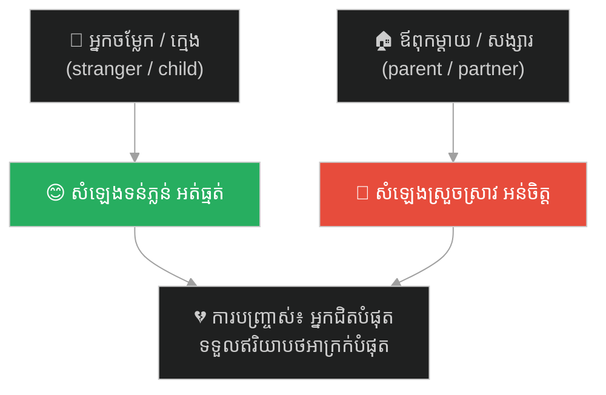
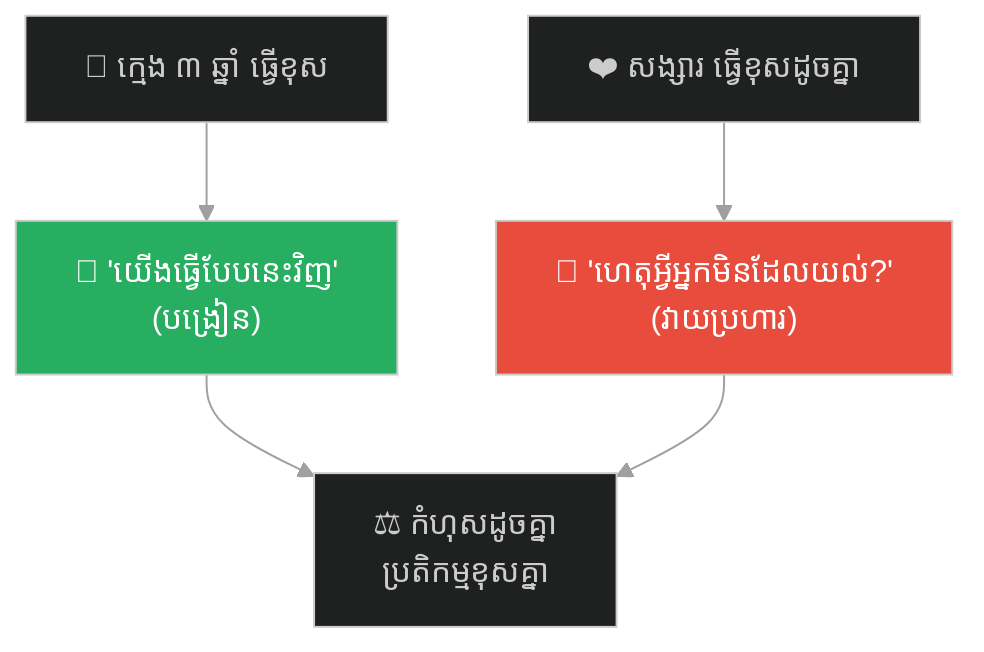
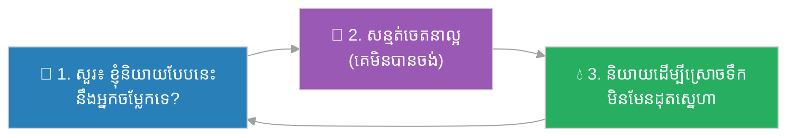

# The Stranger at the Door & the Voice at Home (អ្នកចម្លែកនៅមាត់ទ្វារ និងសំឡេងនៅផ្ទះ)៖ ហេតុអ្វីយើងផ្ដល់ភាពទន់ភ្លន់ដល់អ្នកឆ្ងាយ និងភាពតានតឹងដល់អ្នកជិត (Why We Save Our Gentleness for the Far and Our Edge for the Near)

**Author:** ichamrong  
**Date:** 2026-06-05  
**Tags:** #relationships #empathy #emotional-regulation #familiarity #communication #parable  
**Category:** Concepts / Parables  
**Read Time:** ~9 min  

---

## 📌 មាតិកា (Table of Contents)
- [អន្ទាក់ផ្លូវចិត្ត (The Trap)](#0)
- [១. រឿងប្រស្នា៖ សំឡេងពីរ ក្នុងផ្ទះតែមួយ (The Parable: Two Voices in One Home)](#1)
- [២. បញ្ហា៖ យើងផ្ដល់ឥរិយាបថល្អបំផុត ដល់អ្នកដែលយើងស្រឡាញ់តិចបំផុត (The Issue: Our Best Manners Go to Those We Love Least)](#2)
- [៣. ឧទាហរណ៍ជាក់ស្តែងក្នុងពិភពពិត (Real World Examples)](#3)
  - [ឧទាហរណ៍ទី ១ — ក្មេង ៣ ឆ្នាំ vs សង្សារ (The 3-Year-Old vs. the Partner)](#3-1)
  - [ឧទាហរណ៍ទី ២ — អតិថិជន vs ឪពុកម្ដាយ (The Client vs. the Parent)](#3-2)
  - [ឧទាហរណ៍ទី ៣ — ការងារ៖ ស្នាមញញឹមខាងក្រៅ ភាពអន់ចិត្តនៅផ្ទះ (Smiles Outside, Snapping at Home)](#3-3)
- [៤. ដំណោះស្រាយ៖ នាំ «សំឡេងមាត់ទ្វារ» ចូលក្នុងផ្ទះ (Bring the "Doorway Voice" Inside)](#4)
- [សេចក្តីសន្និដ្ឋាន (Conclusion)](#5)
- [ឯកសារយោង (References)](#6)
- [Related Posts](#7)

---

## អន្ទាក់ផ្លូវចិត្ត (The Trap)

តើអ្នកធ្លាប់ កត់សម្គាល់ ខ្លួនឯងថា និយាយដោយ ទន់ភ្លន់ និងគួរសម ចំពោះអ្នកចម្លែក ឬក្មេងតូច — តែបែរជា ស្រួចស្រាវ និងអន់ចិត្ត ចំពោះ ឪពុកម្ដាយ ឬសង្សារ ដែរឬទេ?

Have you ever caught yourself speaking gently and politely to a stranger or a small child — yet being sharp and irritated with your own parents or partner?

នេះជា **អន្ទាក់នៃភាពស្និទ្ធស្នាល**៖ យើងផ្ដល់ **ការអត់ធ្មត់** របស់យើង ដល់អ្នកដែលនឹងភ្លេចយើង ហើយផ្ដល់ **ភាពមុតស្រួច** របស់យើង ដល់អ្នកដែលនឹងចងចាំយើង។

This is the **familiarity trap**: we give our *patience* to those who will forget us, and our *sharpness* to those who will remember us.

---

## ១. រឿងប្រស្នា៖ សំឡេងពីរ ក្នុងផ្ទះតែមួយ (The Parable: Two Voices in One Home)

មានបុរសម្នាក់ ត្រឡប់មកផ្ទះ ក្រោយថ្ងៃធ្វើការដ៏នឿយហត់។ មាន **គោះទ្វារ**។ គាត់បើកទ្វារ ឃើញ **អ្នកដឹកជញ្ជូន** ដែលយកកញ្ចប់មកខុស។ ដោយញញឹម គាត់និយាយដោយ ទន់ភ្លន់ថា «អត់អីទេ បង — រឿងតូចទេ សូមអរគុណ»។

A man comes home after a long, tiring day. There is a *knock at the door*. He opens it to find a *delivery driver* who brought the wrong package. Smiling, he says gently, *"No problem, friend — it's a small thing, thank you."*

ប៉ុន្តែ ពេលគាត់បិទទ្វារ ងាកមកក្នុងផ្ទះ — **កូនស្រី ៣ ឆ្នាំ** របស់គាត់ បានធ្វើកំពប់ទឹក។ គាត់ដកដង្ហើមវែង ហើយនិយាយដោយទន់ភ្លន់ថា «អូ! យើងជូតវាជាមួយគ្នាណា — ប្រើដៃថ្នមៗ»។

But as he closes the door and turns inside — his *3-year-old daughter* has spilled water. He takes a breath and says gently, *"Oh! Let's clean it up together — use gentle hands."*

បន្ទាប់មក **ភរិយា** របស់គាត់ ភ្លេចទិញរបស់មួយ ដែលគាត់សុំ។ ភ្លាមនោះ សំឡេងគាត់ប្រែ — **ស្រួចស្រាវ និងអន់ចិត្ត**៖ «ហេតុអ្វីបានជា *អ្នក* តែងតែភ្លេច? ខ្ញុំសុំរឿងតែមួយ!» បុរសតែម្នាក់ ផ្ទះតែមួយ យប់តែមួយ — តែ **សំឡេងបី** ខុសគ្នាស្រឡះ។

Then his *wife* forgets something he asked for. Instantly his voice changes — *sharp and irritated*: *"Why do **you** always forget? I asked for one thing!"* The same man, the same home, the same night — but *three completely different voices*.

> អ្នកដឹកជញ្ជូន (អ្នកចម្លែក) ទទួលបាន ការអត់ធ្មត់របស់គាត់។ កូនស្រី (កំពុងរៀន) ទទួលបាន ភាពទន់ភ្លន់របស់គាត់។ ភរិយា (ស្រឡាញ់បំផុត) ទទួលបាន ភាពមុតស្រួចរបស់គាត់។
>
> The driver (a stranger) got his patience. The daughter (still learning) got his gentleness. The wife (loved most) got his edge.

---

## ២. បញ្ហា៖ យើងផ្ដល់ឥរិយាបថល្អបំផុត ដល់អ្នកដែលយើងស្រឡាញ់តិចបំផុត (The Issue: Our Best Manners Go to Those We Love Least)

រឿងសំឡេងបី បង្ហាញការពិតដ៏ឈឺចាប់៖ **យើងពាក់ឥរិយាបថល្អបំផុត ចំពោះអ្នកដែលយើងមិនទុកចិត្ត ហើយដោះវាចេញ ចំពោះអ្នកដែលយើងទុកចិត្តបំផុត។**

The three-voices story reveals a painful truth: **we wear our best manners for those we don't trust, and take them off for those we trust most.**

ហេតុអ្វី? (Why?)

- **ការរំពឹងទុក (Expectations)៖** យើងរំពឹងថា ក្មេង និងអ្នកចម្លែក នឹងធ្វើខុស — តែយើងរំពឹងថា អ្នកស្រឡាញ់ «គួរតែដឹង»។ ដូច្នេះ កំហុសរបស់គេ ធ្វើឱ្យយើងខកចិត្តជាង។ *We expect strangers and children to err, but expect loved ones to "know better."*
- **ការសន្មត់ (Assumption)៖** យើងគួរសមនឹងអ្នកចម្លែក ព្រោះមាន *តម្លៃ* (គេអាចចាកចេញ)។ យើងធ្វេសប្រហែសនឹងអ្នកស្រឡាញ់ ព្រោះយើងសន្មត់ (ខុស) ថា ស្នេហាគេ *មិនចេះអស់*។ *We're polite to strangers because there's a cost; careless with loved ones because we assume their love is endless.*
- **ការលិចលង់ដោយអារម្មណ៍ (Flooding)៖** ជាមួយក្មេង យើងនៅស្ងប់។ ជាមួយគ្រួសារ ភាពនឿយហត់ និងប្រវត្តិចាស់ៗ លិចចូលមក ហើយយើងប្រតិកម្ម ចេញពីប្រព័ន្ធសរសៃប្រសាទ មិនមែនពីស្នេហា។ *With family, our tiredness and old history flood in; we react from the nervous system, not from love.*

**ភាពខុសគ្នាសំខាន់៖** អ្នកដឹកជញ្ជូន មិនបានធ្វើខុសតិចជាងភរិយាឡើយ — គាត់ថែមទាំងធ្វើខុសច្រើនជាង (យកកញ្ចប់ខុស)។ ភាពខុសគ្នា មិននៅ *កំហុស* ទេ — តែនៅ *ការសន្មត់របស់យើង* អំពីមនុស្សនោះ។

**The crucial difference:** the driver didn't make a *smaller* mistake than the wife — his was bigger (wrong package). The difference wasn't the *error*, but *our assumptions* about the person.

---

## ៣. ឧទាហរណ៍ជាក់ស្តែងក្នុងពិភពពិត (Real World Examples)

---

### ឧទាហរណ៍ទី ១ — ក្មេង ៣ ឆ្នាំ vs សង្សារ (The 3-Year-Old vs. the Partner)

នៅពេលក្មេង ៣ ឆ្នាំ ធ្វើខុស យើងបង្រៀន៖ «យើងធ្វើបែបនេះវិញណា»។ នៅពេលសង្សារធ្វើរឿងតែមួយ យើងបែរជា៖ «ហេតុអ្វីអ្នកមិនដែលយល់?» កំហុសដូចគ្នា — តែប្រតិកម្មខុសគ្នាស្រឡះ ព្រោះយើងសន្មត់ថា សង្សារ «គួរតែដឹង»។

When a 3-year-old errs, we teach: "Let's do it this way." When a partner does the same, we snap: "Why don't you ever get it?" Same mistake — opposite reaction, because we assume the partner "should know."

---

### ឧទាហរណ៍ទី ២ — អតិថិជន vs ឪពុកម្ដាយ (The Client vs. the Parent)

យើងឆ្លើយអ៊ីមែលអតិថិជន ដោយ «សូមអរគុណច្រើន! ខ្ញុំនឹងពិនិត្យភ្លាមៗ» — គួរសម និងអត់ធ្មត់។ តែពេលឪពុកម្ដាយ ទូរស័ព្ទមកសួររឿងតែមួយ ពីរដង យើងបែរជា «ម៉ាក់! ខ្ញុំបានប្រាប់រួចហើយ!» យើងរក្សាភាពល្អបំផុត ទុកសម្រាប់អ្នកដែលបង់លុយ — មិនមែនអ្នកដែលផ្ដល់ជីវិតឱ្យយើង។

We answer a client email with "Thank you so much! I'll check right away" — polite and patient. But when a parent calls asking the same question twice, we snap "Mom! I already told you!" We save our best for those who pay us — not those who gave us life.

---

### ឧទាហរណ៍ទី ៣ — ការងារ៖ ស្នាមញញឹមខាងក្រៅ ភាពអន់ចិត្តនៅផ្ទះ (Smiles Outside, Snapping at Home)

មនុស្សជាច្រើន ប្រើ **ថាមពលល្អបំផុត** របស់ខ្លួន ពេញមួយថ្ងៃ នៅកន្លែងធ្វើការ — ញញឹម អត់ធ្មត់ គួរសម។ ត្រឡប់មកផ្ទះ ថាមពលអស់ ហើយ **អ្នកដែលនៅសល់** ដែលទទួលនូវ «កាកសំណល់» នៃភាពអន់ចិត្ត គឺគ្រួសារ។ យើងផ្ដល់ផ្កាដល់ការិយាល័យ ហើយផ្ដល់បន្លាដល់ផ្ទះ។

Many people spend their *best energy* all day at work — smiling, patient, polite. They come home drained, and the ones who get the *leftover* irritation are the family. We give the flowers to the office and the thorns to home.

---

## ៤. ដំណោះស្រាយ៖ នាំ «សំឡេងមាត់ទ្វារ» ចូលក្នុងផ្ទះ (Bring the "Doorway Voice" Inside)

ជំហាននៃការអនុវត្ត (How to apply)៖

1. **«សំឡេងមាត់ទ្វារ» (The doorway test)៖** មុនពេលនិយាយ សួរ៖ «តើខ្ញុំនឹងនិយាយបែបនេះ ទៅអ្នកដឹកជញ្ជូន ឬក្មេង ៣ ឆ្នាំ ដែរឬទេ?» បើទេ ប្ដូរសំឡេង។ *Before speaking, ask: "Would I say this to a stranger or a 3-year-old?" If not, change your tone.*
2. **សន្មត់ចេតនាល្អ (Assume good intent)៖** ដូចយើងសន្មត់ថា ក្មេងមិនបានចង់ធ្វើខុស ចូរសន្មត់ដូចគ្នាចំពោះអ្នកស្រឡាញ់ — គេភ្លេច មិនមែនគេមិនខ្វល់។ *They forgot; it doesn't mean they don't care.*
3. **រក្សាថាមពលល្អ ទុកសម្រាប់ផ្ទះ (Save some best energy for home)៖** កុំចំណាយ ភាពទន់ភ្លន់ទាំងអស់ នៅខាងក្រៅ រួចយក កាកសំណល់មកផ្ទះ។ *Don't spend all your gentleness outside and bring home the leftovers.*
4. **និយាយ ដើម្បីស្រោចទឹក (Speak to water, not to burn)៖** រាល់ពាក្យ ស្រោចទឹក ឬដុតស្នេហា។ ជ្រើសរើសពាក្យ ដែលធ្វើឱ្យវាលូតលាស់។ *Every word waters or burns your love; choose the ones that grow it.*

---

## សេចក្តីសន្និដ្ឋាន (Conclusion)

> **អ្នកដឹកជញ្ជូន មិនបានធ្វើខុសតិចជាងភរិយាឡើយ — ភាពខុសគ្នា មិននៅ កំហុស ទេ តែនៅ ការសន្មត់របស់យើង។ យើងផ្ដល់ការអត់ធ្មត់ ដល់អ្នកដែលនឹងភ្លេចយើង ហើយផ្ដល់ភាពមុតស្រួច ដល់អ្នកដែលនឹងចងចាំយើង។**
>
> **The driver didn't err less than the wife — the difference wasn't the mistake, but our assumptions. We give our patience to those who will forget us, and our edge to those who will remember us.**

រឿងសាមញ្ញ៖ ភាពទន់ភ្លន់ ដែលអ្នកផ្ដល់ដោយធម្មជាតិ ដល់ក្មេង និងអ្នកចម្លែក — អ្នកដែលអ្នកស្រឡាញ់បំផុត គឺសក្ដិសមនឹងវាបំផុត។ ចូរនាំ «សំឡេងមាត់ទ្វារ» ចូលក្នុងផ្ទះ។

The simple truth: the gentleness you give freely to children and strangers — the people you love most deserve it most. Bring the "doorway voice" inside.

---

## ឯកសារយោង (References)

* **John Gottman** — *The Seven Principles for Making Marriage Work* (1999), on contempt and harshness in close relationships.
* **Daniel Goleman** — *Emotional Intelligence* (1995), on emotional flooding / amygdala hijack.
* **Marshall Rosenberg** — *Nonviolent Communication* (2003).
* Proverb — *"Familiarity breeds contempt."*

---

## Related Posts

* **[79 Gentle With a Child, Harsh With the Ones We Love](../articles/79-gentle-with-strangers-harsh-with-loved-ones.md)** — អត្ថបទវិទ្យាសាស្ត្រដៃគូ៖ ខ្សែបន្ទាត់ពីការបង្រៀន ទៅការវាយប្រហារ (the companion science article: the teaching→attacking spectrum).
* **[244 The White Bone Demon & the Fiery Eyes](./244-the-white-bone-demon-and-the-fiery-eyes.md)** — របាំងមុខ vs ខ្លួនពិត (front-stage vs. backstage faces).
* **[03 The Angel and Demon Dilemma](./03-angel-and-demon-dilemma.md)** — EQ និងការប្រាស្រ័យទាក់ទង (EQ & communication).

---

## Related

- [💡 Concepts README](../README.md)
- [📚 Main Repository README](../../../README.md)
- [Mental Health & Well-being](../../mental-health/README.md)
- [Management & SDLC](../../management/README.md)
