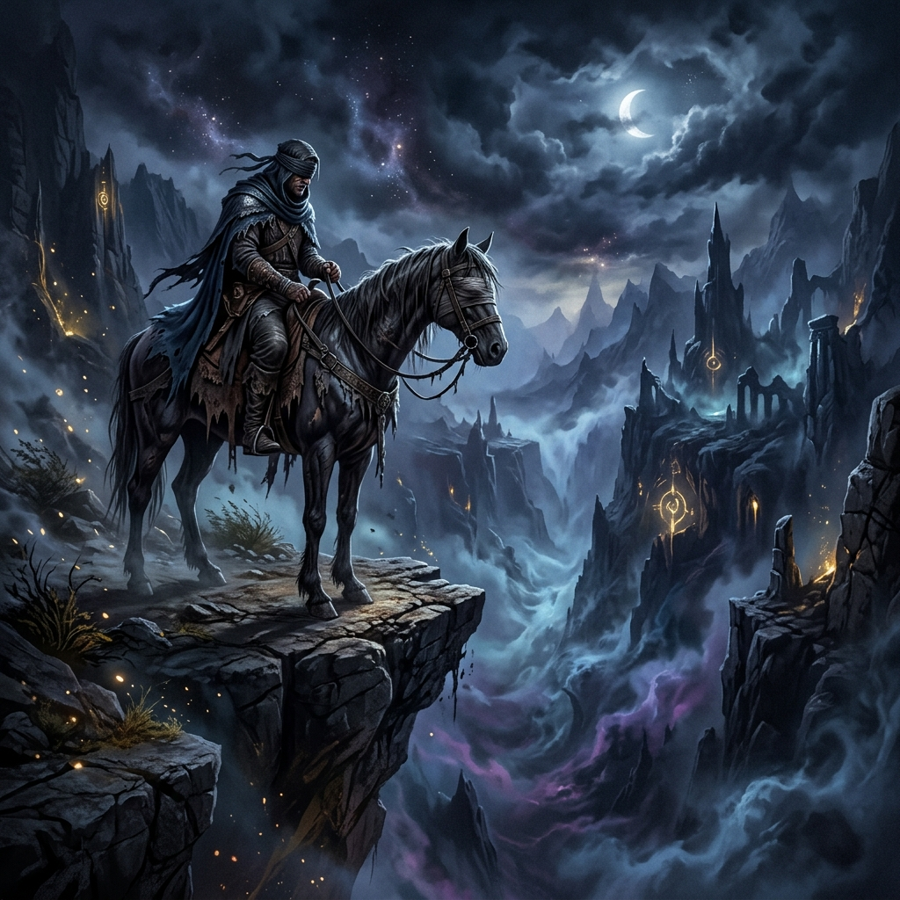
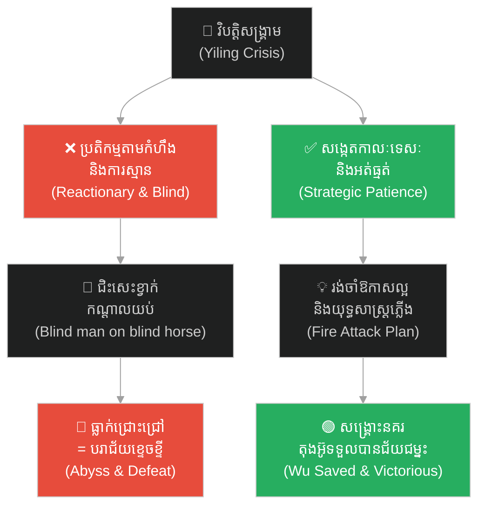
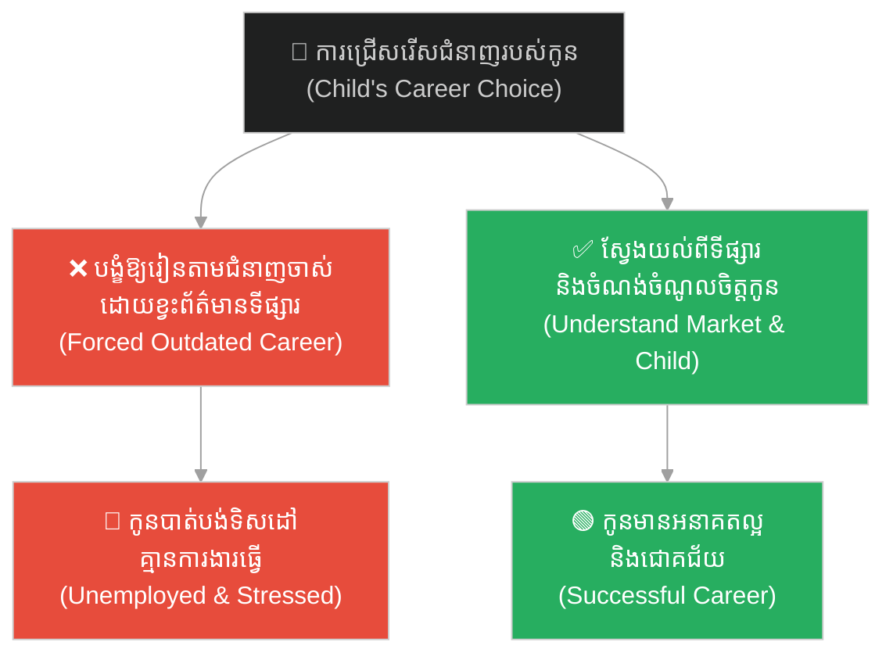
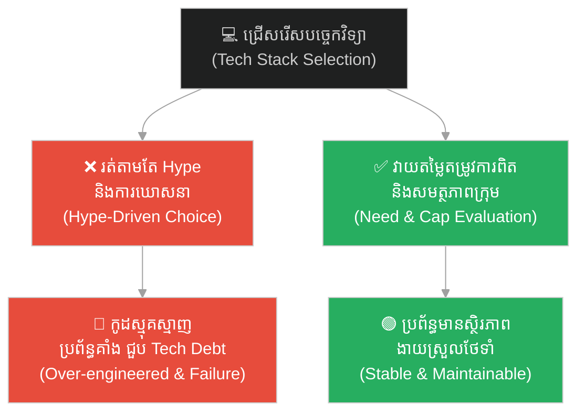
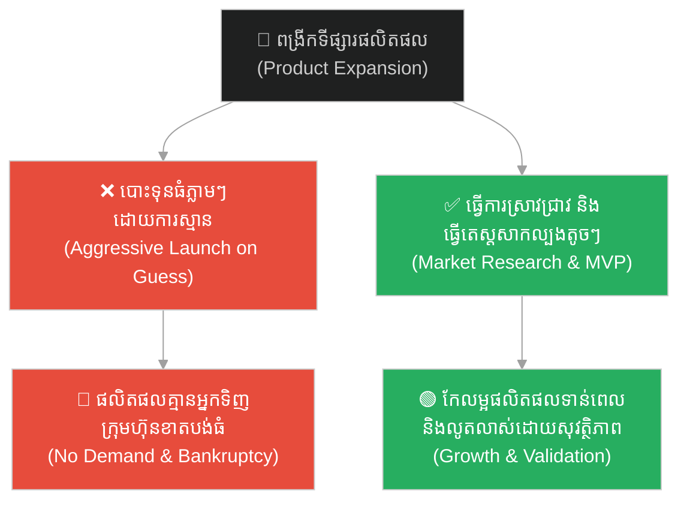
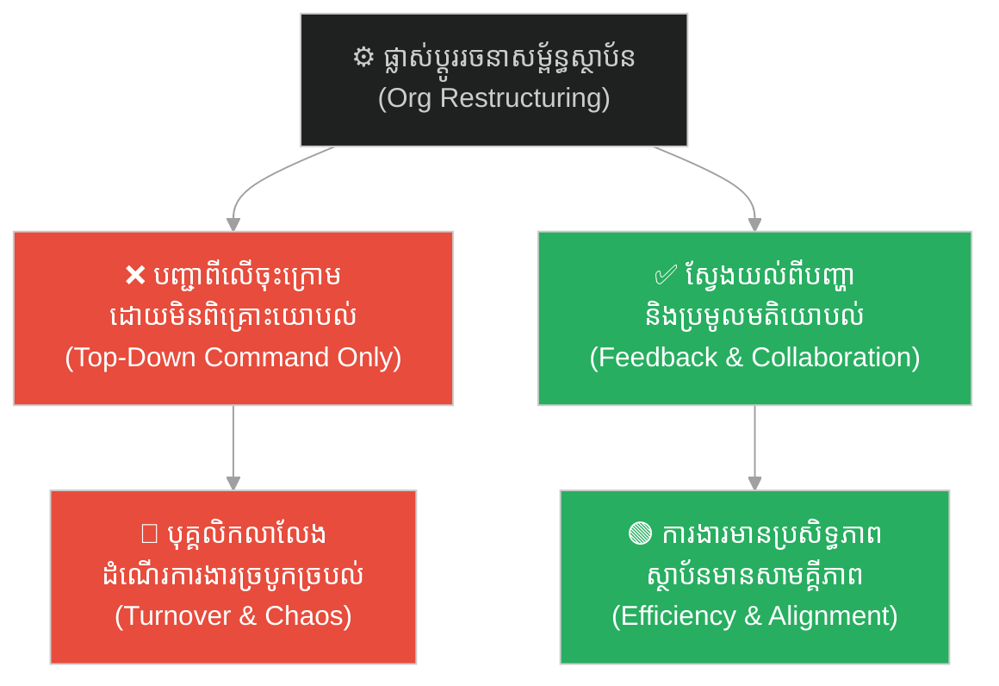
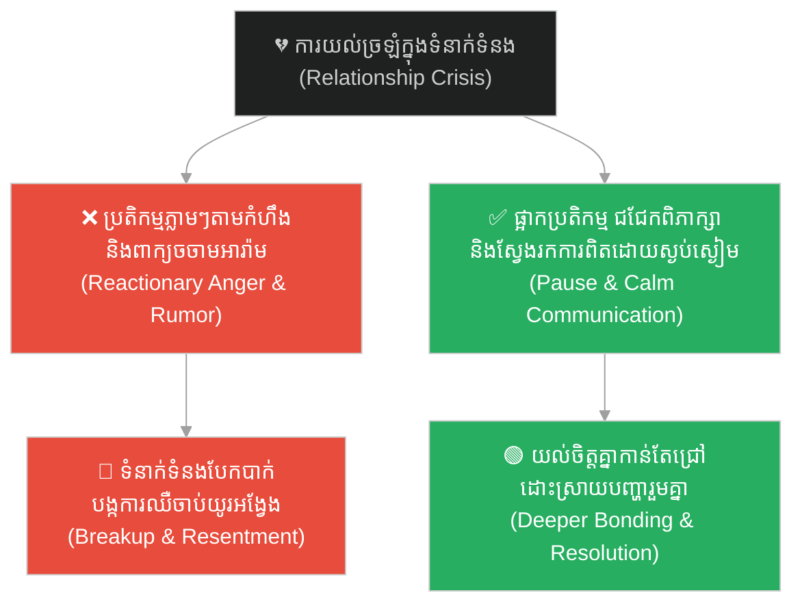
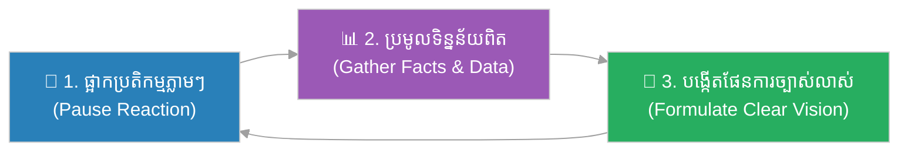

# The Blind Man Riding a Blind Horse (មនុស្សងងឹតជិះសេះខ្វាក់)៖ គ្រោះថ្នាក់នៃការសម្រេចចិត្តដោយងងឹតងងល់ និងការខ្វះចក្ខុវិស័យ (The Danger of Blind Decisions and Lack of Vision)

**Author:** ichamrong  
**Date:** 2026-06-08  
**Tags:** #romance-of-the-three-kingdoms #lu-xun #strategic-patience #decision-making #blindness-to-risk #leadership #critical-thinking #parable  
**Category:** Concepts / Parables  
**Read Time:** ~10 min  

---

## 📌 មាតិកា (Table of Contents)
- [អន្ទាក់ផ្លូវចិត្ត (The Trap)](#0)
- [១. រឿងព្រេងប្រវត្តិសាស្ត្រចិន៖ សង្គ្រាមអ៊ីលីង និងជោគវាសនានៃនគរតុងអ៊ូ (The Historic Legend: The Battle of Yiling and the Fate of Dong Wu)](#1)
  - [ការយល់ច្រឡំរបស់មេទ័ពចាស់ៗ (The Misunderstanding of the Veteran Generals)](#1-1)
- [២. បញ្ហា៖ ភាពងងឹតងងល់ពីរជាន់ និងការមើលរំលងហានិភ័យ (The Issue: Double Blindness and Risk Blindness)](#2)
- [៣. ឧទាហរណ៍ជាក់ស្តែងក្នុងពិភពពិត (Real World Examples)](#3)
  - [ឧទាហរណ៍ទី ១ — កម្រិតស្រាល (គ្រួសារ)៖ ការសម្រេចចិត្តជំនួសកូនដោយខ្វះព័ត៌មាន (The Family: Parental Control Without Listening)](#3-1)
  - [ឧទាហរណ៍ទី ២ — កម្រិតមធ្យម (បច្ចេកទេស)៖ ការរត់តាមបច្ចេកវិទ្យាថ្មីដោយខ្វះការយល់ដឹង (The Dev: Hype-Driven Tech Decisions)](#3-2)
  - [ឧទាហរណ៍ទី ៣ — កម្រិតមធ្យម (ធុរកិច្ច)៖ ការពង្រីកទីផ្សារផលិតផលដោយខ្វះការស្រាវជ្រាវ (The Business: Expansion Without Market Research)](#3-3)
  - [ឧទាហរណ៍ទី ៤ — កម្រិតមធ្យម (សង្គម/គ្រប់គ្រង)៖ ការផ្លាស់ប្ដូររចនាសម្ព័ន្ធដោយខ្វះការពិគ្រោះយោបល់ (The Management: Top-Down Restructuring Without Ground Insights)](#3-4)
  - [ឧទាហរណ៍ទី ៥ — កម្រិតធ្ងន់ (ទំនាក់ទំនង)៖ ការប្រតិកម្មដោះស្រាយវិបត្តិដោយប្រើអារម្មណ៍ឆេវឆាវ (The Relationship: Emotional Impulsiveness in Crisis)](#3-5)
- [៤. ដំណោះស្រាយទូទៅ៖ ក្របខ័ណ្ឌបំភ្លឺផ្លូវ និងរុករកទិន្នន័យ (The General Solution: Illuminating the Path and Data-Driven Navigation)](#4)
- [សេចក្តីសន្និដ្ឋាន (Conclusion)](#5)
- [ឯកសារយោង (References)](#6)
- [Related Posts](#7)

---

## អន្ទាក់ផ្លូវចិត្ត (The Trap)

តើអ្នកធ្លាប់ដើរទៅមុខទាំងមិនច្បាស់លាស់ ដោយគ្រាន់តែធ្វើតាមការស្មាន ឬប្រើប្រាស់វិធីសាស្ត្រដែលលែងមានប្រសិទ្ធភាពដែរឬទេ? នៅក្នុងការដឹកនាំ ការគ្រប់គ្រង និងជីវិតប្រចាំថ្ងៃ ការសម្រេចចិត្តដែលខ្វះព័ត៌មានពិតប្រាកដ និងខ្វះចក្ខុវិស័យច្បាស់លាស់ គឺប្រៀបដូចជាការនាំខ្លួនឯង និងអ្នកដទៃទៅរកគ្រោះថ្នាក់ដ៏ធំធេងដោយមិនដឹងខ្លួន។

Have you ever moved forward blindly, relying purely on assumptions or using outdated methods that no longer work? In leadership, management, and daily life, making decisions without verified data and a clear vision is like leading yourself and others toward disaster without even realizing it.

នេះជា **អន្ទាក់នៃភាពងងឹតងងល់ (Blindness Trap)**៖ នៅពេលអ្នកដឹកនាំមិនដឹងផ្លូវ (មនុស្សងងឹត) ពឹងផ្អែកលើឧបករណ៍ ឬជំនួយការដែលគ្មានសមត្ថភាព (សេះខ្វាក់) ធ្វើដំណើរក្នុងស្ថានភាពស្មុគស្មាញ និងគ្រោះថ្នាក់ (យប់ងងឹត) លទ្ធផលចុងក្រោយគឺការធ្លាក់ចូលទៅក្នុងមហន្តរាយ (ជ្រោះជ្រៅ)។

This is the **Blindness Trap**: when a decision-maker who lacks direction (a blind rider) relies on tools or advisors who lack capability (a blind horse) to navigate complex and dangerous situations (midnight), the inevitable result is falling into disaster (a deep abyss).

---

## ១. រឿងព្រេងប្រវត្តិសាស្ត្រចិន៖ សង្គ្រាមអ៊ីលីង និងជោគវាសនានៃនគរតុងអ៊ូ (The Historic Legend: The Battle of Yiling and the Fate of Dong Wu)

នៅក្នុងប្រលោមលោកប្រវត្តិសាស្ត្រ «សាមកុក» (Romance of the Three Kingdoms) បន្ទាប់ពីមេទ័ពធំ ក្វាន់ អ៊ូ (Guan Yu) ត្រូវបានកងទ័ពនគរតុងអ៊ូ (Dong Wu) ចាប់ខ្លួន និងប្រហារជីវិត លីវ ប៉ី (Liu Bei) អធិរាជនៃនគរស៊ូហាន (Shu Han) ត្រូវបានគ្របដណ្ដប់ដោយកំហឹង និងសេចក្ដីសោកសង្រេងយ៉ាងខ្លាំង។ គាត់បានបដិសេធរាល់ការទាស់ទែង និងការដាស់តឿនពីទីប្រឹក្សា ជូកឺលៀង (ឬ ខុងបេង / Zhuge Liang) និងមេទ័ព ចៅ យុន (Zhao Yun) រួចដឹកនាំកងទ័ពធំរហូតដល់ ៧០០,០០០ នាក់ វាយលុកចូលទឹកដីតុងអ៊ូដើម្បីសងសឹក។

In the historical classic *Romance of the Three Kingdoms*, after the legendary general Guan Yu was captured and executed by Dong Wu, Liu Bei, the Emperor of Shu Han, was consumed by rage and grief. Ignoring the counsel of Zhuge Liang and Zhao Yun, he launched a massive expedition of 700,000 troops to invade Dong Wu for revenge.

ស្ថានភាពរបស់នគរតុងអ៊ូស្ថិតក្នុងភាពចលាចល និងគ្រោះថ្នាក់បំផុត។ ក្នុងកាលៈទេសៈដ៏ធ្ងន់ធ្ងរនេះ ម្ចាស់នគរតុងអ៊ូ ស៊ុន ឈួន (Sun Quan) បានសម្រេចចិត្តតែងតាំង លូ ស៊ិន (Lu Xun) ដែលជាបញ្ញវន្តវ័យក្មេង និងមិនសូវមានឈ្មោះល្បីល្បាញក្នុងសមរភូមិ ឱ្យធ្វើជាមេទ័ពធំ (Grand Commander) ដើម្បីដឹកនាំកងទ័ពទាំងអស់ទប់ទល់នឹងលីវ ប៉ី។

Dong Wu was plunged into chaos and extreme danger. In this desperate hour, Sun Quan, the ruler of Wu, made the bold decision to appoint Lu Xun—a young, relatively untested scholar-general—as the Grand Commander to lead all Wu forces against Liu Bei's massive army.

### ការយល់ច្រឡំរបស់មេទ័ពចាស់ៗ (The Misunderstanding of the Veteran Generals)

ការតែងតាំងនេះបានធ្វើឱ្យមេទ័ពចាស់ៗ និងមានបទពិសោធន៍ជាច្រើនរបស់តុងអ៊ូ មានការខឹងសម្បារ និងមិនពេញចិត្តយ៉ាងខ្លាំង។ ពួកគេមើលងាយ លូ ស៊ិន ថាជា «សិស្សសាលាទន់ជ្រាយ» ដែលគ្មានសមត្ថភាពដឹកនាំសង្គ្រាមធំឡើយ។

This appointment angered the veteran generals of Wu, who had fought alongside Sun Quan's father and brother. They looked down on Lu Xun, dismissing him as a "weak, bookish scholar" who lacked the experience to command in a major war.

នៅពេលលីវ ប៉ី វាយសម្រុកចូលមក លូ ស៊ិន បានបញ្ជាឱ្យកងទ័ពតុងអ៊ូដកថយជាបន្តបន្ទាប់ និងបោះជំរំការពារខ្លួនយ៉ាងរឹងមាំ ដោយបដិសេធមិនព្រមចេញច្បាំងទល់មុខជាដាច់ខាតអស់រយៈពេលជាច្រើនខែ។ ការណ៍នេះធ្វើឱ្យមេទ័ពចាស់ៗគិតថា លូ ស៊ិន ជាមនុស្សកំសាក។ ពួកគេបាននាំគ្នារអ៊ូរទាំដោយក្តីអស់សង្ឃឹមថា៖
> **«មេទ័ពវ័យក្មេងម្នាក់នេះគ្មានយុទ្ធសាស្ត្រអ្វីទាល់តែសោះ ការដកថយរបស់គេគឺកំពុងនាំពួកយើងទៅរកសេចក្តីវិនាសហើយ។ នេះមិនខុសពីមនុស្សងងឹតជិះសេះខ្វាក់ ធ្វើដំណើរនៅកណ្ដាលយប់ឆ្ពោះទៅរកជ្រោះជ្រៅនោះឡើយ! ទឹកដីដ៏ល្អរបស់តុងអ៊ូអស់សង្ឃឹមហើយ...»**

When Liu Bei's forces advanced, Lu Xun ordered the Wu army to retreat and hold defensive positions, strictly forbidding any head-on engagement for months. The veteran generals interpreted this strategic retreat as cowardice. They complained in despair:
> *"This young commander has no strategy; his retreat is leading us to destruction. This is no different from a blind man riding a blind horse, in the middle of the night approaching a deep abyss! The beautiful land of Dong Wu has lost all hope now..."*

ប៉ុន្តែ តាមពិតទៅ លូ ស៊ិន មិនបាន «ខ្វាក់ភ្នែក» ដូចការគិតរបស់ពួកគេឡើយ។ ផ្ទុយទៅវិញ គឺលីវ ប៉ី និងមេទ័ពចាស់ៗទាំងនោះទៅវិញទេដែលកំពុងខ្វាក់ភ្នែក។ លូ ស៊ិន បានមើលឃើញច្បាស់ថា កងទ័ពរបស់លីវ ប៉ី មានស្មារតីចម្បាំងខ្ពស់ និងមានកម្លាំងខ្លាំងក្លា ដូច្នេះការប្រឈមមុខទល់មុខនឹងនាំឱ្យតុងអ៊ូទទួលបរាជ័យភ្លាមៗ។ គាត់បានរង់ចាំឱ្យកងទ័ពស៊ូហានអស់កម្លាំង និងធុញទ្រាន់នឹងអាកាសធាតុក្ដៅខ្លាំងនៃរដូវក្ដៅ។

However, Lu Xun was not "blind" as they believed. In fact, it was Liu Bei and the complaining generals who were blind to the deeper tactical reality. Lu Xun saw clearly that the Shu army was massive and highly motivated; a head-on battle would destroy Wu. He chose to wait for the hot summer to drain their energy and lower their morale.

ដូចការរំពឹងទុក ដើម្បីចៀសវាងកម្ដៅថ្ងៃ លីវ ប៉ី បានបញ្ជាឱ្យកងទ័ពផ្លាស់ប្ដូរជំរំទៅបោះនៅក្នុងព្រៃក្រាស់ៗលាតសន្ធឹងប្រវែងជាង ៧០០ លី (ប្រហែល ៣៥០ គីឡូម៉ែត្រ) តាមដងទន្លេ។ នៅពេលឱកាសល្អមកដល់ លូ ស៊ិន បានបញ្ជាឱ្យប្រើប្រាស់យុទ្ធសាស្ត្រ «វាយប្រហារដោយភ្លើង» (Fire Attack) ដុតកម្ទេចជំរំកងទ័ពលីវ ប៉ី ស្ទើរតែទាំងស្រុង ជួយសង្គ្រោះនគរតុងអ៊ូពីមហន្តរាយ និងទទួលបានជ័យជម្នះដ៏អស្ចារ្យបំផុតក្នុងប្រវត្តិសាស្ត្រ។

Eventually, to escape the summer heat, Liu Bei made the critical mistake of moving his camps into the dense forest, stretching over 700 li (about 350 kilometers). When the winds turned, Lu Xun launched a devastating fire attack, burning Liu Bei's camps to ashes, saving Dong Wu from collapse, and securing one of the most famous victories in military history.

---

## ២. បញ្ហា៖ ភាពងងឹតងងល់ពីរជាន់ និងការមើលរំលងហានិភ័យ (The Issue: Double Blindness and Risk Blindness)

រឿងព្រេងនេះបង្ហាញពីការប្រឈមមុខគ្នារវាង **«ភាពងងឹតងងល់»** និង **«ចក្ខុវិស័យយុទ្ធសាស្ត្រ»**៖

The parable of the blind rider and the blind horse reveals the contrast between ignorance and strategic vision:

- **ភាពងងឹតងងល់ពីរជាន់ (Double Blindness)៖** កើតឡើងនៅពេលដែលអ្នកដឹកនាំ ឬអ្នកធ្វើសេចក្តីសម្រេចចិត្ត ខ្វះចំណេះដឹង ឬព័ត៌មានគ្រប់គ្រាន់ (មនុស្សងងឹត) ហើយថែមទាំងប្រើប្រាស់វិធីសាស្ត្រ ជំនួយការ ឬទិន្នន័យដែលមិនគួរឱ្យទុកចិត្ត (សេះខ្វាក់)។ នៅពេលកត្តាទាំងពីរនេះរួមបញ្ចូលគ្នា វានឹងបង្កើតឱ្យមានភាពបរាជ័យជាប្រព័ន្ធ។
- **ការមើលឃើញតែផ្ទៃខាងក្រៅ (Surface Perception)៖** មេទ័ពចាស់ៗរបស់តុងអ៊ូមើលឃើញតែការដកថយ និងភាពក្មេងខ្ចីរបស់ លូ ស៊ិន (low-context) ដោយមិនបានយល់ពីផែនការស៊ីជម្រៅឡើយ។ ពួកគេប្រតិកម្មទៅនឹងបញ្ហាចំពោះមុខដោយអារម្មណ៍ឆេវឆាវ។
- **ការខ្វាក់ភ្នែកដោយសារអំនួត (Overconfidence Blindness)៖** លីវ ប៉ី បានខ្វាក់ភ្នែកដោយសារកំហឹង និងបទពិសោធន៍ចាស់ៗរបស់ខ្លួន។ គាត់គិតថាកងទ័ពខ្លួនមានចំនួនច្រើន គ្មាននរណាហ៊ានតតាំង ជឿជាក់លើខ្លួនឯងហួសហេតុ រហូតដល់បោះជំរំក្នុងព្រៃដែលជាចំណុចខ្សោយដ៏គ្រោះថ្នាក់បំផុត។

**ភាពខុសគ្នាសំខាន់៖** មនុស្សដែលគ្មានទិន្នន័យពិតប្រាកដ និងគ្មានការត្រៀមលក្ខណៈ តែងតែគិតថាខ្លួនកំពុងដើរលើផ្លូវត្រូវ (Illusion of Competence) រហូតដល់ពួកគេធ្លាក់ចូលទៅក្នុងជ្រោះជ្រៅទើបដឹងខ្លួន។

**The crucial difference:** those without verified data and proper preparation often suffer from the *illusion of competence*, believing they are on the right path until they plunge into the deep abyss.

---

## ៣. ឧទាហរណ៍ជាក់ស្តែងក្នុងពិភពពិត (Real World Examples)

---

### ឧទាហរណ៍ទី ១ — កម្រិតស្រាល (គ្រួសារ)៖ ការសម្រេចចិត្តជំនួសកូនដោយខ្វះព័ត៌មាន (The Family: Parental Control Without Listening)

**ស្ថានភាព៖** ឪពុកម្តាយខ្លះបង្ខំឱ្យកូនរៀនជំនាញធនាគារ ឬជំនាញចាស់ៗដែលធ្លាប់ជោគជ័យកាលពី ២០ ឆ្នាំមុន ដោយមិនបានសិក្សាពីនិន្នាការបច្ចេកវិទ្យា និងបញ្ញាសិប្បនិម្មិត (AI) នាពេលបច្ចុប្បន្នឡើយ។
**សកម្មភាពបែបងងឹតងងល់ (Blind Action)៖** ប្រើប្រាស់គំនិតចាស់របស់ខ្លួន (មនុស្សងងឹត) និងវិធីសាស្ត្រអប់រំបែបបុរាណ (សេះខ្វាក់) ទៅកំណត់អនាគតកូនក្នុងយុគសម័យឌីជីថល (យប់ងងឹត)។
**លទ្ធផល៖** កូនរៀនចប់គ្មានការងារធ្វើ ឬត្រូវប្រឈមនឹងការជំនួសដោយបច្ចេកវិទ្យាថ្មី (ធ្លាក់ចូលជ្រោះជ្រៅ)។

---

### ឧទាហរណ៍ទី ២ — កម្រិតមធ្យម (បច្ចេកទេស)៖ ការរត់តាមបច្ចេកវិទ្យាថ្មីដោយខ្វះការយល់ដឹង (The Dev: Hype-Driven Tech Decisions)

**ស្ថានភាព៖** ក្រុមការងារអភិវឌ្ឍន៍កម្មវិធីកុំព្យូទ័រ (Software Dev Team) បានសម្រេចចិត្តផ្លាស់ប្ដូរស្ថាបត្យកម្មប្រព័ន្ធទាំងមូលទៅជា Microservices និងប្រើប្រាស់ Database បច្ចេកវិទ្យាចុងក្រោយបំផុត គ្រាន់តែដោយសារវាជាការពេញនិយម (Hype) លើអ៊ីនធឺណិត។
**សកម្មភាពបែបងងឹតងងល់ (Blind Action)៖** វិស្វករវ័យក្មេងចង់សាកល្បងបច្ចេកវិទ្យាថ្មី (មនុស្សងងឹត) ដោយមិនបានវាយតម្លៃពីភាពស៊ីសង្វាក់គ្នានៃប្រព័ន្ធ និងសមត្ថភាពពិតប្រាកដរបស់ក្រុមការងារ (សេះខ្វាក់)។
**លទ្ធផល៖** ប្រព័ន្ធជួបប្រទះបញ្ហាស្មុគស្មាញដ៏ធំ (Latency, Concurrency, and Complexity) ដែលក្រុមការងារមិនអាចដោះស្រាយបាន ធ្វើឱ្យគម្រោងត្រូវពន្យារពេល និងខាតបង់ថវិកាយ៉ាងច្រើន (ធ្លាក់ចូលជ្រោះជ្រៅ)។

---

### ឧទាហរណ៍ទី ៣ — កម្រិតមធ្យម (ធុរកិច្ច)៖ ការពង្រីកទីផ្សារផលិតផលដោយខ្វះការស្រាវជ្រាវ (The Business: Expansion Without Market Research)

**ស្ថានភាព៖** ស្ថាបនិកក្រុមហ៊ុន Startup ម្នាក់សម្រេចចិត្តបោះទុនយ៉ាងច្រើនដើម្បីបើកសាខាថ្មី ឬនាំចូលផលិតផលថ្មីមួយមកលក់ ដោយគ្រាន់តែយល់ឃើញផ្ទាល់ខ្លួនថា «ផលិតផលនេះល្អ និងប្លែក»។
**សកម្មភាពបែបងងឹតងងល់ (Blind Action)៖** ការជឿជាក់លើវិចារណញាណគ្មានមូលដ្ឋាន (មនុស្សងងឹត) គួបផ្សំនឹងការប្រើប្រាស់វិធីសាស្ត្រលក់បែបសន្មត (សេះខ្វាក់) ក្នុងទីផ្សារថ្មីដែលមិនទាន់ស្គាល់ច្បាស់ (យប់ងងឹត)។
**លទ្ធផល៖** ទីផ្សារគ្មានតម្រូវការសម្រាប់ផលិតផលនោះឡើយ ធ្វើឱ្យក្រុមហ៊ុនត្រូវបិទទ្វារសាខានោះទៅវិញ និងប្រឈមនឹងការក្ស័យធន (ធ្លាក់ចូលជ្រោះជ្រៅ)។

---

### ឧទាហរណ៍ទី ៤ — កម្រិតមធ្យម (សង្គម/គ្រប់គ្រង)៖ ការផ្លាស់ប្ដូររចនាសម្ព័ន្ធដោយខ្វះការពិគ្រោះយោបល់ (The Management: Top-Down Restructuring Without Ground Insights)

**ស្ថានភាព៖** នាយកប្រតិបត្តិ (CEO) ថ្មីម្នាក់សម្រេចចិត្តរៀបចំរចនាសម្ព័ន្ធការងាររបស់ក្រុមហ៊ុនឡើងវិញទាំងស្រុង ដើម្បីតម្រូវតាមទ្រឹស្ដីគ្រប់គ្រងដែលខ្លួនបានរៀនពីសាលា ដោយមិនបានចុះសួរនាំអំពីបញ្ហា និងរបៀបរបបការងារពិតប្រាកដរបស់បុគ្គលិកថ្នាក់ក្រោមឡើយ។
**សកម្មភាពបែបងងឹតងងល់ (Blind Action)៖** នាយកប្រតិបត្តិដែលខ្វះការយល់ដឹងពីវប្បធម៌ក្រុមហ៊ុន (មនុស្សងងឹត) ប្រើប្រាស់ទ្រឹស្ដីរឹងកំព្រឹង (សេះខ្វាក់) មកផ្លាស់ប្ដូរដំណើរការការងារស្មុគស្មាញ (យប់ងងឹត)។
**លទ្ធផល៖** ដំណើរការការងារត្រូវបានរអាក់រអួល បុគ្គលិកដែលមានសមត្ថភាពសំខាន់ៗនាំគ្នាលាលែងពីការងារ ធ្វើឱ្យផលិតភាពការងារធ្លាក់ចុះយ៉ាងធ្ងន់ធ្ងរ (ធ្លាក់ចូលជ្រោះជ្រៅ)។

---

### ឧទាហរណ៍ទី ៥ — កម្រិតធ្ងន់ (ទំនាក់ទំនង)៖ ការប្រតិកម្មដោះស្រាយវិបត្តិដោយប្រើអារម្មណ៍ឆេវឆាវ (The Relationship: Emotional Impulsiveness in Crisis)

**ស្ថានភាព៖** នៅពេលមានពាក្យចចាមអារ៉ាម ឬមានការយល់ច្រឡំកើតឡើងក្នុងគ្រួសារ ឬទំនាក់ទំនង ដៃគូម្ខាងចាប់ផ្ដើមប្រតិកម្មភ្លាមៗដោយកំហឹង ស្រែកគំហក និងសម្រេចចិត្តចែកផ្លូវគ្នាដោយមិនព្រមស្ដាប់ការពន្យល់ ឬការផ្ទៀងផ្ទាត់ព័ត៌មានឡើយ។
**សកម្មភាពបែបងងឹតងងល់ (Blind Action)៖** ការប្រើប្រាស់កំហឹងឆេវឆាវ (មនុស្សងងឹត) និងការសន្និដ្ឋានដោយគ្មានការផ្ទៀងផ្ទាត់ (សេះខ្វាក់) មកដោះស្រាយវិបត្តិទំនាក់ទំនង (យប់ងងឹត)។
**លទ្ធផល៖** ទំនាក់ទំនងដ៏ល្អដែលសាងសង់មកជាច្រើនឆ្នាំត្រូវរលាយសាបសូន្យភ្លាមៗ បន្សល់ទុកនូវវិប្បដិសារីយ៉ាងធំធេង (ធ្លាក់ចូលជ្រោះជ្រៅ)។

---

## ៤. ដំណោះស្រាយទូទៅ៖ ក្របខ័ណ្ឌបំភ្លឺផ្លូវ និងរុករកទិន្នន័យ (The General Solution: Illuminating the Path and Data-Driven Navigation)

ដើម្បីចៀសវាងការធ្លាក់ចូលក្នុងអន្ទាក់ «មនុស្សងងឹតជិះសេះខ្វាក់» ចូរអនុវត្តតាមក្របខ័ណ្ឌ ៣ ជំហានខាងក្រោម៖

To avoid falling into the "blind man on a blind horse" trap, implement this 3-step navigation framework:

1. **ផ្អាកការប្រតិកម្មដោយអារម្មណ៍ និងការស្មាន (Pause Emotional Reaction and Guesswork)៖** មុននឹងសម្រេចចិត្តរឿងធំ ចូរឈប់ប្រតិកម្មតាមអារម្មណ៍ កំហឹង ឬការភ័យខ្លាច។ ភាពអត់ធ្មត់យុទ្ធសាស្ត្រ (Strategic Patience) ដូចជា លូ ស៊ិន គឺជាជំហានដំបូងដើម្បីទទួលបានភាពស្ងប់ស្ងៀមនៃបញ្ញា។ *Before making major decisions, pause. Strategic patience allows you to regain clarity and emotional regulation.*
2. **បំភ្លឺផ្លូវដោយប្រមូលទិន្នន័យ និងការពិត (Gather Facts and Verify Data)៖** កុំធ្វើដំណើរនៅកណ្ដាលយប់ងងឹតដោយគ្មានចង្កៀង។ ចូរស្វែងរក និងផ្ទៀងផ្ទាត់ព័ត៌មានឱ្យបានគ្រប់ជ្រុងជ្រោយ (Data-Driven Decisions)។ ជំនួសឱ្យការប្រើប្រាស់ «សេះខ្វាក់» (ការស្មាន) ចូរប្រើប្រាស់ឧបករណ៍វាស់វែង និងមតិយោបល់ពិតប្រាកដពីអ្នកជំនាញ ឬស្ថានភាពជាក់ស្ដែង។ *Do not navigate in the dark. Gather comprehensive, verified data. Instead of relying on assumptions, use analytics, expert advice, and ground-level feedback.*
3. **បង្កើតចក្ខុវិស័យ និងយុទ្ធសាស្ត្រផ្អែកលើកាលៈទេសៈពិត (Formulate a Context-Aware Strategy)៖** រៀបចំផែនការដែលស៊ីសង្វាក់គ្នានឹងស្ថានភាពជាក់ស្ដែង មិនមែនផ្អែកលើតែទ្រឹស្ដីរឹងកំព្រឹង ឬបទពិសោធន៍ចាស់គំរិលនោះឡើយ។ ចូរត្រៀមខ្លួនសម្រាប់សេណារីយ៉ូផ្សេងៗ (Scenario Planning) និងវាយតម្លៃហានិភ័យឱ្យបានហ្មត់ចត់បំផុតមុននឹងចាប់ផ្ដើមធ្វើសកម្មភាព។ *Align your plan with the current environment rather than rigid theories or outdated experiences. Perform scenario planning and rigorous risk analysis before taking action.*

---

## សេចក្តីសន្និដ្ឋាន (Conclusion)

> **«លីវ ប៉ី គិតថាកងទ័ពខ្លួនមានចំនួនច្រើន អាចកម្ទេចតុងអ៊ូបានយ៉ាងងាយ តែបែរជាបោះជំរំ ៧០០ លី នៅក្នុងព្រៃក្រាស់ដែលងាយនឹងរងការវាយប្រហារដោយភ្លើង។ នេះហើយជាមនុស្សងងឹតជិះសេះខ្វាក់ពិតប្រាកដ។ យុទ្ធសាស្ត្រដែលខ្វះព័ត៌មាន និងចក្ខុវិស័យ នឹងដឹកនាំអ្នកទៅរកសេចក្តីវិនាស ទោះបីជាអ្នកមានកម្លាំងខ្លាំងប៉ុណ្ណាក៏ដោយ។»**
> 
> **"Liu Bei believed his massive army made him invincible, yet he stretched his forces across 700 li of dense forest, vulnerable to a simple fire attack. This was the true blind man on a blind horse. A strategy lacking information and vision will lead to ruin, no matter how powerful you think you are."**

លើកក្រោយ មុនពេលអ្នកសម្រេចចិត្តបោះទុន បង្ខំកូន ផ្លាស់ប្ដូរស្ថាបត្យកម្មកូដ ឬប្រតិកម្មនឹងបញ្ហាក្នុងទំនាក់ទំនង — ចូរឈប់សិន។ ចូរសួរខ្លួនឯងថា៖ **«តើខ្ញុំកំពុងដើរតួជាមនុស្សងងឹតជិះសេះខ្វាក់នៅកណ្ដាលយប់មែនទេ? តើខ្ញុំមានចង្កៀងបំភ្លឺផ្លូវ និងចក្ខុវិស័យច្បាស់លាស់ហើយឬនៅ?»** ការដឹងខ្លួនជាមុន គឺជាការចាប់ផ្ដើមនៃការរួចផុតពីអន្ទាក់មហន្តរាយ។

Next time you are about to invest capital, force a career path, rewrite system architecture, or react to a relationship crisis—stop. Ask yourself: *"Am I acting like a blind man riding a blind horse in the dark? Do I have the light of verified data and a clear vision?"* Awareness is the first step to escaping disaster.

---

## ឯកសារយោង (References)

* **Luo Guanzhong** — *Romance of the Three Kingdoms* (三国演义), 14th century. ជំពូកទី ៨៣ និង ៨៤៖ សង្គ្រាមអ៊ីលីង និងយុទ្ធសាស្ត្រភ្លើងដុតជំរំ ៧០០ លីរបស់ លូ ស៊ិន (陆逊营烧七百里).
* **Liu Yiqing** — *Shishuo Xinyu* (世说新语), 5th century. Origin of the idiom "盲人骑瞎马，夜半临深池" (A blind man riding a blind horse, approaching a deep pond at midnight).
* **Daniel Kahneman** — *Thinking, Fast and Slow* (2011), discussing the illusion of validity and overconfidence bias.
* **Xun Kuang (Xunzi)** — *Xunzi* (荀子), 3rd century BCE. Philosophical discussions on ignorance and blind action.

---

## Related Posts

### ⚔️ The Three Kingdoms Strategy Series (ស៊េរីយុទ្ធសាស្ត្រសាមកុក)

* **[20 Cao Cao's Short Song & the Heart of Talent](./20-cao-cao-short-song-and-the-heart-of-talent.md)** — ការទាក់ទាញធនធានមនុស្ស និងភាពដឹកនាំ (Cao Cao's recruiting strategy).
* **[36 The Empty City Strategy](./36-the-empty-city-strategy.md)** — ចិត្តសាស្ត្រយុទ្ធសាស្ត្រ និងការគ្រប់គ្រងហានិភ័យ (Sima Yi vs. Zhuge Liang and risk management).
* **[65 Sun Tzu & the King of Wu](./65-sun-tzu-and-the-king-of-wu.md)** — វិន័យ និងការកសាងប្រព័ន្ធការងារ (Sun Tzu's training methods).
* **[66 Han Xin & the River of No Return](./66-han-xin-and-the-river-of-no-return.md)** — ការបង្កើតកាលៈទេសៈបង្ខំដើម្បីជ័យជម្នះ (Han Xin's battlefield positioning).
* **[258 The Blind Man Riding a Blind Horse](./258-the-blind-man-riding-a-blind-horse.md)** — គ្រោះថ្នាក់នៃការសម្រេចចិត្តដោយងងឹតងងល់ (Blind decisions vs. strategic patience).

---

## Related

- [💡 Concepts README](../README.md)
- [📚 Main Repository README](../../../README.md)
- [Management & SDLC](../../management/README.md)
- [Productivity & Workflow](../../productivity/README.md)
