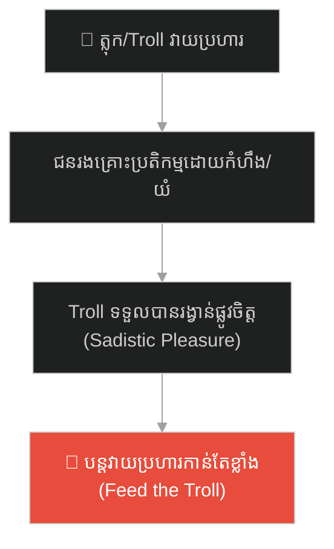
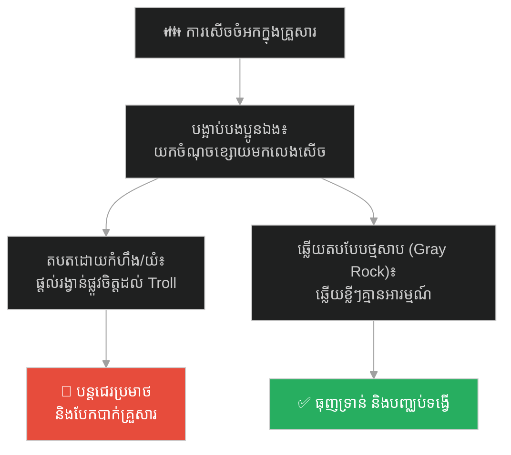
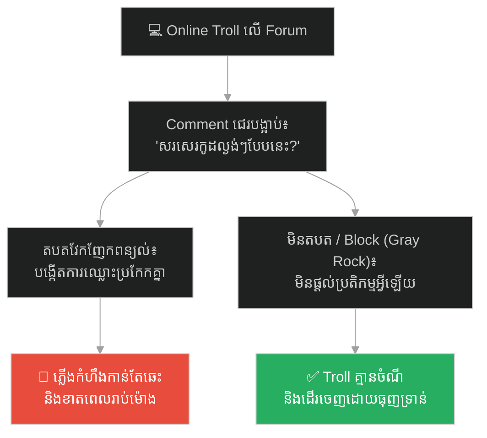
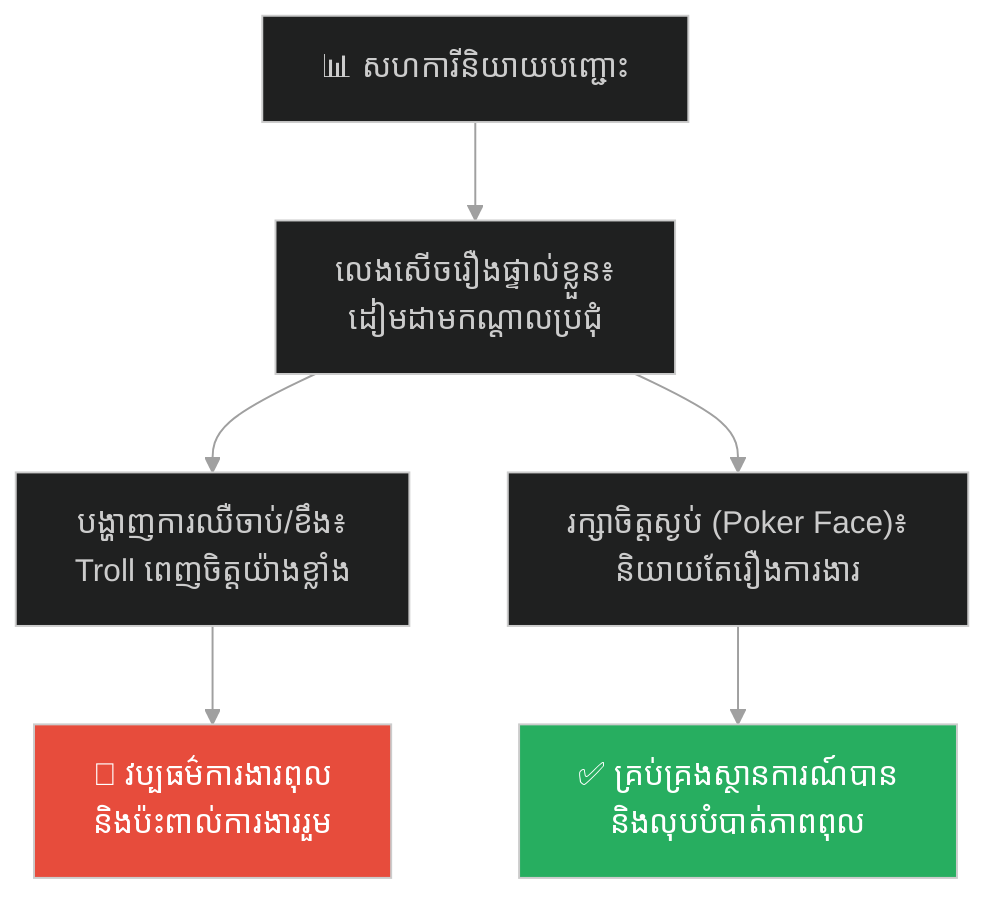
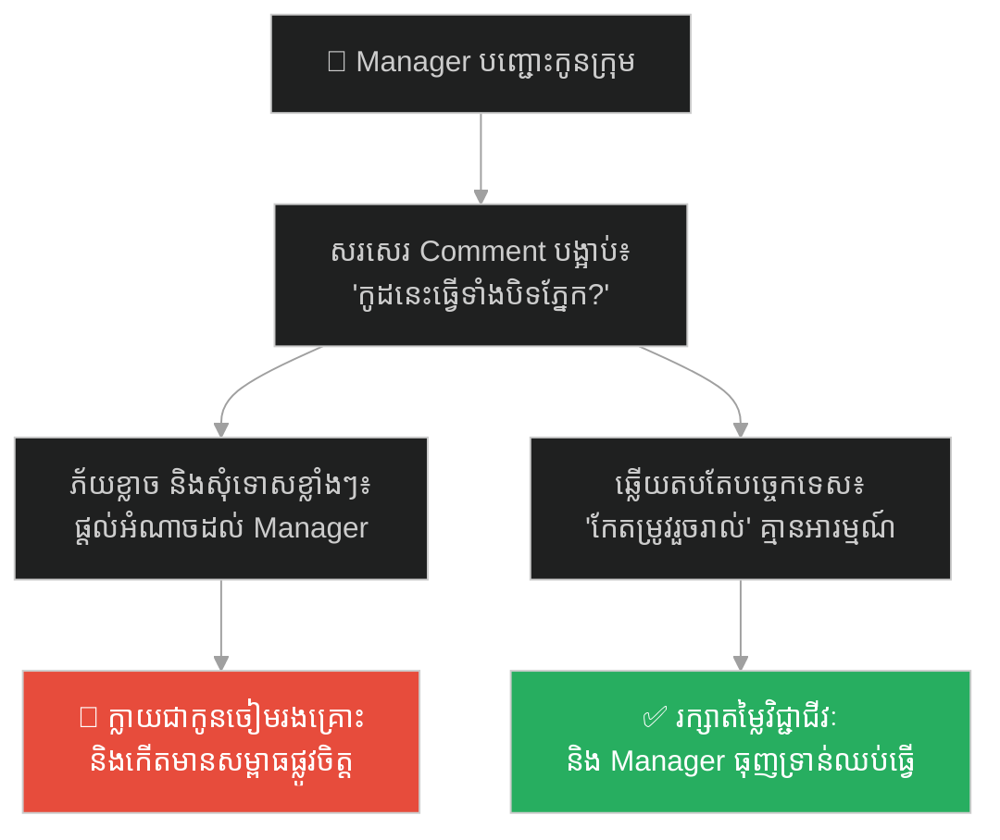
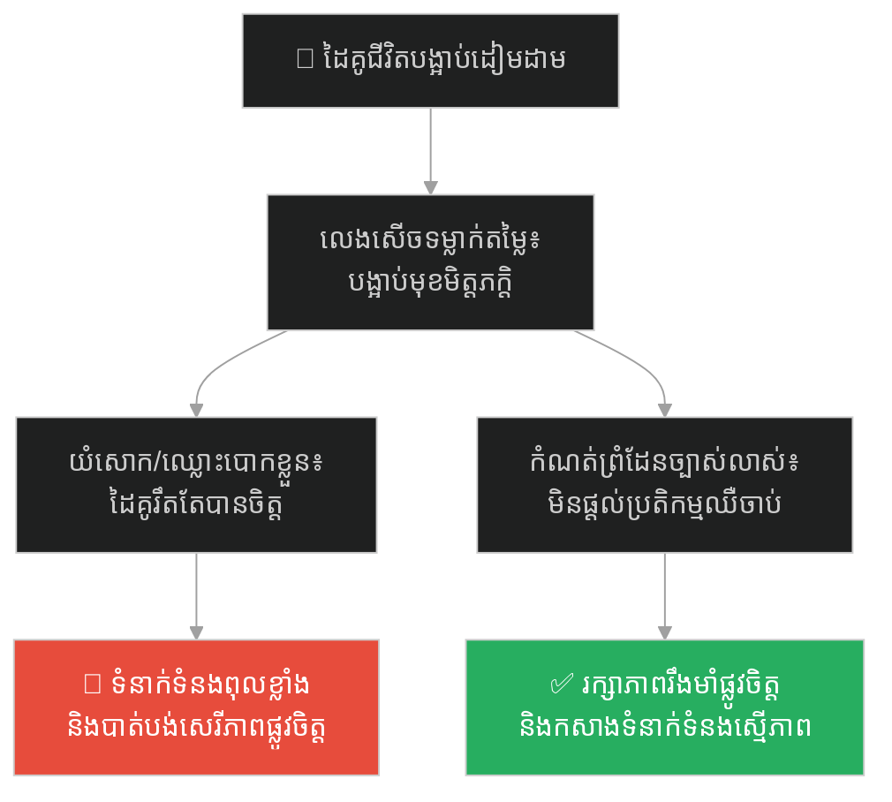
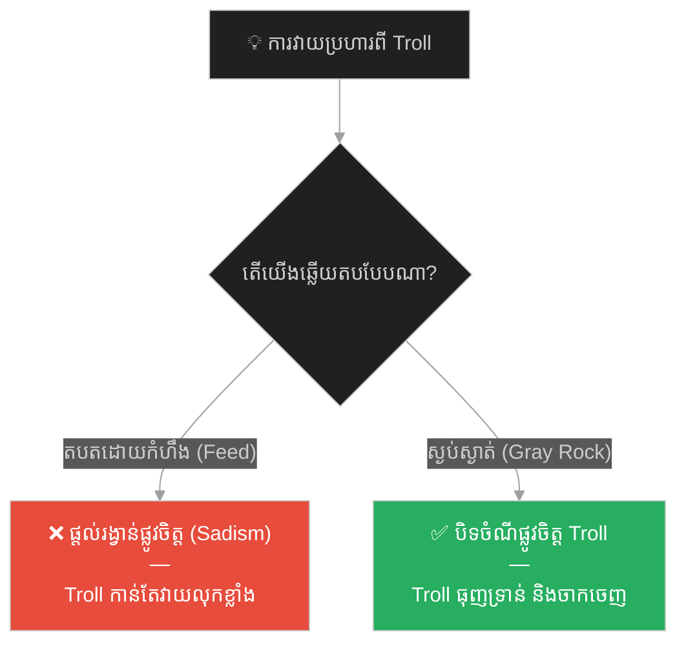

# The Court Jester Who Fed on Tears (ត្លុកព្រះបរមរាជវាំងដែលចិញ្ចឹមជីវិតដោយទឹកភ្នែក)៖ គ្រោះថ្នាក់នៃជំងឺ Everyday Sadism និងវិធីសាស្ត្រដុំថ្មសាប

**Author:** ichamrong  
**Date:** 2026-05-27  
**Tags:** #everyday-sadism #online-trolls #toxic-culture #psychology #empathy-deficit #cyberbullying #gray-rock  
**Category:** Concepts / Parables  
**Read Time:** ~15 min  

---

## 📌 មាតិកា (Table of Contents)
- [អន្ទាក់ផ្លូវចិត្ត (The Trap)](#អន្ទាក់ផ្លូវចិត្ត-the-trap)
- [១. រឿងព្រេង៖ ត្លុកពាក់របាំងមុខ កាអែលឡេន (The Legend of Kaelen the Jester)](#1)
  - [លេស "គ្រាន់តែលេងសើចសោះ" (The "Just Joking" Excuse)](#1-1)
  - [វិធីសាស្ត្រដុំថ្មសាប របស់ព្រះមហាក្សត្រិយានី (The Queen's Gray Rock Method)](#1-2)
- [២. បញ្ហា៖ ជំងឺសប្បាយលើគំនរទុក្ខអ្នកដទៃ និងអនាមិកភាព (The Issue: Everyday Sadism & Anonymity)](#2)
- [៣. ឧទាហរណ៍ជាក់ស្តែងក្នុងពិភពពិត (Real World Examples)](#3)
  - [ឧទាហរណ៍ទី ១ — កម្រិតស្រាល (គ្រួសារ)៖ ការសើចចំអកក្នុងគ្រួសារ (The Family Bullying & Sibling Jesting)](#3-1)
  - [ឧទាហរណ៍ទី ២ — កម្រិតមធ្យម (បច្ចេកទេស)៖ ការវាយប្រហារលើប្រព័ន្ធអ៊ីនធឺណិត (The Online Forum Troll)](#3-2)
  - [ឧទាហរណ៍ទី ៣ — កម្រិតមធ្យម (ធុរកិច្ច)៖ សហការីនិយាយបញ្ជោះក្នុងកិច្ចប្រជុំ (The Office Meeting Shamer)](#3-3)
  - [ឧទាហរណ៍ទី ៤ — កម្រិតមធ្យម (សង្គម/គ្រប់គ្រង)៖ Manager បញ្ជោះកូនក្រុមជាសាធារណៈ (The Sarcastic Manager)](#3-4)
  - [ឧទាហរណ៍ទី ៥ — កម្រិតធ្ងន់ (ទំនាក់ទំនង)៖ ដៃគូជីវិតបង្អាប់ទម្លាក់តម្លៃកណ្តាលវង់ភក្ត្រ (The Public-Belittling Partner)](#3-5)
- [៤. ដំណោះស្រាយទូទៅ៖ ការប្រើប្រាស់វិធីសាស្ត្រដុំថ្មសាប និងការកាត់ផ្តាច់ប្រតិកម្មអារម្មណ៍ (The General Solution: Gray Rock & Depriving the Reward)](#4)
- [សេចក្តីសន្និដ្ឋាន (Conclusion)](#conclusion)
- [ឯកសារយោង (References)](#references)
- [Related Posts](#related-posts)

---

## អន្ទាក់ផ្លូវចិត្ត (The Trap)

តើអ្នកធ្លាប់ជួបមនុស្សដែលហាក់ដូចជាមានក្តីសប្បាយរីករាយ និងកម្លាំងចិត្តកាន់តែខ្លាំង នៅពេលពួកគេឃើញអ្នកមានអារម្មណ៍ខឹងសម្បារ ឈឺចាប់ ឬស្រក់ទឹកភ្នែកដែរឬទេ?

នៅក្នុងសង្គម និងបណ្តាញទំនាក់ទំនងបច្ចុប្បន្ន យើងតែងតែឃើញ៖
* **មនុស្សខ្លះ** ចូលចិត្តនិយាយពាក្យសម្តីឌឺដង ជេរប្រមាថ និងទម្លាក់តម្លៃអ្នកដទៃជាសាធារណៈ រួចយកលេសការពារខ្លួនថា៖ *«ខ្ញុំគ្រាន់តែលេងសើចសោះ ហេតុអ្វីបានជាចិត្តចង្អៀតខឹងមែនទែន?»*
* **ជនរងគ្រោះ** កាន់តែខឹងសម្បារ កាន់តែយំសោក ឬព្យាយាមវែកញែកពន្យល់ តែលទ្ធផលគឺរឹតតែធ្វើឱ្យមនុស្សពុលទាំងនោះបានចិត្ត និងបន្តវាយប្រហារខ្លាំងជាងមុន។

នៅពេលយើងផ្តល់ប្រតិកម្មអារម្មណ៍ (Reaction) ទៅកាន់មនុស្សទាំងនេះ យើងកំពុងតែចិញ្ចឹមជីវិតពួកគេ ព្រោះពួកគេរស់នៅលើសេចក្តីទុក្ខរបស់យើង ហៅថា **អន្ទាក់ Everyday Sadism (ជំងឺសប្បាយលើគំនរទុក្ខអ្នកដទៃ)**។

ដើម្បីយល់ដឹងពីវិធីទប់ទល់នឹងមនុស្សប្រភេទនេះ នេះជាផែនទីបង្ហាញផ្លូវសម្រាប់អត្ថបទនេះ៖
1. **រឿងព្រេង (The Historic Legend)** — រឿងរ៉ាវរបស់ត្លុកព្រះបរមរាជវាំង កាអែលឡេន ដែលពាក់របាំងមុខដើរវាយប្រហារចំណុចខ្សោយរបស់មន្ត្រី រហូតត្រូវព្រះមហាក្សត្រិយានីកម្ចាត់ដោយយុទ្ធសាស្ត្រ «ដុំថ្មសាប»។
2. **បញ្ហា (The Issue)** — ជំងឺ Everyday Sadism និងរបៀបដែលអនាមិកភាព (Anonymity) លើអ៊ីនធឺណិតជម្រុញឱ្យមនុស្សធ្វើបាបអ្នកដទៃ។
3. **ឧទាហរណ៍ជាក់ស្តែងក្នុងពិភពពិត (Real World Examples)** — ពិនិត្យមើលឥទ្ធិពលនៃការវាយប្រហារបែប Sadism ក្នុងកម្រិតគ្រួសារ ព័ត៌មានវិទ្យា ធុរកិច្ច ការគ្រប់គ្រង និងទំនាក់ទំនងស្នេហា។
4. **ដំណោះស្រាយទូទៅ (The General Solution)** — ការអនុវត្ត **វិធីសាស្ត្រដុំថ្មសាប (The Gray Rock Method)** ដើម្បីកាត់ផ្តាច់រង្វាន់ផ្លូវចិត្តរបស់ Troll។

---

## ១. រឿងព្រេង៖ ត្លុកពាក់របាំងមុខ កាអែលឡេន (The Legend of Kaelen the Jester)

នៅក្នុងរាជវាំងដ៏អ៊ូអរមួយ មានត្លុកម្នាក់ឈ្មោះ **កាអែលឡេន (Kaelen)**។ ជាធម្មតា ត្លុកព្រះរាជវាំងមានតួនាទីបង្កើតភាពសប្បាយរីករាយ និងសំណើចដល់មនុស្សគ្រប់គ្នា តាមរយៈកាយវិការក្រមិចក្រមើម ឬរឿងកំប្លែងខ្លីៗ។ ប៉ុន្តែ កាអែលឡេន មិនមែនជាត្លុកសាមញ្ញឡើយ។ 

គាត់តែងតែពាក់របាំងមុខពាក់កណ្តាលពណ៌ខ្មៅ (តំណាងឱ្យភាពអនាមិក Anonymity) ហើយអាវុធដ៏មុតស្រួចរបស់គាត់ គឺការវាយប្រហារចំចំណុចខ្សោយ និងភាពអាម៉ាស់របស់មន្ត្រីរាជការនៅកណ្តាលទីប្រជុំជន។

---

### លេស "គ្រាន់តែលេងសើចសោះ" (The "Just Joking" Excuse)

ជារៀងរាល់ថ្ងៃ នៅពេលមន្ត្រីរាជការប្រជុំគ្នា កាអែលឡេន តែងតែដើរឆ្វែលទៅជិតមន្ត្រីណាដែលមានទុក្ខ ឬធ្វើខុស រួចចាប់ផ្តើមនិយាយបញ្ជោះបង់ខ្លាំងៗ៖
* ប្រសិនបើមានមន្ត្រីណាម្នាក់ធាត់ជ្រុល គាត់នឹងយកផ្លែឪឡឹកមកប្រៀបធៀប និងច្រៀងចម្រៀងចំអកឱ្យ។
* ប្រសិនបើមន្ត្រីណាម្នាក់ទើបតែបាត់បង់ប្រពន្ធ គាត់នឹងច្រៀងចម្រៀងចំអកពីភាពឯកោ និងភាពកណ្តោចកណ្តែង។
* ប្រសិនបើមន្ត្រីណាធ្វើការខុសបន្តិចបន្តួច គាត់នឹងយកកំហុសនោះមកសម្តែងកំប្លែងឱ្យអ្នករាល់គ្នាសើចចំអក។

នៅពេលដែលមន្ត្រីទាំងនោះស្រក់ទឹកភ្នែកដោយភាពអាម៉ាស់ ឬក្រោកឈរស្រែកខឹងសម្បារ កាអែលឡេន នឹងលួចញញឹមយ៉ាងពេញចិត្តនៅក្រោមរបាំងមុខរបស់គាត់ (Sadistic Pleasure)។ គាត់ទទួលបានរង្វាន់ផ្លូវចិត្តយ៉ាងធំធេងពីការឃើញអ្នកដទៃឈឺចាប់។ បន្ទាប់មក គាត់នឹងបែរទៅរកហ្វូងមនុស្ស រួចនិយាយលាងខ្លួនថា៖
> *«យី! ខ្ញុំគ្រាន់តែសម្តែងកំប្លែងលេងសើចសោះ ខឹងមែនទែន? ឯកឧត្តមនេះចិត្តចង្អៀត និងគិតច្រើនពេកហើយ!»* (Invalidating feelings)

ព្រះរាជាដែលគង់នៅលើបល្ល័ង្ក តែងតែសើចតាមហ្វូងមនុស្ស ដោយគិតថាវាជារឿងកម្សាន្តធម្មតា ដោយមិនបានដឹងថា កាអែលឡេន កំពុងតែ **ចិញ្ចឹមជីវិតដោយទឹកភ្នែក (Feeding on Tears)** និងការបំផ្លាញទំនុកចិត្តរបស់អ្នកដទៃនោះឡើយ។

---

### វិធីសាស្ត្រដុំថ្មសាប របស់ព្រះមហាក្សត្រិយានី (The Queen's Gray Rock Method)

ព្រះមហាក្សត្រិយានីដ៏ឈ្លាសវៃមួយអង្គ បានសង្កេតឃើញសកម្មភាពនេះជាច្រើនខែ។ ព្រះនាងយល់យ៉ាងច្បាស់ថា កាអែលឡេន មិនមែនមកបង្កើតសំណើចដោយចិត្តស្មោះត្រង់ទេ ប៉ុន្តែគាត់ជាមនុស្សមានជំងឺផ្លូវចិត្តម្យ៉ាង ដែលត្រូវការប្រតិកម្មឈឺចាប់របស់អ្នកដទៃដើម្បីចិញ្ចឹម Ego ខ្លួនឯង (Psychological Reward)។ បើជនរងគ្រោះកាន់តែយំ ឬកាន់តែខឹង គាត់នឹងរឹតតែមានឥទ្ធិពល។

ថ្ងៃមួយ ព្រះមហាក្សត្រិយានីបានកោះហៅមន្ត្រីទាំងអស់មកប្រជុំសម្ងាត់ ហើយចេញរាជបញ្ជា៖
> *«ចាប់ពីថ្ងៃស្អែកទៅ ទោះបីជាត្លុក កាអែលឡេន និយាយពាក្យសម្តីជេរប្រមាថ បង្អាប់ ឬធ្វើកាយវិការឌឺដងយ៉ាងណាក៏ដោយ ហាមអ្នកទាំងអស់គ្នាយំ ហាមខឹង ហាមស្រែកតបត និងហាមសើចតាម។ ចូរអ្នកទាំងអស់គ្នាធ្វើទឹកមុខឱ្យស្ងប់ស្ងាត់ ស្ងើច និងគ្មានប្រតិកម្មអារម្មណ៍អ្វីទាំងអស់ ដូចជាដុំថ្មសាបគ្មានវិញ្ញាណ (Gray Rock Method)។»*

នៅថ្ងៃបន្ទាប់ កាអែលឡេន បានចាប់ផ្តើមវាយប្រហារមន្ត្រីម្នាក់ដែលទើបតែធ្លាក់ខ្លួនក្រ។ គាត់បានច្រៀងចំអក និងសើចក្អាកក្អាយ។ ប៉ុន្តែមន្ត្រីនោះគ្រាន់តែសម្លឹងមើលគាត់ដោយទឹកមុខស្ងប់ស្ងាត់គ្មានអារម្មណ៍ (Poker Face) ហើយមន្ត្រីផ្សេងទៀតក៏ឈរស្ងៀមធ្មឹង គ្មានអ្នកប្រតិកម្មអ្វីទាំងអស់។ គ្មានការខឹងសម្បារ គ្មានទឹកភ្នែក គ្មានសំឡេងអបអរ។

កាអែលឡេន ចាប់ផ្តើមភ័យស្លន់ស្លោ។ គាត់ខំប្រឹងប្រើពាក្យសម្តីកាន់តែអាក្រក់ និងកាយវិការកាន់តែខ្លាំង ប៉ុន្តែនៅតែទទួលបានភាពស្ងប់ស្ងាត់ដដែល។ ដោយសារតែគ្មាន «រង្វាន់ផ្លូវចិត្ត» ពីការធ្វើបាបអ្នកដទៃ កាអែលឡេន មានអារម្មណ៍ថាខ្លួនឯងគ្មានអំណាច គ្មានន័យ ធ្លាក់ទឹកចិត្ត ហើយទីបំផុតក៏បានវេចបង្វេចចាកចេញពីរាជវាំងបាត់ស្រមោលជារៀងរហូត។

---

## ២. បញ្ហា៖ ជំងឺសប្បាយលើគំនរទុក្ខអ្នកដទៃ និងអនាមិកភាព (The Issue: Everyday Sadism & Anonymity)

នៅក្នុងចិត្តវិទ្យាសង្គមទំនើប ឥរិយាបថរបស់ កាអែលឡេន គឺត្រូវនឹងអត្តចរិត **Everyday Sadism (ជំងឺសប្បាយលើសេចក្តីទុក្ខរបស់អ្នកដទៃ)**។
* **Everyday Sadism:** គឺជាទំនោរចិត្តរបស់បុគ្គលដែលចូលចិត្តសម្លឹងមើល បង្កើត ឬជម្រុញឱ្យមានការឈឺចាប់ ភាពអាម៉ាស់ ដល់អ្នកដទៃដោយគ្មានវិប្បដិសារី។
* **អនាមិកភាព (Anonymity/The Mask)៖** ដូចជារបាំងមុខរបស់ កាអែលឡេន នៅលើអ៊ីនធឺណិត មនុស្សពុលតែងតែប្រើប្រាស់គណនីក្លែងក្លាយ (Trolls) ដើម្បីវាយប្រហារអ្នកដទៃដោយសេរី ដោយសារពួកគេដឹងថា ពួកគេមិនចាំបាច់ទទួលខុសត្រូវលើទង្វើរបស់ខ្លួន (Lack of accountability)។

នៅពេលយើងតបត ឬបង្ហាញកំហឹង (Don't feed the troll) យើងកំពុងតែផ្តល់ប្រតិកម្មអារម្មណ៍ដែលជា «ចំណី» របស់ពួកគេ។

---

## ៣. ឧទាហរណ៍ជាក់ស្តែងក្នុងពិភពពិត

ដើម្បីយល់ដឹងឱ្យកាន់តែស៊ីជម្រៅ ផ្លូវការសិក្សានឹងនាំអ្នកទៅពិនិត្យមើល **ឧទាហរណ៍ចំនួន ៥ កម្រិតខុសៗគ្នា** ក្នុងជីវិតរស់នៅប្រចាំថ្ងៃ៖

---

### ឧទាហរណ៍ទី ១ — កម្រិតស្រាល (គ្រួសារ)៖ ការសើចចំអកក្នុងគ្រួសារ (The Family Bullying & Sibling Jesting)

**ស្ថានភាព៖** នៅក្នុងការជួបជុំគ្រួសារ បងប្រុសតែងតែយកចំណុចខ្សោយ (ដូចជាការធាត់ ឬការប្រឡងធ្លាក់) របស់ប្អូនស្រីមកនិយាយលេងសើចចំអក។

* **ភាគី A (បងប្រុសចរិត Troll)៖** គាត់និយាយឌឺដងឱ្យប្អូនស្រីយំ។ ពេលប្អូនស្រីខឹងស្រែកយំ គាត់លួចញញឹមពេញចិត្ត រួចនិយាយការពារខ្លួន៖ *«ខ្ញុំគ្រាន់តែលេងសើចក្នុងនាមជាបងប្អូនសោះ ហេតុអ្វីកូនក្មេងម៉្លេះ?»*
* **ភាគី B (ប្អូនស្រីរងសម្ពាធ)៖** គាត់តែងតែយំ និងបាក់ទឹកចិត្ត។ ដំណោះស្រាយពិតប្រាកដគឺ ប្អូនស្រីត្រូវអនុវត្តវិធីសាស្ត្រ Gray Rock ឆ្លើយតបខ្លីៗគ្មានប្រតិកម្មអារម្មណ៍ ធ្វើឱ្យបងប្រុសធុញទ្រាន់ និងឈប់លេងសើច។

---

### ឧទាហរណ៍ទី ២ — កម្រិតមធ្យម (បច្ចេកទេស)៖ ការវាយប្រហារលើប្រព័ន្ធអ៊ីនធឺណិត (The Online Forum Troll)

**ស្ថានភាព៖** Junior Developer ម្នាក់ផុសសួររកវិធីដោះស្រាយ Bug សាមញ្ញមួយនៅលើ Forum បច្ចេកវិទ្យា (StackOverflow ឬ Reddit)។

* **ភាគី A (Online Troll អនាមិក)៖** ប្រើប្រាស់គណនីក្លែងក្លាយ ចូលមក Comment ជេរប្រមាថទម្លាក់ទឹកចិត្ត៖ *«សរសេរកូដល្ងង់ៗបែបនេះ គួរតែទៅធ្វើការងារផ្សេងទៅ កុំធ្វើវិស្វករអី!»* គាត់ចង់ឱ្យ Junior ខឹង និងតបតវិញ។
* **ភាគី B (Junior Developer)៖** ប្រសិនបើតបតឈ្លោះគ្នា គាត់នឹងត្រូវខាតពេលវេលា និងខូចអារម្មណ៍។ វិធីល្អបំផុតគឺមិនបាច់ឆ្លើយតប (Ignore/Block) ធ្វើឱ្យ Troll គ្មានចំណីអារម្មណ៍ និងធុញទ្រាន់ដើរចេញទៅរកជនរងគ្រោះផ្សេងទៀត។

---

### ឧទាហរណ៍ទី ៣ — កម្រិតមធ្យម (ធុរកិច្ច)៖ សហការីនិយាយបញ្ជោះក្នុងកិច្ចប្រជុំ (The Office Meeting Shamer)

**ស្ថានភាព៖** ក្នុងកិច្ចប្រជុំបង្ហាញលទ្ធផលប្រចាំខែ សហការីម្នាក់តែងតែឆ្លៀតឱកាសនិយាយបញ្ជោះបង់រាល់ពេលគម្រោងរបស់បុគ្គលិកដទៃជួបបញ្ហា។

* **ភាគី A (សហការីចរិតពុល)៖** គាត់និយាយឌឺដងចំអកឱ្យអ្នកដទៃនៅមុខ CEO៖ *«អូ! គម្រោងនេះបរាជ័យទៀតហើយ? ខ្ញុំគិតថាប្រហែលជាដោយសារតែ Water System របស់ខាងប្អូនមានបញ្ហា ឬក៏ដោយសារតែប្អូនមិនសូវយកចិត្តទុកដាក់?»* គាត់ចង់ឃើញដៃគូខឹង និងបាត់បង់សតិចរចា។
* **ភាគី B (ជនរងគ្រោះរក្សាចិត្ត)៖** គាត់រក្សាទឹកមុខស្ងប់ស្ងាត់ (Poker Face) រួចឆ្លើយតបតែទិន្នន័យការងារ៖ *«អរគុណសម្រាប់មតិ។ យើងបានរកឃើញ Root Cause និងកំពុងដោះស្រាយ»*។ ការមិនបង្ហាញកំហឹង ធ្វើឱ្យសហការីពុលនោះលែងមានអំណាចគ្រប់គ្រង។

---

### ឧទាហរណ៍ទី ៤ — កម្រិតមធ្យម (សង្គម/គ្រប់គ្រង)៖ Manager បញ្ជោះកូនក្រុមជាសាធារណៈ (The Sarcastic Manager)

**ស្ថានភាព៖** Manager ចូលចិត្តសរសេរ Comment បញ្ជោះបង់លើ Pull Request ឬឯកសារការងាររបស់កូនក្រុម។

* **ភាគី A (Manager ប្រើពាក្យឌឺដង)៖** គាត់សរសេរថា៖ *«តើកូដនេះសរសេរឡើងដោយវិស្វករ ឬក៏ដោយកូនក្មេងរៀនថ្នាក់ទី ១? ខ្ញុំមិនដែលឃើញកូដរញ៉េរញ៉ៃបែបនេះទេ!»* គាត់ចង់ឱ្យកូនក្រុមភ័យខ្លាច និងមកអង្វរសុំទោសគាត់។
* **ភាគី B (កូនក្រុមអនុវត្តវិជ្ជាជីវៈ)៖** ជំនួសឱ្យការភ័យស្លន់ស្លោ ឬបង្ហាញការអាក់អន់ចិត្ត ពួកគេឆ្លើយតបខ្លីៗតែរឿងបច្ចេកទេស៖ *«កែសម្រួល Logic រួចរាល់តាមតម្រូវការ»* គ្មានអារម្មណ៍ផ្ទាល់ខ្លួនឡើយ។ នេះធ្វើឱ្យ Manager ពុលនោះធុញទ្រាន់នឹងការសរសេរឌឺដង។

---

### ឧទាហរណ៍ទី ៥ — កម្រិតធ្ងន់ (ទំនាក់ទំនង)៖ ដៃគូជីវិតបង្អាប់ទម្លាក់តម្លៃកណ្តាលវង់ភក្ត្រ (The Public-Belittling Partner)

**ស្ថានភាព៖** នៅក្នុងពិធីជប់លៀងជាមួយមិត្តភក្តិ ដៃគូជីវិតតែងតែនិយាយបង្អាប់ និងទម្លាក់តម្លៃដៃគូខ្លួនឯងដើម្បីឱ្យអ្នកដទៃសើចសប្បាយ។

* **ភាគី A (ដៃគូចរិតពុល)៖** គាត់និយាយថា៖ *«នាងឯងអត់ចេះធ្វើម្ហូបទេ ធ្វើម្តងៗដូចថ្នាំពុលអ៊ីចឹង គ្មានអ្នកណាអត់ធ្មត់ដូចខ្ញុំឡើយ!»*។ ពេលឃើញដៃគូអន់ចិត្ត និងបម្រុងនឹងយំ គាត់សប្បាយចិត្តយ៉ាងខ្លាំង។
* **ភាគី B (ដៃគូរងសម្ពាធ)៖** ប្រសិនបើយំ ឬឈ្លោះបោកខ្លួននៅកណ្តាលវង់ ដៃគូពុលនោះរឹតតែបានចិត្ត និងទម្លាក់តម្លៃបន្ថែម។ ដំណោះស្រាយ៖ រក្សាភាពស្ងប់ស្ងាត់ កំណត់ព្រំដែនច្បាស់លាស់ និងនិយាយទល់មុខគ្នាជាឯកជន៖ *«ខ្ញុំមិនអនុញ្ញាតឱ្យអ្នកនិយាយបែបនេះទៀតឡើយ»* ដោយគ្មានកំហឹង។

---

## ៤. ដំណោះស្រាយទូទៅ៖ ការប្រើប្រាស់វិធីសាស្ត្រដុំថ្មសាប និងការកាត់ផ្តាច់ប្រតិកម្មអារម្មណ៍ (The General Solution: Gray Rock & Depriving the Reward)

ដើម្បីបំបែកខ្លួនចេញពីការវាយប្រហាររបស់ Troll និងមនុស្សមានជំងឺ Everyday Sadism អ្នកត្រូវអនុវត្តវិធីសាស្ត្រខាងក្រោម៖

### ១. អនុវត្តវិធីសាស្ត្រដុំថ្មសាប (The Gray Rock Method)
ចូរធ្វើខ្លួនឱ្យដូចជា «ដុំថ្មសាប» ពណ៌ប្រផេះដែលនៅស្ងៀមធ្មឹងគ្មានចំណុចចាប់អារម្មណ៍។ រាល់ពេលជួបការវាយប្រហារ ឬការឌឺដង៖
* កុំបង្ហាញកំហឹង ឬការអាក់អន់ចិត្តតាមរយៈទឹកមុខ ឬពាក្យសម្តី។
* ឆ្លើយតបខ្លីៗ ដូចជា *«បាទ/ចាស»* ឬ *«យល់ហើយ»* ដោយគ្មានទឹកដមសំឡេងខឹងសម្បារ។
* មិនផ្តល់ព័ត៌មានលម្អិតពីជីវិតផ្ទាល់ខ្លួន ដែលអាចឱ្យពួកគេយកទៅប្រើជាអាវុធវាយប្រហារបន្ត។

### ២. កុំផ្តល់ចំណីអារម្មណ៍ឱ្យ Troll (Don't Feed the Troll)
ចងចាំថា គោលបំណងរបស់ Troll មិនមែនមកវែកញែករកខុសត្រូវ ឬចង់ឱ្យការងាររីកចម្រើននោះឡើយ។ អ្វីដែលពួកគេចង់បានគឺ **«ប្រតិកម្មរបស់អ្នក»**។ ភាពស្ងៀមស្ងាត់ ការ Block ឬការមិនអើពើ គឺជាអាវុធដ៏ខ្លាំងបំផុតក្នុងការសម្លាប់ចំណង់របស់ពួកគេ ព្រោះវាធ្វើឱ្យពួកគេមានអារម្មណ៍ថាគ្មានអំណាច។

### ៣. បង្កើតព្រំដែនវិជ្ជាជីវៈ (Professional Boundaries)
នៅក្នុងកន្លែងធ្វើការ ប្រសិនបើជួបសហការីពុល ត្រូវទាក់ទងគ្នាត្រឹមតែកិច្ចការងារបច្ចេកទេស និងមានភស្តុតាងជាលាយលក្ខណ៍អក្សរជានិច្ច។ ជៀសវាងការនិយាយលេងសើចដែលនាំឱ្យពួកគេមានឱកាសយកមកដៀមដាម។

---

## 🐇 ធ្លាក់ចូលក្នុងរន្ធទន្សាយយុទ្ធសាស្ត្រ (Enter the Strategic Rabbit Hole)

ដើម្បីស្វែងយល់កាន់តែស៊ីជម្រៅអំពីរបៀបដែលមេដឹកនាំដែលមានអត្តចរិតអំនួត និងវង្វេងនឹងខ្លួនឯង (Narcissist) លួចយកស្នាដៃរបស់កូនចៅ និងរបៀបដោះស្រាយជាមួយពួកគេ សូមបន្តដំណើររុករករបស់អ្នក៖

* 🚀 **[ចាប់ផ្តើមដំណើររុករក (Start the Journey) ➔ The General Who Claimed the Sun](./27-the-general-who-claimed-the-sun.md)**

---

## សេចក្តីសន្និដ្ឋាន (Conclusion)

> **«ត្លុកព្រះបរមរាជវាំងដែលចិញ្ចឹមជីវិតដោយទឹកភ្នែក នឹងលែងមានអត្ថិភាពភ្លាមៗ នៅពេលដែលជនរងគ្រោះទាំងអស់លះបង់ប្រតិកម្មកំហឹងចោល ហើយជំនួសមកវិញនូវភាពស្ងប់ស្ងាត់ដូចដុំថ្មសាបគ្មានវិញ្ញាណ។»**

ការតបតដោយកំហឹង ឬការខំប្រឹងយំសោកវែកញែករកយុត្តិធម៌ពីមនុស្សពុល គឺគ្មានតម្លៃអ្វីឡើយ ក្រៅតែពីការជួយចិញ្ចឹម Ego និងផ្តល់រង្វាន់ផ្លូវចិត្តដល់ពួកគេ។ ចូររក្សាទឹកមុខស្ងប់ស្ងាត់ បិទចំណីអារម្មណ៍របស់ពួកគេ ហើយបន្តដំណើរជីវិតរបស់អ្នកប្រកបដោយភាពរឹងមាំ។

កុំផ្តល់ចំណីឱ្យ Troll ឡើយ។

---

## ឯកសារយោង (References)

* **Baumeister, Roy F. et al.** — *Everyday Sadism: The Cognitive and Behavioral Aspects of Cruelty in Social Contexts* (1999)។ ការសិក្សាពីយន្តការ និងជំងឺ Everyday Sadism ក្នុងសង្គម។
* **Buckels, Erin E. et al.** — *Trolls just want to have fun: The Dark Tetrad and cyberbullying* (2014)调查។ ការវិភាគលម្អិតអំពីទំនាក់ទំនងរវាង Online Trolls និងជំងឺ Everyday Sadism។
* **The Gray Rock Method** — *Psychology Today* (2020)។ យុទ្ធសាស្ត្រចិត្តសាស្ត្រក្នុងការដោះស្រាយជាមួយមនុស្ស Toxic និង Narcissists។

---

## Related Posts

* **[17 Everyday Sadism: The Joy of Cruelty](../articles/17-everyday-sadism-and-the-joy-of-cruelty.md)** — អត្ថបទគោលលម្អិតបកស្រាយស៊ីជម្រៅពីជំងឺផ្លូវចិត្តនៃការសប្បាយលើគំនរទុក្ខអ្នកដទៃ។
* **[16 Workplace Bullying and Abuse of Power](../articles/16-workplace-bullying-and-the-abuse-of-power.md)** — ទម្រង់នៃការគំរាមកំហែង និងការប្រើប្រាស់អំណាចមិនត្រឹមត្រូវនៅកន្លែងការងារ។
* **[25 The Blacksmith and the Cruel Forge Master](./25-the-blacksmith-and-the-cruel-forge-master.md)** — ផលប៉ះពាល់នៃការលួចបំផ្លាញការងារ និងការលាបពណ៌ពីមេដឹកនាំពុល។

---

*Last updated: 2026-05-27*

## Related

- [💡 Concepts README](../README.md)
- [📚 Main Repository README](../../../README.md)
- [Developer Habits](../../developer-habits/README.md)
- [Mental Health & Well-being](../../mental-health/README.md)
- [Management & SDLC](../../management/README.md)
