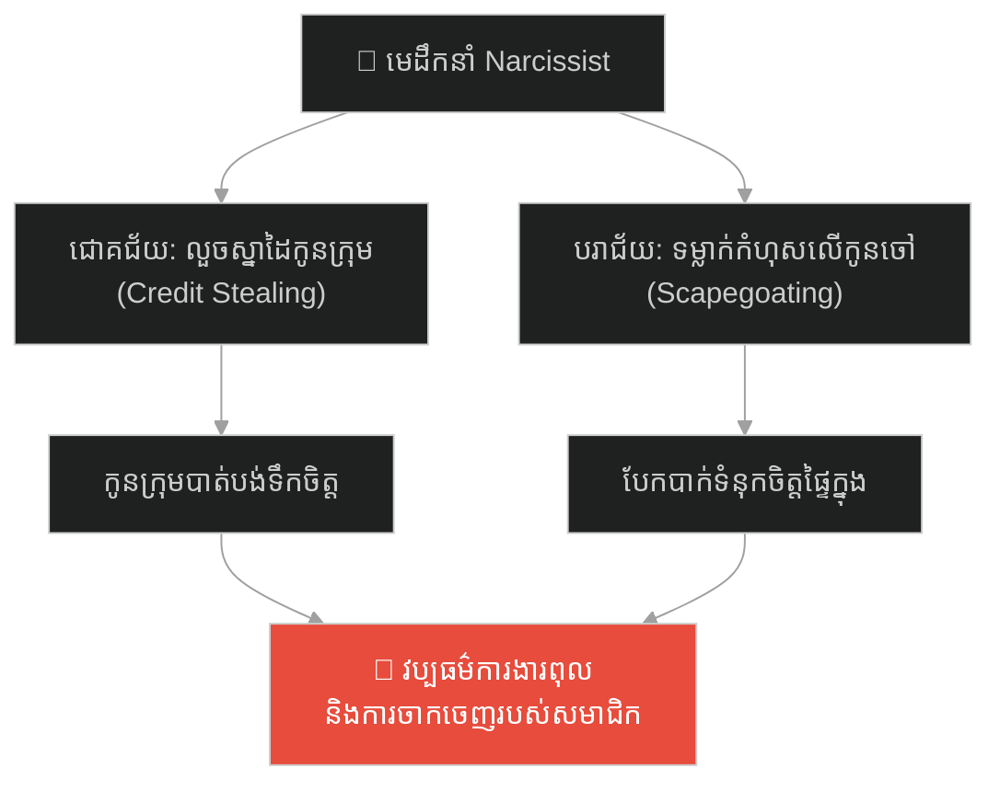
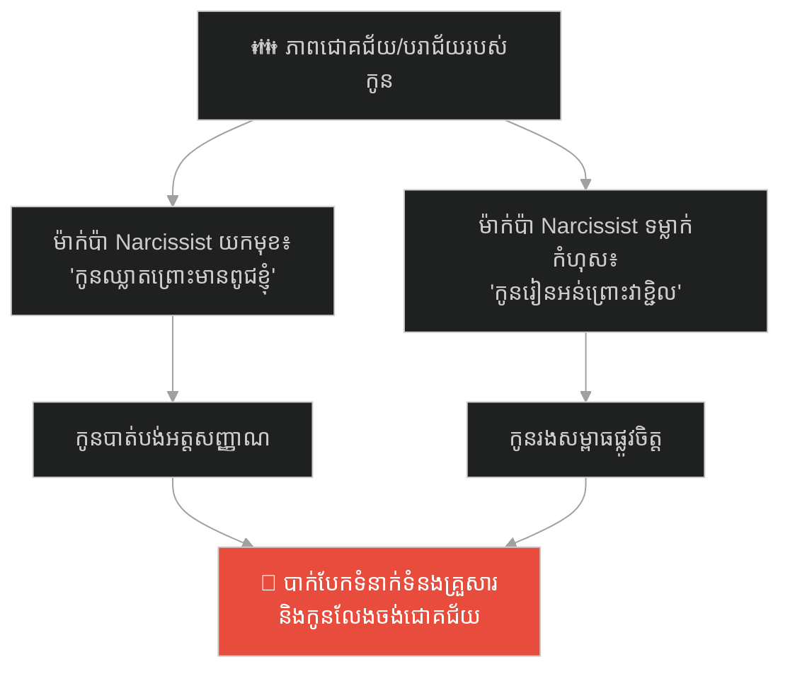
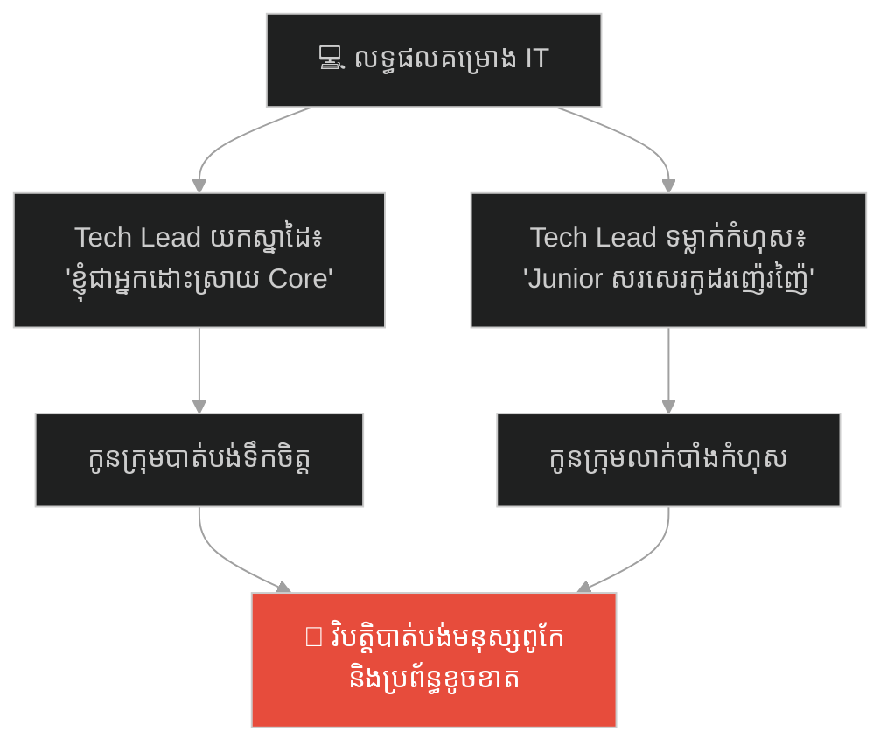
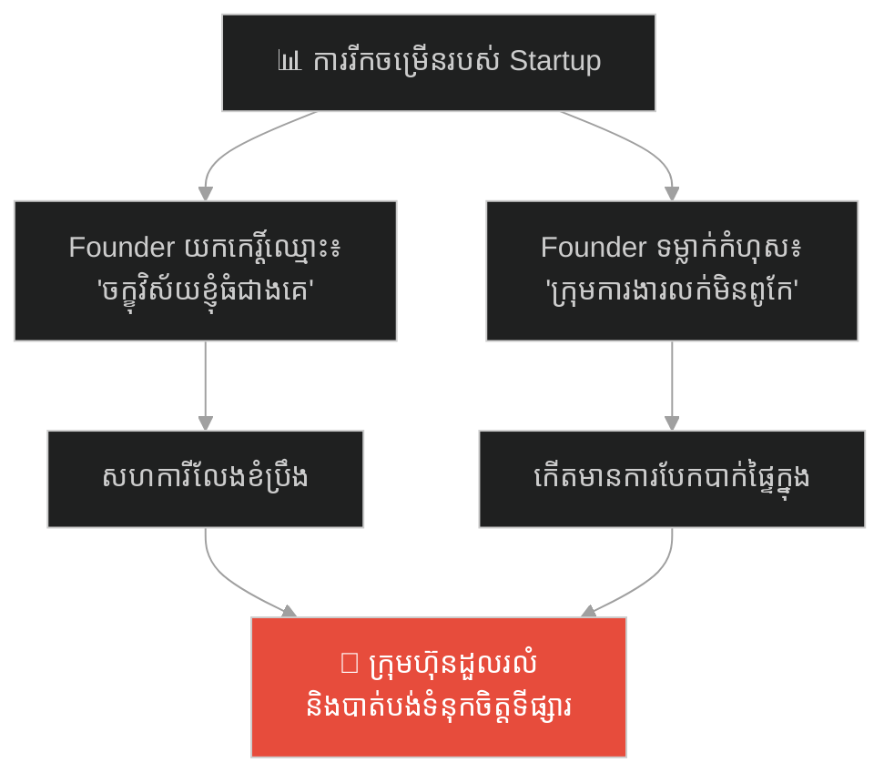
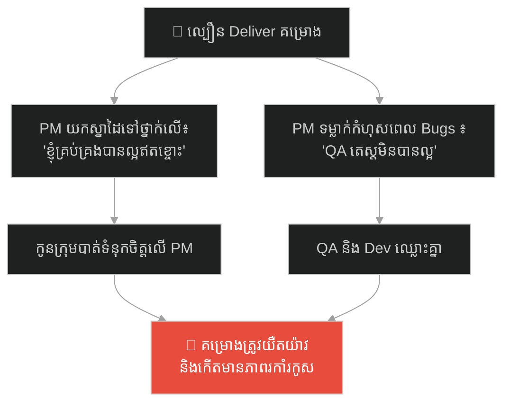
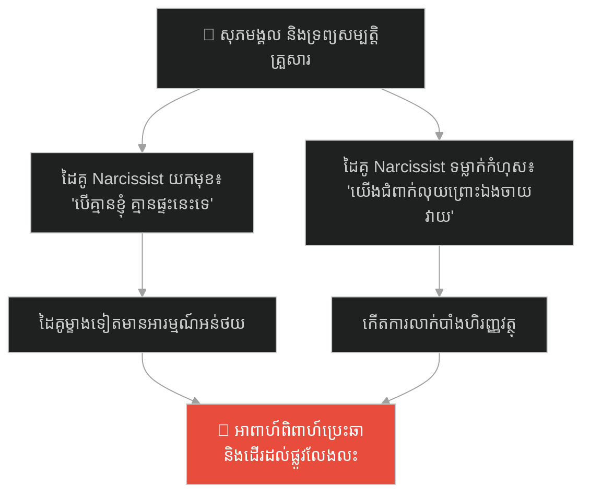
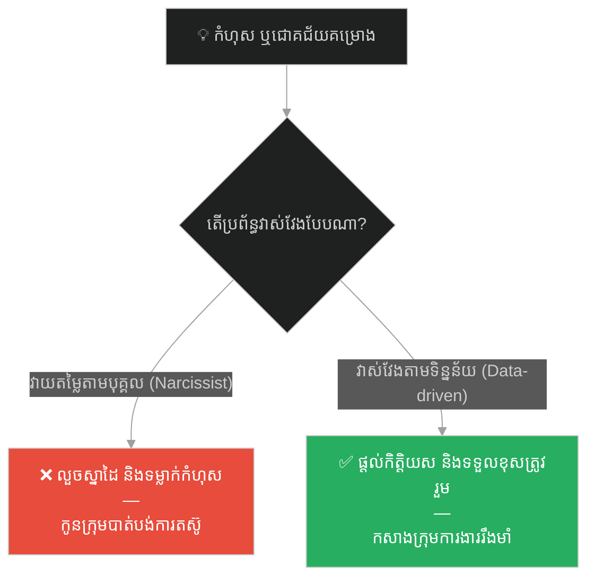

# The General Who Claimed the Sun (មេទ័ពដែលអះអាងថាខ្លួនជាម្ចាស់ព្រះអាទិត្យ)៖ គ្រោះថ្នាក់នៃមេដឹកនាំ Narcissist និងសារៈសំខាន់នៃការទទួលខុសត្រូវរួម

**Author:** ichamrong  
**Date:** 2026-05-27  
**Tags:** #narcissism #dark-triad #toxic-leadership #gaslighting #ego #management #accountability  
**Category:** Concepts / Parables  
**Read Time:** ~15 min  

---

## 📌 មាតិកា (Table of Contents)
- [អន្ទាក់ផ្លូវចិត្ត (The Trap)](#អន្ទាក់ផ្លូវចិត្ត-the-trap)
- [១. រឿងព្រេង៖ មេទ័ពសូឡុន និងកងទ័ពអាណាចក្រ (The Legend of General Solon)](#1)
  - [ការលួចយកជ័យជម្នះ (Stealing the Victory)](#1-1)
  - [ការទម្លាក់កំហុស និងទីបញ្ចប់នៃកញ្ចក់បញ្ឆោតភ្នែក (The Scapegoating & Fall of Solon)](#1-2)
- [២. បញ្ហា៖ របាំងអំនួតវង្វេងនឹងខ្លួនឯង និងអវត្តមានការយោគយល់ (The Issue: Grandiosity & Empathy Deficit)](#2)
- [៣. ឧទាហរណ៍ជាក់ស្តែងក្នុងពិភពពិត (Real World Examples)](#3)
  - [ឧទាហរណ៍ទី ១ — កម្រិតស្រាល (គ្រួសារ)៖ ឪពុកម្តាយយកស្នាដៃរបស់កូន និងទម្លាក់កំហុស (The Narcissistic Parent)](#3-1)
  - [ឧទាហរណ៍ទី ២ — កម្រិតមធ្យម (បច្ចេកទេស)៖ Tech Lead លួចស្នាដៃ Architecture របស់ Junior (The Credit-Stealer Tech Lead)](#3-2)
  - [ឧទាហរណ៍ទី ៣ — កម្រិតមធ្យម (ធុរកិច្ច)៖ ស្ថាបនិកដែលអះអាងស្នាដៃទីផ្សារតែម្នាក់ឯង (The Mass-Credit Founder)](#3-3)
  - [ឧទាហរណ៍ទី ៤ — កម្រិតមធ្យម (សង្គម/គ្រប់គ្រង)៖ PM ទម្លាក់កំហុសយឺតយ៉ាវឱ្យ QA និង Dev (The Scapegoating Project Manager)](#3-4)
  - [ឧទាហរណ៍ទី ៥ — កម្រិតធ្ងន់ (ទំនាក់ទំនង)៖ ដៃគូជីវិតដែលអះអាងសេចក្តីសុខបានមកពីខ្លួនម្នាក់ឯង (The Ego-Driven Partner)](#3-5)
- [៤. ដំណោះស្រាយទូទៅ៖ ការកសាងការវាស់វែងលទ្ធផលតាមទិន្នន័យ និងតម្លាភាពកម្រិតក្រុម (The General Solution: Data-Driven Performance & Collective Accountability)](#4)
- [សេចក្តីសន្និដ្ឋាន (Conclusion)](#conclusion)
- [ឯកសារយោង (References)](#references)
- [Related Posts](#related-posts)

---

## អន្ទាក់ផ្លូវចិត្ត (The Trap)

តើអ្នកធ្លាប់ធ្វើការជាមួយមេដឹកនាំ ឬអ្នកគ្រប់គ្រងណា ដែលរាល់ពេលគម្រោងទទួលបានជោគជ័យ ពួកគេប្រញាប់លោតចេញមកយកស្នាដៃ និងការសរសើរម្នាក់ឯង ប៉ុន្តែនៅពេលគម្រោងជួបបញ្ហា ឬបរាជ័យ ពួកគេបែរជាចង្អុលមុខទម្លាក់កំហុសលើកូនចៅភ្លាមៗដែរឬទេ?

នៅក្នុងរចនាសម្ព័ន្ធគ្រប់គ្រងសព្វថ្ងៃ យើងតែងតែសង្កេតឃើញ៖
* **មេដឹកនាំដែលមានអត្តចរិតវង្វេងនឹងខ្លួនឯង (Narcissist Leaders)** យល់ថាខ្លួនឯងជាចំណុចកណ្តាលនៃចក្រវាឡ (Grandiosity) និងខ្វះការយល់ចិត្តពីការលំបាករបស់កូនក្រុម (Empathy Deficit)។
* **កូនក្រុម** ក្លាយជា «ជណ្តើរ» សម្រាប់ពួកគេជាន់ឡើងទៅរកភាពល្បីល្បាញ និងជា «ខែល» សម្រាប់ការពារ និងរងកំហុសជំនួសពួកគេរាល់ពេលមានបញ្ហា។

នៅពេលប្រព័ន្ធការងារមួយ អនុញ្ញាតឱ្យមេដឹកនាំលួចស្នាដៃកូនចៅ និងទម្លាក់កំហុសដោយសេរី ក្រុមការងារនោះកំពុងដើរចូលទៅក្នុង **អន្ទាក់មេដឹកនាំ Narcissist (Narcissistic Leadership Trap)**។

ដើម្បីយល់ដឹងពីរបៀបលុបបំបាត់បញ្ហានេះ នេះជាផែនទីបង្ហាញផ្លូវសម្រាប់អត្ថបទនេះ៖
1. **រឿងព្រេង (The Historic Legend)** — វីរភាពនិងក្តីអំនួតរបស់មេទ័ព សូឡុន ដែលអះអាងថាបើគ្មានរូបគាត់ទេ ព្រះអាទិត្យក៏មិនរះឡើយ រហូតដល់ថ្ងៃដែលកងទ័ពឈប់ប្រយុទ្ធការពារគាត់។
2. **បញ្ហា (The Issue)** — យន្តការ Credit Stealing និង Scapegoating របស់មនុស្សវង្វេងនឹងខ្លួនឯង។
3. **ឧទាហរណ៍ជាក់ស្តែងក្នុងពិភពពិត (Real World Examples)** — ពិនិត្យមើលឥទ្ធិពលនៃ Narcissism ក្នុងកម្រិតគ្រួសារ ការងារបច្ចេកវិទ្យា ធុរកិច្ច ការគ្រប់គ្រង និងទំនាក់ទំនងស្នេហា។
4. **ដំណោះស្រាយទូទៅ (The General Solution)** — ការផ្លាស់ប្តូរទៅកាន់ប្រព័ន្ធវាស់វែងតាមទិន្នន័យ និងការកសាងសមូហភាពទទួលខុសត្រូវ (Collective Accountability)។

---

## ១. រឿងព្រេង៖ មេទ័ពសូឡុន និងកងទ័ពអាណាចក្រ (The Legend of General Solon)

នៅក្នុងចក្រភពបុរាណមួយ មានមេទ័ពកំពូលម្នាក់ឈ្មោះ **សូឡុន (Solon)**។ គាត់ជាមេទ័ពដែលមានរូបរាងខ្ពស់ស្រឡះ ស្លៀកពាក់ក្រោះមាសចាំងផ្លេកៗ និងជិះសេះសរលោង។ សូឡុន ជឿជាក់យ៉ាងមុតមាំថា គាត់គឺជាអំណោយទានពិសេសពីព្រះដើម្បីជួយសង្គ្រោះផែនដីនេះ។ 

ជារៀងរាល់ព្រឹក មុនពេលចេញហ្វឹកហាត់ គាត់តែងតែឱ្យកងទ័ពទាំងអស់ឈរតម្រង់ជួរ រួចប្រកាសដោយក្តីអំនួតថា៖
> *«កងទ័ពទាំងអស់អើយ! ចូរក្រឡេកមើលទៅទិសខាងកើត។ ព្រះអាទិត្យដែលកំពុងរះឡើង និងផ្តល់ពន្លឺដល់ផែនដីនេះ គឺដោយសារតែខ្ញុំជាអ្នកបញ្ជា និងអះអាងគុណតម្លៃ។ បើគ្មានរូបខ្ញុំទេ ពិភពលោកប្រហែលជាត្រូវងងឹតសូន្យឈឹងជារៀងរហូត!»*

ទាហានទាំងអស់បានត្រឹមតែឱនក្បាលយល់ស្របទាំងអាក់អន់ចិត្ត ព្រោះពួកគេដឹងថា នេះជាភាពវង្វេងនឹងខ្លួនឯងដ៏ធំធេងរបស់មេទ័ព។ សូឡុន មិនដែលខ្វល់ពីភាពហត់នឿយ របួស ឬអាហារូបត្ថម្ភរបស់កងទ័ពក្រោមបង្គាប់ឡើយ (Empathy Deficit)។ បើទាហានស្លាប់ ឬរបួសរាប់រយនាក់ គាត់ចាត់ទុកថាជាកាតព្វកិច្ចសាមញ្ញ ប៉ុន្តែបើគាត់គ្រាន់តែមុតបន្លាម្រាមដៃបន្តិច គាត់នឹងបញ្ជាឱ្យគ្រូពេទ្យរាជវាំងទាំងឡាយមករុំរបួស និងដេញដោលស្រែកយំភ្លាមៗ។

---

### ការលួចយកជ័យជម្នះ (Stealing the Victory)

ថ្ងៃមួយ កងទ័ពពីរដ្ឋសត្រូវដ៏ខ្លាំងក្លា បានបើកការវាយលុកលបឆ្មក់ចូលបន្ទាយរបស់អាណាចក្រកណ្តាលយប់។ ក្នុងខណៈនោះ មេទ័ពសូឡុន កំពុងតែដេកលង់លក់យ៉ាងស្កប់ស្កល់នៅក្នុងតង់ដ៏កក់ក្តៅរបស់ខ្លួន ដោយសារតែផឹកស្រវឹងខ្លាំង។ 

ស្ថិតក្នុងស្ថានភាពអាសន្ននោះ អនុសេនីយ៍ឯកវ័យក្មេងពីរនាក់ បានប្រមូលផ្តុំកងទ័ព វាយបក និងរៀបចំយុទ្ធសាស្ត្រទប់ទល់យ៉ាងម៉ឺងម៉ាត់ រហូតទទួលបានជ័យជម្នះដ៏ធំធេង និងដេញកងទ័ពសត្រូវឱ្យដកថយទៅវិញទាំងស្រុង។

នៅពេលដែលព្រះរាជាកោះហៅមកកាន់វាលរាជវាំងដើម្បីប្រគល់រង្វាន់ ជ័យជម្នះ មេទ័ពសូឡុន បានដើរយ៉ាងក្រអឺតក្រទមឡើងទៅមុខ រួចក្រាបទូលថា៖
> *«ក្រាបទូលព្រះរាជា! ជ័យជម្នះដ៏អស្ចារ្យនេះ គឺកើតឡើងដោយសារទូលព្រះបង្គំបានរៀបចំយុទ្ធសាស្ត្រយោធាសម្ងាត់ទុកជាមុនតាំងពី ៣ ខែមុន។ ទូលព្រះបង្គំជាអ្នកដឹកនាំកងទ័ពទាំងយប់ឱ្យវាយកម្ទេចសត្រូវ!»*

សូឡុន ទទួលបានមាសប្រាក់រាប់ម៉ឺនតម្លឹង និងការកោតសរសើរទូទាំងនគរ ខណៈដែលអនុសេនីយ៍ឯកទាំងពីរនាក់ និងកងទ័ពដែលខំបង្ហូរឈាមប្រយុទ្ធ មិនត្រូវបានគេលើកឈ្មោះសូម្បីតែមួយម៉ាត់ (Credit Stealing)។

---

### ការទម្លាក់កំហុស និងទីបញ្ចប់នៃកញ្ចក់បញ្ឆោតភ្នែក (The Scapegoating & Fall of Solon)

មួយខែក្រោយមក មេទ័ពសូឡុន ត្រូវដឹកនាំទ័ពដោយផ្ទាល់ដើម្បីទៅវាយដណ្តើមទីក្រុងសត្រូវ។ ដោយសារតែភាពអំនួត និងជឿជាក់លើចក្ខុវិស័យរបស់ខ្លួនឯងហួសហេតុ គាត់បានបដិសេធមិនស្តាប់ការណែនាំរបស់អ្នករុករកផ្លូវ រួចបញ្ជាឱ្យកងទ័ពវាយសម្រុកចូលទៅក្នុងជ្រលងភ្នំដ៏ចង្អៀតមួយ។ លទ្ធផលគឺ កងទ័ពទាំងមូលត្រូវធ្លាក់ចូលក្នុងអន្ទាក់ព្រួញរបស់សត្រូវ បណ្តាលឱ្យស្លាប់កងទ័ពពាក់កណ្តាលទាំងគួរឱ្យសង្វេគ។

ពេលត្រឡប់មកដល់រាជវាំងវិញ ព្រះរាជាបានសួរដេញដោលពីមូលហេតុនៃការចាញ់សង្គ្រាមដ៏អាម៉ាស់នេះ។ សូឡុន បានឆ្លើយដោយមិនអៀនខ្មាស និងគ្មានការស្តាយក្រោយថា៖
> *«ក្រាបទូលព្រះរាជា! កំហុសនេះមិនមែនមកពីយុទ្ធសាស្ត្ររបស់ទូលព្រះបង្គំឡើយ។ យុទ្ធសាស្ត្ររបស់ទូលព្រះបង្គំគឺល្អឥតខ្ចោះ។ ប៉ុន្តែវាបរាជ័យដោយសារតែកងទ័ពទាំងនោះកំសាកញី មិនចេះធ្វើតាមបញ្ជា និងរត់ចោលជួរការងារ! ពួកវាល្ងង់ខ្លៅពេក មិនសក្តិសមនឹងយុទ្ធសាស្ត្រមាសរបស់ទូលព្រះបង្គំទេ!»* (Scapegoating & Gaslighting)

ប៉ុន្តែការពិតមិនអាចលាក់កំបាំងជារៀងរហូត។ កងទ័ពទាំងអស់បានដឹងច្បាស់ពីអត្តចរិតពិតរបស់មេទ័ពសូឡុន។ ពួកគេដឹងថា ពួកគេគ្រាន់តែជាឧបករណ៍បម្រើ Ego របស់គាត់ប៉ុណ្ណោះ។

នៅក្នុងសមរភូមិបន្ទាប់ ពេលសត្រូវវាយសម្រុកមកដល់ សូឡុន បានទាញដាវ រួចស្រែកបញ្ជាកងទ័ពខ្លាំងៗ៖ *«ចូរកងទ័ពទាំងអស់វាយសម្រុកទៅមុខការពារខ្ញុំ!»*។ ប៉ុន្តែគ្មានទាហានណាម្នាក់រើជើងសូម្បីតែមួយជំហាន។ ពួកគេឈរស្ងៀមធ្មឹងដោយទឹកមុខត្រជាក់ស្រេក។ សូឡុន គ្មានជម្រើស ក៏ត្រូវបង្ខំចិត្តជិះសេះសម្រុកទៅមុខម្នាក់ឯង និងត្រូវសត្រូវបាញ់ធ្លាក់ពីលើសេះស្លាប់កណ្តាលវាលប្រយុទ្ធ។ គ្មានទាហានណាម្នាក់ស្រក់ទឹកភ្នែកអាណិតគាត់ឡើយ។

---

## ២. បញ្ហា៖ របាំងអំនួតវង្វេងនឹងខ្លួនឯង និងអវត្តមានការយោគយល់ (The Issue: Grandiosity & Empathy Deficit)

នៅក្នុងចិត្តវិទ្យាគ្រប់គ្រង បាតុភូតនេះគឺជាចរិតលក្ខណៈរបស់ **មេដឹកនាំវង្វេងនឹងខ្លួនឯង (Narcissistic Leaders)**។
* **ភាពវង្វេងនឹងខ្លួនឯង (Grandiosity)៖** ពួកគេជឿជាក់ថាជោគជ័យទាំងអស់ គឺកើតចេញពីខួរក្បាលរបស់ពួកគេតែម្នាក់គត់។ ពួកគេត្រូវការការកោតសរសើរជានិច្ច និងចូលចិត្តយកស្នាដៃរបស់កូនចៅ (Credit Stealing)។
* **ការទម្លាក់កំហុសឱ្យកូនចៅ (Scapegoating)៖** ដោយសារតែពួកគេមិនអាចទទួលយកបាននូវគំនិតថាខ្លួនឯងធ្វើខុស ឬបរាជ័យ ពួកគេត្រូវតែស្វែងរក «កូនចៀមរងគ្រោះ (Scapegoat)» ដើម្បីលាបពណ៌ និងទម្លាក់កំហុសឱ្យរាល់ពេលមានបញ្ហា។
* **ខ្វះការយោគយល់ (Lack of Empathy)៖** ពួកគេមើលមិនឃើញពីការលំបាក សម្ពាធ ឬភាពហត់នឿយរបស់កូនក្រុមឡើយ។

---

## ៣. ឧទាហរណ៍ជាក់ស្តែងក្នុងពិភពពិត

ដើម្បីយល់ដឹងឱ្យកាន់តែស៊ីជម្រៅ ផ្លូវការសិក្សានឹងនាំអ្នកទៅពិនិត្យមើល **ឧទាហរណ៍ចំនួន ៥ កម្រិតខុសៗគ្នា** ក្នុងជីវិតរស់នៅប្រចាំថ្ងៃ៖

---

### ឧទាហរណ៍ទី ១ — កម្រិតស្រាល (គ្រួសារ)៖ ឪពុកម្តាយយកស្នាដៃរបស់កូន និងទម្លាក់កំហុស (The Narcissistic Parent)

**ស្ថានភាព៖** កូនប្រុសប្រឹងប្រែងរៀនសូត្ររហូតទទួលបានអាហារូបករណ៍ទៅរៀននៅបរទេស។

* **ភាគី A (ឪពុកម្តាយ Narcissist យកមុខ)៖** ពួកគេដើរប្រាប់សាច់ញាតិទូទាំងភូមិថា៖ *«វាជាប់អាហារូបករណ៍នេះ គឺដោយសារតែពូជខួរក្បាលរបស់ខ្ញុំ និងការអប់រំដ៏ល្អឥតខ្ចោះរបស់ខ្ញុំ!»*។ ប៉ុន្តែនៅពេលដែលកូនប្រឡងធ្លាក់មុខវិជ្ជាណាមួយ ពួកគេជេរប្រមាថកូនថា៖ *«មកពីឯងល្ងង់ និងខ្ជិលច្រអូស ធ្វើឱ្យខូចកិត្តិយសគ្រួសារអស់!»*
* **ភាគី B (កូនប្រុសរងសម្ពាធ)៖** គាត់មានអារម្មណ៍ថាខ្លួនគាត់គ្រាន់តែជាឧបករណ៍សម្រាប់បង្ហាញអំនួតរបស់ឪពុកម្តាយ បាត់បង់ក្តីស្រឡាញ់ និងចាប់ផ្តើមដកខ្លួនចេញពីគ្រួសារ។

---

### ឧទាហរណ៍ទី ២ — កម្រិតមធ្យម (បច្ចេកទេស)៖ Tech Lead លួចស្នាដៃ Architecture របស់ Junior (The Credit-Stealer Tech Lead)

**ស្ថានភាព៖** Junior Developer ម្នាក់បានចំណាយពេលយប់ស្រាវជ្រាវ និងសរសេរកូដសម្រាប់បង្កើនល្បឿន Data Processing របស់ App រហូតដល់ ៤ ដង។

* **ភាគី A (Tech Lead យកមុខ)៖** ពេលប្រជុំបង្ហាញលទ្ធផលជាមួយ CTO, Tech Lead រូបនោះបាននិយាយថា៖ *«ខ្ញុំបានរៀបចំស្ថាបត្យកម្មថ្មី (Architecture Design) និងបានជួយដោះស្រាយបញ្ហាល្បឿនប្រព័ន្ធឱ្យដើរលឿនជាងមុន ៤០០%!»* ដោយមិនបានលើកឈ្មោះ Junior រូបនោះឡើយ។ ប៉ុន្តែនៅពេល Server គាំង គាត់ទម្លាក់កំហុសថា៖ *«មកពី Junior សរសេរកូដខ្វះបច្ចេកទេស!»*
* **ភាគី B (Junior Developer)៖** បាត់បង់ទឹកចិត្ត និងទំនុកចិត្តលើប្រព័ន្ធដឹកនាំ សម្រេចចិត្តធ្វើការត្រឹមតែបង្គ្រប់កិច្ច (Quiet Quitting) និងត្រៀមចាកចេញពីក្រុមហ៊ុន។

---

### ឧទាហរណ៍ទី ៣ — កម្រិតមធ្យម (ធុរកិច្ច)៖ ស្ថាបនិកដែលអះអាងស្នាដៃទីផ្សារតែម្នាក់ឯង (The Mass-Credit Founder)

**ស្ថានភាព៖** យុទ្ធនាការលក់ផលិតផលថ្មីរបស់ក្រុមហ៊ុន Startup ទទួលបានជោគជ័យខ្លាំង និងកើនឡើងចំណូលទ្វេដង ដោយសារក្រុមការងារ Marketing ធ្វើការងារយ៉ាងខ្លាំង។

* **ភាគី A (Founder យកមុខមាត់)៖** ក្នុងបទសម្ភាសន៍ជាមួយសារព័ត៌មាន Founder រូបនោះបាននិយាយថា៖ *«ជោគជ័យនេះកើតឡើងដោយសារតែចក្ខុវិស័យដ៏ច្បាស់លាស់ និងភាពជាសហគ្រិនដ៏មុតស្រួចរបស់ខ្ញុំម្នាក់គត់!»* ដោយមិនបានអរគុណដល់កូនក្រុមឡើយ។ នៅពេលយុទ្ធនាការបន្ទាប់បរាជ័យ គាត់ចោទថា ក្រុម Marketing ទន់ខ្សោយ និងមិនយល់ពីទីផ្សារ។
* **ភាគី B (ក្រុមការងារ Marketing)៖** មានអារម្មណ៍ថាខ្លួនគ្រាន់តែជាជណ្តើរឱ្យ Founder ជាន់យកកេរ្តិ៍ឈ្មោះ ក៏លែងចង់ខិតខំប្រឹងប្រែងបង្កើតយុទ្ធសាស្ត្រថ្មីៗ។

---

### ឧទាហរណ៍ទី ៤ — កម្រិតមធ្យម (សង្គម/គ្រប់គ្រង)៖ PM ទម្លាក់កំហុសយឺតយ៉ាវឱ្យ QA និង Dev (The Scapegoating Project Manager)

**ស្ថានភាព៖** គម្រោងត្រូវពន្យារពេល Deliver ព្រោះ PM ផ្លាស់ប្តូរ Scope ការងារនៅវិនាទីចុងក្រោយ។

* **ភាគី A (PM Scapegoating)៖** ក្នុងកិច្ចប្រជុំជាមួយអតិថិជន PM រូបនោះបាននិយាយថា៖ *«គម្រោងត្រូវយឺតយ៉ាវដោយសារតែខាង Developer សរសេរកូដយឺត និង QA មិនសូវពូកែរកឃើញ Bugs ទាន់ពេល!»* (ទម្លាក់កំហុសដើម្បីលាងខ្លួន)។ ប៉ុន្តែពេលគម្រោងជោគជ័យ គាត់យកស្នាដៃម្នាក់ឯង។
* **ភាគី B (Dev & QA)៖** កើតមានអារម្មណ៍អាក់អន់ចិត្ត បែកបាក់សាមគ្គីភាព និងឈ្លោះប្រកែកគ្នា រវាងអ្នកសរសេរកូដ និងអ្នកតេស្តកូដ។

---

### ឧទាហរណ៍ទី ៥ — កម្រិតធ្ងន់ (ទំនាក់ទំនង)៖ ដៃគូជីវិតដែលអះអាងសេចក្តីសុខបានមកពីខ្លួនម្នាក់ឯង (The Ego-Driven Partner)

**ស្ថានភាព៖** ប្តីប្រពន្ធរស់នៅជាមួយគ្នាមានផ្ទះវីឡា និងរថយន្តទំនើប ដោយសារតែទាំងពីរនាក់ខំប្រឹងធ្វើការ និងសន្សំសំចៃរួមគ្នា។

* **ភាគី A (ដៃគូ Ego ខ្ពស់)៖** គាត់តែងតែនិយាយរំលឹកគុណជានិច្ច៖ *«បើគ្មានការខំប្រឹង និងខួរក្បាលរបស់ខ្ញុំទេ គ្រួសារនេះគ្មានថ្ងៃមានផ្ទះ និងឡានជិះឡើយ!»*។ ប៉ុន្តែនៅពេលដែលគ្រួសារជួបវិបត្តិហិរញ្ញវត្ថុ គាត់ទម្លាក់កំហុសថា៖ *«មកពីនាងឯងចាយវាយខ្ជះខ្ជាយ ទើបយើងធ្លាក់ខ្លួនបែបនេះ!»*
* **ភាគី B (ដៃគូម្ខាងទៀត)៖** មានអារម្មណ៍ថាខ្លួនគ្មានតម្លៃក្នុងគ្រួសារ បាត់បង់ទំនុកចិត្ត និងចាប់ផ្តើមលាក់បាំងរាល់បញ្ហាហិរញ្ញវត្ថុផ្ទាល់ខ្លួន ដែលនាំឱ្យជម្លោះកាន់តែធ្ងន់ធ្ងរ។

---

## ៤. ដំណោះស្រាយទូទៅ៖ ការកសាងការវាស់វែងលទ្ធផលតាមទិន្នន័យ និងតម្លាភាពកម្រិតក្រុម (The General Solution: Data-Driven Performance & Collective Accountability)

ដើម្បីការពារក្រុមការងារពីការកេងប្រវ័ញ្ចស្នាដៃរបស់មេដឹកនាំ Narcissist និងលុបបំបាត់ការលាបពណ៌ទម្លាក់កំហុស អ្នកត្រូវអនុវត្តយុទ្ធសាស្ត្រទាំងនេះ៖

### ១. វាស់វែងលទ្ធផលការងារតាមទិន្នន័យពិតជាក់ស្តែង (Data-Driven Evaluation)
លុបបំបាត់ការវាយតម្លៃលទ្ធផលការងារតាមអារម្មណ៍ ឬពាក្យសម្តីរបស់ PM/Lead តែម្នាក់ឯង។ ត្រូវប្រើប្រាស់ប្រព័ន្ធវាស់វែងច្បាស់លាស់ (KPIs, OKRs, Task Boards like Jira/Trello) ដែលបង្ហាញភស្តុតាងច្បាស់លាស់ថា តើភារកិច្ចនីមួយៗត្រូវបានអនុវត្តដោយសមាជិករូបណា។ នេះការពារកុំឱ្យមេទ័ពសូឡុន លួចយកស្នាដៃរបស់កងទ័ពជួរមុខបាន។

### ២. អនុវត្តយន្តការ "ជោគជ័យជារបស់ក្រុម បរាជ័យជារបស់ខ្ញុំ" (Extreme Ownership)
មេដឹកនាំឆ្នើមពិតប្រាកដ ត្រូវអនុវត្តច្បាប់៖ *«នៅពេលគម្រោងជោគជ័យ ចូររំលែកកិត្តិយសទៅកាន់សមាជិកក្រុមទាំងអស់ (Window Effect)។ ប៉ុន្តែនៅពេលគម្រោងបរាជ័យ ចូរចេញមុខទទួលខុសត្រូវ និងវិភាគរក Root Cause ដោយខ្លួនឯង (Mirror Effect)។»*

### ៣. បង្កើតប្រព័ន្ធ Retrospective ដោយមានការចូលរួមស្មើគ្នា
រាល់ពេលបញ្ចប់គម្រោង ត្រូវរៀបចំការប្រជុំ Retrospective ដែលអនុញ្ញាតឱ្យសមាជិកគ្រប់រូប (ចាប់ពី Junior រហូតដល់ Lead) មានសំឡេងស្មើគ្នាក្នុងការបញ្ចេញមតិយោបល់ និងបង្ហាញការពិតពីបញ្ហាដែលបានកើតឡើង។ នេះការពារកុំឱ្យមានការលាបពណ៌ទម្លាក់កំហុសដោយអយុត្តិធម៌។

---

## 🐇 ធ្លាក់ចូលក្នុងរន្ធទន្សាយយុទ្ធសាស្ត្រ (Enter the Strategic Rabbit Hole)

ដើម្បីស្វែងយល់កាន់តែស៊ីជម្រៅអំពីរបៀបដែលការធ្វេសប្រហែសលើចំណុចលម្អិតតូចតាចមួយដើម អាចបង្កើតជាឥទ្ធិពលខ្សែសង្វាក់បំផ្លាញអាណាចក្រទាំងមូល (The Domino Effect) និងរបៀបការពារប្រព័ន្ធពីការដួលរលំ បន្តដំណើររបស់អ្នក៖

* 🚀 **[ចាប់ផ្តើមដំណើររុករក (Start the Journey) ➔ The Horseshoe Nail and the Fallen Kingdom](./28-the-horseshoe-nail-and-the-fallen-kingdom.md)**

---

## សេចក្តីសន្និដ្ឋាន (Conclusion)

> **«មេដឹកនាំដែលកេងប្រវ័ញ្ចជ័យជម្នះរបស់កូនចៅ និងលាបពណ៌ទម្លាក់កំហុសឱ្យសហការីដើម្បីការពារ Ego របស់ខ្លួន ទីបំផុតនឹងត្រូវប្រឈមមុខនឹងសត្រូវតែម្នាក់ឯងនៅលើសមរភូមិការងារ។»**

ភាពក្រអឺតក្រទម និងការយកខ្លួនឯងជាម្ចាស់ព្រះអាទិត្យ អាចផ្តល់ឱ្យអ្នកនូវកិត្តិយស និងអំណាចក្លែងក្លាយមួយរយៈពេលខ្លីប៉ុណ្ណោះ។ ប៉ុន្តែនៅពេលដែលព្យុះសង្ឃរា ឬវិបត្តិពិតប្រាកដមកដល់ ភាពគ្មានទំនុកចិត្ត និងការបាត់បង់ការគាំទ្រពីកូនក្រុម នឹងរុញច្រានអ្នកឱ្យធ្លាក់ពីលើខ្នងសេះស្លាប់តែម្នាក់ឯង។

ចូរចែករំលែកកិត្តិយស ទទួលខុសត្រូវរាល់កំហុស និងកសាងក្រុមការងាររឹងមាំពិតប្រាកដ។

---

## ឯកសារយោង (References)

* **Twenge, Jean M. & Campbell, W. Keith** — *The Narcissism Epidemic: Living in the Age of Entitlement* (2009)។ ការសិក្សាពីការកើនឡើងនៃអត្តចរិត Narcissism ក្នុងសង្គមទំនើប។
* **Maccoby, Michael** — *Narcissistic Leaders: The Incredible Pros, the Inevitable Cons* (2007)។ ការវិភាគលម្អិតអំពីចំណុចខ្លាំង និងចន្លោះប្រហោងដ៏គ្រោះថ្នាក់របស់មេដឹកនាំ Narcissist ក្នុងធុរកិច្ច។
* **Willink, Jocko & Babin, Leif** — *Extreme Ownership: How U.S. Navy SEALs Lead and Win* (2015)។ ទ្រឹស្តីស្នូលនៃការទទួលខុសត្រូវខ្ពស់បំផុតរបស់មេដឹកនាំ និងការលុបបំបាត់ការទម្លាក់កំហុស។

---

## Related Posts

* **[18 Narcissism: The Ego Trap](../articles/18-narcissism-and-the-ego-trap.md)** — អត្ថបទគោលលម្អិតអំពីយន្តការ និងផលប៉ះពាល់នៃភាពវង្វេងនឹងខ្លួនឯង។
* **[12 Multiplier vs. Diminisher Leadership](../articles/12-multiplier-leadership.md)** — របៀបដែលមេដឹកនាំអាក្រក់បំផ្លាញសក្តានុពលរបស់កូនក្រុម។
* **[26 The Court Jester Who Fed on Tears](./26-the-jester-who-fed-on-tears.md)** — ការដោះស្រាយជាមួយមនុស្សដែលមានចរិត Everyday Sadism និង trolls។

---

*Last updated: 2026-05-27*

## Related

- [💡 Concepts README](../README.md)
- [📚 Main Repository README](../../../README.md)
- [Developer Habits](../../developer-habits/README.md)
- [Mental Health & Well-being](../../mental-health/README.md)
- [Management & SDLC](../../management/README.md)
