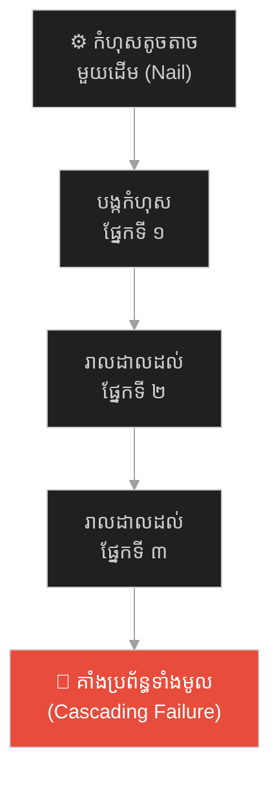
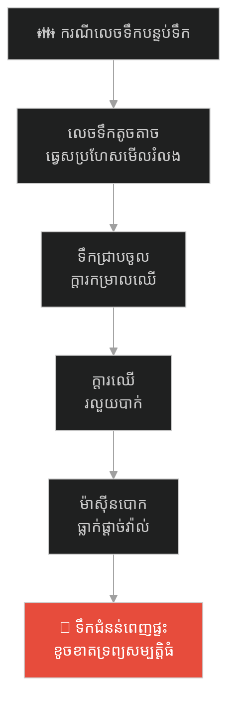
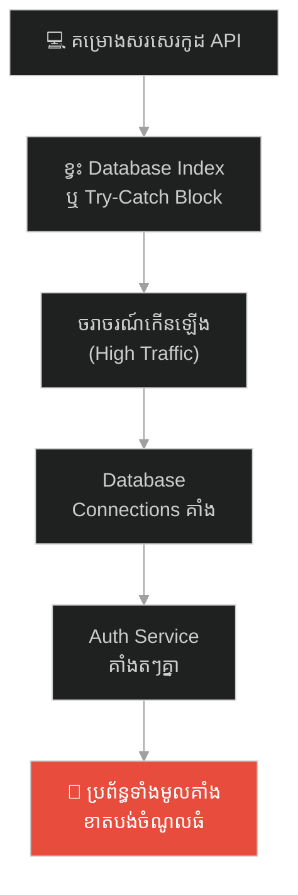
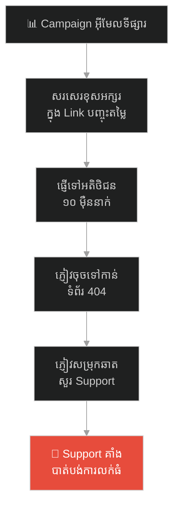
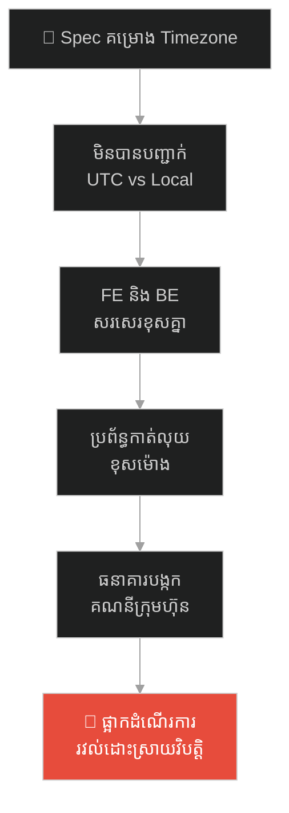
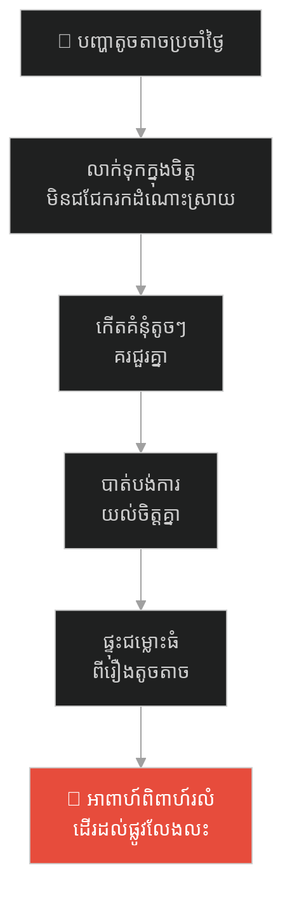
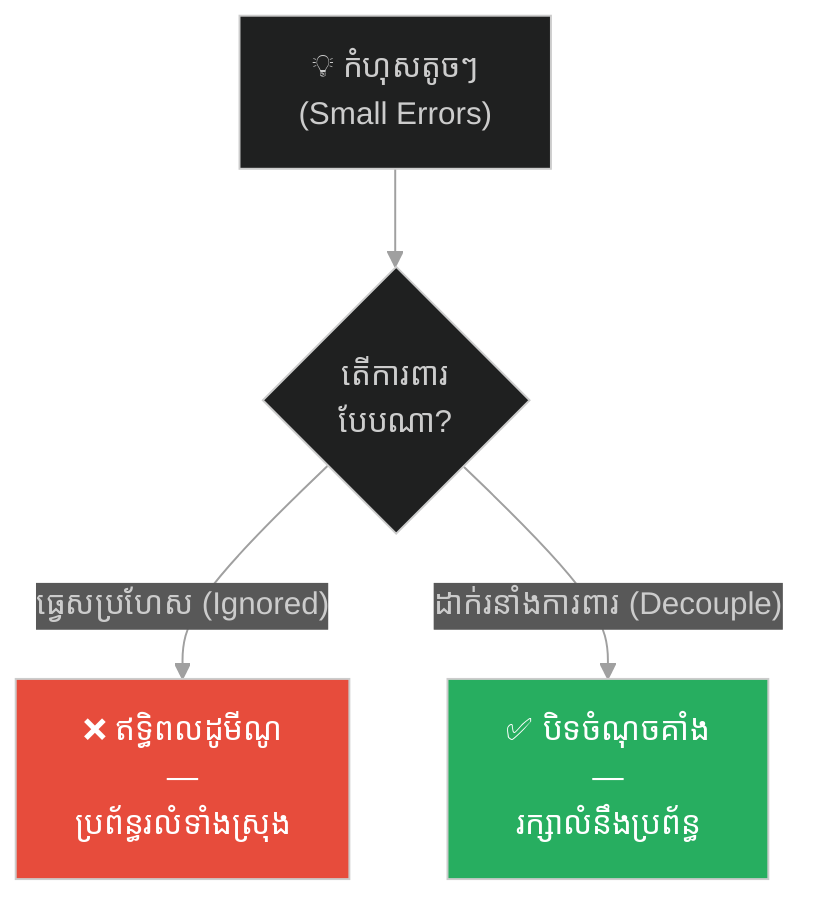

# The Missing Horseshoe Nail and the Fallen Kingdom (ដែកគោលបាត់មួយដើម និងការដួលរលំនៃអាណាចក្រ)៖ គ្រោះថ្នាក់នៃឥទ្ធិពលដូមីណូ និងសារៈសំខាន់នៃ Attention to Detail

**Author:** ichamrong  
**Date:** 2026-05-27  
**Tags:** #domino-effect #root-cause #cascading-failures #attention-to-detail #system-architecture #quality-assurance  
**Category:** Concepts / Parables  
**Read Time:** ~15 min  

---

## 📌 មាតិកា (Table of Contents)
- [អន្ទាក់ផ្លូវចិត្ត (The Trap)](#អន្ទាក់ផ្លូវចិត្ត-the-trap)
- [១. រឿងព្រេង៖ ដែកគោលមួយដើម និងមហន្តរាយអាណាចក្រ (The Legend of the Horseshoe Nail)](#1)
  - [សំបុត្រយោធាសង្គ្រោះបន្ទាន់ (The Urgent Military Message)](#1-1)
  - [សង្វាក់នៃមហន្តរាយដូមីណូ (The Cascading Chain of Disasters)](#1-2)
- [២. បញ្ហា៖ ឥទ្ធិពលដូមីណូ និងភាពអាស្រ័យគ្នាខ្ពស់ក្នុងប្រព័ន្ធ (The Issue: Domino Effect & High Coupling)](#2)
- [៣. ឧទាហរណ៍ជាក់ស្តែងក្នុងពិភពពិត (Real World Examples)](#3)
  - [ឧទាហរណ៍ទី ១ — កម្រិតស្រាល (គ្រួសារ)៖ ករណីលេចទឹកបន្ទប់ទឹកតូចតាច (The Hidden Water Leak)](#3-1)
  - [ឧទាហរណ៍ទី ២ — កម្រិតមធ្យម (បច្ចេកទេស)៖ កង្វះ Index និង Database Crash (The Missing Database Index)](#3-2)
  - [ឧទាហរណ៍ទី ៣ — កម្រិតមធ្យម (ធុរកិច្ច)៖ អក្សរខុសមួយតួក្នុង Link ទីផ្សារ (The Typo in Promotional URL)](#3-3)
  - [ឧទាហរណ៍ទី ៤ — កម្រិតមធ្យម (សង្គម/គ្រប់គ្រង)៖ មិនបានបញ្ជាក់ Timezone ក្នុង Spec (The Timezone Misalignment)](#3-4)
  - [ឧទាហរណ៍ទី ៥ — កម្រិតធ្ងន់ (ទំនាក់ទំនង)៖ គំនុំតូចៗលាក់ទុកក្នុងចិត្តមិនជជែកគ្នា (The Ignored Resentments in Marriage)](#3-5)
- [៤. ដំណោះស្រាយទូទៅ៖ ការកាត់ផ្តាច់ប្រព័ន្ធអាស្រ័យ និងការដាក់ Circuit Breaker (The General Solution: Decoupling & Circuit Breakers)](#4)
- [សេចក្តីសន្និដ្ឋាន (Conclusion)](#conclusion)
- [ឯកសារយោង (References)](#references)
- [Related Posts](#related-posts)

---

## អន្ទាក់ផ្លូវចិត្ត (The Trap)

តើអ្នកធ្លាប់ជួបស្ថានភាពដែលប្រព័ន្ធការងារ ឬគម្រោងទាំងមូលត្រូវដួលរលំខ្ទេចខ្ទីទាំងស្រុង គ្រាន់តែដោយសារតែការធ្វេសប្រហែសលើចំណុចតូចតាចមួយកន្លែង ដែលគ្រប់គ្នាយល់ថា «មិនអីទេ» ដែរឬទេ?

នៅក្នុងការរៀបចំប្រព័ន្ធការងារ និងស្ថាបត្យកម្មប្រព័ន្ធ យើងតែងតែឃើញ៖
* **មនុស្សភាគច្រើន** ចូលចិត្តផ្តោតលើតែរូបភាពធំៗ និងសមិទ្ធផលធំៗ ដោយមើលរំលងការត្រួតពិនិត្យចំណុចតូចៗ (Attention to detail) ព្រោះយល់ថាវាខាតពេល។
* **ភាពអាស្រ័យគ្នាខ្ពស់ (Tightly Coupled Systems)** ធ្វើឱ្យកំហុសតូចតាចនៅផ្នែកមួយ បង្កើតជាប្រតិកម្មខ្សែសង្វាក់បោកបក់កម្ទេចផ្នែកដទៃទៀតតៗគ្នា ដោយគ្មានរនាំងការពារ។

នៅពេលយើងធ្វេសប្រហែសលើចំណុចតូចតាច និងមិនរៀបចំប្រព័ន្ធការពារកំហុសតៗគ្នា យើងកំពុងធ្លាក់ចូលទៅក្នុង **អន្ទាក់ឥទ្ធិពលដូមីណូ (The Domino Effect Trap)**។

ដើម្បីយល់ដឹងពីរបៀបការពារប្រព័ន្ធពីការដួលរលំ នេះជាផែនទីបង្ហាញផ្លូវសម្រាប់អត្ថបទនេះ៖
1. **រឿងព្រេង (The Historic Legend)** — រឿងស្លោកដ៏ល្បីល្បាញ «For Want of a Nail» អំពីការបាត់បង់ដែកគោលមួយដើមដែលនាំឱ្យនគរទាំងមូលត្រូវរលាយ។
2. **បញ្ហា (The Issue)** — យន្តការ Cascading Failures និងគ្រោះថ្នាក់នៃភាពអាស្រ័យគ្នាខ្លាំងរបស់ប្រព័ន្ធ។
3. **ឧទាហរណ៍ជាក់ស្តែងក្នុងពិភពពិត (Real World Examples)** — ពិនិត្យមើលឥទ្ធិពលដូមីណូក្នុងកម្រិតគ្រួសារ ព័ត៌មានវិទ្យា ធុរកិច្ច ការគ្រប់គ្រង និងទំនាក់ទំនងស្នេហា។
4. **ដំណោះស្រាយទូទៅ (The General Solution)** — ការអនុវត្ត **Decoupling (ការកាត់ផ្តាច់ប្រព័ន្ធអាស្រ័យ)** និងការប្រើប្រាស់ **Circuit Breakers**。

---

## ១. រឿងព្រេង៖ ដែកគោលមួយដើម និងមហន្តរាយអាណាចក្រ (The Legend of the Horseshoe Nail)

កាលពីព្រេងនាយ មានសង្គ្រាមយោធាដ៏ធំមួយបានផ្ទុះឡើងរវាងនគរពីរ។ ព្រះរាជានៃនគរកណ្តាល បានរៀបចំយុទ្ធសាស្ត្រវាយបកសម្ងាត់មួយ រួចកត់ត្រាទុកនៅក្នុងរាជសារ ដើម្បីបញ្ជូនទៅកាន់មេទ័ពកំពូលនៅសមរភូមិជួរមុខជាបន្ទាន់។ ប្រសិនបើគ្មានរាជសារនេះទេ កងទ័ពជួរមុខប្រាកដជាត្រូវសត្រូវវាយកម្ទេច និងដួលរលំរាជវាំងមិនខាន។

---

### សំបុត្រយោធាសង្គ្រោះបន្ទាន់ (The Urgent Military Message)

ព្រះរាជាបានកោះហៅអ្នកនាំសារដ៏លឿនបំផុតម្នាក់ រួចប្រគល់រាជសារយោធានោះឱ្យ។ អ្នកនាំសារប្រញាប់រត់ទៅកាន់រោងសេះ រួចស្រែកប្រាប់ជាងដែកថា៖
> *«ជាងដែក! ប្រញាប់ឡើង! ដាក់ដែកបាតជើងសេះឱ្យខ្ញុំភ្លាម ខ្ញុំត្រូវចេញដំណើរនាំសារយោធាបន្ទាន់ឥឡូវនេះ!»*

ជាងដែកប្រញាប់ប្រញាល់យកដែកបាតជើងមកបោះពុម្ពភ្ជាប់នឹងជើងសេះ។ ប៉ុន្តែនៅពេលបោះដល់ជើងចុងក្រោយ ជាងដែកស្រាប់តែអស់ដែកគោលសល់នៅក្នុងប្រអប់។ គាត់បានប្រាប់អ្នកនាំសារថា៖
> *«លោកអ្នកនាំសារអើយ! ខ្ញុំខ្វះដែកគោលមួយដើមហើយ ខ្ញុំសុំពេលទៅយកនៅឃ្លាំងបន្តិច!»*

អ្នកនាំសារក្រឡេកមើលទៅទិសសមរភូមិ ឃើញផ្សែងហុយទ្រលោម ក៏ឆ្លើយតបទាំងប្រញាប់ប្រញាល់ថា៖
> *«គ្មានពេលទេ! សត្រូវកំពុងវាយលុកហើយ! ខ្វះដែកគោលតែមួយដើម វាមិនអីនោះទេ សេះនៅតែអាចរត់បាន! ប្រញាប់ឡើង!»*

និយាយរួច អ្នកនាំសារក៏លោតឡើងជិះសេះបោលចេញទៅយ៉ាងលឿនកាត់ព្រៃជ្រៅ។

---

### សង្វាក់នៃមហន្តរាយដូមីណូ (The Cascading Chain of Disasters)

សេះនោះបានបោលយ៉ាងលឿនកាត់ព្រៃ និងជ្រលងភ្នំថ្មដុះ។ ប៉ុន្តែដោយសារតែការខ្វះដែកគោលតូចមួយដើមនោះ មហន្តរាយជាខ្សែសង្វាក់ (The Domino Effect) ក៏បានចាប់ផ្តើម៖

1. ដោយសារតែ **ខ្វះដែកគោលមួយដើម** — ធ្វើឱ្យដែកបាតជើងសេះជើងក្រោយ របូតធ្លាក់ចេញពាក់កណ្តាលផ្លូវ។
2. ដោយសារតែ **របូតដែកបាតជើង** — សេះបានជាន់មុតផ្ទាំងថ្មស្រួច បណ្តាលឱ្យរអិលដួលបាក់ជើងកណ្តាលផ្លូវ។
3. ដោយសារតែ **សេះបាក់ជើងដួល** — អ្នកនាំសារបានធ្លាក់ពីលើខ្នងសេះ បោកក្បាលទៅនឹងផ្ទាំងថ្មសន្លប់បាត់ស្មារតីក្នុងព្រៃ។
4. ដោយសារតែ **អ្នកនាំសារសន្លប់** — រាជសារយុទ្ធសាស្ត្រមិនអាចបញ្ជូនទៅដល់ដៃមេទ័ពជួរមុខទាន់ពេលវេលា។
5. ដោយសារតែ **រាជសារទៅមិនដល់** — មេទ័ពជួរមុខមិនដឹងពីផែនការវាយបក និងការផ្លាស់ប្តូរទិសដៅ ក៏ត្រូវសត្រូវវាយឆ្មក់កម្ទេចខ្ទេចខ្ទីអស់។
6. ដោយសារតែ **ចាញ់សមរភូមិជួរមុខ** — ទីបំផុត កងទ័ពសត្រូវវាយលុកចូលរហូតដល់រាជវាំង អាណាចក្រទាំងមូលត្រូវដួលរលំ និងធ្លាក់ចូលក្នុងភ្នក្លើងសង្គ្រាម។

ជីវិតមនុស្សរាប់ម៉ឺននាក់ត្រូវស្លាប់ ប្រទេសជាតិទាំងមូលត្រូវវិនាសសូន្យឈឹង... ទាំងអស់នេះ គឺចាប់ផ្តើមចេញពី **«ការខ្វះដែកគោលតូចមួយដើម»** ប៉ុណ្ណោះ។

---

## ២. បញ្ហា៖ ឥទ្ធិពលដូមីណូ និងភាពអាស្រ័យគ្នាខ្ពស់ក្នុងប្រព័ន្ធ (The Issue: Domino Effect & High Coupling)

នៅក្នុងការរចនាប្រព័ន្ធព័ត៌មានវិទ្យា និងការគ្រប់គ្រងស្ថាប័ន បាតុភូតនេះត្រូវបានគេហៅថា **Cascading Failures (ការបាក់រលំតៗគ្នាជាខ្សែសង្វាក់)**。
* **ភាពអាស្រ័យគ្នាខ្ពស់ (High Coupling)៖** អាណាចក្រទាំងមូលអាស្រ័យលើរាជសារ រាជសារអាស្រ័យលើអ្នកនាំសារ អ្នកនាំសារអាស្រ័យលើសេះ សេះអាស្រ័យលើដែកគោល។ ប្រសិនបើផ្នែកមួយបរាជ័យ វានឹងអូសទាញផ្នែកទាំងអស់ឱ្យដួលរលំតាម (Single Point of Failure - SPOF)។
* **ការធ្វេសប្រហែសលើចំណុចតូចតាច (Lack of Attention to Detail)៖** មនុស្សច្រើនតែគិតថា Bug តូចមួយ, កូដខ្វះ Try-Catch មួយកន្លែង គឺជារឿងតូចតាច តែនៅពេលប្រព័ន្ធរងសម្ពាធខ្លាំង (High Traffic) កំហុសតូចនេះនឹងរីកធំធាត់កម្ទេចប្រព័ន្ធទាំងមូល។

---

## ៣. ឧទាហរណ៍ជាក់ស្តែងក្នុងពិភពពិត

ដើម្បីយល់ដឹងឱ្យកាន់តែស៊ីជម្រៅ ផ្លូវការសិក្សានឹងនាំអ្នកទៅពិនិត្យមើល **ឧទាហរណ៍ចំនួន ៥ កម្រិតខុសៗគ្នា** ក្នុងជីវិតរស់នៅប្រចាំថ្ងៃ៖

---

### ឧទាហរណ៍ទី ១ — កម្រិតស្រាល (គ្រួសារ)៖ ករណីលេចទឹកបន្ទប់ទឹកតូចតាច (The Hidden Water Leak)

**ស្ថានភាព៖** ទឹកលេចស្រក់តិចៗចេញពីទុយោក្រោមលិចលាងចានបន្ទប់ទឹក។

* **ភាគី A (ធ្វេសប្រហែសមើលរំលង)៖** សមាជិកគ្រួសារឃើញទឹកស្រក់ពីរទៅបីដំណក់ជារៀងរាល់ថ្ងៃ តែគិតថាមិនអីទេ ខ្ជិលហៅជាងមកជួសជុល។
* **ភាគី B (មហន្តរាយខ្សែសង្វាក់)៖** ទឹកដែលលេចជ្រាបជាប្រចាំ បានធ្វើឱ្យក្តារកម្រាលឈើរលួយបាក់ ធ្វើឱ្យម៉ាស៊ីនបោកខោអាវធ្ងន់ៗដែលដាក់ពីលើ បាក់ធ្លាក់ផ្តាច់វ៉ាល់ទឹកមេ បង្កើតជាទឹកជំនន់លិចពេញផ្ទះ បំផ្លាញគ្រឿងសង្ហារិមអស់រាប់ពាន់ដុល្លារ។

---

### ឧទានហរណ៍ទី ២ — កម្រិតមធ្យម (បច្ចេកទេស)៖ កង្វះ Index និង Database Crash (The Missing Database Index)

**ស្ថានភាព៖** Developer ម្នាក់ភ្លេចសរសេរ Database Index លើ Column មួយ (ដូចជា User Email) ព្រោះគិតថាទិន្នន័យនៅតិចមិនអីទេ។

* **ភាគី A (កំហុសតូចតាច)៖** ក្នុងពេលធម្មតា App ដំណើរការបានរលូនល្អ។ ប៉ុន្តែនៅថ្ងៃលក់បញ្ចុះតម្លៃធំ (Black Friday Promotion) ចរាចរណ៍អ្នកប្រើប្រាស់កើនឡើងខ្លាំង។
* **ភាគី B (ប្រព័ន្ធគាំងតៗគ្នា)៖** Database ត្រូវចំណាយពេលយូរដើម្បី Scan រក Email ធ្វើឱ្យ CPU កើនឡើង ១០០% នាំឱ្យ Database Connections គាំងទាំងអស់ ធ្វើឱ្យ Auth Service គាំងតាម និងចុងក្រោយ App ទាំងមូលត្រូវចុះដួលគាំង ធ្វើឱ្យក្រុមហ៊ុនបាត់បង់ចំណូលរាប់ម៉ឺនដុល្លារ។

---

### ឧទាហរណ៍ទី ៣ — កម្រិតមធ្យម (ធុរកិច្ច)៖ អក្សរខុសមួយតួក្នុង Link ទីផ្សារ (The Typo in Promotional URL)

**ស្ថានភាព៖** ក្រុមការងារ Marketing រៀបចំផ្ញើអ៊ីមែលផ្សព្វផ្សាយទៅកាន់អតិថិជន ១០ ម៉ឺននាក់ដើម្បីលក់ផលិតផលថ្មី។

* **ភាគី A (សរសេរខុសអក្សរតូចមួយ)៖** បុគ្គលិកម្នាក់បានសរសេរខុសអក្សរតូចមួយតួនៅក្នុង Link បញ្ចុះតម្លៃ (Typo in URL) ហើយមិនបានតេស្តមុនផ្ញើ។
* **ភាគី B (មហន្តរាយលក់)៖** អតិថិជន ១០ ម៉ឺននាក់ចុច Link ទៅកាន់ទំព័រ 404។ ពួកគេមានអារម្មណ៍ខឹង និងសម្រុកផ្ញើសារសួរនាំទៅកាន់ Customer Support ធ្វើឱ្យ Support System គាំងតៗគ្នា និងខូចកេរ្តិ៍ឈ្មោះក្រុមហ៊ុន។

---

### ឧទាហរណ៍ទី ៤ — កម្រិតមធ្យម (សង្គម/គ្រប់គ្រង)៖ មិនបានបញ្ជាក់ Timezone ក្នុង Spec (The Timezone Misalignment)

**ស្ថានភាព៖** ក្នុងការរៀបចំ Spec សម្រាប់ប្រព័ន្ធកាត់ប្រាក់ប្រចាំខែ (Billing System) Architect មិនបានបញ្ជាក់ទម្រង់ម៉ោង (Timezone format) ឱ្យច្បាស់លាស់។

* **ភាគី A (ខ្វះចំណុចលម្អិត)៖** ក្រុម Front-end សរសេរម៉ោងតាម Local Time (GMT+7) រីឯក្រុម Back-end សរសេរម៉ោងតាម UTC Time។
* **ភាគី B (វិបត្តិកាត់លុយ)៖** ពេលប្រព័ន្ធដំណើរការ ប្រព័ន្ធបានកាត់លុយអតិថិជនខុសម៉ោង និងស្ទួនគ្នាពីរដង ធ្វើឱ្យធនាគារកាត់ផ្តាច់គណនីក្រុមហ៊ុន និងអតិថិជនប្តឹងផ្តល់។

---

### ឧទាហរណ៍ទី ៥ — កម្រិតធ្ងន់ (ទំនាក់ទំនង)៖ គំនុំតូចៗលាក់ទុកក្នុងចិត្តមិនជជែកគ្នា (The Ignored Resentments in Marriage)

**ស្ថានភាព៖** ប្តីប្រពន្ធសង្សាររស់នៅជាមួយគ្នាមានការអាក់អន់ចិត្តរឿងតូចតាចប្រចាំថ្ងៃ (ដូចជាការមិនបត់ខោអាវ ឬការនិយាយសម្តីមិនសមរម្យ)។

* **ភាគី A (លាក់បាំងបញ្ហា)៖** ពួកគេមិនព្រមជជែកវែកញែកគ្នាឡើយ គិតថា៖ *«រឿងប៉ុណ្ណឹងមិនបាច់និយាយទេ នាំតែឈ្លោះគ្នា!»* (ធ្វេសប្រហែសមើលរំលង)。
* **ភាគី B (ការផ្ទុះជម្លោះធំ)៖** គំនុំតូចៗគរជួរគ្នារាប់ឆ្នាំ បង្កើតជាភាពឃ្លាតឆ្ងាយផ្លូវចិត្ត។ ទីបំផុត គ្រាន់តែជជែកគ្នាពីរឿងទិញម្ហូប ពួកគេបានផ្ទុះកំហឹងយ៉ាងខ្លាំង និងសម្រេចចិត្តលែងលះគ្នាភ្លាមៗ។

---

## ៤. ដំណោះស្រាយទូទៅ៖ ការកាត់ផ្តាច់ប្រព័ន្ធអាស្រ័យ និងការដាក់ Circuit Breaker (The General Solution: Decoupling & Circuit Breakers)

ដើម្បីយកឈ្នះលើឥទ្ធិពលដូមីណូ និងការពារប្រព័ន្ធការងារកុំឱ្យបាក់រលំតៗគ្នា អ្នកត្រូវអនុវត្តវិធានការទាំងនេះ៖

### ១. កាត់ផ្តាច់ភាពអាស្រ័យគ្នាខ្លាំង (Decoupling & Loose Coupling)
រចនាប្រព័ន្ធការងារឱ្យមានលក្ខណៈឯករាជ្យពីគ្នា (Microservices, Independent Departments)។ ប្រសិនបើផ្នែកមួយគាំង ឬបរាជ័យ ផ្នែកដទៃទៀតនៅតែអាចដំណើរការទៅមុខបានដោយគ្មានបញ្ហា។ កុំអនុញ្ញាតឱ្យកំហុសជើងសេះ ដុតបំផ្លាញរាជវាំងទាំងមូល។

### ២. អនុវត្តយន្តការការពារការរាលដាល (Circuit Breaker Pattern)
នៅក្នុងការសរសេរកម្មវិធី ត្រូវដាក់ **Circuit Breaker**。 ប្រសិនបើ Service មួយ (ដូចជា Payment API) យឺតយ៉ាវ ឬគាំង ត្រូវកាត់ផ្តាច់ការរង់ចាំភ្លាមៗ (Timeout & Fail Fast) និងផ្តល់សារដំណឹងជំនួស (Fallback Message) ដើម្បីកុំឱ្យធនធានរបស់ Service ផ្សេងទៀតត្រូវស្ទះគាំងតាម។

### ៣. បង្កើនការត្រួតពិនិត្យចំណុចលម្អិត (Automated Testing & QA Review)
អនុវត្តការធ្វើតេស្តស្វ័យប្រវត្ត (Unit Tests, Integration Tests) និងការ Review ឯកសារឱ្យបានម៉ត់ចត់។ កុំមើលរំលងរាល់ Bug តូចតាច។ ធានាថា «ដែកគោលគ្រប់ដើម» ត្រូវបានត្រួតពិនិត្យ និងបោះជាប់យ៉ាងរឹងមាំ មុននឹងអនុញ្ញាតឱ្យប្រព័ន្ធចេញដំណើរ។

---

## 🐇 ធ្លាក់ចូលក្នុងរន្ធទន្សាយយុទ្ធសាស្ត្រ (Enter the Strategic Rabbit Hole)

ដើម្បីស្វែងយល់កាន់តែស៊ីជម្រៅអំពីចិត្តសាស្ត្ររបស់មនុស្សក្នុងការចរចា និងរបៀបដែលការ «បោះយុថ្កាផ្លូវចិត្ត» ដោយតួលេខដំបូង គ្រប់គ្រងការគិត និងការសម្រេចចិត្តរបស់យើង សូមបន្តដំណើររុករករបស់អ្នក៖

* 🚀 **[ចាប់ផ្តើមដំណើររុករក (Start the Journey) ➔ The Merchant and the Golden Anchor](./29-the-merchant-and-the-golden-anchor.md)**

---

## សេចក្តីសន្និដ្ឋាន (Conclusion)

> **«អាណាចក្រទាំងមូលមិនមែនដួលរលំដោយសារតែកម្លាំងទ័ពសត្រូវមានអំណាចលើសលប់នោះឡើយ គឺវាដួលរលំដោយសារតែជាងដែកធ្វេសប្រហែសនឹងដែកគោលតូចមួយដើម។»**

កុំមើលស្រាលកំហុសឆ្គងតូចតាចក្នុងជីវិត និងការងាររបស់អ្នកឱ្យសោះ។ រាល់ប្រព័ន្ធដ៏រឹងមាំ គឺកើតឡើងពីការផ្ដោតលើចំណុចលម្អិតតូចៗប្រកបដោយវិជ្ជាជីវៈ និងការរៀបចំរនាំងការពារកំហុសមិនឱ្យរាលដាល។

ចូរបោះដែកគោលសេះរបស់អ្នកឱ្យបានរឹងមាំជានិច្ច។

---

## ឯកសារយោង (References)

* **Nygard, Michael T.** — *Release It!: Design and Deploy Production-Ready Software* (2007)។ សៀវភៅណែនាំស្តីពីការការពារប្រព័ន្ធពីការគាំងតៗគ្នា (Cascading Failures) ដោយប្រើ Circuit Breakers។
* **Perrow, Charles** — *Normal Accidents: Living with High-Risk Technologies* (1984)។ ការវិភាគលម្អិតអំពីយន្តការ និងគ្រោះថ្នាក់នៃភាពអាស្រ័យគ្នាខ្ពស់ក្នុងប្រព័ន្ធស្មុគស្មាញ។
* **The Domino Effect in Systems** — *MIT System Design Journal* (2018)។ ការសិក្សាពីឥទ្ធិពលដូមីណូក្នុងគម្រោងគ្រប់គ្រងហេដ្ឋារចនាសម្ព័ន្ធធំៗ។

---

## Related Posts

* **[19 The Domino Effect and Systemic Failures](../articles/19-the-domino-effect-and-systemic-failures.md)** — អត្ថបទគោលបកស្រាយពីយន្តការ Decoupling និង Circuit Breakers ក្នុង IT។
* **[15 The Broken Bridge and the Art of Inversion](./15-the-broken-bridge-and-the-art-of-inversion.md)** — របៀបគិតបញ្ច្រាស ដើម្បីរកមើលចំណុចខ្សោយ Single Point of Failure។
* **[24 The Two Architects and the Scroll of Creation](./24-the-two-architects-and-the-scroll-of-creation.md)** — របៀបប្រើប្រាស់ IaC ដើម្បីការពារប្រព័ន្ធ និងកសាងឡើងវិញបានលឿន។

---

*Last updated: 2026-05-27*

## Related

- [💡 Concepts README](../README.md)
- [📚 Main Repository README](../../../README.md)
- [Developer Habits](../../developer-habits/README.md)
- [Mental Health & Well-being](../../mental-health/README.md)
- [Management & SDLC](../../management/README.md)
