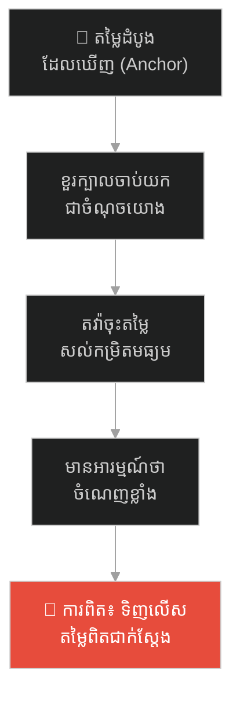
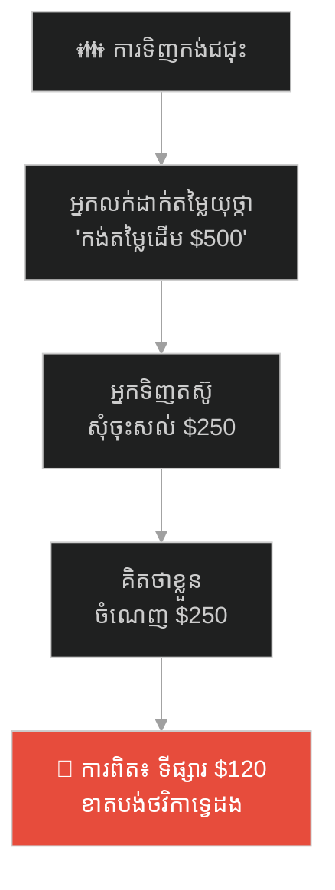
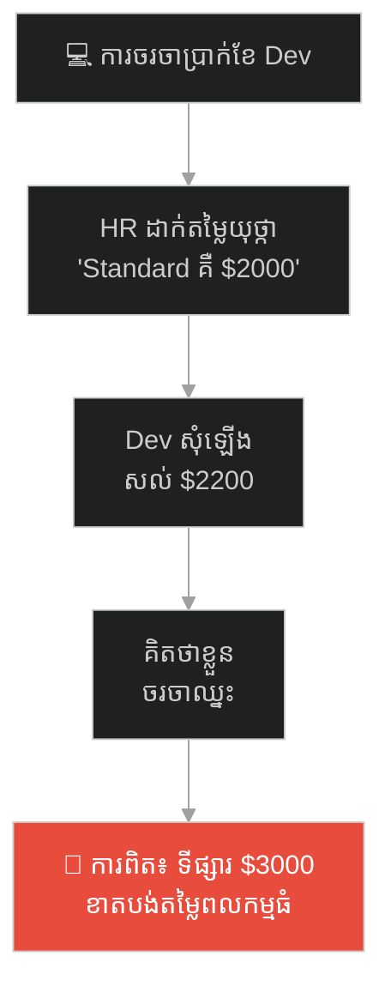
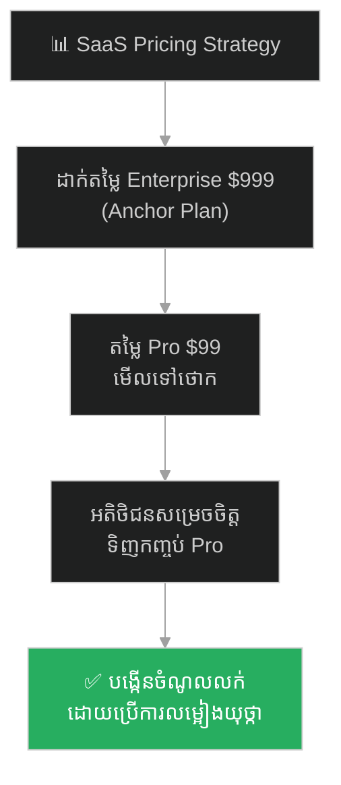
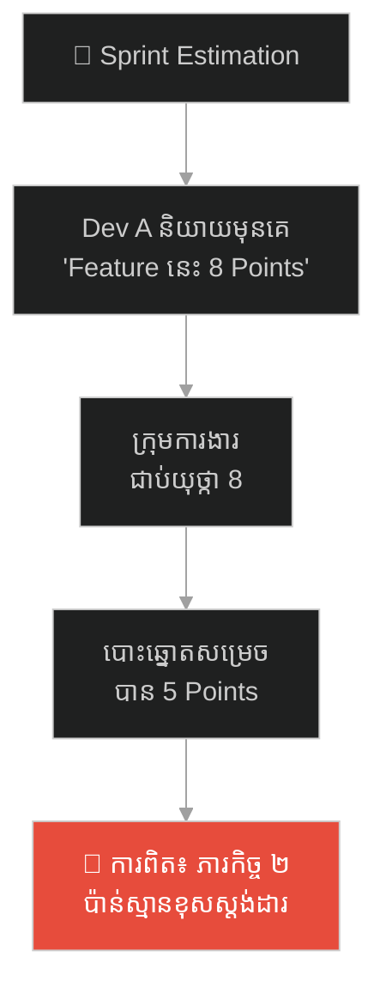
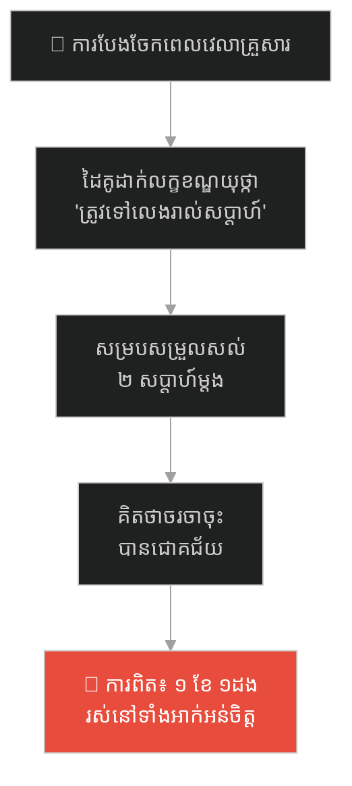
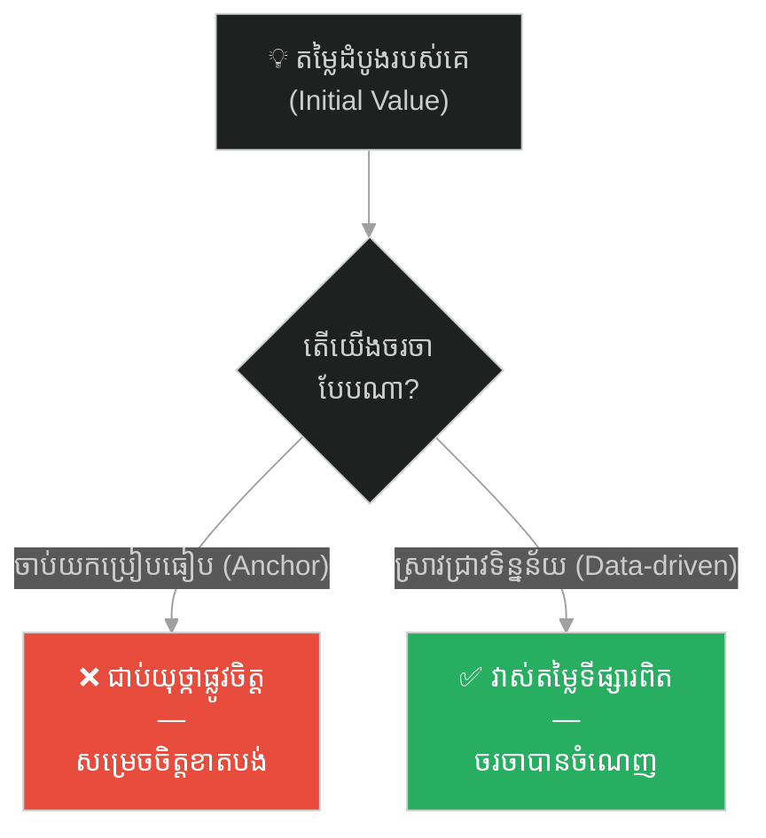

# The Merchant and the Golden Anchor (ឈ្មួញ និងយុថ្កាមាសនៃការចរចា)៖ គ្រោះថ្នាក់នៃលម្អៀង Anchoring Bias និងយុទ្ធសាស្ត្រចរចាផ្អែកលើទិន្នន័យ

**Author:** ichamrong  
**Date:** 2026-05-27  
**Tags:** #anchoring-bias #cognitive-bias #negotiation #psychology #pricing-strategy #critical-thinking  
**Category:** Concepts / Parables  
**Read Time:** ~15 min  

---

## 📌 មាតិកា (Table of Contents)
- [អន្ទាក់ផ្លូវចិត្ត (The Trap)](#អន្ទាក់ផ្លូវចិត្ត-the-trap)
- [១. រឿងព្រេង៖ ឈ្មួញសាយរ៉ាស និងដាវរឿងព្រេងនិទានក្លែងក្លាយ (The Legend of Cyrus the Merchant)](#1)
  - [ការបោះតម្លៃយុថ្កាផ្លូវចិត្ត (Setting the Psychological Anchor)](#1-1)
  - [ជ័យជម្នះផ្លូវចិត្តរបស់បុរសអភិជន (The Noble's Psychological Victory)](#1-2)
- [២. បញ្ហា៖ យុថ្កាផ្លូវចិត្ត និងការវាយតម្លៃលំអៀងដំបូង (The Issue: Anchoring Bias & Initial Reference)](#2)
- [៣. ឧទាហរណ៍ជាក់ស្តែងក្នុងពិភពពិត (Real World Examples)](#3)
  - [ឧទាហរណ៍ទី ១ — កម្រិតស្រាល (គ្រួសារ)៖ ការទិញកង់ជជុះប្រៀបធៀបតម្លៃចាស់ (The Secondhand Bicycle Purchase)](#3-1)
  - [ឧទាហរណ៍ទី ២ — កម្រិតមធ្យម (បច្ចេកទេស)៖ ការចរចាប្រាក់ខែ និងកញ្ចប់ថវិកាកំណត់ដំបូង (The Dev Salary Negotiation)](#3-2)
  - [ឧទាហរណ៍ទី ៣ — កម្រិតមធ្យម (ធុរកិច្ច)៖ យុទ្ធសាស្ត្រដាក់តម្លៃកញ្ចប់សេវាកម្ម SaaS (The SaaS Pricing Decoy Anchor)](#3-3)
  - [ឧទាហរណ៍ទី ៤ — កម្រិតមធ្យម (សង្គម/គ្រប់គ្រង)៖ ការប៉ាន់ស្មាន Story Points ក្នុងប្រជុំ (The Sprint Estimation Anchor)](#3-4)
  - [ឧទាហរណ៍ទី ៥ — កម្រិតធ្ងន់ (ទំនាក់ទំនង)៖ ការដាក់លក្ខខណ្ឌព្រំដែនដំបូងរបស់ដៃគូជីវិត (The Relationship Compromise Anchor)](#3-5)
- [៤. ដំណោះស្រាយទូទៅ៖ ការស្រាវជ្រាវតម្លៃពិត និងយុទ្ធសាស្ត្រទម្លាក់យុថ្កាផ្ទាល់ខ្លួន (The General Solution: Objective Valuation & Counter-Anchoring)](#4)
- [សេចក្តីសន្និដ្ឋាន (Conclusion)](#conclusion)
- [ឯកសារយោង (References)](#references)
- [Related Posts](#related-posts)

---

## អន្ទាក់ផ្លូវចិត្ត (The Trap)

តើអ្នកធ្លាប់ទិញទំនិញមួយ ហើយមានអារម្មណ៍ថាសប្បាយរីករាយ និងចំណេញលុយយ៉ាងច្រើន គ្រាន់តែដោយសារតែអ្នកអាចតវ៉ាបន្ថយតម្លៃបានយ៉ាងច្រើនពីតម្លៃដែលគេបានបិទផ្សាយដំបូងដែរឬទេ?

នៅក្នុងជីវិតប្រចាំថ្ងៃ និងការសម្រេចចិត្តហិរញ្ញវត្ថុ យើងតែងតែឃើញ៖
* **អ្នកលក់ ឬដៃគូចរចា** ព្យាយាមបញ្ចេញតួលេខដំបូងឱ្យខ្ពស់កប់ពពក (Anchor) ដើម្បីគ្រប់គ្រងការគិតរបស់យើង។
* **អ្នកទិញ ឬដៃគូចរចាម្នាក់ទៀត** វាយតម្លៃ «ភាពចំណេញ» ដោយផ្អែកលើគម្លាតនៃតួលេខចុងក្រោយធៀបនឹងតួលេខដំបូង ដោយមើលរំលងតម្លៃពិតប្រាកដរបស់ផលិតផល (Objective Market Value)。

នៅពេលខួរក្បាលរបស់យើងចាប់យកតួលេខដំបូងដែលបានឮ មកធ្វើជាគោលសម្រាប់ប្រៀបធៀបការសម្រេចចិត្ត យើងកំពុងតែធ្លាក់ចូលទៅក្នុងកម្មវិធីលំអៀងផ្លូវចិត្តដ៏គ្រោះថ្នាក់មួយហៅថា **លម្អៀងបោះយុថ្កា (Anchoring Bias)**។

ដើម្បីយល់ដឹងពីសិល្បៈនៃការចរចាប្រកបដោយតម្លាភាព នេះជាផែនទីបង្ហាញផ្លូវសម្រាប់អត្ថបទនេះ៖
1. **រឿងព្រេង (The Historic Legend)** — រឿងរ៉ាវរបស់ឈ្មួញ សាយរ៉ាស ដែលរៀបចំដាវដែកធម្មតាក្នុងស៊ុមប្រណីត និងបិទស្លាកតម្លៃ ១,០០០ កាក់មាស ដើម្បីបញ្ឆោតភ្នែកបុរសអភិជន។
2. **បញ្ហា (The Issue)** — យន្តការលម្អៀង Anchoring Bias និងរបៀបដែលខួរក្បាលរបស់មនុស្សបង្កើតការយល់ឃើញខុស។
3. **ឧទាហរណ៍ជាក់ស្តែងក្នុងពិភពពិត (Real World Examples)** — ពិនិត្យមើលឥទ្ធិពលនៃការបោះយុថ្កាក្នុងកម្រិតគ្រួសារ ព័ត៌មានវិទ្យា ធុរកិច្ច ការគ្រប់គ្រង និងទំនាក់ទំនងស្នេហា។
4. **ដំណោះស្រាយទូទៅ (The General Solution)** — ការស្រាវជ្រាវតម្លៃទីផ្សារពិត និងការប្រើប្រាស់បច្ចេកទេសចរចាបញ្ច្រាស (Counter-Anchoring)。

---

## ១. រឿងព្រេង៖ ឈ្មួញសាយរ៉ាស និងដាវរឿងព្រេងនិទានក្លែងក្លាយ (The Legend of Cyrus the Merchant)

នៅក្នុងទីផ្សារបុរាណមួយដែលពោរពេញដោយភាពអ៊ូអរ មានឈ្មួញលក់អាវុធម្នាក់ឈ្មោះ **សាយរ៉ាស (Cyrus)**។ គាត់មានដាវដែកថែបធម្មតាមួយដើម ដែលមានគុណភាពមធ្យម មិនមានភាពរឹងមាំ ឬលម្អដោយត្បូងពេជ្រអ្វីឡើយ។ 

នៅក្នុងទីផ្សារនេះ ដាវដែកប្រភេទនេះមានតម្លៃលក់ពិតប្រាកដត្រឹមតែ **១០០ កាក់មាស** ប៉ុណ្ណោះ។ សាយរ៉ាស ចង់លក់ដាវនេះឱ្យបានចំណេញច្រើនបំផុត ប៉ុន្តែគាត់យល់ច្បាស់ពីចិត្តសាស្ត្រមនុស្ស៖ *«បើខ្ញុំដាក់តម្លៃលក់ ១០០ កាក់ ភ្ញៀវប្រាកដជាតវ៉ាសុំចុះសល់ ៥០ កាក់ជាមិនខាន។»*

---

### ការបោះតម្លៃយុថ្កាផ្លូវចិត្ត (Setting the Psychological Anchor)

ដើម្បីដោះស្រាយបញ្ហានេះ សាយរ៉ាស បានយកស៊ុមឈើពណ៌ក្រហមដ៏ប្រណីតមួយមកដាក់តាំងដាវនោះ រួចសរសេរអក្សរមាសយ៉ាងធំនៅពីមុខថា៖ **«ដាវរឿងព្រេងនិទានរបស់មេទ័ពបុរាណ - តម្លៃ ១,០០0 កាក់មាស»**。

រសៀលមួយ មានបុរសអភិជនម្នាក់ដែលចូលចិត្តភាពលេចធ្លោ បានដើរហួសហាង ហើយក្រសែភ្នែករបស់គាត់បានចាប់យកតួលេខ ១,០០០ នោះភ្លាមៗ។ គាត់បានដើរចូលមកក្នុងហាង ដកដាវនោះចេញមកពិនិត្យមើល រួចនិយាយទាំងសើចចំអកថា៖
> *«សាយរ៉ាស! ឯងឆ្កួតទេដឹង? ដាវដែកថែបធម្មតាសោះ សុំដល់ទៅ ១,០០០ កាក់មាស? វាមិនមានភាពមុតស្រួច ឬក្បាច់ក្បូរអស្ចារ្យអ្វីឡើយ។ ខ្ញុំឱ្យឯងពេញថ្លៃត្រឹមតែ ២០០ កាក់មាសប៉ុណ្ណោះ! លក់ ឬមិនលក់?»*

សាយរ៉ាស ធ្វើទឹកមុខស្រពោន បង្ហាញការសោកស្តាយ និងពិបាកចិត្តយ៉ាងខ្លាំង (ទោះបីជាក្នុងចិត្តរបស់គាត់កំពុងតែសើចក្អាក់ក្អាយក៏ដោយ)។ គាត់តវ៉ាបន្តិចបន្តួច រួចក៏ដកដង្ហើមធំយល់ព្រម៖
> *«លោកពិតជាមានភ្នែកមុតស្រួច និងយល់ពីតម្លៃអាវុធពិតមែន។ ទោះបីជាខ្ញុំត្រូវខាតបង់ធ្ងន់ធ្ងរក៏ដោយ ខ្ញុំយល់ព្រមលក់ជូនលោកចុះ!»*

---

### ជ័យជម្នះផ្លូវចិត្តរបស់បុរសអភិជន (The Noble's Psychological Victory)

បុរសអភិជននោះ បានដើរចាកចេញពីហាងដោយស្នាមញញឹមពោរពេញដោយក្តីរីករាយ និងមោទនភាពលើខ្លួនឯង។ គាត់គិតក្នុងចិត្តថា៖
> *«... ខ្ញុំពិតជាអ្នកចរចាដ៏ឆ្លាតវៃ និងខ្លាំងពូកែមែន! ខ្ញុំអាចបញ្ចុះតម្លៃទំនិញពី ១,០០០ កាក់មាស មកសល់ត្រឹមតែ ២០០ កាក់មាសប៉ុណ្ណោះ។ ខ្ញុំបានចំណេញលុយដល់ទៅ ៨០០ កាក់មាសពីឈ្មួញល្ងង់ម្នាក់នោះ!»*

ចំណែកឯ សាយរ៉ាស វិញ បានយកកាក់មាស ២០០ នោះទៅទិញដាវធម្មតាចំនួន ២ ដើមទៀតមកទុកលក់។ ការពិតដ៏ជូរចត់គឺ៖ បុរសអភិជនមិនបានចំណេញអ្វីទាំងអស់។ គាត់បានទិញដាវដែលមានតម្លៃពិតប្រាកដត្រឹមតែ ១០០ កាក់ ក្នុងតម្លៃទ្វេដង (២០០ កាក់) ប៉ុន្តែខួរក្បាលរបស់គាត់មានអារម្មណ៍ថាចំណេញ ព្រោះគាត់ត្រូវបាន **«បោះយុថ្កាផ្លូវចិត្ត»** ដោយតួលេខ ១,០០០ តាំងពីវិនាទីដំបូង។

---

## ២. បញ្ហា៖ យុថ្កាផ្លូវចិត្ត និងការវាយតម្លៃលំអៀងដំបូង (The Issue: Anchoring Bias & Initial Reference)

នៅក្នុងចិត្តវិទ្យានៃការសម្រេចចិត្ត (Cognitive Psychology) បាតុភូតនេះត្រូវបានគេហៅថា **Anchoring Bias (លម្អៀងជាប់យុថ្កា)**។
* **យុថ្កាផ្លូវចិត្ត (The Anchor)៖** គឺជារាល់ព័ត៌មាន ឬតួលេខដំបូងដែលខួរក្បាលរបស់មនុស្សទទួលបាននៅពេលចាប់ផ្តើមដំណើរការសម្រេចចិត្ត។ ខួរក្បាលនឹងប្រើប្រាស់វាជា «ចំណុចយោងដាច់ខាត» ដើម្បីប្រៀបធៀបរាល់ព័ត៌មានបន្ទាប់ៗទៀត។
* **ភាពលំអៀងផ្លូវចិត្ត៖** នៅពេលដែលតួលេខដំបូងត្រូវបានកំណត់ (ដូចជា $1,000) រាល់តួលេខបន្ទាប់ដែលទាបជាងនេះ ($200) នឹងមើលទៅហាក់ដូចជា «ថោក» និង «ចំណេញ» ភ្លាមៗ ទោះបីជាតម្លៃពិតប្រាកដរបស់វាទាបជាង $200 ក៏ដោយ។

---

## ៣. ឧទាហរណ៍ជាក់ស្តែងក្នុងពិភពពិត

ដើម្បីយល់ដឹងឱ្យកាន់តែស៊ីជម្រៅ ផ្លូវការសិក្សានឹងនាំអ្នកទៅពិនិត្យមើល **ឧទាហរណ៍ចំនួន ៥ កម្រិតខុសៗគ្នា** ក្នុងជីវិតរស់នៅប្រចាំថ្ងៃ៖

---

### ឧទាហរណ៍ទី ១ — កម្រិតស្រាល (គ្រួសារ)៖ ការទិញកង់ជជុះប្រៀបធៀបតម្លៃចាស់ (The Secondhand Bicycle Purchase)

**ស្ថានភាព៖** កូនប្រុសចង់ទិញកង់ជជុះពីអ្នកជិតខាងដើម្បីជិះទៅសាលារៀន។

* **ភាគី A (អ្នកលក់បោះតម្លៃយុថ្កា)៖** អ្នកជិតខាងនិយាយថា៖ *«កង់នេះខ្ញុំទិញមកតម្លៃដើម $500 ឯណោះ តែខ្ញុំលក់ឱ្យតែ $250 ទេ!»*。 កូនប្រុសគិតថាខ្លួនឯងចំណេញបាន $250 ក៏ប្រញាប់ទិញភ្លាម។
* **ភាគី B (ការពិតទីផ្សារ)៖** ពីរថ្ងៃក្រោយមក គាត់ស្រាប់តែដឹងថា តម្លៃកង់ជជុះម៉ូដែលដដែលនោះនៅលើទីផ្សារលក់តែ $120 ប៉ុណ្ណោះ។ គាត់ត្រូវបានបោះយុថ្កាដោយតួលេខ $500 ដំបូង។

---

### ឧទាហរណ៍ទី ២ — កម្រិតមធ្យម (បច្ចេកទេស)៖ ការចរចាប្រាក់ខែ និងកញ្ចប់ថវិកាកំណត់ដំបូង (The Dev Salary Negotiation)

**ស្ថានភាព៖** Developer ម្នាក់ទៅសម្ភាសន៍ការងារនៅក្រុមហ៊ុនថ្មីដែលមានជំនាញខ្ពស់។

* **ភាគី A (HR បោះតម្លៃយុថ្កា)៖** ក្នុងពេលសម្ភាសន៍ HR និយាយមុនគេបង្អស់៖ *«សម្រាប់តំណែងនេះ កញ្ចប់ថវិកា standard របស់ក្រុមហ៊ុនយើងគឺ $2,000»*。 Developer រូបនោះបារម្ភខ្លាចគេមិនយក ក៏ឆ្លើយតបសុំឡើងបានត្រឹម $2,200។
* **ភាគី B (ការបាត់បង់តម្លៃពិត)៖** Developer រូបនោះសប្បាយចិត្តព្រោះបានច្រើនជាង standard។ ប៉ុន្តែការពិត តម្លៃទីផ្សារសម្រាប់ជំនាញរបស់គាត់គឺចន្លោះពី $3,000 ទៅ $3,500។ គាត់បានខាតបង់តម្លៃពលកម្មធំ ព្រោះតែត្រូវបានបោះយុថ្កាដោយតួលេខ $2,000 ដំបូងរបស់ HR។

---

### ឧទាហរណ៍ទី ៣ — កម្រិតមធ្យម (ធុរកិច្ច)៖ យុទ្ធសាស្ត្រដាក់តម្លៃកញ្ចប់សេវាកម្ម SaaS (The SaaS Pricing Decoy Anchor)

**ស្ថានភាព៖** ក្រុមហ៊ុនលក់សូហ្វវែរចង់ជម្រុញឱ្យអតិថិជនទិញកញ្ចប់ Pro Plan ច្រើនជាងគេ។

* **ភាគី A (ការដាក់តម្លៃយុថ្កា)៖** ក្រុមហ៊ុនបង្កើតកញ្ចប់តម្លៃ ៣៖ Basic ($19/mo), Pro ($99/mo), និង Enterprise ($999/mo)。
* **ភាគី B (ប្រតិកម្មរបស់អតិថិជន)៖** ភាគច្រើនអតិថិជនមិនត្រូវការកញ្ចប់ Enterprise ឡើយ។ ប៉ុន្តែតួលេខ $999 ដើរតួជា «យុថ្កាផ្លូវចិត្ត» ធ្វើឱ្យកញ្ចប់ Pro តម្លៃ $99 មើលទៅហាក់ដូចជាថោក និងមានតម្លៃសមរម្យបំផុត នាំឱ្យអតិថិជនសម្រេចចិត្តទិញកញ្ចប់ Pro ភ្លាមៗ។

---

### ឧទាហរណ៍ទី ៤ — កម្រិតមធ្យម (សង្គម/គ្រប់គ្រង)៖ ការប៉ាន់ស្មាន Story Points ក្នុងប្រជុំ (The Sprint Estimation Anchor)

**ស្ថានភាព៖** ក្នុងអំឡុងពេលប្រជុំរៀបចំ Sprint planning ក្រុមការងារត្រូវប៉ាន់ស្មានល្បឿនការងារ (Estimation) សម្រាប់ Feature ថ្មី។

* **ភាគី A (ការបញ្ចេញតួលេខមុន)៖** Developer A និយាយមុនគេបង្អស់៖ *«Feature នេះស្មុគស្មាញណាស់ ខ្ញុំគិតថា 8 Points!»*。
* **ភាគី B (កំហុសប៉ាន់ស្មានរបស់ក្រុម)៖** តាមពិត សមាជិកផ្សេងទៀតយល់ថាវាត្រឹមតែ 2 ឬ 3 Points ប៉ុណ្ណោះ។ ប៉ុន្តែដោយសារតែតួលេខ 8 ត្រូវបានបញ្ចេញមុនគេបង្អស់ (Anchor) ការពិភាក្សាចាប់ផ្តើមវិលជុំវិញតួលេខ 8 ហើយចុងក្រោយក្រុមការងារយល់ស្របគ្នាសម្រេចយក 5 Points ដែលជាការប៉ាន់ស្មានខុស។

---

### ឧទាហរណ៍ទី ៥ — កម្រិតធ្ងន់ (ទំនាក់ទំនង)៖ ការដាក់លក្ខខណ្ឌព្រំដែនដំបូងរបស់ដៃគូជីវិត (The Relationship Compromise Anchor)

**ស្ថានភាព៖** ប្តីប្រពន្ធពិភាក្សាគ្នាពីរឿងការបែងចែកពេលវេលាទៅលេងសាច់ញាតិខាងម្តាយឪពុក។

* **ភាគី A (ដៃគូដាក់លក្ខខណ្ឌធ្ងន់ធ្ងរ)៖** ដៃគូម្នាក់ដាក់លក្ខខណ្ឌដំបូងយ៉ាងខ្លាំង៖ *«យើងត្រូវតែទៅលេងផ្ទះម្តាយខ្ញុំរាល់ចុងសប្តាហ៍!»* (Anchor)។
* **ភាគី B (សម្របសម្រួលទាំងអាក់អន់ចិត្ត)៖** ដៃគូម្ខាងទៀតចរចាសុំចុះសល់ «ពីរដងក្នុងមួយខែ» ហើយមានអារម្មណ៍ថាខ្លួនឈ្នះការចរចាសម្របសម្រួល។ ប៉ុន្តែការពិត ព្រំដែនសេរីភាពដែលគាត់ចង់បានពិតប្រាកដគឺត្រឹមតែ «មួយដងក្នុងមួយខែ» ប៉ុណ្ណោះ។ គាត់ត្រូវបានបោះយុថ្កាដោយលក្ខខណ្ឌដំបូង។

---

## ៤. ដំណោះស្រាយទូទៅ៖ ការស្រាវជ្រាវតម្លៃពិត និងយុទ្ធសាស្ត្រទម្លាក់យុថ្កាផ្ទាល់ខ្លួន (The General Solution: Objective Valuation & Counter-Anchoring)

ដើម្បីកម្ចាត់ឥទ្ធិពល Anchoring Bias ក្នុងការសម្រេចចិត្ត និងការចរចា អ្នកត្រូវអនុវត្តវិធានការទាំងនេះ៖

### ១. ធ្វើការស្រាវជ្រាវរកតម្លៃទីផ្សារពិតជាមុន (Objective Pre-Research)
មុននឹងចូលរួមចរចាប្រាក់ខែ ទិញទំនិញ ឬវាយតម្លៃគម្រោង ត្រូវចំណាយពេលស្រាវជ្រាវរកទិន្នន័យពិតប្រាកដជាមុនសិន។ កុំចូលចរចាដោយដៃទទេ និងកុំបណ្តោយឱ្យតួលេខដំបូងរបស់គេមកគ្រប់គ្រងការគិតរបស់អ្នក។ ត្រូវមាន «តម្លៃយោងឯករាជ្យ» ផ្ទាល់ខ្លួន។

### ២. អនុវត្តយុទ្ធសាស្ត្រចរចាបញ្ច្រាស (Counter-Anchoring)
ប្រសិនបើដៃគូចរចាបញ្ចេញតួលេខដំបូងដែលអយុត្តិធម៌ខ្លាំង (ដូចជា $1,000 របស់ Cyrus)៖
* កុំចរចាដោយយកតួលេខនោះជាគោល។
* ច្រានចោលតួលេខនោះភ្លាមៗ រួចទម្លាក់តួលេខផ្ទាល់ខ្លួនវិញដែលមានលក្ខណៈប្រាកដនិយម និងផ្អែកលើទិន្នន័យ (ដូចជា $80 ជំនួសឱ្យ $200)。

### ៣. អនុវត្តការបោះឆ្នោតប៉ាន់ស្មានសម្ងាត់ (Silent Estimation)
នៅក្នុងការងារគ្រប់គ្រងគម្រោង (ដូចជាការប៉ាន់ស្មាន Story Points) ត្រូវប្រើប្រាស់ការបោះឆ្នោតសម្ងាត់ (Silent voting ឬ Planning Poker) ដែលសមាជិកគ្រប់រូបបង្ហាញតួលេខរបស់ខ្លួនក្នុងពេលតែមួយ។ នេះការពារកុំឱ្យមានការបោះយុថ្កាដោយសំឡេងរបស់អ្នកដែលនិយាយមុនគេ។

---

## 🐇 ធ្លាក់ចូលក្នុងរន្ធទន្សាយយុទ្ធសាស្ត្រ (Enter the Strategic Rabbit Hole)

ដើម្បីស្វែងយល់កាន់តែស៊ីជម្រៅអំពីរបៀបដែលការស្ដាយស្រណោះលើទ្រព្យសម្បត្តិ ឬពេលវេលាដែលបានបាត់បង់ទៅហើយ (Sunk Cost) បង្ខំឱ្យយើងសម្រេចចិត្តខុសបន្តបន្ទាប់ទៀត និងរបៀបកាត់ផ្តាច់គម្រោងដែលគ្មានប្រយោជន៍ទាន់ពេល សូមបន្តដំណើររបស់អ្នក៖

* 🚀 **[ចាប់ផ្តើមដំណើររុករក (Start the Journey) ➔ The King and the Bridge to Nowhere](./30-the-bridge-to-nowhere.md)**

---

## សេចក្តីសន្និដ្ឋាន (Conclusion)

> **«អ្នកចរចាដ៏ឆ្លាតវៃ មិនមែនជាអ្នកដែលសប្បាយចិត្តនឹងការបញ្ចុះតម្លៃទំនិញពីតួលេខខ្ពស់កប់ពពកនោះឡើយ ប៉ុន្តែគឺអ្នកដែលដឹងយ៉ាងច្បាស់ពីតម្លៃពិតប្រាកដរបស់វត្ថុនោះ មុននឹងចាប់ផ្តើមនិយាយមួយម៉ាត់។»**

តួលេខដំបូងដែលគេបោះមក គ្រាន់តែជាយុថ្កាផ្លូវចិត្តដែលគេបង្កើតឡើងដើម្បីបញ្ឆោតខួរក្បាលរបស់អ្នកប៉ុណ្ណោះ។ ចូរកុំបណ្តោយឱ្យយុថ្ការបស់អ្នកដទៃ មកកំណត់សេរីភាពហិរញ្ញវត្ថុ និងការសម្រេចចិត្តផ្ទាល់ខ្លួនរបស់អ្នកឡើយ។

ចូដកយុថ្កាចេញ ហើយសម្រេចចិត្តដោយផ្អែកលើការពិត និងទិន្នន័យ។

---

## ឯកសារយោង (References)

* **Tversky, Amos & Kahneman, Daniel** — *Judgment under Uncertainty: Heuristics and Biases* (1974)។ ការស្រាវជ្រាវស្នូលដែលរកឃើញ និងបកស្រាយពីយន្តការ Anchoring Bias ក្នុងការសម្រេចចិត្តរបស់មនុស្ស។
* **Kahneman, Daniel** — *Thinking, Fast and Slow* (2011)។ សៀវភៅលម្អិតដែលបកស្រាយពីប្រព័ន្ធខួរក្បាល System 1 & System 2 និងឥទ្ធិពលនៃការបោះយុថ្កា។
* **Fisher, Roger & Ury, William** — *Getting to Yes: Negotiating Agreement Without Giving In* (1981)។ សិល្បៈនៃការចរចាផ្អែកលើគោលការណ៍ និងការលុបបំបាត់អន្ទាក់តម្លៃរបស់ដៃគូចរចា។

---

## Related Posts

* **[20 Cognitive Biases: The Hidden Flaws in Human Thinking](../articles/20-cognitive-biases-the-flaws-in-human-thinking.md)** — ការយល់ដឹងពីកំហុសនៃការគិត និងលម្អៀងការយល់ឃើញផ្សេងៗទៀតក្នុងវិស្វកម្ម។
* **[13 The Lost Axe and the Filter of Mind](./13-the-lost-axe-and-the-filter-of-mind.md)** — រឿងប្រៀបធៀបអំពីលម្អៀងការយល់ឃើញ និងតម្រងផ្លូវចិត្ត Confirmation Bias។
* **[23 The Master Navigator and the Hidden Star Chart](./23-the-master-navigator-and-the-hidden-star-chart.md)** — ផលវិបាកនៃការមិនមានប្រភពព័ត៌មានរួមតែមួយ (SSOT) ក្នុងការងារ។

---

*Last updated: 2026-05-27*

## Related

- [💡 Concepts README](../README.md)
- [📚 Main Repository README](../../../README.md)
- [Developer Habits](../../developer-habits/README.md)
- [Mental Health & Well-being](../../mental-health/README.md)
- [Management & SDLC](../../management/README.md)
