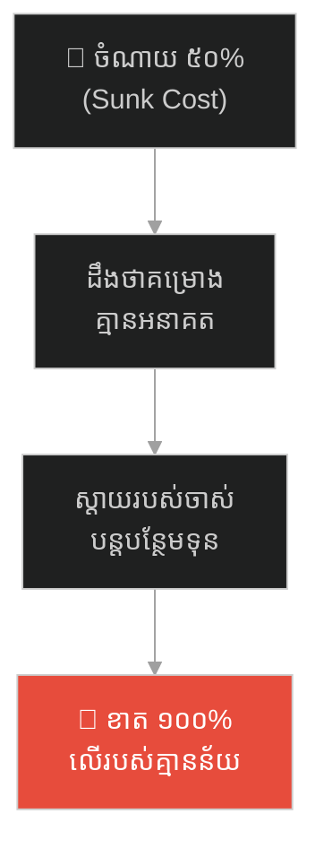
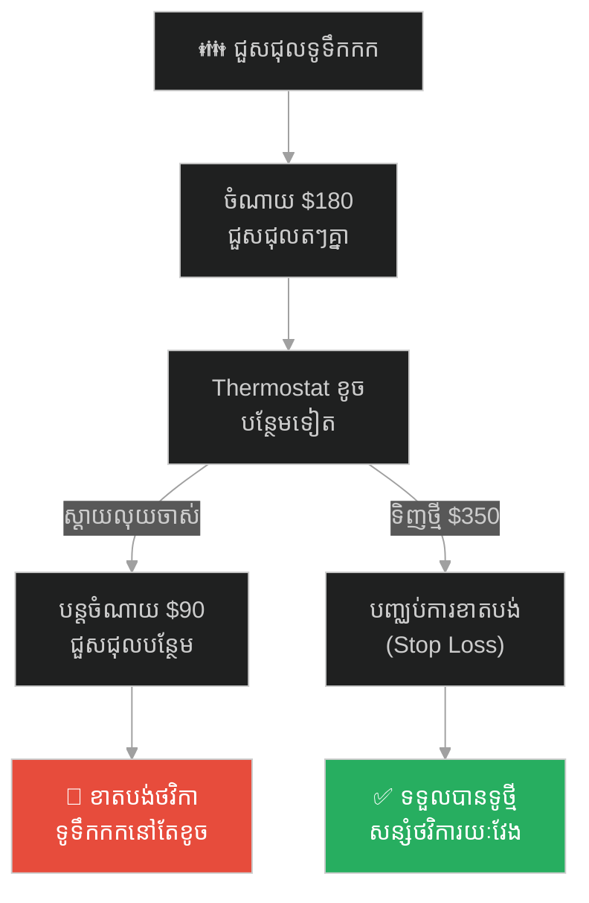
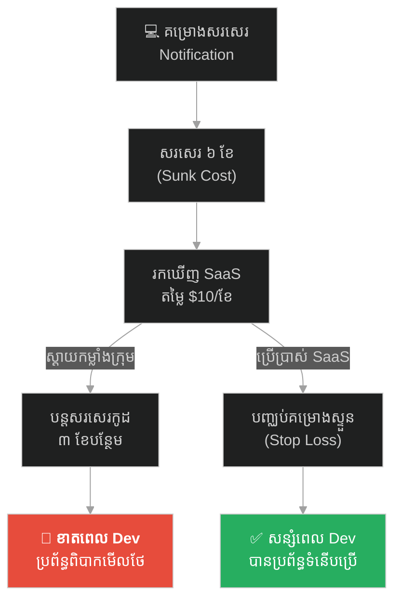
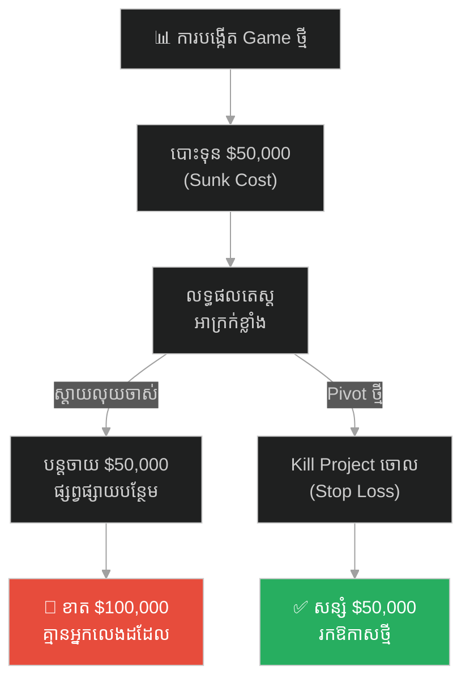
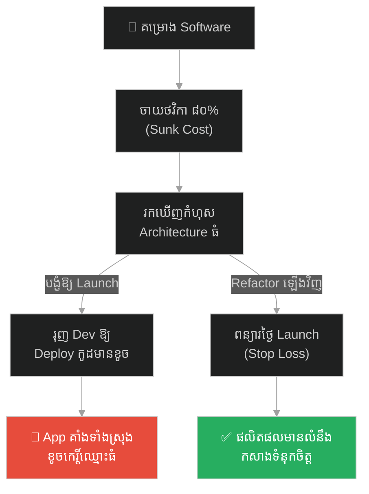
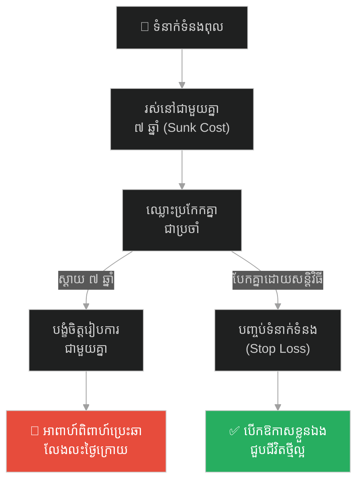
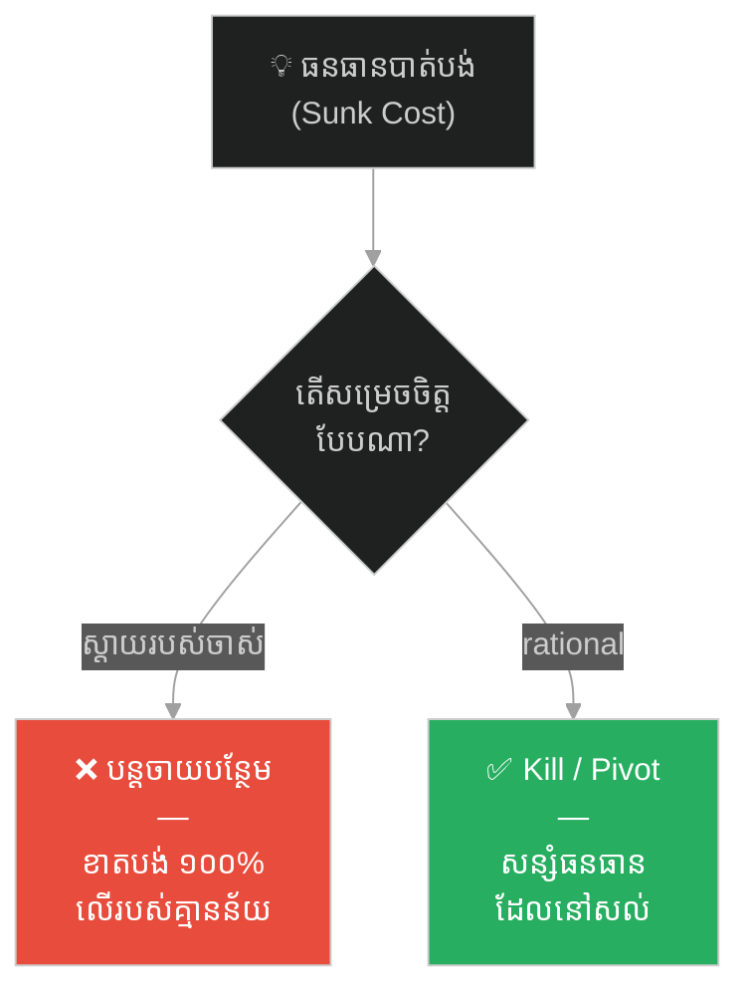

# The King and the Bridge to Nowhere (ព្រះរាជា និងស្ពានទៅរកភាពទទេស្អាត)៖ គ្រោះថ្នាក់នៃលម្អៀង Sunk Cost Fallacy និងយុទ្ធសាស្ត្របញ្ឈប់គម្រោងទាន់ពេល

**Author:** ichamrong  
**Date:** 2026-05-27  
**Tags:** #sunk-cost-fallacy #cognitive-bias #project-management #leadership #decision-making #critical-thinking  
**Category:** Concepts / Parables  
**Read Time:** ~15 min  

---

## 📌 មាតិកា (Table of Contents)
- [អន្ទាក់ផ្លូវចិត្ត (The Trap)](#អន្ទាក់ផ្លូវចិត្ត-the-trap)
- [១. រឿងព្រេង៖ គម្រោងមហាស្ពានទៅកាន់កោះវាលខ្សាច់ (The Legend of the Great Bridge Project)](#1)
  - [ការពិតដែលលេចចេញមក (The Desert Island Revealed)](#1-1)
  - [ការសម្រេចចិត្តដ៏លំបាករបស់ព្រះរាជា (The King's Stubborn Decision)](#1-2)
- [២. បញ្ហា៖ ការខាតបង់ដែលមិនអាចយកត្រឡប់ និងការបន្តកំហុស (The Issue: Unrecoverable Loss & Compounding Errors)](#2)
- [៣. ឧទាហរណ៍ជាក់ស្តែងក្នុងពិភពពិត (Real World Examples)](#3)
  - [ឧទាហរណ៍ទី ១ — កម្រិតស្រាល (គ្រួសារ)៖ ការជួសជុលទូទឹកកកចាស់លេចលុយជាបន្តបន្ទាប់ (The Legacy Refrigerator Repairs)](#3-1)
  - [ឧទាហរណ៍ទី ២ — កម្រិតមធ្យម (បច្ចេកទេស)៖ ការបន្តគម្រោងសរសេរប្រព័ន្ធដែលមិនចាំបាច់ (The Custom In-House Notification Tool)](#3-2)
  - [ឧទាហរណ៍ទី ៣ — កម្រិតមធ្យម (ធុរកិច្ច)៖ ការបោះទុនផ្សាយហ្គេមដែលគ្មានអ្នកលេង (The Failing Mobile Game Campaign)](#3-3)
  - [ឧទាហរណ៍ទី ៤ — កម្រិតមធ្យម (សង្គម/គ្រប់គ្រង)៖ ការរុញគម្រោងកូដខូចឱ្យ Launch តាមថ្ងៃកំណត់ (The Flawed Architecture Release)](#3-4)
  - [ឧទាហរណ៍ទី ៥ — កម្រិតធ្ងន់ (ទំនាក់ទំនង)៖ ការបង្ខំរៀបការព្រោះរស់នៅជាមួយគ្នាយូរឆ្នាំ (The Toxic Multi-Year Relationship)](#3-5)
- [៤. ដំណោះស្រាយទូទៅ៖ ការកំណត់ការបញ្ឈប់ការខាតបង់ និងការកសាងប្រព័ន្ធវាស់ស្ទង់តម្លាភាព (The General Solution: Stop-Loss Rules & Objective Pivoting)](#4)
- [សេចក្តីសន្និដ្ឋាន (Conclusion)](#conclusion)
- [ឯកសារយោង (References)](#references)
- [Related Posts](#related-posts)

---

## អន្ទាក់ផ្លូវចិត្ត (The Trap)

តើអ្នកធ្លាប់ជួបស្ថានភាពដែលដឹងច្បាស់ថាគម្រោង ឬទំនាក់ទំនងការងាររបស់ខ្លួនកំពុងឆ្ពោះទៅរកភាពបរាជ័យ ប៉ុន្តែអ្នកនៅតែមិនព្រមបញ្ឈប់វា គ្រាន់តែដោយសារតែអ្នកបានចំណាយលុយកាក់ ពេលវេលា ឬកម្លាំងកាយចិត្តទៅលើវាច្រើនណាស់ទៅហើយកាលពីអតីតកាលដែរឬទេ?

នៅក្នុងការគ្រប់គ្រងគម្រោង និងការសម្រេចចិត្ត យើងតែងតែឃើញ៖
* **មនុស្សភាគច្រើន** បង្ខំចិត្តបន្តបោះទុន ឬពេលវេលាបន្ថែមទៅក្នុងគម្រោងដែលដឹងថាគ្មានអនាគត គ្រាន់តែដើម្បី «ស្តាយលុយចាស់» ឬ «ការពារមុខមាត់»។
* **ផលវិបាកចុងក្រោយ** គឺការខាតបង់ធនធាន ១០០% ទៅលើរបស់ដែលគ្មានតម្លៃ និងគ្មានន័យអ្វីទាំងអស់។

ការបោះធនធានបន្ថែមទៅលើអ្វីដែលខូចខាតទៅហើយ គ្រាន់តែដើម្បីបិទបាំងកំហុសអតីតកាល ហៅថា **អន្ទាក់ Sunk Cost Fallacy (លម្អៀងស្តាយរបស់ខូច)**។

ដើម្បីយល់ដឹងពីវិធីសន្សំធនធាន និងការសម្រេចចិត្តប្រកបដោយហេតុផល នេះជាផែនទីបង្ហាញផ្លូវសម្រាប់អត្ថបទនេះ៖
1. **រឿងព្រេង (The Historic Legend)** — រឿងរ៉ាវរបស់ព្រះរាជាដែលបង្ខំឱ្យសាងសង់មហាស្ពានទៅកាន់កោះគ្មានមាស គ្រាន់តែព្រោះទ្រង់បានចំណាយមាស ៥ សែនតម្លឹងរួចទៅហើយ។
2. **បញ្ហា (The Issue)** — យន្តការលម្អៀង Sunk Cost Fallacy និងរបៀបដែលខួរក្បាលរបស់មនុស្សCompounding កំហុស។
3. **ឧទាហរណ៍ជាក់ស្តែងក្នុងពិភពពិត (Real World Examples)** — ពិនិត្យមើលឥទ្ធិពលនៃ Sunk Cost ក្នុងកម្រិតគ្រួសារ ព័ត៌មានវិទ្យា ធុរកិច្ច ការគ្រប់គ្រង និងទំនាក់ទំនងស្នេហា។
4. **ដំណោះស្រាយទូទៅ (The General Solution)** — ការកសាងវិធានបញ្ឈប់ការខាតបង់ (Stop-Loss Rules) និងការយល់ដឹងពីការសម្រេចចិត្តប្រកបដោយហេតុផល។

---

## ១. រឿងព្រេង៖ គម្រោងមហាស្ពានទៅកាន់កោះវាលខ្សាច់ (The Legend of the Great Bridge Project)

នៅក្នុងនគរមួយ ព្រះរាជាបានទទួលព័ត៌មានចចាមអារ៉ាមថា នៅលើកោះដាច់ស្រយាលមួយកណ្តាលទន្លេធំ មានផ្ទុកទៅដោយរ៉ែមាសដ៏មហាសាលដែលមិនធ្លាប់មាននរណាដកហូតបាន។ ដោយក្តីលោភលន់ និងចង់បង្កើនទ្រព្យសម្បត្តិរាជវាំង ព្រះអង្គបានចេញរាជបញ្ជាឱ្យសាងសង់ «ស្ពានថ្មដ៏ធំមួយ» ឆ្លងកាត់ទន្លេ ដើម្បីភ្ជាប់ទៅកាន់កោះនោះ។

គម្រោងនេះជាគម្រោងដ៏មហាសាល ដែលត្រូវបានគ្រោងទុកថាត្រូវចំណាយពេល ១០ ឆ្នាំ និងមាសចំនួន ១ លានតម្លឹងពីតម្កល់ជាតិ។ ជាងសំណង់រាប់ពាន់នាក់ត្រូវបានកោះហៅមកធ្វើការងារទាំងយប់ទាំងថ្ងៃ។

---

### ការពិតដែលលេចចេញមក (The Desert Island Revealed)

ប្រាំឆ្នាំបានកន្លងផុតទៅ ស្ពាននោះសាងសង់បានពាក់កណ្តាលផ្លូវកណ្តាលទន្លេ ហើយព្រះរាជាបានដកមាសពីតម្កល់ជាតិអស់ ៥ សែនតម្លឹងរួចទៅហើយដើម្បីទិញថ្ម និងបើកប្រាក់ខែឱ្យជាងសំណង់។

ថ្ងៃមួយ មានអ្នករុករកជើងចាស់ដ៏ល្បីល្បាញម្នាក់ បានត្រឡប់មកពីកោះនោះវិញដោយជិះទូកក្តោង។ គាត់បានចូលក្រាបបង្គំគាល់ព្រះរាជា ហើយទូលការពិតថា៖
> *«បពិត្រព្រះអង្គ! ទូលព្រះបង្គំបានទៅដល់កោះនោះ ហើយស្នាក់នៅទីនោះអស់រយៈពេលបីខែ។ ការពិតគឺ កោះនោះគ្មានរ៉ែមាសសូម្បីតែមួយដុំឡើយ! វាគ្រាន់តែជាកោះវាលខ្សាច់ដ៏ស្ងាត់ជ្រងំ គ្មានជីជាតិ និងគ្មានធនធានអ្វីទាំងអស់。 ពាក្យចចាមអារ៉ាមរឿងរ៉ែមាស គឺជារឿងប្រឌិតបញ្ឆោតភ្នែករបស់ជនខិលខូចប៉ុណ្ណោះ!»*

ព្រះរាជាភ្ញាក់ព្រះកាយយ៉ាងខ្លាំង ហើយបានកោះហៅមន្ត្រីទីប្រឹក្សាយោធា និងហិរញ្ញវត្ថុទាំងអស់មកប្រជុំជាបន្ទាន់។ ទីប្រឹក្សាដ៏ឆ្លាតវៃម្នាក់បានក្រាបទូលស្នើថា៖
> *«ក្រាបទូលព្រះអង្គ! គម្រោងនេះបានបរាជ័យហើយ ព្រោះទីដៅគ្មានតម្លៃអ្វីឡើយ។ ទូលព្រះបង្គំសុំស្នើឱ្យបញ្ឈប់ការសាងសង់នៅថ្ងៃនេះ ដើម្បីរក្សាមាស ៥ សែនតម្លឹងដែលនៅសល់ យកទៅសាងសង់សាលារៀន ជីកអណ្តូងទឹក និងមន្ទីរពេទ្យសម្រាប់ប្រជារាស្ត្រវិញ។»*

---

### ការសម្រេចចិត្តដ៏លំបាករបស់ព្រះរាជា (The King's Stubborn Decision)

ព្រះរាជាខ្ញាល់យ៉ាងខ្លាំង ហើយគ្រវីព្រះហស្ថបដិសេធយ៉ាងដាច់អហង្ការ៖
> *«យើងមិនអាចឈប់សាងសង់ឡើយ! ប្រសិនបើយើងឈប់នៅថ្ងៃនេះ នោះមាស ៥ សែនតម្លឹង និងកម្លាំងកាយដែលប្រជារាស្ត្របានចំណាយកាលពី ៥ ឆ្នាំមុន នឹងត្រូវក្លាយជាអាសារបង់ឥតប្រយោជន៍មិនខាន! យើងមិនអាចទុកឱ្យស្ពាននេះដាច់កណ្តាលទន្លេ បង្ហាញភាពបរាជ័យរបស់យើងដល់នគរជិតខាងបានឡើយ។ ទោះបីជាគ្មានមាសនៅលើកោះនោះក៏ដោយ ក៏យើងត្រូវតែសាងសង់ស្ពាននេះឱ្យរួចរាល់ជាដាច់ខាត!»*

ទោះបីជាដឹងយ៉ាងច្បាស់ថា កោះនោះជាកោះវាលខ្សាច់គ្មានប្រយោជន៍ក៏ពិតមែន ក៏ព្រះរាជានៅតែបង្ខំឱ្យជាងសំណង់ធ្វើការ ៥ ឆ្នាំបន្ថែមទៀត គ្រាន់តែដើម្បីការពារមុខមាត់ និងបិទបាំងក្តីវិប្បដិសារីរបស់ខ្លួនឯង។

ប្រាំឆ្នាំក្រោយមក ស្ពាននោះសាងសង់រួចរាល់ជាស្ថាពរ ដោយចំណាយមាសអស់ ១ លានតម្លឹងទាំងស្រុងពីតម្កល់ជាតិ។ ទីបំផុត ស្ពានដ៏ធំនោះគ្មានមនុស្សណាម្នាក់ដើរឆ្លងកាត់ឡើយ ព្រោះគ្មានអ្វីនៅលើកោះនោះទេ រីឯរតនាគារជាតិនៃនគរកណ្តាលក៏ត្រូវធ្លាក់ចុះដល់ចំណុចសូន្យ ធ្វើឱ្យនគរទាំងមូលរអិលធ្លាក់ចូលទៅក្នុងវិបត្តិសេដ្ឋកិច្ចធ្ងន់ធ្ងរ។

---

## ២. បញ្ហា៖ ការខាតបង់ដែលមិនអាចយកត្រឡប់ និងការបន្តកំហុស (The Issue: Unrecoverable Loss & Compounding Errors)

នៅក្នុងចិត្តវិទ្យានៃការសម្រេចចិត្ត កំហុសរបស់ព្រះរាជាគឺត្រូវនឹង **Sunk Cost Fallacy (លម្អៀងស្តាយរបស់ខូច)**។
* **Sunk Cost (តម្លៃលិចលង់)៖** គឺជារាល់ធនធាន (លុយ ពេលវេលា កម្លាំងកាយ) ដែលបានចំណាយទៅហើយកាលពីអតីតកាល និងមិនអាចយកត្រឡប់មកវិញបានឡើយ ទោះជាអ្នកសម្រេចចិត្តបែបណាក៏ដោយ (Unrecoverable)។ មាស ៥ សែនតម្លឹងដំបូង គឺជា Sunk Cost។
* **ការ Compounding កំហុស៖** កំហុសពិតប្រាកដរបស់ព្រះរាជា មិនមែនជាការចំណាយ ៥ សែនតម្លឹងដំបូងទេ (ព្រោះកាលនោះទ្រង់មិនទាន់ដឹងការពិត)។ ប៉ុន្តែកំហុសដ៏ធំបំផុត គឺការសម្រេចចិត្តបោះមាស ៥ សែនតម្លឹង **បន្ថែមទៀត** ទៅក្នុងគម្រោងដែលដឹងច្បាស់ថាគ្មានតម្លៃ គ្រាន់តែដើម្បីកុំឱ្យស្តាយលុយចាស់។

---

## ៣. ឧទាហរណ៍ជាក់ស្តែងក្នុងពិភពពិត

ដើម្បីយល់ដឹងឱ្យកាន់តែស៊ីជម្រៅ ផ្លូវការសិក្សានឹងនាំអ្នកទៅពិនិត្យមើល **ឧទាហរណ៍ចំនួន ៥ កម្រិតខុសៗគ្នា** ក្នុងជីវិតរស់នៅប្រចាំថ្ងៃ៖

---

### ឧទាហរណ៍ទី ១ — កម្រិតស្រាល (គ្រួសារ)៖ ការជួសជុលទូទឹកកកចាស់លេចលុយជាបន្តបន្ទាប់ (The Legacy Refrigerator Repairs)

**ស្ថានភាព៖** ទូទឹកកកចាស់នៅក្នុងផ្ទះឧស្សាហ៍ខូចជាញឹកញាប់។

* **ភាគី A (ស្តាយរបស់ខូច)៖** គ្រួសារចំណាយ $100 ជួសជុល compressor។ ពីរខែក្រោយមក កង្ហារខូចចំណាយ $80។ បន្ទាប់មក Thermostat ខូចម្តងទៀត។ ពួកគេបដិសេធមិនទិញទូទឹកកកថ្មីតម្លៃ $350 ទេ ព្រោះ៖ *«យើងបានចាយអស់ $180 ជួសជុលវាហើយ បើទិញថ្មី ស្រណោះលុយចាស់ណាស់!»*
* **ភាគី B (ការសម្រេចចិត្តត្រឹមត្រូវ)៖** បោះបង់ទូទឹកកកចាស់ចោល ទិញថ្មីភ្លាមៗ សន្សំលុយជួសជុល និងលុបបំបាត់ការបារម្ភរយៈពេលវែង។

---

### ឧទាហរណ៍ទី ២ — កម្រិតមធ្យម (បច្ចេកទេស)៖ ការបន្តគម្រោងសរសេរប្រព័ន្ធដែលមិនចាំបាច់ (The Custom In-House Notification Tool)

**ស្ថានភាព៖** ក្រុមការងារ IT បានចំណាយពេល ៦ ខែសរសេរប្រព័ន្ធ Custom Notification ផ្ទាល់ខ្លួន។

* **ភាគី A (បន្តគម្រោងឥតប្រយោជន៍)៖** ពាក់កណ្តាលទី ពួកគេរកឃើញ SaaS tool មួយ (ដូចជា OneSignal) ដែលល្អជាង និងមានតម្លៃតែ $10/ខែ។ ប៉ុន្តែ CTO បង្ខំឱ្យក្រុមការងារបន្តសរសេរប្រព័ន្ធខ្លួនឯងរាប់ខែទៀត ព្រោះ៖ *«យើងបានចំណាយពេល Dev ៦ ខែរួចហើយ បើបោះចោល គឺខាតប្រាក់ខែពួកគេណាស់!»*
* **ភាគី B (ការសម្រេចចិត្តត្រឹមត្រូវ)៖** បញ្ឈប់គម្រោង Custom ភ្លាម (Kill project early) រួចប្រើប្រាស់ SaaS ដើម្បីសន្សំពេលវេលា Dev យកទៅធ្វើ Core Features របស់ក្រុមហ៊ុនវិញ។

---

### ឧទាហរណ៍ទី ៣ — កម្រិតមធ្យម (ធុរកិច្ច)៖ ការបោះទុនផ្សាយហ្គេមដែលគ្មានអ្នកលេង (The Failing Mobile Game Campaign)

**ស្ថានភាព៖** ក្រុមហ៊ុន Startup បោះទុនអស់ $50,000 បង្កើត Mobile Game មួយ។

* **ភាគី A (បោះទុនបន្ថែមជួយសង្គ្រោះ)៖** ក្រោយការ Launch សាកល្បង ហ្គេមនោះមាន Retention តិចជាង ៥% និង Feedback អាក្រក់ខ្លាំង។ ជំនួសឱ្យការ Pivot ឬបិទចោល ស្ថាបនិកបែរជាចំណាយលុយ $50,000 បន្ថែមទៀតលើការផ្សាយពាណិជ្ជកម្ម ដើម្បីព្យាយាម «សង្គ្រោះ» លុយ $50,000 មុន។
* **ភាគី B (ការសម្រេចចិត្តត្រឹមត្រូវ)៖** បិទហ្គេមចោលភ្លាមៗ សន្សំលុយ $50,000 ដែលនៅសល់ យកទៅសិក្សាបង្កើតគំនិតគម្រោងថ្មីដែលមានសក្តានុពលជាង។

---

### ឧទាហរណ៍ទី ៤ — កម្រិតមធ្យម (សង្គម/គ្រប់គ្រង)៖ ការរុញគម្រោងកូដខូចឱ្យ Launch តាមថ្ងៃកំណត់ (The Flawed Architecture Release)

**ស្ថានភាព៖** គម្រោងសរសេរកម្មវិធីធនាគារបានប្រើប្រាស់ថវិកាអស់ ៨០% នៃគម្រោងរួចទៅហើយ។

* **ភាគី A (បង្ខំឱ្យ Launch)៖** PM និង Lead ដឹងថាកូដ និង Architecture មានកំហុសឆ្គងធំ ដែលអាចគាំងពេលមានការប្រើប្រាស់ពិត។ ប៉ុន្តែពួកគេមិនព្រមផ្អាកដើម្បី Refactor ឡើងវិញទេ ព្រោះ៖ *«យើងបានចំណាយពេល និងលុយ ៨០% រួចហើយ ត្រូវតែ Launch តាមថ្ងៃកំណត់!»*
* **ភាគី B (ការសម្រេចចិត្តត្រឹមត្រូវ)៖** ផ្អាកការ Launch (Delay Release) និងពន្យល់ការពិតដល់អតិថិជន ដើម្បីយកពេលមកកែតម្រូវប្រព័ន្ធឱ្យមានស្ថិរភាពជាមុន ជៀសវាងការខូចកេរ្តិ៍ឈ្មោះធំពេល Launch។

---

### ឧទាហរណ៍ទី ៥ — កម្រិតធ្ងន់ (ទំនាក់ទំនង)៖ ការបង្ខំរៀបការព្រោះរស់នៅជាមួយគ្នាយូរឆ្នាំ (The Toxic Multi-Year Relationship)

**ស្ថានភាព៖** ប្តីប្រពន្ធសង្សាររស់នៅជាមួយគ្នាអស់រយៈពេល ៧ ឆ្នាំ ប៉ុន្តែជួបបញ្ហាឈ្លោះប្រកែកគ្នាជាប្រចាំ និងគ្មានតម្លៃរួមគ្នា។

* **ភាគី A (បង្ខំចិត្តរៀបការ)៖** ពួកគេដឹងថាទំនាក់ទំនងនេះជាទំនាក់ទំនងពុល (Toxic) ប៉ុន្តែសម្រេចចិត្តរៀបការជាមួយគ្នា ព្រោះ៖ *«យើងរស់នៅជាមួយគ្នា ៧ ឆ្នាំហើយ បើបែកគ្នាឥឡូវនេះ ស្រណោះពេលវេលា និងកម្លាំងចិត្តកន្លងមកណាស់!»*
* **ភាគី B (ការសម្រេចចិត្តត្រឹមត្រូវ)៖** បញ្ចប់ទំនាក់ទំនងពុលដោយសន្តិវិធី (Accept the loss of time) ដើម្បីបើកឱកាសឱ្យខ្លួនឯងជួបជីវិតថ្មី និងដៃគូដែលសមស្រប។

---

## ៤. ដំណោះស្រាយទូទៅ៖ ការកំណត់ការបញ្ឈប់ការខាតបង់ និងការកសាងប្រព័ន្ធវាស់ស្ទង់តម្លាភាព (The General Solution: Stop-Loss Rules & Objective Pivoting)

ដើម្បីយកឈ្នះលើលម្អៀង Sunk Cost Fallacy និងការពារស្ថាប័នពីការបោះបង់ធនធានឥតប្រយោជន៍ អ្នកត្រូវអនុវត្តវិធានការទាំងនេះ៖

### ១. អនុវត្តគោលការណ៍ "កុំគិតពីអតីតកាល ចូរគិតពីអនាគត" (Future-Focused Thinking)
រាល់ពេលសម្រេចចិត្តបន្ត ឬបញ្ឈប់គម្រោង ត្រូវលុបបំបាត់សំណួរ៖ *«តើយើងបានចាយអស់ប៉ុន្មានហើយ?»*。 ផ្ទុយទៅវិញ ត្រូវសួរថា៖ *«បើគម្រោងនេះទើបតែចាប់ផ្តើមនៅថ្ងៃនេះ តើយើងសុខចិត្តបោះទុន និងពេលវេលាដើម្បីធ្វើវាទេ? តើលទ្ធផលទៅអនាគតទទួលបានផលចំណេញសមនឹងតម្លៃដែលត្រូវចំណាយបន្ថែម (Future Cost) ឬទេ?»*

### ២. បង្កើតយន្តការ "Stop-Loss Limit" (ដែនកំណត់ខាតបង់)
មុននឹងចាប់ផ្តើមគម្រោង ឬការបោះទុនថ្មី ត្រូវកំណត់ដែនកំណត់បរាជ័យ (Metrics for Failure) ឱ្យច្បាស់លាស់។ ឧទាហរណ៍៖ *«ប្រសិនបើគម្រោង Soft Launch ទទួលបាន Retention តិចជាង ១៥% ឬចំណាយថវិកាអស់ $50,000 ហើយនៅតែមិនដំណើរការ គម្រោងនេះនឹងត្រូវ Kill ចោលភ្លាមៗដោយគ្មានការលើកលែង។»*

### ៣. ប្រើប្រាស់ទីប្រឹក្សា ឬគណៈកម្មការសម្រេចចិត្តខាងក្រៅ (Independent Reviewers)
ដើម្បីកាត់បន្ថយ Ego និងការបារម្ភរឿងមុខមាត់របស់ស្ថាបនិក ឬ PM ត្រូវប្រើប្រាស់អ្នកត្រួតពិនិត្យឯករាជ្យ (Third-party reviewers) ដែលគ្មានចំណែកអារម្មណ៍ ឬចំណាយក្នុងគម្រោង ដើម្បីជួយវាយតម្លៃលទ្ធផលការងារជាក់ស្តែង និងសម្រេចចិត្ត Kill គម្រោងដោយគ្មានលម្អៀង។

---

## 🐇 ធ្លាក់ចូលក្នុងរន្ធទន្សាយយុទ្ធសាស្ត្រ (Enter the Strategic Rabbit Hole)

ដើម្បីស្វែងយល់កាន់តែស៊ីជម្រៅអំពីរបៀបដែលមេដឹកនាំ និងអ្នកបច្ចេកទេស រៀនសូត្រពីកំហុសអតីតកាល និងសារៈសំខាន់នៃការប្រើប្រាស់ស្នាមរបួសយុទ្ធសាស្ត្រ (Survivor Bias) ដើម្បីពង្រឹងប្រព័ន្ធការងារ សូមបន្តដំណើររបស់អ្នក៖

* 🚀 **[ចាប់ផ្តើមដំណើររុករក (Start the Journey) ➔ The Golden Armor and the Scarred Veteran](./31-the-golden-armor-and-the-scarred-veteran.md)**

---

## សេចក្តីសន្និដ្ឋាន (Conclusion)

> **«ភាពក្លាហាន និងឆ្លាតវៃពិតប្រាកដរបស់មេដឹកនាំ មិនមែនជាការបង្ខំសាងសង់ស្ពានទៅកាន់កោះទទេស្អាតឱ្យរួចរាល់នោះឡើយ ប៉ុន្តែគឺភាពក្លាហានក្នុងការទទួលស្គាល់ការបរាជ័យ ហើយ Kill គម្រោងចោលពាក់កណ្តាលទី ដើម្បីសន្សំធនធានដែលនៅសល់សម្រាប់ជាតិ។»**

ការបន្តបោះទុនបន្ថែមទៅលើគម្រោងដែលគ្មានតម្លៃ គ្រាន់តែដើម្បីបិទបាំងកំហុស និងការស្តាយលុយចាស់ នឹងរុញច្រានស្ថាប័នរបស់អ្នកឱ្យធ្លាក់ចុះដល់ចំណុចសូន្យ។ ចូរមានភាពក្លាហានក្នុងការដើរចេញពីរបស់ដែលខូចខាត ហើយផ្តោតថាមពលទៅលើការកសាងអនាគតថ្មីដ៏រឹងមាំ។

កុំសង់ស្ពានទៅកាន់ភាពទទេស្អាតឡើយ។

---

## ឯកសារយោង (References)

* **Arkes, Hal R. & Blumer, Catherine** — *The psychology of sunk cost* (1985)។ ការសិក្សាស្ទង់មតិ និងវិភាគលម្អិតអំពីយន្តការ Sunk Cost Fallacy ក្នុងការសម្រេចចិត្តរបស់មនុស្ស។
* **Concorde Fallacy** — *Behavioral Economics Journal* (2004)។ ករណីសិក្សាយោធា និងហិរញ្ញវត្ថុអំពីការចំណាយរបស់យន្តហោះ Concorde ដែលជាឧទាហរណ៍ជាក់ស្តែងនៃ Sunk Cost។
* **Sunk Cost Fallacy in Software Projects** — *IEEE Software Engineering Review* (2019)។ ផលប៉ះពាល់នៃការលម្អៀងនេះក្នុងការអភិវឌ្ឍន៍សូហ្វវែរ និងយុទ្ធសាស្ត្រដោះស្រាយ។

---

## Related Posts

* **[22 Sunk Cost Fallacy: The Trap of Past Investments](../articles/22-sunk-cost-fallacy.md)** — អត្ថបទគោលលម្អិតអំពីយន្តការ និងឧទាហរណ៍នៃ Sunk Cost Fallacy។
* **[20 Cognitive Biases: The Hidden Flaws in Human Thinking](../articles/20-cognitive-biases-the-flaws-in-human-thinking.md)** — ការយល់ដឹងពីកំហុសនៃការគិត និងលម្អៀងការយល់ឃើញផ្សេងៗ។
* **[15 The Broken Bridge and the Art of Inversion](./15-the-broken-bridge-and-the-art-of-inversion.md)** — របៀបគិតបញ្ច្រាស ដើម្បីកម្ចាត់ចំណុចខ្សោយ Single Point of Failure។

---

*Last updated: 2026-05-27*

## Related

- [💡 Concepts README](../README.md)
- [📚 Main Repository README](../../../README.md)
- [Developer Habits](../../developer-habits/README.md)
- [Mental Health & Well-being](../../mental-health/README.md)
- [Management & SDLC](../../management/README.md)
