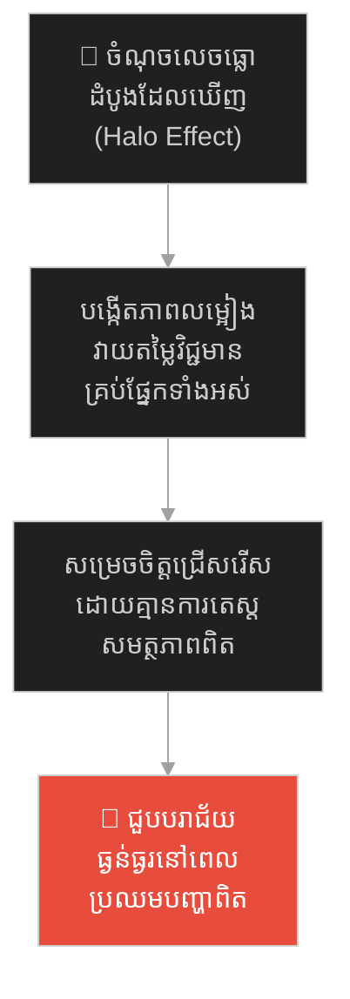
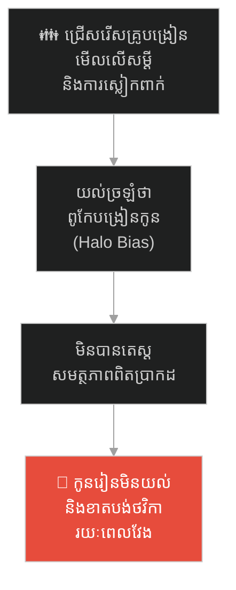
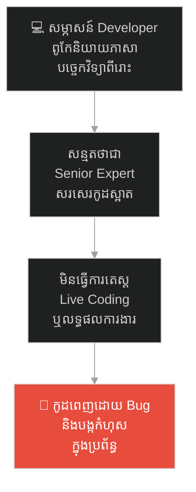
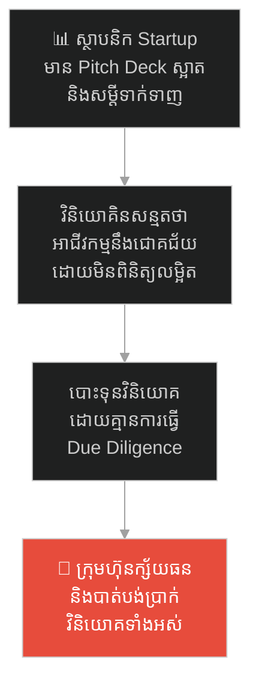
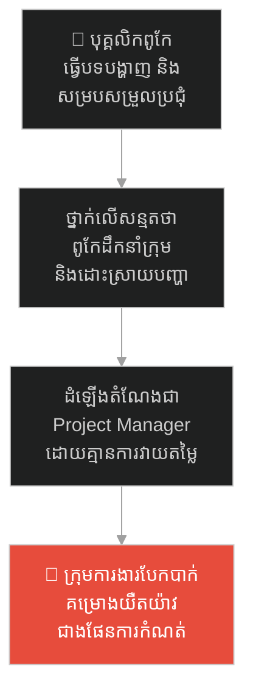
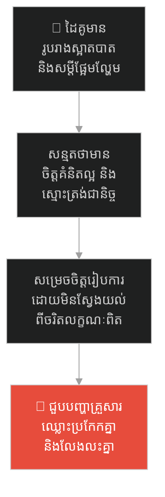
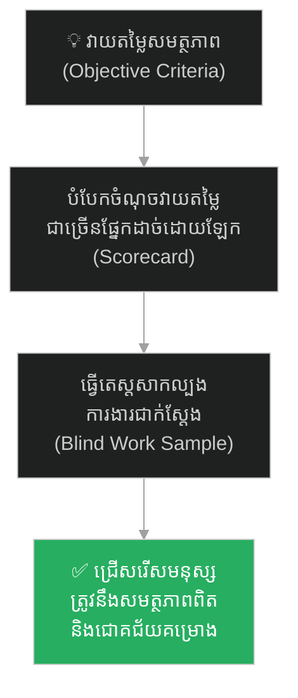

# The Golden Armor and the Scarred Veteran (អាវក្រោះមាស និងទាហានចាស់ពោរពេញដោយស្លាកស្នាម)៖ គ្រោះថ្នាក់នៃលម្អៀង Halo Effect និងយុទ្ធសាស្ត្រវាយតម្លៃសមត្ថភាពពិត

**Author:** ichamrong  
**Date:** 2026-05-27  
**Tags:** #halo-effect #cognitive-bias #leadership #hiring-trap #psychology #critical-thinking  
**Category:** Concepts / Parables  
**Read Time:** ~15 min  

---

## 📌 មាតិកា (Table of Contents)
- [អន្ទាក់ផ្លូវចិត្ត (The Trap)](#អន្ទាក់ផ្លូវចិត្ត-the-trap)
- [១. រឿងព្រេង៖ ជម្រើសមេទ័ពថ្មី និងពន្លឺនៃអាវក្រោះមាស (The Legend of the Golden Armor)](#1)
  - [បេក្ខជនទាំងពីរ (The Two Candidates)](#1-1)
  - [ការវាយតម្លៃលំអៀង និងលទ្ធផលចុងក្រោយ (The Illusion & the Defeat)](#1-2)
- [២. បញ្ហា៖ លម្អៀងពន្លឺបំភាន់ភ្នែក និងទំនុកចិត្តក្លែងក្លាយ (The Issue: Halo Effect & False Competence)](#2)
- [៣. ឧទាហរណ៍ជាក់ស្តែងក្នុងពិភពពិត (Real World Examples)](#3)
  - [ឧទាហរណ៍ទី ១ — កម្រិតស្រាល (គ្រួសារ)៖ ការជ្រើសរើសគ្រូបង្រៀនឱ្យកូនដោយមើលលើសំបកក្រៅ (The Charming Tutor Selection)](#3-1)
  - [ឧទាហរណ៍ទី ២ — កម្រិតមធ្យម (បច្ចេកទេស)៖ ការជួល Developer ផ្អែកលើសម្តីប្រាស្រ័យទាក់ទាញ (The Smooth-Talking Developer)](#3-2)
  - [ឧទាហរណ៍ទី ៣ — កម្រិតមធ្យម (ធុរកិច្ច)៖ ការវិនិយោគលើស្ថាបនិកដែលមាន Pitch Deck ស្អាតប្លែក (The Pitch Deck Illusion)](#3-3)
  - [ឧទាហរណ៍ទី ៤ — កម្រិតមធ្យម (សង្គម/គ្រប់គ្រង)៖ ការដំឡើងតំណែងបុគ្គលិកដែលពូកែធ្វើបទបង្ហាញ (The Presentation Star Promotion)](#3-4)
  - [ឧទាហរណ៍ទី ៥ — កម្រិតធ្ងន់ (ទំនាក់ទំនង)៖ ការជ្រើសរើសដៃគូជីវិតដោយផ្អែកលើរូបរាង និងសម្តីផ្អែមល្ហែម (The Romantic Halo Trap)](#3-5)
- [៤. ដំណោះស្រាយទូទៅ៖ ការវាយតម្លៃផ្អែកលើទិន្នន័យពិត និងការបំបែករចនាសម្ព័ន្ធពិន្ទុ (The General Solution: Blind Evaluation & Scorecards)](#4)
- [សេចក្តីសន្និដ្ឋាន (Conclusion)](#conclusion)
- [ឯកសារយោង (References)](#references)
- [Related Posts](#related-posts)

---

## អន្ទាក់ផ្លូវចិត្ត (The Trap)

តើអ្នកធ្លាប់មានអារម្មណ៍ពេញចិត្ត និងជឿជាក់លើសមត្ថភាពការងាររបស់នរណាម្នាក់ភ្លាមៗ គ្រាន់តែដោយសារពួកគេមានរូបរាងស្អាតបាត ស្លៀកពាក់ប្រណីត ឬមានសម្តីនិយាយស្តីពីរោះរណ្តំ និងពោរពេញដោយទំនុកចិត្តដែរឬទេ?

នៅក្នុងជីវិតការងារ និងការសម្រេចចិត្តជាប្រចាំ យើងតែងតែជួប៖
* **ការសន្និដ្ឋានលឿនពេក** ថាអ្នកដែលមានចំណុចលេចធ្លោមួយផ្នែក (ដូចជា ការនិយាយស្តី ឬរូបរាង) នឹងមានសមត្ថភាពខ្ពស់ក្នុងផ្នែកផ្សេងៗទៀតទាំងអស់។
* **ការមើលរំលង** យុទ្ធជនចាស់ៗ ឬអ្នកជំនាញពិតប្រាកដដែលមិនសូវពូកែខាងតុបតែងខ្លួន ឬនិយាយអួតបង្ហាញខ្លួនឯង។

ការអនុញ្ញាតឱ្យចំណុចវិជ្ជមានលេចធ្លោតែមួយផ្នែក មកបំភាន់ភ្នែកធ្វើឱ្យយើងវាយតម្លៃសមត្ថភាពជារួមខុស ហៅថា **អន្ទាក់ Halo Effect (លម្អៀងពន្លឺបំភាន់ភ្នែក)**។

ដើម្បីយល់ដឹងពីវិធីវាយតម្លៃមនុស្សដោយសុក្រឹតភាព នេះជាផែនទីបង្ហាញផ្លូវសម្រាប់អត្ថបទនេះ៖
1. **រឿងព្រេង (The Historic Legend)** — រឿងរ៉ាវរបស់ព្រះរាជាដែលជ្រើសរើសមេទ័ពពាក់អាវក្រោះមាសដ៏ភ្លឺចែងចាំង ជំនួសឱ្យទាហានចាស់ពោរពេញដោយស្លាកស្នាមសង្គ្រាម។
2. **បញ្ហា (The Issue)** — យន្តការចិត្តសាស្ត្រនៃ Halo Effect និងរបៀបដែលខួរក្បាលបំភាន់ភ្នែកយើង។
3. **ឧទាហរណ៍ជាក់ស្តែងក្នុងពិភពពិត (Real World Examples)** — ពិនិត្យមើលឥទ្ធិពលនៃការលម្អៀងនេះក្នុងកម្រិតគ្រួសារ ព័ត៌មានវិទ្យា ធុរកិច្ច ការគ្រប់គ្រង និងទំនាក់ទំនង។
4. **ដំណោះស្រាយទូទៅ (The General Solution)** — ការបង្កើត Scorecard និងយន្តការវាយតម្លៃការងារពិត (Blind Assessment)។

---

## ១. រឿងព្រេង៖ ជម្រើសមេទ័ពថ្មី និងពន្លឺនៃអាវក្រោះមាស (The Legend of the Golden Armor)

នៅក្នុងព្រះរាជាណាចក្រមួយ ព្រះរាជាត្រូវជ្រើសរើសមេទ័ពថ្មីម្នាក់ ដើម្បីដឹកនាំកងទ័ពចេញទៅប្រយុទ្ធជាមួយសត្រូវដែលកំពុងឈ្លានពាននៅតាមព្រំដែន។ សង្គ្រាមនេះជាសង្គ្រាមដ៏សំខាន់សម្រាប់ជោគវាសនារបស់នគរ ដូច្នេះតំណែងមេទ័ពធំត្រូវការមនុស្សដែលមានសមត្ថភាពខ្ពស់បំផុត។ មានបេក្ខជនចុងក្រោយចំនួនពីរនាក់ដែលត្រូវចូលគាល់ព្រះរាជាដើម្បីទទួលការសម្ភាសន៍។

---

### បេក្ខជនទាំងពីរ (The Two Candidates)

**បេក្ខជនទី១ ឈ្មោះ វ៉ាឡឺ (Valor):**  
គាត់ជាកូនកាត់អភិជនម្នាក់ ដែលទើបតែបញ្ចប់ការសិក្សាយ៉ាងជោគជ័យពីសាលាយោធាជាន់ខ្ពស់។ វ៉ាឡឺ មានរូបរាងសង្ហា ខ្ពស់ស្រឡះ និងពាក់អាវក្រោះធ្វើពីមាសសុទ្ធដ៏ភ្លឺចែងចាំងចាំងភ្នែក។ ការដើររបស់គាត់មានភាពអង់អាច ហើយការនិយាយស្តីរបស់គាត់គឺមានភាពជឿជាក់ និងពីរោះរណ្តំ។ គាត់ចេះប្រើពាក្យបច្ចេកទេសសង្គ្រាម និងយុទ្ធសាស្ត្រចម្លែកៗយ៉ាងស្ទាត់ជំនាញ ធ្វើឱ្យអ្នករាល់គ្នាកោតសរសើរមិនដាច់ពីមាត់។

**បេក្ខជនទី២ ឈ្មោះ ហ្គ្រីម (Grim):**  
គាត់ជាទាហានចាស់ម្នាក់ដែលធ្លាប់ឆ្លងកាត់សមរភូមិសង្គ្រាមពិតប្រាកដរាប់មិនអស់។ ហ្គ្រីម មានរូបរាងមិនសូវស្អាតបាត សក់ស្កូវ និងមានស្លាកស្នាមកាំបិតនៅពេញផ្ទៃមុខ និងដងខ្លួន។ អាវក្រោះរបស់គាត់ចាស់ គ្មានពន្លឺចែងចាំង និងមានស្នាមប្រេះដោយសារការប្រយុទ្ធ។ គាត់និយាយស្តីតិចៗ មិនសូវពូកែរៀបរាប់ពាក្យពិរោះៗ និងទ្រឹស្តីក្នុងសៀវភៅឡើយ ប៉ុន្តែក្រសែភ្នែករបស់គាត់មុតស្រួចដូចសត្វឥន្ទ្រី។

---

### ការវាយតម្លៃលំអៀង និងលទ្ធផលចុងក្រោយ (The Illusion & the Defeat)

គ្រាន់តែក្រឡេកឃើញ វ៉ាឡឺ ព្រះរាជាមានអារម្មណ៍ពេញចិត្ត និងស្រឡាញ់យ៉ាងខ្លាំង។ រស្មីនៃអាវក្រោះមាស និងរូបរាងដ៏សង្ហារបស់ វ៉ាឡឺ បានធ្វើឱ្យព្រះរាជាសន្និដ្ឋានដោយស្វ័យប្រវត្តិថា៖  
> *«មនុស្សដែលមានរូបរាងអង់អាច ស្អាតបាត និងនិយាយស្តីជឿជាក់បែបនេះ ប្រាកដជាមេទ័ពដ៏ពូកែ និងមានយុទ្ធសាស្ត្រល្អឥតខ្ចោះមិនខាន!»*

រីឯ ហ្គ្រីម ត្រូវបានព្រះរាជាមើលរំលងភ្លាមៗ ព្រោះមើលទៅចាស់ជ្រីវជ្រួញ ស្លៀកពាក់ចាស់រញ៉េរញ៉ៃ គ្មានរស្មី និងមិនពូកែនិយាយអួតឡើយ។ ព្រះរាជាគិតថា៖ *«មនុស្សបែបនេះ ធ្វើម្តេចអាចដឹកនាំទ័ពធំឈ្នះសត្រូវដ៏ខ្លាំងក្លាបានទៅ?»*

ទីបំផុត ព្រះរាជាបានសម្រេចចិត្តប្រគល់ដាវមេទ័ពធំទៅឱ្យ វ៉ាឡឺ យ៉ាងរីករាយ។

មួយខែក្រោយមក នៅក្នុងសមរភូមិពិតប្រាកដ សត្រូវមិនបានវាយប្រហារតាមទ្រឹស្តីនៅក្នុងសៀវភៅ ដែល វ៉ាឡឺ ធ្លាប់រៀននោះទេ។ នៅពេលដែលសត្រូវប្រើល្បិចវាយឆ្មក់ និងកាត់ផ្តាច់ស្បៀង វ៉ាឡឺ ដែលមិនធ្លាប់មានបទពិសោធន៍ប្រយុទ្ធជាក់ស្តែង បានភ័យស្លន់ស្លោ និងបញ្ជាកងទ័ពឱ្យរត់ខ្ចាត់ខ្ចាយ។ អាវក្រោះមាសដ៏ភ្លឺចែងចាំងរបស់គាត់ ក្លាយជាផ្ទាំងស៊ីបដ៏ល្អសម្រាប់ព្រួញរបស់សត្រូវ។ កងទ័ពធំត្រូវរងបរាជ័យយ៉ាងធ្ងន់ធ្ងរ។

ចំណែកឯ ហ្គ្រីម ដែលជាកូនទាហានធម្មតានៅក្នុងជួរ បានឈានជើងឡើងមកប្រមូលផ្តុំកងទ័ពដែលនៅសេសសល់ ហើយប្រើប្រាស់បទពិសោធន៍ និងស្នាមរបួសយុទ្ធសាស្ត្ររាប់ឆ្នាំរបស់គាត់ ដើម្បីវាយបក និងទប់ទល់ការវាយប្រហារ រហូតដល់ទទួលបានជ័យជម្នះមកវិញដោយលំបាក។

ព្រះរាជាទើបតែដឹងខ្លួនថា ទ្រង់បានយក "រូបរាងខាងក្រៅ" មកធ្វើជាតំណាងឱ្យ "សមត្ថភាពពិតប្រាកដ"។

---

## ២. បញ្ហា៖ លម្អៀងពន្លឺបំភាន់ភ្នែក និងទំនុកចិត្តក្លែងក្លាយ (The Issue: Halo Effect & False Competence)

នៅក្នុងចិត្តវិទ្យានៃការសម្រេចចិត្ត (Cognitive Psychology) បាតុភូតនេះត្រូវបានហៅថា **The Halo Effect (លម្អៀងពន្លឺបំភាន់ភ្នែក)**។
* **យន្តការបំភាន់៖** នៅពេលយើងឃើញលក្ខណៈវិជ្ជមានមួយផ្នែករបស់បុគ្គលម្នាក់ (ដូចជារូបរាង សម្តី ឬសញ្ញាបត្រពីសាលាល្បី) ខួរក្បាលរបស់យើងបង្កើត «រស្មីវិជ្ជមាន (Halo)» គ្របដណ្តប់លើពួកគេ រួចសន្និដ្ឋានដោយស្វ័យប្រវត្តថាពួកគេក៏ពូកែខាងការងារ ដឹកនាំក្រុម និងស្មោះត្រង់ផងដែរ។
* **ទំនុកចិត្ត មិនស្មើនឹង សមត្ថភាព (Confidence ≠ Competence)៖** ពន្លឺនៃអាវក្រោះមាស គឺជានិមិត្តរូបនៃ "ទំនុកចិត្ត" និង "សំបកក្រៅ"។ យើងងាយនឹងបកស្រាយច្រឡំថា មនុស្សដែលជឿជាក់លើខ្លួនឯង គឺជាមនុស្សដែលពូកែ។ ប៉ុន្តែនៅក្នុងស្ថានភាពជាក់ស្តែង ការងារត្រូវដោះស្រាយដោយសមត្ថភាព និងបទពិសោធន៍ មិនមែនដោយសារសម្តីនោះទេ។

---

## ៣. ឧទាហរណ៍ជាក់ស្តែងក្នុងពិភពពិត

ដើម្បីយល់ដឹងឱ្យកាន់តែស៊ីជម្រៅ ផ្លូវការសិក្សានឹងនាំអ្នកទៅពិនិត្យមើល **ឧទាហរណ៍ចំនួន ៥ កម្រិតខុសៗគ្នា** ក្នុងជីវិតរស់នៅប្រចាំថ្ងៃ៖

---

### ឧទាហរណ៍ទី ១ — កម្រិតស្រាល (គ្រួសារ)៖ ការជ្រើសរើសគ្រូបង្រៀនឱ្យកូនដោយមើលលើសំបកក្រៅ (The Charming Tutor Selection)

**ស្ថានភាព៖** ឪពុកម្តាយចង់ជួលគ្រូម្នាក់មកបង្រៀនគណិតវិទ្យាបន្ថែមដល់កូននៅផ្ទះ។

* **ភាគី A (លង់នឹងសំបកក្រៅ)៖** ពួកគេជួបបេក្ខជនម្នាក់ដែលស្លៀកពាក់ប្រណីត ជិះឡានទំនើប និងមានសម្តីនិយាយស្តីផ្អែមល្ហែម គួរសមខ្លាំង។ ឪពុកម្តាយសន្មតភ្លាមថា គាត់ជាគ្រូដ៏ពូកែ និងមានទំនួលខុសត្រូវខ្ពស់ ដោយមិនបានសួររកវិធីសាស្ត្របង្រៀន ឬតេស្តសាកល្បងឡើយ។
* **ភាគី B (ការពិតជាក់ស្តែង)៖** ក្រោយមក ទើបដឹងថាគ្រូនោះគ្មានគរុកោសល្យបង្រៀនសោះ បង្រៀនកូនមិនយល់ និងតែងតែមកបង្រៀនយឺតយ៉ាវជានិច្ច។

---

### ឧទាហរណ៍ទី ២ — កម្រិតមធ្យម (បច្ចេកទេស)៖ ការជួល Developer ផ្អែកលើសម្តីប្រាស្រ័យទាក់ទាញ (The Smooth-Talking Developer)

**ស្ថានភាព៖** ក្រុមការងារ IT កំពុងសម្ភាសន៍ជ្រើសរើស Senior Web Developer។

* **ភាគី A (អន្ទាក់សម្ភាសន៍របស់ HR)៖** បេក្ខជនម្នាក់ចេះនិយាយភាសាបច្ចេកវិទ្យាទាន់សម័យ (Buzzwords) និងរៀបរាប់បទពិសោធន៍ដ៏អស្ចារ្យយ៉ាងមានទំនុកចិត្តក្នុងពេលសម្ភាសន៍។ ក្រុមការងារមានការចាប់អារម្មណ៍ខ្លាំង ហើយយល់ព្រមទទួលយកដោយមិនបានធ្វើការតេស្តកូដជាក់ស្តែង (No Live Coding test)។
* **ភាគី B (ការពិតជាក់ស្តែង)៖** នៅពេលចូលធ្វើការពិតប្រាកដ Developer រូបនោះសរសេរកូដគ្មានស្តង់ដារ បង្កើត Bug ច្រើន និងមិនចេះរបៀប Refactor កូដឡើយ។ ផ្ទុយទៅវិញ បេក្ខជនម្នាក់ទៀតដែលមិនសូវពូកែនិយាយ ប៉ុន្តែសរសេរកូដស្អាត បែរជាត្រូវធ្លាក់។

---

### ឧទាហរណ៍ទី ៣ — កម្រិតមធ្យម (ធុរកិច្ច)៖ ការវិនិយោគលើស្ថាបនិកដែលមាន Pitch Deck ស្អាតប្លែក (The Pitch Deck Illusion)

**ស្ថានភាព៖** ក្រុមហ៊ុនវិនិយោគទុន (VC) ស្វែងរកការវិនិយោគលើគម្រោង Startup ថ្មីៗ។

* **ភាគី A (ពន្លឺបំភាន់ភ្នែករបស់ស្ថាបនិក)៖** ស្ថាបនិកម្នាក់មានសាវតារបញ្ចប់ការសិក្សាពីសាលាល្បី មាន Pitch Deck រចនាយ៉ាងស្រស់ស្អាត និងសមត្ថភាពធ្វើបទបង្ហាញល្អឥតខ្ចោះ។ វិនិយោគិនលង់នឹងរស្មីនេះ ហើយសន្មតថាគំនិតអាជីវកម្ម និងម៉ូដែលហិរញ្ញវត្ថុរបស់គាត់គ្មានចំណុចខ្វះខាតឡើយ។
* **ភាគី B (ការពិតជាក់ស្តែង)៖** ពួកគេសម្រេចបោះទុនវិញោគដោយខកខានការសិក្សាលម្អិតពីទិន្នន័យពិត (Failed Due Diligence)។ ក្រោយមក ទើបដឹងថាទីផ្សារផលិតផលនោះគ្មានតម្រូវការទាល់តែសោះ (No Product-Market Fit)។

---

### ឧទាហរណ៍ទី ៤ — កម្រិតមធ្យម (សង្គម/គ្រប់គ្រង)៖ ការដំឡើងតំណែងបុគ្គលិកដែលពូកែធ្វើបទបង្ហាញ (The Presentation Star Promotion)

**ស្ថានភាព៖** នាយកគ្រប់គ្រងត្រូវការដំឡើងតំណែងប្រធានផ្នែកគ្រប់គ្រងគម្រោង (Project Manager) ថ្មី។

* **ភាគី A (លំអៀងលើការប្រាស្រ័យទាក់ទង)៖** បុគ្គលិកម្នាក់មានចំណុចលេចធ្លោខ្លាំងក្នុងការនិយាយស្តី សម្របសម្រួលកិច្ចប្រជុំ និងចូលចិត្តជជែកជាមួយថ្នាក់លើ។ នាយកគ្រប់គ្រងសន្មតថា គាត់ប្រាកដជាមានលក្ខណៈដឹកនាំល្អ និងពូកែដោះស្រាយបញ្ហាបច្ចេកទេស។
* **ភាគី B (ការពិតជាក់ស្តែង)៖** បន្ទាប់ពីទទួលបានការដំឡើងតំណែង គាត់មិនអាចដោះស្រាយទំនាស់ក្នុងក្រុម ឬគ្រប់គ្រងការងារបច្ចេកទេសស្មុគស្មាញបានឡើយ។ ក្រុមការងារមានការមិនពេញចិត្ត និងយឺតយ៉ាវក្នុងការប្រគល់ផលិតផល ព្រោះគាត់គ្មានបទពិសោធន៍គ្រប់គ្រងជាក់ស្តែង។

---

### ឧទាហរណ៍ទី ៥ — កម្រិតធ្ងន់ (ទំនាក់ទំនង)៖ ការជ្រើសរើសដៃគូជីវិតដោយផ្អែកលើរូបរាង និងសម្តីផ្អែមល្ហែម (The Romantic Halo Trap)

**ស្ថានភាព៖** យុវជនម្នាក់កំពុងជ្រើសរើសដៃគូជីវិតសម្រាប់ការកសាងគ្រួសាររយៈពេលវែង។

* **ភាគី A (អន្ទាក់រូបរាងខាងក្រៅ)៖** ដៃគូដែលគាត់ទើបតែជួប មានរូបរាងស្រស់ស្អាតខ្លាំង មានរបៀបរៀបរយ និងពូកែនិយាយសម្តីផ្អែមល្ហែមជក់ចិត្ត។ គាត់សន្មតដោយស្វ័យប្រវត្តថា នាងក៏ជាមនុស្សមានចិត្តល្អ យល់ចិត្ត និងស្មោះត្រង់សម្រាប់ការកសាងគ្រួសារ។
* **ភាគី B (ការពិតជាក់ស្តែង)៖** ក្រោយរៀបការរួច ទើបដឹងថានាងជាមនុស្សមានចរិតលក្ខណៈអត្មានិយម មិនយល់ពីតម្លៃនៃការចែករំលែក និងតែងតែប្រើប្រាស់អំពើហិង្សាផ្លូវចិត្ត ដែលនាំឱ្យជីវិតអាពាហ៍ពិពាហ៍ប្រេះឆា។

---

## ៤. ដំណោះស្រាយទូទៅ៖ ការវាយតម្លៃផ្អែកលើទិន្នន័យពិត និងការបំបែករចនាសម្ព័ន្ធពិន្ទុ (The General Solution: Blind Evaluation & Scorecards)

ដើម្បីលុបបំបាត់ឥទ្ធិពលបំភាន់ភ្នែករបស់ Halo Effect និងវាយតម្លៃមនុស្សដោយយុត្តិធម៌ ស្ថាប័ន និងបុគ្គលត្រូវអនុវត្តវិធានការទាំងនេះ៖

### ១. ប្រើប្រាស់ប្រព័ន្ធវាយតម្លៃការងារពិត (Blind Assessment / Work Samples)
នៅក្នុងវិស័យបច្ចេកវិទ្យា និងការជ្រើសរើសបុគ្គលិក ត្រូវអនុញ្ញាតឱ្យបេក្ខជនធ្វើតេស្តការងារជាក់ស្តែង (ដូចជា កូដតេស្ត ឬករណីសិក្សា) ដោយមិនបង្ហាញឈ្មោះ រូបថត សាលារៀន ឬភេទ (Blind Evaluation)។ នេះជួយឱ្យអ្នកវាយតម្លៃផ្តោតអារម្មណ៍តែលើ "គុណភាពការងារជាក់ស្តែង" ប៉ុណ្ណោះ។

### ២. បង្កើតតារាងពិន្ទុដាច់ដោយឡែក (Structured Evaluation Scorecard)
មុនពេលធ្វើសម្ភាសន៍ ឬការសម្រេចចិត្ត ត្រូវកំណត់លក្ខណៈវិនិច្ឆ័យ (Criteria) ឱ្យបានច្បាស់លាស់ និងដាក់ពិន្ទុដាច់ដោយឡែកពីគ្នា។ ឧទាហរណ៍៖ 
* *ជំនាញបច្ចេកទេស (Technical Skill)*
* *របៀបដោះស្រាយបញ្ហា (Problem Solving)*
* *ការប្រាស្រ័យទាក់ទង (Communication)*  
ការវាយតម្លៃបែបនេះ ការពារកុំឱ្យពិន្ទុខ្ពស់នៃផ្នែក "ការប្រាស្រ័យទាក់ទង" មកអូសទាញ ឬបង្កើនពិន្ទុផ្នែក "ជំនាញបច្ចេកទេស" ដោយលំអៀង។

### ៣. អនុវត្តការវាយតម្លៃពីសំណាក់មនុស្សច្រើននាក់ (Panel Review)
ប្រើប្រាស់គណៈកម្មការវាយតម្លៃដែលមានសមាជិកចម្រុះគ្នា មកពីផ្នែកផ្សេងៗ ដើម្បីផ្តល់មតិយោបល់ និងពិន្ទុដោយឯករាជ្យ។ នេះជួយកាត់បន្ថយការលម្អៀងផ្ទាល់ខ្លួន និងបង្កើតការសម្រេចចិត្តដែលមានតុល្យភាព។

---

## 🐇 ធ្លាក់ចូលក្នុងរន្ធទន្សាយយុទ្ធសាស្ត្រ (Enter the Strategic Rabbit Hole)

ដើម្បីស្វែងយល់បន្ថែមអំពីរបៀបដែលកំហុស និងការគំរាមកំហែងអាចចូលមកតាមរយៈភាពទាក់ទាញ ឬ "អំណោយ" ដែលមើលទៅល្អឥតខ្ចោះពីខាងក្រៅ ប៉ុន្តែបង្កប់នូវគ្រោះថ្នាក់ដ៏ធំធេងពីខាងក្នុង (Trojan Horse) សូមបន្តដំណើររបស់អ្នក៖

* 🚀 **[ចាប់ផ្តើមដំណើររុករក (Start the Journey) ➔ The Trojan Horse and the Fall of the Impregnable City](./32-the-trojan-horse.md)**

---

## សេចក្តីសន្និដ្ឋាន (Conclusion)

> **«រស្មីនៃអាវក្រោះមាស អាចបំភាន់ភ្នែកស្តេចមួយអង្គឱ្យមើលរំលងស្នាមរបួសពិតរបស់វីរបុរស ដែលធ្លាប់ឆ្លងកាត់សមរភូមិជាក់ស្តែង។»**

ចូរកុំវាយតម្លៃជម្រៅទឹកដោយគ្រាន់តែមើលលើរលកលើផ្ទៃទឹក ហើយក៏កុំវាយតម្លៃសមត្ថភាពមនុស្សដោយគ្រាន់តែមើលលើសំបកក្រៅ ឬសម្តីជឿជាក់របស់ពួកគេឡើយ។ សំបកក្រៅដ៏ស្រស់ស្អាតអាចតុបតែងបានយ៉ាងងាយ ប៉ុន្តែបទពិសោធន៍ សមត្ថភាពពិត និងភាពស្មោះត្រង់ ត្រូវការពេលវេលា និងសកម្មភាពជាក់ស្តែងដើម្បីបញ្ជាក់។

ចូរកាត់ផ្តាច់ពន្លឺបំភាន់ភ្នែក ហើយមើលទៅលើលទ្ធផលជាក់ស្តែង។

---

## ឯកសារយោង (References)

* **Thorndike, Edward L.** — *A Constant Error in Psychological Ratings* (1920)។ និពន្ធដើមដែលបានរកឃើញ និងដាក់ឈ្មោះបាតុភូត Halo Effect ក្នុងការវាយតម្លៃមនុស្ស។
* **Nisbett, Richard E. & Wilson, Timothy D.** — *The Halo Effect: Evidence for Systematic Bias in Cognitive Ratings* (1977)។ ការសិក្សាពិសោធន៍ចិត្តវិទ្យាលម្អិតអំពីរបៀបដែល Halo Effect ដំណើរការក្រោមដឹងខ្លួន។
* **Kahneman, Daniel** — *Thinking, Fast and Slow* (2011)។ ការវិភាគស៊ីជម្រៅលើលម្អៀងការយល់ដឹង និងឥទ្ធិពលនៃការយល់ឃើញដំបូង (First Impressions) លើខួរក្បាល។

---

## Related Posts

* **[23 The Halo Effect: The Illusion of Perfection](../articles/23-halo-effect.md)** — អត្ថបទគោលបកស្រាយពីយន្តការ និងផលប៉ះពាល់នៃ Halo Effect ក្នុងស្ថាប័នការងារ។
* **[20 Cognitive Biases: The Hidden Flaws in Human Thinking](../articles/20-cognitive-biases-the-flaws-in-human-thinking.md)** — ការយល់ដឹងអំពីកំហុសនៃការគិតជារួម និងរបៀបកសាងប្រព័ន្ធការពារខ្លួន។
* **[06 The Illusion of Ease](../articles/06-the-illusion-of-ease.md)** — ការយល់ច្រឡំថាការងារមួយស្រួល គ្រាន់តែឃើញគេធ្វើវាបានយ៉ាងរលូន។

---
*Last updated: 2026-05-27*

## Related

- [💡 Concepts README](../README.md)
- [📚 Main Repository README](../../../README.md)
- [Developer Habits](../../developer-habits/README.md)
- [Mental Health & Well-being](../../mental-health/README.md)
- [Management & SDLC](../../management/README.md)
