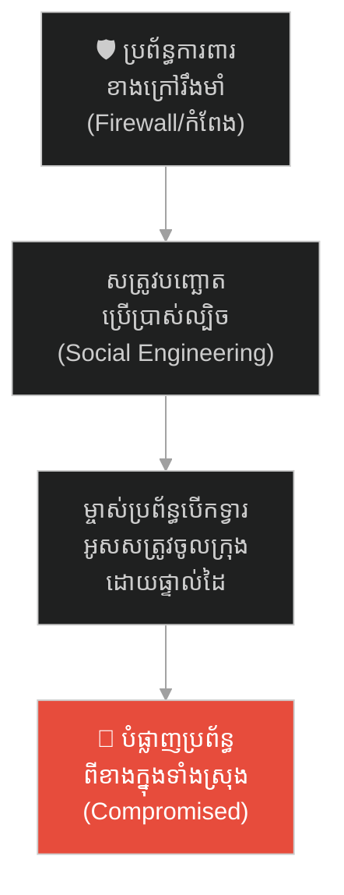
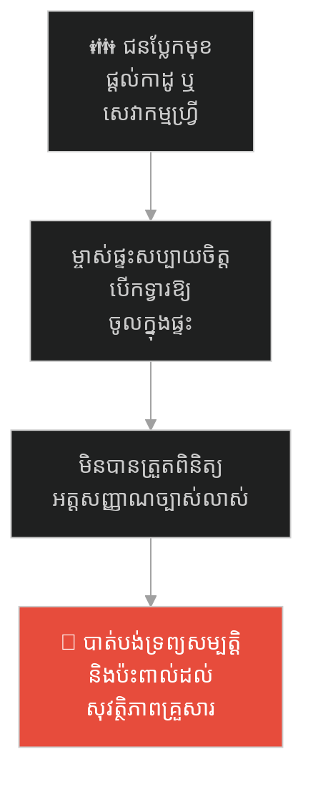
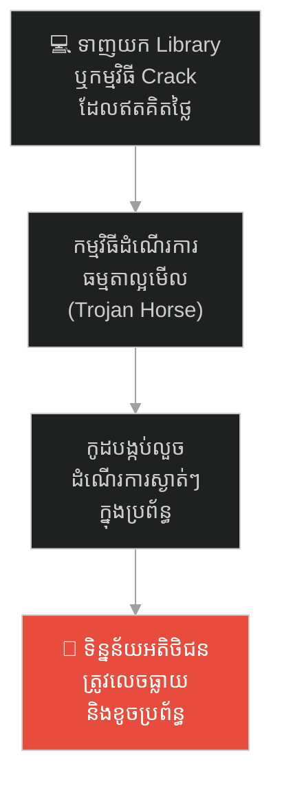
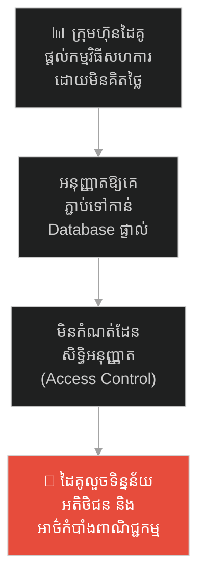
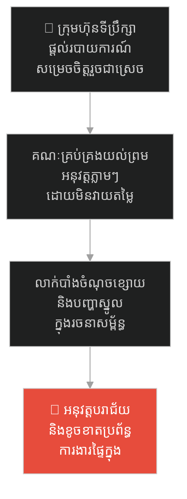
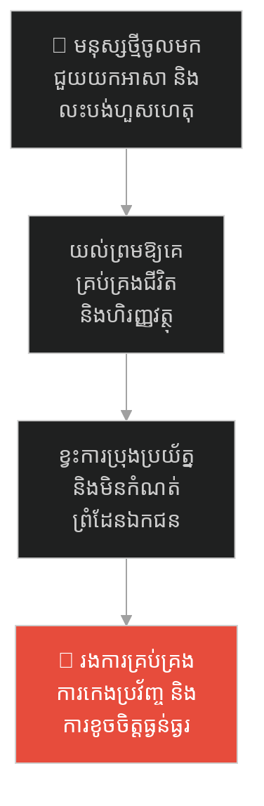
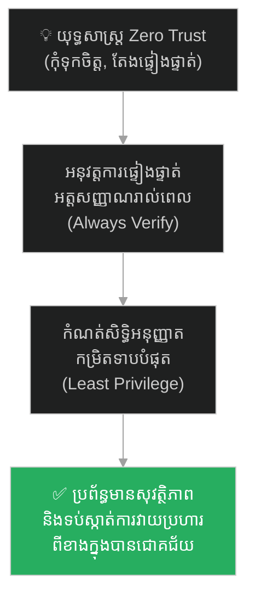

# The Trojan Horse and the Fall of the Impregnable City (សេះឈើ និងការដួលរលំនៃទីក្រុងដែលមិនអាចវាយបំបែកបាន)៖ គ្រោះថ្នាក់នៃលម្អៀង Social Engineering និងយុទ្ធសាស្ត្រ Zero Trust

**Author:** ichamrong  
**Date:** 2026-05-27  
**Tags:** #trojan-horse #cybersecurity #greek-history #social-engineering #zero-trust #critical-thinking  
**Category:** Concepts / Parables  
**Read Time:** ~15 min  

---

## 📌 មាតិកា (Table of Contents)
- [អន្ទាក់ផ្លូវចិត្ត (The Trap)](#អន្ទាក់ផ្លូវចិត្ត-the-trap)
- [១. រឿងព្រេង៖ សេះឈើក្រុងទ្រយ និងកំពែងដែកថែប (The Legend of the Trojan Horse)](#1)
  - [សង្គ្រាម ១០ ឆ្នាំ (The Ten-Year War)](#1-1)
  - [អំណោយរបស់សត្រូវ និងការដួលរលំ (The Poisoned Gift & the Fall)](#1-2)
- [២. បញ្ហា៖ វិស្វកម្មសង្គម និងការបំផ្លាញពីខាងក្នុង (The Issue: Social Engineering & Internal Attack)](#2)
- [៣. ឧទាហរណ៍ជាក់ស្តែងក្នុងពិភពពិត (Real World Examples)](#3)
  - [ឧទាហរណ៍ទី ១ — កម្រិតស្រាល (គ្រួសារ)៖ ការអនុញ្ញាតឱ្យជនចម្លែកចូលផ្ទះដោយល្បិចផ្ដល់កាដូហ្វ្រី (The Fake Free Gift Promotion)](#3-1)
  - [ឧទាហរណ៍ទី ២ — កម្រិតមធ្យម (បច្ចេកទេស)៖ ការទាញយក Library ឬកម្មវិធី Crack ដែលបង្កប់មេរោគ (The Infected Open-Source Package)](#3-2)
  - [ឧទាហរណ៍ទី ៣ — កម្រិតមធ្យម (ធុរកិច្ច)៖ ការសហការប្រព័ន្ធជាមួយដៃគូដោយមិនបានត្រួតពិនិត្យសន្តិសុខ (The Unsecured API Integration)](#3-3)
  - [ឧទាហរណ៍ទី ៤ — កម្រិតមធ្យម (សង្គម/គ្រប់គ្រង)៖ ការអនុវត្តស៊ុមការងារពីខាងក្រៅដោយគ្មានការកែតម្រូវ (The Unfiltered Framework Adoption)](#3-4)
  - [ឧទាហរណ៍ទី ៥ — កម្រិតធ្ងន់ (ទំនាក់ទំនង)៖ ការអនុញ្ញាតឱ្យមនុស្សពុលចូលមកគ្រប់គ្រងជីវិត (The Charming Manipulator Trap)](#3-5)
- [៤. ដំណោះស្រាយទូទៅ៖ គោលការណ៍ Zero Trust និងការផ្ទៀងផ្ទាត់គ្រប់ច្រកល្ហក (The General Solution: Zero Trust Architecture & Continuous Verification)](#4)
- [សេចក្តីសន្និដ្ឋាន (Conclusion)](#conclusion)
- [ឯកសារយោង (References)](#references)
- [Related Posts](#related-posts)

---

## អន្ទាក់ផ្លូវចិត្ត (The Trap)

តើអ្នកធ្លាប់ជួបស្ថានភាពដែលប្រព័ន្ធការពាររបស់អ្នករឹងមាំខ្លាំងគ្មាននរណាអាចវាយចូលបាន ប៉ុន្តែចុងក្រោយអ្នកបែរជាបរាជ័យ គ្រាន់តែដោយសារតែអ្នកបានអនុញ្ញាតឱ្យ «វត្ថុ ឬមនុស្ស» ដែលមើលទៅគ្មានគ្រោះថ្នាក់ ចូលមកក្នុងផ្ទះ ឬប្រព័ន្ធការងាររបស់អ្នកដោយខ្លួនឯងដែរឬទេ?

នៅក្នុងយុគសម័យឌីជីថល និងការគ្រប់គ្រង៖
* **យើងតែងតែចំណាយលុយ** រាប់លានដុល្លារដើម្បីសាងសង់ Firewall ឬប្រព័ន្ធការពារខាងក្រៅដ៏រឹងមាំ។
* **ប៉ុន្តែយើងងាយនឹងចុះចាញ់** ចំពោះការលួងលោម ឬការបញ្ឆោតឱ្យទាញយករបស់ឥតគិតថ្លៃ (Social Engineering) ដែលជាច្រកទ្វារនាំសត្រូវចូលមកបំផ្លាញប្រព័ន្ធពីខាងក្នុង។

ការទុកចិត្តលើរបស់ដែលបង្ហាញខ្លួនក្នុងទម្រង់ជា «អំណោយ» ឬ «ជំនួយ» ដោយគ្មានការផ្ទៀងផ្ទាត់ ហៅថា **អន្ទាក់ Trojan Horse (សេះឈើក្រុងទ្រយ)**។

ដើម្បីយល់ដឹងពីសិល្បៈនៃការការពារប្រព័ន្ធ និងការកសាងទំនុកចិត្តប្រុងប្រយ័ត្ន នេះជាផែនទីបង្ហាញផ្លូវសម្រាប់អត្ថបទនេះ៖
1. **រឿងព្រេង (The Historic Legend)** — រឿងរ៉ាវរបស់ទីក្រុងទ្រយដែលកំពែងរឹងមាំ ១០ ឆ្នាំ ត្រូវដួលរលំត្រឹមមួយយប់ ព្រោះតែការទាញសេះឈើរបស់សត្រូវចូលក្រុង។
2. **បញ្ហា (The Issue)** — យន្តការវិស្វកម្មសង្គម (Social Engineering) និងរបៀបដែលចំណុចខ្សោយរបស់មនុស្សបើកទ្វារឱ្យសត្រូវ។
3. **ឧទាហរណ៍ជាក់ស្តែងក្នុងពិភពពិត (Real World Examples)** — ពិនិត្យមើលឥទ្ធិពលនៃសេះឈើក្នុងកម្រិតគ្រួសារ ព័ត៌មានវិទ្យា ធុរកិច្ច ការគ្រប់គ្រង និងទំនាក់ទំនង។
4. **ដំណោះស្រាយទូទៅ (The General Solution)** — ការអនុវត្តគោលការណ៍ Zero Trust (មិនទុកចិត្ត, តែងផ្ទៀងផ្ទាត់ជានិច្ច)។

---

## ១. រឿងព្រេង៖ សេះឈើក្រុងទ្រយ និងកំពែងដែកថែប (The Legend of the Trojan Horse)

នៅក្នុងប្រវត្តិសាស្ត្រក្រិកបុរាណ មានទីក្រុងមួយឈ្មោះថា **ទ្រយ (Troy)** ដែលត្រូវបានការពារដោយកំពែងថ្មដ៏មហិមាខ្ពស់កប់ពពក និងរឹងមាំបំផុត។ គ្មានកងទ័ពណាអាចវាយបំបែក ឬឡើងរំលងកំពែងនេះបានឡើយ។

---

### សង្គ្រាម ១០ ឆ្នាំ (The Ten-Year War)

កងទ័ពក្រិកដ៏ខ្លាំងពូកែ បានឡោមព័ទ្ធ និងវាយប្រហារទីក្រុងនេះអស់រយៈពេល ១០ ឆ្នាំពេញ។ ទោះបីជាពួកគេមានអ្នកចម្បាំងល្បីៗ និងអាវុធទំនើបៗយ៉ាងណាក៏ដោយ ក៏មិនអាចធ្វើឱ្យកំពែងក្រុងទ្រយរង្គោះរង្គើសូម្បីតែបន្តិច។ កម្លាំងបាយ និងការវាយលុកចំពីមុខ (Brute Force) គឺគ្មានន័យអ្វីទាំងអស់នៅចំពោះមុខប្រព័ន្ធការពារដ៏ល្អឥតខ្ចោះនេះ។

---

### អំណោយរបស់សត្រូវ និងការដួលរលំ (The Poisoned Gift & the Fall)

ដោយអស់សង្ឃឹមក្នុងការប្រើកម្លាំងបាយ មេទ័ពក្រិកដ៏វៃឆ្លាតឈ្មោះ **អូឌីសៀស (Odysseus)** បានគិតឃើញល្បិចយុទ្ធសាស្ត្រចិត្តសាស្ត្រមួយ។ គាត់បានបញ្ជាឱ្យជាងឈើសាងសង់ «សេះឈើដ៏ធំមហិមាមួយ»។ បន្ទាប់មក គាត់បានជ្រើសរើសទាហានដ៏ចំណានបំផុតមួយក្រុម លួចចូលទៅពួននៅខាងក្នុងពោះសេះឈើនោះ។

ចំណែកកងទ័ពក្រិកដែលនៅសល់ បានធ្វើពុតជាដុតជុំរុំរបស់ខ្លួនចោល រួចជិះទូកដកថយទៅបាត់អស់ពីច្រាំងសមុទ្រ ដោយបន្សល់ទុកតែសេះឈើដ៏ធំនោះនៅមុខទ្វារក្រុងប៉ុណ្ណោះ។

នៅព្រឹកបន្ទាប់ អ្នកក្រុងទ្រយបានចេញមកក្រៅកំពែង ហើយឃើញសត្រូវដកថយអស់។ ពួកគេជឿថា សេះឈើនេះគឺជា «អំណោយសន្តិភាព» ឬជាវត្ថុសក្ការៈថ្វាយព្រះ។ ទីប្រឹក្សាដ៏ឆ្លាតវៃម្នាក់បានព្រមានថា៖  
> *«ចូរកុំជឿពួកក្រិកឱ្យសោះ! សូម្បីតែពេលពួកគេនាំយកកាដូមកឱ្យ ក៏ត្រូវតែសង្ស័យដែរ! ចូរដុតសេះឈើនេះចោលភ្លាមទៅ!»*

ប៉ុន្តែស្តេចក្រុងទ្រយ ដោយសារតែភាពរំភើប និងអំនួតនៃជ័យជម្នះ បានបដិសេធការព្រមាន រួចបញ្ជាឱ្យទាហានអូសសេះឈើនោះចូលទៅក្នុងទីក្រុងដោយផ្ទាល់ដៃ ដើម្បីប្រារព្ធពិធីអបអរ។

យប់នោះ អ្នកក្រុងទ្រយបានរៀបចំពិធីជប់លៀងយ៉ាងសប្បាយក្អាកក្អាយ និងផឹកស្រវឹងដេកលង់លក់ទាំងអស់គ្នា។ នៅពេលកណ្តាលអធ្រាត្រ ទាហានក្រិកដែលលាក់ខ្លួននៅក្នុងពោះសេះឈើ បានលួចបើកទ្វារចេញមកក្រៅយ៉ាងស្ងាត់ស្ងៀម។ ពួកគេបានសម្លាប់អ្នកយាមទ្វារ រួចបើកទ្វារក្រុងដ៏ធំមហិមាពីខាងក្នុង ព្រមទាំងផ្តល់សញ្ញាភ្លើងហៅកងទ័ពក្រិកដែលលាក់ខ្លួនក្បែរនោះឱ្យចូលមក។

ទីក្រុងទ្រយដែលរឹងមាំបំផុតអស់រយៈពេល ១០ ឆ្នាំ ត្រូវដួលរលំ និងឆេះខ្ទេចខ្ទីដល់ដីត្រឹមតែមួយយប់ប៉ុណ្ណោះ។ វាមិនមែនដោយសារសត្រូវវាយបំបែកកំពែងពីខាងក្រៅទេ តែដោយសារតែ **«ម្ចាស់ក្រុងខ្លួនឯង បានបើកទ្វារនាំសត្រូវចូលមកខាងក្នុង»**។

---

## ២. បញ្ហា៖ វិស្វកម្មសង្គម និងការបំផ្លាញពីខាងក្នុង (The Issue: Social Engineering & Internal Attack)

រឿងប្រៀបធៀបនេះ ឆ្លុះបញ្ចាំងពីគ្រោះថ្នាក់បំផុតនៅក្នុងវិស័យ **Cybersecurity (សន្តិសុខព័ត៌មានវិទ្យា)** និងប្រព័ន្ធគ្រប់គ្រងការងារ៖
* **វិស្វកម្មសង្គម (Social Engineering)៖** ជនវាយប្រហារ (Hacker) មិនចាំបាច់វាយបំបែក Firewall ឬ Encryption ដ៏ស្មុគស្មាញឡើយ។ ពួកគេគ្រាន់តែប្រើល្បិចបោកប្រាស់ចិត្តសាស្ត្រមនុស្ស ឱ្យបុគ្គលិករបស់ក្រុមហ៊ុន "បើកទ្វារ" ឱ្យពួកគេដោយផ្ទាល់ (ដូចជា ការចុចលើ Link phishing ឬការទាញយកឯកសារដែលមានមេរោគ)។
* **ការបន្លំខ្លួន (Trojan Horse Malware)៖** មេរោគតែងតែមកក្នុងទម្រង់ជាកម្មវិធីមានប្រយោជន៍ ឬ Free utility (ដូចជា សេះឈើ)។ នៅពេលអ្នកប្រើប្រាស់ដំឡើងវា វាដំណើរការធម្មតានៅខាងក្រៅ ប៉ុន្តែលួចបើក Backdoor សម្រាប់គ្រប់គ្រងកុំព្យូទ័ររបស់អ្នកពីចម្ងាយ។

---

## ៣. ឧទាហរណ៍ជាក់ស្តែងក្នុងពិភពពិត

ដើម្បីយល់ដឹងឱ្យកាន់តែស៊ីជម្រៅ ផ្លូវការសិក្សានឹងនាំអ្នកទៅពិនិត្យមើល **ឧទាហរណ៍ចំនួន ៥ កម្រិតខុសៗគ្នា** ក្នុងជីវិតរស់នៅប្រចាំថ្ងៃ៖

---

### ឧទាហរណ៍ទី ១ — កម្រិតស្រាល (គ្រួសារ)៖ ការអនុញ្ញាតឱ្យជនចម្លែកចូលផ្ទះដោយល្បិចផ្ដល់កាដូហ្វ្រី (The Fake Free Gift Promotion)

**ស្ថានភាព៖** ជនខិលខូចម្នាក់ដើរគោះទ្វារផ្ទះនៅតាមបុរី ដោយអះអាងថាជាតំណាងក្រុមហ៊ុនល្បី និងចង់ផ្តល់របស់រង្វាន់ឥតគិតថ្លៃ។

* **ភាគី A (លង់នឹងអំណោយហ្វ្រី)៖** ម្ចាស់ផ្ទះឃើញរបស់រង្វាន់ឥតគិតថ្លៃ ក៏ត្រេកអរខ្លាំង រួចបើកទ្វារឱ្យជនចម្លែកនោះចូលមកក្នុងផ្ទះដើម្បីបំពេញឯកសារ និងបង្ហាញផលិតផលផ្សេងៗ។
* **ភាគី B (ការពិតជាក់ស្តែង)៖** ជននោះឆ្លៀតឱកាសពេលម្ចាស់ផ្ទះកំពុងភ្លេចខ្លួន លួចកាបូបលុយ និងទូរស័ព្ទដៃដែលដាក់នៅលើតុ រួចចាកចេញទៅបាត់យ៉ាងរហ័ស។

---

### ឧទាហរណ៍ទី ២ — កម្រិតមធ្យម (បច្ចេកទេស)៖ ការទាញយក Library ឬកម្មវិធី Crack ដែលបង្កប់មេរោគ (The Infected Open-Source Package)

**ស្ថានភាព៖** Developer ម្នាក់ចង់ប្រើប្រាស់ Library មួយដើម្បីបន្ថែម Feature គូរក្រាហ្វិកក្នុង App ក្រុមហ៊ុន ប៉ុន្តែមិនចង់ទិញ License។

* **ភាគី A (អន្ទាក់របស់ឥតគិតថ្លៃ)៖** គាត់បានទៅស្វែងរក និងទាញយកកញ្ចប់កូដ (Package) ឥតគិតថ្លៃពីប្រភពមិនច្បាស់លាស់នៅលើអ៊ីនធឺណិត ដែលអះអាងថាមានសមត្ថភាពដូចរបស់បង់ថ្លៃ។ App ដំណើរការធម្មតាល្អឥតខ្ចោះ។
* **ភាគី B (ការពិតជាក់ស្តែង)៖** Package នោះមានបង្កប់កូដសម្រាប់លួច API Keys និងព័ត៌មានសម្ងាត់របស់ Database ក្រុមហ៊ុន រួចបញ្ជូនទៅកាន់ Server របស់ Hacker ជាស្ងាត់ៗ ធ្វើឱ្យក្រុមហ៊ុនរងការវាយប្រហារជម្រិតទារប្រាក់ (Ransomware)។

---

### ឧទាហរណ៍ទី ៣ — កម្រិតមធ្យម (ធុរកិច្ច)៖ ការសហការប្រព័ន្ធជាមួយដៃគូដោយមិនបានត្រួតពិនិត្យសន្តិសុខ (The Unsecured API Integration)

**ស្ថានភាព៖** ក្រុមហ៊ុន Startup ផ្នែក Fintech ចង់សហការជាមួយក្រុមហ៊ុនលក់ទំនិញមួយ ដើម្បីបញ្ចូលប្រព័ន្ធទូទាត់ប្រាក់។

* **ភាគី A (ការសហការដោយទុកចិត្ត)៖** ដើម្បីឱ្យដំណើរការបានរហ័ស ស្ថាបនិក Fintech បានអនុញ្ញាតឱ្យក្រុមហ៊ុនដៃគូ ភ្ជាប់ទៅកាន់ API ផ្ទៃក្នុងរបស់ខ្លួនដោយផ្ទាល់ និងផ្តល់សិទ្ធិអាន/សរសេរទិន្នន័យ (Full Read/Write Access) ដោយគ្មានយន្តការផ្ទៀងផ្ទាត់តឹងរ៉ឹង។
* **ភាគី B (ការពិតជាក់ស្តែង)៖** ក្រុមហ៊ុនដៃគូនោះ មានប្រព័ន្ធការពារខ្សោយ ហើយត្រូវបាន Hacker វាយបំបែក។ Hacker បានប្រើប្រាស់ច្រក API នោះ ដើម្បីចូលមកលួចគណនីធនាគាររបស់អតិថិជន Fintech ពីខាងក្នុងប្រព័ន្ធ។

---

### ឧទាហរណ៍ទី ៤ — កម្រិតមធ្យម (សង្គម/គ្រប់គ្រង)៖ ការអនុវត្តស៊ុមការងារពីខាងក្រៅដោយគ្មានការកែតម្រូវ (The Unfiltered Framework Adoption)

**ស្ថានភាព៖** ក្រុមហ៊ុនមួយចង់ផ្លាស់ប្តូរវប្បធម៌ការងារទៅជា Agile ដោយជួលអ្នកប្រឹក្សាខាងក្រៅម្នាក់។

* **ភាគី A (ការយកស៊ុមការងារមកប្រើទាំងស្រុង)៖** អ្នកប្រឹក្សានាំយកស៊ុមការងារ (Framework) ដែលធ្លាប់ជោគជ័យនៅក្រុមហ៊ុនយក្សធំមួយ មកបង្ខំឱ្យបុគ្គលិកក្រុមហ៊ុននេះអនុវត្តតាម ១០០% ដោយគ្មានការកែសម្រួលឱ្យត្រូវនឹងទំហំក្រុមការងារជាក់ស្តែងឡើយ។
* **ភាគី B (ការពិតជាក់ស្តែង)៖** ស៊ុមការងារដ៏ស្មុគស្មាញនោះ បង្កើតជាបន្ទុកការងាររដ្ឋបាល បែបបទ និងប្រជុំច្រើនហួសហេតុ ដែលសម្លាប់ភាពបត់បែន និងសមត្ថភាពផលិតរបស់ក្រុមហ៊ុន ធ្វើឱ្យផលិតផលចេញយឺតជាងមុន។

---

### ឧទាហរណ៍ទី ៥ — កម្រិតធ្ងន់ (ទំនាក់ទំនង)៖ ការអនុញ្ញាតឱ្យមនុស្សពុលចូលមកគ្រប់គ្រងជីវិត (The Charming Manipulator Trap)

**ស្ថានភាព៖** យុវនារីម្នាក់បានជួបមិត្តភក្តិថ្មីម្នាក់ដែលមើលទៅមានចិត្តល្អ យល់ចិត្ត និងតែងតែជួយយកអាសានាងគ្រប់ពេលវេលា។

* **ភាគី A (ការបើកចិត្តដោយគ្មានព្រំដែន)៖** នាងចាប់ផ្តើមជឿទុកចិត្តយ៉ាងខ្លាំង រហូតដល់ចែករំលែករាល់អាថ៌កំបាំងផ្ទាល់ខ្លួន ព័ត៌មានហិរញ្ញវត្ថុ និងអនុញ្ញាតឱ្យមិត្តម្នាក់នេះចូលមកសម្រេចចិត្តលើបញ្ហាជីវិតរបស់ខ្លួន។
* **ភាគី B (ការពិតជាក់ស្តែង)៖** ក្រោយមក មិត្តថ្មីរូបនោះបានប្រើប្រាស់ព័ត៌មានសម្ងាត់ទាំងនោះ ដើម្បីគំរាមកំហែង បង្ខូចកេរ្តិ៍ឈ្មោះ និងកេងប្រវ័ញ្ចហិរញ្ញវត្ថុរបស់នាង ធ្វើឱ្យនាងធ្លាក់ចូលទៅក្នុងវិបត្តិផ្លូវចិត្តធ្ងន់ធ្ងរ។

---

## ៤. ដំណោះស្រាយទូទៅ៖ គោលការណ៍ Zero Trust និងការផ្ទៀងផ្ទាត់គ្រប់ច្រកល្ហក (The General Solution: Zero Trust Architecture & Continuous Verification)

ដើម្បីការពារស្ថាប័ន និងប្រព័ន្ធរបស់អ្នកពីការវាយប្រហារតាមយុទ្ធសាស្ត្រសេះឈើ អ្នកត្រូវអនុវត្តវិធានការទាំងនេះ៖

### ១. អនុវត្តវិធាន "កុំទុកចិត្ត ចូរផ្ទៀងផ្ទាត់ជានិច្ច" (Zero Trust Principle)
នៅក្នុងការគ្រប់គ្រងព័ត៌មានវិទ្យា និងអាជីវកម្ម មិនត្រូវសន្មតថាគណនី ឬប្រព័ន្ធការងារណាគ្មាមានគ្រោះថ្នាក់ គ្រាន់តែដោយសារវាស្ថិតនៅ «ខាងក្នុង» កំពែង ឬ Network របស់ក្រុមហ៊ុននោះឡើយ។ រាល់ការចូលប្រើប្រាស់ព័ត៌មានសម្ងាត់ ត្រូវទាមទារការផ្ទៀងផ្ទាត់អត្តសញ្ញាណជានិច្ច (Always Verify) មិនថាចេញពីបុគ្គលិក ឬពីឧបករណ៍ខាងក្នុងឡើយ។

### ២. អនុវត្តគោលការណ៍ផ្តល់សិទ្ធិតិចបំផុត (Least Privilege Access)
រាល់បុគ្គលិក ដៃគូសហការ ឬ Library កូដ ត្រូវទទួលបានតែសិទ្ធិណាដែលចាំបាច់បំផុតដើម្បីបំពេញការងាររបស់ពួកគេប៉ុណ្ណោះ។ មិនត្រូវផ្តល់សិទ្ធិទូទៅ (Global/Administrator Access) ដែលអនុញ្ញាតឱ្យពួកគេអាចដើរមើល ឬកែប្រែប្រព័ន្ធទាំងមូលបានឡើយ។ បើទោះជាសេះឈើមួយចូលមក ក៏វាត្រូវបានឃុំខ្លួននៅក្នុងបន្ទប់បិទជិត (Sandbox) មិនអាចចេញមកបំផ្លាញទីក្រុងបានដែរ។

### ៣. បង្កើតវប្បធម៌ប្រុងប្រយ័ត្ន និងការត្រួតពិនិត្យពីរជាន់ (Multi-Factor Verification)
រាល់ពេលដែលទទួលបាន «អំណោយហ្វ្រី» «កិច្ចសន្យាដែលចំណេញហួសហេតុ» ឬ «ការស្នើសុំបន្ទាន់» ត្រូវតែមានយន្តការត្រួតពិនិត្យពីរជាន់ (Two-man rule)។ មិនត្រូវអនុញ្ញាតឱ្យបុគ្គលតែម្នាក់ មានសិទ្ធិបើកទ្វារ ឬអនុម័តគម្រោងធំដោយគ្មានការពិនិត្យពីថ្នាក់ដឹកនាំផ្សេងទៀតឡើយ។

---

## 🐇 ធ្លាក់ចូលក្នុងរន្ធទន្សាយយុទ្ធសាស្ត្រ (Enter the Strategic Rabbit Hole)

ដើម្បីស្វែងយល់បន្ថែមអំពីការទទួលខុសត្រូវខ្ពស់បំផុត និងហានិភ័យលាក់ខ្លួននៅពីលើក្បាលរបស់មេដឹកនាំ ឬអ្នកបច្ចេកវិទ្យា (Sword of Damocles) ទោះបីជាកំពុងស្ថិតក្នុងភាពជោគជ័យ និងសុខសាន្តក៏ដោយ សូមបន្តដំណើររបស់អ្នក៖

* 🚀 **[ចាប់ផ្តើមដំណើររុករក (Start the Journey) ➔ The Sword of Damocles and the Weight of Power](./33-the-sword-of-damocles.md)**

---

## សេចក្តីសន្និដ្ឋាន (Conclusion)

> **«កំពែងដែកថែបដែលខ្ពស់កប់ពពក នឹងក្លាយជាគំនរថ្មឥតប្រយោជន៍ ប្រសិនបើអ្នកយាមទ្វារយល់ព្រមបើកសោទ្វារឱ្យសត្រូវចូលក្រុងដោយខ្លួនឯង។»**

ចូរកុំផ្តោតអារម្មណ៍តែលើការសាងសង់ប្រព័ន្ធការពារខាងក្រៅ រហូតដល់មើលរំលងការបណ្តុះបណ្តាលសតិប្រុងប្រយ័ត្នរបស់មនុស្សខាងក្នុងឡើយ។ របស់ដែលល្អមើលបំផុតពីខាងក្រៅ ឬការលះបង់ដែលគ្មានហេតុផល តែងតែបង្កប់នូវតម្លៃដ៏ថ្លៃដែលត្រូវបង់នៅថ្ងៃក្រោយ។

ចូរកុំអូសសេះឈើរបស់សត្រូវ ចូលក្នុងទីក្រុងរបស់អ្នកឡើយ។

---

## ឯកសារយោង (References)

* **Mitnick, Kevin D.** — *The Art of Deception: Controlling the Human Element of Security* (2002)។ សៀវភៅលម្អិតដ៏ល្បីល្បាញស្តីពីការវិភាគយន្តការ Social Engineering ក្នុងប្រព័ន្ធបច្ចេកវិទ្យា។
* **Zero Trust Architecture** — *NIST Special Publication 800-207* (2020)។ ឯកសារស្តង់ដាររដ្ឋាភិបាលសហរដ្ឋអាមេរិកស្តីពីគោលការណ៍សន្តិសុខ Zero Trust។
* **Homer** — *The Odyssey* (Ancient Greece)។ រឿងព្រេងបុរាណស្តីពីសង្គ្រាមក្រុងទ្រយ និងសេះឈើដែលជាប្រភពដើមនៃពាក្យសេះឈើ Trojan។

---

## Related Posts

* **[24 The Trojan Horse: Social Engineering and Insider Threats](../articles/24-the-trojan-horse-and-insider-threats.md)** — អត្ថបទគោលបកស្រាយពីយន្តការការពារប្រព័ន្ធបច្ចេកវិទ្យាពីមេរោគសេះឈើ។
* **[20 Cognitive Biases: The Hidden Flaws in Human Thinking](../articles/20-cognitive-biases-the-flaws-in-human-thinking.md)** — អន្ទាក់ចិត្តសាស្ត្រ ដែលធ្វើឱ្យមនុស្សសម្រេចចិត្តខុសបន្តបន្ទាប់។
* **[31 The Golden Armor and the Scarred Veteran](./31-the-golden-armor-and-the-scarred-veteran.md)** — ផលវិបាកនៃការវាយតម្លៃមនុស្សដោយមើលលើរូបរាង និងសម្តីខាងក្រៅ Halo Effect។

---
*Last updated: 2026-05-27*

## Related

- [💡 Concepts README](../README.md)
- [📚 Main Repository README](../../../README.md)
- [Developer Habits](../../developer-habits/README.md)
- [Mental Health & Well-being](../../mental-health/README.md)
- [Management & SDLC](../../management/README.md)
