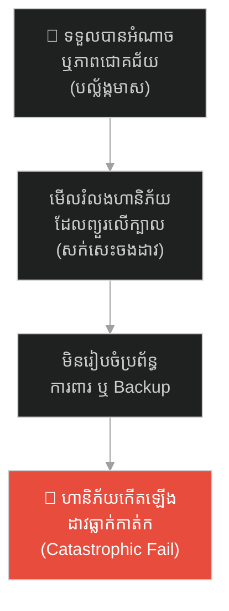
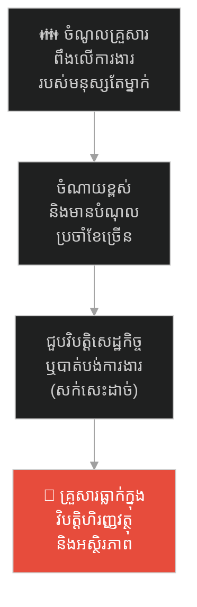
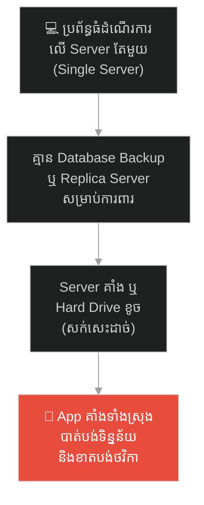
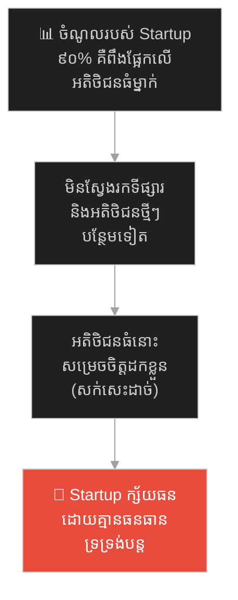
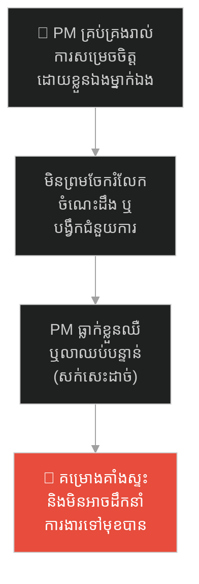
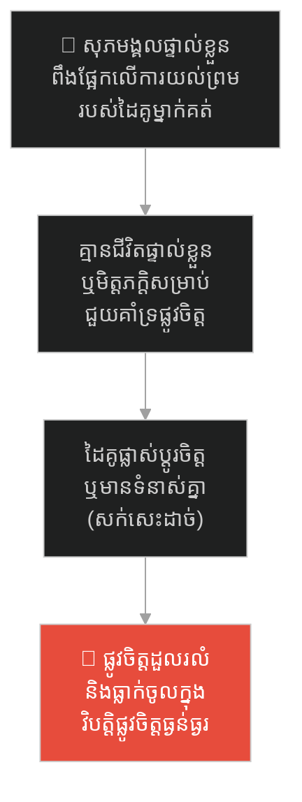
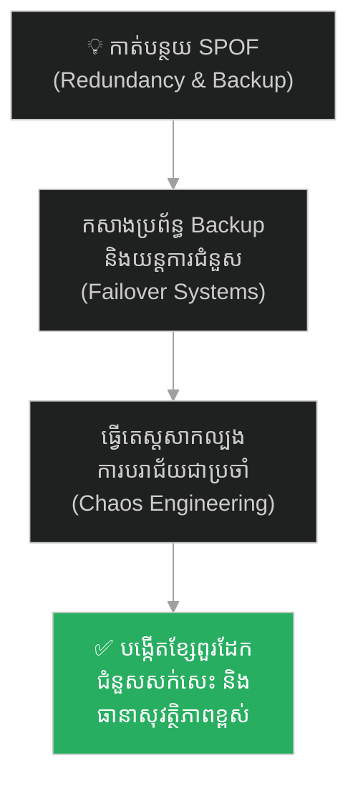

# The Sword of Damocles and the Weight of Power (ដាវរបស់ដាម៉ូក្លេស និងទម្ងន់នៃអំណាច)៖ គ្រោះថ្នាក់នៃហានិភ័យលាក់កំបាំង និងយុទ្ធសាស្ត្រគ្រប់គ្រងហានិភ័យ

**Author:** ichamrong  
**Date:** 2026-05-27  
**Tags:** #sword-of-damocles #greek-history #leadership #risk-management #redundancy #critical-thinking  
**Category:** Concepts / Parables  
**Read Time:** ~15 min  

---

## 📌 មាតិកា (Table of Contents)
- [អន្ទាក់ផ្លូវចិត្ត (The Trap)](#អន្ទាក់ផ្លូវចិត្ត-the-trap)
- [១. រឿងព្រេង៖ បល្ល័ង្កមាស និងដាវព្យួរលើសក់សេះ (The Legend of the Sword of Damocles)](#1)
  - [ការច្រណែននឹងអំណាច (Envy of Power)](#1-1)
  - [ដាវដែលព្យួរនឹងសក់សេះ (The Sword by a Horsehair)](#1-2)
- [២. បញ្ហា៖ ចំណុចខ្សោយតែមួយ និងការធ្វេសប្រហែសគ្រោះថ្នាក់ (The Issue: Single Point of Failure & Risk Blindness)](#2)
- [៣. ឧទាហរណ៍ជាក់ស្តែងក្នុងពិភពពិត (Real World Examples)](#3)
  - [ឧទាហរណ៍ទី ១ — កម្រិតស្រាល (គ្រួសារ)៖ ការពឹងផ្អែកលើចំណូលពីការងារតែមួយគត់ (The Single Income Dependency)](#3-1)
  - [ឧទាហរណ៍ទី ២ — កម្រិតមធ្យម (បច្ចេកទេស)៖ ការដំណើរការប្រព័ន្ធលើ Server តែមួយដោយគ្មាន Backup (The Single Server Production)](#3-2)
  - [ឧទាហរណ៍ទី ៣ — កម្រិតមធ្យម (ធុរកិច្ច)៖ ក្រុមហ៊ុន Startup ពឹងផ្អែកលើអតិថិជនធំម្នាក់ (The Single Key Client Risk)](#3-3)
  - [ឧទាហរណ៍ទី ៤ — កម្រិតមធ្យម (សង្គម/គ្រប់គ្រង)៖ អ្នកគ្រប់គ្រងដែលមិនព្រមចែករំលែកសិទ្ធិសម្រេចចិត្ត (The Gatekeeping Manager)](#3-4)
  - [ឧទាហរណ៍ទី ៥ — កម្រិតធ្ងន់ (ទំនាក់ទំនង)៖ សុភមង្គលដែលពឹងផ្អែកលើការយល់ព្រមរបស់ដៃគូ (The Codependent Approval Trap)](#3-5)
- [៤. ដំណោះស្រាយទូទៅ៖ ការលុបបំបាត់ SPOF និងការកសាងយន្តការការពារបម្រុង (The General Solution: Redundancy, Failover & Risk Management)](#4)
- [សេចក្តីសន្និដ្ឋាន (Conclusion)](#conclusion)
- [ឯកសារយោង (References)](#references)
- [Related Posts](#related-posts)

---

## អន្ទាក់ផ្លូវចិត្ត (The Trap)

តើអ្នកធ្លាប់ជួបស្ថានភាពដែលជីវិត ឬការងាររបស់អ្នកកំពុងស្ថិតក្នុងភាពជោគជ័យ និងរីករាយបំផុត ប៉ុន្តែអ្នកតែងតែមានអារម្មណ៍បារម្ភ និងដឹងច្បាស់ថាមានហានិភ័យដ៏ធំមួយ កំពុងព្យួរនៅពីលើក្បាលរបស់អ្នក ដែលអាចធ្លាក់មកបំផ្លាញអ្វីៗទាំងអស់ត្រឹមតែមួយវិនាទីដែរឬទេ?

នៅក្នុងជីវិតរស់នៅ និងការគ្រប់គ្រង៖
* **យើងតែងតែមើលឃើញ** តែភាពជោគជ័យ សិរីសួស្តី និងអំណាចរបស់អ្នកដទៃ (បល្ល័ង្កមាស)។
* **ប៉ុន្តែយើងមើលរំលង** ការទទួលខុសត្រូវដ៏ធ្ងន់ធ្ងរ និងហានិភ័យលាក់កំបាំង (ដាវព្យួរលើសក់សេះ) ដែលពួកគេកំពុងប្រឈមមុខជារៀងរាល់ថ្ងៃ។

ការទុកឱ្យប្រព័ន្ធ ឬជីវិតរស់នៅដំណើរការដោយពឹងផ្អែកលើកត្តាតែមួយគត់ ដែលគ្មានឧបករណ៍ការពារបម្រុង ហៅថា **អន្ទាក់ Sword of Damocles (ដាវព្យួរលើសក់សេះ)**។

ដើម្បីយល់ដឹងពីវិធីគ្រប់គ្រងហានិភ័យ និងការលុបបំបាត់ Single Point of Failure (SPOF) នេះជាផែនទីបង្ហាញផ្លូវសម្រាប់អត្ថបទនេះ៖
1. **រឿងព្រេង (The Historic Legend)** — រឿងរ៉ាវរបស់ ដាម៉ូក្លេស ដែលយល់ព្រមអង្គុយលើបល្ល័ង្កស្តេចមួយថ្ងៃ ប៉ុន្តែត្រូវបោះបង់ចោលភ្លាមៗពេលឃើញដាវព្យួរលើសក់សេះចំពីលើក្បាល។
2. **បញ្ហា (The Issue)** — ហានិភ័យប្រព័ន្ធ (Systemic Risk) និងគ្រោះថ្នាក់នៃការមិនមានប្រព័ន្ធ Backup។
3. **ឧទាហរណ៍ជាក់ស្តែងក្នុងពិភពពិត (Real World Examples)** — ពិនិត្យមើលឥទ្ធិពលនៃដាវព្យួរក្នុងកម្រិតគ្រួសារ ព័ត៌មានវិទ្យា ធុរកិច្ច ការគ្រប់គ្រង និងទំនាក់ទំនង។
4. **ដំណោះស្រាយទូទៅ (The General Solution)** — ការកសាងយន្តការ Redundancy, Failover និងការធ្វើតេស្ត Chaos Engineering។

---

## ១. រឿងព្រេង៖ បល្ល័ង្កមាស និងដាវព្យួរលើសក់សេះ (The Legend of the Sword of Damocles)

នៅក្នុងសម័យក្រិកបុរាណ មានព្រះរាជាមួយអង្គព្រះនាម **ឌីយូនីសៀស (Dionysius)**។ ទ្រង់មានអំណាចលើសលប់ រស់នៅក្នុងរាជវាំងដ៏ស្កឹមស្កៃ មានមាសប្រាក់រាប់ភ្លេច និងមានទាហានចាំបម្រើឆ្វេងស្តាំ។

---

### ការច្រណែននឹងអំណាច (Envy of Power)

មន្ត្រីទីប្រឹក្សាម្នាក់របស់ព្រះអង្គ ឈ្មោះ **ដាម៉ូក្លេស (Damocles)** តែងតែមានសេចក្តីច្រណែននឹងព្រះរាជាយ៉ាងខ្លាំង។ ដាម៉ូក្លេស តែងតែពោលសរសើរ និងរអ៊ូរទាំថា៖  
> *«ឱ! ព្រះអង្គពិតជាបុគ្គលដែលមានក្តីសុខបំផុតនៅលើលោក។ ទ្រង់មានអ្វីៗគ្រប់យ៉ាង គ្មានរឿងអ្វីដែលត្រូវព្រួយបារម្ភនោះទេ!»*

ព្រះរាជា ឌីយូនីសៀស ដែលធុញទ្រាន់នឹងការច្រណែននេះ បានសម្រេចចិត្តបង្រៀនមេរៀនមួយដល់ ដាម៉ូក្លេស។ ព្រះរាជាបានមានបន្ទូលថា៖  
> *«ដាម៉ូក្លេស! ដោយសារតែឯងគិតថាជីវិតរបស់អញពោរពេញដោយក្តីសុខ អញនឹងអនុញ្ញាតឱ្យឯងអង្គុយលើបល្ល័ង្កនេះ និងធ្វើជាស្តេចជំនួសអញរយៈពេលមួយថ្ងៃពេញ!»*

ដាម៉ូក្លេស សប្បាយចិត្តស្ទើរហោះ។ គាត់ប្រញាប់ប្រញាល់ពាក់ម្កុដមាស អង្គុយលើបល្ល័ង្កដ៏ទន់ល្មើយ។ ស្រីស្អាតៗបានយកផ្លែឈើ និងស្រាដ៏មានឱជារសមកបញ្ចុកគាត់ ឯអ្នកភ្លេងក៏ចាប់ផ្តើមប្រគុំតន្ត្រីយ៉ាងពិរោះរណ្តំ។ ដាម៉ូក្លេស គិតក្នុងចិត្តថា *«នេះហើយគឺជាឋានសួគ៌!»*។

---

### ដាវដែលព្យួរនឹងសក់សេះ (The Sword by a Horsehair)

នៅពេលកំពុងតែសប្បាយភ្លេចខ្លួន ដាម៉ូក្លេស បានងើយមុខសម្លឹងមើលទៅពិដានខាងលើ។ ស្រាប់តែបេះដូងរបស់គាត់លោតខុសចង្វាក់ ញើសត្រជាក់ស្រក់តក់ៗ។

នៅចំពីលើក្បាលរបស់គាត់ មាន **ដាវដ៏ធំនិងមុតស្រួចបំផុតមួយ** ត្រូវបានគេចងព្យួរទម្លាក់ចុះមកក្រោម ដោយប្រើប្រាស់ **«សរសៃសក់សេះតែមួយសរសៃប៉ុណ្ណោះ»**។ ដាវនោះអាចនឹងកាត់ដាច់សក់សេះនោះ ហើយធ្លាក់មកចាក់ទម្លុះក្បាលរបស់គាត់រហូតដល់ស្លាប់ នៅរាល់វិនាទីណាមួយ។

ដាម៉ូក្លេស លែងមានអារម្មណ៍ចង់ហូបផ្លែឈើ លែងចង់ស្តាប់តន្ត្រី ហើយក៏លែងចង់បានម្កុដនេះទៀតដែរ។ គាត់មិនហ៊ានសូម្បីតែកម្រើកខ្លួន ព្រោះខ្លាចរំញ័រធ្វើឱ្យសក់សេះនោះដាច់។ ចុងបញ្ចប់ គាត់បានលុតជង្គង់អង្វរព្រះរាជាសុំចុះពីបល្ល័ង្កវិញ ដោយនិយាយថា៖  
> *«ទូលព្រះបង្គំលែងចង់បានភាពមានបាននិងអំណាចទៀតហើយ បើវាត្រូវរស់នៅក្រោមការភ័យខ្លាចដល់ថ្នាក់នេះ!»*

ព្រះរាជាតបថា៖  
> *«នេះហើយគឺជាជីវិតរបស់អញ! អ្នកក្រៅមើលមកឃើញតែអំណាច និងភាពហ៊ឺហា ប៉ុន្តែការពិត អញត្រូវប្រឈមមុខនឹងសត្រូវ ការក្បត់ជាតិ និងហានិភ័យជារៀងរាល់វិនាទី!»*

---

## ២. បញ្ហា៖ ចំណុចខ្សោយតែមួយ និងការធ្វេសប្រហែសគ្រោះថ្នាក់ (The Issue: Single Point of Failure & Risk Blindness)

រឿងប្រៀបធៀបនេះ ឆ្លុះបញ្ចាំងពីគ្រោះថ្នាក់នៃ **SPOF (Single Point of Failure - ចំណុចបរាជ័យតែមួយ)** នៅក្នុងប្រព័ន្ធគ្រប់គ្រង និងបច្ចេកវិទ្យា៖
* **សក់សេះ និង SPOF៖** សក់សេះគឺជាតំណាងឱ្យចំណុចខ្សោយតែមួយគត់នៅក្នុងប្រព័ន្ធ។ ប្រសិនបើកត្តាតែមួយនេះដំណើរការខុសប្រក្រតី ឬខូចខាត (ដាច់សក់សេះ) នោះប្រព័ន្ធទាំងមូលនឹងជួបមហន្តរាយភ្លាមៗ។
* **ភាពងងឹតងងុលនៃហានិភ័យ (Risk Blindness)៖** មនុស្សភាគច្រើនផ្តោតលើភាពសប្បាយរីករាយ និងផលប្រយោជន៍រយៈពេលខ្លី (ដូចជា ដាម៉ូក្លេសស្តាប់តន្ត្រី) ដោយមើលរំលងគ្រោះថ្នាក់ធំដែលកំពុងព្យួរនៅពីលើក្បាល។ ការគ្រប់គ្រងគម្រោងដ៏ល្អ គឺត្រូវប្តូរសក់សេះ ឱ្យទៅជាខ្សែពួរដែកដ៏រឹងមាំ ឬសាងសង់ប្រព័ន្ធ Backup។

---

## ៣. ឧទាហរណ៍ជាក់ស្តែងក្នុងពិភពពិត

ដើម្បីយល់ដឹងឱ្យកាន់តែស៊ីជម្រៅ ផ្លូវការសិក្សានឹងនាំអ្នកទៅពិនិត្យមើល **ឧទាហរណ៍ចំនួន ៥ កម្រិតខុសៗគ្នា** ក្នុងជីវិតរស់នៅប្រចាំថ្ងៃ៖

---

### ឧទាហរណ៍ទី ១ — កម្រិតស្រាល (គ្រួសារ)៖ ការពឹងផ្អែកលើចំណូលពីការងារតែមួយគត់ (The Single Income Dependency)

**ស្ថានភាព៖** គ្រួសារមួយមានការចំណាយខ្ពស់ប្រចាំខែ រួមទាំងការបង់រំលស់ផ្ទះ ឡាន និងថ្លៃសាលារៀនកូន។

* **ភាគី A (ការពឹងផ្អែកលើសក់សេះ)៖** ពួកគេពឹងផ្អែកទាំងស្រុងលើប្រាក់ខែរបស់ឪពុកម្នាក់គត់។ បើទោះជាប្រាក់ខែខ្ពស់ និងរស់នៅហ៊ឺហារយ៉ាងណាក៏ដោយ ពួកគេគ្មានលុយសន្សំ ឬប្រភពចំណូលបម្រុងឡើយ។ ការងាររបស់ឪពុក គឺជាសក់សេះដែលចងដាវ។
* **ភាគី B (ការពិតជាក់ស្តែង)៖** នៅពេលក្រុមហ៊ុនរបស់ឪពុកជួបវិបត្តិ ហើយគាត់ត្រូវកាត់បន្ថយបុគ្គលិក គ្រួសារទាំងមូលត្រូវធ្លាក់ចូលទៅក្នុងវិបត្តិហិរញ្ញវត្ថុភ្លាមៗ គ្មានលុយបង់រំលស់ផ្ទះ និងត្រូវប្រឈមការរឹបអូសទ្រព្យសម្បត្តិ។

---

### ឧទាហរណ៍ទី ២ — កម្រិតមធ្យម (បច្ចេកទេស)៖ ការដំណើរការប្រព័ន្ធលើ Server តែមួយដោយគ្មាន Backup (The Single Server Production)

**ស្ថានភាព៖** ក្រុមហ៊ុនលក់ទំនិញអនឡាញដំណើរការ App របស់ខ្លួននៅលើ Cloud Server តែមួយគត់។

* **ភាគី A (ការសន្សំថ្លៃដើមដ៏គ្រោះថ្នាក់)៖** CTO សម្រេចចិត្តមិនទិញ Multi-region backup ឬ Database replica ឡើយដើម្បីសន្សំថវិកាក្រុមហ៊ុន។ ប្រព័ន្ធដំណើរការបានលឿន និងរលូនល្អ ធ្វើឱ្យ CTO សប្បាយចិត្ត និងមានមោទនភាព។ Server តែមួយនោះ គឺជាសក់សេះ។
* **ភាគី B (ការពិតជាក់ស្តែង)៖** ថ្ងៃមួយ Data Center របស់ Cloud provider ជួបគ្រោះថ្នាក់ភ្លើងឆេះ ឬគាំងប្រព័ន្ធអគ្គិសនី។ App របស់ក្រុមហ៊ុនត្រូវគាំងទាំងស្រុងអស់រយៈពេល ២ ថ្ងៃ បាត់បង់ទិន្នន័យការលក់ និងខូចខាតកេរ្តិ៍ឈ្មោះក្រុមហ៊ុនរាប់ម៉ឺនដុល្លារ។

---

### ឧទាហរណ៍ទី ៣ — កម្រិតមធ្យម (ធុរកិច្ច)៖ ក្រុមហ៊ុន Startup ពឹងផ្អែកលើអតិថិជនធំម្នាក់ (The Single Key Client Risk)

**ស្ថានភាព៖** ក្រុមហ៊ុន Startup ផ្តល់សេវាកម្មដឹកជញ្ជូនទំនិញទទួលបានការរីកចម្រើនខ្លាំង។

* **ភាគី A (ភាពរីកចម្រើនលើគម្លាតហានិភ័យ)៖** ពួកគេទទួលបានកិច្ចសន្យាផ្តាច់មុខជាមួយក្រុមហ៊ុនលក់រាយយក្សមួយ ដែលតំណាងឱ្យ ៩០% នៃចំណូលសរុបរបស់ពួកគេ។ ក្រុមហ៊ុនលូតលាស់លឿន ជួលបុគ្គលិកថ្មីៗ និងផ្លាស់ទៅការិយាល័យធំ។ អតិថិជនធំនោះ គឺជាសក់សេះដែលចងដាវ។
* **ភាគី B (ការពិតជាក់ស្តែង)៖** ក្រោយមក ក្រុមហ៊ុនយក្សនោះសម្រេចចិត្តសាងសង់ប្រព័ន្ធដឹកជញ្ជូនផ្ទាល់ខ្លួន និងលុបកិច្ចសន្យាជាមួយ Startup នោះចោល។ Startup គ្មានអតិថិជនផ្សេងសម្រាប់ជំនួសឡើយ ហើយត្រូវក្ស័យធនក្នុងរយៈពេល ៣ ខែបន្ទាប់។

---

### ឧទាហរណ៍ទី ៤ — កម្រិតមធ្យម (សង្គម/គ្រប់គ្រង)៖ អ្នកគ្រប់គ្រងដែលមិនព្រមចែករំលែកសិទ្ធិសម្រេចចិត្ត (The Gatekeeping Manager)

**ស្ថានភាព៖** Project Manager (PM) ម្នាក់មានការសម្រេចចិត្តលើរាល់កូដ រចនាសម្ព័ន្ធ និងកិច្ចការប្រចាំថ្ងៃរបស់ក្រុមការងារ IT។

* **ភាគី A (ការប្រមូលផ្តុំអំណាចសម្រេចចិត្ត)៖** គាត់មិនព្រមចែករំលែកចំណេះដឹង (Knowledge Sharing) ឬបង្វឹកសមាជិកផ្សេងឱ្យចេះសម្រេចចិត្តជំនួសគាត់ឡើយ ដើម្បីរក្សាអំណាចផ្ទាល់ខ្លួន។ រាល់សំណួរ និងបញ្ហាត្រូវតែរង់ចាំគាត់ដោះស្រាយតែម្នាក់គត់។ PM រូបនេះ គឺជាសក់សេះ។
* **ភាគី B (ការពិតជាក់ស្តែង)៖** នៅពេល PM ជួបគ្រោះថ្នាក់ ឬធ្លាក់ខ្លួនឈឺធ្ងន់ត្រូវសម្រាកមន្ទីរពេទ្យពីរសប្តាហ៍ ក្រុមការងារទាំងមូលត្រូវគាំងស្ទះការងារភ្លាមៗ គ្មាននរណាម្នាក់ដឹងលេខកូដសម្ងាត់ ឬចេះសម្រេចចិត្តដោះស្រាយបញ្ហាប្រព័ន្ធឡើយ។

---

### ឧទាហរណ៍ទី ៥ — កម្រិតធ្ងន់ (ទំនាក់ទំនង)៖ សុភមង្គលដែលពឹងផ្អែកលើការយល់ព្រមរបស់ដៃគូ (The Codependent Approval Trap)

**ស្ថានភាព៖** បុគ្គលម្នាក់ពឹងផ្អែកលើក្តីស្រឡាញ់ ការយកចិត្តទុកដាក់ និងការយល់ស្របរបស់ដៃគូដើម្បីផ្តល់តម្លៃឱ្យខ្លួនឯង។

* **ភាគី A (សុភមង្គលពឹងផ្អែក)៖** គាត់គ្មានចំណង់ចំណូលចិត្តផ្ទាល់ខ្លួន គ្មានមិត្តភក្តិជិតស្និទ្ធ និងផ្លាស់ប្តូរចរិតលក្ខណៈរបស់ខ្លួនដើម្បីតម្រូវចិត្តដៃគូទាំងស្រុង។ សេចក្តីស្រឡាញ់របស់ដៃគូ គឺជាសក់សេះដែលព្យួរដាវលើផ្លូវចិត្តរបស់គាត់។
* **ភាគី B (ការពិតជាក់ស្តែង)៖** នៅពេលដៃគូជួបបញ្ហាផ្ទាល់ខ្លួន ឬចង់បញ្ចប់ទំនាក់ទំនង ផ្លូវចិត្តរបស់គាត់ត្រូវដួលរលំភ្លាមៗ រហូតដល់ធ្លាក់ខ្លួនចូលទៅក្នុងជំងឺបាក់ទឹកចិត្តធ្ងន់ធ្ងរ និងលែងមានតម្លៃក្នុងជីវិត។

---

## ៤. ដំណោះស្រាយទូទៅ៖ ការលុបបំបាត់ SPOF និងការកសាងយន្តការការពារបម្រុង (The General Solution: Redundancy, Failover & Risk Management)

ដើម្បីកម្ចាត់ឥទ្ធិពលដាវព្យួររបស់ Damocles និងកសាងជីវិត ឬប្រព័ន្ធការងារដែលមានភាពធន់ខ្ពស់ អ្នកត្រូវអនុវត្តវិធានការទាំងនេះ៖

### ១. អនុវត្តយុទ្ធសាស្ត្របង្កើតប្រព័ន្ធបម្រុង (Redundancy & Duplication)
មិនត្រូវអនុញ្ញាតឱ្យប្រភពតែមួយ កំណត់ជោគវាសនារបស់ប្រព័ន្ធទាំងមូលឡើយ។ 
* នៅក្នុងបច្ចេកវិទ្យា៖ ត្រូវដំណើរការ Server ច្រើន (Load Balancing) និងធ្វើការ Backup ទិន្នន័យជាប្រចាំ។
* នៅក្នុងហិរញ្ញវត្ថុគ្រួសារ៖ ត្រូវបង្កើតចំណូលច្រើនច្រក និងសន្សំកញ្ចប់ថវិកាបម្រុងសង្គ្រោះបន្ទាន់ (Emergency Fund) សម្រាប់រស់នៅយ៉ាងហោចណាស់ ៦ ខែ។

### ២. បង្កើតយន្តការជំនួសដោយស្វ័យប្រវត្តិ (Automatic Failover)
នៅពេលដែលប្រព័ន្ធចម្បងជួបការខូចខាត (សក់សេះដាច់) ប្រព័ន្ធការងារត្រូវមានសមត្ថភាពផ្ទេរការងារទៅកាន់ប្រព័ន្ធបម្រុងភ្លាមៗដោយស្វ័យប្រវត្តិ (Active-Passive ឬ Active-Active Failover)។ នេះធានាថាអាជីវកម្មនៅតែដំណើរការធម្មតា ទោះបីជាមានចំណុចខ្លះរងការខូចខាតក៏ដោយ។

### ៣. ធ្វើតេស្តសាកល្បងការបរាជ័យជាប្រចាំ (Chaos Engineering / Scenario Testing)
កុំរង់ចាំទាល់តែសក់សេះដាច់ ទើបដឹងថាដាវមុតកម្រិតណា។ ត្រូវធ្វើតេស្តសាកល្បងការខូចខាតប្រព័ន្ធដោយចេតនា (ដូចជា ការបិទ Server ចម្បងសាកល្បង ឬការរៀបចំផែនការចុះថយចំណូល) ដើម្បីដឹងថាប្រព័ន្ធបម្រុងរបស់អ្នកពិតជាដំណើរការល្អ និងអាចជួយសង្គ្រោះបានទាន់ពេលវេលា។

---

## 🐇 ធ្លាក់ចូលក្នុងរន្ធទន្សាយយុទ្ធសាស្ត្រ (Enter the Strategic Rabbit Hole)

ដើម្បីស្វែងយល់បន្ថែមអំពីរបៀបដែលអ្នកបច្ចេកវិទ្យា និងអ្នកគ្រប់គ្រង ប្រើប្រាស់ខ្សែស្រឡាយ ឬក្បួនដោះស្រាយដ៏សាមញ្ញ (The Thread) ដើម្បីរកច្រកចេញ និងកាត់បន្ថយភាពស្មុគស្មាញនៃប្រព័ន្ធការងារដ៏ធំមហិមា (The Labyrinth) សូមបន្តដំណើររបស់អ្នក៖

* 🚀 **[ចាប់ផ្តើមដំណើររុករក (Start the Journey) ➔ The Labyrinth and the Thread](./34-the-labyrinth-and-the-thread.md)**

---

## សេចក្តីសន្និដ្ឋាន (Conclusion)

> **«ភាពសុខសាន្ត និងជោគជ័យពិតប្រាកដ មិនមែនជាការអង្គុយលើបល្ល័ង្កមាសដោយបិទភ្នែកបំភ្លេចដាវដែលព្យួរលើក្បាលនោះឡើយ ប៉ុន្តែគឺសមត្ថភាពក្នុងការប្តូរសក់សេះ ឱ្យទៅជាខ្សែពួរដែកដ៏រឹងមាំ។»**

អំណាច ភាពហ៊ឺហា និងចំណូលខ្ពស់ តែងតែមកជាមួយការទទួលខុសត្រូវ និងហានិភ័យលាក់កំបាំងជានិច្ច។ ចូរកុំបណ្តោយឱ្យប្រព័ន្ធ ឬជីវិតរបស់អ្នកពឹងផ្អែកលើសក់សេះតែមួយសរសៃ។ ចូររៀបចំយន្តការការពារ និងបង្កើតប្រភពបម្រុងទុកជាមុន មុនពេលដែលសក់សេះនោះត្រូវដាច់ដោយមិនដឹងខ្លួន។

ចូរប្តូរសក់សេះរបស់អ្នក ឱ្យទៅជាខ្សែពួរដែកនៅថ្ងៃនេះ។

---

## ឯកសារយោង (References)

* **Cicero, Marcus Tullius** — *Tusculan Disputations* (45 BC)។ ប្រភពឯកសារបុរាណដំបូងបង្អស់ដែលបានកត់ត្រារឿងព្រេងដាវដាម៉ូក្លេស។
* **Nassim Nicholas Taleb** — *Antifragile: Things That Gain from Disorder* (2012)។ ការវិភាគហានិភ័យ និងការកសាងប្រព័ន្ធដែលមានភាពធន់ខ្ពស់ជាងមុនពេលជួបគ្រោះថ្នាក់។
* **High Availability Architecture** — *AWS Whitepaper on Resilience* (2021)។ ការណែនាំស្តង់ដារបច្ចេកវិទ្យាសម្រាប់លុបបំបាត់ Single Point of Failure (SPOF) ក្នុង Cloud។

---

## Related Posts

* **[25 The Sword of Damocles: Risk and Responsibility under Leadership](../articles/25-the-sword-of-damocles-and-risk-management.md)** — អត្ថបទគោលបកស្រាយពីយន្តការ និងផែនទីបង្ហាញផ្លូវនៃការគ្រប់គ្រងហានិភ័យ។
* **[28 The Horseshoe Nail and the Fallen Kingdom](./28-the-horseshoe-nail-and-the-fallen-kingdom.md)** — រឿងប្រៀបធៀបអំពីរបៀបដែលចំណុចខ្សោយតូចមួយបង្កជាមហន្តរាយធំ (Domino Effect)។
* **[20 Cognitive Biases: The Hidden Flaws in Human Thinking](../articles/20-cognitive-biases-the-flaws-in-human-thinking.md)** — ការយល់ដឹងពីកំហុសនៃការគិត និងលម្អៀងការយល់ឃើញផ្សេងៗ។

---
*Last updated: 2026-05-27*

## Related

- [💡 Concepts README](../README.md)
- [📚 Main Repository README](../../../README.md)
- [Developer Habits](../../developer-habits/README.md)
- [Mental Health & Well-being](../../mental-health/README.md)
- [Management & SDLC](../../management/README.md)
