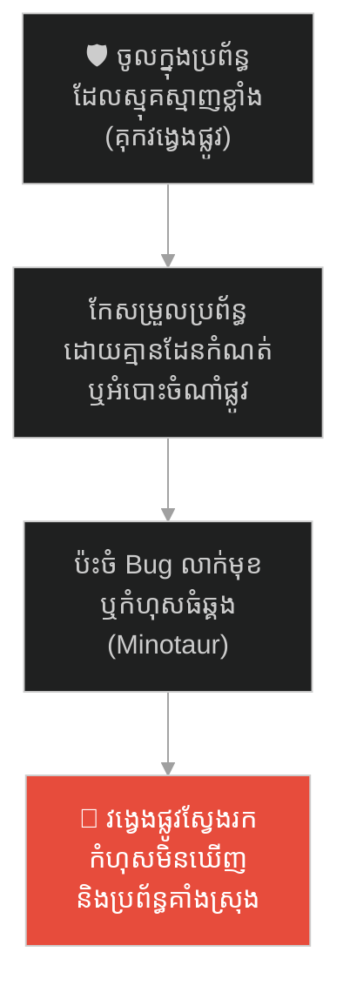
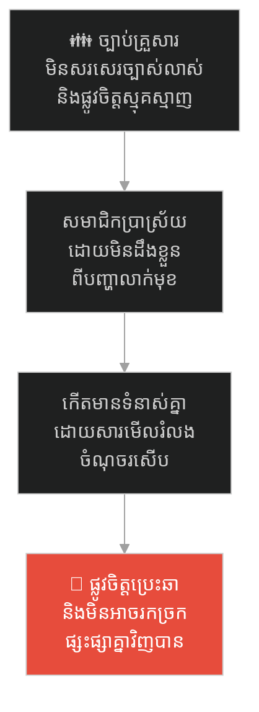
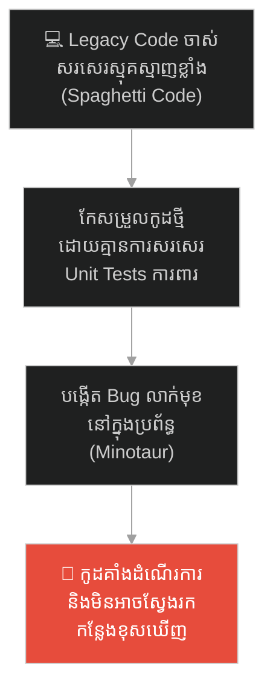
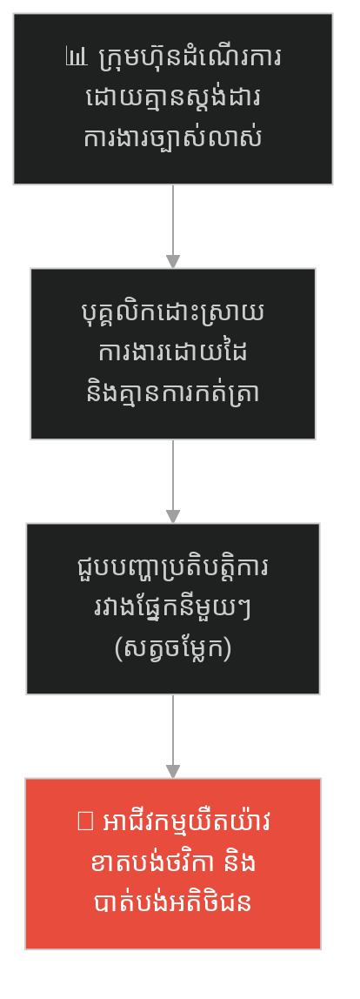
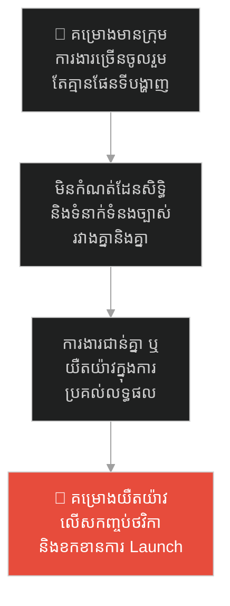
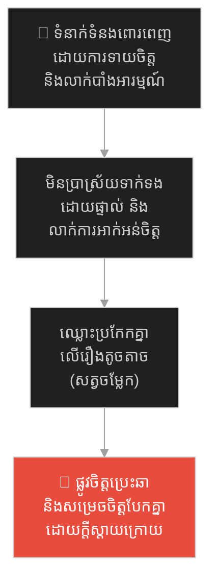
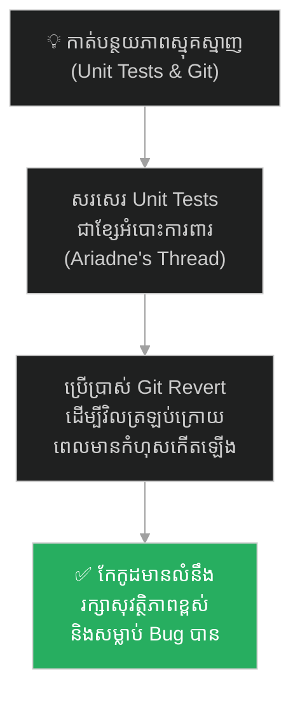

# The Labyrinth and Ariadne's Thread (គុកវង្វេងផ្លូវ និងអំបោះរបស់អារីយ៉ាដនី)៖ គ្រោះថ្នាក់នៃភាពស្មុគស្មាញ Spaghetti Code និងយុទ្ធសាស្ត្រ Unit Testing

**Author:** ichamrong  
**Date:** 2026-05-27  
**Tags:** #labyrinth #greek-mythology #spaghetti-code #unit-testing #git #refactoring #critical-thinking  
**Category:** Concepts / Parables  
**Read Time:** ~15 min  

---

## 📌 មាតិកា (Table of Contents)
- [អន្ទាក់ផ្លូវចិត្ត (The Trap)](#អន្ទាក់ផ្លូវចិត្ត-the-trap)
- [១. រឿងព្រេង៖ គុកវង្វេងផ្លូវ និងអំបោះពណ៌មាសរបស់អារីយ៉ាដនី (The Legend of the Labyrinth & Ariadne's Thread)](#1)
  - [គុកវង្វេងផ្លូវដ៏គួរឱ្យខ្លាច (The Terrifying Labyrinth)](#1-1)
  - [សរសៃអំបោះជួយសង្គ្រោះ និងការសម្លាប់សត្វចម្លែក (The Thread & Slaying the Minotaur)](#1-2)
- [២. បញ្ហា៖ Legacy Code គ្មានសណ្តាប់ធ្នាប់ និងការបង្កកំហុស (The Issue: Spaghetti Code & Hidden Bugs)](#2)
- [៣. ឧទាហរណ៍ជាក់ស្តែងក្នុងពិភពពិត (Real World Examples)](#3)
  - [ឧទាហរណ៍ទី ១ — កម្រិតស្រាល (គ្រួសារ)៖ ការប្រាស្រ័យទាក់ទងក្នុងគ្រួសារដោយគ្មានច្បាប់ច្បាស់លាស់ (The Undocumented Family Dynamics)](#3-1)
  - [ឧទាហរណ៍ទី ២ — កម្រិតមធ្យម (បច្ចេកទេស)៖ ការកែសម្រួល Legacy Code ស្មុគស្មាញដោយគ្មានតេស្ត (The Untested Spaghetti Code Refactor)](#3-2)
  - [ឧទាហរណ៍ទី ៣ — កម្រិតមធ្យម (ធុរកិច្ច)៖ ក្រុមហ៊ុន Startup ដែលមានលំហូរការងាររញ៉េរញ៉ៃ (The Scattered Startup Workflows)](#3-3)
  - [ឧទាហរណ៍ទី ៤ — កម្រិតមធ្យម (សង្គម/គ្រប់គ្រង)៖ គម្រោងធំដែលមានការពឹងផ្អែកខ្វាត់ខ្វែង (The Tangled Project Dependencies)](#3-4)
  - [ឧទាហរណ៍ទី ៥ — កម្រិតធ្ងន់ (ទំនាក់ទំនង)៖ ទំនាក់ទំនងពោរពេញដោយការស្មានចិត្ត និងអន់ចិត្តលាក់បាំង (The Passive-Aggressive Hint Labyrinth)](#3-5)
- [៤. ដំណោះស្រាយទូទៅ៖ ការកសាង Unit Tests និងការប្រើប្រាស់ Git ត្រួតពិនិត្យផ្លូវ (The General Solution: Test-Driven Development & Version Control Tracking)](#4)
- [សេចក្តីសន្និដ្ឋាន (Conclusion)](#conclusion)
- [ឯកសារយោង (References)](#references)
- [Related Posts](#related-posts)

---

## អន្ទាក់ផ្លូវចិត្ត (The Trap)

តើអ្នកធ្លាប់ដើរចូលទៅក្នុងប្រព័ន្ធការងារ ឬកូដចាស់ៗដែលស្មុគស្មាញខ្លាំង រហូតដល់ថ្នាក់មិនហ៊ានកែសម្រួល ឬលុបរបស់ណាមួយចោល ព្រោះខ្លាចធ្វើឱ្យអ្វីៗផ្សេងទៀតគាំង ហើយចុងក្រោយក៏វង្វេងរកច្រកចេញមិនឃើញដែរឬទេ?

នៅក្នុងការអភិវឌ្ឍន៍សូហ្វវែរ និងការគ្រប់គ្រង៖
* **យើងតែងតែបង្កើត** ភាពស្មុគស្មាញបន្ថែមឡើងៗដោយគ្មានផែនទី (Spaghetti Code / គុកវង្វេង)។
* **យើងត្រូវប្រឈមមុខ** នឹងកំហុស និង Bug ដែលលាក់មុខ (Minotaur) ដែលរង់ចាំតែលោតចេញមកបំផ្លាញគម្រោងរបស់យើង។

ការចូលទៅដោះស្រាយ ឬកែប្រែប្រព័ន្ធស្មុគស្មាញដោយគ្មានយន្តការតាមដាន និងការការពារទុកជាមុន ហៅថា **អន្ទាក់ Labyrinth (វង្វេងផ្លូវក្នុងគុកងងឹត)**។

ដើម្បីយល់ដឹងពីវិធីគ្រប់គ្រងភាពស្មុគស្មាញ និងការប្រើប្រាស់ឧបករណ៍តាមដានផ្លូវ នេះជាផែនទីបង្ហាញផ្លូវសម្រាប់អត្ថបទនេះ៖
1. **រឿងព្រេង (The Historic Legend)** — រឿងរ៉ាវរបស់ ថេស៊ាស ដែលចូលទៅសម្លាប់សត្វចម្លែក មីណូត័រ ក្នុងគុកវង្វេងផ្លូវ ដោយមានជំនួយពីអំបោះពណ៌មាសរបស់អារីយ៉ាដនី។
2. **បញ្ហា (The Issue)** — ភាពស្មុគស្មាញនៃ Spaghetti Code និងកង្វះឧបករណ៍វាយតម្លៃការងារ។
3. **ឧទាហរណ៍ជាក់ស្តែងក្នុងពិភពពិត (Real World Examples)** — ពិនិត្យមើលឥទ្ធិពលនៃគុកវង្វេងផ្លូវក្នុងកម្រិតគ្រួសារ ព័ត៌មានវិទ្យា ធុរកិច្ច ការគ្រប់គ្រង និងទំនាក់ទំនង។
4. **ដំណោះស្រាយទូទៅ (The General Solution)** — ការអនុវត្ត Test-Driven Development (TDD) និងការប្រើប្រាស់ Git Version Control ដើម្បីតាមដានផ្លូវ។

---

## ១. រឿងព្រេង៖ គុកវង្វេងផ្លូវ និងអំបោះពណ៌មាសរបស់អារីយ៉ាដនី (The Legend of the Labyrinth & Ariadne's Thread)

នៅក្នុងប្រវត្តិសាស្ត្រក្រិកបុរាណ ស្តេច Minos នៃកោះ Crete បានបញ្ជាឱ្យស្ថាបត្យករដ៏ពូកែម្នាក់ឈ្មោះ Daedalus សាងសង់គុកដ៏ធំមួយដែលហៅថា **The Labyrinth**។

---

### គុកវង្វេងផ្លូវដ៏គួរឱ្យខ្លាច (The Terrifying Labyrinth)

គុកនេះគ្មានចម្រឹងដែក ឬជញ្ជាំងដែកឡើយ ប៉ុន្តែវាជាបណ្តាញនៃផ្លូវខ្វាត់ខ្វែងរាប់ម៉ឺនច្រក ងងឹតស្លុប និងគ្មានទីបញ្ចប់។ អ្នកណាដែលដើរចូលទៅហើយ គឺមិនអាចរកផ្លូវចេញមកវិញបានឡើយ ទោះបីជាដើរអស់មួយជីវិតក៏ដោយ ព្រោះរាល់ផ្លូវទាំងអស់មើលទៅដូចគ្នាទាំងអស់។

អ្វីដែលកាន់តែគួរឱ្យខ្លាចនោះគឺ នៅចំកណ្តាលនៃគុកវង្វេងផ្លូវនេះ មានលាក់ទុកនូវសត្វចម្លែកក្បាលគោខ្លួនមនុស្សដ៏សាហាវឈ្មោះថា **មីណូត័រ (Minotaur)** ដែលតែងតែស៊ីសាច់មនុស្សជាអាហារ។ រាល់ឆ្នាំ យុវជនជើងខ្លាំងជាច្រើនត្រូវបានគេបញ្ជូនចូលទៅក្នុងគុកនេះ ហើយគ្មាននរណាម្នាក់អាចត្រឡប់មកវិញឡើយ។

---

### សរសៃអំបោះជួយសង្គ្រោះ និងការសម្លាប់សត្វចម្លែក (The Thread & Slaying the Minotaur)

ថ្ងៃមួយ វីរបុរសដ៏ក្លាហានឈ្មោះ **ថេស៊ាស (Theseus)** បានស្ម័គ្រចិត្តដើរចូលទៅក្នុងគុកវង្វេងផ្លូវនេះ ដើម្បីសម្លាប់សត្វចម្លែកមីណូត័រ។ ថេស៊ាស មានកម្លាំងកាយ និងដាវដ៏មុតស្រួច ប៉ុន្តែគាត់ដឹងថា ទោះបីជាគាត់សម្លាប់សត្វចម្លែកនោះបាន ក៏គាត់ប្រាកដជាវង្វេងផ្លូវស្លាប់នៅក្នុងទីងងឹតនោះដែរ។

សំណាងល្អ ព្រះនាង **អារីយ៉ាដនី (Ariadne)** ដែលលួចស្រឡាញ់ថេស៊ាស បានផ្តល់ឱ្យគាត់នូវដុំសរសៃអំបោះពណ៌មាសមួយដុំ។ នាងប្រាប់ថា៖  
> *«ចូរចងចុងម្ខាងនៃអំបោះនេះនៅនឹងទ្វារគុក។ ពេលអ្នកដើរចូលទៅខាងក្នុង ចូរបន្ធូរអំបោះនេះតាមផ្លូវរហូត។ ទោះបីជាអ្នកវង្វេងដល់ទីណាក៏ដោយ អំបោះនេះនឹងនាំអ្នកត្រឡប់មកផ្ទះវិញដោយសុវត្ថិភាពជានិច្ច។»*

ថេស៊ាស បានចងអំបោះនៅមាត់ទ្វារ ហើយដើរចូលទៅក្នុងភាពងងឹត។ គាត់បានបត់ឆ្វេង បត់ស្តាំ ឆ្លងកាត់ផ្លូវខ្វាត់ខ្វែងរាប់រយច្រក។ ទីបំផុត គាត់បានជួបនឹងសត្វចម្លែកមីណូត័រ ហើយបានប្រយុទ្ធសម្លាប់វាបានសម្រេច។

បន្ទាប់ពីសម្លាប់រួច ថេស៊ាស បានបាត់បង់ទិសដៅទាំងស្រុង នៅក្នុងទីងងឹតដ៏គួរឱ្យខ្លាចនោះ។ ប៉ុន្តែដោយសារតែមានសរសៃអំបោះពណ៌មាសរបស់អារីយ៉ាដនី គាត់គ្រាន់តែដើររើសខ្សែអំបោះនោះត្រឡប់ក្រោយវិញ (Trace back) កាត់តាមច្រករបៀងដ៏ស្មុគស្មាញ រហូតបានឃើញពន្លឺព្រះអាទិត្យនៅមាត់ទ្វារគុកវិញដោយសុវត្ថិភាព។

---

## ២. បញ្ហា៖ Legacy Code គ្មានសណ្តាប់ធ្នាប់ និងការបង្កកំហុស (The Issue: Spaghetti Code & Hidden Bugs)

រឿងព្រេងនេះ ឆ្លុះបញ្ចាំងពីបញ្ហាដ៏ធំប្រចាំថ្ងៃនៅក្នុងការគ្រប់គ្រងប្រព័ន្ធបច្ចេកវិទ្យា៖
* **Spaghetti Code (កូដញ៉េរញ៉ៃ)៖** កូដចាស់ៗដែលសរសេរគ្មានការគ្រប់គ្រង និងគ្មានឯកសារ (Legacy Code) គឺប្រៀបដូចជាគុកវង្វេងផ្លូវ Labyrinth។ វិស្វករថ្មីដែលចូលទៅសរសេរ ឬកែប្រែកូដនៅក្នុងនោះ តែងតែវង្វេងផ្លូវ ភ័យខ្លាច និងមិនហ៊ានលុបកូដណាមួយឡើយ ព្រោះមិនដឹងវាភ្ជាប់ទៅណាខ្លះ។
* **Bug លាក់មុខ (Hidden Bugs)៖** សត្វចម្លែក Minotaur ដែលលាក់ខ្លួនក្នុងកូដ គឺរង់ចាំតែអ្នកកែប្រែកូដខុសបន្តិច វានឹងលោតចេញមកធ្វើឱ្យប្រព័ន្ធទាំងមូលគាំង (Crash)។
* **Unit Tests & Git = Ariadne's Thread៖** អ្នកមិនអាចដើរចូលទៅក្នុង Spaghetti Code ដោយដៃទទេឡើយ។ អ្នកត្រូវមាន "ខ្សែអំបោះ" ដែលនោះគឺ **Unit Tests**។ នៅពេលអ្នកសរសេរ Test មុននឹងកែប្រែកូដ (TDD) វាប្រៀបដូចជាការចងខ្សែចំណាំផ្លូវ។ ប្រសិនបើអ្នកកែខុស នោះកូដនឹងលោត Error បង្ហាញទីតាំងភ្លាមៗ ហើយអ្នកអាចបង្វិលវាត្រឡប់មកវិញ (Undo/Revert) តាមរយៈ Git។

---

## ៣. ឧទាហរណ៍ជាក់ស្តែងក្នុងពិភពពិត

ដើម្បីយល់ដឹងឱ្យកាន់តែស៊ីជម្រៅ ផ្លូវការសិក្សានឹងនាំអ្នកទៅពិនិត្យមើល **ឧទាហរណ៍ចំនួន ៥ កម្រិតខុសៗគ្នា** ក្នុងជីវិតរស់នៅប្រចាំថ្ងៃ៖

---

### ឧទាហរណ៍ទី ១ — កម្រិតស្រាល (គ្រួសារ)៖ ការប្រាស្រ័យទាក់ទងក្នុងគ្រួសារដោយគ្មានច្បាប់ច្បាស់លាស់ (The Undocumented Family Dynamics)

**ស្ថានភាព៖** គ្រួសារមួយមានការឈ្លោះប្រកែកគ្នាជាញឹកញាប់ដោយសារតែរឿងតូចតាច (ដូចជា ការបែងចែកការងារផ្ទះ ឬពេលវេលាចេញក្រៅ)។

* **ភាគី A (ការវង្វេងផ្លូវ)៖** សមាជិកគ្រួសារមិនដែលជជែកគ្នាដោយផ្ទាល់ និងគ្មានច្បាប់កំណត់ច្បាស់លាស់។ រាល់សកម្មភាពទាំងអស់ ត្រូវដើរទាយចិត្តគ្នាទៅវិញទៅមក។ នេះបង្កើតជាភាពស្មុគស្មាញ និងទំនាស់លាក់មុខ (Minotaur)។
* **ភាគី B (ការពិតជាក់ស្តែង)៖** នៅពេលមានសមាជិកម្នាក់ធ្វើការងារផ្ទះខុស ឬយឺតយ៉ាវ សមាជិកផ្សេងទៀតចាប់ផ្តើមខឹងសម្បារ និងឈ្លោះគ្នាធំ ដោយមិនដឹងថាកំហុសកើតឡើងពីចំណុចណាមួយឡើយ ព្រោះគ្មាន "ខ្សែអំបោះ" (ច្បាប់ច្បាស់លាស់) សម្រាប់ផ្ទៀងផ្ទាត់។

---

### ឧទាហរណ៍ទី ២ — កម្រិតមធ្យម (បច្ចេកទេស)៖ ការកែសម្រួល Legacy Code ស្មុគស្មាញដោយគ្មានតេស្ត (The Untested Spaghetti Code Refactor)

**ស្ថានភាព៖** Developer ម្នាក់ត្រូវបន្ថែម Feature ទូទាត់ប្រាក់ថ្មីទៅក្នុងប្រព័ន្ធចាស់របស់ក្រុមហ៊ុន។

* **ភាគី A (ការកែកូដផ្សងព្រេង)៖** កូដចាស់មានភាពស្មុគស្មាញខ្លាំង សរសេរតៗគ្នាគ្មានការបែងចែក Layer (Spaghetti Code)។ គាត់បានសម្រេចចិត្តចូលទៅកែកូដភ្លាមៗដោយគ្មានការសរសេរ Unit Tests ទុកជាមុនឡើយ។
* **ភាគី B (ការពិតជាក់ស្តែង)៖** ក្រោយការកែកូដ ប្រព័ន្ធទូទាត់ប្រាក់ថ្មីដើរធម្មតា ប៉ុន្តែវាស្រាប់តែបង្កឱ្យប្រព័ន្ធដឹកជញ្ជូន និងរបាយការណ៍ហិរញ្ញវត្ថុខូចទាំងស្រុង (Bug លាក់មុខលេចចេញមក)។ Developer វង្វេងផ្លូវ មិនដឹងថាចំណុចណាមួយដែលធ្វើឱ្យខូច និងចំណាយពេល ៣ ថ្ងៃស្វែងរកកន្លែងខុស។

---

### ឧទាហរណ៍ទី ៣ — កម្រិតមធ្យម (ធុរកិច្ច)៖ ក្រុមហ៊ុន Startup ដែលមានលំហូរការងាររញ៉េរញ៉ៃ (The Scattered Startup Workflows)

**ស្ថានភាព៖** ក្រុមហ៊ុន Startup ផ្នែកលក់ទំនិញទទួលបានការបញ្ជាទិញរាប់រយក្នុងមួយថ្ងៃ។

* **ភាគី A (ការគ្រប់គ្រងវង្វេងផ្លូវ)៖** ក្រុមហ៊ុនគ្មានប្រព័ន្ធ SOP (Standard Operating Procedure) ឬការកត់ត្រាលំហូរការងារឡើយ។ បុគ្គលិកម្នាក់ៗដោះស្រាយបញ្ហាទៅតាមសភាវគតិ និងប្រើប្រាស់ Chat មិនផ្លូវការដើម្បីបញ្ជូនការងារ។ នេះបង្កើតជាគុកវង្វេងផ្លូវនៃព័ត៌មាន។
* **ភាគី B (ការពិតជាក់ស្តែង)៖** នៅពេលមានអតិថិជនប្តឹងរឿងមិនបានទទួលទំនិញ ក្រុមហ៊ុនចំណាយពេលពេញមួយថ្ងៃដើម្បីឆែកឆេរ Chat រាប់សិប និងសួរនាំបុគ្គលិកម្នាក់ៗ រហូតដល់បាត់បង់ទំនុកចិត្តពីអតិថិជន និងខាតបង់ថវិកា។

---

### ឧទាហរណ៍ទី ៤ — កម្រិតមធ្យម (សង្គម/គ្រប់គ្រង)៖ គម្រោងធំដែលមានការពឹងផ្អែកខ្វាត់ខ្វែង (The Tangled Project Dependencies)

**ស្ថានភាព៖** ក្រុមហ៊ុនសាងសង់បុរីខ្នាតធំត្រូវសម្របសម្រួលការងាររវាងក្រុមជាងកំបោរ ជាងអគ្គិសនី និងជាងទឹក។

* **ភាគី A (ការគ្រប់គ្រងស្មុគស្មាញ)៖** Project Manager មិនបានសរសេរផែនទី وابستگی (Dependency Map) ឬយន្តការតាមដានការងារឡើយ។ ក្រុមការងារនីមួយៗចាប់ផ្តើមការងារដោយផ្អែកលើការយល់ឃើញរបស់ខ្លួន។
* **ភាគី B (ការពិតជាក់ស្តែង)៖** ក្រុមជាងអគ្គិសនីបានរៀបចំខ្សែភ្លើង និងចាក់បេតុងបិទជញ្ជាំងរួចរាល់ ប៉ុន្តែក្រោយមកទើបដឹងថា ក្រុមជាងទឹកមិនទាន់បានបង្កប់ទុយោទឹកនៅខាងក្នុងឡើយ (សត្វចម្លែកលេចចេញមក)។ ពួកគេត្រូវវាយកម្ទេចជញ្ជាំងចាក់បេតុងនោះឡើងវិញ ធ្វើឱ្យគម្រោងយឺតយ៉ាវ និងខាតបង់លុយកាក់រាប់ពាន់ដុល្លារ។

---

### ឧទាហរណ៍ទី ៥ — កម្រិតធ្ងន់ (ទំនាក់ទំនង)៖ ទំនាក់ទំនងពោរពេញដោយការស្មានចិត្ត និងអន់ចិត្តលាក់បាំង (The Passive-Aggressive Hint Labyrinth)

**ស្ថានភាព៖** ប្តីប្រពន្ធរស់នៅជាមួយគ្នាជិតស្និទ្ធ ប៉ុន្តែមានការប្រាស្រ័យទាក់ទងបែបខឹងងក់ងរ (Passive-aggressive)។

* **ភាគី A (គុកវង្វេងផ្លូវនៃផ្លូវចិត្ត)៖** ដៃគូម្ខាងទៀតខឹងអន់ចិត្តនឹងរឿងអ្វីមួយ ប៉ុន្តែមិនព្រមនិយាយប្រាប់ដោយផ្ទាល់ឡើយ គឺចូលចិត្តបង្ហាញ «តម្រុយ ឬពាក្យឌឺដង» ដើម្បីឱ្យម្ខាងទៀតទាយចិត្ត។ នេះបង្កើតជាគុកវង្វេងផ្លូវផ្លូវចិត្តដ៏ស្មុគស្មាញ។
* **ភាគី B (ការពិតជាក់ស្តែង)៖** ដៃគូម្ខាងទៀតមិនអាចទាយដឹង ឬទាយខុស នាំឱ្យមានទំនាស់កាន់តែធំ និងឈ្លោះប្រកែកគ្នាលើរឿងផ្សេងៗទៀតជាបន្តបន្ទាប់ (សត្វចម្លែកមីណូត័រស៊ីផ្លូវចិត្ត) រហូតដល់ទំនាក់ទំនងត្រូវប្រេះឆាដោយគ្មានឱកាសផ្សះផ្សា។

---

## ៤. ដំណោះស្រាយទូទៅ៖ ការកសាង Unit Tests និងការប្រើប្រាស់ Git ត្រួតពិនិត្យផ្លូវ (The General Solution: Test-Driven Development & Version Control Tracking)

ដើម្បីដោះស្រាយភាពស្មុគស្មាញ និងធានាថាក្រុមការងារអាចកែសម្រួលប្រព័ន្ធដោយសុវត្ថិភាព អ្នកត្រូវអនុវត្តវិធានការទាំងនេះ៖

### ១. អនុវត្តយុទ្ធសាស្ត្រ Test-Driven Development (TDD)
មុននឹងចូលទៅកែកូដ ឬរចនាសម្ព័ន្ធប្រព័ន្ធ ត្រូវសរសេរតេស្តសាកល្បង (Unit Tests) ឱ្យរួចរាល់ជាមុនសិន។ Tests ដើរតួជា "សរសៃអំបោះរបស់អារីយ៉ាដនី" ដែលកំណត់ព្រំដែនសុវត្ថិភាព។ ប្រសិនបើកូដថ្មីរបស់អ្នកមានកំហុស នោះតេស្តនឹងលោតពណ៌ក្រហម (Fail) ភ្លាមៗដើម្បីព្រមាន និងបង្ហាញចំណុចខុស ដោយមិនបណ្តោយឱ្យកំហុសនោះទៅដល់ដៃអតិថិជនឡើយ។

### ២. ប្រើប្រាស់ Git Version Control និងការ Commit តូចៗ (Small Commits)
រាល់ការកែសម្រួលប្រព័ន្ធ ត្រូវធ្វើឡើងជាជំហានតូចៗ និងធ្វើការ Commit ទៅកាន់ប្រព័ន្ធគ្រប់គ្រងកំណែ (Git) ឱ្យបានញឹកញាប់។ ប្រសិនបើអ្នកវង្វេងផ្លូវ ឬប្រព័ន្ធការងារខូចខាតខ្លាំង អ្នកគ្រាន់តែប្រើបញ្ជា `git revert` ឬ `git reset` ដើម្បីវិលត្រឡប់ទៅកាន់ចំណុចចាប់ផ្តើមដែលមានសុវត្ថិភាពវិញភ្លាមៗ (Trace back along the thread)។

### ៣. បង្កើតឯកសារច្បាប់ការងារ និងស្តង់ដារលំហូរការងារ (SOP & Documentation)
នៅក្នុងការគ្រប់គ្រង៖ ត្រូវសរសេរឯកសារណែនាំការងារ (Documentation) និងលំហូរការងារ SOP ឱ្យច្បាស់លាស់ និងងាយយល់។ នេះជួយឱ្យសមាជិកថ្មីដែលចូលរួមការងារ អាចស្វែងយល់ និងដើរតាមផ្លូវច្បាស់លាស់ ដោយមិនបាច់ទាយ ឬសួរនាំខាតពេលឡើយ។

---

## 🐇 ធ្លាក់ចូលក្នុងរន្ធទន្សាយយុទ្ធសាស្ត្រ (Enter the Strategic Rabbit Hole)

ដើម្បីស្វែងយល់បន្ថែមអំពីរបៀបដែលការកសាងកំពែងការពារ ឬយុទ្ធសាស្ត្រការពារចាស់គំរូ និងគ្មានភាពបត់បែន (The Maginot Line) ងាយនឹងរងការវាយលុក និងវាយឆ្មក់តាមផ្លូវវាងពីសំណាក់សត្រូវ និងរបៀបដោះស្រាយបញ្ហាដោយភាពបត់បែន សូមបន្តដំណើររបស់អ្នក៖

* 🚀 **[ចាប់ផ្តើមដំណើររុករក (Start the Journey) ➔ The Maginot Line and the Illusion of Fixed Defenses](./35-the-maginot-line.md)**

---

## សេចក្តីសន្និដ្ឋាន (Conclusion)

> **«ភាពក្លាហានក្នុងការដើរចូលទៅសម្លាប់សត្វចម្លែក នឹងគ្មានន័យអ្វីទាំងអស់ ប្រសិនបើអ្នកមិនចេះចងខ្សែអំបោះដើម្បីនាំខ្លួនឯងត្រឡប់មកជួការពិតវិញ។»**

ចូរកុំមានមោទនភាពលើសមត្ថភាពខ្លួនឯងក្នុងការប្រឡូកក្នុងប្រព័ន្ធការងារស្មុគស្មាញ ឬសរសេរកូដញ៉េរញ៉ៃដោយគ្មានការការពារឡើយ។ វិស្វករ និងអ្នកដឹកនាំដ៏ឆ្លាតវៃ គឺជានៅដែលចេះកសាង "ខ្សែអំបោះ" តាមដានផ្លូវ ដើម្បីធានាបាននូវសុវត្ថិភាពការងារ និងច្រកចេញជានិច្ច មិនថាប្រព័ន្ធដែលពួកគេជួបមានភាពស្មុគស្មាញកម្រិតណានោះឡើយ។

ចងខ្សែអំបោះរបស់អ្នក មុននឹងដើរចូលទៅក្នុងភាពងងឹត។

---

## ឯកសារយោង (References)

* **Robert C. Martin** — *Clean Code: A Handbook of Agile Software Craftsmanship* (2008)។ សៀវភៅគោលស្តីពីការសរសេរកូដឱ្យមានរបៀប និងការកាត់បន្ថយភាពស្មុគស្មាញ Spaghetti Code។
* **Beck, Kent** — *Test-Driven Development: By Example* (2002)។ គោលការណ៍ TDD និងយន្តការសរសេរ Test ការពារប្រព័ន្ធការងារ។
* **Apollodorus** — *The Library* (Ancient Greece)។ ឯកសារទេវកថាបុរាណដែលកត់ត្រារឿងព្រេង Theseus, Ariadne និងសត្វចម្លែក Minotaur។

---

## Related Posts

* **[26 The Labyrinth and the Minotaur: Navigating Spaghetti Code](../articles/26-the-labyrinth-and-spaghetti-code.md)** — អត្ថបទគោលបកស្រាយលម្អិតអំពីយន្តការនៃ Spaghetti Code និងអំបោះសង្គ្រោះ។
* **[10 Technical Debt and Refactoring](../articles/10-technical-debt-and-refactoring.md)** — ផលវិបាកនៃការបង្កើតបំណុលបច្ចេកទេស និងផែនទីបង្ហាញផ្លូវនៃការ Refactor។
* **[14 The Cracked Pot and the Five Whys](./14-the-cracked-pot-and-the-five-whys.md)** — របៀបស្វែងរកឫសគល់នៃបញ្ហាលាក់មុខក្នុងប្រព័ន្ធការងារ។

---
*Last updated: 2026-05-27*

## Related

- [💡 Concepts README](../README.md)
- [📚 Main Repository README](../../../README.md)
- [Developer Habits](../../developer-habits/README.md)
- [Mental Health & Well-being](../../mental-health/README.md)
- [Management & SDLC](../../management/README.md)
