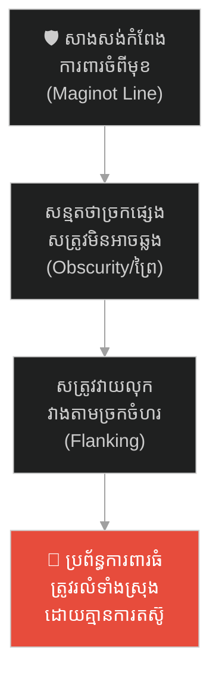
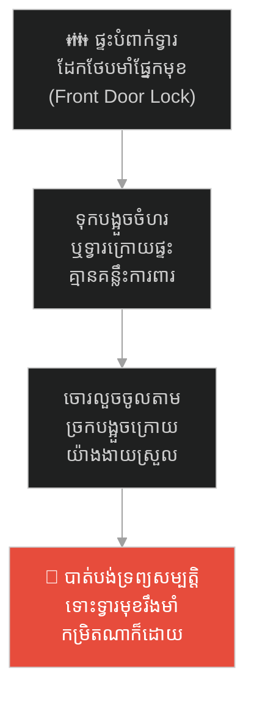
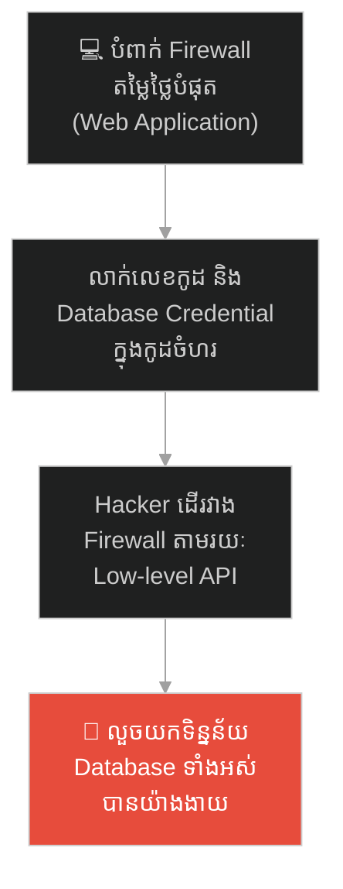
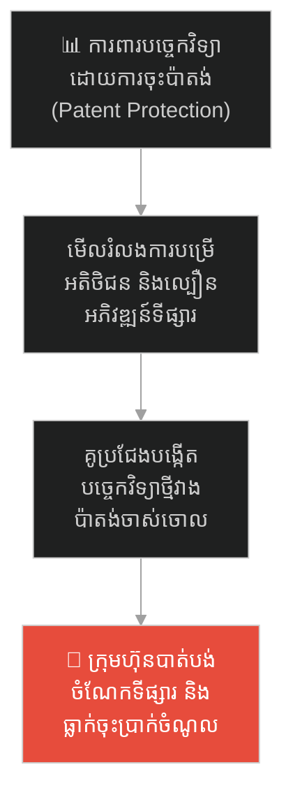
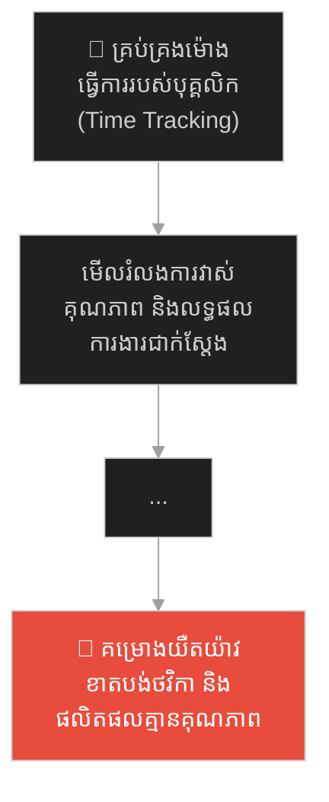
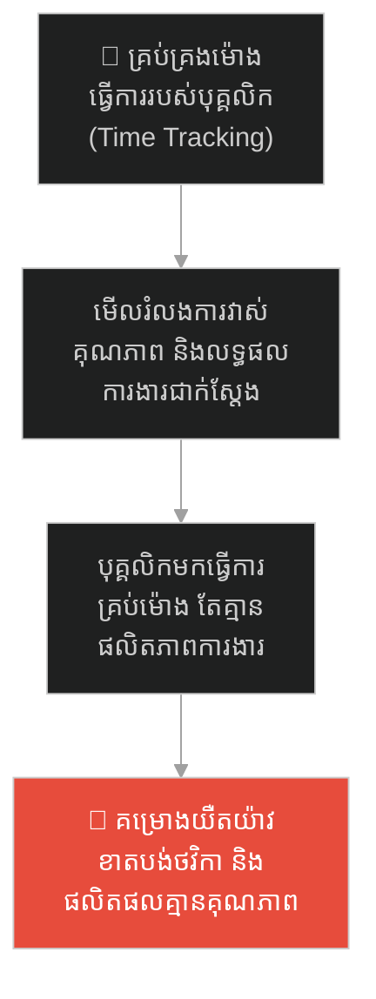
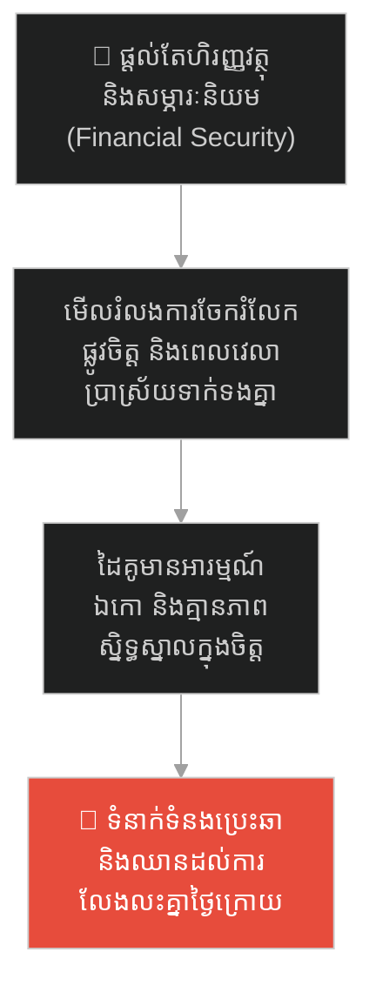
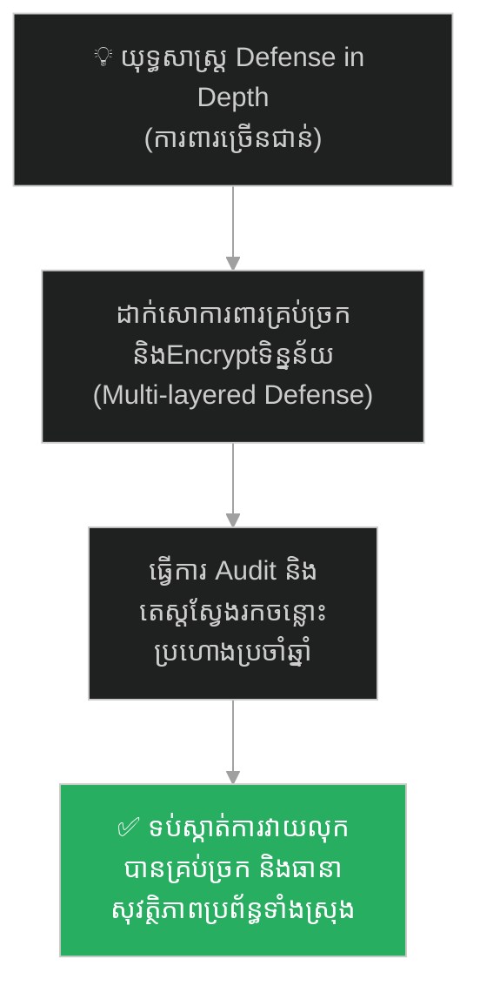

# The Maginot Line and the Unguarded Forest (ខ្សែបន្ទាត់ម៉ាហ្ស៊ីណូត និងព្រៃដែលគ្មានអ្នកយាម)៖ គ្រោះថ្នាក់នៃប្រព័ន្ធការពារគំរូចាស់ និងយុទ្ធសាស្ត្រ Defense in Depth

**Author:** ichamrong  
**Date:** 2026-05-27  
**Tags:** #ww2 #maginot-line #cybersecurity #system-design #history #defense-in-depth #critical-thinking  
**Category:** Concepts / Parables  
**Read Time:** ~15 min  

---

## 📌 មាតិកា (Table of Contents)
- [អន្ទាក់ផ្លូវចិត្ត (The Trap)](#អន្ទាក់ផ្លូវចិត្ត-the-trap)
- [១. ប្រវត្តិសាស្ត្រ៖ មហាកំពែងបេតុង និងព្រៃអាដិន (The History of the Maginot Line & Ardennes)](#1)
  - [មហាកំពែងដ៏រឹងមាំបំផុតក្នុងលោក (The Strongest Wall in the World)](#1-1)
  - [ការវាយប្រហារវាងកំពែង និងការដួលរលំ (The Flanking Attack & the Defeat)](#1-2)
- [២. បញ្ហា៖ ការសន្មតដោយគ្មានការផ្ទៀងផ្ទាត់ និងការការពារតែម្ខាង (The Issue: Weakest Link & Security Theater)](#2)
- [៣. ឧទាហរណ៍ជាក់ស្តែងក្នុងពិភពពិត (Real World Examples)](#3)
  - [ឧទាហរណ៍ទី ១ — កម្រិតស្រាល (គ្រួសារ)៖ ការដាក់សោទ្វារមុខយ៉ាងមាំតែទុកបង្អួចក្រោយផ្ទះចោល (The Unlocked Back Window)](#3-1)
  - [ឧទាហរណ៍ទី ២ — កម្រិតមធ្យម (បច្ចេកទេស)៖ ការទិញ Firewall ថ្លៃតែទុក Database គ្មាន Password (The High-End Firewall Bypass)](#3-2)
  - [ឧទាហរណ៍ទី ៣ — កម្រិតមធ្យម (ធុរកិច្ច)៖ ការពឹងផ្អែកលើច្បាប់ប៉ាតង់ដោយមើលរំលងគូប្រជែង (The Patent Protection Illusion)](#3-3)
  - [ឧទាហរណ៍ទី ៤ — កម្រិតមធ្យម (សង្គម/គ្រប់គ្រង)៖ ការគ្រប់គ្រងម៉ោងធ្វើការដោយមើលរំលងគុណភាពលទ្ធផល (The Micromanaged Timesheet)](#3-4)
  - [ឧទាហរណ៍ទី ៥ — កម្រិតធ្ងន់ (ទំនាក់ទំនង)៖ ការផ្តល់តែសម្ភារៈនិយមដោយមើលរំលងទំនាក់ទំនងផ្លូវចិត្ត (The Materialist Relationship)](#3-5)
- [៤. ដំណោះស្រាយទូទៅ៖ យុទ្ធសាស្ត្រ Defense in Depth និងការវាយតម្លៃចន្លោះប្រហោង (The General Solution: Multi-Layered Security & Continuous Auditing)](#4)
- [សេចក្តីសន្និដ្ឋាន (Conclusion)](#conclusion)
- [ឯកសារយោង (References)](#references)
- [Related Posts](#related-posts)

---

## អន្ទាក់ផ្លូវចិត្ត (The Trap)

តើអ្នកធ្លាប់ជួបស្ថានភាពដែលអ្នកបានវិនិយោគធនធាន និងថវិកាយ៉ាងច្រើនសន្ធឹកសន្ធាប់ដើម្បីសាងសង់កំពែងការពារគម្រោង ឬអាជីវកម្មរបស់អ្នកចំពីមុខ ប៉ុន្តែចុងក្រោយត្រូវបរាជ័យយ៉ាងងាយ គ្រាន់តែដោយសារសត្រូវវាយលុកតាមច្រកចំហរដែលអ្នកសន្មតថា «គ្មានផ្លូវអាចចូលបាន» ដែរឬទេ?

នៅក្នុងយុទ្ធសាស្ត្រ និងការគ្រប់គ្រងប្រព័ន្ធ៖
* **យើងតែងតែផ្តោតលើ** ការពង្រឹងកំពែងចម្បងឱ្យរឹងមាំបំផុតដើម្បីបង្ហាញភាពជឿជាក់ (Security Theater)។
* **ប៉ុន្តែយើងមើលរំលង** ចំណុចខ្សោយតូចតាច ឬច្រកចំហរដែលមិនត្រូវបានយាមកាម ព្រោះជឿជាក់លើការសន្មតផ្ទាល់ខ្លួន (Assumption)។

ការសន្មតថាប្រព័ន្ធមានសុវត្ថិភាពដោយពឹងផ្អែកតែលើជញ្ជាំងការពារទិសដៅតែមួយ ហៅថា **អន្ទាក់ Maginot Line (ខ្សែបន្ទាត់ការពាររឹងតែម្ខាង)**។

ដើម្បីយល់ដឹងពីវិធីសាងសង់ប្រព័ន្ធការពារជុំទិស និងយុទ្ធសាស្ត្រ Defense in Depth នេះជាផែនទីបង្ហាញផ្លូវសម្រាប់អត្ថបទនេះ៖
1. **រឿងព្រេង (The Historic Legend)** — រឿងរ៉ាវពិតនៃប្រវត្តិសាស្ត្រសង្គ្រាមលោកលើកទី២ ដែលមហាកំពែងការពារជាតិរបស់បារាំង ត្រូវរំលងដោយសារកងរថក្រោះអាល្លឺម៉ង់បើកកាត់ព្រៃអាដិន។
2. **បញ្ហា (The Issue)** — ភាពងាយរងគ្រោះនៃច្រកចំហរ និងកំហុសនៃការការពារផ្អែកលើការលាក់បាំងព័ត៌មាន (Obscurity)។
3. **ឧទាហរណ៍ជាក់ស្តែងក្នុងពិភពពិត (Real World Examples)** — ពិនិត្យមើលឥទ្ធិពលនៃបន្ទាត់ការពារម៉ាហ្ស៊ីណូតក្នុងកម្រិតគ្រួសារ ព័ត៌មានវិទ្យា ធុរកិច្ច ការគ្រប់គ្រង និងទំនាក់ទំនង។
4. **ដំណោះស្រាយទូទៅ (The General Solution)** — ការអនុវត្តប្រព័ន្ធការពារច្រើនជាន់ (Defense in Depth) និងយន្តការត្រួតពិនិត្យចន្លោះប្រហោងជាប្រចាំ។

---

## ១. ប្រវត្តិសាស្ត្រ៖ មហាកំពែងបេតុង និងព្រៃអាដិន (The History of the Maginot Line & Ardennes)

ក្រោយពីបញ្ចប់សង្គ្រាមលោកលើកទី១ ប្រទេសបារាំងបានប្តេជ្ញាចិត្តយ៉ាងមុតមាំថានឹងមិនអនុញ្ញាតឱ្យប្រទេសអាល្លឺម៉ង់វាយឈ្លានពានចូលទឹកដីរបស់ខ្លួនបានម្តងទៀតឡើយ។

---

### មហាកំពែងដ៏រឹងមាំបំផុតក្នុងលោក (The Strongest Wall in the World)

ពួកគេបានចំណាយថវិកាជាតិយ៉ាងច្រើនសន្ធឹកសន្ធាប់ និងពេលវេលាជាច្រើនឆ្នាំ ដើម្បីសាងសង់ **ខ្សែបន្ទាត់ម៉ាហ្ស៊ីណូត (The Maginot Line)**។ វាគឺជាបណ្តាញបន្ទាយយោធាដ៏មហិមា និងទំនើបបំផុតដែលលាតសន្ធឹងតាមបណ្តោយព្រំដែនបារាំង-អាល្លឺម៉ង់។ 

នៅទីនោះមាន៖
* ជញ្ជាំងបេតុងក្រាស់ៗរាប់ម៉ែត្រដែលអាចការពារការបាញ់ផ្លោងគ្រប់ប្រភេទ។
* កាណុងបាញ់រថក្រោះ និងលេណដ្ឋានក្រោមដីដ៏ស្មុគស្មាញ ដែលមានប្រព័ន្ធអគ្គិសនី រថភ្លើង និងស្បៀងបម្រុង។

រដ្ឋាភិបាល និងប្រជាជនបារាំងជឿជាក់ ១០០% ថា គ្មានកងទ័ពណានៅលើលោកនេះ អាចវាយទម្លុះខ្សែបន្ទាត់នេះបានឡើយ។

---

### ការវាយប្រហារវាងកំពែង និងការដួលរលំ (The Flanking Attack & the Defeat)

ទោះជាយ៉ាងណាក៏ដោយ ខ្សែបន្ទាត់ដ៏រឹងមាំនេះ មិនបានសាងសង់គ្របដណ្តប់ព្រំដែនទាំងអស់រហូតដល់សមុទ្រឡើយ។ នៅភាគខាងជើង មានតំបន់មួយហៅថា **ព្រៃអាដិន (The Ardennes Forest)**។

មេទ័ពបារាំងជើងចាស់បានសន្និដ្ឋានដោយមោទនភាពថា៖  
> *«ព្រៃអាដិន មានដើមឈើធំៗខ្វាត់ខ្វែង និងជ្រលងភ្នំក្រហេងក្រហូងណាស់! រថក្រោះរបស់អាល្លឺម៉ង់ គ្មានផ្លូវណាអាចបើកកាត់ព្រៃនេះបានឡើយ។ ដូច្នេះ យើងមិនចាំបាច់សាងសង់បន្ទាយ ឬដាក់កងទ័ពការពារនៅទីនេះទេ!»*

បារាំងបានផ្ញើក្តីសង្ឃឹមទាំងអស់ទៅលើកំពែងបេតុង ដោយទុកព្រៃនោះចំហរយ៉ាងស្រួល។

នៅពេលសង្គ្រាមលោកលើកទី២ ផ្ទុះឡើង កងទ័ពអាល្លឺម៉ង់មិនបានល្ងង់យកក្បាលទៅបុកនឹងជញ្ជាំងបេតុងរបស់បារាំងនោះទេ។ ពួកគេបានបញ្ជូនកងរថក្រោះរាប់ពាន់គ្រឿង បើកសម្រុកកាត់តាមព្រៃអាដិន (Ardennes) យ៉ាងលឿនបំផុត។

ដោយសារតែគ្មានកងទ័ពបារាំងចាំការពារនៅទីនោះ អាល្លឺម៉ង់បានឆ្លងកាត់ព្រៃនោះយ៉ាងងាយ រួចវាយឡោមព័ទ្ធកងទ័ពបារាំងពីក្រោយខ្នង (Flanking Maneuver)។ កាំភ្លើងធំរបស់បារាំងនៅលើខ្សែបន្ទាត់ម៉ាហ្ស៊ីណូត ដែលតម្រង់ទៅមុខ មិនអាចបង្វិលមកបាញ់សត្រូវពីក្រោយខ្នងបានទេ។

ត្រឹមតែរយៈពេល ៦ សប្តាហ៍ប៉ុណ្ណោះ ប្រទេសបារាំងទាំងមូលបានដួលរលំ និងចុះចាញ់សត្រូវ។ មហាកំពែងដ៏អស្ចារ្យបំផុតក្នុងប្រវត្តិសាស្ត្រ ត្រូវបានសត្រូវដើរវាង (Bypass) យ៉ាងងាយស្រួលដោយមិនបាច់បាញ់មួយគ្រាប់ទៅលើវា។

---

## ២. បញ្ហា៖ ការសន្មតដោយគ្មានការផ្ទៀងផ្ទាត់ និងការការពារតែម្ខាង (The Issue: Weakest Link & Security Theater)

រឿងព្រេងប្រវត្តិសាស្ត្រនេះ ឆ្លុះបញ្ចាំងពីចំណុចខ្សោយដ៏ធំនៅក្នុងវិស័យ **System Security (សុវត្ថិភាពប្រព័ន្ធ)** និងការគ្រប់គ្រងអាជីវកម្ម៖
* **Your Chain is Only as Strong as Its Weakest Link៖** ប្រព័ន្ធការពាររបស់អ្នក រឹងមាំស្មើនឹងចំណុចដែលខ្សោយបំផុតរបស់វាប៉ុណ្ណោះ។ បារាំងសាងសង់កំពែងរឹងកម្រិត ១០០ តែទុកព្រៃចំហរកម្រិត ០។ សត្រូវនឹងវាយប្រហារត្រង់ចំណុចកម្រិត ០ ជានិច្ច។
* **Security Theater (ភាពសំបកក្រៅ)៖** ការបង្កើតប្រព័ន្ធការពារដែលមើលទៅគួរឱ្យខ្លាចពីខាងក្រៅ ដើម្បីផ្តល់អារម្មណ៍កក់ក្តៅក្លែងក្លាយ ប៉ុន្តែខ្វះសុវត្ថិភាពពិតប្រាកដ។ នៅក្នុងវិស័យ IT ការទិញ Firewall ថ្លៃៗដោយទុកឱ្យលេខកូដ និងទិន្នន័យអតិថិជនលេចធ្លាយក្នុងកូដចំហរ គឺជាការកសាងកំពែង Maginot Line។

---

## ៣. ឧទាហរណ៍ជាក់ស្តែងក្នុងពិភពពិត

ដើម្បីយល់ដឹងឱ្យកាន់តែស៊ីជម្រៅ ផ្លូវការសិក្សានឹងនាំអ្នកទៅពិនិត្យមើល **ឧទាហរណ៍ចំនួន ៥ កម្រិតខុសៗគ្នា** ក្នុងជីវិតរស់នៅប្រចាំថ្ងៃ៖

---

### ឧទាហរណ៍ទី ១ — កម្រិតស្រាល (គ្រួសារ)៖ ការដាក់សោទ្វារមុខយ៉ាងមាំតែទុកបង្អួចក្រោយផ្ទះចោល (The Unlocked Back Window)

**ស្ថានភាព៖** គ្រួសារមួយបារម្ភពីរឿងសុវត្ថិភាពផ្ទះ ក៏បានទិញទ្វារដែក និងសោឆ្លាតវៃ (Smart Lock) តម្លៃ $500 បំពាក់នៅទ្វារមុខផ្ទះ។

* **ភាគី A (ការសន្និដ្ឋានខុស)៖** ពួកគេជឿជាក់ថាផ្ទះមានសុវត្ថិភាព ១០០% ហើយ ប៉ុន្តែភ្លេចគិតពីរឿងបង្អួចកញ្ចក់នៅក្រោយផ្ទះ ដែលគ្មានដែនការពារ និងគ្មានគន្លឹះច្បាស់លាស់ ព្រោះគិតថា «ចោរគ្មានផ្លូវអាចផ្លោះរបងចូលមកក្រោយផ្ទះបានឡើយ»។
* **ភាគី B (ការពិតជាក់ស្តែង)៖** ថ្ងៃមួយ ចោរបានប្លោះរបងចូលមកក្រោយផ្ទះ រួចវាយកញ្ចក់បង្អួចចូលមកលួចទ្រព្យសម្បត្តិយ៉ាងងាយស្រួល ដោយមិនបាច់ប៉ះពាល់នឹងទ្វារដែកខាងមុខឡើយ។

---

### ឧទាហរណ៍ទី ២ — កម្រិតមធ្យម (បច្ចេកទេស)៖ ការទិញ Firewall ថ្លៃតែទុក Database គ្មាន Password (The High-End Firewall Bypass)

**ស្ថានភាព៖** ក្រុមហ៊ុនអភិវឌ្ឍន៍ App បានចំណាយថវិកា $10,000 ទិញ Enterprise Firewall ដើម្បីការពាររាល់ការវាយប្រហាររបស់ Hacker ចំពីមុខ។

* **ភាគី A (ការការពារតែម្ខាង)៖** CTO មានមោទនភាពលើ Firewall នេះណាស់។ ប៉ុន្តែក្រុមការងារអភិវឌ្ឍន៍ បានទុក Database port ចំហរ និងដាក់លេខសម្ងាត់ងាយស្រួល (ដូចជា root/root) នៅលើ Server មួយសម្រាប់តេស្តសាកល្បង ដោយសារជឿថា «គ្មាននរណាដឹងពី IP របស់ Server នេះឡើយ»។
* **ភាគី B (ការពិតជាក់ស្តែង)៖** Hacker មិនបានវាយទម្លុះ Firewall ឡើយ។ ពួកគេគ្រាន់តែស្កេនរកមើល IP (Port scanning) រួចរកឃើញ Database នោះ ហើយលួចទិន្នន័យអតិថិជនទាំងអស់ចេញពីក្រោយខ្នង។

---

### ឧទាហរណ៍ទី ៣ — កម្រិតមធ្យម (ធុរកិច្ច)៖ ការពឹងផ្អែកលើច្បាប់ប៉ាតង់ដោយមើលរំលងគូប្រជែង (The Patent Protection Illusion)

**ស្ថានភាព៖** ក្រុមហ៊ុនផលិតទូរស័ព្ទដៃធំមួយបានចុះប៉ាតង់ការពារបច្ចេកវិទ្យាកាមេរ៉ារបស់ខ្លួនយ៉ាងតឹងរ៉ឹងបំផុត។

* **ភាគី A (ការជឿជាក់លើប៉ាតង់)៖** ពួកគេជឿជាក់ថា គ្មានគូប្រជែងណាអាចផលិតកាមេរ៉ាល្អដូចខ្លួនបានឡើយ ព្រោះជាប់ច្បាប់ប៉ាតង់ (Maginot Line)។ ក្រុមហ៊ុនបានធ្វេសប្រហែសការអភិវឌ្ឍន៍សូហ្វវែរ និងល្បឿនបម្រើសេវាកម្មអតិថិជន។
* **ភាគី B (ការពិតជាក់ស្តែង)៖** ក្រុមហ៊ុនគូប្រជែងថ្មីៗ មិនបានលួចបច្ចេកវិទ្យាកាមេរ៉ានោះឡើយ។ ពួកគេបានអភិវឌ្ឍយុទ្ធសាស្ត្រជំនួស គឺប្រើប្រាស់ AI (Computational Photography) ដើម្បីកែប្រែគុណភាពរូបភាពឱ្យស្អាតដូចគ្នា ដោយមិនបាច់ប្រើបច្ចេកវិទ្យាកាមេរ៉ាចាស់នោះទេ។ ទីបំផុត ក្រុមហ៊ុនចាស់ត្រូវបាត់បង់អតិថិជនយ៉ាងច្រើនសន្ធឹកសន្ធាប់។

---

### ឧទាហរណ៍ទី ៤ — កម្រិតមធ្យម (សង្គម/គ្រប់គ្រង)៖ ការគ្រប់គ្រងម៉ោងធ្វើការដោយមើលរំលងគុណភាពលទ្ធផល (The Micromanaged Timesheet)

**ស្ថានភាព៖** នាយកគ្រប់គ្រងរៀបចំប្រព័ន្ធច្បាប់វិន័យតឹងរ៉ឹងបំផុត គឺបុគ្គលិកត្រូវតែស្កែនមេដៃមកដល់ក្រុមហ៊ុនមុនម៉ោង ៨:០០ ព្រឹក។

* **ភាគី A (ការគ្រប់គ្រងសំបកក្រៅ)៖** នាយកគ្រប់គ្រងផ្តោតការយកចិត្តទុកដាក់តែលើរបាយការណ៍ស្កែនមេដៃ (Timesheets) ដើម្បីវាយតម្លៃបុគ្គលិក ដោយជឿថា «បុគ្គលិកមកទាន់ម៉ោង គឺមានផលិតភាពការងារខ្ពស់» (Maginot Line)។
* **ភាគី B (ការពិតជាក់ស្តែង)៖** បុគ្គលិកមកដល់ទាន់ម៉ោងមែន ប៉ុន្តែពួកគេចំណាយពេលពេញមួយព្រឹកផឹកកាហ្វេ ជជែកគ្នា និងលេងហ្គេម ដោយគ្មានផលិតភាពការងារជាក់ស្តែងឡើយ។ គុណភាពផលិតផលរបស់ក្រុមហ៊ុនធ្លាក់ចុះ ព្រោះនាយកគ្រប់គ្រងមិនបានត្រួតពិនិត្យលទ្ធផលការងារ (Outcome) ជាក់ស្តែង។

*(កែសម្រួលដើម្បីបង្រួញអត្ថបទ៖)*

---

### ឧទាហរណ៍ទី ៥ — កម្រិតធ្ងន់ (ទំនាក់ទំនង)៖ ការផ្តល់តែសម្ភារៈនិយមដោយមើលរំលងទំនាក់ទំនងផ្លូវចិត្ត (The Materialist Relationship)

**ស្ថានភាព៖** ប្តីម្នាក់ផ្តោតលើការរកលុយឱ្យបានច្រើន ទិញវីឡា និងឡានទំនើបៗជូនភរិយា។

* **ភាគី A (ការសាងសង់កំពែងសម្ភារៈ)៖** គាត់ជឿថា គាត់បានផ្តល់កំពែងការពារជីវិតគ្រួសាររឹងមាំខ្លាំងបំផុតហើយ (Maginot Line) គ្មានអ្វីដែលភរិយាត្រូវអាក់អន់ចិត្តឡើយ។ គាត់មិនដែលចំណាយពេលស្តាប់ការលំបាក ឬនិយាយប្រាស្រ័យទាក់ទងផ្លូវចិត្តឡើយ។
* **ភាគី B (ការពិតជាក់ស្តែង)៖** ភរិយាមានអារម្មណ៍ឯកោ គ្មានភាពស្និទ្ធស្នាល និងគ្មានទំនាក់ទំនងផ្លូវចិត្តរយៈពេលវែង។ ទីបំផុត នាងសម្រេចចិត្តសុំលែងលះដើម្បីស្វែងរកជីវិតថ្មីដែលមានការយល់ចិត្ត ទោះបីជាត្រូវលះបង់ទ្រព្យសម្បត្តិទាំងអស់ក៏ដោយ។

---

## ៤. ដំណោះស្រាយទូទៅ៖ យុទ្ធសាស្ត្រ Defense in Depth និងការវាយតម្លៃចន្លោះប្រហោង (The General Solution: Multi-Layered Security & Continuous Auditing)

ដើម្បីចៀសវាងការធ្លាក់ចូលទៅក្នុងអន្ទាក់កំពែងតែម្ខាង និងសាងសង់ប្រព័ន្ធការពារប្រកបដោយតម្លាភាព អ្នកត្រូវអនុវត្តវិធានការទាំងនេះ៖

### ១. អនុវត្តយុទ្ធសាស្ត្រការពារច្រើនជាន់ (Defense in Depth)
មិនត្រូវសង្ឃឹមលើឧបករណ៍ការពារតែមួយមុខនោះឡើយ។ ប្រព័ន្ធការពារត្រូវតែមានច្រើនស្រទាប់៖
* នៅក្នុងបច្ចេកវិទ្យា៖ ត្រូវដាក់ Firewall (ជាន់ទី១), ផ្ទៀងផ្ទាត់សិទ្ធិចូលប្រើ (ជាន់ទី២), ចាក់សោទិន្នន័យ Encryption (ជាន់ទី៣), និងតាមដាន Log សកម្មភាពប្រក្រតី (ជាន់ទី៤)។ បើទោះជា Hacker វាងទ្វារទី១ ក៏មិនអាចលួចយកទិន្នន័យបានឡើយ។

### ២. លុបបំបាត់ការសន្មតដោយគ្មានការតេស្ត (Never Assume Obscurity)
កុំសន្មតថា «គ្មាននរណាដឹង» ឬ «ផ្លូវនោះពិបាកណាស់ គ្មានអ្នកណាដើរចូលឡើយ»។ ត្រូវសន្មតថា សត្រូវដឹងរាល់ចំណុចទាំងអស់នៅក្នុងប្រព័ន្ធរបស់អ្នក។ ត្រូវធ្វើការវាយតម្លៃសន្តិសុខប្រព័ន្ធ (Security Auditing) និងធ្វើតេស្តសាកល្បងជ្រៀតចូល (Penetration Testing) ជាប្រចាំ ដើម្បីស្វែងរកចន្លោះប្រហោងមុនពេលសត្រូវរកឃើញ។

### ៣. អនុវត្តការការពារ 360 ដឺក្រេ (Holistic Risk Management)
នៅក្នុងការគ្រប់គ្រងគម្រោង៖ ត្រូវវាយតម្លៃហានិភ័យជុំទិស។ មិនត្រូវពង្រឹងតែផ្នែកបច្ចេកវិទ្យា ដោយមើលរំលងច្បាប់ទម្លាប់ ឬវគ្គបណ្តុះបណ្តាលសតិប្រុងប្រយ័ត្នរបស់បុគ្គលិកឡើយ។ ភាពខ្លាំងពិតប្រាកដកើតចេញពីការការពារគ្រប់ច្រកល្ហក។

---

## 🐇 ធ្លាក់ចូលក្នុងរន្ធទន្សាយយុទ្ធសាស្ត្រ (Enter the Strategic Rabbit Hole)

ដើម្បីស្វែងយល់បន្ថែមអំពីរបៀបដែលមេដឹកនាំ ឬអ្នកបច្ចេកវិទ្យា ប្រើប្រាស់ភាពទទេស្អាត និងការបើកចំហរទ្វារក្រុងដោយចេតនា (Empty City Strategy) ដើម្បីបញ្ឆោតឱ្យសត្រូវដែលមានកម្លាំងខ្លាំងក្លាដកថយដោយសារតែភាពសង្ស័យ និងលម្អៀងការយល់ដឹង សូមបន្តដំណើររបស់អ្នក៖

* 🚀 **[ចាប់ផ្តើមដំណើររុករក (Start the Journey) ➔ The Empty City Strategy and the Art of Psychological Warfare](./36-the-empty-city-strategy.md)**

---

## សេចក្តីសន្និដ្ឋាន (Conclusion)

> **«កំពែងការពារបេតុងដ៏រឹងមាំបំផុតក្នុងលោក នឹងគ្មានន័យអ្វីទាំងអស់ ប្រសិនបើសត្រូវអាចដើរវាងវាបានយ៉ាងងាយស្រួល តាមរយៈព្រៃដែលគ្មានអ្នកយាម។»**

ចូរកុំវិនិយោគធនធានទាំងអស់ទៅលើការកសាងភាពរឹងមាំតែម្ខាង ដើម្បីគ្រាន់តែបង្ហាញជាសំបកក្រៅឡើយ។ ត្រូវត្រួតពិនិត្យប្រព័ន្ធការងាររបស់អ្នកជុំទិស និងអនុវត្តការការពារច្រើនជាន់ ដើម្បីធានាថាគ្មានចន្លោះប្រហោងណាដែលត្រូវបានទុកចោលដោយការសន្មតខុស។

ចូរយាមកាមព្រៃរបស់អ្នក ឱ្យបានល្អដូចជាកំពែងរបស់អ្នក។

---

## ឯកសារយោង (References)

* **Kaufmann, J. E. & Kaufmann, H. W.** — *Fortress France: The Maginot Line and French Defenses in World War II* (2006)។ ការវិភាគលម្អិតផ្នែកយោធា និងប្រវត្តិសាស្ត្រអំពីខ្សែបន្ទាត់ម៉ាហ្ស៊ីណូត។
* **Schneier, Bruce** — *Beyond Fear: Thinking Sensibly About Security in an Uncertain World* (2003)។ ការវិភាគទ្រឹស្តី Security Theater និងប្រព័ន្ធការពារច្រើនស្រទាប់។
* **Defense in Depth Standard** — *NSA Information Assurance Technical Framework* (2002) Whitepaper standard។

---

## Related Posts

* **[27 The Maginot Line and Security Theater](../articles/27-the-maginot-line-and-security-theater.md)** — អត្ថបទគោលបកស្រាយលម្អិតអំពីយន្តការការពាររន្ធប្រហោងប្រព័ន្ធ និង Security Theater។
* **[32 The Trojan Horse and the Fall of the Impregnable City](./32-the-trojan-horse.md)** — ការវាយប្រហារពីខាងក្នុងប្រព័ន្ធ ដោយការប្រើប្រាស់ល្បិចវិស្វកម្មសង្គម។
* **[20 Cognitive Biases: The Hidden Flaws in Human Thinking](../articles/20-cognitive-biases-the-flaws-in-human-thinking.md)** — ការយល់ដឹងពីកំហុសនៃការគិត និងលម្អៀងក្នុងការសន្មតរបស់មនុស្ស។

---
*Last updated: 2026-05-27*

## Related

- [💡 Concepts README](../README.md)
- [📚 Main Repository README](../../../README.md)
- [Developer Habits](../../developer-habits/README.md)
- [Mental Health & Well-being](../../mental-health/README.md)
- [Management & SDLC](../../management/README.md)
