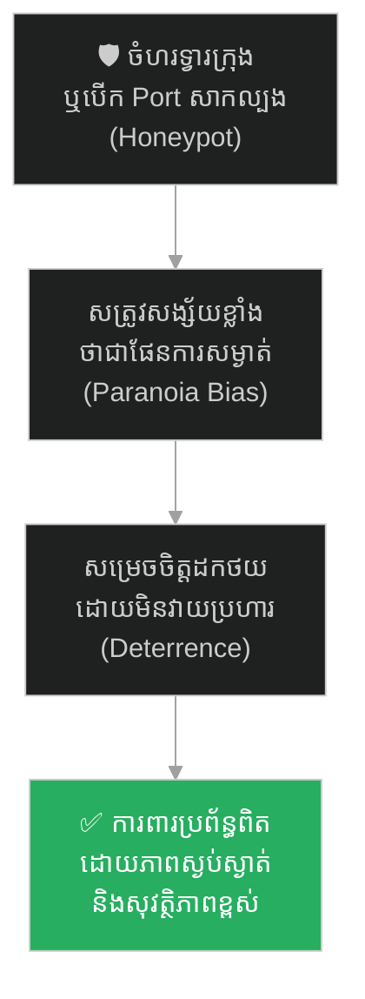
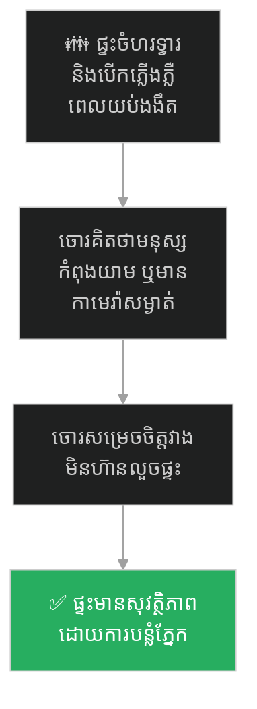
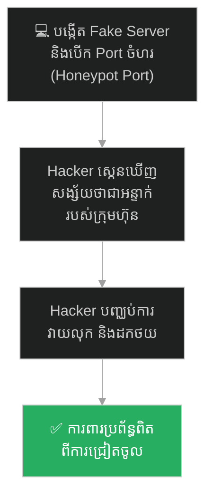
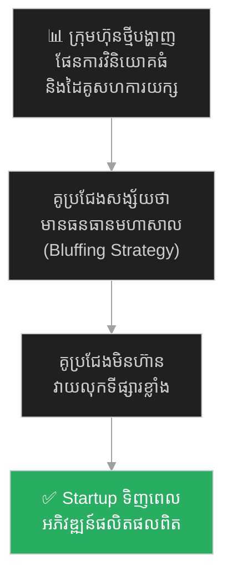
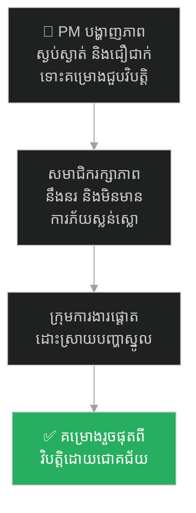
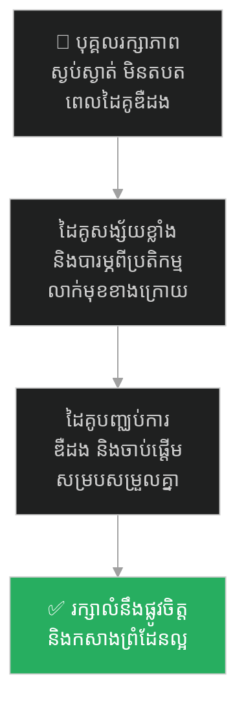
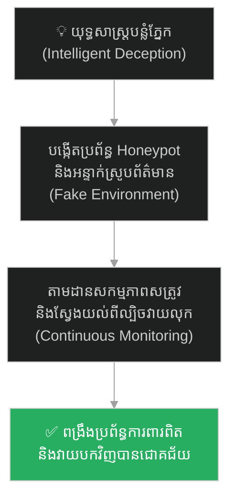

# Zhuge Liang and the Empty City (ជូកឺលៀង និងយុទ្ធសាស្ត្រក្រុងទទេ)៖ គ្រោះថ្នាក់នៃលម្អៀងការយល់ឃើញ និងយុទ្ធសាស្ត្រ Honeypot ក្នុងបច្ចេកវិទ្យា

**Author:** ichamrong  
**Date:** 2026-05-27  
**Tags:** #three-kingdoms #empty-city-strategy #psychological-warfare #cybersecurity #honeypots #bluffing #critical-thinking  
**Category:** Concepts / Parables  
**Read Time:** ~15 min  

---

## 📌 មាតិកា (Table of Contents)
- [អន្ទាក់ផ្លូវចិត្ត (The Trap)](#អន្ទាក់ផ្លូវចិត្ត-the-trap)
- [១. រឿងព្រេង៖ សំឡេងពិណលើកំពែង និងទ្វារក្រុងបើកចំហរ (The Legend of the Empty City Strategy)](#1)
  - [ស្ថានភាពគ្រោះថ្នាក់បំផុត (The Critical Danger)](#1-1)
  - [ការបើកទ្វារក្រុង និងការសង្ស័យរបស់សត្រូវ (Opening the Gates & Suspicion)](#1-2)
- [២. បញ្ហា៖ ការសង្ស័យហួសហេតុ និងការប្រើប្រាស់អន្ទាក់បន្លំ (The Issue: Honeypots & Deterrence Strategy)](#2)
- [៣. ឧទាហរណ៍ជាក់ស្តែងក្នុងពិភពពិត (Real World Examples)](#3)
  - [ឧទាហរណ៍ទី ១ — កម្រិតស្រាល (គ្រួសារ)៖ ការចំហរទ្វារផ្ទះ និងបើកភ្លើងដើម្បីបំភ័យចោរ (The Lit-Up Empty House)](#3-1)
  - [ឧទាហរណ៍ទី ២ — កម្រិតមធ្យម (បច្ចេកទេស)៖ ការបង្កើត Fake Server និង Honeypot Ports ដើម្បីបញ្ឆោត Hacker (The Active Honeypot Server)](#3-2)
  - [ឧទាហរណ៍ទី ៣ — កម្រិតមធ្យម (ធុរកិច្ច)៖ ការប្រកាសគម្រោងធំរបស់ Startup ដើម្បីទប់ស្កាត់គូប្រជែង (The Strategic Business Bluff)](#3-3)
  - [ឧទាហរណ៍ទី ៤ — កម្រិតមធ្យម (សង្គម/គ្រប់គ្រង)៖ ភាពស្ងប់ស្ងាត់របស់ PM ក្នុងពេលគម្រោងជួបវិបត្តិធំ (The Calm Leadership Facade)](#3-4)
  - [ឧទាហរណ៍ទី ៥ — កម្រិតធ្ងន់ (ទំនាក់ទំនង)៖ ការរក្សាភាពស្ងប់ស្ងាត់ និងមិនតបតចំពោះសម្ពាធផ្លូវចិត្ត (The Equanimity Boundaries)](#3-5)
- [៤. ដំណោះស្រាយទូទៅ៖ ការកសាង Honeypots វៃឆ្លាត និងការសង្កេតសកម្មភាពសត្រូវ (The General Solution: Honeypot Deployment & Defensive Deception)](#4)
- [សេចក្តីសន្និដ្ឋាន (Conclusion)](#conclusion)
- [ឯកសារយោង (References)](#references)
- [Related Posts](#related-posts)

---

## អន្ទាក់ផ្លូវចិត្ត (The Trap)

តើអ្នកធ្លាប់ជួបស្ថានភាពដែលខ្លួនឯងកំពុងស្ថិតក្នុងចំណុចខ្សោយបំផុត គ្មានធនធានដើម្បីតស៊ូទប់ទល់ទាល់តែសោះ ប៉ុន្តែអ្នកអាចសង្គ្រោះស្ថានការណ៍បាន ដោយប្រើប្រាស់ «ភាពស្ងប់ស្ងាត់» និង «ការបញ្ឆោតចិត្តសាស្ត្រ» ដើម្បីធ្វើឱ្យសត្រូវដែលខ្លាំងជាង ដកថយទៅវិញដោយខ្លួនឯងដែរឬទេ?

នៅក្នុងយុទ្ធសាស្ត្រ និងសុវត្ថិភាពប្រព័ន្ធ៖
* **យើងតែងតែបង្ហាញភាពភ័យស្លន់ស្លោ** និងចាត់វិធានការការពាររញ៉េរញ៉ៃ ដែលបង្ហាញឱ្យសត្រូវដឹងពីចំណុចខ្សោយពិតរបស់យើង។
* **ប៉ុន្តែយើងមើលរំលង** សិល្បៈនៃការប្រើប្រាស់ភាពស្ងប់ស្ងាត់ និងការរៀបចំអន្ទាក់ (Honeypot) ដើម្បីបង្កើតភាពសង្ស័យ និងបន្លំភ្នែកសត្រូវ។

ការប្រើប្រាស់ការយល់ឃើញ និងការបង្កើតមន្ទិលសង្ស័យដើម្បីទប់ស្កាត់ការវាយលុក ហៅថា **អន្ទាក់ Empty City Strategy (យុទ្ធសាស្ត្រក្រុងទទេ)**។

ដើម្បីយល់ដឹងពីវិធីកសាងប្រព័ន្ធអន្ទាក់បន្លំភ្នែក និងការការពារដោយចិត្តសាស្ត្រ នេះជាផែនទីបង្ហាញផ្លូវសម្រាប់អត្ថបទនេះ៖
1. **រឿងព្រេង (The Historic Legend)** — រឿងរ៉ាវរបស់ ជូកឺលៀង (ខុងមិញ) ដែលលេងពិណយ៉ាងស្ងប់ស្ងាត់នៅលើកំពែងក្រុង បញ្ឆោតកងទ័ព ១៥ ម៉ឺននាក់របស់ ស៊ីម៉ាអ៊ី ឱ្យដកថយ។
2. **បញ្ហា (The Issue)** — យន្តការ Honeypot និងរបៀបដែលខួរក្បាលរបស់សត្រូវចាញ់បោកការសង្ស័យរបស់ខ្លួនឯង។
3. **ឧទាហរណ៍ជាក់ស្តែងក្នុងពិភពពិត (Real World Examples)** — ពិនិត្យមើលឥទ្ធិពលនៃយុទ្ធសាស្ត្រក្រុងទទេក្នុងកម្រិតគ្រួសារ ព័ត៌មានវិទ្យា ធុរកិច្ច ការគ្រប់គ្រង និងទំនាក់ទំនង។
4. **ដំណោះស្រាយទូទៅ (The General Solution)** — ការបង្កើតប្រព័ន្ធ Honeypot វៃឆ្លាត និងការការពារបែប Deception Security។

---

## ១. រឿងព្រេង៖ សំឡេងពិណលើកំពែង និងទ្វារក្រុងបើកចំហរ (The Legend of the Empty City Strategy)

នៅក្នុងប្រវត្តិសាស្ត្រសាមកុក (Three Kingdoms) **ជូកឺលៀង (ខុងមិញ)** គឺជាមេបញ្ជាការយោធា និងជាអ្នកប្រាជ្ញដ៏ឈ្លាសវៃបំផុតម្នាក់។ ថ្ងៃមួយ ដោយសារតែកំហុសក្នុងការយាមច្រកយុទ្ធសាស្ត្ររបស់មេទ័ពក្រោមបង្គាប់ ទីក្រុងស៊ីឆួន ដែលខុងមិញកំពុងស្នាក់នៅ ត្រូវប្រឈមមុខនឹងគ្រោះថ្នាក់ដ៏ធំធេង។ មេទ័ពសត្រូវដ៏ខ្លាំងពូកែគឺ **ស៊ីម៉ាអ៊ី** បានដឹកនាំកងទ័ពចំនួន ១៥ ម៉ឺននាក់ លើកមកវាយលុកយ៉ាងគំហុក។

---

### ស្ថានភាពគ្រោះថ្នាក់បំផុត (The Critical Danger)

នៅពេលនោះ កងទ័ពការពារនៅក្នុងក្រុងរបស់ខុងមិញ មានត្រឹមតែ ២,៥០០ នាក់ប៉ុណ្ណោះ ហើយភាគច្រើនជាទាហានចាស់ៗ និងអ្នកស៊ីឈ្នួលដឹកស្បៀង។ កងទ័ពធំរបស់ខុងមិញកំពុងស្ថិតនៅសមរភូមិឆ្ងាយ មិនអាចមកជួយសង្គ្រោះទាន់ពេលឡើយ។ 

ប្រសិនបើប្រយុទ្ធដោយកម្លាំងបាយ ទីក្រុងនេះប្រាកដជាត្រូវវាយបែកត្រឹមតែមួយប៉ព្រិចភ្នែក ហើយខុងមិញប្រាកដជាត្រូវសត្រូវចាប់ខ្លួន។ ទាហានទាំងអស់នៅក្នុងក្រុងបានភ័យស្លន់ស្លោ និងរញ៉េរញ៉ៃ គិតថាពួកគេច្បាស់ជាត្រូវស្លាប់ជាមិនខាន។

---

### ការបើកទ្វារក្រុង និងការសង្ស័យរបស់សត្រូវ (Opening the Gates & Suspicion)

ខុងមិញ មិនបានបង្ហាញភាពភ័យខ្លាចសូម្បីតែបន្តិច។ ផ្ទុយទៅវិញ គាត់បានឡើងទៅលើកំពែងខ្ពស់ រួចបញ្ជាឱ្យទាហានទាំងអស់ទម្លាក់អាវុធ លាក់ខ្លួនឱ្យជិតបំផុត និងហាមមិនឱ្យសូម្បីតែនិយាយសំឡេងខ្លាំង។ បន្ទាប់មក គាត់បានបញ្ជាឱ្យបើកទ្វារក្រុងទាំង ៤ ទិសចំហរចោលទាំងអស់ ហើយយកទាហានបន្លំខ្លួនជាប្រជារាស្ត្រ ទៅបោសសម្អាតសម្រាមនៅមុខទ្វារក្រុងជាធម្មតា។

ចំណែកឯខុងមិញខ្លួនឯង គាត់បានស្លៀកពាក់អាវធំអ្នកប្រាជ្ញយ៉ាងស្អាតបាត យកពិណបុរាណទៅអង្គុយលេង និងផឹកតែយ៉ាងស្ងប់ស្ងាត់នៅសាលាលើកំពែងក្រុង។

នៅពេលដែលមេទ័ព ស៊ីម៉ាអ៊ី ដឹកនាំកងទ័ព ១៥ ម៉ឺននាក់មកដល់មុខក្រុង គាត់មានការភ្ញាក់ផ្អើលយ៉ាងខ្លាំង។ គាត់បានឃើញទ្វារក្រុងបើកចំហរគ្មានអ្នកការពារ មនុស្សចាស់បោសសម្រាមធម្មតា ឯខុងមិញកំពុងលេងពិណដោយស្នាមញញឹម គ្មានភាពភ័យខ្លាចទាល់តែសោះ។ សំឡេងពិណបន្លឺឡើងយ៉ាងពិរោះ និងមានលំនឹង គ្មានភាពញ័ររន្ធត់ឡើយ។

ស៊ីម៉ាអ៊ី ជាមនុស្សឆ្លាត និងប្រុងប្រយ័ត្នខ្ពស់។ គាត់ស្គាល់ចរិតខុងមិញច្បាស់ណាស់ថា៖ *«ខុងមិញជាមនុស្សប្រុងប្រយ័ត្ន និងមិនដែលផ្សងព្រេងធ្វើការងារគ្មានផែនការការពារឡើយ។ ការដែលបើកទ្វារចំហរ និងលេងពិណយ៉ាងស្ងប់ស្ងាត់បែបនេះ គឺប្រាកដជាមាន "កងទ័ពបង្កប់ដ៏ធំ" រង់ចាំវាយឆ្មក់នៅក្នុងក្រុងជាមិនខាន បើយើងសម្រុកចូល គឺច្បាស់ជាស្លាប់!»*

ដោយសារការសង្ស័យ និងភាពភ័យខ្លាចជាប់អន្ទាក់ (Paranoia) ស៊ីម៉ាអ៊ី បានបញ្ជាឱ្យកងទ័ពទាំង ១៥ ម៉ឺននាក់ "ដកថយ" ភ្លាមៗដោយគ្មានការវាយលុកសូម្បីតែមួយដង។ ខុងមិញ បានសង្គ្រោះទីក្រុងដោយប្រើប្រាស់ "ភាពទទេស្អាត" និង "សង្គ្រាមចិត្តសាស្ត្រ"។

---

## ២. បញ្ហា៖ ការសង្ស័យហួសហេតុ និងការប្រើប្រាស់អន្ទាក់បន្លំ (The Issue: Honeypots & Deterrence Strategy)

រឿងព្រេងនេះ ឆ្លុះបញ្ចាំងពីគោលការណ៍ **Honeypot (ប្រព័ន្ធអន្ទាក់)** នៅក្នុងវិស័យ Cybersecurity និងការគ្រប់គ្រង៖
* **ទ្វារចំហរ និង Honeypot៖** នៅក្នុងវិស័យបច្ចេកវិទ្យា Honeypot គឺជា Server ក្លែងក្លាយ ឬ Port ដែលត្រូវបានបើកចំហរចោលដោយចេតនា (ដូចជា ទ្វារក្រុងរបស់ខុងមិញ)។ នៅពេល Hacker ស្កេនឃើញ Port បើកចំហរងាយស្រួលពេក ពួកគេនឹងចាប់ផ្តើមសង្ស័យថាវាជាអន្ទាក់ដែលរៀបចំទុកដើម្បីចាប់យក IP និងសកម្មភាពរបស់ពួកគេ (Intrusion Detection)។
* **សង្គ្រាមចិត្តសាស្ត្រ (Defensive Deception)៖** ការការពារដ៏ល្អបំផុត ជារឿយៗមិនមែនជាការសង់កំពែងឱ្យក្រាស់បំផុតនោះទេ តែគឺសមត្ថភាពក្នុងការគ្រប់គ្រងការគិតរបស់សត្រូវ។ ធ្វើឱ្យសត្រូវសង្ស័យ និងមិនហ៊ានវាយប្រហារ គឺជាយុទ្ធសាស្ត្រសន្សំសំចៃធនធានខ្ពស់បំផុត។

---

## ៣. ឧទាហរណ៍ជាក់ស្តែងក្នុងពិភពពិត

ដើម្បីយល់ដឹងឱ្យកាន់តែស៊ីជម្រៅ ផ្លូវការសិក្សានឹងនាំអ្នកទៅពិនិត្យមើល **ឧទាហរណ៍ចំនួន ៥ កម្រិតខុសៗគ្នា** ក្នុងជីវិតរស់នៅប្រចាំថ្ងៃ៖

---

### ឧទាហរណ៍ទី ១ — កម្រិតស្រាល (គ្រួសារ)៖ ការចំហរទ្វារផ្ទះ និងបើកភ្លើងដើម្បីបំភ័យចោរ (The Lit-Up Empty House)

**ស្ថានភាព៖** គ្រួសារមួយត្រូវចាកចេញពីផ្ទះទៅលេងខេត្តរយៈពេល ៣ ថ្ងៃក្នុងឱកាសបុណ្យទាន។

* **ភាគី A (ការបង្ហាញចំណុចខ្សោយ)៖** ពួកគេបិទទ្វារចាក់សោ របងដែកជិតឈឹង និងបិទភ្លើងងងឹតស្លុប។ ចោរដែលដើរល្បាតដឹងភ្លាមថាគ្មានមនុស្សនៅផ្ទះឡើយ ហើយចាប់ផ្តើមរៀបចំលួចកាត់សោរបង។
* **ភាគី B (យុទ្ធសាស្ត្រក្រុងទទេ)៖** ពួកគេបានបើកភ្លើងនៅសាលាខាងមុខ និងបន្ទប់ទទួលភ្ញៀវចោលឱ្យភ្លឺចិញ្ចាច រួចចំហរបង្អួចជាន់លើបន្តិច ធ្វើដូចជាមានមនុស្សនៅក្នុងផ្ទះ។ ចោរឃើញភ្លើងភ្លឺ និងបង្អួចចំហរ ក៏សង្ស័យថាមនុស្សមិនទាន់គេង ឬមានប្រព័ន្ធកាមេរ៉ាកំពុងបើកចោល ក៏សម្រេចចិត្តដើរចេញទៅរកផ្ទះផ្សេង។

---

### ឧទាហរណ៍ទី ២ — កម្រិតមធ្យម (បច្ចេកទេស)៖ ការបង្កើត Fake Server និង Honeypot Ports ដើម្បីបញ្ឆោត Hacker (The Active Honeypot Server)

**ស្ថានភាព៖** ក្រុមហ៊ុនសេវាកម្មហិរញ្ញវត្ថុចង់ការពារទិន្នន័យអតិថិជនពីការស្កេនរបស់ Hacker ជារៀងរាល់ថ្ងៃ។

* **ភាគី A (ការដោះស្រាយដោយភាពភ័យខ្លាច)៖** នៅពេលឃើញមានសកម្មភាពស្កេន ក្រុមការងារ IT ចាប់ផ្តើមបិទ Port លឿនៗ និងបង្ហាញភាពស្លន់ស្លោ។ Hacker ដឹងថាប្រព័ន្ធការងារកំពុងភ័យ ក៏បន្តបុកវាយប្រហារ Brute-force លើច្រកផ្សេងទៀត។
* **ភាគី B (យុទ្ធសាស្ត្រក្រុងទទេ)៖** ពួកគេបានបង្កើត Fake Server មួយ (Honeypot) ដែលមានទិន្នន័យសិប្បនិម្មិត និងចំហរ Port ទូទៅចោល។ នៅពេល Hacker ស្កេនឃើញ ក៏សង្ស័យខ្លាំងថាជាប្រព័ន្ធអន្ទាក់របស់ក្រុមហ៊ុន ដើម្បីតាមដានសកម្មភាពរបស់ពួកគេ ក៏សម្រេចចិត្តដកថយមិនហ៊ានវាយលុកបន្តទៀត។

---

### ឧទាហរណ៍ទី ៣ — កម្រិតមធ្យម (ធុរកិច្ច)៖ ការប្រកាសគម្រោងធំរបស់ Startup ដើម្បីទប់ស្កាត់គូប្រជែង (The Strategic Business Bluff)

**ស្ថានភាព៖** ក្រុមហ៊ុន Startup មួយកំពុងខ្វះខាតថវិកា និងកំពុងស្ថិតក្នុងដំណាក់កាលចរចាទុនវិនិយោគ។

* **ភាគី A (ភាពទន់ខ្សោយលេចចេញមក)៖** ពួកគេបង្ហាញភាពភ័យខ្លាច កាត់បន្ថយការផ្សព្វផ្សាយ និងស្វែងរកការសហការដោយបន្ទាបតម្លៃខ្លួន។ គូប្រជែងធំៗដឹងច្បាស់ពីវិបត្តិហិរញ្ញវត្ថុ ក៏ចាប់ផ្តើមបញ្ចុះតម្លៃដើម្បីសម្លាប់ Startup នោះចោល។
* **ភាគី B (យុទ្ធសាស្ត្រក្រុងទទេ)៖** ស្ថាបនិកបានរៀបចំសន្និសីទកាសែតបង្ហាញគម្រោងបច្ចេកវិទ្យាថ្មីដ៏អស្ចារ្យ និងប្រកាសពីការពង្រីកទីផ្សារជាមួយដៃគូយក្ស (ទោះបីជាគម្រោងពិតមិនទាន់រួចរាល់)។ គូប្រជែងឃើញភាពជឿជាក់ និងទ្រង់ទ្រាយធំ ក៏សង្ស័យថាក្រុមហ៊ុននេះមានធនធានបម្រុងធំពីក្រោយ ហើយមិនហ៊ានវាយលុកទីផ្សារឡើយ ធ្វើឱ្យ Startup មានពេលចរចាទុនបានជោគជ័យ។

---

### ឧទាហរណ៍ទី ៤ — កម្រិតមធ្យម (សង្គម/គ្រប់គ្រង)៖ ភាពស្ងប់ស្ងាត់របស់ PM ក្នុងពេលគម្រោងជួបវិបត្តិធំ (The Calm Leadership Facade)

**ស្ថានភាព៖** គម្រោងសូហ្វវែររបស់ធនាគារជួបប្រទះបញ្ហាគាំង Server មុនថ្ងៃប្រគល់ការងារ ១ ថ្ងៃ។

* **ភាគី A (ការបង្ហាញភាពស្លន់ស្លោ)៖** PM ស្រែកជេរប្រកាសអាសន្ន និងប្រមូលប្រជុំបន្ទាន់ទាំងយប់។ សមាជិកក្រុមមានអារម្មណ៍ភ័យខ្លាច ធ្វើការងារទាំងស្លន់ស្លោ និងបង្កឱ្យមានកំហុស Bug កាន់តែច្រើនជាងមុន។
* **ភាគី B (យុទ្ធសាស្ត្រក្រុងទទេ)៖** PM រក្សាភាពស្ងប់ស្ងាត់ទាំងស្រុង ដើរចូលការិយាល័យដោយស្នាមញញឹម និងចាក់តែផឹកធម្មតា (ទោះបីជាក្នុងចិត្តបារម្ភខ្លាំង)។ សមាជិកក្រុមឃើញមេដឹកនាំស្ងប់ស្ងាត់ ក៏សន្មតថាបញ្ហានេះ PM ធ្លាប់ជួប និងមានដំណោះស្រាយរួចជាស្រេចហើយ។ ពួកគេធ្វើការងារដោយនឹងនរ និងដោះស្រាយបញ្ហាបានទាន់ពេល។

---

### ឧទាហរណ៍ទី ៥ — កម្រិតធ្ងន់ (ទំនាក់ទំនង)៖ ការរក្សាភាពស្ងប់ស្ងាត់ និងមិនតបតចំពោះសម្ពាធផ្លូវចិត្ត (The Equanimity Boundaries)

**ស្ថានភាព៖** បុគ្គលម្នាក់រងការគំរាមកំហែង និងឌឺដងពីសំណាក់មិត្តភក្តិពុល (Toxic friend)។

* **ភាគី A (ការបង្ហាញប្រតិកម្មវិលវល់)៖** គាត់បង្ហាញការខឹងសម្បារ ផ្ញើសារវែងៗតវ៉ា និងព្យាយាមបកស្រាយ។ ភាគីពុលដឹងថាខ្លួនកំពុងមានឥទ្ធិពលលើផ្លូវចិត្តរបស់គាត់ ក៏បន្តវាយលុក និងកេងប្រវ័ញ្ចកាន់តែខ្លាំង។
* **ភាគី B (យុទ្ធសាស្ត្រក្រុងទទេ)៖** គាត់រក្សាភាពស្ងប់ស្ងាត់ទាំងស្រុង មិនតបតសារ និងមិនបង្ហាញប្រតិកម្មអ្វីទាំងអស់ (ដូចខុងមិញលេងពិណ)។ ភាគីពុលឃើញភាពស្ងប់ស្ងាត់បែបនេះ ក៏សង្ស័យខ្លាំងថាគាត់មានគម្រោងវាយបក ឬលែងខ្វល់ខ្វាយពីខ្លួនទៀតហើយ ក៏សម្រេចចិត្តបញ្ឈប់ការឌឺដង និងដើរចេញដោយខ្លួនឯង។

---

## ៤. ដំណោះស្រាយទូទៅ៖ ការកសាង Honeypots វៃឆ្លាត និងការសង្កេតសកម្មភាពសត្រូវ (The General Solution: Honeypot Deployment & Defensive Deception)

ដើម្បីយកឈ្នះសត្រូវ និងការពារប្រព័ន្ធការងារដោយឆ្លាតវៃតាមយុទ្ធសាស្ត្រក្រុងទទេ អ្នកត្រូវអនុវត្តវិធានការទាំងនេះ៖

### ១. សាងសង់ប្រព័ន្ធអន្ទាក់ Honeypots ក្នុងបច្ចេកវិទ្យា
មិនត្រូវសង្ឃឹមតែលើការបិទច្រកការពារនោះឡើយ។ ត្រូវរៀបចំ Server ក្លែងក្លាយ (Docker Containers) ដែលមាន Port ចំហរ និងទិន្នន័យសិប្បនិម្មិត។ នៅពេល Hacker ព្យាយាមចូលលួចទិន្នន័យទាំងនោះ ពួកគេនឹងរងការចាប់យកសកម្មភាព (Log tracking) និងការដឹងពីបច្ចេកទេសវាយប្រហារ ដើម្បីឱ្យអ្នកមានពេលពង្រឹងប្រព័ន្ធការពារពិតប្រាកដ។

### ២. អនុវត្តយុទ្ធសាស្ត្ររក្សាភាពស្ងប់ស្ងាត់ (Equanimity & Demeanor)
នៅក្នុងភាពជាអ្នកដឹកនាំ និងវិបត្តិ៖ ត្រូវហ្វឹកហាត់រក្សាភាពនឹងនរ និងអារម្មណ៍ស្ងប់ស្ងាត់ជានិច្ច។ ភាពស្ងប់ស្ងាត់របស់អ្នកដឹកនាំ គឺជាកម្លាំងចិត្ត និងក្តីសង្ឃឹមរបស់ក្រុមការងារ។ កុំបង្ហាញភាពស្លន់ស្លោឱ្យសត្រូវ ឬក្រុមការងារឃើញឡើយ ព្រោះវាជាសញ្ញានៃការចុះចាញ់។

### ៣. ប្រើប្រាស់សង្គ្រាមចិត្តសាស្ត្រដើម្បីទិញពេលវេលា (Deterrence Tactics)
នៅពេលជួបស្ថានភាពកង្វះធនធាន ត្រូវចេះប្រើប្រាស់ការបន្លំភ្នែក (Bluffing) ឬយុទ្ធសាស្ត្របង្ហាញភាពរឹងមាំខាងក្រៅ ដើម្បីបង្អាក់សកម្មភាពគូប្រជែង និងទិញពេលវេលាសម្រាប់ស្ដារស្ថានភាពពិតឡើងវិញ។

---

## 🐇 ធ្លាក់ចូលក្នុងរន្ធទន្សាយយុទ្ធសាស្ត្រ (Enter the Strategic Rabbit Hole)

ដើម្បីស្វែងយល់បន្ថែមអំពីរបៀបដែលមេដឹកនាំ ឬអ្នកបច្ចេកវិទ្យា ប្រើប្រាស់ប្រាជ្ញាដើម្បីស្វែងរក «ម្ចាស់ពិតប្រាកដ» នៃគម្រោង ឬផលិតផលការងារ (True Ownership) តាមរយៈការធ្វើតេស្តចិត្តសាស្ត្រ និងការស្វែងយល់ពីក្តីស្រឡាញ់ជាក់ស្តែង សូមបន្តដំណើររបស់អ្នក៖

* 🚀 **[ចាប់ផ្តើមដំណើររុករក (Start the Journey) ➔ King Solomon and the Divided Child](./37-king-solomon-and-the-divided-child.md)**

---

## សេចក្តីសន្និដ្ឋាន (Conclusion)

> **«ភាពទទេស្អាត និងសំឡេងពិណដ៏មានលំនឹង អាចបង្កើតជាកំពែងការពារផ្លូវចិត្តដ៏រឹងមាំបំផុត ដែលបញ្ចៀសកងទ័ព ១៥ ម៉ឺននាក់ឱ្យដកថយដោយគ្មានការបាញ់មួយព្រួញ។»**

ចូរកុំភ័យស្លន់ស្លោពេលប្រឈមមុខនឹងសត្រូវ ឬវិបត្តិធំឡើយ។ ភាពស្ងប់ស្ងាត់ និងប្រាជ្ញា អាចកសាងយុទ្ធសាស្ត្រការពារដ៏មានប្រសិទ្ធភាពខ្ពស់ ដែលកម្លាំងបាយមិនអាចធ្វើបាន។ ចូររៀនប្រើប្រាស់អន្ទាក់ Honeypot ដើម្បីបង្វែរទិសដៅ និងស្វែងយល់ពីសត្រូវរបស់អ្នក ដោយភាពវៃឆ្លាត។

ចូរលេងពិណរបស់អ្នក ក្នុងភាពស្ងប់ស្ងាត់ជានិច្ច។

---

## ឯកសារយោង (References)

* **Spitzner, Lance** — *Honeypots: Tracking Hackers* (2002)។ សៀវភៅគោល និងការស្រាវជ្រាវស្នូលស្តីពីការសាងសង់ Honeypots ក្នុងប្រព័ន្ធបច្ចេកវិទ្យា។
* **Sun Tzu** — *The Art of War* (Ancient China) យុទ្ធសាស្ត្រ «ភាពទទេ និងភាពពេញលេញ» (Empty and Full) ដែលជាប្រភពដើមនៃយុទ្ធសាស្ត្រក្រុងទទេរបស់ខុងមិញ។
* **Guo Guan** — *Records of the Three Kingdoms* (China) ឯកសារប្រវត្តិសាស្ត្រផ្លូវការស្តីពីសង្គ្រាមសាមកុក និងយុទ្ធសាស្ត្រយោធា។

---

## Related Posts

* **[28 The Empty City Strategy and Honeypots](../articles/28-the-empty-city-strategy-and-honeypots.md)** — អត្ថបទគោលបកស្រាយលម្អិតអំពីការប្រើប្រាស់ Honeypots ក្នុងវិស័យ Cybersecurity។
* **[35 The Maginot Line and the Unguarded Forest](./35-the-maginot-line.md)** — ផលវិបាកនៃការការពារដែលខ្វះយុទ្ធសាស្ត្របត់បែន និងការសន្មតខុស។
* **[32 The Trojan Horse and the Fall of the Impregnable City](./32-the-trojan-horse.md)** — របៀបដែលការវាយលុកតាមច្រកបន្លំពីខាងក្នុង ដួលរលំកំពែងដ៏រឹងមាំបំផុត។

---
*Last updated: 2026-05-27*

## Related

- [💡 Concepts README](../README.md)
- [📚 Main Repository README](../../../README.md)
- [Developer Habits](../../developer-habits/README.md)
- [Mental Health & Well-being](../../mental-health/README.md)
- [Management & SDLC](../../management/README.md)
