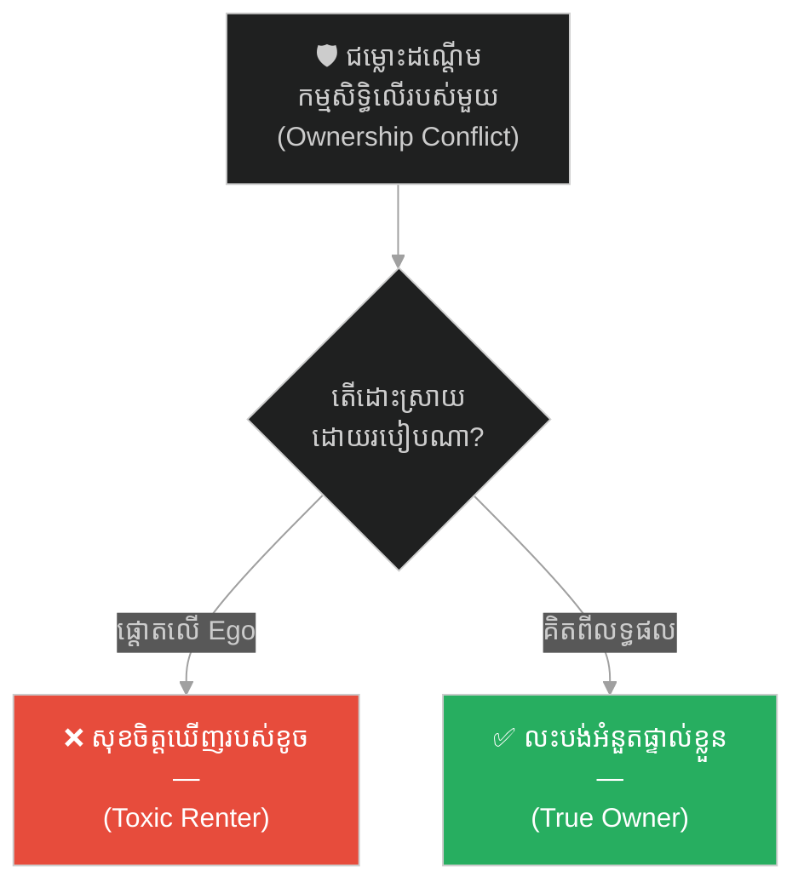
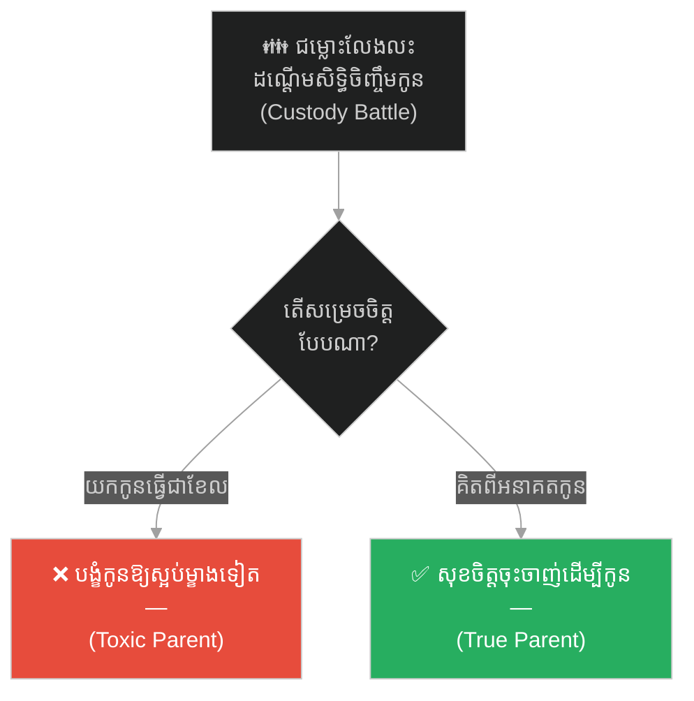
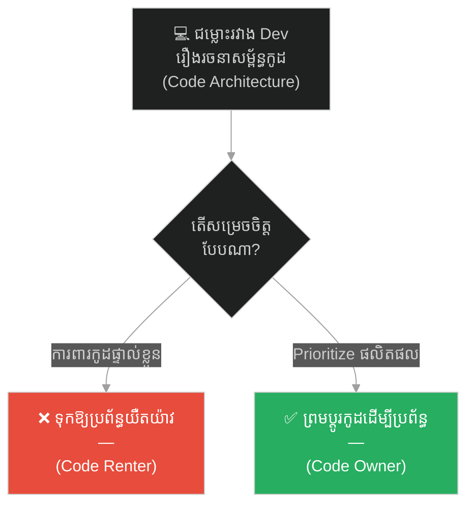
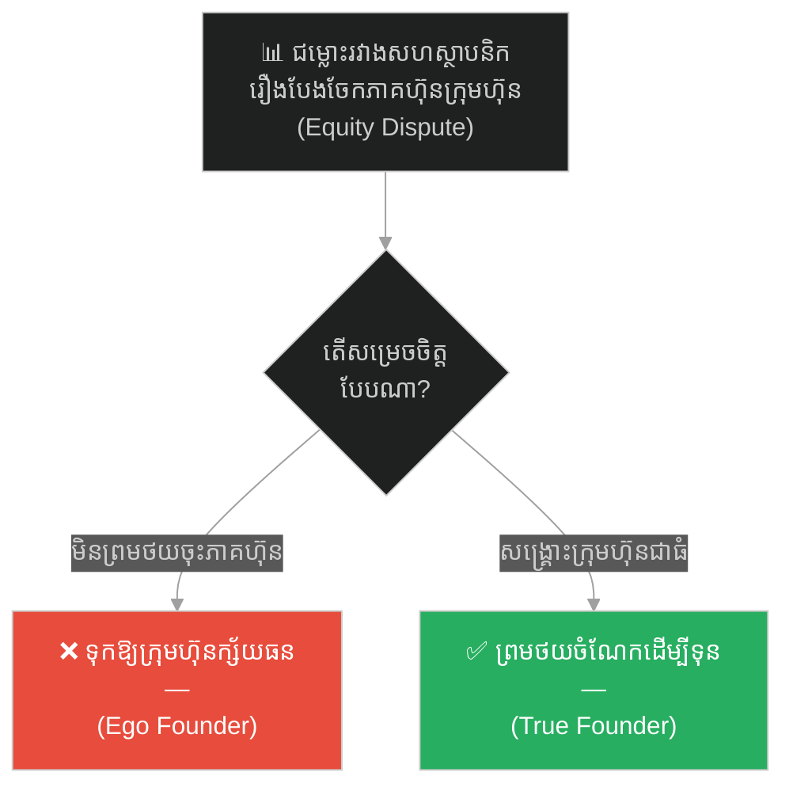
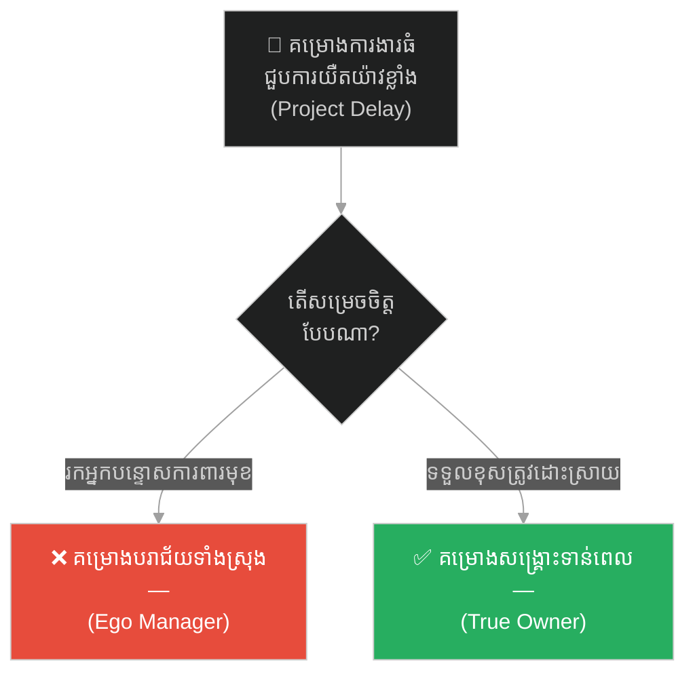
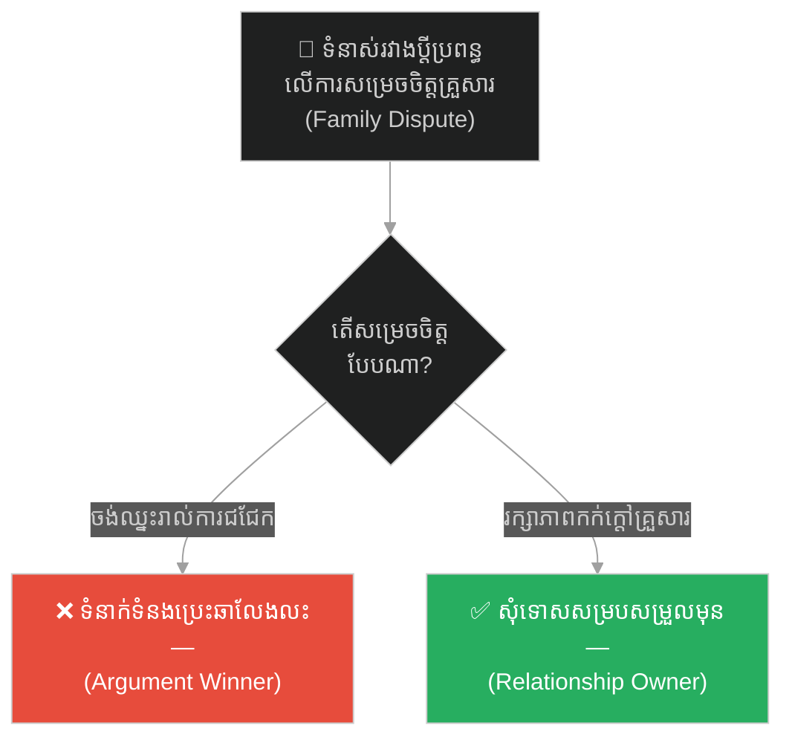
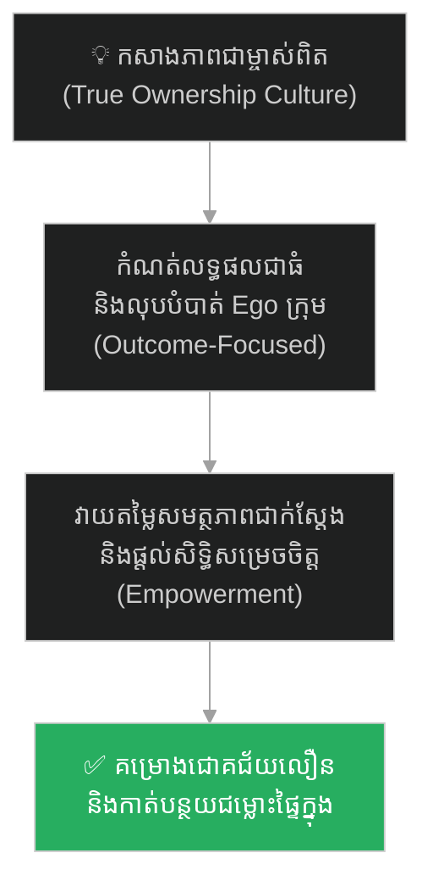

# King Solomon and the Divided Child (ស្តេចសាឡូម៉ូន និងការកាត់ក្តីចែកកូន)៖ គ្រោះថ្នាក់នៃលម្អៀង Ego និងយុទ្ធសាស្ត្រកសាងភាពជាម្ចាស់ពិតប្រាកដ

**Author:** ichamrong  
**Date:** 2026-05-27  
**Tags:** #solomon #jerusalem #ownership #leadership #psychology #wisdom #game-theory #critical-thinking  
**Category:** Concepts / Parables  
**Read Time:** ~15 min  

---

## 📌 មាតិកា (Table of Contents)
- [អន្ទាក់ផ្លូវចិត្ត (The Trap)](#អន្ទាក់ផ្លូវចិត្ត-the-trap)
- [១. រឿងព្រេង៖ សេចក្តីសម្រេចដ៏រន្ធត់ និងដាវរបស់ពេជ្ឈឃាត (The Legend of King Solomon's Judgment)](#1)
  - [ជម្លោះរបស់ស្ត្រីទាំងពីរ (The Dispute of the Two Women)](#1-1)
  - [សេចក្តីសម្រេចដ៏រន្ធត់ និងការរកឃើញម្តាយពិត (The Shocking Verdict & the True Mother)](#1-2)
- [២. បញ្ហា៖ ភាពជាម្ចាស់ពិតប្រាកដ និងអ្នកជួលដ៏ពុល (The Issue: True Ownership vs. Toxic Renters)](#2)
- [៣. ឧទាហរណ៍ជាក់ស្តែងក្នុងពិភពពិត (Real World Examples)](#3)
  - [ឧទាហរណ៍ទី ១ — កម្រិតស្រាល (គ្រួសារ)៖ ការដណ្តើមសិទ្ធិចិញ្ចឹមកូនពេលលែងលះគ្នា (The Custody Ego Battle)](#3-1)
  - [ឧទាហរណ៍ទី ២ — កម្រិតមធ្យម (បច្ចេកទេស)៖ ការការពារកូដរញ៉េរញ៉ៃដោយសារអំនួតផ្ទាល់ខ្លួន (The Code Architecture Ego)](#3-2)
  - [ឧទាហរណ៍ទី ៣ — កម្រិតមធ្យម (ធុរកិច្ច)៖ ជម្លោះភាគហ៊ុនរវាងសហស្ថាបនិកដែលធ្វើឱ្យក្រុមហ៊ុនក្ស័យធន (The Equity Split Dispute)](#3-3)
  - [ឧទាហរណ៍ទី ៤ — កម្រិតមធ្យម (សង្គម/គ្រប់គ្រង)៖ ការរុញកំហុសគម្រោងដើម្បីការពារមុខមាត់ PM (The Blame-Shifting Manager)](#3-4)
  - [ឧទាហរណ៍ទី ៥ — កម្រិតធ្ងន់ (ទំនាក់ទំនង)៖ ការចង់ឈ្នះរាល់ការជជែកតវ៉ាដោយបំផ្លាញក្តីស្រឡាញ់ (The Argument Winner Trap)](#3-5)
- [៤. ដំណោះស្រាយទូទៅ៖ ការលុបបំបាត់វប្បធម៌ Blame Game និងការផ្តោតលើលទ្ធផលរួម (The General Solution: Outcome-Driven Leadership & Extreme Ownership)](#4)
- [សេចក្តីសន្និដ្ឋាន (Conclusion)](#conclusion)
- [ឯកសារយោង (References)](#references)
- [Related Posts](#related-posts)

---

## អន្ទាក់ផ្លូវចិត្ត (The Trap)

តើអ្នកធ្លាប់ជួបស្ថានភាពក្នុងក្រុមការងារ ដែលមានមនុស្សខ្លះសុខចិត្តឃើញគម្រោង ឬផលិតផលដួលរលំ និងខូចខាតទាំងស្រុង គ្រាន់តែដើម្បីឱ្យខ្លួនឯង «ឈ្នះការជជែកតវ៉ា» ឬ «ការពារអំនួតផ្ទាល់ខ្លួន (Ego)» ដែរឬទេ?

នៅក្នុងការគ្រប់គ្រង និងការសហការការងារ៖
* **មនុស្សដែលមាន Ego ខ្ពស់** ផ្តោតលើការការពារភាពត្រូវរបស់ខ្លួនឯង និងមិនខ្វល់ពីលទ្ធផលចុងក្រោយនៃគម្រោងឡើយ (Toxic Renters)។
* **មនុស្សដែលមានស្មារតីជាម្ចាស់** សុខចិត្តលះបង់ភាពត្រូវផ្ទាល់ខ្លួន ព្រមទទួលខុសត្រូវ និងសម្របសម្រួល ដើម្បីឱ្យគម្រោងរស់រានមានជីវិត (True Owners)។

ការអនុញ្ញាតឱ្យ Ego និងការចង់ឈ្នះផ្ទាល់ខ្លួន បំផ្លាញលទ្ធផលការងាររួម ហៅថា **អន្ទាក់ Toxic Renter (លម្អៀងអ្នកស៊ីឈ្នួលជួលផ្ទះ)**។

ដើម្បីយល់ដឹងពីវិធីកសាងវប្បធម៌ Extreme Ownership និងការស្វែងរកម្ចាស់ពិតប្រាកដ នេះជាផែនទីបង្ហាញផ្លូវសម្រាប់អត្ថបទនេះ៖
1. **រឿងព្រេង (The Historic Legend)** — រឿងរ៉ាវរបស់ស្តេចសាឡូម៉ូនដែលកាត់ក្តីចែកទារកជាពីរចំណែក ដើម្បីស្វែងរកម្តាយបង្កើតពិតប្រាកដ។
2. **បញ្ហា (The Issue)** — ភាពខុសគ្នារវាងស្មារតីជាម្ចាស់ (Ownership) និងស្មារតីអ្នកជួល (Renter Mentality)។
3. **ឧទាហរណ៍ជាក់ស្តែងក្នុងពិភពពិត (Real World Examples)** — ពិនិត្យមើលឥទ្ធិពលនៃការលម្អៀងនេះក្នុងកម្រិតគ្រួសារ ព័ត៌មានវិទ្យា ធុរកិច្ច ការគ្រប់គ្រង និងទំនាក់ទំនង។
4. **ដំណោះស្រាយទូទៅ (The General Solution)** — ការផ្តោតលើលទ្ធផល (Outcomes) និងការលុបបំបាត់វប្បធម៌បន្ទោសគ្នា (No-Blame Culture)។

---

## ១. រឿងព្រេង៖ សេចក្តីសម្រេចដ៏រន្ធត់ និងដាវរបស់ពេជ្ឈឃាត (The Legend of King Solomon's Judgment)

នៅក្នុងទីក្រុងយេរូសាឡឹម (Jerusalem) បុរាណ ព្រះរាជា **សាឡូម៉ូន (King Solomon)** ល្បីល្បាញពាសពេញពិភពលោកថាជាមេដឹកនាំដែលមានប្រាជ្ញាឈ្លាសវៃ និងការកាត់ក្តីដ៏យុត្តិធម៌បំផុត។

---

### ជម្លោះរបស់ស្ត្រីទាំងពីរ (The Dispute of the Two Women)

ថ្ងៃមួយ មានស្ត្រីពីរនាក់បានចូលមកក្រាបបង្គំគាល់ព្រះអង្គទាំងទឹកភ្នែក ដោយមានបីទារកដ៏គួរឱ្យស្រលាញ់ម្នាក់មកជាមួយផង។ ពួកគេទាំងពីររស់នៅក្នុងផ្ទះតែមួយ និងបានសម្រាលកូនក្នុងពេលតែមួយ។ ស្ត្រីទីមួយបានទូលថា៖  
> *«បពិត្រព្រះអង្គ! កាលពីយប់មិញ កូនរបស់នាងនេះបានស្លាប់ដោយសារនាងគេងសង្កត់លើកូនខ្លួនឯង។ នាងក៏បានលួចយកកូនរបស់ទូលព្រះបង្គំដែលកំពុងតែដេកលក់យ៉ាងស្ងប់ស្ងាត់ទៅដាក់ក្បែរខ្លួននាង រួចយកសាកសពកូនរបស់នាងមកដាក់ក្បែរទូលព្រះបង្គំជំនួសវិញ!»*

ស្ត្រីទីពីរបានស្រែកតវ៉ាភ្លាមៗថា៖  
> *«កុហក! ក្មេងដែលស្លាប់នោះជារបស់នាងទេ ក្មេងដែលនៅរស់នេះទើបជារបស់ខ្ញុំពិតប្រាកដ!»*

ពួកគេទាំងពីរបានឈ្លោះប្រកែកគ្នាដណ្តើមទារកនោះយ៉ាងខ្លាំងក្លានៅចំពោះមុខស្តេច ដោយគ្មាននរណាម្នាក់ព្រមលះបង់ឡើយ។ ដោយសារគ្មានសាក្សី និងគ្មានភស្តុតាង ការកាត់ក្តីបានធ្លាក់ចូលទៅក្នុងភាពទាល់ច្រកទាំងស្រុង។

---

### សេចក្តីសម្រេចដ៏រន្ធត់ និងការរកឃើញម្តាយពិត (The Shocking Verdict & the True Mother)

បន្ទាប់ពីស្តាប់ការឈ្លោះប្រកែកគ្នារួច ស្តេចសាឡូម៉ូន មិនបានសួរដេញដោលរកការពិតឡើយ។ ទ្រង់បានផ្អាកការប្រជុំ រួចបញ្ជាទៅកាន់ពេជ្ឈឃាតថា៖ **«នាំយកដាវដ៏មុតស្រួចមួយមកទីនេះ!»**

នៅពេលពេជ្ឈឃាតហុចដាវធំមកដល់ ស្តេចសាឡូម៉ូន បានមានបន្ទូលដោយទឹកមុខស្ងប់ស្ងាត់បំផុតថា៖  
> *«ដោយសារតែនាងទាំងពីរអះអាងថាជាម្តាយបង្កើតរៀងៗខ្លួន ហើយយើងមិនអាចដឹងថានរណាទើបជាម្តាយពិត ដូច្នេះមធ្យោបាយដ៏យុត្តិធម៌បំផុត គឺយកដាវនេះកាត់ទារកនោះជាពីរចំណែក រួចចែកឱ្យនាងម្នាក់មួយចំណែកស្មើៗគ្នាទៅចុះ!»*

គ្រាន់តែឮសេចក្តីសម្រេចនេះភ្លាម ស្ត្រីទីពីរ (ម្តាយក្លែងក្លាយ) បានឆ្លើយដោយពេញចិត្តថា៖  
> *«ល្អណាស់! ព្រះអង្គកាត់វាជាពីរទៅ! វានឹងមិនក្លាយជារបស់ខ្ញុំ ហើយក៏មិនក្លាយជារបស់នាងនោះដែរ!»*

ប៉ុន្តែ ស្ត្រីទីមួយ (ម្តាយបង្កើតពិតប្រាកដ) គ្រាន់តែឮពាក្យថាកាត់កូន នាងក៏ស្រក់ទឹកភ្នែក ស្ទុះទៅលុតជង្គង់អង្វរស្តេចសាឡូម៉ូនថា៖  
> *«សូមព្រះអង្គមេត្តាផង! សូមកុំសម្លាប់ទារកនេះអី! សូមប្រគល់ទារកនេះទៅឱ្យនាងចុះ! ទូលព្រះបង្គំសុខចិត្តបោះបង់ការទាមទារនេះ ចុះចាញ់នាងក៏បាន សូមត្រឹមតែរក្សាជីវិតកូនទូលព្រះបង្គំទុកទៅ!»*

ស្តេចសាឡូម៉ូន បានញញឹម ហើយចង្អុលទៅកាន់ស្ត្រីទីមួយ រួចមានបន្ទូលថា៖  
> *«កុំសម្លាប់ទារកនោះ! ចូរប្រគល់ក្មេងនេះទៅឱ្យស្ត្រីទីមួយវិញចុះ ព្រោះនាងទើបជាម្តាយបង្កើតពិតប្រាកដ! គ្មានម្តាយឯណាដែលយល់ព្រមឱ្យគេសម្លាប់កូនខ្លួនឯង គ្រាន់តែដើម្បីការពារអំនួតឈ្នះចាញ់នោះឡើយ។»*

---

## ២. បញ្ហា៖ ភាពជាម្ចាស់ពិតប្រាកដ និងអ្នកជួលដ៏ពុល (The Issue: True Ownership vs. Toxic Renters)

ការកាត់ក្តីនេះឆ្លុះបញ្ចាំងពី **The Principle of True Ownership (គោលការណ៍នៃភាពជាម្ចាស់)** នៅក្នុងស្ថាប័ន៖
* **ម្តាយក្លែងក្លាយ (The Toxic Renter)៖** តំណាងឱ្យមនុស្សដែលឱ្យតម្លៃទៅលើ "ជ័យជម្នះ (Ego/Ego-driven)" របស់ខ្លួនឯង ជាង "ជីវិត" របស់គម្រោង (ទារក)។ ពួកគេសុខចិត្តឃើញគម្រោងដួលរលំ ឬខូចខាត (កាត់ជាពីរ) ឱ្យតែខ្លួនឯងបានឈ្នះការជជែក ឬមិនបាច់ទទួលកំហុស។
* **ម្តាយពិតប្រាកដ (The True Owner)៖** តំណាងឱ្យមេដឹកនាំ ឬវិស្វករដែលមានស្មារតីជាម្ចាស់ពិតប្រាកដ (Extreme Ownership)។ ពួកគេស្រឡាញ់ផលិតផល និងគម្រោងរបស់ពួកគេ។ ពួកគេសុខចិត្តទទួលរងភាពអាម៉ាស់ សុខចិត្តចុះចាញ់នៅក្នុងអង្គប្រជុំ ហើយសុខចិត្តបោះបង់អំនួតផ្ទាល់ខ្លួនចោល ឱ្យតែគម្រោងរស់រានមានជីវិត និងដំណើរការល្អ។

---

## ៣. ឧទាហរណ៍ជាក់ស្តែងក្នុងពិភពពិត

ដើម្បីយល់ដឹងឱ្យកាន់តែស៊ីជម្រៅ ផ្លូវការសិក្សានឹងនាំអ្នកទៅពិនិត្យមើល **ឧទាហរណ៍ចំនួន ៥ កម្រិតខុសៗគ្នា** ក្នុងជីវិតរស់នៅប្រចាំថ្ងៃ៖

---

### ឧទាហរណ៍ទី ១ — កម្រិតស្រាល (គ្រួសារ)៖ ការដណ្តើមសិទ្ធិចិញ្ចឹមកូនពេលលែងលះគ្នា (The Custody Ego Battle)

**ស្ថានភាព៖** ប្តីប្រពន្ធមួយគូសម្រេចចិត្តលែងលះគ្នា និងកំពុងដណ្តើមសិទ្ធិចិញ្ចឹមកូនប្រុសអាយុ ៥ ឆ្នាំ។

* **ភាគី A (ម្តាយក្លែងក្លាយ - Ego)៖** ឪពុកម្តាយទាំងសងខាងដណ្តើមគ្នាស្វិតស្វាញ និយាយបង្ខូចកេរ្តិ៍ឈ្មោះគ្នាទៅវិញទៅមកប្រាប់កូន និងបង្ខំកូនឱ្យស្អប់ម្ខាងទៀត ដើម្បីឈ្នះក្តី។ ពួកគេសុខចិត្តឃើញផ្លូវចិត្តកូនរងការខូចខាតធ្ងន់ធ្ងរ ឱ្យតែខ្លួនឯងឈ្នះសិទ្ធិចិញ្ចឹម។
* **ភាគី B (ម្តាយពិត - True Owner)៖** ភរិយាសម្រេចចិត្តបោះបង់ការដណ្តើមសិទ្ធិ ដោយយល់ព្រមឱ្យប្តីយកកូនទៅចិញ្ចឹម ព្រោះដឹងថាប្តីមានធនធានហិរញ្ញវត្ថុ និងពេលវេលាល្អជាងនាង។ នាងសុខចិត្តឈឺចាប់ផ្លូវចិត្តខ្លួនឯង ដើម្បីរក្សាជីវភាព និងសតិអារម្មណ៍កូនឱ្យបានល្អ។

---

### ឧទាហរណ៍ទី ២ — កម្រិតមធ្យម (បច្ចេកទេស)៖ ការការពារកូដរញ៉េរញ៉ៃដោយសារអំនួតផ្ទាល់ខ្លួន (The Code Architecture Ego)

**ស្ថានភាព៖** Developer A បានសរសេររចនាសម្ព័ន្ធកូដចាស់មួយដែលមិនសូវមានប្រសិទ្ធភាព និងយឺត។

* **ភាគី A (ម្តាយក្លែងក្លាយ - Ego)៖** នៅពេល Developer B ស្នើសុំ Refactor កូដនោះឱ្យលឿនជាងមុន Developer A ខឹងសម្បារខ្លាំង ហើយព្យាយាមរារាំងគ្រប់បែបយ៉ាងនៅក្នុងកិច្ចប្រជុំ ដោយអះអាងថាកូដខ្លួនល្អឥតខ្ចោះ។ គាត់សុខចិត្តឃើញប្រព័ន្ធដំណើរការយឺត ដើម្បីការពារអំនួតផ្ទាល់ខ្លួន។
* **ភាគី B (ម្តាយពិត - True Owner)៖** Developer A យល់ព្រមតាមការស្នើសុំ ជួយគាំទ្រ Developer B ក្នុងការ Refactor និងអបអរជោគជ័យជាមួយគ្នា។ គាត់ផ្តោតលើភាពល្អប្រសើររបស់ App ជាធំ មិនមែនលើ Ego របស់ខ្លួនឡើយ។

---

### ឧទាហរណ៍ទី ៣ — កម្រិតមធ្យម (ធុរកិច្ច)៖ ជម្លោះភាគហ៊ុនរវាងសហស្ថាបនិកដែលធ្វើឱ្យក្រុមហ៊ុនក្ស័យធន (The Equity Split Dispute)

**ស្ថានភាព៖** សហស្ថាបនិកពីរនាក់ចង់ស្វែងរកទុនវិនិយោគបន្ថែមពីវិនិយោគិនខាងក្រៅដើម្បីពង្រីកអាជីវកម្ម។

* **ភាគី A (ម្តាយក្លែងក្លាយ - Ego)៖** ស្ថាបនិកម្នាក់មិនព្រមថយចុះចំណែកភាគហ៊ុនរបស់ខ្លួន (Dilution) សូម្បីតែ ១% ឡើយ ដោយសារខ្លាចបាត់បង់អំណាចគ្រប់គ្រង ទោះបីជាដឹងថាក្រុមហ៊ុនត្រូវការលុយបន្ទាន់ក៏ដោយ។ គាត់សុខចិត្តឃើញក្រុមហ៊ុនក្ស័យធនជាជាងបាត់បង់អំណាច។
* **ភាគី B (ម្តាយពិត - True Owner)៖** ស្ថាបនិកម្នាក់ទៀតយល់ព្រមថយចុះភាគហ៊ុនរបស់ខ្លួន ដើម្បីឱ្យក្រុមហ៊ុនទទួលបានទុនវិនិយោគ និងដំណើរការទៅមុខបានជោគជ័យ ព្រោះគាត់ចង់ឃើញគំនិតអាជីវកម្មរបស់ខ្លួនរីកចម្រើនពិតប្រាកដ។

---

### ឧទាហរណ៍ទី ៤ — កម្រិតមធ្យម (សង្គម/គ្រប់គ្រង)៖ ការរុញកំហុសគម្រោងដើម្បីការពារមុខមាត់ PM (The Blame-Shifting Manager)

**ស្ថានភាព៖** គម្រោង Launch ផលិតផលថ្មីរងការយឺតយ៉ាវយ៉ាងធ្ងន់ធ្ងរ និងបរាជ័យក្នុងការលក់។

* **ភាគី A (ម្តាយក្លែងក្លាយ - Ego)៖** PM ព្យាយាមស្វែងរកចន្លោះខុសរបស់សមាជិកម្នាក់ៗ និងស្តីបន្ទោសទៅលើពួកគេនៅក្នុងកិច្ចប្រជុំជាមួយនាយកធំ ដើម្បីការពារមុខមាត់ខ្លួនឯង។ គាត់មិនខ្វល់ពីការកែសម្រួលគម្រោងឡើងវិញឡើយ។
* **ភាគី B (ម្តាយពិត - True Owner)៖** PM យល់ព្រមទទួលខុសត្រូវទាំងស្រុង (Extreme Ownership) ចំពោះការបរាជ័យនោះ រួចដឹកនាំក្រុមការងាររៀបចំផែនការ Pivot ថ្មីភ្លាមៗដោយគ្មានការបន្ទោសគ្នា។

---

### ឧទាហរណ៍ទី ៥ — កម្រិតធ្ងន់ (ទំនាក់ទំនង)៖ ការចង់ឈ្នះរាល់ការជជែកតវ៉ាដោយបំផ្លាញក្តីស្រឡាញ់ (The Argument Winner Trap)

**ស្ថានភាព៖** ប្តីប្រពន្ធមានទំនាស់គ្នាលើការចំណាយថវិកាគ្រួសារប្រចាំខែ។

* **ភាគី A (ម្តាយក្លែងក្លាយ - Ego)៖** ដៃគូម្នាក់ព្យាយាមយកឈ្នះរាល់ពាក្យសម្តី ជីកកកាយកំហុសអតីតកាលរបស់ម្ខាងទៀតមកវាយលុក និងមិនព្រមនិយាយពាក្យសុំទោសសូម្បីតែមួយម៉ាត់ គ្រាន់តែដើម្បី «អារម្មណ៍ឈ្នះ»។
* **ភាគី B (ម្តាយពិត - True Owner)៖** ដៃគូម្ខាងទៀតសម្រេចចិត្តស្ងប់ស្ងាត់ និងសុំទោសសម្របសម្រួលមុន (ទោះបីជាខ្លួនមិនខុសក៏ដោយ) ដើម្បីរក្សាភាពកក់ក្តៅ និងលំនឹងចិត្តគំនិតរបស់គ្រួសារ។ គាត់ឱ្យតម្លៃលើទំនាក់ទំនង ជាង Ego របស់ខ្លួន។

---

## ៤. ដំណោះស្រាយទូទៅ៖ ការលុបបំបាត់វប្បធម៌ Blame Game និងការផ្តោតលើលទ្ធផលរួម (The General Solution: Outcome-Driven Leadership & Extreme Ownership)

ដើម្បីដោះស្រាយលំអៀង Ego របស់គណកម្មការ និងកសាងស្មារតីជាម្ចាស់ពិតប្រាកដក្នុងស្ថាប័ន អ្នកត្រូវអនុវត្តវិធានការទាំងនេះ៖

### ១. អនុវត្តវប្បធម៌ "គ្មានការបន្ទោសគ្នា" (No-Blame Post-Mortem)
នៅពេលគម្រោង ឬផលិតផលជួបការខូចខាត មិនត្រូវស្វែងរក «នរណាជាអ្នកធ្វើឱ្យខូច» ដើម្បីផាកពិន័យ ឬស្តីបន្ទោសឡើយ។ ផ្ទុយទៅវិញ ត្រូវសួរថា «តើប្រព័ន្ធការងារមានចន្លោះប្រហោងអ្វីខ្លះ ដែលអនុញ្ញាតឱ្យកំហុសនេះកើតឡើង?» និងស្វែងរកវិធីសាស្ត្រការពាររួមគ្នា។ នេះជួយឱ្យសមាជិករាយការណ៍បញ្ហាភ្លាមៗ ដោយគ្មានការភ័យខ្លាច ឬលាក់បាំង។

### ២. វាយតម្លៃសមិទ្ធផលផ្អែកលើលទ្ធផលចុងក្រោយ (Outcome over Output)
កុំដាក់គោលដៅ និងវាយតម្លៃបុគ្គលិកលើភាពត្រូវផ្ទាល់ខ្លួន ឬលើចំនួនកិច្ចការដែលបានធ្វើរួចរាល់។ ត្រូវវាស់វែងលើលទ្ធផលចុងក្រោយដែលផលិតផលទទួលបាន (Customer Satisfaction / System Stability)។ នេះបង្ខំឱ្យសមាជិករៀនលះបង់ Ego ផ្ទាល់ខ្លួន ដើម្បីសម្រេចបាននូវជោគជ័យរួមរបស់គម្រោង។

### ៣. អនុវត្តគោលការណ៍ Extreme Ownership (ការទទួលខុសត្រូវខ្ពស់បំផុត)
មេដឹកនាំត្រូវធ្វើជាគំរូក្នុងការទទួលខុសត្រូវរាល់លទ្ធផលការងាររបស់កូនចៅ។ នៅពេលមេដឹកនាំហ៊ានទទួលខុសត្រូវ និងចុះចាញ់ Ego មុនគេ កូនចៅនឹងមានអារម្មណ៍កក់ក្តៅ និងរៀនសូត្រពីភាពជាម្ចាស់ពិតប្រាកដ ដោយលុបបំបាត់ចរិតលក្ខណៈអ្នកជួលដ៏ពុល។

---

## 🐇 ធ្លាក់ចូលក្នុងរន្ធទន្សាយយុទ្ធសាស្ត្រ (Enter the Strategic Rabbit Hole)

ដើម្បីស្វែងយល់បន្ថែមអំពីចំណុចខ្វាក់ចិត្តសាស្ត្រ ដែលធ្វើឱ្យមនុស្សពូកែផ្តល់ដំបូន្មានល្អៗដល់ពិភពលោកទាំងមូល ប៉ុន្តែមិនអាចដោះស្រាយបញ្ហារបស់ខ្លួនឯងបាន (Solomon's Paradox) និងរបៀបបង្កើតគម្លាតផ្លូវចិត្តដើម្បីវាយតម្លៃខ្លួនឯង សូមបន្តដំណើររបស់អ្នក៖

* 🚀 **[ចាប់ផ្តើមដំណើររុករក (Start the Journey) ➔ Solomon's Paradox: The King Who Could Not Save Himself](./38-solomons-paradox.md)**

---

## សេចក្តីសន្និដ្ឋាន (Conclusion)

> **«ភាពជាម្ចាស់ពិតប្រាកដ មិនមែនជាការឈ្នះការជជែកតវ៉ាដើម្បីបង្ហាញភាពត្រឹមត្រូវនោះឡើយ ប៉ុន្តែគឺភាពក្លាហានក្នុងការលះបង់អំនួតផ្ទាល់ខ្លួន ដើម្បីរក្សាអ្វីមួយឱ្យនៅរស់រានមានជីវិត។»**

ចូរកុំធ្វើជាអ្នកជួលផ្ទះដ៏ពុល ដែលមិនខ្វល់ពីសុខទុក្ខរបស់ប្រព័ន្ធ។ ចូរមានភាពក្លាហានក្នុងការទទួលស្គាល់កំហុស និងសម្របសម្រួល ដើម្បីឱ្យក្រុមការងារ និងគម្រោងទាំងមូលទទួលបានជោគជ័យ។ ភាពរឹងមាំពិតប្រាកដ កើតចេញពីក្តីស្រឡាញ់ចំពោះលទ្ធផលការងារ មិនមែនចេញពីការការពារ Ego នោះឡើយ។

ចូរធ្វើជាម្ចាស់ពិតប្រាកដ នៃគម្រោងរបស់អ្នក។

---

## ឯកសារយោង (References)

* **Jocko Willink & Leif Babin** — *Extreme Ownership: How U.S. Navy SEALs Lead and Win* (2015)។ សៀវភៅគោលស្តីពីគោលការណ៍ Extreme Ownership ក្នុងភាពជាអ្នកដឹកនាំ។
* **Game Theory and Bargaining** — *Journal of Economic Perspectives* (2001)។ ករណីសិក្សាគំរូ Game Theory ក្នុងការដោះស្រាយជម្លោះ និងការបែងចែកផលប្រយោជន៍។
* **Holy Bible** — *1 Kings 3:16-28* (Ancient Near East)។ ឯកសារកត់ត្រាប្រវត្តិសាស្ត្រការកាត់ក្តីដ៏ល្បីល្បាញរបស់ស្តេចសាឡូម៉ូន។

---

## Related Posts

* **[29 Solomon's Judgment: The Principle of True Ownership](../articles/29-solomons-judgment-and-true-ownership.md)** — អត្ថបទគោលបកស្រាយពីភាពខុសគ្នារវាងម្ចាស់ផ្ទះ និងអ្នកជួលក្នុងការងារគ្រប់គ្រង។
* **[12 Multiplier vs. Diminisher Leadership](../articles/12-multiplier-leadership.md)** — មេដឹកនាំដែលសាងភាពជាម្ចាស់ និងជួយអភិវឌ្ឍសមត្ថភាពកូនចៅ។
* **[36 Zhuge Liang and the Empty City](./36-the-empty-city-strategy.md)** — របៀបដោះស្រាយវិបត្តិដោយប្រើប្រាស់ប្រាជ្ញា និងសង្គ្រាមចិត្តសាស្ត្រ។

---
*Last updated: 2026-05-27*

## Related

- [💡 Concepts README](../README.md)
- [📚 Main Repository README](../../../README.md)
- [Developer Habits](../../developer-habits/README.md)
- [Mental Health & Well-being](../../mental-health/README.md)
- [Management & SDLC](../../management/README.md)
