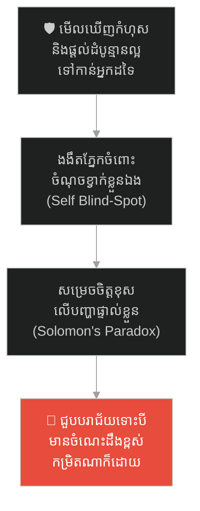
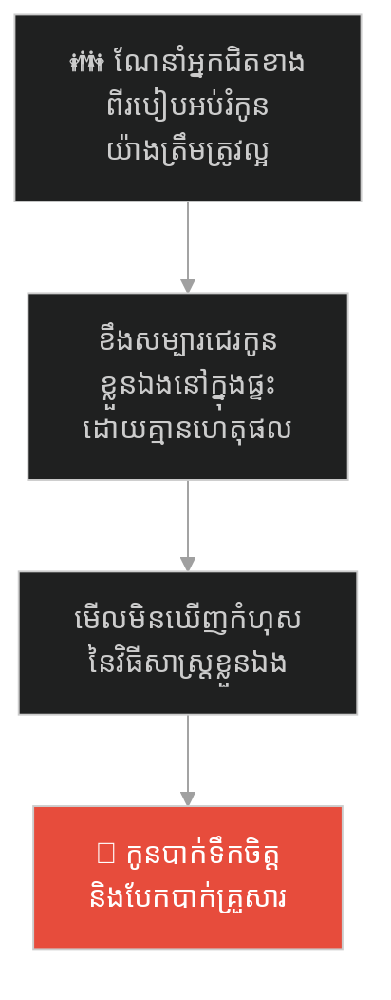
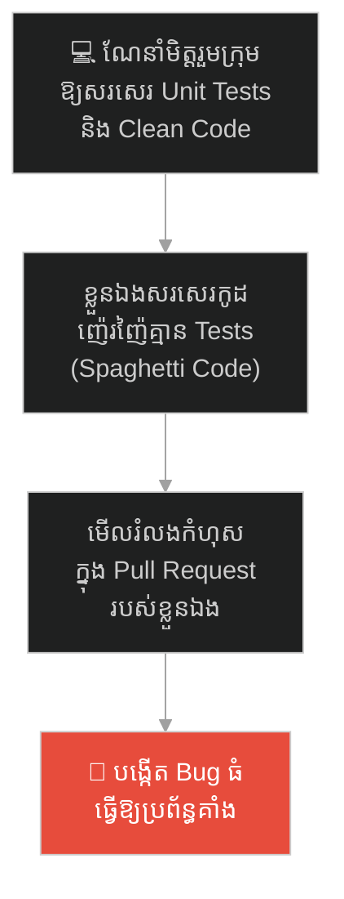
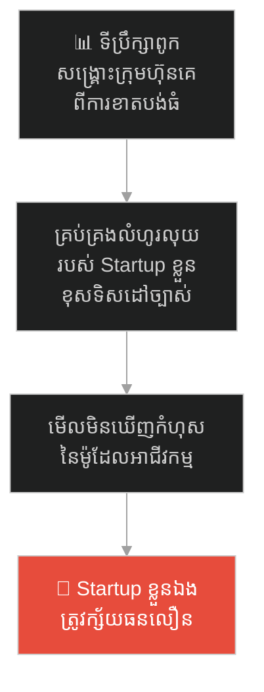
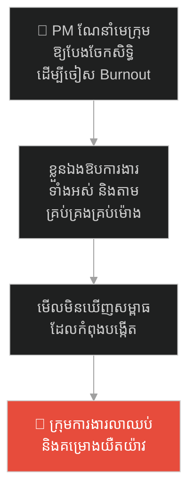
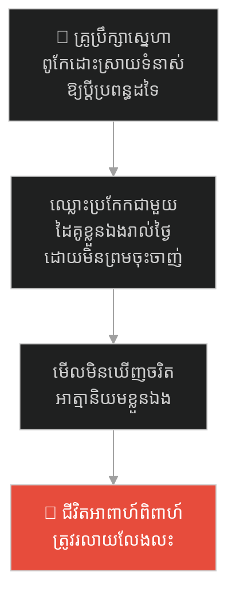
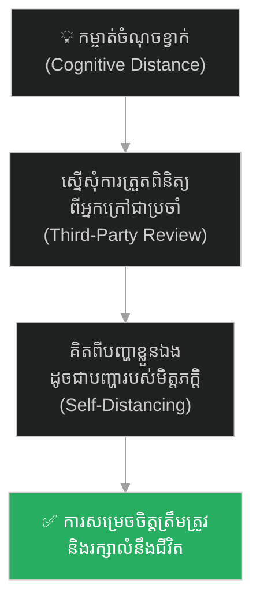

# Solomon's Paradox: The King Who Could Not Save Himself (បដិវាទកម្មសាឡូម៉ូន៖ ស្តេចដែលជួយពិភពលោកបាន តែជួយខ្លួនឯងមិនបាន)៖ គ្រោះថ្នាក់នៃចំណុចខ្វាក់ផ្លូវចិត្ត និងយុទ្ធសាស្ត្រវាយតម្លៃពីភាគីទីបី

**Author:** ichamrong  
**Date:** 2026-05-27  
**Tags:** #solomons-paradox #psychology #blind-spots #wisdom #jerusalem #cognitive-distance #critical-thinking  
**Category:** Concepts / Parables  
**Read Time:** ~15 min  

---

## 📌 មាតិកា (Table of Contents)
- [អន្ទាក់ផ្លូវចិត្ត (The Trap)](#អន្ទាក់ផ្លូវចិត្ត-the-trap)
- [១. រឿងព្រេង៖ បង្គោលភ្លើងហ្វារដែលងងឹតជើងទម្រ (The Legend of King Solomon's Paradox)](#1)
  - [ពន្លឺនៃប្រាជ្ញាសម្រាប់ពិភពលោក (The Light of Wisdom)](#1-1)
  - [ភាពងងឹតនៅពីក្រោយបល្ល័ង្ក និងការដួលរលំ (The Darkness Behind the Throne & the Fall)](#1-2)
- [២. បញ្ហា៖ ចំណុចខ្វាក់ផ្លូវចិត្ត និងបដិវាទកម្មសាឡូម៉ូន (The Issue: Psychological Blind Spots & Cognitive Closeness)](#2)
- [៣. ឧទាហរណ៍ជាក់ស្តែងក្នុងពិភពពិត (Real World Examples)](#3)
  - [ឧទាហរណ៍ទី ១ — កម្រិតស្រាល (គ្រួសារ)៖ ការណែនាំអ្នកដទៃពីការអប់រំកូនដោយបំពានកូនខ្លួនឯង (The Toxic Educator Parent)](#3-1)
  - [ឧទាហរណ៍ទី ២ — កម្រិតមធ្យម (បច្ចេកទេស)៖ ការកែ Pull Request របស់គេតឹងរ៉ឹងតែសរសេរកូដខ្លួនឯងគ្មានស្តង់ដារ (The Hypocritical Code Reviewer)](#3-2)
  - [ឧទាហរណ៍ទី ៣ — កម្រិតមធ្យម (ធុរកិច្ច)៖ ទីប្រឹក្សាពូកែស្រោចស្រង់ក្រុមហ៊ុនគេ តែធ្វើឱ្យ Startup ខ្លួនឯងក្ស័យធន (The Bankrupt Consultant)](#3-3)
  - [ឧទាហរណ៍ទី ៤ — កម្រិតមធ្យម (សង្គម/គ្រប់គ្រង)៖ PM ណែនាំមេក្រុមឱ្យបែងចែកសិទ្ធិ តែខ្លួនឯងឱបការងារឱ្យដាច់ខ្យល់ (The Micromanaging Advisor)](#3-4)
  - [ឧទាហរណ៍ទី ៥ — កម្រិតធ្ងន់ (ទំនាក់ទំនង)៖ គ្រូប្រឹក្សាស្នេហាដែលជួបការលែងលះក្នុងគ្រួសារខ្លួនឯង (The Divorced Marriage Counselor)](#3-5)
- [៤. ដំណោះស្រាយទូទៅ៖ ការប្រើប្រាស់ប្រព័ន្ធ Code Review, ទីប្រឹក្សាឯករាជ្យ និងយុទ្ធសាស្ត្រគិតចម្ងាយ (The General Solution: Peer Review & Psychological Self-Distancing)](#4)
- [សេចក្តីសន្និដ្ឋាន (Conclusion)](#conclusion)
- [ឯកសារយោង (References)](#references)
- [Related Posts](#related-posts)

---

## អន្ទាក់ផ្លូវចិត្ត (The Trap)

តើអ្នកធ្លាប់ជួបស្ថានភាពដែលខ្លួនឯងពូកែដោះស្រាយបញ្ហា និងផ្តល់ដំបូន្មានល្អៗឥតខ្ចោះដល់អ្នកដទៃ ប៉ុន្តែនៅពេលជួបបញ្ហាដូចគ្នានោះចំពោះខ្លួនឯង បែរជាធ្វើការសម្រេចចិត្តខុសឆ្គងទាំងស្រុងដែរឬទេ?

នៅក្នុងជីវិតរស់នៅ និងការគ្រប់គ្រង៖
* **យើងមានទំនោរ** មើលឃើញបញ្ហារបស់អ្នកដទៃដោយសត្យានុម័ត និងប្រកបដោយហេតុផលច្បាស់លាស់។
* **ប៉ុន្តែយើងមានចំណុចខ្វាក់ (Blind Spot)** ចំពោះបញ្ហាផ្ទាល់ខ្លួន ព្រោះតែអារម្មណ៍ ភាពភ័យខ្លាច និងអំនួតផ្ទាល់ខ្លួនមកបិទបាំងការពិត។

ការមិនអាចដោះស្រាយបញ្ហាខ្លួនឯងបាន ទោះបីជាមានចំណេះដឹង និងប្រាជ្ញាខ្ពស់កម្រិតណាក៏ដោយ ហៅថា **បដិវាទកម្មសាឡូម៉ូន (Solomon's Paradox)**។

ដើម្បីយល់ដឹងពីវិធីកម្ចាត់ចំណុចខ្វាក់ផ្លូវចិត្ត និងការប្រើប្រាស់ភាគីទីបីវាយតម្លៃ នេះជាផែនទីបង្ហាញផ្លូវសម្រាប់អត្ថបទនេះ៖
1. **រឿងព្រេង (The Historic Legend)** — រឿងរ៉ាវរបស់ស្តេចសាឡូម៉ូនដែលជួយបង្ហាញផ្លូវដល់ស្តេចដទៃទូទាំងលោក ប៉ុន្តែធ្វើឱ្យអាណាចក្រខ្លួនឯងបែកបាក់ដោយសារការសម្រេចចិត្តខុសឆ្គងផ្ទាល់ខ្លួន។
2. **បញ្ហា (The Issue)** — យន្តការចិត្តសាស្ត្រនៃចំណុចខ្វាក់ (Blind Spot) និងឥទ្ធិពលនៃចម្ងាយនៃការយល់ឃើញ (Cognitive Distance)។
3. **ឧទាហរណ៍ជាក់ស្តែងក្នុងពិភពពិត (Real World Examples)** — ពិនិត្យមើលឥទ្ធិពលនៃបដិវាទកម្មនេះក្នុងកម្រិតគ្រួសារ ព័ត៌មានវិទ្យា ធុរកិច្ច ការគ្រប់គ្រង និងទំនាក់ទំនង។
4. **ដំណោះស្រាយទូទៅ (The General Solution)** — ការបង្កើតប្រព័ន្ធ Peer Review, ការប្រើប្រាស់ទីប្រឹក្សាខាងក្រៅ និងការអនុវត្តបច្ចេកទេស Self-Distancing។

---

## ១. រឿងព្រេង៖ បង្គោលភ្លើងហ្វារដែលងងឹតជើងទម្រ (The Legend of King Solomon's Paradox)

យោងតាមគម្ពីរប្រវត្តិសាស្ត្របុរាណ ព្រះរាជា **សាឡូម៉ូន (Solomon)** គឺជាមនុស្សដែលទទួលបានប្រាជ្ញាឈ្លាសវៃបំផុត ដែលមិនធ្លាប់មាននរណាម្នាក់នៅលើផែនដីអាចប្រៀបផ្ទឹមបានឡើយ។

---

### ពន្លឺនៃប្រាជ្ញាសម្រាប់ពិភពលោក (The Light of Wisdom)

កិត្តិនាមនៃការកាត់ក្តីដ៏យុត្តិធម៌ និងដំបូន្មានដ៏ជ្រាលជ្រៅរបស់ទ្រង់ បានសាយភាយពេញពិភពលោក។ មេដឹកនាំ និងស្តេចមកពីនគរឆ្ងាយៗ (ដូចជាមហាក្សត្រី Sheba) បាននាំយកមាសប្រាក់រាប់តោន ធ្វើដំណើររាប់ខែឆ្លងកាត់វាលខ្សាច់ គ្រាន់តែដើម្បីមកសុំយោបល់ពីស្តេចសាឡូម៉ូន ក្នុងការដោះស្រាយបញ្ហានយោបាយ និងសេដ្ឋកិច្ចនៅក្នុងនគររបស់ពួកគេ។ 

រាល់អ្នកដែលបានជួបទ្រង់ សុទ្ធតែត្រឡប់ទៅវិញដោយទទួលបានដំណោះស្រាយដ៏ល្អឥតខ្ចោះ។ ទ្រង់ប្រៀបដូចជាបង្គោលភ្លើងហ្វារ បំភ្លឺផ្លូវឱ្យអ្នកដទៃរួចផុតពីការវង្វេង។

---

### ភាពងងឹតនៅពីក្រោយបល្ល័ង្ក និងការដួលរលំ (The Darkness Behind the Throne & the Fall)

ទោះបីជាសាឡូម៉ូន អស្ចារ្យយ៉ាងណាក៏ដោយ នៅពេលដែលទ្រង់ត្រូវធ្វើការសម្រេចចិត្តសម្រាប់ជីវិត និងនគររបស់ទ្រង់ផ្ទាល់ ទ្រង់បែរជាដើរផ្លូវខុសយ៉ាងធ្ងន់ធ្ងរ។

ទ្រង់បានសរសេរសៀវភៅទូន្មានមនុស្សកុំឱ្យលោភលន់នឹងទ្រព្យសម្បត្តិ ប៉ុន្តែទ្រង់ខ្លួនឯងបែរជាប្រមូលផ្តុំមាសប្រាក់រាប់ម៉ឺនតោន និងទារពន្ធប្រជារាស្ត្រយ៉ាងធ្ងន់ធ្ងរ ដើម្បីសាងសង់រាជវាំងដ៏ស្កឹមស្កៃសម្រាប់ខ្លួនឯង។ ទ្រង់បានទូន្មានមនុស្សកុំឱ្យវង្វេងនឹងតណ្ហា ប៉ុន្តែទ្រង់ខ្លួនឯងមានមហេសី និងស្រីស្នំរហូតដល់ ១,០០០ នាក់។ ដោយសារតែចង់យកចិត្តមហេសីបរទេសទាំងនោះ ទ្រង់បានអនុញ្ញាតឱ្យពួកគេសាងសង់រូបីយ៍បូជាព្រះក្លែងក្លាយនៅក្នុងទីក្រុង ដែលទង្វើនេះបានធ្វើឱ្យប្រជារាស្ត្រ និងពួកសង្ឃខឹងសម្បារយ៉ាងខ្លាំង។

ដោយសារតែការសម្រេចចិត្តខុសឆ្គងផ្ទាល់ខ្លួនរបស់ស្តេចសាឡូម៉ូន (ការដកពន្ធធ្ងន់ធ្ងរ និងជម្លោះសាសនា) គ្រាន់តែទ្រង់ចូលទិវង្គតភ្លាម អាណាចក្រដ៏រុងរឿងរបស់ទ្រង់ ត្រូវបែកបាក់ជាពីរចំណែកភ្លាមៗ (Israel និង Judah)។ កេរ្តិ៍ឈ្មោះនៃប្រាជ្ញារបស់ទ្រង់ នៅតែត្រូវបានគេចងចាំ តែនគររបស់ទ្រង់បែរជាត្រូវវិនាស។

ទ្រង់ប្រៀបដូចជា «បង្គោលភ្លើងហ្វារ (Lighthouse)»។ វាអាចបញ្ចេញពន្លឺជួយបង្ហាញផ្លូវដល់កប៉ាល់ដែលនៅឆ្ងាយរាប់សិបគីឡូម៉ែត្រឱ្យរួចពីសេចក្តីស្លាប់ ប៉ុន្តែវាមិនអាចបំភ្លឺមើលឃើញជើងទម្រដ៏ងងឹត ដែលកំពុងតែពុកផុយរបស់ខ្លួនឯងនោះទេ។

---

## ២. បញ្ហា៖ ចំណុចខ្វាក់ផ្លូវចិត្ត និងបដិវាទកម្មសាឡូម៉ូន (The Issue: Psychological Blind Spots & Cognitive Closeness)

រឿងព្រេងនេះឆ្លុះបញ្ចាំងពីបាតុភូតចិត្តសាស្ត្រ **Solomon's Paradox (បដិវាទកម្មសាឡូម៉ូន)**៖
* **ចំណុចខ្វាក់ផ្ទាល់ខ្លួន (Blind Spots)៖** នៅពេលដោះស្រាយបញ្ហាអ្នកដទៃ យើងស្ថិតក្នុងស្ថានភាពស្ងប់ស្ងាត់ និងមានចម្ងាយផ្លូវចិត្ត (Psychological Distance) ដែលជួយឱ្យយើងមើលឃើញទិន្នន័យដោយសត្យានុម័ត។ ប៉ុន្តែនៅពេលជួបបញ្ហាខ្លួនឯង យើងស្ថិតនៅកៀកពេក (Cognitive Closeness) ធ្វើឱ្យអារម្មណ៍ ភាពភ័យខ្លាច និង Ego មកគ្រប់គ្រងការសម្រេចចិត្ត។
* **តម្រូវការភាគីទីបី (Peer Review)៖** សូម្បីតែស្តេចសាឡូម៉ូនដែលមានប្រាជ្ញាខ្ពស់បំផុត ក៏មិនអាចដោះស្រាយបញ្ហាខ្លួនឯងបានដែរ។ ដូច្នេះ នៅក្នុងប្រព័ន្ធការងារ មិនត្រូវសន្មតថាការសម្រេចចិត្តរបស់បុគ្គលឆ្លាតម្នាក់ គឺត្រឹមត្រូវជានិច្ចនោះឡើយ។ យើងត្រូវការភាគីទីបីជួយពិនិត្យជានិច្ច។

---

## ៣. ឧទាហរណ៍ជាក់ស្តែងក្នុងពិភពពិត

ដើម្បីយល់ដឹងឱ្យកាន់តែស៊ីជម្រៅ ផ្លូវការសិក្សានឹងនាំអ្នកទៅពិនិត្យមើល **ឧទាហរណ៍ចំនួន ៥ កម្រិតខុសៗគ្នា** ក្នុងជីវិតរស់នៅប្រចាំថ្ងៃ៖

---

### ឧទាហរណ៍ទី ១ — កម្រិតស្រាល (គ្រួសារ)៖ ការណែនាំអ្នកដទៃពីការអប់រំកូនដោយបំពានកូនខ្លួនឯង (The Toxic Educator Parent)

**ស្ថានភាព៖** ឪពុកម្នាក់ជាសាស្ត្រាចារ្យគរុកោសល្យដ៏ល្បីល្បាញ ដែលតែងតែផ្តល់ដំបូន្មានល្អៗដល់ឪពុកម្តាយដទៃពីវិធីសាស្ត្រអប់រំកូនដោយសន្តិវិធី។

* **...** *(កែសម្រួលដើម្បីបង្រួញអត្ថបទ៖)*
* **ភាគី A (ការណែនាំអ្នកដទៃ)៖** គាត់និយាយយ៉ាងពិរោះថា៖ *«យើងត្រូវតែស្តាប់កូន មិនត្រូវប្រើហិង្សា និងពាក្យសម្តីធ្ងន់ៗដាក់កូនឡើយ។»*
* **ភាគី B (ការពិតជាក់ស្តែង)៖** នៅពេលនៅក្នុងផ្ទះរបស់ខ្លួនឯង គាត់ខឹងងក់ងរ ស្រែកគំហក និងបដិសេធមិនស្តាប់មតិយោបល់របស់កូនប្រុសខ្លួនឯងសូម្បីតែបន្តិច ព្រោះតែ Ego គិតថាខ្លួនជាឪពុក។ គាត់មើលមិនឃើញចំណុចខ្វាក់នៃការបំផ្លាញផ្លូវចិត្តកូនខ្លួនឯងឡើយ។

---

### ឧទាករណ៍ទី ២ — កម្រិតមធ្យម (បច្ចេកទេស)៖ ការកែ Pull Request របស់គេតឹងរ៉ឹងតែសរសេរកូដខ្លួនឯងគ្មានស្តង់ដារ (The Hypocritical Code Reviewer)

**ស្ថានភាព៖** Lead Developer ម្នាក់ល្បីខាងពិនិត្យកូដ (Code Review) របស់មិត្តរួមក្រុមយ៉ាងតឹងរ៉ឹង និងរកឃើញចន្លោះខុស Bug តូចៗជានិច្ច។

* **ភាគី A (ការពិនិត្យកូដគេ)៖** គាត់បដិសេធមិនឱ្យ Merge កូដរបស់មិត្តរួមក្រុមឡើយ ប្រសិនបើគ្មានការសរសេរ Unit Tests គ្រប់គ្រាន់ ឬបំពានស្តង់ដាររចនា។
* **ភាគី B (ការពិតជាក់ស្តែង)៖** នៅពេលគាត់សរសេរកូដគម្រោងផ្ទាល់ខ្លួន គាត់បែរជាមិនសរសេរ Unit Tests ឡើយ និងសរសេរកូដស្មុគស្មាញ (Spaghetti Code) ព្រោះជឿជាក់លើខ្លួនឯងហួសហេតុថា «ខ្ញុំឆ្លាត គ្មានផ្លូវសរសេរខុសឡើយ»។ កូដរបស់គាត់បង្កើត Bug ធំធ្វើឱ្យប្រព័ន្ធគាំង ព្រោះគ្មាននរណាម្នាក់ហ៊ានជួយ Review កូដរបស់គាត់។

---

### ឧទាហរណ៍ទី ៣ — កម្រិតមធ្យម (ធុរកិច្ច)៖ ទីប្រឹក្សាពូកែស្រោចស្រង់ក្រុមហ៊ុនគេ តែធ្វើឱ្យ Startup ខ្លួនឯងក្ស័យធន (The Bankrupt Consultant)

**ស្ថានភាព៖** ស្ថាបនិកម្នាក់ជាទីប្រឹក្សាហិរញ្ញវត្ថុអាជីវកម្មដ៏ល្បីល្បាញ ដែលបានជួយសង្គ្រោះក្រុមហ៊ុនរាប់សិបពីការដួលរលំ។

* **ភាគី A (ការប្រឹក្សាអាជីវកម្មគេ)៖** គាត់មើលឃើញច្បាស់ពីចំណុចខ្សោយ លំហូរលុយ និងរបៀបកាត់បន្ថយចំណាយរបស់ក្រុមហ៊ុនដទៃ។
* **ភាគី B (ការពិតជាក់ស្តែង)៖** នៅពេលគាត់សាងសង់ Startup ផ្ទាល់ខ្លួន គាត់បែរជាវិនិយោគលើសោភ័ណភាពការិយាល័យ ជួលបុគ្គលិកច្រើនហួសហេតុ និងចំណាយលុយលើការផ្សព្វផ្សាយគ្មានប្រសិទ្ធភាព ព្រោះតែ Ego ចង់បង្ហាញភាពអស្ចារ្យ។ ក្រុមហ៊ុនរបស់គាត់ត្រូវក្ស័យធនក្នុងរយៈពេលតែ ១ ឆ្នាំ ដោយសារខ្វះខាតលំហូរលុយចរន្ត។

---

### ឧទាហរណ៍ទី ៤ — កម្រិតមធ្យម (សង្គម/គ្រប់គ្រង)៖ PM ណែនាំមេក្រុមឱ្យបែងចែកសិទ្ធិ តែខ្លួនឯងឱបការងារឱ្យដាច់ខ្យល់ (The Micromanaging Advisor)

**ស្ថានភាព៖** Program Manager ម្នាក់ល្បីខាងផ្តល់អនុសាសន៍ដល់ប្រធានផ្នែកនានា ឱ្យចេះបែងចែកការងារ (Delegate) ដើម្បីចៀសវាងការបាក់កម្លាំង (Burnout)។

* **ភាគី A (ការណែនាំដឹកនាំ)៖** គាត់សរសេរអត្ថបទ និងធ្វើបទបង្ហាញយ៉ាងល្អឥតខ្ចោះពីវិធីសាស្ត្រកសាងទំនុកចិត្ត និងការផ្តល់សិទ្ធិសម្រេចចិត្តដល់កូនចៅ។
* **ភាគី B (ការពិតជាក់ស្តែង)៖** នៅក្នុងគម្រោងផ្ទាល់ខ្លួនរបស់គាត់ គាត់តាមដានសមាជិកគ្រប់ម៉ោង មិនអនុញ្ញាតឱ្យនរណាម្នាក់សម្រេចចិត្តលើកិច្ចការតូចតាចឡើយ និងឱបការងាររដ្ឋបាលទាំងអស់មកធ្វើម្នាក់ឯង រហូតដល់ធ្លាក់ខ្លួនឈឺធ្ងន់ និងគម្រោងទាំងមូលត្រូវគាំងស្ទះ។

---

### ឧទាហរណ៍ទី ៥ — កម្រិតធ្ងន់ (ទំនាក់ទំនង)៖ គ្រូប្រឹក្សាស្នេហាដែលជួបការលែងលះក្នុងគ្រួសារខ្លួនឯង (The Divorced Marriage Counselor)

**ស្ថានភាព៖** គ្រូប្រឹក្សាផ្លូវចិត្តម្នាក់ពូកែជួយផ្សះផ្សា និងផ្តល់ដំបូន្មានឱ្យប្តីប្រពន្ធរាប់រយគូយល់ចិត្តគ្នា និងដោះស្រាយទំនាស់ដោយសន្តិវិធី។

* **ភាគី A (ការប្រឹក្សាផ្លូវចិត្តគេ)៖** គាត់មើលឃើញច្បាស់ពីយន្តការ Ego ការអន់ចិត្តលាក់បាំង និងរបៀបប្រាស្រ័យទាក់ទងប្រកបដោយមេត្តារបស់អ្នកដទៃ។
* **ភាគី B (ការពិតជាក់ស្តែង)៖** នៅក្នុងជីវិតគ្រួសារផ្ទាល់ខ្លួន គាត់តែងតែយកឈ្នះដៃគូ មិនដែលចំណាយពេលស្តាប់ការលំបាក និងបដិសេធពាក្យសុំទោស ព្រោះតែគិតថា «ខ្ញុំជាអ្នកជំនាញផ្លូវចិត្ត ខ្ញុំគ្មានផ្លូវធ្វើខុសឡើយ»។ ទីបំផុត ជីវិតអាពាហ៍ពិពាហ៍របស់គាត់ត្រូវបញ្ចប់ដោយការលែងលះគ្នា។

---

## ៤. ដំណោះស្រាយទូទៅ៖ ការប្រើប្រាស់ប្រព័ន្ធ Code Review, ទីប្រឹក្សាឯករាជ្យ និងយុទ្ធសាស្ត្រគិតចម្ងាយ (The General Solution: Peer Review & Psychological Self-Distancing)

ដើម្បីដោះស្រាយលម្អៀងបដិវាទកម្មសាឡូម៉ូន និងវាយតម្លៃខ្លួនឯងឱ្យបានសុក្រឹត អ្នកត្រូវអនុវត្តវិធានការទាំងនេះ៖

### ១. អនុវត្តប្រព័ន្ធ "ត្រួតពិនិត្យដោយមិត្តរួមការងារ" (Peer Review / Code Review)
នៅក្នុងការងារបច្ចេកវិទ្យា និងការសម្រេចចិត្តយុទ្ធសាស្ត្រ មិនត្រូវអនុញ្ញាតឱ្យបុគ្គលណាឆ្លាត ឬមានអំណាចកម្រិតណាក៏ដោយ សម្រេចចិត្ត ឬ Merge កូដដោយគ្មានការត្រួតពិនិត្យពីសមាជិកដទៃឡើយ (Mandatory Review)។ ភ្នែករបស់អ្នកដទៃ ដើរតួជាកញ្ចក់ឆ្លុះបញ្ចាំងចំណុចខ្វាក់របស់អ្នក ដែលអ្នកគ្មានថ្ងៃមើលឃើញដោយខ្លួនឯងឡើយ។

### ២. អនុវត្តបច្ចេកទេស "Psychological Self-Distancing" (បង្កើតគម្លាតផ្លូវចិត្ត)
នៅពេលត្រូវធ្វើការសម្រេចចិត្តលើបញ្ហាផ្ទាល់ខ្លួន ឬក្រុមហ៊ុនខ្លួនឯង ត្រូវបង្វែរសំណួរ៖ ជំនួសឱ្យការសួរថា «តើខ្ញុំគួរធ្វើដូចម្តេច?» ចូរឆ្លើយដោយប្រើឈ្មោះខ្លួនឯង ឬសួរថា៖ **«ប្រសិនបើមិត្តភក្តិជិតស្និទ្ធរបស់ខ្ញុំ ឬក្រុមហ៊ុនដៃគូជួបប្រទះបញ្ហានេះ តើខ្ញុំនឹងផ្តល់ដំបូន្មានឱ្យពួកគេធ្វើដូចម្តេច?»** ការផ្លាស់ប្តូរទិដ្ឋភាពនេះ បង្កើតជាគម្លាតផ្លូវចិត្ត ដែលជួយឱ្យខួរក្បាលគិតដោយសមហេតុផល។

### ៣. ជួលអ្នកប្រឹក្សាយោបល់ខាងក្រៅ (Independent External Counsel)
កុំមានមោទនភាពលើភាពឆ្លាតវៃរបស់ខ្លួនឯង។ ត្រូវស្វែងរកមតិយោបល់ និងការវាយតម្លៃពីអ្នកឯករាជ្យខាងក្រៅ (ដូចជា Coach, Mentor, ឬ Consultant) ដែលគ្មានចំណែកអារម្មណ៍ ឬផលប្រយោជន៍ផ្ទាល់ខ្លួនក្នុងគម្រោង ដើម្បីជួយបង្ហាញផ្លូវត្រឹមត្រូវ។

---

## 🐇 ធ្លាក់ចូលក្នុងរន្ធទន្សាយយុទ្ធសាស្ត្រ (Enter the Strategic Rabbit Hole)

ដើម្បីស្វែងយល់បន្ថែមអំពីរបៀបដែលមេដឹកនាំ និងអ្នកបច្ចេកវិទ្យា ប្រើប្រាស់យុទ្ធសាស្ត្រសាងសង់ប្រព័ន្ធការងារដោយគ្មានសំឡេងរំខាន និងការរៀបចំកូដឱ្យស៊ីគ្នាឥតខ្ចោះតាំងពីកន្លែងផលិត (CI/CD Production Deployment) សូមបន្តដំណើររបស់អ្នក៖

* 🚀 **[ចាប់ផ្តើមដំណើររុករក (Start the Journey) ➔ Solomon's Temple and the Philosophy of Silent Construction](./39-solomons-temple-and-the-silent-build.md)**

---

## សេចក្តីសន្និដ្ឋាន (Conclusion)

> **«បង្គោលភ្លើងហ្វារដ៏ភ្លឺចិញ្ចាច អាចបង្ហាញផ្លូវឱ្យកប៉ាល់រាប់ពាន់រួចផុតពីការលិចលង់ ប៉ុន្តែវាមិនដែលមើលឃើញភាពងងឹត និងការជម្រុញដ៏ពុកផុយនៅខាងក្រោមជើងទម្ររបស់ខ្លួនឡើយ។»**

ចូរកុំមានមោទនភាពលើភាពឆ្លាតវៃ ឬសមត្ថភាពរបស់ខ្លួនឯងឡើយ។ ចំណុចខ្វាក់ផ្លូវចិត្ត តែងតែមាននៅក្នុងខួរក្បាលរបស់មនុស្សគ្រប់រូប មិនថាពួកគេជាអ្នកប្រាជ្ញឆ្លាតកម្រិតណានោះទេ។ ចូររៀនស្តាប់យោបល់របស់អ្នកដទៃ ប្រើប្រាស់ប្រព័ន្ធត្រួតពិនិត្យការងារ និងបង្កើតគម្លាតផ្លូវចិត្ត ដើម្បីធានាថាការសម្រេចចិត្តផ្ទាល់ខ្លួនរបស់អ្នក ទទួលបានជោគជ័យដូចការផ្តល់ដំបូន្មានដល់អ្នកដទៃ។

កម្ចាត់ភាពងងឹតនៅក្រោមជើងទម្ររបស់អ្នកនៅថ្ងៃនេះ។

---

## ឯកសារយោង (References)

* **Grossmann, Igor & Kross, Ethan** — *Exploring Solomon's Paradox: The Role of Self-Distancing in Wise Reasoning* (2014)។ ការសិក្សាពិសោធន៍ចិត្តវិទ្យាស្នូលដែលបានរកឃើញ និងដាក់ឈ្មោះទ្រឹស្តី Solomon's Paradox។
* **Pronin, Emily & Lin, Daniel Y.** — *The Bias Blind Spot: Perceptions of Bias in Self versus Others* (2002)។ ការវិភាគយន្តការដែលមនុស្សមើលមិនឃើញចំណុចខ្វាក់ និងលម្អៀងផ្ទាល់ខ្លួន។
* **Kross, Ethan** — *Chatter: The Voice in Our Head, Why It Matters, and How to Harness It* (2021)។ វិធីសាស្ត្រគ្រប់គ្រងសំឡេងក្នុងក្បាល និងការប្រើប្រាស់ Self-Distancing ក្នុងការសម្រេចចិត្ត។

---

## Related Posts

* **[30 Solomon's Paradox: Why We Cannot Help Ourselves](../articles/30-solomons-paradox-and-blind-spots.md)** — អត្ថបទគោលបកស្រាយពីយន្តការ និងគំរូដោះស្រាយ Solomon's Paradox ក្នុងបច្ចេកវិទ្យា។
* **[20 Cognitive Biases: The Hidden Flaws in Human Thinking](../articles/20-cognitive-biases-the-flaws-in-human-thinking.md)** — ការយល់ដឹងពីកំហុសនៃការគិត និងលម្អៀងការយល់ឃើញផ្សេងៗ។
* **[37 King Solomon and the Divided Child](./37-king-solomon-and-the-divided-child.md)** — មេរៀនស្តីពីភាពជាម្ចាស់ពិតប្រាកដ និងការលះបង់ Ego ដើម្បីជោគជ័យរួម។

---
*Last updated: 2026-05-27*

## Related

- [💡 Concepts README](../README.md)
- [📚 Main Repository README](../../../README.md)
- [Developer Habits](../../developer-habits/README.md)
- [Mental Health & Well-being](../../mental-health/README.md)
- [Management & SDLC](../../management/README.md)
