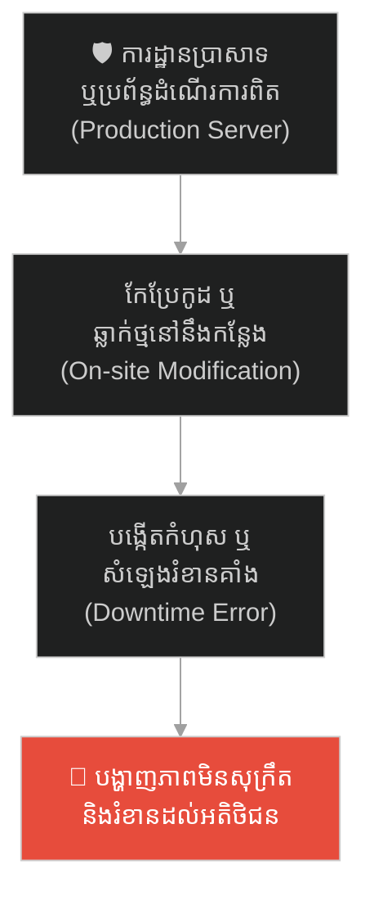
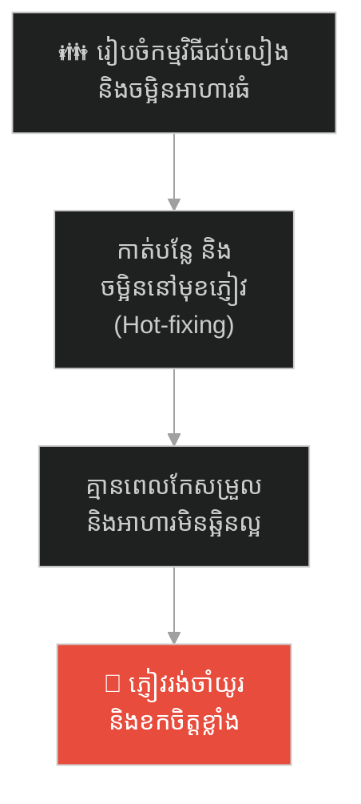
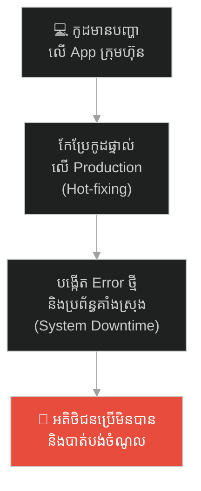
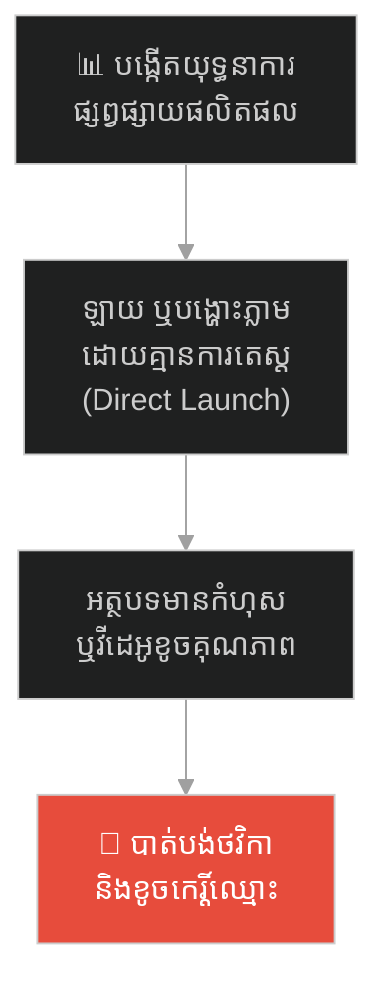
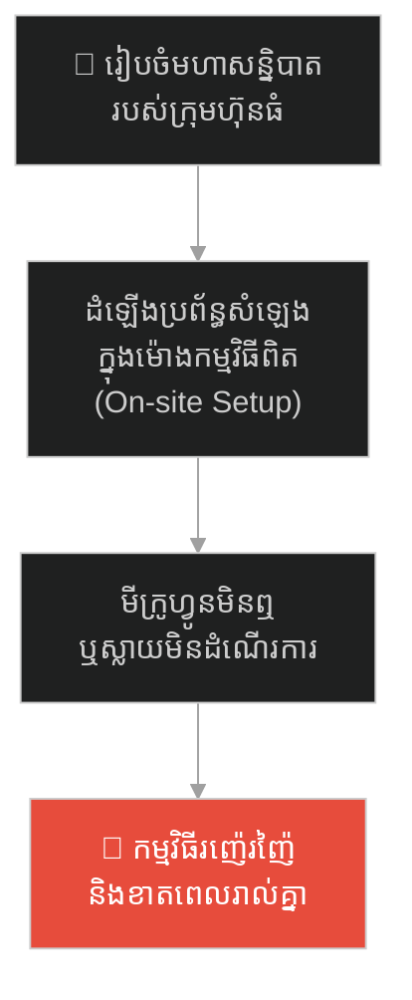
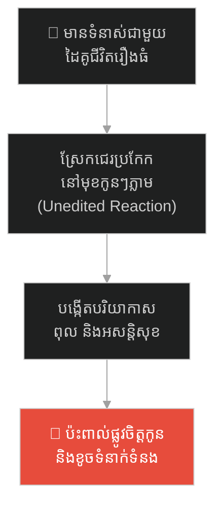
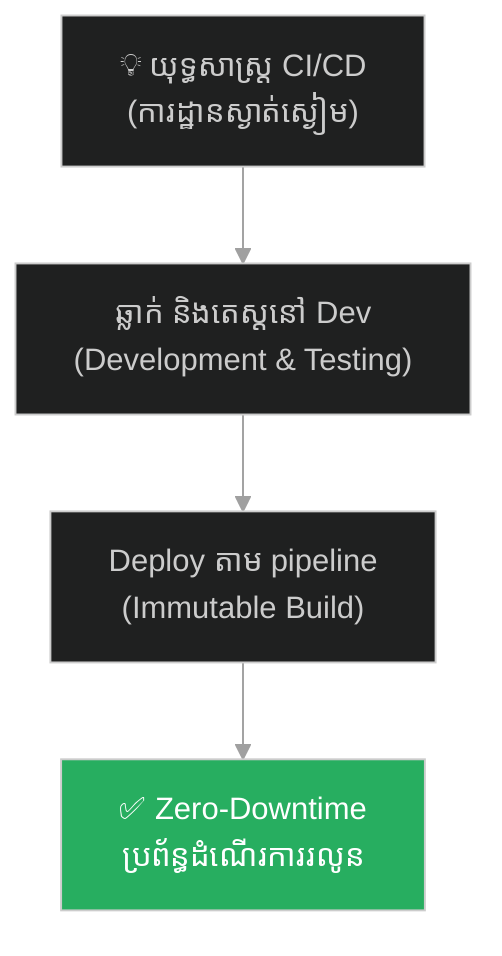

# Solomon's Temple and the Silent Build (ប្រាសាទសាឡូម៉ូន និងការសាងសង់ដោយគ្មានសំឡេង)៖ គ្រោះថ្នាក់នៃ Hot-fixing លើ Production និងយុទ្ធសាស្ត្រ CI/CD Pipeline

**Author:** ichamrong  
**Date:** 2026-05-27  
**Tags:** #solomon #ci-cd #devops #architecture #jerusalem #production-environment #immutable-infrastructure #critical-thinking  
**Category:** Concepts / Parables  
**Read Time:** ~15 min  

---

## 📌 មាតិកា (Table of Contents)
- [អន្ទាក់ផ្លូវចិត្ត (The Trap)](#អន្ទាក់ផ្លូវចិត្ត-the-trap)
- [១. រឿងព្រេង៖ គ្មានសំឡេងញញួរនៅការដ្ឋានប្រាសាទ (The Legend of the Silent Build)](#1)
  - [គម្រោងសាងសង់ដ៏មហិមា (The Grand Construction Project)](#1-1)
  - [ច្បាប់នៃភាពស្ងាត់ស្ងៀម និងវិស្វកម្មនៅកន្លែងយកថ្ម (The Rule of Silence & the Quarry)](#1-2)
- [២. បញ្ហា៖ គ្រោះថ្នាក់នៃការដោះស្រាយលើ Live Server និងគំរូ CI/CD (The Issue: Production Hot-Fixing vs. Immutable Deployment)](#2)
- [៣. ឧទាហរណ៍ជាក់ស្តែងក្នុងពិភពពិត (Real World Examples)](#3)
  - [ឧទាហរណ៍ទី ១ — កម្រិតស្រាល (គ្រួសារ)៖ ការរៀបចំគ្រឿងផ្សំអាហារក្នុងផ្ទះបាយមុនពេលជប់លៀង (The Kitchen Preparation)](#3-1)
  - [ឧទាហរណ៍ទី ២ — កម្រិតមធ្យម (បច្ចេកទេស)៖ ការកែកូដផ្ទាល់លើ Production Server (The Live Server Hot-Fix)](#3-2)
  - [ឧទាហរណ៍ទី ៣ — កម្រិតមធ្យម (ធុរកិច្ច)៖ ការតេស្តយុទ្ធនាការផ្សព្វផ្សាយជាមួយ Focus Group មុននឹង Launch (The Pre-Release Ad Test)](#3-3)
  - [ឧទាហរណ៍ទី ៤ — កម្រិតមធ្យម (សង្គម/គ្រប់គ្រង)៖ ការដំឡើង និងតេស្តឧបករណ៍បច្ចេកវិទ្យាមុនម៉ោងសន្និបាត (The Pre-Event Tech Rehearsal)](#3-4)
  - [ឧទាហរណ៍ទី ៥ — កម្រិតធ្ងន់ (ទំនាក់ទំនង)៖ ការរៀបចំគំនិតឱ្យស្ងប់ស្ងាត់មុននឹងពិភាក្សាទំនាស់គ្រួសារ (The Mindful Conflict Resolution)](#3-5)
- [៤. ដំណោះស្រាយទូទៅ៖ ការកសាងប្រព័ន្ធ CI/CD វៃឆ្លាត និងការអនុវត្ត Immutable Infrastructure (The General Solution: Automated Testing & Immutable Deployments)](#4)
- [សេចក្តីសន្និដ្ឋាន (Conclusion)](#conclusion)
- [ឯកសារយោង (References)](#references)
- [Related Posts](#related-posts)

---

## អន្ទាក់ផ្លូវចិត្ត (The Trap)

តើអ្នកធ្លាប់ជួបស្ថានភាពដែលប្រព័ន្ធការងារ ឬកម្មវិធីទូរស័ព្ទរបស់ក្រុមហ៊ុនកំពុងដំណើរការល្អ ប៉ុន្តែស្រាប់តែត្រូវគាំងដំណើរការទាំងស្រុង (System Downtime) គ្រាន់តែដោយសារមានការកែសម្រួលកូដ ឬដោះស្រាយបញ្ហាតូចតាចភ្លាមៗ (Hot-fixing) ផ្ទាល់នៅលើ Live Server ដែរឬទេ?

នៅក្នុងការគ្រប់គ្រងបច្ចេកវិទ្យា៖
* **យើងច្រើនតែលួចកែកូដ** ឬរចនាសម្ព័ន្ធផ្ទាល់លើប្រព័ន្ធដែលអតិថិជនកំពុងប្រើប្រាស់ ព្រោះគិតថា «កែបន្តិចបន្តួចគ្មាននរណាដឹងឡើយ»។
* **ប៉ុន្តែផលវិបាក** គឺការបង្កើតសំឡេងរំខាន Error ថ្មីៗ និងការរំខានដល់បទពិសោធន៍របស់អតិថិជនទាំងស្រុង។

ការដោះស្រាយកែច្នៃប្រព័ន្ធផ្ទាល់នៅលើបរិស្ថានដំណើរការពិត ហៅថា **អន្ទាក់ On-site Modification (ការវាយញញួរលើកំពូលប្រាសាទ)**។

ដើម្បីយល់ដឹងពីសិល្បៈនៃការរក្សាភាពស្ងប់ស្ងាត់លើ Production នេះជាផែនទីបង្ហាញផ្លូវសម្រាប់អត្ថបទនេះ៖
1. **រឿងព្រេង (The Historic Legend)** — រឿងរ៉ាវរបស់ស្តេចសាឡូម៉ូនដែលបញ្ជាឱ្យសាងសង់មហាប្រាសាទដោយគ្មានសំឡេងឧបករណ៍ដែកសូម្បីតែមួយម៉ាត់នៅការដ្ឋាន។
2. **បញ្ហា (The Issue)** — យន្តការ CI/CD Pipeline និងការគ្រប់គ្រងកូដតាមរយៈ Development, Testing, and Production Environments។
3. **ឧទាហរណ៍ជាក់ស្តែងក្នុងពិភពពិត (Real World Examples)** — ពិនិត្យមើលឥទ្ធិពលនៃការសាងសង់ដោយគ្មានសំឡេងក្នុងកម្រិតគ្រួសារ ព័ត៌មានវិទ្យា ធុរកិច្ច ការគ្រប់គ្រង និងទំនាក់ទំនង។
4. **ដំណោះស្រាយទូទៅ (The General Solution)** — ការអនុវត្ត Immutable Infrastructure និងយុទ្ធសាស្ត្រ Zero-Downtime Deployment។

---

## ១. រឿងព្រេង៖ គ្មានសំឡេងញញួរនៅការដ្ឋានប្រាសាទ (The Legend of the Silent Build)

បន្ទាប់ពីបានឡើងសោយរាជ្យ ស្តេច **សាឡូម៉ូន (King Solomon)** បានចាប់ផ្តើមគម្រោងដ៏ធំបំផុតនៅក្នុងប្រវត្តិសាស្ត្រ គឺការសាងសង់មហាប្រាសាទ (The First Temple) នៅលើភ្នំ Moriah ដើម្បីឧទ្ទិសថ្វាយដល់ព្រះជាម្ចាស់។

---

### គម្រោងសាងសង់ដ៏មហិមា (The Grand Construction Project)

គម្រោងនេះមានទំហំធំធេងណាស់ ដោយប្រើប្រាស់កម្មករជាង ៣ ម៉ឺននាក់ ជាងកាត់ថ្ម ៨ ម៉ឺននាក់ និងអ្នកដឹកជញ្ជូន ៧ ម៉ឺននាក់។ ដោយសារតែវាជាទីសក្ការៈបូជាដ៏ខ្ពង់ខ្ពស់ ស្តេចសាឡូម៉ូនចង់ឱ្យទីតាំងប្រាសាទនេះពោរពេញទៅដោយភាពស្ងប់ស្ងាត់ និងសេចក្តីសុខសាន្ត មិនអាចមានសភាពរញ៉េរញ៉ៃ ឬសំឡេង شورឡូឡាដូចការដ្ឋានសំណង់ទូទៅឡើយ។

---

### ច្បាប់នៃភាពស្ងាត់ស្ងៀម និងវិស្វកម្មនៅកន្លែងយកថ្ម (The Rule of Silence & the Quarry)

ស្តេចសាឡូម៉ូន បានចេញបទបញ្ជាវិស្វកម្មដ៏តឹងរ៉ឹងបំផុតមួយ ដែលមិនធ្លាប់មាននរណាធ្វើពីមុនមក៖  
> *«ទីតាំងសាងសង់ប្រាសាទនេះ គឺជាកន្លែងដ៏បរិសុទ្ធ។ ហេតុដូច្នេះហើយ ក្នុងអំឡុងពេលនៃការផ្គុំប្រាសាទ គេមិនត្រូវឮសំឡេងញញួរ ទ្វី ឬឧបករណ៍ធ្វើពីដែកណាមួយ បន្លឺឡើងនៅទីនេះជាដាច់ខាត!»*

មេការសំណង់ទាំងអស់មានការភ្ញាក់ផ្អើលយ៉ាងខ្លាំង។ តើគេអាចសាងសង់ប្រាសាទថ្មដ៏ធំមហិមា ដោយមិនប្រើញញួរ ឬឧបករណ៍ដោះកែសម្រួលនៅនឹងការដ្ឋាន (On-site modification) បានដោយរបៀបណា? ចុះបើផ្ទាំងថ្មនោះមានទំហំធំជាងបន្តិច ឬខុសជ្រុងបន្តិច តើគេត្រូវធ្វើដូចម្តេច?

ដើម្បីអនុវត្តតាមបទបញ្ជានេះ មេការសំណង់បានផ្លាស់ប្តូរយុទ្ធសាស្ត្រទាំងស្រុង។ ភាពរញ៉េរញ៉ៃ សំឡេងវាយកម្ទេច សំឡេងកាត់ និងការដុសខាត់ទាំងអស់ ត្រូវតែធ្វើឡើងយ៉ាងដាច់ខាតនៅឯ **កន្លែងយកថ្ម (The Quarry)** ដែលស្ថិតនៅឆ្ងាយពីទីក្រុង។

នៅកន្លែងយកថ្ម ជាងចម្លាក់បានចំណាយពេលយ៉ាងយូរ ដើម្បីកាត់ ឆ្លាក់ និងវាស់វែងផ្ទាំងថ្មនីមួយៗយ៉ាងល្អិតល្អន់បំផុត (Quality Assurance)។ ថ្មនីមួយៗ ត្រូវបានរចនាឡើងឱ្យស៊ីគ្នា ១០០%។ នៅពេលដែលវាត្រូវបានដឹកជញ្ជូនមកដល់ការដ្ឋានប្រាសាទ កម្មករគ្រាន់តែលើកវាដាក់តម្រៀបចូលគ្នា បញ្ចូលគ្នាយ៉ាងស្ងប់ស្ងាត់បំផុត ដោយមិនចាំបាច់មានការកែច្នៃ ឬវាយកម្ទេចបន្ថែមសូម្បីតែមួយញញួរ។

ជាលទ្ធផល មហាប្រាសាទដ៏ស្កឹមស្កៃ ត្រូវបានសាងសង់ឡើងជាលំដាប់រហូតដល់រួចរាល់ជាស្ថាពរ នៅក្នុងភាពស្ងប់ស្ងាត់ និងរបៀបរៀបរយទាំងស្រុង។

---

## ២. បញ្ហា៖ គ្រោះថ្នាក់នៃការដោះស្រាយលើ Live Server និងគំរូ CI/CD (The Issue: Production Hot-Fixing vs. Immutable Deployment)

រឿងប្រៀបធៀបនេះ ឆ្លុះបញ្ចាំងពីយន្តការវិស្វកម្ម **CI/CD (Continuous Integration / Continuous Deployment)** នៅក្នុងប្រព័ន្ធបច្ចេកវិទ្យា៖
* **ការដ្ឋានប្រាសាទ = Production Environment (Live App)៖** ប្រព័ន្ធដែលអតិថិជនកំពុងប្រើប្រាស់ គឺជារបស់បរិសុទ្ធ។ អ្នកមិនត្រូវចូលទៅ "វាយញញួរ" (Hot-fixing / Edit code directly) ផ្ទាល់នៅលើ Production ឡើយ។ រាល់ការដោះស្រាយបន្ទាន់នៅទីនោះ ងាយនឹងបង្កើត Error ថ្មីៗ និងធ្វើឱ្យប្រព័ន្ធគាំង (Downtime)។
* **កន្លែងយកថ្ម = Development / Testing Environment៖** ការរចនា ការសរសេរកូដ និងការធ្វើតេស្តសាកល្បង (Testing/QA) ទាំងអស់ ត្រូវតែធ្វើឡើងនៅក្នុងទីតាំងដាច់ដោយឡែក។ កូដដែលចេញពីកន្លែងនេះ ត្រូវតែឆ្លងកាត់ការវាស់វែង និងតេស្តដោយស្វ័យប្រវត្ត (CI Pipelines)។
* **ការផ្គុំថ្មស្ងប់ស្ងាត់ = Immutable Build & Zero-Downtime Deployment៖** កូដដែលបញ្ជូនមកកាន់ Production (CD Pipelines) ត្រូវតែជាកញ្ចប់ដែលសាងសង់រួចរាល់ជាស្រេច (Immutable) ដូចជា Docker Images។ ពេលវាចុះមកដល់ Production វាគ្រាន់តែចូលទៅជំនួសកន្លែងចាស់យ៉ាងស្ងប់ស្ងាត់បំផុត ដោយគ្មានការគាំងប្រព័ន្ធឡើយ។

---

## ៣. ឧទាហរណ៍ជាក់ស្តែងក្នុងពិភពពិត

ដើម្បីយល់ដឹងឱ្យកាន់តែស៊ីជម្រៅ ផ្លូវការសិក្សានឹងនាំអ្នកទៅពិនិត្យមើល **ឧទាហរណ៍ចំនួន ៥ កម្រិតខុសៗគ្នា** ក្នុងជីវិតរស់នៅប្រចាំថ្ងៃ៖

---

### ឧទាហរណ៍ទី ១ — កម្រិតស្រាល (គ្រួសារ)៖ ការរៀបចំគ្រឿងផ្សំអាហារក្នុងផ្ទះបាយមុនពេលជប់លៀង (The Kitchen Preparation)

**ស្ថានភាព៖** គ្រួសារមួយរៀបចំកម្មវិធីជប់លៀងខួបកំណើតឱ្យកូន ដោយមានភ្ញៀវចូលរួមប្រមាណ ២០ នាក់។

* **ភាគី A (ការធ្វើការងាររញ៉េរញ៉ៃ)៖** ពួកគេមិនបានរៀបចំ ឬហាន់បន្លែសាច់ទុកជាមុនឡើយ។ នៅពេលភ្ញៀវមកដល់ពេញផ្ទះ ម្ចាស់ផ្ទះចាប់ផ្តើមហាន់បន្លែ បុកគ្រឿង និងបំពងសាច់នៅតុអាហារមុខភ្ញៀវ (Hot-fixing) បង្កើតសំឡេង شورឡូឡា និងផ្សែងហុយរំខាន ព្រមទាំងធ្វើឱ្យអាហារឆ្អិនមិនទាន់ពេល។
* **ភាគី B (ការសាងសង់ដោយគ្មានសំឡេង)៖** ពួកគេបានរៀបចំលាង ហាន់ និងចម្អិនគ្រឿងផ្សំទាំងអស់ឱ្យរួចរាល់តាំងពីព្រឹកនៅក្នុងផ្ទះបាយ (The Quarry)។ នៅពេលកម្មវិធីចាប់ផ្តើម ពួកគេគ្រាន់តែលើកអាហារដាក់តម្រៀបលើតុយ៉ាងរៀបរយ និងស្ងប់ស្ងាត់បំផុត។

---

### ឧទាហរណ៍ទី ២ — កម្រិតមធ្យម (បច្ចេកទេស)៖ ការកែកូដផ្ទាល់លើ Production Server (The Live Server Hot-Fix)

**ស្ថានភាព៖** App លក់ទំនិញរបស់ក្រុមហ៊ុនជួបបញ្ហាមិនបង្ហាញតម្លៃបញ្ចុះតម្លៃសម្រាប់ផលិតផលមួយចំនួន។

* **ភាគី A (ការវាយញញួរលើកំពូលប្រាសាទ)៖** Developer បានចូលទៅកាន់ Production Server តាមរយៈ SSH រួចកែប្រែកូដផ្ទាល់នៅលើនោះលឿនៗ។ គាត់សរសេរខុសអក្សរ (Syntax Error) ធ្វើឱ្យ App ទាំងមូលគាំងប្រើប្រាស់មិនបានរយៈពេល ២ ម៉ោង។
* **ភាគី B (ការសាងសង់ដោយគ្មានសំឡេង)៖** Developer កែសម្រួលកូដនៅលើកុំព្យូទ័រផ្ទាល់ខ្លួន (Dev) សរសេរ Unit Tests ផ្ទៀងផ្ទាត់ រួច Push ទៅ Staging ដើម្បីឱ្យ QA តេស្ត។ ក្រោយពេលប្រាកដថាគ្មាន Bug គាត់បានប្រើប្រាស់ប្រព័ន្ធ CI/CD ដើម្បី Deploy កូដនោះទៅ Production ដោយស្ងប់ស្ងាត់ (Zero-Downtime)។

---

### ឧទាហរណ៍ទី ៣ — កម្រិតមធ្យម (ធុរកិច្ច)៖ ការតេស្តយុទ្ធនាការផ្សព្វផ្សាយជាមួយ Focus Group មុននឹង Launch (The Pre-Release Ad Test)

**ស្ថានភាព៖** ក្រុមហ៊ុនចង់បញ្ចេញវីដេអូផ្សព្វផ្សាយផលិតផលថ្មីទៅកាន់ទស្សនិកជនរាប់លាននាក់។

* **ភាគី A (ការផ្សព្វផ្សាយផ្សងព្រេង)៖** ពួកគេបង្ហោះវីដេអូនោះផ្ទាល់ទៅលើបណ្តាញសង្គមភ្លាមៗ (Direct Launch) ដោយគ្មានការតេស្តមតិយោបល់។ ក្រោយមក ទើបដឹងថាវីដេអូនោះមានពាក្យសម្តីខ្លះដែលប៉ះពាល់ដល់អារម្មណ៍សាធារណជន នាំឱ្យមានការរិះគន់ធំ និងត្រូវលុបចោលវិញដោយខាតបង់ថវិកា។
* **ភាគី B (ការសាងសង់ដោយគ្មានសំឡេង)៖** ពួកគេបានបញ្ចាំងវីដេអូនោះសាកល្បងជាមួយក្រុមមនុស្សគំរូ (Focus Group/Testing) ដើម្បីកត់ត្រាយោបល់ និងកែសម្រួលចំណុចខ្វះខាតនៅក្នុងស្ទូឌីយោ (The Quarry)។ ពេលបង្ហោះពិតប្រាកដ វីដេអូនោះទទួលបានការគាំទ្រយ៉ាងខ្លាំងដោយគ្មានសំឡេងរិះគន់ឡើយ។

---

### ឧទាហរណ៍ទី ៤ — កម្រិតមធ្យម (សង្គម/គ្រប់គ្រង)៖ ការដំឡើង និងតេស្តឧបករណ៍បច្ចេកវិទ្យាមុនម៉ោងសន្និបាត (The Pre-Event Tech Rehearsal)

**ស្ថានភាព៖** ក្រុមការងារត្រូវរៀបចំមហាសន្និបាតប្រចាំឆ្នាំរបស់ក្រុមហ៊ុនដែលមានអ្នកចូលរួម ៥០០ នាក់។

* **ភាគី A (ការដោះស្រាយការងាររញ៉េរញ៉ៃ)៖** ពួកគេដំឡើងមីក្រូហ្វូន ប្រព័ន្ធសំឡេង និងស្លាយបង្ហាញភ្លាមៗក្នុងម៉ោងកម្មវិធីពិតប្រាកដ។ ឧបករណ៍មានបញ្ហាមិនបន្លឺសំឡេង និងគាំងស្លាយ បង្កើតភាពរញ៉េរញ៉ៃ និងខាតពេលអ្នកចូលរួម។
* **ភាគី B (ការសាងសង់ដោយគ្មានសំឡេង)៖** ពួកគេបានជួលសាលប្រជុំតាំងពីល្ងាចថ្ងៃមុន រៀបចំ និងតេស្តសាកល្បងឧបករណ៍សំឡេង និងស្លាយរាប់សិបដង (Rehearsal)។ ក្នុងថ្ងៃកម្មវិធីពិត រាល់ការបង្ហាញដំណើរការទៅមុខយ៉ាងរលូន និងស្ងប់ស្ងាត់ល្អឥតខ្ចោះ។

---

### ឧទាហរណ៍ទី ៥ — កម្រិតធ្ងន់ (ទំនាក់ទំនង)៖ ការរៀបចំគំនិតឱ្យស្ងប់ស្ងាត់មុននឹងពិភាក្សាទំនាស់គ្រួសារ (The Mindful Conflict Resolution)

**ស្ថានភាព៖** ប្តីប្រពន្ធមានទំនាស់គ្នាលើការសម្រេចចិត្តវិនិយោគហិរញ្ញវត្ថុគ្រួសារ។

* **ភាគី A (ការបង្ហាញប្រតិកម្មរញ៉េរញ៉ៃ)៖** ពួកគេស្រែកគំហក ជេរប្រកែកគ្នា និងបោះចោលរបស់របរនៅចំពោះមុខកូនៗភ្លាមៗ (Hot-fixing) បង្កើតបរិយាកាសពុល និងប៉ះពាល់ផ្លូវចិត្តកូនយ៉ាងធ្ងន់ធ្ងរ។
* **ភាគី B (ការសាងសង់ដោយគ្មានសំឡេង)៖** ពួកគេទាំងពីរសម្រេចចិត្តស្ងប់ស្ងាត់រៀងៗខ្លួន គិតពិចារណាពីហេតុផលនៅក្នុងបន្ទប់ឯកជន (The Quarry)។ នៅពេលអារម្មណ៍មានលំនឹង ពួកគេមកជជែកគ្នាដោយសន្តិវិធី និងស្វែងរកដំណោះស្រាយរួមយ៉ាងមានសណ្តាប់ធ្នាប់។

---

## ៤. ដំណោះស្រាយទូទៅ៖ ការកសាងប្រព័ន្ធ CI/CD វៃឆ្លាត និងការអនុវត្ត Immutable Infrastructure (The General Solution: Automated Testing & Immutable Deployments)

ដើម្បីកម្ចាត់ឥទ្ធិពលនៃការកែប្រែប្រព័ន្ធដោយគ្មានយន្តការការពារ និងរក្សាភាពស្ងប់ស្ងាត់លើ Production អ្នកត្រូវអនុវត្តវិធានការទាំងនេះ៖

### ១. បង្កើតប្រព័ន្ធ Automated testing (CI Pipelines)
រាល់ពេលដែលកូដត្រូវបាន Push ទៅកាន់ Repository ត្រូវអនុញ្ញាតឱ្យប្រព័ន្ធធ្វើការ Build និងដំណើរការ Unit Tests, Integration Tests និង Security scanning ដោយស្វ័យប្រវត្ត។ នេះធានាថា រាល់កំហុសឆ្គងទាំងអស់ត្រូវបានរកឃើញ និងកែសម្រួលតាំងពី "កន្លែងយកថ្ម" (Dev environment) ដោយមិនអនុញ្ញាតឱ្យ Bug ទាំងនោះទៅដល់ដៃអតិថិជនឡើយ។

### ២. អនុវត្តយន្តការ Immutable Deployment (ការដាក់ពង្រាយដែលមិនអាចកែប្រែបាន)
មិនត្រូវចូលទៅកែកូដ ឬផ្លាស់ប្តូរ Configuration ផ្ទាល់នៅលើ Server ឡើយ។ រាល់កំណែអាប់ដេត ត្រូវតែសាងសង់ជា Docker Container Image ថ្មីទាំងស្រុង រួចដំឡើងជំនួស Container ចាស់ (Zero-Downtime Deployment ដូចជា Blue-Green ឬ Rolling Deployment)។ ថ្មដែលឆ្លាក់រួចរាល់ នឹងចូលទៅជំនួសកន្លែងចាស់យ៉ាងស្ងប់ស្ងាត់បំផុត។

### ៣. អនុវត្តការធ្វើផែនការ និងការ Rehearsal នៅក្នុងការគ្រប់គ្រង
នៅក្នុងការគ្រប់គ្រង៖ រាល់ការ Launch គម្រោងធំ ឬការប្រារព្ធកម្មវិធី ត្រូវតែមានការធ្វើតេស្តសាកល្បងលំហូរការងារផ្ទៃក្នុងជាមុន (Dry-run/Rehearsal)។ ភាពរញ៉េរញ៉ៃទាំងអស់ ត្រូវដោះស្រាយឱ្យរួចរាល់មុនថ្ងៃកម្មវិធីពិតប្រាកដ ដើម្បីរក្សាភាពស្ងប់ស្ងាត់ និងសុក្រឹតភាពខ្ពស់នៅចំពោះមុខអតិថិជន ឬដៃគូអាជីវកម្ម។

---

## 🐇 ធ្លាក់ចូលក្នុងរន្ធទន្សាយយុទ្ធសាស្ត្រ (Enter the Strategic Rabbit Hole)

ដើម្បីស្វែងយល់បន្ថែមអំពីវិធីសាស្ត្ររក្សាតុល្យភាពផ្លូវចិត្ត និងស្មារតីស្ងប់ស្ងាត់ (Stoicism/Equanimity) ទាំងក្នុងពេលសម្រេចបានជោគជ័យដ៏អស្ចារ្យបំផុត និងពេលជួបប្រទះវិបត្តិបរាជ័យធំបំផុត (Solomon's Ring) សូមបន្តដំណើររបស់អ្នក៖

* 🚀 **[ចាប់ផ្តើមដំណើររុករក (Start the Journey) ➔ Solomon's Ring and the Mantra of Kings](./40-solomons-ring.md)**

---

## សេចក្តីសន្និដ្ឋាន (Conclusion)

> **«ភាពបរិសុទ្ធ និងភាពជោគជ័យនៃមហាប្រាសាទ សម្រេចទៅបានដោយសារតែភាពស្ងប់ស្ងាត់ទាំងស្រុងនៅការដ្ឋាន ខណៈពេលដែលសំឡេងញញួរ និងការងារដ៏លំបាកទាំងអស់ ត្រូវបានបញ្ចប់យ៉ាងល្អិតល្អន់នៅកន្លែងយកថ្ម។»**

ចូរកុំវាយញញួរនៅលើ Production Server របស់ក្រុមហ៊ុនឡើយ។ ត្រូវត្រួតពិនិត្យ និងតេស្តកូដរបស់អ្នកឱ្យបានល្អិតល្អន់បំផុតនៅក្នុងបរិស្ថាន Development តាមរយៈប្រព័ន្ធ CI/CD ដើម្បីរក្សាភាពស្ងប់ស្ងាត់ និងទំនុកចិត្តខ្ពស់បំផុតពីអតិថិជន។

រក្សាភាពស្ងប់ស្ងាត់នៅលើ Production របស់អ្នកនៅថ្ងៃនេះ។

---

## ឯកសារយោង (References)

* **Humble, Jez & Farley, David** — *Continuous Delivery: Reliable Software Releases through Build, Test, and Deployment Automation* (2010)។ សៀវភៅគោលដ៏ល្បីល្បាញស្តីពីការសាងសង់ CI/CD Pipeline ក្នុងប្រព័ន្ធបច្ចេកវិទ្យា។
* **Morris, Kief** — *Infrastructure as Code: Managing Servers in the Cloud* (2016)។ ការគ្រប់គ្រងប្រព័ន្ធតាមរយៈ Immutable Infrastructure និង Automation។
* **Holy Bible** — *1 Kings 6:7* (Ancient Near East) ឯកសារប្រវត្តិសាស្ត្រដែលកត់ត្រាច្បាប់សាងសង់ប្រាសាទសាឡូម៉ូនដោយគ្មានសំឡេងឧបករណ៍ដែក។

---

## Related Posts

* **[31 Solomon's Temple and the Philosophy of CI/CD](../articles/31-solomons-temple-and-ci-cd.md)** — អត្ថបទគោលបកស្រាយលម្អិតអំពីយន្តការ និងទស្សនវិជ្ជានៃការដាក់ពង្រាយកូដ (Deployment)។
* **[34 The Labyrinth and Ariadne's Thread](./34-the-labyrinth-and-the-thread.md)** — របៀបប្រើប្រាស់ Unit Tests និង Git ដើម្បីតាមដានផ្លូវ និងជៀសវាង Spaghetti Code។
* **[29 Solomon's Judgment: The Principle of True Ownership](../articles/29-solomons-judgment-and-true-ownership.md)** — ភាពជាម្ចាស់ពិតប្រាកដ និងការទទួលខុសត្រូវខ្ពស់ក្នុងការគ្រប់គ្រងគម្រោង។

---
*Last updated: 2026-05-27*

## Related

- [💡 Concepts README](../README.md)
- [📚 Main Repository README](../../../README.md)
- [Developer Habits](../../developer-habits/README.md)
- [Mental Health & Well-being](../../mental-health/README.md)
- [Management & SDLC](../../management/README.md)
