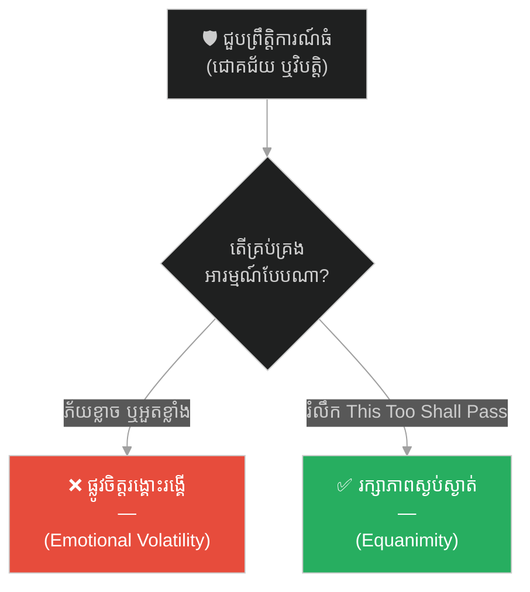
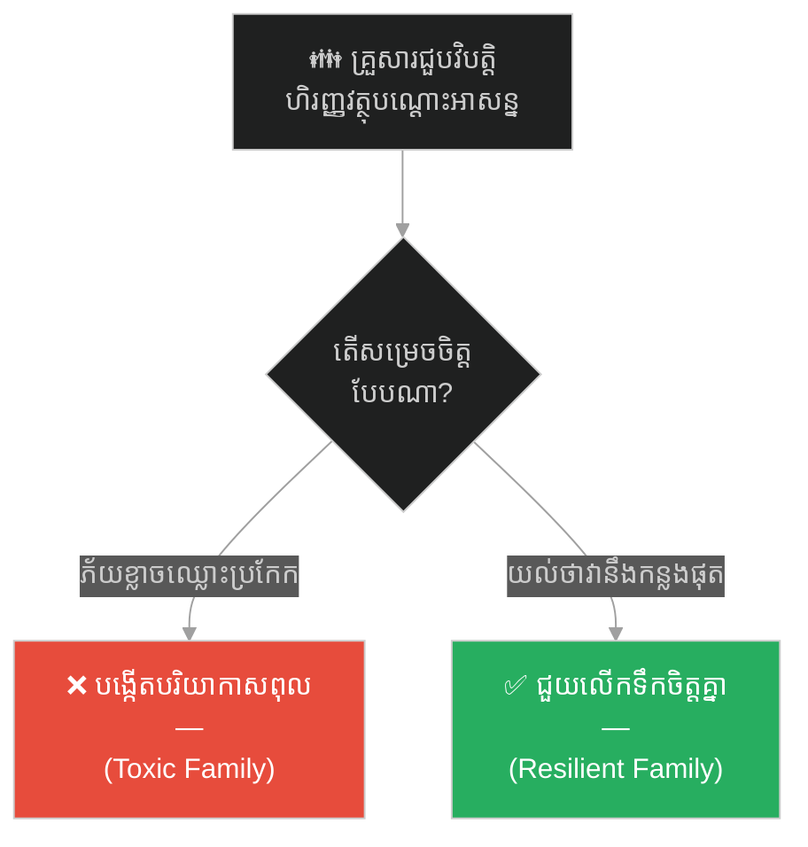
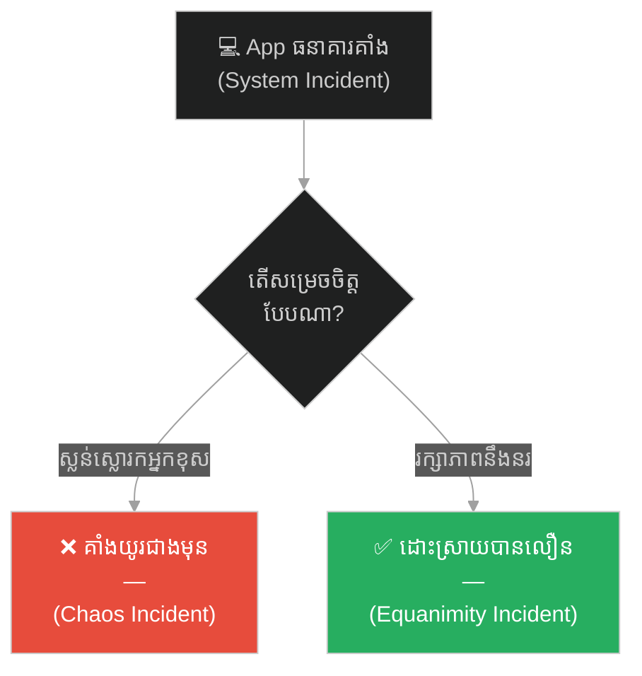
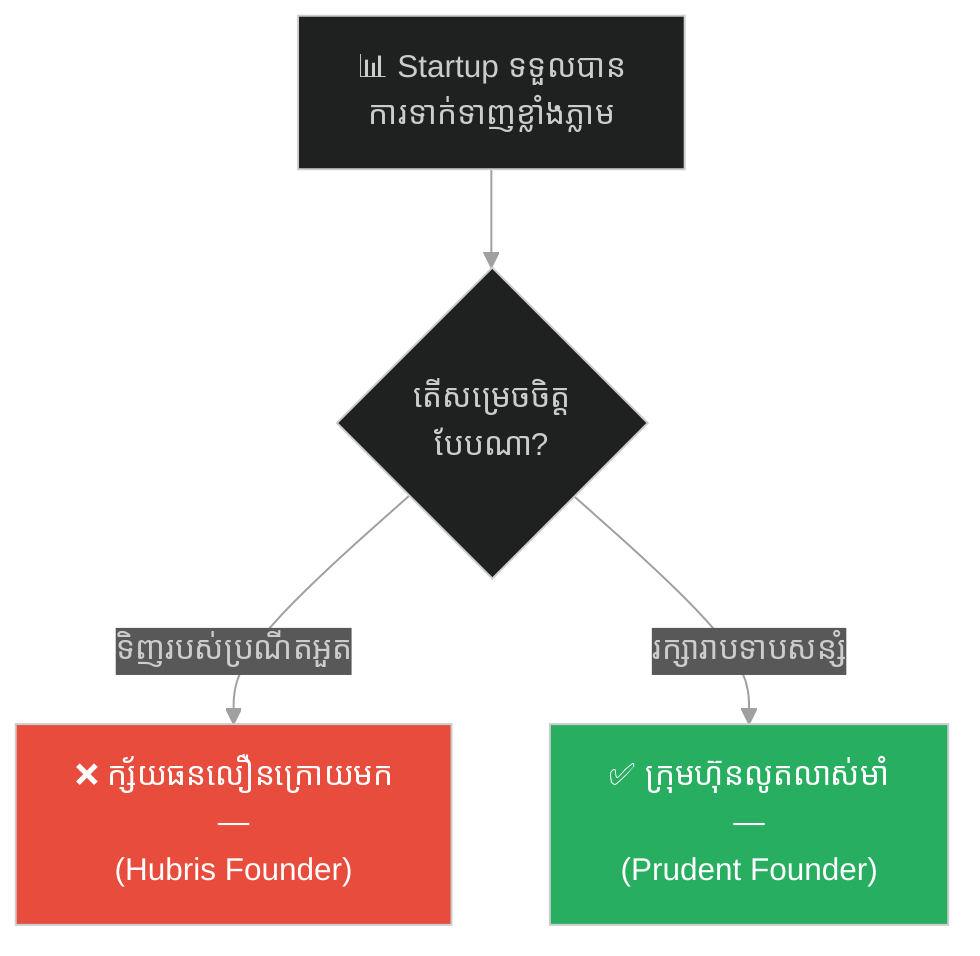
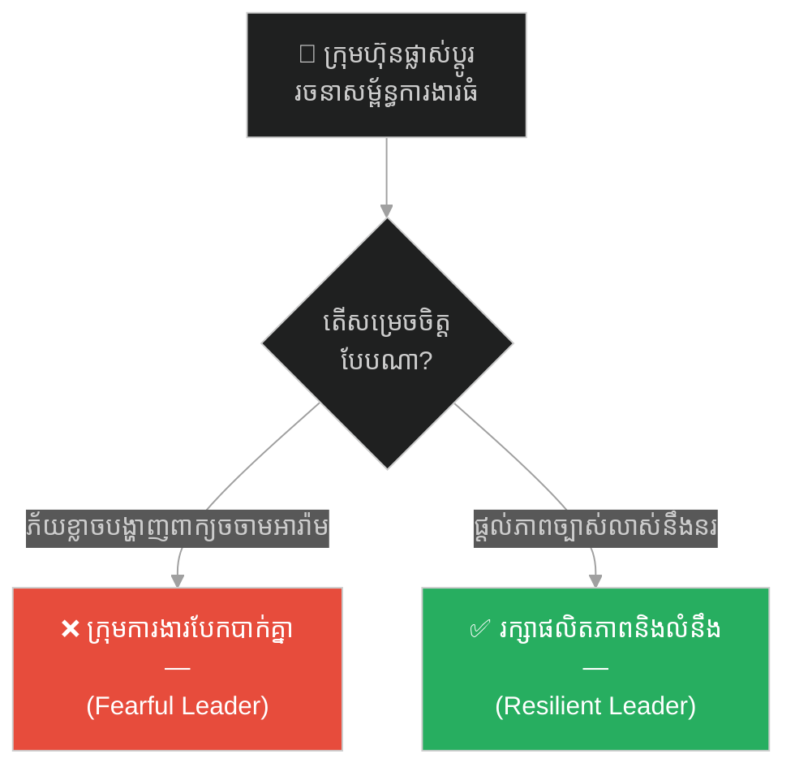
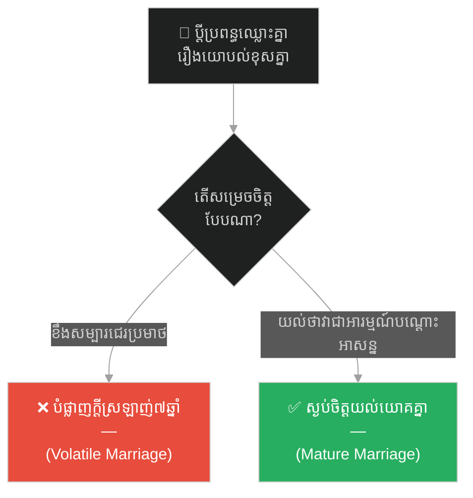
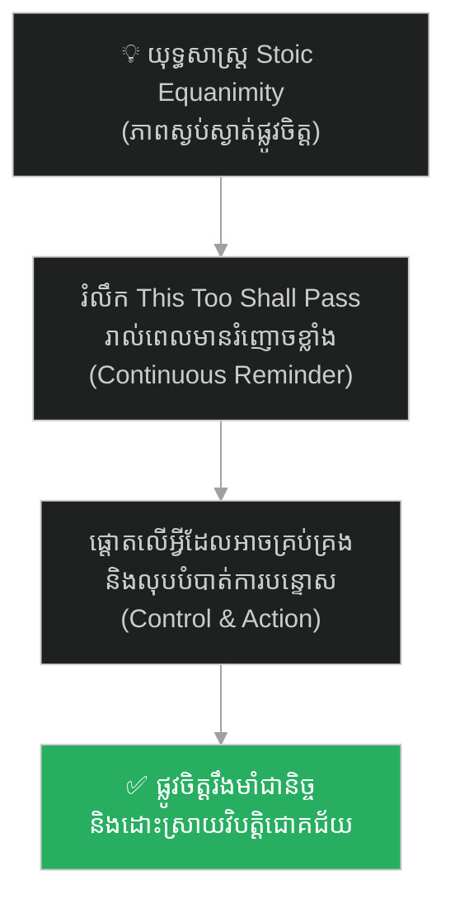

# Solomon's Ring and the Mantra of Kings (ចិញ្ចៀនរបស់សាឡូម៉ូន និងមន្តអាគមរបស់អធិរាជ)៖ គ្រោះថ្នាក់នៃលម្អៀងអារម្មណ៍ និងយុទ្ធសាស្ត្រកសាងភាពធន់ផ្លូវចិត្ត

**Author:** ichamrong  
**Date:** 2026-05-27  
**Tags:** #solomon #psychology #parable #stoicism #mental-health #resilience #incident-management #critical-thinking  
**Category:** Concepts / Parables  
**Read Time:** ~15 min  

---

## 📌 មាតិកា (Table of Contents)
- [អន្ទាក់ផ្លូវចិត្ត (The Trap)](#អន្ទាក់ផ្លូវចិត្ត-the-trap)
- [១. រឿងព្រេង៖ បេសកកម្មដ៏អស់សង្ឃឹម និងចិញ្ចៀន Pass (The Legend of Solomon's Ring)](#1)
  - [ការសាកល្បងរបស់ព្រះរាជា (The King's Test)](#1-1)
  - [ការស្វែងរកដ៏អស់សង្ឃឹម និងចិញ្ចៀនឆ្លាក់អក្សរមន្ត (The Desperate Search & the Ring)](#1-2)
- [២. បញ្ហា៖ ភាពប្រែប្រួលនៃអារម្មណ៍ និងទស្សនវិជ្ជា Stoicism (The Issue: Emotional Volatility & Stoic Equanimity)](#2)
- [៣. ឧទាហរណ៍ជាក់ស្តែងក្នុងពិភពពិត (Real World Examples)](#3)
  - [ឧទាហរណ៍ទី ១ — កម្រិតស្រាល (គ្រួសារ)៖ ការរក្សាលំនឹងផ្លូវចិត្តក្នុងវិបត្តិហិរញ្ញវត្ថុបណ្តោះអាសន្ន (The Family Financial Crisis)](#3-1)
  - [ឧទាហរណ៍ទី ២ — កម្រិតមធ្យម (បច្ចេកទេស)៖ ការរក្សាភាពនឹងនរក្នុងពេលប្រព័ន្ធធំជួបគ្រោះអាសន្ន (The System Incident Panic)](#3-2)
  - [ឧទាហរណ៍ទី ៣ — កម្រិតមធ្យម (ធុរកិច្ច)៖ ការរក្សាភាពរាបទាបពេលផលិតផលទទួលបានភាពល្បីល្បាញភ្លាមៗ (The Viral Product Hubris)](#3-3)
  - [ឧទាហរណ៍ទី ៤ — កម្រិតមធ្យម (សង្គម/គ្រប់គ្រង)៖ ភាពជាអ្នកដឹកនាំក្នុងអំឡុងពេលផ្លាស់ប្តូររចនាសម្ព័ន្ធក្រុមហ៊ុន (The Corporate Restructuring)](#3-4)
  - [ឧទាហរណ៍ទី ៥ — កម្រិតធ្ងន់ (ទំនាក់ទំនង)៖ ការមិនបណ្តោយឱ្យកំហឹងបណ្តោះអាសន្នបំផ្លាញអាពាហ៍ពិពាហ៍យូរឆ្នាំ (The Temporary Anger Trap)](#3-5)
- [៤. ដំណោះស្រាយទូទៅ៖ ការអនុវត្តវិធាន Stoic Equanimity និងការគ្រប់គ្រងគ្រោះអាសន្នប្រកបដោយហេតុផល (The General Solution: Incident Equanimity & Stoic Reminders)](#4)
- [សេចក្តីសន្និដ្ឋាន (Conclusion)](#conclusion)
- [ឯកសារយោង (References)](#references)
- [Related Posts](#related-posts)

---

## អន្ទាក់ផ្លូវចិត្ត (The Trap)

តើអ្នកធ្លាប់ជួបស្ថានភាពដែលខ្លួនឯងមានអារម្មណ៍ភ័យស្លន់ស្លោ និងគិតថាពិភពលោកទាំងមូលកំពុងតែដួលរលំ នៅពេលជួបប្រទះនឹងវិបត្តិការងារ ឬផ្ទុយទៅវិញ មានអំនួតហួសហេតុពេលទទួលបានជោគជ័យ រហូតដល់ធ្វើការសម្រេចចិត្តខុសឆ្គងដែរឬទេ?

នៅក្នុងការគ្រប់គ្រង និងជីវិតរស់នៅ៖
* **យើងងាយនឹងរង្គោះរង្គើ** ទៅតាមការផ្លាស់ប្តូរខាងក្រៅ (ជួបជោគជ័យក៏អួតខ្លាំង, ជួបវិបត្តិក៏បាក់ទឹកចិត្ត)។
* **យើងមើលរំលង** ការពិតដ៏សាមញ្ញមួយថា គ្មានស្ថានភាពល្អ ឬអាក្រក់ណាដែលនៅស្ថិតស្ថេរជារៀងរហូតនោះឡើយ។

ការអនុញ្ញាតឱ្យភាពប្រែប្រួលនៃកាលៈទេសៈ បំផ្លាញលំនឹងចិត្តគំនិត និងសមត្ថភាពសម្រេចចិត្ត ហៅថា **អន្ទាក់ Emotional Volatility (លម្អៀងរលកអារម្មណ៍)**។

ដើម្បីយល់ដឹងពីវិធីកសាងភាពធន់ផ្លូវចិត្ត និងការគ្រប់គ្រងវិបត្តិដោយស្ងប់ស្ងាត់ នេះជាផែនទីបង្ហាញផ្លូវសម្រាប់អត្ថបទនេះ៖
1. **រឿងព្រេង (The Historic Legend)** — រឿងរ៉ាវរបស់ បេណាយ៉ា ដែលត្រូវស្វែងរកចិញ្ចៀនដ៏អស្ចារ្យដែលអាចធ្វើឱ្យអ្នកសោកសៅសប្បាយចិត្ត និងអ្នកសប្បាយចិត្តត្រឡប់ជាសោកសៅវិញ។
2. **បញ្ហា (The Issue)** — ភាពខុសគ្នារវាងការគ្រប់គ្រងដោយអារម្មណ៍ និងភាពស្ងប់ស្ងាត់ផ្លូវចិត្ត (Stoic Equanimity)។
3. **ឧទាហរណ៍ជាក់ស្តែងក្នុងពិភពពិត (Real World Examples)** — ពិនិត្យមើលឥទ្ធិពលនៃការលម្អៀងនេះក្នុងកម្រិតគ្រួសារ ព័ត៌មានវិទ្យា ធុរកិច្ច ការគ្រប់គ្រង និងទំនាក់ទំនង។
4. **ដំណោះស្រាយទូទៅ (The General Solution)** — ការអនុវត្តមន្តអាគម "រឿងនេះក៏នឹងកន្លងផុតទៅ" និងការដោះស្រាយបញ្ហាផ្អែកលើការគ្រប់គ្រងសកម្មភាព។

---

## ១. រឿងព្រេង៖ បេសកកម្មដ៏អស់សង្ឃឹម និងចិញ្ចៀន Pass (The Legend of Solomon's Ring)

ថ្ងៃមួយ ស្តេចសាឡូម៉ូនចង់សាកល្បងប្រាជ្ញា និងដែនកំណត់ផ្លូវចិត្តរបស់មន្ត្រីជំនិតដ៏ឆ្លាតវៃបំផុតរបស់ទ្រង់ ដែលមានឈ្មោះថា **បេណាយ៉ា (Benaiah)**។ 

---

### ការសាកល្បងរបស់ព្រះរាជា (The King's Test)

ទ្រង់បានកោះហៅ បេណាយ៉ា មកហើយមានបន្ទូលថា៖  
> *«បេណាយ៉ា យើងចង់ឱ្យឯងទៅរករបស់ម្យ៉ាងមកឱ្យយើង។ វាគឺជា **ចិញ្ចៀនវេទមន្ត** មួយវង់ ដែលមានថាមពលដ៏អស្ចារ្យបំផុត។ ប្រសិនបើមនុស្សដែលកំពុងតែមានទុក្ខសោកយ៉ាងខ្លាំង សម្លឹងមើលវា ពួកគេនឹងប្រែជាសប្បាយចិត្ត និងមានសង្ឃឹមឡើងវិញភ្លាមៗ។ ប៉ុន្តែផ្ទុយទៅវិញ ប្រសិនបើមនុស្សដែលកំពុងតែត្រេកអរ និងមានមោទនភាពយ៉ាងខ្លាំង សម្លឹងមើលវា ពួកគេនឹងប្រែជាសោកសៅ ឬស្ងប់ចិត្តវិញជាមិនខាន។ យើងទុកពេលឱ្យឯង ៦ ខែ ដើម្បីស្វែងរកវា។»*

តាមការពិត ស្តេចសាឡូម៉ូនគ្រាន់តែចង់លេងសើច និងបង្អាប់បេណាយ៉ាប៉ុណ្ណោះ ព្រោះទ្រង់ដឹងច្បាស់ថា ចិញ្ចៀនដែលមានថាមពលចិត្តសាស្ត្រផ្ទុយគ្នា និងចម្លែកបែបនេះ មិនមាននៅលើលោកនេះឡើយ។

---

### ការស្វែងរកដ៏អស់សង្ឃឹម និងចិញ្ចៀនឆ្លាក់អក្សរមន្ត (The Desperate Search & the Ring)

បេណាយ៉ា បានចំណាយពេលជិះសេះស្វែងរកចិញ្ចៀននោះពាសពេញគ្រប់ទិសទីនៃនគរ។ គាត់បានសួរនាំជាងទង គ្រូសូត្រមន្ត អ្នកប្រាជ្ញ និងទីប្រឹក្សារាប់រយនាក់ ប៉ុន្តែគ្មាននរណាម្នាក់ធ្លាប់ឮពីរបស់របរចម្លែកបែបនេះឡើយ។

ពេលវេលា ៦ ខែ បានកន្លងផុតទៅយ៉ាងលឿន។ នៅយប់ចុងក្រោយ មុនថ្ងៃដែលគាត់ត្រូវចូលគាល់ស្តេចសាឡូម៉ូន បេណាយ៉ា មានការអស់សង្ឃឹមយ៉ាងខ្លាំង ព្រោះខ្លាចបាត់បង់កិត្តិយសរបស់ខ្លួន។ គាត់បានដើរវង្វេងចូលទៅក្នុងផ្សារចាស់មួយកណ្តាលទីក្រុងយេរូសាឡឹម។ 

គាត់បានដើរទៅកាន់តូបលក់គ្រឿងអលង្ការដ៏តូច និងចាស់បំផុតមួយរបស់បុរសចំណាស់ម្នាក់ ហើយសួរនាំដោយមិនសង្ឃឹមថា៖  
> *«លោកតាចេះធ្វើចិញ្ចៀនដែលអាចធ្វើឱ្យអ្នកសោកសៅក្លាយជាសប្បាយចិត្ត ហើយអ្នកសប្បាយចិត្តក្លាយជាសោកសៅ ដែរឬទេ?»*

បុរសចំណាស់ញញឹមយ៉ាងស្ងប់ស្ងាត់ រួចយកចិញ្ចៀនមាសធម្មតាមួយវង់មក។ គាត់បានយកឧបករណ៍មកឆ្លាក់អក្សរបីម៉ាត់ទៅលើចិញ្ចៀននោះ រួចហុចវាទៅឱ្យ បេណាយ៉ា។ គ្រាន់តែអានអក្សរទាំងនោះរួច បេណាយ៉ា ញញឹមយ៉ាងស្រស់បោះ ហើយដឹងភ្លាមថានេះពិតជាចិញ្ចៀនដែលស្តេចចង់បានពិតប្រាកដ។

នៅព្រឹកបន្ទាប់ នៅក្នុងរាជវាំងដែលពោរពេញដោយមន្ត្រីរាប់រយនាក់ ស្តេចសាឡូម៉ូនបានញញឹមសួរថា៖ *«យ៉ាងម៉េចហើយ បេណាយ៉ា? តើឯងរកចិញ្ចៀននោះឃើញទេ?»*

បេណាយ៉ា បានលុតជង្គង់ថ្វាយបង្គំ រួចហុចចិញ្ចៀននោះថ្វាយស្តេច។ នៅលើចិញ្ចៀននោះ មានឆ្លាក់ពាក្យថា៖  
**«រឿងនេះ ក៏នឹងកន្លងផុតទៅដែរ (This too shall pass)»**

គ្រាន់តែឃើញពាក្យនេះ ស្នាមញញឹមអំនួតរបស់ស្តេចសាឡូម៉ូន ក៏រសាត់បាត់ទៅភ្លាមៗ។ ទ្រង់បានដឹងភ្លាមថា ទោះបីជាទ្រង់កំពុងមានអំណាច ទ្រព្យសម្បត្តិ និងក្តីសុខដ៏អស្ចារ្យបំផុតនៅពេលនេះ ក៏មិនយូរមិនឆាប់ របស់ទាំងអស់នេះនឹងកន្លងផុតទៅ ហើយទ្រង់នឹងក្លាយជាធូលីដីដូចមនុស្សទូទៅដែរ (ធ្វើឱ្យអ្នកសប្បាយចិត្ត ក្លាយជាស្ងប់ស្ងាត់ និងលះបង់អំនួត Hubris)។

ប៉ុន្តែក្នុងពេលជាមួយគ្នានោះ ប្រសិនបើមនុស្សម្នាក់កំពុងជួបទុក្ខលំបាក ឈឺចាប់ ឬបាត់បង់អ្វីមួយ ពេលអានពាក្យនេះ គេនឹងយល់ថា ក្តីទុក្ខនេះមិននៅស្ថិតស្ថេរជារៀងរហូតទេ វានឹងកន្លងផុតទៅដូចគ្នា (ធ្វើឱ្យអ្នកសោកសៅ មានក្តីសង្ឃឹមឡើងវិញ)។

ស្តេចសាឡូម៉ូន បានពាក់ចិញ្ចៀននោះជាប់នឹងដៃអស់មួយជីវិត ដើម្បីរំលឹកខ្លួនឯងកុំឱ្យមានអំនួតពេលជោគជ័យ និងកុំឱ្យបាក់ទឹកចិត្តពេលជួបវិបត្តិ។

---

## ២. បញ្ហា៖ ភាពប្រែប្រួលនៃអារម្មណ៍ និងទស្សនវិជ្ជា Stoicism (The Issue: Emotional Volatility & Stoic Equanimity)

រឿងប្រៀបធៀបនេះ ឆ្លុះបញ្ចាំងពីទស្សនវិជ្ជា **Stoicism (ភាពរឹងមាំផ្លូវចិត្ត)** នៅក្នុងការគ្រប់គ្រងវិបត្តិ (Incident Management)៖
* **ភាពលម្អៀងរលកអារម្មណ៍ (Emotional Volatility)៖** នៅពេលជួបបញ្ហាធំ (ដូចជា Server គាំង ឬក្រុមហ៊ុនខាតលុយ) មនុស្សភាគច្រើនស្លន់ស្លោ ភ័យខ្លាច និងស្រែកបន្ទោសគ្នា (Panic Mode) ដែលធ្វើឱ្យបញ្ហាកាន់តែវឹកវរ។ ផ្ទុយទៅវិញ ពេលជួបជោគជ័យ ពួកគេមានអំនួត (Hubris) និងធ្វេសប្រហែស។
* **ភាពស្ងប់ស្ងាត់ផ្លូវចិត្ត (Equanimity)៖** ការយល់ដឹងថា «រឿងនេះក៏នឹងកន្លងផុតទៅដែរ» ជួយឱ្យយើងរក្សាភាពស្ងប់ស្ងាត់ មិនលង់នឹងអំណាច ឬលិចលង់នឹងទុក្ខសោក។ ភាពស្ងប់ស្ងាត់ជួយឱ្យខួរក្បាលដំណើរការដោយហេតុផល និងស្វែងរកដំណោះស្រាយវិបត្តិបានលឿនបំផុត។

---

## ៣. ឧទាហរណ៍ជាក់ស្តែងក្នុងពិភពពិត

ដើម្បីយល់ដឹងឱ្យកាន់តែស៊ីជម្រៅ ផ្លូវការសិក្សានឹងនាំអ្នកទៅពិនិត្យមើល **ឧទាហរណ៍ចំនួន ៥ កម្រិតខុសៗគ្នា** ក្នុងជីវិតរស់នៅប្រចាំថ្ងៃ៖

---

### ឧទាហរណ៍ទី ១ — កម្រិតស្រាល (គ្រួសារ)៖ ការរក្សាលំនឹងផ្លូវចិត្តក្នុងវិបត្តិហិរញ្ញវត្ថុបណ្តោះអាសន្ន (The Family Financial Crisis)

**ស្ថានភាព៖** គ្រួសារមួយជួបបញ្ហាខ្វះខាតថវិកាបណ្តោះអាសន្ន ដោយសារតែអាជីវកម្មជួបការថយចុះចំណូលរយៈពេល ២ ខែ។

* **ភាគី A (រលកអារម្មណ៍ពុល)៖** ឪពុកម្តាយបង្ហាញភាពភ័យខ្លាច ឈ្លោះប្រកែកគ្នាជារៀងរាល់ថ្ងៃ និងស្តីបន្ទោសគ្នាទៅវិញទៅមកពីការចំណាយ បង្កើតបរិយាកាសពុលក្នុងផ្ទះ ធ្វើឱ្យកូនៗភ័យខ្លាចខ្លាំង។
* **ភាគី B (ភាពធន់ស្ងប់ស្ងាត់)៖** ពួកគេយល់ព្រមថយចុះការចំណាយ រំលឹកគ្នាទៅវិញទៅមកថា «ស្ថានភាពលំបាកនេះ នឹងកន្លងផុតទៅដូចមុនដែរ» រួចសហការគ្នាស្វែងរកច្រកចំណូលថ្មីដោយភាពស្ងប់ស្ងាត់ និងកក់ក្តៅ។

---

### ឧទាហរណ៍ទី ២ — កម្រិតមធ្យម (បច្ចេកទេស)៖ ការរក្សាភាពនឹងនរក្នុងពេលប្រព័ន្ធធំជួបគ្រោះអាសន្ន (The System Incident Panic)

**ស្ថានភាព៖** App ធនាគារជួបប្រទះការគាំងប្រព័ន្ធ (Downtime) ក្នុងម៉ោងដែលមានការប្រើប្រាស់ខ្ពស់បំផុត។

* **ភាគី A (ការស្លន់ស្លោរកអ្នកខុស)៖** CTO ស្រែកខឹង ស្តីបន្ទោស Dev នៅក្នុង Group Chat និងទាមទារឱ្យដោះស្រាយភ្លាមៗ។ Dev មានអារម្មណ៍ភ័យខ្លាច ធ្វើការងារទាំងញ័រដៃ និងកូដខុសបង្កើត Bug កាន់តែធំធ្វើឱ្យប្រព័ន្ធគាំងយូរជាងមុន។
* **ភាគី B (ភាពនឹងនរដោះស្រាយវិបត្តិ)៖** CTO រក្សាភាពនឹងនរ ប្រើប្រាស់យុទ្ធសាស្ត្រ Stoic រំលឹកក្រុមការងារថា « incidents តែងតែកើតឡើង ហើយវានឹងត្រូវដោះស្រាយរួចរាល់ ដូចរាល់ដងដែរ» រួចបែងចែកការងារដោះស្រាយបញ្ហាស្នូលដោយស្ងប់ស្ងាត់។

---

### ឧទាហរណ៍ទី ៣ — កម្រិតមធ្យម (ធុរកិច្ច)៖ ការរក្សាភាពរាបទាបពេលផលិតផលទទួលបានភាពល្បីល្បាញភ្លាមៗ (The Viral Product Hubris)

**ស្ថានភាព៖** ក្រុមហ៊ុន Startup បញ្ចេញ App ថ្មីមួយ ហើយទទួលបានអ្នកប្រើប្រាស់ ១ លាននាក់ក្នុងរយៈពេលតែ ១ សប្តាហ៍ (Viral)។

* **ភាគី A (អំនួតហួសហេតុ)៖** ស្ថាបនិកមានអំនួតខ្លាំង គិតថាខ្លួនឯងខ្លាំងឥតខ្ចោះ រួចចាប់ផ្តើមជួលការិយាល័យទំនើប ចំណាយលុយខ្ជះខ្ជាយ និងធ្វេសប្រហែសការអភិវឌ្ឍន៍សន្តិសុខប្រព័ន្ធ ព្រោះជឿថា «ជោគជ័យនេះនឹងនៅគង់វង្សជារៀងរហូត»។ ៦ ខែក្រោយមក App ត្រូវ Hacker វាយលុក និងក្ស័យធន។
* **ភាគី B (ភាពរាបទាបសន្សំ)៖** ស្ថាបនិករក្សាភាពរាបទាប រំលឹកខ្លួនឯងថា «រលកនៃការទាក់ទាញនេះនឹងថយចុះនៅថ្ងៃណាមួយ» រួចសន្សំថវិកា ផ្តោតលើការពង្រឹងគុណភាពប្រព័ន្ធ និងរក្សាអតិថិជនចាស់។

---

### ឧទាហរណ៍ទី ៤ — កម្រិតមធ្យម (សង្គម/គ្រប់គ្រង)៖ ភាពជាអ្នកដឹកនាំក្នុងអំឡុងពេលផ្លាស់ប្តូររចនាសម្ព័ន្ធក្រុមហ៊ុន (The Corporate Restructuring)

**ស្ថានភាព:** ក្រុមហ៊ុនធំត្រូវប្រកាសកាត់បន្ថយបុគ្គលិក ១០% និងផ្លាស់ប្តូរទិសដៅផលិតផល។

* **ភាគី A (ការស្លន់ស្លោរបស់មេដឹកនាំ)៖** PM បង្ហាញភាពភ័យខ្លាច ខ្សឹបខ្សៀវព័ត៌មានមិនច្បាស់លាស់ និងបញ្ចេញការមិនពេញចិត្តចំពោះការសម្រេចចិត្តរបស់ថ្នាក់ដឹកនាំជាន់ខ្ពស់។ ក្រុមការងារមានការព្រួយបារម្ភ លែងចង់ធ្វើការ និងបែកបាក់គ្នា។
* **ភាគី B (លំនឹងនឹងនរ)៖** PM រក្សាភាពនឹងនរ ពន្យល់ការពិត និងយុទ្ធសាស្ត្រថ្មីដល់ក្រុមការងារដោយចំហ រួចជួយតម្រង់ទិសដៅពួកគេឱ្យផ្តោតលើការងារជាក់ស្តែង ដោយរំលឹកថា «ការផ្លាស់ប្តូរនេះគឺដើម្បីភាពរស់រានរបស់ក្រុមហ៊ុនរយៈពេលវែង»។

---

### ឧទាហរណ៍ទី ៥ — កម្រិតធ្ងន់ (ទំនាក់ទំនង)៖ ការមិនបណ្តោយឱ្យកំហឹងបណ្តោះអាសន្នបំផ្លាញអាពាហ៍ពិពាហ៍យូរឆ្នាំ (The Temporary Anger Trap)

**ស្ថានភាព៖** ប្តីប្រពន្ធដែលរស់នៅជាមួយគ្នាអស់រយៈពេល ៧ ឆ្នាំ មានទំនាស់គ្នាជាខ្លាំងលើរឿងទិញផ្ទះថ្មី។

* **ភាគី A (កំហឹងបំផ្លាញក្តីស្រឡាញ់)៖** ពួកគេទាំងពីរខឹងសម្បារ ប្រើពាក្យជេរប្រមាថធ្ងន់ៗដែលប៉ះពាល់ដល់តម្លៃ និងកិត្តិយសរបស់គ្នាទៅវិញទៅមក គ្រាន់តែចង់ឈ្នះសម្ដីគ្នាក្នុងម៉ោងឈ្លោះ។ នេះបំផ្លាញក្តីស្រឡាញ់ ៧ ឆ្នាំទាំងស្រុង និងឈានដល់ការលែងលះ។
* **ភាគី B (ការគ្រប់គ្រងរលកអារម្មណ៍)៖** ពួកគេយល់ព្រមផ្អាកការជជែក ដើរចេញដើម្បីស្ងប់អារម្មណ៍ រំលឹកខ្លួនឯងថា «កំហឹងនេះជាអារម្មណ៍បណ្តោះអាសន្ន ប៉ុន្តែកិត្តិយស និងក្តីស្រឡាញ់ ៧ ឆ្នាំជាតម្លៃពិត» រួចត្រឡប់មកសម្របសម្រួលគ្នាដោយសន្តិវិធី។

---

## ៤. ដំណោះស្រាយទូទៅ៖ ការអនុវត្តវិធាន Stoic Equanimity និងការគ្រប់គ្រងគ្រោះអាសន្នប្រកបដោយហេតុផល (The General Solution: Incident Equanimity & Stoic Reminders)

ដើម្បីដោះស្រាយភាពលម្អៀងរលកអារម្មណ៍ និងកសាងផ្លូវចិត្តរឹងមាំក្នុងការដឹកនាំការងារ អ្នកត្រូវអនុវត្តវិធានការទាំងនេះ៖

### ១. ឆ្លាក់ពាក្យ "រឿងនេះ ក៏នឹងកន្លងផុតទៅដែរ" ក្នុងចិត្ត
រាល់ពេលដែលជួបប្រទះវិបត្តិធំ ឬការប្រមាថ មុននឹងឆ្លើយតបសារ ឬស្រែកខឹង ត្រូវទុកពេល ៥ វិនាទី ដកដង្ហើមវែងៗ និងរំលឹកខ្លួនឯងនូវពាក្យមន្តអាគមនេះ។ នេះជួយកាត់ផ្តាច់ប្រតិកម្មសភាវគតិ (System 1) និងបើកដំណើរការការគិតប្រកបដោយហេតុផល (System 2)។

### ២. ផ្តោតការយកចិត្តទុកដាក់តែលើអ្វីដែលអាចគ្រប់គ្រងបាន (Dichotomy of Control)
នៅក្នុងវិបត្តិ៖ មិនត្រូវចំណាយពេលភ័យខ្លាច ឬស្តីបន្ទោសរឿងដែលបានកើតឡើងរួចទៅហើយនោះទេ (Sunk Cost)។ ត្រូវសួរសំណួរថា៖ «តើអ្វីខ្លះដែលយើងអាចគ្រប់គ្រង និងដោះស្រាយបាននៅវិនាទីនេះ?» រួចផ្តោតថាមពលការងារទៅលើការដោះស្រាយបញ្ហានោះភ្លាមៗ។

### ៣. អនុវត្តយន្តការ Post-Incident Review (ការពិនិត្យឡើងវិញក្រោយវិបត្តិ)
នៅពេលវិបត្តិកន្លងផុតទៅ ត្រូវរៀបចំការពិភាក្សាស្វែងរកឫសគល់នៃបញ្ហា (Root Cause Analysis) និងរៀបចំវិធានការពារកុំឱ្យវាកើតឡើងម្តងទៀត។ នេះបំប្លែងការឈឺចាប់ និងវិបត្តិឱ្យទៅជាមេរៀនយុទ្ធសាស្ត្រដ៏មានតម្លៃសម្រាប់ស្ថាប័ន។

---

## 🐇 ធ្លាក់ចូលក្នុងរន្ធទន្សាយយុទ្ធសាស្ត្រ (Enter the Strategic Rabbit Hole)

ដើម្បីស្វែងយល់បន្ថែមអំពីរបៀបដែលកិច្ចសហការ និងទំនាក់ទំនងអាចដួលរលំទាំងស្រុង ដោយសារតែកង្វះការយល់ដឹងពីប្រភពព័ត៌មានរួម និងការបង្កើតភាពស្មុគស្មាញខុសទិសដៅ (The Tower of Babel) សូមបន្តដំណើររបស់អ្នក៖

* 🚀 **[ចាប់ផ្តើមដំណើររុករក (Start the Journey) ➔ The Tower of Babel and the Confusion of Tongues](./41-the-tower-of-babel.md)**

---

## សេចក្តីសន្និដ្ឋាន (Conclusion)

> **«គ្មានជោគជ័យណាដែលនៅស្ថិតស្ថេរជារៀងរហូត ហើយក៏គ្មានវិបត្តិ ឬការបរាជ័យណាដែលជាទីបញ្ចប់នៃជីវិតនោះដែរ។ រាល់អ្វីៗទាំងអស់ នឹងកន្លងផុតទៅ។»**

ចូរកុំបណ្តោយឱ្យរលកនៃអារម្មណ៍បណ្តោះអាសន្ន មកបំផ្លាញសមត្ថភាពសម្រេចចិត្ត និងទំនាក់ទំនងល្អដែលអ្នកបានសាងសង់រាប់ឆ្នាំឡើយ។ ត្រូវរក្សាភាពនឹងនរ និងរាបទាបជានិច្ច មិនថាស្ថិតក្នុងភាពជោគជ័យដ៏អស្ចារ្យ ឬក្នុងវិបត្តិធំបំផុតនោះទេ។ ភាពស្ងប់ស្ងាត់របស់អ្នក គឺជាអាវុធដ៏មានឥទ្ធិពលបំផុតសម្រាប់ភាពជាអ្នកដឹកនាំ។

ពាក់ចិញ្ចៀនរបស់សាឡូម៉ូន ក្នុងចិត្តរបស់អ្នកជានិច្ច។

---

## ឯកសារយោង (References)

* **Marcus Aurelius** — *Meditations* (Ancient Rome)។ ទ្រឹស្តីស្នូលស្តីពីទស្សនវិជ្ជា Stoicism និងការរក្សាលំនឹងផ្លូវចិត្តក្នុងវិបត្តិ។
* **Ryan Holiday** — *The Obstacle Is the Way: The Timeless Art of Turning Trials into Triumph* (2014)។ វិធីសាស្ត្រ Stoic ក្នុងការគ្រប់គ្រងឧបសគ្គ និងការផ្លាស់ប្តូរចិត្តគំនិត។
* **Jewish Folktale** — *The King's Ring* (Ancient Folklore)។ រឿងព្រេងបុរាណស្តីពីចិញ្ចៀនរបស់ស្តេចសាឡូម៉ូន និងពាក្យឆ្លាក់មន្ត This too shall pass។

---

## Related Posts

* **[32 Solomon's Ring: Emotional Resilience in Incident Management](../articles/32-solomons-ring-and-incident-management.md)** — អត្ថបទគោលបកស្រាយពីយន្តការគ្រប់គ្រងផ្លូវចិត្ត ពេលប្រព័ន្ធបច្ចេកវិទ្យាជួបវិបត្តិធំ។
* **[19 The Domino Effect and Systemic Failures](../articles/19-the-domino-effect-and-systemic-failures.md)** — របៀបដោះស្រាយវិបត្តិដែលរាលដាលជាបន្តបន្ទាប់។
* **[38 Solomon's Paradox](./38-solomons-paradox.md)** — របៀបដោះស្រាយចំណុចខ្វាក់ផ្លូវចិត្ត និងការវាយតម្លៃពីភាគីទីបី។

---
*Last updated: 2026-05-27*

## Related

- [💡 Concepts README](../README.md)
- [📚 Main Repository README](../../../README.md)
- [Developer Habits](../../developer-habits/README.md)
- [Mental Health & Well-being](../../mental-health/README.md)
- [Management & SDLC](../../management/README.md)
