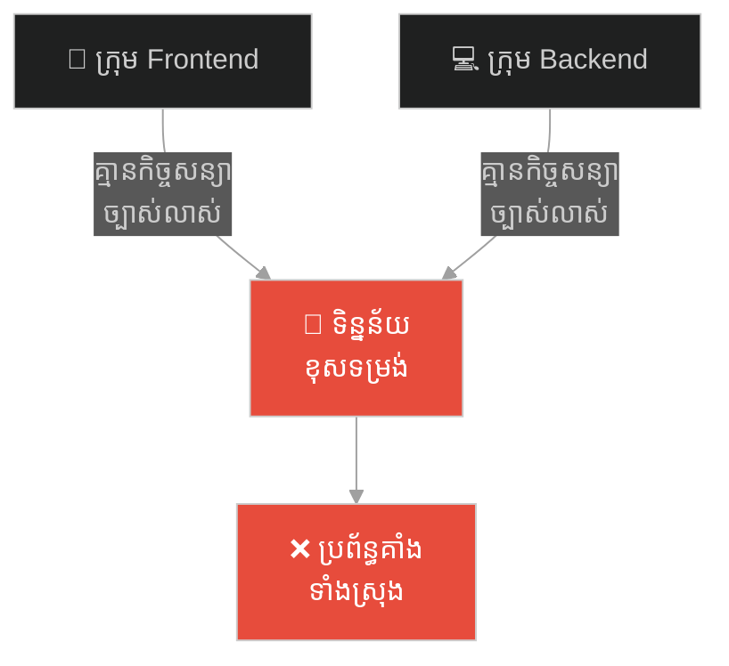
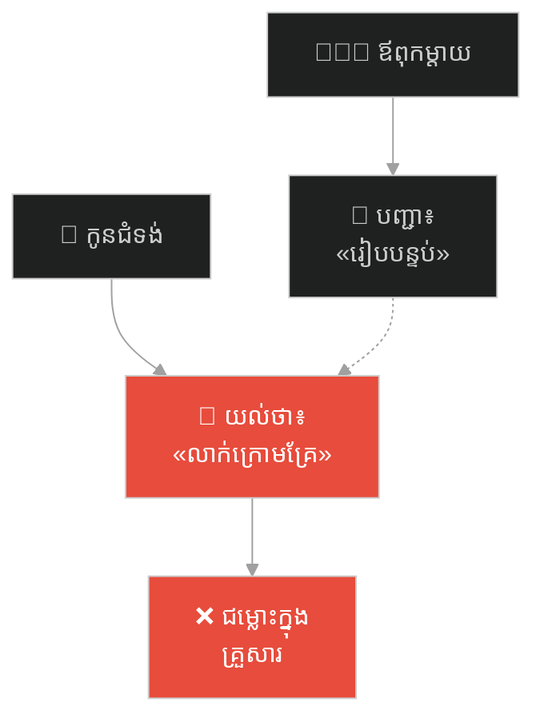
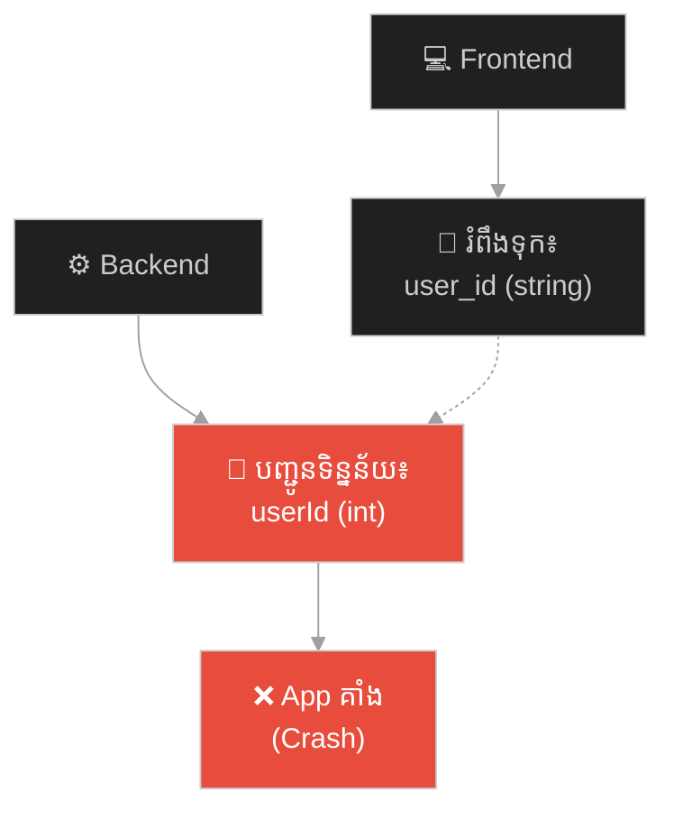
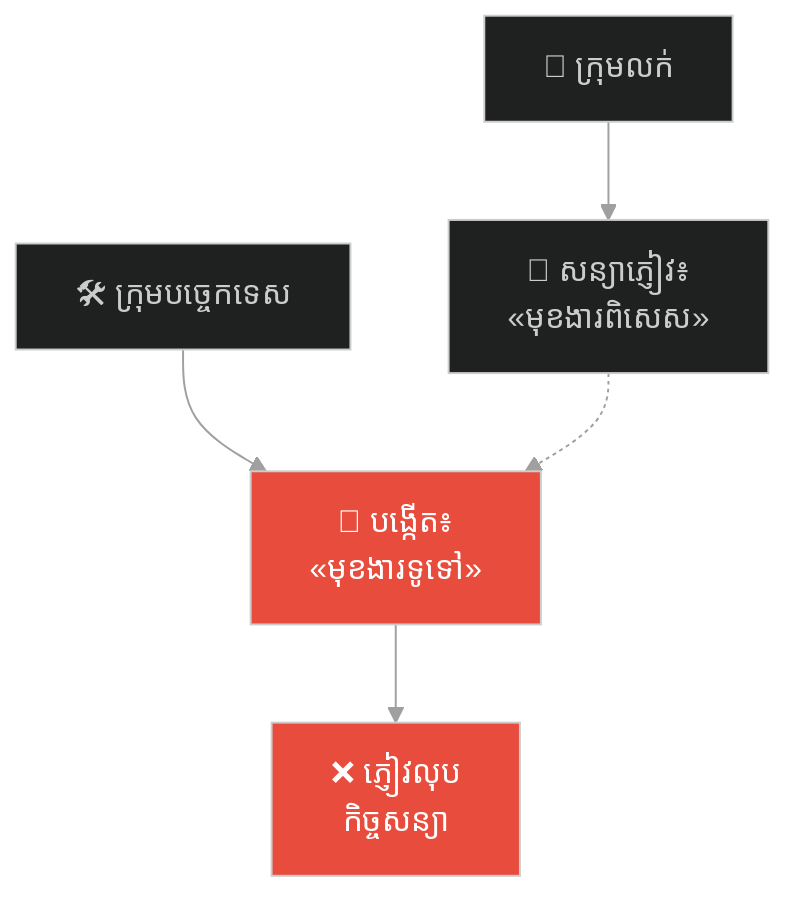
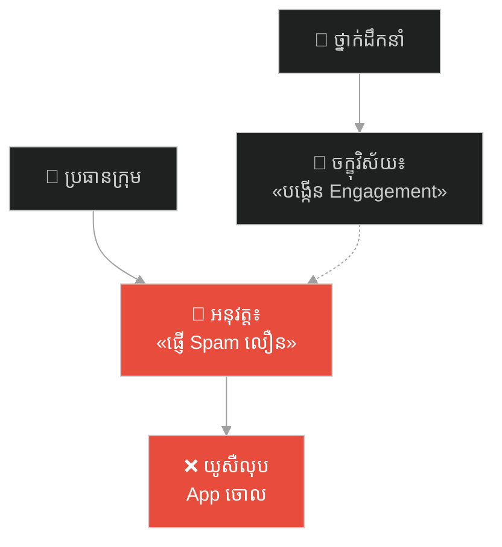
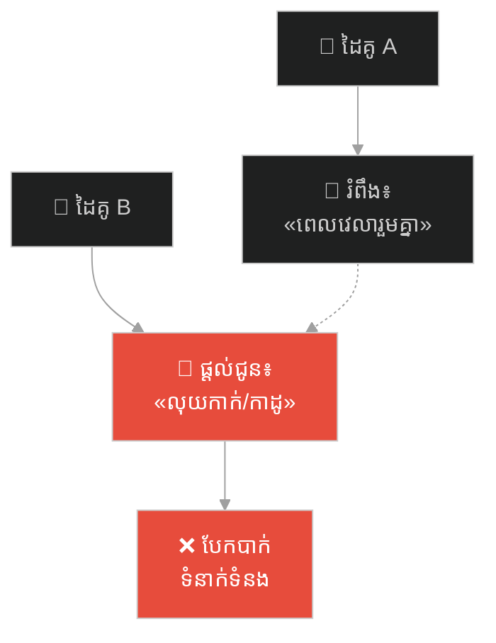
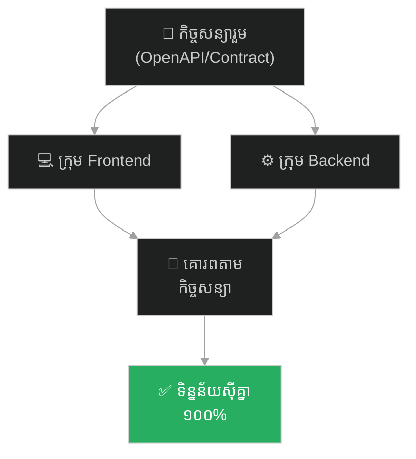

# Conway's Law (ច្បាប់ខនវ៉េ)៖ ប៉មបាបិល និងគ្រោះថ្នាក់នៃការបែកបាក់ទំនាក់ទំនងក្នុងប្រព័ន្ធ

**Author:** ichamrong  
**Date:** 2026-05-27  
**Tags:** #tower-of-babel #communication #api-contracts #conways-law #system-failure #parable  
**Category:** Concepts / Parables  
**Read Time:** ~15 min  

---

## 📌 មាតិកា (Table of Contents)
- [អន្ទាក់ផ្លូវចិត្ត (The Trap)](#0)
- [១. រឿងព្រេងប្រវត្តិសាស្ត្រ៖ ប៉មបាបិល និងការភ័ន្តច្រឡំនៃភាសា (The Legend of the Tower of Babel)](#1)
  - [ការដួលរលំនៃមហាគម្រោងសំណង់ (The Collapse of the Megaproject)](#1-1)
- [២. បញ្ហា៖ ច្បាប់ខនវ៉េ និងការបែកបាក់ប្រព័ន្ធ (The Issue: Conway's Law & Communication Silos)](#2)
- [៣. ឧទាហរណ៍ជាក់ស្តែងក្នុងពិភពពិត (Real World Examples)](#3)
  - [ឧទាហរណ៍ទី ១ — កម្រិតស្រាល (គ្រួសារ)៖ ការនិយាយភាសាខុសគ្នារវាងឪពុកម្តាយ និងកូនជំទង់ (The Family Slang Gap)](#3-1)
  - [ឧទាហរណ៍ទី ២ — កម្រិតមធ្យម (បច្ចេកទេស)៖ ការខ្វះកិច្ចសន្យា API រវាង Frontend និង Backend (The Frontend vs. Backend Mismatch)](#3-2)
  - [ឧទាហរណ៍ទី ៣ — កម្រិតមធ្យម (ធុរកិច្ច)៖ ក្រុមលក់សន្យាខុសពីអ្វីដែលក្រុមបច្ចេកទេសបង្កើត (The Sales vs. Eng Disconnect)](#3-3)
  - [ឧទាហរណ៍ទី ៤ — កម្រិតមធ្យម (សង្គម/គ្រប់គ្រង)៖ ចក្ខុវិស័យរបស់ថ្នាក់ដឹកនាំ និងការអនុវត្តរបស់បុគ្គលិក (The Executive-Manager Gap)](#3-4)
  - [ឧទាហរណ៍ទី ៥ — កម្រិតធ្ងន់ (ទំនាក់ទំនង)៖ ភាសាស្នេហា និងការរំពឹងទុកដែលមិនបាននិយាយចេញ (Unexpressed Love Languages)](#3-5)
- [៤. ដំណោះស្រាយទូទៅ៖ ការបង្កើតកិច្ចសន្យា API និងការទំនាក់ទំនងចំហ (The General Solution: API Contracts & Shared Vocabulary)](#4)
- [សេចក្តីសន្និដ្ឋាន (Conclusion)](#5)
- [ឯកសារយោង (References)](#6)
- [Related Posts](#7)
---

## អន្ទាក់ផ្លូវចិត្ត (The Trap)

តើអ្នកធ្លាប់ឆ្ងល់ទេថា ហេតុអ្វីបានជាគម្រោងដ៏ធំដែលមានថវិកាច្រើន និងមានអ្នកជំនាញពូកែៗចូលរួម បែរជាត្រូវបរាជ័យ និងដួលរលំទៅវិញ ដោយមិនចាំបាច់មានសត្រូវមកបំផ្លាញពីខាងក្រៅ?

នៅក្នុងការគ្រប់គ្រងប្រព័ន្ធ និងស្ថាប័ន៖
* **យើងតែងតែផ្តោតលើការកសាងជំនាញ** ផ្ទាល់ខ្លួនរបស់ក្រុមនីមួយៗ (Silos) ដោយមើលរំលងការបង្កើតយន្តការទំនាក់ទំនងរួម។
* **យើងគិតថា** ដរាបណាគ្រប់គ្នាធ្វើការងាររបស់ខ្លួនបានល្អ នោះលទ្ធផលចុងក្រោយនឹងអាចផ្គុំចូលគ្នាបានយ៉ាងល្អឥតខ្ចោះ។

ប៉ុន្តែនៅក្នុងការពិត កាលណាគ្មានភាសារួម ឬកិច្ចសន្យាច្បាស់លាស់ទេ ភាពវឹកវរនឹងកើតឡើងដោយជៀសមិនរួច។ ទំនោរនៃការដួលរលំដោយសារតែកង្វះទំនាក់ទំនងរួមនេះ ត្រូវបានពន្យល់តាមរយៈច្បាប់វិស្វកម្មដ៏ល្បីល្បាញមួយហៅថា **Conway's Law (ច្បាប់ខនវ៉េ)**។

ដើម្បីយល់ដឹងអំពីឥទ្ធិពល និងវិធីការពារប្រព័ន្ធរបស់អ្នកពីការបែកបាក់ នេះជាផែនទីបង្ហាញផ្លូវសម្រាប់អត្ថបទនេះ៖
1. **រឿងព្រេងប្រវត្តិសាស្ត្រ (The Historic Legend)** — រឿងរ៉ាវនៃប៉មបាបិលដ៏ខ្ពស់កប់ពពក ដែលត្រូវបោះបង់ចោលកណ្តាលទី ព្រោះតែបណ្តាសានៃការភ័ន្តច្រឡំភាសា។
2. **បញ្ហា (The Issue)** — តើអ្វីទៅជាច្បាប់ Conway's Law នៅក្នុងប្រព័ន្ធសំណង់ និងបច្ចេកវិទ្យា?
3. **ឧទាហរណ៍ជាក់ស្តែងក្នុងពិភពពិត (Real World Examples)** — ពិនិត្យមើលការភ័ន្តច្រឡំភាសាក្នុងកម្រិតគ្រួសារ ព័ត៌មានវិទ្យា ធុរកិច្ច ការគ្រប់គ្រង និងទំនាក់ទំនងស្នេហា។
4. **ដំណោះស្រាយទូទៅ (The General Solution)** — ការបង្កើតកិច្ចសន្យា API (Contracts) និងការប្រើប្រាស់ Single Source of Truth។

---

## ១. រឿងព្រេងប្រវត្តិសាស្ត្រ៖ ប៉មបាបិល និងការភ័ន្តច្រឡំនៃភាសា (The Legend of the Tower of Babel)

នៅក្នុងគម្ពីរបុរាណ មានរឿងដំណាលថា នាសម័យដើមដំបូងឡើយ មនុស្សទាំងអស់នៅលើផែនដី និយាយតែ **"ភាសាមួយ"** និងប្រើប្រាស់ពាក្យពេចន៍ដូចគ្នាបេះបិទ។ ដោយសារតែការប្រាស្រ័យទាក់ទងគ្នាបានល្អឥតខ្ចោះ គ្មានឧបសគ្គ ពួកគេបានរួមសហការគ្នាយ៉ាងចុះសម្រុង ដើម្បីធ្វើចំណាកស្រុក និងកសាងទីក្រុងដ៏អស្ចារ្យមួយនៅក្នុងដែនដី ស៊ីណា (Shinar)។

ដោយក្តីអំនួត និងមហិច្ឆតាចង់សាកល្បងដែនកំណត់របស់ខ្លួន ពួកគេបានប្តេជ្ញាថា៖  
> *«ចូរយើងរួមគ្នាសាងសង់ទីក្រុងមួយ និងមហាប៉មមួយ ដែលមានកម្ពស់ខ្ពស់កប់ពពក ឈានទៅដល់ឋានសួគ៌ ដើម្បីបង្ហាញពីភាពអស្ចារ្យ និងកេរ្តិ៍ឈ្មោះរបស់មនុស្សជាតិ កុំឱ្យយើងត្រូវបែកបាក់គ្នាទៅលើផែនដីឡើយ។»*

ការដ្ឋានសំណង់ដ៏មហិមាត្រូវបានបង្កើតឡើង។ ជាងកំបោរលាយស៊ីម៉ងត៍ ជាងឥដ្ឋដុតឥដ្ឋ និងវិស្វករគូរគំនូសប្លង់ ធ្វើការរួមគ្នាយ៉ាងរលូនដូចម៉ាស៊ីនតែមួយ។ ពួកគេយល់ចិត្តគ្នាទៅវិញទៅមកភ្លាមៗនៅពេលបញ្ជាការងារ ព្រោះពួកគេនិយាយភាសាតែមួយ។ មហាប៉មនោះ ក៏ចាប់ផ្តើមខ្ពស់ទៅៗ ឆ្លងកាត់ពពក ហៀបនឹងឈានដល់មេឃ។

---

### ការដួលរលំនៃមហាគម្រោងសំណង់ (The Collapse of the Megaproject)

ដោយទតឃើញពីអំនួតដ៏លោភលន់របស់មនុស្សជាតិ ព្រះជាម្ចាស់មិនបានប្រើរន្ទះបាញ់ ឬបញ្ជូនគ្រោះធម្មជាតិមកកម្ទេចប៉មនោះឡើយ។ ទ្រង់បានប្រើវិធីសាស្ត្រដ៏សាមញ្ញ ប៉ុន្តែមានឥទ្ធិពលបំផុត គឺការទម្លាក់បណ្តាសាឱ្យពួកគេ **"និយាយភាសាខុសៗគ្នា (The Confusion of Tongues)"** ដើម្បីកុំឱ្យពួកគេស្តាប់គ្នាបានទៀត។

ស្រាប់តែព្រឹកមួយ ភាពចលាចលបានផ្ទុះឡើងទូទាំងការដ្ឋានសំណង់៖
* មេការសំណង់ស្រែកសុំ **"ឥដ្ឋ"** ប៉ុន្តែកម្មករបែរជាស្តាប់មិនបាន ហើយរត់ទៅយួរ **"ទឹក"** មកឱ្យជំនួសវិញ។
* ជាងប្លង់ការពន្យល់ពីទម្រង់គ្រឹះ ប៉ុន្តែជាងឥដ្ឋស្តាប់លឺត្រឹមតែសម្លេងរញ៉េរញ៉ៃគ្មានន័យ។
* គ្មាននរណាម្នាក់អាចស្តាប់គ្នាបានទៀតទេ គ្រប់គ្នាមានការភាន់ច្រឡំ ធុញថប់ និងសង្ស័យលើគ្នាទៅវិញទៅមក។

ការមិនយល់ភាសាគ្នា បានប្រែក្លាយទៅជាការឈ្លោះប្រកែក ការបន្ទោស និងការបាត់បង់ទំនុកចិត្តទាំងស្រុង។ ការងារសំណង់ត្រូវគាំងទាំងស្រុង។ ទីបំផុត មហាគម្រោងប៉មបាបិល ត្រូវបានបោះបង់ចោលកណ្តាលទី។ មនុស្សជាតិបានបែកបាក់គ្នា ហើយធ្វើចំណាកស្រុកទៅតាមក្រុមរៀងៗខ្លួន។ ប៉មដ៏អស្ចារ្យ ក៏ក្លាយជាគំនរបាក់បែក ដោយសារតែ **"ការបរាជ័យក្នុងការប្រាស្រ័យទាក់ទង"** ប៉ុណ្ណោះ។

---

## ២. បញ្ហា៖ ច្បាប់ខនវ៉េ និងការបែកបាក់ប្រព័ន្ធ (The Issue: Conway's Law & Communication Silos)

នៅក្នុងឆ្នាំ ១៩៦៧ វិស្វករកុំព្យូទ័រឈ្មោះ **Melvin Conway** បានបង្កើតទ្រឹស្តីមួយដែលត្រូវបានគេស្គាល់ថា **Conway's Law (ច្បាប់ខនវ៉េ)**៖

> **«រចនាសម្ព័ន្ធនៃប្រព័ន្ធបច្ចេកវិទ្យា ឬកម្មវិធី ដែលបង្កើតឡើងដោយស្ថាប័នណាមួយ នឹងចម្លងតាមរចនាសម្ព័ន្ធទំនាក់ទំនងផ្ទៃក្នុងរបស់ស្ថាប័ននោះ។»**

និយាយឱ្យសាមញ្ញ៖
* បើក្រុមការងាររបស់អ្នកបែកបាក់គ្នាជា ៣ ក្រុម និងមិនសូវជជែកគ្នា (Silos) នោះកម្មវិធីរបស់អ្នកនឹងមាន Module ៣ ផ្សេងគ្នា ដែលពិបាកតភ្ជាប់គ្នា និងឧស្សាហ៍ជួបបញ្ហាស៊ីគ្នានៅពេលដាក់ដំណើរការ (Integration Issues)។
* ប្រសិនបើ Frontend និង Backend មិនមានភាសារួម ឬកិច្ចសន្យាទិន្នន័យ (API Contract) ទេ នោះប្រព័ន្ធនឹងចាប់ផ្តើមគាំងភ្លាមៗនៅពេលទំនាក់ទំនងគ្នា ដូចកម្មករសំណង់ប៉មបាបិលដែរ។

---

## ៣. ឧទាហរណ៍ជាក់ស្តែងក្នុងពិភពពិត

ដើម្បីយល់ដឹងឱ្យកាន់តែស៊ីជម្រៅ ផ្លូវការសិក្សានឹងនាំអ្នកទៅពិនិត្យមើល **ឧទាហរណ៍ចំនួន ៥ កម្រិតខុសៗគ្នា** ក្នុងជីវិតរស់នៅប្រចាំថ្ងៃ៖

---

### ឧទាហរណ៍ទី ១ — កម្រិតស្រាល (គ្រួសារ)៖ ការនិយាយភាសាខុសគ្នារវាងឪពុកម្តាយ និងកូនជំទង់ (The Family Slang Gap)

**ស្ថានភាព៖** ឪពុកម្តាយព្យាយាមណែនាំ និងបញ្ជាកូនប្រុសជំទង់ឱ្យរៀបចំជីវិត ប៉ុន្តែប្រើប្រាស់ភាសានិងផ្នត់គំនិតខុសគ្នាទាំងស្រុង។

* **ភាគី A (ឪពុកម្តាយ)៖** ប្រើភាសាបុរាណ៖ *«កូនត្រូវតែប្រឹងរៀនដើម្បីបានការងាររដ្ឋ ធ្វើជាមន្ត្រីទើបមានកិត្តិយស (Security)»*។ សម្រាប់ពួកគាត់ ពាក្យថា «ជោគជ័យ» គឺស្ថិរភាព។
* **ភាគី B (កូនប្រុសជំទង់)៖** យល់ឃើញបែបសម័យថ្មី និងចង់ធ្វើជា Content Creator ឬជំនាញបច្ចេកវិទ្យា។ គាត់ស្តាប់ពាក្យឪពុកម្តាយលឺជា «ការដាក់គំនាប និងការគ្រប់គ្រងសេរីភាព»។

**ការពិតដ៏ជូរចត់៖**  
ការខ្វះភាសានិងនិយមន័យរួមនៃការអភិវឌ្ឍខ្លួន ធ្វើឱ្យបំណងល្អរបស់ឪពុកម្តាយ ក្លាយជាសម្ពាធផ្លូវចិត្តរបស់កូន។ កូនចាប់ផ្តើមដកខ្លួនចេញឆ្ងាយ និងឈប់ពិភាក្សារឿងអនាគតជាមួយគ្រួសារ ព្រោះ «និយាយស្តាប់គ្នាគ្នាមិនយល់»។

**ដំណោះស្រាយ៖**  
ឪពុកម្តាយត្រូវបង្កើត «វចនានុក្រមរួម» ជាមួយកូន។ សាកសួរពីជម្រើសរបស់កូន និងព្យាយាមស្វែងយល់ពីពិភពលោកថ្មីរបស់ពួកគេ ជំនួសឱ្យការបង្ខំឱ្យប្រើភាសាចាស់របស់ខ្លួន។

---

### ឧទាហរណ៍ទី ២ — កម្រិតមធ្យម (បច្ចេកទេស)៖ ការខ្វះកិច្ចសន្យា API រវាង Frontend និង Backend (The Frontend vs. Backend Mismatch)

**ស្ថានភាព៖** ក្រុមហ៊ុនចង់បញ្ចេញ Feature ថ្មីសម្រាប់ទូទាត់ប្រាក់លឿន (Checkout Feature)។

* **ភាគី A (Backend Dev)៖** ប្តូរទម្រង់ទិន្នន័យ (Payload Format) ពី `userId` (CamelCase) ទៅជា `user_id` (snake_case) ក្នុង API ព្រោះយល់ថាកូដចាស់មិនស្អាត។ ប៉ុន្តែមិនបានប្រាប់ Frontend ឡើយ។
* **ភាគី B (Frontend Dev)៖** អាន API ដោយនៅតែប្រើប្រាស់ `userId` ដដែល ព្រោះគ្មានឯកសារ API Contract រួម (ដូចជា Swagger)។

**ការពិតដ៏ជូរចត់៖**  
នៅពេលបញ្ចេញកម្មវិធីទៅកាន់ទីផ្សារ (Deploy) ប្រព័ន្ធបង់ប្រាក់របស់អតិថិជនគាំងទាំងស្រុង (Crash)។ ពួកគេឈ្លោះប្រកែក និងបន្ទោសគ្នាទៅវិញទៅមក ព្រោះខ្វះកិច្ចព្រមព្រៀងរួម។

**ដំណោះស្រាយ៖**  
ប្រើប្រាស់យន្តការ **API-First Development**។ កំណត់ឯកសារ Schema (OpenAPI/Swagger) ជាមុនសិន រួចទើបអនុញ្ញាតឱ្យក្រុមទាំងពីរចាប់ផ្តើមសរសេរកូដរៀងៗខ្លួន។

---

### ឧទាហរណ៍ទី ៣ — កម្រិតមធ្យម (ធុរកិច្ច)៖ ក្រុមលក់សន្យាខុសពីអ្វីដែលក្រុមបច្ចេកទេសបង្កើត (The Sales vs. Eng Disconnect)

**ស្ថានភាព៖** ក្រុមលក់ (Sales) ព្យាយាមស្វែងរកម៉ូយធំៗ រីឯក្រុមបច្ចេកទេស (Engineering) ផ្តោតលើការកែសម្រួលហេដ្ឋារចនាសម្ព័ន្ធឱ្យមានស្ថិរភាព។

* **ភាគី A (Sales Team)៖** ក្នុងកិច្ចប្រជុំជាមួយអតិថិជន បានសន្យាថា៖ *«ប្រព័ន្ធយើងអាចកែសម្រួល UI តាមចិត្តភ្ញៀវបាន ១០០% និងអាចបញ្ចេញមុខងារនេះបានក្នុងរយៈពេល ២ សប្តាហ៍!»*
* **ភាគី B (Engineering Team)៖** កំពុងរវល់រៀបចំ Core Architecture ដែលមិនអាចអនុញ្ញាតឱ្យមាន Custom UI ផ្តេសផ្តាសឡើយ ព្រោះខ្លាចខូច System Security។

**ការពិតដ៏ជូរចត់៖**  
នៅពេលចុះកិច្ចសន្យា ភ្ញៀវមិនទទួលបានមុខងារដែលខ្លួនចង់បាន រីឯវិស្វករស្រ្តេសខ្លាំងរហូតដល់លាឈប់ ព្រោះរងគំនាបការងារដែលមិនអាចធ្វើទៅរួច។ ក្រុមហ៊ុនត្រូវបាត់បង់អតិថិជន និងបាត់បង់បុគ្គលិកឆ្នើម។

**ដំណោះស្រាយ៖**  
រាល់ពេលដែលក្រុមលក់ចង់សន្យាអ្វីមួយជាមួយអតិថិជន ត្រូវតែមានការចូលរួមពីប្រធានក្រុមបច្ចេកទេស (Tech Lead) ដើម្បីវាយតម្លៃលទ្ធភាពជាក់ស្តែង និងកត់ត្រាកិច្ចសន្យាការងាររួមគ្នា។

---

### ឧទាហរណ៍ទី ៤ — កម្រិតមធ្យម (សង្គម/គ្រប់គ្រង)៖ ចក្ខុវិស័យរបស់ថ្នាក់ដឹកនាំ និងការអនុវត្តរបស់បុគ្គលិក (The Executive-Manager Gap)

**ស្ថានភាព៖** នាយកប្រតិបត្តិ (CEO) ចង់ឱ្យក្រុមហ៊ុនទទួលបានការគាំទ្រពីសហគមន៍ រីឯប្រធានក្រុម (Managers) ផ្តោតលើតួលេខលក់។

* **ភាគី A (CEO)៖** ប្រកាសចក្ខុវិស័យ៖ *«យើងត្រូវផ្តោតលើ Customer Satisfaction និងការដោះស្រាយបញ្ហាពិតប្រាកដរបស់យូសឺ!»*
* **ភាគី B (Managers)៖** ត្រូវវាយតម្លៃការងារលើ KPI «ចំនួនការលក់ និងប្រាក់ចំណូល»។ ពួកគេក៏បង្ខំបុគ្គលិកឱ្យប្រើវិធីល្បិចគាបសង្កត់យូសឺឱ្យទិញកញ្ចប់សេវាកម្ម (Dark Patterns)។

**ការពិតដ៏ជូរចត់៖**  
ចក្ខុវិស័យរបស់ CEO ក្លាយជាការផ្សាយពាណិជ្ជកម្មកុហក។ យូសឺមានអារម្មណ៍ថាត្រូវគេបោកប្រាស់ កេរ្តិ៍ឈ្មោះក្រុមហ៊ុនធ្លាក់ចុះយ៉ាងខ្លាំង ព្រោះសកម្មភាពជាក់ស្តែង និងគោលការណ៍មិនស៊ីគ្នា។

**ដំណោះស្រាយ៖**  
តម្រឹមយន្តការវាស់វែងផលការងារ (KPIs/OKRs) ឱ្យស្របទៅនឹងចក្ខុវិស័យ។ បើចង់បាន Customer Satisfaction ត្រូវតែមានការស្ទង់មតិវាស់វែងលើចំណុចនេះ មិនមែនវាស់វែងតែលើចំណូលនោះទេ។

---

### ឧទាហរណ៍ទី ៥ — កម្រិតធ្ងន់ (ទំនាក់ទំនង)៖ ភាសាស្នេហា និងការរំពឹងទុកដែលមិនបាននិយាយចេញ (Unexpressed Love Languages)

**ស្ថានភាព៖** ប្តីប្រពន្ធពីរនាក់ស្រឡាញ់គ្នាខ្លាំង ប៉ុន្តែចាប់ផ្តើមមានភាពរកាំរកូសរហូតដល់ចង់លែងលះ ព្រោះមិនដែលជជែកពីតម្រូវការផ្លូវចិត្តពិតប្រាកដ។

* **ភាគី A (ប្តី)៖** គិតថាការបង្ហាញស្នេហា គឺការខំធ្វើការរកលុយទិញឡាន ទិញផ្ទះ (Acts of Service/Gifts)។ គាត់រវល់រហូតដល់គ្មានពេលញ៉ាំបាយជុំគ្នា។
* **ភាគី B (ប្រពន្ធ)៖** ត្រូវការការលួងលោម ពាក្យសរសើរ និងការដើរលេងរួមគ្នា (Quality Time/Words of Affirmation)។ នាងមានអារម្មណ៍ឯកោ និងគិតថាប្តីលែងខ្វល់ពីខ្លួន។

**ការពិតដ៏ជូរចត់៖**  
ដោយសារគ្មានការជជែក និងកិច្ចព្រមព្រៀងរួម ពួកគេទាំងពីរម្នាក់ៗប្រឹងប្រែងតាមរបៀបរៀងៗខ្លួន ប៉ុន្តែទទួលបានលទ្ធផលគឺភាពខកចិត្ត និងអារម្មណ៍បែកបាក់។ ពួកគេប្រៀបដូចជាកម្មករសាងសង់ប៉មបាបិលពីរនាក់ ដែលនិយាយភាសាខុសគ្នា។

**ដំណោះស្រាយ៖**  
ជជែកគ្នាដោយចំហអំពី **Love Languages** របស់ដៃគូនីមួយៗ។ ឈប់ស្មានតម្រូវការរបស់ដៃគូ ចូរចាប់ផ្តើមសាកសួរ និងកត់សម្គាល់ឱ្យបានច្បាស់លាស់។

---

## ៤. ដំណោះស្រាយទូទៅ៖ ការបង្កើតកិច្ចសន្យា API និងការទំនាក់ទំនងចំហ (The General Solution: API Contracts & Shared Vocabulary)

ដើម្បីការពារកុំឱ្យ "ប៉ម" ឬគម្រោងរបស់អ្នកដួលរលំកណ្តាលទីដោយសារបណ្តាសានៃការភាន់ច្រឡំភាសា ត្រូវអនុវត្តយុទ្ធសាស្ត្រគន្លឹះទាំងនេះ៖

### ១. អនុវត្តយុទ្ធសាស្ត្រ API-First & Ubiquitous Language

* **នៅក្នុងវិស្វកម្ម៖** កំណត់ទម្រង់ទិន្នន័យ (API Contract/Schema) ឱ្យបានច្បាស់លាស់មុនពេលចាប់ផ្តើមសរសេរកូដ។ ប្រើប្រាស់ឧបករណ៍ដូចជា Swagger, Protocol Buffers ដើម្បីរក្សា Single Source of Truth។
* **នៅក្នុងការគ្រប់គ្រង៖** បង្កើតវចនានុក្រមរួម (Ubiquitous Language)។ រាល់និយមន័យដូចជា «គម្រោងជោគជ័យ» ឬ «Done» ត្រូវតែមានការយល់ឃើញដូចគ្នា ១០០% ទូទាំងក្រុម។

### ២. បំបែករនាំងរវាងក្រុម (Break Down Communication Silos)

* ជំរុញការជួបជុំគ្នាជាប្រចាំរវាងក្រុមខុសគ្នា (Cross-functional team meetings)។ 
* អនុញ្ញាតឱ្យសមាជិកក្រុមលក់ និងក្រុមបច្ចេកទេសអង្គុយធ្វើការងារក្បែរគ្នា ដើម្បីបង្កើនការយល់ចិត្ត និងកាត់បន្ថយគម្លាតនៃការយល់ឃើញ។

### ៣. បង្កើតយន្តការស្ទង់មតិ និងស្វែងរកចំណុចខុសគ្នា (Continuous Alignment)

* កុំរង់ចាំដល់ថ្ងៃដាក់ដំណើរការទើបដឹងថាប្រព័ន្ធមិនស៊ីគ្នា។ ត្រូវធ្វើការសាកល្បងផ្គុំប្រព័ន្ធជាប្រចាំ (Continuous Integration - CI) ដើម្បីស្វែងរកកំហុសឆ្គងទំនាក់ទំនងឱ្យបានលឿនបំផុត។

---

## 🐇 ធ្លាក់ចូលក្នុងរន្ធទន្សាយ (Enter the Rabbit Hole)

ដើម្បីស្វែងយល់បន្ថែមអំពីរបៀបការពារប្រព័ន្ធពីការដួលរលំ ដោយសារតែកង្វះការគ្រប់គ្រងហានិភ័យ និងការខ្វះការត្រៀមបម្រុងចំពោះចំណុចខ្សោយតែមួយ (Single Point of Failure) សូមបន្តដំណើរទៅកាន់ Parable បន្ទាប់៖

* 🚀 **[ចាប់ផ្តើមដំណើររុករក (Start the Journey) ➔ The Burning of Alexandria](./42-the-burning-of-alexandria.md)**

---

## សេចក្តីសន្និដ្ឋាន (Conclusion)

> **«កម្លាំងសហការដ៏អស្ចារ្យបំផុត មិនមែនកើតឡើងដោយសារតែកម្មករម្នាក់ៗមានកម្លាំងខ្លាំង ឬឥដ្ឋនីមួយៗមានគុណភាពខ្ពស់នោះឡើយ។ ប៉ុន្តែវាសម្រេចទៅបានដោយសារតែពួកគេទាំងអស់គ្នាមានសមត្ថភាពនិយាយភាសាតែមួយ និងយល់ពីគ្នាទៅវិញទៅមកយ៉ាងល្អឥតខ្ចោះ។»**

ប៉មបាបិលមិនបានដួលរលំដោយសារតែកង្វះឥដ្ឋ ឬកង្វះថវិកានោះទេ។ វាបានក្លាយជាគំនរផេះផង់ ព្រោះតែមនុស្សឈប់យល់គ្នា។ ចូរចំណាយពេលសាងសង់ "កិច្ចសន្យាទំនាក់ទំនង" ឱ្យបានរឹងមាំ មុននឹងចាប់ផ្តើមសាងសង់ "ប៉ម" របស់អ្នក។

---

## ឯកសារយោង (References)

* **Melvin Conway** — *How Do Committees Invent?* (1968)។ អត្ថបទវិទ្យាសាស្ត្រស្នូលដែលបង្ហាញពីច្បាប់ Conway's Law ក្នុងការរចនាប្រព័ន្ធ។
* **Bible (Genesis 11:1–9)** — *The Tower of Babel Story* (Ancient Hebrew Text)។ រឿងព្រេងប្រវត្តិសាស្ត្រនៃការបែកបាក់ភាសារបស់មនុស្សជាតិ។
* **Martin Fowler** — *Patterns of Enterprise Application Architecture* (2002)។ ការពន្យល់ពីសារៈសំខាន់នៃ Integration Contracts ក្នុងប្រព័ន្ធធំៗ។

---

## Related Posts

* **[33 The Tower of Babel and API Contracts](../articles/33-the-tower-of-babel-and-api-contracts.md)** — អត្ថបទបកស្រាយលម្អិតពីសារៈសំខាន់នៃ API Contract នៅក្នុងស្ថាបត្យកម្ម Microservices។
* **[23 The Master Navigator and the Hidden Star Chart](./23-the-master-navigator-and-the-hidden-star-chart.md)** — ភាពចាំបាច់នៃការមានឯកសារកណ្តាល (Documentation) ដើម្បីចងក្រងក្រុម។
* **[01 Projection Effect](./01-projection-effect.md)** — គ្រោះថ្នាក់នៃការយកគំនិតខ្លួនឯងទៅសន្មតលើតម្រូវការអ្នកដទៃ។

---
*Last updated: 2026-05-27*

## Related

- [💡 Concepts README](../README.md)
- [📚 Main Repository README](../../../README.md)
- [Developer Habits](../../developer-habits/README.md)
- [Mental Health & Well-being](../../mental-health/README.md)
- [Management & SDLC](../../management/README.md)
