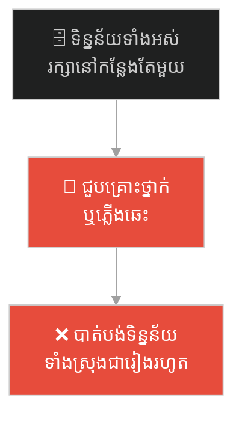
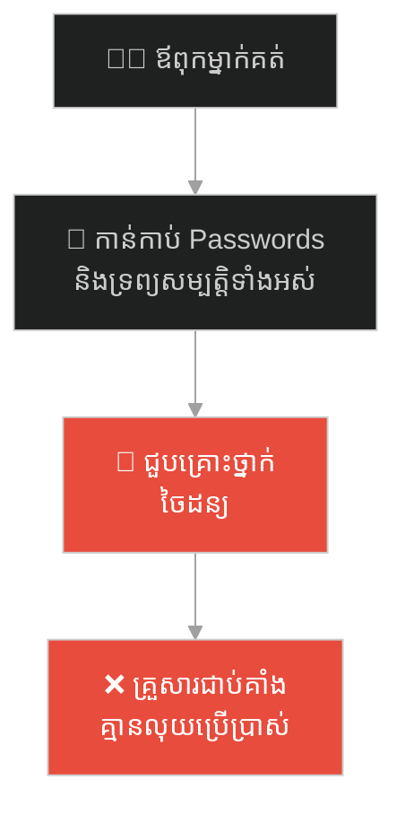
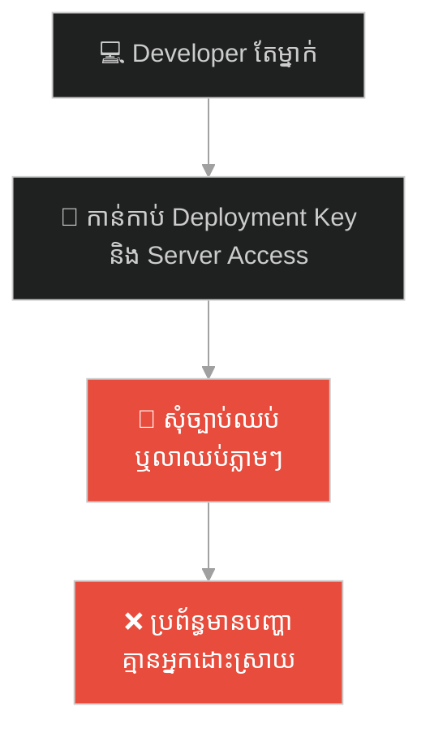
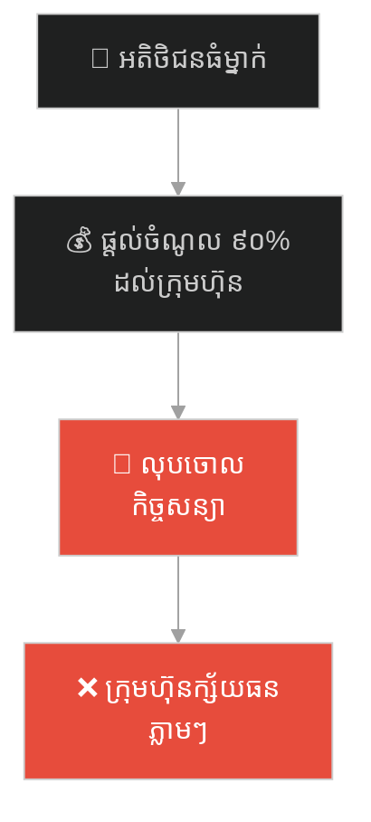
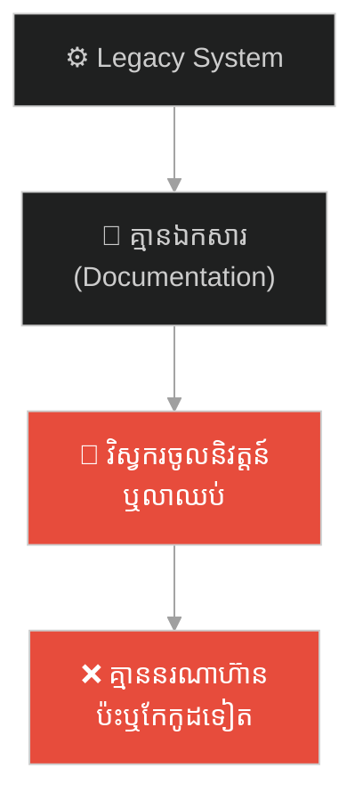
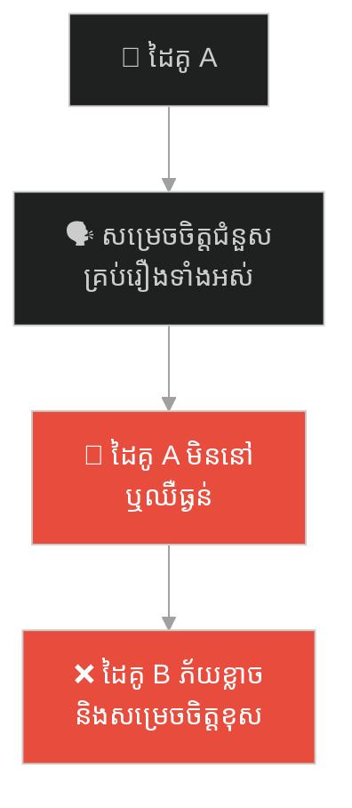
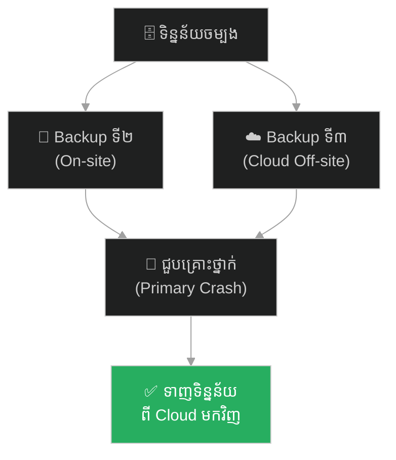

# Single Point of Failure (ចំណុចខ្សោយតែមួយ)៖ មហាបណ្ណាល័យអាឡិចសាន់ឌ្រី និងគ្រោះថ្នាក់នៃការប្រមូលផ្តុំហានិភ័យ

**Author:** ichamrong  
**Date:** 2026-05-27  
**Tags:** #alexandria #history #disaster #backup #single-point-of-failure #spof  
**Category:** Concepts / Parables  
**Read Time:** ~15 min  

---

## 📌 មាតិកា (Table of Contents)
- [អន្ទាក់ផ្លូវចិត្ត (The Trap)](#0)
- [១. រឿងព្រេងប្រវត្តិសាស្ត្រ៖ មហាបណ្ណាល័យអាឡិចសាន់ឌ្រី និងអគ្គិភ័យ (The Great Library of Alexandria)](#1)
  - [ចំណុចខ្សោយដ៏សាហាវ និងអគ្គិភ័យរបស់សេសារ (The Fatal Flaw & Caesar's Fire)](#1-1)
- [២. បញ្ហា៖ ចំណុចខ្សោយតែមួយ និងការប្រមូលផ្តុំហានិភ័យ (The Issue: Single Point of Failure)](#2)
- [៣. ឧទាហរណ៍ជាក់ស្តែងក្នុងពិភពពិត (Real World Examples)](#3)
  - [ឧទាហរណ៍ទី ១ — កម្រិតស្រាល (គ្រួសារ)៖ សមាជិកតែម្នាក់កាន់កាប់លេខសម្ងាត់ហិរញ្ញវត្ថុទាំងអស់ (The Family Vault Holder)](#3-1)
  - [ឧទាហរណ៍ទី ២ — កម្រិតមធ្យម (បច្ចេកទេស)៖ វិស្វករតែម្នាក់កាន់សោរប្រព័ន្ធ ឬ "Bus Factor of 1" (The Sole Keyholder Dev)](#3-2)
  - [ឧទាហរណ៍ទី ៣ — កម្រិតមធ្យម (ធុរកិច្ច)៖ ការពឹងផ្អែកលើអតិថិជនធំតែមួយគត់ (The Single Client Dependency)](#3-3)
  - [ឧទាហរណ៍ទី ៤ — កម្រិតមធ្យម (សង្គម/គ្រប់គ្រង)៖ កូដចាស់គ្មានឯកសារណែនាំ និងគ្មានអ្នកបន្តវេន (The Legacy Code Silo)](#3-4)
  - [ឧទាហរណ៍ទី ៥ — កម្រិតធ្ងន់ (ទំនាក់ទំនង)៖ ការពឹងផ្អែកទាំងស្រុងលើដៃគូជីវិតក្នុងការសម្រេចចិត្ត (The Decision Co-dependency)](#3-5)
- [៤. ដំណោះស្រាយទូទៅ៖ ច្បាប់ ៣-២-១ និងយុទ្ធសាស្ត្រចែកចាយការទទួលខុសត្រូវ (The General Solution: 3-2-1 Rule & De-centralization)](#4)
- [សេចក្តីសន្និដ្ឋាន (Conclusion)](#5)
- [ឯកសារយោង (References)](#6)
- [Related Posts](#7)
---

## អន្ទាក់ផ្លូវចិត្ត (The Trap)

តើអ្នកធ្លាប់មានអារម្មណ៍ថា ប្រព័ន្ធ ឬជីវិតរបស់អ្នកដំណើរការទៅយ៉ាងល្អឥតខ្ចោះ ប៉ុន្តែស្រាប់តែដួលរលំទាំងស្រុងក្នុងរយៈពេលត្រឹមតែប៉ុន្មាននាទី ព្រោះតែការបាត់បង់មនុស្សតែម្នាក់ ឬម៉ាស៊ីនតែមួយគ្រឿងដែរឬទេ?

នៅក្នុងការរចនាប្រព័ន្ធ និងការគ្រប់គ្រង៖
* **យើងតែងតែមានមោទនភាព** លើភាពងាយស្រួលនៃការប្រមូលផ្តុំទិន្នន័យ ឬអំណាចសម្រេចចិត្តនៅកន្លែងតែមួយ (Centralization) ដើម្បីភាពលឿន។
* **យើងមើលរំលង** ហានិភ័យដ៏ធំដែលថា បើកន្លែងតែមួយនោះរងការខូចខាត គ្រប់យ៉ាងនឹងត្រូវបំផ្លាញទៅជាមួយគ្នា។

ការមិនរៀបចំប្រព័ន្ធការពារ ឬគ្មានគម្រោងបម្រុងសម្រាប់ចំណុចខ្សោយស្នូលនេះ ហៅថា **Single Point of Failure (SPOF - ចំណុចខ្សោយតែមួយ)**។

ដើម្បីយល់ដឹងពីគ្រោះថ្នាក់នេះ និងរបៀបការពារប្រព័ន្ធរបស់អ្នក នេះជាផែនទីបង្ហាញផ្លូវសម្រាប់អត្ថបទនេះ៖
1. **រឿងព្រេងប្រវត្តិសាស្ត្រ (The Historic Legend)** — រឿងរ៉ាវរបស់មហាបណ្ណាល័យអាឡិចសាន់ឌ្រី ដែលផ្ទុកចំណេះដឹងទាំងអស់របស់មនុស្សជាតិ ប៉ុន្តែត្រូវឆេះសូន្យក្នុងរយៈពេលតែមួយយប់។
2. **បញ្ហា (The Issue)** — តើអ្វីទៅជា Single Point of Failure (SPOF) ក្នុងវិស្វកម្ម និងការគ្រប់គ្រង?
3. **ឧទាហរណ៍ជាក់ស្តែងក្នុងពិភពពិត (Real World Examples)** — ពិនិត្យមើល SPOF ក្នុងកម្រិតគ្រួសារ ព័ត៌មានវិទ្យា ធុរកិច្ច ការគ្រប់គ្រង និងទំនាក់ទំនងស្នេហា។
4. **ដំណោះស្រាយទូទៅ (The General Solution)** — ការអនុវត្តច្បាប់ ៣-២-១ (3-2-1 Backup Rule) និងការចែកចាយអំណាច/ទិន្នន័យ (Redundancy)។

---

## ១. រឿងព្រេងប្រវត្តិសាស្ត្រ៖ មហាបណ្ណាល័យអាឡិចសាន់ឌ្រី និងអគ្គិភ័យ (The Great Library of Alexandria)

កាលពីជាង ២,០០០ ឆ្នាំមុន ទីក្រុងអាឡិចសាន់ឌ្រី (Alexandria) ក្នុងប្រទេសអេហ្ស៊ីប គឺជាបេះដូងនៃចំណេះដឹង និងវប្បធម៌របស់ពិភពលោកបុរាណ។ ព្រះរាជានៃរាជវង្សប៉តូលេមី (Ptolemaic Dynasty) មានមហិច្ឆតាដ៏ធំមួយ គឺចង់ប្រមូលផ្តុំគម្ពីរ គំនូរ និងឯកសារចំណេះដឹងទាំងអស់នៅលើផែនដី យកមករក្សាទុកនៅកន្លែងតែមួយ នោះគឺ **មហាបណ្ណាល័យអាឡិចសាន់ឌ្រី (The Great Library of Alexandria)**។

ដើម្បីសម្រេចមហិច្ឆតានេះ រាជការបានចេញច្បាប់តឹងរ៉ឹងមួយ៖ *រាល់កប៉ាល់ទាំងអស់ដែលចូលចតនៅកំពង់ផែទីក្រុង ត្រូវតែប្រគល់សៀវភៅ ឬឯកសារទាំងអស់ដែលខ្លួនមាន ទៅឱ្យបណ្ណាល័យដើម្បីថតចម្លង។* ពេលខ្លះ បណ្ណាល័យរក្សាទុកច្បាប់ដើម រួចហុចច្បាប់ចម្លងទៅឱ្យម្ចាស់កប៉ាល់វិញ។

មិនយូរប៉ុន្មាន បណ្ណាល័យនេះបានក្លាយជា "មជ្ឈមណ្ឌលទិន្នន័យ (Data Center)" ដ៏ធំបំផុតរបស់មនុស្សជាតិ ដោយផ្ទុកឯកសារ (Scrolls) ជាងកន្លះលានច្បាប់ ដែលរួមមានទ្រឹស្តីគណិតវិទ្យារបស់អឺឃ្លីដ តារាសាស្ត្រ វេជ្ជសាស្ត្រ ប្រវត្តិសាស្ត្រ និងទស្សនវិជ្ជា។

---

### ចំណុចខ្សោយដ៏សាហាវ និងអគ្គិភ័យរបស់សេសារ (The Fatal Flaw & Caesar's Fire)

ទោះបីជាបណ្ណាល័យនេះអស្ចារ្យយ៉ាងណាក៏ដោយ ក៏វាមានចំណុចខ្សោយផ្នែកស្ថាបត្យកម្ម (Architectural Flaw) ដ៏ធ្ងន់ធ្ងរបំផុត៖ **ចំណេះដឹងទាំងអស់មិនត្រូវបានថតចម្លងយកទៅចែកចាយរក្សាទុកនៅក្រុងផ្សេងៗឡើយ។ វាត្រូវបានប្រមូលផ្តុំនៅក្នុងអាគារតែមួយគត់។**

នៅឆ្នាំ ៤៨ មុនគ្រិស្តសករាជ មេទ័ពរ៉ូម៉ាំងដ៏ល្បីល្បាញ **យូលីសេស សេសារ (Julius Caesar)** បានជាប់គាំងនៅក្នុងសង្គ្រាមស៊ីវិលកណ្តាលកំពង់ផែក្រុងអាឡិចសាន់ឌ្រី។ ដើម្បីការពារកងទ័ពខ្លួន សេសារបានបញ្ជាឱ្យដុតកប៉ាល់របស់សត្រូវចោល។ 

ជាអកុសល ខ្យល់សមុទ្របានបក់បោកយ៉ាងខ្លាំង នាំយកផ្កាភ្លើងពីកប៉ាល់ ហោះទៅឆេះរាលដាលដល់ឃ្លាំងនៅតាមមាត់សមុទ្រ ហើយចុងក្រោយ ភ្លើងក៏បានឆាបឆេះដល់មហាបណ្ណាល័យអាឡិចសាន់ឌ្រី។ 

ក្នុងរយៈពេលត្រឹមតែប៉ុន្មានម៉ោង ឯកសារច្បាប់ដើមដ៏មានតម្លៃរាប់សែនច្បាប់ ដែលប្រមូលផ្តុំរាប់រយឆ្នាំ ត្រូវបានឆេះក្លាយជាផេះផង់។ ចំណេះដឹងវិទ្យាសាស្ត្រ និងអារ្យធម៌ជាច្រើនត្រូវបានលុបបាត់ពីរលោកនេះជារៀងរហូត។ អ្នកប្រវត្តិសាស្ត្រជឿថា ប្រសិនបើបណ្ណាល័យនេះមិនឆេះទេ បច្ចេកវិទ្យារបស់មនុស្សជាតិអាចនឹងជឿនលឿនលឿនជាងសព្វថ្ងៃនេះរាប់រយឆ្នាំ។

---

## ២. បញ្ហា៖ ចំណុចខ្សោយតែមួយ និងការប្រមូលផ្តុំហានិភ័យ (The Issue: Single Point of Failure)

រឿងព្រេងនេះ ឆ្លុះបញ្ចាំងពីគោលការណ៍ **Single Point of Failure (SPOF)** នៅក្នុងវិស្វកម្មប្រព័ន្ធ (System Engineering)៖

* **SPOF គឺជាផ្នែកណាមួយនៃប្រព័ន្ធ** ដែលប្រសិនបើវាដំណើរការខុសប្រក្រតី ឬខូចខាត វានឹងធ្វើឱ្យប្រព័ន្ធទាំងមូលត្រូវគាំង ឬបំផ្លាញទាំងស្រុង។
* **មហាបណ្ណាល័យអាឡិចសាន់ឌ្រី គឺជា SPOF នៃចំណេះដឹងមនុស្សជាតិ**។ ការមិនធ្វើ Redundancy (ការថតចម្លងរក្សាទុកកន្លែងផ្សេង) បានធ្វើឱ្យគ្រោះថ្នាក់ចៃដន្យតែមួយដង បំផ្លាញទិន្នន័យរាប់រយឆ្នាំចោល។

---

## ៣. ឧទាហរណ៍ជាក់ស្តែងក្នុងពិភពពិត

ដើម្បីយល់ដឹងឱ្យកាន់តែច្បាស់ នេះជាការពិនិត្យមើលហានិភ័យ SPOF ក្នុង ៥ កម្រិតផ្សេងគ្នា៖

---

### ឧទាហរណ៍ទី ១ — កម្រិតស្រាល (គ្រួសារ)៖ សមាជិកតែម្នាក់កាន់កាប់លេខសម្ងាត់ហិរញ្ញវត្ថុទាំងអស់ (The Family Vault Holder)

**ស្ថានភាព៖** នៅក្នុងគ្រួសារមួយ មានតែប្តីម្នាក់គត់ដែលដឹងពីគណនីធនាគារ លេខសម្ងាត់ និងព័ត៌មានទ្រព្យសម្បត្តិទាំងអស់ ចំណែកឯប្រពន្ធនិងកូនមិនដឹងអ្វីទាំងអស់។

* **ភាគី A (ប្តី)៖** គិតថា៖ *«ខ្ញុំទុកវាម្នាក់ឯងដើម្បីសុវត្ថិភាព កុំឱ្យមានការធ្លាយចេញក្រៅ»*។
* **ភាគី B (ប្រពន្ធ និងកូន)៖** មិនខ្វល់ខ្វាយក្នុងការកត់ត្រា ឬសួរនាំឡើយ ព្រោះសន្មតថាប្តីនឹងនៅមើលថែជានិច្ច។

**ការពិតដ៏ជូរចត់៖**  
នៅពេលប្តីជួបគ្រោះថ្នាក់ចរាចរណ៍ជាយថាហេតុ ឬធ្លាក់ខ្លួនឈឺធ្ងន់មិនអាចនិយាយបាន គ្រួសារទាំងមូលត្រូវជាប់គាំងហិរញ្ញវត្ថុ មិនអាចដកលុយមកបង់ថ្លៃមន្ទីរពេទ្យ ឬដោះស្រាយជីវភាពបានភ្លាមៗ ព្រោះតែ SPOF នៃព័ត៌មាន។

**ដំណោះស្រាយ៖**  
ប្រើប្រាស់កម្មវិធីគ្រប់គ្រងលេខសម្ងាត់រួម (Password Manager) ដែលមានមុខងារ "Emergency Access" សម្រាប់អនុញ្ញាតឱ្យសមាជិកគ្រួសារទទួលបានព័ត៌មាននៅពេលមានអាសន្ន។

---

### ឧទាហរណ៍ទី ២ — កម្រិតមធ្យម (បច្ចេកទេស)៖ វិស្វករតែម្នាក់កាន់សោរប្រព័ន្ធ ឬ "Bus Factor of 1" (The Sole Keyholder Dev)

**ស្ថានភាព៖** ក្រុមហ៊ុនមានវិស្វករជាន់ខ្ពស់ម្នាក់គត់ (Lead DevOps) ដែលចេះពីវិធីកំណត់រចនាសម្ព័ន្ធ Server និងកាន់កាប់ SSH Keys សម្រាប់ Access ចូលផលិតផលពិត (Production Environment)។

* **ភាគី A (Lead DevOps)៖** ជាមនុស្សមមាញឹកខ្លាំង មិនដែលសរសេរឯកសារណែនាំ (Documentation) ឬចែកចាយសោរទៅអ្នកផ្សេងឡើយ។
* **ភាគី B (Management)៖** មិនអើពើចំពោះរឿងនេះឡើយ ដរាបណាប្រព័ន្ធដំណើរការធម្មតា។

**ការពិតដ៏ជូរចត់៖**  
នៅពេលមានបញ្ហាគាំង Server ចំពេល Lead DevOps កំពុងជិះយន្តហោះធ្វើដំណើរទៅក្រៅប្រទេសដាច់ទំនាក់ទំនង គ្មាននរណាម្នាក់អាច Log in ចូលដើម្បីកែសម្រួលបានឡើយ។ ប្រព័ន្ធគាំងរាប់ម៉ោង ក្រុមហ៊ុនត្រូវខាតបង់ប្រាក់រាប់ម៉ឺនដុល្លារ ព្រោះតែ **"Bus Factor of 1"** (ហានិភ័យដែលគម្រោងត្រូវគាំង បើវិស្វករម្នាក់នោះត្រូវឡានបុក)។

**ដំណោះស្រាយ៖**  
ចែកចាយសោរ Access តាមរយៈ Shared Vaults ដែលមានសុវត្ថិភាព និងតម្រូវឱ្យវិស្វករយ៉ាងហោចណាស់ ២-៣នាក់ ចេះពីការងារ Deploy ដូចគ្នា (Cross-training)។

---

### ឧទាហរណ៍ទី ៣ — កម្រិតមធ្យម (ធុរកិច្ច)៖ ការពឹងផ្អែកលើអតិថិជនធំតែមួយគត់ (The Single Client Dependency)

**ស្ថានភាព៖** ក្រុមហ៊ុនសេវាកម្មមួយទទួលបានជោគជ័យ និងមានចំណូលកើនឡើងខ្លាំង ព្រោះមានអតិថិជនធំ (Enterprise Client) មួយដែលរួមចំណែក ៩០% នៃប្រាក់ចំណូលសរុប។

* **ភាគី A (CEO)៖** ផ្តោតការយកចិត្តទុកដាក់បម្រើតែអតិថិជនធំម្នាក់នេះ ដោយមិនបារម្ភរកអតិថិជនថ្មីៗបន្ថែមឡើយ។
* **ភាគី B (Sales Team)៖** ធូរប្រហែសក្នុងការធ្វើទីផ្សារ ព្រោះចំណូលបច្ចុប្បន្នមានច្រើនហួសពីការរំពឹងទុក។

**ការពិតដ៏ជូរចត់៖**  
នៅពេលអតិថិជនធំនោះផ្លាស់ប្តូរនាយកប្រតិបត្តិថ្មី ហើយពួកគេសម្រេចចិត្តបញ្ចប់កិច្ចសន្យា ក្រុមហ៊ុនសេវាកម្មនោះត្រូវប្រឈមនឹងការដួលរលំ និងក្ស័យធនភ្លាមៗ ព្រោះចំណូលធ្លាក់ចុះដល់សូន្យ ក្នុងរយៈពេលតែមួយយប់។

**ដំណោះស្រាយ៖**  
ធ្វើពិពិធកម្មផលប័ត្រអតិថិជន (Client Diversification)។ កំណត់គោលការណ៍ថា គ្មានអតិថិជនតែម្នាក់ណាអាចរួមចំណែកចំណូលលើសពី ២០% នៃចំណូលសរុបរបស់ក្រុមហ៊ុនឡើយ។

---

### ឧទាហរណ៍ទី ៤ — កម្រិតមធ្យម (សង្គម/គ្រប់គ្រង)៖ កូដចាស់គ្មានឯកសារណែនាំ និងគ្មានអ្នកបន្តវេន (The Legacy Code Silo)

**ស្ថានភាព៖** ក្រុមហ៊ុនប្រើប្រាស់ប្រព័ន្ធគ្រប់គ្រងទិន្នន័យចាស់មួយ (Legacy System) ដែលសរសេរដោយវិស្វករជាន់ខ្ពស់ម្នាក់ ដែលបានធ្វើការនៅទីនោះតាំងពីបង្កើតក្រុមហ៊ុន។

* **ភាគី A (Legacy Dev)៖** យល់ដឹងពីកូដនោះម្នាក់ឯង។ គាត់មិនដែលសរសេរកត់ត្រាទុកឡើយ ព្រោះយល់ថា៖ *«បើមានបញ្ហា ហៅខ្ញុំមកដោះស្រាយទៅ មិនបាច់បង្រៀនអ្នកផ្សេងនាំតែហត់ទេ»*។
* **ភាគី B (Management)៖** មិនហ៊ានប៉ះពាល់ប្រព័ន្ធនោះឡើយ ព្រោះខ្លាចគាំង។

**ការពិតដ៏ជូរចត់៖**  
នៅពេលវិស្វករម្នាក់នោះសម្រេចចិត្តលាឈប់ដើម្បីទៅបង្កើតអាជីវកម្មផ្ទាល់ខ្លួន ក្រុមហ៊ុនស្រាប់តែធ្លាក់ចូលទៅក្នុងវិបត្តិធ្ងន់ធ្ងរ។ ប្រព័ន្ធមានបញ្ហា Bugs តែគ្មានវិស្វករជំនាន់ក្រោយណាម្នាក់ហ៊ានកូដ ឬប៉ះពាល់ឡើយ ព្រោះគ្មានឯកសារណែនាំ (Documentation)។

**ដំណោះស្រាយ៖**  
តម្រូវឱ្យមានការសរសេរឯកសារណែនាំជាកាតព្វកិច្ច (Documentation-First Rule) និងរៀបចំឱ្យមានកម្មវិធីចែករំលែកចំណេះដឹង (Knowledge Sharing Sessions) រវាងសមាជិកចាស់និងថ្មី។

---

### ឧទាហរណ៍ទី ៥ — កម្រិតធ្ងន់ (ទំនាក់ទំនង)៖ ការពឹងផ្អែកទាំងស្រុងលើដៃគូជីវិតក្នុងការសម្រេចចិត្ត (The Decision Co-dependency)

**ស្ថានភាព៖** នៅក្នុងទំនាក់ទំនងប្តីប្រពន្ធ ដៃគូ A សម្រេចចិត្តជំនួសដៃគូ B លើគ្រប់រឿងទាំងអស់ តាំងពីការទិញម្ហូប ហិរញ្ញវត្ថុ រហូតដល់ជម្រើសមិត្តភក្តិ។

* **ភាគី A (ដៃគូសម្រេចចិត្ត)៖** រីករាយនឹងការដឹកនាំ ដោយគិតថាខ្លួនកំពុងជួយសម្រាលទុក្ខដៃគូ។
* **ភាគី B (ដៃគូអកម្ម)៖** បណ្តោយខ្លួនឱ្យទន់ជ្រាយ និងបាត់បង់សមត្ថភាពសម្រេចចិត្តផ្ទាល់ខ្លួនទាំងស្រុង។

**ការពិតដ៏ជូរចត់៖**  
ប្រសិនបើថ្ងៃណាមួយ ដៃគូ A សុំលែងលះ ឬទទួលមរណភាព ដៃគូ B នឹងលិចលង់ទាំងស្រុង មិនអាចរៀបចំជីវិត រៀបចំផែនការហិរញ្ញវត្ថុ ឬដោះស្រាយបញ្ហាផ្ទាល់ខ្លួនបានឡើយ ព្រោះជីវិតរបស់គាត់មាន SPOF លើដៃគូម្ខាងទៀត។

**ដំណោះស្រាយ៖**  
លើកទឹកចិត្តឱ្យដៃគូទាំងសងខាងរក្សាឯករាជ្យភាពផ្លូវចិត្ត និងចំណេះដឹងហិរញ្ញវត្ថុរៀងៗខ្លួន។ ត្រូវមានការសម្រេចចិត្តរួមគ្នា (Mutual Decisions) ជំនួសឱ្យការពឹងផ្អែកតែម្ខាង។

---

## ៤. ដំណោះស្រាយទូទៅ៖ ច្បាប់ ៣-២-១ និងយុទ្ធសាស្ត្រចែកចាយការទទួលខុសត្រូវ (The General Solution: 3-2-1 Rule & De-centralization)

ដើម្បីលុបបំបាត់ SPOF និងធានាថាប្រព័ន្ធ ឬជីវិតរបស់អ្នកអាចទ្រាំទ្រនឹងវិបត្តិបាន ត្រូវអនុវត្តយុទ្ធសាស្ត្រគន្លឹះទាំងនេះ៖

### ១. អនុវត្តច្បាប់ ៣-២-១ សម្រាប់ទិន្នន័យ (The 3-2-1 Backup Strategy)

* **៣ ច្បាប់៖** ត្រូវមានទិន្នន័យចម្លងយ៉ាងហោចណាស់ ៣ច្បាប់ (១ ច្បាប់ដើម និង ២ ច្បាប់បម្រុង)។
* **២ ប្រភេទ៖** រក្សាទុកទិន្នន័យនៅលើឧបករណ៍ ឬ Storage ២ ប្រភេទផ្សេងគ្នា (ឧទាហរណ៍៖ SSD ក្នុងម៉ាស៊ីន និង External Hard Drive)។
* **១ ទីតាំងផ្សេង៖** រក្សាទុកច្បាប់បម្រុងយ៉ាងហោចណាស់ ១ ច្បាប់នៅទីតាំងផ្សេងដាច់ដោយឡែក (Off-site / Cloud Storage) ដើម្បីការពារក្រែងលោមានគ្រោះអគ្គិភ័យ ឬទឹកជំនន់បំផ្លាញការដ្ឋានចម្បង។

### ២. លុបបំបាត់ SPOF តាមរយៈការធ្វើ Redundancy & Load Balancing

* **នៅក្នុងបច្ចេកវិទ្យា៖** ប្រើប្រាស់ម៉ាស៊ីនបម្រុង (Replication/Failover Nodes)។ បើ Server A ងាប់ ត្រូវឱ្យ Server B ជំនួសតំណែងភ្លាមៗ (Auto-Failover)។
* **នៅក្នុងស្ថាប័ន៖** ធ្វើ **Cross-training**។ ធានាថារាល់តួនាទីគន្លឹះទាំងអស់ តែងតែមានមនុស្សយ៉ាងហោចណាស់ ២នាក់ ដែលចេះធ្វើការងារនោះ ដើម្បីកុំឱ្យការងារគាំងពេលម្នាក់ឈប់។

### ៣. ការចែកចាយអំណាចសម្រេចចិត្ត (Decentralized Governance)

* កុំប្រមូលផ្តុំអំណាចសម្រេចចិត្តលើមនុស្សម្នាក់គត់។ ត្រូវចែកចាយអំណាច និងទំនួលខុសត្រូវទៅតាមកម្រិត ដើម្បីឱ្យក្រុមការងារអាចដំណើរការទៅមុខបានដោយស្វ័យប្រវត្ត។

---

## 🐇 ធ្លាក់ចូលក្នុងរន្ធទន្សាយ (Enter the Rabbit Hole)

ដើម្បីស្វែងយល់បន្ថែមអំពីរបៀបដែលការសម្រេចចិត្តដ៏ធំ ដែលមិនអាចត្រឡប់ក្រោយបាន (Irreversible Decisions) អាចជះឥទ្ធិពលដល់ជោគវាសនារបស់ស្ថាប័ន និងវិធីគ្រប់គ្រងចំណុចត្រឡប់ក្រោយ សូមបន្តទៅកាន់ Parable បន្ទាប់៖

* 🚀 **[ចាប់ផ្តើមដំណើររុករក (Start the Journey) ➔ Crossing the Rubicon](./43-crossing-the-rubicon.md)**

---

## សេចក្តីសន្និដ្ឋាន (Conclusion)

> **«កុំប្រមូលពងមាន់ទាំងអស់ ដាក់នៅក្នុងកន្ត្រកតែមួយ។ ព្រោះប្រសិនបើកន្ត្រកនោះធ្លាក់ នោះពងមាន់ទាំងអស់នឹងត្រូវបែកបាក់គ្មានសល់ឡើយ។»**

មហាបណ្ណាល័យអាឡិចសាន់ឌ្រីគឺជាកំពូលអច្ឆរិយៈនៃចំណេះដឹង ប៉ុន្តែវាត្រូវបានដុតបំផ្លាញព្រោះតែកង្វះការចែកចាយចំណេះដឹង។ ចូរការពារប្រព័ន្ធ និងជីវិតរបស់អ្នកនៅថ្ងៃនេះ ដោយលុបបំបាត់រាល់ចំណុចខ្សោយ SPOF ទាំងអស់។

---

## ឯកសារយោង (References)

* **Julius Caesar** — *The Alexandrian War (De Bello Alexandrino)* (Ancient Rome)។ កំណត់ត្រាប្រវត្តិសាស្ត្រផ្លូវការស្តីពីសង្គ្រាមស៊ីវិល និងអគ្គិភ័យនៅកំពង់ផែក្រុងអាឡិចសាន់ឌ្រី។
* **AWS Whitepaper** — *Disaster Recovery of Workloads on AWS* (2020)។ គោលការណ៍ណែនាំស្តីពីការរចនាប្រព័ន្ធបម្រុង និងការការពារ SPOF ក្នុងបច្ចេកវិទ្យា Cloud។
* **Tom DeMarco** — *Slack: Getting Past Burnout, Busywork, and the Myth of Total Efficiency* (2001)。 សារៈសំខាន់នៃការមានធនធានបម្រុង (Slack) និងគ្រោះថ្នាក់នៃប្រព័ន្ធដែលតឹងពេក។

---

## Related Posts

* **[34 The Library of Alexandria: Data Redundancy and Disaster Recovery](../articles/34-the-library-of-alexandria-and-data-redundancy.md)** — អត្ថបទគោលលម្អិតបកស្រាយពីយន្តការការពារទិន្នន័យ និងការលុបបំបាត់ SPOF។
* **[33 The Sword of Damocles](./33-the-sword-of-damocles.md)** — ហានិភ័យ និងការទទួលខុសត្រូវដ៏ធ្ងន់ធ្ងរនៃអំណាចដឹកនាំគន្លឹះ។
* **[28 The Missing Horseshoe Nail and the Fallen Kingdom](./28-the-horseshoe-nail-and-the-fallen-kingdom.md)** — របៀបដែលចំណុចខ្សោយតូចមួយអាចបង្កជាវិបត្តិសង្វាក់ដួលរលំអាណាចក្រទាំងមូល។

---
*Last updated: 2026-05-27*

## Related

- [💡 Concepts README](../README.md)
- [📚 Main Repository README](../../../README.md)
- [Developer Habits](../../developer-habits/README.md)
- [Mental Health & Well-being](../../mental-health/README.md)
- [Management & SDLC](../../management/README.md)
