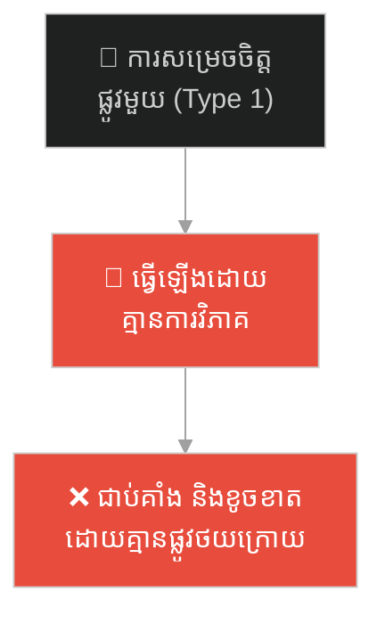
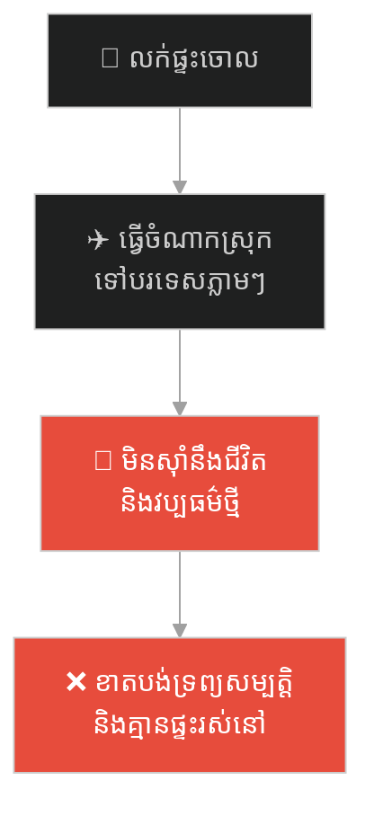
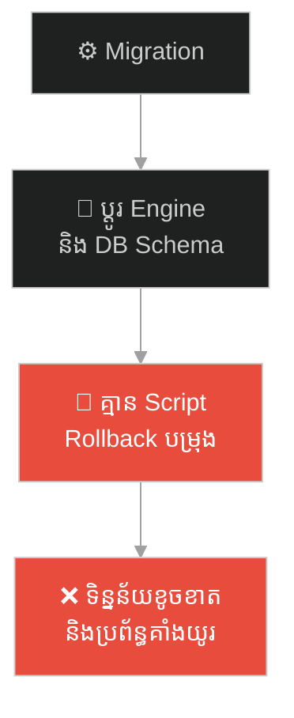
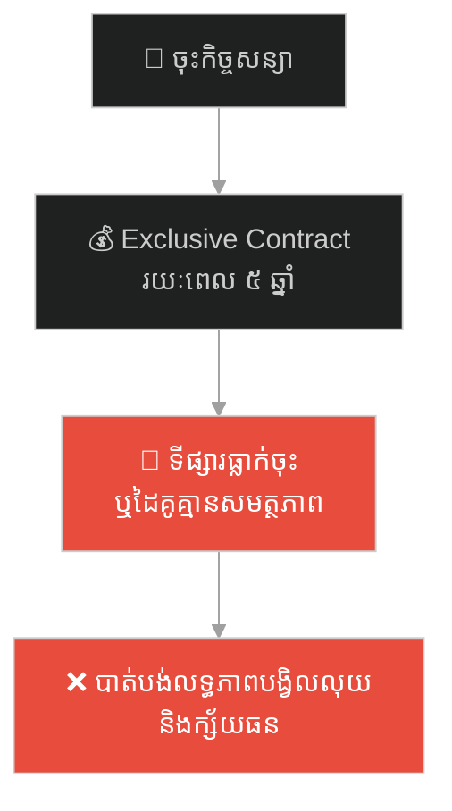
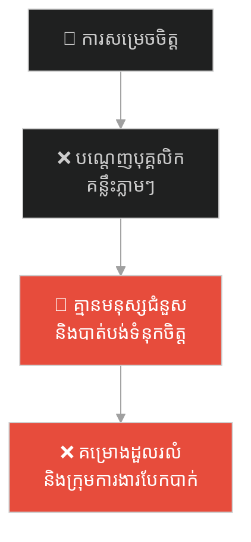
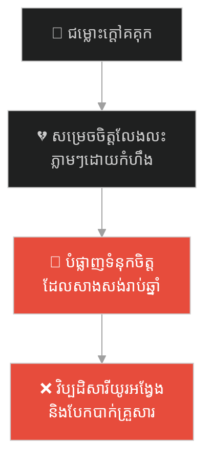
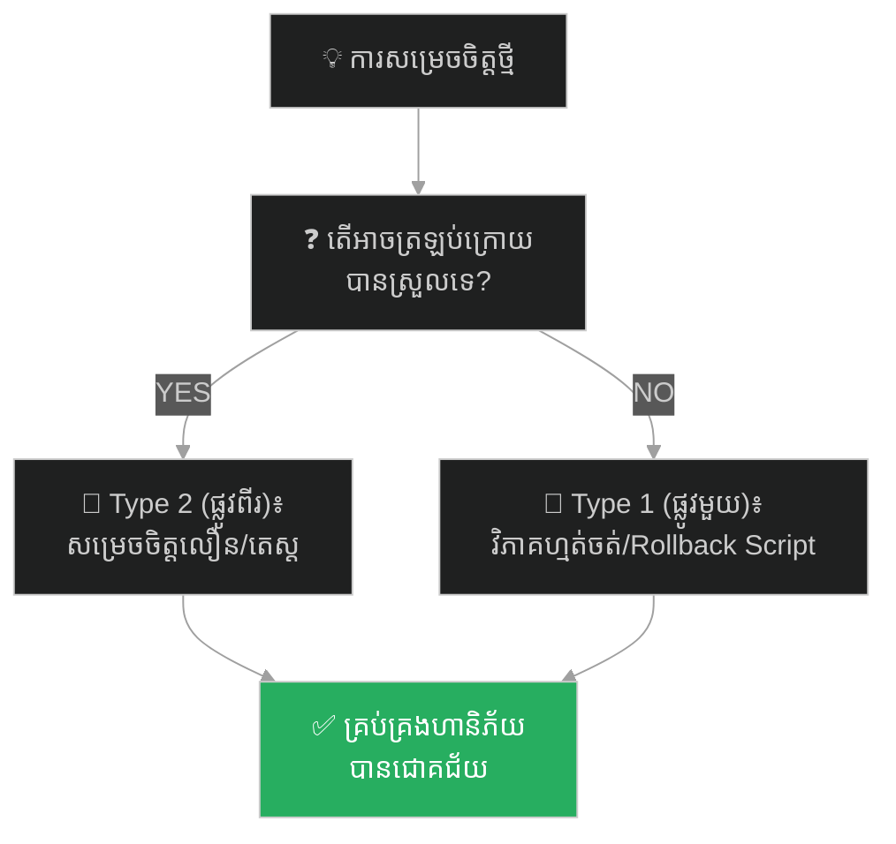

# Crossing the Rubicon (ការឆ្លងទន្លេរូប៊ីខន)៖ យូលីសេស សេសារ និងការយល់ដឹងពីការសម្រេចចិត្តដែលមិនអាចត្រឡប់ក្រោយបាន

**Author:** ichamrong  
**Date:** 2026-05-27  
**Tags:** #julius-caesar #rome #decision-making #point-of-no-return #rubicon #type-1-decisions  
**Category:** Concepts / Parables  
**Read Time:** ~15 min  

---

## 📌 មាតិកា (Table of Contents)
- [អន្ទាក់ផ្លូវចិត្ត (The Trap)](#0)
- [១. រឿងព្រេងប្រវត្តិសាស្ត្រ៖ យូលីសេស សេសារ និងទន្លេរូប៊ីខន (Julius Caesar & the Rubicon)](#1)
  - [គ្រាប់ឡុកឡាក់ត្រូវបានបោះចេញហើយ (The Die is Cast)](#1-1)
- [២. បញ្ហា៖ ការសម្រេចចិត្តប្រភេទផ្លូវមួយ និងផ្លូវពីរ (The Issue: Type 1 vs. Type 2 Decisions)](#2)
- [៣. ឧទាហរណ៍ជាក់ស្តែងក្នុងពិភពពិត (Real World Examples)](#3)
  - [ឧទាហរណ៍ទី ១ — កម្រិតស្រាល (គ្រួសារ)៖ ការលក់ផ្ទះចោលដើម្បីចំណាកស្រុកដោយមិនបានសាកល្បង (The Relocation Trap)](#3-1)
  - [ឧទាហរណ៍ទី ២ — កម្រិតមធ្យម (បច្ចេកទេស)៖ ការផ្លាស់ប្តូរស្ថាបត្យកម្មប្រព័ន្ធស្នូលដោយគ្មានគម្រោង Rollback (The DB Engine Rewrite)](#3-2)
  - [ឧទាហរណ៍ទី ៣ — កម្រិតមធ្យម (ធុរកិច្ច)៖ ការចុះកិច្ចសន្យាផ្តាច់មុខរយៈពេលវែងដែលចងជើងហិរញ្ញវត្ថុ (The Lock-in Vendor Contract)](#3-3)
  - [ឧទាហរណ៍ទី ៤ — កម្រិតមធ្យម (សង្គម/គ្រប់គ្រង)៖ ការបណ្តេញបុគ្គលិកគន្លឹះដោយអារម្មណ៍ឆេវឆាវ (The Impulsive Layoff)](#3-4)
  - [ឧទាហរណ៍ទី ៥ — កម្រិតធ្ងន់ (ទំនាក់ទំនង)៖ ការសម្រេចចិត្តបញ្ចប់អាពាហ៍ពិពាហ៍ក្នុងពេលឈ្លោះគ្នា (The Heated Divorce Decision)](#3-5)
- [៤. ដំណោះស្រាយទូទៅ៖ ការបែងចែកប្រភេទនៃការសម្រេចចិត្ត និងការរៀបចំយុទ្ធសាស្ត្រដកថយ (The General Solution: Type 1/2 Matrix & Rollback Planning)](#4)
- [សេចក្តីសន្និដ្ឋាន (Conclusion)](#5)
- [ឯកសារយោង (References)](#6)
- [Related Posts](#7)
---

## អន្ទាក់ផ្លូវចិត្ត (The Trap)

តើអ្នកធ្លាប់ធ្វើការសម្រេចចិត្តដ៏ធំមួយដោយអារម្មណ៍ឆេវឆាវ ឬការប្រញាប់ប្រញាល់ រួចហើយត្រូវស្តាយក្រោយអស់មួយជីវិត ព្រោះមិនអាចកែប្រែ ឬបង្វែរពេលវេលាឱ្យត្រឡប់ក្រោយវិញបានដែរឬទេ?

នៅក្នុងការដឹកនាំ និងការសម្រេចចិត្ត៖
* **យើងតែងតែលាយឡំ** ភាពខុសគ្នារវាងការសម្រេចចិត្តដែលអាចកែប្រែបាន (Reversible) និងការសម្រេចចិត្តដែលមិនអាចកែប្រែបាន (Irreversible)។
* **យើងធ្វើសកម្មភាព** លើការសម្រេចចិត្តដែលមិនអាចត្រឡប់ក្រោយបាន ដោយប្រើការគិតលឿនពេក និងខ្វះយុទ្ធសាស្ត្រ Rollback។

ការសម្រេចចិត្តដែលគ្មានផ្លូវថយក្រោយ ឬ "ទ្វារផ្លូវមួយ" ហៅថា **Type 1 Decision (ការសម្រេចចិត្តផ្លូវមួយ)**។ បើឆ្លងកាត់រួចហើយ គឺត្រូវតែដើរទៅមុខជានិច្ច ទោះបីជាជួបសោកនាដកម្មក៏ដោយ។

ដើម្បីយល់ដឹងពីរបៀបគ្រប់គ្រងការសម្រេចចិត្តទាំងនេះ នេះជាផែនទីបង្ហាញផ្លូវសម្រាប់អត្ថបទនេះ៖
1. **រឿងព្រេងប្រវត្តិសាស្ត្រ (The Historic Legend)** — រឿងរ៉ាវរបស់ យូលីសេស សេសារ ឈរនៅមាត់ទន្លេរូប៊ីខន ថ្លឹងថ្លែងច្បាប់ដែករបស់រ៉ូម មុននឹងបោះគ្រាប់ឡុកឡាក់ប្រកាសសង្គ្រាម។
2. **បញ្ហា (The Issue)** — ភាពខុសគ្នារវាង Type 1 (One-Way Door) និង Type 2 (Two-Way Door) Decisions។
3. **ឧទាហរណ៍ជាក់ស្តែងក្នុងពិភពពិត (Real World Examples)** — ពិនិត្យមើលការសម្រេចចិត្តប្រភេទនេះក្នុងកម្រិតគ្រួសារ ព័ត៌មានវិទ្យា ធុរកិច្ច ការគ្រប់គ្រង និងទំនាក់ទំនងស្នេហា។
4. **ដំណោះស្រាយទូទៅ (The General Solution)** — ការអនុវត្តក្របខ័ណ្ឌតម្រង់ទិសសម្រេចចិត្ត និងការត្រៀមផែនការ Rollback មុននឹងឆ្លងទន្លេ។

---

## ១. រឿងព្រេងប្រវត្តិសាស្ត្រ៖ យូលីសេស សេសារ និងទន្លេរូប៊ីខន (Julius Caesar & the Rubicon)

នៅក្នុងចក្រភពរ៉ូមបុរាណ មានច្បាប់ដែកដ៏តឹងរ៉ឹងបំផុតមួយ ដែលចែងដោយព្រឹទ្ធសភា (Senate) ៖ *គ្មានមេទ័ពណាម្នាក់ត្រូវបានអនុញ្ញាតឱ្យដឹកនាំកងទ័ពរបស់ខ្លួនឆ្លងកាត់ទន្លេរូប៊ីខន (The Rubicon) ចូលមកក្នុងទឹកដីស្នូលរបស់ទីក្រុងរ៉ូមឡើយ។*

ទន្លេរូប៊ីខន គឺជាខ្សែបន្ទាត់ព្រំដែនរវាងខេត្ត Gaul និងទឹកដីអ៊ីតាលី។ ប្រសិនបើមេទ័ពណាហ៊ានបំពានច្បាប់នេះ នាំទ័ពឆ្លងកាត់ទន្លេ វាស្មើនឹងការប្រកាសសង្គ្រាមស៊ីវិល (Civil War) ក្បត់អាណាចក្រ ហើយមេទ័ពនោះរួមទាំងកងទ័ពទាំងអស់ នឹងត្រូវកាត់ទោសប្រហារជីវិត។

នៅឆ្នាំ ៤៩ មុនគ្រិស្តសករាជ មេទ័ពដ៏ខ្លាំងពូកែបំផុតរបស់រ៉ូមគឺលោក **យូលីសេស សេសារ (Julius Caesar)** បានវាយឈ្នះសង្គ្រាមនៅតំបន់ Gaul។ ប៉ុន្តែ សត្រូវនយោបាយរបស់គាត់នៅទីក្រុងរ៉ូម ដឹកនាំដោយ មេទ័ព ប៉ុមប៉េ (Pompey) និងព្រឹទ្ធសភា បានបញ្ជាឱ្យគាត់រំសាយកងទ័ពចោល រួចត្រឡប់មកទីក្រុងវិញក្នុងនាមជាជនសាមញ្ញ ដើម្បីទទួលការកាត់ទោសពីបទបំពានផ្សេងៗ។ សេសារដឹងច្បាស់ថា បើគាត់ត្រឡប់ទៅវិញដោយគ្មានទ័ព គាត់នឹងត្រូវគេសម្លាប់ ឬនិរទេសខ្លួនជាមិនខាន។

---

### គ្រាប់ឡុកឡាក់ត្រូវបានបោះចេញហើយ (The Die is Cast)

សេសារ បានដឹកនាំកងទ័ពទី ១៣ (Legio XIII Gemina) របស់គាត់មកដល់មាត់ទន្លេរូប៊ីខន។ គាត់បានបញ្ជាឱ្យកងទ័ពឈប់សិន។

សេសារបានជិះសេះដើរចុះឡើងនៅមាត់ទន្លេ ដោយការគិតយ៉ាងតានតឹងបំផុត។ គាត់ដឹងច្បាស់ថា នេះគឺជាការសម្រេចចិត្តប្រភេទ **"ទ្វារផ្លូវមួយ (One-Way Door)"**៖
* **ជម្រើសទី១ (មិនឆ្លងទន្លេ)៖** គាត់រំសាយកងទ័ព។ គាត់រួចជីវិត ប៉ុន្តែបាត់បង់អំណាច កិត្តិយស និងកេរ្តិ៍ឈ្មោះទាំងស្រុង។
* **ជម្រើសទី២ (ឆ្លងទន្លេ)៖** គាត់បញ្ជាឱ្យទ័ពបោះជំហានចូលទៅក្នុងទឹកទន្លេ។ គ្មានផ្លូវត្រឡប់ក្រោយ គ្មានការសុំទោស គ្មានការចរចាទៀតទេ។ គឺមានតែការប្រយុទ្ធរហូតដល់ស្លាប់ ឬក្លាយជាអធិរាជ។

បន្ទាប់ពីថ្លឹងថ្លែងហានិភ័យយ៉ាងល្អិតល្អន់រួចមក សេសារបានសម្រេចចិត្តដ៏ធំបំផុតនៅក្នុងប្រវត្តិសាស្ត្រ។ គាត់បានដកដាវដ៏មុតស្រួច ចង្អុលទៅត្រើយម្ខាង រួចបន្លឺពាក្យប្រវត្តិសាស្ត្រមួយឃ្លាថា៖  
> **«Alea iacta est (The die is cast - គ្រាប់ឡុកឡាក់ត្រូវបានបោះចេញហើយ!)»**

គាត់បានជិះសេះកាត់ទឹកទន្លេរូប៊ីខន ដោយមានកងទ័ពរាប់ម៉ឺននាក់ដើរតាមពីក្រោយ។ នៅពេលដែលគាត់ឈានជើងដល់ត្រើយម្ខាង គាត់លែងមានផ្លូវថយទៀតហើយ។ ទីបំផុត សេសារបានវាយឈ្នះសង្គ្រាមស៊ីវិល កម្ចាត់ ប៉ុមប៉េ និងបានប្រែក្លាយសាធារណរដ្ឋរ៉ូម ទៅជាចក្រភពរ៉ូមដ៏មហិមា។

---

## ២. បញ្ហា៖ ការសម្រេចចិត្តប្រភេទផ្លូវមួយ និងផ្លូវពីរ (The Issue: Type 1 vs. Type 2 Decisions)

រឿងរ៉ាវ Crossing the Rubicon ឆ្លុះបញ្ចាំងពីគំរូសម្រេចចិត្ត (Decision-Making Model) ដែលពេញនិយមបំផុតក្នុងស្ថាប័នធំៗ (ដូចជា Amazon) គឺ៖

* **Type 1 Decision (One-Way Door):** ជាការសម្រេចចិត្តដែលមានផលប៉ះពាល់ធ្ងន់ធ្ងរ មិនអាចកែប្រែ ឬត្រឡប់ក្រោយបានយ៉ាងងាយ (ឬត្រូវខាតបង់ធនធានមហាសាលបើចង់វិលវិញ)។ ឧទាហរណ៍៖ ការលក់ក្រុមហ៊ុន ការបញ្ចេញផលិតផលស្នូលថ្មី ឬការប្តូរ Core Architecture។
* **Type 2 Decision (Two-Way Door):** ជាការសម្រេចចិត្តដែលអាចកែប្រែ និងត្រឡប់ក្រោយវិញបានយ៉ាងងាយស្រួល ប្រសិនបើលទ្ធផលមិនល្អដូចការរំពឹងទុក។ ឧទាហរណ៍៖ ការធ្វើតេស្តប្តូរពណ៌ប៊ូតុងលើ App (A/B Testing) ឬការសាកល្បងចុះកិច្ចសន្យាខ្លីៗ។

---

## ៣. ឧទាហរណ៍ជាក់ស្តែងក្នុងពិភពពិត

ដើម្បីយល់ដឹងឱ្យកាន់តែច្បាស់ នេះជាការវិភាគលើឧទាហរណ៍ ៥ កម្រិតផ្សេងគ្នា៖

---

### ឧទាហរណ៍ទី ១ — កម្រិតស្រាល (គ្រួសារ)៖ ការលក់ផ្ទះចោលដើម្បីចំណាកស្រុកដោយមិនបានសាកល្បង (The Relocation Trap)

**ស្ថានភាព៖** គ្រួសារមួយសម្រេចចិត្តលក់ផ្ទះវីឡា និងទ្រព្យសម្បត្តិទាំងអស់នៅស្រុកកំណើត ដើម្បីធ្វើចំណាកស្រុកទៅរស់នៅប្រទេសអភិវឌ្ឍន៍មួយភ្លាមៗ ព្រោះគិតថាទីនោះល្អឥតខ្ចោះ។

* **ជម្រើសខុស (Type 1 treated as Type 2)៖** លក់ផ្ទះភ្លាមៗដោយគ្មានគម្រោងបម្រុង។
* **លទ្ធផល៖** ពេលទៅដល់ ពួកគេមិនអាចស៊ាំនឹងវប្បធម៌ អាកាសធាតុត្រជាក់ និងមិនអាចរកការងារសមរម្យបានឡើយ។ ពួកគេចង់ត្រឡប់មកវិញ តែលែងមានផ្ទះ និងទ្រព្យសម្បត្តិសម្រាប់រស់នៅទៀតហើយ។

**ដំណោះស្រាយ៖**  
ចាត់ទុកវាជា Type 1 Decision។ ត្រូវធ្វើតេស្តសាកល្បងដោយទៅរស់នៅទីនោះរយៈពេល ៣-៦ ខែសិន (Rent first) ដោយមិនទាន់លក់ផ្ទះចម្បងចោលឡើយ (រក្សាទ្វារផ្លូវពីរ)។

---

### ឧទាហរណ៍ទី ២ — កម្រិតមធ្យម (បច្ចេកទេស)៖ ការផ្លាស់ប្តូរស្ថាបត្យកម្មប្រព័ន្ធស្នូលដោយគ្មានគម្រោង Rollback (The DB Engine Rewrite)

**ស្ថានភាព៖** Tech Lead ម្នាក់សម្រេចចិត្តប្តូរ Database Engine ចម្បងរបស់ក្រុមហ៊ុនពី PostgreSQL ទៅជា NoSQL MongoDB ព្រោះចង់ឱ្យប្រព័ន្ធដើរលឿនជាងមុន។

* **ជម្រើសខុស៖** ដំណើរការ Migration ភ្លាមៗទៅលើ Production Server ដោយគ្មានការសរសេរ Script សម្រាប់ Rollback ទិន្នន័យត្រឡប់មកវិញ។
* **លទ្ធផល៖** ពេលដាក់ដំណើរការ ស្រាប់តែប្រព័ន្ធជួបបញ្ហាទិន្នន័យមិនស៊ីគ្នា (Data Inconsistency) និងបាត់បង់របាយការណ៍ហិរញ្ញវត្ថុ។ ពួកគេចង់ត្រឡប់ទៅប្រើប្រព័ន្ធចាស់វិញ តែទិន្នន័យថ្មីត្រូវបានផ្លាស់ប្តូរទម្រង់អស់ទៅហើយ មិនអាច Revert បាន។

**ដំណោះស្រាយ៖**  
រាល់ការប្តូរ Core DB គឺជា Type 1 Decision។ ត្រូវតែមានការសាកល្បងលើ Staging Environment ច្រើនដង និងសរសេរ Script សម្រាប់ Rollback ទិន្នន័យ ១០០% ជាមុន មុននឹងសម្រេចចិត្ត "ឆ្លងទន្លេ"។

---

### ឧទាហរណ៍ទី ៣ — កម្រិតមធ្យម (ធុរកិច្ច)៖ ការចុះកិច្ចសន្យាផ្តាច់មុខរយៈពេលវែងដែលចងជើងហិរញ្ញវត្ថុ (The Lock-in Vendor Contract)

**ស្ថានភាព៖** ក្រុមហ៊ុន Startup មួយចង់កាត់បន្ថយថ្លៃដើម Cloud computing ក៏បានចុះកិច្ចសន្យាផ្តាច់មុខ ៥ ឆ្នាំជាមួយក្រុមហ៊ុន Cloud មួយ ជំនួសឱ្យការបង់ប្រាក់ប្រចាំខែធម្មតា។

* **ជម្រើសខុស៖** ចុះកិច្ចសន្យាដោយមិនបានពិចារណាពីការផ្លាស់ប្តូរបច្ចេកវិទ្យាក្នុងពេលអនាគត។
* **លទ្ធផល៖** ពីរឆ្នាំក្រោយមក ក្រុមហ៊ុន Cloud នោះលែងមានស្ថិរភាព និងឡើងថ្លៃសេវាបន្ថែម។ Startup ចង់ផ្លាស់ប្តូរទៅ AWS តែមិនអាចធ្វើបាន ព្រោះបើលុបកិច្ចសន្យាត្រូវបង់ប្រាក់ពិន័យរាប់សែនដុល្លារ ដែលអាចធ្វើឱ្យក្រុមហ៊ុនក្ស័យធន។

**ដំណោះស្រាយ៖**  
ចាត់ទុកកិច្ចសន្យារយៈពេលវែងជា Type 1 Decision។ ត្រូវប្រើប្រាស់យុទ្ធសាស្ត្រ Pay-as-you-go ឬចុះកិច្ចសន្យាសាកល្បងរយៈពេលខ្លី (Type 2) មុននឹងប្តេជ្ញាចិត្តវែងឆ្ងាយ។

---

### ឧទាហរណ៍ទី ៤ — កម្រិតមធ្យម (សង្គម/គ្រប់គ្រង)៖ ការបណ្តេញបុគ្គលិកគន្លឹះដោយអារម្មណ៍ឆេវឆាវ (The Impulsive Layoff)

**ស្ថានភាព៖** នៅក្នុងកិច្ចប្រជុំដ៏តានតឹងមួយ Manager ម្នាក់ខឹងសម្បារនឹងវិស្វករជាន់ខ្ពស់ម្នាក់ដែលហ៊ានប្រកែកមតិខ្លួន ក៏ស្រែកបណ្តេញវិស្វករនោះចេញពីការងារភ្លាមៗ។

* **ជម្រើសខុស៖** សម្រេចចិត្តបញ្ចប់ការងារបុគ្គលិកគន្លឹះដោយកំហឹងបណ្តោះអាសន្ន។
* **លទ្ធផល៖** វិស្វករនោះបានចាកចេញទៅធ្វើការឱ្យក្រុមហ៊ុនគូប្រជែងភ្លាមៗ។ ប្រព័ន្ធរបស់ក្រុមហ៊ុនជួបបញ្ហា តែគ្មាននរណាម្នាក់ដឹងពីរបៀបជួសជុលឡើយ។ Manager ចង់ហៅគាត់មកវិញ តែគាត់បដិសេធដាច់អហង្ការ។ គម្រោងធំរបស់ក្រុមហ៊ុនត្រូវបោះបង់ចោល។

**ដំណោះស្រាយ៖**  
ការបណ្តេញបុគ្គលិកគន្លឹះចេញ គឺជា Type 1 Decision។ ត្រូវឆ្លងកាត់ការវាយតម្លៃពីក្រុមការងារធនធានមនុស្ស (HR) និងត្រូវរៀបចំអ្នកបន្តវេន (Backup personnel) ឱ្យបានច្បាស់លាស់ជាមុនសិន។

---

### ឧទាហរណ៍ទី ៥ — កម្រិតធ្ងន់ (ទំនាក់ទំនង)៖ ការសម្រេចចិត្តបញ្ចប់អាពាហ៍ពិពាហ៍ក្នុងពេលឈ្លោះគ្នា (The Heated Divorce Decision)

**ស្ថានភាព៖** ប្តីប្រពន្ធឈ្លោះប្រកែកគ្នាពីបញ្ហាតូចតាចមួយ។ ដោយសារតែកំហឹងរៀងៗខ្លួន ប្តីបានស្រែកថា៖ *«បើអញ្ចឹង យើងលែងលះគ្នាទៅ!»* រួចក៏នាំគ្នាទៅចុះហត្ថលេខាលើលិខិតលែងលះភ្លាមៗ។

* **ជម្រើសខុស៖** សម្រេចចិត្តបញ្ចប់ទំនាក់ទំនងយូរឆ្នាំ ដោយប្រើអារម្មណ៍ឆេវឆាវមួយពេល។
* **លទ្ធផល៖** ក្រោយមក ពេលកំហឹងរលត់ទៅវិញ ពួកគេមានការវិប្បដិសារីយ៉ាងខ្លាំង ប៉ុន្តែទំនាក់ទំនង និងទំនុកចិត្តត្រូវបានបំផ្លាញខ្ទេចខ្ទីអស់ទៅហើយ មិនអាចសាងសង់ត្រឡប់មកវិញដូចដើមបានឡើយ។

**ដំណោះស្រាយ៖**  
ការលែងលះជា Type 1 Decision ដ៏ធ្ងន់ធ្ងរ។ ត្រូវបង្កើតក្បួន **"Cooling-off Period"** (រយៈពេលផ្អាកគិតសិន)។ រាល់ពេលឈ្លោះគ្នា ហាមធ្វើការសម្រេចចិត្តធំៗជាដាច់ខាត។ ត្រូវរង់ចាំរហូតដល់អារម្មណ៍ស្ងប់ស្ងាត់ ទើបជជែកគ្នាដោយហេតុផល។

---

## ៤. ដំណោះស្រាយទូទៅ៖ ការបែងចែកប្រភេទនៃការសម្រេចចិត្ត និងការរៀបចំយុទ្ធសាស្ត្រដកថយ (The General Solution: Type 1/2 Matrix & Rollback Planning)

ដើម្បីធ្វើការសម្រេចចិត្តប្រកបដោយប្រសិទ្ធភាព និងមិនបន្សល់ទុកនូវក្តីវិប្បដិសារី ត្រូវអនុវត្តវិធីសាស្ត្រទាំងនេះ៖

### ១. ប្រើប្រាស់តារាងវាយតម្លៃប្រភេទសម្រេចចិត្ត (Decision Categorization Matrix)

មុននឹងអនុវត្តសកម្មភាពណាមួយ ត្រូវសួរសំណួរពីរ៖
1. *តើការសម្រេចចិត្តនេះមានផលប៉ះពាល់ធំប៉ុណ្ណា?*
2. *តើខ្ញុំអាច Revert វាមកវិញបានដោយងាយស្រួល និងថោកដែរឬទេ?*

* **បើ YES (ងាយ Revert):** ធ្វើសកម្មភាពឱ្យបានលឿន (Move fast) ដើម្បីកុំឱ្យខាតពេលវិភាគច្រើន (Type 2)។
* **បើ NO (ពិបាក Revert):** បន្ថយល្បឿន ពិភាក្សាជាមួយអ្នកជំនាញ ថ្លឹងថ្លែងហានិភ័យ និងរៀបចំផែនការបម្រុង (Type 1)។

### ២. បង្កើតយុទ្ធសាស្ត្រ "ទ្វារផ្លូវពីរ" ជានិច្ច (Introduce Reversibility)

* ព្យាយាមបំបែក Type 1 Decision ឱ្យទៅជា Type 2 Decisions តូចៗ។ ឧទាហរណ៍៖ ជំនួសឱ្យការទិញសេវាកម្មធំភ្លាមៗ ត្រូវសុំសាកល្បងឥតគិតថ្លៃ (Trial) ឬបង្កើតគម្រោងសាកល្បងតូចមួយ (Pilot project) ជាមុនសិន។

### ៣. រៀបចំផែនការដកថយ (Rollback Plan / Plan B)

* មុននឹងឆ្លងទន្លេរូប៊ីខន ត្រូវឆ្លើយសំណួរថា៖ *«បើគ្រប់យ៉ាងបរាជ័យ តើផ្លូវថយក្រោយរបស់យើងមើលទៅដូចម្តេច?»* ប្រសិនបើគ្មានផ្លូវថយក្រោយទេ អ្នកត្រូវប្រាកដថាអ្នកមានធនធាន និងគម្រោងត្រៀមខ្លួនសម្រាប់សង្គ្រាមយូរអង្វែង។

---

## 🐇 ធ្លាក់ចូលក្នុងរន្ធទន្សាយ (Enter the Rabbit Hole)

ដើម្បីស្វែងយល់បន្ថែមអំពីរបៀបស្រាយបញ្ហាដែលហាក់ដូចជាស្មុគស្មាញ និងរញ៉េរញ៉ៃរាប់ជុំ តាមរយៈការគិតខុសពីធម្មតា (Lateral Thinking) និងគោលការណ៍កាត់បន្ថយភាពស្មុគស្មាញ សូមបន្តទៅកាន់ Parable បន្ទាប់៖

* 🚀 **[ចាប់ផ្តើមដំណើររុករក (Start the Journey) ➔ The Gordian Knot](./44-the-gordian-knot.md)**

---

## សេចក្តីសន្និដ្ឋាន (Conclusion)

> **«កុំឆ្លងកាត់ទន្លេរូប៊ីខន ប្រសិនបើអ្នកមិនទាន់បានរៀបចំគម្រោងប្រយុទ្ធរួចរាល់នៅត្រើយម្ខាង។ ព្រោះនៅពេលដែលជើងរបស់អ្នកប៉ះទឹកទន្លេហើយ គ្រប់យ៉ាងលែងជារបស់អ្នកទៀតហើយ គឺជារបស់វាសនា។»**

យូលីសេស សេសារ បានទទួលជោគជ័យព្រោះគាត់បានវិភាគ និងត្រៀមកងទ័ពទី ១៣ ដ៏ស្មោះត្រង់បំផុតរបស់គាត់រួចរាល់។ ចូរធ្វើការសម្រេចចិត្តដោយការយល់ដឹងពីប្រភេទរបស់វា ដើម្បីកុំឱ្យដុតបំផ្លាញស្ពានដែលអ្នកត្រូវដើរវិលវិញ។

---

## ឯកសារយោង (References)

* **Suetonius** — *The Lives of the Twelve Caesars* (Ancient Rome)។ កំណត់ត្រាប្រវត្តិសាស្ត្រផ្លូវការស្តីពីសកម្មភាព និងពាក្យសម្តីរបស់សេសារនៅមាត់ទន្លេរូប៊ីខន។
* **Jeff Bezos** — *Amazon Shareholder Letter* (2015)។ ទ្រឹស្តីស្នូលដែលបែងចែក Type 1 និង Type 2 Decisions ក្នុងការគ្រប់គ្រងស្ថាប័នធំៗ។
* **Daniel Kahneman** — *Thinking, Fast and Slow* (2011)។ ការយល់ដឹងពីប្រព័ន្ធគិត System 1 (លឿន/អារម្មណ៍) និង System 2 (យឺត/ហេតុផល) ក្នុងការសម្រេចចិត្ត។

---

## Related Posts

* **[35 Crossing the Rubicon: Irreversible Migrations](../articles/35-crossing-the-rubicon-and-irreversible-migrations.md)** — អត្ថបទគោលលម្អិតបកស្រាយពីយុទ្ធសាស្ត្រ Migration ដែលមិនអាចកែប្រែបានក្នុងព័ត៌មានវិទ្យា។
* **[30 The King and the Bridge to Nowhere](./30-the-bridge-to-nowhere.md)** — Sunk Cost Fallacy និងហានិភ័យនៃការបន្តវិនិយោគលើការសម្រេចចិត្តខុស។
* **[25 The Sword of Damocles: The Hidden Burden of Leadership](../articles/25-the-sword-of-damocles-and-risk-management.md)** — ការគ្រប់គ្រងសម្ពាធផ្លូវចិត្តពេលត្រូវធ្វើការសម្រេចចិត្តធំៗ។

---
*Last updated: 2026-05-27*

## Related

- [💡 Concepts README](../README.md)
- [📚 Main Repository README](../../../README.md)
- [Developer Habits](../../developer-habits/README.md)
- [Mental Health & Well-being](../../mental-health/README.md)
- [Management & SDLC](../../management/README.md)
