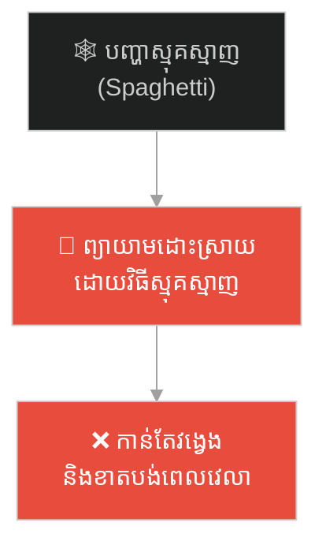
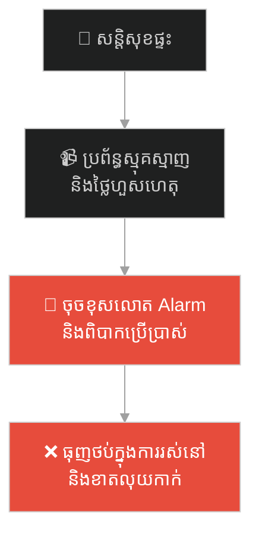
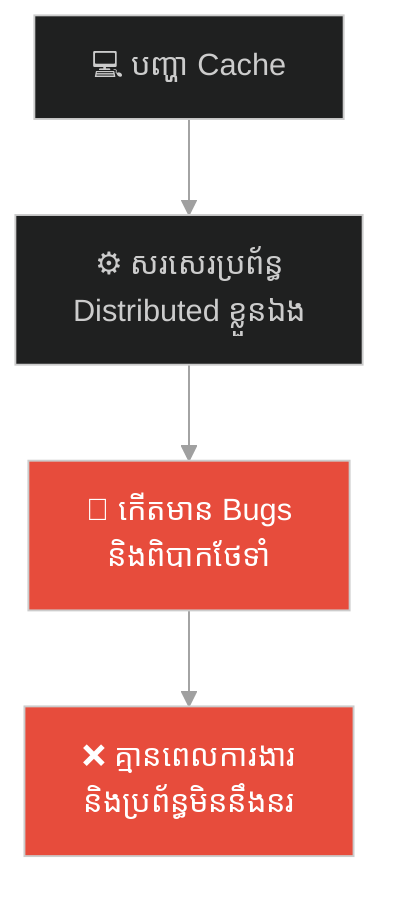
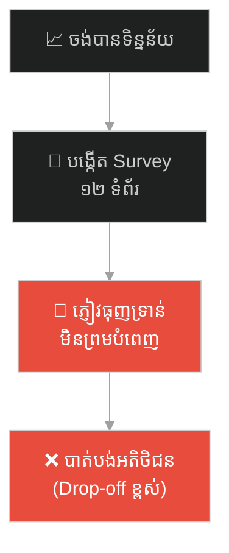
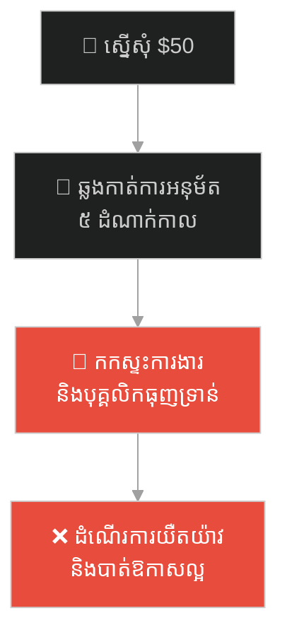
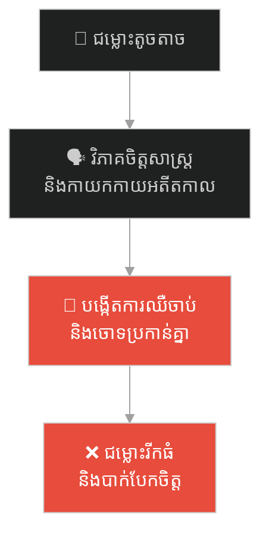
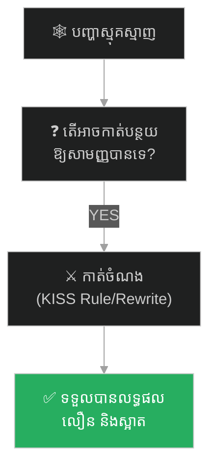

# The Gordian Knot (ចំណងហ្គ័រដៀន)៖ អាឡិចសាន់ឌឺ និងភាពចាំបាច់នៃដំណោះស្រាយដ៏សាមញ្ញបំផុត

**Author:** ichamrong  
**Date:** 2026-05-27  
**Tags:** #alexander-the-great #gordian-knot #kiss-principle #problem-solving #parable #over-engineering  
**Category:** Concepts / Parables  
**Read Time:** ~15 min  

---

## 📌 មាតិកា (Table of Contents)
- [អន្ទាក់ផ្លូវចិត្ត (The Trap)](#0)
- [១. រឿងព្រេងប្រវត្តិសាស្ត្រ៖ អាឡិចសាន់ឌឺ និងចំណងហ្គ័រដៀន (Alexander & the Gordian Knot)](#1)
  - [ដាវរបស់អធិរាជ (The Sword of the Emperor)](#1-1)
- [២. បញ្ហា៖ គ្រោះថ្នាក់នៃការរចនាស្មុគស្មាញហួសហេតុ (The Issue: Over-Engineering & Spaghetti Logic)](#2)
- [៣. ឧទាហរណ៍ជាក់ស្តែងក្នុងពិភពពិត (Real World Examples)](#3)
  - [ឧទាហរណ៍ទី ១ — កម្រិតស្រាល (គ្រួសារ)៖ ការទិញប្រព័ន្ធសន្តិសុខស្មុគស្មាញជំនួសឱ្យសោរល្អ (The Smart Home Overkill)](#3-1)
  - [ឧទាហរណ៍ទី ២ — កម្រិតមធ្យម (បច្ចេកទេស)៖ ការសរសេរប្រព័ន្ធ Cache ផ្ទាល់ខ្លួនជំនួសឱ្យ Redis (The Custom Cache Wheel)](#3-2)
  - [ឧទាហរណ៍ទី ៣ — កម្រិតមធ្យម (ធុរកិច្ច)៖ ការបង្កើតបែបបទចុះឈ្មោះវែងឆ្ងាយនាំឱ្យបាត់ម៉ូយ (The Onboarding Questionnaire Barrier)](#3-3)
  - [ឧទាហរណ៍ទី ៤ — កម្រិតមធ្យម (សង្គម/គ្រប់គ្រង)៖ ដំណើរការអនុម័ត ៥ ដំណាក់កាលសម្រាប់លុយ $50 (The Micro-expense Red Tape)](#3-4)
  - [ឧទាហរណ៍ទី ៥ — កម្រិតធ្ងន់ (ទំនាក់ទំនង)៖ ការវិភាគចិត្តសាស្ត្រវែងឆ្ងាយលើជម្លោះលាងចាន (The Dispute Over-analysis)](#3-5)
- [៤. ដំណោះស្រាយទូទៅ៖ ការអនុវត្តច្បាប់ KISS និងវិធីសាស្ត្រកាត់ចំណង (The General Solution: KISS Principle & Reframing the Problem)](#4)
- [សេចក្តីសន្និដ្ឋាន (Conclusion)](#5)
- [ឯកសារយោង (References)](#6)
- [Related Posts](#7)
---

## អន្ទាក់ផ្លូវចិត្ត (The Trap)

តើអ្នកធ្លាប់ជួបបញ្ហាដែលញ៉ីញ៉ៃរញ៉េរញ៉ៃ រហូតដល់អ្នកចំណាយពេលរាប់សប្តាហ៍ដើម្បីគិត និងព្យាយាមដោះស្រាយតាមវិធីផ្សេងៗ ប៉ុន្តែលទ្ធផលគឺវាកាន់តែរឹតបន្តឹង និងស្មុគស្មាញជាងមុនដែរឬទេ?

នៅក្នុងការដោះស្រាយបញ្ហា និងស្ថាបត្យកម្ម៖
* **យើងតែងតែជឿថា** បញ្ហាដែលស្មុគស្មាញ ត្រូវតែដោះស្រាយដោយវិធីសាស្ត្រដ៏ស្មុគស្មាញ និងទំនើបបំផុត។
* **យើងធ្លាក់ចូលទៅក្នុង** អន្ទាក់នៃការគិតច្រើនជ្រុល (Overthinking) និងការរចនាស្មុគស្មាញហួសហេតុ (Over-Engineering) ដែលនាំឱ្យបង្កើតបញ្ហាថ្មីបន្ថែមទៀត។

ទំនោរនៃការបង្កើតភាពស្មុគស្មាញនេះ ធ្វើឱ្យយើងប្រៀបដូចជាមនុស្សដែលព្យាយាមស្រាយ **Gordian Knot (ចំណងហ្គ័រដៀន)** ដោយម្រាមដៃ។ កាលណាទាញខ្សែមួយ ខ្សែផ្សេងទៀតកាន់តែរឹតបន្តឹងខ្លាំងឡើងៗ។

ដើម្បីយល់ដឹងពីរបៀបសម្រួលបញ្ហា និងការអនុវត្តវិធីសាស្ត្រដោះស្រាយឆ្លាតវៃ នេះជាផែនទីបង្ហាញផ្លូវសម្រាប់អត្ថបទនេះ៖
1. **រឿងព្រេងប្រវត្តិសាស្ត្រ (The Historic Legend)** — រឿងរ៉ាវរបស់ អាឡិចសាន់ឌឺ ឈរនៅមុខចំណងដែលគ្មានអ្នកណាស្រាយបានរាប់រយឆ្នាំ រួចប្រើប្រាស់ដាវកាត់ផ្តាច់ក្នុងរយៈពេល ១ វិនាទី។
2. **បញ្ហា (The Issue)** — គ្រោះថ្នាក់នៃ Over-Engineering និងការបង្កើត Spaghetti Logic ក្នុងប្រព័ន្ធ។
3. **ឧទាហរណ៍ជាក់ស្តែងក្នុងពិភពពិត (Real World Examples)** — ពិនិត្យមើលបញ្ហាស្មុគស្មាញក្នុងកម្រិតគ្រួសារ ព័ត៌មានវិទ្យា ធុរកិច្ច ការគ្រប់គ្រង និងទំនាក់ទំនងស្នេហា។
4. **ដំណោះស្រាយទូទៅ (The General Solution)** — ការអនុវត្តច្បាប់ KISS (Keep It Simple, Stupid) និងការគិតក្រៅប្រអប់ (Thinking Outside the Box)។

---

## ១. រឿងព្រេងប្រវត្តិសាស្ត្រ៖ អាឡិចសាន់ឌឺ និងចំណងហ្គ័រដៀន (Alexander & the Gordian Knot)

នៅក្នុងប្រវត្តិសាស្ត្រក្រិច និងម៉ាសេដ្វាន (Macedonia) មានរឿងព្រេងមួយដំណាលថា នៅទីក្រុង ហ្គ័រឌីម (Gordium) ដែលជាទីក្រុងបុរាណនៃដែនដី ភ្រីគីយ៉ា (Phrygia) មានរទេះសេះបុរាណមួយ ដែលត្រូវបានចងភ្ជាប់ទៅនឹងសសរដោយខ្សែពួរយ៉ាងស្មុគស្មាញបំផុត។

ចំណងនោះ ត្រូវបានចងកួចចូលគ្នា រាប់រយជុំ គ្មានក្បាល គ្មានកន្ទុយ និងគ្មានចំណុចចាប់ផ្តើមច្បាស់លាស់ឡើយ មើលទៅដូចជាដុំបាល់ខ្សែពួរដ៏រញ៉េរញ៉ៃមួយ។ ទេវទត្ត (Oracle) របស់ទីក្រុងបានទាយទុកថា៖  
> **«បុរសណាដែលសព្វព្រះហឫទ័យអាចស្រាយចំណងហ្គ័រដៀននេះបាន បុរសនោះនឹងក្លាយជាអធិរាជគ្រប់គ្រងទ្វីបអាស៊ីទាំងមូល។»**

អស់រយៈពេលរាប់រយឆ្នាំ ស្តេច មេទ័ព និងអ្នកប្រាជ្ញដ៏ឆ្លាតវៃបំផុតរាប់ពាន់នាក់ បានធ្វើដំណើរមកទីក្រុងហ្គ័រឌីម ដើម្បីសាកល្បងស្រាយចំណងនេះ។ ពួកគេម្នាក់ៗបានចំណាយពេលរាប់សប្តាហ៍ អង្គុយសម្លឹងមើលចំណង ប្រើម្រាមដៃព្យាយាមទាញខ្សែមួយនេះចេញ រុញខ្សែមួយនោះចូល តែមិនបានផលអ្វីឡើយ។ រាល់ពេលដែលពួកគេព្យាយាមទាញខ្សែមួយ ខ្សែផ្សេងទៀតកាន់តែរឹតបន្តឹងខ្លាំងឡើងៗ។ ទីបំផុត ពួកគេទាំងអស់គ្នាក៏ចុះចាញ់ដោយការអស់សង្ឃឹម។

---

### ដាវរបស់អធិរាជ (The Sword of the Emperor)

នៅឆ្នាំ ៣៣៣ មុនគ្រិស្តសករាជ មេទ័ពវ័យក្មេងឈ្មោះ **អាឡិចសាន់ឌឺ (Alexander the Great)** បានដឹកនាំកងទ័ពមកដល់ទីក្រុងហ្គ័រឌីម។ ដោយលឺពីទំនាយនេះ អាឡិចសាន់ឌឺក៏បានដើរទៅមើលចំណងនោះ។

អាឡិចសាន់ឌឺមិនបានប្រើម្រាមដៃរបស់គាត់ដើម្បីព្យាយាមស្រាយចំណងដូចអ្នកប្រាជ្ញមុនៗនោះឡើយ។ គាត់ឈរសម្លឹងមើលវាប្រហែល ១ នាទី រួចគាត់គិតថា៖ *«ទំនាយគ្រាន់តែប្រាប់ថា ត្រូវស្រាយចំណងនេះឱ្យដាច់ចេញពីគ្នា តែទំនាយមិនបានបញ្ជាក់ថា ត្រូវតែស្រាយវាដោយប្រើម្រាមដៃនោះទេ។»*

គិតរួច អាឡិចសាន់ឌឺក៏ដកដាវដ៏មុតស្រួចរបស់គាត់ចេញពីស្រោម រួចកាប់វាត់ទៅលើចំណងនោះដាច់ជាពីរចំណែកធ្លាក់មកដី។ ចំណងហ្គ័រដៀនដែលគ្មានអ្នកណាអាចស្រាយបានរាប់រយឆ្នាំ ត្រូវបានកាត់ផ្តាច់ក្នុងរយៈពេលតែមួយវិនាទី តាមរយៈវិធីសាស្ត្រដ៏សាមញ្ញបំផុត។ ហើយពិតដូចទំនាយ អាឡិចសាន់ឌឺពិតជាបានវាយត្រួតត្រាទ្វីបអាស៊ីមែន។

---

## ២. បញ្ហា៖ គ្រោះថ្នាក់នៃការរចនាស្មុគស្មាញហួសហេតុ (The Issue: Over-Engineering & Spaghetti Logic)

សាច់រឿង Gordian Knot ឆ្លុះបញ្ចាំងពីបញ្ហានៃការចងរឹតគ្នាដោយភាពស្មុគស្មាញ៖

* **Over-Engineering (ការរចនាស្មុគស្មាញហួសហេតុ)៖** កើតឡើងនៅពេលដែលវិស្វករព្យាយាមបង្កើតប្រព័ន្ធដែលការពារហានិភ័យគ្រប់បែបយ៉ាង ឬបង្កើត Feature ដែលមិនទាន់ត្រូវការ (YAGNI - You Aren't Gonna Need It) ធ្វើឱ្យកូដរញ៉េរញ៉ៃដូចខ្សែពួរ។
* **ម្រាមដៃស្រាយចំណង vs ដាវកាត់ចំណង៖** ការព្យាយាមកែសម្រួលកូដ Spaghetti ដ៏ស្មុគស្មាញម្តងមួយបន្ទាត់ គឺប្រៀបដូចជាការប្រើម្រាមដៃស្រាយចំណង។ ដំណោះស្រាយ "កាត់ចំណង" គឺការលុបចោលកូដចាស់ រួចសរសេរឡើងវិញ (Rewrite) ឱ្យសាមញ្ញបំផុត។

---

## ៣. ឧទាហរណ៍ជាក់ស្តែងក្នុងពិភពពិត

ដើម្បីយល់ដឹងឱ្យកាន់តែច្បាស់ នេះជាការពិនិត្យមើលបញ្ហាស្មុគស្មាញក្នុង ៥ កម្រិតផ្សេងគ្នា៖

---

### ឧទាហរណ៍ទី ១ — កម្រិតស្រាល (គ្រួសារ)៖ ការទិញប្រព័ន្ធសន្តិសុខស្មុគស្មាញជំនួសឱ្យសោរល្អ (The Smart Home Overkill)

**ស្ថានភាព៖** ម្ចាស់ផ្ទះម្នាក់បារម្ភពីរឿងចោរលួច ក៏សម្រេចចិត្តទិញប្រព័ន្ធ Smart Home Security ថ្លៃៗ ដែលត្រូវការការកំណត់រចនាសម្ព័ន្ធស្មុគស្មាញ (Face Recognition, Motion Sensor, Auto-lock Gate, WiFi Sensors)។

* **ជម្រើសខុស (Over-engineering)៖** បង្កើតប្រព័ន្ធបច្ចេកវិទ្យាច្រើនជាន់។
* **លទ្ធផល៖** ជារឿយៗ ប្រព័ន្ធមានបញ្ហាដាច់ WiFi ឬស្គាល់មុខខុស លោត Alarm ខ្លាំងកណ្តាលយប់រំខានអ្នកជិតខាង។ សមាជិកគ្រួសារមានការធុញថប់ និងលែងចង់ចាក់សោរ ព្រោះវាស្មុគស្មាញពេក។

**ដំណោះស្រាយ៖**  
ប្រើប្រាស់សោរទ្វារមេកានិច (Physical Key Lock) ដែលមានគុណភាពខ្ពស់ និងដំឡើងកាមេរ៉ាសាមញ្ញមួយសម្រាប់មើល។ ដំណោះស្រាយសាមញ្ញ គឺមានស្ថិរភាពបំផុត។

---

### ឧទាហរណ៍ទី ២ — កម្រិតមធ្យម (បច្ចេកទេស)៖ ការសរសេរប្រព័ន្ធ Cache ផ្ទាល់ខ្លួនជំនួសឱ្យ Redis (The Custom Cache Wheel)

**ស្ថានភាព៖** វិស្វករម្នាក់ចង់បង្កើតប្រព័ន្ធ Cache ទិន្នន័យដើម្បីកាត់បន្ថយបន្ទុក Database របស់ក្រុមហ៊ុន។

* **ជម្រើសខុស៖** ជំនួសឱ្យការប្រើប្រាស់ឧបករណ៍ដែលមានស្រាប់ដូចជា Redis គាត់សម្រេចចិត្តសរសេរ Custom Distributed Memory Cache ផ្ទាល់ខ្លួនដោយប្រើ Go ព្រោះចង់ឱ្យវាស៊ីគ្នា ១០០% នឹងប្រព័ន្ធ។
* **លទ្ធផល៖** គាត់ចំណាយពេល ៣ ខែសរសេរកូដ។ ពេលដាក់ដំណើរការ កើតមានបញ្ហា Memory Leaks និងទិន្នន័យមិនស៊ីគ្នា (Cache Invalidation bugs)។ គាត់ត្រូវចំណាយពេលថែទាំកូដនោះរាល់ថ្ងៃ គ្មានពេលសរសេរ Feature ថ្មី។

**ដំណោះស្រាយ៖**  
"កុំព្យាយាមបង្កើតកង់ឡើងវិញ (Don't reinvent the wheel)"។ ប្រើប្រាស់ Redis ឬ Memcached ដែលត្រូវបានធ្វើតេស្ត និងប្រើប្រាស់ដោយក្រុមហ៊ុនរាប់លានជុំវិញពិភពលោក។

---

### ឧទាហរណ៍ទី ៣ — កម្រិតមធ្យម (ធុរកិច្ច)៖ ការបង្កើតបែបបទចុះឈ្មោះវែងឆ្ងាយនាំឱ្យបាត់ម៉ូយ (The Onboarding Questionnaire Barrier)

**ស្ថានភាព៖** App គ្រប់គ្រងហិរញ្ញវត្ថុមួយ ចង់ដឹងព័ត៌មានលម្អិតរបស់អតិថិជនដើម្បីផ្តល់សេវាកម្មបានល្អ។

* **ជម្រើសខុស៖** បង្កើតបែបបទចុះឈ្មោះ (Sign-up page) ដែលមានសំណួរ ១២ ទំព័រ សួរពីប្រភពចំណូល ផែនការជីវិត និងព័ត៌មានលម្អិតផ្សេងៗ។
* **លទ្ធផល៖** ភ្ញៀវដែលទាញយក App មកប្រើប្រាស់ ធុញទ្រាន់នឹងការឆ្លើយសំណួរ ក៏លុប App ចោលវិញភ្លាមៗ (Drop-off Rate ៩០%)។ ក្រុមហ៊ុនខាតបង់ការចំណាយលើការផ្សាយពាណិជ្ជកម្ម។

**ដំណោះស្រាយ៖**  
អនុវត្តច្បាប់ "កាត់ចំណង"។ អនុញ្ញាតឱ្យចុះឈ្មោះដោយប្រើ Google Auth ក្នុង ១ ឃ្លីក (1-Click Signup) រួចទើបសួរនាំសំណួរខ្លីៗនៅពេលក្រោយ នៅពេលដែលពួកគេចាប់ផ្តើមប្រើប្រាស់មុខងារជាក់ស្តែង។

---

### ឧទាហរណ៍ទី ៤ — កម្រិតមធ្យម (សង្គម/គ្រប់គ្រង)៖ ដំណើរការអនុម័ត ៥ ដំណាក់កាលសម្រាប់លុយ $50 (The Micro-expense Red Tape)

**ស្ថានភាព៖** ក្រុមហ៊ុនចង់គ្រប់គ្រងថវិកាកុំឱ្យមានការខ្ជះខ្ជាយ ក៏បានបង្កើតដំណើរការស្នើសុំទិញសម្ភារៈការិយាល័យ (ដូចជា ប៊ិច ក្រដាស)។

* **ជម្រើសខុស៖** ដើម្បីទិញសម្ភារៈតម្លៃ $50 បុគ្គលិកត្រូវបំពេញទម្រង់ PDF ឆ្លងកាត់ការចុះហត្ថលេខាពី Team Lead, Manager, Finance, Procurement, និង CFO។
* **លទ្ធផល៖** ដំណើរការអនុម័តចំណាយពេល ២ សប្តាហ៍។ ក្រុមហ៊ុនខាតបង់ផលិតភាពការងាររបស់បុគ្គលិក ព្រោះពួកគេត្រូវរង់ចាំក្រដាស និងបាត់បង់ឱកាសធ្វើការងារសំខាន់ៗ។

**ដំណោះស្រាយ៖**  
ផ្តល់កញ្ចប់ថវិកាប្រចាំខែ (Monthly Budget) ដល់ក្រុមការងារនីមួយៗ។ ពួកគេមានសិទ្ធិសម្រេចទិញភ្លាមៗ ដរាបណាមិនលើសពីកញ្ចប់ថវិកាដែលបានកំណត់ (KISS Principle)។

---

### ឧទាហរណ៍ទី ៥ — កម្រិតធ្ងន់ (ទំនាក់ទំនង)៖ ការវិភាគចិត្តសាស្ត្រវែងឆ្ងាយលើជម្លោះលាងចាន (The Dispute Over-analysis)

**ស្ថានភាព៖** ប្តីប្រពន្ធពីរនាក់ឈ្លោះគ្នា ព្រោះប្តីភ្លេចលាងចានបាយកាលពីយប់មិញ។

* **ជម្រើសខុស៖** ជំនួសឱ្យការលាងចានចោល ពួកគេចាប់ផ្តើមជជែកវែកញែកវែងឆ្ងាយ៖ *«នេះបង្ហាញថាបងមិនគោរពអូន! នេះប្រហែលជាមកពីរបៀបដែលបងត្រូវបានចិញ្ចឹមបីបាច់តាំងពីក្មេងមកម្ល៉េះ!»*
* **លទ្ធផល៖** ជម្លោះតូចតាចរីករាលដាលទៅជាការកាយកកាយអតីតកាល និងការចោទប្រកាន់គ្នាទៅវិញទៅមក។ ពួកគេឈ្លោះគ្នា ៣ ថ្ងៃ ៣ យប់ ព្រោះតែការបង្កើតភាពស្មុគស្មាញលើបញ្ហាសាមញ្ញ។

**ដំណោះស្រាយ៖**  
កាត់ចំណងភ្លាមៗ៖ ប្តីនិយាយពាក្យថា *«សុំទោស អូនសម្លាញ់! បងនឹងទៅលាងចានឥឡូវនេះ»* រួចដើរទៅលាងចានជាការស្រេច។ ដំណោះស្រាយសាមញ្ញ ជួយសង្គ្រោះទំនាក់ទំនងបានលឿនបំផុត។

---

## ៤. ដំណោះស្រាយទូទៅ៖ ការអនុវត្តច្បាប់ KISS និងវិធីសាស្ត្រកាត់ចំណង (The General Solution: KISS Principle & Refaming the Problem)

เพื่อបំបែកខ្លួនចេញពីភាពស្មុគស្មាញដែលចងរឹតខ្លួន អ្នកត្រូវអនុវត្តវិធីសាស្ត្រទាំងនេះ៖

### ១. អនុវត្តគោលការណ៍ KISS (Keep It Simple, Stupid)

* មុននឹងបង្កើតប្រព័ន្ធ ឬដំណោះស្រាយ ត្រូវសួរសំណួរថា៖ *«តើនេះជាវិធីដ៏សាមញ្ញបំផុតដែលអាចដោះស្រាយបញ្ហានេះបានដែរឬទេ?»*
* ប្រសិនបើមានវិធីសាមញ្ញ និងងាយស្រួល ត្រូវជ្រើសរើសវិធីនោះជានិច្ច ទោះបីជាវាមើលទៅមិនសូវទំនើបក៏ដោយ។

### ២. ផ្លាស់ប្តូរការយល់ឃើញលើបញ្ហា (Reframing the Problem)

* កុំជាប់គាំងនឹងលក្ខខណ្ឌដែលគេកំណត់ឱ្យ។ អាឡិចសាន់ឌឺមិនបានសួរថា *«តើត្រូវប្រើម្រាមដៃស្រាយខ្សែនេះដោយរបៀបណា?»* គាត់សួរថា *«តើត្រូវធ្វើយ៉ាងណាឱ្យខ្សែនេះដាច់ពីគ្នា?»*
* ស្វែងរកគោលបំណងពិតប្រាកដ (Core Goal) នៃបញ្ហា រួចស្វែងរកផ្លូវកាត់ដែលលឿនបំផុត។

### ៣. អនុវត្តយុទ្ធសាស្ត្រ "កាប់កូដចាស់ចោល" (Rewrite vs Refactor)

* នៅពេលកូដចាស់មានបញ្ហាស្មុគស្មាញពេក (Technical Debt ខ្ពស់) ឈប់ចំណាយពេលជួសជុលវា។ ត្រូវដកដាវរបស់អ្នកចេញ បង្កើត Service ថ្មីមួយដែលសាមញ្ញ និងស្អាត ដើម្បីជំនួសកូដចាស់ទាំងស្រុង។

---

## 🐇 ធ្លាក់ចូលក្នុងរន្ធទន្សាយ (Enter the Rabbit Hole)

ដើម្បីស្វែងយល់បន្ថែមអំពីរបៀបដែលមោទនភាពហួសហេតុ និងជំនឿខ្វាក់ភ្នែកលើស្ថិរភាពប្រព័ន្ធ អាចនាំទៅរកការមើលរំលងសញ្ញាព្រមានតូចៗ និងសោកនាដកម្មធំ សូមបន្តទៅកាន់ Parable បន្ទាប់៖

* 🚀 **[ចាប់ផ្តើមដំណើររុករក (Start the Journey) ➔ The Tragedy of the Unsinkable Ship](./45-the-unsinkable-ship.md)**

---

## សេចក្តីសន្និដ្ឋាន (Conclusion)

> **«កុំចំណាយពេលពេញមួយជីវិតរបស់អ្នក ដើម្បីអង្គុយស្រាយចំណងដែលអ្នកអាចកាត់ផ្តាច់វាបានក្នុងរយៈពេលតែមួយវិនាទីដោយដាវរបស់អ្នក។»**

ចំណងហ្គ័រដៀនត្រូវបានកាត់ដាច់មិនមែនដោយសារតែអាឡិចសាន់ឌឺមានម្រាមដៃទន់ភ្លន់នោះទេ គឺដោយសារគាត់ហ៊ានផ្លាស់ប្តូររបៀបគិត។ ចូរធ្វើឱ្យជីវិត និងប្រព័ន្ធរបស់អ្នកសាមញ្ញបំផុតនៅថ្ងៃនេះ។

---

## ឯកសារយោង (References)

* **Arrian** — *Anabasis Alexandri* (Ancient Greece)។ កំណត់ត្រាប្រវត្តិសាស្ត្រផ្លូវការស្តីពីយុទ្ធនាការសង្គ្រាមរបស់អាឡិចសាន់ឌឺ និងការកាត់ចំណងហ្គ័រដៀន។
* **Edward Yourdon** — *Death March* (1997)។ ការវិភាគលម្អិតអំពីគម្រោងវិស្វកម្មដែលបរាជ័យ ព្រោះតែការគ្រប់គ្រងស្មុគស្មាញហួសហេតុ។
* **Steve Jobs** — *Simplicity is the Ultimate Sophistication* (Apple Marketing Document, 1977)។ ទស្សនវិជ្ជានៃការរចនាផលិតផលដោយផ្តោតលើភាពសាមញ្ញបំផុត។

---

## Related Posts

* **[36 The Gordian Knot: Over-Engineering and the KISS Principle](../articles/36-the-gordian-knot-and-overengineering.md)** — អត្ថបទគោលបកស្រាយលម្អិតពីគោលការណ៍ KISS និងហានិភ័យនៃការបង្កើតប្រព័ន្ធស្មុគស្មាញ។
* **[34 The Labyrinth and Ariadne's Thread](./34-the-labyrinth-and-the-thread.md)** — ការដោះស្រាយបញ្ហាកូដរញ៉េរញ៉ៃ (Spaghetti Code) តាមរយៈការរៀបចំប្រព័ន្ធតេស្ត។
* **[14 The Cracked Pot and the Five Whys](./14-the-cracked-pot-and-the-five-whys.md)** — ការស្វែងរកឫសគល់នៃបញ្ហាដោយការសួរនាំសាមញ្ញៗ។

---
*Last updated: 2026-05-27*

## Related

- [💡 Concepts README](../README.md)
- [📚 Main Repository README](../../../README.md)
- [Developer Habits](../../developer-habits/README.md)
- [Mental Health & Well-being](../../mental-health/README.md)
- [Management & SDLC](../../management/README.md)
