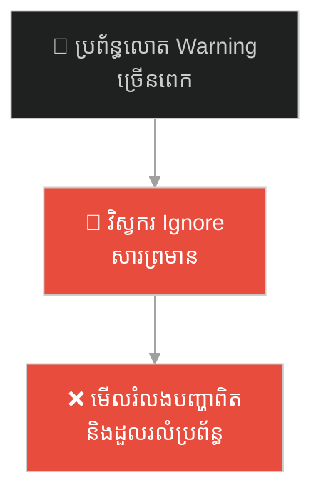
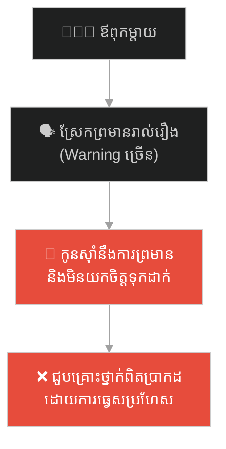
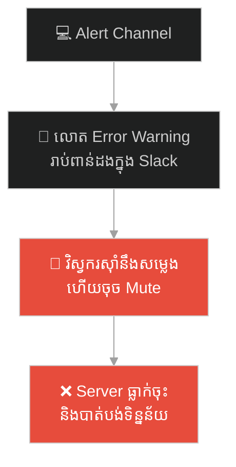
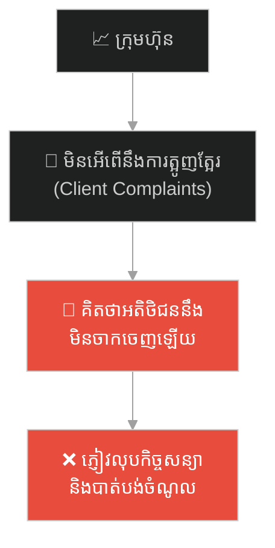
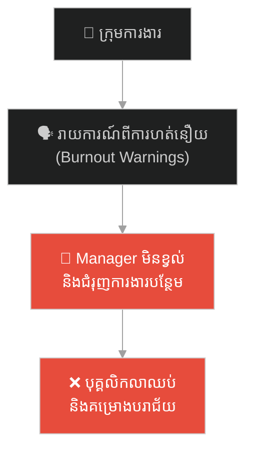
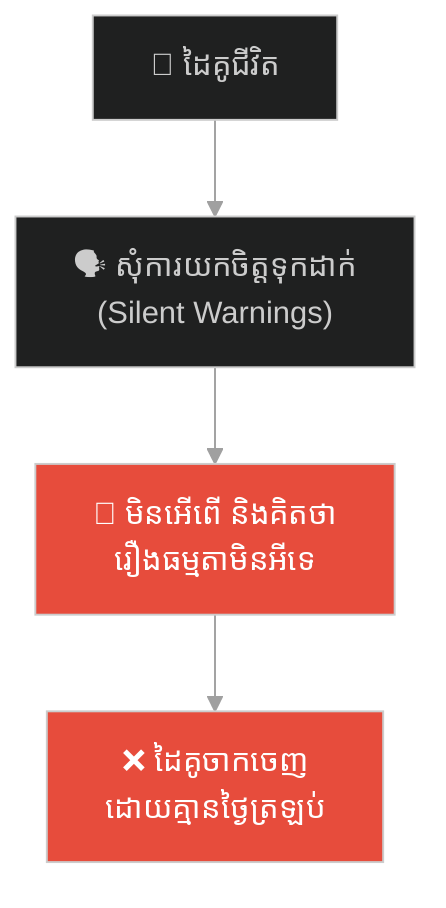
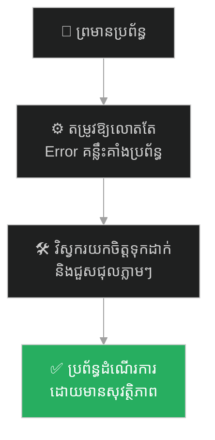

# The Unsinkable Ship (កប៉ាល់ដែលមិនចេះលិច)៖ នាវាទីតានិក និងគ្រោះថ្នាក់នៃជំងឺស៊ាំនឹងសញ្ញាព្រមាន

**Author:** ichamrong  
**Date:** 2026-05-27  
**Tags:** #titanic #parable #hubris #warnings #disaster-management #system-failure #alert-fatigue  
**Category:** Concepts / Parables  
**Read Time:** ~15 min  

---

## 📌 មាតិកា (Table of Contents)
- [អន្ទាក់ផ្លូវចិត្ត (The Trap)](#0)
- [១. រឿងព្រេងប្រវត្តិសាស្ត្រ៖ សោកនាដកម្មនៃនាវាទីតានិក (The Tragedy of RMS Titanic)](#1)
  - [ការមិនអើពើនឹងសញ្ញាព្រមាន និងការបុកទឹកកក (Ignoring the Warnings & the Iceberg)](#1-1)
- [២. បញ្ហា៖ ជំងឺស៊ាំនឹងសញ្ញាព្រមាន និងអំនួតនៃប្រព័ន្ធ (The Issue: Alert Fatigue & System Hubris)](#2)
- [៣. ឧទាហរណ៍ជាក់ស្តែងក្នុងពិភពពិត (Real World Examples)](#3)
  - [ឧទាហរណ៍ទី ១ — កម្រិតស្រាល (គ្រួសារ)៖ ការព្រមានកូនច្រើនពេករហូតដល់កូនលែងស្តាប់ (The Parent Alert Overload)](#3-1)
  - [ឧទាហរណ៍ទី ២ — កម្រិតមធ្យម (បច្ចេកទេស)៖ ការលោត Alert ក្នុង Slack រាប់ពាន់ដងនាំឱ្យវិស្វករចុច Mute (The Noise Alert Exhaustion)](#3-2)
  - [ឧទាហរណ៍ទី ៣ — កម្រិតមធ្យម (ធុរកិច្ច)៖ ការមើលរំលងការត្អូញត្អែររបស់អតិថិជនព្រោះគិតថាខ្លួនអស្ចារ្យ (The Customer Feedback Hubris)](#3-3)
  - [ឧទាហរណ៍ទី ៤ — កម្រិតមធ្យម (សង្គម/គ្រប់គ្រង)៖ ការមិនអើពើនឹងការរាយការណ៍ពីការហត់នឿយរបស់បុគ្គលិក (The Employee Burnout Blindness)](#1-1)
  - [ឧទាហរណ៍ទី ៥ — កម្រិតធ្ងន់ (ទំនាក់ទំនង)៖ ការមើលរំលងសំណូមពរតូចៗរបស់ដៃគូជីវិតរហូតដល់គេចាកចេញ (The Neglected Relationship Warnings)](#3-5)
- [៤. ដំណោះស្រាយទូទៅ៖ ការកាត់បន្ថយសំលេងរំខាន និងការរៀបចំផែនការបម្រុងសង្គ្រោះ (The General Solution: Alarm Tuning & Actionable Incident Playbooks)](#4)
- [សេចក្តីសន្និដ្ឋាន (Conclusion)](#5)
- [ឯកសារយោង (References)](#6)
- [Related Posts](#7)
---

## អន្ទាក់ផ្លូវចិត្ត (The Trap)

តើអ្នកធ្លាប់ជួបស្ថានភាពដែលប្រព័ន្ធរបស់អ្នកលោតសារព្រមាន (Warning Logs) រាល់ថ្ងៃ រហូតដល់អ្នកធុញទ្រាន់ ហើយសម្រេចចិត្តចុចបិទ ឬ Ignore វា រួចហើយថ្ងៃមួយប្រព័ន្ធទាំងមូលក៏ត្រូវគាំងទាំងស្រុងដែរឬទេ?

នៅក្នុងការគ្រប់គ្រងប្រព័ន្ធ និងជីវិតរស់នៅ៖
* **យើងងាយនឹងស៊ាំ** ទៅនឹងសម្លេងព្រមានដែលលោតញឹកញាប់ពេក (Alert Fatigue) រហូតដល់យើងមើលរំលងសញ្ញាគ្រោះថ្នាក់ពិតប្រាកដ។
* **យើងមានទំនុកចិត្តហួសហេតុ** លើភាពរឹងមាំនៃប្រព័ន្ធរបស់យើង (Hubris) ដោយគិតថាគ្មានអ្វីអាចបំផ្លាញវាបានឡើយ។

ការខ្វះការត្រៀមបម្រុង និងការមិនអើពើនឹងសញ្ញាព្រមានដោយសារតែការស៊ាំនឹងសម្លេង ហៅថា **Alert Fatigue (ជំងឺស៊ាំនឹងសញ្ញាព្រមាន)**។

ដើម្បីយល់ដឹងពីរបៀប tune ប្រព័ន្ធ និងការការពារវិបត្តិ នេះជាផែនទីបង្ហាញផ្លូវសម្រាប់អត្ថបទនេះ៖
1. **រឿងព្រេងប្រវត្តិសាស្ត្រ (The Historic Legend)** — សោកនាដកម្មនៃនាវាទីតានិក ដែលលិចទៅក្នុងបាតសមុទ្រព្រោះតែការមិនអើពើនឹងសារព្រមានផ្ទាំងទឹកកកចំនួន ៦ ដង។
2. **បញ្ហា (The Issue)** — តើអ្វីទៅជា Alert Fatigue នៅក្នុងវិស្វកម្មប្រព័ន្ធ (SRE)?
3. **ឧទាហរណ៍ជាក់ស្តែងក្នុងពិភពពិត (Real World Examples)** — ពិនិត្យមើលឥទ្ធិពលនៃការស៊ាំនឹងសញ្ញាព្រមានក្នុងកម្រិតគ្រួសារ ព័ត៌មានវិទ្យា ធុរកិច្ច ការគ្រប់គ្រង និងទំនាក់ទំនងស្នេហា។
4. **ដំណោះស្រាយទូទៅ (The General Solution)** — ការកាត់បន្ថយ Noise Alerts និងការបង្កើត Playbook សម្រាប់គ្រោះអាសន្ន។

---

## ១. រឿងព្រេងប្រវត្តិសាស្ត្រ៖ សោកនាដកម្មនៃនាវាទីតានិក (The Tragedy of RMS Titanic)

នៅឆ្នាំ ១៩១២ មនុស្សជាតិបានបង្កើតអច្ឆរិយៈនៃវិស្វកម្មទំនើបបំផុតមួយ គឺនាវា **ទីតានិក (RMS Titanic)**។ វាជាកប៉ាល់ដឹកអ្នកដំណើរដ៏ធំ និងប្រណីតបំផុត ដែលត្រូវបានបំពាក់ដោយបច្ចេកវិទ្យាចុងក្រោយបង្អស់ រួមទាំងទ្វារទប់ទឹកជ្រាបដោយស្វ័យប្រវត្ត (Watertight Compartments)។

ប្រព័ន្ធផ្សព្វផ្សាយ និងក្រុមហ៊ុនវិស្វកម្មសំណង់បានប្រកាសយ៉ាងក្រអឺតក្រទមថា៖  
> **«ទីតានិក គឺជាកប៉ាល់ដែលមិនចេះលិច (The Unsinkable Ship) ទោះបីជាព្រះជាម្ចាស់ផ្ទាល់ក៏មិនអាចធ្វើឱ្យវាលិចបានដែរ។»**

ដោយសារតែជំនឿខ្វាក់ភ្នែកលើប្រព័ន្ធសុវត្ថិភាពនេះ ក្រុមហ៊ុនបានកាត់បន្ថយចំនួនទូកសង្គ្រោះ (Lifeboats) ពីចំនួនដែលអាចសង្គ្រោះមនុស្ស ៣,០០០នាក់ មកនៅត្រឹមចំនួនដែលអាចសង្គ្រោះមនុស្សបានត្រឹមតែ ១,១៧៨នាក់ប៉ុណ្ណោះ ព្រោះពួកគេគិតថាទូកសង្គ្រោះនាំតែខូចសោភ័ណភាពដេកលេងលើកប៉ាល់ ហើយវាក៏មិនចាំបាច់ប្រើដែរ។

---

### ការមិនអើពើនឹងសញ្ញាព្រមាន និងការបុកទឹកកក (Ignoring the Warnings & the Iceberg)

នៅយប់ថ្ងៃទី ១៤ ខែមេសា ឆ្នាំ ១៩១២ នាវាទីតានិកកំពុងធ្វើដំណើរក្នុងល្បឿនយ៉ាងលឿនកាត់មហាសមុទ្រអាត្លង់ទិក។ 

នៅក្នុងបន្ទប់វិទ្យុទាក់ទងរបស់កប៉ាល់ អ្នកទទួលសារមានភាពមមាញឹកយ៉ាងខ្លាំងក្នុងការផ្ញើសារទូរលេខ (Wireless Telegrams) ជូនពួកអភិជន និងអ្នកមាននៅលើកប៉ាល់ ទៅកាន់ក្រុមគ្រួសាររបស់ពួកគេនៅញូវយ៉ក។ នេះជាមុខងាររកលុយ (Feature Delivery)។

ពេញមួយថ្ងៃនោះ កប៉ាល់ផ្សេងៗទៀតដែលធ្វើដំណើរក្នុងតំបន់នោះ បានផ្ញើសារព្រមានអំពី "ផ្ទាំងទឹកកក (Icebergs)" ចំនួន **៦ ដង** មកកាន់ទីតានិក។ 
* សារព្រមានទី១ ទី២ និងទី៣ ត្រូវបានពួកគេអាន រួចកត់ត្រាទុកធម្មតា ប៉ុន្តែមិនបានបញ្ជូនទៅឱ្យប្រធានក្រុមឡើយ ព្រោះស៊ាំនឹងព័ត៌មានទឹកកក។
* នៅពេលសារព្រមានទី៦ លោតចូលមកពីកប៉ាល់ Californian ដែលនៅក្បែរនោះ អ្នកវិទ្យុទាក់ទងរបស់ទីតានិកដែលកំពុងតែធុញថប់នឹងការផ្ញើសារជូនភ្ញៀវ បានវាយតបទៅកប៉ាល់ Californian វិញដោយកំហឹងថា៖  
> **«បិទមាត់ទៅ! កុំរំខានអញ! អញកំពុងរវល់ផ្ញើសារ (Shut up! I am busy!)»**

កប៉ាល់ Californian ក៏សម្រេចចិត្តបិទវិទ្យុទាក់ទងរបស់ខ្លួន រួចនាវិកចូលដេកអស់។

ត្រឹមតែ ៤០ នាទីក្រោយពីបានបដិសេធសញ្ញាព្រមានចុងក្រោយ នាវាទីតានិកបានបុកទង្គិចពេញទំហឹងជាមួយផ្ទាំងទឹកកកដ៏ធំមួយ។ ទ្វារទប់ទឹករបស់វាត្រូវបានធ្លាយលើសពីកម្រិតកំណត់។ កប៉ាល់ចាប់ផ្តើមលិចយឺតៗ។ ពេលនោះហើយដែលពួកគេទើបតែដឹងខ្លួនថា ពួកគេមិនមានទូកសង្គ្រោះគ្រប់គ្រាន់ឡើយ។ ជីវិតមនុស្សជាង ១,៥០០ នាក់ ត្រូវបានបាត់បង់ទៅក្នុងមហាសមុទ្រដ៏ត្រជាក់ រួមជាមួយកប៉ាល់ដែល "មិនចេះលិច" នោះជារៀងរហូត។

---

## ២. បញ្ហា៖ ជំងឺស៊ាំនឹងសញ្ញាព្រមាន និងអំនួតនៃប្រព័ន្ធ (The Issue: Alert Fatigue & System Hubris)

សោកនាដកម្មនេះ ឆ្លុះបញ្ចាំងពីគោលការណ៍ **Alert Fatigue** នៅក្នុងវិស័យគ្រប់គ្រងប្រព័ន្ធព័ត៌មានវិទ្យា (Site Reliability Engineering - SRE)៖

* **Alert Fatigue (ជំងឺស៊ាំនឹងសញ្ញាព្រមាន)៖** កើតឡើងនៅពេលដែលប្រព័ន្ធបច្ចេកវិទ្យារបស់អ្នក លោតសារព្រមាន (Warning Logs/Alerts) ច្រើនពេកដោយគ្មានប្រយោជន៍។ វិស្វករនឹងចាប់ផ្តើមធុញទ្រាន់ ហើយចុច Ignore វា ឬបិទសំលេងចោល។ គ្រោះថ្នាក់ពិតប្រាកដ នឹងមកដល់នៅពេលដែលអ្នកធ្វេសប្រហែសបំផុត។
* **Feature Delivery vs. System Safety៖** ការផ្ញើសារឱ្យភ្ញៀវ (Feature) ត្រូវបានផ្តល់អាទិភាពខ្ពស់ជាងសារព្រមានសុវត្ថិភាព (Safety)។ នៅក្នុងក្រុមហ៊ុន នេះគឺប្រៀបដូចជាការដែលនាយកប្រតិបត្តិ (CEO) បញ្ជាឱ្យវិស្វករឈប់ជួសជុល Server Bug ព្រោះត្រូវប្រញាប់សរសេរ Feature ថ្មីលក់យកលុយ។

---

## ៣. ឧទាហរណ៍ជាក់ស្តែងក្នុងពិភពពិត

ដើម្បីយល់ដឹងឱ្យកាន់តែច្បាស់ នេះជាការវិភាគលើឧទាហរណ៍ ៥ កម្រិតផ្សេងគ្នា៖

---

### ឧទាហរណ៍ទី ១ — កម្រិតស្រាល (គ្រួសារ)៖ ការព្រមានកូនច្រើនពេករហូតដល់កូនលែងស្តាប់ (The Parent Alert Overload)

**ស្ថានភាព៖** ឪពុកម្តាយដែលបារម្ភពីកូនពេក ស្រែកព្រមានកូនរាល់ពេល៖ *«កុំរត់ក្រែងលោដួល! កុំហូបអាហ្នឹងក្រែងឈឺពោះ! កុំកាន់អាហ្នឹង!»*។

* **ជម្រើសខុស (Alert Noise)៖** ព្រមានគ្រប់រឿងតូចតាចដោយមិនបែងចែកកម្រិតគ្រោះថ្នាក់។
* **លទ្ធផល៖** កូនជំទង់ចាប់ផ្តើមស៊ាំនឹងសម្លេងព្រមានរបស់ឪពុកម្តាយ (ធុញទ្រាន់) ហើយចាត់ទុកវាជាសម្លេងរំខាន (White Noise)។ ថ្ងៃមួយ ពេលឪពុកម្តាយស្រែកព្រមានពីគ្រោះថ្នាក់ពិតប្រាកដ (ដូចជា ឡានមកពីក្រោយ) កូនបដិសេធមិនស្តាប់ ព្រោះស៊ាំនឹងការស្រែកព្រមានរាល់ដង។

**ដំណោះស្រាយ៖**  
ឪពុកម្តាយត្រូវទុកការព្រមានឱ្យចំតែរឿងធំៗ និងមានគ្រោះថ្នាក់ពិតប្រាកដ (Tune the alerts)។ រឿងតូចតាចត្រូវបណ្តោយឱ្យកូនរៀនសាកល្បង និងជួបបទពិសោធន៍ផ្ទាល់ខ្លួនខ្លះ។

---

### ឧទាហរណ៍ទី ២ — កម្រិតមធ្យម (បច្ចេកទេស)៖ ការលោត Alert ក្នុង Slack រាប់ពាន់ដងនាំឱ្យវិស្វករចុច Mute (The Noise Alert Exhaustion)

**ស្ថានភាព៖** ក្រុម DevOps បង្កើត Channel ព្រមានក្នុង Slack ឈ្មោះ `#prod-alerts`។ រាល់ពេលដែលមាន User វាយ Password ខុស ឬមាន Latency ឡើងបន្តិចបន្តួច វាតែងតែលោត Tag `@here` គ្រប់ពេលវេលា។

* **ជម្រើសខុស៖** បង្កើត Notification សម្រាប់រាល់ព្រឹត្តិការណ៍ធម្មតា។
* **លទ្ធផល៖** វិស្វករទទួលបានសារព្រមាន ១,០០០ ដងក្នុងមួយថ្ងៃ។ ពួកគេចាប់ផ្តើមធុញទ្រាន់ ក៏ចុច Mute Channel នោះចោល។ យប់មួយ Server Database ធ្លាក់ចុះទាំងស្រុង (Database Crash)។ សារព្រមានលោតចូល Channel ដដែល តែគ្មានវិស្វករណាម្នាក់បានឃើញឡើយ ព្រោះ Channel ត្រូវបាន Mute រួចទៅហើយ។

**ដំណោះស្រាយ៖**  
លុបបំបាត់ Alert Noise។ កំណត់ឱ្យលោត Alert តែចំពោះបញ្ហាណាដែលមានផលប៉ះពាល់ដល់អតិថិជនពិតប្រាកដ (Actionable Alerts) រីឯបញ្ហាតូចតាចត្រូវកត់ត្រាទុកក្នុងប្រព័ន្ធ Logs ធម្មតា។

---

### ឧទាហរណ៍ទី ៣ — កម្រិតមធ្យម (ធុរកិច្ច)៖ ការមើលរំលងការត្អូញត្អែររបស់អតិថិជនព្រោះគិតថាខ្លួនអស្ចារ្យ (The Customer Feedback Hubris)

**ស្ថានភាព៖** ក្រុមហ៊ុនសេវាកម្មដឹកជញ្ជូនមួយទទួលបានជោគជ័យ និងគ្រប់គ្រងទីផ្សារធំ។ ជារៀងរាល់ខែ អតិថិជនតែងតែផ្ញើសាររអ៊ូរទាំពីការយឺតយ៉ាវនៃ App និងការមិនគោរពពេលវេលារបស់អ្នកដឹកជញ្ជូន។

* **ជម្រើសខុស៖** ថ្នាក់ដឹកនាំគិតថា៖ *«យើងមានម៉ូយច្រើនណាស់ ពួកគេគ្រាន់តែរអ៊ូធម្មតាប៉ុណ្ណោះ គ្មាន App ណាជំនួសយើងបានឡើយ!»*។
* **លទ្ធផល៖** ពួកគេមិនអើពើនឹងការកែលម្អប្រព័ន្ធសេវាកម្មឡើយ។ ស្រាប់តែក្រុមហ៊ុនគូប្រជែងថ្មីមួយបើកដំណើរការ ដោយផ្តោតលើល្បឿន និងសេវាកម្មល្អ។ អតិថិជនទាំងអស់បានសម្រេចចិត្តចាកចេញទៅប្រើប្រាស់សេវាកម្មថ្មីភ្លាមៗ ធ្វើឱ្យក្រុមហ៊ុនធ្លាក់ចុះចំណូល ៨០% ក្នុងរយៈពេល ៣ ខែ។

**ដំណោះស្រាយ៖**  
ចាត់ទុកការត្អូញត្អែររបស់អតិថិជនជាសញ្ញាព្រមានផ្ទាំងទឹកកក (Iceberg Warnings)។ ត្រូវបង្កើតគណៈកម្មការត្រួតពិនិត្យគុណភាពសេវាកម្ម និងកែលម្អប្រព័ន្ធជាប្រចាំ។

---

### ឧទាហរណ៍ទី ៤ — កម្រិតមធ្យម (សង្គម/គ្រប់គ្រង)៖ ការមិនអើពើនឹងការរាយការណ៍ពីការហត់នឿយរបស់បុគ្គលិក (The Employee Burnout Blindness)

**ស្ថានភាព៖** នៅក្នុងគម្រោងធំមួយ វិស្វករបានប្រាប់ប្រធានក្រុម (Manager) ជាច្រើនដងថា៖ *«យើងកំពុងហត់នឿយខ្លាំងណាស់ (Burnout) ការថែមម៉ោងរាល់យប់ធ្វើឱ្យយើងមានសម្ពាធផ្លូវចិត្ត»*។

* **ជម្រើសខុស៖** Manager គិតថា៖ *«ពួកគេគ្រាន់តែរអ៊ូរទាំធម្មតាទេ ធ្វើការងារ Sprints តែងតែហត់បែបនេះហើយ ដកដង្ហើមវែងៗទៅមិនអីទេ!»*។
* **លទ្ធផល៖** ពីរខែក្រោយមក វិស្វករឆ្នើម ៣ នាក់បានដាក់ពាក្យលាឈប់ពីការងារព្រមៗគ្នា ចំពេលគម្រោងហៀបនឹងប្រគល់ឱ្យភ្ញៀវ។ គម្រោងត្រូវខកខានការបញ្ចេញ ក្រុមហ៊ុនរងការពិន័យ និងបាត់បង់កេរ្តិ៍ឈ្មោះ។

**ដំណោះស្រាយ៖**  
ចាត់ទុកការរាយការណ៍របស់បុគ្គលិកជាទិន្នន័យវាស់វែងសុខភាពក្រុម (Health Metrics)។ ត្រូវរៀបចំការពិភាក្សា ១ ទល់ ១ (1-on-1) និងកែសម្រួលល្បឿនការងារ (Pacing) ដើម្បីរក្សានិរន្តរភាពរបស់ក្រុម។

---

### ឧទាហរណ៍ទី ៥ — កម្រិតធ្ងន់ (ទំនាក់ទំនង)៖ ការមើលរំលងសំណូមពរតូចៗរបស់ដៃគូជីវិតរហូតដល់គេចាកចេញ (The Neglected Relationship Warnings)

**ស្ថានភាព៖** នៅក្នុងជីវិតអាពាហ៍ពិពាហ៍ ដៃគូ A តែងតែរអ៊ូរទាំពីការខ្វះពេលវេលា និងការខ្វះការជជែកគ្នាលេង៖ *«បងជួយស្តាប់ខ្ញុំបន្តិចបានទេ? បងធ្លាប់ជូនខ្ញុំដើរលេងដូចមុនទេ?»*។

* **ជម្រើសខុស៖** ដៃគូ B គិតថា៖ *«នាងគ្រាន់តែរអ៊ូតាមទម្លាប់មនុស្សស្រីប៉ុណ្ណោះ យូរៗទៅប្រាកដជាបាត់ទៅវិញមិនខាន នាងគ្មានថ្ងៃចាកចេញពីផ្ទះដ៏ប្រណីតនេះឡើយ»*។
* **លទ្ធផល៖** ថ្ងៃមួយ ដៃគូ B ត្រឡប់មកពីធ្វើការងារវិញ ស្រាប់តែទតឃើញផ្ទះស្ងាត់ជ្រងំ ដោយមានលិខិតលែងលះដាក់លើតុ រួមទាំងវ៉ាលីរបស់នាងត្រូវបានយកចេញអស់។ សញ្ញាព្រមានជាច្រើនឆ្នាំត្រូវបានមើលរំលង រហូតដល់ហួសពេលកែខ្សាយ។

**ដំណោះស្រាយ៖**  
ចងចាំថា ការឈប់និយាយ ឬឈប់រអ៊ូរទាំរបស់ដៃគូ មិនមែនជាសញ្ញានៃការយល់ព្រមនោះទេ តែវាជាសញ្ញានៃការចុះចាញ់ (Apathy)។ ត្រូវស្តាប់ដោយយកចិត្តទុកដាក់ និងចំណាយពេលបង្កើតទំនាក់ទំនងល្អជាប្រចាំ។

---

## ៤. ដំណោះស្រាយទូទៅ៖ ការកាត់បន្ថយសំលេងរំខាន និងការរៀបចំផែនការបម្រុងសង្គ្រោះ (The General Solution: Alarm Tuning & Actionable Incident Playbooks)

เพื่อការពារកប៉ាល់ ឬប្រព័ន្ធរបស់អ្នកពីការលិចលង់ដោយសារជំងឺស៊ាំនឹងសញ្ញាព្រមាន ត្រូវអនុវត្តវិធីសាស្ត្រគន្លឹះទាំងនេះ៖

### ១. ធ្វើការតម្រូវសំលេងព្រមាន (Tune Your Monitoring System)

* **នៅក្នុងវិស្វកម្ម៖** កំណត់កម្រិតលោត Alert ឱ្យបានច្បាស់លាស់។ ហាមលោតសារព្រមានចំពោះបញ្ហាតូចតាចដែលមិនត្រូវការការជួសជុលភ្លាមៗ។ ធានាថារាល់ពេលលោត Alert វិស្វករត្រូវតែមានសកម្មភាពជួសជុលជាក់ស្តែង (Actionable Alert)។
* **នៅក្នុងជីវិត៖** កំណត់អាទិភាពនៃរឿងរ៉ាវ។ កុំរអ៊ូរទាំ ឬខឹងសម្បារនឹងរឿងមិនសំខាន់ ដើម្បីរក្សាទម្ងន់នៃសម្តីរបស់អ្នកនៅពេលនិយាយពីរឿងធំ។

### ២. រៀបចំផែនការបម្រុង និង Playbook ជាក់ស្តែង (Create Incident Playbooks)

* ត្រូវមាន playbooks សម្រាប់ដោះស្រាយគ្រោះអាសន្ន។ នៅពេលជួបបញ្ហា ក្រុមការងារត្រូវដឹងភ្លាមថាត្រូវធ្វើអ្វី ដោយមិនចាំបាច់មានការស្លន់ស្លោ (Panic Mode)។
* ធានាថាអ្នកតែងតែមាន "ទូកសង្គ្រោះ (Lifeboats/Backups)" គ្រប់គ្រាន់សម្រាប់កាលៈទេសៈអាក្រក់បំផុត ទោះបីជាអ្នកជឿជាក់ថាប្រព័ន្ធរបស់អ្នករឹងមាំយ៉ាងណាក៏ដោយ។

### ៣. អនុវត្តវប្បធម៌ទម្លាក់អំនួត (Post-mortem & Blameless Culture)

* រៀនសូត្រពីកំហុសអតីតកាល។ រាល់ពេលមានបញ្ហាកើតឡើង ត្រូវធ្វើការវិភាគដើម្បីស្វែងរកឫសគល់ (Root Cause) និងកែលម្អប្រព័ន្ធកុំឱ្យបញ្ហានោះកើតឡើងម្តងទៀត។

---

## 🐇 ធ្លាក់ចូលក្នុងរន្ធទន្សាយ (Enter the Rabbit Hole)

ដើម្បីស្វែងយល់បន្ថែមអំពីរបៀបដោះស្រាយវិបត្តិ និងការកែលម្អប្រព័ន្ធតាមរយៈការបរាជ័យជាបន្តបន្ទាប់ និងការរៀនសូត្រពីកំហុសឆ្គង (The Successful Failure) សូមបន្តដំណើរទៅកាន់ Parable បន្ទាប់៖

* 🚀 **[ចាប់ផ្តើមដំណើររុករក (Start the Journey) ➔ The Successful Failure](./46-the-successful-failure.md)**

---

## សេចក្តីសន្និដ្ឋាន (Conclusion)

> **«កប៉ាល់ដែលមិនចេះលិច គឺជាកប៉ាល់ដែលមិនទាន់ជួបផ្ទាំងទឹកកករបស់វាប៉ុណ្ណោះ។ គ្មានប្រព័ន្ធណាដែលល្អឥតខ្ចោះនោះទេ។ ភាពឆ្លាតវៃ គឺស្ថិតនៅលើការស្តាប់សញ្ញាព្រមាន និងការរៀបចំទូកសង្គ្រោះឱ្យបានគ្រប់គ្រាន់ជានិច្ច។»**

អ្នកវិទ្យុទាក់ទងរបស់ទីតានិកបានបដិសេធសញ្ញាព្រមានព្រោះរវល់ផ្ញើសារភ្ញៀវ។ ចូរកុំបណ្តោយឱ្យ "មុខងារថ្មី" ឬ "មោទនភាពបណ្តោះអាសន្ន" ធ្វើឱ្យអ្នកមើលរំលងការជួសជុលសុវត្ថិភាពប្រព័ន្ធ និងទំនាក់ទំនងរបស់អ្នកឡើយ។

---

## ឯកសារយោង (References)

* **Walter Lord** — *A Night to Remember* (1955)។ ឯកសារយោងលម្អិតបំផុតអំពីពេលវេលានីមួយៗរបស់នាវាទីតានិក និងសារព្រមានដែលត្រូវបានមើលរំលង។
* **Rob Ewaschuk** — *My Philosophy on Alerting* (Google SRE Book Reference)។ សៀវភៅណែនាំស្តីពីការរចនាប្រព័ន្ធ Alert ដើម្បីលុបបំបាត់ Alert Fatigue។
* **Sidney Dekker** — *The Field Guide to Understanding 'Human Error'* (2014)។ ការយល់ដឹងពីកំហុសរបស់មនុស្ស និងការរៀបចំប្រព័ន្ធការពារកំហុស។

---

## Related Posts

* **[37 The Titanic: Alert Fatigue and the Hubris of Unsinkable Systems](../articles/37-the-titanic-and-alert-fatigue.md)** — អត្ថបទគោលលម្អិតបកស្រាយពីយន្តការ Alert Fatigue និងគោលការណ៍ SRE ក្នុងបច្ចេកវិទ្យា។
* **[25 The Sword of Damocles](./33-the-sword-of-damocles.md)** — ការគ្រប់គ្រងហានិភ័យ និងការត្រៀមលក្ខណៈបម្រុងក្នុងភាពជាអ្នកដឹកនាំ។
* **[28 The Missing Horseshoe Nail and the Fallen Kingdom](./28-the-horseshoe-nail-and-the-fallen-kingdom.md)** — មេរៀនស្តីពីការរាលដាលនៃកំហុសតូចតាចដែលមើលរំលង។

---
*Last updated: 2026-05-27*

## Related

- [💡 Concepts README](../README.md)
- [📚 Main Repository README](../../../README.md)
- [Developer Habits](../../developer-habits/README.md)
- [Mental Health & Well-being](../../mental-health/README.md)
- [Management & SDLC](../../management/README.md)
