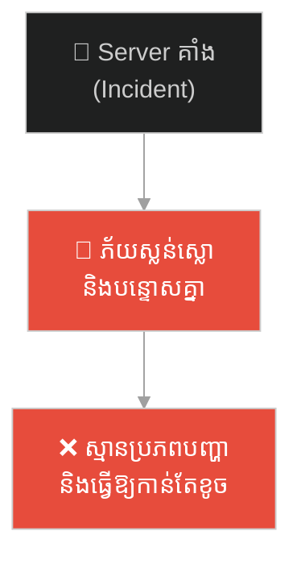
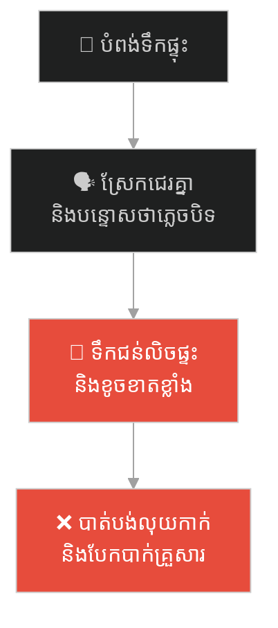
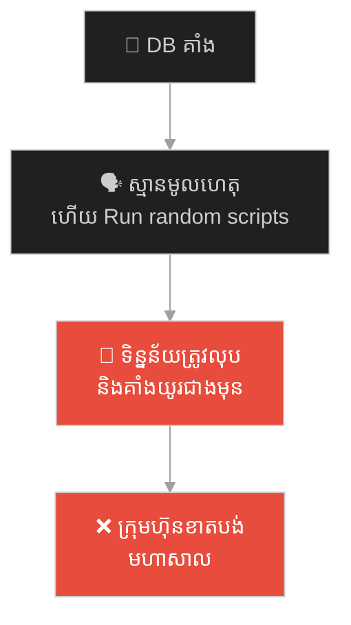
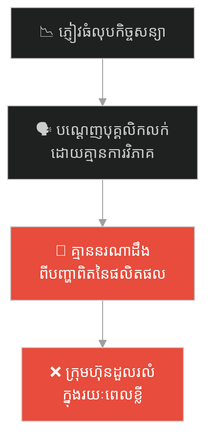
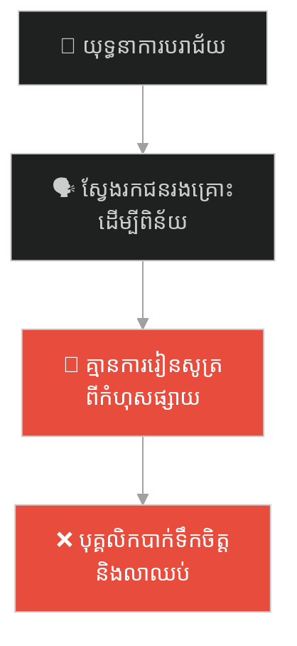
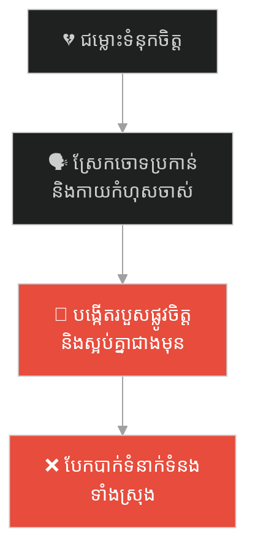
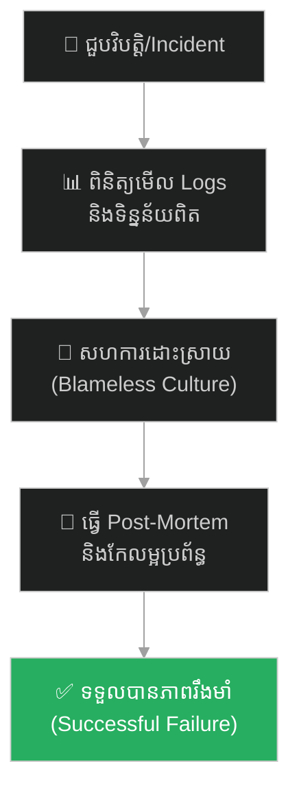

# The Successful Failure (បរាជ័យដ៏ជោគជ័យ)៖ អាប៉ូឡូ ១៣ និងយុទ្ធសាស្ត្រគ្រប់គ្រងវិបត្តិដោយគ្មានការស្តីបន្ទោស (Blameless Incident Management)

**Author:** ichamrong  
**Date:** 2026-05-27  
**Tags:** #apollo-13 #incident-response #crisis-management #post-mortem #resilience #parable  
**Category:** Concepts / Parables  
**Read Time:** ~15 min  

---

## 📌 មាតិកា (Table of Contents)
- [អន្ទាក់ផ្លូវចិត្ត (The Trap)](#0)
- [១. បេសកកម្មអាប៉ូឡូ ១៣៖ ហ៊ូស្តុន ពួកយើងមានបញ្ហាហើយ (The Legend of Apollo 13)](#1)
  - [ការដោះស្រាយបញ្ហាជាក់ស្តែង (Working the Problem)](#1-1)
- [២. បញ្ហា៖ ការគ្រប់គ្រងហេតុការណ៍ដោយ Blameless និងការស៊ើបអង្កេតប្រភពបញ្ហា (The Issue: Blameless Incident Management)](#2)
- [៣. ឧទាហរណ៍ជាក់ស្តែងក្នុងពិភពពិត (Real World Examples)](#3)
  - [ឧទាហរណ៍ទី ១ — កម្រិតស្រាល (គ្រួសារ)៖ ការដោះស្រាយបំពង់ទឹកផ្ទុះក្នុងផ្ទះ (The Household Water Crisis)](#3-1)
  - [ឧទាហរណ៍ទី ២ — កម្រិតមធ្យម (បច្ចេកទេស)៖ ការដោះស្រាយវិបត្តិ Server Downtime ដោយប្រើទិន្នន័យ (The Database Outage)](#3-2)
  - [ឧទាហរណ៍ទី ៣ — កម្រិតមធ្យម (ធុរកិច្ច)៖ ការស្តារក្រុមហ៊ុនក្រោយបាត់បង់អតិថិជនធំ (The Post-Churn Pivot)](#3-3)
  - [ឧទាហរណ៍ទី ៤ — កម្រិតមធ្យម (សង្គម/គ្រប់គ្រង)៖ ដំណើរការ Post-Mortem នៃយុទ្ធនាការលក់ដែលបរាជ័យ (The Failed Marketing Campaign)](#3-4)
  - [ឧទាហរណ៍ទី ៥ — កម្រិតធ្ងន់ (ទំនាក់ទំនង)៖ ការដោះស្រាយវិបត្តិបន្ទាប់ពីការក្បត់ទំនុកចិត្ត (Rebuilding Relationship Trust)](#3-5)
- [៤. ដំណោះស្រាយទូទៅ៖ ការបង្កើតវប្បធម៌ Blameless Post-Mortem និងការ Incident Response (The General Solution: Blameless Post-Mortems & Incident Runbooks)](#4)
- [សេចក្តីសន្និដ្ឋាន (Conclusion)](#5)
- [ឯកសារយោង (References)](#6)
- [Related Posts](#7)

---

## អន្ទាក់ផ្លូវចិត្ត (The Trap)

តើអ្នកធ្លាប់ជួបស្ថានភាពដែលប្រព័ន្ធការងារជួបវិបត្តិធំ រួចសមាជិកក្រុមទាំងអស់ចាប់ផ្តើមភ័យស្លន់ស្លោ ស្រែកបន្ទោសគ្នា និងប្រញាប់ស្មានរកមុខអ្នកខុស ដែលចុងក្រោយធ្វើឱ្យស្ថានការណ៍កាន់តែវឹកវរ និងខូចខាតធ្ងន់ធ្ងរជាងមុនដែរឬទេ?

នៅក្នុងការគ្រប់គ្រង និងការអភិវឌ្ឍប្រព័ន្ធ៖
* **យើងងាយនឹងឆ្លើយតបដោយអារម្មណ៍** (Panic & Blame) នៅពេលមានវិបត្តិធំ ដើម្បីដោះសារការពារខ្លួនឯង។
* **យើងមើលរំលង** ការពិតដែលថា វិបត្តិគឺជាឱកាសដ៏ល្អបំផុតក្នុងការស្វែងយល់ពីចំណុចខ្សោយលាក់កំបាំងរបស់ប្រព័ន្ធ ប្រសិនបើយើងដោះស្រាយវាដោយសមហេតុផល និងគ្មានការស្តីបន្ទោស។

ការបណ្តោយឱ្យការភ័យស្លន់ស្លោ និងការស្វែងរកជនរងគ្រោះ (Scapegoating) បំផ្លាញសមត្ថភាពដោះស្រាយបញ្ហា ហៅថា **អន្ទាក់ Panic & Blame (លម្អៀងវិបត្តិ)**។

ដើម្បីយល់ដឹងពីវិធីគ្រប់គ្រងវិបត្តិ និងការកសាងភាពរឹងមាំ នេះជាផែនទីបង្ហាញផ្លូវសម្រាប់អត្ថបទនេះ៖
1. **រឿងព្រេងប្រវត្តិសាស្ត្រ (The Historic Legend)** — បេសកកម្ម អាប៉ូឡូ ១៣ របស់អង្គការ NASA និងការបង្វែរបរាជ័យទៅជាជោគជ័យដ៏អស្ចារ្យ។
2. **បញ្ហា (The Issue)** — តើអ្វីទៅជា Blameless Incident Management និងវប្បធម៌រៀនសូត្រពីកំហុស?
3. **ឧទាហរណ៍ជាក់ស្តែងក្នុងពិភពពិត (Real World Examples)** — ពិនិត្យមើលការដោះស្រាយវិបត្តិក្នុងកម្រិតគ្រួសារ ព័ត៌មានវិទ្យា ធុរកិច្ច ការគ្រប់គ្រង និងទំនាក់ទំនងស្នេហា។
4. **ដំណោះស្រាយទូទៅ (The General Solution)** — ការបង្កើតដំណើរការ Blameless Post-Mortem និងការរៀបចំ Playbook ដោះស្រាយវិបត្តិ។

---

## ១. បេសកកម្មអាប៉ូឡូ ១៣៖ ហ៊ូស្តុន ពួកយើងមានបញ្ហាហើយ (The Legend of Apollo 13)

នៅខែមេសា ឆ្នាំ ១៩៧០ អង្គការ NASA បានបាញ់បង្ហោះយានអវកាស **អាប៉ូឡូ ១៣ (Apollo 13)** ឆ្ពោះទៅកាន់ព្រះច័ន្ទ ក្នុងបេសកកម្មចុះចតលើកទី៣ របស់មនុស្សជាតិ។ អវកាសយានិកបីនាក់គឺ ជេម ឡូវែល (Jim Lovell), ជេក ស្វីហ្គើត (Jack Swigert), និង ហ្វ្រេដ ហៃសេ (Fred Haise) ធ្វើដំណើរទៅដោយក្តីរំភើប និងជឿជាក់លើបច្ចេកវិទ្យាដ៏ទំនើបរបស់យាន។

ប៉ុន្តែនៅយប់ថ្ងៃទី១៣ ខែមេសា ស្ថិតនៅចម្ងាយជាង ៣២០,០០០ គីឡូម៉ែត្រពីផែនដី ស្រាប់តែមានសម្លេងផ្ទុះយ៉ាងខ្លាំងកើតឡើង។ ធុងអុកស៊ីសែនលេខ២ នៅក្នុងយានសេវាកម្ម (Service Module) បានផ្ទុះបែកខ្ទេច។ 

ការផ្ទុះនេះបានបំផ្លាញប្រព័ន្ធអគ្គិសនី ប្រព័ន្ធទឹក និងប្រព័ន្ធខ្យល់អុកស៊ីសែនដកដង្ហើមរបស់យានចម្បង (Odyssey) ស្ទើរតែទាំងស្រុង។ ស្វីហ្គើតបានទាក់ទងមកផែនដីភ្លាមៗនូវឃ្លាប្រវត្តិសាស្ត្រ៖  
> **«Houston, we've had a problem here. (ហ៊ូស្តុន ពួកយើងមានបញ្ហាហើយ)»**

យានអវកាសកំពុងតែហូរខ្យល់អុកស៊ីសែនចោលទៅក្នុងលំហអាកាសដ៏ធំធេង។ អវកាសយានិកទាំងបីនាក់មានពេលតែប៉ុន្មានម៉ោងប៉ុណ្ណោះ មុនពេលខ្យល់ដង្ហើម និងថាមពលយានត្រូវអស់ទាំងស្រុង ដែលមានន័យថាពួកគេត្រូវកកឈាមស្លាប់ក្នុងលំហងងឹត។

---

### ការដោះស្រាយបញ្ហាជាក់ស្តែង (Working the Problem)

នៅឯមជ្ឈមណ្ឌលបញ្ជាជើងហោះហើរ (Mission Control) នៅក្រុងហ៊ូស្តុន ភាពវឹកវរបានកើតឡើង។ វិស្វករនិងទីប្រឹក្សាជាច្រើនចាប់ផ្តើមស្លន់ស្លោ និងជជែកវែកញែករកមុខអ្នកខុសដែលរៀបចំប្រព័ន្ធ។ 

ប៉ុន្តែ នាយកគ្រប់គ្រងជើងហោះហើរលោក **ជីន ក្រានស៍ (Gene Kranz)** បានទះតុប្រកាសយ៉ាងដាច់អហង្ការថា៖  
> **«ស្ងាត់ទាំងអស់គ្នា! កុំទាយ! តោះផ្តោតលើការដោះស្រាយបញ្ហានេះ។ កុំធ្វើឱ្យស្ថានការណ៍កាន់តែអាក្រក់ដោយការទាយ និងការបន្ទោសគ្នា (Work the problem, people. Let's not make things worse by guessing)។»**

ជីន ក្រានស៍ បានប្រមូលផ្តុំអ្នកវិទ្យាសាស្ត្រ និងវិស្វករទាំងអស់ ឱ្យលះបង់ចោលចក្ខុវិស័យ "ចុះចតលើព្រះច័ន្ទ"។ គោលដៅឥឡូវនេះមានតែមួយគត់៖ **នាំមនុស្សទាំងបីនាក់វិលត្រឡប់មកផែនដីវិញដោយសុវត្ថិភាព។**

ពួកគេបានបង្កើតក្រុមការងារបច្ចេកទេសពិសេសមួយ ដោយចាក់សោរខ្លួនឯងនៅក្នុងបន្ទប់មួយ ដែលមានតែឧបករណ៍ និងសម្ភារៈប៉ុន្មានដុំដែលអវកាសយានិកមាននៅលើអាកាស។ ពួកគេបានប្រើប្រាស់ប្រអប់ក្រដាសកាតុង ថង់ប្លាស្ទិក ស្រោមជើង និងស្កុត ដើម្បីច្នៃបង្កើតឧបករណ៍ចម្លែកមួយសម្រាប់បន្សុទ្ធខ្យល់កាបូនឌីអុកស៊ីតក្នុងយានអវកាសបណ្តោះអាសន្ន។

តាមរយៈការសម្រេចចិត្តផ្អែកលើទិន្នន័យពិត (Data-driven) ភាពនឹងនរ និងការសហការ Blameless ទាំងស្រុង យានអាប៉ូឡូ ១៣ បានបង្ខំចិត្តហោះក្រឡឹងជុំវិញព្រះច័ន្ទ ដើម្បីយកកម្លាំងទំនាញរុញយានយាងត្រឡប់មកធ្លាក់ចូលក្នុងមហាសមុទ្រប៉ាស៊ីហ្វិកដោយសុវត្ថិភាព។

អ្នកកាសែតសួរថា៖ *«តើនេះគឺជាបរាជ័យដ៏ធំបំផុតរបស់ NASA មែនទេ?»*  
ជីន ក្រានស៍ បានឆ្លើយតបថា៖ *«ទេ នេះគឺជា **មហាបរាជ័យដ៏ជោគជ័យបំផុត (A Successful Failure)** ព្រោះវាបានសង្គ្រោះជីវិតមនុស្ស និងបង្រៀនយើងឱ្យយល់ពីចំណុចខ្សោយពិតប្រាកដនៃយាន ដែលគ្មានថ្ងៃកើតឡើងម្តងទៀតឡើយ។»*

---

## ២. បញ្ហា៖ ការគ្រប់គ្រងហេតុការណ៍ដោយ Blameless និងការស៊ើបអង្កេតប្រភពបញ្ហា (The Issue: Blameless Incident Management)

រឿងព្រេងនេះឆ្លុះបញ្ចាំងពីគោលការណ៍ **Blameless Incident Management (ការគ្រប់គ្រងហេតុការណ៍ដោយគ្មានការស្តីបន្ទោស)** នៅក្នុងឧស្សាហកម្មវិស្វកម្ម៖

* **វប្បធម៌ស្តីបន្ទោស (Blame Culture)៖** នៅពេលមានបញ្ហា ប្រព័ន្ធតែងតែស្វែងរក "នរណាជាអ្នកខុស" ដើម្បីពិន័យ ឬបណ្តេញចេញ។ នេះធ្វើឱ្យបុគ្គលិកភ័យខ្លាច លាក់បាំងកំហុស និងមិនហ៊ានរាយការណ៍ពី Bugs ព្រោះខ្លាចបាត់បង់ការងារ។
* **វប្បធម៌ Blameless (Blameless Culture)៖** ទទួលស្គាល់ថាមនុស្សគ្រប់រូបតែងតែចង់ធ្វើការងារល្អបំផុតរបស់ខ្លួន។ ប្រសិនបើកំហុសកើតឡើង វាគឺជាកំហុសរបស់ **"ប្រព័ន្ធ"** (System Failure) មិនមែនរបស់ **"មនុស្ស"** ឡើយ។ គោលបំណងគឺការកែលម្អប្រព័ន្ធឱ្យមានសុវត្ថិភាពជាងមុន មិនមែនដើម្បីដាក់ទោសមនុស្សឡើយ។

---

## ៣. ឧទាហរណ៍ជាក់ស្តែងក្នុងពិភពពិត

ដើម្បីយល់ដឹងឱ្យកាន់តែច្បាស់ នេះជាការវិភាគលើឧទាហរណ៍ ៥ កម្រិតផ្សេងគ្នា៖

---

### ឧទាហរណ៍ទី ១ — កម្រិតស្រាល (គ្រួសារ)៖ ការដោះស្រាយបំពង់ទឹកផ្ទុះក្នុងផ្ទះ (The Household Water Crisis)

**ស្ថានភាព៖** បំពង់ទឹកក្នុងបន្ទប់ទឹកផ្ទុះកណ្តាលយប់ បណ្តាលឱ្យទឹកហូរជន់លិចការ៉ូពេញផ្ទះ។

* **ជម្រើសខុស (Panic & Blame)៖** ប្តីនិងប្រពន្ធចាប់ផ្តើមស្រែកដាក់គ្នា៖ *«នេះមកពីបងមិនព្រមជួលជាងមកធ្វើជួសជុលរាល់ដង! នេះមកពីអូនប្រើវាធ្ងន់ពេក!»*។ ពួកគេឈ្លោះគ្នារាប់ម៉ោងដោយមិនបានទៅបិទវ៉ានទឹកចម្បងឡើយ។
* **លទ្ធផល៖** ទឹកហូរលិចដល់បន្ទប់គេង ខូចខាតគ្រឿងសង្ហារឹម និងទ្រព្យសម្បត្តិមហាសាល។

**ដំណោះស្រាយ៖**  
"Work the problem first"។ រួមគ្នាដើរទៅបិទវ៉ានទឹកចម្បងភ្លាមៗ រួចប្រមូលទឹកចេញ។ ថ្ងៃក្រោយទើបជជែកគ្នាពីប្រព័ន្ធទុយោទឹក និងបង្កើត Runbook សាមញ្ញសម្រាប់សមាជិកគ្រួសារពីរបៀបបិទវ៉ានទឹកពេលមានអាសន្ន។

---

### ឧទាហរណ៍ទី ២ — កម្រិតមធ្យម (បច្ចេកទេស)៖ ការដោះស្រាយវិបត្តិ Server Downtime ដោយប្រើទិន្នន័យ (The Database Outage)

**ស្ថានភាព៖** Database របស់ក្រុមហ៊ុនទូទាត់ប្រាក់បានធ្លាក់ចុះ (Outage) ធ្វើឱ្យអតិថិជនមិនអាចវេរលុយបាន។

* **ជម្រើសខុស៖** CTO ស្រែកខឹងសម្បារក្នុង Slack ហៅក្រុមការងារមកបន្ទោស និងបញ្ជាឱ្យ៖ *«Restart Database ភ្លាមទៅ! ប្រហែលជាមកពីប្រព័ន្ធហៀរ Memory ទេ!»*។ វិស្វករភ័យស្លន់ស្លោចុច Restart ដែលធ្វើឱ្យទិន្នន័យដែលកំពុងធ្វើដំណើរការ (Pending Transactions) ត្រូវខូចខាត (Data Corruption)។
* **លទ្ធផល៖** ប្រព័ន្ធគាំងយូរជាងមុន និងបាត់បង់លុយអតិថិជន។

**ដំណោះស្រាយ៖**  
អនុវត្តយុទ្ធសាស្ត្រ Apollo 13។ ឈប់ស្មាន ត្រូវបើកមើល Logs ជាក់ស្តែង។ ជួសជុលតាមរយៈ Runbook ដែលមានស្រាប់។ ក្រោយពីប្រព័ន្ធដើរធម្មតា ធ្វើការពិភាក្សាដោះស្រាយដោយគ្មានការស្តីបន្ទោស (Blameless Post-Mortem) ដើម្បីដឹងថាហេតុអ្វីបានជាប្រព័ន្ធខ្វះ Auto-Failover។

---

### ឧទាហរណ៍ទី ៣ — កម្រិតមធ្យម (ធុរកិច្ច)៖ ការស្តារក្រុមហ៊ុនក្រោយបាត់បង់អតិថិជនធំ (The Post-Churn Pivot)

**ស្ថានភាព៖** ក្រុមហ៊ុនលក់សេវាកម្ម B2B បានបាត់បង់អតិថិជនធំមួយគត់ (Enterprise client churned) ធ្វើឱ្យចំណូលធ្លាក់ចុះ ៥០%។

* **ជម្រើសខុស៖** នាយកប្រតិបត្តិ (CEO) កោះប្រជុំបន្ទាន់ ស្រែកដាក់ប្រធានផ្នែកលក់ និងប្រធានផ្នែកសេវាកម្ម ដោយគំរាមបណ្តេញចេញភ្លាមៗ បើសិនជាមិនអាចរកអតិថិជនថ្មីមកជំនួសក្នុងរយៈពេល ១ សប្តាហ៍។
* **លទ្ធផល៖** បុគ្គលិកភ័យខ្លាចខ្លាំង ចាប់ផ្តើមលាក់បាំងទិន្នន័យអវិជ្ជមាន និងលួចដាក់ពាក្យទៅធ្វើការនៅក្រុមហ៊ុនផ្សេង។

**ដំណោះស្រាយ៖**  
ចាត់ទុកជា Successful Failure។ ប្តូរអាទិភាពការងារមកស្វែងយល់ពី "ហេតុអ្វីបានជាភ្ញៀវចាកចេញ?" (Root Cause Analysis)។ ប្រមូលមតិពិតពីអតិថិជន រួចកែសម្រួលគំរូអាជីវកម្មឱ្យមានពិពិធកម្ម ដើម្បីកុំឱ្យពឹងផ្អែកលើអតិថិជនតែម្នាក់ជារៀងរហូត។

---

### ឧទាហរណ៍ទី ៤ — កម្រិតមធ្យម (សង្គម/គ្រប់គ្រង)៖ ដំណើរការ Post-Mortem នៃយុទ្ធនាការលក់ដែលបរាជ័យ (The Failed Marketing Campaign)

**ស្ថានភាព៖** ក្រុមការងារផ្សព្វផ្សាយបានចំណាយលុយ $10,000 លើការផ្សាយពាណិជ្ជកម្ម ប៉ុន្តែទទួលបានការចុះឈ្មោះពីយូសឺតែ ១០នាក់ប៉ុណ្ណោះ។

* **ជម្រើសខុស៖** Manager កោះប្រជុំ និងស្តីបន្ទោសវិស្វករគូររូបប្លង់ (Graphic Designer) និងអ្នកសរសេរអត្ថបទ (Copywriter) ថាធ្វើការងារមិនល្អ និងមិនមានការច្នៃប្រឌិត។
* **លទ្ធផល៖** គ្មាននរណាម្នាក់ហ៊ានសាកល្បងគំនិតផ្សាយពាណិជ្ជកម្មថ្មីៗទៀតឡើយ ព្រោះខ្លាចត្រូវបន្ទោសពេលបរាជ័យ។

**ដំណោះស្រាយ៖**  
រៀបចំកិច្ចប្រជុំ Blameless Post-Mortem។ ពិនិត្យមើលទិន្នន័យ Conversion Funnel ថាហេតុអ្វីបានជាភ្ញៀវមិនចុចទិញ? តើមកពី Target Audience ខុស ឬមកពីតម្លៃថ្លៃពេក? កត់ត្រាមេរៀនដែលបានរៀនសូត្រ ដើម្បីជៀសវាងកំហុសនេះក្នុងយុទ្ធនាការក្រោយ។

---

### ឧទាហរណ៍ទី ៥ — កម្រិតធ្ងន់ (ទំនាក់ទំនង)៖ ការដោះស្រាយវិបត្តិបន្ទាប់ពីការក្បត់ទំនុកចិត្ត (Rebuilding Relationship Trust)

**ស្ថានភាព៖** ដៃគូម្ខាងបានកុហក ឬធ្វើខុសធ្ងន់ធ្ងរដែលបំផ្លាញទំនុកចិត្តក្នុងទំនាក់ទំនងប្តីប្រពន្ធ។

* **ជម្រើសខុស៖** ដៃគូដែលរងការខូចខាត ចាប់ផ្តើមស្រែកជេរ ចោទប្រកាន់ និងកាយរំលឹកកំហុសចាស់ៗរបស់ដៃគូរាប់ឆ្នាំមកនិយាយ ដោយគ្មានបំណងចង់ដោះស្រាយបញ្ហា។
* **លទ្ធផល៖** ដៃគូម្ខាងទៀតមានអារម្មណ៍អស់សង្ឃឹម និងដកខ្លួនចេញទាំងស្រុង ធ្វើឱ្យទំនាក់ទំនងត្រូវបែកបាក់ជារៀងរហូត។

**ដំណោះស្រាយ៖**  
"Work the relationship problem"។ ជជែកគ្នាដោយត្រង់ៗ និងដោយស្ងប់ស្ងាត់។ សាកសួរពីឫសគល់នៃបញ្ហា (តើអ្វីធ្វើឱ្យដៃគូសម្រេចចិត្តកុហក? តើមានចន្លោះប្រហោងអ្វីក្នុងទំនាក់ទំនងរបស់យើង?)។ បង្កើតកិច្ចសន្យាថ្មីសម្រាប់អនាគត និងកំណត់សកម្មភាពច្បាស់លាស់ដើម្បីសាងសង់ទំនុកចិត្តឡើងវិញ (Rebuild trust through transparent actions)។

---

## ៤. ដំណោះស្រាយទូទៅ៖ ការបង្កើតវប្បធម៌ Blameless Post-Mortem និងការ Incident Response (The General Solution: Blameless Post-Mortems & Incident Runbooks)

ដើម្បីបំប្លែងរាល់ការបរាជ័យ ឬវិបត្តិឱ្យទៅជា "បរាជ័យដ៏ជោគជ័យ" ត្រូវអនុវត្តវិធីសាស្ត្រទាំងនេះ៖

### ១. អនុវត្តវប្បធម៌ Blameless Post-Mortem ជានិច្ច

* រាល់ពេលប្រព័ន្ធជួបប្រទះបញ្ហា Outage ឬវិបត្តិធំ ត្រូវរៀបចំកិច្ចប្រជុំ Post-Mortem ក្នុងរយៈពេល ៤៨ ម៉ោង។
* ហាមសួរសំណួរថា *«តើនរណាជាអ្នកធ្វើខុស?»* តែត្រូវសួរថា៖
  * *«តើព័ត៌មាន ឬប្រព័ន្ធខ្វះខាតអ្វីខ្លះ ទើបអនុញ្ញាតឱ្យកំហុសនេះកើតឡើង?»*
  * *«តើយើងអាចបង្កើតប្រព័ន្ធការពារ (Guardrails) បែបណា ដើម្បីកុំឱ្យកំហុសនេះកើតឡើងម្តងទៀត?»*

### ២. បង្កើតសៀវភៅណែនាំដោះស្រាយវិបត្តិ (Incident Runbooks)

* កុំរង់ចាំឱ្យវិបត្តិកើតឡើងទើបគិតរកវិធីដោះស្រាយ។ ត្រូវសរសេរ Playbook/Runbook ឱ្យច្បាស់លាស់៖ *«បើជួបបញ្ហា A ត្រូវអនុវត្តជំហានទី១ ទី២ ទី៣»*។ នេះជួយលុបបំបាត់ការស្លន់ស្លោ (Panic) និងការគិតស្មានខុស។

### ៣. អនុវត្តគោលការណ៍ "Work the Problem, Not the Blame"

* ក្នុងអំឡុងពេលប្រព័ន្ធកំពុងឆេះ ត្រូវចងចាំថា៖ អាទិភាពតែមួយគត់គឺ **ការសង្គ្រោះប្រព័ន្ធ និងអតិថិជន**។ រាល់ការវិភាគរកជនខុស ឬការស្តីបន្ទោស ត្រូវរង់ចាំរហូតដល់ប្រព័ន្ធដំណើរការឡើងវិញជាធម្មតា និងស្ងប់ស្ងាត់ជាមុន។

---

## Related Posts

ដើម្បីស្វែងយល់បន្ថែមអំពីរបៀបដែលស្ថិរភាពការងារអាចធ្វើឱ្យយើងមានអំនួតហួសហេតុ (Hubris) រហូតដល់មើលរំលងការរៀបចំប្រព័ន្ធការពារកម្ដៅថ្ងៃ និងដែនកំណត់របស់ខ្លួន សូមបន្តដំណើរទៅកាន់ Parable បន្ទាប់៖

* 🚀 **[ចាប់ផ្តើមដំណើររុករក (Start the Journey) ➔ The Fall of Icarus](./47-the-fall-of-icarus.md)**

---

## សេចក្តីសន្និដ្ឋាន (Conclusion)

> **«បរាជ័យពិតប្រាកដ មិនមែនជាការដែលប្រព័ន្ធដួលរលំនោះឡើយ។ ប៉ុន្តែវាគឺជាការដួលរលំដោយគ្មានការរៀនសូត្រ និងការបណ្តោយឱ្យកំហុសដដែលកើតឡើងជាលើកទីពីរព្រោះតែអំនួត ឬការស្តីបន្ទោសគ្នា។»**

យានអាប៉ូឡូ ១៣ មិនបានចុះចតលើព្រះច័ន្ទទេ ប៉ុន្តែវាបានក្លាយជាបេសកកម្មដ៏អស្ចារ្យបំផុត ព្រោះវាបង្ហាញពីកម្លាំងនៃភាពស្ងប់ស្ងាត់ ហេតុផល និងវប្បធម៌សហការដោះស្រាយបញ្ហារួមគ្នា។ ចូរកសាង "បរាជ័យដ៏ជោគជ័យ" នៅក្នុងជីវិត និងស្ថាប័នរបស់អ្នកនៅថ្ងៃនេះ។

---

## ឯកសារយោង (References)

* **Gene Kranz** — *Failure Is Not an Option: Mission Control from Mercury to Apollo 13 and Beyond* (2000)។ ជីវប្រវត្តិផ្លូវការរបស់នាយកជើងហោះហើររបស់ NASA។
* **John Allspaw** — *Blameless PostMortems and a Just Culture* (Etsy Engineering Blog, 2012)។ អត្ថបទវិទ្យាសាស្ត្រស្នូលដែលផ្លាស់ប្តូរវប្បធម៌ Incident Management ក្នុងបច្ចេកវិទ្យា។
* **NASA Report** — *Report of Apollo 13 Review Board* (1970)។ របាយការណ៍ Post-Mortem ផ្លូវការរបស់រដ្ឋាភិបាលអាមេរិកស្តីពីមូលហេតុនៃការផ្ទុះ។

---

## Related Posts

* **[38 Apollo 13: Incident Response and Blameless Post-Mortems](../articles/38-apollo-13-and-incident-response.md)** — អត្ថបទគោលបកស្រាយលម្អិតអំពីរបៀបបង្កើតវប្បធម៌ Blameless Post-Mortem។
* **[40 Solomon's Ring](./40-solomons-ring.md)** — របៀបរក្សាលំនឹងផ្លូវចិត្ត Stoic Equanimity កំឡុងពេលមានបញ្ហាបន្ទាន់។
* **[28 The Missing Horseshoe Nail and the Fallen Kingdom](./28-the-horseshoe-nail-and-the-fallen-kingdom.md)** — មេរៀនស្តីពីរបៀបដែលកំហុសតូចតាចអាចបណ្តាលឱ្យប្រព័ន្ធធំដួលរលំ។

---
*Last updated: 2026-05-27*

## Related

- [💡 Concepts README](../README.md)
- [📚 Main Repository README](../../../README.md)
- [Developer Habits](../../developer-habits/README.md)
- [Mental Health & Well-being](../../mental-health/README.md)
- [Management & SDLC](../../management/README.md)
