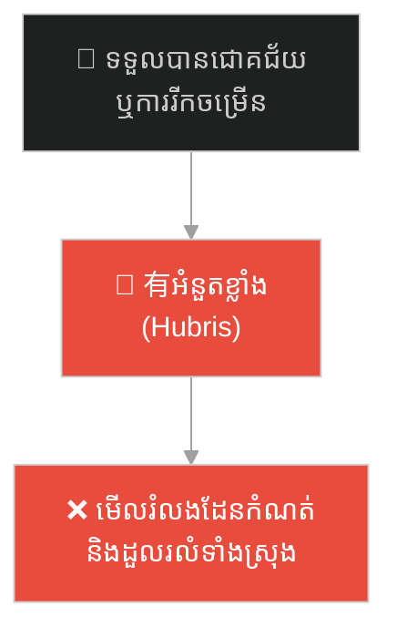
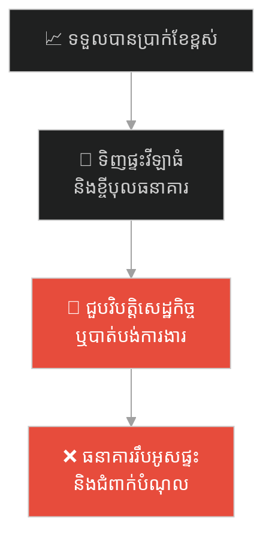
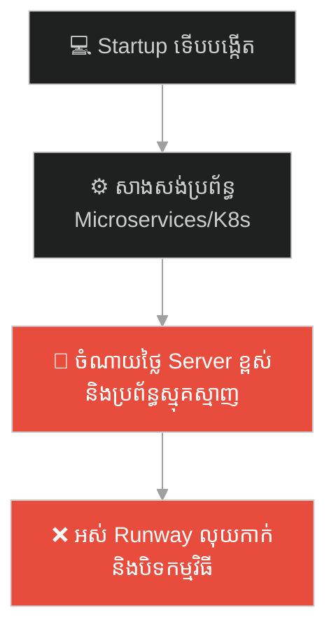
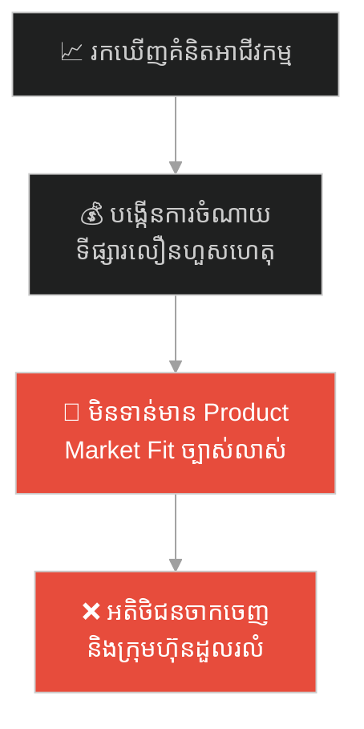
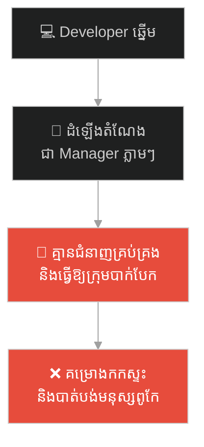
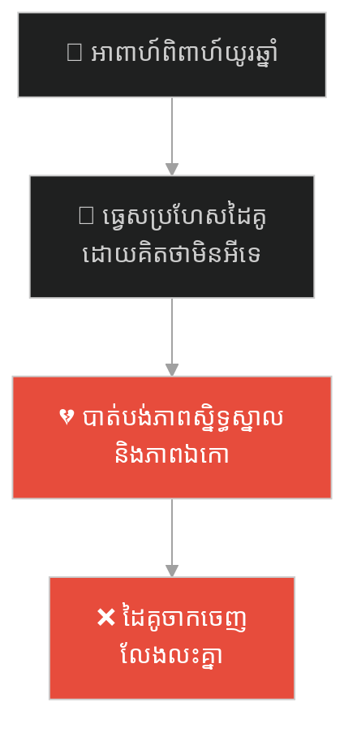
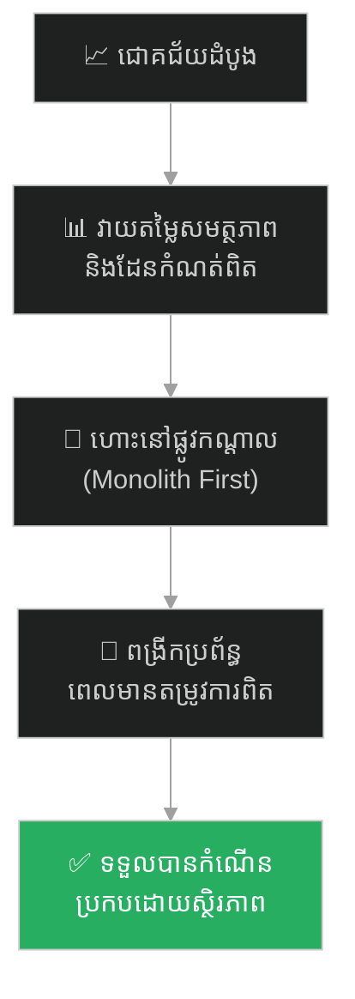

# The Fall of Icarus (ការធ្លាក់របស់អ៊ីការុស)៖ ទេវកថាក្រិច និងគ្រោះថ្នាក់នៃការមិនដឹងដែនកំណត់ខ្លួនឯង (Premature Scaling & Hubris)

**Author:** ichamrong  
**Date:** 2026-05-27  
**Tags:** #icarus #greek-mythology #premature-scaling #hubris #complacency #parable  
**Category:** Concepts / Parables  
**Read Time:** ~15 min  

---

## 📌 មាតិកា (Table of Contents)
- [អន្ទាក់ផ្លូវចិត្ត (The Trap)](#0)
- [១. ទេវកថាក្រិច៖ ដាដាលុស និងការធ្លាក់របស់អ៊ីការុស (The Legend of Icarus)](#1)
  - [ការរលាយនៃស្លាបក្រមួន (The Melting of the Wax Wings)](#1-1)
- [២. បញ្ហា៖ ការពង្រីកប្រព័ន្ធមុនកាលកំណត់ និងអំនួតនៃជោគជ័យ (The Issue: Premature Scaling & Hubris)](#2)
- [៣. ឧទាហរណ៍ជាក់ស្តែងក្នុងពិភពពិត (Real World Examples)](#3)
  - [ឧទាហរណ៍ទី ១ — កម្រិតស្រាល (គ្រួសារ)៖ ការខ្ចីបុលទិញផ្ទះវីឡាធំហួសសមត្ថភាពហិរញ្ញវត្ថុ (The Luxury Mortgage Hubris)](#3-1)
  - [ឧទាហរណ៍ទី ២ — កម្រិតមធ្យម (បច្ចេកទេស)៖ ការកសាងប្រព័ន្ធ Microservices សម្រាប់ Startup ដែលទើបបង្កើត (The Day 1 Microservices Trap)](#3-2)
  - [ឧទាហរណ៍ទី ៣ — កម្រិតមធ្យម (ធុរកិច្ច)៖ ការពង្រីកទីផ្សារលឿនហួសហេតុដោយគ្មាន Product-Market Fit (The Hypergrowth Collapse)](#3-3)
  - [ឧទាហរណ៍ទី ៤ — កម្រិតមធ្យម (សង្គម/គ្រប់គ្រង)៖ ការដំឡើងតំណែងបុគ្គលិកឆ្នើមទៅជា Manager ដោយគ្មានការបណ្តុះបណ្តាល (The Peter Principle Promotion)](#3-4)
  - [ឧទាហរណ៍ទី ៥ — កម្រិតធ្ងន់ (ទំនាក់ទំនង)៖ ការធ្វេសប្រហែសដៃគូជីវិតដោយគិតថាអាពាហ៍ពិពាហ៍មិនអាចបាក់បែក (The Relationship Complacency)](#3-5)
- [៤. ដំណោះស្រាយទូទៅ៖ ការអនុវត្ត Monolith-First និងការគ្រប់គ្រងកំណើនដោយមានវិន័យ (The General Solution: Monolith-First & Disciplined Scaling)](#4)
- [សេចក្តីសន្និដ្ឋាន (Conclusion)](#5)
- [ឯកសារយោង (References)](#6)
- [Related Posts](#7)

---

## អន្ទាក់ផ្លូវចិត្ត (The Trap)

តើអ្នកធ្លាប់ជួបស្ថានភាពដែលការងារ ឬធុរកិច្ចរបស់អ្នកទទួលបានជោគជ័យដំបូង រួចអ្នកចាប់ផ្តើមមានទំនុកចិត្តហួសហេតុ សម្រេចចិត្តពង្រីកខ្លួនយ៉ាងលឿនដោយគ្មានគ្រឹះរឹងមាំ រហូតដល់ត្រូវជួបការដួលរលំទាំងស្រុងដែរឬទេ?

នៅក្នុងការអភិវឌ្ឍអាជីវកម្ម និងប្រព័ន្ធ៖
* **យើងងាយនឹងកើតមហិច្ឆតាខ្វាក់ភ្នែក** (Hubris) នៅពេលសម្រេចបានជោគជ័យបន្តិចបន្តួច ដោយគិតថាយើងអាចធ្វើអ្វីៗបានគ្រប់យ៉ាង។
* **យើងមើលរំលង** ដែនកំណត់ និងសុវត្ថិភាពទិន្នន័យចំបង ដោយប្រញាប់រត់តាមទំនោរពង្រីកខ្លួនលឿនពេក (Premature Scaling)។

ការបណ្តោយឱ្យមោទនភាព និងការធ្វេសប្រហែសនាំទៅរកការដួលរលំប្រព័ន្ធ ហៅថា **អន្ទាក់ Hubris & Complacency (អំនួត និងការធ្វេសប្រហែស)**។

ដើម្បីយល់ដឹងពីរបៀបគ្រប់គ្រងកំណើន និងការជៀសវាងការធ្លាក់ខ្លួន នេះជាផែនទីបង្ហាញផ្លូវសម្រាប់អត្ថបទនេះ៖
1. **រឿងព្រេងប្រវត្តិសាស្ត្រ (The Historic Legend)** — ទេវកថារបស់ ដាដាលុស និង អ៊ីការុស ហោះហើរដោយប្រើស្លាបក្រមួន។
2. **បញ្ហា (The Issue)** — តើអ្វីទៅជា Premature Scaling ក្នុងប្រព័ន្ធបច្ចេកវិទ្យា និងធុរកិច្ច?
3. **ឧទាហរណ៍ជាក់ស្តែងក្នុងពិភពពិត (Real World Examples)** — ពិនិត្យមើលគ្រោះថ្នាក់នេះក្នុងកម្រិតគ្រួសារ ព័ត៌មានវិទ្យា ធុរកិច្ច ការគ្រប់គ្រង និងទំនាក់ទំនងស្នេហា។
4. **ដំណោះស្រាយទូទៅ (The General Solution)** — ការអនុវត្តយុទ្ធសាស្ត្រ Monolith-First និងការកសាងកំណើនផ្អែកលើតម្រូវការជាក់ស្តែង។

---

## ១. ទេវកថាក្រិច៖ ដាដាលុស និងការធ្លាក់របស់អ៊ីការុស (The Legend of Icarus)

នៅក្នុងទេវកថាក្រិចបុរាណ វិស្វករនិងអ្នកប្រាជ្ញដ៏ពូកែម្នាក់ឈ្មោះ **ដាដាលុស (Daedalus)** និងកូនប្រុសរបស់គាត់ឈ្មោះ **អ៊ីការុស (Icarus)** ត្រូវបានស្តេច មីណូស (King Minos) ចាប់ឃុំខ្លួននៅក្នុងគុកវង្វេងផ្លូវ (The Labyrinth) ដ៏ស្មុគស្មាញបំផុតនៅលើកោះក្រេត (Crete)។ ដោយសារគ្មានផ្លូវថ្នល់ ឬផ្លូវទឹកណាដែលអាចរត់គេចបាន ដាដាលុសបានសម្លឹងមើលមេឃ រួចគិតថា៖ *«ស្តេចមីណូសអាចគ្រប់គ្រងដី និងសមុទ្រ តែទ្រង់មិនអាចគ្រប់គ្រងផ្ទៃមេឃបានឡើយ។»*

ដាដាលុសបានចំណាយពេលប្រមូលរោមសត្វបក្សីធំៗ រួចយកវាមកចងភ្ជាប់គ្នាដោយខ្សែ និងបិទភ្ជាប់គ្រឹះរបស់វាដោយ **ក្រមួនឃ្មុំ (Beeswax)** រហូតដល់ច្នៃបង្កើតជា "ស្លាប" ដ៏អស្ចារ្យចំនួនពីរគូ។ 

មុនពេលលោតចេញពីច្រាំងថ្មដើម្បីហោះហើរ ដាដាលុសបានចាប់ស្មាកូនប្រុសរបស់ខ្លួន ហើយព្រមានយ៉ាងម៉ឺងម៉ាត់ថា៖  
> *«អ៊ីការុស កូនត្រូវតែហោះនៅកម្ពស់កណ្តាល (Middle course)។ កុំហោះទាបពេក ព្រោះចំហាយទឹកសមុទ្រនឹងធ្វើឱ្យស្លាបធ្ងន់ហោះលែងរួច។ ហើយដាច់ខាត កុំហោះខ្ពស់ពេក ព្រោះកម្តៅព្រះអាទិត្យនឹងធ្វើឱ្យក្រមួនរលាយ ហើយកូននឹងធ្លាក់ចុះស្លាប់ជាមិនខាន។ ចូរហោះតាមក្រោយបងជានិច្ច។»*

---

### ការរលាយនៃស្លាបក្រមួន (The Melting of the Wax Wings)

ពួកគេទាំងពីរបានលោតចេញពីច្រាំងថ្ម ហើយស្លាបនោះក៏ពិតជាអាចហោះហើរបានយ៉ាងអស្ចារ្យមែន។ ដំបូងឡើយ អ៊ីការុសបានហោះតាមក្រោយឪពុករបស់ខ្លួនយ៉ាងប្រុងប្រយ័ត្ន។ ប៉ុន្តែនៅពេលដែលគាត់ចាប់ផ្តើមស៊ាំនឹងការហោះហើរ និងកម្លាំងខ្យល់ គាត់ចាប់ផ្តើមមានអារម្មណ៍រំភើប និងមានអំនួត (Hubris) យ៉ាងខ្លាំង។ គាត់មានអារម្មណ៍ថាខ្លួនគាត់មានអំណាចអស្ចារ្យដូចជាព្រះ ដែលអាចហោះហើរខ្ពស់ជាងបក្សីទាំងឡាយ។

ដោយភ្លេចនូវពាក្យព្រមានរបស់ឪពុក អ៊ីការុសចង់សាកល្បងដែនកំណត់ និងចង់ហោះទៅឱ្យជិតព្រះអាទិត្យបំផុត។ គាត់ចាប់ផ្តើមទះស្លាបហោះឡើងខ្ពស់ទៅៗ ឆ្ពោះទៅកាន់កំពូលមេឃ។ ដាដាលុសបានស្រែកហៅកូនពីខាងក្រោមដោយក្តីបារម្ភ ប៉ុន្តែសម្លេងខ្យល់បក់ខ្លាំងបានធ្វើឱ្យអ៊ីការុសមិនលឺឡើយ។

នៅពេលដែលគាត់ហោះកាន់តែជិតព្រះអាទិត្យ កម្តៅដ៏ក្តៅគគុកបានចាប់ផ្តើមរំលាយក្រមួនឃ្មុំដែលបិទភ្ជាប់រោមសត្វនោះ។ រោមសត្វចាប់ផ្តើមរបូត និងជ្រុះចេញពីស្លាបម្តងមួយសរសៃៗ។ អ៊ីការុសបានដឹងខ្លួន ហើយខំប្រឹងទះដៃយ៉ាងលឿន ប៉ុន្តែវាហួសពេលទៅហើយ។ ស្លាបរបស់គាត់បានរលាយបាត់បង់រូបរាងទាំងស្រុង។ 

អ៊ីការុសបានធ្លាក់ពីលើអាកាសយ៉ាងលឿន រួចលិចបាត់ទៅក្នុងផ្ទៃសមុទ្រដ៏ជ្រៅ និងស្លាប់នៅទីនោះទៅ។ សមុទ្រនោះក៏ត្រូវបានគេដាក់ឈ្មោះថា **សមុទ្រអ៊ីការៀន (Icarian Sea)** ដើម្បីរំលឹកដល់សោកនាដកម្មនៃយុវជនដែលហោះខ្ពស់ហួសមាឌ ព្រោះតែអំនួតខ្លួនឯង។

---

## ២. បញ្ហា៖ ការពង្រីកប្រព័ន្ធមុនកាលកំណត់ និងអំនួតនៃជោគជ័យ (The Issue: Premature Scaling & Hubris)

រឿងព្រេងរបស់ Icarus ឆ្លុះបញ្ចាំងពីបាតុភូត **Premature Scaling (ការពង្រីកប្រព័ន្ធមុនកាលកំណត់)** នៅក្នុងស្ថាបត្យកម្មប្រព័ន្ធ និងធុរកិច្ច Startup៖

* **ស្លាបក្រមួន គឺប្រៀបដូចជាបច្ចេកវិទ្យាដែលមិនទាន់មានស្ថិរភាព** ឬធនធានដែលងាយនឹងបាត់បង់ (Runway លុយកាក់)។
* **ការហោះខ្ពស់ពេក (Premature Scaling)៖** គឺការចំណាយលុយដ៏ច្រើនសន្ធឹកសន្ធាប់ដើម្បីសាងសង់ប្រព័ន្ធធំៗ (Microservices, Complex Kubernetes Clusters) ឬជួលបុគ្គលិករាប់រយនាក់ នៅពេលដែលផលិតផលទើបតែចាប់ផ្តើម និងមិនទាន់មានអតិថិជនពិតប្រាកដ (Product-Market Fit)។ កម្តៅនៃការចំណាយលើ Server និងប្រតិបត្តិការ នឹងរំលាយថវិការបស់ក្រុមហ៊ុនចោលភ្លាមៗ។
* **ការហោះទាបពេក (Under-engineering/Complacency)៖** គឺការមិនព្រមកែសម្រួលប្រព័ន្ធទាល់តែសោះ រហូតដល់ប្រព័ន្ធដំណើរការយឺតខ្លាំង និងគាំងរាល់ថ្ងៃ ធ្វើឱ្យអតិថិជនធុញទ្រាន់ចាកចេញ។

---

## ៣. ឧទាហរណ៍ជាក់ស្តែងក្នុងពិភពពិត

ដើម្បីយល់ដឹងឱ្យកាន់តែច្បាស់ នេះជាការវិភាគលើឧទាហរណ៍ ៥ កម្រិតផ្សេងគ្នា៖

---

### ឧទាហរណ៍ទី ១ — កម្រិតស្រាល (គ្រួសារ)៖ ការខ្ចីបុលទិញផ្ទះវីឡាធំហួសសមត្ថភាពហិរញ្ញវត្ថុ (The Luxury Mortgage Hubris)

**ស្ថានភាព៖** ប្តីប្រពន្ធមួយគូទទួលបានការតម្លើងប្រាក់ខែខ្ពស់ពីការងារបច្ចេកវិទ្យា។ ដោយគិតថាចំណូលរបស់ពួកគេនឹងកើនឡើងជានិច្ច ពួកគេបានសម្រេចចិត្តទិញផ្ទះវីឡាដ៏ធំមួយដែលមានតម្លៃ $500,000 ដោយខ្ចីលុយធនាគារ ៩០%។

* **ជម្រើសខុស (Hubris)៖** ខ្ចីលុយដល់កម្រិតអតិបរមា ដោយមិនបន្សល់ទុកនូវកញ្ចប់ថវិកាសុវត្ថិភាព (Safety Margin)។
* **លទ្ធផល៖** មួយឆ្នាំក្រោយមក ក្រុមហ៊ុនរបស់ប្តីជួបវិបត្តិបច្ចេកវិទ្យា និងកាត់បន្ថយបុគ្គលិក។ គាត់បាត់បង់ការងារ រីឯចំណូលរបស់ប្រពន្ធម្នាក់ឯងមិនអាចបង់ថ្លៃការប្រាក់ធនាគារបានឡើយ។ ពួកគេត្រូវបង្ខំចិត្តលក់ផ្ទះខាតបង់ប្រាក់យ៉ាងច្រើន និងធ្លាក់ខ្លួនជំពាក់បំណុលវណ្ឌក។

**ដំណោះស្រាយ៖**  
ហោះនៅផ្លូវកណ្តាល។ ទិញផ្ទះក្នុងតម្លៃសមរម្យដែលការបង់ប្រាក់ប្រចាំខែមិនលើសពី ៣០% នៃចំណូលសរុប និងត្រូវមានប្រាក់បម្រុងអាសន្នសម្រាប់រស់នៅយ៉ាងហោចណាស់ ៦ ខែ (Emergency Fund)។

---

### ឧទាហរណ៍ទី ២ — កម្រិតមធ្យម (បច្ចេកទេស)៖ ការកសាងប្រព័ន្ធ Microservices សម្រាប់ Startup ដែលទើបបង្កើត (The Day 1 Microservices Trap)

**ស្ថានភាព៖** ក្រុមការងារបច្ចេកទេសចង់បង្កើត App ថ្មីសម្រាប់កុម្ម៉ង់អាហារ។ ដោយសារចង់បានប្រព័ន្ធឡូយ និងទំនើបដូច Netflix, Tech Lead សម្រេចចិត្តរៀបចំស្ថាបត្យកម្មប្រព័ន្ធជា Microservices ភ្លាមៗតាំងពីថ្ងៃដំបូង។

* **ជម្រើសខុស (Premature Scaling)៖** បង្កើត Microservices ចំនួន ២០ ផ្សេងគ្នា និងដំឡើង Kubernetes Clusters តាំងពីមិនទាន់មានអតិថិជនសូម្បីតែម្នាក់។
* **លទ្ធផល៖** ពួកគេចំណាយពេល ៦ ខែដោះស្រាយតែរឿងបណ្តាញ និងការប្រាស្រ័យទាក់ទងរវាង Service (Network complexity) រហូតដល់គ្មានពេលអភិវឌ្ឍ Feature ថ្មី។ ការចំណាយលើ Cloud Server ឡើងដល់ $5,000 ក្នុងមួយខែ ដែលធ្វើឱ្យលុយកាក់របស់ Startup ត្រូវរលាយអស់ មុនពេល App អាចចេញលក់លើទីផ្សារ។

**ដំណោះស្រាយ៖**  
អនុវត្តយុទ្ធសាស្ត្រ **Monolith-First**។ សរសេរកូដនៅក្នុងអាគារតែមួយគត់ (Monolithic architecture) ឱ្យបានលឿន និងសន្សំសំចៃបំផុត។ នៅពេលណាដែលប្រព័ន្ធទទួលបានជោគជ័យ និងមានអ្នកប្រើប្រាស់រាប់ម៉ឺននាក់ ទើបចាប់ផ្តើមបំបែកវាជា Microservices តាមតម្រូវការជាក់ស្តែង។

---

### ឧទាហរណ៍ទី ៣ — កម្រិតមធ្យម (ធុរកិច្ច)៖ ការពង្រីកទីផ្សារលឿនហួសហេតុដោយគ្មាន Product-Market Fit (The Hypergrowth Collapse)

**ស្ថានភាព៖** ក្រុមហ៊ុន Startup មួយចង់បង្កើតសេវាកម្មជួលកង់ជិះក្នុងក្រុង។ ក្រោយពីទទួលបានជោគជ័យក្នុងការសាកល្បងតូចមួយនៅសង្កាត់មួយ ពួកគេទទួលបានលុយវិនិយោគរាប់លានដុល្លារ។

* **ជម្រើសខុស៖** ដោយសារក្តីអំនួត និងចង់លេបត្របាក់ទីផ្សារលឿន ពួកគេបានទិញកង់រាប់ម៉ឺនគ្រឿង និងពង្រីកទៅកាន់ទីក្រុងចំនួន ១០ ផ្សេងទៀតក្នុងពេលតែមួយ។
* **លទ្ធផល៖** ពួកគេមិនទាន់ដឹងច្បាស់ពីរបៀបថែទាំកង់ និងការទប់ស្កាត់ការលួចកង់នៅឡើយ។ ក្នុងរយៈពេល ៦ ខែ កង់រាប់ពាន់គ្រឿងត្រូវបានខូចខាត និងលួចបាត់បង់។ ការចំណាយលើប្រតិបត្តិការកើនឡើងខ្ពស់ហួសពីប្រាក់ចំណូល ធ្វើឱ្យក្រុមហ៊ុនត្រូវបិទទ្វារទាំងស្រុង។

**ដំណោះស្រាយ៖**  
ពង្រីកខ្លួនដោយមានវិន័យ (Disciplined growth)។ ត្រូវបង្កើតគំរូអាជីវកម្មឱ្យមានប្រាក់ចំណេញ និងស្ថិរភាពនៅក្នុងទីតាំងមួយជាមុនសិន (Unit Economics validation) រួចទើបយកគំរូនោះទៅអនុវត្តនៅទីតាំងផ្សេងៗទៀតជាបន្តបន្ទាប់។

---

### ឧទាហរណ៍ទី ៤ — កម្រិតមធ្យម (សង្គម/គ្រប់គ្រង)៖ ការដំឡើងតំណែងបុគ្គលិកឆ្នើមទៅជា Manager ដោយគ្មានការបណ្តុះបណ្តាល (The Peter Principle Promotion)

**ស្ថានភាព៖** វិស្វករសរសេរកូដម្នាក់ (Senior Dev) ធ្វើការងារល្អបំផុត និងលឿនបំផុតនៅក្នុងក្រុម។ ដើម្បីលើកទឹកចិត្ត និងដោយគិតថាគាត់ពូកែគ្រប់រឿង ថ្នាក់ដឹកនាំបានដំឡើងតំណែងគាត់ជា Engineering Manager គ្រប់គ្រងមនុស្ស ២០ នាក់។

* **ជម្រើសខុស៖** គិតថាអ្នកសរសេរកូដពូកែ ប្រាកដជាអាចដឹកនាំមនុស្សពូកែដូចគ្នា ដោយមិនផ្តល់ការបណ្តុះបណ្តាលជំនាញទន់ (Soft skills)។
* **លទ្ធផល៖** គាត់មិនចេះដោះស្រាយទំនាស់ មិនចេះរៀបចំផែនការ និងបង្ខំបុគ្គលិកឱ្យធ្វើការងារហួសកម្លាំង។ ក្រុមការងារចាប់ផ្តើមមានភាពរកាំរកូស បុគ្គលិកឆ្នើមលាឈប់ពីការងារ រីឯខ្លួនគាត់ផ្ទាល់ក៏មានសម្ពាធផ្លូវចិត្តខ្លាំង (Burnout)។

**ដំណោះស្រាយ៖**  
ចងចាំច្បាប់ **Peter Principle** (មនុស្សគ្រប់រូបនឹងត្រូវបានតម្លើងតំណែងរហូតដល់កម្រិតដែលពួកគេលែងមានសមត្ថភាពធ្វើការងារនោះបានល្អ)។ មុននឹងតម្លើងតំណែង ត្រូវផ្តល់ការសាកល្បងការងារដឹកនាំតូចតាចជាមុន និងបណ្តុះបណ្តាលជំនាញដឹកនាំមនុស្សជាកាតព្វកិច្ច។

---

### ឧទាហរណ៍ទី ៥ — កម្រិតធ្ងន់ (ទំនាក់ទំនង)៖ ការធ្វេសប្រហែសដៃគូជីវិតដោយគិតថាអាពាហ៍ពិពាហ៍មិនអាចបាក់បែក (The Relationship Complacency)

**ស្ថានភាព៖** ក្រោយពីបានរៀបការ និងរស់នៅជាមួយគ្នារាប់ឆ្នាំ ប្តីមានគំនិតធ្វេសប្រហែសខ្លាំង៖ *«យើងរៀបការរួចហើយ នាងគ្មានថ្ងៃចាកចេញពីខ្ញុំទេ ទោះបីជាខ្ញុំមិនសូវនៅផ្ទះ ឬមិនសូវនិយាយផ្អែមល្ហែមដូចមុនក៏ដោយ»*។

* **ជម្រើសខុស (Complacency)៖** ឈប់វិនិយោគពេលវេលា និងក្តីស្រឡាញ់ទៅក្នុងទំនាក់ទំនង ព្រោះគិតថាវាមានស្ថិរភាពជារៀងរហូត។
* **លទ្ធផល៖** ប្រពន្ធមានអារម្មណ៍ថាខ្លួនដូចជាអ្នកបម្រើក្នុងផ្ទះ គ្មានតម្លៃ និងឯកោខ្លាំង។ ទំនុកចិត្ត និងភាពស្និទ្ធស្នាលរលាយបាត់បង់បន្តិចម្តងៗ ដូចក្រមួនរលាយ។ ថ្ងៃមួយ នាងសុំលែងលះភ្លាមៗ បន្សល់ទុកនូវក្តីរន្ធត់ចិត្តដល់ប្តីដែលសន្មតខុស។

**ដំណោះស្រាយ៖**  
កុំធ្វេសប្រហែស។ ទំនាក់ទំនងប្រៀបដូចជាឡានដែលត្រូវចាក់សាំង និងថែទាំជាប្រចាំ។ ត្រូវបង្កើតកាលវិភាគសម្រាប់ "Date Night" រាល់សប្តាហ៍ និងបង្ហាញក្តីស្រឡាញ់តាមរយៈពាក្យសម្តី និងសកម្មភាពតូចតាចរៀងរាល់ថ្ងៃ។

---

## ៤. ដំណោះស្រាយទូទៅ៖ ការអនុវត្ត Monolith-First និងការគ្រប់គ្រងកំណើនដោយមានវិន័យ (The General Solution: Monolith-First & Disciplined Scaling)

ដើម្បីការពារខ្លួនកុំឱ្យហោះជិតព្រះអាទិត្យពេករហូតដល់រលាយស្លាបក្រមួន ត្រូវអនុវត្តវិធីសាស្ត្រគន្លឹះទាំងនេះ៖

### ១. អនុវត្តច្បាប់ Monolith-First ក្នុងការអភិវឌ្ឍ

* កុំរៀបចំប្រព័ន្ធស្មុគស្មាញតាំងពីថ្ងៃដំបូង។ ចាប់ផ្តើមជាមួយដំណោះស្រាយដ៏សាមញ្ញបំផុត (Simple Monolith)។
* បង្កើត **MVP (Minimum Viable Product)** ដើម្បីសាកល្បងទីផ្សារ។ 
* ពង្រីកប្រព័ន្ធ (Scale) លុះត្រាតែប្រព័ន្ធចាស់ជួបបញ្ហាកកស្ទះពិតប្រាកដ និងមានទិន្នន័យបញ្ជាក់ច្បាស់លាស់ (Data-driven scaling)។

### ២. រក្សាកញ្ចប់ថវិកាសុវត្ថិភាព (Maintain Safety Margins / Runway)

* នៅក្នុងហិរញ្ញវត្ថុ៖ ត្រូវប្រាកដថាក្រុមហ៊ុនមាន Runway លុយកាក់យ៉ាងហោចណាស់ ១២ ទៅ ១៨ ខែ មុននឹងសម្រេចចិត្តជួលបុគ្គលិកថ្មី ឬបោះទុនវិនិយោគធំ។
* នៅក្នុងវិស្វកម្ម៖ ត្រូវធានាថា Server របស់អ្នកមានសមត្ថភាពទ្រាំទ្រនឹងចរាចរណ៍ទិន្នន័យកើនឡើងភ្លាមៗ (Traffic spikes) យ៉ាងហោចណាស់ ៥០% លើសពីធម្មតា។

### ៣. រក្សាភាពរាបទាប និងការប្រុងប្រយ័ត្ន (Stay Humble, Stay Vigilant)

* ជោគជ័យដំបូងមិនមែនជាការធានាថាអ្នកនឹងជោគជ័យជារៀងរហូតនោះឡើយ។ ត្រូវត្រៀមខ្លួនជានិច្ចសម្រាប់បញ្ហាប្រឈមថ្មីៗ និងកុំមើលរំលងសញ្ញាព្រមានតូចៗ។

---

## Related Posts

ដើម្បីស្វែងយល់បន្ថែមអំពីរបៀបដែលយុទ្ធសាស្ត្រ និងការគ្រប់គ្រងអាចត្រូវបានពង្រឹង តាមរយៈការកសាងសមត្ថភាពចម្រុះ និងការយល់ដឹងពីសិល្បៈប្រយុទ្ធគ្រប់ជ្រុងជ្រោយ (The Book of Five Rings) សូមបន្តដំណើរទៅកាន់ Parable បន្ទាប់៖

* 🚀 **[ចាប់ផ្តើមដំណើររុករក (Start the Journey) ➔ The Book of Five Rings](./48-the-book-of-five-rings.md)**

---

## សេចក្តីសន្និដ្ឋាន (Conclusion)

> **«កុំបណ្តោយឱ្យភាពត្រេកអរនៃជើងហោះហើរដំបូង ធ្វើឱ្យអ្នកភ្លេចកម្តៅរបស់ព្រះអាទិត្យ និងដែនកំណត់នៃស្លាបរបស់អ្នកឡើយ។»**

អ៊ីការុសបានធ្លាក់ចុះស្លាប់មិនមែនដោយសារតែស្លាបរបស់គាត់មិនល្អនោះទេ គឺដោយសារតែអំនួតខ្វាក់ភ្នែករបស់គាត់។ ចូរកសាងកំណើន និងភាពជោគជ័យរបស់អ្នកដោយក្តីរាបទាប និងមានវិន័យខ្ពស់ជានិច្ច។

---

## ឯកសារយោង (References)

* **Ovid** — *Metamorphoses* (Ancient Rome)។ ប្រភពកំណាព្យឡាតាំងបុរាណដែលកត់ត្រារឿងរ៉ាវរបស់ដាដាលុស និងអ៊ីការុសលម្អិតបំផុត។
* **Eric Ries** — *The Lean Startup* (2011)។ គោលការណ៍កសាង MVP និងការជៀសវាងគ្រោះថ្នាក់ Premature Scaling ក្នុងអាជីវកម្ម Startup។
* **Fred Brooks** — *The Mythical Man-Month* (1975)។ គ្រោះថ្នាក់នៃការបន្ថែមមនុស្សចូលក្នុងគម្រោងដែលកំពុងយឺតយ៉ាវ (Brook's Law) និងដែនកំណត់ប្រព័ន្ធ។

---

## Related Posts

* **[39 Icarus: Premature Scaling and the Dangers of Hypergrowth](../articles/39-icarus-and-premature-scaling.md)** — អត្ថបទគោលបកស្រាយលម្អិតពីយន្តការ Premature Scaling។
* **[36 The Gordian Knot: Over-Engineering and the KISS Principle](./44-the-gordian-knot.md)** — របៀបសម្រួលប្រព័ន្ធឱ្យសាមញ្ញដើម្បីជៀសវាងការខាតបង់ Runway។
* **[30 The King and the Bridge to Nowhere](./30-the-bridge-to-nowhere.md)** — ការគ្រប់គ្រងការសម្រេចចិត្តវិនិយោគដោយដឹងពីពេលណាត្រូវ Pivoting។

---
*Last updated: 2026-05-27*

## Related

- [💡 Concepts README](../README.md)
- [📚 Main Repository README](../../../README.md)
- [Developer Habits](../../developer-habits/README.md)
- [Mental Health & Well-being](../../mental-health/README.md)
- [Management & SDLC](../../management/README.md)
