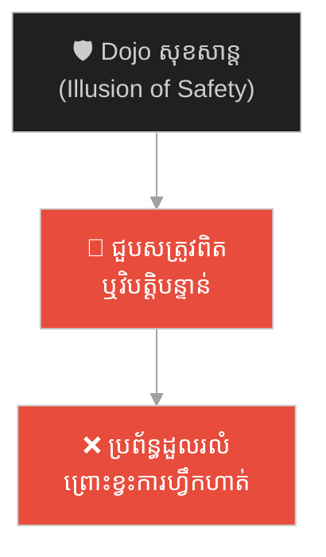
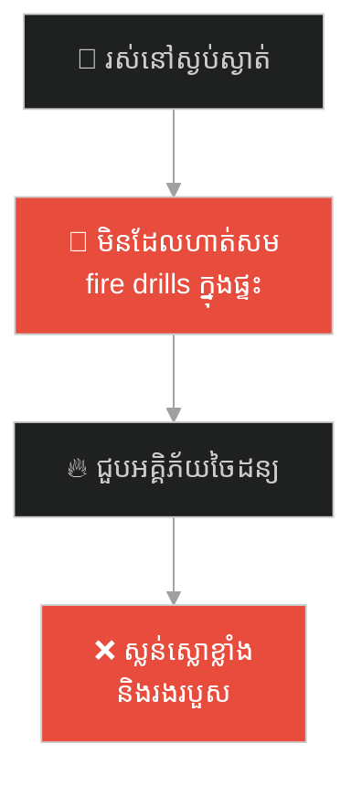
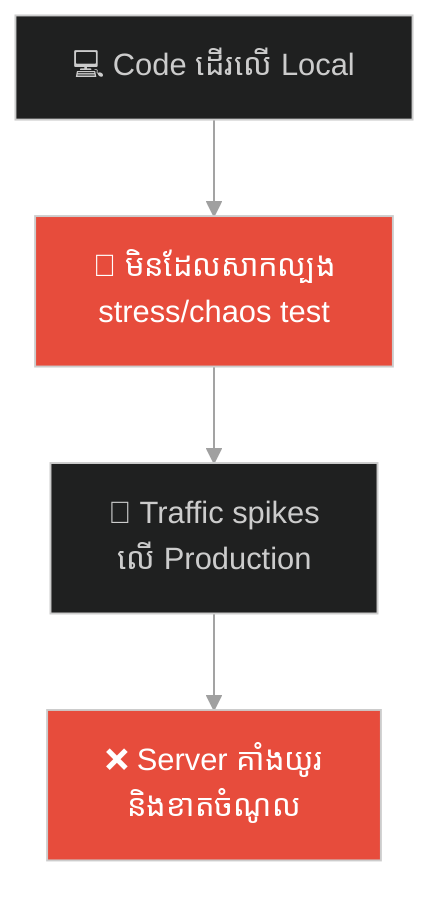
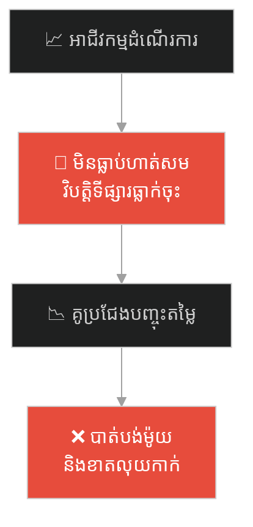
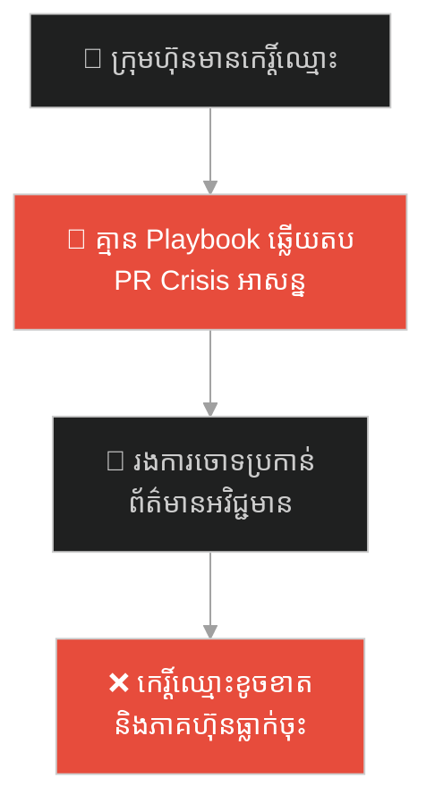
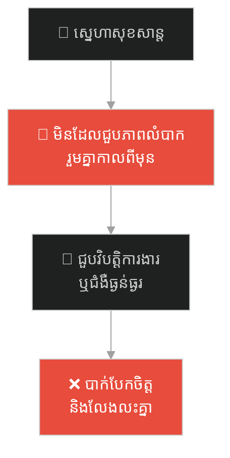
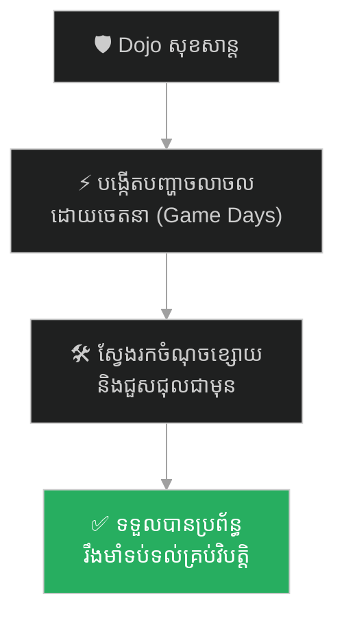

# Chaos Engineering (វិស្វកម្មចលាចល)៖ មីយ៉ាម៉ូតូ មូសាស៊ី និងសិល្បៈហ្វឹកហាត់ដុសខាត់ភាពធន់ក្នុងវិបត្តិ (Chaos Engineering & Production Drills)

**Author:** ichamrong  
**Date:** 2026-05-27  
**Tags:** #musashi #samurai #chaos-engineering #incident-response #stress-test #parable  
**Category:** Concepts / Parables  
**Read Time:** ~15 min  

---

## 📌 មាតិកា (Table of Contents)
- [អន្ទាក់ផ្លូវចិត្ត (The Trap)](#0)
- [១. រឿងព្រេងសាមូរ៉ៃ៖ មីយ៉ាម៉ូតូ មូសាស៊ី និងគម្ពីររង្វង់ប្រាំ (The Legend of Miyamoto Musashi)](#1)
  - [ការហ្វឹកហាត់ក្នុងភាពចលាចលជាក់ស្តែង (Training in Real Chaos)](#1-1)
- [២. បញ្ហា៖ ការយល់ច្រឡំពីសុវត្ថិភាព និងវិស្វកម្មចលាចល (The Issue: Dojo Illusion vs. Chaos Engineering)](#2)
- [៣. ឧទាហរណ៍ជាក់ស្តែងក្នុងពិភពពិត (Real World Examples)](#3)
  - [ឧទាហរណ៍ទី ១ — កម្រិតស្រាល (គ្រួសារ)៖ ការហាត់សមពន្លត់អគ្គិភ័យ និងការរៀបចំក្នុងផ្ទះ (The Family Fire Drill)](#3-1)
  - [ឧទាហរណ៍ទី ២ — កម្រិតមធ្យម (បច្ចេកទេស)៖ ការទម្លាក់ Server លើ Production ដើម្បីតេស្តភាពធន់ (The Netflix Chaos Monkey)](#3-2)
  - [ឧទាហរណ៍ទី ៣ — កម្រិតមធ្យម (ធុរកិច្ច)៖ ការហាត់សមឆ្លើយតបនឹងការធ្លាក់ចុះតម្លៃពីគូប្រជែង (The Market War Simulation)](#3-3)
  - [ឧទាហរណ៍ទី ៤ — កម្រិតមធ្យម (សង្គម/គ្រប់គ្រង)៖ ការបង្កើតយុទ្ធនាការសាកល្បងឆ្លើយតបវិបត្តិព័ត៌មាន (The PR Crisis Drill)](#3-4)
  - [ឧទាហរណ៍ទី ៥ — កម្រិតធ្ងន់ (ទំនាក់ទំនង)៖ ការសាកល្បងភាពធន់ផ្លូវចិត្តកំឡុងពេលមានវិបត្តិធំ (The Relationship Stress Test)](#3-5)
- [៤. ដំណោះស្រាយទូទៅ៖ ការរៀបចំទិវាចលាចល និងការបំផ្លាញប្រព័ន្ធដើម្បីកសាងភាពរឹងមាំ (The General Solution: Game Days & Proactive Failure Injection)](#4)
- [សេចក្តីសន្និដ្ឋាន (Conclusion)](#5)
- [ឯកសារយោង (References)](#6)
- [Related Posts](#7)

---

## អន្ទាក់ផ្លូវចិត្ត (The Trap)

តើអ្នកធ្លាប់មានអារម្មណ៍ថា ប្រព័ន្ធ ឬជីវិតការងាររបស់អ្នកដំណើរការទៅយ៉ាងរលូនល្អឥតខ្ចោះនៅពេលធ្វើតេស្តសាកល្បង ប៉ុន្តែស្រាប់តែដួលរលំខ្ទេចខ្ទីគ្មានសល់ភ្លាមៗ នៅពេលជួបប្រទះនឹងការវាយប្រហារ ឬវិបត្តិពិតប្រាកដដែរឬទេ?

នៅក្នុងការគ្រប់គ្រងប្រព័ន្ធ និងប្រតិបត្តិការ៖
* **យើងងាយនឹងលង់លក់** នៅក្នុងក្តីសុខក្លែងក្លាយ (Illusion of Safety) ព្រោះប្រព័ន្ធដើរល្អក្នុងសាលាហ្វឹកហាត់ (Localhost/Staging)។
* **យើងមើលរំលង** ការពិតដែលថា សត្រូវ ឬបញ្ហាពិតប្រាកដនៅលើពិភពលោក មិនដែលវាយប្រហារតាមក្បួនខ្នាតច្បាស់លាស់ ឬស្ថិតក្នុងបរិស្ថានដ៏ទន់ល្មើយនោះឡើយ។

ការសន្មតថាប្រព័ន្ធមានសុវត្ថិភាព ដោយសារមិនធ្លាប់ជួបគ្រោះមហន្តរាយ ហៅថា **អន្ទាក់ Dojo Illusion (លម្អៀងសាលាហ្វឹកហាត់)**។

ដើម្បីយល់ដឹងពីរបៀបដុសខាត់ភាពធន់ និងការរៀបចំខ្លួនទប់ទល់គ្រប់ស្ថានការណ៍ នេះជាផែនទីបង្ហាញផ្លូវសម្រាប់អត្ថបទនេះ៖
1. **រឿងព្រេងប្រវត្តិសាស្ត្រ (The Historic Legend)** — កំពូលអ្នកដាវ មីយ៉ាម៉ូតូ មូសាស៊ី និងគម្ពីររង្វង់ប្រាំ ដែលបង្រៀនឱ្យហ្វឹកហាត់ក្នុងស្ថានភាពចលាចលបំផុត។
2. **បញ្ហា (The Issue)** — តើអ្វីទៅជា Chaos Engineering ក្នុងប្រព័ន្ធបច្ចេកវិទ្យាទំនើប?
3. **ឧទាហរណ៍ជាក់ស្តែងក្នុងពិភពពិត (Real World Examples)** — ពិនិត្យមើលការហ្វឹកហាត់ក្នុងភាពចលាចលក្នុងកម្រិតគ្រួសារ ព័ត៌មានវិទ្យា ធុរកិច្ច ការគ្រប់គ្រង និងទំនាក់ទំនងស្នេហា។
4. **ដំណោះស្រាយទូទៅ (The General Solution)** — ការអនុវត្តយុទ្ធនាការ Game Days និងការចាក់បញ្ចូលបញ្ហាដោយស្វ័យប្រវត្ត (Failure Injection)។

---

## ១. រឿងព្រេងសាមូរ៉ៃ៖ មីយ៉ាម៉ូតូ មូសាស៊ី និងគម្ពីររង្វង់ប្រាំ (The Legend of Miyamoto Musashi)

នៅប្រទេសជប៉ុននាសម័យកាល Edo សាមូរ៉ៃភាគច្រើនមកពីសាលាដាវល្បីៗ តែងតែហ្វឹកហាត់វិជ្ជាដាវរបស់ពួកគេនៅក្នុងសាលា (Dojo) ដ៏ស្អាតបាត មានរបៀបរៀបរយ និងមានក្រាលកម្រាលតាតាមិ (Tatami) ដ៏ទន់ល្មើយ។ ពួកគេហ្វឹកហាត់វាយដាវទៅតាមចង្វាក់ ក្បួនខ្នាត និងវាយតម្រូវជាមួយគូប្រកួតដែលគោរពច្បាប់ដូចគ្នា។ ពួកគេគិតថាខ្លួនឯងខ្លាំងពូកែ និងគ្មានគូប្រៀប ព្រោះពួកគេមិនដែលចាញ់នរណាម្នាក់ឡើយនៅក្នុងសាលាហ្វឹកហាត់នោះ។

ប៉ុន្តែ កំពូលអ្នកដាវដ៏ល្បីល្បាញ **មីយ៉ាម៉ូតូ មូសាស៊ី (Miyamoto Musashi)** មិនដែលយល់ស្របនឹងវិធីហ្វឹកហាត់បែបនោះឡើយ។ មូសាស៊ីយល់ច្បាស់ថា នៅក្នុងសមរភូមិពិតប្រាកដ៖
* សត្រូវមិនដែលវាយប្រហារតាមក្បួនខ្នាតដែលបានរៀនឡើយ។
* គ្មានកម្រាល Tatami ទន់ល្មើយសម្រាប់ឈរឡើយ គឺមានតែដីភក់ល្បាប់ ថ្មមុតៗ និងជម្រាលភ្នំ។
* សត្រូវអាចនឹងប្រើល្បិចកខ្វក់ ជះខ្សាច់ដាក់ភ្នែក វាយប្រហារពីក្រោយ ឬប្រើប្រាស់អាវុធខុសៗគ្នា។

---

### ការហ្វឹកហាត់ក្នុងភាពចលាចលជាក់ស្តែង (Training in Real Chaos)

ដើម្បីរៀបចំខ្លួនទប់ទល់នឹងសមរភូមិពិត មូសាស៊ីបានយកខ្លួនឯងទៅហ្វឹកហាត់នៅក្នុងស្ថានភាពចលាចលបំផុត (Chaos Environment)៖
* គាត់ហ្វឹកហាត់វាយដាវនៅក្នុងព្រៃក្រាស់ លើផ្ទៃដីភក់ល្បាប់ និងក្រោមគំនរទឹកភ្លៀងបោកបក់ខ្លាំង។
* គាត់ហ្វឹកហាត់ប្រយុទ្ធទាំងរអិលជើង ហ្វឹកហាត់តទល់នឹងសត្រូវច្រើននាក់ក្នុងពេលតែមួយ និងហ្វឹកហាត់ទាំងត្រូវពន្លឺថ្ងៃចាំងភ្នែក។
* គាត់ហ្វឹកហាត់ប្រើដាវឈើទម្ងន់ធ្ងន់ទល់នឹងដាវដែកពិតប្រាកដ ដើម្បីបង្ខំឱ្យខួរក្បាល និងស្មារតីរបស់គាត់មានការប្រុងប្រយ័ត្នខ្ពស់បំផុត។

នៅពេលដែលសាមូរ៉ៃមកពីសាលា Dojo ដ៏ល្បីៗចេញមកប្រកួតជាមួយមូសាស៊ីនៅក្នុងពិភពពិត ពួកគេបានស្លាប់ទាំងអស់។ ពួកគេមិនអាចទប់ទល់នឹងដាវរបស់មូសាស៊ីបានឡើយ ព្រោះពួកគេមិនធ្លាប់ហ្វឹកហាត់រអិលជើងលើភក់ មិនធ្លាប់តទល់នឹងខ្យល់បោកបក់ ឬការវាយលុកខុសក្បួនខ្នាត។ 

មូសាស៊ីដែលឆ្លងកាត់ការប្រកួតជាង ៦០ ដងដោយមិនដែលចាញ់សូម្បីតែម្តង បានកត់ត្រាទុកក្នុង *គម្ពីររង្វង់ប្រាំ (The Book of Five Rings)* នូវឃ្លាប្រវត្តិសាស្ត្រថា៖  
> **«ចូរធ្វើឱ្យការហ្វឹកហាត់របស់អ្នកមានភាពស្មុគស្មាញ និងលំបាកបំផុត ដើម្បីឱ្យការប្រយុទ្ធពិតប្រាកដរបស់អ្នកប្រែជាសាមញ្ញ និងងាយស្រួល។»**

---

## ២. បញ្ហា៖ ការយល់ច្រឡំពីសុវត្ថិភាព និងវិស្វកម្មចលាចល (The Issue: Dojo Illusion vs. Chaos Engineering)

ទស្សនវិជ្ជារបស់មូសាស៊ីគឺជាគ្រឹះនៃគោលការណ៍ **Chaos Engineering (វិស្វកម្មចលាចល)** នៅក្នុងប្រព័ន្ធព័ត៌មានវិទ្យាទំនើប៖

* **Dojo គឺប្រៀបដូចជា Localhost ឬ Staging Environment៖** វាជាកន្លែងដែលមានសុវត្ថិភាព គ្មាន Error គ្មាន Latency គ្មានសត្រូវ (Hacker) វាយប្រហារ។
* **សមរភូមិពិត គឺប្រៀបដូចជា Production Environment៖** វាជាកន្លែងដែល Server អាចដាច់ភ្លើង កញ្ចប់ទិន្នន័យ (Network packets) អាចបាត់បង់ ហើយអតិថិជនរាប់លាននាក់ចូលមកប្រើប្រាស់ក្នុងពេលតែមួយ។
* **Chaos Engineering គឺជាយុទ្ធសាស្ត្រចាក់បញ្ចូលបញ្ហា** ដោយចេតនាទៅក្នុងប្រព័ន្ធ (ដូចជាទម្លាក់ Server A ចោល ឬពន្យឺត Network) ដើម្បីសាកល្បងមើលថាតើប្រព័ន្ធការពារស្វ័យប្រវត្ត (Failover mechanisms) អាចដំណើរការបានល្អដែរឬទេ។

---

## ៣. ឧទាហរណ៍ជាក់ស្តែងក្នុងពិភពពិត

ដើម្បីយល់ដឹងឱ្យកាន់តែច្បាស់ នេះជាការពិនិត្យមើលការហ្វឹកហាត់ទប់ទល់វិបត្តិក្នុង ៥ កម្រិត៖

---

### ឧទាហរណ៍ទី ១ — កម្រិតស្រាល (គ្រួសារ)៖ ការហាត់សមពន្លត់អគ្គិភ័យ និងការរៀបចំក្នុងផ្ទះ (The Family Fire Drill)

**ស្ថានភាព៖** គ្រួសារមួយទិញបំពង់ពន្លត់អគ្គិភ័យថ្លៃៗមកដំឡើងក្នុងផ្ទះ ដើម្បីការពារក្រែងលោមានគ្រោះអគ្គិភ័យ។

* **ជម្រើសខុស (Dojo Illusion)៖** ដំឡើងរួចរាល់ តែមិនដែលបង្ហាញសមាជិកគ្រួសារ (ប្រពន្ធ កូន ឬអ្នកបម្រើ) ពីរបៀបប្រើប្រាស់ ឬវិធីដកគន្លឹះឡើយ។
* **លទ្ធផល៖** ថ្ងៃមួយ ស្រាប់តែមានភ្លើងឆាបឆេះកំប៉ុងហ្គាសក្នុងផ្ទះបាយ។ សមាជិកគ្រួសារភ័យស្លន់ស្លោខ្លាំង ស្រែកយំរត់ចេញក្រៅ ដោយគ្មាននរណាម្នាក់ដឹងពីវិធីយកបំពង់ពន្លត់អគ្គិភ័យមកប្រើឡើយ។ ផ្ទះត្រូវភ្លើងឆេះអស់ពាក់កណ្តាល។

**ដំណោះស្រាយ៖**  
រៀបចំ "ទិវាហាត់សមអាសន្ន" ក្នុងគ្រួសាររៀងរាល់ ៦ ខែម្តង។ ឱ្យសមាជិកគ្រប់រូបសាកល្បងកាន់ និងចុចបំពង់ពន្លត់អគ្គិភ័យពិតប្រាកដ និងដើរតាមផ្លូវចេញអាសន្នដើម្បីកុំឱ្យស្លន់ស្លោពេលជួបហេតុការណ៍ពិត។

---

### ឧទាហរណ៍ទី ២ — កម្រិតមធ្យម (បច្ចេកទេស)៖ ការទម្លាក់ Server លើ Production ដើម្បីតេស្តភាពធន់ (The Netflix Chaos Monkey)

**ស្ថានភាព៖** ក្រុមហ៊ុនចង់ប្រាកដថា ប្រព័ន្ធផ្សាយវីដេអូរបស់ខ្លួនមានស្ថិរភាព និងមិនងាយគាំងពេលដាច់ Server ណាមួយ។

* **ជម្រើសខុស៖** គ្រាន់តែសរសេរ Unit Tests លើ Localhost និងសន្មតថា Cloud Provider (AWS) នឹងជួយសង្គ្រោះប្រព័ន្ធរហូត។
* **លទ្ធផល៖** ពេល AWS Region មួយជួបវិបត្តិដាច់ Network, App ទាំងមូលរបស់ក្រុមហ៊ុនត្រូវគាំងរាប់ម៉ោង ធ្វើឱ្យបាត់បង់អតិថិជនរាប់សែននាក់។

**ដំណោះស្រាយ៖**  
អនុវត្តយុទ្ធសាស្ត្រ **Chaos Monkey** (ដូចជាឧបករណ៍របស់ Netflix)។ វាដំណើរការដោយស្វ័យប្រវត្តកណ្តាលថ្ងៃការងារ ដើម្បី "បិទ Server គន្លឹះចោលដោយចៃដន្យ"។ នេះបង្ខំឱ្យវិស្វករបង្កើតប្រព័ន្ធការពារ (Auto-Recovery) រហូតដល់ប្រព័ន្ធអាចរស់រានមានជីវិតបាន ទោះបីជាមាន Server ងាប់ពាក់កណ្តាលក៏ដោយ។

---

### ឧទាហរណ៍ទី ៣ — កម្រិតមធ្យម (ធុរកិច្ច)៖ ការហាត់សមឆ្លើយតបនឹងការធ្លាក់ចុះតម្លៃពីគូប្រជែង (The Market War Simulation)

**ស្ថានភាព៖** ក្រុមហ៊ុនលក់ទូរស័ព្ទដៃទទួលបានជោគជ័យ និងមានចំណែកទីផ្សារខ្ពស់។

* **ជម្រើសខុស៖** រស់នៅក្នុងភាពស្ងប់ស្ងាត់ ដោយមិនដែលគិតថាគូប្រជែងនឹងបញ្ចុះតម្លៃពាក់កណ្តាល ឬបញ្ចេញបច្ចេកវិទ្យាថ្មីឡើយ។
* **លទ្ធផល៖** ស្រាប់តែថ្ងៃមួយ គូប្រជែងបញ្ចេញម៉ូដែលថ្មីដែលមានតម្លៃថោកជាង ៤០%។ ក្រុមហ៊ុនភ័យស្លន់ស្លោខ្លាំង គ្មានយុទ្ធសាស្ត្រការពារចំណែកទីផ្សារ ត្រូវបង្ខំចិត្តបញ្ចុះតម្លៃតាមរបៀបខាតដើម និងបាត់បង់ទំនុកចិត្តពីម្ចាស់ភាគហ៊ុន។

**ដំណោះស្រាយ៖**  
រៀបចំកិច្ចប្រជុំសាកល្បងទីផ្សារ (War Games)។ ឱ្យក្រុមការងារបច្ចេកទេស និងទីផ្សារស្រមៃថា៖ *«ប្រសិនបើថ្ងៃស្អែកគូប្រជែងបញ្ចេញតម្លៃថោកជាងយើង ៤០% តើអ្វីទៅជាយុទ្ធសាស្ត្រឆ្លើយតបរបស់យើងភ្លាមៗ?»* បង្កើត Playbook សម្រាប់ឆ្លើយតបជាមុន។

---

### ឧទាហរណ៍ទី ៤ — កម្រិតមធ្យម (សង្គម/គ្រប់គ្រង)៖ ការបង្កើតយុទ្ធនាការសាកល្បងឆ្លើយតបវិបត្តិព័ត៌មាន (The PR Crisis Drill)

**ស្ថានភាព៖** ក្រុមហ៊ុនចំណីអាហារធំមួយដំណើរការទៅយ៉ាងល្អ និងមានកេរ្តិ៍ឈ្មោះល្អ។

* **ជម្រើសខុស៖** មិនធ្លាប់រៀបចំ Playbook សម្រាប់ដោះស្រាយព័ត៌មានអវិជ្ជមាន ឬពាក្យចចាមអារ៉ាមលើបណ្តាញសង្គមឡើយ។
* **លទ្ធផល៖** ថ្ងៃមួយ មានយូសឺម្នាក់បង្ហោះវីដេអូក្លែងក្លាយថា ឃើញដង្កូវនៅក្នុងផលិតផលរបស់ក្រុមហ៊ុន។ វីដេអូនោះល្បីខ្លាំង (Viral) ក្នុងរយៈពេល ២៤ ម៉ោង។ ថ្នាក់ដឹកនាំឆ្លើយតបដោយភាពភ័យស្លន់ស្លោ និងគំរាមប្តឹងអតិថិជន ដែលធ្វើឱ្យមហាជនខឹងសម្បារខ្លាំង រហូតដល់ធ្វើពហិការលែងទិញផលិតផល (Boycott)។

**ដំណោះស្រាយ៖**  
រៀបចំ PR Simulation Drills។ សាកល្បងចោទប្រកាន់ប្រព័ន្ធដោយរឿងរ៉ាវក្លែងក្លាយ រួចឱ្យក្រុមការងារទំនាក់ទំនងសាធារណៈ (PR Team) សរសេរសេចក្តីប្រកាសព័ត៌មានឆ្លើយតបដោយស្ងប់ស្ងាត់ តម្លាភាព និងល្បឿនលឿន។

---

### ឧទាហរណ៍ទី ៥ — កម្រិតធ្ងន់ (ទំនាក់ទំនង)៖ ការសាកល្បងភាពធន់ផ្លូវចិត្តកំឡុងពេលមានវិបត្តិធំ (The Relationship Stress Test)

**ស្ថានភាព៖** ប្តីប្រពន្ធស្រឡាញ់គ្នាយ៉ាងសុខសាន្ត ព្រោះជីវិតរបស់ពួកគេមិនធ្លាប់ជួបការលំបាក ឬបញ្ហាហិរញ្ញវត្ថុណាមួយឡើយ (Dojo relationship)។

* **ជម្រើសខុស៖** គិតថាស្នេហាដែលរលូនក្នុងពេលសុខសាន្ត នឹងអាចធន់នឹងរាល់វិបត្តិធំៗបានជានិច្ច។
* **លទ្ធផល៖** ថ្ងៃមួយ ស្រាប់តែកូនប្រុសរបស់ពួកគេកើតជំងឺធ្ងន់ធ្ងរដែលត្រូវការលុយព្យាបាលរាប់ម៉ឺនដុល្លារ។ សម្ពាធផ្លូវចិត្ត និងសម្ពាធហិរញ្ញវត្ថុធ្វើឱ្យពួកគេលែងនិយាយរកគ្នា ចាប់ផ្តើមស្តីបន្ទោស និងមិនអាចទ្រាំទ្រនឹងភាពចលាចលនេះបានឡើយ ចុងក្រោយត្រូវលែងលះគ្នា។

**ដំណោះស្រាយ៖**  
សាងសង់ភាពធន់រួមគ្នា (Stress tolerance)។ ត្រូវមានការសាកល្បងពិភាក្សារឿងលំបាកៗ (ដូចជា ផែនការហិរញ្ញវត្ថុពេលមានអាសន្ន ឬវិធីគ្រប់គ្រងភាពតានតឹងផ្លូវចិត្ត) តាំងពីពេលដែលទំនាក់ទំនងកំពុងតែល្អប្រសើរ។ រៀនសហការគ្នាដោះស្រាយបញ្ហាតូចតាចឱ្យបានរឹងមាំជាមុន។

---

## ៤. ដំណោះស្រាយទូទៅ៖ ការរៀបចំទិវាចលាចល និងការបំផ្លាញប្រព័ន្ធដើម្បីកសាងភាពរឹងមាំ (The General Solution: Game Days & Proactive Failure Injection)

ដើម្បីកសាងប្រព័ន្ធ ឬជីវិតដែលអាចទ្រាំទ្រនឹងវិបត្តិបាន ត្រូវអនុវត្តយុទ្ធសាស្ត្រទាំងនេះ៖

### ១. រៀបចំទិវាចលាចលជាប្រចាំ (Implement Game Days)

* **នៅក្នុងបច្ចេកវិទ្យា៖** រៀងរាល់ ៣ ខែម្តង ត្រូវរៀបចំទិវា Game Days។ ឱ្យក្រុមការងារបច្ចេកទេសជ្រើសរើសវិស្វករម្នាក់ដើរតួជា "អ្នកបង្កបញ្ហា" (The Adversary) ដើម្បីចាក់បញ្ចូលកំហុសឆ្គង (Inject failure) ដោយមិនឱ្យវិស្វករផ្សេងទៀតដឹងជាមុន។ នេះជួយវាស់វែងល្បឿន និងសមត្ថភាពដោះស្រាយវិបត្តិពិតប្រាកដ។
* **នៅក្នុងប្រតិបត្តិការ៖** ធ្វើតេស្តសាកល្បងបិទប្រព័ន្ធបម្រុង (Disaster Recovery Test) ដើម្បីប្រាកដថាទិន្នន័យ Backups អាចយកមកប្រើប្រាស់ឡើងវិញបានពិតមែន (Restore validation)។

### ២. ហ្វឹកហាត់ក្នុងស្ថានភាពមិនអំណោយផល (Train in Adversity)

* កុំធ្វើតេស្តប្រព័ន្ធរបស់អ្នកតែក្នុងស្ថានភាពល្អឥតខ្ចោះ។ ត្រូវធ្វើតេស្តជាមួយ Network យឺត (High Latency) ទិន្នន័យមិនពេញលេញ ឬការបាត់បង់ Connection ជាមួយ API ភាគីទីបី។

### ៣. បង្កើតវប្បធម៌ប្រុងប្រយ័ត្នជានិច្ច (Vigilance Culture)

* ត្រូវចងចាំថា គ្មានប្រព័ន្ធណាដែលមិនអាចគាំងនោះឡើយ។ ការរៀបចំខ្លួន និងការស៊ាំទៅនឹងភាពចលាចល គឺជាមធ្យោបាយតែមួយគត់ដើម្បីរស់រានមានជីវិត។

---

## Related Posts

ដើម្បីស្វែងយល់បន្ថែមអំពីរបៀបដែលការសម្រេចចិត្តរបស់មនុស្ស (Human-in-the-loop) និងការគិតបែបរិះគន់ (Critical Thinking) ដើរតួនាទីយ៉ាងសំខាន់ក្នុងការទប់ស្កាត់គ្រោះមហន្តរាយ បើទោះបីជាប្រព័ន្ធស្វ័យប្រវត្តប្រាប់សញ្ញាព្រមានខុស (False Alarms) ក៏ដោយ សូមបន្តទៅកាន់ Parable បន្ទាប់៖

* 🚀 **[ចាប់ផ្តើមដំណើររុករក (Start the Journey) ➔ The Man Who Saved the World](./49-the-man-who-saved-the-world.md)**

---

## សេចក្តីសន្និដ្ឋាន (Conclusion)

> **«កុំបារម្ភពីសត្រូវដែលវាយប្រហារតាមរបៀបដែលអ្នកធ្លាប់ហ្វឹកហាត់។ ត្រូវបារម្ភពីភាពចលាចលនៃសមរភូមិដែលអ្នកមិនធ្លាប់ស្រមៃដល់។»**

មីយ៉ាម៉ូតូ មូសាស៊ី បានយកឈ្នះគ្រប់ការប្រកួត ព្រោះគាត់មិនដែលលង់លក់ក្នុងក្តីសុខក្លែងក្លាយនៃសាលាហ្វឹកហាត់ឡើយ។ ចូរធ្វើឱ្យប្រព័ន្ធ និងជីវិតរបស់អ្នករឹងមាំតាមរយៈការសាកល្បងភាពចលាចលនៅថ្ងៃនេះ។

---

## ឯកសារយោង (References)

* **Miyamoto Musashi** — *The Book of Five Rings (Gorin no Sho)* (1645)។ គម្ពីរប្រវត្តិសាស្ត្រជប៉ុនស្តីពីយុទ្ធសាស្ត្រ និងទស្សនវិជ្ជាដាវ។
* **Casey Rosenthal & Nora Jones** — *Chaos Engineering: System Resiliency in Practice* (2020)។ សៀវភៅណែនាំស្តីពីគោលការណ៍ Chaos Engineering ទំនើប។
* **Netflix Technology Blog** — *Chaos Engineering* (2011)។ អត្ថបទស្នូលដែលបង្ហាញពីការបង្កើតឧបករណ៍ Chaos Monkey របស់ Netflix។

---

## Related Posts

* **[40 Miyamoto Musashi: Chaos Engineering and Production Drills](../articles/40-miyamoto-musashi-and-chaos-engineering.md)** — អត្ថបទគោលលម្អិតបកស្រាយពី Chaos Engineering ក្នុងបច្ចេកវិទ្យា។
* **[28 The Missing Horseshoe Nail and the Fallen Kingdom](./28-the-horseshoe-nail-and-the-fallen-kingdom.md)** — មេរៀនស្តីពីរបៀបដែលកំហុសតូចតាចអាចបណ្តាលឱ្យប្រព័ន្ធទាំងមូលដួលរលំ។
* **[45 The Unsinkable Ship](./45-the-unsinkable-ship.md)** — សោកនាដកម្មទីតានិក និងគ្រោះថ្នាក់នៃជំងឺស៊ាំនឹងសញ្ញាព្រមាន។

---
*Last updated: 2026-05-27*

## Related

- [💡 Concepts README](../README.md)
- [📚 Main Repository README](../../../README.md)
- [Developer Habits](../../developer-habits/README.md)
- [Mental Health & Well-being](../../mental-health/README.md)
- [Management & SDLC](../../management/README.md)
