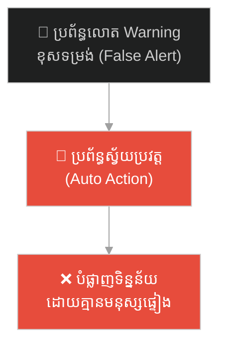
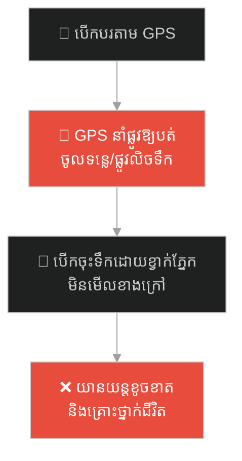
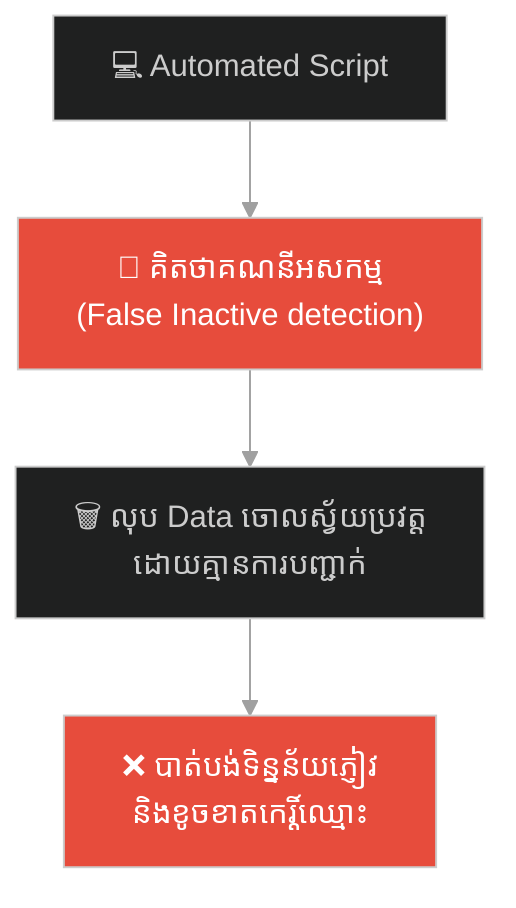
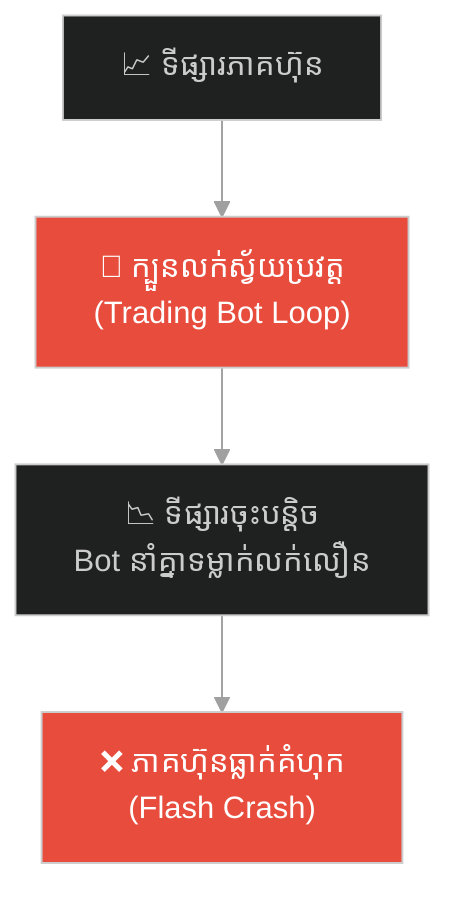
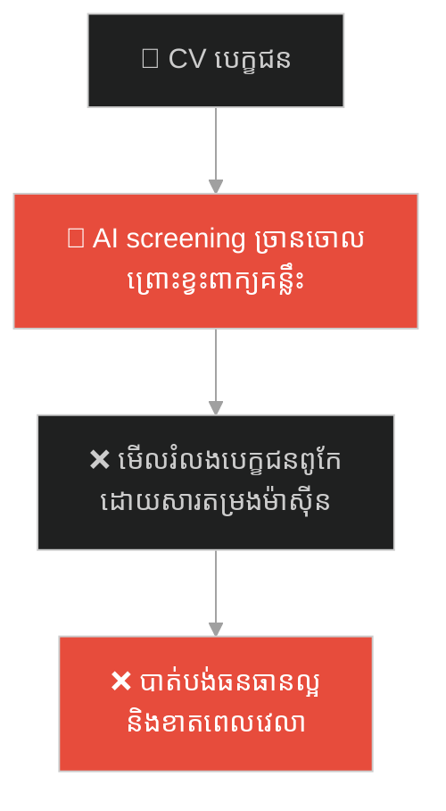
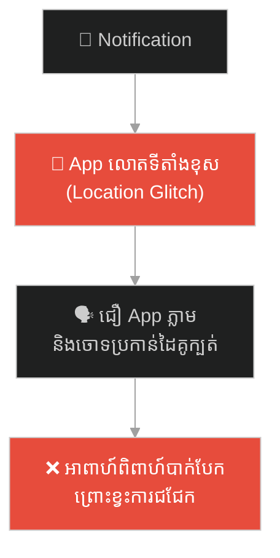
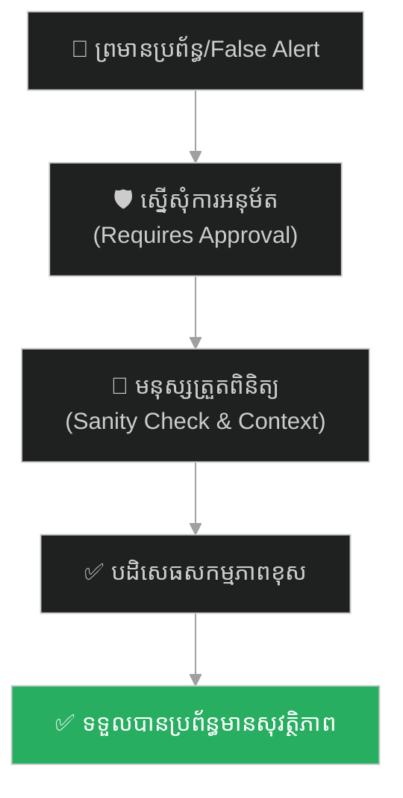

# Human-in-the-Loop (មនុស្សក្នុងប្រព័ន្ធ)៖ ស្តានីស្លាវ ប៉េត្រូវ និងគ្រោះថ្នាក់នៃស្វ័យប្រវត្តិកម្មខ្វះការត្រួតពិនិត្យ (Automation vs. Sanity Checks)

**Author:** ichamrong  
**Date:** 2026-05-27  
**Tags:** #petrov #nuclear #cold-war #human-in-the-loop #automation #critical-thinking #parable  
**Category:** Concepts / Parables  
**Read Time:** ~15 min  

---

## 📌 មាតិកា (Table of Contents)
- [អន្ទាក់ផ្លូវចិត្ត (The Trap)](#0)
- [១. រឿងព្រេងសង្គ្រាមត្រជាក់៖ ស្តានីស្លាវ ប៉េត្រូវ និងសញ្ញាព្រមានខុស (The Legend of Stanislav Petrov)](#1)
  - [ការស៊ើបអង្កេត និងការសម្រេចចិត្តប្រឆាំងប្រព័ន្ធ (Defying the Automated System)](#1-1)
- [២. បញ្ហា៖ គ្រោះថ្នាក់នៃស្វ័យប្រវត្តិកម្មខ្វះមនុស្សត្រួតពិនិត្យ (The Issue: Fully Automated Disasters & Human-in-the-Loop)](#2)
- [៣. ឧទាហរណ៍ជាក់ស្តែងក្នុងពិភពពិត (Real World Examples)](#3)
  - [ឧទាហរណ៍ទី ១ — កម្រិតស្រាល (គ្រួសារ)៖ ការជឿជាក់លើប្រព័ន្ធ GPS ទាំងស្រុងនាំឱ្យធ្លាក់ទឹក (The Blind GPS Trust)](#3-1)
  - [ឧទាហរណ៍ទី ២ — កម្រិតមធ្យម (បច្ចេកទេស)៖ កូដលុបគណនីអសកម្មដោយស្វ័យប្រវត្តិដោយគ្មានការបញ្ជាក់ (The Automated DB Purge)](#3-2)
  - [ឧទាហរណ៍ទី ៣ — កម្រិតមធ្យម (ធុរកិច្ច)៖ ក្បួនដោះស្រាយការលក់ភាគហ៊ុនដោយស្វ័យប្រវត្តបង្កការខាតបង់ធំ (The Algorithmic Flash Crash)](#3-3)
  - [ឧទាហរណ៍ទី ៤ — កម្រិតមធ្យម (សង្គម/គ្រប់គ្រង)៖ ម៉ាស៊ីនស្កែនប្រវត្តិរូបសង្ខេបច្រានចោលបេក្ខជនឆ្នើម (The Automated Resume Screener)](#3-4)
  - [ឧទាហរណ៍ទី ៥ — កម្រិតធ្ងន់ (ទំនាក់ទំនង)៖ ការចោទប្រកាន់ដៃគូជីវិតផ្អែកលើការជូនដំណឹងខុសឆ្គងរបស់ App (The False Notification Accusation)](#3-5)
- [៤. ដំណោះស្រាយទូទៅ៖ ការរចនាប្រព័ន្ធ Human-in-the-Loop និងការធ្វើ Sanity Checks (The General Solution: Designing HITL Guardrails & Context Verification)](#4)
- [សេចក្តីសន្និដ្ឋាន (Conclusion)](#5)
- [ឯកសារយោង (References)](#6)
- [Related Posts](#7)

---

## អន្ទាក់ផ្លូវចិត្ត (The Trap)

តើអ្នកធ្លាប់ជឿជាក់លើការជូនដំណឹង (Notifications) ឬលទ្ធផលរបស់កុំព្យូទ័រ និង AI ទាំងស្រុងដោយខ្វាក់ភ្នែក រួចហើយសម្រេចចិត្តធ្វើសកម្មភាពភ្លាមៗ តែចុងក្រោយលទ្ធផលប្រែជាកំហុសឆ្គងដ៏ធ្ងន់ធ្ងរ ព្រោះម៉ាស៊ីនចាប់ព័ត៌មានខុសដែរឬទេ?

នៅក្នុងយុគសម័យបច្ចេកវិទ្យា និងស្វ័យប្រវត្តិកម្ម៖
* **យើងងាយនឹងបាត់បង់ការគិតបែបវិភាគ** (Critical Thinking) និងប្រគល់ការសម្រេចចិត្តទាំងស្រុងទៅឱ្យកូដ ឬក្បួនដោះស្រាយ (Algorithms)។
* **យើងមើលរំលង** ការពិតដែលថា ម៉ាស៊ីនដឹងត្រឹមតែទិន្នន័យ (Data) ប៉ុន្តែខ្វះខាតការយល់ដឹងពីបរិបទជាក់ស្តែង (Context)។

ការបណ្តោយឱ្យស្វ័យប្រវត្តិកម្មសម្រេចចិត្តលើសកម្មភាពគ្រោះថ្នាក់ដោយគ្មានមនុស្សផ្ទៀងផ្ទាត់ ហៅថា **អន្ទាក់ Blind Automation (លម្អៀងស្វ័យប្រវត្តិកម្ម)**។

ដើម្បីយល់ដឹងពីសារៈសំខាន់នៃការរក្សាមនុស្សក្នុងប្រព័ន្ធ នេះជាផែនទីបង្ហាញផ្លូវសម្រាប់អត្ថបទនេះ៖
1. **រឿងព្រេងប្រវត្តិសាស្ត្រ (The Historic Legend)** — រឿងរ៉ាវរបស់លោក ស្តានីស្លាវ ប៉េត្រូវ ដែលបានបដិសេធមិនព្រមបាញ់គ្រាប់នុយក្លេអ៊ែរ ទោះបីជាកុំព្យូទ័រលោតប្រកាសអាសន្នថាអាមេរិកកំពុងវាយប្រហារក៏ដោយ។
2. **បញ្ហា (The Issue)** — តើអ្វីទៅជា Human-in-the-Loop (HITL) ក្នុងវិស្វកម្មប្រព័ន្ធ?
3. **ឧទាហរណ៍ជាក់ស្តែងក្នុងពិភពពិត (Real World Examples)** — ពិនិត្យមើលគ្រោះថ្នាក់នេះក្នុងកម្រិតគ្រួសារ ព័ត៌មានវិទ្យា ធុរកិច្ច ការគ្រប់គ្រង និងទំនាក់ទំនងស្នេហា។
4. **ដំណោះស្រាយទូទៅ (The General Solution)** — ការបង្កើតយន្តការ Sanity Check និងការដាក់លក្ខខណ្ឌតម្រូវឱ្យមានការយល់ព្រមពីមនុស្ស (Manual Approval)។

---

## ១. រឿងព្រេងសង្គ្រាមត្រជាក់៖ ស្តានីស្លាវ ប៉េត្រូវ និងសញ្ញាព្រមានខុស (The Legend of Stanislav Petrov)

នៅថ្ងៃទី២៦ ខែកញ្ញា ឆ្នាំ១៩៨៣ អំឡុងពេលសង្គ្រាមត្រជាក់ (Cold War) កំពុងឡើងកម្តៅខ្លាំងបំផុត សហរដ្ឋអាមេរិក និងសហភាពសូវៀត (រុស្ស៊ី) ស្ថិតក្នុងស្ថានភាពប្រុងប្រយ័ត្ននុយក្លេអ៊ែរខ្ពស់បំផុត។ កងទ័ពទាំងសងខាងត្រៀមកាំជ្រួចរាប់ពាន់គ្រាប់ដើម្បីបាញ់កម្ទេចគ្នាក្នុងរយៈពេលតែប៉ុន្មាននាទី។

នៅពាក់កណ្តាលអធ្រាត្រ វរសេនីយ៍ឯកយោធាសូវៀតលោក **ស្តានីស្លាវ ប៉េត្រូវ (Stanislav Petrov)** កំពុងបំពេញកាតព្វកិច្ចយាមកាមនៅក្នុងមជ្ឈមណ្ឌលបញ្ជាព្រមាននុយក្លេអ៊ែរ Oko ដ៏សំងាត់ក្បែរក្រុងម៉ូស្គូ។ ស្រាប់តែប្រព័ន្ធកុំព្យូទ័ររ៉ាដាដ៏ទំនើបចុងក្រោយរបស់សូវៀតបានលោតស៊ីរ៉ែនពណ៌ក្រហម ប្រកាសអាសន្នខ្លាំងៗ។ 

នៅលើអេក្រង់កុំព្យូទ័រលោតអក្សរធំៗថា៖ **«LAUNCH» (ការបាញ់ចេញ)**។ កុំព្យូទ័របានរាយការណ៍ថា អាមេរិកទើបតែបានបាញ់កាំជ្រួចនុយក្លេអ៊ែរអន្តរទ្វីប (ICBM) ចំនួន **១ គ្រាប់** សំដៅមករុស្ស៊ី។ មិនយូរប៉ុន្មាន កុំព្យូទ័របានកែប្រែទិន្នន័យឡើងដល់ **៥ គ្រាប់**។

---

### ការស៊ើបអង្កេត និងការសម្រេចចិត្តប្រឆាំងប្រព័ន្ធ (Defying the Automated System)

តាមពិធីការយោធាសូវៀត (SOP) តួនាទីរបស់ ប៉េត្រូវ គឺត្រូវរាយការណ៍ព័ត៌មាននេះទៅថ្នាក់ដឹកនាំភ្លាមៗ។ ថ្នាក់ដឹកនាំនឹងបញ្ជាបាញ់នុយក្លេអ៊ែររាប់ពាន់គ្រាប់តបតទៅអាមេរិកវិញជាកាតព្វកិច្ច មុនពេលគ្រាប់កាំជ្រួចអាមេរិកធ្លាក់ដល់ដី។ ការរាយការណ៍នេះមានន័យថាជាការចាប់ផ្តើម **សង្គ្រាមលោកលើកទី៣** ដែលអាចសម្លាប់មនុស្សរាប់ពាន់លាននាក់ និងបំផ្លាញផែនដីទាំងស្រុង។

ប៉េត្រូវមានពេលតែ ៥ នាទីប៉ុណ្ណោះដើម្បីធ្វើសេចក្តីសម្រេចចិត្ត។ ម៉ាស៊ីនកុំព្យូទ័របានរាយការណ៍ថាកម្រិតភាពច្បាស់លាស់គឺ "ខ្ពស់បំផុត (Highest probability)"។ 

ប៉ុន្តែ ប៉េត្រូវ បានប្រើប្រាស់ **វិចារណញាណរបស់មនុស្ស (Human Sanity Check)** មកគិតយ៉ាងត្រជាក់៖  
> *«ប្រសិនបើសហរដ្ឋអាមេរិកចង់សម្លាប់រុស្ស៊ី និងចាប់ផ្តើមសង្គ្រាមនុយក្លេអ៊ែរពិតមែន ពួកគេមិនមែនបាញ់ត្រឹមតែ ៥ គ្រាប់នោះឡើយ។ ការបាញ់ ៥ គ្រាប់គឺស្មើនឹងការធ្វើអត្តឃាត ព្រោះរុស្ស៊ីនឹងបាញ់រាប់ពាន់គ្រាប់តបវិញ។ បើគេចង់បាញ់ គេត្រូវតែបាញ់រាប់ពាន់គ្រាប់ព្រមគ្នាតាំងពីដំបូងដើម្បីបំផ្លាញប្រព័ន្ធការពាររបស់យើង។»*

លើសពីនេះ ប៉េត្រូវដឹងថា ប្រព័ន្ធរ៉ាដានេះគឺថ្មីខ្លាំង និងមិនទាន់មានស្ថិរភាពល្អនៅឡើយ។ គាត់បានសម្រេចចិត្តបំពានច្បាប់យោធា ដោយទូរស័ព្ទទៅថ្នាក់លើ ហើយរាយការណ៍ថា៖ **«ប្រព័ន្ធកុំព្យូទ័ររបស់យើងកំពុងមានបញ្ហាខូចខាត វាគឺជាសញ្ញាព្រមានខុស (False Alarm)។ ខ្ញុំមិនអនុញ្ញាតឱ្យបញ្ជូនព័ត៌មាននេះទៅគណៈរដ្ឋមន្ត្រីឡើយ!»**

ការសម្រេចចិត្តរបស់គាត់ត្រឹមត្រូវ ១០០%។ កុំព្យូទ័ររ៉ាដានោះបានចាប់យករូបភាពពន្លឺព្រះអាទិត្យដែលជះត្រឡប់ពីពពកខ្ពស់ រួចកុំព្យូទ័រគណនាច្រឡំថាជាភ្លើងបញ្ឆេះមីស៊ីលរបស់អាមេរិក។ ដោយសារតែការគិតបែបវិភាគរបស់មនុស្សម្នាក់ ពិភពលោកត្រូវបានសង្គ្រោះពីមហន្តរាយដ៏អាក្រក់បំផុត។

---

## ២. បញ្ហា៖ គ្រោះថ្នាក់នៃស្វ័យប្រវត្តិកម្មខ្វះមនុស្សត្រួតពិនិត្យ (The Issue: Fully Automated Disasters & Human-in-the-Loop)

រឿងព្រេងរបស់លោក ស្តានីស្លាវ ប៉េត្រូវ បង្ហាញពីគោលការណ៍ **Human-in-the-Loop (HITL - មនុស្សក្នុងប្រព័ន្ធ)** នៅក្នុងវិស្វកម្ម និងការគ្រប់គ្រង៖

* **គ្រោះថ្នាក់នៃ Fully Automated Systems៖** ប្រសិនបើប្រព័ន្ធកម្ទេច ឬបាញ់នុយក្លេអ៊ែររបស់រុស្ស៊ីត្រូវបានសរសេរកូដឱ្យដើរដោយស្វ័យប្រវត្តិ (No human verification) នោះគ្រាប់មីស៊ីលនឹងត្រូវបាញ់ចេញដោយសារតែកំហុស Sensor តូចមួយ។
* **Human-in-the-Loop (HITL)៖** គឺជាស្ថាបត្យកម្មប្រព័ន្ធដែលតម្រូវឱ្យមានការអន្តរាគមន៍ ឬការយល់ព្រមពីមនុស្ស (Human approval) មុនពេលអនុវត្តសកម្មភាពណាដែលមានហានិភ័យខ្ពស់ (ដូចជា លុបទិន្នន័យចោល, បិទ Server, ឬផ្ទេរប្រាក់ច្រើន)។
* **Sanity Checks (ការផ្ទៀងផ្ទាត់ហេតុផល)៖** ម៉ាស៊ីនគណនាបានលឿន ប៉ុន្តែគ្មានសមត្ថភាពយល់ដឹងពី "តក្កវិជ្ជានៃបរិបទ" ឡើយ។

---

## ៣. ឧទាហរណ៍ជាក់ស្តែងក្នុងពិភពពិត

ដើម្បីយល់ដឹងឱ្យកាន់តែច្បាស់ នេះជាការវិភាគលើឧទាហរណ៍ ៥ កម្រិតផ្សេងគ្នា៖

---

### ឧទាហរណ៍ទី ១ — កម្រិតស្រាល (គ្រួសារ)៖ ការជឿជាក់លើប្រព័ន្ធ GPS ទាំងស្រុងនាំឱ្យធ្លាក់ទឹក (The Blind GPS Trust)

**ស្ថានភាព៖** ឪពុកម្នាក់កំពុងបើកបរឡានដឹកក្រុមគ្រួសារដើរលេងនៅជនបទកណ្តាលយប់ងងឹត។ គាត់បើកបរតាមកម្មវិធីរុករក GPS លើទូរស័ព្ទដៃទាំងស្រុង។

* **ជម្រើសខុស (Blind trust)៖** GPS ប្រាប់ឱ្យបត់ឆ្វេង រួចគាត់ក៏បត់ភ្លាមៗដោយមិនបានសម្លឹងមើលផ្លូវជាក់ស្តែងខាងក្រៅឡើយ។
* **លទ្ធផល៖** ផ្លូវនោះគឺជាស្ពានចាស់ដែលបាក់បែក និងមានទន្លេនៅខាងក្រោម។ ឡានរបស់គាត់បានធ្លាក់ចូលទៅក្នុងទឹកទន្លេ ធ្វើឱ្យសមាជិកគ្រួសារភ័យស្លន់ស្លោ និងរងរបួស ព្រោះតែជឿជាក់លើស្វ័យប្រវត្តិកម្មរបស់ GPS ខ្វះការសម្លឹងមើលតថភាពពិត។

**ដំណោះស្រាយ៖**  
ប្រើប្រាស់ GPS គ្រាន់តែជាជំនួយព័ត៌មាន (Decision helper) ប៉ុន្តែភ្នែក និងខួរក្បាលរបស់មនុស្សត្រូវតែធ្វើការផ្ទៀងផ្ទាត់ផ្លូវ និងស្ថានភាពជាក់ស្តែងជានិច្ច មុននឹងបត់ឡាន។

---

### ឧទាហរណ៍ទី ២ — កម្រិតមធ្យម (បច្ចេកទេស)៖ កូដលុបគណនីអសកម្មដោយស្វ័យប្រវត្តិដោយគ្មានការបញ្ជាក់ (The Automated DB Purge)

**ស្ថានភាព៖** ក្រុមហ៊ុន SaaS ចង់សម្អាត Database ដោយលុបចោលរាល់គណនីយូសឺដែលមិនសកម្ម (Inactive accounts) រយៈពេល ២ ឆ្នាំ ដើម្បីសន្សំសំចៃទំហំផ្ទុក។

* **ជម្រើសខុស៖** សរសេរ Cron Job Script ឱ្យដំណើរការនៅម៉ោង ២ រំលងអធ្រាត្រ ដើម្បីលុបរាល់ Row ទិន្នន័យដែលគ្មាន `last_login` ក្នុងរយៈពេល ២៤ ខែ ដោយស្វ័យប្រវត្តគ្មានការត្រួតពិនិត្យចុងក្រោយ។
* **លទ្ធផល៖** ដោយសារតែកូដមានបញ្ហា Bug សរសេរលក្ខខណ្ឌខុស (Logical Error) វាបានលុបទិន្នន័យយូសឺកំពុងដំណើរការ (Active Users) ទាំងអស់ចោល។ យូសឺរាប់ម៉ឺននាក់បាត់បង់ទិន្នន័យការងារ និងខឹងសម្បារខ្លាំង ប្តឹងក្រុមហ៊ុនទាមទារសំណង។

**ដំណោះស្រាយ៖**  
រចនាប្រព័ន្ធ **Human-in-the-Loop**។ ជំនួសឱ្យការលុបចោលភ្លាមៗ កូដត្រូវផ្ញើអ៊ីមែលទៅយូសឺជាមុន និងគ្រាន់តែប្តូរស្ថានភាពទៅជា "Soft Delete/Archived" រួចទុកពេល ៣០ ថ្ងៃ មុននឹងលុបចោលជាស្ថាពរ ដោយត្រូវឆ្លងកាត់ការចុចយល់ព្រមពី Administrator (Manual Check)។

---

### ឧទាហរណ៍ទី ៣ — កម្រិតមធ្យម (ធុរកិច្ច)៖ ក្បួនដោះស្រាយការលក់ភាគហ៊ុនដោយស្វ័យប្រវត្តបង្កការខាតបង់ធំ (The Algorithmic Flash Crash)

**ស្ថានភាព៖** ក្រុមហ៊ុនវិនិយោគហិរញ្ញវត្ថុមួយ ប្រើប្រាស់ Bots ជួញដូរភាគហ៊ុនដោយស្វ័យប្រវត្ត (High-Frequency Trading Bots)។

* **ជម្រើសខុស៖** bots ត្រូវបានកំណត់លក្ខខណ្ឌថា៖ *«បើភាគហ៊ុនធ្លាក់ចុះដល់កម្រិត A ត្រូវលក់ចេញភ្លាមដើម្បីទប់ស្កាត់ការខាតបង់ (Stop-loss auto trigger)»* ដោយគ្មានការកំណត់ដែនកំណត់ល្បឿន ឬការពិនិត្យពីឈ្មួញកណ្តាល (Human Broker)។
* **លទ្ធផល៖** ស្រាប់តែមានព័ត៌មានខុសឆ្គងមួយកើតឡើងលើបណ្តាញព័ត៌មាន ធ្វើឱ្យភាគហ៊ុនធ្លាក់ចុះបន្តិចបន្តួច។ Bot ចាប់ផ្តើមលក់ចេញភ្លាមៗ ដែលជាហេតុធ្វើឱ្យ Bot របស់ក្រុមហ៊ុនដទៃលោតសញ្ញាលក់តាមគ្នា (Negative feedback loop) បង្កជា **Flash Crash** ទីផ្សារភាគហ៊ុនដួលរលំរាប់ពាន់លានដុល្លារក្នុងរយៈពេលតែប៉ុន្មាននាទី។

**ដំណោះស្រាយ៖**  
បង្កើតយន្តការ **Circuit Breaker** (ឧបករណ៍បង្អាក់ស្វ័យប្រវត្ត)។ ប្រសិនបើភាគហ៊ុនធ្លាក់ចុះលឿនហួសពីកម្រិតកំណត់ ប្រព័ន្ធត្រូវផ្អាកការជួញដូរភ្លាមៗ និងតម្រូវឱ្យមានការត្រួតពិនិត្យវាយតម្លៃពីគណៈកម្មការជំនាញជាមនុស្ស (Human verification) មុននឹងបន្តការជួញដូរ។

---

### ឧទាហរណ៍ទី ៤ — កម្រិតមធ្យម (សង្គម/គ្រប់គ្រង)៖ ម៉ាស៊ីនស្កែនប្រវត្តិរូបសង្ខេបច្រានចោលបេក្ខជនឆ្នើម (The Automated Resume Screener)

**ស្ថានភាព៖** ក្រុមហ៊ុនធំមួយទទួលបានប្រវត្តិរូបសង្ខេប (CVs) រាប់ម៉ឺនច្បាប់ ក៏បានប្រើប្រាស់ប្រព័ន្ធ AI Screener ដើម្បីចម្រោះបេក្ខជនដោយស្វ័យប្រវត្ត។

* **ជម្រើសខុស៖** កំណត់ AI ឱ្យច្រានចោល CV ណាដែលគ្មានពាក្យគន្លឹះ (Keywords) ជាក់លាក់ដូចជា "Kubernetes" ឬ "Docker" ដោយគ្មានមនុស្សចូលរួមពិនិត្យឡើងវិញឡើយ។
* **លទ្ធផល៖** វិស្វករជាន់ខ្ពស់ដ៏ពូកែម្នាក់ដែលធ្លាប់បង្កើតប្រព័ន្ធ Cloud ផ្ទាល់ខ្លួន តែសរសេរឈ្មោះបច្ចេកវិទ្យាផ្សេង ត្រូវបាន AI ច្រានចោលភ្លាមៗ។ ក្រុមហ៊ុនខកខានមិនបានសម្ភាសន៍បេក្ខជនឆ្នើមៗ ព្រោះតែតម្រងម៉ាស៊ីនខ្វះខាតការវិភាគ។

**ដំណោះស្រាយ៖**  
ប្រើប្រាស់ AI គ្រាន់តែសម្រាប់ដាក់ពិន្ទុ (Scoring) រីឯសេចក្តីសម្រេចចិត្តច្រានចោល ឬជ្រើសរើស ត្រូវតែឆ្លងកាត់ការត្រួតពិនិត្យដោយភ្នែករបស់មន្ត្រីធនធានមនុស្ស (Human Recruiter) ជានិច្ច។

---

### ឧទាហរណ៍ទី ៥ — កម្រិតធ្ងន់ (ទំនាក់ទំនង)៖ ការចោទប្រកាន់ដៃគូជីវិតផ្អែកលើការជូនដំណឹងខុសឆ្គងរបស់ App (The False Notification Accusation)

**ស្ថានភាព៖** ប្រពន្ធបានដំឡើង App តាមដានទីតាំងរបស់ប្តី ដើម្បីដឹងពីសុវត្ថិភាពធ្វើដំណើរ។

* **ជម្រើសខុស៖** ថ្ងៃមួយ App លោតទីតាំងខុស (GPS Glitch) បង្ហាញថាប្តីកំពុងស្ថិតនៅក្នុងសណ្ឋាគារមួយ។ នាងជឿជាក់លើ App ភ្លាមៗ រួចផ្ញើសារជេរចោទប្រកាន់ប្តីថាមានស្រីក្រៅ និងសុំលែងលះ ដោយមិនស្តាប់ការបកស្រាយរបស់ប្តីឡើយ។
* **លទ្ធផល៖** តាមពិតប្តីកំពុងប្រជុំការងារនៅការិយាល័យចាស់ដែលមានបណ្តាញទូរស័ព្ទខ្សោយ។ ការខ្វះការផ្ទៀងផ្ទាត់ហេតុផល និងការជឿលើម៉ាស៊ីនខ្វាក់ភ្នែក បានបំផ្លាញទំនុកចិត្ត និងបំផ្លាញអាពាហ៍ពិពាហ៍យូរឆ្នាំ។

**ដំណោះស្រាយ៖**  
ចងចាំថា ក្បួនដោះស្រាយ និង App បច្ចេកវិទ្យាក៏អាចមាន Bugs ឬ Glitches ដែរ។ រាល់ពេលលេចឡើងព័ត៌មានសង្ស័យ ត្រូវជជែកគ្នាដោយត្រង់ៗ សាកសួរដៃគូ និងស្វែងរកភស្តុតាងពិតប្រាកដ ជៀសវាងការចោទប្រកាន់ផ្អែកលើទិន្នន័យម៉ាស៊ីនខ្វះបរិបទ។

---

## ៤. ដំណោះស្រាយទូទៅ៖ ការរចនាប្រព័ន្ធ Human-in-the-Loop និងការធ្វើ Sanity Checks (The General Solution: Designing HITL Guardrails & Context Verification)

เพื่อការពារប្រព័ន្ធរបស់អ្នកពីការបំផ្លិចបំផ្លាញដោយសារកំហុសស្វ័យប្រវត្តិកម្ម ត្រូវអនុវត្តវិធីសាស្ត្រគន្លឹះទាំងនេះ៖

### ១. រចនាស្ថាបត្យកម្ម Human-in-the-Loop (HITL) សម្រាប់សកម្មភាពគ្រោះថ្នាក់

* **ក្បួនអនុម័តដោយដៃ (Manual Override/Approval)៖** រាល់សកម្មភាពណាដែលអាចបង្កវិនាសកម្មដល់ប្រព័ន្ធ (ដូចជា ការលុប Database, ការបញ្ចេញកូដថ្មីទៅ Production, ឬការផ្ទេរប្រាក់លើសពីកម្រិតកំណត់) ត្រូវតែទាមទារការចុចអនុម័តពីមនុស្សយ៉ាងហោចណាស់ម្នាក់ ឬពីរនាក់ (Two-man rule)។

### ២. បន្ថែមយន្តការ Sanity Checks ក្នុងកូដ

* កូដត្រូវតែពិនិត្យមើលតក្កវិជ្ជានៃបរិបទ (Context validation) មុននឹងដំណើរការ។ ឧទាហរណ៍៖ ប្រសិនបើកូដចម្រោះទិន្នន័យចង់លុបទិន្នន័យអសកម្ម តែរកឃើញថាទិន្នន័យដែលត្រូវលុបនោះមានចំនួនលើសពី ៥០% នៃទិន្នន័យសរុប ប្រព័ន្ធត្រូវតែបញ្ឈប់ជាបន្ទាន់ (Assert/Fail-safe trigger) និងផ្ញើសារឱ្យមនុស្សមកពិនិត្យមើលជាមុន។

### ៣. រក្សាស្មារតីសង្ស័យ និងការគិតបែបវិភាគ (Critical Thinking)

* កុំបញ្ឈប់ការគិតរបស់អ្នកនៅពេលម៉ាស៊ីនប្រាប់ថា "នេះជាការត្រឹមត្រូវ"។ ត្រូវសួរសំណួរជានិច្ចថា៖ *«តើលទ្ធផលនេះសមហេតុផលជាមួយស្ថានភាពបច្ចុប្បន្នដែរឬទេ?»*

---

## Related Posts

ដើម្បីស្វែងយល់បន្ថែមអំពីរបៀបដែលការការពារជាមុន និងការរៀបចំប្រព័ន្ធបង្ការគ្រោះថ្នាក់ (Proactive Monitoring & Prevention) អាចជួយលុបបំបាត់បញ្ហាតាំងពីមិនទាន់កើតមាន និងភាពខុសគ្នារវាងវីរៈបុរសពន្លត់ភ្លើង និងអ្នកបង្ការភ្លើងស្ងប់ស្ងាត់ សូមបន្តទៅកាន់ Parable បន្ទាប់៖

* 🚀 **[ចាប់ផ្តើមដំណើររុករក (Start the Journey) ➔ The Unfought Battle](./50-the-unfought-battle.md)**

---

## សេចក្តីសន្និដ្ឋាន (Conclusion)

> **«កុំព្យូទ័រអាចគណនាបានលឿនជាងមនុស្សរាប់លានដង តែវាគ្មានសមត្ថភាពយល់ដឹងពីសីលធម៌ និងតម្លៃនៃជីវិតឡើយ។ ម៉ាស៊ីនគឺជាអ្នករត់ ប៉ុន្តែមនុស្សត្រូវតែជាអ្នកកាន់ខ្សែបង្ហៀរជានិច្ច។»**

សង្គ្រាមលោកលើកទី៣ ត្រូវបានទប់ស្កាត់មិនមែនដោយសារតែកុំព្យូទ័ររបស់រុស្ស៊ីដំណើរការល្អនោះទេ គឺដោយសារតែសង្ស័យរបស់មនុស្សម្នាក់លើកុំព្យូទ័រនោះ។ ចូររចនាប្រព័ន្ធរបស់អ្នកដោយគោរពតម្លៃវិចារណញាណរបស់មនុស្សនៅថ្ងៃនេះ។

---

## ឯកសារយោង (References)

* **Tony Self** — *The Man Who Saved the World: Stanislav Petrov* (2014)។ ភាពយន្តឯកសារ និងកំណត់ត្រាជីវប្រវត្តិផ្លូវការរបស់លោក ស្តានីស្លាវ ប៉េត្រូវ។
* **Ben Shneiderman** — *Human-Centered AI* (2022)។ គោលការណ៍ណែនាំស្តីពីការរចនាប្រព័ន្ធ AI និងស្វ័យប្រវត្តិកម្មដោយរក្សាមនុស្សជាស្នូលសម្រេចចិត្ត។
* **David A. Mindell** — *Our Robots, Ourselves: Robotics and the Myths of Autonomy* (2015)។ ទ្រឹស្តីស្នូលស្តីពីទំនាក់ទំនងរវាងមនុស្ស និងប្រព័ន្ធស្វ័យប្រវត្ត។

---

## Related Posts

* **[41 Stanislav Petrov: Human-in-the-Loop and Automated Systems](../articles/41-stanislav-petrov-and-human-in-the-loop.md)** — អត្ថបទគោលលម្អិតបកស្រាយពីយន្តការ Human-in-the-Loop ក្នុងប្រព័ន្ធព័ត៌មានវិទ្យា។
* **[45 The Unsinkable Ship](./45-the-unsinkable-ship.md)** — សោកនាដកម្មទីតានិក និងគ្រោះថ្នាក់នៃការស៊ាំនឹងសញ្ញាព្រមាន។
* **[13 The Lost Axe and the Filter of Mind](./13-the-lost-axe-and-the-filter-of-mind.md)** — របៀបដែលការសង្ស័យ និងលម្អៀងផ្ទាល់ខ្លួនជះឥទ្ធិពលលើការសម្រេចចិត្ត។

---
*Last updated: 2026-05-27*

## Related

- [💡 Concepts README](../README.md)
- [📚 Main Repository README](../../../README.md)
- [Developer Habits](../../developer-habits/README.md)
- [Mental Health & Well-being](../../mental-health/README.md)
- [Management & SDLC](../../management/README.md)
