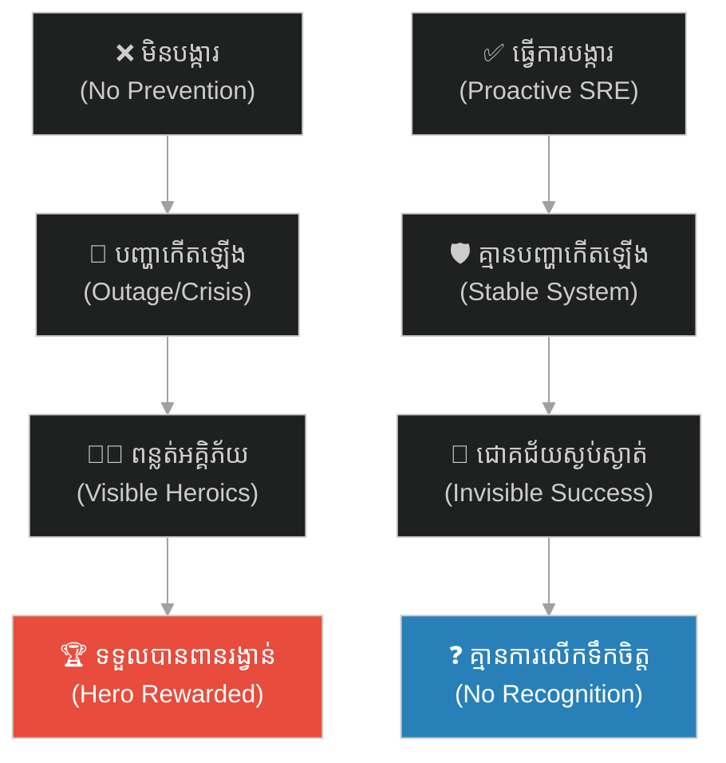
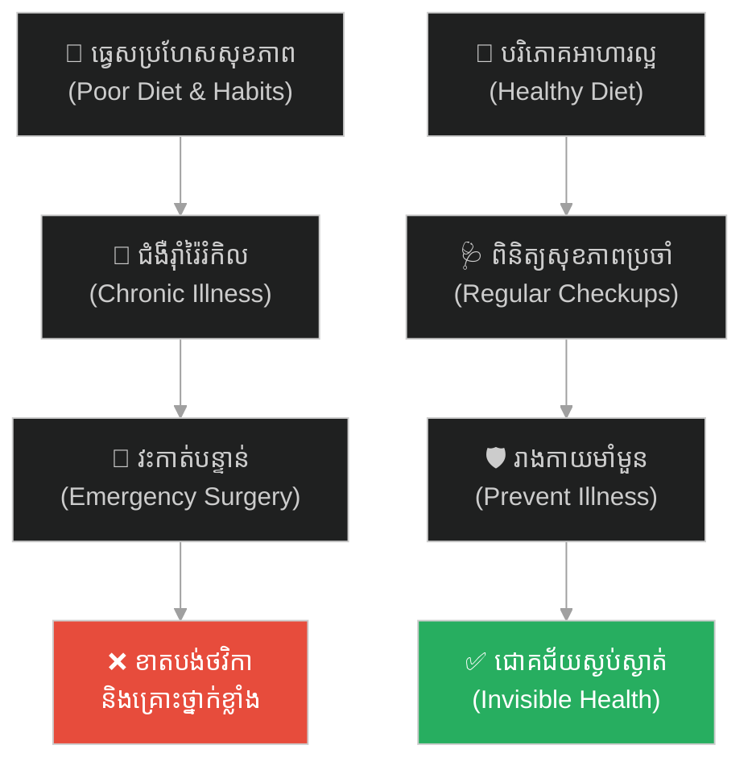
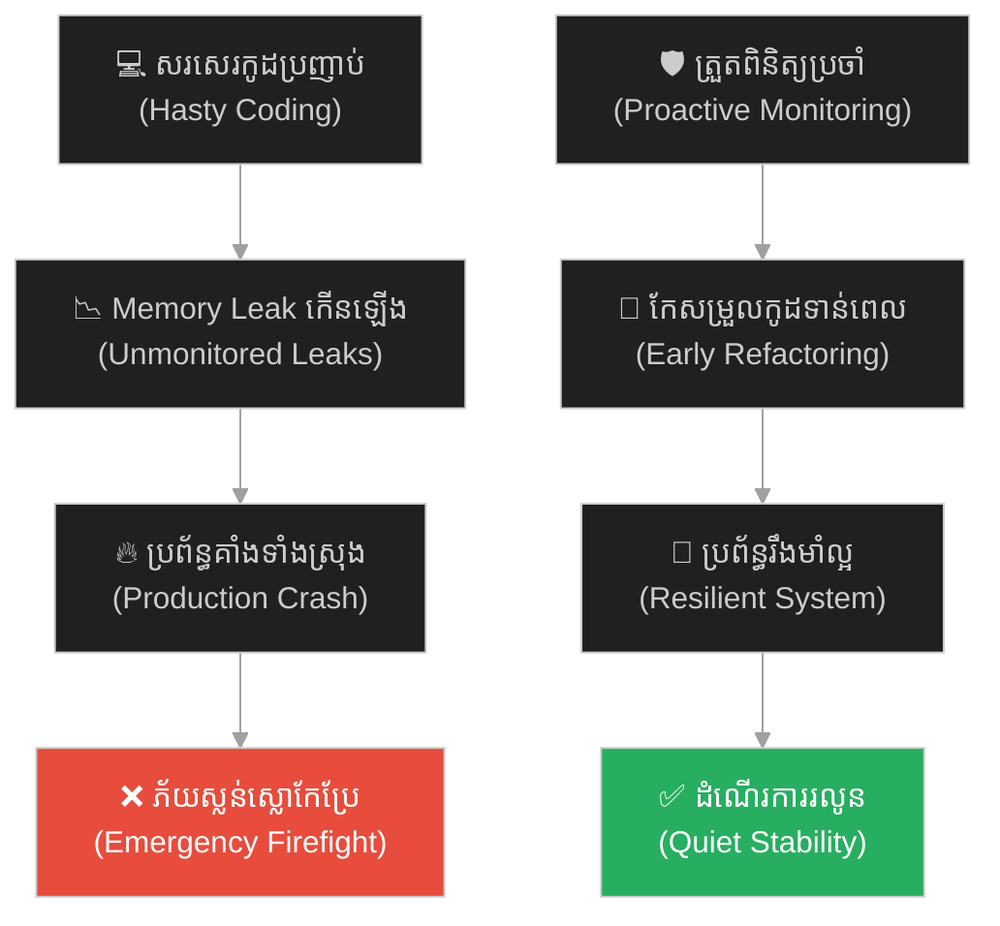
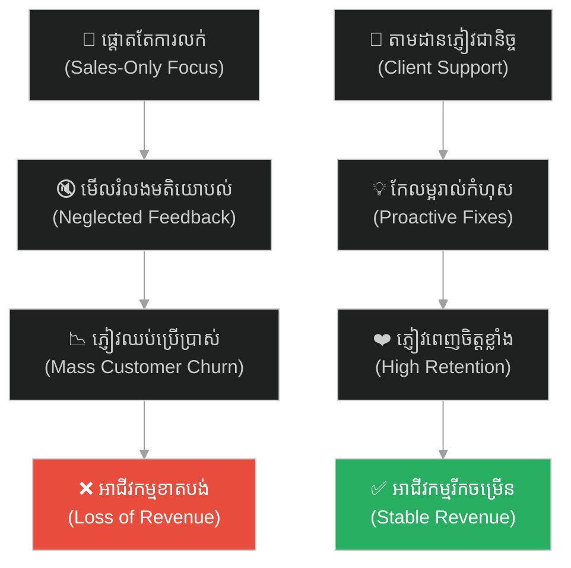
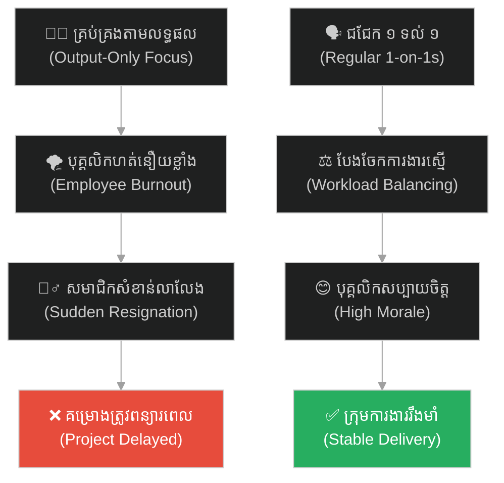
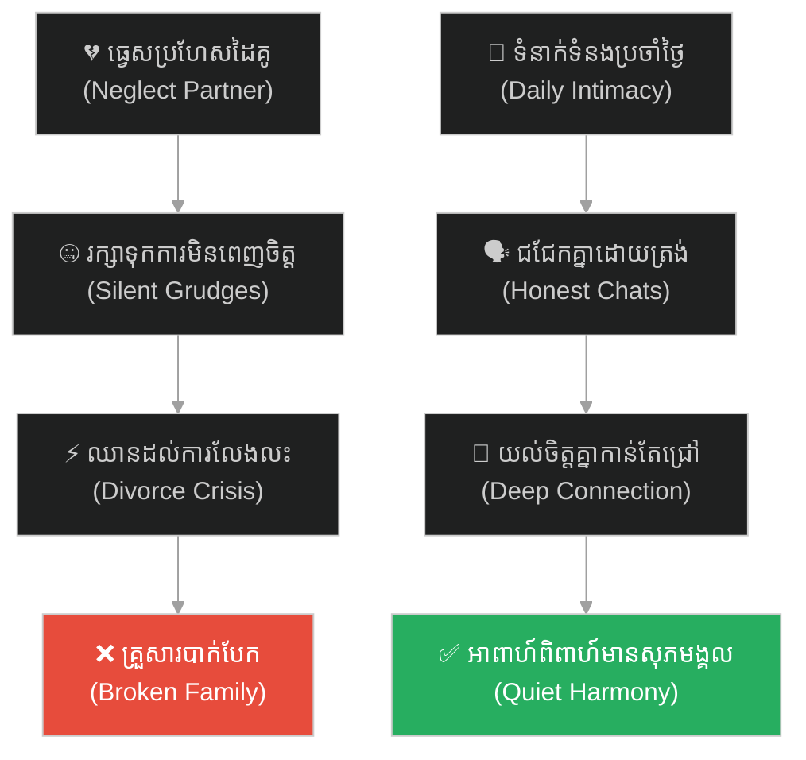
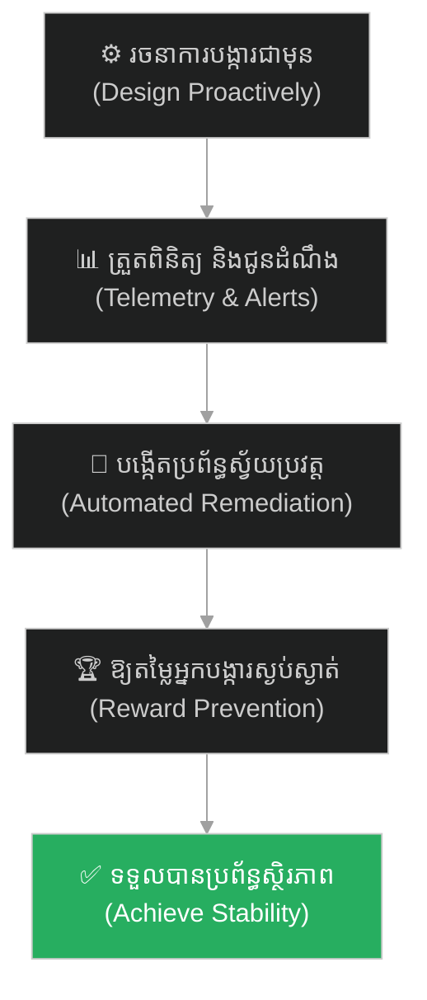

# Prevention over Cure (ការបង្ការប្រសើរជាងការព្យាបាល)៖ ស៊ុនអ៊ូ និងសមរភូមិដែលមិនបាច់ប្រយុទ្ធ ឬយុទ្ធសាស្ត្របង្ការជាមុន (Prevention over Cure & Invisible Success)

**Author:** ichamrong  
**Date:** 2026-05-27  
**Tags:** #sun-tzu #art-of-war #strategy #prevention #proactive-sre #invisible-success #parable  
**Category:** Concepts / Parables  
**Read Time:** ~15 min  

---

## 📌 មាតិកា (Table of Contents)
- [អន្ទាក់ផ្លូវចិត្ត (The Trap)](#0)
- [១. រឿងព្រេងសង្គ្រាមបុរាណ៖ ស៊ុនអ៊ូ និងសមរភូមិដែលមិនបាច់ប្រយុទ្ធ (The Legend of the Unfought Battle)](#1)
  - [ជ័យជម្នះដ៏ស្ងប់ស្ងាត់ (The Silent Victory)](#1-1)
- [២. បញ្ហា៖ ការបង្ការប្រសើរជាងការព្យាបាល និងការឱ្យតម្លៃវីរៈបុរសស្ងប់ស្ងាត់ (The Issue: Prevention over Cure & Invisible Success)](#2)
- [៣. ឧទាហរណ៍ជាក់ស្តែងក្នុងពិភពពិត (Real World Examples)](#3)
  - [ឧទាហរណ៍ទី ១ — កម្រិតស្រាល (គ្រួសារ)៖ ការពិនិត្យសុខភាពបង្ការ និងរបបអាហារល្អជៀសផុតពីជំងឺរ៉ាំរ៉ៃ (Proactive Family Health Checks)](#3-1)
  - [ឧទាហរណ៍ទី ២ — កម្រិតមធ្យម (បច្ចេកទេស)៖ ការកែសម្រួលកូដ និងការត្រួតពិនិត្យ Memory Leak បង្ការការគាំងប្រព័ន្ធធំ (Proactive Code Refactoring & SRE)](#3-2)
  - [ឧទាហរណ៍ទី ៣ — កម្រិតមធ្យម (ធុរកិច្ច)៖ ការតាមដានការពេញចិត្តអតិថិជនជាប្រចាំបង្ការការបាត់បង់អតិថិជន (Proactive Customer Success & Churn Prevention)](#3-3)
  - [ឧទាហរណ៍ទី ៤ — កម្រិតមធ្យម (សង្គម/គ្រប់គ្រង)៖ ការជជែកពិភាក្សា ១ ទល់នឹង ១ ជាមួយបុគ្គលិកបង្ការការលាលែងពីការងារ (Proactive 1-on-1s & Team Retention)](#3-4)
  - [ឧទាហរណ៍ទី ៥ — កម្រិតធ្ងន់ (ទំនាក់ទំនង)៖ ការចំណាយពេលវេលាបង្កើតភាពស្និទ្ធស្នាលប្រចាំថ្ងៃបង្ការការលែងលះ (Proactive Daily Intimacy & Conflict Prevention)](#3-5)
- [៤. ដំណោះស្រាយទូទៅ៖ ការកសាងយន្តការបង្ការ និងការឱ្យតម្លៃវីរៈបុរសស្ងប់ស្ងាត់ (The General Solution: Proactive Guardrails & Rewarding Quiet Success)](#4)
- [សេចក្តីសន្និដ្ឋាន (Conclusion)](#5)
- [ឯកសារយោង (References)](#6)
- [Related Posts](#7)

---

## អន្ទាក់ផ្លូវចិត្ត (The Trap)

តើអ្នកធ្លាប់ជួបស្ថានភាពដែលក្រុមហ៊ុន ឬស្ថាប័នរបស់អ្នក ចូលចិត្តតែលើកសរសើរ និងផ្តល់រង្វាន់ដល់ "វីរៈបុរសពន្លត់អគ្គិភ័យ" (Firefighters) ដែលបានជួយសង្គ្រោះប្រព័ន្ធឱ្យរស់ឡើងវិញក្រោយការគាំងធំ ប៉ុន្តែមើលរំលង និងមិនឱ្យតម្លៃដល់ "វិស្វករស្ងប់ស្ងាត់" ដែលខិតខំធ្វើការបង្ការមិនឱ្យមានបញ្ហាកើតឡើងតាំងពីដំបូងដែរឬទេ?

នៅក្នុងការគ្រប់គ្រងប្រព័ន្ធ និងប្រតិបត្តិការ៖
* **យើងងាយនឹងផ្តល់តម្លៃលើសកម្មភាពដែលមើលឃើញច្បាស់** (Visible Heroics) នៅពេលមានវិបត្តិធំកើតឡើង រួចដោះស្រាយបាន។
* **យើងមើលរំលង** ការងារបង្ការដ៏ស្ងប់ស្ងាត់ (Proactive Prevention) ដែលជួយឱ្យប្រព័ន្ធដំណើរការរលូន ព្រោះវាគ្មានរឿងរ៉ាវគួរឱ្យរំភើបដើម្បីរាយការណ៍ឡើយ។

ការបណ្តោយឱ្យវប្បធម៌ស្វែងរកវីរៈបុរសពន្លត់ភ្លើង បំផ្លាញយន្តការបង្ការជាមុន ហៅថា **អន្ទាក់ Firefighter Bias (លម្អៀងអ្នកពន្លត់ភ្លើង)**។

ដើម្បីយល់ដឹងពីសារៈសំខាន់នៃការបង្ការជាមុន និងការកសាងប្រព័ន្ធស្ថិរភាព នេះជាផែនទីបង្ហាញផ្លូវសម្រាប់អត្ថបទនេះ៖
1. **រឿងព្រេងប្រវត្តិសាស្ត្រ (The Historic Legend)** — ទស្សនៈរបស់ស៊ុនអ៊ូអំពី "សមរភូមិដែលមិនបាច់ប្រយុទ្ធ" និងគ្រូពេទ្យដ៏ពូកែដែលគ្មាននរណាស្គាល់ឈ្មោះ។
2. **បញ្ហា (The Issue)** — ភាពផ្ទុយគ្នារវាងការដោះស្រាយវិបត្តិ (Reactive Firefighting) និងការបង្ការជាមុន (Proactive SRE)។
3. **ឧទាហរណ៍ជាក់ស្តែងក្នុងពិភពពិត (Real World Examples)** — ពិនិត្យមើលសារៈសំខាន់នៃការបង្ការក្នុងកម្រិតគ្រួសារ ព័ត៌មានវិទ្យា ធុរកិច្ច ការគ្រប់គ្រង និងទំនាក់ទំនងស្នេហា។
4. **ដំណោះស្រាយទូទៅ (The General Solution)** — វិធីបង្កើតយន្តការបង្ការជាមុន (Telemetry & Automation) និងការកែប្រែវប្បធម៌វាយតម្លៃការងារដើម្បីលើកទឹកចិត្តអ្នកបង្ការ។

---

## ១. រឿងព្រេងសង្គ្រាមបុរាណ៖ ស៊ុនអ៊ូ និងសមរភូមិដែលមិនបាច់ប្រយុទ្ធ (The Legend of the Unfought Battle)

នៅក្នុងប្រទេសចិននាសម័យបុរាណ ព្រះរាជាបានសួរទៅកាន់កំពូលសេនាប្រមុខ **ស៊ុនអ៊ូ (Sun Tzu)** ថា៖ *«តើមេទ័ពរូបណាដែលជាកំពូលមេទ័ពពូកែបំផុតនៅលើលោក?»*

ស៊ុនអ៊ូបានឆ្លើយតបវិញថា៖  
> *«មេទ័ពដែលពូកែបំផុត គឺមេទ័ពដែលឈ្នះសង្គ្រាមតាំងពីសមរភូមិមិនទាន់បានបង្កើតឡើងទៅទៀត។ ពួកគេកម្ចាត់សត្រូវតាំងពីពួកគេមិនទាន់រៀបចំកងទ័ពរួច ដោយការប្រើប្រាស់ការទូត យុទ្ធសាស្ត្របង្ការ និងការបំផ្លាញផែនការសត្រូវជាមុន។ ជ័យជម្នះរបស់ពួកគេ គឺស្ងប់ស្ងាត់ខ្លណាស់ គ្មាននរណាដឹងឮ គ្មាននរណាលើកតម្កើងពីភាពក្លាហាន ហើយក៏គ្មាននរណាច្រៀងចម្រៀងសរសើរពួកគេឡើយ ព្រោះសមរភូមិពិតប្រាកដមិនបានកើតឡើងផងនោះ។»*

ផ្ទុយទៅវិញ ស៊ុនអ៊ូបានបង្ហាញថា មេទ័ពដែលប្រជាជនស្គាល់ទូទាំងប្រទេស គឺជាមេទ័ពដែលដឹកនាំទ័ពទៅប្រយុទ្ធគ្នាយ៉ាងស៊ីសាច់ហុតឈាម ស្លាប់កងទ័ពរាប់ម៉ឺននាក់ រួចឈ្នះមកវិញទាំងត្រដាបត្រដួស។ ប្រជាជនគិតថាគេជាវីរៈបុរស ព្រោះតែការប្រយុទ្ធនោះមើលឃើញច្បាស់ ប៉ុន្តែតាមពិត គេគ្រាន់តែជាមេទ័ពកម្រិតមធ្យមដែលខ្វះសមត្ថភាពបង្ការសង្គ្រាមប៉ុណ្ណោះ។

---

### ជ័យជម្នះដ៏ស្ងប់ស្ងាត់ (The Silent Victory)

ដើម្បីឱ្យព្រះរាជាយល់កាន់តែច្បាស់ ស៊ុនអ៊ូបានលើកយកប្រវត្តិគ្រូពេទ្យបីនាក់បងប្អូនមកនិទាន៖
1. **បងប្រុសច្បង៖** ព្យាបាលជំងឺដោយការសង្កេតលើទឹកមុខ និងរាងកាយតាំងពីមិនទាន់លេចចេញរោគសញ្ញា។ គាត់បានណែនាំពីរបបអាហារ និងការរស់នៅ ធ្វើឱ្យមនុស្សមិនដែលធ្លាក់ខ្លួនឈឺឡើយ។ ដូច្នេះ កេរ្តិ៍ឈ្មោះរបស់គាត់មិនល្បីល្បាញហួសពីរបងផ្ទះរបស់គាត់ឡើយ ព្រោះគ្មាននរណាគិតថាគាត់បានជួយសង្គ្រោះជីវិតគេឡើយ។
2. **បងប្រុសទីពីរ៖** ព្យាបាលជំងឺនៅពេលវាទេបតែចាប់ផ្តើមលេចចេញសញ្ញាស្រាលៗ។ គាត់បានផ្សំថ្នាំឱ្យលេបភ្លាម ធ្វើឱ្យជំងឺមិនអាចរីករាលដាលធំ។ គាត់ល្បីឈ្មោះត្រឹមតែក្នុងភូមិរបស់គាត់ប៉ុណ្ណោះ។
3. **ប្អូនប្រុសពៅ (Bien Que - ពានក្វៀ)៖** ជាគ្រូពេទ្យដែលល្បីល្បាញទូទាំងប្រទេសចិន។ គាត់ព្យាបាលតែជំងឺណាដែលធ្ងន់ធ្ងរជិតស្លាប់ ដោយការចាក់ម្ជុលវិទ្យាសាស្ត្រ ការវះកាត់ និងការប្រើប្រាស់ថ្នាំខ្លាំងៗ។ គ្រប់គ្នាគិតថាគាត់ជាទេវតា តែគាត់បានដកដង្ហើមធំរួចនិយាយថា៖ *«តាមពិត បងប្រុសច្បងរបស់ខ្ញុំទើបជាកំពូលគ្រូពេទ្យពិតប្រាកដ ព្រោះគាត់បានបង្ការជំងឺតាំងពីមិនទាន់កើត តែគាត់គ្មានឈ្មោះល្បីឡើយ ចំណែកខ្ញុំល្បីល្បាញព្រោះតែខ្ញុំព្យាបាលជំងឺដែលជិតស្លាប់ទៅហើយ។»*

---

## ២. បញ្ហា៖ ការបង្ការប្រសើរជាងការព្យាបាល និងការឱ្យតម្លៃវីរៈបុរសស្ងប់ស្ងាត់ (The Issue: Prevention over Cure & Invisible Success)

រឿងព្រេងនេះលាតត្រដាងនូវគោលការណ៍ **Proactive SRE (Site Reliability Engineering)** និងការគ្រប់គ្រងទំនើប៖

* **សកម្មភាពពន្លត់ភ្លើង (Reactive Firefighting)៖** ប្រព័ន្ធធ្លាក់ចុះ Server downtime ឬ Bug បំផ្លាញទិន្នន័យ។ ក្រុមការងារចំណាយពេលដាច់យប់ដើម្បីដោះស្រាយ។ អ្នកដឹកនាំមើលឃើញការខិតខំប្រឹងប្រែងនេះ រួចផ្តល់រង្វាន់ និងការសរសើរ។ នេះបង្កើតឱ្យមានវប្បធម៌ចង់ឱ្យមានបញ្ហាកើតឡើង ដើម្បីពួកគេអាចក្លាយជា "វីរៈបុរស"។
* **សកម្មភាពបង្ការជាមុន (Proactive SRE)៖** ការចំណាយពេលសរសេរ unit tests, refactoring កូដ, កែសម្រួល database indexes, និងបង្កើត monitoring dashboards។ ការងារនេះស្ងប់ស្ងាត់ និងស្មុគស្មាញ ប៉ុន្តែវាធ្វើឱ្យប្រព័ន្ធស្ថិតស្ថេរ គ្មានការគាំង គ្មាន downtime។
* **ភាពលំបាកនៃ Invisible Success៖** ការងារបង្ការដែលទទួលបានជោគជ័យ ១០០% គឺគ្មានអ្វីកើតឡើងទាល់តែសោះ (Nothing happens)។ គ្មានអ្វីកើតឡើង មានន័យថាអ្នកគ្រប់គ្រងពិបាកវាយតម្លៃពិន្ទុការងារ (KPI) ដែលជាហេតុធ្វើឱ្យវិស្វករស្ងប់ស្ងាត់ទាំងនោះ មិនសូវទទួលបានការលើកទឹកចិត្ត។

---

## ៣. ឧទាហរណ៍ជាក់ស្តែងក្នុងពិភពពិត

ដើម្បីយល់ដឹងឱ្យកាន់តែច្បាស់ នេះជាការវិភាគលើឧទាហរណ៍ ៥ កម្រិតផ្សេងគ្នា៖

---

### ឧទាហរណ៍ទី ១ — កម្រិតស្រាល (គ្រួសារ)៖ ការពិនិត្យសុខភាពបង្ការ និងរបបអាហារល្អជៀសផុតពីជំងឺរ៉ាំរ៉ៃ (Proactive Family Health Checks)

**ស្ថានភាព៖** គ្រួសារមួយចង់រក្សាសុខភាពសមាជិកគ្រប់រូបឱ្យបានល្អ។

* **ជម្រើសខុស (Reactive Care)៖** ធ្វេសប្រហែសការបរិភោគអាហារ បរិភោគអាហារផ្អែម និងខ្លាញ់ច្រើន ព្រមទាំងមិនដែលទៅពិនិត្យសុខភាពឡើយ។ នៅពេលសមាជិកគ្រួសារម្នាក់ស្រាប់តែដួលសន្លប់ដោយសារគាំងបេះដូង ឬជំងឺទឹកនោមផ្អែមធ្ងន់ធ្ងរ ទើបប្រញាប់បញ្ជូនទៅមន្ទីរពេទ្យវះកាត់បន្ទាន់ ដែលត្រូវចំណាយថវិការាប់ម៉ឺនដុល្លារ និងប្រឈមនឹងគ្រោះថ្នាក់ជីវិតខ្ពស់។
* **ជម្រើសត្រូវ (Proactive Prevention)៖** រៀបចំរបបអាហារដែលមានតុល្យភាព កាត់បន្ថយជាតិស្ករ ធ្វើលំហាត់ប្រាណប្រចាំថ្ងៃ និងទៅពិនិត្យសុខភាពប្រចាំឆ្នាំ (Regular Screening)។ គ្រូពេទ្យរកឃើញកម្រិតកូឡេស្តេរ៉ុលឡើងបន្តិច រួចណែនាំឱ្យកែសម្រួលទម្លាប់ភ្លាមៗ ធ្វើឱ្យគ្មាននរណាម្នាក់ត្រូវធ្លាក់ខ្លួនឈឺធ្ងន់ឡើយ។

---

### ឧទាហរណ៍ទី ២ — កម្រិតមធ្យម (បច្ចេកទេស)៖ ការកែសម្រួលកូដ និងការត្រួតពិនិត្យ Memory Leak បង្ការការគាំងប្រព័ន្ធធំ (Proactive Code Refactoring & SRE)

**ស្ថានភាព៖** ក្រុមការងារអភិវឌ្ឍប្រព័ន្ធ e-commerce មួយដែលជិតដល់ថ្ងៃលក់បញ្ចុះតម្លៃធំ (Mega Sale Day)។

* **ជម្រើសខុស៖** ផ្តោតតែលើការបន្ថែម Feature ថ្មីៗ និងមិនខ្វល់ពីកូដចាស់ៗដែលមានបញ្ហាឡើយ។ នៅថ្ងៃលក់បញ្ចុះតម្លៃ ស្រាប់តែមានអ្នកចូលទស្សនារាប់សែននាក់ ធ្វើឱ្យប្រព័ន្ធជួបប្រទះបញ្ហា Memory Leak គាំង Server ទាំងស្រុង។ ក្រុមការងារត្រូវបង្ខំចិត្តជួសជុលបន្ទាន់ទាំងភ័យស្លន់ស្លោ (Emergency patching on production) បង្កឱ្យខាតបង់ចំណូលរាប់សែនដុល្លារ។
* **ជម្រើសត្រូវ៖** មុនថ្ងៃលក់បញ្ចុះតម្លៃ ១ ខែ ក្រុមការងារ SRE បានរៀបចំធ្វើ Load Testing, ស្វែងរកចំណុចដបដប (Bottlenecks), កែសម្រួល indexes ក្នុង Database, និងជួសជុលរាល់កូដដែលមាន memory leaks តូចៗទាំងអស់។ នៅថ្ងៃ Mega Sale Day ប្រព័ន្ធដំណើរការយ៉ាងរលូនឥតខ្ចោះ គ្មានការគាំងសូម្បីតែមួយវិនាទី។

---

### ឧទាហរណ៍ទី ៣ — កម្រិតមធ្យម (ធុរកិច្ច)៖ ការតាមដានការពេញចិត្តអតិថិជនជាប្រចាំបង្ការការបាត់បង់អតិថិជន (Proactive Customer Success & Churn Prevention)

**ស្ថានភាព៖** ក្រុមហ៊ុនសេវាកម្ម SaaS មួយចង់រក្សាអតិថិជនប្រចាំឆ្នាំ (B2B Enterprise clients)។

* **ជម្រើសខុស៖** បន្ទាប់ពីលក់សេវាកម្មរួច ក្រុមហ៊ុនមិនដែលទំនាក់ទំនងសាកសួរអតិថិជនឡើយ។ នៅចុងឆ្នាំ ស្រាប់តែអតិថិជនធំៗសម្រេចចិត្តឈប់ប្រើប្រាស់សេវាកម្មព្រមគ្នា (Mass Churn) ព្រោះមានបញ្ហាលាក់កំបាំងមិនត្រូវបានដោះស្រាយ។ ក្រុមការងារលក់ប្រញាប់ចុះទៅបញ្ចុះបញ្ចូល និងបញ្ចុះតម្លៃយ៉ាងច្រើនទាំងប្រផិតប្រផើយ ដើម្បីទប់ស្កាត់ការចាកចេញ។
* **ជម្រើសត្រូវ៖** បង្កើតក្រុមការងារ Customer Success ដើម្បីទាក់ទងសាកសួរមតិ និងពិនិត្យទិន្នន័យប្រើប្រាស់របស់អតិថិជនរៀងរាល់ខែ។ នៅពេលរកឃើញថាមានអតិថិជនណាម្នាក់កាត់បន្ថយការប្រើប្រាស់ ក្រុមការងារចុះទៅជួយដោះស្រាយបញ្ហា និងបណ្តុះបណ្តាលបន្ថែមភ្លាមៗ ធ្វើឱ្យអតិថិជនបន្តកិច្ចសន្យាជារៀងរាល់ឆ្នាំដោយគ្មានការរារែក។

---

### ឧទាហរណ៍ទី ៤ — កម្រិតមធ្យម (សង្គម/គ្រប់គ្រង)៖ ការជជែកពិភាក្សា ១ ទល់នឹង ១ ជាមួយបុគ្គលិកបង្ការការលាលែងពីការងារ (Proactive 1-on-1s & Team Retention)

**ស្ថានភាព៖** អ្នកគ្រប់គ្រងម្នាក់ដឹកនាំក្រុមវិស្វកម្មដែលមានសម្ពាធការងារខ្ពស់។

* **ជម្រើសខុស៖** ផ្តោតតែលើការតាមដានការងារ និងការជំរុញឱ្យទាន់ Deadline ដោយមិនខ្វល់ពីសុខទុក្ខបុគ្គលិកឡើយ។ ស្រាប់តែថ្ងៃមួយ វិស្វករសំខាន់បំផុតរបស់ក្រុមបានដាក់ពាក្យលាលែងពីការងារដោយសារ Burnout។ អ្នកគ្រប់គ្រងភ័យស្លន់ស្លោដំឡើងប្រាក់ខែ និងអង្វរករឱ្យនៅជួយ តែហួសពេលទៅហើយ ធ្វើឱ្យគម្រោងទាំងមូលត្រូវជាប់គាំង។
* **ជម្រើសត្រូវ៖** រៀបចំការជជែកពិភាក្សា ១ ទល់នឹង ១ (Regular 1-on-1s) ជាប្រចាំរៀងរាល់ពីរសប្តាហ៍ ដើម្បីស្តាប់កង្វល់ បញ្ហាផ្ទាល់ខ្លួន និងកម្រិតស្រ្តេសរបស់បុគ្គលិកម្នាក់ៗ។ នៅពេលរកឃើញថាសមាជិកណាម្នាក់ចាប់ផ្តើមហត់នឿយ អ្នកគ្រប់គ្រងសម្របសម្រួលបែងចែកការងារឡើងវិញភ្លាមៗ ធ្វើឱ្យក្រុមការងាររក្សាបាននូវស្ថិរភាព និងមិនមានការលាលែងពីការងារភ្លាមៗឡើយ។

---

### ឧទាហរណ៍ទី ៥ — កម្រិតធ្ងន់ (ទំនាក់ទំនង)៖ ការចំណាយពេលវេលាបង្កើតភាពស្និទ្ធស្នាលប្រចាំថ្ងៃបង្ការការលែងលះ (Proactive Daily Intimacy & Conflict Prevention)

**ស្ថានភាព៖** ប្តីប្រពន្ធដែលរៀបការរួច និងរវល់ការងាររៀងៗខ្លួន។

* **ជម្រើសខុស៖** ធ្វេសប្រហែសមិនយកចិត្តទុកដាក់នឹងគ្នា គិតថាអាពាហ៍ពិពាហ៍រឹងមាំហើយ មិនបាច់ថែរក្សាក៏បាន។ ពួកគេលែងនិយាយគ្នា លែងចែករំលែកអារម្មណ៍ និងរក្សាទុកការមិនពេញចិត្តតូចតាចរៀងខ្លួន។ ចុងក្រោយ ការមិនយល់ចិត្តគ្នាកាន់តែធំឡើង រហូតដល់ថ្ងៃមួយមានការឈ្លោះប្រកែកគ្នាខ្លាំង ហើយសម្រេចចិត្តលែងលះគ្នាភ្លាមៗទាំងកំហឹង ដែលពិបាកនឹងផ្សះផ្សាឡើងវិញ។
* **ជម្រើសត្រូវ៖** ចំណាយពេលយ៉ាងហោចណាស់ ១៥ នាទីរៀងរាល់ល្ងាច ដើម្បីនិយាយគ្នា សួរនាំពីអារម្មណ៍ និងដោះស្រាយរាល់ការមិនពេញចិត្តតូចៗភ្លាមៗដោយគ្មានការលាក់លៀម។ ការយកចិត្តទុកដាក់ និងការកសាងទំនាក់ទំនងស្និទ្ធស្នាលប្រចាំថ្ងៃ ជួយបង្កើនទំនុកចិត្ត និងទប់ស្កាត់ការយល់ច្រឡំធំៗ ធ្វើឱ្យជីវិតអាពាហ៍ពិពាហ៍មានសុភមង្គល និងស្ថិរភាពយូរអង្វែង។

---

## ៤. ដំណោះស្រាយទូទៅ៖ ការកសាងយន្តការបង្ការ និងការឱ្យតម្លៃវីរៈបុរសស្ងប់ស្ងាត់ (The General Solution: Proactive Guardrails & Rewarding Quiet Success)

ដើម្បីការពារប្រព័ន្ធការងារ និងជីវិតរបស់អ្នកពីការដួលរលំដោយសារកំហុសដែលមិនបានបង្ការ ត្រូវអនុវត្តវិធីសាស្ត្រគន្លឹះទាំងនេះ៖

### ១. វិនិយោគលើការវាស់ស្ទង់ និងប្រព័ន្ធព្រមានជាមុន (Telemetry & Alerting)
* **បង្កើត Observability៖** ដាក់ Sensor ឬ Metric ត្រួតពិនិត្យរាល់ប៉ារ៉ាម៉ែត្រសំខាន់ៗ (ដូចជា សុខភាពរាងកាយ, ល្បឿន Server, ឬអារម្មណ៍របស់សមាជិកក្រុម)។ កុំរង់ចាំដល់បញ្ហាកើតឡើង ទើបចាប់ផ្តើមស្វែងរកមូលហេតុ។
* **យន្តការព្រមានជាមុន (Early Warning Thresholds)៖** កំណត់ការជូនដំណឹងនៅពេលលទ្ធផលធ្លាក់ចុះដល់កម្រិតព្រមាន (Warning) មិនមែនដល់កម្រិតគ្រោះថ្នាក់ (Critical Outage) នោះឡើយ ដើម្បីឱ្យយើងមានពេលគ្រប់គ្រាន់ក្នុងការដោះស្រាយ។

### ២. ផ្លាស់ប្តូរវប្បធម៌វាយតម្លៃ និងផ្តល់តម្លៃការងារ
* **កុំលើកតម្កើងតែវីរៈបុរសពន្លត់ភ្លើង (Stop Reward Firefighting)៖** ការផ្តល់រង្វាន់តែចំពោះការជួយសង្គ្រោះវិបត្តិ នឹងជំរុញឱ្យបុគ្គលិកចង់ឱ្យមានវិបត្តិ។ ផ្ទុយទៅវិញ ត្រូវផ្តល់រង្វាន់ និងការសរសើរដល់អ្នកដែលបានសរសេរកូដរឹងមាំ ឬរៀបចំយន្តការបង្ការបានល្អ ធ្វើឱ្យគ្មានបញ្ហាកើតឡើង។
* **វាយតម្លៃផ្អែកលើស្ថិរភាព (Metric of Stability)៖** ប្រើប្រាស់សូចនាករវាស់វែងដូចជា "ចំនួនថ្ងៃដែលគ្មានការគាំងប្រព័ន្ធ" ឬ "កម្រិតនៃ Tech Debt ដែលត្រូវបានកាត់បន្ថយ" ដើម្បីជាការលើកទឹកចិត្តដល់វិស្វករស្ងប់ស្ងាត់។

### ៣. ធ្វើការកែលម្អជាប្រចាំ (Continuous Refactoring)
* កុំបណ្តោយឱ្យកំហុសតូចតាច ឬបំណុលបច្ចេកទេស (Tech Debt) កើនឡើងរញ៉េរញ៉ៃ។ ត្រូវកំណត់ពេលដោះស្រាយ និងជួសជុលវារៀងរាល់សប្តាហ៍ ទោះបីជាប្រព័ន្ធកំពុងដំណើរការធម្មតាក៏ដោយ។

---

## 🐇 ធ្លាក់ចូលក្នុងរន្ធទន្សាយយុទ្ធសាស្ត្រ (Enter the Strategic Rabbit Hole)

ដើម្បីស្វែងយល់បន្ថែមអំពីរបៀបសម្រេចចិត្តឱ្យកាន់តែមានប្រសិទ្ធភាព និងច្បាស់លាស់ ដោយការបែងចែកកិច្ចការងារជាក្រឡាចក្រត្រង្គ ដើម្បីដោះស្រាយបញ្ហា Scope Creep នៅក្នុងការគ្រប់គ្រងផលិតផល និងជីវិតជាក់ស្តែង សូមបន្តដំណើររុករករបស់អ្នក៖

* 🚀 **[ចាប់ផ្តើមដំណើររុករក (Start the Journey) ➔ Steve Jobs and the Four Quadrants](./51-the-four-quadrants.md)**

---

## សេចក្តីសន្និដ្ឋាន (Conclusion)

> **«ជ័យជម្នះដ៏អស្ចារ្យបំផុត គឺការឈ្នះដោយមិនបាច់ប្រយុទ្ធ។ កូដដែលល្អបំផុត គឺកូដដែលមិនបាច់សរសេរ។ ហើយប្រព័ន្ធដែលរឹងមាំបំផុត គឺប្រព័ន្ធដែលដំណើរការយ៉ាងស្ងប់ស្ងាត់បំផុត ដោយគ្មានតម្រូវការវីរៈបុរសមកពន្លត់ភ្លើងឡើយ។»**

ចូររៀនសូត្រពីបងប្រុសច្បងនៃគ្រូពេទ្យបុរាណ វិនិយោគលើការងារបង្ការដ៏ស្ងប់ស្ងាត់នៅថ្ងៃនេះ ដើម្បីទទួលបានស្ថិរភាព និងក្តីសុខសាន្តយូរអង្វែងនាពេលអនាគត។

---

## ឯកសារយោង (References)

* **Sun Tzu** — *The Art of War* (គម្ពីរយុទ្ធសាស្ត្រសិល្បៈសង្គ្រាមរបស់ស៊ុនអ៊ូ)។
* **Nassim Nicholas Taleb** — *Antifragile: Things That Gain from Disorder* (2012)។ ការពិភាក្សាអំពីអត្ថប្រយោជន៍នៃការបង្ការ និងភាពរឹងមាំនៃប្រព័ន្ធ។
* **Gene Kim, Jez Humble, Patrick Debois, John Willis** — *The DevOps Handbook* (2016)។ ការរៀបចំប្រព័ន្ធល្បឿនលឿន និងបង្ការការគាំងដោយប្រើ telemetry និងវប្បធម៌រៀនសូត្រ។

---

## Related Posts

* **[42 Sun Tzu: The Art of Build vs. Buy and Choosing Your Battles](../articles/42-sun-tzu-and-the-art-of-build-vs-buy.md)** — អត្ថបទគោលបកស្រាយលម្អិតអំពីយុទ្ធសាស្ត្រកាត់បន្ថយ Tech Debt ដោយការប្រើប្រាស់ធនធានឱ្យចំគោលដៅ។
* **[49 The Man Who Saved the World](./49-the-man-who-saved-the-world.md)** — ស្តានីស្លាវ ប៉េត្រូវ និងសារៈសំខាន់នៃមនុស្សក្នុងប្រព័ន្ធដើម្បីផ្ទៀងផ្ទាត់បញ្ហាស្វ័យប្រវត្ត។
* **[45 The Unsinkable Ship](./45-the-unsinkable-ship.md)** — សោកនាដកម្មកប៉ាល់ទីតានិច និងគ្រោះថ្នាក់នៃការមិនអើពើនឹងការព្រមានជាមុន។

---
*Last updated: 2026-05-27*

## Related

- [💡 Concepts README](../README.md)
- [📚 Main Repository README](../../../README.md)
- [Developer Habits](../../developer-habits/README.md)
- [Mental Health & Well-being](../../mental-health/README.md)
- [Management & SDLC](../../management/README.md)
