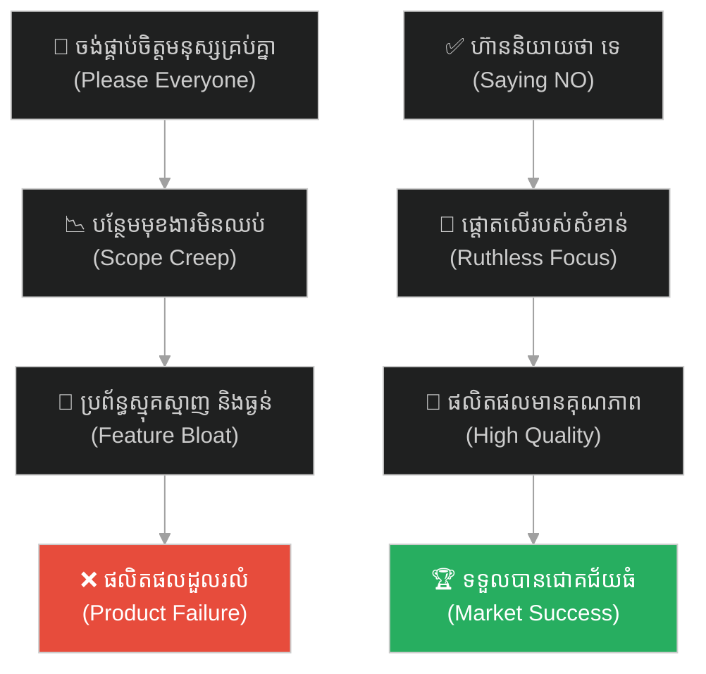
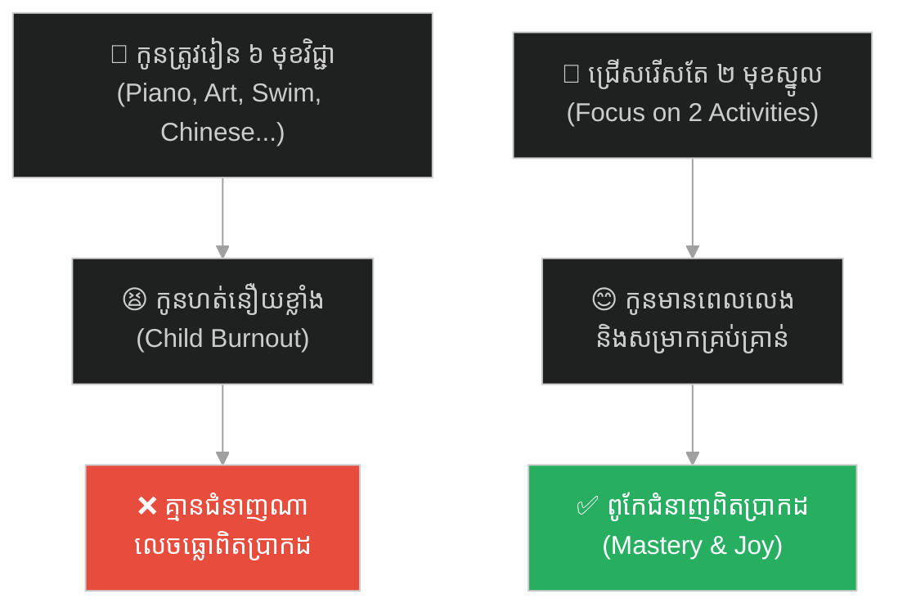
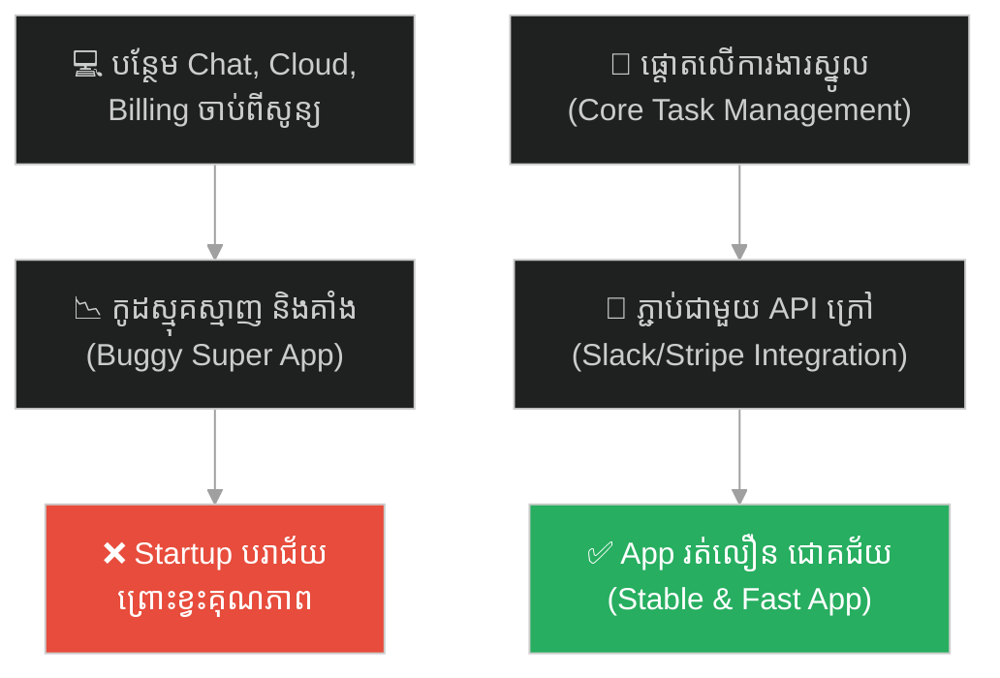
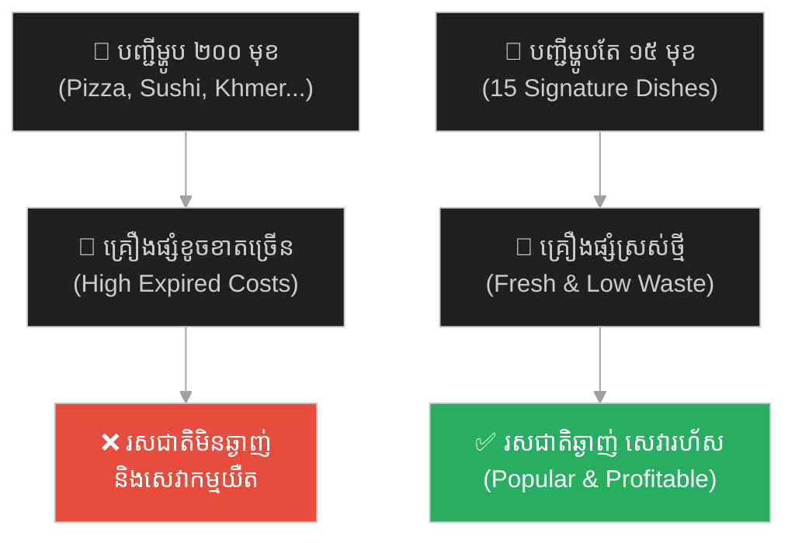
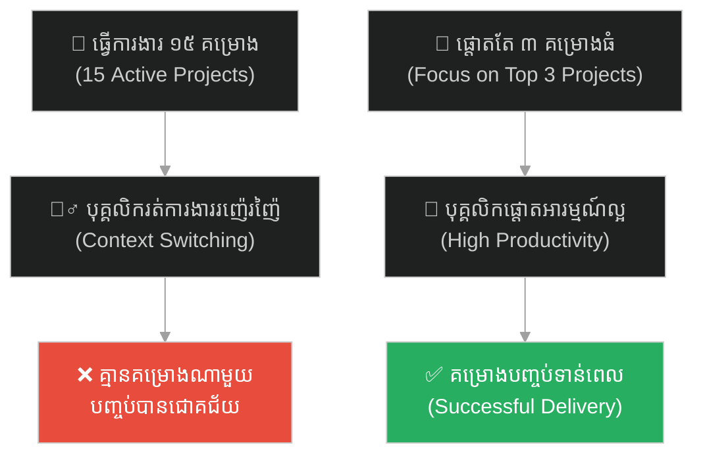
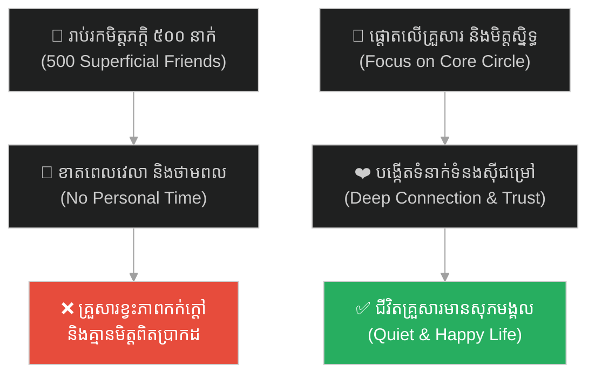
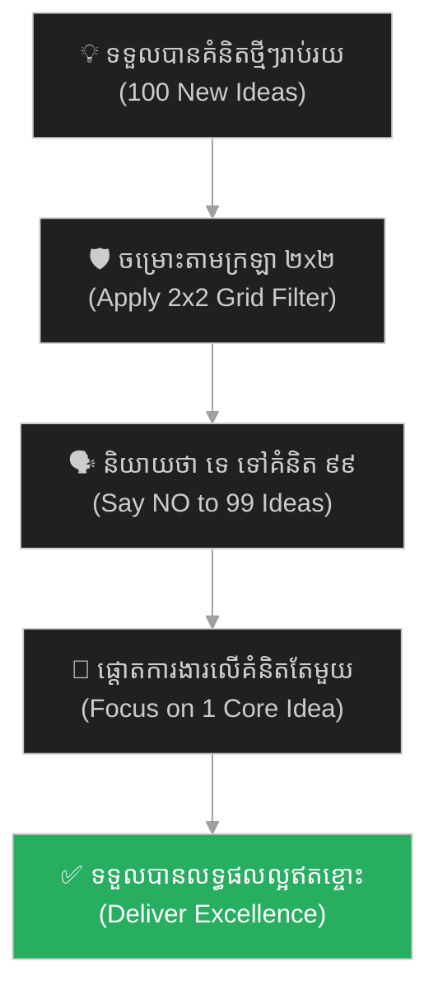

# Feature Bloat (ភាពហើមប៉ោងមុខងារ)៖ ស្ទីវ ចប្ស៍ និងក្រឡាទាំងបួន ឬអំណាចនៃការផ្តោតអារម្មណ៍ (Feature Bloat & Steve Jobs' Four Quadrants)

**Author:** ichamrong  
**Date:** 2026-05-27  
**Tags:** #steve-jobs #apple #focus #product-management #scope-creep #feature-bloat #parable  
**Category:** Concepts / Parables  
**Read Time:** ~15 min  

---

## 📌 មាតិកា (Table of Contents)
- [អន្ទាក់ផ្លូវចិត្ត (The Trap)](#0)
- [១. រឿងព្រេងរបស់ Apple៖ ក្រុមហ៊ុនដែលវង្វេងផ្លូវ និងក្រឡាទាំងបួន (The Legend of Apple's Turnaround)](#1)
  - [អំណាចនៃការកាត់ចោល (The Power of Cutting)](#1-1)
- [២. បញ្ហា៖ ជំងឺហើមប៉ោងមុខងារ និងការនិយាយថា «ទេ» (The Issue: Feature Bloat & Saying NO)](#2)
- [៣. ឧទាហរណ៍ជាក់ស្តែងក្នុងពិភពពិត (Real World Examples)](#3)
  - [ឧទាហរណ៍ទី ១ — កម្រិតស្រាល (គ្រួសារ)៖ ការចុះឈ្មោះកូនរៀនជំនាញច្រើនហួសហេតុ (Over-scheduling Extracurricular Activities)](#3-1)
  - [ឧទាហរណ៍ទី ២ — កម្រិតមធ្យម (បច្ចេកទេស)៖ ការបង្កើត Super App សម្រាប់គម្រោង Startup (The SaaS Feature Bloat Trap)](#3-2)
  - [ឧទាហរណ៍ទី ៣ — កម្រិតមធ្យម (ធុរកិច្ច)៖ ម៉ឺនុយម្ហូបរាប់រយមុខរបស់ហាងអាហារ (The 200-Item Disjointed Restaurant Menu)](#3-3)
  - [ឧទាហរណ៍ទី ៤ — កម្រិតមធ្យម (សង្គម/គ្រប់គ្រង)៖ មេដឹកនាំគម្រោងដែលដំណើរការការងាររាប់សិបព្រមគ្នា (The Multi-Project Management Trap)](#3-4)
  - [ឧទាហរណ៍ទី ៥ — កម្រិតធ្ងន់ (ទំនាក់ទំនង)៖ ការចំណាយពេលវេលាលើរង្វង់សង្គមរាប់រយនាក់ (The Superficial Social Circle Trap)](#3-5)
- [៤. ដំណោះស្រាយទូទៅ៖ ការកំណត់ដែនកំណត់ និងការអនុវត្តច្បាប់ Less is More (The General Solution: Scope Management & Prioritization Frameworks)](#4)
- [សេចក្តីសន្និដ្ឋាន (Conclusion)](#5)
- [ឯកសារយោង (References)](#6)
- [Related Posts](#7)

---

<a id="0"></a>
## អន្ទាក់ផ្លូវចិត្ត (The Trap)

តើអ្នកធ្លាប់ជួបស្ថានភាពដែលផលិតផល ឬប្រព័ន្ធការងាររបស់អ្នក ព្យាយាមបន្ថែមមុខងារថ្មីៗឥតឈប់ឈរ ដើម្បីផ្គាប់ចិត្តមនុស្សគ្រប់គ្នា ប៉ុន្តែចុងក្រោយប្រព័ន្ធនោះប្រែជាធ្ងន់ ស្មុគស្មាញ ប្រើប្រាស់ពិបាក និងមិនមានមុខងារណាមួយលេចធ្លោពិតប្រាកដដែរឬទេ?

នៅក្នុងការគ្រប់គ្រងផលិតផល និងការរចនាប្រព័ន្ធ៖
* **យើងងាយនឹងធ្លាក់ក្នុងល្បិច** គិតថា "ការបន្ថែមមុខងារកាន់តែច្រើន ស្មើនឹងតម្លៃកាន់តែខ្ពស់" (More is Better)។
* **យើងមើលរំលង** ការពិតដែលថា ភាពស្មុគស្មាញគឺជាសត្រូវបំផ្លាញបទពិសោធន៍អ្នកប្រើប្រាស់ និងបង្កើនបំណុលបច្ចេកទេស (Tech Debt) យ៉ាងឆាប់រហ័ស។

ការបណ្តោយឱ្យមហិច្ឆតាចង់ធ្វើគ្រប់យ៉ាងបំផ្លាញតម្លៃស្នូលរបស់ផលិតផល ហៅថា **អន្ទាក់ Scope Creep / Feature Bloat (ភាពហើមប៉ោងមុខងារ)**។

ដើម្បីយល់ដឹងពីវិធីគ្រប់គ្រងវិសាលភាពការងារ និងកសាងផលិតផលឱ្យទទួលបានជោគជ័យ នេះជាផែនទីបង្ហាញផ្លូវសម្រាប់អត្ថបទនេះ៖
1. **រឿងព្រេងប្រវត្តិសាស្ត្រ (The Historic Legend)** — រឿងរ៉ាវរបស់ស្ទីវ ចប្ស៍ ត្រឡប់មកស្រោចស្រង់ក្រុមហ៊ុន Apple ដែលជិតក្ស័យធនដោយសារផលិតផលរញ៉េរញ៉ៃ។
2. **បញ្ហា (The Issue)** — មូលហេតុដែល Feature Bloat កើតឡើង និងផលប៉ះពាល់របស់វាលើគុណភាពប្រព័ន្ធ។
3. **ឧទាហរណ៍ជាក់ស្តែងក្នុងពិភពពិត (Real World Examples)** — ពិនិត្យមើលអន្ទាក់នេះក្នុងកម្រិតគ្រួសារ ព័ត៌មានវិទ្យា ធុរកិច្ច ការគ្រប់គ្រង និងទំនាក់ទំនងសង្គម។
4. **ដំណោះស្រាយទូទៅ (The General Solution)** — ការអនុវត្តយន្តការ Prioritization ដូចជាច្បាប់ក្រឡាទាំងបួន និងការកំណត់ទំហំការងារឱ្យច្បាស់លាស់។



---

<a id="1"></a>
## ១. រឿងព្រេងរបស់ Apple៖ ក្រុមហ៊ុនដែលវង្វេងផ្លូវ និងក្រឡាទាំងបួន (The Legend of Apple's Turnaround)

នៅឆ្នាំ ១៩៩៧ ក្រុមហ៊ុន Apple កំពុងស្ថិតនៅលើមាត់ជ្រោះនៃការក្ស័យធនជាស្ថាពរ ដោយនៅសល់សាច់ប្រាក់សម្រាប់ដំណើរការក្រុមហ៊ុនត្រឹមតែ ៩០ ថ្ងៃទៀតប៉ុណ្ណោះ។ ក្រោយការបណ្តេញចេញអស់រយៈពេល ១២ ឆ្នាំ ស្ទីវ ចប្ស៍ (Steve Jobs) ត្រូវបានអញ្ជើញឱ្យត្រឡប់មកដឹកនាំក្រុមហ៊ុនដែលគាត់បានបង្កើតនេះឡើងវិញក្នុងនាមជាស្តេចគ្រឿងម៉ាស៊ីន។

នៅពេលចូលមកដល់ ស្ទីវ ចប្ស៍ បានជួបប្រទះនឹងស្ថានភាពដ៏វឹកវរ។ Apple កំពុងតែផលិតកុំព្យូទ័រ Macintosh រាប់សិបម៉ូដែល (Macintosh Quadra, Centris, Performa...) ម៉ាស៊ីនព្រីនធ័រ ម៉ាស៊ីនស្កែន កាមេរ៉ា និងសូម្បីតែឧបករណ៍ជំនួយឌីជីថលផ្ទាល់ខ្លួន (Newton PDA)។ អ្វីដែលកាន់តែអាក្រក់នោះគឺ សូម្បីតែបុគ្គលិក និងអ្នកលក់របស់ Apple ខ្លួនឯង ក៏មិនអាចពន្យល់បានច្បាស់ដែរថា តើកុំព្យូទ័រម៉ូដែល Performa 3400 ខុសពី Performa 3450 យ៉ាងដូចម្តេចខ្លះ។ ពួកគេព្យាយាមផលិតអ្វីៗគ្រប់យ៉ាង ដើម្បីផ្គាប់ចិត្តមនុស្សគ្រប់គ្នា។

---

<a id="1-1"></a>
### អំណាចនៃការកាត់ចោល (The Power of Cutting)

នៅក្នុងកិច្ចប្រជុំយុទ្ធសាស្ត្រផលិតផលដ៏ធំមួយ ស្ទីវ ចប្ស៍ បានអង្គុយស្តាប់ក្រុមការងាររាយការណ៍អំពីផលិតផល និងផែនទីបង្ហាញផ្លូវយ៉ាងធុញទ្រាន់។ ស្រាប់តែគាត់ស្ទុះក្រោកឈរឡើង ដើរទៅកាន់ក្តារខៀន (Whiteboard) រួចគូសបន្ទាត់ខ្វែងមួយបង្កើតជាក្រឡាចក្រត្រង្គចំនួន ៤។

គាត់បានសរសេរពាក្យពីរនៅពីលើគឺ៖ **«Consumer (អ្នកប្រើប្រាស់ទូទៅ)»** និង **«Pro (អ្នកជំនាញ)»**។  
ហើយគាត់សរសេរពាក្យពីរនៅខាងឆ្វេងគឺ៖ **«Desktop (កុំព្យូទ័រលើតុ)»** និង **«Portable (កុំព្យូទ័រយួរដៃ)»**។

```
            |    Consumer     |       Pro
------------+-----------------+-----------------
Desktop     |    iMac         |    Power Mac
------------+-----------------+-----------------
Portable    |    iBook        |    PowerBook
```

គាត់បានចង្អុលក្តារខៀនរួចនិយាយយ៉ាងម៉ឺងម៉ាត់ថា៖  
> *«នេះគឺជាអ្វីដែលក្រុមហ៊ុន Apple នឹងធ្វើចាប់ពីពេលនេះតទៅ។ យើងនឹងផលិតកុំព្យូទ័រតែ ៤ ម៉ូដែលនេះប៉ុណ្ណោះ។ មួយក្រឡាមួយម៉ូដែល។ លុបចោល និងកាត់បន្ថយគម្រោងផ្សេងៗទៀតទាំងអស់ចោល ៧០%។ ប្រសិនបើយើងចង់រស់ យើងត្រូវតែផ្តោតអារម្មណ៍។»*

ការសម្រេចចិត្តដ៏ព្រៃផ្សៃនេះបានធ្វើឱ្យបុគ្គលិករាប់ពាន់នាក់តក់ស្លុត និងខ្លាចរអា។ ការលុបចោលគម្រោងរាប់សិប ស្មើនឹងការបោះចោលថវិការាប់លានដុល្លារដែលបានចំណាយរួច (Sunk Cost)។ ប៉ុន្តែ ស្ទីវ ចប្ស៍ បានពន្យល់ថា៖ **«ការផ្តោតអារម្មណ៍ មិនមែនមានន័យថាការនិយាយថា "យល់ព្រម" ទៅលើរបស់ដែលយើងជ្រើសរើសនោះទេ តែវាគឺការនិយាយថា "ទេ" ទៅកាន់គំនិតល្អៗចំនួន ១០០ ផ្សេងទៀត ដើម្បីយើងអាចធ្វើការងារតែមួយឱ្យល្អឥតខ្ចោះបាន។»**

Apple បានកាត់បន្ថយបុគ្គលិក និងផ្តោតវិស្វករដ៏ឆ្នើមរបស់ខ្លួនទាំងអស់ ឱ្យទៅបង្កើតកុំព្យូទ័រ iMac និង PowerBook ជំនួសវិញ។ លទ្ធផលគឺ Apple មិនត្រឹមតែរួចផុតពីការក្ស័យធនប៉ុណ្ណោះទេ ថែមទាំងបង្កើតផលិតផលបដិវត្តន៍ដែលផ្លាស់ប្តូរពិភពលោក។

---

<a id="2"></a>
## ២. បញ្ហា៖ ជំងឺហើមប៉ោងមុខងារ និងការនិយាយថា «ទេ» (The Issue: Feature Bloat & Saying NO)

នៅក្នុងពិភពវិស្វកម្មកម្មវិធី (Software Engineering) និងការអភិវឌ្ឍផលិតផល ជំងឺ **Feature Bloat (ភាពហើមប៉ោងមុខងារ)** គឺជាមេរោគដ៏កាចសាហាវ៖

* **សត្រូវនៃ Software គឺ Scope Creep៖** ប្រសិនបើអ្នកបង្កើតកម្មវិធីមួយ (ឧទាហរណ៍៖ កម្មវិធីគ្រប់គ្រងការងារ Task Management)។ ពេលអតិថិជនសុំមុខងារ Chat អ្នកក៏សរសេរ ពេលគេសុំមុខងារ Payment ក្រៅផ្លូវការ អ្នកក៏បន្ថែម ពេលគេសុំមុខងារ Stream វីដេអូ អ្នកក៏ធ្វើ។ ទីបំផុត កម្មវិធីនោះនឹងធ្ងន់ គាំងញឹកញាប់ កូដរញ៉េរញ៉ៃ (Spaghetti Code) ហើយអ្នកប្រើប្រាស់វង្វេងផ្លូវលុបវាចោល។
* **តម្លៃលាក់កំបាំងនៃមុខងារនីមួយៗ (Hidden Cost of Features)៖** រាល់មុខងារដែលបន្ថែមចូលក្នុងកូដ មិនមែនចំណាយត្រឹមតែពេលសរសេរកូដនោះឡើយ។ វាត្រូវចំណាយពេលធ្វើតេស្ត (Testing), បង្កើនហានិភ័យនៃសន្តិសុខ (Security vulnerabilities), និងទាមទារការថែទាំកូដជារៀងរហូត (Maintenance cost)។
* **ភាពក្លាហានក្នុងការនិយាយថា "ទេ"៖** វិស្វករ និងអ្នកគ្រប់គ្រងផលិតផលឆ្នើម មិនមែនជាអ្នកដែលធ្វើតាមគ្រប់ការចង់បានរបស់អតិថិជននោះទេ។ ពួកគេគឺជាអ្នកការពារ "តម្លៃស្នូល" របស់ផលិតផល ដោយហ៊ានប្រកែក និងពន្យល់ពីផលប៉ះពាល់នៃការបន្ថែមមុខងាររញ៉េរញ៉ៃ។

---

<a id="3"></a>
## ៣. ឧទាហរណ៍ជាក់ស្តែងក្នុងពិភពពិត

ដើម្បីយល់ដឹងឱ្យកាន់តែច្បាស់ នេះជាការវិភាគលើឧទាហរណ៍ ៥ កម្រិតផ្សេងគ្នា៖

---

<a id="3-1"></a>
### ឧទាហរណ៍ទី ១ — កម្រិតស្រាល (គ្រួសារ)៖ ការចុះឈ្មោះកូនរៀនជំនាញច្រើនហួសហេតុ (Over-scheduling Extracurricular Activities)

**ស្ថានភាព៖** ឪពុកម្តាយមានបំណងល្អចង់ឱ្យកូនអាយុ ៨ ឆ្នាំ មានសមត្ថភាពខ្ពស់ និងពូកែគ្រប់ជំនាញ។

* **ជម្រើសខុស (Feature Bloat)៖** ចុះឈ្មោះឱ្យកូនរៀនព្យាណូ គំនូរ ហែលទឹក ភាសាចិន តេក្វាន់ដូ និងរបាំបុរាណក្នុងពេលតែមួយ។ កូនត្រូវរៀនពីម៉ោង ៧ ព្រឹក ដល់ម៉ោង ៨ យប់ គ្មានពេលសម្រាក។
* **លទ្ធផល៖** កូនហត់នឿយខ្លាំង (Burnout) កើតស្រ្តេស គ្មានភាពរីករាយក្នុងវ័យកុមារ ហើយមិនមានជំនាញណាមួយដែលគេធ្វើបានល្អលេចធ្លោពិតប្រាកដនោះឡើយ។
* **ជម្រើសត្រូវ (Focus)៖** ជជែកជាមួយកូន សង្កេតមើលចំណង់ចំណូលចិត្តពិតប្រាកដ រួចជ្រើសរើសយកតែ ២ មុខវិជ្ជាស្នូល (ឧទាហរណ៍៖ ព្យាណូ និងហែលទឹក) ហើយទុកពេលឱ្យកូនលេង និងសម្រាកជាមួយគ្រួសារ។ កូនលេងព្យាណូបានយ៉ាងពូកែ និងមានសុខភាពល្អ។



---

<a id="3-2"></a>
### ឧទាហរណ៍ទី ២ — កម្រិតមធ្យម (បច្ចេកទេស)៖ ការបង្កើត Super App សម្រាប់គម្រោង Startup (The SaaS Feature Bloat Trap)

**ស្ថានភាព៖** ក្រុមហ៊ុន Startup បង្កើតកម្មវិធីគ្រប់គ្រងគម្រោងការងារសម្រាប់សហគ្រាសតូចៗ (SaaS Project Management Tool)។

* **ជម្រើសខុស៖** ព្យាយាមបន្ថែមមុខងារ Chat ផ្ទាល់ខ្លួន, ប្រព័ន្ធកាត់លុយផ្ទាល់ខ្លួន, បណ្តាញសង្គមផ្ទៃក្នុង, និងប្រព័ន្ធ Cloud Storage ផ្ទាល់ខ្លួនព្រមគ្នាតាំងពីដំបូង ដើម្បីទាក់ទាញអ្នកប្រើប្រាស់។
* **លទ្ធផល៖** កម្មវិធីដំណើរការយឺត ធ្លាក់ចុះញឹកញាប់ ក្រុមវិស្វករចំណាយពេលដោះស្រាយ Bugs រាប់រយជារៀងរាល់ថ្ងៃ គ្មានពេលអភិវឌ្ឍមុខងារគ្រប់គ្រងការងារដែលជាបេះដូងស្នូលរបស់ប្រព័ន្ធឡើយ។
* **ជម្រើសត្រូវ៖** ផ្តោតតែលើមុខងារស្នូល (Core Value Proposition) គឺ "ការចាត់ចែងការងារឱ្យងាយស្រួល និងរលូន"។ ចំពោះមុខងារដទៃ ប្រើប្រាស់ការរួមបញ្ចូល (Integrations) ដូចជា ប្រើ Slack សម្រាប់ Chat, ប្រើ Stripe សម្រាប់ Payment, និង Google Drive សម្រាប់ Storage។ ប្រព័ន្ធដំណើរការលឿន និងទាក់ទាញអតិថិជនបានច្រើន។



---

<a id="3-3"></a>
### ឧទាហរណ៍ទី ៣ — កម្រិតមធ្យម (ធុរកិច្ច)៖ ម៉ឺនុយម្ហូបរាប់រយមុខរបស់ហាងអាហារ (The 200-Item Disjointed Restaurant Menu)

**ស្ថានភាព៖** ម្ចាស់ហាងអាហារបើកថ្មីចង់ទាក់ទាញអតិថិជនគ្រប់វ័យ និងគ្រប់ចំណូលចិត្ត។

* **ជម្រើសខុស៖** ដាក់បញ្ជីម្ហូបរាប់រយមុខ ទាំងអាហារខ្មែរ អាហារថៃ អាហារអ៊ីតាលី ជប៉ុន ប៊ឺហ្គឺ និងភីហ្សា ក្នុងម៉ឺនុយតែមួយ។
* **លទ្ធផល៖** ចុងភៅត្រូវរៀបចំគ្រឿងផ្សំរាប់រយមុខ ធ្វើឱ្យខាតបង់ធនធានហួសកាលកំណត់ (Expired Ingredients)។ អតិថិជនរង់ចាំម្ហូបយូរ រសជាតិម្ហូបមិនឆ្ងាញ់ ហើយហាងត្រូវខាតបង់ថវិកាដួលរលំ។
* **ជម្រើសត្រូវ៖** អនុវត្តយុទ្ធសាស្ត្រផ្តោតអារម្មណ៍។ ជ្រើសរើសតែអាហារខ្មែរ និងភេសជ្ជៈស្នូលចំនួន ១៥ មុខ ដែលមានរសជាតិឆ្ងាញ់បំផុត និងលឿនបំផុតក្នុងការធ្វើ។ ហាងគ្រប់គ្រងគ្រឿងផ្សំបានងាយស្រួល អតិថិជនទទួលបានម្ហូបលឿន និងឆ្ងាញ់ ធ្វើឱ្យហាងល្បីល្បាញ។



---

<a id="3-4"></a>
### ឧទាហរណ៍ទី ៤ — កម្រិតមធ្យម (សង្គម/គ្រប់គ្រង)៖ មេដឹកនាំគម្រោងដែលដំណើរការការងាររាប់សិបព្រមគ្នា (The Multi-Project Management Trap)

**ស្ថានភាព៖** ប្រធាននាយកដ្ឋានចង់បង្ហាញលទ្ធផលការងារជូនថ្នាក់ដឹកនាំ ដោយចាប់ផ្តើមយុទ្ធនាការ និងគម្រោងថ្មីៗជាច្រើនក្នុងពេលតែមួយ។

* **ជម្រើសខុស៖** បញ្ជាឱ្យក្រុមការងារអនុវត្តគម្រោងចំនួន ១៥ ព្រមគ្នា ដោយគ្មានការចាត់ថ្នាក់អាទិភាពច្បាស់លាស់។
* **លទ្ធផល៖** ធនធានមនុស្សត្រូវបានបែងចែកស្តើងពេក (Developers ត្រូវធ្វើការងារ ៤-៥ គម្រោងក្នុងពេលតែមួយ)។ បុគ្គលិកកើតស្រ្តេសខ្លាំង ការងារយឺតយ៉ាវ និងមិនមានគម្រោងណាមួយត្រូវបានបញ្ចប់ជាស្ថាពរទាន់ពេលឡើយ។
* **ជម្រើសត្រូវ៖** ប្រើប្រាស់ច្បាប់ក្រឡាទាំងបួន។ លុបចោល ឬផ្អាកគម្រោងចំនួន ១២ ចោលសិន រួចផ្តោតធនធានក្រុមការងារទាំងអស់ ១០០% ទៅលើគម្រោងអាទិភាពខ្ពស់បំផុតតែ ៣ ប៉ុណ្ណោះ។ គម្រោងទាំង ៣ ត្រូវបានបញ្ចប់ដោយជោគជ័យ និងទទួលបានលទ្ធផលល្អឥតខ្ចោះ។



---

<a id="3-5"></a>
### ឧទាហរណ៍ទី ៥ — កម្រិតធ្ងន់ (ទំនាក់ទំនង)៖ ការចំណាយពេលវេលាលើរង្វង់សង្គមរាប់រយនាក់ (The Superficial Social Circle Trap)

**ស្ថានភាព៖** មនុស្សម្នាក់ចង់មានប្រជាប្រិយភាព និងចង់រក្សាទំនាក់ទំនងជាមួយមនុស្សគ្រប់គ្នាដែលគាត់បានជួប។

* **ជម្រើសខុស៖** ចូលរួមរាល់កម្មវិធីជួបជុំ ឆ្លើយតប Chat មនុស្សរាប់រយនាក់ និងចំណាយពេលរាល់ចុងសប្តាហ៍ជាមួយមិត្តភក្តិក្រៅផ្លូវការ។
* **លទ្ធផល៖** គ្មានពេលវេលាផ្ទាល់ខ្លួន គ្មានពេលវេលាថែរក្សាដៃគូជីវិត និងកូនៗ ហើយនៅពេលជួបវិបត្តិជីវិតពិតប្រាកដ គ្មានមិត្តភក្តិណាម្នាក់មកជួយឡើយ ព្រោះទំនាក់ទំនងទាំងអស់សុទ្ធតែជាទំនាក់ទំនងលើផ្ទៃក្រៅ (Superficial Connections)។
* **ជម្រើសត្រូវ៖** និយាយពាក្យថា "ទេ" ទៅកាន់ការជួបជុំដែលគ្មានប្រយោជន៍។ ផ្តោតពេលវេលា និងថាមពលទៅលើមនុស្សសំខាន់បំផុតក្នុងជីវិត (ដៃគូជីវិត កូនៗ ឪពុកម្តាយ និងមិត្តភក្តិជិតស្និទ្ធបំផុត ៣-៤ នាក់)។ គាត់ទទួលបានជីវិតគ្រួសារមានសុភមង្គល និងមានទំនាក់ទំនងរឹងមាំពិតប្រាកដដែលអាចពឹងផ្អែកបានក្នុងគ្រាអាសន្ន។



---

<a id="4"></a>
## ៤. ដំណោះស្រាយទូទៅ៖ ការកំណត់ដែនកំណត់ និងការអនុវត្តច្បាប់ Less is More (The General Solution: Scope Management & Prioritization Frameworks)

ដើម្បីការពារប្រព័ន្ធ ផលិតផល និងជីវិតរបស់អ្នកពីជំងឺហើមប៉ោងមុខងារ ត្រូវអនុវត្តវិធីសាស្ត្រគន្លឹះទាំងនេះ៖

### ១. អនុវត្តក្បួនច្បាប់ ២ គុណ ២ (The 2x2 Grid Filter)
* រាល់ពេលដែលអ្នកចង់បន្ថែមការងារ ឬមុខងារថ្មី ត្រូវគូសក្រឡា ៤ ដើម្បីចម្រោះវាជាមុន៖
  * **តើការងារនេះមានឥទ្ធិពលខ្ពស់ (High Impact) និងចំណាយកម្លាំងតិច (Low Effort) មែនទេ?** ធ្វើវាភ្លាម (Quick Win)។
  * **តើវាមានឥទ្ធិពលទាប (Low Impact) តែចំណាយកម្លាំងច្រើន (High Effort) មែនទេ?** កាត់វាចោលភ្លាមៗ (Ruthlessly Cut)។

### ២. បង្កើតថវិកាសម្រាប់មុខងារ (Feature Budgeting)
* កំណត់ចំនួនមុខងារស្នូលរបស់កម្មវិធី។ ប្រសិនបើអ្នកចង់បន្ថែមមុខងារថ្មីមួយ អ្នកត្រូវតែដក ឬលុបមុខងារចាស់ដែលមិនសូវប្រើប្រាស់ចេញមួយវិញ (One In, One Out) ដើម្បីរក្សាភាពសាមញ្ញរបស់ប្រព័ន្ធ។

### ៣. រៀនបដិសេធដោយមានហេតុផល (Mastering the Art of "NO")
* ការប្រកែក ឬបដិសេធមិនមែនជាការមិនសហការនោះទេ។ នៅពេលមានគេស្នើសុំ Scope Creep ត្រូវបង្ហាញទិន្នន័យ៖ *«ប្រសិនបើយើងបន្ថែមមុខងារនេះ យើងនឹងត្រូវពន្យារពេលបញ្ចេញផលិតផលសំខាន់ចំនួន ៣ សប្តាហ៍ និងបង្កើនភាពស្មុគស្មាញដល់យូសឺ។ តើយើងគួរធ្វើវាពិតមែនទេ?»*



---

## 🐇 ធ្លាក់ចូលក្នុងរន្ធទន្សាយយុទ្ធសាស្ត្រ (Enter the Strategic Rabbit Hole)

ដើម្បីស្វែងយល់បន្ថែមអំពីរបៀបដែលការលុបចោលគម្រោង ឬរបស់ដែលមិនចាំបាច់តាំងពីដំបូង (ជំនួសឱ្យការចំណាយពេលកែលម្អវា) អាចជួយសន្សំពេលវេលា និងធ្វើឱ្យប្រព័ន្ធការងារកាន់តែមានប្រសិទ្ធភាពខ្ពស់ សូមបន្តដំណើររុករករបស់អ្នក៖

* 🚀 **[ចាប់ផ្តើមដំណើររុករក (Start the Journey) ➔ Elon Musk and the Best Part is No Part](./52-the-best-part-is-no-part.md)**

---

<a id="5"></a>
## សេចក្តីសន្និដ្ឋាន (Conclusion)

> **«ភាពសាមញ្ញ គឺជាកម្រិតខ្ពស់បំផុតនៃភាពទំនើប។ ការផ្តោតអារម្មណ៍ មិនមែនជាការរើសយករបស់ដែលត្រូវធ្វើនោះទេ គឺការមានវិន័យរឹងមាំក្នុងការកាត់ចោលរបស់ដែលមិនគួរធ្វើ។»**

ចូររៀបចំជីវិត និងប្រព័ន្ធការងាររបស់អ្នកដោយប្រើប្រាស់ក្រឡាទាំងបួនរបស់ស្ទីវ ចប្ស៍ កាត់បន្ថយការងាររញ៉េរញ៉ៃ ដើម្បីទទួលបានលទ្ធផលការងារល្អបំផុត និងជីវិតដែលមានស្ថិរភាព។

---

<a id="6"></a>
## ឯកសារយោង (References)

* **Walter Isaacson** — *Steve Jobs* (2011)។ ជីវប្រវត្តិផ្លូវការរបស់ស្ទីវ ចប្ស៍ និងការរៀបរាប់លម្អិតអំពីការរុះរើផលិតផល Apple ក្នុងឆ្នាំ ១៩៩៧។
* **Greg McKeown** — *Essentialism: The Disciplined Pursuit of Less* (2014)។ ទ្រឹស្តីស្នូលស្តីពីការផ្តោតអារម្មណ៍លើកិច្ចការងារសំខាន់បំផុត និងការបដិសេធការងារបន្ទាប់បន្សំ។
* **Fred Brooks** — *The Mythical Man-Month* (1975)។ ការវិភាគអំពីបញ្ហា Scope Creep និងផលប៉ះពាល់របស់វាទៅលើគម្រោងវិស្វកម្មកម្មវិធី។

---

<a id="7"></a>
## Related Posts

* **[43 Steve Jobs: Feature Bloat and the Power of Saying No](../articles/43-steve-jobs-and-feature-bloat.md)** — អត្ថបទគោលបកស្រាយលម្អិតអំពីជំងឺ Feature Bloat នៅក្នុង Software Architecture។
* **[44 Elon Musk: First Principles Thinking and Deleting Requirements](../articles/44-elon-musk-and-first-principles-thinking.md)** — របៀបលុបចោលតម្រូវការដែលមិនចាំបាច់ដើម្បីសន្សំធនធាន។
* **[36 The Gordian Knot: Over-Engineering and the KISS Principle](../articles/36-the-gordian-knot-and-overengineering.md)** — ភាពចាំបាច់នៃការរក្សាភាពសាមញ្ញ ជំនួសឱ្យការធ្វើឱ្យស្មុគស្មាញ (KISS)។

---
*Last updated: 2026-05-27*

## Related

- [💡 Concepts README](../README.md)
- [📚 Main Repository README](../../../README.md)
- [Developer Habits](../../developer-habits/README.md)
- [Mental Health & Well-being](../../mental-health/README.md)
- [Management & SDLC](../../management/README.md)
