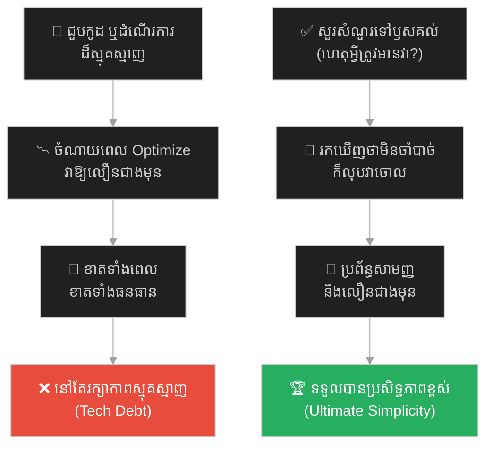
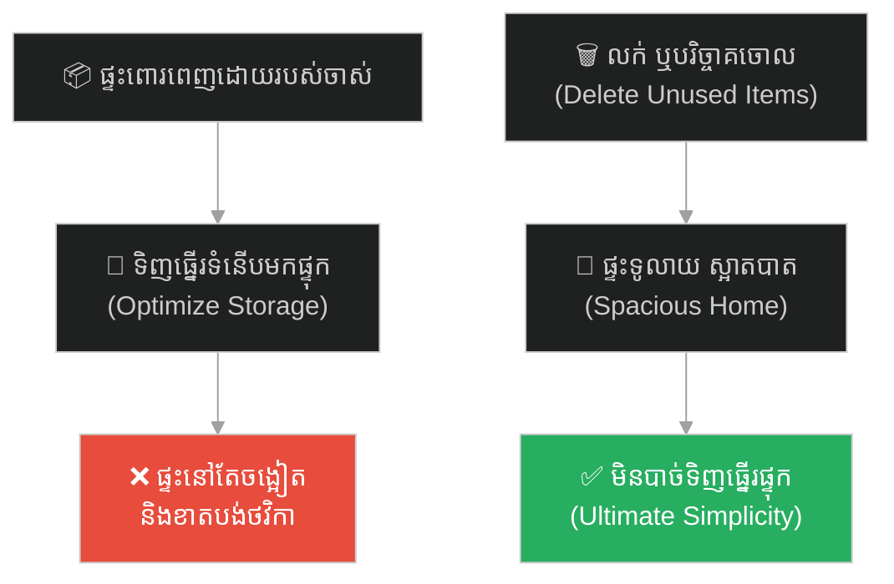
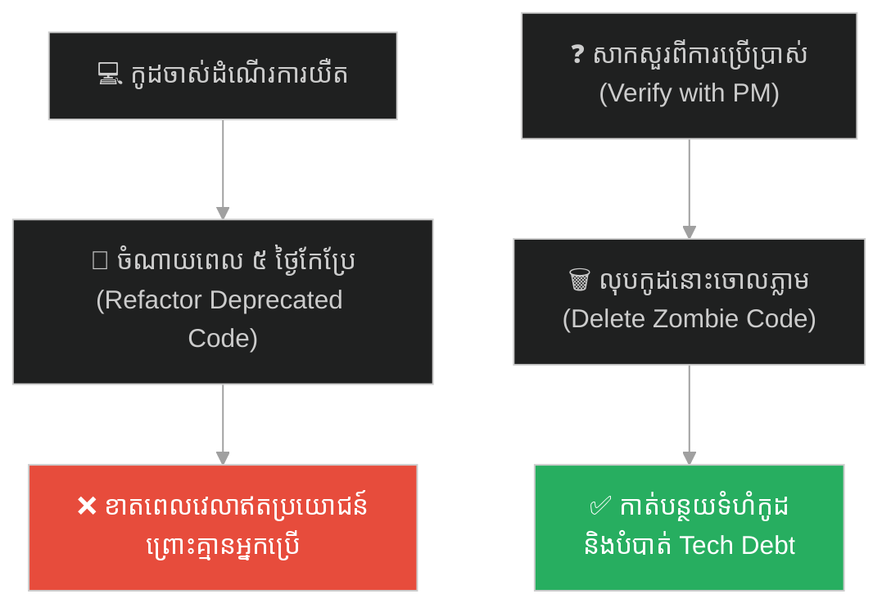
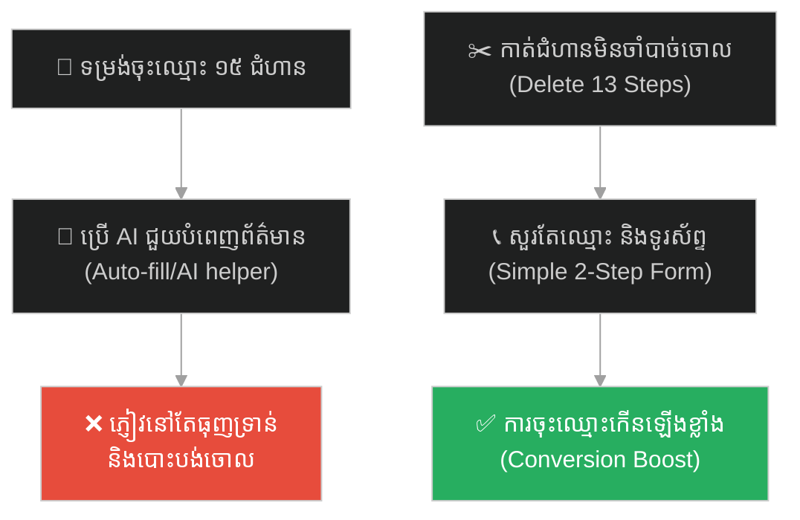
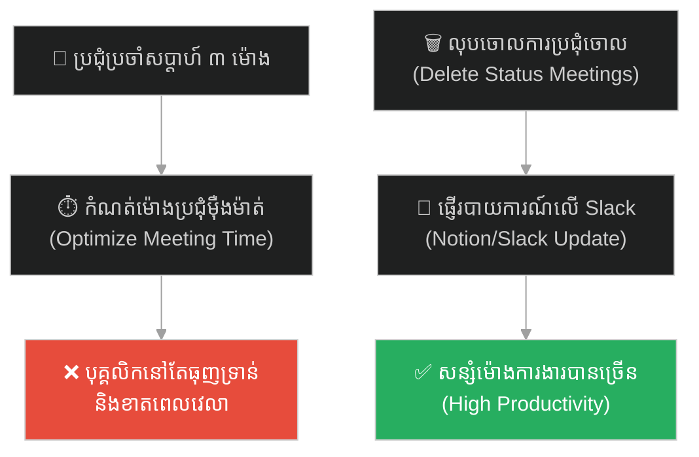
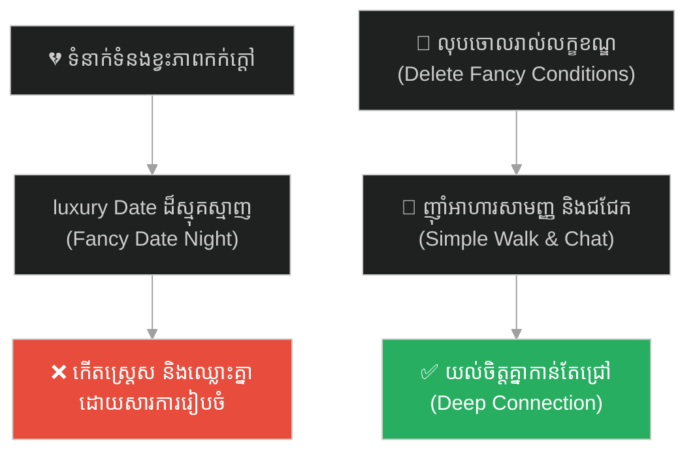
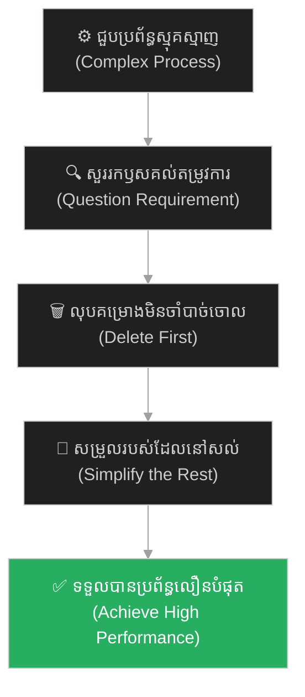

# First Principles (គោលការណ៍គ្រឹះដំបូង)៖ អ៊ីលុន ម៉ាសក៍ និងការលុបចោលគម្រោងដែលមិនចាំបាច់ (First Principles & The Best Part is No Part)

**Author:** ichamrong  
**Date:** 2026-05-27  
**Tags:** #elon-musk #spacex #refactoring #simplification #first-principles #delete-code #parable  
**Category:** Concepts / Parables  
**Read Time:** ~15 min  

---

## 📌 មាតិកា (Table of Contents)
- [អន្ទាក់ផ្លូវចិត្ត (The Trap)](#0)
- [១. រឿងព្រេងរបស់ SpaceX៖ របាំងការពារកម្តៅ និងការលុបគ្រឿងបន្លាស់ចោល (The Legend of SpaceX's Fiberglass Shield)](#1)
  - [ការស្វែងរកឫសគល់ និងការលុបចោល (Questioning & Deleting)](#1-1)
- [២. បញ្ហា៖ អន្ទាក់នៃការបង្កើនប្រសិទ្ធភាពខុសគោលដៅ (The Issue: Pointless Optimization Trap)](#2)
- [៣. ឧទាហរណ៍ជាក់ស្តែងក្នុងពិភពពិត (Real World Examples)](#3)
  - [ឧទាហរណ៍ទី ១ — កម្រិតស្រាល (គ្រួសារ)៖ ការទិញធ្នើរផ្ទុករបស់របរចាស់ៗដែលឈប់ប្រើ (The Storage Box Trap)](#3-1)
  - [ឧទាហរណ៍ទី ២ — កម្រិតមធ្យម (បច្ចេកទេស)៖ ការចំណាយពេល Optimize កូដដែលលែងប្រើ (Optimizing Deprecated API Code)](#3-2)
  - [ឧទាហរណ៍ទី ៣ — កម្រិតមធ្យម (ធុរកិច្ច)៖ ដំណើរការចុះឈ្មោះភ្ញៀវ ១៥ ជំហាន (The 15-Step Signup Form Trap)](#3-3)
  - [ឧទាហរណ៍ទី ៤ — កម្រិតមធ្យម (សង្គម/គ្រប់គ្រង)៖ កិច្ចប្រជុំប្រចាំសប្តាហ៍ និងការរាយការណ៍ច្រើនជាន់ថ្នាក់ (The Weekly Status Meeting Loop)](#3-4)
  - [ឧទាហរណ៍ទី ៥ — កម្រិតធ្ងន់ (ទំនាក់ទំនង)៖ លក្ខខណ្ឌស្មុគស្មាញសម្រាប់ការណាត់ជួបដៃគូជីវិត (The Over-Conditional Date Rules)](#3-5)
- [៤. ដំណោះស្រាយទូទៅ៖ ការលុបកូដ និងការកាត់បន្ថយតម្រូវការឥតប្រយោជន៍ (The General Solution: Ruthless Deletion & First Principles Design)](#4)
- [សេចក្តីសន្និដ្ឋាន (Conclusion)](#5)
- [ឯកសារយោង (References)](#6)
- [Related Posts](#7)

---

## អន្ទាក់ផ្លូវចិត្ត (The Trap)

តើអ្នកធ្លាប់ចំណាយពេលរាប់សប្តាហ៍ ឬរាប់ខែ ដើម្បីកែលម្អ (Optimize) ឬធ្វើឱ្យប្រព័ន្ធការងារមួយដំណើរការលឿន និងសន្សំសំចៃជាងមុន ប៉ុន្តែចុងក្រោយទើបដឹងថា ប្រព័ន្ធការងារនោះ តាមពិតមិនចាំបាច់មានវត្តមានតាំងពីដំបូងម្ល៉េះដែរឬទេ?

នៅក្នុងវិស្វកម្ម និងការរៀបចំប្រព័ន្ធ៖
* **យើងងាយនឹងកើតមានទំនោរ** ចង់សម្រួល ឬបង្កើនប្រសិទ្ធភាពលើរបស់ដែលមានស្រាប់ (How to make it better)។
* **យើងមើលរំលង** សំណួរដ៏សំខាន់បំផុតគឺ "ហេតុអ្វីបានជាយើងត្រូវការរបស់នេះតាំងពីដំបូង?" (Why does it exist?)។

ការបណ្តោយឱ្យការបង្កើនប្រសិទ្ធភាពខុសគោលដៅ ខ្ជះខ្ជាយធនធាន និងរក្សាភាពស្មុគស្មាញ ហៅថា **អន្ទាក់ Pointless Optimization (លម្អៀងការបង្កើនប្រសិទ្ធភាពឥតប្រយោជន៍)**។

ដើម្បីយល់ដឹងពីសារៈសំខាន់នៃការត្រឡប់ទៅរកគោលការណ៍គ្រឹះ និងការលុបចោលរបស់មិនចាំបាច់ នេះជាផែនទីបង្ហាញផ្លូវសម្រាប់អត្ថបទនេះ៖
1. **រឿងព្រេងប្រវត្តិសាស្ត្រ (The Historic Legend)** — រឿងរ៉ាវរបស់លោក អ៊ីលុន ម៉ាសក៍ នៅក្រុមហ៊ុន SpaceX ក្នុងការដករបាំងការពារកម្តៅថ្មចេញទាំងស្រុង។
2. **បញ្ហា (The Issue)** — មូលហេតុដែលវិស្វករចូលចិត្ត Optimize របស់ដែលគួរតែលុបចោល និងគោលការណ៍ ៥ ជំហានរបស់ Musk។
3. **ឧទាហរណ៍ជាក់ស្តែងក្នុងពិភពពិត (Real World Examples)** — ពិនិត្យមើលសារៈសំខាន់នៃការលុបចោលក្នុងកម្រិតគ្រួសារ ព័ត៌មានវិទ្យា ធុរកិច្ច ការគ្រប់គ្រង និងទំនាក់ទំនង។
4. **ដំណោះស្រាយទូទៅ (The General Solution)** — ការអនុវត្តយុទ្ធសាស្ត្រ "Delete Code Ruthlessly" និងការសួរបញ្ជាក់លើរាល់តម្រូវការ (Requirements)។

---

## ១. រឿងព្រេងរបស់ SpaceX៖ របាំងការពារកម្តៅ និងការលុបគ្រឿងបន្លាស់ចោល (The Legend of SpaceX's Fiberglass Shield)

អំឡុងពេលអភិវឌ្ឍគ្រាប់រ៉ុក្កែត Falcon 9 នៅក្រុមហ៊ុន SpaceX មានបញ្ហាមួយបានកើតឡើងចំពោះខ្សែសង្វាក់ផលិតកម្មថ្ម (Battery Pack) របស់រ៉ុក្កែត។ ថ្មនោះត្រូវបានបំពាក់ដោយ "របាំងការពារកម្តៅ (Fiberglass Heat Shield)" ដ៏ក្រាស់ និងស្មុគស្មាញមួយ ដែលធ្វើឱ្យវាមានទម្ងន់ធ្ងន់ ចំណាយពេលដំឡើងយូរ និងមានតម្លៃថ្លៃ។

ក្រុមវិស្វករដ៏ឆ្លាតវៃរបស់ SpaceX បានចំណាយពេលជាច្រើនសប្តាហ៍ ធ្វើការជជែកគ្នា និងរៀបចំផែនការដើម្បីបង្កើនប្រសិទ្ធភាព (Optimize) របាំងការពារនោះ។ ពួកគេព្យាយាមកាត់បន្ថយទម្ងន់របស់វា បន្ថយគ្រឿងផ្សំ និងផ្លាស់ប្តូររបៀបដំឡើងឱ្យលឿនជាងមុន ដើម្បីសន្សំថវិកា និងបង្កើនល្បឿនផលិត។

---

### ការស្វែងរកឫសគល់ និងការលុបចោល (Questioning & Deleting)

នៅពេលដែល **អ៊ីលុន ម៉ាសក៍ (Elon Musk)** ចុះមកពិនិត្យខ្សែសង្វាក់ផលិតកម្មដោយផ្ទាល់ គាត់បានសម្លឹងមើលរបាំងការពារកម្តៅនោះ រួចសួរសំណួរដ៏សាមញ្ញមួយទៅកាន់វិស្វករថា៖  
> *«ហេតុអ្វីបានជាយើងត្រូវការរបាំងការពារកម្តៅនេះបំពាក់លើថ្ម?»*

ដើម្បីឆ្លើយសំណួររបស់ Musk ក្រុមវិស្វករបានធ្វើដំណើរទៅសួរ **ផ្នែកសុវត្ថិភាពថ្ម (Battery Safety Team)**។ ផ្នែកសុវត្ថិភាពបានឆ្លើយថា៖ *«អូ! ពួកយើងមិនដឹងច្បាស់ទេ។ គឺ **ផ្នែករចនាសម្ព័ន្ធរ៉ុក្កែត (Structural Team)** ជាអ្នកតម្រូវឱ្យដាក់ ដើម្បីការពារថ្មពីកម្តៅរបស់ម៉ាស៊ីនរ៉ុក្កែត!»*

ឮដូច្នេះ វិស្វករក៏បានធ្វើដំណើរទៅសួរ **ផ្នែករចនាសម្ព័ន្ធរ៉ុក្កែត (Structural Team)**។ ផ្នែកនោះបានឆ្លើយដោយការភ្ញាក់ផ្អើលថា៖ *«អត់ទេ! ពួកយើងមិនដែលទាមទារឡើយ។ យើងស្មានតែ **ផ្នែកសុវត្ថិភាពថ្ម** ជាអ្នកតម្រូវឱ្យដាក់ ដើម្បីការពារកុំឱ្យមានការឆ្លងចរន្តអគ្គិសនី ឬផ្ទុះឆេះតើ!»*

ការពិតត្រូវបានលាតត្រដាង៖ **គ្មាននរណាម្នាក់ដឹងទាល់តែសោះថា ហេតុអ្វីបានជារបាំងការពារនោះមានវត្តមាននៅទីនោះ!** វាត្រូវបានដាក់បញ្ចូលដោយសារតែការយល់ច្រឡំ និងការភាន់ច្រឡំក្នុងការទំនាក់ទំនងគ្នាកាលពីច្រើនខែមុន ហើយរាល់ផ្នែកទាំងអស់គ្រាន់តែធ្វើតាមគ្នាដោយខ្វះការសាកសួរ (Blind Follow)។

 Musk បានបញ្ជាឱ្យលុបចោលរបាំងការពារកម្តៅនោះទាំងស្រុងភ្លាមៗ (Deleted the Part)។ ពួកគេបានយកថ្មទៅធ្វើតេស្តសាកល្បងដោយគ្មានរបាំងការពារ ហើយលទ្ធផលបង្ហាញថា ថ្មដំណើរការបានយ៉ាងល្អឥតខ្ចោះ និងមានសុវត្ថិភាពខ្ពស់ដោយមិនបាច់ប្រើរបាំងការពារនោះឡើយ។ ការលុបចោលគ្រឿងបន្លាស់មួយនេះ បានជួយសន្សំពេលវេលាផលិត ទម្ងន់រ៉ុក្កែត និងថវិការាប់លានដុល្លារ ដោយមិនបាច់ចំណាយកម្លាំង Optimize សូម្បីតែមួយវិនាទី។

---

## ២. បញ្ហា៖ អន្ទាក់នៃការបង្កើនប្រសិទ្ធភាពខុសគោលដៅ (The Issue: Pointless Optimization Trap)

នៅក្នុងវិស្វកម្មកម្មវិធី (Software Engineering) និងការគ្រប់គ្រងទំនើប អន្ទាក់ **Pointless Optimization** កើតឡើងជាញឹកញាប់បំផុត៖

* **កំហុសដ៏ធំបំផុតរបស់វិស្វករឆ្លាតវៃ៖** គឺការចំណាយពេលសរសេរកូដ ឬបង្កើតប្រព័ន្ធដ៏ល្អឥតខ្ចោះ លឿនបំផុត និងប្រើប្រាស់បច្ចេកវិទ្យាចុងក្រោយ ទៅលើមុខងារ ឬដំណើរការការងារដែលតាមពិតទៅ គួរតែត្រូវលុបចោលទាំងស្រុង។
* **គ្រឿងបន្លាស់ដែលល្អបំផុតគឺគ្មាន (The Best Part is No Part)៖** ប្រសិនបើគ្មានគ្រឿងបន្លាស់ នោះវានឹងគ្មានទម្ងន់ គ្មានតម្លៃផលិត គ្មានការខូចខាត និងមិនទាមទារការថែទាំជារៀងរហូត។ នៅក្នុង Software កូដដែលល្អបំផុត និងគ្មាន bugs គឺកូដដែលត្រូវបានលុបចោល ឬមិនបាច់សរសេរ (No Code)។
* **ច្បាប់វិស្វកម្ម ៥ ជំហានរបស់ Musk (Musk's 5-Step Process)៖**
  1. **សាកសួររាល់តម្រូវការ (Question the requirements)៖** ធ្វើឱ្យតម្រូវការនោះមានភាពល្ងង់ខ្លៅតិចជាងមុន ដោយមិនខ្វល់ថាវាចេញពីមាត់មេដឹកនាំ ឬអ្នកប្រាជ្ញណាឡើយ។
  2. **លុបចោលរាល់ផ្នែក ឬដំណើរការដែលមិនចាំបាច់ (Delete the part/process)៖** បើអ្នកមិនទាន់បានលុបរបស់ដែលចាំបាច់ចោល យ៉ាងហោចណាស់ ១០% ទេ នោះមានន័យថាអ្នកមិនទាន់បានលុបច្រើនគ្រប់គ្រាន់ឡើយ។
  3. **សម្រួល ឬធ្វើឱ្យសាមញ្ញ (Simplify/Optimize)៖** ធ្វើជំហាននេះតែបន្ទាប់ពីបានលុបចោលរួចរាល់ប៉ុណ្ណោះ។
  4. **បង្កើនល្បឿន (Accelerate cycle time)៖** ធ្វើការងារឱ្យលឿនជាងមុន។
  5. **ធ្វើស្វ័យប្រវត្តិកម្ម (Automate)៖** កុំធ្វើស្វ័យប្រវត្តលើការងារដែលគួរតែលុបចោល។

---

## ៣. ឧទាហរណ៍ជាក់ស្តែងក្នុងពិភពពិត

ដើម្បីយល់ដឹងឱ្យកាន់តែច្បាស់ នេះជាការវិភាគលើឧទាហរណ៍ ៥ កម្រិតផ្សេងគ្នា៖

---

### ឧទាហរណ៍ទី ១ — កម្រិតស្រាល (គ្រួសារ)៖ ការទិញធ្នើរផ្ទុករបស់របរចាស់ៗដែលឈប់ប្រើ (The Storage Box Trap)

**ស្ថានភាព៖** គ្រួសារមួយមានផ្ទះរញ៉េរញ៉ៃពោរពេញដោយសម្លៀកបំពាក់ចាស់ៗ សៀវភៅ និងឧបករណ៍អេឡិចត្រូនិកដែលលែងប្រើប្រាស់រយៈពេល ៥ ឆ្នាំមកហើយ។

* **ជម្រើសខុស (Pointless Optimization)៖** ចំណាយថវិការាប់រយដុល្លារទិញប្រអប់ជ័រ និងធ្នើរដាក់សៀវភៅទំនើបៗ រួចចំណាយពេលចុងសប្តាហ៍រៀបចំរបស់ចាស់ៗទាំងនោះដាក់ប្រអប់ និងបិទឡាបែលយ៉ាងស្អាត (Organizing Clutter)។
* **លទ្ធផល៖** ផ្ទះនៅតែចង្អៀត របស់របរចាស់ៗនៅតែមិនត្រូវបានប្រើប្រាស់ ហើយធ្នើរថ្មីៗដណ្តើមយកកន្លែងរស់នៅរបស់សមាជិកគ្រួសារ។
* **ជម្រើសត្រូវ (Delete)៖** សួរសំណួរថា "តើយើងត្រូវការរបស់ទាំងនេះពិតមែនទេ?" រួចបោះចោល លក់ជជុះ ឬបរិច្ចាគរបស់របរដែលមិនប្រើរយៈពេល ១ ឆ្នាំចោលទាំងអស់ (Minimalism)។ ផ្ទះស្អាត ទូលាយ និងមិនបាច់ទិញធ្នើរផ្ទុកសូម្បីតែមួយ។

---

### ឧទាហរណ៍ទី ២ — កម្រិតមធ្យម (បច្ចេកទេស)៖ ការចំណាយពេល Optimize កូដដែលលែងប្រើ (Optimizing Deprecated API Code)

**ស្ថានភាព៖** វិស្វករជាន់ខ្ពស់ម្នាក់រកឃើញថា Module គណនារបាយការណ៍ចាស់ (Legacy Report Generator) ដំណើរការយឺតខ្លាំង និងស៊ី CPU ច្រើន។

* **ជម្រើសខុស៖** ចំណាយពេល ៥ ថ្ងៃសរសេរកូដឡើងវិញ (Refactoring) កែសម្រួល Algorithm ឱ្យដំណើរការលឿនជាងមុន ១០ ដង និងធ្វើតេស្តយ៉ាងហ្មត់ចត់។
* **លទ្ធផល៖** ក្រោយមកទើបដឹងថា ប្រព័ន្ធរបាយការណ៍នោះត្រូវបានក្រុមហ៊ុនជំនួសដោយប្រព័ន្ធ Cloud Reporting ថ្មីតាំងពីឆ្នាំមុនម្ល៉េះ ហើយគ្មានយូសឺណាម្នាក់ចូលប្រើ Module ចាស់នោះទៀតឡើយ។ ការខិតខំប្រឹងប្រែង ៥ ថ្ងៃ ស្មើនឹងសូន្យ។
* **ជម្រើសត្រូវ៖** សួរទៅកាន់ Product Manager ថា "តើនៅមានយូសឺណាប្រើប្រាស់វាទៀតទេ?" នៅពេលដឹងថាគ្មាន គ្រាន់តែចុចលុប (Delete) ឯកសារកូដនោះចោលទាំងស្រុងពី GitHub។ កូដស្អាត សន្សំសំចៃ CPU និងគ្មានបំណុលបច្ចេកទេស។

---

### ឧទាហរណ៍ទី ៣ — កម្រិតមធ្យម (ធុរកិច្ច)៖ ដំណើរការចុះឈ្មោះភ្ញៀវ ១៥ ជំហាន (The 15-Step Signup Form Trap)

**ស្ថានភាព:** ក្រុមហ៊ុនធានារ៉ាប់រងចង់ឱ្យអតិថិជនចុះឈ្មោះទិញកញ្ចប់សេវាកម្មតាមអនឡាញ។

* **ជម្រើសខុស៖** បង្កើតទម្រង់បែបបទចុះឈ្មោះចំនួន ១៥ ជំហានដែលតម្រូវឱ្យបំពេញព័ត៌មានលម្អិតរាប់រយ រួចព្យាយាម Optimize ទម្រង់នោះដោយការបន្ថែមមុខងារ Auto-fill, ជំនួយ AI និងការកែច្នៃ Interface ឱ្យស្អាត (UX/UI Optimization)។
* **លទ្ធផល៖** អតិថិជនធុញទ្រាន់នឹងការបំពេញព័ត៌មានច្រើនពេក ក៏សម្រេចចិត្តបោះបង់ចោលពាក់កណ្តាលផ្លូវ (Drop-off rate ៨០%) ដដែល ទោះបីជាទម្រង់នោះស្អាត និងលឿនយ៉ាងណាក៏ដោយ។
* **ជម្រើសត្រូវ៖** សួរខ្លួនឯងថា "តើព័ត៌មានណាខ្លះដែលចាំបាច់បំផុតដើម្បីលក់?" រួចលុបចោលជំហានមិនចាំបាច់ទាំង ១៣ ចេញ។ តម្រូវឱ្យបំពេញតែ "ឈ្មោះ និងទូរស័ព្ទ" តែ ២ ប៉ុណ្ណោះ (The best form is no form)។ លទ្ធផលគឺការចុះឈ្មោះកើនឡើង ៣០០% ភ្លាមៗ។

---

### ឧទាហរណ៍ទី ៤ — កម្រិតមធ្យម (សង្គម/គ្រប់គ្រង)៖ កិច្ចប្រជុំប្រចាំសប្តាហ៍ និងការរាយការណ៍ច្រើនជាន់ថ្នាក់ (The Weekly Status Meeting Loop)

**ស្ថានភាព៖** ក្រុមហ៊ុនមួយមានកិច្ចប្រជុំប្រចាំសប្តាហ៍រយៈពេល ៣ ម៉ោង ដើម្បីឱ្យបុគ្គលិកម្នាក់ៗរាយការណ៍ពីវឌ្ឍនភាពការងារ (Status Update Meeting)។

* **ជម្រើសខុស៖** ព្យាយាមសម្រួលកិច្ចប្រជុំដោយទិញសូហ្វវែរគ្រប់គ្រងម៉ោងប្រជុំ ណែនាំឱ្យបុគ្គលិកធ្វើស្លាយ PowerPoint ឱ្យខ្លី និងកំណត់ម៉ោងនិយាយម្នាក់ៗ ៣ នាទីយ៉ាងម៉ឺងម៉ាត់ (Meeting Optimization)។
* **លទ្ធផល៖** បុគ្គលិកនៅតែខាតបង់ពេលវេលាធ្វើការងារពិតប្រាកដជារៀងរាល់សប្តាហ៍ ហើយបរិយាកាសប្រជុំនៅតែធុញទ្រាន់ និងខ្វះប្រសិទ្ធភាព។
* **ជម្រើសត្រូវ៖** សួរថា "ហេតុអ្វីបានជាយើងត្រូវជួបគ្នាដើម្បីគ្រាន់តែអានរបាយការណ៍?" រួចលុបចោលកិច្ចប្រជុំប្រចាំសប្តាហ៍នោះចោលទាំងស្រុង (Delete the Meeting)។ ជំនួសមកវិញដោយការសរសេររបាយការណ៍ខ្លី ១ បន្ទាត់លើ Slack ឬ Notion ជាប្រចាំថ្ងៃ។ ក្រុមការងារសន្សំពេលវេលាបានរាប់សិបម៉ោងដើម្បីផ្តោតលើការងារស្នូល។

---

### ឧទាហរណ៍ទី ៥ — កម្រិតធ្ងន់ (ទំនាក់ទំនង)៖ លក្ខខណ្ឌស្មុគស្មាញសម្រាប់ការណាត់ជួបដៃគូជីវិត (The Over-Conditional Date Rules)

**ស្ថានភាព៖** ប្តីប្រពន្ធដែលរវល់ខ្លាំង ចង់ចំណាយពេលណាត់ជួបគ្នា (Date Night) ដើម្បីពង្រឹងស្នេហា។

* **ជម្រើសខុស៖** បង្កើតលក្ខខណ្ឌ និងការរៀបចំដ៏ស្មុគស្មាញ៖ ត្រូវកក់ហាងអាហារលំដាប់ផ្កាយ ៥, ត្រូវស្លៀកពាក់ខោអាវម៉ាកល្បី, ត្រូវជួលឡានទំនើបជិះ និងត្រូវរៀបចំកន្លែងថតរូបលម្អិត (Date Night Optimization)។
* **លទ្ធផល៖** ពួកគេកើតស្រ្តេសខ្លាំងក្នុងការរៀបចំ ឈ្លោះប្រកែកគ្នាតាមផ្លូវដោយសារបញ្ហាកក់តុ ឬស្ទះផ្លូវ ហើយចុងក្រោយគ្មានភាពសប្បាយរីករាយ និងទំនុកចិត្តឡើយ។
* **ជម្រើសត្រូវ៖** លុបចោលលក្ខខណ្ឌទាំងអស់ចោល (The best event is no event)។ គ្រាន់តែបិទទូរស័ព្ទ ដើរទៅញ៉ាំមីហឹរនៅក្បែរផ្ទះ រួចដើរនិយាយគ្នានៅសួនច្បារយ៉ាងសាមញ្ញ។ ពួកគេយល់ចិត្តគ្នា និងមានក្តីសុខពិតប្រាកដ ដោយគ្មានសម្ពាធហិរញ្ញវត្ថុ និងពេលវេលា។

---

## ៤. ដំណោះស្រាយទូទៅ៖ ការលុបកូដ និងការកាត់បន្ថយតម្រូវការឥតប្រយោជន៍ (The General Solution: Ruthless Deletion & First Principles Design)

ដើម្បីការពារខ្លួន និងប្រព័ន្ធរបស់អ្នកពីការលង់លក់ក្នុងការបង្កើនប្រសិទ្ធភាពឥតប្រយោជន៍ ត្រូវអនុវត្តវិធីសាស្ត្រគន្លឹះទាំងនេះ៖

### ១. សួរបញ្ជាក់លើរាល់តម្រូវការ (Question the Requirements)
* រាល់ពេលដែលអ្នកទទួលបានបញ្ជា ឬ Requirement ឱ្យសរសេរកូដ ឬដំណើរការការងារណាមួយ ត្រូវសួររក "ឈ្មោះបុគ្គល" ដែលជាអ្នកទាមទារវាតាំងពីដំបូង និងសួររកមូលហេតុជាក់ស្តែង (Why?)។
* បដិសេធមិនព្រមធ្វើការងារណាដែលគ្មានហេតុផលច្បាស់លាស់ ឬផ្អែកលើការយល់ច្រឡំ។

### ២. ឱ្យតម្លៃលើការលុបកូដចោល (Celebrate Code Deletion)
* នៅក្នុងវប្បធម៌វិស្វកម្ម ត្រូវលើកសរសើរវិស្វករដែលបានលុបកូដរាប់ពាន់បន្ទាត់ចោល (Pull Request with negative lines) ជាងអ្នកដែលសរសេរកូដបន្ថែមរាប់ពាន់បន្ទាត់ ព្រោះការលុបកូដជួយឱ្យប្រព័ន្ធស្រាល និងងាយស្រួលថែទាំ។

### ៣. អនុវត្តច្បាប់ Monolith and Simplify (កុំទាន់រៀបចំរបស់ដែលគួរលុប)
* មុននឹងព្យាយាម Optimize (ដូចជា បង្កើត cache, scale database, ជួល server បន្ថែម) ត្រូវសួរខ្លួនឯងជាមុនសិនថា៖ *«តើយើងអាចលុបចោល ឬកាត់បន្ថយមុខងារនេះ ដើម្បីកុំឱ្យប្រព័ន្ធដំណើរការធ្ងន់ធ្ងរបានដែរឬទេ?»*

---

## 🐇 ធ្លាក់ចូលក្នុងរន្ធទន្សាយយុទ្ធសាស្ត្រ (Enter the Strategic Rabbit Hole)

ដើម្បីស្វែងយល់បន្ថែមអំពីរបៀបដែលការសាកល្បង និងការផ្ទៀងផ្ទាត់ដោយប្រើប្រាស់សំណួរ ឬការវាយប្រហារសាកល្បងពីខាងក្រៅ អាចជួយឱ្យយើងរកឃើញចំណុចខ្សោយលាក់កំបាំងរបស់ប្រព័ន្ធបានកាន់តែច្បាស់លាស់ ជំនួសឱ្យការសន្មតដោយខ្វាក់ភ្នែក សូមបន្តដំណើររុករករបស់អ្នក៖

* 🚀 **[ចាប់ផ្តើមដំណើររុករក (Start the Journey) ➔ The Queen of Sheba's Riddles](./53-the-queen-of-sheba.md)**

---

## សេចក្តីសន្និដ្ឋាន (Conclusion)

> **«កំហុសដ៏ធំបំផុត គឺការធ្វើឱ្យរបស់មួយមានដំណើរការល្អឥតខ្ចោះ ទាំងដែលការពិតទៅ របស់នោះមិនគួរមានវត្តមានទាល់តែសោះ។ របស់ដែលល្អបំផុត គឺគ្មានរបស់នោះឡើយ។»**

ចូរមានភាពក្លាហានក្នុងការលុបចោលរបស់របរ ដំណើរការការងារ និងកូដដែលមិនចាំបាច់ពីជីវិត និងការងាររបស់អ្នកនៅថ្ងៃនេះ ដើម្បីកសាងភាពសាមញ្ញ និងជោគជ័យដ៏អស្ចារ្យ។

---

## ឯកសារយោង (References)

* **Ashley Vance** — *Elon Musk: Tesla, SpaceX, and the Quest for a Fantastic Future* (2015)។ ការសិក្សាអំពីវិធីសាស្ត្រការងារ និងការសម្រេចចិត្តរបស់ អ៊ីលុន ម៉ាសក៍។
* **Marie Kondo** — *The Life-Changing Magic of Tidying Up* (2011)។ ទស្សនៈនៃការលុបចោលរបស់របរដែលមិននាំមកនូវក្តីសុខ ដើម្បីសម្រួលបរិស្ថានរស់នៅ។
* **Martin Fowler** — *Refactoring: Improving the Design of Existing Code* (1999)។ គោលការណ៍ណែនាំស្តីពីការសម្អាត និងលុបកូដដែលលែងប្រើប្រាស់ដើម្បីកែលម្អប្រព័ន្ធ។

---

## Related Posts

* **[44 Elon Musk: First Principles Thinking and Deleting Requirements](../articles/44-elon-musk-and-first-principles-thinking.md)** — អត្ថបទគោលបកស្រាយលម្អិតអំពីក្បួនវិស្វកម្ម ៥ ជំហានរបស់ អ៊ីលុន ម៉ាសក៍។
* **[51 Steve Jobs and the Four Quadrants](./51-the-four-quadrants.md)** — របៀបដែលការកាត់បន្ថយ និងផ្តោតលើផលិតផលស្នូលជួយស្រោចស្រង់ Apple ពីការក្ស័យធន។
* **[36 The Gordian Knot: Over-Engineering and the KISS Principle](../articles/36-the-gordian-knot-and-overengineering.md)** — ការកាត់ផ្តាច់ភាពស្មុគស្មាញនៃប្រព័ន្ធដោយប្រើប្រាស់វិធីសាស្ត្រសាមញ្ញបំផុត។

---
*Last updated: 2026-05-27*

## Related

- [💡 Concepts README](../README.md)
- [📚 Main Repository README](../../../README.md)
- [Developer Habits](../../developer-habits/README.md)
- [Mental Health & Well-being](../../mental-health/README.md)
- [Management & SDLC](../../management/README.md)
