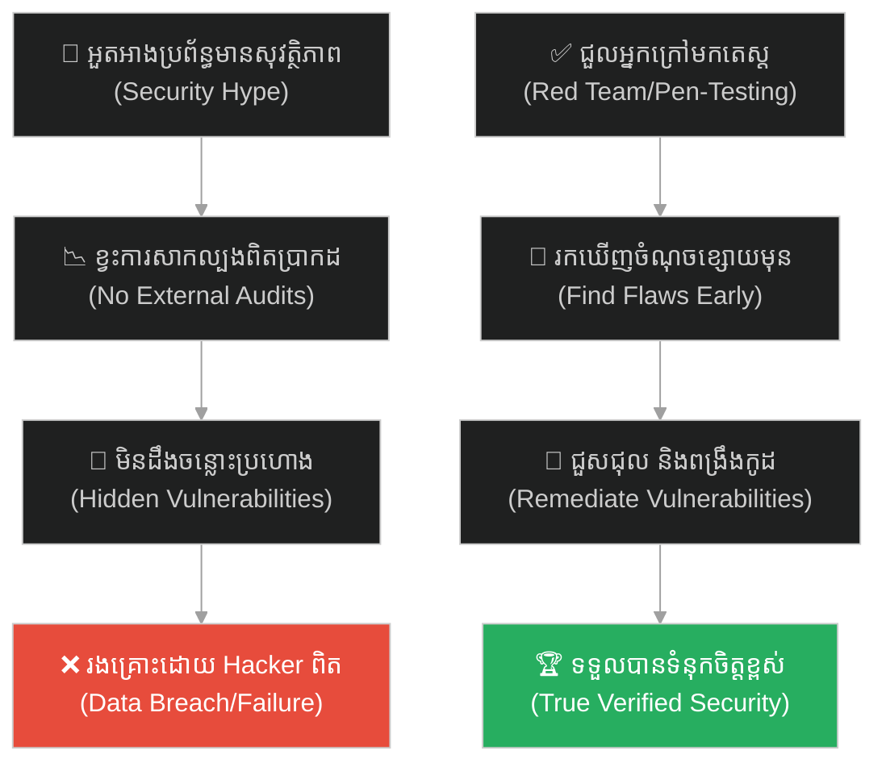
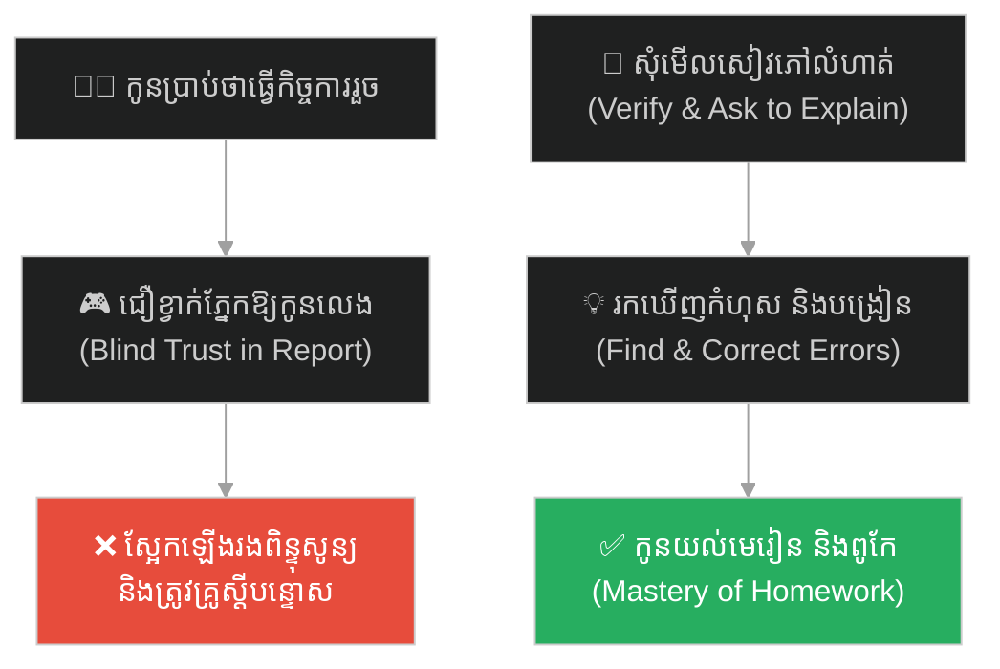
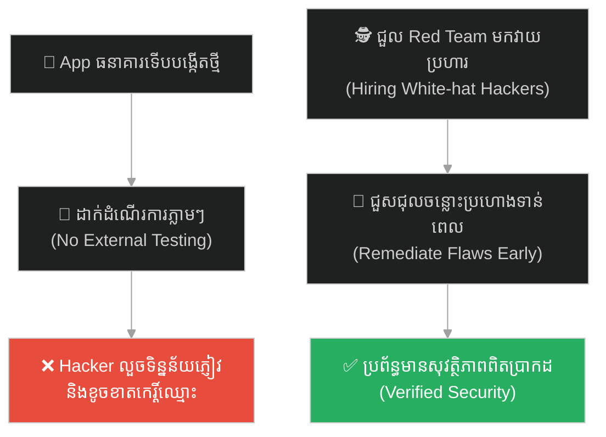
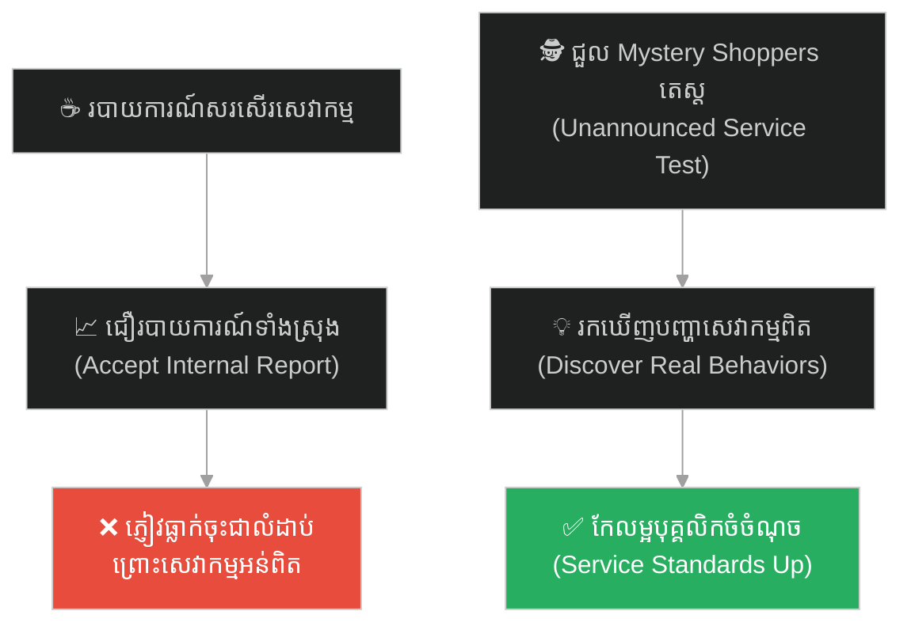
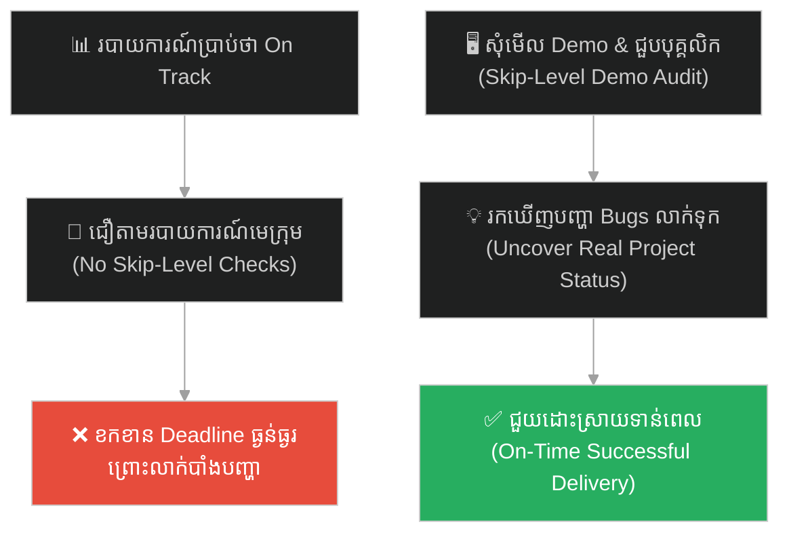
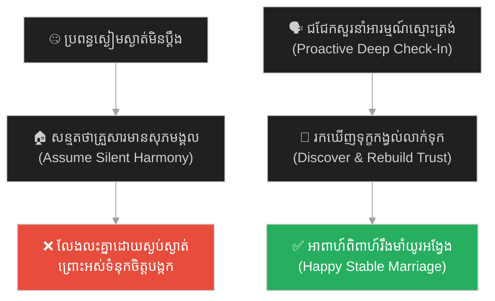
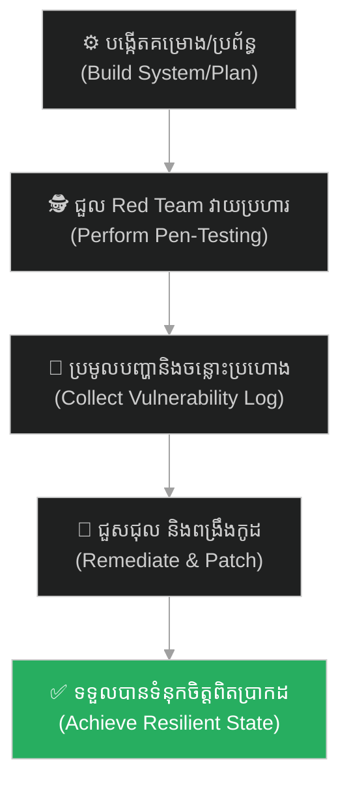

# Penetration Testing (សវនកម្មសុវត្ថិភាព)៖ មហាក្សត្រីសេបា និងប្រស្នាសាកល្បងប្រាជ្ញាស្តេចសាឡូម៉ូន (Penetration Testing & The Queen of Sheba's Riddles)

**Author:** ichamrong  
**Date:** 2026-05-27  
**Tags:** #solomon #queen-of-sheba #stress-testing #security #pen-testing #audit #parable  
**Category:** Concepts / Parables  
**Read Time:** ~15 min  

---

## 📌 មាតិកា (Table of Contents)
- [អន្ទាក់ផ្លូវចិត្ត (The Trap)](#0)
- [១. រឿងព្រេងប្រវត្តិសាស្ត្រ៖ មហាក្សត្រីសេបា និងប្រស្នាសាកល្បងសាឡូម៉ូន (The Legend of the Queen's Riddles)](#1)
  - [ការសាកល្បងសមត្ថភាពពិត (The Ultimate Stress Test)](#1-1)
- [២. បញ្ហា៖ គ្រោះថ្នាក់នៃលោល្បិចសុវត្ថិភាពក្លែងក្លាយ (The Issue: The Danger of Security Theater)](#2)
- [៣. ឧទាហរណ៍ជាក់ស្តែងក្នុងពិភពពិត (Real World Examples)](#3)
  - [ឧទាហរណ៍ទី ១ — កម្រិតស្រាល (គ្រួសារ)៖ ការជឿជាក់លើរបាយការណ៍ធ្វើលំហាត់របស់កូន (The Unchecked Homework Trap)](#3-1)
  - [ឧទាហរណ៍ទី ២ — កម្រិតមធ្យម (បច្ចេកទេស)៖ ការជួល Hacker ល្អមកវាយប្រហារ Server ក្រុមហ៊ុន (The Red Team Attack Simulation)](#3-2)
  - [ឧទាហរណ៍ទី ៣ — កម្រិតមធ្យម (ធុរកិច្ច)៖ ការប្រើប្រាស់អតិថិជនសម្ងាត់ដើម្បីតេស្តសេវាកម្ម (The Mystery Shopper Auditing)](#3-3)
  - [ឧទាហរណ៍ទី ៤ — កម្រិតមធ្យម (សង្គម/គ្រប់គ្រង)៖ ការជួបពិភាក្សាផ្ទាល់ដើម្បីត្រួតពិនិត្យរបាយការណ៍ (The Skip-Level Management Audit)](#3-4)
  - [ឧទាហរណ៍ទី ៥ — កម្រិតធ្ងន់ (ទំនាក់ទំនង)៖ ការសន្ទនាស្មោះត្រង់ស្វែងយល់ពីទុក្ខកង្វល់ដៃគូជីវិត (The Deep Check-In Conversation)](#3-5)
- [៤. ដំណោះស្រាយទូទៅ៖ ការធ្វើសវនកម្មដោយភាគីទីបី និងការធ្វើតេស្តសាកល្បងជាប្រចាំ (The General Solution: Security Audits & Red Team Verification)](#4)
- [សេចក្តីសន្និដ្ឋាន (Conclusion)](#5)
- [ឯកសារយោង (References)](#6)
- [Related Posts](#7)

---

## អន្ទាក់ផ្លូវចិត្ត (The Trap)

តើអ្នកធ្លាប់ជួបស្ថានភាពដែលប្រព័ន្ធរបស់អ្នកត្រូវបានអះអាងថាមាន "សុវត្ថិភាពល្អឥតខ្ចោះ" ឬដំណើរការ "គ្មានកំហុសទាល់តែសោះ" ផ្អែកលើការយល់ឃើញផ្ទៃក្នុង ប៉ុន្តែភ្លាមៗនៅពេលមានការត្រួតពិនិត្យ ឬការវាយប្រហារពិតប្រាកដពីខាងក្រៅ ប្រព័ន្ធនោះស្រាប់តែដួលរលំ និងលេចចេញចន្លោះប្រហោងធំៗដែរឬទេ?

នៅក្នុងការគ្រប់គ្រងប្រព័ន្ធ និងសន្តិសុខបច្ចេកវិទ្យា៖
* **យើងងាយនឹងស្កប់ស្កល់** ជាមួយយោបល់ ឬការធានាផ្ទៃក្នុងដែលខ្វះការត្រួតពិនិត្យឯករាជ្យ (Security Theater)។
* **យើងមើលរំលង** ការពិតដែលថា ទំនុកចិត្តពិតប្រាកដមិនអាចសាងសង់លើពាក្យអះអាងរបស់ខ្លួនឯងបានឡើយ គឺត្រូវតែឆ្លងកាត់ការសាកល្បងវាយប្រហារ និងការពិនិត្យពីភាគីខាងក្រៅ។

ការបណ្តោយឱ្យទំនុកចិត្តខ្វាក់ភ្នែក និងកង្វះការធ្វើតេស្តជាក់ស្តែងបំផ្លាញសុវត្ថិភាពប្រព័ន្ធ ហៅថា **អន្ទាក់ Security Theater (លម្អៀងសុវត្ថិភាពក្លែងក្លាយ)**។

ដើម្បីយល់ដឹងពីសារៈសំខាន់នៃការផ្ទៀងផ្ទាត់ និងការធ្វើតេស្តសាកល្បងសមត្ថភាពពិត នេះជាផែនទីបង្ហាញផ្លូវសម្រាប់អត្ថបទនេះ៖
1. **រឿងព្រេងប្រវត្តិសាស្ត្រ (The Historic Legend)** — ការយាងមករបស់មហាក្សត្រីសេបា ដើម្បីសួរប្រស្នាដ៏ស្មុគស្មាញ និងវាស់ស្ទង់ប្រាជ្ញារបស់ស្តេចសាឡូម៉ូន។
2. **បញ្ហា (The Issue)** — តើអ្វីទៅជា Penetration Testing (ការវាយប្រហារសាកល្បង) និងហេតុអ្វីវាជាការចាំបាច់សម្រាប់ប្រព័ន្ធព័ត៌មានវិទ្យា?
3. **ឧទាហរណ៍ជាក់ស្តែងក្នុងពិភពពិត (Real World Examples)** — ពិនិត្យមើលសារៈសំខាន់នៃការតេស្តក្នុងកម្រិតគ្រួសារ ព័ត៌មានវិទ្យា ធុរកិច្ច ការគ្រប់គ្រង និងទំនាក់ទំនង។
4. **ដំណោះស្រាយទូទៅ (The General Solution)** — ការបង្កើតវប្បធម៌ស្វាគមន៍ការធ្វើតេស្ត (Red Team vs. Blue Team) និងការអនុវត្តសវនកម្មច្បាស់លាស់។

---

## ១. រឿងព្រេងប្រវត្តិសាស្ត្រ៖ មហាក្សត្រីសេបា និងប្រស្នាសាកល្បងសាឡូម៉ូន (The Legend of the Queen's Riddles)

នៅក្នុងគម្ពីរប្រវត្តិសាស្ត្របុរាណ កេរ្តិ៍ឈ្មោះអំពីប្រាជ្ញាដ៏វិសេសវិសាល ការចាត់ចែងរដ្ឋ និងភាពរុងរឿងរបស់ **ស្តេចសាឡូម៉ូន (King Solomon)** បានល្បីរន្ទឺរហូតទៅដល់ដែនដីឆ្ងាយៗ។

នៅចម្ងាយរាប់ពាន់គីឡូម៉ែត្រ **មហាក្សត្រីសេបា (Queen of Sheba)** ដែលជាអធិរាជស្រីដ៏មានឥទ្ធិពល និងទ្រព្យសម្បត្តិមហាសាល បានឮព័ត៌មានអំពីប្រាជ្ញារបស់សាឡូម៉ូន។ ផ្ទុយពីអ្នកដទៃ នាងមិនមែនជាមនុស្សដែលជឿលើពាក្យចចាមអារ៉ាម ឬរបាយការណ៍សរសើរដោយងាយស្រួលនោះទេ។ នាងយល់ច្បាស់ថា របាយការណ៍អាចនឹងត្រូវបានគេនិយាយបំផ្លើស ឬរៀបចំឡើងដើម្បីផ្គាប់ចិត្ត។ នាងចង់ដឹងការពិតថា តើសាឡូម៉ូនពិតជាមានប្រាជ្ញាពិតប្រាកដ ឬមួយក៏គ្រាន់តែជាការអួតអាង និងយុទ្ធសាស្ត្រផ្សព្វផ្សាយរបស់យេរូសាឡឹម?

---

### ការសាកល្បងសមត្ថភាពពិត (The Ultimate Stress Test)

មហាក្សត្រីសេបា បានរៀបចំក្បួនដំណើរដ៏ធំ និងប្រមូលទ្រព្យសម្បត្តិដ៏មានតម្លៃដូចជា មាស ត្បូងពេជ្រ និងគ្រឿងទេសកម្រៗជាច្រើន ដើម្បីធ្វើដំណើរទៅកាន់ក្រុងយេរូសាឡឹម។ ប៉ុន្តែ ទ្រព្យសម្បត្តិទាំងនេះមិនមែនយកទៅថ្វាយសាឡូម៉ូនដោយខ្វះលក្ខខណ្ឌនោះឡើយ។

នាងបានបង្កើត និងប្រមូល **«ប្រស្នា និងបញ្ហាដ៏ស្មុគស្មាញបំផុត (Hardest riddles and testing scenarios)»** ដែលគ្មានមន្ត្រី ឬអ្នកប្រាជ្ញណាម្នាក់នៅក្នុងនគររបស់នាងអាចដោះស្រាយបាន។ នាងចង់ប្រើប្រាស់ប្រស្នាទាំងនេះ ដើម្បីធ្វើតេស្តសាកល្បងប្រាជ្ញារបស់សាឡូម៉ូនដោយផ្ទាល់ (Stress Testing)។

នៅពេលនាងទៅដល់ ស្តេចសាឡូម៉ូនមិនបានគេចវេស ឬការពារខ្លួនដោយការរារាំងឡើយ។ ទ្រង់បានស្វាគមន៍នាងយ៉ាងកក់ក្តៅ និងអនុញ្ញាតឱ្យនាងបង្ហាញប្រស្នាទាំងអស់។ មហាក្សត្រីសេបាបានសួររាល់ប្រស្នា និងការធ្វើតេស្តដ៏លំបាកបំផុត ដូចជាការសម្គាល់ផ្កាពិត និងផ្កាក្លែងក្លាយពីចម្ងាយ ការដោះស្រាយទំនាស់ច្បាប់ដ៏ស្មុគស្មាញ និងប្រស្នាតក្កវិជ្ជា។ ស្តេចសាឡូម៉ូនបានដោះស្រាយរាល់សំណួរទាំងអស់ដោយគ្មានការទាក់ទើរ គ្មានការយឺតយ៉ាវ និងពន្យល់នាងយ៉ាងក្បោះក្បាយ។ គ្មានចន្លោះប្រហោងណាមួយនៅក្នុងចំណេះដឹង និងប្រាជ្ញារបស់ទ្រង់ដែលនាងអាចរកឃើញឡើយ។

បន្ទាប់ពីបានសាកល្បងដោយផ្ទាល់ និងឃើញលទ្ធផលពិតប្រាកដ មហាក្សត្រីសេបាបានលាន់មាត់កោតសរសើរថា៖  
> *«អ្វីដែលខ្ញុំបានឮនៅក្នុងប្រទេសរបស់ខ្ញុំ គឺមិនទាន់ស្មើនឹងពាក់កណ្តាលនៃការពិតដែលខ្ញុំបានឃើញផ្ទាល់ភ្នែកនោះឡើយ។ ប្រាជ្ញា និងភាពរុងរឿងរបស់ទ្រង់ គឺលើសពីព័ត៌មានដែលខ្ញុំទទួលបានឆ្ងាយណាស់។»*

ដោយសារតែសាឡូម៉ូនអាចឆ្លងកាត់ការតេស្តយ៉ាងហ្មត់ចត់នេះ នាងបានប្រគល់មាសដ៏ច្រើនសន្ធឹកសន្ធាប់ជូនទ្រង់ ហើយប្រទេសទាំងពីរបានក្លាយជាដៃគូពាណិជ្ជកម្ម និងសម្ព័ន្ធមិត្តដ៏រឹងមាំបំផុត។

---

## ២. បញ្ហា៖ គ្រោះថ្នាក់នៃលោល្បិចសុវត្ថិភាពក្លែងក្លាយ (The Issue: The Danger of Security Theater)

នៅក្នុងវិស្វកម្មប្រព័ន្ធ និងសន្តិសុខព័ត៌មានវិទ្យា រឿងរ៉ាវរបស់មហាក្សត្រីសេបា គឺជាមេរៀនដ៏សំខាន់ស្តីពី **Penetration Testing (ការវាយប្រហារសាកល្បង)**៖

* **សុវត្ថិភាពផ្អែកលើការអះអាង (Security Theater)៖** គឺជានិន្នាការដែលក្រុមហ៊ុន ឬក្រុមការងារអភិវឌ្ឍប្រព័ន្ធ ជឿជាក់ថាប្រព័ន្ធរបស់ខ្លួនមានសុវត្ថិភាពខ្ពស់ ព្រោះតែពួកគេមានការការពារលើផ្ទៃមុខ (ដូចជា ដាក់ firewall ថ្លៃៗ ឬសរសេរ SOP ក្រាស់ៗ) ប៉ុន្តែមិនដែលឆ្លងកាត់ការតេស្តវាយប្រហារជាក់ស្តែងឡើយ។ នេះគឺជាភាពស្កប់ស្កល់ដ៏គ្រោះថ្នាក់។
* **តួនាទីរបស់ Red Team (អ្នកវាយប្រហារសាកល្បង)៖** ដូចជាមហាក្សត្រីសេបា ដែលនាំប្រស្នាដ៏លំបាកមកសួរ។ ក្រុមការងារ Red Team គឺក្រុមអ្នកជំនាញសន្តិសុខឯករាជ្យ ដែលព្យាយាមរកវិធីលួចចូលប្រព័ន្ធរបស់អ្នក ដោយប្រើគ្រប់យុទ្ធសាស្ត្រដែល Hacker ពិតប្រាកដនឹងប្រើ។ ការណ៍នេះជួយឱ្យយើងរកឃើញចន្លោះប្រហោងលាក់កំបាំង មុនពេល Hacker អាក្រក់រកឃើញ។
* **ទំនុកចិត្តដែលបានផ្ទៀងផ្ទាត់ (Verified Trust)៖** ដៃគូសហការ ឬអតិថិជនធំៗ (Enterprise clients) នឹងមិនចុះកិច្ចសន្យាជាមួយអ្នកផ្អែកលើការសន្យានោះទេ។ ពួកគេត្រូវការឃើញ "របាយការណ៍តេស្តសុវត្ថិភាព (Security Audit Report)" ពីភ្នាក់ងារឯករាជ្យជាមុនសិន។

---

## ៣. ឧទាហរណ៍ជាក់ស្តែងក្នុងពិភពពិត

ដើម្បីយល់ដឹងឱ្យកាន់តែច្បាស់ នេះជាការវិភាគលើឧទាហរណ៍ ៥ កម្រិតផ្សេងគ្នា៖

---

### ឧទាហរណ៍ទី ១ — កម្រិតស្រាល (គ្រួសារ)៖ ការជឿជាក់លើរបាយការណ៍ធ្វើលំហាត់របស់កូន (The Unchecked Homework Trap)

**ស្ថានភាព៖** ឪពុកម្នាក់សួរកូនប្រុសថា "តើកូនបានធ្វើលំហាត់គណិតវិទ្យាសម្រាប់ថ្ងៃស្អែករួចរាល់ហើយឬនៅ?" កូនឆ្លើយថា "បាទ ប៉ា ខ្ញុំធ្វើរួចអស់ហើយ!"

* **ជម្រើសខុស (Blind Trust)៖** ឪពុកជឿភ្លាម រួចអនុញ្ញាតឱ្យកូនលេងហ្គេមទូរស័ព្ទរហូតដល់យប់ជ្រៅ ដោយគិតថាកិច្ចការសាលារួចរាល់។
* **លទ្ធផល៖** ថ្ងៃបន្ទាប់ កូនទទួលបានពិន្ទុសូន្យ និងលិខិតស្តីបន្ទោសពីគ្រូ ព្រោះកូនមិនបានធ្វើលំហាត់នោះឡើយ គឺគ្រាន់តែនិយាយកុហកដើម្បីបានលេងហ្គេម។
* **ជម្រើសត្រូវ (Verification)៖** ដើរតួជាអ្នកសាកល្បង។ និយាយថា "ល្អណាស់កូន យកសៀវភៅមកឱ្យប៉ាមើលបន្តិច និងជួយពន្យល់វិធីធ្វើលំហាត់លេខ ៣ ឱ្យប៉ាស្តាប់ផង។" ឪពុកអាចដឹងភ្លាមថាកូនធ្វើរួចពិតមែនឬទេ និងជួយបង្រៀនបន្ថែមទាន់ពេល។

---

### ឧទាហរណ៍ទី ២ — កម្រិតមធ្យម (បច្ចេកទេស)៖ ការជួល Hacker ល្អមកវាយប្រហារ Server ក្រុមហ៊ុន (The Red Team Attack Simulation)

**ស្ថានភាព៖** ធនាគារឌីជីថលទើបតែបង្កើតប្រព័ន្ធ App ទូរស័ព្ទថ្មី។ ក្រុមអភិវឌ្ឍនផ្ទៃក្នុងធានាថាប្រព័ន្ធមានសុវត្ថិភាពល្អឥតខ្ចោះ ព្រោះពួកគេបានប្រើប្រាស់ប្រព័ន្ធកូដនីយកម្មចុងក្រោយ (Encryption)។

* **ជម្រើសខុស៖** ជឿជាក់លើក្រុមការងារផ្ទៃក្នុងទាំងស្រុង រួចដាក់ឱ្យដំណើរការ App ទៅកាន់ទីផ្សារភ្លាមៗដោយគ្មានការតេស្តសាកល្បងពីខាងក្រៅ។
* **លទ្ធផល៖** មួយខែក្រោយមក Hacker ពិតប្រាកដបានរកឃើញចន្លោះប្រហោង (SQL Injection) នៅក្នុងប្រព័ន្ធទិន្នន័យ រួចលួចយកព័ត៌មានគណនីភ្ញៀវរាប់សែននាក់ បង្កជាមហន្តរាយហិរញ្ញវត្ថុ និងបាត់បង់អាជ្ញាប័ណ្ណ។
* **ជម្រើសត្រូវ៖** មុននឹងបញ្ចេញ App ជួលភ្នាក់ងារ Pen-testing ខាងក្រៅ (Red Team) ឱ្យព្យាយាមវាយប្រហារប្រព័ន្ធ។ ក្រុម Red Team រកឃើញចន្លោះប្រហោងសុវត្ថិភាពចំនួន ៣ កន្លែងភ្លាមៗ។ ធនាគារធ្វើការជួសជុលចំណុចទាំងនោះទាន់ពេល ធ្វើឱ្យ App មានសុវត្ថិភាពពិតប្រាកដមុនពេលដាក់ឱ្យដំណើរការ។

---

### ឧទាហរណ៍ទី ៣ — កម្រិតមធ្យម (ធុរកិច្ច)៖ ការប្រើប្រាស់អតិថិជនសម្ងាត់ដើម្បីតេស្តសេវាកម្ម (The Mystery Shopper Auditing)

**ស្ថានភាព៖** ម្ចាស់ខ្សែសង្វាក់ហាងកាហ្វេធំមួយ ទទួលបានរបាយការណ៍ពីអ្នកគ្រប់គ្រងតំបន់ថា "បុគ្គលិកគ្រប់សាខាមានភាពរួសរាយរាក់ទាក់ និងផ្តល់សេវាកម្មល្អឥតខ្ចោះដល់ភ្ញៀវជានិច្ច។"

* **ជម្រើសខុស៖** ជឿជាក់លើរបាយការណ៍ និងផ្តល់ប្រាក់លើកទឹកចិត្តដល់អ្នកគ្រប់គ្រងទាំងនោះ ដោយមិនបានស៊ើបអង្កេតជាក់ស្តែង។
* **លទ្ធផល៖** ចំនួនអតិថិជនធ្លាក់ចុះជាលំដាប់ជារៀងរាល់ខែ។ អតិថិជនជាច្រើនបានសរសេរមតិរិះគន់លើបណ្តាញសង្គមថា បុគ្គលិកនិយាយស្តីមិនសមរម្យ និងសេវាកម្មយឺតយ៉ាវខ្លាំង។
* **ជម្រើសត្រូវ៖** ជួលអតិថិជនសម្ងាត់ (Mystery Shoppers) ឱ្យដើរចូលទិញកាហ្វេគ្រប់សាខា ដោយមិនឱ្យបុគ្គលិកដឹងខ្លួនជាមុន។ ម្ចាស់ហាងទទួលបានទិន្នន័យ និងវីដេអូពិតប្រាកដដែលបង្ហាញថា បុគ្គលិកសាខាខ្លះលេងទូរស័ព្ទ និងមិនអើពើនឹងភ្ញៀវ។ ម្ចាស់ហាងរៀបចំការបណ្តុះបណ្តាល និងកែសម្រួលបុគ្គលិកទាន់ពេល ធ្វើឱ្យអាជីវកម្មកើនឡើងវិញ។

---

### ឧទាហរណ៍ទី ៤ — កម្រិតមធ្យម (សង្គម/គ្រប់គ្រង)៖ ការជួបពិភាក្សាផ្ទាល់ដើម្បីត្រួតពិនិត្យរបាយការណ៍ (The Skip-Level Management Audit)

**ស្ថានភាព៖** នាយកប្រតិបត្តិ (CEO) ទទួលបានរបាយការណ៍ពីប្រធានផ្នែកអភិវឌ្ឍន៍ថា "គម្រោងសរសេរកម្មវិធីថ្មីកំពុងដំណើរការទៅមុខយ៉ាងរលូនល្អ គ្មានបញ្ហារាំងស្ទះ និងទាន់ពេលវេលា (On Track)។"

* **ជម្រើសខុស៖** ជឿជាក់លើរបាយការណ៍ និងសន្យាជាមួយអតិថិជនពីកាលបរិច្ឆេទបញ្ចេញផលិតផល ដោយមិនបានផ្ទៀងផ្ទាត់កូដជាក់ស្តែង ឬជួបក្រុមការងារថ្នាក់ក្រោម។
* **លទ្ធផល៖** នៅថ្ងៃ Deadline ស្រាប់តែប្រធានផ្នែកសារភាពថា ប្រព័ន្ធមានបញ្ហា Bugs ធ្ងន់ធ្ងរ និងត្រូវការពន្យារពេល ៣ ខែបន្ថែមទៀត ធ្វើឱ្យខូចកិច្ចសន្យាជាមួយអតិថិជន និងបាត់បង់ទំនុកចិត្ត។
* **ជម្រើសត្រូវ៖** ធ្វើជាអ្នកត្រួតពិនិត្យឯករាជ្យ។ រៀបចំការប្រជុំ Skip-level (CEO ជួបជាមួយវិស្វករផ្ទាល់ដោយគ្មានវត្តមានប្រធានផ្នែក) និងសុំឱ្យមានការបង្ហាញផលិតផលគំរូជាក់ស្តែង (Demo) រៀងរាល់ ២ សប្តាហ៍។ CEO រកឃើញបញ្ហារាំងស្ទះទាន់ពេល និងបន្ថែមធនធានជួយដោះស្រាយ ធ្វើឱ្យគម្រោងទទួលបានជោគជ័យ។

---

### ឧទាហរណ៍ទី ៥ — កម្រិតធ្ងន់ (ទំនាក់ទំនង)៖ ការសន្ទនាស្មោះត្រង់ស្វែងយល់ពីទុក្ខកង្វល់ដៃគូជីវិត (The Deep Check-In Conversation)

**ស្ថានភាព៖** ប្តីម្នាក់គិតថាអាពាហ៍ពិពាហ៍របស់ខ្លួនគ្មានបញ្ហាអ្វីឡើយ ព្រោះប្រពន្ធមិនដែលស្រែកជេរ ឬឈ្លោះប្រកែកគ្នា (No complaints)។

* **ជម្រើសខុស៖** សន្មតថាសុភមង្គលមាន ១០០% រួចបន្តរស់នៅតាមរបៀបចាស់ ធ្វេសប្រហែសការយកចិត្តទុកដាក់ និងមិនដែលសួរនាំពីអារម្មណ៍ប្រពន្ធឡើយ។
* **លទ្ធផល៖** ថ្ងៃមួយ ប្រពន្ធបានហុចលិខិតលែងលះឱ្យដោយស្ងប់ស្ងាត់ ព្រោះនាងបានទ្រាំទ្រនឹងភាពឯកោអស់រយៈពេលជាច្រើនឆ្នាំរហូតដល់អស់ចិត្ត ធ្វើឱ្យប្តីតក់ស្លុតខ្លាំង និងគ្មានផ្លូវផ្សះផ្សា។
* **ជម្រើសត្រូវ៖** កុំសន្មតដោយសារភាពស្ងប់ស្ងាត់។ បង្កើតការសន្ទនាស្មោះត្រង់ស៊ីជម្រៅ (Deep Check-In) ដោយសួរថា៖ *«អូនសម្លាញ់ តើមានរឿងអ្វីខ្លះដែលបងធ្វើធ្វើឱ្យអូនពិបាកចិត្ត ឬមានអារម្មណ៍ឯកោដែរឬទេ? សុំនិយាយប្រាប់បងដោយស្មោះត្រង់ចុះ បងនឹងស្តាប់ដោយមិនខឹងឡើយ។»* ពួកគេអាចរកឃើញ និងជួសជុលស្នាមប្រេះស្រាំក្នុងទំនាក់ទំនងទាន់ពេល។

---

## ៤. ដំណោះស្រាយទូទៅ៖ ការធ្វើសវនកម្មដោយភាគីទីបី និងការធ្វើតេស្តសាកល្បងជាប្រចាំ (The General Solution: Security Audits & Red Team Verification)

ដើម្បីការពារប្រព័ន្ធ ផលិតផល និងជីវិតរបស់អ្នកពីការបំផ្លិចបំផ្លាញដោយសារកំហុសលាក់កំបាំង ត្រូវអនុវត្តវិធីសាស្ត្រគន្លឹះទាំងនេះ៖

### ១. បង្កើតវប្បធម៌ Red Team (វាយប្រហារសាកល្បងដោយស្ថាបនា)
* នៅក្នុងការងារ និងជីវិត ត្រូវតែងតាំង ឬជួលអ្នកដទៃឱ្យដើរតួជា "មហាក្សត្រីសេបា" ឬ "Red Team" ដើម្បីព្យាយាមស្វែងរកចំណុចខ្សោយនៅក្នុងការងារ ផែនការអាជីវកម្ម ឬប្រព័ន្ធបច្ចេកវិទ្យារបស់អ្នក។
* ស្វាគមន៍រាល់មតិរិះគន់ និងចំណុចខ្សោយដែលរកឃើញ ព្រោះវាជាឱកាសដើម្បីជួសជុលមុនពេលជួបមហន្តរាយពិត។

### ២. ធ្វើតេស្តសាកល្បងភាពធន់ជាប្រចាំ (Chaos/Stress Testing)
* កុំរង់ចាំដល់ប្រព័ន្ធជួបវិបត្តិពិតប្រាកដ។ ត្រូវចាក់បញ្ចូលបញ្ហាសិប្បនិម្មិត (ដូចជា ការសាកល្បងពន្លត់ Server, ការសាកល្បងឱ្យអតិថិជនខឹង ឬការសាកល្បងកាត់ផ្តាច់ចរន្តអគ្គិសនី) ដើម្បីផ្ទៀងផ្ទាត់ថាតើក្រុមការងារ និងប្រព័ន្ធមានសមត្ថភាពដោះស្រាយបានកម្រិតណា។

### ៣. អនុវត្តយន្តការផ្ទៀងផ្ទាត់បីជាន់ (Three-Layer Verification)
* មិនត្រូវជឿជាក់លើ "របាយការណ៍ស្វ័យប្រវត្ត" ឬ "ពាក្យអះអាងផ្ទាល់មាត់" ឡើយ។ ទំនុកចិត្តត្រូវតែផ្អែកលើការផ្ទៀងផ្ទាត់ជាក់ស្តែង (Trust, but Verify)។ សុំមើលភស្តុតាង លទ្ធផលតេស្ត ឬ Demo ជាក់ស្តែងជានិច្ច។

---

## 🐇 ធ្លាក់ចូលក្នុងរន្ធទន្សាយយុទ្ធសាស្ត្រ (Enter the Strategic Rabbit Hole)

ដើម្បីស្វែងយល់បន្ថែមអំពីរបៀបដែលការនាំចូលនូវឧបករណ៍ សារធាតុ ឬបច្ចេកវិទ្យាពីខាងក្រៅដោយគ្មានការគ្រប់គ្រង និងការត្រួតពិនិត្យឱ្យបានហ្មត់ចត់ អាចបង្កជាចន្លោះប្រហោងសុវត្ថិភាពដ៏ធំ និងនាំឱ្យប្រព័ន្ធទាំងមូលត្រូវដួលរលំពីខាងក្នុង សូមបន្តដំណើររុករករបស់អ្នក៖

* 🚀 **[ចាប់ផ្តើមដំណើររុករក (Start the Journey) ➔ Solomon and the Foreign Wives](./54-the-foreign-wives.md)**

---

## សេចក្តីសន្និដ្ឋាន (Conclusion)

> **«កុំជឿជាក់លើពាក្យចចាមអារ៉ាម ឬការធានាផ្ទៃក្នុង។ ទំនុកចិត្តពិតប្រាកដ គឺទំនុកចិត្តដែលបានឆ្លងកាត់ការសាកល្បងដោយប្រស្នាដ៏ពិបាកបំផុត ហើយនៅតែអាចបកស្រាយបាន។»**

ចូររចនាប្រព័ន្ធការងារ និងជីវិតរបស់អ្នកដោយស្វាគមន៍ការធ្វើតេស្តសាកល្បងពីខាងក្រៅ ជួសជុលរាល់ចំណុចខ្សោយដែលបានរកឃើញ ដើម្បីទទួលបានស្ថិរភាព និងជោគជ័យយូរអង្វែង។

---

## ឯកសារយោង (References)

* **Bruce Schneier** — *Beyond Fear: Thinking Sensibly About Security in an Uncertain World* (2003)។ ការពិភាក្សាលម្អិតអំពីជំងឺ Security Theater និងរបៀបកសាងសន្តិសុខពិតប្រាកដ។
* **Gerald M. Weinberg** — *Perfect Software: And Other Illusions About Testing* (2008)។ ទស្សនៈវិទ្យានៃការធ្វើតេស្តសូហ្វវែរ និងគ្រោះថ្នាក់នៃការជឿជាក់លើកូដដែលគ្មានការសាកល្បង។
* **The Holy Bible** — *1 Kings 10:1-13* (កំណត់ត្រាប្រវត្តិសាស្ត្រនៃការជួបគ្នារវាងស្តេចសាឡូម៉ូន និងមហាក្សត្រីសេបា)។

---

## Related Posts

* **[45 Solomon and the Queen of Sheba: Stress Testing and Security Audits](../articles/45-solomon-and-the-queen-of-sheba-stress-testing.md)** — អត្ថបទគោលបកស្រាយអំពីការប្រើប្រាស់ Red Team និងការធ្វើ Pen-testing។
* **[32 The Trojan Horse and Cybersecurity](./32-the-trojan-horse.md)** — គ្រោះថ្នាក់នៃការមិនត្រួតពិនិត្យ និងទុកចិត្តសត្រូវដែលចូលមកពីខាងក្រៅងាយៗពេក។
* **[52 Elon Musk and the Best Part is No Part](./52-the-best-part-is-no-part.md)** — របៀបលុបចោលគម្រោងដែលមិនចាំបាច់ដើម្បីសម្រួលប្រព័ន្ធការងារ។

---
*Last updated: 2026-05-27*

## Related

- [💡 Concepts README](../README.md)
- [📚 Main Repository README](../../../README.md)
- [Developer Habits](../../developer-habits/README.md)
- [Mental Health & Well-being](../../mental-health/README.md)
- [Management & SDLC](../../management/README.md)
