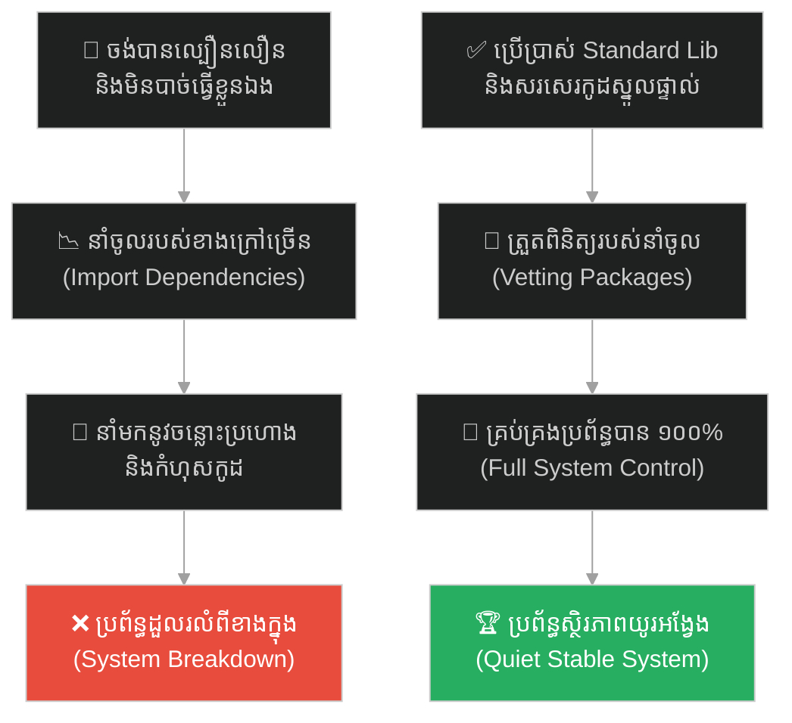
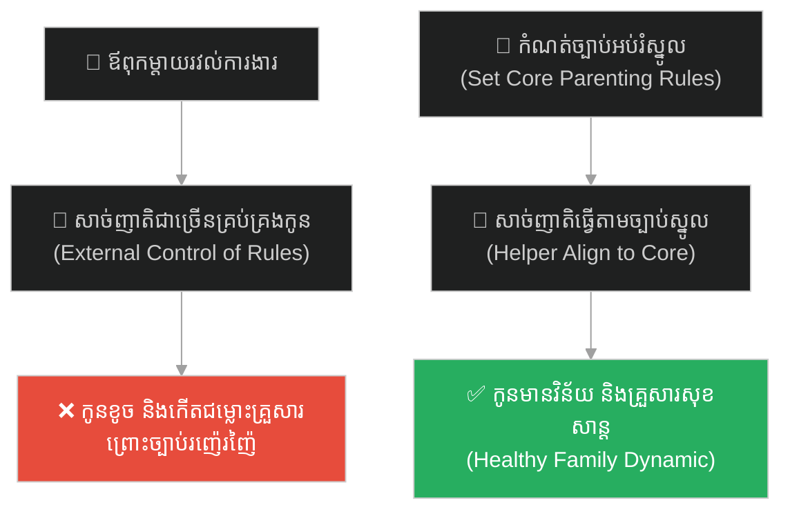
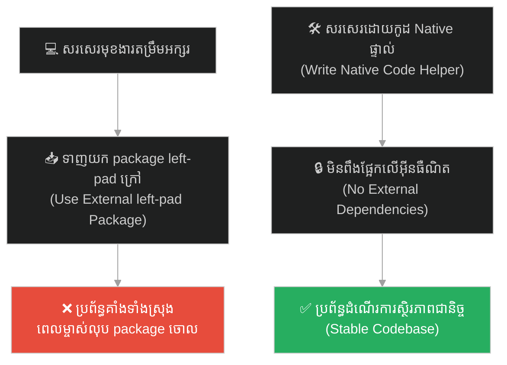
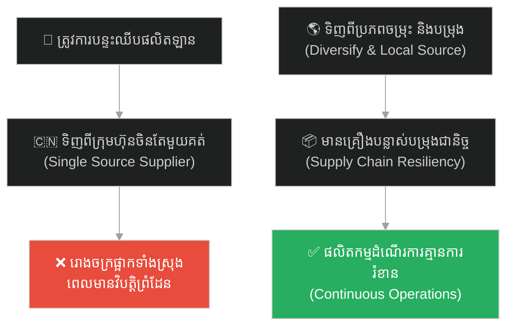
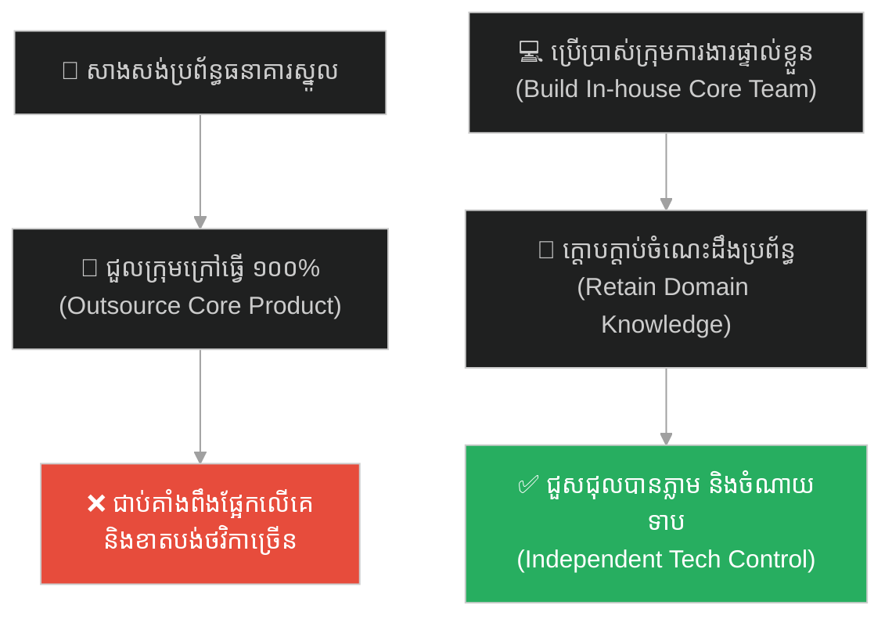
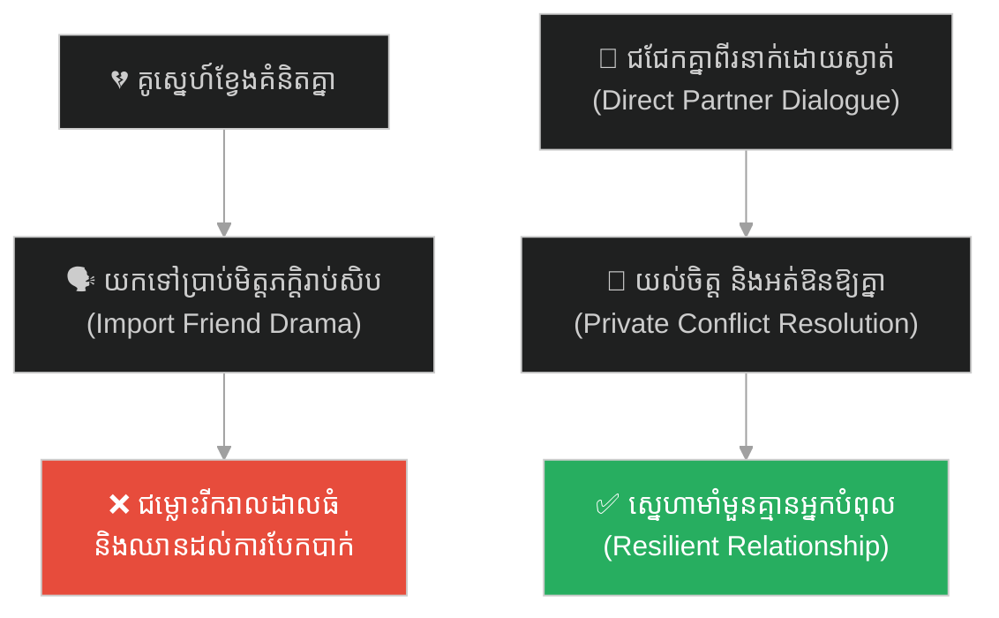
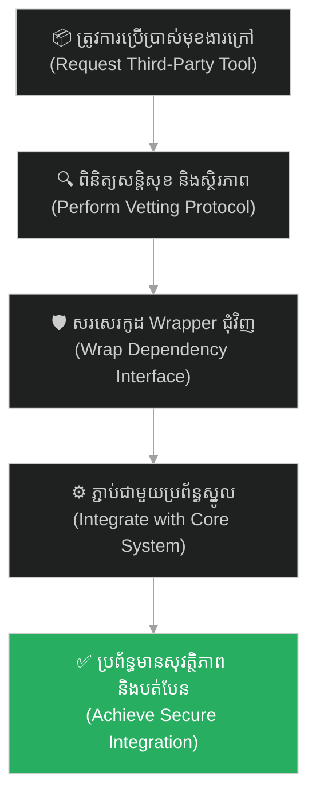

# Dependency Management (ការគ្រប់គ្រងការពឹងផ្អែក)៖ សាឡូម៉ូន និងមហេសីបរទេស ឬឋាននរកនៃកូដអ្នកដទៃ (Dependency Management & Solomon's Foreign Wives)

**Author:** ichamrong  
**Date:** 2026-05-27  
**Tags:** #solomon #dependency-hell #third-party-integrations #tech-debt #supply-chain-risk #parable  
**Category:** Concepts / Parables  
**Read Time:** ~15 min  

---

## 📌 មាតិកា (Table of Contents)
- [អន្ទាក់ផ្លូវចិត្ត (The Trap)](#0)
- [១. រឿងព្រេងប្រវត្តិសាស្ត្រ៖ អាពាហ៍ពិពាហ៍នយោបាយ និងការបែកបាក់នគរសាឡូម៉ូន (The Legend of political Alliances & Idols)](#1)
  - [ការនាំចូលព្រះក្លែងក្លាយបំផ្លាញនគរ (Importing Foreign Idols)](#1-1)
- [២. បញ្ហា៖ ឋាននរកនៃការពឹងផ្អែក និងហានិភ័យខ្សែសង្វាក់ផ្គត់ផ្គង់ (The Issue: Dependency Hell & Supply Chain Vulnerabilities)](#2)
- [៣. ឧទាហរណ៍ជាក់ស្តែងក្នុងពិភពពិត (Real World Examples)](#3)
  - [ឧទាហរណ៍ទី ១ — កម្រិតស្រាល (គ្រួសារ)៖ ការអនុញ្ញាតឱ្យសាច់ញាតិខាងក្រៅគ្រប់គ្រងរបៀបចិញ្ចឹមកូន (The External Family Dependency Trap)](#3-1)
  - [ឧទាហរណ៍ទី ២ — កម្រិតមធ្យម (បច្ចេកទេស)៖ ការទាញយក Package រាប់រយសម្រាប់មុខងារតូចតាច (The Left-Pad Package Breakdown)](#3-2)
  - [ឧទាហរណ៍ទី ៣ — កម្រិតមធ្យម (ធុរកិច្ច)៖ រោងចក្រពឹងផ្អែកលើអ្នកផ្គត់ផ្គង់តែមួយគត់មកពីបរទេស (The Single Supplier Risk)](#3-3)
  - [ឧទាហរណ៍ទី ៤ — កម្រិតមធ្យម (សង្គម/គ្រប់គ្រង)៖ ការជួលក្រុមហ៊ុនខាងក្រៅធ្វើការងារស្នូលរបស់អង្គភាព (The Total Outsourcing Trap)](#3-4)
  - [ឧទាហរណ៍ទី ៥ — កម្រិតធ្ងន់ (ទំនាក់ទំនង)៖ ការអនុញ្ញាតឱ្យមតិមិត្តភក្តិខាងក្រៅសម្រេចចិត្តលើស្នេហា (The Third-Party Relationship Drama)](#3-5)
- [៤. ដំណោះស្រាយទូទៅ៖ ការវាយតម្លៃ Vetting ហ្មត់ចត់ និងការកំណត់ការពឹងផ្អែកឱ្យទាបបំផុត (The General Solution: Vetting Dependencies & Build vs. Buy Guardrails)](#4)
- [សេចក្តីសន្និដ្ឋាន (Conclusion)](#5)
- [ឯកសារយោង (References)](#6)
- [Related Posts](#7)

---

## អន្ទាក់ផ្លូវចិត្ត (The Trap)

តើអ្នកធ្លាប់ជួបស្ថានភាពដែលអ្នកចង់បានលទ្ធផលការងារលឿន និងសន្សំសំចៃកម្លាំង ក៏បានសម្រេចចិត្តនាំចូល ឬប្រើប្រាស់ "របស់ដែលមានស្រាប់" ពីខាងក្រៅយ៉ាងច្រើនសន្ធឹកសន្ធាប់ ប៉ុន្តែចុងក្រោយរបស់ទាំងនោះបាននាំមកនូវកំហុស ភាពរញ៉េរញ៉ៃ និង bugs ដែលអ្នកមិនអាចគ្រប់គ្រងបាន រហូតដល់បំផ្លាញប្រព័ន្ធស្នូលរបស់អ្នកទាំងស្រុងដែរឬទេ?

នៅក្នុងការអភិវឌ្ឍប្រព័ន្ធ និងការគ្រប់គ្រង៖
* **យើងងាយនឹងសម្រេចចិត្តបត់កាត់** (Take shortcuts) ដោយប្រើប្រាស់ និងពឹងផ្អែកលើកូដ ឬសេវាកម្មរបស់ភាគីទីបី (Third-Party Libraries) ដោយខ្វះការត្រួតពិនិត្យ។
* **យើងមើលរំលង** ហានិភ័យលាក់កំបាំង និងតម្លៃថែទាំដែលភ្ជាប់មកជាមួយរបស់ទាំងនោះ ព្រោះយើងសម្លឹងឃើញតែភាពងាយស្រួលដំបូង។

ការបណ្តោយឱ្យការពឹងផ្អែកលើភាគីទីបីច្រើនហួសកម្រិត បំផ្លាញស្ថិរភាពប្រព័ន្ធស្នូល ហៅថា **អន្ទាក់ Dependency Hell (ឋាននរកនៃការពឹងផ្អែក)**។

ដើម្បីយល់ដឹងពីវិធីគ្រប់គ្រងការពឹងផ្អែក និងការការពារខ្សែសង្វាក់ផលិតកម្ម នេះជាផែនទីបង្ហាញផ្លូវសម្រាប់អត្ថបទនេះ៖
1. **រឿងព្រេងប្រវត្តិសាស្ត្រ (The Historic Legend)** — រឿងរ៉ាវរបស់ស្តេចសាឡូម៉ូនដែលចងសម្ព័ន្ធមិត្តជាមួយបរទេសដោយការនាំយកមហេសី និងព្រះក្លែងក្លាយចូលមកបំបែកបាក់នគរ។
2. **បញ្ហា (The Issue)** — តើអ្វីទៅជា Dependency Hell ក្នុងប្រព័ន្ធព័ត៌មានវិទ្យា និងគ្រោះថ្នាក់នៃ packages ខ្វះការគ្រប់គ្រង?
3. **ឧទាហរណ៍ជាក់ស្តែងក្នុងពិភពពិត (Real World Examples)** — ពិនិត្យមើលគ្រោះថ្នាក់នេះក្នុងកម្រិតគ្រួសារ ព័ត៌មានវិទ្យា ធុរកិច្ច ការគ្រប់គ្រង និងទំនាក់ទំនង។
4. **ដំណោះស្រាយទូទៅ (The General Solution)** — ការបង្កើតប្រព័ន្ធចម្រោះ (Vetting Protocol) និងការអនុវត្តច្បាប់ប្រើប្រាស់របស់ស្នូលជាមុន (Standard Library First)។

---

## ១. រឿងព្រេងប្រវត្តិសាស្ត្រ៖ អាពាហ៍ពិពាហ៍នយោបាយ និងការបែកបាក់នគរសាឡូម៉ូន (The Legend of political Alliances & Idols)

នៅក្នុងរជ្ជកាលរបស់ **ស្តេចសាឡូម៉ូន (King Solomon)** ប្រទេសអ៊ីស្រាអែលបុរាណបានឈានដល់កំពូលនៃភាពរុងរឿង សន្តិភាព និងឯកភាពជាតិដ៏រឹងមាំបំផុត។ ប្រជាជនទាំងអស់គោរពច្បាប់តែមួយ ប្រតិបត្តិសាសនាតែមួយ ហើយរចនាសម្ព័ន្ធរដ្ឋមានស្ថិរភាពយ៉ាងខ្លាំង ប្រៀបដូចជាមូលដ្ឋានកូដ (Codebase) ដែលត្រូវបានសរសេរយ៉ាងស្អាតបាត គ្មាន bugs និងគ្មានការចម្លងកូដរញ៉េរញ៉ៃ។

ទោះជាយ៉ាងណា ដើម្បីពង្រឹងអំណាចនយោបាយជាមួយប្រទេសជិតខាង និងសន្សំសំចៃធនធានក្នុងការធ្វើសង្គ្រាមការពារនគរ សាឡូម៉ូនបានជ្រើសរើស "ផ្លូវកាត់ដ៏ងាយស្រួល"។ ទ្រង់បានប្រើប្រាស់យុទ្ធសាស្ត្រចងសម្ព័ន្ធមិត្តតាមរយៈអាពាហ៍ពិពាហ៍។ ទ្រង់បានរៀបការជាមួយព្រះនាងមកពីប្រទេសអេស៊ីប ម៉ូអាប់ អាំម៉ូន អេដុម និងស៊ីដូន។ សរុបមក ទ្រង់មានមហេសីចំនួន ៧០០ អង្គ និងស្នំចំនួន ៣០០ នាក់។ 

ដំបូងឡើយ សាឡូម៉ូនមានអំនួតយ៉ាងខ្លាំងលើប្រាជ្ញាដ៏វិសេសវិសាលរបស់ទ្រង់ ដោយទ្រង់គិតថាទ្រង់អាចគ្រប់គ្រង និងទប់ទល់នឹងឥទ្ធិពលរបស់មហេសីទាំងនេះបានយ៉ាងងាយស្រួល ដើម្បីទទួលបានសន្តិភាពដោយមិនបាច់បង្ហូរឈាម (ដូចជាវិស្វករដែលគិតថាខ្លួនឯងពូកែ អាចទាញយក Packages រាប់រយមកបំពាក់ក្នុងកម្មវិធីដោយគ្មានហានិភ័យ)។

---

### ការនាំចូលព្រះក្លែងក្លាយបំផ្លាញនគរ (Importing Foreign Idols)

ប៉ុន្តែ ភាពពិតប្រាកដមិនដូចជាការគិតឡើយ។ នៅពេលដែលមហេសីបរទេសទាំងនោះចូលមកក្នុងព្រះបរមរាជវាំង ពួកគេមិនបានអញ្ជើញមកតែឯងឡើយ។ ពួកគេបាននាំយកអ្នកបម្រើ វប្បធម៌ ទម្លាប់ និងសំខាន់បំផុតគឺ **«ព្រះក្លែងក្លាយ និងអាសនៈបូជា (Foreign idols and pagan altars)»** របស់ពួកគេចូលមកក្នុងនគរអ៊ីស្រាអែល។

នៅចុងបញ្ចប់នៃរជ្ជកាលរបស់សាឡូម៉ូន នៅពេលដែលទ្រង់មានព្រះជន្មចាស់ជរា និងទន់ខ្សោយ មហេសីបរទេសទាំងនោះបានបញ្ចុះបញ្ចូល និងបង្ខំឱ្យទ្រង់កសាងអាសនៈបូជាសម្រាប់ព្រះរបស់ពួកគេនៅកណ្តាលទីក្រុងយេរូសាឡឹមដ៏បរិសុទ្ធ។ ការណ៍នេះបានបំពានច្បាប់ស្នូលរបស់នគរ បំផ្លាញឯកភាពជាតិ និងបង្កើតភាពចលាចលសង្គមយ៉ាងខ្លាំង។ 

ក្រោយការសោយទិវង្គតរបស់ទ្រង់ នគរអ៊ីស្រាអែលដ៏រឹងមាំ និងមានឯកភាព ត្រូវបានបែកបាក់ជាពីរ (នគរអ៊ីស្រាអែល និងនគរយូដា) រួចធ្លាក់ចូលទៅក្នុងសង្គ្រាមស៊ីវិល និងការវាយលុកពីសត្រូវ រហូតដល់ត្រូវវិនាសសាបសូន្យទាំងស្រុង។ នគររបស់សាឡូម៉ូនត្រូវបានបំផ្លាញមិនមែនដោយកងទ័ពសត្រូវពីខាងក្រៅឡើយ គឺដោយសារតែ "សម្ព័ន្ធមិត្តលាក់កំបាំង" ដែលទ្រង់បាននាំចូលមកដោយផ្ទាល់ដៃ។

---

## ២. បញ្ហា៖ ឋាននរកនៃការពឹងផ្អែក និងហានិភ័យខ្សែសង្វាក់ផ្គត់ផ្គង់ (The Issue: Dependency Hell & Supply Chain Vulnerabilities)

នៅក្នុងវិស្វកម្មកម្មវិធី (Software Engineering) និងការគ្រប់គ្រងទំនើប រឿងរ៉ាវរបស់សាឡូម៉ូន គឺជាការព្រមានដ៏ធំបំផុតអំពីហានិភ័យនៃ **Third-Party Dependencies (ឋាននរកនៃកូដអ្នកដទៃ)**៖

* **ការទាញយកកូដគេមកប្រើ (Third-Party Imports)៖** ដើម្បីបង្កើត App ឱ្យបានលឿន វិស្វករងាយនឹងទាញយកបណ្ណាល័យកូដ (Packages / Libraries / APIs) របស់អក្សរអ្នកដទៃពី Internet មកប្រើប្រាស់ (ឧទាហរណ៍៖ ទាញយក package ដើម្បីរៀបចំកាលបរិច្ឆេទ ឬកាត់អក្សរ)។ នេះប្រៀបដូចជាការរៀបការជាមួយព្រះនាងបរទេសដើម្បីសន្សំពេលសរសេរកូដខ្លួនឯង។
* **ឋាននរកនៃការពឹងផ្អែក (Dependency Hell)៖** នៅពេលអ្នកទាញយក Library មួយមកប្រើ Library នោះក៏បានទាញយក Library ៥ ទៀត រួចទាញបន្តគ្នារាប់រយ (Transitive Dependencies)។ អ្នកលែងដឹងហើយថា តើមានកូដអ្វីខ្លះកំពុងដំណើរការក្នុងកម្មវិធីរបស់អ្នក។
* ** supply chain risk (ហានិភ័យសន្តិសុខ)៖** ថ្ងៃណាមួយ ត្រឹមតែអ្នកអភិវឌ្ឍម្នាក់នៃ Library តូចមួយនៅជ្រុងណាមួយនៃពិភពលោកសម្រេចចិត្តលុបកូដរបស់គាត់ចោល ឬកូដនោះត្រូវបាន Hacker វាយប្រហារប្តូរកូដអាក្រក់ចូល (ដូចជាករណី Log4j ឬ Left-pad) នោះប្រព័ន្ធ App របស់អ្នកទាំងមូលនឹងត្រូវគាំង ឬលេចធ្លាយទិន្នន័យភ្ញៀវភ្លាមៗ ដោយសារតែអ្នកលែងមានការគ្រប់គ្រងលើកូដទាំងនោះ ១០០%។

---

## ៣. ឧទាហរណ៍ជាក់ស្តែងក្នុងពិភពពិត

ដើម្បីយល់ដឹងឱ្យកាន់តែច្បាស់ នេះជាការវិភាគលើឧទាហរណ៍ ៥ កម្រិតផ្សេងគ្នា៖

---

### ឧទាហរណ៍ទី ១ — កម្រិតស្រាល (គ្រួសារ)៖ ការអនុញ្ញាតឱ្យសាច់ញាតិខាងក្រៅគ្រប់គ្រងរបៀបចិញ្ចឹមកូន (The External Family Dependency Trap)

**ស្ថានភាព៖** ប្តីប្រពន្ធថ្មីថ្មោងរវល់ការងារខ្លាំង ក៏បានអនុញ្ញាតឱ្យឪពុកម្តាយក្មេក និងសាច់ញាតិរស់នៅក្បែរផ្ទះ មកជួយមើលថែ និងអប់រំកូនប្រុសអាយុ ៥ ឆ្នាំជារៀងរាល់ថ្ងៃ។

* **ជម្រើសខុស (Over-Dependency)៖** បណ្តោយឱ្យសាច់ញាតិម្នាក់ៗដាក់ច្បាប់វិន័យ និងទម្លាប់រៀងៗខ្លួនដល់កូន (ដូចជា ឱ្យកូនញ៉ាំនំផ្អែមច្រើន ឱ្យមើលទូរស័ព្ទដើម្បីកុំឱ្យយំ) ដោយសារចង់បានភាពងាយស្រួលដំបូង។
* **លទ្ធផល៖** កូនលែងស្តាប់បង្គាប់ឪពុកម្តាយ កើតមានជម្លោះគំនិតអប់រំរវាងប្តីប្រពន្ធ និងសាច់ញាតិ ធ្វើឱ្យបរិយាកាសគ្រួសារវឹកវរ និងបាត់បង់សណ្តាប់ធ្នាប់ស្នូល។
* **ជម្រើសត្រូវ (Core Control)៖** ប្តីប្រពន្ធត្រូវកំណត់ច្បាប់អប់រំកូនជាគោលស្នូលច្បាស់លាស់ (Standard Rules)។ សាច់ញាតិគ្រាន់តែជាអ្នកជំនួយគាំទ្រ ប៉ុន្តែមិនអាចកែប្រែច្បាប់ស្នូលទាំងនោះបានឡើយ។ កូនធំធាត់ឡើងមានវិន័យល្អ។

---

### ឧទាហរណ៍ទី ២ — កម្រិតមធ្យម (បច្ចេកទេស)៖ ការទាញយក Package រាប់រយសម្រាប់មុខងារតូចតាច (The Left-Pad Package Breakdown)

**ស្ថានភាព៖** វិស្វករម្នាក់ចង់សរសេរមុខងារតម្រឹមអក្សរ (Text Padding) និងកាត់កាលបរិច្ឆេទសម្រាប់កម្មវិធី Web របស់ក្រុមហ៊ុន។

* **ជម្រើសខុស៖** ជំនួសឱ្យការសរសេរកូដសាមញ្ញ ៣ បន្ទាត់ គាត់បានចូលទៅកាន់ NPM រួចទាញយក Library តូចៗចំនួន ៣០ មកដំឡើងបំពាក់បញ្ចូលក្នុងប្រព័ន្ធ (ដូចជា package `left-pad`)។
* **លទ្ធផល៖** ថ្ងៃមួយ អ្នកបង្កើត `left-pad` ស្រាប់តែមានជម្លោះជាមួយក្រុមហ៊ុន NPM រួចលុបកូដរបស់គាត់ចោលពី Internet។ ប្រព័ន្ធរបស់ក្រុមហ៊ុន និងក្រុមហ៊ុនយក្សរាប់ពាន់ដទៃទៀតដែលពឹងផ្អែកលើ package នោះ ត្រូវគាំង និងមិនអាច Build កូដបានទាំងស្រុងទូទាំងពិភពលោក។
* **ជម្រើសត្រូវ៖** សរសេរមុខងារតម្រឹមអក្សរដោយប្រើកូដ Standard JavaScript ដែលមានស្រាប់ (Native Code)។ កាត់បន្ថយការពឹងផ្អែកលើបណ្ណាល័យក្រៅឱ្យនៅទាបបំផុត។ ប្រព័ន្ធមានសុវត្ថិភាពខ្ពស់ និងមិនមានការគាំងដោយសារកំហុសអ្នកដទៃ។

---

### ឧទាហរណ៍ទី ៣ — កម្រិតមធ្យម (ធុរកិច្ច)៖ រោងចក្រពឹងផ្អែកលើអ្នកផ្គត់ផ្គង់តែមួយគត់មកពីបរទេស (The Single Supplier Risk)

**ស្ថានភាព៖** ក្រុមហ៊ុនផលិតរថយន្តអគ្គិសនីមួយ ចង់បានបន្ទះឈីបគ្រប់គ្រងថាមពល (Power Chips) ដែលមានតម្លៃថោក និងលឿន។

* **ជម្រើសខុស៖** ជឿទុកចិត្ត និងទិញបន្ទះឈីបទាំងអស់ពីអ្នកផ្គត់ផ្គង់តែមួយគត់នៅក្នុងប្រទេសចិន (Single Sourcing) ដោយមិនបានរៀបចំជម្រើសបម្រុង ឬស្វែងរកដៃគូក្នុងស្រុកឡើយ។
* **លទ្ធផល៖** នៅពេលមានវិបត្តិជំងឺរាតត្បាត ឬសង្គ្រាមពាណិជ្ជកម្ម កើតឡើង ព្រំដែនត្រូវបានបិទ និងការដឹកជញ្ជូនត្រូវរាំងស្ទះ។ រោងចក្រផលិតឡានត្រូវផ្អាកការងារទាំងស្រុងរយៈពេល ៦ ខែ ខាតបង់ប្រាក់ចំណូលរាប់សិបលានដុល្លារ និងបាត់បង់អតិថិជន។
* **ជម្រើសត្រូវ៖** រចនាប្រព័ន្ធផ្គត់ផ្គង់ពហុភាគី (Multi-Sourcing)។ ទិញឈីប ៥០% ពីដៃគូធំ និងរៀបចំកិច្ចសន្យាជាមួយដៃគូបម្រុងផ្សេងទៀតក្នុងតំបន់ផ្សេងគ្នា ព្រមទាំងវិនិយោគលើការបង្កើតគ្រឿងបន្លាស់ស្នូលខ្លះដោយខ្លួនឯង។ ក្រុមហ៊ុនអាចរក្សាចង្វាក់ផលិតកម្មបានជាប្រចាំ ទោះបីជាមានវិបត្តិដឹកជញ្ជូនក៏ដោយ។

---

### ឧទាហរណ៍ទី ៤ — កម្រិតមធ្យម (សង្គម/គ្រប់គ្រង)៖ ការជួបក្រុមហ៊ុនខាងក្រៅធ្វើការងារស្នូលរបស់អង្គភាព (The Total Outsourcing Trap)

**ស្ថានភាព៖** ធនាគារមួយចង់បង្កើតប្រព័ន្ធ Core Banking ថ្មី ប៉ុន្តែចង់សន្សំសំចៃពេលវេលាជ្រើសរើសវិស្វករផ្ទាល់ខ្លួន។

* **ជម្រើសខុស៖** ជួលក្រុមហ៊ុន Software Outsourcing ខាងក្រៅឱ្យមកសរសេរ និងគ្រប់គ្រងកូដស្នូលទាំងអស់ ១០០% ដោយមិនឱ្យវិស្វករផ្ទៃក្នុងរបស់ធនាគារចូលរួមដឹងឮឡើយ។
* **លទ្ធផល៖** ក្រោយពេលបញ្ចប់គម្រោង ក្រុមហ៊ុនក្រៅនោះដំឡើងថ្លៃសេវាកម្មថែទាំទ្វេដង។ នៅពេលប្រព័ន្ធមានបញ្ហាគាំងបន្ទាន់ ធនាគារត្រូវរង់ចាំក្រុមការងារក្រៅនោះមកដោះស្រាយរាប់ម៉ោង ព្រោះបុគ្គលិកផ្ទៃក្នុងគ្មានចំណេះដឹងពីប្រព័ន្ធ (No Domain Knowledge) និងគ្មានលទ្ធភាពកែប្រែកូដខ្លួនឯងឡើយ។ ធនាគារបាត់បង់ការគ្រប់គ្រងលើបច្ចេកវិទ្យារបស់ខ្លួន។
* **ជម្រើសត្រូវ៖** រក្សាកូដស្នូល និងស្ថាបត្យកម្មប្រព័ន្ធ (Core Architecture) ឱ្យនៅក្រោមការគ្រប់គ្រងរបស់ក្រុមវិស្វករផ្ទៃក្នុងជានិច្ច។ ជួលក្រុមហ៊ុនខាងក្រៅគ្រាន់តែជួយលើមុខងារបន្ទាប់បន្សំ ឬសរសេរកូដក្រោមការត្រួតពិនិត្យ និងផ្ទេរចំណេះដឹងច្បាស់លាស់។ ធនាគារអាចដោះស្រាយបញ្ហាបានភ្លាមៗ និងរក្សាអធិបតេយ្យភាពបច្ចេកវិទ្យា។

---

### ឧទាហរណ៍ទី ៥ — កម្រិតធ្ងន់ (ទំនាក់ទំនង)៖ ការអនុញ្ញាតឱ្យមតិមិត្តភក្តិខាងក្រៅសម្រេចចិត្តលើស្នេហា (The Third-Party Relationship Drama)

**ស្ថានភាព៖** គូស្នេហ៍មួយគូមានបញ្ហាខ្វែងគំនិតគ្នាបន្តិចបន្តួចដូចគូស្នេហ៍ទូទៅ។

* **ជម្រើសខុស៖** ជំនួសឱ្យការនិយាយជជែកគ្នាពីរនាក់ បែរជាយកបញ្ហានោះទៅរាយការណ៍ និងសួរយោបល់មិត្តភក្តិ ឬក្រុមញាតិខាងក្រៅជាច្រើន ដើម្បីស្វែងរកការគាំទ្រ (Outsource Relationship Advice)។
* **លទ្ធផល៖** មិត្តភក្តិម្នាក់ៗដាក់បញ្ចូលទស្សនៈ លម្អៀង និងបញ្ហាផ្ទាល់ខ្លួនរបស់ពួកគេ (ព្រះក្លែងក្លាយ) មកបំពុលគំនិតរបស់គូស្នេហ៍ទាំងពីរ បង្កើតជាការយល់ច្រឡំកាន់តែធំ រហូតដល់ពួកគេឈានដល់ការបែកបាក់គ្នា ព្រោះតែស្តាប់សម្តីអ្នកក្រៅច្រើនពេក។
* **ជម្រើសត្រូវ៖** ការពាររង្វង់ស្នេហាឱ្យនៅតែពីរនាក់ (Zero Third-Party Dependency)។ ដោះស្រាយបញ្ហាក្នុងផ្ទះដោយការជជែកគ្នាទល់មុខគ្នា ស្មោះត្រង់ និងយល់ចិត្តគ្នា ដោយមិននាំយកមតិរញ៉េរញ៉ៃរបស់អនាមិកក្រៅមកលាយឡំឡើយ។

---

## ៤. ដំណោះស្រាយទូទៅ៖ ការវាយតម្លៃ Vetting ហ្មត់ចត់ និងការកំណត់ការពឹងផ្អែកឱ្យទាបបំផុត (The General Solution: Vetting Dependencies & Build vs. Buy Guardrails)

ដើម្បីការពារប្រព័ន្ធការងារ និងអាជីវកម្មរបស់អ្នកពីការដួលរលំដោយសាររបស់នាំចូល ត្រូវអនុវត្តវិធីសាស្ត្រគន្លឹះទាំងនេះ៖

### ១. អនុវត្តពិធីសារពិនិត្យ និងចម្រោះហ្មត់ចត់ (Dependency Vetting Protocol)
* មុននឹងសម្រេចចិត្តនាំចូល Library ឬសេវាកម្មក្រៅណាមួយ ត្រូវឆ្លងកាត់សំណួរចម្រោះ៖
  * **តើ Library នេះត្រូវបានគេប្រើប្រាស់ច្រើន និងមានការអភិវឌ្ឍជាប្រចាំ (Active Maintenance) ដែរឬទេ?**
  * **តើវាធ្លាប់មានប្រវត្តិចុះខ្សោយសន្តិសុខ (CVEs) ដែរឬទេ?**
  * **តើយើងអាចសរសេរវាដោយខ្លួនឯងដោយចំណាយពេលក្រោម ១ ថ្ងៃបានដែរឬទេ?**

### ២. ប្រើប្រាស់របស់ Standard លើយ៉ាងហោចណាស់ ៨០% (Standard Library First)
* ព្យាយាមប្រើប្រាស់បច្ចេកវិទ្យា និងកូដស្នូលដែលមានស្រាប់ (Native APIs/Standard Libraries) ដែលបង្កើតឡើងដោយក្រុមហ៊ុនធំៗ និងមានស្ថិរភាពខ្ពស់ ជៀសវាងការទាញយក packages បន្ទាប់បន្សំដែលមិនស្គាល់ប្រភពច្បាស់លាស់។

### ៣. បង្កើតប្រព័ន្ធការពារ និងបិទច្រក (Isolation & Circuit Breakers)
* ប្រសិនបើត្រូវតែប្រើប្រាស់ Library ក្រៅ ត្រូវសរសេរកូដរុំព័ទ្ធវា (Wrapper Pattern) ដើម្បីកុំឱ្យកូដរបស់វាប៉ះពាល់ដល់ប្រព័ន្ធស្នូលទាំងស្រុង។ ប្រសិនបើ Library នោះមានបញ្ហា ឬខូចខាត យើងអាចប្តូរទៅប្រើ Library ផ្សេងទៀតបានយ៉ាងងាយស្រួល ដោយគ្រាន់តែកែសម្រួល Wrapper នោះប៉ុណ្ណោះ។

---

## 🐇 ធ្លាក់ចូលក្នុងរន្ធទន្សាយយុទ្ធសាស្ត្រ (Enter the Strategic Rabbit Hole)

ដើម្បីស្វែងយល់បន្ថែមអំពីរបៀបដែលការបង្កើតក្រុមការងារតូចៗ មានភាពស្វ័យប្រវត្តខ្ពស់ និងអាចសម្រេចចិត្តបានភ្លាមៗនៅតាមសមរភូមិការងារ (Decentralized Decision Making) អាចជួយឱ្យយើងវាយលុក និងកែលម្អប្រព័ន្ធបានលឿនជាងមុន ជៀសវាងការពឹងផ្អែកលើការបញ្ជាដ៏យឺតយ៉ាវពីមជ្ឈិម សូមបន្តដំណើររុករករបស់អ្នក៖

* 🚀 **[ចាប់ផ្តើមដំណើររុករក (Start the Journey) ➔ Genghis Khan and the Light Cavalry](./55-the-mongol-horde.md)**

---

## សេចក្តីសន្និដ្ឋាន (Conclusion)

> **«កុំចងសម្ព័ន្ធមិត្តដែលអ្នកមិនអាចគ្រប់គ្រងបាន។ ការនាំចូលរបស់ពីខាងក្រៅដោយគ្មានការត្រួតពិនិត្យ គឺស្មើនឹងការបណ្តុះមេរោគនៅក្នុងបេះដូងស្នូលរបស់ខ្លួនឯង។»**

ចូររៀបចំ និងគ្រប់គ្រងរាល់ការពឹងផ្អែក (Dependencies) នៅក្នុងការងារ អាជីវកម្ម និងជីវិតរបស់អ្នកឱ្យបានហ្មត់ចត់បំផុត ដើម្បីរក្សាបាននូវឯកភាពជាតិ ស្ថិរភាព និងភាពរឹងមាំយូរអង្វែង។

---

## ឯកសារយោង (References)

* **Diomidis Spinellis** — *Code Quality: The Open Source Perspective* (2006)។ ការវិភាគអំពីគុណភាពកូដ និងការគ្រប់គ្រងហានិភ័យនៃ Open-source Libraries។
* **The Holy Bible** — *1 Kings 11:1-13* (កំណត់ត្រាប្រវត្តិសាស្ត្រនៃការធ្លាក់ខ្លួនរបស់ស្តេចសាឡូម៉ូនដោយសារមហេសីបរទេស)។
* **Robert C. Martin** — *Clean Architecture: A Craftsman's Guide to Software Structure and Design* (2017)។ គោលការណ៍រចនាប្រព័ន្ធព័ត៌មានវិទ្យាដើម្បីកាត់បន្ថយការពឹងផ្អែកលើបណ្ណាល័យក្រៅ។

---

## Related Posts

* **[46 The Fall of Solomon: Dependency Hell and Third-Party Risks](../articles/46-the-fall-of-solomon-and-dependency-hell.md)** — អត្ថបទគោលបកស្រាយអំពីគ្រោះថ្នាក់នៃការប្រើប្រាស់ Open-source Libraries ហួសកម្រិត។
* **[42 Sun Tzu: The Art of Build vs. Buy and Choosing Your Battles](../articles/42-sun-tzu-and-the-art-of-build-vs-buy.md)** — ការសម្រេចចិត្តសាងសង់ដោយខ្លួនឯង ឬទិញប្រព័ន្ធពីខាងក្រៅ។
* **[53 The Queen of Sheba and Penetration Testing](./53-the-queen-of-sheba.md)** — សារៈសំខាន់នៃការតេស្ត និងវាយតម្លៃប្រព័ន្ធពីភាគីខាងក្រៅ។

---
*Last updated: 2026-05-27*

## Related

- [💡 Concepts README](../README.md)
- [📚 Main Repository README](../../../README.md)
- [Developer Habits](../../developer-habits/README.md)
- [Mental Health & Well-being](../../mental-health/README.md)
- [Management & SDLC](../../management/README.md)
