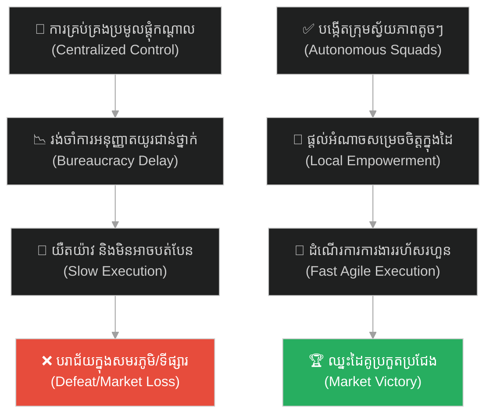
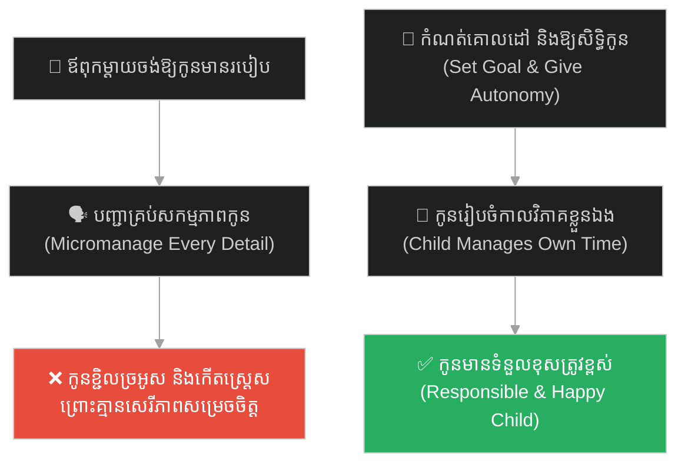
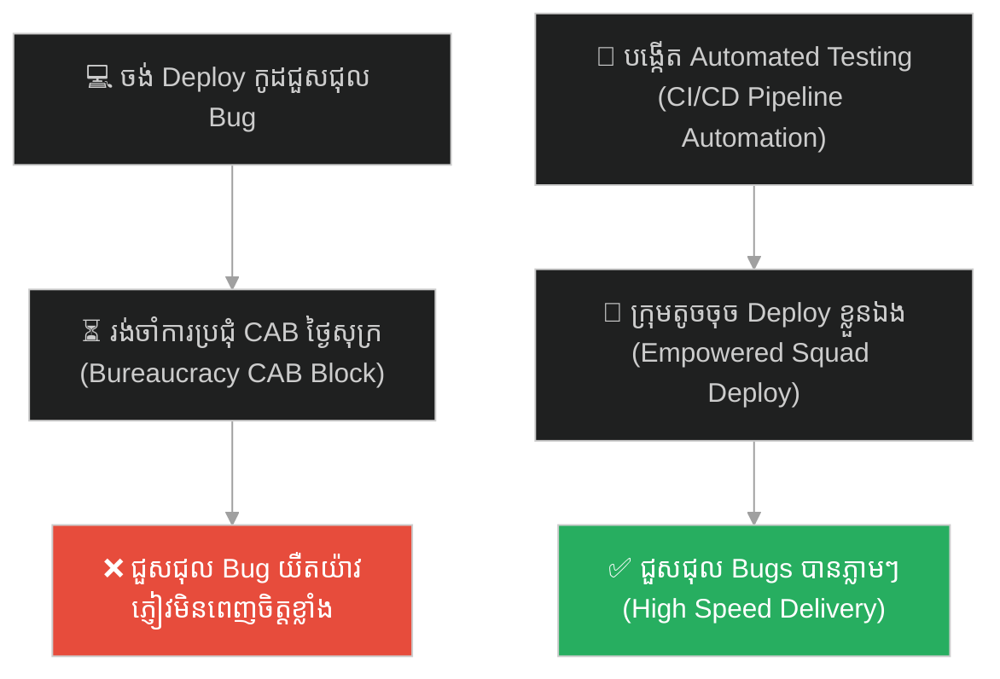
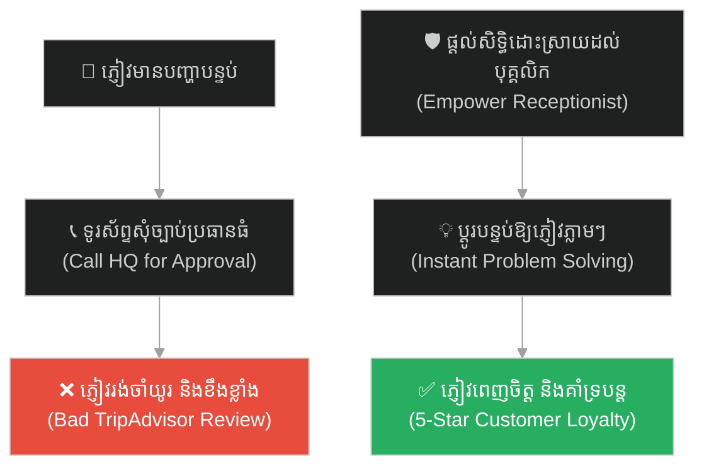
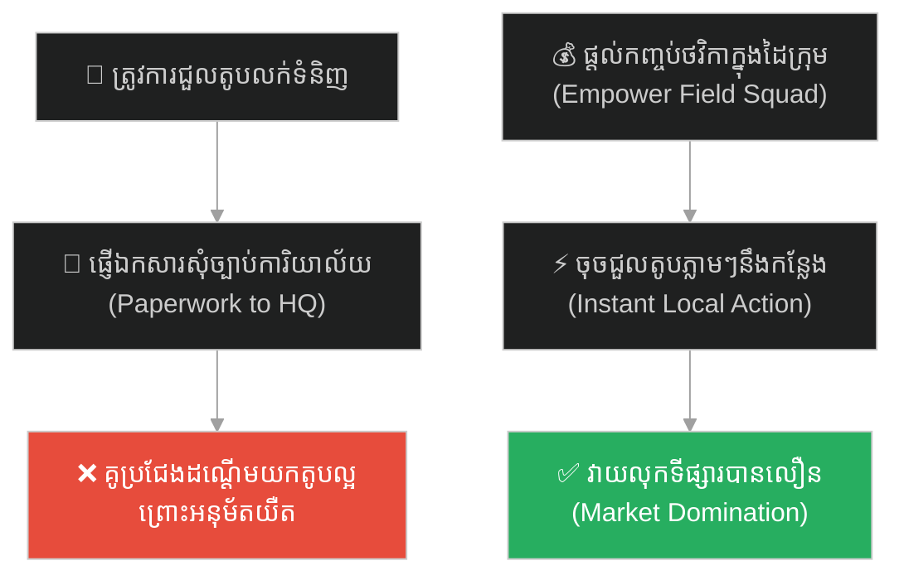
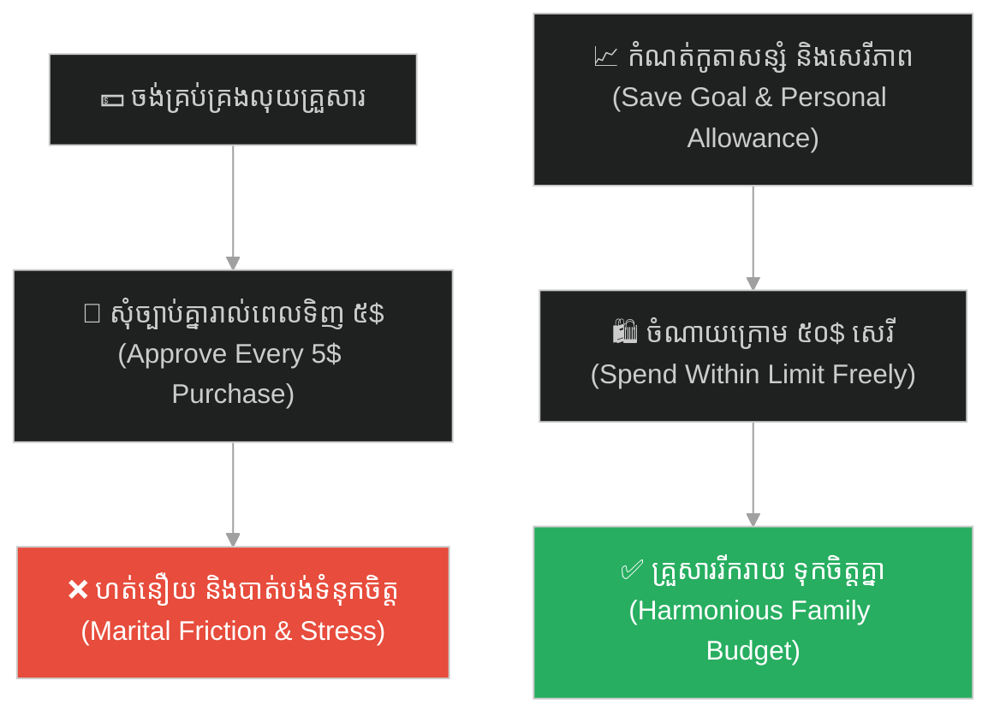
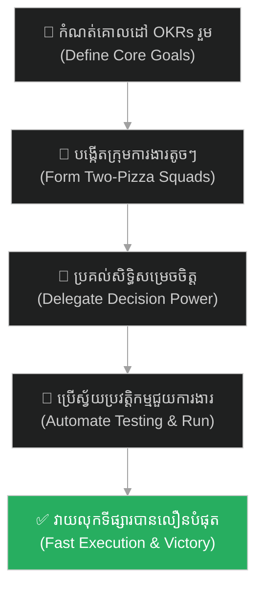

# Agile Methodology (វិធីសាស្ត្ររហ័សរហួន)៖ ហ្ស៊ីងហ្គីសខាន់ និងទ័ពសេះស្រាល ឬក្រុមការងារស្វ័យភាព (Agile & Genghis Khan's Autonomous Squads)

**Author:** ichamrong  
**Date:** 2026-05-27  
**Tags:** #genghis-khan #agile #speed #autonomous-teams #decentralized-decision-making #parable  
**Category:** Concepts / Parables  
**Read Time:** ~15 min  

---

## 📌 មាតិកា (Table of Contents)
- [អន្ទាក់ផ្លូវចិត្ត (The Trap)](#0)
- [១. រឿងព្រេងប្រវត្តិសាស្ត្រ៖ កងទ័ពធ្ងន់អឺរ៉ុប និងល្បឿនផ្លេកបន្ទោររបស់ម៉ុងហ្គោល (The Legend of Genghis Khan's Light Cavalry)](#1)
  - [ស្វ័យភាពក្នុងសមរភូមិ (Autonomy on the Battlefield)](#1-1)
- [២. បញ្ហា៖ ការគ្រប់គ្រងប្រមូលផ្តុំកណ្តាល និងរបាំងការិយាល័យធិបតេយ្យ (The Issue: Centralized Bureaucracy & Lack of Agility)](#2)
- [៣. ឧទាហរណ៍ជាក់ស្តែងក្នុងពិភពពិត (Real World Examples)](#3)
  - [ឧទាហរណ៍ទី ១ — កម្រិតស្រាល (គ្រួសារ)៖ ការបង្វឹកកូនឱ្យសម្រេចចិត្តរៀបចំសកម្មភាពដោយខ្លួនឯង (Empowering Children's Autonomy)](#3-1)
  - [ឧទាហរណ៍ទី ២ — កម្រិតមធ្យម (បច្ចេកទេស)៖ ការលុបចោលគណៈកម្មការអនុម័តការ Deploy មុខងារ (The CAB Meeting Bottleneck)](#3-2)
  - [ឧទាហរណ៍ទី ៣ — កម្រិតមធ្យម (ធុរកិច្ច)៖ ការផ្តល់សិទ្ធិឱ្យបុគ្គលិកជួរមុខដោះស្រាយបញ្ហាភ្ញៀវភ្លាមៗ (First-Line Refund Empowerment)](#3-3)
  - [ឧទាហរណ៍ទី ៤ — កម្រិតមធ្យម (សង្គម/គ្រប់គ្រង)៖ ក្រុមការងាររុករកទីផ្សារគ្មានការិយាល័យកណ្តាល (The Flat Squad Execution)](#3-4)
  - [ឧទាហរណ៍ទី ៥ — កម្រិតធ្ងន់ (ទំនាក់ទំនង)៖ ទំនុកចិត្តលើការចំណាយថវិកាប្រចាំថ្ងៃរបស់ដៃគូជីវិត (The Budget Trust Agreement)](#3-5)
- [៤. ដំណោះស្រាយទូទៅ៖ ការកសាងក្រុមការងារ Cross-Functional និងការគ្រប់គ្រងតាមគោលដៅ (The General Solution: Agile Cross-Functional Squads & Objective-Driven Leadership)](#4)
- [សេចក្តីសន្និដ្ឋាន (Conclusion)](#5)
- [ឯកសារយោង (References)](#6)
- [Related Posts](#7)

---

## អន្ទាក់ផ្លូវចិត្ត (The Trap)

តើអ្នកធ្លាប់ជួបស្ថានភាពដែលក្រុមហ៊ុន ឬនាយកដ្ឋានការងាររបស់អ្នក មានរចនាសម្ព័ន្ធការងារធ្ងន់ធ្ងរ យឺតយ៉ាវ និងការិយាល័យធិបតេយ្យច្រើនជាន់ថ្នាក់ ដែលរាល់ការសម្រេចចិត្តតូចតាចត្រូវរង់ចាំការចុះហត្ថលេខា ឬការអនុម័តពីប្រធានជាន់ខ្ពស់ ធ្វើឱ្យខកខានឱកាសទីផ្សារ និងធ្វើឱ្យគូប្រជែងដណ្តើមយកអតិថិជនអស់ដែរឬទេ?

នៅក្នុងការដឹកនាំ និងការគ្រប់គ្រងគម្រោង៖
* **យើងងាយនឹងកើតមានទំនោរ** ចង់គ្រប់គ្រង និងត្រួតពិនិត្យរាល់ព័ត៌មានលម្អិតពីថ្នាក់លើ (Centralized Micromanagement)។
* **យើងមើលរំលង** ការពិតដែលថា ល្បឿន និងសមត្ថភាពសម្របខ្លួនទាន់ពេល គឺជាអាវុធដ៏មានអំណាចបំផុតនៅក្នុងយុគសម័យដែលមានការប្រកួតប្រជែងខ្ពស់។

ការបណ្តោយឱ្យប្រព័ន្ធរដ្ឋបាលយឺតយ៉ាវបំផ្លាញភាពរហ័សរហួន និងគំនិតច្នៃប្រឌិតរបស់ក្រុមការងារ ហៅថា **អន្ទាក់ Centralized Bureaucracy (លម្អៀងការិយាល័យធិបតេយ្យ)**។

ដើម្បីយល់ដឹងពីវិធីកសាងក្រុមការងារដែលមានភាពរហ័សរហួន និងមានស្វ័យភាពខ្ពស់ នេះជាផែនទីបង្ហាញផ្លូវសម្រាប់អត្ថបទនេះ៖
1. **រឿងព្រេងប្រវត្តិសាស្ត្រ (The Historic Legend)** — យុទ្ធសាស្ត្រទ័ពសេះស្រាលរបស់ហ្ស៊ីងហ្គីសខាន់ យកឈ្នះកងទ័ពធ្ងន់អឺរ៉ុបដោយប្រើស្វ័យភាពសម្រេចចិត្ត។
2. **បញ្ហា (The Issue)** — ភាពផ្ទុយគ្នារវាងប្រព័ន្ធ Micromanagement និងគំនិត Agile / Autonomous Squads។
3. **ឧទាហរណ៍ជាក់ស្តែងក្នុងពិភពពិត (Real World Examples)** — ពិនិត្យមើលអំណាចនៃស្វ័យភាពក្នុងកម្រិតគ្រួសារ ព័ត៌មានវិទ្យា ធុរកិច្ច ការគ្រប់គ្រង និងទំនាក់ទំនង។
4. **ដំណោះស្រាយទូទៅ (The General Solution)** — ការបង្កើតក្រុមការងារ Cross-Functional, ការប្រើប្រាស់ OKRs និងការកាត់បន្ថយពេលវេលាដឹកជញ្ជូន (Lead Time)។

---

## ១. រឿងព្រេងប្រវត្តិសាស្ត្រ៖ កងទ័ពធ្ងន់អឺរ៉ុប និងល្បឿនផ្លេកបន្ទោររបស់ម៉ុងហ្គោល (The Legend of Genghis Khan's Light Cavalry)

នាសតវត្សរ៍ទី ១៣ កងទ័ពរាជាធិបតេយ្យនៅទូទាំងអឺរ៉ុប និងអាស៊ី ត្រូវបានរៀបចំឡើងជាលក្ខណៈចាត់ចែងប្រមូលផ្តុំអំណាចកណ្តាលយ៉ាងតឹងរ៉ឹងបំផុត។

កងទ័ពទាំងនោះធ្វើដំណើរយឺតខ្លាំងណាស់ ពីព្រោះពួកគេត្រូវអូសរទេះដឹកស្បៀងអាហារដ៏ធ្ងន់ៗ គ្រឿងសព្វាវុធដែក កំពែងបិទបាំង និងតង់ប្រណីតៗសម្រាប់ស្តេច និងមេទ័ពធំៗ។ អ្វីដែលកាន់តែអាក្រក់នោះគឺ នៅក្នុងសមរភូមិ មេបញ្ជាការកងពលតូចៗមិនមានសិទ្ធិសម្រេចចិត្តបត់បែនយុទ្ធសាស្ត្រឡើយ។ នៅពេលសត្រូវផ្លាស់ប្តូរទិសដៅវាយប្រហារ ពួកគេត្រូវបញ្ជូនអ្នកនាំសារជិះសេះត្រឡប់ទៅសុំការអនុញ្ញាត និងការសម្រេចចិត្តពីព្រះរាជាដែលនៅខាងក្រោយជាមុនសិន។ វាជាប្រព័ន្ធដឹកនាំការិយាល័យធិបតេយ្យដ៏ធ្ងន់ និងយឺតយ៉ាវបំផុត។

---

### ស្វ័យភាពក្នុងសមរភូមិ (Autonomy on the Battlefield)

ផ្ទុយទៅវិញ កំពូលអធិរាជ **ហ្ស៊ីងហ្គីសខាន់ (Genghis Khan)** បានបង្កើតចក្រភពដីគោកដ៏ធំបំផុតក្នុងប្រវត្តិសាស្ត្រមនុស្សជាតិ ដោយការប្រើប្រាស់យុទ្ធសាស្ត្ររៀបចំកងទ័ពផ្ទុយស្រឡះ។ កងទ័ពម៉ុងហ្គោលគឺជា **ទ័ពសេះស្រាល (Light Cavalry)**។ ពួកគេគ្មានខ្សែរទេះដឹកស្បៀង ឬរទេះបន្ទុកធ្ងន់ៗឡើយ។ ទាហានម៉ុងហ្គោលម្នាក់ៗដំឡើងកូនតង់ផ្ទាល់ខ្លួនតូចមួយ និងដឹកជញ្ជូនតែស្បៀងក្រៀមក្រោះ (សាច់ងៀត និងម្សៅទឹកដោះគោជូរ) តាមខ្លួនដែលអាចហូបចុកបានរាប់សប្តាហ៍។ ដោយសារការលុបចោលបន្ទុកធ្ងន់ទាំងនេះ កងទ័ពម៉ុងហ្គោលអាចធ្វើដំណើរក្នុងល្បឿនលឿនជាងកងទ័ពសត្រូវដល់ទៅ ៥ ដង។ ពួកគេលេចមុខឡើងវាយប្រហារដូចផ្លេកបន្ទោរ និងបាត់ខ្លួនទៅវិញយ៉ាងលឿនមុនពេលសត្រូវអាចរៀបចំក្បួនចម្បាំងរួច។

អាថ៌កំបាំងដ៏អស្ចារ្យបំផុតរបស់ហ្ស៊ីងហ្គីសខាន់ គឺ **«ការផ្តល់អំណាចសម្រេចចិត្តស្វ័យភាព (Decentralized Command)»**។ ท្រង់បានបែងចែកកងទ័ពជាក្រុមរាប់ម៉ឺននាក់ (Tumen) ក្រុមរាប់ពាន់ (Mingghan) ក្រុមរាប់រយ (Jagun) និងក្រុមតូចៗ ១០ នាក់ (Arban)។

មេបញ្ជាការនៃក្រុមនីមួយៗ ត្រូវបានផ្តល់សិទ្ធិសម្រេចចិត្តពេញលេញនៅលើសមរភូមិភ្លាមៗ ដោយមិនបាច់រង់ចាំការបញ្ជូនសារទៅសួរហ្ស៊ីងហ្គីសខាន់ឡើយ។ ពួកគេប្រាស្រ័យទាក់ទងគ្នាដោយប្រើប្រាស់សញ្ញាសំឡេងកញ្ចែ និងព្រួញភ្លើងយ៉ាងសាមញ្ញ។ ហ្ស៊ីងហ្គីសខាន់ គ្រាន់តែប្រាប់ពួកគេពី **«គោលដៅ (What to achieve)»** តែប៉ុណ្ណោះ រីឯ **«របៀបប្រយុទ្ធ និងផ្លូវវាយលុក (How to achieve it)»** គឺទុកឱ្យក្រុមនីមួយៗច្នៃប្រឌិត និងសម្រេចចិត្តដោយខ្លួនឯងតាមស្ថានភាពជាក់ស្តែង។ ស្វ័យភាព និងល្បឿននេះ បានធ្វើឱ្យទ័ពម៉ុងហ្គោលអាចវាយកម្ទេចកងទ័ពអឺរ៉ុបដែលមានកម្លាំងច្រើនជាងរាប់ដងបានយ៉ាងងាយស្រួល។

---

## ២. បញ្ហា៖ ការគ្រប់គ្រងប្រមូលផ្តុំកណ្តាល និងរបាំងការិយាល័យធិបតេយ្យ (The Issue: Centralized Bureaucracy & Lack of Agility)

នៅក្នុងពិភពអភិវឌ្ឍន៍សូហ្វវែរ (Software Development) និងការដឹកនាំគម្រោង រឿងរ៉ាវរបស់កងទ័ពម៉ុងហ្គោល បង្រៀនយើងអំពីអំណាចនៃ **Agile Methodology និង Autonomous Squads**៖

* **អន្ទាក់នៃប្រព័ន្ធធ្ងន់ (The Heavy Baggage Train)៖** ក្រុមហ៊ុន ឬអង្គភាពជាច្រើនដំណើរការដូចកងទ័ពអឺរ៉ុបបុរាណ។ រាល់ពេលដែលចង់បញ្ចេញមុខងារ App ថ្មីទៅកាន់ទីផ្សារ ពួកគេត្រូវរៀបចំការប្រជុំធំ (CAB - Change Advisory Board) ឆ្លងកាត់ការចុះហត្ថលេខាពីប្រធាន ៥ នាក់ និងការរៀបចំឯកសាររាប់រយទំព័រ។ ការិយាល័យធិបតេយ្យនេះធ្វើឱ្យល្បឿនបញ្ចេញផលិតផលយឺតយ៉ាវខ្លាំង រហូតដល់ថ្ងៃដាក់ដំណើរការ គូប្រជែងបានដណ្តើមយកទីផ្សារបាត់ទៅហើយ។
* **ក្រុមការងារស្វ័យភាព (Autonomous Cross-Functional Squads)៖** ជំនួសឱ្យការគ្រប់គ្រងបែបម៉ត់ចត់ (Micromanagement) ក្រុមហ៊ុនបច្ចេកវិទ្យាទំនើបបង្កើតក្រុមតូចៗ (៥ ទៅ ៩ នាក់) ដែលមានទាំង Developer, QA, និង Product Manager រួមគ្នា។ ក្រុមនេះត្រូវបានផ្តល់សិទ្ធិពេញលេញក្នុងការសម្រេចចិត្តរចនាកូដ និង Deploy ផលិតផលដោយខ្លួនឯង តាមរយៈប្រព័ន្ធ CI/CD ស្វ័យប្រវត្ត។
* **ការដឹកនាំតាមគោលដៅ (Objective-Driven Leadership)៖** តួនាទីរបស់ប្រធានក្រុមហ៊ុន ឬ Tech Lead គឺកំណត់ "ចក្ខុវិស័យ និងគោលដៅស្នូល" (ដូចជា កាត់បន្ថយអត្រាចាកចេញរបស់ភ្ញៀវ ២០%) រួចអនុញ្ញាតឱ្យក្រុមការងារស្វែងរកផ្លូវ និងដំណោះស្រាយបច្ចេកទេសដោយខ្លួនឯង ជៀសវាងការប្រាប់កូដមួយបន្ទាត់ៗ។

---

## ៣. ឧទាហរណ៍ជាក់ស្តែងក្នុងពិភពពិត

ដើម្បីយល់ដឹងឱ្យកាន់តែច្បាស់ នេះជាការវិភាគលើឧទាហរណ៍ ៥ កម្រិតផ្សេងគ្នា៖

---

### ឧទាហរណ៍ទី ១ — កម្រិតស្រាល (គ្រួសារ)៖ ការបង្វឹកកូនឱ្យសម្រេចចិត្តរៀបចំសកម្មភាពដោយខ្លួនឯង (Empowering Children's Autonomy)

**ស្ថានភាព៖** ឪពុកម្តាយចង់ឱ្យកូនស្រីអាយុ ១០ ឆ្នាំ រៀបចំបន្ទប់គេង និងពេលវេលារៀនសូត្រឱ្យមានរបៀបរៀបរយ។

* **ជម្រើសខុស (Micromanagement)៖** បញ្ជា និងណែនាំកូនគ្រប់វិនាទី៖ *«កូនត្រូវបត់ភួយឥឡូវនេះ! កូនត្រូវរៀនមេរៀនពីម៉ោង ២ ដល់ម៉ោង ៣! កូនត្រូវស្លៀកខោអាវពណ៌ខៀវនេះ!»*
* **លទ្ធផល៖** កូនមានអារម្មណ៍ធុញទ្រាន់ កើតទំនាស់ចិត្ត លែងចង់ធ្វើការងារដោយខ្លួនឯង និងក្លាយជាមនុស្សគ្មានសមត្ថភាពសម្រេចចិត្តពេលគ្មានឪពុកម្តាយបញ្ជា។
* **ជម្រើសត្រូវ (Agile Empowerment)៖** កំណត់គោលដៅស្នូល៖ *«កូនសម្លាញ់ បន្ទប់គេងរបស់កូនត្រូវតែស្អាត និងលំហាត់សាលាត្រូវតែធ្វើឱ្យរួចរាល់មុនម៉ោង ៧ យប់។ ចំពោះរបៀបរៀបចំ និងពេលវេលា កូនអាចចាត់ចែងដោយខ្លួនឯងបាន។»* កូនមានមោទនភាព ស្វាហាប់ និងរៀបចំខ្លួនបានយ៉ាងល្អឥតខ្ចោះដោយខ្លួនឯង។

---

### ឧទាហរណ៍ទី ២ — កម្រិតមធ្យម (បច្ចេកទេស)៖ ការលុបចោលគណៈកម្មការអនុម័តការ Deploy មុខងារ (The CAB Meeting Bottleneck)

**ស្ថានភាព៖** ក្រុមហ៊ុន Software មានវិស្វករ ៥០ នាក់។ រាល់ពេលដែលចង់ជួសជុល Bug ឬ Deploy កូដថ្មី ត្រូវរង់ចាំការអនុម័តពីគណៈកម្មការធំ (CAB - Change Advisory Board) ដែលប្រជុំតែម្តងគត់រៀងរាល់រសៀលថ្ងៃសុក្រ។

* **ជម្រើសខុស៖** រក្សាទុកប្រព័ន្ធ CAB និងព្យាយាមជួលមនុស្សមកធ្វើស្លាយរបាយការណ៍ និងសម្របសម្រួលប្រជុំឱ្យលឿន (Pointless Optimization)។
* **លទ្ធផល៖** ការជួសជុល Bug តូចៗត្រូវរង់ចាំរាប់ថ្ងៃ វិស្វករធុញទ្រាន់នឹងការិយាល័យធិបតេយ្យ ហើយល្បឿនបញ្ចេញផលិតផលយឺតយ៉ាវខ្លាំង។
* **ជម្រើសត្រូវ៖** រំលាយគណៈកម្មការ CAB ចោល។ បង្កើតប្រព័ន្ធស្វ័យប្រវត្ត (CI/CD Automated Tests) និងផ្តល់សិទ្ធិអំណាចឱ្យក្រុមវិស្វករតូចៗ (Squads) អាចចុច Deploy កូដរបស់ខ្លួនទៅកាន់ Production បានភ្លាមៗនៅពេលកូដនោះឆ្លងកាត់ការតេស្តស្វ័យប្រវត្តរួចរាល់។ ល្បឿនការងារកើនឡើង ១០ ដង។

---

### ឧទាហរណ៍ទី ៣ — កម្រិតមធ្យម (ធុរកិច្ច)៖ ការផ្តល់សិទ្ធិឱ្យបុគ្គលិកជួរមុខដោះស្រាយបញ្ហាភ្ញៀវភ្លាមៗ (First-Line Refund Empowerment)

**ស្ថានភាព៖** សណ្ឋាគារមួយចង់ផ្តល់សេវាកម្មល្អបំផុតដល់ភ្ញៀវទេសចរ។

* **ជម្រើសខុស៖** នៅពេលភ្ញៀវមានបញ្ហាបន្ទប់មិនស្អាត ឬចង់សុំប្តូរបន្ទប់ បុគ្គលិកទទួលភ្ញៀវ (Receptionist) ត្រូវសរសេរសារ ឬទូរស័ព្ទសួរការអនុញ្ញាតពីអ្នកគ្រប់គ្រងតំបន់ (Area Manager) ដែលជារឿយៗរង់ចាំរហូតដល់ព្រឹកស្អែក។
* **លទ្ធផល៖** ភ្ញៀវខឹងសម្បារខ្លាំង ឈររង់ចាំនៅកន្លែងទទួលភ្ញៀវរាប់ម៉ោង រួចសរសេរការរិះគន់ផ្កាយ ១ លើ TripAdvisor បំផ្លាញកេរ្តិ៍ឈ្មោះសណ្ឋាគារ។
* **ជម្រើសត្រូវ៖** ផ្តល់សិទ្ធិស្វ័យភាព (Autonomy) ដល់បុគ្គលិកជួរមុខ៖ *«រាល់ពេលមានភ្ញៀវមិនពេញចិត្ត បុគ្គលិកមានសិទ្ធិសម្រេចចិត្តប្តូរបន្ទប់ ឬផ្តល់ការបញ្ចុះតម្លៃរហូតដល់ ១០០ ដុល្លារភ្លាមៗ ដោយមិនបាច់សុំច្បាប់ថ្នាក់លើឡើយ។»* ភ្ញៀវទទួលបានការដោះស្រាយភ្លាមៗ សប្បាយចិត្ត និងកោតសរសើរ។

---

### ឧទាហរណ៍ទី ៤ — កម្រិតមធ្យម (សង្គម/គ្រប់គ្រង)៖ ក្រុមការងាររុករកទីផ្សារគ្មានការិយាល័យកណ្តាល (The Flat Squad Execution)

**ស្ថានភាព៖** ក្រុមហ៊ុនលក់ទំនិញប្រើប្រាស់ចង់សាកល្បងលក់ផលិតផលថ្មីនៅក្នុងខេត្តឆ្ងាយៗ។

* **ជម្រើសខុស៖** បង្កើតក្រុមការងាររត់ការដោយតម្រូវឱ្យរាល់ផែនការលក់ ការជួលតូប និងការផ្សព្វផ្សាយត្រូវឆ្លងកាត់ការិយាល័យកណ្តាលនៅភ្នំពេញជានិច្ច។
* **លទ្ធផល៖** ព័ត៌មានពីខេត្តទៅភ្នំពេញមានភាពយឺតយ៉ាវ នៅពេលការិយាល័យកណ្តាលអនុម័ត ទីតាំងតូបល្អត្រូវបានគូប្រជែងជួលបាត់ ហើយយុទ្ធនាការលក់បរាជ័យ។
* **ជម្រើសត្រូវ៖** បង្កើត "ក្រុមការងារចល័តម៉ុងហ្គោល" (Autonomous Sales Squad) ដែលមានទាំងអ្នកទីផ្សារ និងបុគ្គលិកលក់ចុះទៅខេត្តផ្ទាល់។ ពួកគេមានកញ្ចប់ថវិកាក្នុងដៃ និងមានអំណាចជួលតូប និងរៀបចំយុទ្ធសាស្ត្រលក់ភ្លាមៗតាមតម្រូវការជាក់ស្តែងរបស់ខេត្តនោះ។ យុទ្ធនាការទទួលបានជោគជ័យយ៉ាងឆាប់រហ័ស។

---

### ឧទាហរណ៍ទី ៥ — កម្រិតធ្ងន់ (ទំនាក់ទំនង)៖ ទំនុកចិត្តលើការចំណាយថវិកាប្រចាំថ្ងៃរបស់ដៃគូជីវិត (The Budget Trust Agreement)

**ស្ថានភាព៖** ប្តីប្រពន្ធចង់គ្រប់គ្រងហិរញ្ញវត្ថុគ្រួសារឱ្យមានតម្លាភាព។

* **ជម្រើសខុស (Micromanagement)៖** តម្រូវឱ្យភាគីម្ខាងទៀតផ្ញើសារសុំការអនុញ្ញាតរាល់ពេលទិញរបស់របរចាប់ពី ៥ ដុល្លារឡើងទៅ (ដូចជា ទិញកាហ្វេ ទិញសាប៊ូ)។
* **លទ្ធផល៖** ពួកគេមានអារម្មណ៍ថប់ដង្ហើម ហត់នឿយនឹងការរាយការណ៍ និងកើតមានការមិនទុកចិត្តគ្នាយ៉ាងខ្លាំងក្នុងជីវិតប្រចាំថ្ងៃ។
* **ជម្រើសត្រូវ (Decentralized Autonomy)៖** កំណត់គោលដៅស្នូល៖ *«យើងត្រូវសន្សំប្រាក់ ៥០០ ដុល្លារក្នុងមួយខែសម្រាប់ទិញផ្ទះ។ ចំពោះការចំណាយផ្ទាល់ខ្លួនប្រចាំថ្ងៃ ក្រោម ៥០ ដុល្លារ ម្នាក់ៗមានសិទ្ធិសម្រេចចិត្តទិញដោយខ្លួនឯង ដោយមិនបាច់សួរនាំ ឬសុំច្បាប់ឡើយ។»* ពួកគេមានក្តីសុខ ជឿជាក់គ្នា និងសន្សំប្រាក់បានតាមផែនការ។

---

## ៤. ដំណោះស្រាយទូទៅ៖ ការកសាងក្រុមការងារ Cross-Functional និងការគ្រប់គ្រងតាមគោលដៅ (The General Solution: Agile Cross-Functional Squads & Objective-Driven Leadership)

ដើម្បីកសាងភាពរហ័សរហួន និងកម្ទេចរបាំងការិយាល័យធិបតេយ្យក្នុងប្រព័ន្ធរបស់អ្នក ត្រូវអនុវត្តវិធីសាស្ត្រគន្លឹះទាំងនេះ៖

### ១. បង្កើតក្រុមការងារចល័តតូចៗ (Cross-Functional Squads)
* រៀបចំរចនាសម្ព័ន្ធក្រុមការងារឱ្យមានសមាជិកចម្រុះជំនាញ (Cross-functional) ក្នុងក្រុមតែមួយ ដើម្បីដោះស្រាយបញ្ហាឱ្យបានលឿនតាំងពីដើមដល់ចប់ ដោយមិនបាច់ផ្ញើការងារឆ្លងកាត់នាយកដ្ឋានផ្សេងគ្នា។
* រក្សាទំហំក្រុមឱ្យនៅសាមញ្ញ (ច្បាប់ភីហ្សា ២ បន្ទះ - Two-Pizza Rule៖ សមាជិកក្រុមមិនត្រូវលើសពីចំនួនមនុស្សដែលអាចញ៉ាំភីហ្សា ២ បន្ទះឆ្អែតឡើយ ពោលគឺចន្លោះពី ៥ ទៅ ៩ នាក់)។

### ២. ដឹកនាំដោយគោលដៅ (Objective-Driven Delegation)
* បញ្ឈប់ការធ្វើ Micromanagement។ តួនាទីរបស់មេដឹកនាំគឺកំណត់ **«អ្វីដែលត្រូវសម្រេច (What & Why)»** ឱ្យបានច្បាស់លាស់ (ឧទាហរណ៍៖ OKRs)។
* ប្រគល់ទំនួលខុសត្រូវ និងសេរីភាពក្នុងការសម្រេចចិត្តលើ **«វិធីធ្វើ (How)»** ទៅឱ្យសមាជិកក្រុមដែលនៅជិតសមរភូមិការងារបំផុត។

### ៣. វាស់វែងល្បឿន Lead Time (កាត់បន្ថយការរង់ចាំ)
* ផ្តោតការយកចិត្តទុកដាក់លើសូចនាករ **«Lead Time»** (ពេលវេលាចាប់តាំងពីគំនិតត្រូវបានបង្កើត រហូតដល់វាត្រូវបានបញ្ចេញដាក់ដំណើរការជាក់ស្តែង)។ ស្វែងរក និងបំផ្លាញរាល់ចំណុចស្ទះរដ្ឋបាលដែលបង្កឱ្យការងារត្រូវរង់ចាំយូរ។

---

## 🐇 ធ្លាក់ចូលក្នុងរន្ធទន្សាយយុទ្ធសាស្ត្រ (Enter the Strategic Rabbit Hole)

ដើម្បីស្វែងយល់បន្ថែមអំពីរបៀបដែលការបែងចែកកិច្ចការងារទៅតាមកម្រិតអាទិភាព និងការអនុវត្តយន្តការសម្រេចចិត្តឱ្យបានត្រឹមត្រូវកំឡុងពេលមានបញ្ហា overload ធ្ងន់ធ្ងរ (ដូចជាការបោះបង់ការងារបន្ទាប់បន្សំចោល ដើម្បីសង្គ្រោះមុខងារស្នូលរបស់ប្រព័ន្ធឱ្យរស់) សូមបន្តដំណើររុករករបស់អ្នក៖

* 🚀 **[ចាប់ផ្តើមដំណើររុករក (Start the Journey) ➔ Apollo 11 and the 1202 Alarm](./56-the-1202-alarm.md)**

---

## សេចក្តីសន្និដ្ឋាន (Conclusion)

> **«កងទ័ពដែលរហ័សរហួនបំផុត នឹងយកឈ្នះកងទ័ពដែលខ្លាំងបំផុតជានិច្ច។ ការផ្តល់អំណាចស្វ័យភាព មិនមែនជាការបាត់បង់ការគ្រប់គ្រងនោះទេ តែវាគឺជាវិធីតែមួយគត់ដើម្បីបង្កើនល្បឿន និងប្រសិទ្ធភាពការងារក្នុងយុគសម័យចលាចល។»**

ចូររៀបចំរចនាសម្ព័ន្ធការងារ អាជីវកម្ម និងជីវិតរបស់អ្នកដោយកម្ចាត់ការិយាល័យធិបតេយ្យឥតប្រយោជន៍ ជឿជាក់លើក្រុមការងារ និងអនុវត្តវិធីសាស្ត្រ Agile ដើម្បីទទួលបានលទ្ធផលការងារលឿន និងជោគជ័យជានិច្ច។

---

## ឯកសារយោង (References)

* **Jeff Sutherland** — *Scrum: The Art of Doing Twice the Work in Half the Time* (2014)។ ការពន្យល់លម្អិតអំពីប្រភពដើម និងវិធីសាស្ត្ររៀបចំក្រុមការងាររហ័សរហួន (Scrum/Agile)។
* **Jack Weatherford** — *Genghis Khan and the Making of the Modern World* (2004)។ កំណត់ត្រាប្រវត្តិសាស្ត្រលម្អិតអំពីយុទ្ធសាស្ត្រចម្បាំង និងរចនាសម្ព័ន្ធស្វ័យភាពរបស់កងទ័ពម៉ុងហ្គោល។
* **Stephen Bungay** — *The Art of Action: How Leaders Close the Gaps between Plans, Actions, and Results* (2011)។ ទ្រឹស្តីស្នូលស្តីពីការដឹកនាំដោយផ្តល់ស្វ័យភាព (Mission Command)។

---

## Related Posts

* **[47 Genghis Khan: Agile Methodology and Autonomous Squads](../articles/47-genghis-khan-and-agile-squads.md)** — អត្ថបទគោលបកស្រាយលម្អិតអំពីការប្រើប្រាស់គំរូទ័ពម៉ុងហ្គោលក្នុងការដឹកនាំក្រុមវិស្វករ។
* **[41 Stanislav Petrov: Human-in-the-Loop and Automated Systems](../articles/41-stanislav-petrov-and-human-in-the-loop.md)** — របៀបបត់បែនការសម្រេចចិត្តក្នុងស្ថានភាពគ្រោះថ្នាក់។
* **[54 Solomon and the Foreign Wives: Dependency Management](./54-the-foreign-wives.md)** — ហានិភ័យនៃការនាំចូលរបស់ពីខាងក្រៅដោយគ្មានការគ្រប់គ្រង។

---
*Last updated: 2026-05-27*

## Related

- [💡 Concepts README](../README.md)
- [📚 Main Repository README](../../../README.md)
- [Developer Habits](../../developer-habits/README.md)
- [Mental Health & Well-being](../../mental-health/README.md)
- [Management & SDLC](../../management/README.md)
