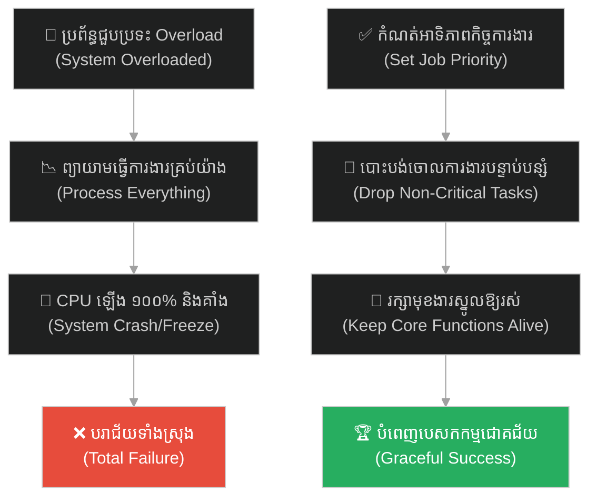
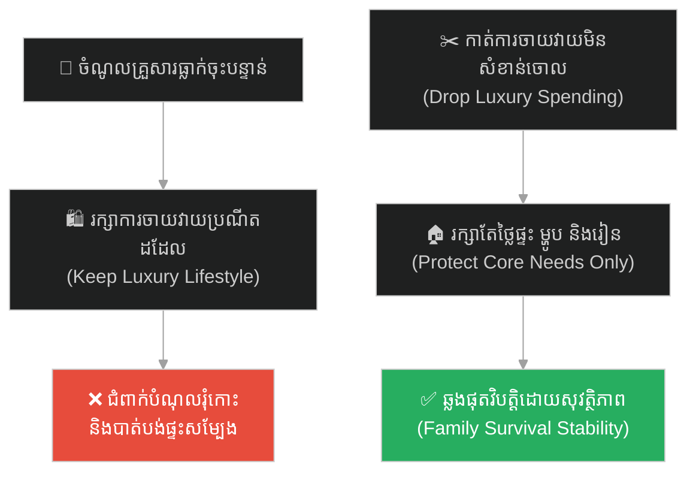
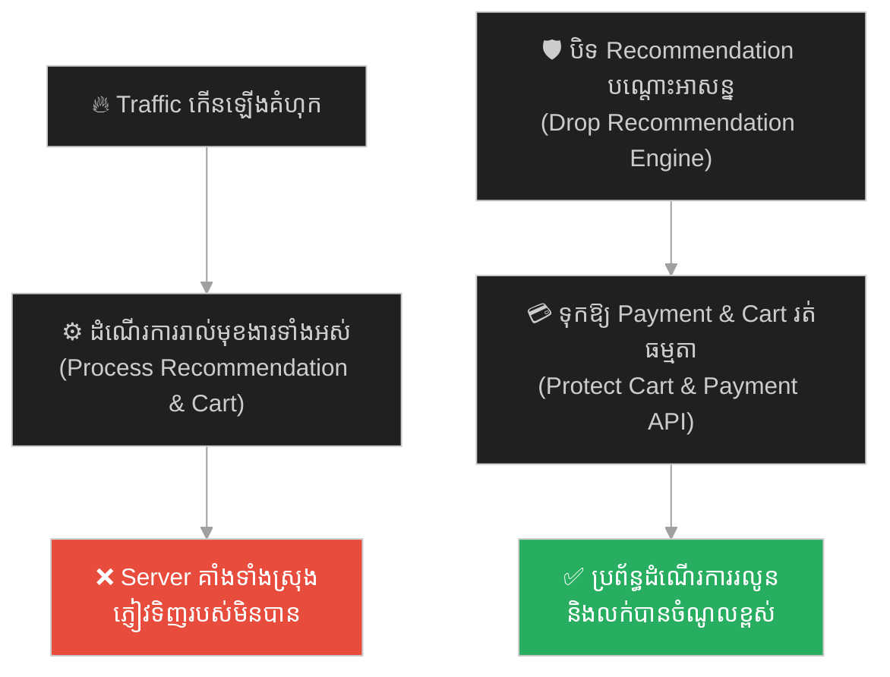
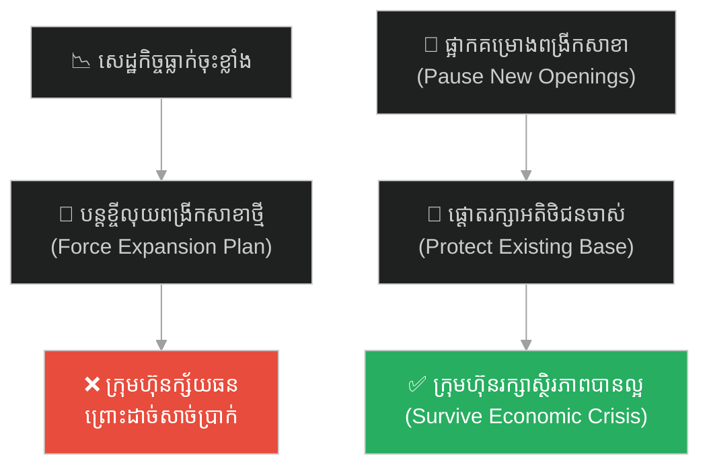
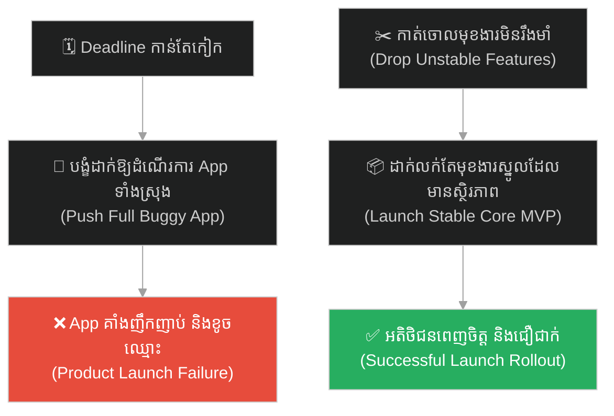
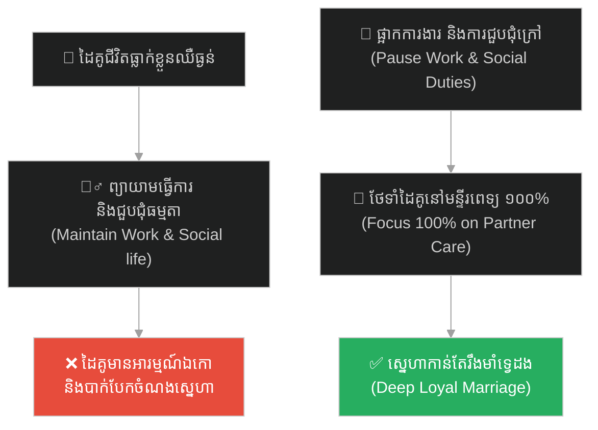
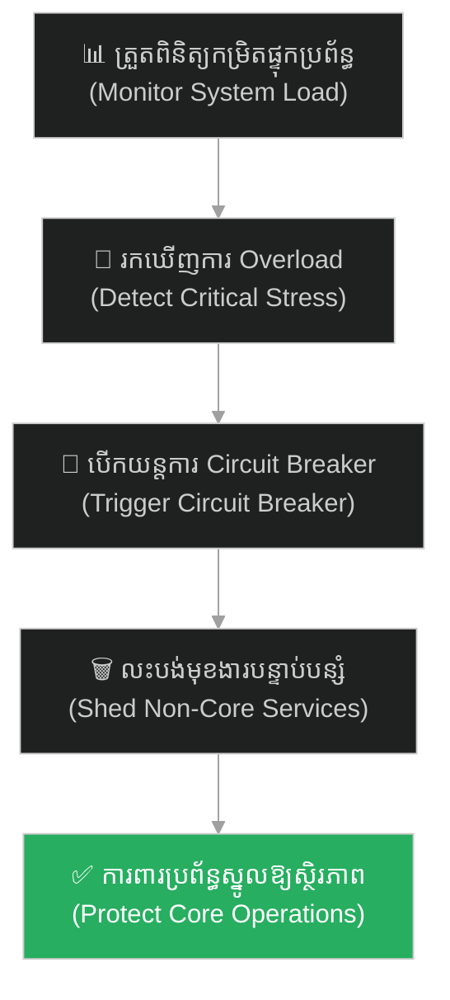

# Graceful Degradation (ការបន្ធូរបន្ថយប្រព័ន្ធដោយសុវត្ថិភាព)៖ អាប៉ូឡូ ១១ និងសញ្ញាប្រកាសអាសន្ន ១២០២ (Graceful Degradation & Apollo 11's 1202 Program Alarm)

**Author:** ichamrong  
**Date:** 2026-05-27  
**Tags:** #apollo11 #graceful-degradation #error-handling #margaret-hamilton #prioritization #resilience #parable  
**Category:** Concepts / Parables  
**Read Time:** ~15 min  

---

## 📌 មាតិកា (Table of Contents)
- [អន្ទាក់ផ្លូវចិត្ត (The Trap)](#0)
- [១. រឿងព្រេងរបស់ណាសា៖ អាប៉ូឡូ ១១ និងកូដព្រមាន ១២០២ នៅវិនាទីចុងក្រោយ (The Legend of Apollo 11's Lunar Landing)](#1)
  - [ភាពអស្ចារ្យនៃកូដរបស់ Margaret Hamilton (The Priority Scheduling Code)](#1-1)
- [២. បញ្ហា៖ គ្រោះថ្នាក់នៃការគាំងប្រព័ន្ធទាំងស្រុង និងសិល្បៈនៃការលះបង់ (The Issue: System Crash vs. Safe Degradation)](#2)
- [៣. ឧទាហរណ៍ជាក់ស្តែងក្នុងពិភពពិត (Real World Examples)](#3)
  - [ឧទាហរណ៍ទី ១ — កម្រិតស្រាល (គ្រួសារ)៖ ការកាត់បន្ថយការចំណាយមិនចាំបាច់កំឡុងពេលជួបវិបត្តិហិរញ្ញវត្ថុ (Family Emergency Budget Cuts)](#3-1)
  - [ឧទាហរណ៍ទី ២ — កម្រិតមធ្យម (បច្ចេកទេស)៖ ការបិទមុខងារ Recommendation របស់ Web e-Commerce ពេលមាន Traffic ខ្ពស់ (Dropping Non-Core API Services)](#3-2)
  - [ឧទាហរណ៍ទី ៣ — កម្រិតមធ្យម (ធុរកិច្ច)៖ ការផ្អាកពង្រីកសាខាថ្មី ដើម្បីផ្តោតលើការរក្សាអតិថិជនចាស់ក្នុងសម័យវិបត្តិសេដ្ឋកិច្ច (Business Survival Focus)](#3-3)
  - [ឧទាហរណ៍ទី ៤ — កម្រិតមធ្យម (សង្គម/គ្រប់គ្រង)៖ ការលះបង់មុខងារបន្ទាប់បន្សំដើម្បីសង្គ្រោះគម្រោងឱ្យទាន់ Deadline (Cutting Features for Core MVP Launch)](#3-4)
  - [ឧទាហរណ៍ទី ៥ — កម្រិតធ្ងន់ (ទំនាក់ទំនង)៖ ការផ្អាករាល់កិច្ចការផ្ទះ និងការងារក្រៅ ដើម្បីថែទាំដៃគូជីវិតដែលឈឺធ្ងន់ (Pausing Chores during Illness)](#3-5)
- [៤. ដំណោះស្រាយទូទៅ៖ ការកំណត់ Load Shedding, Rate Limiting និងយន្តការ Fail-Safe (The General Solution: Rate Limiting, Load Shedding & Fallback Strategies)](#4)
- [សេចក្តីសន្និដ្ឋាន (Conclusion)](#5)
- [ឯកសារយោង (References)](#6)
- [Related Posts](#7)

---

<a id="0"></a>
## អន្ទាក់ផ្លូវចិត្ត (The Trap)

តើអ្នកធ្លាប់ជួបស្ថានភាពដែលប្រព័ន្ធការងារ ឬជីវិតផ្ទាល់ខ្លួនរបស់អ្នក ជួបប្រទះការផ្ទុកលើសទម្ងន់ (Overload) យ៉ាងធ្ងន់ធ្ងរ រួចព្យាយាមសម្រេចរាល់កិច្ចការងារទាំងអស់ក្នុងពេលតែមួយ ដែលចុងក្រោយធ្វើឱ្យប្រព័ន្ធទាំងមូលត្រូវគាំង គំនិតគាំងស្ទះ និងដួលរលំទាំងស្រុងដែរឬទេ?

នៅក្នុងការរចនាប្រព័ន្ធ និងការគ្រប់គ្រង៖
* **យើងងាយនឹងរចនាប្រព័ន្ធបែបផុយស្រួយ** (Fragile Design) ដែលរំពឹងថានឹងដំណើរការល្អគ្រប់ពេលវេលា ប៉ុន្តែគាំងទាំងស្រុងនៅពេលជួប overload។
* **យើងមើលរំលង** យន្តការលះបង់កិច្ចការបន្ទាប់បន្សំ ដើម្បីការពារមុខងារស្នូលឱ្យរស់រានមានជីវិត (Graceful Degradation)។

ការបណ្តោយឱ្យការខ្វះការកំណត់អាទិភាពក្នុងស្ថានភាពOverload នាំទៅរកការគាំងប្រព័ន្ធទាំងស្រុង ហៅថា **អន្ទាក់ Overload Crash (លម្អៀងការផ្ទុកលើសទម្ងន់)**។

ដើម្បីយល់ដឹងពីសិល្បៈនៃការបន្ធូរបន្ថយប្រព័ន្ធដោយសុវត្ថិភាព និងការការពារប្រតិបត្តិការស្នូល នេះជាផែនទីបង្ហាញផ្លូវសម្រាប់អត្ថបទនេះ៖
1. **រឿងព្រេងប្រវត្តិសាស្ត្រ (The Historic Legend)** — បេសកកម្មចុះចតលើព្រះច័ន្ទរបស់អាប៉ូឡូ ១១ និងកូដកុំព្យូទ័ររបស់លោកស្រី Margaret Hamilton ដែលបានសង្គ្រោះជីវិតអវកាសយានិក។
2. **បញ្ហា (The Issue)** — តើអ្វីទៅជា Graceful Degradation និងរបៀបដែលវាជួយការពារប្រព័ន្ធពីការគាំងធំ (Crash)?
3. **ឧទាហរណ៍ជាក់ស្តែងក្នុងពិភពពិត (Real World Examples)** — ពិនិត្យមើលសិល្បៈនៃការលះបង់នេះក្នុងកម្រិតគ្រួសារ ព័ត៌មានវិទ្យា ធុរកិច្ច ការគ្រប់គ្រង និងទំនាក់ទំនង។
4. **ដំណោះស្រាយទូទៅ (The General Solution)** — ការអនុវត្តយន្តការ Load Shedding (កាត់ចោលកិច្ចការមិនសំខាន់) និង Circuit Breakers ក្នុងវិស្វកម្ម។



---

<a id="1"></a>
## ១. រឿងព្រេងរបស់ណាសា៖ អាប៉ូឡូ ១១ និងកូដព្រមាន ១២០២ នៅវិនាទីចុងក្រោយ (The Legend of Apollo 11's Lunar Landing)

នៅថ្ងៃទី ២០ ខែកក្កដា ឆ្នាំ ១៩៦៩ ពិភពលោកទាំងមូលកំពុងសម្លឹងមើលយានចុះចតលើព្រះច័ន្ទ (Eagle) របស់បេសកកម្ម **Apollo 11 (អាប៉ូឡូ ១១)** ធ្វើដំណើរចុះចតលើផ្ទៃព្រះច័ន្ទជាលើកដំបូងបំផុតក្នុងប្រវត្តិសាស្ត្រមនុស្សជាតិ។

នៅសល់តែ ៣ នាទីទៀតប៉ុណ្ណោះ មុនពេលយាននឹងប៉ះផ្ទៃព្រះច័ន្ទ។ អវកាសយានិក Neil Armstrong និង Buzz Aldrin កំពុងប្រមូលផ្តុំស្មារតីបញ្ជាយានទាំងបែកញើសជោកថ្ងាស។ ស្រាប់តែពេលនោះ កុំព្យូទ័របញ្ជាយាន (Apollo Guidance Computer - AGC) បានលោតស៊ីរ៉ែនពណ៌លឿង និងប្រកាសអាសន្នខ្លាំងៗ ដោយបង្ហាញលេខកូដ៖ **«1202 Program Alarm»**។

អវកាសយានិកទាំងពីរកើតមានភាពភ័យស្លន់ស្លោភ្លាមៗ ព្រោះពួកគេមិនដែលជួបប្រទះកូដព្រមាននេះនៅក្នុងការហ្វឹកហាត់កាលពីមុនឡើយ។

ការពិតគឺ កុំព្យូទ័រយានកំពុងទទួលរងការផ្ទុកទិន្នន័យលើសទម្ងន់ (Overloaded) យ៉ាងធ្ងន់ធ្ងរ។ កុងតាក់រ៉ាដាបម្រុង (Rendezvous Radar) ត្រូវបានបើកដោយចៃដន្យ ធ្វើឱ្យរ៉ាដានោះផ្ញើទិន្នន័យគណនាទីតាំងរាប់ពាន់ជួរក្នុងមួយវិនាទីទៅឱ្យកុំព្យូទ័រ ដែលជាទិន្នន័យមិនចាំបាច់សោះសម្រាប់ការចុះចតរបស់យាន Eagle។ CPU របស់កុំព្យូទ័រកើនឡើងដល់ ១០០%។ ប្រសិនបើកុំព្យូទ័រគាំង (Crash) ឬដំណើរការយឺត (Freeze) យាននឹងលែងដំណើរការប្រព័ន្ធតម្រង់ទិស ហើយធ្លាក់បោកផ្ទៃព្រះច័ន្ទស្លាប់អវកាសយានិកទាំងពីរជាមិនខាន។

---

<a id="1-1"></a>
### ភាពអស្ចារ្យនៃកូដរបស់ Margaret Hamilton (The Priority Scheduling Code)

ប៉ុន្តែ យាន Eagle មិនបានធ្លាក់ឡើយ។ ផ្ទុយទៅវិញ វាបានចុះចតយ៉ាងរលូនឥតខ្ចោះនៅលើតំបន់សមុទ្រស្ងប់ស្ងាត់ (Sea of Tranquility)។

មូលហេតុដែលយានអាចរួចជីវិត គឺដោយសារតែប្រធានផ្នែកវិស្វកម្មសូហ្វវែរអវកាស អ្នកស្រី **Margaret Hamilton (ម៉ាហ្គារ៉េត ហាមីលតុន)** និងក្រុមការងាររបស់លោកស្រី បានសរសេរកូដប្រព័ន្ធកុំព្យូទ័រ AGC ឡើង ដោយប្រើប្រាស់គោលការណ៍ **«Asynchronous Executive / Priority Scheduling (ការកំណត់លំដាប់អាទិភាពការងារ)»**។

```
[កុំព្យូទ័រ Overload (CPU 100%)]
         |
         v
[កូដ Margaret Hamilton ត្រួតពិនិត្យ]
         |
         +---> (អាទិភាពទាប) គណនារ៉ាដា  ----> [ 🗑️ លុបចោល / Drop ]
         |
         +---> (អាទិភាពខ្ពស់) បញ្ជា thrusters --> [ ⚙️ អនុវត្តភ្លាម / Keep Alive ]
```

នៅពេលកុំព្យូទ័ររកឃើញថាខ្លួនឯងកំពុងដំណើរការលើសទម្ងន់ (កូដ ១២០២) កូដរបស់លោកស្រី Hamilton មិនបានបណ្តោយឱ្យប្រព័ន្ធគាំង ឬលោត Error ពណ៌ខៀវដូចកុំព្យូទ័រទូទៅឡើយ។ ប្រព័ន្ធកូដរបស់លោកស្រីបានសម្រេចចិត្តភ្លាមៗ៖  
> *«ខ្ញុំកំពុងរវល់ខ្លាំងណាស់ ខ្ញុំត្រូវតែបោះបង់ (Drop) រាល់កិច្ចការងារដែលមានអាទិភាពទាបចោលទាំងអស់ (ដូចជាការគណនាទិន្នន័យរ៉ាដាបម្រុង) រួចប្រមូលកម្លាំង CPU ទាំងស្រុងទៅធ្វើតែកិច្ចការងារដែលមានអាទិភាពខ្ពស់បំផុតតែមួយគត់ គឺការបញ្ជាម៉ាស៊ីនរ៉ុក្កែតឱ្យចុះចត។»*

ប្រព័ន្ធកុំព្យូទ័របានលុបចោលកិច្ចការបន្ទាប់បន្សំដោយស្វ័យប្រវត្ត (Load Shedding) រក្សាមុខងារស្នូលឱ្យរស់ និងអនុញ្ញាតឱ្យមនុស្សជាតិអាចបោះជំហានលើផ្ទៃព្រះច័ន្ទបានដោយជោគជ័យ។

---

<a id="2"></a>
## ២. បញ្ហា៖ គ្រោះថ្នាក់នៃការគាំងប្រព័ន្ធទាំងស្រុង និងសិល្បៈនៃការលះបង់ (The Issue: System Crash vs. Safe Degradation)

នៅក្នុងពិភពវិស្វកម្មសូហ្វវែរ និងការគ្រប់គ្រង គោលការណ៍ **Graceful Degradation (ការបន្ធូរបន្ថយប្រព័ន្ធដោយសុវត្ថិភាព)** គឺជាខែលការពារដ៏រឹងមាំបំផុត៖

* **សិល្បៈនៃការលះបង់ (Load Shedding)៖** ប្រព័ន្ធដែលរចនាឡើងយ៉ាងល្អ មិនមែនជាប្រព័ន្ធដែលសង្ឃឹមថានឹងមិនមានថ្ងៃខូចខាតនោះទេ តែវាជាប្រព័ន្ធដែលដឹងថាពេលណាត្រូវ "លះបង់របស់តូចដើម្បីការពាររបស់ធំ"។ នៅពេលប្រព័ន្ធជួបប្រទះការផ្ទុកលើសទម្ងន់ (High Traffic/Peak Load) វាត្រូវតែកម្ចាត់ចោលរាល់កិច្ចការបន្ទាប់បន្សំជាបន្ទាន់។
* **កុំឱ្យប្រព័ន្ធគាំងទាំងស្រុង (Avoid Monolithic Crash)៖** ប្រសិនបើអ្នកសរសេរកម្មវិធីធនាគារ ហើយមុខងារ "បង្ហាញរូបតំណាងគណនី (Profile Image)" មានបញ្ហាគាំង កុំបណ្តោយឱ្យវាទាញកម្មវិធីទាំងមូលឱ្យគាំងតាម។ ត្រូវសរសេរកូដរុំព័ទ្ធវា (Fail-Safe wrapper) បិទមុខងារនោះចោលបណ្តោះអាសន្ន រួចអនុញ្ញាតឱ្យអតិថិជនបន្តផ្ទេរប្រាក់បានធម្មតា។
* **កំណត់ core business logic ឱ្យច្បាស់៖** ត្រូវសួរសំណួរជានិច្ចថា៖ *«តើអ្វីទៅជាយានចុះចត (Core engine) របស់អាជីវកម្មយើង?»* នៅក្នុង e-commerce វាគឺ Payment API នៅក្នុងការទំនាក់ទំនងវាគឺ Chat Sending API។ រក្សាវាឱ្យរស់ ទោះបីត្រូវបិទចោលមុខងារផ្សេងទៀតទាំងអស់ក៏ដោយ។

---

<a id="3"></a>
## ៣. ឧទាហរណ៍ជាក់ស្តែងក្នុងពិភពពិត

ដើម្បីយល់ដឹងឱ្យកាន់តែច្បាស់ នេះជាការវិភាគលើឧទាហរណ៍ ៥ កម្រិតផ្សេងគ្នា៖

---

<a id="3-1"></a>
### ឧទាហរណ៍ទី ១ — កម្រិតស្រាល (គ្រួសារ)៖ ការកាត់បន្ថយការចំណាយមិនចាំបាច់កំឡុងពេលជួបវិបត្តិហិរញ្ញវត្ថុ (Family Emergency Budget Cuts)

**ស្ថានភាព៖** គ្រួសារមួយមានប្រាក់ចំណូលធ្លាក់ចុះជាបន្ទាន់ ព្រោះឪពុកបាត់បង់ការងារធ្វើ។

* **ជម្រើសខុស (No Degradation)៖** ព្យាយាមរក្សាទម្លាប់ចាយវាយរាល់ថ្ងៃដដែល (ដូចជា ញ៉ាំអាហារហាង ដើរលេងចុងសប្តាហ៍ ទិញខោអាវម៉ាក) ព្រោះមិនចង់ឱ្យបាត់បង់កិត្តិយស ឬទម្លាប់។
* **លទ្ធផល៖** ក្នុងរយៈពេលតែ ៣ ខែ គ្រួសារធ្លាក់ខ្លួនជំពាក់បំណុលគេរុំកោះ គ្មានលុយបង់ថ្លៃផ្ទះ និងថ្លៃសាលារបស់កូន ធ្វើឱ្យគ្រួសារត្រូវជួបការបាក់បែក និងបាត់បង់លំនៅដ្ឋាន។
* **ជម្រើសត្រូវ (Graceful Degradation)៖** កាត់បន្ថយការចំណាយមិនចាំបាច់ចោលភ្លាមៗ (Load Shedding)៖ ផ្អាកការដើរលេង និងការញ៉ាំអាហារក្រៅផ្ទះទាំងអស់ រក្សាការចាយវាយតែទៅលើ "តម្រូវការស្នូល" (ថ្លៃជួលផ្ទះ ម្ហូបអាហារសាមញ្ញ និងថ្លៃសាលាកូន)។ គ្រួសារអាចឆ្លងកាត់វិបត្តិរយៈពេល ១ ឆ្នាំដោយសុវត្ថិភាព រហូតដល់ឪពុករកការងារថ្មីបាន។



---

<a id="3-2"></a>
### ឧទាហរណ៍ទី ២ — កម្រិតមធ្យម (បច្ចេកទេស)៖ ការបិទមុខងារ Recommendation របស់ Web e-Commerce ពេលមាន Traffic ខ្ពស់ (Dropping Non-Core API Services)

**ស្ថានភាព៖** វេបសាយលក់ទំនិញអនឡាញជួបប្រទះការផ្ទុកលើសទម្ងន់ (Overloaded Server) ក្នុងអំឡុងពេលលក់ទំនិញបញ្ចុះតម្លៃពាក់កណ្តាលអធ្រាត្រ Black Friday។

* **ជម្រើសខុស៖** បណ្តោយឱ្យ Server ព្យាយាមគណនា និងដំណើរការរាល់មុខងារទាំងអស់ (ដូចជា គណនាទំនិញដែលភ្ញៀវប្រហែលជាចូលចិត្ត - Recommendation Engine, គណនាចំណាត់ថ្នាក់ផ្កាយ - Review Rating) សម្រាប់ភ្ញៀវរាប់លាននាក់។
* **លទ្ធផល៖** CPU របស់ database ឡើងដល់ ១០០% ធ្វើឱ្យវេបសាយគាំងទាំងស្រុង (Error 504)។ ភ្ញៀវមិនអាចចុចទិញទំនិញ ឬកាត់លុយបានឡើយ ក្រុមហ៊ុនបាត់បង់ចំណូលរាប់លានដុល្លារក្នុងរយៈពេលតែប៉ុន្មាននាទី។
* **ជម្រើសត្រូវ៖** បង្កើតយន្តការស្វ័យប្រវត្ត (Circuit Breaker)។ នៅពេល CPU ឡើងហួសពី ៨៥% ប្រព័ន្ធនឹងលះបង់ (Drop) មុខងារ "Recommendation Engine" និង "Review Rating" ឱ្យលោតចេញជាសញ្ញាទទេជាបណ្តោះអាសន្ន រួចប្រមូលកម្លាំង Database ទាំងស្រុងឱ្យទៅដំណើរការតែ "Cart" និង "Payment API" ប៉ុណ្ណោះ។ វេបសាយដំណើរការធម្មតា និងលក់ទំនិញបានជោគជ័យ។



---

<a id="3-3"></a>
### ឧទាហរណ៍ទី ៣ — កម្រិតមធ្យម (ធុរកិច្ច)៖ ការផ្អាកពង្រីកសាខាថ្មី ដើម្បីផ្តោតលើការរក្សាអតិថិជនចាស់ក្នុងសម័យវិបត្តិសេដ្ឋកិច្ច (Business Survival Focus)

**ស្ថានភាព៖** ក្រុមហ៊ុនលក់រាយមួយ កំពុងរៀបចំផែនការពង្រីកសាខាថ្មីចំនួន ១០ បន្ថែមទៀត ប៉ុន្តែស្រាប់តែសេដ្ឋកិច្ចធ្លាក់ចុះខ្លាំង និងមានអតិផរណាខ្ពស់។

* **ជម្រើសខុស៖** បន្តអនុវត្តយុទ្ធនាការពង្រីកសាខាថ្មីដដែលទាំងប្រថុយប្រថាន ដោយការខ្ចីបុលធនាគារបន្ថែម និងមិនអើពើនឹងការធ្លាក់ចុះអតិថិជនចាស់។
* **លទ្ធផល៖** សាខាថ្មីគ្មានភ្ញៀវចូលទិញ សាច់ប្រាក់ក្រុមហ៊ុនត្រូវដាច់ (Out of Cash) សាខាចាស់ក៏ត្រូវដួលរលំតាម ធ្វើឱ្យក្រុមហ៊ុនត្រូវក្ស័យធនទាំងស្រុង។
* **ជម្រើសត្រូវ៖** ផ្អាកផែនការពង្រីកសាខាថ្មីទាំងអស់ជាបន្ទាន់ (Abort Expansion)។ ប្រមូលផ្តុំកម្លាំងបុគ្គលិក និងធនធានហិរញ្ញវត្ថុទាំងអស់ ឱ្យទៅថែទាំ និងរក្សាអតិថិជនចាស់ដែលកំពុងមានស្រាប់ ព្រមទាំងកាត់បន្ថយការចំណាយរដ្ឋបាលមិនចាំបាច់។ ក្រុមហ៊ុនរក្សាបានស្ថិរភាពសាច់ប្រាក់ និងរស់រានមានជីវិតឆ្លងផុតសម័យវិបត្តិ។



---

<a id="3-4"></a>
### ឧទាហរណ៍ទី ៤ — កម្រិតមធ្យម (សង្គម/គ្រប់គ្រង)៖ ការលះបង់មុខងារបន្ទាប់បន្សំដើម្បីសង្គ្រោះគម្រោងឱ្យទាន់ Deadline (Cutting Features for Core MVP Launch)

**ស្ថានភាព៖** ក្រុមការងារសរសេរកម្មវិធីត្រូវដាក់ឱ្យដំណើរការ App ថ្មីមួយនៅថ្ងៃចន្ទសប្តាហ៍ក្រោយ ប៉ុន្តែកូដមាន bugs ជាច្រើនដែលដោះស្រាយមិនទាន់រួចរាល់។

* **ជម្រើសខុស៖** បង្ខំឱ្យបុគ្គលិកធ្វើការដាច់យប់ដើម្បីដោះស្រាយ bugs ទាំងអស់ និងព្យាយាមរុញច្រាន App ដែលមានមុខងារពេញលេញ (តែគ្មានស្ថិរភាព) ទៅកាន់ទីផ្សារឱ្យទាន់ពេលវេលា។
* **លទ្ធផល៖** App ដាក់ដំណើរការមកពោរពេញដោយកំហុស គាំងរាល់ពេលភ្ញៀវចុចទិញ ធ្វើឱ្យភ្ញៀវខឹង និងលុប App ចោល គម្រោងទទួលបរាជ័យទាំងស្រុង។
* **ជម្រើសត្រូវ៖** សម្រេចចិត្តលះបង់ (Drop Features)។ ផ្អាក និងលាក់មុខងារបន្ទាប់បន្សំទាំងអស់ដែលមិនទាន់មានស្ថិរភាព (ដូចជា មុខងារ Dark mode, មុខងារ Filter ស្មុគស្មាញ)។ ដាក់ដំណើរការតែ App ដែលមាន "មុខងារស្នូលតែមួយគត់" គឺការចុះឈ្មោះ និងការជ្រើសរើសទំនិញ ដែលដំណើរការយ៉ាងរឹងមាំល្អ (Stable MVP)។ កម្មវិធីទទួលបានការគាំទ្រ និងបន្តបន្ថែមមុខងារផ្សេងទៀតតាមក្រោយ។



---

<a id="3-5"></a>
### ឧទាហរណ៍ទី ៥ — កម្រិតធ្ងន់ (ទំនាក់ទំនង)៖ ការផ្អាករាល់កិច្ចការផ្ទះ និងការងារក្រៅ ដើម្បីថែទាំដៃគូជីវិតដែលឈឺធ្ងន់ (Pausing Chores during Illness)

**ស្ថានភាព៖** ដៃគូជីវិត (ប្រពន្ធ) ស្រាប់តែធ្លាក់ខ្លួនឈឺធ្ងន់ត្រូវចូលសម្រាកព្យាបាលនៅមន្ទីរពេទ្យ រីឯប្តីមានគម្រោងការងារធំនៅក្រុមហ៊ុន និងមានការជួបជុំមិត្តភក្តិ។

* **ជម្រើសខុស (Try to do everything)៖** ប្តីព្យាយាមធ្វើការងារការិយាល័យឱ្យបាន ១០០% រត់ទៅជួបជុំមិត្តភក្តិ និងឆ្លៀតមកមើលប្រពន្ធត្រឹមតែ ១០ នាទី ព្រោះមិនចង់ឱ្យបាត់បង់ការងារ ឬទំនាក់ទំនងសង្គម។
* **លទ្ធផល៖** ប្តីមានភាពហត់នឿយខ្លាំង កើតស្រ្តេសធ្វើការងារខុស ដៃគូជីវិតមានអារម្មណ៍ត្រូវបានបោះបង់ចោលក្នុងគ្រាកម្សត់ បំផ្លាញក្តីស្រឡាញ់ និងបង្កជាស្រមោលខ្មៅក្នុងជីវិតអាពាហ៍ពិពាហ៍។
* **ជម្រើសត្រូវ៖** អនុវត្តការលះបង់ (Graceful Degradation)។ សុំច្បាប់សម្រាកពីការងារ ឬប្រគល់ការងារខ្លះឱ្យមិត្តរួមការងារជួយ ផ្អាករាល់ការជួបជុំសង្គមទាំងអស់ចោល រួចចំណាយពេល ១០០% ទៅក្បែរ និងថែទាំប្រពន្ធនៅមន្ទីរពេទ្យ។ ប្រពន្ធជាសះស្បើយឡើងវិញដោយក្តីរំភើប និងដឹងគុណ ធ្វើឱ្យចំណងស្នេហាកាន់តែរឹងមាំទ្វេដង។



---

<a id="4"></a>
## ៤. ដំណោះស្រាយទូទៅ៖ ការកំណត់ Load Shedding, Rate Limiting និងយន្តការ Fail-Safe (The General Solution: Rate Limiting, Load Shedding & Fallback Strategies)

ដើម្បីការពារប្រព័ន្ធការងារ និងជីវិតរបស់អ្នកពីការដួលរលំកំឡុងពេលជួបប្រទះការផ្ទុកលើសទម្ងន់ ត្រូវអនុវត្តវិធីសាស្ត្រគន្លឹះទាំងនេះ៖

### ១. កំណត់មុខងារស្នូល (Identify the Core Engine)
* រៀបចំបញ្ជីមុខងារ ឬកិច្ចការងារទាំងអស់ រួចបែងចែកលំដាប់អាទិភាពឱ្យបានច្បាស់លាស់ (Priority 1 = មិនអាចខ្វះបាន, Priority 2 = សំខាន់, Priority 3 = បន្ទាប់បន្សំ)។
* បង្កើតយន្តការបិទ ឬផ្អាកកិច្ចការ Priority 3 ជាបន្ទាន់នៅពេលប្រព័ន្ធជួបប្រទះភាពអាសន្ន។

### ២. បន្ថែមឧបករណ៍បង្អាក់ស្វ័យប្រវត្ត (Circuit Breaker Design)
* នៅក្នុងកូដ ឬប្រព័ន្ធគ្រប់គ្រង ត្រូវដាក់លក្ខខណ្ឌត្រួតពិនិត្យសុខភាពប្រព័ន្ធជាប្រចាំ។ ប្រសិនបើកម្រិតស្រ្តេស ឬការផ្ទុកឡើងហួសដែនកំណត់ (Threshold) ប្រព័ន្ធត្រូវតែផ្តាច់ ឬបិទមុខងារខ្លះដោយស្វ័យប្រវត្តភ្លាមៗ (Fail-Safe fallback) ដើម្បីការពារកុំឱ្យម៉ាស៊ីនគាំងទាំងស្រុង។

### ៣. អនុវត្តយន្តការ Rate Limiting (ការការពារច្រកចូល)
* កុំបណ្តោយឱ្យរាល់សំណើទាំងអស់ចូលមកប្រព័ន្ធក្នុងពេលតែមួយ។ បង្កើតយន្តការតម្រង់ជួរ (Queue/Rate limiter) ដើម្បីឱ្យប្រព័ន្ធទទួលការងារតាមកម្រិតសមត្ថភាពជាក់ស្តែងដែលអាចធ្វើបាន រួចច្រានចោលសំណើលើសដោយសុភាព (Return 429 Too Many Requests)។



---

## 🐇 ធ្លាក់ចូលក្នុងរន្ធទន្សាយយុទ្ធសាស្ត្រ (Enter the Strategic Rabbit Hole)

ដើម្បីស្វែងយល់បន្ថែមអំពីរបៀបដែលការកសាងប្រព័ន្ធការងារដោយប្រញាប់ប្រញាល់ ការប្រើប្រាស់កូដខ្វះប្លង់ស្ថាបត្យកម្មច្បាស់លាស់ និងការដំឡើងរបស់របររញ៉េរញ៉ៃ (Frankenstein Code) អាចបង្កើតជាបំណុលបច្ចេកទេសដ៏ធំធ្ងន់ ដែលថ្ងៃណាមួយនឹងប្រែជាបិសាចបំផ្លាញក្រុមការងាររបស់អ្នកទាំងស្រុង សូមបន្តដំណើររុករករបស់អ្នក៖

* 🚀 **[ចាប់ផ្តើមដំណើររុករក (Start the Journey) ➔ Frankenstein and the Monster of Tech Debt](./57-the-monster-of-tech-debt.md)**

---

<a id="5"></a>
## សេចក្តីសន្និដ្ឋាន (Conclusion)

> **«ប្រព័ន្ធដ៏អស្ចារ្យ មិនមែនជាប្រព័ន្ធដែលមិនធ្លាប់ជួបវិបត្តិនោះទេ គឺវាជាប្រព័ន្ធដែលមានភាពឆ្លាតវៃក្នុងការបន្ធូរបន្ថយខ្លួនឯងដោយសុវត្ថិភាព ដើម្បីរក្សាជីវិតស្នូលឱ្យរស់ឆ្លងផុតគ្រាអាសន្ន។»**

ចូររចនាប្រព័ន្ធការងារ និងជីវិតរបស់អ្នកដោយត្រៀមខ្លួនជានិច្ចសម្រាប់ថ្ងៃដែលមានវិបត្តិ Overload និងរៀនសិល្បៈនៃការលះបង់ការងារបន្ទាប់បន្សំ ដើម្បីទទួលបានភាពរឹងមាំយូរអង្វែង។

---

<a id="6"></a>
## ឯកសារយោង (References)

* **Margaret Hamilton** — *Apollo Guidance Computer System Design and Software Engineering* (1969)។ កំណត់ត្រា និងបទសម្ភាសន៍ផ្លូវការអំពីការសរសេរកូដសម្រាប់បេសកកម្ម Apollo 11។
* **Michael T. Nygard** — *Release It!: Design and Deploy Production-Ready Software* (2007)។ ទ្រឹស្តីស្នូលស្តីពីការរចនា Circuit Breakers, Rate Limiting, និងស្ថិរភាពប្រព័ន្ធ។
* **Nassim Nicholas Taleb** — *Skin in the Game: Hidden Asymmetries in Daily Life* (2018)។ ការពិភាក្សាអំពីអនាម័យប្រព័ន្ធ និងសារៈសំខាន់នៃការរៀបចំប្រព័ន្ធការពារខ្លួន។

---

<a id="7"></a>
## Related Posts

* **[48 Apollo 11: Graceful Degradation and System Overload](../articles/48-apollo-11-and-graceful-degradation.md)** — អត្ថបទគោលបកស្រាយលម្អិតអំពីរបៀបរចនាប្រព័ន្ធដើម្បីទប់ទល់នឹងការផ្ទុកលើសទម្ងន់។
* **[45 The Unsinkable Ship](./45-the-unsinkable-ship.md)** — គ្រោះថ្នាក់នៃការមិនរៀបចំប្រព័ន្ធការពារគ្រោះមហន្តរាយ ដែលផ្ទុយស្រឡះពីបេសកកម្ម Apollo 11។
* **[55 Genghis Khan and the Mongol Horde: Agile Autonomy](./55-the-mongol-horde.md)** — សារៈសំខាន់នៃល្បឿន និងការសម្រេចចិត្តរហ័សទាន់ចិត្តនៅក្នុងប្រព័ន្ធការងារ។

---
*Last updated: 2026-05-27*

## Related

- [💡 Concepts README](../README.md)
- [📚 Main Repository README](../../../README.md)
- [Developer Habits](../../developer-habits/README.md)
- [Mental Health & Well-being](../../mental-health/README.md)
- [Management & SDLC](../../management/README.md)
