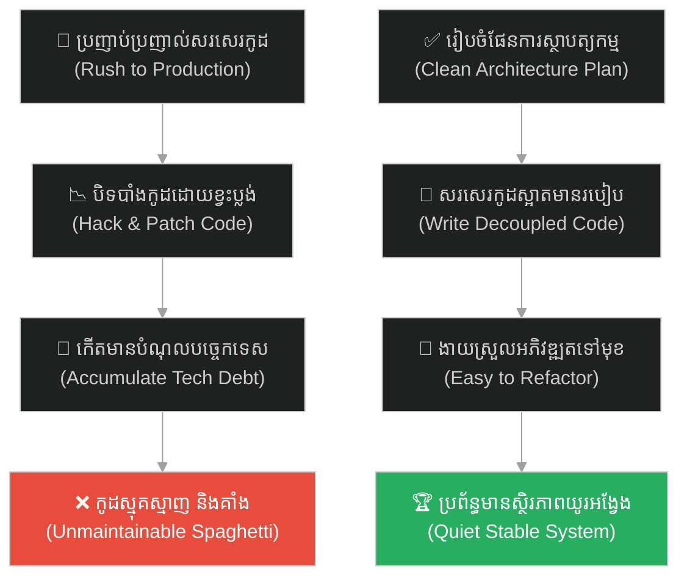
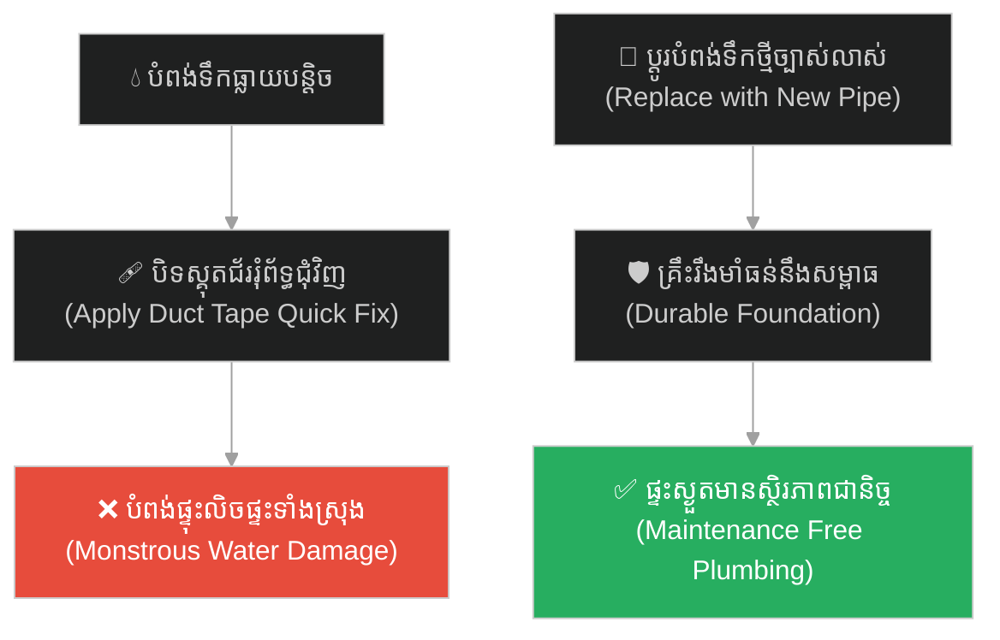
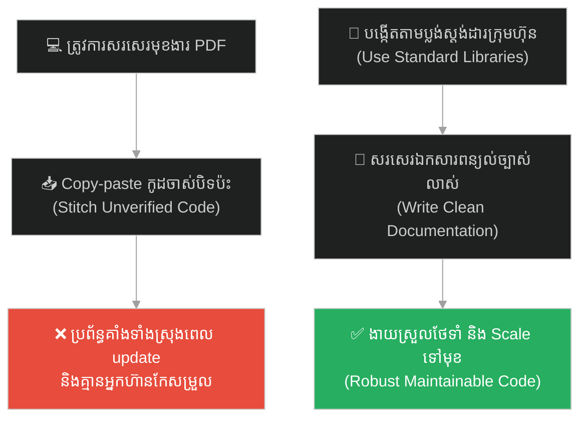
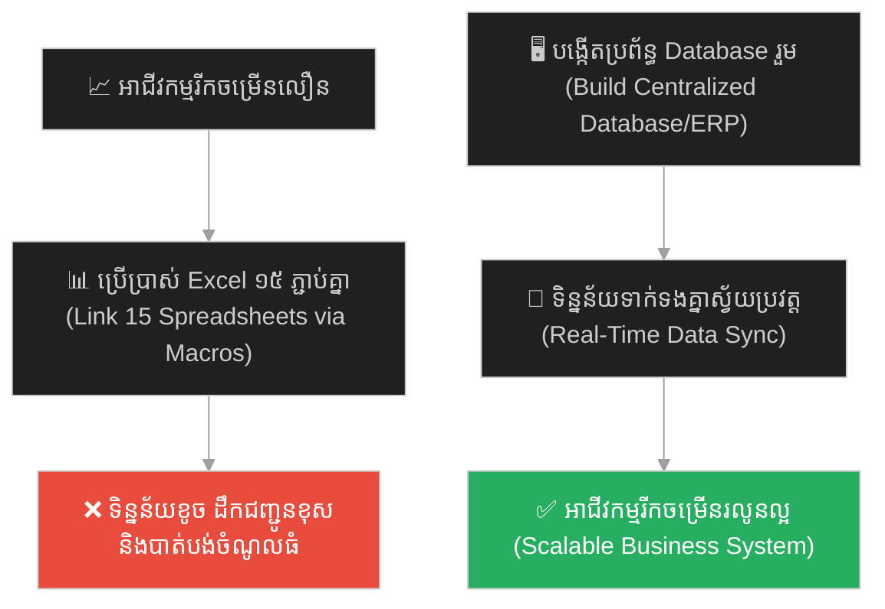
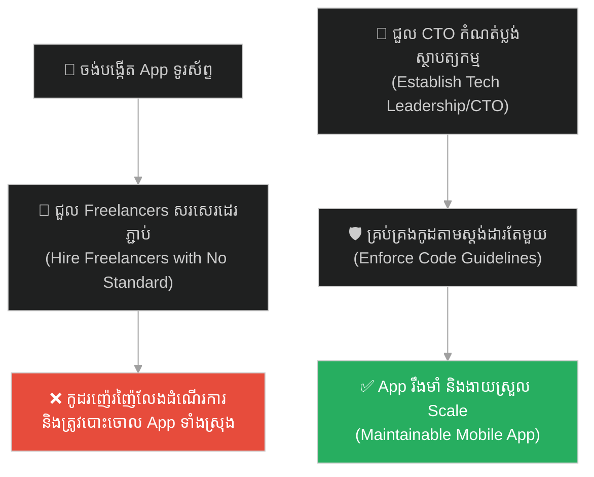
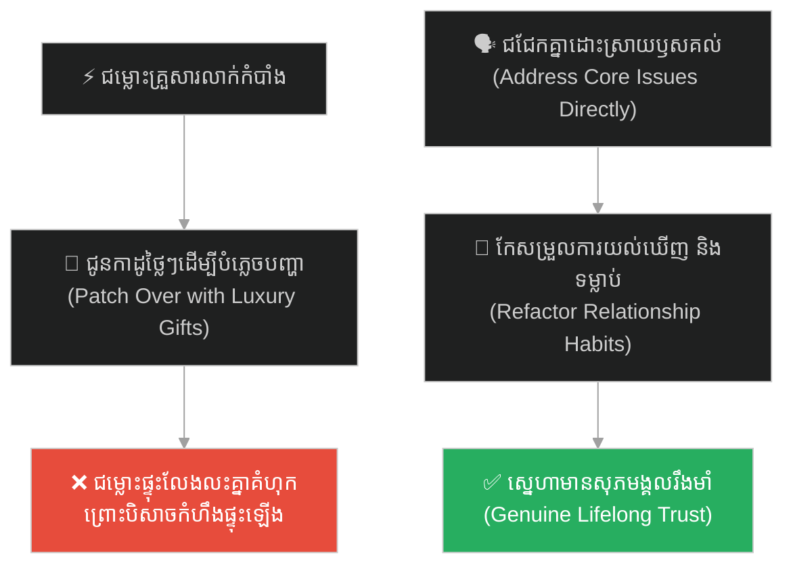
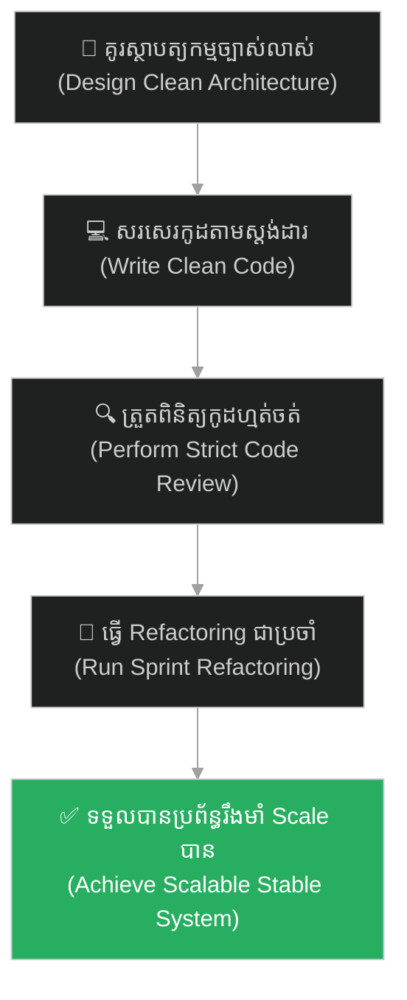

# Technical Debt (បំណុលបច្ចេកទេស)៖ ហ្វ្រែងខេនស្តែន និងបិសាចនៃកូដរញ៉េរញ៉ៃ (Technical Debt & Frankenstein's Spaghetti Code Monster)

**Author:** ichamrong  
**Date:** 2026-05-27  
**Tags:** #frankenstein #legacy-code #tech-debt #refactoring #clean-code #spaghetti-code #parable  
**Category:** Concepts / Parables  
**Read Time:** ~15 min  

---

## 📌 មាតិកា (Table of Contents)
- [អន្ទាក់ផ្លូវចិត្ត (The Trap)](#0)
- [១. រឿងព្រេងប្រវត្តិសាស្ត្រ៖ វេជ្ជបណ្ឌិតហ្វ្រែងខេនស្តែន និងការសាងសង់សាកសពដេរភ្ជាប់ (The Legend of Victor Frankenstein's Creation)](#1)
  - [បិសាចក្រោកពីស្លាប់ និងការបំផ្លាញអ្នកបង្កើត (The Monster's Revenge)](#1-1)
- [២. បញ្ហា៖ ជំងឺបំណុលបច្ចេកទេស និងកូដខ្មោចមិនស្តាប់បញ្ជា (The Issue: Technical Debt Accumulation & Spaghetti Code)](#2)
- [៣. ឧទាហរណ៍ជាក់ស្តែងក្នុងពិភពពិត (Real World Examples)](#3)
  - [ឧទាហរណ៍ទី ១ — កម្រិតស្រាល (គ្រួសារ)៖ ការបិតរុំស្គុតលើបំពង់ទឹកចាស់ដែលលេចធ្លាយ (The Quick Tape Pipe Fix)](#3-1)
  - [ឧទាហរណ៍ទី ២ — កម្រិតមធ្យម (បច្ចេកទេស)៖ ការចម្លងកូដរញ៉េរញ៉ៃពី Stack Overflow ដោយខ្វះស្ថាបត្យកម្ម (The Stack Overflow Stitching)](#3-2)
  - [ឧទាហរណ៍ទី ៣ — កម្រិតមធ្យម (ធុរកិច្ច)៖ ការប្រើប្រាស់ Spreadsheet ១៥ ផ្សេងគ្នាដើម្បីគ្រប់គ្រងទិន្នន័យ (The Frankenstein Spreadsheet Hell)](#3-3)
  - [ឧទាហរណ៍ទី ៤ — កម្រិតមធ្យម (សង្គម/គ្រប់គ្រង)៖ ការជួលអ្នកបណ្តោះអាសន្នផ្សេងៗសរសេរកូដដោយគ្មានស្តង់ដារ (The Segmented Freelancer Trap)](#3-4)
  - [ឧទាហរណ៍ទី ៥ — កម្រិតធ្ងន់ (ទំនាក់ទំនង)៖ ការបិទបាំងជម្លោះស្នូលដោយការជូនកាដូដោះស្រាយលើផ្ទៃក្រៅ (Patching Cracks with Gifts)](#3-5)
- [៤. ដំណោះស្រាយទូទៅ៖ ការធ្វើ Refactoring ជាប្រចាំ និងការកំណត់គុណភាពកូដ (The General Solution: Regular Refactoring & Architecture Guardrails)](#4)
- [សេចក្តីសន្និដ្ឋាន (Conclusion)](#5)
- [ឯកសារយោង (References)](#6)
- [Related Posts](#7)

---

## អន្ទាក់ផ្លូវចិត្ត (The Trap)

តើអ្នកធ្លាប់ជួបស្ថានភាពដែលប្រព័ន្ធការងាររបស់អ្នក ត្រូវបានសាងសង់ឡើងយ៉ាងប្រញាប់ប្រញាល់ដោយការប្រើប្រាស់វិធីសាស្ត្របណ្តោះអាសន្ន បិទបាំងកំហុស និងដេរភ្ជាប់គ្នារវាងផ្នែកចាស់ៗយ៉ាងរញ៉េរញ៉ៃ ដែលចុងក្រោយវាបានប្រែក្លាយទៅជា "បិសាចបច្ចេកទេស" ដ៏ធំ ពិបាកនឹងកែប្រែ និងគាំងរាល់ពេលដែលអ្នកចង់បន្ថែមមុខងារថ្មីដែរឬទេ?

នៅក្នុងវិស្វកម្ម និងការគ្រប់គ្រង៖
* **យើងងាយនឹងសម្រេចចិត្តដើរផ្លូវកាត់** (Take shortcuts) ដើម្បីបញ្ចេញផលិតផលឱ្យបានលឿនបំផុត (Speed over Quality)។
* **We ignore** ការពិតដែលថា រាល់កូដអាក្រក់ដែលយើងបានសរសេរនៅថ្ងៃនេះ គឺជាបំណុលបច្ចេកទេស (Tech Debt) ដែលនឹងត្រូវសងត្រឡប់មកវិញដោយការចំណាយពេលវេលា និងថវិកាទ្វេដងនាពេលអនាគត។

ការបណ្តោយឱ្យការសរសេរកូដខ្វះស្ថាបត្យកម្មច្បាស់លាស់ បង្កើតជាបិសាចមិនអាចគ្រប់គ្រងបាន ហៅថា **អន្ទាក់ Technical Debt (លម្អៀងបំណុលបច្ចេកទេស)**។

ដើម្បីយល់ដឹងពីវិធីកសាងប្រព័ន្ធដែលមានស្ថិរភាព និងការគ្រប់គ្រងបំណុលបច្ចេកទេស នេះជាផែនទីបង្ហាញផ្លូវសម្រាប់អត្ថបទនេះ៖
1. **រឿងព្រេងប្រវត្តិសាស្ត្រ (The Historic Legend)** — រឿងរ៉ាវរបស់វេជ្ជបណ្ឌិត ហ្វ្រែងខេនស្តែន ដែលបានដេរភ្ជាប់សាកសពដើម្បីបង្កើតជីវិតលឿន រហូតត្រូវបិសាចនោះត្រឡប់មកបំផ្លាញជីវិតខ្លួនវិញ។
2. **បញ្ហា (The Issue)** — តើអ្វីទៅជា Spaghetti Code និងបំណុលបច្ចេកទេស (Tech Debt) ក្នុងគម្រោងព័ត៌មានវិទ្យា?
3. **ឧទាហរណ៍ជាក់ស្តែងក្នុងពិភពពិត (Real World Examples)** — ពិនិត្យមើលគ្រោះថ្នាក់នៃបំណុលនេះក្នុងកម្រិតគ្រួសារ ព័ត៌មានវិទ្យា ធុរកិច្ច ការគ្រប់គ្រង និងទំនាក់ទំនង។
4. **ដំណោះស្រាយទូទៅ (The General Solution)** — ការអនុវត្តយុទ្ធសាស្ត្រ Refactoring ជារៀងរាល់ Sprint និងការកំណត់គុណភាពកូដ (Definition of Done)។

---

## ១. រឿងព្រេងប្រវត្តិសាស្ត្រ៖ វេជ្ជបណ្ឌិតហ្វ្រែងខេនស្តែន និងការសាងសង់សាកសពដេរភ្ជាប់ (The Legend of Victor Frankenstein's Creation)

នៅក្នុងប្រលោមលោកបុរាណ វេជ្ជបណ្ឌិតវ័យក្មេងដ៏ឆ្លាតវៃម្នាក់ឈ្មោះ **វ៉ិចទ័រ ហ្វ្រែងខេនស្តែន (Victor Frankenstein)** មានមហិច្ឆតាដ៏ធំធេងមួយ គឺចង់បង្កើតជីវិតមនុស្សថ្មីមួយឡើងវិញចេញពីសេចក្តីស្លាប់។ គាត់ចង់ឱ្យពិភពលោកកោតសរសើរ និងចង់បានលទ្ធផលលឿនបំផុត។

ដើម្បីសន្សំពេលវេលា និងកាត់បន្ថយការងារលំបាកក្នុងការបង្កើតជាកោសិកា ឬសរីរាង្គតូចៗតាំងពីដំបូង គាត់បានសម្រេចចិត្ត "ដើរផ្លូវកាត់ដ៏ងាយស្រួល (Take a shortcut)"។ គាត់បានធ្វើដំណើរទៅកាន់ទីសក្ការៈបូជា និងកន្លែងផ្ទុកសាកសពនានា ដើម្បីជីកកកាយ និងកាត់យកគ្រឿងបន្លាស់សាកសពដែលនៅសេសសល់៖ យកដៃរបស់អ្នកនេះ យកជើងរបស់អ្នកនោះ យកស្បែករបស់អ្នកផ្សេង និងបេះដូងរបស់សាកសពម្នាក់ទៀត។ 

គាត់បានយកផ្នែកផ្សេងៗគ្នានៃសាកសពចាស់ៗទាំងនោះ មកដេរភ្ជាប់គ្នា (Stitched together) ដើម្បីបង្កើតជារូបរាងកាយដ៏ធំមួយ។ គាត់ខ្វល់តែរឿងមួយគត់ គឺធ្វើឱ្យសរសៃប្រសាទភ្ជាប់គ្នាដើម្បីឱ្យវាអាចមានចលនាបាន (Make it work) ដោយមិនបានគិតគូរពីប្លង់ស្ថាបត្យកម្ម សោភ័ណភាព ឬប្រព័ន្ធការពាររយៈពេលវែងអ្វីឡើយ។

---

### បិសាចក្រោកពីស្លាប់ និងការបំផ្លាញអ្នកបង្កើត (The Monster's Revenge)

នៅយប់ដែលមានភ្លៀងផ្គររន្ទះខ្លាំង ហ្វ្រែងខេនស្តែនបានបញ្ជូនចរន្តអគ្គិសនីដ៏ខ្លាំងក្លាចូលទៅក្នុងរូបកាយនោះ។ ស្រាប់តែភ្នែកពណ៌លឿងរបស់វាបានបើកឡើង។ រូបកាយនោះមានចលនា និងមានជីវិត។ វាដំណើរការហើយ!

ប៉ុន្តែ នៅពេលដែលគាត់បានឃើញលទ្ធផលផ្ទាល់ភ្នែក ហ្វ្រែងខេនស្តែនមានការតក់ស្លុត និងភ័យរន្ធត់ជាខ្លាំង។ រូបកាយដែលដេរភ្ជាប់គ្នានោះ មានរូបរាងអាក្រក់ខ្លាំង គួរឱ្យខ្ពើមរអើម និងមានកម្លាំងខ្លាំងក្លាដែលមិនស្តាប់តាមការបញ្ជារបស់គាត់ឡើយ។ វាលែងជាមនុស្សដែលគាត់ចង់បានហើយ គឺវាបានប្រែក្លាយទៅជា **«បិសាចដ៏គ្រោះថ្នាក់ (A monster out of control)»**។ ដោយសារតែភាពភ័យខ្លាចខ្លាំង ហ្វ្រែងខេនស្តែនក៏បានរត់គេចខ្លួនចោលបន្ទប់ពិសោធន៍ និងបោះបង់ចោលស្នាដៃរបស់ខ្លួន។

បិសាចដែលខ្វះការថែទាំ និងមានរូបរាងអាក្រក់អាក្រៃ បានដើរលតោលតេដោយមានការឈឺចាប់ និងខឹងសម្បារយ៉ាងខ្លាំងនឹងអ្នកបង្កើតរបស់ខ្លួន។ វាបានតាមប្រមាញ់ហ្វ្រែងខេនស្តែនជានិច្ច ដើម្បីសងសឹក។ វាបានសម្លាប់មិត្តភក្តិ ដៃគូជីវិត និងសមាជិកគ្រួសាររបស់ហ្វ្រែងខេនស្តែនម្តងម្នាក់ៗ រហូតដល់ធ្វើឱ្យជីវិតរបស់ហ្វ្រែងខេនស្តែនត្រូវវិនាសសាបសូន្យ និងស្លាប់នៅក្នុងដែនដីទឹកកកដ៏ត្រជាក់។ ហ្វ្រែងខេនស្តែនត្រូវបានបំផ្លាញជីវិតទាំងស្រុង មិនមែនដោយសារអ្នកដទៃឡើយ គឺដោយសារតែ "ស្នាដៃដែលខ្លួនឯងដេរភ្ជាប់ដោយប្រញាប់ប្រញាល់" នោះឯង។

---

## ២. បញ្ហា៖ ជំងឺបំណុលបច្ចេកទេស និងកូដខ្មោចមិនស្តាប់បញ្ជា (The Issue: Technical Debt Accumulation & Spaghetti Code)

នៅក្នុងពិភពវិស្វកម្មសូហ្វវែរ (Software Engineering) បំណុលបច្ចេកទេស **Technical Debt** គឺជាបិសាចហ្វ្រែងខេនស្តែនពិតប្រាកដ៖

* **ការដេរភ្ជាប់កូដស្លាប់ (Stitching Dead Code)៖** នៅពេលដែលក្រុមការងារត្រូវបង្ខំឱ្យបញ្ចេញមុខងារថ្មីឱ្យទាន់ Deadline បុគ្គលិកងាយនឹងដើរផ្លូវកាត់ ដោយការ Copy-paste កូដចាស់ៗ យកបណ្ណាល័យក្រៅមកដេរភ្ជាប់គ្នាដោយខ្វះការរចនា (Hack and Patch) ដើម្បីឱ្យតែកម្មវិធី "ដើរ" បានសិន។
* **បិសាចកូដរញ៉េរញ៉ៃ (The Spaghetti Monster)៖** ដំបូងឡើយ កម្មវិធីដំណើរការបានធម្មតា ( make it work)។ ប៉ុន្តែពេលប្រព័ន្ធកាន់តែធំ កូដបិទប៉ះទាំងនោះក្លាយជាកូដដែលគ្មាននរណាម្នាក់យល់ ឬហ៊ានប៉ះពាល់ (Zombie Code)។ នៅពេលអ្នកចង់កែសម្រួល ឬបន្ថែមមុខងារតូចមួយ ប្រព័ន្ធទាំងមូលនឹងរងការប៉ះពាល់ និងគាំងទាំងស្រុង (Spaghetti dependency crash)។
* **ការរត់គេចខ្លួនរបស់វិស្វករ (Developer Flight)៖** ដូចជាហ្វ្រែងខេនស្តែនរត់ចោលបិសាច។ វិស្វករថ្មីៗដែលចូលមកកាន់គម្រោង នឹងមានភាពភ័យខ្លាចខ្លាំងនឹងកូដរញ៉េរញ៉ៃទាំងនោះ ពួកគេនឹងសម្រេចចិត្តលាលែងពីការងារចោល ព្រោះមិនចង់ចំណាយពេលជួសជុលកូដដែលគ្មានប្លង់ស្ថាបត្យកម្មច្បាស់លាស់។
* **ការសងសឹករបស់បំណុលបច្ចេកទេស៖** ទីបំផុត ក្រុមហ៊ុនត្រូវចំណាយពេល ៨០% នៃម៉ោងការងារដើម្បីគ្រាន់តែជួសជុល Bugs និងមិនអាចបញ្ចេញមុខងារថ្មីបានទៀតឡើយ។ គូប្រជែងនឹងយកឈ្នះ ហើយក្រុមហ៊ុននឹងដួលរលំ ព្រោះតែបិសាចកូដដែលខ្លួនឯងបានសាងសង់ឡើង។

---

## ៣. ឧទាហរណ៍ជាក់ស្តែងក្នុងពិភពពិត

ដើម្បីយល់ដឹងឱ្យកាន់តែច្បាស់ នេះជាការវិភាគលើឧទាហរណ៍ ៥ កម្រិតផ្សេងគ្នា៖

---

### ឧទាហរណ៍ទី ១ — កម្រិតស្រាល (គ្រួសារ)៖ ការបិតរុំស្គុតលើបំពង់ទឹកចាស់ដែលលេចធ្លាយ (The Quick Tape Pipe Fix)

**ស្ថានភាព៖** បំពង់ទឹកស្ពាន់នៅក្រោមកន្លែងលាងចានក្នុងផ្ទះចាប់ផ្តើមធ្លាយទឹកបន្តិចម្តងៗ។

* **ជម្រើសខុស (Hack and Patch)៖** ជំនួសឱ្យការជួលជាងមកប្តូរបំពង់ថ្មី ឬបិទផ្សារឱ្យបានត្រឹមត្រូវ ម្ចាស់ផ្ទះបានយកស្គុតជ័រ (Duct Tape) មកបិទរុំព័ទ្ធជុំវិញបំពង់ដែលធ្លាយនោះជាច្រើនជាន់ដើម្បីឱ្យវាឈប់លេចបណ្តោះអាសន្ន។
* **លទ្ធផល៖** បីខែក្រោយមក នៅពេលសម្ពាធទឹកឡើងខ្ពស់ បំពង់ទឹកនោះបានផ្ទុះបែកទាំងស្រុងនៅពាក់កណ្តាលអធ្រាត្រ បង្កឱ្យទឹកលិចផ្ទះ ខូចខាតកម្រាលឈើ និងគ្រឿងសង្ហារិមរាប់ពាន់ដុល្លារ។
* **ជម្រើសត្រូវ (Clean Architecture)៖** ឆ្លៀតពេលបិទវ៉ាល់ទឹក រួចទិញបំពង់ទឹកថ្មីមកប្តូរជំនួស ឬជួលជាងជំនាញមកផ្សារភ្ជាប់គ្រឹះឱ្យបានរឹងមាំល្អ។ បំពង់ទឹកដំណើរការបានរាប់ឆ្នាំដោយគ្មានការលេចធ្លាយ។

---

### ឧទាហរណ៍ទី ២ — កម្រិតមធ្យម (បច្ចេកទេស)៖ ការចម្លងកូដរញ៉េរញ៉ៃពី Stack Overflow ដោយខ្វះស្ថាបត្យកម្ម (The Stack Overflow Stitching)

**ស្ថានភាព៖** វិស្វករម្នាក់ត្រូវការបង្កើតមុខងារដោនឡូតឯកសារជា PDF។

* **ជម្រើសខុស៖** ចម្លងកូដផ្សេងៗគ្នាពី Stack Overflow យកបណ្ណាល័យចាស់ៗដែលលែងមានការអភិវឌ្ឍមកដេរភ្ជាប់គ្នា រួចសរសេរកូដកែសម្រួលលក្ខខណ្ឌ (Hardcode variables) ដើម្បីឱ្យវាដំណើរការទាន់ថ្ងៃនេះ។
* **លទ្ធផល៖** មុខងារ PDF ដើរពិតមែន ប៉ុន្តែក្រោយមកនៅពេលប្រព័ន្ធត្រូវប្តូរទៅប្រើ Node.js Version ថ្មី កូដដេរភ្ជាប់នោះលែងគាំទ្រ (Compatible) ធ្វើឱ្យប្រព័ន្ធទាំងមូលគាំង។ គ្មាននរណាម្នាក់ក្នុងក្រុមយល់ពីរបៀបជួសជុលកូដនោះឡើយ ព្រោះវាគ្មានការកត់ត្រា (No documentation)។
* **ជម្រើសត្រូវ៖** សរសេរមុខងារដោយប្រើប្រាស់បណ្ណាល័យផ្លូវការ ដែលមានស្ថិរភាព និងរៀបចំរចនាសម្ព័ន្ធកូដច្បាស់លាស់តាមស្ថាបត្យកម្មរបស់គម្រោង (Clean Code standard)។ នៅពេលមានការ Update មុខងារនៅតែដំណើរការធម្មតា។

---

### ឧទាហរណ៍ទី ៣ — កម្រិតមធ្យម (ធុរកិច្ច)៖ ការប្រើប្រាស់ Spreadsheet ១៥ ផ្សេងគ្នាដើម្បីគ្រប់គ្រងទិន្នន័យ (The Frankenstein Spreadsheet Hell)

**ស្ថានភាព៖** ក្រុមហ៊ុនលក់ទំនិញអនឡាញមួយរីកចម្រើនលឿនខ្លាំង។

* **ជម្រើសខុស៖** ជំនួសឱ្យការវិនិយោគលើប្រព័ន្ធគ្រប់គ្រងទិន្នន័យរួម (ERP/CRM Database) ពួកគេបានបង្កើតឯកសារ Excel ឬ Google Sheets ចំនួន ១៥ ផ្សេងគ្នាដើម្បីកត់ត្រាទិន្នន័យ (ដូចជា Sheet លក់ទំនិញ Sheet ដឹកជញ្ជូន Sheet គណនេយ្យ) រួចដេរភ្ជាប់គ្នាដោយប្រើប្រាស់រូបមន្តស្មុគស្មាញ (VLOOKUP, Macros)។
* **លទ្ធផល៖** នៅពេលទិន្នន័យកើនឡើងដល់រាប់ម៉ឺនជួរ ឯកសារ Sheets ដំណើរការយឺតខ្លាំង ជារឿយៗរូបមន្តត្រូវខូចខាត (formula error) បង្កឱ្យទិន្នន័យលក់ និងដឹកជញ្ជូនមិនស៊ីគ្នា ភ្ញៀវខឹងសម្បារព្រោះដឹកទំនិញខុស ហើយក្រុមហ៊ុនខាតបង់ចំណូលធំ។
* **ជម្រើសត្រូវ៖** វិនិយោគពេលវេលា និងថវិកាតាំងពីដំបូង ដើម្បីសាងសង់ប្រព័ន្ធ Database រួមមួយដែលមានសុវត្ថិភាព និងស្ថិរភាពខ្ពស់។ ទិន្នន័យទាំងអស់ត្រូវគ្នាល្អឥតខ្ចោះ ងាយស្រួលគ្រប់គ្រង និងរីកចម្រើនបានលឿន។

---

### ឧទាហរណ៍ទី ៤ — កម្រិតមធ្យម (សង្គម/គ្រប់គ្រង)៖ ការជួលអ្នកបណ្តោះអាសន្នផ្សេងៗសរសេរកូដដោយគ្មានស្តង់ដារ (The Segmented Freelancer Trap)

**ស្ថានភាព៖** ក្រុមហ៊ុនមួយចង់បង្កើតកម្មវិធីទូរស័ព្ទ ប៉ុន្តែមិនចង់ជួលក្រុមវិស្វករអចិន្ត្រៃយ៍។

* **ជម្រើសខុស៖** ជួល Freelancer ម្នាក់មកសរសេរផ្នែកទី ១ រួចជួល Freelancer ទីពីរមកសរសេរផ្នែកទី ២ និងជួល Freelancer ទីបីមកដេរភ្ជាប់គ្នា ដោយគ្មានការកំណត់ស្តង់ដារកូដ (Code Standard) ឬការត្រួតពិនិត្យស្ថាបត្យកម្មរួម។
* **លទ្ធផល៖** កម្មវិធីលេចចេញរូបរាងឡើង ប៉ុន្តែវាជាបំណែកកូដរញ៉េរញ៉ៃ ប្រើប្រាស់បច្ចេកវិទ្យាខុសគ្នាខ្លាំង (Frankenstein App)។ នៅពេល Freelancers ទាំងនោះបញ្ចប់កិច្ចសន្យា គ្មាននរណាម្នាក់អាចថែរក្សា ឬអភិវឌ្ឍកម្មវិធីនោះបន្តបានឡើយ ក្រុមហ៊ុនត្រូវបង្ខំចិត្តបោះចោល និងសរសេរឡើងវិញពីសូន្យ។
* **ជម្រើសត្រូវ៖** ជួលអ្នកដឹកនាំបច្ចេកវិទ្យា (Software Architect/CTO) ម្នាក់ជាស្នូល ដើម្បីកំណត់ស្ថាបត្យកម្ម និងត្រួតពិនិត្យរាល់កូដដែល Freelancers សរសេរឱ្យស្របតាមស្តង់ដារតែមួយ តាំងពីដំបូងដល់ចប់។

---

### ឧទាហរណ៍ទី ៥ — កម្រិតធ្ងន់ (ទំនាក់ទំនង)៖ ការបិទបាំងជម្លោះស្នូលដោយការជូនកាដូដោះស្រាយលើផ្ទៃក្រៅ (Patching Cracks with Gifts)

**ស្ថានភាព៖** ប្តីប្រពន្ធមានបញ្ហាខ្វែងគំនិតគ្នាយ៉ាងខ្លាំងអំពីរបៀបគ្រប់គ្រងលុយកាក់ និងអនាគតគ្រួសារ។

* **ជម្រើសខុស (Hack and Patch)៖** ជៀសវាងការនិយាយគ្នាត្រង់ៗដើម្បីដោះស្រាយវិបត្តិស្នូល ប៉ុន្តែប្រើប្រាស់វិធីសាស្ត្រ "បិទផ្សារបណ្តោះអាសន្ន" ដោយការជូនកាដូថ្លៃៗ នាំគ្នាទៅដើរលេង ឬធ្វើពុតជាសប្បាយរីករាយដើម្បីបំភ្លេចបញ្ហាមួយពេល។
* **លទ្ធផល៖** ការមិនពេញចិត្ត និងកំហឹងលាក់កំបាំង (Resentment) កាន់តែកើនឡើង និងកកកុញដូចជាបិសាចលាក់ខ្លួន។ ថ្ងៃមួយ បញ្ហាតូចមួយស្រាប់តែផ្ទុះឡើង ធ្វើឱ្យពួកគេឈ្លោះប្រកែកគ្នាខ្លាំងបំផុត និងឈានដល់ការលែងលះគ្នាភ្លាមៗទាំងកំហឹងដែលមិនអាចកែប្រែបាន។
* **ជម្រើសត្រូវ (Refactoring Relationship)៖** ហ៊ានប្រឈមមុខនឹងបញ្ហាស្នូលភ្លាមៗ។ អង្គុយជជែកគ្នាដោយត្រង់ សោកស្តាយចំពោះកំហុស និងកែសម្រួលទម្លាប់រស់នៅ និងការគ្រប់គ្រងហិរញ្ញវត្ថុគ្រួសារឡើងវិញឱ្យបានច្បាស់លាស់។ ទំនាក់ទំនងរឹងមាំពិតប្រាកដ។

---

## ៤. ដំណោះស្រាយទូទៅ៖ ការធ្វើ Refactoring ជាប្រចាំ និងការកំណត់គុណភាពកូដ (The General Solution: Regular Refactoring & Architecture Guardrails)

ដើម្បីការពារប្រព័ន្ធការងារ និងកូដរបស់អ្នកពីការក្លាយជាបិសាចហ្វ្រែងខេនស្តែន ត្រូវអនុវត្តវិធីសាស្ត្រគន្លឹះទាំងនេះ៖

### ១. កំណត់គោលការណ៍គុណភាពការងារ (Definition of Done - DoD)
* កុំអនុញ្ញាតឱ្យបញ្ចេញកូដ ឬការងារណាដែលគ្រាន់តែ "ដើរ" (Just works) នោះឡើយ។
* កូដត្រូវតែឆ្លងកាត់ការពិនិត្យ (Code Review) ពីសមាជិកផ្សេងទៀត ត្រូវមាន Unit Tests គ្រប់គ្រាន់ និងត្រូវគោរពតាមប្លង់ស្ថាបត្យកម្មដែលបានកំណត់ ទើបអនុញ្ញាតឱ្យបញ្ចេញ (Deploy) បាន។

### ២. វិនិយោគលើការ Refactoring ជាប្រចាំ (Pay Back Tech Debt)
* នៅក្នុងរាល់វដ្តនៃការងារ (Sprint) ត្រូវបែងចែកពេលវេលាពី ១០% ទៅ ២០% សម្រាប់តែការជួសជុល និងសម្អាតកូដចាស់ៗ (Refactoring) និងការកាត់បន្ថយបំណុលបច្ចេកទេស។ កុំផ្តោតតែលើការបន្ថែមមុខងារថ្មីជានិច្ច។

### ៣. រៀបចំប្លង់ស្ថាបត្យកម្មមុនសរសេរកូដ (Design First, Code Later)
* មុននឹងចាប់ផ្តើមសរសេរកូដ ត្រូវចំណាយពេលគូរ និងរៀបចំប្លង់ស្ថាបត្យកម្ម (Architecture Diagram) ឱ្យច្បាស់លាស់។ ត្រូវប្រាកដថាគ្រប់បំណែកកូដទាំងអស់ដឹងពីតួនាទីរបស់ខ្លួន និងមិនទាក់ទងគ្នាដោយរញ៉េរញ៉ៃ (Loose Coupling)។

---

## 🐇 ធ្លាក់ចូលក្នុងរន្ធទន្សាយយុទ្ធសាស្ត្រ (Enter the Strategic Rabbit Hole)

ដើម្បីស្វែងយល់បន្ថែមអំពីរបៀបដែលការបំបែកប្រព័ន្ធការងារ ឬគម្រោងដ៏ធំស្មុគស្មាញ ទៅជាបំណែកតូចៗ និងមានរចនាសម្ព័ន្ធសាមញ្ញតាំងពីដំបូង (Monolithic Architecture First) អាចជួយទប់ស្កាត់ការបែកបាក់ និងការិយាល័យធិបតេយ្យរវាងក្រុមការងារ សូមបន្តដំណើររុករករបស់អ្នក៖

* 🚀 **[ចាប់ផ្តើមដំណើររុករក (Start the Journey) ➔ Abraham Lincoln and A House Divided](./58-a-house-divided.md)**

---

## សេចក្តីសន្និដ្ឋាន (Conclusion)

> **«កូដដែលត្រូវបានសរសេរយ៉ាងលឿនដោយការបិទប៉ះ នឹងក្លាយជាបិសាចត្រឡប់មកបំផ្លាញអ្នកបង្កើតវិញជានិច្ច។ គ្មានផ្លូវកាត់ណាដែលនាំទៅរកភាពរឹងមាំយូរអង្វែងឡើយ។»**

ចូរមានវិន័យក្នុងការសរសេរកូដ និងការចាត់ចែងការងារឱ្យមានរបៀបរៀបរយ សម្អាតបំណុលបច្ចេកទេសជាប្រចាំ ដើម្បីកុំឱ្យបិសាចនៃកូដរញ៉េរញ៉ៃត្រឡប់មកលងបន្លាចអ្នក និងក្រុមការងាររបស់អ្នកនាពេលអនាគត។

---

## ឯកសារយោង (References)

* **Mary Shelley** — *Frankenstein* (1818)។ ប្រលោមលោកយោងអំពីគ្រោះថ្នាក់នៃការបង្កើតជីវិតដោយខ្វះការគ្រប់គ្រង និងទំនួលខុសត្រូវ។
* **Martin Fowler** — *Refactoring: Improving the Design of Existing Code* (1999)។ សៀវភៅគោលស្តីពីសិល្បៈនៃការ Refactor កូដដើម្បីកម្ចាត់បំណុលបច្ចេកទេស។
* **Robert C. Martin** — *Clean Code: A Handbook of Agile Software Craftsmanship* (2008)។ គោលការណ៍ណែនាំស្តីពីការសរសេរកូដឱ្យស្អាត ងាយអាន និងងាយស្រួលថែទាំ។

---

## Related Posts

* **[49 Frankenstein: Legacy Code and the Monster of Tech Debt](../articles/49-frankenstein-and-legacy-code.md)** — អត្ថបទគោលបកស្រាយពីរបៀបដោះស្រាយជាមួយ Spaghetti Code ដោយមិនឱ្យវាបំផ្លាញក្រុមហ៊ុន។
* **[44 Alexander the Great and the Gordian Knot](./44-the-gordian-knot.md)** — ការកាត់ផ្តាច់ភាពស្មុគស្មាញដោយប្រើវិធីសាស្ត្រ KISS។
* **[56 Apollo 11 and the 1202 Alarm: Graceful Degradation](./56-the-1202-alarm.md) — របៀបគ្រប់គ្រងប្រព័ន្ធឱ្យដំណើរការល្អកំឡុងពេលមានបញ្ហា overload។

---
*Last updated: 2026-05-27*

## Related

- [💡 Concepts README](../README.md)
- [📚 Main Repository README](../../../README.md)
- [Developer Habits](../../developer-habits/README.md)
- [Mental Health & Well-being](../../mental-health/README.md)
- [Management & SDLC](../../management/README.md)
